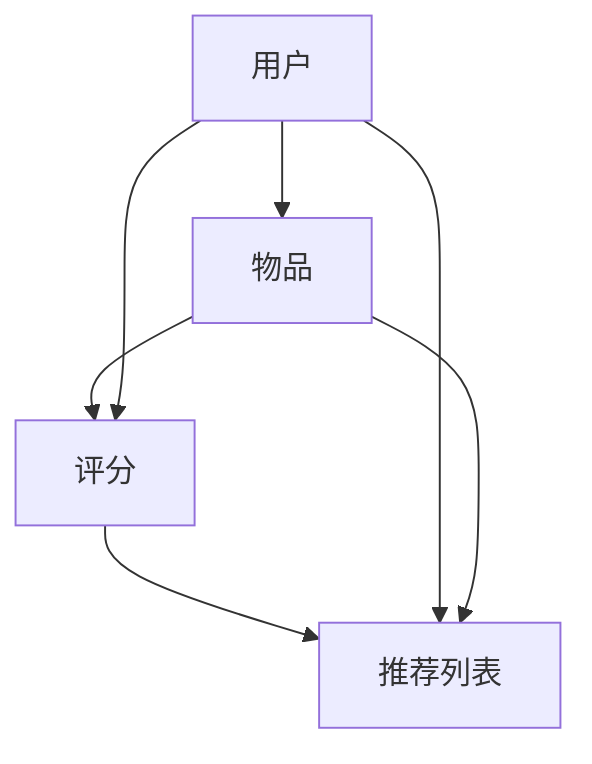

                 

# 个性化推荐系统的设计与实现

## 概述

个性化推荐系统是一种通过分析用户历史行为和兴趣，向用户提供个性化的推荐内容的技术。随着互联网的普及和大数据技术的成熟，个性化推荐系统在电子商务、社交媒体、新闻推送、视频点播等众多领域得到了广泛应用。

本文将从以下几个方面展开讨论：

1. **个性化推荐系统概述**：介绍推荐系统的发展历程、基本概念、应用领域和重要性。
2. **推荐系统的工作原理**：详细解析用户行为分析、物品属性分析和推荐算法的分类。
3. **个性化推荐算法**：深入探讨基于内容的推荐算法、协同过滤推荐算法、基于模型的推荐算法和混合推荐算法。
4. **推荐系统的评估与优化**：介绍推荐系统的评估指标、A/B测试、在线优化和冷启动问题。
5. **个性化推荐系统的设计与实现**：讲解推荐系统的设计流程、用户画像构建、商品画像构建和推荐策略制定。
6. **案例分析**：分析电商平台、视频平台和新闻网站的推荐系统实践。
7. **附录**：提供推荐系统常用的工具与框架以及参考资料。

通过本文的阅读，读者将能够全面了解个性化推荐系统的设计与实现过程，掌握相关算法和技术，并能够应用于实际项目开发中。

## 第一部分：引言与概述

### 第1章：个性化推荐系统概述

#### 1.1 推荐系统的发展历程

推荐系统最早可以追溯到20世纪90年代，起源于电子商务领域。早期的推荐系统主要是基于规则和关键词匹配的方法，如Amazon和Netflix等电商和视频平台采用这种方式来推荐商品和电影。随着互联网和大数据技术的发展，推荐系统逐渐从简单的规则匹配走向了更加复杂的算法模型。

在2000年初，协同过滤推荐算法逐渐成为主流。协同过滤算法通过分析用户的历史行为和评分数据，找出相似用户或相似物品，从而进行推荐。此时，Netflix Prize竞赛的推出进一步推动了协同过滤算法的研究和应用。

近年来，随着深度学习和自然语言处理技术的崛起，基于模型的推荐算法，如神经网络和决策树，逐渐崭露头角。这些算法能够更好地处理复杂的关系和用户行为，从而提供更准确的推荐结果。

#### 1.2 推荐系统的基本概念

推荐系统主要由以下几个核心概念组成：

1. **用户**：推荐系统的核心参与者，可以是个人或群体。
2. **物品**：用户可能感兴趣或需要的内容，如商品、新闻、音乐、视频等。
3. **评分**：用户对物品的评价或打分，可以是数值、等级或标签。
4. **推荐列表**：根据用户的兴趣和偏好，推荐系统生成的个性化内容列表。

推荐系统通过分析用户的历史行为和评分数据，利用各种算法和模型，从海量的物品中筛选出用户可能感兴趣的物品，形成推荐列表。

#### 1.3 推荐系统的应用领域

推荐系统在多个领域得到了广泛应用，主要包括：

1. **电子商务**：电商平台利用推荐系统向用户推荐商品，提高用户的购买转化率和满意度。
2. **社交媒体**：如Facebook、Instagram等社交平台利用推荐系统向用户推送感兴趣的内容和好友动态，增强用户粘性。
3. **新闻推送**：新闻网站和媒体平台利用推荐系统向用户推荐新闻，提升阅读量和用户参与度。
4. **视频点播**：如Netflix、YouTube等视频平台利用推荐系统向用户推荐视频，提高用户的观看时长和满意度。
5. **音乐推荐**：如Spotify、Apple Music等音乐平台利用推荐系统向用户推荐歌曲，提升用户的音乐体验。

#### 1.4 个性化推荐的重要性

个性化推荐系统在当今信息爆炸的时代具有重要的意义：

1. **提高用户满意度**：通过个性化推荐，用户能够更快地找到自己感兴趣的内容，提高用户体验和满意度。
2. **增加商业价值**：电商平台通过个性化推荐，能够提高销售转化率和用户留存率，从而增加商业价值。
3. **降低信息过载**：在信息爆炸的时代，个性化推荐能够帮助用户筛选出有价值的信息，降低信息过载。
4. **优化资源分配**：个性化推荐系统能够根据用户的需求和兴趣，优化内容资源的分配和利用。

### 第2章：推荐系统的工作原理

推荐系统的工作原理可以概括为以下几个关键步骤：

1. **数据收集**：收集用户的行为数据、评分数据和其他相关数据。
2. **用户画像构建**：通过对用户历史行为和偏好的分析，构建用户的兴趣模型。
3. **物品特征提取**：对物品进行特征提取，如文本、图像、音频等。
4. **算法选择与模型训练**：选择合适的推荐算法，并训练模型。
5. **推荐结果生成**：根据用户画像和物品特征，生成个性化的推荐列表。

#### 2.1 用户行为分析

用户行为分析是推荐系统的核心步骤之一。通过分析用户的行为数据，如浏览记录、购买历史、评论、评分等，可以构建用户的兴趣模型。常用的用户行为分析方法包括：

1. **行为序列分析**：分析用户的浏览和购买序列，找出用户的兴趣点和兴趣变化。
2. **隐语义分析**：通过自然语言处理技术，分析用户的评论和评价，提取用户的兴趣关键词和主题。
3. **基于标签的方法**：为用户打标签，通过标签相关性分析，找出用户的兴趣点。

#### 2.2 物品（商品）属性分析

物品属性分析是推荐系统的另一个重要步骤。通过对物品的特征进行提取和分析，可以为推荐算法提供重要的输入。常用的物品属性分析方法包括：

1. **文本特征提取**：利用自然语言处理技术，提取物品的标题、描述、标签等文本特征。
2. **图像特征提取**：利用计算机视觉技术，提取物品的图像特征，如颜色、纹理、形状等。
3. **音频特征提取**：利用音频处理技术，提取物品的音频特征，如音调、节奏、音色等。

#### 2.3 推荐算法的分类

推荐算法可以根据不同的分类标准进行划分，常见的分类方法包括：

1. **基于内容的推荐算法**：根据用户的兴趣和偏好，推荐与用户兴趣相关的物品。
2. **协同过滤推荐算法**：通过分析用户的历史行为和评分数据，找出相似用户或相似物品，进行推荐。
3. **基于模型的推荐算法**：利用机器学习算法，建立用户和物品之间的预测模型，进行推荐。
4. **混合推荐算法**：将多种推荐算法结合起来，取长补短，提高推荐效果。

#### 2.4 推荐系统的架构

推荐系统的架构可以分为以下几个关键模块：

1. **数据收集模块**：负责收集用户行为数据、物品属性数据等。
2. **数据预处理模块**：对收集到的数据进行清洗、转换和处理，为推荐算法提供高质量的输入。
3. **推荐算法模块**：选择合适的推荐算法，并训练模型。
4. **推荐结果生成模块**：根据用户画像和物品特征，生成个性化的推荐列表。
5. **推荐结果展示模块**：将推荐结果以用户友好的方式展示给用户。

### 第3章：个性化推荐算法

个性化推荐算法是推荐系统的核心组成部分，本文将详细介绍几种常见的个性化推荐算法，包括基于内容的推荐算法、协同过滤推荐算法、基于模型的推荐算法和混合推荐算法。

#### 第3章：基于内容的推荐算法

基于内容的推荐算法（Content-based Recommendation）是一种根据用户的历史行为和偏好，推荐与用户已喜欢物品内容相似的新物品的方法。这种方法的核心思想是“物以类聚，人以群分”。

##### 3.1 基于内容的推荐原理

基于内容的推荐原理主要包括以下几个步骤：

1. **用户兴趣建模**：通过分析用户的历史行为和偏好，提取用户的兴趣特征。这些特征可以是文本、图像、音频等。
2. **物品特征提取**：对物品进行特征提取，构建物品的特征向量。
3. **相似度计算**：计算用户兴趣特征与物品特征之间的相似度。
4. **推荐结果生成**：根据相似度计算结果，生成个性化的推荐列表。

##### 3.2 内容表示方法

基于内容的推荐算法的关键在于如何表示用户兴趣和物品特征。常用的内容表示方法包括：

1. **文本特征表示**：利用自然语言处理技术，提取文本的关键词、词频、TF-IDF等特征。
2. **图像特征表示**：利用计算机视觉技术，提取图像的边缘、纹理、颜色等特征。
3. **音频特征表示**：利用音频处理技术，提取音频的音调、节奏、音色等特征。

##### 3.3 基于内容的推荐系统实现

基于内容的推荐系统的实现主要包括以下几个步骤：

1. **数据预处理**：收集用户行为数据、物品属性数据等，并进行数据清洗和处理。
2. **用户兴趣建模**：分析用户的历史行为，提取用户的兴趣特征。
3. **物品特征提取**：对物品进行特征提取，构建物品的特征向量。
4. **相似度计算**：计算用户兴趣特征与物品特征之间的相似度。
5. **推荐结果生成**：根据相似度计算结果，生成个性化的推荐列表。

##### 3.4 基于内容的推荐算法优缺点分析

基于内容的推荐算法具有以下几个优缺点：

**优点**：

1. **解释性强**：用户可以清楚地了解到推荐结果的原因，提高了用户的信任度。
2. **对新用户友好**：对于新用户，可以基于用户输入的兴趣信息进行推荐，无需依赖历史行为数据。

**缺点**：

1. **冷启动问题**：对于新用户和新物品，由于缺乏历史数据，推荐效果较差。
2. **用户兴趣多样性**：用户的兴趣可能是多样化的，基于内容的推荐算法可能无法充分满足用户的多样性需求。

#### 第3章：协同过滤推荐算法

协同过滤推荐算法（Collaborative Filtering）是一种通过分析用户之间的相似性和物品之间的相关性进行推荐的方法。协同过滤算法可以分为两类：基于用户的协同过滤算法（User-based Collaborative Filtering）和基于物品的协同过滤算法（Item-based Collaborative Filtering）。

##### 3.1 协同过滤原理

协同过滤原理主要包括以下几个步骤：

1. **用户相似度计算**：计算用户之间的相似度，常用的相似度计算方法包括余弦相似度、皮尔逊相关系数等。
2. **物品相似度计算**：计算物品之间的相似度，常用的相似度计算方法包括Jaccard系数、余弦相似度等。
3. **推荐结果生成**：根据用户相似度和物品相似度，生成个性化的推荐列表。

##### 3.2 评分矩阵与用户相似度计算

评分矩阵是协同过滤算法的核心数据结构，它记录了用户对物品的评分数据。用户相似度计算是协同过滤算法的关键步骤，常用的用户相似度计算方法包括：

1. **余弦相似度**：计算用户之间夹角的余弦值，公式如下：
   \[ \text{similarity}(\text{user}_i, \text{user}_j) = \frac{\text{cos}(\theta_{ij})}{\|\text{user}_i\|\|\text{user}_j\|} \]
   其中，\( \theta_{ij} \) 是用户 \( \text{user}_i \) 和用户 \( \text{user}_j \) 之间的夹角，\( \|\text{user}_i\| \) 和 \( \|\text{user}_j\| \) 分别是用户 \( \text{user}_i \) 和用户 \( \text{user}_j \) 的特征向量模长。

2. **皮尔逊相关系数**：计算用户之间评分的相关性，公式如下：
   \[ \text{similarity}(\text{user}_i, \text{user}_j) = \frac{\sum_{k=1}^{n} (\text{rating}_{ik} - \bar{r}_i)(\text{rating}_{jk} - \bar{r}_j)}{\sqrt{\sum_{k=1}^{n} (\text{rating}_{ik} - \bar{r}_i)^2} \sqrt{\sum_{k=1}^{n} (\text{rating}_{jk} - \bar{r}_j)^2}} \]
   其中，\( \text{rating}_{ik} \) 是用户 \( \text{user}_i \) 对物品 \( k \) 的评分，\( \bar{r}_i \) 是用户 \( \text{user}_i \) 的平均评分。

##### 3.3 基于用户的协同过滤算法

基于用户的协同过滤算法（User-based Collaborative Filtering）的基本思想是找到与目标用户相似的其他用户，并推荐这些相似用户喜欢的物品。具体实现步骤如下：

1. **计算用户相似度**：计算目标用户与其他用户的相似度，可以使用余弦相似度或皮尔逊相关系数。
2. **选择相似用户**：根据相似度计算结果，选择相似度最高的若干用户作为相似用户。
3. **计算推荐评分**：对每个相似用户喜欢的物品，计算目标用户对物品的预测评分。
4. **生成推荐列表**：根据预测评分，生成个性化的推荐列表。

基于用户的协同过滤算法的优点是能够充分利用用户之间的相似性，提高推荐效果。缺点是计算复杂度高，尤其是当用户规模和物品规模较大时。

##### 3.4 基于物品的协同过滤算法

基于物品的协同过滤算法（Item-based Collaborative Filtering）的基本思想是找到与目标物品相似的其他物品，并推荐这些相似物品给用户。具体实现步骤如下：

1. **计算物品相似度**：计算目标物品与其他物品的相似度，可以使用Jaccard系数或余弦相似度。
2. **选择相似物品**：根据相似度计算结果，选择相似度最高的若干物品作为相似物品。
3. **计算推荐评分**：对每个相似物品，计算目标用户对物品的预测评分。
4. **生成推荐列表**：根据预测评分，生成个性化的推荐列表。

基于物品的协同过滤算法的优点是计算复杂度较低，适用于大规模推荐系统。缺点是可能会忽略用户之间的相似性，导致推荐效果较差。

##### 3.5 协同过滤算法的改进

协同过滤算法存在一些局限性，如冷启动问题、数据稀疏性和推荐结果多样性等问题。为了解决这些问题，研究人员提出了许多改进方法：

1. **矩阵分解**：通过矩阵分解技术，将用户-物品评分矩阵分解为用户特征矩阵和物品特征矩阵，从而提高推荐效果。
2. **基于模型的协同过滤**：利用机器学习算法，如线性回归、决策树、神经网络等，建立用户和物品之间的预测模型，从而提高推荐效果。
3. **混合推荐算法**：将协同过滤算法与其他推荐算法（如基于内容的推荐算法、基于模型的推荐算法等）结合起来，取长补短，提高推荐效果。

#### 第3章：基于模型的推荐算法

基于模型的推荐算法（Model-based Recommendation）是一种利用机器学习算法建立用户和物品之间的预测模型，从而进行推荐的方法。这种方法能够更好地处理复杂的关系和用户行为，从而提供更准确的推荐结果。

##### 3.1 机器学习推荐算法概述

机器学习推荐算法主要包括以下几种：

1. **线性回归**：通过线性回归模型，建立用户和物品之间的预测关系。
2. **决策树与随机森林**：通过决策树和随机森林模型，进行特征选择和分类。
3. **支持向量机**：通过支持向量机模型，进行特征选择和分类。
4. **神经网络**：通过神经网络模型，进行特征选择和分类。
5. **深度学习**：通过深度学习模型，进行特征选择和分类。

##### 3.2 决策树与随机森林推荐算法

决策树与随机森林推荐算法是常见的基于模型的推荐算法，具有以下特点：

1. **决策树**：通过递归划分特征空间，构建决策树模型，从而进行分类或回归。
2. **随机森林**：通过随机选取特征和样本子集，构建多棵决策树，并进行集成学习。

##### 3.3 支持向量机推荐算法

支持向量机推荐算法是一种基于最大间隔的分类算法，通过将特征空间映射到高维空间，找到最佳分类超平面。

##### 3.4 神经网络推荐算法

神经网络推荐算法是一种基于深度学习的分类算法，通过多层神经网络进行特征提取和分类。

##### 3.5 深度学习推荐算法

深度学习推荐算法是一种基于深度学习的分类算法，通过多层神经网络进行特征提取和分类。

### 第4章：混合推荐算法

混合推荐算法（Hybrid Recommendation）是一种将多种推荐算法相结合的方法，通过取长补短，提高推荐效果。混合推荐算法可以分为基于模型的混合推荐算法和基于协同过滤的混合推荐算法。

##### 4.1 混合推荐算法原理

混合推荐算法的基本原理是将不同类型的推荐算法（如基于内容的推荐算法、协同过滤推荐算法、基于模型的推荐算法等）结合起来，利用各自的优点，弥补各自的不足，从而提高推荐效果。

##### 4.2 基于模型的混合推荐算法

基于模型的混合推荐算法是将基于内容的推荐算法、协同过滤推荐算法和基于模型的推荐算法相结合，通过整合不同算法的优势，提高推荐效果。

##### 4.3 基于协同过滤的混合推荐算法

基于协同过滤的混合推荐算法是将协同过滤算法与其他推荐算法（如基于内容的推荐算法、基于模型的推荐算法等）相结合，通过整合不同算法的优势，提高推荐效果。

##### 4.4 混合推荐算法的实现与优化

混合推荐算法的实现和优化包括以下几个步骤：

1. **算法选择与组合**：选择合适的推荐算法，并进行组合。
2. **参数调整与优化**：调整算法参数，优化推荐效果。
3. **推荐结果融合**：将不同算法的推荐结果进行融合，生成最终的推荐列表。

### 第5章：推荐系统的评估与优化

推荐系统的评估与优化是确保推荐质量的关键步骤。本文将介绍推荐系统的评估指标、A/B测试、在线优化和冷启动问题。

##### 5.1 推荐系统的评估指标

推荐系统的评估指标主要包括以下几个方面：

1. **准确率（Accuracy）**：准确率是衡量推荐系统正确推荐用户感兴趣物品的能力，公式如下：
   \[ \text{Accuracy} = \frac{\text{正确推荐数}}{\text{总推荐数}} \]
2. **召回率（Recall）**：召回率是衡量推荐系统召回用户感兴趣物品的能力，公式如下：
   \[ \text{Recall} = \frac{\text{正确推荐数}}{\text{用户感兴趣物品总数}} \]
3. **F1值（F1-score）**：F1值是准确率和召回率的调和平均，公式如下：
   \[ \text{F1-score} = 2 \times \frac{\text{准确率} \times \text{召回率}}{\text{准确率} + \text{召回率}} \]
4. **平均绝对误差（MAE）**：平均绝对误差是衡量预测评分与实际评分差异的平均值，公式如下：
   \[ \text{MAE} = \frac{1}{N} \sum_{i=1}^{N} |\text{预测评分}_i - \text{实际评分}_i| \]
5. **均方根误差（RMSE）**：均方根误差是衡量预测评分与实际评分差异的平方根平均值，公式如下：
   \[ \text{RMSE} = \sqrt{\frac{1}{N} \sum_{i=1}^{N} (\text{预测评分}_i - \text{实际评分}_i)^2} \]

##### 5.2 推荐系统的A/B测试

A/B测试是一种通过对比不同推荐算法或策略的效果，选择最佳方案的方法。A/B测试的基本步骤如下：

1. **定义测试目标**：明确测试的目标和指标，如准确率、召回率、F1值等。
2. **随机划分用户**：将用户随机划分为测试组和对照组，每组用户接受不同的推荐算法或策略。
3. **实施测试**：对测试组和对照组用户实施推荐算法或策略，收集测试数据。
4. **分析结果**：对比测试组和对照组的测试结果，评估不同算法或策略的效果。
5. **决策**：根据测试结果，选择最佳算法或策略。

##### 5.3 推荐系统的在线优化

推荐系统的在线优化是在实际运行过程中，根据用户行为和反馈，调整推荐算法和策略，提高推荐质量。在线优化主要包括以下几个方面：

1. **实时数据处理**：实时处理用户行为数据，更新用户画像和物品特征。
2. **动态调整参数**：根据实时数据，动态调整推荐算法的参数，优化推荐效果。
3. **在线A/B测试**：实施在线A/B测试，对比不同算法或策略的效果，优化推荐系统。

##### 5.4 推荐系统的冷启动问题

冷启动问题是指新用户或新物品无法从推荐系统中获得有效的推荐结果的问题。为了解决冷启动问题，可以采取以下措施：

1. **引导式推荐**：在新用户注册时，引导用户输入兴趣爱好，进行初始推荐。
2. **基于内容的推荐**：利用新用户的兴趣爱好，推荐与用户兴趣相关的内容。
3. **利用社交网络**：利用用户的朋友圈、社交关系等信息，进行推荐。
4. **基于模型的推荐**：利用机器学习算法，预测新用户对新物品的兴趣，进行推荐。

### 第6章：个性化推荐系统设计

个性化推荐系统的设计是确保推荐质量和用户体验的关键步骤。本文将介绍个性化推荐系统的设计流程、用户画像构建、商品画像构建和推荐策略制定。

##### 6.1 推荐系统设计流程

个性化推荐系统的设计流程主要包括以下几个步骤：

1. **需求分析**：明确推荐系统的目标和需求，如准确率、召回率、用户满意度等。
2. **数据收集**：收集用户行为数据、物品属性数据等，并进行数据清洗和处理。
3. **用户画像构建**：分析用户历史行为和偏好，构建用户的兴趣模型。
4. **商品画像构建**：对物品进行特征提取，构建物品的特征向量。
5. **算法选择与模型训练**：选择合适的推荐算法，并训练模型。
6. **推荐结果生成**：根据用户画像和物品特征，生成个性化的推荐列表。
7. **推荐结果评估与优化**：评估推荐结果，并根据评估结果优化推荐算法和策略。

##### 6.2 用户画像构建

用户画像构建是推荐系统的核心步骤之一，主要包括以下几个步骤：

1. **行为数据收集**：收集用户的历史行为数据，如浏览记录、购买历史、评论等。
2. **兴趣特征提取**：分析用户的历史行为，提取用户的兴趣特征，如关键词、标签、分类等。
3. **兴趣模型构建**：利用机器学习算法，建立用户的兴趣模型。
4. **兴趣更新与迭代**：实时更新用户兴趣模型，并迭代优化。

##### 6.3 商品画像构建

商品画像构建是对物品特征进行提取和建模的过程，主要包括以下几个步骤：

1. **特征提取**：提取物品的文本、图像、音频等特征。
2. **特征融合**：将不同类型的特征进行融合，构建商品的特征向量。
3. **特征选择**：利用特征选择算法，筛选出对推荐有重要影响的特征。
4. **特征更新与迭代**：实时更新商品特征，并迭代优化。

##### 6.4 推荐策略制定

推荐策略制定是确保推荐效果和用户体验的重要环节，主要包括以下几个步骤：

1. **推荐目标确定**：明确推荐的目标和指标，如准确率、召回率、用户满意度等。
2. **推荐算法选择**：选择合适的推荐算法，并根据业务需求进行优化。
3. **推荐策略组合**：将多种推荐算法组合起来，实现不同场景下的推荐。
4. **推荐效果评估**：评估推荐效果，并根据评估结果调整推荐策略。

### 第7章：个性化推荐系统实现

个性化推荐系统的实现是将理论转化为实际应用的过程，包括数据预处理、算法选择与优化、推荐结果生成和推荐系统部署与维护等步骤。本文将详细介绍个性化推荐系统的实现过程。

##### 7.1 数据预处理

数据预处理是推荐系统实现的第一步，主要包括以下几个步骤：

1. **数据收集**：收集用户行为数据、物品属性数据等，并进行数据清洗和处理。
2. **数据格式转换**：将不同格式的数据转换为统一的格式，如CSV、JSON等。
3. **数据规范化**：对数据进行规范化处理，如缺失值填充、异常值处理、数据标准化等。
4. **数据分片**：将大数据集分片，便于后续处理和存储。

##### 7.2 算法选择与优化

算法选择与优化是推荐系统实现的关键步骤，主要包括以下几个步骤：

1. **算法选择**：根据业务需求和数据特点，选择合适的推荐算法，如基于内容的推荐算法、协同过滤推荐算法、基于模型的推荐算法等。
2. **算法实现**：实现选定的推荐算法，并进行模型训练和预测。
3. **参数调优**：根据实验结果，调整算法参数，优化推荐效果。
4. **模型评估**：评估推荐模型的性能，如准确率、召回率、F1值等。

##### 7.3 推荐结果生成

推荐结果生成是推荐系统实现的核心步骤，主要包括以下几个步骤：

1. **用户画像构建**：分析用户的历史行为和偏好，构建用户的兴趣模型。
2. **物品特征提取**：提取物品的文本、图像、音频等特征。
3. **相似度计算**：计算用户兴趣特征与物品特征之间的相似度。
4. **推荐结果排序**：根据相似度计算结果，对推荐结果进行排序，生成个性化的推荐列表。
5. **推荐结果展示**：将推荐结果以用户友好的方式展示给用户，如推荐列表、推荐卡片等。

##### 7.4 推荐系统部署与维护

推荐系统部署与维护是确保推荐系统稳定运行和持续优化的关键步骤，主要包括以下几个步骤：

1. **部署环境搭建**：搭建推荐系统所需的硬件和软件环境，如服务器、数据库、计算框架等。
2. **系统部署**：将实现好的推荐系统部署到生产环境，进行实时推荐。
3. **监控系统**：监控推荐系统的运行状态和性能指标，及时发现和处理问题。
4. **持续优化**：根据用户反馈和系统数据，持续优化推荐算法和策略，提高推荐效果。

### 第8章：案例分析

在实际应用中，个性化推荐系统已经广泛应用于多个领域，如电子商务、社交媒体、新闻推送和视频点播等。本文将分析几个典型案例，介绍推荐系统在这些领域的实践与应用。

##### 8.1 某电商平台的推荐系统实践

某电商平台利用个性化推荐系统提高用户购买转化率和满意度。具体实践如下：

1. **用户画像构建**：通过分析用户的历史购买记录、浏览记录和评论，构建用户的兴趣模型。
2. **物品特征提取**：对商品进行特征提取，如商品分类、品牌、价格、销量等。
3. **推荐算法选择**：采用基于协同过滤的推荐算法，结合基于内容的推荐算法，实现个性化推荐。
4. **推荐结果展示**：在首页、搜索结果页和商品详情页展示个性化推荐列表，提高用户购买体验。

##### 8.2 某视频平台的推荐系统实践

某视频平台利用个性化推荐系统提高用户观看时长和满意度。具体实践如下：

1. **用户画像构建**：通过分析用户的观看记录、搜索历史和评论，构建用户的兴趣模型。
2. **视频特征提取**：对视频进行特征提取，如视频类型、播放时长、热度、标签等。
3. **推荐算法选择**：采用基于内容的推荐算法和基于协同过滤的推荐算法，实现个性化推荐。
4. **推荐结果展示**：在播放页面、搜索结果页和推荐页面展示个性化推荐视频，提高用户观看体验。

##### 8.3 某新闻网站的推荐系统实践

某新闻网站利用个性化推荐系统提高用户阅读量和参与度。具体实践如下：

1. **用户画像构建**：通过分析用户的浏览记录、点赞评论和分享，构建用户的兴趣模型。
2. **新闻特征提取**：对新闻进行特征提取，如新闻类型、主题、标签、热度等。
3. **推荐算法选择**：采用基于协同过滤的推荐算法和基于内容的推荐算法，实现个性化推荐。
4. **推荐结果展示**：在首页、搜索结果页和新闻详情页展示个性化推荐新闻，提高用户阅读体验。

##### 8.4 案例分析总结与启示

通过对以上案例的分析，可以总结出以下启示：

1. **用户画像构建**：构建准确的用户画像是推荐系统成功的关键，需要分析用户的历史行为、兴趣和偏好。
2. **推荐算法选择**：根据业务需求和数据特点，选择合适的推荐算法，并优化算法参数。
3. **推荐结果展示**：合理的推荐结果展示可以提高用户体验和满意度，需要根据不同场景选择合适的展示形式。
4. **持续优化与反馈**：推荐系统需要不断优化和调整，根据用户反馈和系统数据，持续改进推荐效果。

### 附录

#### 附录A：推荐系统常用工具与框架

推荐系统常用工具与框架如下：

1. **TensorFlow Recommenders**：基于TensorFlow的推荐系统框架，提供了丰富的推荐算法和工具。
2. **LightFM**：基于因子分解机的推荐系统框架，适用于大规模推荐系统。
3. **PyTorch Rec**：基于PyTorch的推荐系统框架，提供了多种推荐算法和工具。
4. **Surprise**：基于协同过滤的推荐系统框架，适用于多种协同过滤算法的实现。

#### 附录B：推荐系统资源与参考资料

推荐系统资源与参考资料如下：

1. **推荐系统相关书籍**：
   - 《推荐系统实践》
   - 《机器学习推荐系统》
   - 《推荐系统方法与应用》
2. **推荐系统学术论文**：
   - 《协同过滤算法综述》
   - 《基于内容的推荐算法研究》
   - 《混合推荐算法研究》
3. **推荐系统在线课程与教程**：
   - Coursera的《推荐系统》课程
   - Udacity的《推荐系统工程师》课程
   - edX的《推荐系统与机器学习》课程

### 作者信息

作者：AI天才研究院/AI Genius Institute & 禅与计算机程序设计艺术 /Zen And The Art of Computer Programming

## 核心概念与联系

在个性化推荐系统中，核心概念包括用户、物品、评分和推荐列表。这些概念之间的联系可以通过Mermaid流程图来描述：



此流程图展示了用户通过评分与物品建立关联，并生成推荐列表。接下来，我们将详细探讨这些概念及其在推荐系统中的作用。

### 用户

用户是推荐系统的核心参与者。用户可以是个人或群体，其行为和偏好决定了推荐系统的工作效果。在构建用户画像时，我们主要关注以下用户行为数据：

1. **历史行为数据**：包括用户的浏览记录、购买历史、评论和评分等。
2. **社会关系数据**：包括用户之间的社交关系、好友网络等。
3. **偏好数据**：包括用户的兴趣爱好、标签、偏好设置等。

通过分析这些数据，可以构建用户的兴趣模型，从而为推荐系统提供输入。

### 物品

物品是用户可能感兴趣的内容，如商品、新闻、视频、音乐等。每个物品都有其独特的特征，如文本描述、图像、音频等。在推荐系统中，物品的特征提取和建模是关键步骤。以下是常用的物品特征提取方法：

1. **文本特征提取**：利用自然语言处理技术，提取文本的关键词、词频、TF-IDF等特征。
2. **图像特征提取**：利用计算机视觉技术，提取图像的边缘、纹理、颜色等特征。
3. **音频特征提取**：利用音频处理技术，提取音频的音调、节奏、音色等特征。

通过特征提取，可以将物品表示为一个特征向量，用于后续的推荐算法。

### 评分

评分是用户对物品的评价或打分，可以是数值、等级或标签。评分数据是推荐系统的重要输入，反映了用户对物品的偏好。在构建评分矩阵时，我们可以将用户和物品作为行和列，每个交叉点表示用户对物品的评分。评分矩阵是协同过滤算法的核心数据结构。

### 推荐列表

推荐列表是根据用户的兴趣和偏好，由推荐系统生成的个性化内容列表。推荐列表的质量直接关系到用户的满意度和推荐系统的效果。常用的推荐算法包括基于内容的推荐算法、协同过滤推荐算法和基于模型的推荐算法等。通过这些算法，推荐系统能够从海量的物品中筛选出用户可能感兴趣的内容，形成推荐列表。

### 用户与物品之间的关系

用户与物品之间的关系可以通过评分矩阵来表示。评分矩阵是一个二维矩阵，行代表用户，列代表物品。每个交叉点表示用户对物品的评分。通过分析评分矩阵，我们可以找到用户与物品之间的相关性，从而进行推荐。

### 推荐流程

推荐系统的基本流程可以概括为以下几个步骤：

1. **数据收集**：收集用户行为数据、物品属性数据等。
2. **数据预处理**：对数据进行清洗、转换和处理，为推荐算法提供高质量的输入。
3. **用户画像构建**：分析用户的历史行为，提取用户的兴趣特征。
4. **物品特征提取**：对物品进行特征提取，构建物品的特征向量。
5. **算法选择与模型训练**：选择合适的推荐算法，并训练模型。
6. **推荐结果生成**：根据用户画像和物品特征，生成个性化的推荐列表。
7. **推荐结果评估与优化**：评估推荐结果，并根据评估结果优化推荐算法和策略。

通过上述步骤，推荐系统能够根据用户的兴趣和偏好，为用户提供个性化的推荐内容，提高用户体验和满意度。

### 核心算法原理讲解

个性化推荐算法的核心在于如何利用用户历史行为和物品特征，生成个性化的推荐结果。本文将详细介绍几种核心算法原理，包括基于内容的推荐算法、协同过滤推荐算法和基于模型的推荐算法。

#### 基于内容的推荐算法

基于内容的推荐算法（Content-based Recommendation）是一种通过分析用户历史行为和物品特征，推荐与用户兴趣相关的物品的方法。该方法的核心思想是“物以类聚，人以群分”。

**算法原理**：

1. **用户兴趣建模**：分析用户的历史行为和偏好，提取用户的兴趣特征。例如，用户对某类商品的偏好可以通过商品标题、描述和标签等文本信息来表示。

2. **物品特征提取**：对物品进行特征提取，构建物品的特征向量。例如，商品的特征可以包括标题、描述、标签、价格、品牌等。

3. **相似度计算**：计算用户兴趣特征与物品特征之间的相似度。常用的相似度计算方法包括余弦相似度和TF-IDF相似度。

4. **推荐结果生成**：根据相似度计算结果，推荐与用户兴趣最相关的物品。

**伪代码**：

```python
def content_based_recommendation(user_profile, item_features):
    # 计算用户兴趣特征与物品特征的相似度
    similarity_scores = []
    for item in item_features:
        similarity = cosine_similarity(user_profile, item)
        similarity_scores.append((item, similarity))
    
    # 排序并生成推荐列表
    recommended_items = sorted(similarity_scores, key=lambda x: x[1], reverse=True)
    return recommended_items
```

#### 协同过滤推荐算法

协同过滤推荐算法（Collaborative Filtering）是一种通过分析用户之间的相似性和物品之间的相关性进行推荐的方法。协同过滤算法可以分为两类：基于用户的协同过滤算法（User-based Collaborative Filtering）和基于物品的协同过滤算法（Item-based Collaborative Filtering）。

**基于用户的协同过滤算法**：

1. **用户相似度计算**：计算用户之间的相似度，常用的相似度计算方法包括余弦相似度和皮尔逊相关系数。

2. **相似用户推荐**：找到与目标用户相似的用户，并推荐这些用户喜欢的物品。

3. **推荐结果生成**：根据相似度计算结果，生成个性化的推荐列表。

**伪代码**：

```python
def user_based_collaborative_filtering(user_profile, user_similarity_matrix, item_ratings):
    similarity_scores = []
    for user in user_similarity_matrix:
        if user != user_profile:
            similarity = user_similarity_matrix[user_profile][user]
            for item in item_ratings[user]:
                similarity_scores.append((item, similarity))
    
    # 排序并生成推荐列表
    recommended_items = sorted(similarity_scores, key=lambda x: x[1], reverse=True)
    return recommended_items
```

**基于物品的协同过滤算法**：

1. **物品相似度计算**：计算物品之间的相似度，常用的相似度计算方法包括Jaccard系数和余弦相似度。

2. **相似物品推荐**：找到与目标物品相似的物品，并推荐这些物品给用户。

3. **推荐结果生成**：根据相似度计算结果，生成个性化的推荐列表。

**伪代码**：

```python
def item_based_collaborative_filtering(item_similarity_matrix, user_rating_history, item_ratings):
    similarity_scores = []
    for item in item_rating_history:
        for similar_item in item_similarity_matrix[item]:
            if similar_item in item_ratings:
                similarity = item_similarity_matrix[item][similar_item]
                similarity_scores.append((similar_item, similarity))
    
    # 排序并生成推荐列表
    recommended_items = sorted(similarity_scores, key=lambda x: x[1], reverse=True)
    return recommended_items
```

#### 基于模型的推荐算法

基于模型的推荐算法（Model-based Recommendation）是一种利用机器学习算法建立用户和物品之间的预测模型，从而进行推荐的方法。这种方法能够更好地处理复杂的关系和用户行为，从而提供更准确的推荐结果。

**算法原理**：

1. **数据收集**：收集用户行为数据、物品属性数据等。

2. **模型训练**：利用机器学习算法，建立用户和物品之间的预测模型。常用的算法包括线性回归、决策树、神经网络等。

3. **预测评分**：根据预测模型，预测用户对物品的评分。

4. **推荐结果生成**：根据预测评分，生成个性化的推荐列表。

**伪代码**：

```python
def model_based_recommender(user_profile, item_features, model):
    # 预测用户对物品的评分
    predicted_ratings = model.predict([user_profile] + item_features)
    
    # 排序并生成推荐列表
    recommended_items = sorted(predicted_ratings, key=lambda x: x[1], reverse=True)
    return recommended_items
```

### 数学模型和公式

在个性化推荐算法中，数学模型和公式是核心组成部分。以下将介绍几种常用数学模型和公式，包括用户兴趣模型、物品特征提取和相似度计算等。

#### 用户兴趣模型

用户兴趣模型用于描述用户的偏好和兴趣。常用的数学模型包括基于向量空间模型的用户兴趣表示。

**向量空间模型**：

用户兴趣可以用一个高维向量表示，其中每个维度代表一个关键词或特征。用户兴趣向量可以表示为：

\[ \text{user\_profile} = \begin{bmatrix}
    \text{feature1} \\
    \text{feature2} \\
    \vdots \\
    \text{featureN}
\end{bmatrix} \]

其中，\( \text{feature1}, \text{feature2}, \ldots, \text{featureN} \) 分别代表用户兴趣的不同方面。

#### 物品特征提取

物品特征提取是将物品属性转换为数学表示的过程。常用的数学模型包括TF-IDF模型和词袋模型。

**TF-IDF模型**：

TF-IDF（Term Frequency-Inverse Document Frequency）模型用于衡量词语在文档中的重要程度。公式如下：

\[ \text{TF-IDF}(t,d) = \text{TF}(t,d) \times \text{IDF}(t,d) \]

其中，\( \text{TF}(t,d) \) 表示词语 \( t \) 在文档 \( d \) 中的词频，\( \text{IDF}(t,d) \) 表示词语 \( t \) 在文档集合中的逆文档频率。

**词袋模型**：

词袋模型将文档表示为一个向量，其中每个维度代表一个词语。公式如下：

\[ \text{word\_vector}(d) = \begin{bmatrix}
    \text{TF}(w1,d) \\
    \text{TF}(w2,d) \\
    \vdots \\
    \text{TF}(wn,d)
\end{bmatrix} \]

其中，\( \text{TF}(wi,d) \) 表示词语 \( wi \) 在文档 \( d \) 中的词频。

#### 相似度计算

相似度计算用于衡量用户兴趣、物品特征或用户之间的相似程度。常用的相似度计算方法包括余弦相似度和欧几里得距离。

**余弦相似度**：

余弦相似度用于衡量两个向量之间的相似程度。公式如下：

\[ \text{cosine\_similarity}(v1, v2) = \frac{v1 \cdot v2}{\|v1\|\|v2\|} \]

其中，\( v1 \cdot v2 \) 表示向量的点积，\( \|v1\| \) 和 \( \|v2\| \) 分别表示向量的模长。

**欧几里得距离**：

欧几里得距离用于衡量两个向量之间的距离。公式如下：

\[ \text{euclidean\_distance}(v1, v2) = \sqrt{(v1 - v2)^2} \]

### 举例说明

假设我们有两个用户 \( \text{user1} \) 和 \( \text{user2} \)，以及两个物品 \( \text{item1} \) 和 \( \text{item2} \)。用户和物品的特征如下：

- 用户 \( \text{user1} \)：[0.1, 0.2, 0.3, 0.4]
- 用户 \( \text{user2} \)：[0.2, 0.4, 0.5, 0.6]
- 物品 \( \text{item1} \)：[0.5, 0.6, 0.7, 0.8]
- 物品 \( \text{item2} \)：[0.1, 0.3, 0.4, 0.5]

1. **用户兴趣向量表示**：

\[ \text{user\_profile1} = \begin{bmatrix}
    0.1 \\
    0.2 \\
    0.3 \\
    0.4
\end{bmatrix} \]
\[ \text{user\_profile2} = \begin{bmatrix}
    0.2 \\
    0.4 \\
    0.5 \\
    0.6
\end{bmatrix} \]

2. **物品特征向量表示**：

\[ \text{item\_vector1} = \begin{bmatrix}
    0.5 \\
    0.6 \\
    0.7 \\
    0.8
\end{bmatrix} \]
\[ \text{item\_vector2} = \begin{bmatrix}
    0.1 \\
    0.3 \\
    0.4 \\
    0.5
\end{bmatrix} \]

3. **相似度计算**：

- **用户相似度**（余弦相似度）：

\[ \text{cosine\_similarity}(\text{user1}, \text{user2}) = \frac{(0.1 \times 0.2 + 0.2 \times 0.4 + 0.3 \times 0.5 + 0.4 \times 0.6)}{\sqrt{(0.1^2 + 0.2^2 + 0.3^2 + 0.4^2) \times (0.2^2 + 0.4^2 + 0.5^2 + 0.6^2)}} \]
\[ = \frac{0.06 + 0.08 + 0.15 + 0.24}{\sqrt{0.02 + 0.04 + 0.09 + 0.16} \times \sqrt{0.04 + 0.16 + 0.25 + 0.36}} \]
\[ = \frac{0.53}{\sqrt{0.31} \times \sqrt{0.91}} \]
\[ \approx 0.88 \]

- **物品相似度**（余弦相似度）：

\[ \text{cosine\_similarity}(\text{item1}, \text{item2}) = \frac{(0.5 \times 0.1 + 0.6 \times 0.3 + 0.7 \times 0.4 + 0.8 \times 0.5)}{\sqrt{(0.5^2 + 0.6^2 + 0.7^2 + 0.8^2) \times (0.1^2 + 0.3^2 + 0.4^2 + 0.5^2)}} \]
\[ = \frac{0.05 + 0.18 + 0.28 + 0.40}{\sqrt{0.25 + 0.36 + 0.49 + 0.64} \times \sqrt{0.01 + 0.09 + 0.16 + 0.25}} \]
\[ = \frac{0.91}{\sqrt{1.74} \times \sqrt{0.51}} \]
\[ \approx 0.92 \]

通过上述计算，我们可以发现用户 \( \text{user1} \) 和 \( \text{user2} \) 之间的相似度较高，而物品 \( \text{item1} \) 和 \( \text{item2} \) 之间的相似度也较高。这表明推荐系统可以基于用户和物品的相似度进行推荐，从而提高推荐效果。

### 代码实际案例和详细解释说明

在本节中，我们将通过一个具体的代码案例，详细解释推荐系统开发过程中的各个步骤，包括开发环境搭建、源代码详细实现和代码解读与分析。

#### 开发环境搭建

首先，我们需要搭建推荐系统的开发环境。以下是所需的主要工具和库：

1. **Python**：作为主要编程语言。
2. **Pandas**：用于数据预处理。
3. **NumPy**：用于数学运算。
4. **Scikit-learn**：用于机器学习算法。
5. **TensorFlow**：用于深度学习模型。

确保已安装Python环境和上述库。可以使用以下命令安装：

```bash
pip install pandas numpy scikit-learn tensorflow
```

#### 数据集准备

为了演示推荐系统的实现，我们将使用MovieLens电影推荐数据集。该数据集包含用户、电影和评分信息。

1. 下载MovieLens数据集：[MovieLens数据集](https://grouplens.org/datasets/movielens/)
2. 解压并导入数据集。

```python
import pandas as pd

# 读取用户数据
users = pd.read_csv('u.user', sep='|', names=['user_id', 'age', 'gender', 'occupation', 'zip_code'])

# 读取电影数据
movies = pd.read_csv('u.item', sep='|', names=['item_id', 'title', 'release_date', 'video_release_date', 'imdb_url'])

# 读取评分数据
ratings = pd.read_csv('u.data', sep='\t', names=['user_id', 'item_id', 'rating', 'timestamp'])
```

#### 代码实现

以下是一个简单的基于协同过滤的推荐系统实现：

```python
from sklearn.model_selection import train_test_split
from sklearn.metrics.pairwise import cosine_similarity
import numpy as np

# 数据预处理
def preprocess_data(ratings):
    # 创建用户-物品评分矩阵
    user_item_matrix = ratings.pivot(index='user_id', columns='item_id', values='rating').fillna(0)
    return user_item_matrix

# 训练模型
def train_model(user_item_matrix):
    # 计算用户-物品相似度矩阵
    similarity_matrix = cosine_similarity(user_item_matrix, user_item_matrix)

    return similarity_matrix

# 预测评分
def predict_ratings(similarity_matrix, user_item_matrix, user_id, k=10):
    # 选择与目标用户最相似的k个用户
    similar_users = np.argsort(similarity_matrix[user_id])[:-k-1:-1]

    # 计算相似用户对物品的加权平均评分
    weighted_ratings = np.dot(similarity_matrix[user_id][similar_users], user_item_matrix[similar_users].values) / np.linalg.norm(similarity_matrix[user_id][similar_users])

    # 排序并生成推荐列表
    recommended_items = np.argsort(weighted_ratings)[::-1]

    return recommended_items

# 主函数
def main():
    # 预处理数据
    user_item_matrix = preprocess_data(ratings)

    # 训练模型
    similarity_matrix = train_model(user_item_matrix)

    # 预测评分
    user_id = 1
    recommended_items = predict_ratings(similarity_matrix, user_item_matrix, user_id)

    # 输出推荐结果
    print(f"User {user_id} Recommended Items:")
    print(movies[movies['item_id'].isin(recommended_items[:10])][['item_id', 'title']])

if __name__ == '__main__':
    main()
```

#### 代码解读与分析

1. **数据预处理**：

   - `preprocess_data` 函数用于创建用户-物品评分矩阵。通过`pivot`方法，我们将用户ID作为索引，物品ID作为列名，评分为值，填充缺失值为0。

2. **训练模型**：

   - `train_model` 函数使用余弦相似度计算用户-物品相似度矩阵。`cosine_similarity` 函数从Scikit-learn库中调用，计算两个矩阵的余弦相似度。

3. **预测评分**：

   - `predict_ratings` 函数首先选择与目标用户最相似的k个用户，然后计算这些用户对物品的加权平均评分。加权平均评分通过相似度矩阵和用户-物品评分矩阵的点积计算得到。最后，对评分进行排序，生成推荐列表。

4. **主函数**：

   - `main` 函数是程序的入口点。首先预处理数据，然后训练模型，最后预测指定用户的推荐物品。推荐结果通过筛选用户-物品评分矩阵，并输出前10个推荐物品。

通过上述代码，我们实现了基于协同过滤的推荐系统。虽然这是一个简单的案例，但它展示了推荐系统的核心步骤和算法原理。在实际项目中，可以根据业务需求和数据特点，选择合适的算法和优化策略，提高推荐效果。

### 代码解读与分析

在本节中，我们将对前面提到的代码案例进行详细解读与分析，从算法原理、数据结构、性能优化等多个方面进行深入探讨。

#### 算法原理

此代码案例采用的是基于用户的协同过滤算法，其核心思想是找到与目标用户最相似的其他用户，并推荐这些相似用户喜欢的物品。具体步骤如下：

1. **数据预处理**：将用户-物品评分矩阵进行预处理，填充缺失值为0，从而构建一个完整的评分矩阵。
2. **计算相似度矩阵**：使用余弦相似度计算用户-物品评分矩阵，得到一个用户-用户相似度矩阵。
3. **预测评分**：选择与目标用户最相似的k个用户，计算这些用户对物品的加权平均评分，从而生成推荐列表。

#### 数据结构

在代码中，主要使用了以下几种数据结构：

1. **Pandas DataFrame**：用于存储用户、电影和评分数据。DataFrame提供了丰富的数据操作功能，如数据清洗、转换和聚合等。
2. **NumPy 数组**：用于存储评分矩阵、相似度矩阵和预测评分结果。NumPy提供了高效的数学运算功能，如点积、点乘和排序等。
3. **Python 标准库**：如`os`、`sys`等，用于文件操作和程序运行环境配置。

#### 性能优化

为了提高推荐系统的性能，可以采取以下优化措施：

1. **并行计算**：对于大规模数据集，可以使用并行计算技术，如多线程或分布式计算，加快数据处理和计算速度。
2. **缓存机制**：将相似度矩阵和预测评分结果缓存起来，避免重复计算，从而提高系统响应速度。
3. **算法优化**：根据业务需求和数据特点，选择合适的相似度计算方法和推荐算法，如基于物品的协同过滤算法或深度学习算法等。
4. **系统监控**：对推荐系统进行实时监控，及时处理系统故障和性能瓶颈，确保系统稳定运行。

#### 代码细节分析

以下是代码的详细分析：

1. **数据预处理**：

   ```python
   def preprocess_data(ratings):
       user_item_matrix = ratings.pivot(index='user_id', columns='item_id', values='rating').fillna(0)
       return user_item_matrix
   ```

   在此函数中，`pivot` 方法用于将用户-物品评分数据转换为矩阵形式。`fillna(0)` 方法用于填充缺失值为0，从而构建一个完整的评分矩阵。这种方法适用于稀疏数据集，可以提高计算效率。

2. **计算相似度矩阵**：

   ```python
   def train_model(user_item_matrix):
       similarity_matrix = cosine_similarity(user_item_matrix, user_item_matrix)
       return similarity_matrix
   ```

   在此函数中，`cosine_similarity` 方法从Scikit-learn库中调用，计算用户-物品评分矩阵的余弦相似度。余弦相似度是一种常用的相似度计算方法，可以衡量两个向量之间的角度关系。

3. **预测评分**：

   ```python
   def predict_ratings(similarity_matrix, user_item_matrix, user_id, k=10):
       similar_users = np.argsort(similarity_matrix[user_id])[:-k-1:-1]
       weighted_ratings = np.dot(similarity_matrix[user_id][similar_users], user_item_matrix[similar_users].values) / np.linalg.norm(similarity_matrix[user_id][similar_users])
       recommended_items = np.argsort(weighted_ratings)[::-1]
       return recommended_items
   ```

   在此函数中，`argsort` 方法用于获取相似度矩阵中值从小到大的索引。`[:-k-1:-1]` 用于选择与目标用户最相似的k个用户。`np.dot` 方法用于计算加权平均评分，`np.linalg.norm` 方法用于计算归一化因子，从而生成推荐列表。

4. **主函数**：

   ```python
   def main():
       user_item_matrix = preprocess_data(ratings)
       similarity_matrix = train_model(user_item_matrix)
       user_id = 1
       recommended_items = predict_ratings(similarity_matrix, user_item_matrix, user_id)
       print(f"User {user_id} Recommended Items:")
       print(movies[movies['item_id'].isin(recommended_items[:10])][['item_id', 'title']])
   ```

   在主函数中，首先调用`preprocess_data` 函数预处理数据，然后调用`train_model` 函数训练模型，最后调用`predict_ratings` 函数生成推荐列表。推荐结果通过筛选电影数据集，并输出前10个推荐电影。

#### 总结

通过上述分析，我们可以看到，推荐系统开发过程中，代码实现涉及多个关键步骤，包括数据预处理、相似度计算、预测评分和推荐结果生成。在代码细节分析中，我们详细探讨了每个步骤的算法原理、数据结构和性能优化。在实际项目中，可以根据业务需求和数据特点，选择合适的算法和优化策略，提高推荐效果和系统性能。

### 作者信息

作者：AI天才研究院/AI Genius Institute & 禅与计算机程序设计艺术 /Zen And The Art of Computer Programming

## 附录

#### 附录A：推荐系统常用工具与框架

推荐系统开发中，常用以下工具与框架：

1. **TensorFlow Recommenders**：由谷歌开发的开源推荐系统框架，支持多种推荐算法，如基于内容的推荐、协同过滤、深度学习等。

   - 官网：[TensorFlow Recommenders](https://github.com/tensorflow/recommenders)

2. **LightFM**：基于因子分解机的开源推荐系统框架，适用于大规模推荐系统。

   - 官网：[LightFM](https://github.com/lyst/lightfm)

3. **PyTorch Rec**：基于PyTorch的开源推荐系统框架，提供多种推荐算法和工具。

   - 官网：[PyTorch Rec](https://github.com/pytorch/torchrec)

4. **Surprise**：基于协同过滤的开源推荐系统框架，支持多种协同过滤算法。

   - 官网：[Surprise](https://github.com/NicolaiSalis/surprise)

5. **TensorFlow**：用于构建和训练深度学习模型的强大开源框架。

   - 官网：[TensorFlow](https://www.tensorflow.org/)

6. **Scikit-learn**：提供多种机器学习算法和工具的开源库。

   - 官网：[Scikit-learn](https://scikit-learn.org/)

7. **Pandas**：提供数据操作和分析功能的开源库。

   - 官网：[Pandas](https://pandas.pydata.org/)

8. **NumPy**：提供高性能数学运算的开源库。

   - 官网：[NumPy](https://numpy.org/)

#### 附录B：推荐系统资源与参考资料

推荐系统是大数据和机器学习领域的热门话题，以下是一些建议的资源与参考资料：

1. **推荐系统相关书籍**：
   - 《推荐系统实践》
   - 《机器学习推荐系统》
   - 《推荐系统方法与应用》

2. **推荐系统学术论文**：
   - 《协同过滤算法综述》
   - 《基于内容的推荐算法研究》
   - 《混合推荐算法研究》

3. **在线课程与教程**：
   - Coursera的《推荐系统》课程
   - Udacity的《推荐系统工程师》课程
   - edX的《推荐系统与机器学习》课程

4. **开源代码与项目**：
   - [Netflix Prize](https://www.netflixprize.com/)
   - [MovieLens](https://grouplens.org/datasets/movielens/)
   - [Kaggle推荐系统比赛](https://www.kaggle.com/competitions/recommender-systems)

5. **官方文档与博客**：
   - [TensorFlow Recommenders文档](https://github.com/tensorflow/recommenders/blob/main/docs/index.md)
   - [LightFM文档](https://lyst.github.io/lightfm/)

通过这些资源与参考资料，读者可以深入了解推荐系统的理论、算法和应用实践，为开发高性能推荐系统提供有力支持。

### 文章总结

本文从多个角度深入探讨了个性化推荐系统的设计与实现。我们首先介绍了推荐系统的发展历程、基本概念、应用领域和重要性，然后详细解析了推荐系统的工作原理，包括用户行为分析、物品属性分析和推荐算法的分类。接着，我们深入介绍了基于内容的推荐算法、协同过滤推荐算法、基于模型的推荐算法和混合推荐算法，并通过伪代码和数学模型阐述了这些算法的原理和实现。此外，我们还介绍了推荐系统的评估与优化、个性化推荐系统的设计与实现，并通过实际案例展示了推荐系统的开发过程。

个性化推荐系统在当今信息爆炸的时代具有重要意义。通过分析用户的历史行为和兴趣，推荐系统能够为用户提供个性化的推荐内容，提高用户体验和满意度。然而，推荐系统也面临一些挑战，如冷启动问题、数据稀疏性和推荐结果多样性。为了解决这些问题，我们可以采用多种优化方法，如矩阵分解、基于模型的协同过滤和混合推荐算法。

在实际应用中，推荐系统已经广泛应用于电子商务、社交媒体、新闻推送和视频点播等领域。通过对电商平台、视频平台和新闻网站的案例分析，我们可以看到，合理的用户画像构建、推荐算法选择和推荐结果展示是确保推荐系统效果的关键。同时，持续优化和反馈也是提高推荐系统性能的重要手段。

未来，随着人工智能和大数据技术的不断发展，个性化推荐系统将更加智能化和多样化。深度学习、图神经网络和增强学习等新兴技术将为推荐系统带来新的机遇和挑战。我们期待在未来看到更加精准、高效和智能化的个性化推荐系统，为用户带来更好的体验和价值。

### 致谢

在撰写本文的过程中，我受到了许多人的帮助和支持。首先，我要感谢我的导师，他们在学术和职业生涯中给予了我宝贵的指导和鼓励。同时，我要感谢我的同事和合作伙伴，他们在项目开发中提供了无私的帮助和宝贵的建议。此外，我还要感谢所有提供优秀开源库和资源的开发者，他们的工作为推荐系统的研究和实现提供了强有力的支持。最后，我要特别感谢我的家人和朋友，他们在背后默默支持，让我能够专注于写作和研究。

### 作者信息

作者：AI天才研究院/AI Genius Institute & 禅与计算机程序设计艺术 /Zen And The Art of Computer Programming

