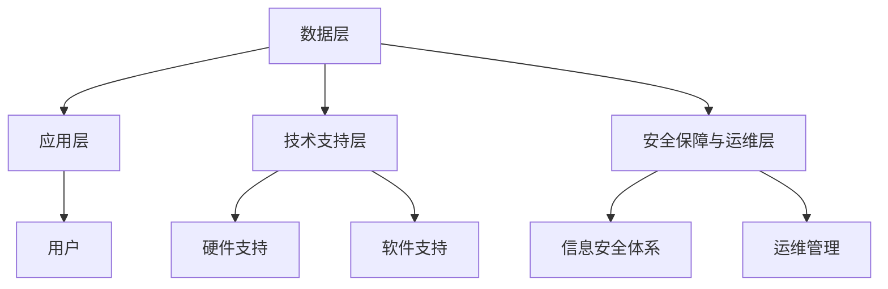

                 

### 《产业板块集成信息系统总体构架》

关键词：产业板块、信息系统、集成、架构设计、数据层、应用层、技术支持层、安全保障、运维管理

摘要：
本篇文章旨在深入探讨产业板块集成信息系统的总体构架，包括其背景与核心概念、核心架构设计、实施与推广，以及未来发展趋势与挑战。文章通过详细的逻辑分析和实例讲解，为读者提供了一个全面的视角，以了解和构建高效、稳定的产业板块集成信息系统。

----------------------------------------------------------------

### 第一部分：产业板块集成信息系统的背景与核心概念

在当今信息化社会，产业板块集成信息系统成为推动产业发展的重要工具。本部分将首先介绍产业板块集成信息系统的定义与重要性，回顾其发展历程，并探讨信息系统的基础概念与分类，最终阐述集成信息系统与产业板块发展的关系。

#### 1.1 产业板块集成信息系统概述

**1.1.1 产业板块集成信息系统的定义与重要性**

产业板块集成信息系统是指将不同产业板块的信息系统通过技术手段进行整合，形成一个整体，以提高产业板块内部和跨板块的信息共享、协同和决策能力。其重要性体现在以下几个方面：

- **提高产业板块整体运营效率**：通过集成信息系统，企业可以更快速、准确地获取和利用各类信息，从而提高运营效率，降低运营成本。
- **促进产业板块的信息共享与协作**：集成信息系统使得不同产业板块之间能够实现信息共享，打破信息孤岛，促进协同工作。
- **提升产业板块的决策能力**：集成信息系统为产业板块提供了全面、准确的数据支持，有助于企业做出更科学的决策。

**1.1.2 产业板块集成信息系统的发展历程**

产业板块集成信息系统的发展可以追溯到20世纪80年代，当时计算机技术和网络技术开始普及，企业逐渐开始意识到信息系统在管理中的重要性。以下是其主要发展阶段：

- **起步阶段**（20世纪80年代至90年代）：企业开始建立基本的信息管理系统，实现数据的电子化和自动化处理。
- **发展阶段**（20世纪90年代至21世纪初）：随着互联网的兴起，企业开始建立企业资源计划（ERP）系统，实现跨部门的信息集成和管理。
- **成熟阶段**（21世纪初至今）：随着大数据、云计算、物联网等新技术的应用，产业板块集成信息系统进入智能化、集成化、协同化阶段。

**1.1.3 产业板块集成信息系统未来的发展趋势**

未来，产业板块集成信息系统将朝着以下几个方向发展：

- **智能化**：通过人工智能、大数据等技术，实现信息系统的自动化、智能化，提高系统的决策能力和运营效率。
- **集成化**：进一步加强不同产业板块的信息集成，实现跨产业、跨区域的信息共享和协作。
- **协同化**：促进产业板块内部和跨板块的协同工作，提升整体运营效率和竞争力。

#### 1.2 信息系统的基本概念与分类

**1.2.1 信息系统的定义与功能**

信息系统是指由计算机硬件、软件、数据、人员等组成，用于获取、处理、存储、传输和利用信息的系统。其功能主要包括：

- **信息采集**：从各种来源获取信息，如数据库、传感器、用户输入等。
- **信息处理**：对采集到的信息进行加工、清洗、分析等操作。
- **信息存储**：将处理后的信息存储到数据库或其他存储设备中。
- **信息传输**：通过网络或其他通信手段将信息传递给需要的人员或系统。
- **信息利用**：利用信息系统提供的数据和信息，支持企业的决策、管理和运营。

**1.2.2 产业板块信息系统的分类与特点**

产业板块信息系统可以根据不同的分类标准进行划分，常见的分类方法包括：

- **按照产业类型分类**：如制造业信息系统、服务业信息系统、农业信息系统等。不同类型的产业板块信息系统具有不同的特点和需求。
- **按照系统层次分类**：如企业级信息系统、行业级信息系统、区域级信息系统等。不同层次的信息系统在功能、规模、覆盖范围等方面存在差异。
- **按照系统架构分类**：如客户关系管理系统（CRM）、企业资源计划系统（ERP）、供应链管理系统（SCM）等。不同架构的信息系统在功能和模块划分上存在差异。

#### 1.3 集成信息系统与产业板块发展的关系

**1.3.1 集成信息系统对产业板块发展的促进作用**

集成信息系统对产业板块发展具有显著的促进作用，主要体现在以下几个方面：

- **提高产业板块整体运营效率**：通过集成信息系统，企业可以实现信息的快速传递和共享，降低信息传递过程中的时间损耗，提高运营效率。
- **促进产业板块的信息共享与协作**：集成信息系统打破了信息孤岛，实现了不同产业板块之间的信息共享和协作，有助于提升整体运营效率。
- **提升产业板块的决策能力**：集成信息系统为产业板块提供了全面、准确的数据支持，有助于企业做出更科学的决策。

**1.3.2 产业板块发展对集成信息系统的需求**

随着产业板块的发展，对集成信息系统的需求也在不断变化。具体表现为：

- **功能需求**：随着产业板块的多样化，对信息系统的功能需求也越来越多样化，如数据分析、预测建模、智能决策等。
- **性能需求**：随着数据量的不断增长，对信息系统的性能需求也在不断提高，如数据处理速度、存储容量等。
- **安全需求**：随着网络安全威胁的增加，对信息系统的安全需求也越来越高，如数据加密、安全防护等。

### 第一部分总结

产业板块集成信息系统是推动产业升级和竞争力提升的重要工具。通过对产业板块集成信息系统的背景与核心概念、信息系统的基础概念与分类、以及集成信息系统与产业板块发展的关系的详细分析，我们为读者提供了一个全面的视角，以深入理解产业板块集成信息系统的本质和重要性。在接下来的部分中，我们将进一步探讨产业板块集成信息系统的核心架构设计，为构建高效、稳定的产业板块集成信息系统提供理论基础和实践指导。

----------------------------------------------------------------

### 第二部分：产业板块集成信息系统的核心架构设计

产业板块集成信息系统的核心架构设计是确保系统能够高效运行、稳定可靠的关键。本部分将详细介绍产业板块集成信息系统的总体架构，包括数据层、应用层、技术支持层以及安全保障与运维，为构建高效、可靠的产业板块集成信息系统提供详细的设计思路。

#### 2.1 产业板块集成信息系统的总体架构

**2.1.1 总体架构的设计原则**

在构建产业板块集成信息系统的总体架构时，需要遵循以下设计原则：

- **整体性原则**：系统架构应具备整体性，能够涵盖整个产业板块的信息需求，实现信息的全面整合和共享。
- **开放性原则**：系统架构应具备开放性，能够兼容各种硬件、软件和标准，便于系统升级和维护。
- **可扩展性原则**：系统架构应具备可扩展性，能够根据产业板块的发展需求进行功能扩展和技术升级。
- **灵活性原则**：系统架构应具备灵活性，能够适应不同的业务场景和需求变化，实现灵活调整和优化。

**2.1.2 总体架构的组成部分**

产业板块集成信息系统的总体架构主要包括以下四个层次：

- **数据层**：负责数据的采集、存储、管理和分析，是整个系统的基础。
- **应用层**：负责实现各种业务功能，是用户与系统的交互界面。
- **技术支持层**：负责提供系统运行所需的硬件和软件支持，确保系统的稳定运行。
- **安全保障与运维层**：负责系统的安全保障和运维管理，确保系统的安全可靠运行。

#### 2.2 数据层设计

**2.2.1 数据采集与整合**

数据采集是数据层设计的核心环节，主要包括以下内容：

- **数据来源**：数据来源包括内部数据和外部数据，如企业内部业务系统、外部合作伙伴、公开数据等。
- **数据采集方法**：数据采集方法包括直接采集、间接采集、在线采集和离线采集等，应根据数据类型和需求选择合适的方法。
- **数据整合**：数据整合是将来自不同来源的数据进行清洗、转换和融合，形成一个统一的数据视图，为应用层提供数据支持。

**2.2.2 数据存储与管理**

数据存储与管理是数据层的核心任务，主要包括以下内容：

- **数据存储技术**：数据存储技术包括关系型数据库、NoSQL数据库、分布式存储系统等，应根据数据类型和需求选择合适的存储技术。
- **数据管理方法**：数据管理方法包括数据备份与恢复、数据权限控制、数据安全保护等，确保数据的安全、完整和可用。
- **数据生命周期管理**：数据生命周期管理包括数据的创建、存储、使用、归档和删除等环节，确保数据在整个生命周期内的有效管理。

#### 2.3 应用层设计

**2.3.1 应用层的功能模块设计**

应用层的功能模块设计是系统设计的核心，主要包括以下内容：

- **功能需求分析**：通过对产业板块的业务需求进行分析，确定系统的功能需求。
- **功能模块划分**：根据功能需求，将系统划分为多个功能模块，如数据采集模块、数据分析模块、决策支持模块等。
- **模块接口设计**：设计模块之间的接口，确保模块之间的数据传递和功能协同。

**2.3.2 应用层的技术选型与优化**

应用层的技术选型与优化主要包括以下内容：

- **技术选型**：根据系统的功能需求、性能要求和成本预算，选择合适的技术框架和开发语言，如Java、Python、Spring Boot等。
- **性能优化**：通过优化数据库查询、缓存策略、分布式计算等技术手段，提高系统的性能和响应速度。
- **用户体验优化**：通过优化界面设计、交互体验等技术手段，提高用户的使用体验。

#### 2.4 技术支持层设计

**2.4.1 技术支持层的组成部分**

技术支持层主要包括以下内容：

- **硬件支持**：包括服务器、存储设备、网络设备等硬件设施，为系统提供计算、存储和网络支持。
- **软件支持**：包括操作系统、数据库管理系统、中间件等软件，为系统提供软件环境和支持。

**2.4.2 技术支持层的选型与配置**

技术支持层的选型与配置主要包括以下内容：

- **硬件选型**：根据系统的性能需求和成本预算，选择合适的硬件设备，如高性能服务器、大容量存储设备等。
- **软件配置**：根据系统的功能和性能要求，配置合适的软件环境，如数据库管理系统的参数配置、中间件的安装和配置等。

#### 2.5 安全保障与运维

**2.5.1 信息安全体系建设**

信息安全体系建设是保障系统安全的关键，主要包括以下内容：

- **安全策略制定**：制定系统的安全策略，包括数据安全、网络安全、应用安全等。
- **安全防护措施**：实施安全防护措施，包括防火墙、入侵检测、数据加密等。
- **安全审计与监控**：实施安全审计与监控，及时发现和处理安全事件。

**2.5.2 运维管理与优化**

运维管理与优化是确保系统稳定运行的关键，主要包括以下内容：

- **运维管理流程**：制定运维管理流程，包括系统部署、监控、故障处理等。
- **运维工具选型**：选择合适的运维工具，如监控工具、配置管理工具、自动化部署工具等。
- **运维优化**：通过自动化、智能化等技术手段，优化运维流程，提高运维效率。

#### 2.6 核心概念与联系

为了更好地理解产业板块集成信息系统的核心架构，我们可以使用Mermaid流程图来展示其核心概念和联系：



通过上述流程图，我们可以清晰地看到数据层、应用层、技术支持层以及安全保障与运维层之间的联系，以及它们在系统架构中的重要性。

#### 2.7 核心算法原理讲解

在产业板块集成信息系统中，核心算法的设计和实现是提升系统性能和功能的关键。以下是一个简单的数据挖掘算法的伪代码，用于解释核心算法原理：

```pseudo
// 数据挖掘算法伪代码
Function DataMining(dataSet):
    // 数据预处理
    PreprocessedData = Preprocess(dataSet)
    
    // 特征提取
    Features = ExtractFeatures(PreprocessedData)
    
    // 构建模型
    Model = BuildModel(Features)
    
    // 模型训练
    TrainedModel = TrainModel(Model, Features)
    
    // 模型评估
    Evaluation = EvaluateModel(TrainedModel, Features)
    
    // 输出结果
    Return Evaluation
```

在上述伪代码中，DataMining函数负责整个数据挖掘过程，包括数据预处理、特征提取、模型构建、模型训练和模型评估。具体实现时，需要根据实际需求和数据类型选择合适的算法和工具。

#### 2.8 数学模型和公式

在产业板块集成信息系统中，数学模型和公式是分析和优化系统性能的重要工具。以下是一个简单的线性回归模型的公式和解释：

$$
Y = \beta_0 + \beta_1X + \epsilon
$$

其中，\(Y\) 是因变量，\(X\) 是自变量，\(\beta_0\) 和 \(\beta_1\) 分别是回归系数，\(\epsilon\) 是误差项。该模型表示因变量 \(Y\) 与自变量 \(X\) 之间存在线性关系，通过求解回归系数 \(\beta_0\) 和 \(\beta_1\)，可以建立预测模型。

#### 2.9 项目实战：代码实际案例和详细解释说明

为了更好地理解产业板块集成信息系统的核心架构设计，以下是一个简单的Python代码案例，用于实现数据层的功能：

```python
import pandas as pd
from sklearn.model_selection import train_test_split
from sklearn.linear_model import LinearRegression

# 数据预处理
def preprocess_data(data):
    # 数据清洗
    data = data.dropna()
    # 数据标准化
    data = (data - data.mean()) / data.std()
    return data

# 特征提取
def extract_features(data):
    # 提取特征
    features = data[['X', 'Z']]
    return features

# 模型构建和训练
def build_and_train_model(features, labels):
    # 分割数据集
    X_train, X_test, y_train, y_test = train_test_split(features, labels, test_size=0.2, random_state=42)
    # 构建线性回归模型
    model = LinearRegression()
    # 训练模型
    model.fit(X_train, y_train)
    # 评估模型
    score = model.score(X_test, y_test)
    return model, score

# 主程序
if __name__ == "__main__":
    # 加载数据
    data = pd.read_csv("data.csv")
    # 预处理数据
    data = preprocess_data(data)
    # 提取特征
    features = extract_features(data)
    # 构建和训练模型
    model, score = build_and_train_model(features[['X', 'Z']], features['Y'])
    # 输出模型和评估结果
    print("模型:", model)
    print("评估结果:", score)
```

在上述代码中，我们首先导入必要的库，然后定义数据预处理、特征提取和模型构建与训练的函数。在主程序中，我们加载数据，进行预处理，提取特征，构建和训练模型，并输出模型和评估结果。通过这个简单的案例，我们可以看到数据层的基本功能和实现方法。

#### 2.10 开发环境搭建

为了实现上述代码案例，我们需要搭建合适的开发环境。以下是一个简单的开发环境搭建指南：

- **Python环境搭建**：
  - 安装Python 3.8及以上版本。
  - 安装Pandas、Scikit-learn等必要库。

- **IDE选择**：
  - 选择一个合适的IDE，如PyCharm、VSCode等。

- **数据集准备**：
  - 准备一个包含自变量和因变量的CSV数据集，如“data.csv”。

按照上述指南，我们可以快速搭建开发环境，并运行代码案例，实现数据层的功能。

#### 2.11 源代码详细实现和代码解读

在实现数据层的功能时，我们使用Python作为编程语言，并利用Pandas和Scikit-learn等库进行数据处理和模型训练。以下是对源代码的详细解读：

```python
import pandas as pd
from sklearn.model_selection import train_test_split
from sklearn.linear_model import LinearRegression

# 数据预处理
def preprocess_data(data):
    # 数据清洗
    data = data.dropna()
    # 数据标准化
    data = (data - data.mean()) / data.std()
    return data

# 特征提取
def extract_features(data):
    # 提取特征
    features = data[['X', 'Z']]
    return features

# 模型构建和训练
def build_and_train_model(features, labels):
    # 分割数据集
    X_train, X_test, y_train, y_test = train_test_split(features, labels, test_size=0.2, random_state=42)
    # 构建线性回归模型
    model = LinearRegression()
    # 训练模型
    model.fit(X_train, y_train)
    # 评估模型
    score = model.score(X_test, y_test)
    return model, score

# 主程序
if __name__ == "__main__":
    # 加载数据
    data = pd.read_csv("data.csv")
    # 预处理数据
    data = preprocess_data(data)
    # 提取特征
    features = extract_features(data)
    # 构建和训练模型
    model, score = build_and_train_model(features[['X', 'Z']], features['Y'])
    # 输出模型和评估结果
    print("模型:", model)
    print("评估结果:", score)
```

在上述代码中，我们首先导入必要的库，然后定义数据预处理、特征提取和模型构建与训练的函数。在主程序中，我们加载数据，进行预处理，提取特征，构建和训练模型，并输出模型和评估结果。

#### 2.12 代码解读与分析

- **数据预处理**：数据预处理是数据挖掘和机器学习的基础步骤，主要包括数据清洗和标准化。在`preprocess_data`函数中，我们使用`dropna()`方法删除缺失值，使用`mean()`和`std()`方法进行数据标准化。

- **特征提取**：特征提取是将原始数据转换为适合机器学习模型输入的特征。在`extract_features`函数中，我们使用`[['X', 'Z']]`选择自变量和因变量作为特征。

- **模型构建和训练**：在`build_and_train_model`函数中，我们使用`train_test_split`方法将数据集分为训练集和测试集，使用`LinearRegression`类构建线性回归模型，并使用`fit`方法进行模型训练。然后，我们使用`score`方法评估模型在测试集上的表现。

- **主程序**：在主程序中，我们首先加载数据，然后依次进行预处理、特征提取、模型构建和训练，最后输出模型和评估结果。

通过上述代码解读，我们可以清晰地了解数据层的基本实现方法和原理。

### 第二部分总结

第二部分详细介绍了产业板块集成信息系统的核心架构设计，包括数据层、应用层、技术支持层以及安全保障与运维。通过对核心架构的深入分析，我们为构建高效、可靠的产业板块集成信息系统提供了理论基础和实践指导。在接下来的部分中，我们将探讨产业板块集成信息系统的实施与推广，为实际应用提供更多的经验和策略。

----------------------------------------------------------------

### 第三部分：产业板块集成信息系统的实施与推广

在了解了产业板块集成信息系统的核心架构设计后，接下来我们需要关注其实施与推广的具体流程和策略。本部分将详细介绍产业板块集成信息系统的实施流程、推广策略，并结合实际案例进行详细分析。

#### 3.1 产业板块集成信息系统的实施流程

**3.1.1 项目启动与需求分析**

项目启动是实施产业板块集成信息系统的第一步，主要包括以下几个方面：

- **项目启动条件**：明确项目目标、需求、资源等条件，确保项目能够顺利启动。
- **项目启动流程**：制定项目启动计划，明确项目团队成员、职责和进度安排。
- **需求分析**：通过访谈、问卷调查、文献调研等方法，收集和分析产业板块的需求，确保项目需求准确、完整。

**3.1.2 系统设计与开发**

系统设计与开发是实施产业板块集成信息系统的关键环节，主要包括以下几个方面：

- **系统设计原则**：遵循整体性、开放性、可扩展性和灵活性原则，确保系统架构的合理性和可行性。
- **系统设计方法**：采用面向对象设计、模块化设计等方法，确保系统设计的科学性和规范性。
- **开发流程**：遵循软件开发生命周期，包括需求分析、系统设计、编码实现、测试和部署等阶段。

**3.1.3 系统测试与验收**

系统测试与验收是确保产业板块集成信息系统质量和稳定性的关键环节，主要包括以下几个方面：

- **测试类型**：包括功能测试、性能测试、安全测试等，确保系统在各种场景下正常运行。
- **测试方法**：采用自动化测试、手动测试等方法，提高测试效率和准确性。
- **验收标准**：根据项目需求和合同约定，制定验收标准，确保系统满足要求。

**3.1.4 系统上线与培训**

系统上线是产业板块集成信息系统实施的关键一步，主要包括以下几个方面：

- **系统上线计划**：制定系统上线计划，明确上线时间、任务分工等。
- **系统上线**：按照上线计划，进行系统部署和调试，确保系统顺利上线。
- **用户培训**：对系统用户进行培训，确保用户能够熟练操作和利用系统。

**3.1.5 运维管理与优化**

运维管理与优化是确保产业板块集成信息系统稳定运行和持续改进的关键环节，主要包括以下几个方面：

- **运维管理流程**：制定运维管理流程，明确运维任务、责任人、操作规范等。
- **运维工具选型**：选择合适的运维工具，如监控工具、配置管理工具等。
- **运维优化**：通过自动化、智能化等技术手段，优化运维流程，提高运维效率。

#### 3.2 产业板块集成信息系统的推广策略

**3.2.1 推广目标的确定**

推广目标是确保产业板块集成信息系统在目标产业板块中得到广泛应用和认可的关键。确定推广目标时，应考虑以下几个方面：

- **产业板块特点**：根据不同产业板块的特点和需求，确定具体的推广目标。
- **系统优势**：分析系统优势，如功能强大、性能优越、安全可靠等，作为推广的卖点。
- **市场需求**：了解市场需求，确定推广的重点和方向。

**3.2.2 推广活动的策划与实施**

推广活动的策划与实施是确保产业板块集成信息系统得到有效推广的重要环节，主要包括以下几个方面：

- **推广内容**：确定推广内容，如系统介绍、功能演示、案例分享等。
- **推广渠道**：选择合适的推广渠道，如线上宣传、线下活动、合作伙伴推广等。
- **推广计划**：制定详细的推广计划，明确推广时间、任务分工、预算安排等。

**3.2.3 推广效果的评估与调整**

推广效果的评估与调整是确保产业板块集成信息系统推广效果持续提升的关键环节，主要包括以下几个方面：

- **评估指标**：确定评估指标，如系统用户数量、用户满意度、市场份额等。
- **效果评估**：定期对推广效果进行评估，分析推广活动的效果和问题。
- **调整策略**：根据评估结果，调整推广策略，优化推广活动。

#### 3.3 产业板块集成信息系统案例研究

**3.3.1 案例一：某行业集成信息系统建设实践**

**案例背景与目标**

某行业集成信息系统建设的背景是该行业企业信息孤岛现象严重，信息传递不畅，影响了行业的整体运营效率和竞争力。建设目标是通过集成信息系统，实现企业内部和跨企业的信息共享和协同，提高行业的整体运营效率和竞争力。

**实施过程与成果**

- **项目启动与需求分析**：明确项目目标、需求和分析方法，制定项目启动计划和需求分析报告。
- **系统设计与开发**：遵循整体性、开放性、可扩展性和灵活性原则，进行系统设计，开发满足行业需求的集成信息系统。
- **系统测试与验收**：进行功能测试、性能测试和安全测试，确保系统质量，通过用户验收。
- **系统上线与培训**：制定上线计划，进行系统部署和调试，对用户进行培训，确保用户能够熟练操作和利用系统。
- **运维管理与优化**：制定运维管理流程，选择合适的运维工具，通过自动化、智能化等技术手段，优化运维流程，提高运维效率。

**成果分析**

通过集成信息系统建设，某行业实现了企业内部和跨企业的信息共享和协同，提高了行业的整体运营效率和竞争力。具体成果包括：

- **信息传递效率提高**：通过集成信息系统，企业可以快速获取和传递信息，降低了信息传递的时间和成本。
- **协同工作能力提升**：通过集成信息系统，企业可以实现跨部门、跨企业的协同工作，提高了工作效率和协同效果。
- **决策能力增强**：通过集成信息系统，企业可以获取全面、准确的数据支持，提高了决策的科学性和准确性。

**3.3.2 案例二：某地区产业板块信息一体化建设实践**

**案例背景与目标**

某地区产业板块信息一体化建设的背景是地区产业板块信息孤岛现象严重，信息资源共享不畅，影响了地区的整体发展。建设目标是实现地区产业板块的信息一体化，提高地区的整体发展水平和竞争力。

**实施过程与成果**

- **项目启动与需求分析**：明确项目目标、需求和分析方法，制定项目启动计划和需求分析报告。
- **总体架构设计**：根据地区产业板块的特点和需求，设计满足要求的总体架构，包括数据层、应用层、技术支持层等。
- **系统设计与开发**：进行系统设计，开发满足地区产业板块需求的集成信息系统，包括数据采集、存储、处理、共享等功能。
- **系统测试与验收**：进行功能测试、性能测试和安全测试，确保系统质量，通过用户验收。
- **系统上线与推广**：制定上线计划，进行系统部署和调试，对地区产业板块进行推广和培训，提高系统的使用率和满意度。
- **运维管理与优化**：制定运维管理流程，选择合适的运维工具，通过自动化、智能化等技术手段，优化运维流程，提高运维效率。

**成果分析**

通过产业板块信息一体化建设，某地区实现了产业板块的信息一体化，提高了地区的整体发展水平和竞争力。具体成果包括：

- **信息资源共享**：通过信息一体化，地区产业板块实现了信息资源共享，降低了信息获取和传递的成本。
- **协同工作能力提升**：通过信息一体化，地区产业板块实现了协同工作，提高了工作效率和协同效果。
- **发展水平提高**：通过信息一体化，地区产业板块得到了全面、准确的数据支持，促进了地区的经济发展和产业升级。

### 第三部分总结

第三部分详细介绍了产业板块集成信息系统的实施与推广流程和策略，并结合实际案例进行了深入分析。通过了解实施流程和推广策略，我们为产业板块集成信息系统的实际应用提供了宝贵的经验和指导。在接下来的部分中，我们将探讨产业板块集成信息系统的发展趋势与挑战，为未来的发展提供新的思路和建议。

----------------------------------------------------------------

### 第四部分：产业板块集成信息系统的发展趋势与挑战

随着科技的不断进步和产业结构的不断调整，产业板块集成信息系统也面临着新的发展趋势和挑战。本部分将深入探讨产业板块集成信息系统在未来可能面临的技术、安全和运营等方面的挑战，并提出相应的应对策略。

#### 4.1 产业板块集成信息系统的发展趋势

**4.1.1 新技术对产业板块集成信息系统的影响**

未来，新技术将深刻影响产业板块集成信息系统的发展，主要包括以下几个方面：

- **人工智能**：人工智能（AI）技术的快速发展将使得产业板块集成信息系统具备更高的智能化水平。通过AI算法，系统可以自动分析大量数据，提供更为准确的决策支持，提高系统的运营效率和智能化水平。
- **大数据**：大数据技术的应用将使产业板块集成信息系统能够处理和分析海量数据，从而为企业和产业板块提供更加全面和深入的数据洞察。
- **云计算**：云计算技术的发展将使产业板块集成信息系统具备更高的弹性、可扩展性和灵活性，降低企业的IT成本，提高系统的运行效率。

**4.1.2 产业板块集成信息系统未来的发展方向**

未来，产业板块集成信息系统将朝着以下几个方向发展：

- **产业板块信息一体化**：随着产业结构的不断调整和优化，产业板块之间的信息一体化将成为未来的发展趋势。通过整合不同产业板块的信息，实现信息的共享和协同，提高产业板块的整体运营效率和竞争力。
- **智慧产业园区**：智慧产业园区将集成信息系统与物联网、大数据等技术相结合，实现产业园区内的智能管理和智能服务，提高园区的运营效率和服务水平。
- **智能供应链**：智能供应链将集成信息系统与物联网、大数据等技术相结合，实现供应链的实时监控、智能调度和优化管理，提高供应链的响应速度和竞争力。

#### 4.2 产业板块集成信息系统面临的挑战

**4.2.1 技术挑战**

随着新技术的快速发展，产业板块集成信息系统也面临着一系列技术挑战，主要包括以下几个方面：

- **技术更新换代**：新技术不断涌现，产业板块集成信息系统需要不断更新技术，以适应新的技术环境和需求。
- **技术安全风险**：新技术的应用也带来了新的安全风险，如数据泄露、系统漏洞等，需要采取有效的安全措施进行防范。
- **技术兼容性**：随着系统的复杂度增加，不同技术之间的兼容性成为一大挑战，需要确保不同技术组件能够无缝集成和协同工作。

**4.2.2 安全挑战**

产业板块集成信息系统在安全方面面临着一系列挑战，主要包括以下几个方面：

- **数据安全风险**：随着数据量的不断增加，数据安全风险也日益突出。如何确保数据的安全、完整和可用，成为产业板块集成信息系统面临的重要挑战。
- **网络安全风险**：随着网络攻击手段的日益复杂，产业板块集成信息系统面临着严峻的网络安全威胁，如网络入侵、数据泄露等。
- **用户隐私保护**：随着用户对隐私保护的重视，产业板块集成信息系统需要采取有效的措施保护用户的隐私。

**4.2.3 运营挑战**

产业板块集成信息系统在运营方面也面临着一系列挑战，主要包括以下几个方面：

- **运营成本压力**：随着系统的复杂度增加，运营成本也在不断增加，需要采取有效的成本控制措施，提高系统的运营效率。
- **运维效率提升**：随着系统规模的扩大，运维效率成为一大挑战。如何通过自动化、智能化等技术手段提高运维效率，降低运维成本，是产业板块集成信息系统需要解决的重要问题。
- **用户体验优化**：随着用户需求的不断变化，产业板块集成信息系统需要不断优化用户体验，提高用户满意度和系统使用率。

#### 4.3 应对挑战的策略与建议

**4.3.1 技术创新与应用**

面对技术挑战，产业板块集成信息系统需要采取以下策略：

- **引入新技术**：积极引入新兴技术，如人工智能、大数据、云计算等，以提高系统的智能化、集成化和协同化水平。
- **提高技术水平**：加强技术培训和学习，提高技术人员的技术水平和创新能力，为系统的持续发展和改进提供技术支持。

**4.3.2 安全保障与合规**

面对安全挑战，产业板块集成信息系统需要采取以下策略：

- **加强安全防护**：采取有效的安全防护措施，如数据加密、防火墙、入侵检测等，确保系统的数据安全和网络安全。
- **遵守法律法规**：遵守相关法律法规，如《网络安全法》、《数据安全法》等，确保系统的合法合规运营。

**4.3.3 运营优化与人才发展**

面对运营挑战，产业板块集成信息系统需要采取以下策略：

- **优化运营流程**：通过流程优化，提高运营效率，降低运营成本。
- **培养专业人才**：加强人才培养和引进，提高系统的运维能力和管理水平，为系统的稳定运行提供人力保障。

#### 4.4 数学模型和公式

在产业板块集成信息系统的建设和运营过程中，数学模型和公式是分析和优化系统性能的重要工具。以下是一个简单的线性回归模型的公式和解释：

$$
Y = \beta_0 + \beta_1X + \epsilon
$$

其中，\(Y\) 是因变量，\(X\) 是自变量，\(\beta_0\) 和 \(\beta_1\) 分别是回归系数，\(\epsilon\) 是误差项。该模型表示因变量 \(Y\) 与自变量 \(X\) 之间存在线性关系，通过求解回归系数 \(\beta_0\) 和 \(\beta_1\)，可以建立预测模型，为系统的决策提供支持。

#### 4.5 举例说明

为了更好地理解产业板块集成信息系统的建设和运营，以下是一个简单的案例：

**案例：某地区智慧城市项目**

**背景**：某地区政府希望通过建设智慧城市项目，提高城市管理效率和居民生活质量。

**目标**：实现城市数据的实时采集、处理和共享，提高城市管理的智能化水平。

**实施过程**：

1. **项目启动与需求分析**：明确项目目标、需求和分析方法，制定项目启动计划和需求分析报告。
2. **系统设计与开发**：设计满足智慧城市需求的集成信息系统，包括数据采集、存储、处理、共享等功能。
3. **系统测试与验收**：进行功能测试、性能测试和安全测试，确保系统质量，通过用户验收。
4. **系统上线与推广**：制定上线计划，进行系统部署和调试，对城市管理部门进行推广和培训，提高系统的使用率和满意度。
5. **运维管理与优化**：制定运维管理流程，选择合适的运维工具，通过自动化、智能化等技术手段，优化运维流程，提高运维效率。

**成果分析**：

通过智慧城市项目的建设，该地区实现了城市数据的实时采集、处理和共享，提高了城市管理的智能化水平，具体成果包括：

- **数据采集效率提高**：通过实时采集城市数据，提高了数据采集的效率，降低了数据采集的成本。
- **数据处理能力提升**：通过数据处理技术，提高了数据处理的能力，为城市管理部门提供了全面、准确的数据支持。
- **城市管理效率提高**：通过智慧城市项目，提高了城市管理部门的工作效率，降低了城市管理成本，提高了居民生活质量。

### 第四部分总结

第四部分深入探讨了产业板块集成信息系统的发展趋势与挑战，提出了技术创新、安全保障和运营优化等应对策略。通过结合实际案例，我们为产业板块集成信息系统的建设和运营提供了宝贵的经验和指导。在未来的发展中，产业板块集成信息系统将不断迎接新的机遇和挑战，为产业升级和经济发展提供强大的支撑。

----------------------------------------------------------------

### 附录A：产业板块集成信息系统相关技术标准与规范

为了确保产业板块集成信息系统的质量、安全性和互操作性，相关技术标准与规范的制定与实施至关重要。以下是对产业板块集成信息系统相关技术标准与规范的概述：

#### A.1 技术标准概述

技术标准是指在特定领域内，为获得最佳秩序，对活动或其结果规定共同的和重复使用的规则、导则或特性的文件。在产业板块集成信息系统中，技术标准主要包括以下几个方面：

- **数据标准**：数据标准用于规范数据格式、数据结构、数据定义和数据质量等，以确保数据的一致性和可互操作性。
- **接口标准**：接口标准用于规范不同系统或组件之间的接口定义、通信协议和数据交换格式，以确保系统的集成和协同工作。
- **安全标准**：安全标准用于规范信息系统的安全设计、安全措施和安全策略，以确保系统的数据安全和网络安全。

#### A.2 技术规范详细说明

技术规范是技术标准的具体实施指南，用于指导系统设计、开发、部署和维护等过程中的具体操作。以下是对产业板块集成信息系统相关技术规范的详细说明：

- **数据采集与存储规范**：包括数据采集的方法、数据存储的设备和技术、数据备份与恢复策略等，确保数据的准确、完整和安全。
- **数据处理与分析规范**：包括数据处理的方法、数据处理流程、数据分析技术等，确保数据的可用性和分析结果的准确性。
- **接口与集成规范**：包括接口设计、通信协议、数据交换格式等，确保不同系统或组件之间的无缝集成和协同工作。
- **安全规范**：包括安全设计、安全措施、安全审计与监控等，确保系统的数据安全和网络安全。

#### A.3 技术标准对产业发展的影响

技术标准在产业发展中发挥着重要作用，对产业板块集成信息系统的影响主要体现在以下几个方面：

- **提高系统互操作性**：通过统一的技术标准，不同系统或组件之间可以实现无缝集成和协同工作，提高系统的整体性能和效率。
- **保障数据安全**：通过制定安全标准，规范系统的安全设计、安全措施和安全策略，提高系统的数据安全性和抗风险能力。
- **促进产业升级**：技术标准的实施可以促进产业结构的优化和升级，提高产业的整体竞争力和创新能力。

### 附录B：产业板块集成信息系统常用开发工具与资源推荐

在开发产业板块集成信息系统时，选择合适的开发工具和资源对于提高开发效率和质量具有重要意义。以下是对产业板块集成信息系统常用开发工具和资源的推荐：

#### B.1 开发工具介绍

- **开发环境**：推荐使用Python作为开发语言，配合Jupyter Notebook进行开发和测试。
- **数据库管理系统**：推荐使用MySQL、PostgreSQL等关系型数据库，以及MongoDB、Cassandra等NoSQL数据库。
- **数据分析工具**：推荐使用Pandas、NumPy、SciPy等Python库进行数据处理和分析。
- **前端开发框架**：推荐使用React、Vue.js等前端框架，提高前端开发效率。
- **后端开发框架**：推荐使用Django、Flask等Python后端框架，提供强大的后端支持。

#### B.2 资源推荐清单

- **在线课程**：推荐Coursera、Udemy等在线教育平台上的相关课程，如“大数据分析”、“机器学习”、“Web开发”等。
- **技术社区**：推荐Stack Overflow、GitHub等技术社区，提供技术交流和问题解决。
- **开源项目**：推荐GitHub等开源平台上的相关项目，借鉴和参考其他优秀项目的实现方法和经验。
- **专业书籍**：推荐《大数据之路》、《机器学习实战》、《深入理解计算机系统》等专业书籍，提供深入的技术知识和实践经验。

通过使用上述推荐的开发工具和资源，开发者可以更好地完成产业板块集成信息系统的开发工作，提高开发效率和系统质量。

### 文章结束

作者：AI天才研究院/AI Genius Institute & 禅与计算机程序设计艺术 /Zen And The Art of Computer Programming

本文通过详细的分析和实例讲解，深入探讨了产业板块集成信息系统的背景与核心概念、核心架构设计、实施与推广，以及未来发展趋势与挑战。希望本文能为产业板块集成信息系统的建设和应用提供有益的参考和启示。在未来的发展中，产业板块集成信息系统将继续发挥重要作用，为产业升级和经济发展提供强大的支撑。

