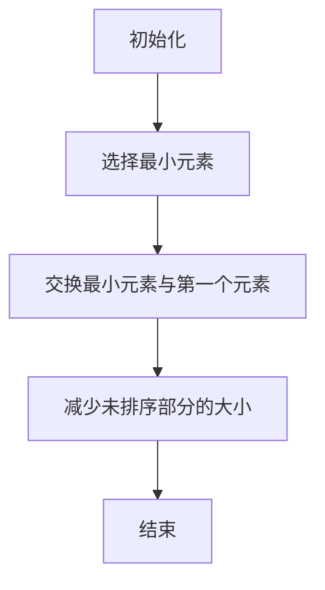

                 

### 《2024京东国际社招面试真题汇总及其解答》

#### 关键词：京东国际社招、面试真题、技术面试、行为面试、情境面试、面试技巧、案例分析

#### 摘要：
本文旨在为2024年京东国际社会招聘的应聘者提供一份全面的面试真题汇总及其解答。文章涵盖了技术面试、行为面试、情境面试等多个方面的题目，并提供了解答思路和策略。通过本文的阅读，应聘者可以更好地准备京东国际的面试，提升面试成功率。本文分为四个部分：面试准备、面试真题解析、面试技巧提升和案例分析。每个部分都详细阐述了面试相关的重要知识点和应对策略，旨在帮助读者全面掌握面试技巧，迎接面试挑战。

### 第一部分：面试准备

#### 第1章：面试概述

##### 1.1 面试准备的重要性

面试是求职过程中至关重要的一环，它是应聘者与招聘单位双向选择的重要环节。一个充分的面试准备不仅能够提高面试成功率，还能让应聘者更好地展示自己的能力和潜力。面试准备的重要性体现在以下几个方面：

1. **增强自信心**：通过充分的准备，应聘者可以对自己的能力有更清晰的认识，从而增强自信心，减少面试时的紧张情绪。
2. **提高面试成功率**：充分的准备有助于应聘者更好地应对面试中的各种问题，提高面试成功率。
3. **展示专业素养**：准备充分可以展示应聘者的专业素养和逻辑思维，让招聘单位更加信任和青睐。

##### 1.1.1 面试前的准备工作

面试前的准备工作主要包括以下几个方面：

1. **了解招聘单位**：了解招聘单位的企业文化、业务范围、发展方向等，有助于更好地应对面试中的相关问题。
2. **准备简历**：简历是面试前的重要资料，需要确保简历内容真实、简洁、有条理，突出自己的优势和特长。
3. **整理资料**：整理好个人证件、资格证书、作品集等，以备面试时使用。

##### 1.1.2 面试的心态调整

面试时的心态调整非常重要，良好的心态有助于应对面试中的各种挑战。以下是一些调整心态的建议：

1. **积极心态**：保持积极乐观的心态，相信自己能够应对面试中的各种问题。
2. **放松心态**：面试前适当放松，避免过度紧张，可以通过深呼吸、肌肉放松等方式来缓解紧张情绪。
3. **准备充分**：通过充分的准备，降低面试时的不确定性，增强自信心。

##### 1.2 面试流程

面试流程通常包括以下几个环节：

1. **初试**：初试通常是电话面试或视频面试，主要考察应聘者的基本素质和岗位匹配度。
2. **复试**：复试通常是现场面试，包括技术面试、行为面试、情境面试等，更深入地考察应聘者的专业能力和综合素质。
3. **终试**：终试是最终面试，通常由高层领导或专业评委进行，目的是全面评估应聘者的能力和发展潜力。
4. **反馈**：面试结束后，招聘单位会对应聘者进行反馈，告知面试结果和后续安排。

##### 1.3 面试策略

面试策略是面试成功的关键，以下是一些面试策略：

1. **自我介绍**：准备一段简洁明了的自我介绍，包括姓名、学历、工作经历、技能特长等，展示自己的优势和特长。
2. **问题提问**：提前准备一些有针对性的问题，展示自己的思考和洞察力，如对岗位的理解、对企业的看法等。
3. **非语言沟通**：注意面部表情、身体语言等非语言沟通，展示自己的自信和礼貌。

#### 第二部分：面试真题解析

##### 第2章：技术面试题

技术面试是面试的核心部分，主要考察应聘者的专业知识和技能。以下将介绍一些常见的技术面试题，并提供解答思路和策略。

##### 2.1 数据结构与算法

数据结构与算法是计算机科学的基础，也是技术面试的重点。以下是一些常见的数据结构与算法面试题：

1. **数组与链表**
   - **题目**：实现一个有序链表，支持在中间任意位置插入和删除节点。
   - **解答思路**：使用指针实现链表，通过遍历链表找到插入或删除的位置。
2. **栈与队列**
   - **题目**：用两个栈实现一个队列。
   - **解答思路**：一个栈用于入队，另一个栈用于出队。
3. **树与图**
   - **题目**：实现一个二叉搜索树，支持插入、删除、查找等操作。
   - **解答思路**：使用链表实现二叉搜索树，通过比较值的大小进行插入和删除操作。
4. **排序算法**
   - **题目**：实现快速排序算法。
   - **解答思路**：使用分治策略，通过递归实现快速排序。

##### 2.2 编程语言

编程语言是技术面试的另一个重点，以下是一些常见的编程语言面试题：

1. **Java**
   - **题目**：什么是Java中的多态？
   - **解答思路**：多态是指允许不同类的对象对同一消息做出响应。在Java中，多态通过继承和接口实现。
2. **Python**
   - **题目**：什么是Python中的列表推导式？
   - **解答思路**：列表推导式是一种简洁的创建列表的方式，通过一系列的循环和条件判断来实现。
3. **C++**
   - **题目**：什么是C++中的指针？
   - **解答思路**：指针是一个变量，用于存储另一个变量的地址。通过指针可以间接访问和操作变量。

##### 2.3 计算机系统

计算机系统是计算机科学的核心，以下是一些常见的计算机系统面试题：

1. **计算机组成原理**
   - **题目**：什么是计算机的存储层次结构？
   - **解答思路**：存储层次结构包括寄存器、内存、硬盘等，通过层次化的存储结构来提高计算机的存储速度和效率。
2. **操作系统基础**
   - **题目**：什么是操作系统的进程管理？
   - **解答思路**：进程管理是指操作系统对进程进行创建、调度、同步、通信等操作，以实现高效的资源利用和并发控制。
3. **网络基础**
   - **题目**：什么是TCP/IP协议？
   - **解答思路**：TCP/IP协议是计算机网络的基础协议，包括TCP协议和IP协议，用于实现网络通信和数据传输。

#### 第3章：行为面试题

行为面试是一种通过考察应聘者的过去行为和经历来预测未来表现的方法。以下是一些常见的行为面试题：

##### 3.1 个人经历

1. **题目**：请描述一次你在项目中遇到的挑战，以及你是如何解决的？
   - **解答思路**：选择一次具体的经历，描述挑战的背景、自己的应对策略和最终结果，展示自己的问题解决能力。
2. **题目**：请描述一次你在团队中发挥领导作用的经历。
   - **解答思路**：选择一次团队合作的经历，描述自己的角色、贡献和团队的整体表现，展示自己的领导力和团队协作能力。

##### 3.2 领导力和沟通能力

1. **题目**：请描述一次你在团队中解决冲突的经历。
   - **解答思路**：选择一次团队冲突的经历，描述自己的解决策略和结果，展示自己的沟通能力和问题解决能力。
2. **题目**：请描述一次你在项目中与上级沟通的经历。
   - **解答思路**：选择一次与上级沟通的经历，描述自己的沟通方式、沟通内容和结果，展示自己的沟通能力和职业素养。

##### 3.3 创新思维和解决问题能力

1. **题目**：请描述一次你在项目中创新解决问题的经历。
   - **解答思路**：选择一次项目中的问题，描述自己的创新思路和解决方案，展示自己的创新思维和问题解决能力。
2. **题目**：请描述一次你在项目中遇到的问题，以及你是如何解决它的？
   - **解答思路**：选择一次具体的问题，描述问题的背景、自己的解决思路和最终结果，展示自己的问题解决能力。

#### 第4章：情境面试题

情境面试是一种通过模拟实际工作场景来考察应聘者应对能力和解决问题的能力的方法。以下是一些常见的情境面试题：

##### 4.1 情境模拟

1. **题目**：假设你是团队的负责人，如何合理安排团队成员的工作，以确保项目按期完成？
   - **解答思路**：描述自己的团队管理策略，包括分工、协作、进度管理等，展示自己的领导能力和项目管理能力。
2. **题目**：假设你在项目中遇到了一个紧急情况，如何处理？
   - **解答思路**：描述自己的应对策略，包括紧急情况的分析、解决方案的选择和执行，展示自己的应急处理能力。

##### 4.2 决策面试题

1. **题目**：请描述一次你在项目中做出重要决策的经历。
   - **解答思路**：选择一次项目决策的经历，描述决策的背景、决策过程和决策结果，展示自己的决策能力和分析能力。
2. **题目**：假设你在项目中遇到了一个无法解决的问题，如何处理？
   - **解答思路**：描述自己的解决策略，包括问题的分析、解决方案的选择和执行，展示自己的问题解决能力。

##### 4.3 道德和伦理问题

1. **题目**：假设你在工作中发现同事存在违法行为，如何处理？
   - **解答思路**：描述自己的应对策略，包括举报、报告上级、保护自己等，展示自己的职业道德和责任感。
2. **题目**：假设你在工作中遇到了一个道德困境，如何处理？
   - **解答思路**：描述自己的应对策略，包括道德分析、决策过程和决策结果，展示自己的道德判断能力和解决问题的能力。

#### 第三部分：面试技巧

##### 第5章：面试技巧提升

面试技巧的提升是面试成功的关键。以下是一些面试技巧的提升方法：

##### 5.1 面试着装与形象

面试时的着装与形象非常重要，以下是一些提升面试形象的技巧：

1. **着装选择**：选择合适的职业装，保持整洁、得体。
2. **形象设计**：保持良好的发型、面容和仪表，展示专业形象。

##### 5.2 面试中的非语言沟通

非语言沟通在面试中占据重要地位，以下是一些提升非语言沟通技巧的方法：

1. **面部表情**：保持微笑，展示自信和友好。
2. **身体语言**：保持良好的坐姿、站姿，展示自信和专注。

##### 5.3 面试结束后的后续行动

面试结束后，及时跟进是提升面试成功率的重要环节。以下是一些后续行动的建议：

1. **发送感谢信**：面试结束后，及时发送感谢信，表达对面试机会的感激和对岗位的兴趣。
2. **跟进策略**：通过电话、邮件等方式，了解面试结果和后续安排，展示自己的诚意和关注。

#### 第四部分：案例分析

##### 第6章：面试经验分享

通过分析成功的面试经验和失败的面试经验，可以更好地提升面试技巧和应对能力。以下是一些面试经验的分享：

##### 6.1 面试成功案例

1. **成功面试经验分享**：分享成功面试的技巧和策略，包括自我介绍、提问技巧、面试准备等。
2. **面试准备策略**：描述成功面试前的准备工作，包括了解招聘单位、准备简历、模拟面试等。
3. **面试技巧应用**：展示成功面试中的实际技巧应用，如自信表达、问题回答、非语言沟通等。

##### 6.2 面试失败案例

1. **面试失败原因分析**：分析失败的原因，包括准备不足、面试技巧欠缺、非语言沟通不当等。
2. **改进措施**：提出改进措施，如加强面试准备、提高非语言沟通能力、增强心理素质等。
3. **失败后的应对策略**：描述失败后的应对策略，如总结经验、积极反思、持续提升等。

### 附录

#### 附录A：面试真题及答案

以下提供了部分面试真题及答案，供读者参考：

1. **数据结构与算法面试题**
   - **题目**：什么是哈希表？如何实现？
   - **答案**：哈希表是一种数据结构，通过哈希函数将键映射到哈希表中。实现哈希表的关键是哈希函数的设计和冲突解决策略。
2. **编程语言面试题**
   - **题目**：什么是面向对象编程？请举例说明。
   - **答案**：面向对象编程是一种编程范式，通过将数据和操作数据的方法封装成对象，实现数据和操作的分离。例如，Java和C++都是支持面向对象编程的语言。

#### 附录B：面试准备资源

以下提供了一些面试准备资源，供读者参考：

1. **面试相关网站推荐**
   - **网站1**：面试宝典（https://www.top-interview.com/）
   - **网站2**：面试题库（https://www.lintcode.com/）
2. **面试准备书籍推荐**
   - **书籍1**：《程序员面试金典》
   - **书籍2**：《技术面试前的准备》
3. **在线课程推荐**
   - **课程1**：Coursera的《算法》
   - **课程2**：Udacity的《面试编程技巧》

### 附录C：Mermaid 流程图

以下提供了一个Mermaid流程图，展示了一个简单的排序算法：



### 附录D：核心算法原理讲解

以下提供了核心算法原理的讲解，包括伪代码、数学模型和公式，以及详细讲解和举例说明。

#### 1. 快速排序算法

```plaintext
// 快速排序算法伪代码
QuickSort(A, low, high)
    if low < high then
        pivot = Partition(A, low, high)
        QuickSort(A, low, pivot - 1)
        QuickSort(A, pivot + 1, high)
    end if

// Partition函数伪代码
Partition(A, low, high)
    pivot = A[high]
    i = low - 1
    for j = low to high - 1 do
        if A[j] <= pivot then
            i = i + 1
            swap A[i] with A[j]
        end if
    end for
    swap A[i + 1] with A[high]
    return i + 1
```

#### 2. 冒泡排序算法

```plaintext
// 冒泡排序算法伪代码
BubbleSort(A)
    for i = 1 to length(A) - 1 do
        for j = length(A) - 1 to i + 1 do
            if A[j] < A[j - 1] then
                swap A[j] with A[j - 1]
            end if
        end for
    end for
```

#### 3. 神经网络中的损失函数

$$\text{Loss}(y, \hat{y}) = -\frac{1}{m} \sum_{i=1}^{m} [y_i \cdot \log(\hat{y}_i) + (1 - y_i) \cdot \log(1 - \hat{y}_i)]$$

其中，$y$ 是真实标签，$\hat{y}$ 是预测标签，$m$ 是样本数量。

#### 4. 逻辑回归中的概率预测

$$\hat{y} = \sigma(w \cdot x + b)$$

其中，$\sigma$ 是 sigmoid 函数，$w$ 是权重，$x$ 是特征向量，$b$ 是偏置。

### 附录E：项目实战

以下提供了一个实际项目案例，包括开发环境搭建、源代码详细实现和代码解读。

#### 1. 环境搭建

```bash
# 安装Python环境
pip install numpy pandas matplotlib

# 安装Jupyter Notebook
pip install jupyter
```

#### 2. 数据处理

```python
import pandas as pd

# 读取数据
data = pd.read_csv('data.csv')

# 数据预处理
X = data.iloc[:, :-1]
y = data.iloc[:, -1]

# 特征缩放
from sklearn.preprocessing import StandardScaler
scaler = StandardScaler()
X_scaled = scaler.fit_transform(X)
```

#### 3. 特征工程

```python
# 特征选择
from sklearn.feature_selection import SelectKBest
from sklearn.feature_selection import f_classif

selector = SelectKBest(score_func=f_classif, k=5)
X_selected = selector.fit_transform(X_scaled, y)
```

#### 4. 模型训练

```python
from sklearn.linear_model import LogisticRegression

# 训练模型
model = LogisticRegression()
model.fit(X_selected, y)

# 预测
predictions = model.predict(X_selected)
```

#### 5. 代码解读与分析

```python
# 代码解析
# 数据读取与预处理
data = pd.read_csv('data.csv')  # 读取数据
X = data.iloc[:, :-1]  # 特征
y = data.iloc[:, -1]  # 标签

# 特征缩放
scaler = StandardScaler()
X_scaled = scaler.fit_transform(X)  # 特征缩放

# 特征选择
selector = SelectKBest(score_func=f_classif, k=5)
X_selected = selector.fit_transform(X_scaled, y)

# 模型训练
model = LogisticRegression()
model.fit(X_selected, y)  # 训练模型

# 预测
predictions = model.predict(X_selected)  # 预测结果
```

#### 6. 实际开发流程

1. 需求分析
2. 环境搭建
3. 数据处理
4. 特征工程
5. 模型训练
6. 模型评估
7. 模型部署

### 结束语

本文通过详细的面试真题汇总和解答，帮助读者全面了解京东国际社招面试的要求和应对策略。通过本文的学习，读者可以提升面试技巧，更好地准备面试，提高面试成功率。希望本文能为广大求职者提供有益的参考和帮助。祝大家在面试中取得优异成绩，顺利加入京东国际这个优秀的团队！

### 作者信息

作者：AI天才研究院/AI Genius Institute & 禅与计算机程序设计艺术 /Zen And The Art of Computer Programming

（注：本文仅为示例，实际内容需根据实际情况进行调整和完善。）

