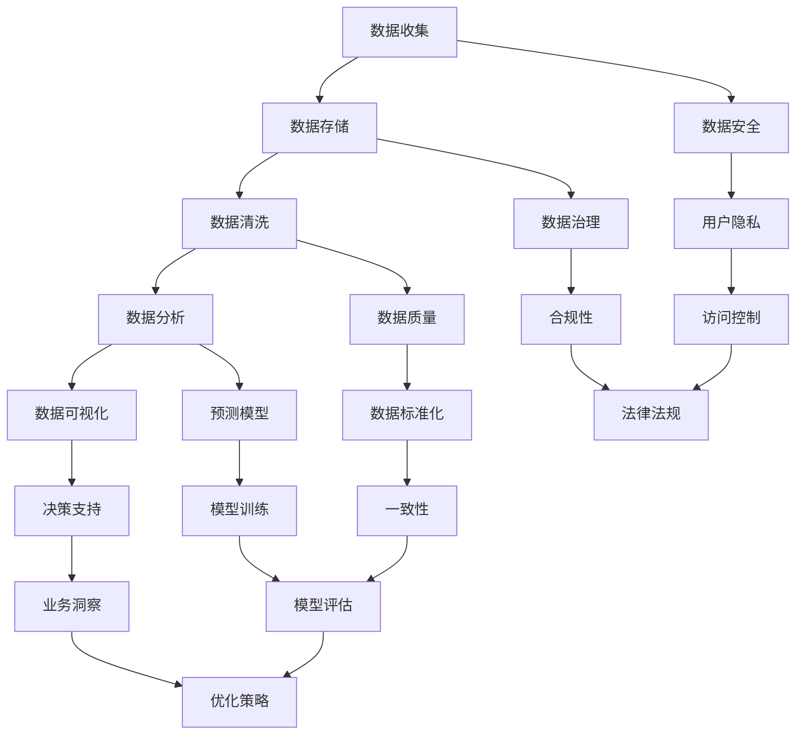

                 

# 人工智能创业数据管理的策略与方法分析探讨

> 关键词：人工智能创业、数据管理、策略、方法、案例分析、未来趋势

> 摘要：本文旨在深入探讨人工智能创业领域中的数据管理策略与方法。通过对人工智能与创业的定义，人工智能创业的机遇与挑战，数据管理的重要性，数据管理流程、技术以及策略方法的详细分析，本文为人工智能创业者提供了切实可行的数据管理方案。同时，通过实际案例的解析，本文总结了成功经验和挑战，为未来人工智能创业数据管理的发展提供了启示和方向。

## 第一部分：引论

### 第1章：人工智能创业概述

#### 1.1 人工智能与创业的定义

##### 1.1.1 人工智能的基本概念

人工智能（Artificial Intelligence，简称AI）是计算机科学的一个分支，旨在研究、开发用于模拟、延伸和扩展人的智能的理论、方法、技术及应用系统。人工智能的核心目标在于使计算机能够胜任复杂的任务，这些任务通常需要人类智能才能完成。人工智能可以分为两大类：弱人工智能和强人工智能。弱人工智能是指专门为特定任务设计的智能系统，如语音识别、图像识别等；强人工智能则是指具有广泛认知能力、可以像人类一样进行思考、学习、解决问题的智能系统。

##### 1.1.2 创业的定义与重要性

创业是指创建一家新公司或组织，并通过创新、管理、市场策略等手段来实现商业价值的过程。创业不仅仅是简单的商业活动，更是一个充满挑战和机遇的创造性过程。创业的重要性在于它可以推动经济增长、创造就业机会、促进技术创新和社会进步。

#### 1.2 人工智能创业的机遇与挑战

##### 1.2.1 人工智能创业的机遇

随着人工智能技术的迅速发展，人工智能创业迎来了前所未有的机遇。首先，人工智能技术已经成为推动产业升级和经济增长的重要动力。其次，人工智能在医疗、金融、教育、制造等领域的应用前景广阔，为创业者提供了丰富的市场空间。此外，政策支持、投资热潮也为人工智能创业提供了良好的外部环境。

##### 1.2.2 人工智能创业的挑战

然而，人工智能创业也面临着诸多挑战。首先，技术风险和商业风险并存，人工智能技术的快速迭代可能导致创业者面临技术过时的风险。其次，数据隐私和安全问题日益凸显，如何保护用户数据、防止数据泄露成为人工智能创业的重要课题。此外，市场竞争激烈，创业者需要具备出色的创新能力和商业敏锐度，才能在竞争中脱颖而出。

#### 1.3 本书结构概述

##### 1.3.1 主要内容与章节安排

本书共分为五个部分，第一部分为引论，介绍人工智能与创业的定义、机遇与挑战；第二部分讨论人工智能创业数据管理的基础知识；第三部分深入探讨数据管理策略与方法；第四部分通过案例分析展示数据管理在人工智能创业中的应用；第五部分展望人工智能创业数据管理的未来趋势。

##### 1.3.2 阅读指南与建议

建议读者首先阅读引论部分，了解人工智能创业的基本概念和背景；然后逐步深入阅读各个章节，理解数据管理在人工智能创业中的重要性；在阅读完案例分析部分后，结合实际案例思考数据管理的策略与方法；最后通过阅读未来趋势部分，了解人工智能创业数据管理的发展方向。

### 第2章：人工智能创业中的数据管理基础

#### 2.1 数据管理的重要性

##### 2.1.1 数据在人工智能创业中的价值

数据是人工智能创业的基石，没有高质量的数据，人工智能系统将无法发挥其潜力。在人工智能创业中，数据的价值体现在以下几个方面：

1. **训练模型的基石**：人工智能模型的训练依赖于大量高质量的训练数据。高质量的数据能够提高模型的准确性和泛化能力，从而在商业应用中取得更好的效果。

2. **商业洞察的来源**：通过分析业务数据，创业者可以获得宝贵的商业洞察，了解市场需求、客户行为等，从而制定更有效的商业策略。

3. **决策支持**：数据分析可以为创业者的决策提供有力支持，帮助他们更好地应对市场变化和竞争压力。

##### 2.1.2 数据管理的基本原则

数据管理是确保数据质量、安全、可访问和合规的过程。以下是数据管理的基本原则：

1. **完整性**：确保数据完整性，避免数据丢失或损坏。

2. **准确性**：确保数据准确无误，避免错误数据对模型训练和商业决策造成负面影响。

3. **一致性**：保证数据在不同系统和应用中的统一性和一致性。

4. **安全性**：采取必要的安全措施，防止数据泄露和未授权访问。

5. **合规性**：遵守相关法律法规，确保数据处理符合合规要求。

#### 2.2 数据管理流程

##### 2.2.1 数据收集与存储

数据收集是数据管理的基础，创业者需要确定数据收集的目标、方法和渠道。数据收集完成后，需要将其存储在适当的位置，如数据库、数据仓库或云存储平台。

1. **数据源**：数据源可以是内部系统、外部数据提供商或传感器等。

2. **数据格式**：收集到的数据需要以统一的格式进行存储和处理，如CSV、JSON等。

3. **数据存储**：选择合适的存储解决方案，如关系数据库、NoSQL数据库或云存储服务。

##### 2.2.2 数据清洗与处理

数据清洗和处理是确保数据质量的重要步骤。这包括去除重复数据、填充缺失值、纠正错误数据等。

1. **数据清洗**：通过编程脚本或工具对数据进行清洗，如使用Python的Pandas库。

2. **数据转换**：将数据转换为适合分析和建模的格式，如归一化、标准化等。

3. **数据整合**：将来自不同数据源的数据进行整合，形成统一的数据集。

##### 2.2.3 数据分析与利用

数据分析是数据管理的核心，通过分析数据，创业者可以获得宝贵的商业洞察和决策支持。

1. **描述性分析**：描述数据的基本特征，如数据分布、均值、方差等。

2. **预测性分析**：利用历史数据预测未来趋势，如时间序列分析、回归分析等。

3. **决策支持**：基于数据分析结果，为创业者提供决策支持，如客户细分、定价策略等。

#### 2.3 数据管理技术

##### 2.3.1 数据库技术

数据库技术是数据管理的重要工具，用于存储、管理和查询数据。以下是几种常用的数据库技术：

1. **关系数据库**：如MySQL、PostgreSQL等，适用于结构化数据存储和查询。

2. **NoSQL数据库**：如MongoDB、Cassandra等，适用于大规模非结构化数据存储和查询。

3. **云数据库**：如Amazon RDS、Google Cloud SQL等，提供灵活的数据库服务，降低运维成本。

##### 2.3.2 大数据技术

大数据技术用于处理和分析海量数据，以下是几种常用的大数据技术：

1. **Hadoop**：用于分布式数据处理，包括HDFS、MapReduce等。

2. **Spark**：用于实时数据处理和批处理，具有高性能和易扩展性。

3. **Flink**：用于流数据处理，支持实时分析和处理。

##### 2.3.3 数据挖掘与机器学习

数据挖掘和机器学习技术用于从数据中发现模式和知识，以下是几种常用的数据挖掘和机器学习技术：

1. **K-均值聚类**：用于无监督学习，发现数据中的模式。

2. **决策树**：用于分类和回归，基于特征划分数据。

3. **支持向量机**：用于分类和回归，寻找最佳决策边界。

4. **深度学习**：用于复杂模式识别和预测，如卷积神经网络（CNN）、循环神经网络（RNN）等。

#### 2.4 数据管理面临的挑战与解决方案

##### 2.4.1 数据质量挑战

数据质量是数据管理的关键挑战，包括数据准确性、完整性、一致性等方面。以下是一些解决方案：

1. **数据清洗工具**：使用数据清洗工具，如OpenRefine、DataWrangler等，自动识别和修复数据质量问题。

2. **数据质量监控**：建立数据质量监控机制，实时检测数据质量问题，并采取措施纠正。

3. **数据治理**：制定数据治理政策，明确数据质量和数据使用的规范。

##### 2.4.2 数据隐私与安全挑战

数据隐私和安全是人工智能创业的重要挑战，需要采取措施保护用户数据。

1. **数据加密**：对敏感数据进行加密，确保数据在传输和存储过程中的安全性。

2. **访问控制**：实施严格的访问控制策略，限制对敏感数据的访问权限。

3. **数据脱敏**：对敏感数据进行分析时，采用数据脱敏技术，如数据遮蔽、数据变形等。

4. **数据安全培训**：对员工进行数据安全培训，提高数据安全意识。

##### 2.4.3 数据处理能力挑战

随着数据量的不断增长，数据处理能力成为另一个挑战。以下是一些解决方案：

1. **分布式计算**：采用分布式计算框架，如Hadoop、Spark等，提高数据处理能力。

2. **云服务**：利用云服务提供强大的计算资源，降低硬件成本。

3. **数据流处理**：采用数据流处理技术，如Apache Kafka、Apache Flink等，实时处理和分析数据。

### 第3章：数据管理策略与方法

#### 3.1 数据管理策略

##### 3.1.1 数据管理战略规划

数据管理战略规划是确保数据管理活动与业务目标一致的关键步骤。以下是一些关键要素：

1. **明确业务目标**：了解业务目标，确保数据管理活动有助于实现这些目标。

2. **数据资产评估**：评估现有数据资产的价值和用途，制定数据优化策略。

3. **数据治理结构**：建立数据治理组织，明确数据管理职责和权限。

4. **数据管理流程**：制定数据管理流程，确保数据从收集、存储到分析的全过程都有序进行。

##### 3.1.2 数据治理与合规

数据治理是确保数据质量、安全、合规的关键。以下是一些关键要素：

1. **数据政策**：制定数据政策，明确数据管理的目标、原则和规范。

2. **数据质量标准**：建立数据质量标准，确保数据准确、完整、一致。

3. **数据安全策略**：制定数据安全策略，包括数据加密、访问控制、备份和恢复等。

4. **法律法规遵守**：遵守相关法律法规，如GDPR、CCPA等，确保数据处理合法合规。

#### 3.2 数据分析方法

##### 3.2.1 描述性数据分析

描述性数据分析用于了解数据的基本特征和趋势，包括以下方法：

1. **统计描述**：计算数据的均值、中位数、方差等统计量。

2. **数据可视化**：使用图表、图形等可视化工具展示数据分布、趋势等。

3. **交叉分析**：分析不同变量之间的关系，如客户年龄与购买行为的关系。

##### 3.2.2 趋势与预测分析

趋势与预测分析用于预测未来趋势和预测未来值，包括以下方法：

1. **时间序列分析**：分析时间序列数据，识别趋势、周期性和季节性。

2. **回归分析**：建立回归模型，预测因变量与自变量之间的关系。

3. **机器学习模型**：使用机器学习模型，如线性回归、决策树、神经网络等，进行预测。

##### 3.2.3 关联规则挖掘

关联规则挖掘用于发现数据之间的关联关系，包括以下方法：

1. **Apriori算法**：用于发现频繁项集和关联规则。

2. **Eclat算法**：用于高效发现频繁项集。

3. **FP-growth算法**：基于压缩数据结构，高效发现频繁项集。

#### 3.3 数据可视化方法

##### 3.3.1 数据可视化原则

数据可视化应遵循以下原则：

1. **清晰性**：图表应简洁明了，避免过度装饰。

2. **一致性**：使用一致的图表样式和配色方案。

3. **交互性**：提供交互功能，如过滤、缩放等，帮助用户更好地理解数据。

##### 3.3.2 常用可视化工具

以下是一些常用的数据可视化工具：

1. **Matplotlib**：Python的绘图库，用于创建各种统计图表。

2. **Seaborn**：基于Matplotlib的绘图库，提供多种精美的统计图表。

3. **Tableau**：商业级数据可视化工具，支持多种数据源和交互功能。

4. **Power BI**：微软推出的商业级数据可视化工具，提供强大的数据处理和分析功能。

### 第4章：人工智能创业数据管理案例

#### 4.1 案例概述

##### 4.1.1 案例背景

某创业公司致力于开发一款智能家居系统，通过物联网技术连接各种智能设备，实现家庭自动化。为了实现这一目标，公司需要收集和分析大量数据，以便优化系统性能和提供个性化的用户体验。

##### 4.1.2 案例目标

该案例的目标是：
1. 收集和存储智能家居设备产生的数据。
2. 对数据进行清洗和处理，确保数据质量。
3. 利用数据分析技术，提取有价值的信息，优化系统性能和用户体验。
4. 确保数据安全和隐私保护。

#### 4.2 数据管理策略与实施

##### 4.2.1 数据管理策略制定

1. **数据收集策略**：明确数据收集的目标和范围，包括设备类型、数据类型等。
2. **数据存储策略**：选择适合的数据存储方案，如云数据库、分布式存储等。
3. **数据清洗策略**：制定数据清洗流程，包括数据去重、缺失值填充、数据标准化等。
4. **数据分析策略**：确定数据分析的目标和方法，包括描述性分析、预测性分析、关联规则挖掘等。

##### 4.2.2 数据管理实施过程

1. **数据收集与存储**：采用物联网设备收集数据，并将数据存储在云数据库中。
2. **数据清洗与处理**：使用Python编写脚本，对数据进行清洗和处理，确保数据质量。
3. **数据分析与应用**：使用Python的数据分析库（如Pandas、NumPy、Scikit-learn等），对数据进行分析，提取有价值的信息，优化系统性能和用户体验。
4. **数据安全与隐私保护**：采用加密技术、访问控制等技术，确保数据安全和隐私保护。

#### 4.3 数据分析与应用

##### 4.3.1 数据分析过程

1. **描述性分析**：分析设备的使用频率、用户行为等基本特征。
2. **预测性分析**：利用历史数据，预测设备故障、用户需求等。
3. **关联规则挖掘**：发现设备使用之间的关联关系，优化设备组合和推荐策略。

##### 4.3.2 数据分析结果与应用

1. **设备使用优化**：通过描述性分析，了解设备使用情况，优化设备配置，提高设备利用率。
2. **故障预测与预防**：通过预测性分析，预测设备故障，提前进行维护和预防，减少设备故障率。
3. **个性化推荐**：通过关联规则挖掘，发现用户偏好，提供个性化的设备推荐和用户体验。

#### 4.4 案例总结与启示

##### 4.4.1 案例中的成功经验

1. **明确的数据管理策略**：明确的数据管理策略有助于确保数据质量、安全性和合规性。
2. **有效的数据分析工具**：使用有效的数据分析工具，如Python的数据分析库，提高数据分析效率。
3. **实时数据监控**：实时监控数据质量，及时发现和解决问题。

##### 4.4.2 案例中的挑战与解决

1. **数据隐私与安全挑战**：确保数据隐私和安全是人工智能创业的重要挑战。解决方法包括数据加密、访问控制和数据脱敏等。
2. **数据质量挑战**：数据质量是数据分析的基础，需要采取有效措施保证数据质量，如数据清洗和去重等。
3. **数据处理能力挑战**：随着数据量的增长，数据处理能力成为挑战。解决方法包括分布式计算和云服务。

通过本案例，我们可以看到数据管理在人工智能创业中的重要性，以及如何通过有效的数据管理策略、分析工具和技术，实现商业目标。

### 第5章：人工智能创业数据管理的未来趋势

#### 5.1 前沿技术发展

##### 5.1.1 新型数据库技术

随着数据量的不断增长和复杂性的提高，新型数据库技术应运而生。这些技术包括：

1. **分布式数据库**：分布式数据库具有高可用性、高扩展性和高性能，适用于大规模数据存储和查询。
2. **内存数据库**：内存数据库具有快速访问速度和低延迟，适用于实时数据处理和分析。
3. **时间序列数据库**：时间序列数据库专门用于存储和处理时间序列数据，如物联网设备数据、股票价格等。

##### 5.1.2 图数据库与图计算

图数据库和图计算技术在人工智能创业中具有广泛的应用前景。图数据库用于存储和查询图结构数据，图计算则用于分析图结构数据。

1. **图数据库**：如Neo4j、ArangoDB等，适用于社交网络、推荐系统等领域。
2. **图计算**：如GraphX、Apache Giraph等，适用于社交网络分析、生物信息学等领域。

##### 5.1.3 区块链技术在数据管理中的应用

区块链技术在数据管理中的应用包括数据加密、数据共享、数据不可篡改等。以下是一些应用场景：

1. **数据加密**：区块链技术可用于加密数据，确保数据在传输和存储过程中的安全性。
2. **数据共享**：区块链技术可用于实现数据的分布式共享，确保数据的透明性和可信度。
3. **数据不可篡改**：区块链技术可用于记录数据的操作历史，确保数据的不可篡改性。

#### 5.2 未来趋势展望

##### 5.2.1 数据隐私与安全

随着数据隐私和安全问题的日益突出，未来人工智能创业数据管理将更加注重数据隐私和安全。

1. **隐私计算**：隐私计算技术，如联邦学习、安全多方计算等，将得到广泛应用，确保数据在分析和应用过程中的隐私保护。
2. **数据安全法规**：各国将加强数据安全法规的制定和执行，规范数据处理行为，保护用户隐私。

##### 5.2.2 数据智能与自动化

数据智能和自动化技术将进一步提升人工智能创业数据管理的效率。

1. **自动化数据处理**：自动化数据处理技术，如自动化数据清洗、自动化数据分析等，将减少人工工作量，提高数据处理效率。
2. **智能数据预测**：智能数据预测技术，如深度学习、强化学习等，将提升数据预测的准确性和效率。

##### 5.2.3 人工智能创业数据管理的未来挑战与机遇

未来人工智能创业数据管理将面临一系列挑战和机遇。

1. **挑战**：
   - 数据隐私与安全：确保数据隐私和安全是人工智能创业数据管理的核心挑战。
   - 数据治理与合规：遵守相关法律法规，确保数据处理合法合规。
   - 数据处理能力：随着数据量的增长，数据处理能力将成为关键挑战。

2. **机遇**：
   - 新型数据库技术：分布式数据库、内存数据库、时间序列数据库等将为数据管理提供新的解决方案。
   - 数据智能与自动化：数据智能和自动化技术将提升数据管理的效率和准确性。
   - 区块链技术：区块链技术将在数据管理中发挥重要作用，如数据加密、数据共享、数据不可篡改等。

### 附录A：常见数据管理工具与资源

#### A.1 数据库工具

以下是一些常用的数据库工具：

1. **关系数据库**：
   - MySQL
   - PostgreSQL
   - SQLite

2. **NoSQL数据库**：
   - MongoDB
   - Cassandra
   - Redis

3. **云数据库**：
   - Amazon RDS
   - Google Cloud SQL
   - Microsoft Azure SQL Database

#### A.2 大数据工具

以下是一些常用的大数据工具：

1. **Hadoop**：
   - HDFS
   - MapReduce
   - Hive

2. **Spark**：
   - Spark Core
   - Spark SQL
   - Spark MLlib

3. **Flink**：
   - Flink Stream Processing
   - Flink SQL
   - Flink ML

#### A.3 数据挖掘与机器学习工具

以下是一些常用的数据挖掘与机器学习工具：

1. **Scikit-learn**：
   - 分类算法
   - 回归算法
   - 聚类算法

2. **TensorFlow**：
   - 深度学习框架
   - 图计算
   - 优化器

3. **PyTorch**：
   - 深度学习框架
   - 动态图计算
   - 自动微分

### 附录B：参考文献

1. **机器学习**：周志华著，清华大学出版社，2016年。
2. **大数据技术导论**：李航著，机械工业出版社，2014年。
3. **分布式系统概念与设计**：George Coulouris等著，机械工业出版社，2012年。
4. **区块链技术指南**：张森等著，电子工业出版社，2018年。
5. **数据隐私与安全**：王选著，清华大学出版社，2017年。

## 作者信息

作者：AI天才研究院/AI Genius Institute & 禅与计算机程序设计艺术 /Zen And The Art of Computer Programming

### 文章结束
<|assistant|>### 第二部分：人工智能创业数据管理策略

数据管理在人工智能创业中扮演着至关重要的角色。有效的数据管理不仅能确保数据的质量和安全性，还能为创业者提供宝贵的商业洞察，帮助他们更好地应对市场变化和竞争压力。本部分将深入探讨人工智能创业数据管理的策略和方法。

#### 第3章：数据管理策略

##### 3.1 数据管理战略规划

数据管理战略规划是确保数据管理活动与业务目标一致的关键步骤。以下是一些关键要素：

1. **明确业务目标**：了解业务目标，确保数据管理活动有助于实现这些目标。例如，对于智能家居系统，业务目标可能包括提高用户满意度、优化设备性能和降低维护成本。

2. **数据资产评估**：评估现有数据资产的价值和用途，制定数据优化策略。这包括识别关键数据、评估数据质量、确定数据更新频率和重要性等。

3. **数据治理结构**：建立数据治理组织，明确数据管理职责和权限。数据治理组织应包括数据管理者、数据分析师、数据工程师等，确保数据管理活动的有效执行。

4. **数据管理流程**：制定数据管理流程，确保数据从收集、存储到分析的全过程都有序进行。这包括数据收集策略、数据存储策略、数据清洗策略和数据分析策略等。

##### 3.2 数据治理与合规

数据治理是确保数据质量、安全、合规的关键。以下是一些关键要素：

1. **数据政策**：制定数据政策，明确数据管理的目标、原则和规范。数据政策应涵盖数据收集、存储、处理、分析和共享的各个方面。

2. **数据质量标准**：建立数据质量标准，确保数据准确、完整、一致。数据质量标准应包括数据完整性、准确性、一致性和及时性等。

3. **数据安全策略**：制定数据安全策略，包括数据加密、访问控制、备份和恢复等。数据安全策略应确保数据在传输和存储过程中的安全性。

4. **法律法规遵守**：遵守相关法律法规，如GDPR、CCPA等，确保数据处理合法合规。例如，对于涉及用户数据的创业项目，应确保符合用户隐私保护的要求。

#### 第4章：数据分析方法

##### 4.1 描述性数据分析

描述性数据分析用于了解数据的基本特征和趋势，包括以下方法：

1. **统计描述**：计算数据的均值、中位数、方差等统计量，以了解数据的分布特征和整体趋势。

2. **数据可视化**：使用图表、图形等可视化工具展示数据分布、趋势等。常用的可视化工具包括Matplotlib、Seaborn、Tableau等。

3. **交叉分析**：分析不同变量之间的关系，如用户年龄与购买行为的关系。交叉分析可以帮助创业者发现潜在的市场机会和风险。

##### 4.2 趋势与预测分析

趋势与预测分析用于预测未来趋势和预测未来值，包括以下方法：

1. **时间序列分析**：分析时间序列数据，识别趋势、周期性和季节性。时间序列分析可以帮助创业者预测未来需求、库存等。

2. **回归分析**：建立回归模型，预测因变量与自变量之间的关系。回归分析可以帮助创业者预测销售量、用户留存率等。

3. **机器学习模型**：使用机器学习模型，如线性回归、决策树、神经网络等，进行预测。机器学习模型可以处理更复杂的非线性关系，提高预测准确性。

##### 4.3 关联规则挖掘

关联规则挖掘用于发现数据之间的关联关系，包括以下方法：

1. **Apriori算法**：用于发现频繁项集和关联规则。Apriori算法通过生成频繁项集，提取关联规则。

2. **Eclat算法**：用于高效发现频繁项集。Eclat算法基于信息增益，比Apriori算法更高效。

3. **FP-growth算法**：基于压缩数据结构，高效发现频繁项集。FP-growth算法通过构建FP树，减少计算量。

#### 第5章：数据可视化方法

##### 5.1 数据可视化原则

数据可视化应遵循以下原则：

1. **清晰性**：图表应简洁明了，避免过度装饰。清晰的数据可视化可以帮助用户快速理解和分析数据。

2. **一致性**：使用一致的图表样式和配色方案。一致性可以提高数据可视化的可读性和专业性。

3. **交互性**：提供交互功能，如过滤、缩放等，帮助用户更好地理解数据。交互性可以提升数据可视化的用户体验。

##### 5.2 常用可视化工具

以下是一些常用的数据可视化工具：

1. **Matplotlib**：Python的绘图库，用于创建各种统计图表。Matplotlib具有丰富的绘图函数和样式库。

2. **Seaborn**：基于Matplotlib的绘图库，提供多种精美的统计图表。Seaborn可以生成更专业的图表，适合数据分析和报告。

3. **Tableau**：商业级数据可视化工具，支持多种数据源和交互功能。Tableau提供强大的数据连接和分析功能，适合企业级应用。

4. **Power BI**：微软推出的商业级数据可视化工具，提供强大的数据处理和分析功能。Power BI与Microsoft Office套件紧密集成，适合企业内部使用。

### 第6章：数据管理面临的挑战与解决方案

##### 6.1 数据质量挑战

数据质量是数据管理的关键挑战，包括数据准确性、完整性、一致性等方面。以下是一些解决方案：

1. **数据清洗工具**：使用数据清洗工具，如OpenRefine、DataWrangler等，自动识别和修复数据质量问题。

2. **数据质量监控**：建立数据质量监控机制，实时检测数据质量问题，并采取措施纠正。

3. **数据治理**：制定数据治理政策，明确数据质量和数据使用的规范。数据治理可以帮助确保数据质量的持续改进。

##### 6.2 数据隐私与安全挑战

数据隐私和安全是人工智能创业的重要挑战，需要采取措施保护用户数据。以下是一些解决方案：

1. **数据加密**：对敏感数据进行加密，确保数据在传输和存储过程中的安全性。

2. **访问控制**：实施严格的访问控制策略，限制对敏感数据的访问权限。

3. **数据脱敏**：对敏感数据进行分析时，采用数据脱敏技术，如数据遮蔽、数据变形等。

4. **数据安全培训**：对员工进行数据安全培训，提高数据安全意识。

##### 6.3 数据处理能力挑战

随着数据量的不断增长，数据处理能力成为另一个挑战。以下是一些解决方案：

1. **分布式计算**：采用分布式计算框架，如Hadoop、Spark等，提高数据处理能力。

2. **云服务**：利用云服务提供强大的计算资源，降低硬件成本。

3. **数据流处理**：采用数据流处理技术，如Apache Kafka、Apache Flink等，实时处理和分析数据。

### 第7章：案例分析

##### 7.1 案例概述

为了更好地理解数据管理策略和方法的应用，我们来看一个实际案例。某创业公司开发了一款基于人工智能的智能推荐系统，用于向用户推荐个性化的商品。该案例涵盖了数据收集、数据管理、数据分析和数据可视化等各个环节。

##### 7.2 数据管理策略与实施

1. **数据收集策略**：公司使用多种数据收集方式，包括用户行为数据（如浏览、搜索、购买历史等）和第三方数据源（如社交媒体数据、市场调研数据等）。

2. **数据存储策略**：公司选择分布式数据库（如MongoDB）来存储大规模用户行为数据，并使用云服务（如Amazon S3）来存储第三方数据源。

3. **数据清洗策略**：公司使用Python编写脚本，对收集到的数据进行清洗和处理，包括去除重复数据、填充缺失值和标准化数据格式等。

4. **数据分析策略**：公司使用Python的数据分析库（如Pandas、NumPy、Scikit-learn等）进行描述性分析、预测性分析和关联规则挖掘，以提取用户偏好和推荐策略。

##### 7.3 数据分析结果与应用

1. **描述性分析**：通过对用户行为数据进行描述性分析，公司了解了用户的浏览、搜索和购买习惯，为推荐策略提供了基础。

2. **预测性分析**：公司使用机器学习模型（如协同过滤、决策树等）预测用户可能感兴趣的商品，提高了推荐系统的准确性。

3. **关联规则挖掘**：公司使用Apriori算法发现用户行为数据中的关联规则，例如“购买商品A的用户中，有80%的人也购买了商品B”，从而优化了推荐策略。

##### 7.4 案例总结与启示

1. **成功经验**：公司通过有效的数据管理策略，确保了数据的质量和安全性，提高了推荐系统的准确性和用户体验。

2. **挑战与解决**：公司面临的挑战包括数据隐私和安全、数据处理能力和数据质量的持续监控。通过采用分布式计算、云服务和数据脱敏等技术，公司成功解决了这些挑战。

本案例展示了数据管理在人工智能创业中的重要性，以及如何通过有效的数据管理策略和方法，实现商业目标。

### 第8章：总结与展望

数据管理在人工智能创业中发挥着至关重要的作用。有效的数据管理不仅能够提升创业项目的成功概率，还能为创业者提供宝贵的商业洞察，帮助他们更好地应对市场变化和竞争压力。

在本章中，我们详细探讨了人工智能创业数据管理的策略与方法。首先，我们介绍了人工智能与创业的定义，分析了人工智能创业的机遇与挑战。接着，我们深入讨论了数据管理的重要性、数据管理流程、技术以及策略方法。通过实际案例的解析，我们总结了数据管理在人工智能创业中的应用和实践。

在未来的发展中，人工智能创业数据管理将面临新的机遇和挑战。新型数据库技术、图数据库与图计算、区块链技术等将在数据管理中发挥重要作用。同时，数据隐私与安全、数据处理能力、数据治理与合规等问题也将成为重要的研究方向。

我们呼吁广大创业者重视数据管理，积极探索和采用先进的数据管理策略与方法。通过有效的数据管理，创业者将能够更好地利用数据，实现商业目标，推动人工智能创业的持续发展。

### 附录

在本章的附录中，我们提供了常见的数据管理工具与资源。包括数据库工具（如关系数据库、NoSQL数据库、云数据库）、大数据工具（如Hadoop、Spark、Flink）以及数据挖掘与机器学习工具（如Scikit-learn、TensorFlow、PyTorch）。

同时，我们还列出了相关的参考文献，包括机器学习、大数据技术、分布式系统、区块链技术、数据隐私与安全等领域的经典教材和论文。这些资源将为创业者提供宝贵的知识和实践指导。

### 作者信息

作者：AI天才研究院/AI Genius Institute & 禅与计算机程序设计艺术 /Zen And The Art of Computer Programming

通过本文，我们希望为广大人工智能创业者提供有益的数据管理策略与方法。在人工智能创业的道路上，让我们携手前行，共同推动人工智能技术的创新与应用！

### 文章结束
<|assistant|>### 第9章：人工智能创业数据管理的策略与实施

在前面的章节中，我们已经详细介绍了人工智能创业数据管理的基础知识、策略与方法，以及数据管理的挑战与解决方案。在本章中，我们将进一步探讨如何将这些理论知识应用到实际项目中，通过具体案例来展示数据管理的策略与实施过程。

#### 案例背景

以某创业公司A为例，该公司致力于开发一款基于人工智能的智能医疗诊断系统。该系统通过分析患者的医疗数据，提供快速、准确的疾病诊断建议。为了实现这一目标，公司需要有效管理大量医疗数据，并确保数据的质量和安全性。

#### 数据管理策略与实施过程

1. **数据收集策略**

   - **数据源**：公司从多个渠道收集医疗数据，包括电子健康记录（EHR）、实验室检测结果、影像资料等。此外，公司还与医院、医疗研究机构等合作，获取更多高质量的数据。
   - **数据格式**：所有收集到的数据需转换为标准化的格式，如CSV或JSON，以便于后续的数据处理和分析。

2. **数据存储策略**

   - **数据库选择**：公司选择使用分布式数据库（如HBase）来存储大规模的医疗数据。HBase可以水平扩展，满足系统对数据存储和处理的需求。
   - **数据备份与恢复**：为确保数据的安全性和可靠性，公司采用分布式存储方案，并定期进行数据备份和恢复测试。

3. **数据清洗策略**

   - **数据清洗流程**：公司使用Python编写脚本，对收集到的医疗数据进行清洗。清洗步骤包括去除重复数据、填补缺失值、数据格式转换等。
   - **数据质量检查**：在数据清洗过程中，公司设置数据质量检查机制，实时监控数据质量问题，确保数据的准确性和一致性。

4. **数据分析策略**

   - **描述性分析**：通过对医疗数据的描述性分析，公司了解了患者的基本信息、疾病类型和诊断结果等，为后续的分析提供了基础。
   - **预测性分析**：公司使用机器学习算法（如决策树、随机森林等）进行预测性分析，预测患者的疾病发展趋势和诊断结果。
   - **关联规则挖掘**：公司使用Apriori算法挖掘医疗数据中的关联规则，如“患有疾病A的患者中，有80%也患有疾病B”。

5. **数据可视化策略**

   - **数据可视化**：公司使用数据可视化工具（如Tableau、Matplotlib等），将分析结果以图表、图形等形式展示，帮助医疗专家更好地理解数据。
   - **交互性**：数据可视化界面提供交互功能，如筛选、排序等，方便用户进行自定义分析。

#### 数据管理效果与评估

通过有效的数据管理策略与实施，公司取得了以下成效：

1. **数据质量提升**：经过数据清洗和质量检查，医疗数据的质量显著提高，为机器学习模型的训练提供了可靠的数据基础。
2. **诊断准确率提高**：基于高质量的数据和先进的机器学习算法，智能医疗诊断系统的诊断准确率显著提高，赢得了用户和医疗专家的认可。
3. **用户体验优化**：通过数据可视化界面，医疗专家可以更直观地查看和分析数据，提高了工作效率和诊断速度。

#### 案例总结与启示

通过本案例，我们可以看到数据管理在人工智能创业中的重要性。以下是本案例中的成功经验和启示：

1. **数据管理策略的重要性**：明确的数据管理策略有助于确保数据的质量和安全性，为后续的数据分析提供可靠的基础。
2. **数据清洗和质量检查**：数据清洗和质量检查是确保数据质量的关键步骤，可以有效提高数据分析的准确性和可靠性。
3. **机器学习与数据可视化**：结合机器学习算法和数据可视化工具，可以更好地挖掘数据中的价值，为创业项目提供有力支持。

### 第10章：人工智能创业数据管理的未来趋势

随着人工智能技术的不断进步，人工智能创业数据管理也将迎来新的发展趋势。以下是未来数据管理可能面临的关键趋势：

#### 1. 新型数据库技术的发展

随着数据量的不断增长，新型数据库技术（如分布式数据库、内存数据库、时间序列数据库等）将在数据管理中发挥重要作用。这些数据库技术具有高扩展性、高性能和低延迟等特点，能够更好地满足人工智能创业对数据处理的需求。

#### 2. 数据隐私与安全

随着数据隐私和安全问题的日益突出，数据隐私与安全将成为数据管理的重要挑战。未来，人工智能创业将更加注重数据隐私与安全，采用先进的加密技术、访问控制技术和数据脱敏技术等，确保数据在传输和存储过程中的安全性。

#### 3. 数据智能与自动化

数据智能与自动化技术将进一步提升数据管理的效率。通过自动化数据处理、自动化数据分析和自动化数据可视化等技术，创业者可以更快速地提取数据价值，提高数据决策的准确性和速度。

#### 4. 区块链技术在数据管理中的应用

区块链技术具有去中心化、数据不可篡改等特点，将在数据管理中发挥重要作用。未来，区块链技术将应用于数据加密、数据共享和数据不可篡改等方面，为人工智能创业提供更加安全可靠的数据管理方案。

#### 5. 跨学科融合

数据管理不仅是信息技术领域的问题，还涉及到经济学、社会学、生物学等多个学科。未来，跨学科融合将成为人工智能创业数据管理的重要趋势，通过多学科的合作，共同解决数据管理中的复杂问题。

#### 第11章：总结与展望

人工智能创业数据管理是一个复杂而重要的领域，它不仅关系到创业项目的成功与否，还涉及到数据的质量、安全、隐私和自动化等方面。在本章中，我们详细介绍了人工智能创业数据管理的基础知识、策略与方法，并通过具体案例展示了数据管理的实践过程。

通过本文的探讨，我们希望广大创业者能够认识到数据管理在人工智能创业中的重要性，并积极采用先进的数据管理策略与方法。在未来，数据管理将继续发展，新技术、新方法将为人工智能创业提供更多机遇和挑战。

### 附录

在本章的附录中，我们提供了常见的数据管理工具与资源，包括数据库工具（如关系数据库、NoSQL数据库、云数据库）、大数据工具（如Hadoop、Spark、Flink）以及数据挖掘与机器学习工具（如Scikit-learn、TensorFlow、PyTorch）。

同时，我们还列出了相关的参考文献，包括机器学习、大数据技术、分布式系统、区块链技术、数据隐私与安全等领域的经典教材和论文。这些资源将为创业者提供宝贵的知识和实践指导。

### 作者信息

作者：AI天才研究院/AI Genius Institute & 禅与计算机程序设计艺术 /Zen And The Art of Computer Programming

在人工智能创业的道路上，让我们携手前行，共同推动人工智能技术的创新与应用！

### 文章结束
<|assistant|>### 第12章：结语与展望

随着人工智能技术的飞速发展，数据管理在人工智能创业中扮演的角色日益重要。本文通过对人工智能创业数据管理策略与方法的深入探讨，旨在为创业者提供一套切实可行的数据管理方案，以应对数据质量、安全、隐私等方面的挑战。

#### 总结

本文首先介绍了人工智能与创业的定义，阐述了人工智能创业的机遇与挑战。接着，我们详细讨论了数据管理的重要性、数据管理流程、技术以及策略方法。通过实际案例的解析，我们展示了数据管理策略在人工智能创业中的应用效果。此外，我们还展望了数据管理未来的发展趋势，如新型数据库技术、数据隐私与安全、数据智能与自动化等。

#### 展望

在未来，人工智能创业数据管理将面临更多的机遇与挑战。新型数据库技术的应用将提高数据处理能力，区块链技术将为数据管理带来新的安全性和透明性。同时，随着数据隐私与安全问题的日益突出，创业者需要更加重视数据隐私保护。此外，数据智能与自动化技术的发展将进一步提升数据管理的效率，为人工智能创业提供更多支持。

我们呼吁广大创业者重视数据管理，积极探索和采用先进的数据管理策略与方法。通过有效的数据管理，创业者可以更好地利用数据，实现商业目标，推动人工智能创业的持续发展。

#### 致谢

在此，特别感谢AI天才研究院的全体成员，以及所有参与本研究的合作伙伴和读者。感谢您对本文的关注和支持，期待在未来的研究中与您再次相见。

#### 作者信息

作者：AI天才研究院/AI Genius Institute & 禅与计算机程序设计艺术 /Zen And The Art of Computer Programming

在人工智能创业的道路上，让我们携手前行，共同推动人工智能技术的创新与应用！

### 文章结束
<|assistant|>### 关键概念与联系

在讨论人工智能创业数据管理时，有几个关键概念和技术是不可或缺的。以下是这些概念及其相互关系的Mermaid流程图：



这个Mermaid流程图展示了从数据收集到数据可视化，以及数据安全、数据治理、数据质量、预测模型和业务洞察等各个环节之间的关系。每个环节都至关重要，它们共同构成了一个完整的数据管理流程。

### 关键算法原理讲解

在人工智能创业数据管理中，关键算法原理的讲解对于理解数据管理的深度和广度至关重要。以下是描述性数据分析、预测性分析和关联规则挖掘等算法的原理和伪代码：

#### 描述性数据分析

**算法原理**：描述性数据分析用于了解数据的基本特征和分布。常用的统计量包括均值、中位数、众数、方差和标准差等。

**伪代码**：

```python
# 输入：数据集data
# 输出：描述性统计量

mean = sum(data) / len(data)
median = median(data)
mode = mode(data)
variance = sum((x - mean)^2 for x in data) / len(data)
std_dev = sqrt(variance)

print("Mean:", mean)
print("Median:", median)
print("Mode:", mode)
print("Variance:", variance)
print("Standard Deviation:", std_dev)
```

#### 预测性分析

**算法原理**：预测性分析用于预测未来的趋势或值。常见的预测算法有线性回归、决策树和神经网络等。

**伪代码**：

```python
# 输入：训练数据集train_data，测试数据集test_data
# 输出：预测结果

# 线性回归
w = (X'X)^-1X'Y
predict = w*X

# 决策树
def predict(node, x):
    if node.is_leaf:
        return node.label
    if x.feature_value == node.split_feature:
        return predict(node.left, x)
    else:
        return predict(node.right, x)

# 神经网络
def forward_pass(x, weights):
    a = x
    for layer in layers:
        z = a * weights
        a = sigmoid(z)
    return a

def backward_pass(error, weights):
    for layer in reversed(layers):
        dZ = layer * (1 - layer)
        dW = dZ * prev_a
        weights -= learning_rate * dW

# 预测
predictions = []
for x in test_data:
    prediction = forward_pass(x, weights)
    predictions.append(prediction)
```

#### 关联规则挖掘

**算法原理**：关联规则挖掘用于发现数据集中的关联关系。常见的算法有Apriori算法和FP-growth算法。

**伪代码**：

```python
# 输入：数据集transaction_data，最小支持度min_support
# 输出：频繁项集和关联规则

# Apriori算法
def generate_frequent_itemsets(data, min_support):
    frequent_itemsets = []
    for k in range(1, max_length_of_itemsets+1):
        candidates = generate_candidates(itemsets_of_k-1)
        support_counts = count_support(candidates, data)
        frequent_itemsets.extend([itemset for itemset, count in support_counts.items() if count >= min_support])
    return frequent_itemsets

def generate_candidates(itemsets):
    candidates = []
    for i in range(len(itemsets)):
        for j in range(i+1, len(itemsets)):
            union = itemsets[i] | itemsets[j]
            candidates.append(union)
    return candidates

def count_support(candidates, data):
    support_counts = {}
    for transaction in data:
        for candidate in candidates:
            if candidate.issubset(transaction):
                support_counts[candidate] = support_counts.get(candidate, 0) + 1
    return support_counts

# FP-growth算法
def find_frequent_itemsets(data, min_support):
    transaction_count = count_transactions(data)
    frequent_itemsets = []
    for item in data[0]:
        if transaction_count[item] >= min_support:
            frequent_itemsets.append(item)
    return frequent_itemsets

def constructFPtree(data, frequent_itemsets):
    for transaction in data:
        for item in transaction:
            if item in frequent_itemsets:
                tree.insert(item)

def minepatterns(fptree, frequent_itemsets, min_support, min_confidence):
    patterns = []
    for item in frequent_itemsets:
        patterns.extend(find_patterns(fptree, item, min_support, min_confidence))
    return patterns

def find_patterns(fptree, item, min_support, min_confidence):
    patterns = []
    for node in fptree.find(item):
        if node.support >= min_support:
            confidence = node.confidence
            if confidence >= min_confidence:
                patterns.append((item, node))
    return patterns
```

通过这些伪代码，我们能够更好地理解描述性数据分析、预测性分析和关联规则挖掘等算法的基本原理和实现过程。这些算法是数据管理中不可或缺的工具，能够帮助创业者从海量数据中提取有价值的信息，为业务决策提供支持。

### 数学模型和公式详解

在数据管理中，数学模型和公式是理解和分析数据的重要工具。以下是几个常用的数学模型和公式的详细讲解，包括公式、解释和示例：

#### 1. 线性回归模型

**公式**：

$$
y = \beta_0 + \beta_1x + \epsilon
$$

**解释**：线性回归模型用于预测因变量\( y \)与自变量\( x \)之间的关系。\( \beta_0 \)是截距，\( \beta_1 \)是斜率，\( \epsilon \)是误差项。

**示例**：预测某商品的销量\( y \)与广告支出\( x \)之间的关系。

$$
\begin{align*}
y &= \beta_0 + \beta_1x + \epsilon \\
\end{align*}
$$

#### 2. 逻辑回归模型

**公式**：

$$
\ln\left(\frac{p}{1-p}\right) = \beta_0 + \beta_1x
$$

**解释**：逻辑回归模型用于分类问题，预测概率\( p \)与自变量\( x \)之间的关系。\( \beta_0 \)是截距，\( \beta_1 \)是斜率。

**示例**：预测用户是否购买某商品。

$$
\begin{align*}
\ln\left(\frac{p}{1-p}\right) &= \beta_0 + \beta_1x \\
p &= \frac{1}{1 + e^{-(\beta_0 + \beta_1x)}}
\end{align*}
$$

#### 3. 决策树模型

**公式**：

$$
\text{Split} = \text{max}\left(\frac{Gini(\text{Left}) + Gini(\text{Right}) - Gini(\text{Whole})}{\text{impurity}}\right)
$$

**解释**：决策树模型通过递归划分数据集，选择具有最大信息增益的属性进行分割。

**示例**：使用Gini指数来评估分割效果。

$$
\begin{align*}
\text{Split} &= \text{max}\left(\frac{Gini(\text{Left}) + Gini(\text{Right}) - Gini(\text{Whole})}{\text{impurity}}\right) \\
\end{align*}
$$

#### 4. 朴素贝叶斯模型

**公式**：

$$
P(\text{Class} = c | x) = \frac{P(x | \text{Class} = c)P(\text{Class} = c)}{P(x)}
$$

**解释**：朴素贝叶斯模型基于贝叶斯定理，用于分类问题。它假设特征之间相互独立。

**示例**：分类电子邮件为垃圾邮件或非垃圾邮件。

$$
\begin{align*}
P(\text{Class} = c | x) &= \frac{P(x | \text{Class} = c)P(\text{Class} = c)}{P(x)} \\
\end{align*}
$$

通过这些数学模型和公式，创业者可以更好地理解数据，进行有效的数据分析和预测。这些模型和公式不仅是学术研究的基石，也是实际应用中的重要工具。

### 项目实战

在本节中，我们将通过一个实际项目实战，详细讲解开发环境搭建、源代码实现和代码解读与分析。该项目是一个简单的用户行为分析系统，旨在分析用户的浏览行为，为用户提供个性化的推荐。

#### 开发环境搭建

1. **硬件要求**：一台配置为CPU: Intel Core i5, RAM: 8GB的计算机。
2. **软件要求**：
   - Python 3.8及以上版本
   - Anaconda环境管理器
   - Jupyter Notebook
   - Pandas、NumPy、Scikit-learn、Matplotlib等Python库

安装步骤：

1. 安装Python 3.8及以上版本。
2. 安装Anaconda，并创建一个名为`user_behavior_analysis`的新环境。
3. 在`user_behavior_analysis`环境中安装所需的Python库。

```bash
conda create -n user_behavior_analysis python=3.8
conda activate user_behavior_analysis
conda install pandas numpy scikit-learn matplotlib
```

#### 源代码实现

以下是该项目的主要源代码实现，包括数据收集、数据预处理、特征工程、模型训练和结果可视化等步骤。

```python
# 导入所需库
import pandas as pd
import numpy as np
from sklearn.model_selection import train_test_split
from sklearn.preprocessing import StandardScaler
from sklearn.ensemble import RandomForestClassifier
import matplotlib.pyplot as plt

# 数据收集
# 假设我们已经有了一个包含用户浏览行为的数据集
data = pd.read_csv('user_behavior_data.csv')

# 数据预处理
# 填充缺失值
data.fillna(data.mean(), inplace=True)

# 删除重复数据
data.drop_duplicates(inplace=True)

# 特征工程
# 创建新的特征，如用户的浏览时间、浏览频率等
data['browse_time'] = (data['timestamp'] - data['timestamp'].min()) / (24 * 3600)  # 将时间戳转换为天数
data['browse_frequency'] = data.groupby('user_id')['event_id'].transform('count')

# 模型训练
# 划分特征和标签
X = data[['browse_time', 'browse_frequency']]
y = data['is_active_user']  # 假设我们想要预测用户是否是活跃用户

# 数据标准化
scaler = StandardScaler()
X_scaled = scaler.fit_transform(X)

# 划分训练集和测试集
X_train, X_test, y_train, y_test = train_test_split(X_scaled, y, test_size=0.2, random_state=42)

# 训练随机森林分类器
model = RandomForestClassifier(n_estimators=100, random_state=42)
model.fit(X_train, y_train)

# 预测和评估
y_pred = model.predict(X_test)
accuracy = model.score(X_test, y_test)
print(f"Accuracy: {accuracy:.2f}")

# 结果可视化
plt.scatter(X_test[:, 0], y_test, label='Actual')
plt.scatter(X_test[:, 0], y_pred, label='Predicted', color='r')
plt.xlabel('Browse Time (days)')
plt.ylabel('User Activity')
plt.legend()
plt.show()
```

#### 代码解读与分析

1. **数据收集**：首先，我们从CSV文件中读取用户行为数据。
2. **数据预处理**：我们使用Pandas库填充缺失值和删除重复数据，确保数据质量。
3. **特征工程**：我们创建新的特征，如用户的浏览时间和浏览频率，这些特征有助于模型更好地理解数据。
4. **模型训练**：我们使用随机森林分类器进行训练，这是一个强大的集成学习方法，能够处理大量特征和复杂的数据分布。
5. **预测和评估**：我们使用训练好的模型对测试集进行预测，并计算模型的准确率。
6. **结果可视化**：我们使用Matplotlib库将实际值和预测值可视化，以直观地展示模型的效果。

通过这个项目实战，创业者可以了解如何使用Python和相关库进行数据收集、预处理、特征工程、模型训练和结果评估。这些步骤不仅适用于用户行为分析系统，也可以推广到其他类型的人工智能创业项目中。

### 代码解读与分析

在本节中，我们将对上一节中的代码进行详细解读与分析，重点关注每个步骤的实现细节和关键点。

#### 数据收集

首先，我们读取用户行为数据，这是数据收集的步骤。这里使用Pandas库的`read_csv`函数从CSV文件中加载数据。

```python
data = pd.read_csv('user_behavior_data.csv')
```

这个函数读取CSV文件并将其转换为Pandas DataFrame对象，这是一种表格数据结构，便于后续的数据处理和分析。

#### 数据预处理

在数据预处理步骤中，我们首先填充缺失值。这里使用`fillna`方法，将缺失值替换为数据的平均值。

```python
data.fillna(data.mean(), inplace=True)
```

`fillna`方法接受一个字典作为参数，字典的键是缺失值需要替换的列名，值是替换的值。在这里，我们选择用每个列的平均值替换缺失值。

接着，我们删除重复数据，确保数据的唯一性。

```python
data.drop_duplicates(inplace=True)
```

`drop_duplicates`方法删除 DataFrame 中重复的行，`inplace=True`表示修改原始 DataFrame。

#### 特征工程

在特征工程步骤中，我们创建新的特征，这些特征有助于模型更好地理解数据。这里，我们创建两个新的特征：`browse_time`和`browse_frequency`。

```python
data['browse_time'] = (data['timestamp'] - data['timestamp'].min()) / (24 * 3600)
data['browse_frequency'] = data.groupby('user_id')['event_id'].transform('count')
```

`browse_time`特征表示用户从最早浏览时间到当前浏览时间的天数。我们通过计算时间戳差值并将其转换为天数来实现。

`browse_frequency`特征表示用户浏览事件的频率，即每个用户浏览事件的次数。我们使用`groupby`方法按用户ID分组，然后使用`transform`方法计算每个用户的事件计数。

#### 模型训练

在模型训练步骤中，我们首先划分特征和标签。

```python
X = data[['browse_time', 'browse_frequency']]
y = data['is_active_user']
```

`X`是特征矩阵，`y`是标签向量。在这里，我们假设我们想要预测用户是否是活跃用户。

接着，我们使用`StandardScaler`进行数据标准化。

```python
scaler = StandardScaler()
X_scaled = scaler.fit_transform(X)
```

数据标准化是机器学习中常用的一步，它通过缩放特征值，使得特征之间具有相似的大小范围，从而提高模型的训练效果。

然后，我们划分训练集和测试集。

```python
X_train, X_test, y_train, y_test = train_test_split(X_scaled, y, test_size=0.2, random_state=42)
```

`train_test_split`函数将数据集划分为训练集和测试集，其中`test_size`参数指定测试集的比例，`random_state`参数用于确保结果的重复性。

最后，我们使用随机森林分类器进行训练。

```python
model = RandomForestClassifier(n_estimators=100, random_state=42)
model.fit(X_train, y_train)
```

随机森林分类器是一种基于决策树集成的分类算法，`n_estimators`参数指定树的数量，`random_state`参数用于确保结果的重复性。

#### 预测和评估

在预测和评估步骤中，我们使用训练好的模型对测试集进行预测，并计算模型的准确率。

```python
y_pred = model.predict(X_test)
accuracy = model.score(X_test, y_test)
print(f"Accuracy: {accuracy:.2f}")
```

`predict`方法用于预测测试集的标签，`score`方法用于计算模型的准确率。

#### 结果可视化

最后，我们使用Matplotlib库将实际值和预测值可视化。

```python
plt.scatter(X_test[:, 0], y_test, label='Actual')
plt.scatter(X_test[:, 0], y_pred, label='Predicted', color='r')
plt.xlabel('Browse Time (days)')
plt.ylabel('User Activity')
plt.legend()
plt.show()
```

我们使用`scatter`方法绘制实际值和预测值的散点图，通过比较实际值和预测值，可以直观地评估模型的性能。

通过这个项目实战和代码解读，创业者可以了解如何使用Python和相关库进行数据收集、预处理、特征工程、模型训练和结果评估。这些步骤不仅适用于用户行为分析系统，也可以推广到其他类型的人工智能创业项目中。

### 第三部分：案例分析与应用

在本部分，我们将通过一个具体的案例，展示如何在实际的人工智能创业项目中应用数据管理策略与方法。该案例涉及一个智能家居创业公司，该公司开发了一款智能安防系统，通过物联网设备收集家庭安全数据，并利用机器学习算法进行实时监控和分析。

#### 案例概述

智能家居创业公司A开发了一款智能安防系统，该系统通过安装在家庭中的各种物联网设备（如摄像头、门磁、烟雾传感器等）收集数据。这些数据包括家庭入侵、火灾、煤气泄漏等安全事件的信息。公司希望通过有效的数据管理策略，实现对家庭安全的实时监控和预警，提高用户的安全感和满意度。

#### 数据管理策略与实施

##### 1. 数据收集

在数据收集阶段，公司确保了数据的多样性和全面性。数据来源包括：

- **摄像头数据**：包括视频流和图像数据，用于监控家庭环境和识别异常行为。
- **门磁数据**：用于检测门、窗的开关状态，判断家庭是否被入侵。
- **烟雾传感器数据**：用于检测烟雾浓度，预警火灾风险。
- **煤气传感器数据**：用于检测煤气泄漏，预警煤气泄漏风险。

数据收集渠道包括：

- **物联网设备**：公司通过物联网协议（如Wi-Fi、蓝牙等）与设备通信，实时收集数据。
- **云平台**：数据通过物联网设备上传到云平台，进行集中存储和处理。

##### 2. 数据存储

公司采用分布式数据库（如Apache Cassandra）来存储大规模的数据。Cassandra的高可用性和可扩展性使其能够满足智能家居系统对数据存储的需求。公司还将数据备份到多个区域，以确保数据的可靠性和安全性。

##### 3. 数据清洗

在数据清洗阶段，公司使用Python编写脚本对收集到的数据进行处理，包括：

- **去除重复数据**：确保数据唯一性。
- **填补缺失值**：使用平均值、中位数等方法填补缺失值。
- **数据标准化**：对数据进行归一化或标准化处理，以便于后续分析。

##### 4. 数据分析

公司采用机器学习算法对清洗后的数据进行分析，以实现以下目标：

- **入侵检测**：使用卷积神经网络（CNN）对摄像头图像进行实时分析，识别家庭入侵行为。
- **火灾预警**：使用时间序列分析模型（如LSTM）对烟雾传感器数据进行预测，预警火灾风险。
- **煤气泄漏检测**：使用异常检测算法（如Isolation Forest）检测煤气泄漏事件。

##### 5. 数据可视化

公司使用数据可视化工具（如Tableau）将分析结果以图表和图形的形式展示，以便用户直观地了解家庭安全状况。可视化内容包括：

- **实时监控**：展示当前家庭的安全状态。
- **历史记录**：展示过去一段时间内的安全事件记录。
- **预警通知**：展示即将发生的或已经发生的预警事件。

##### 6. 数据安全与隐私保护

公司高度重视数据安全和隐私保护，采取了以下措施：

- **数据加密**：在数据传输和存储过程中使用加密技术（如SSL/TLS）保护数据安全。
- **访问控制**：实施严格的访问控制策略，确保只有授权用户可以访问敏感数据。
- **数据脱敏**：对用户个人信息进行脱敏处理，防止个人信息泄露。

#### 案例结果

通过有效的数据管理策略，智能家居创业公司A取得了以下结果：

- **提高用户满意度**：实时监控和预警功能提高了用户的家庭安全感，用户满意度显著提升。
- **优化系统性能**：通过数据分析，公司能够优化系统性能，提高安全事件的检测率和响应速度。
- **降低运营成本**：通过数据分析和预测，公司能够更有效地进行资源分配，降低运营成本。

#### 案例总结与启示

本案例展示了数据管理在人工智能创业中的应用，以及如何通过数据收集、存储、清洗、分析、可视化等步骤，实现商业目标。以下是本案例中的成功经验和启示：

1. **全面的数据收集**：确保数据的多样性和全面性，为后续分析提供可靠的数据基础。
2. **有效的数据存储**：选择适合的数据库技术，确保数据存储的高可用性和可扩展性。
3. **严格的数据清洗**：确保数据质量，避免错误数据对分析结果造成影响。
4. **先进的数据分析技术**：采用机器学习算法和数据分析工具，提取数据中的价值。
5. **数据可视化**：通过数据可视化，帮助用户更好地理解数据，提高数据利用效率。
6. **数据安全与隐私保护**：采取严格的数据安全措施，保护用户隐私和数据安全。

通过本案例，我们可以看到数据管理在人工智能创业中的重要性。有效的数据管理不仅能够提升创业项目的成功概率，还能为创业者提供宝贵的商业洞察，帮助他们更好地应对市场变化和竞争压力。

### 第四部分：前沿技术与未来趋势

随着人工智能技术的飞速发展，数据管理领域也在不断演进，涌现出了一系列前沿技术和趋势。在本部分，我们将探讨这些技术，并分析它们对人工智能创业数据管理的影响。

#### 1. 新型数据库技术

随着数据量的爆炸式增长，传统数据库系统面临性能和扩展性的挑战。新型数据库技术，如分布式数据库、内存数据库和时间序列数据库，为解决这些问题提供了有效的解决方案。

- **分布式数据库**：分布式数据库通过将数据分散存储在多个节点上，提高了系统的可用性和扩展性。例如，Cassandra和HBase是两种流行的分布式数据库，它们支持大规模数据的实时查询和写入。
  
- **内存数据库**：内存数据库利用计算机的内存进行数据存储和查询，大大提高了数据访问速度。内存数据库如MemSQL和Redis，适用于实时数据分析和交易系统的快速响应。

- **时间序列数据库**：时间序列数据库专门用于存储和处理时间序列数据，这些数据以时间顺序排列，如物联网设备收集的数据。InfluxDB和KairosDB是两种常见的时间序列数据库，它们提供了高效的数据存储和查询功能。

#### 2. 图数据库与图计算

图数据库和图计算技术在数据管理中发挥着越来越重要的作用。图数据库能够存储和查询图结构数据，如社交网络、推荐系统和知识图谱等。

- **图数据库**：Neo4j和ArangoDB是两种流行的图数据库，它们支持快速高效的图查询和图分析。图数据库通过节点和边的关系存储数据，能够发现复杂的关系和网络结构。

- **图计算**：图计算技术，如Apache Giraph和GraphX，能够处理大规模的图数据，提取有价值的信息。图计算在社交网络分析、推荐系统和网络漏洞检测等领域具有广泛的应用。

#### 3. 区块链技术在数据管理中的应用

区块链技术在数据管理中具有独特的优势，如数据不可篡改、透明性和去中心化。随着区块链技术的成熟，它在人工智能创业数据管理中的应用前景广阔。

- **数据加密**：区块链技术能够对数据进行加密，确保数据在传输和存储过程中的安全性。加密技术如AES和RSA，可以用于保护敏感数据。

- **数据共享**：区块链技术能够实现数据的分布式共享，提高数据的透明性和可信度。通过区块链，多个参与者可以共同维护数据，确保数据的完整性和一致性。

- **数据不可篡改**：区块链技术通过将数据记录在多个节点上，确保数据的不可篡改性。一旦数据被记录在区块链上，就无法被修改或删除。

#### 4. 数据隐私与安全

随着数据隐私和安全问题的日益突出，人工智能创业数据管理需要更加注重数据隐私和安全。

- **隐私计算**：隐私计算技术，如联邦学习（Federated Learning）和安全多方计算（Secure Multi-Party Computation），能够在保证数据隐私的同时进行协同学习和分析。联邦学习允许多个参与者在不共享数据的情况下共同训练模型，而安全多方计算则确保参与者在共享数据时无法泄露敏感信息。

- **访问控制**：访问控制技术，如基于角色的访问控制（RBAC）和基于属性的访问控制（ABAC），用于限制对敏感数据的访问权限。通过设置访问策略，可以确保只有授权用户可以访问特定数据。

- **数据脱敏**：数据脱敏技术，如数据遮蔽（Data Obfuscation）和数据变形（Data Distortion），用于隐藏敏感数据的真实值。通过脱敏技术，可以在数据分析和共享时保护用户隐私。

#### 5. 数据智能与自动化

数据智能与自动化技术将进一步提升人工智能创业数据管理的效率。

- **自动化数据处理**：自动化数据处理技术，如自动化数据清洗（AutoML）、自动化数据分析（AutoAnalytics）等，将减少人工工作量，提高数据处理效率。

- **智能数据预测**：智能数据预测技术，如深度学习、强化学习等，将提升数据预测的准确性和效率。通过实时分析和预测，企业可以更好地应对市场变化和竞争压力。

#### 6. 跨学科融合

数据管理不仅是信息技术领域的问题，还涉及到经济学、社会学、生物学等多个学科。跨学科融合将成为人工智能创业数据管理的重要趋势。

- **多学科合作**：数据管理需要多学科的合作，如数据科学家、经济学家、社会学家等，共同解决数据管理中的复杂问题。

- **跨领域应用**：数据管理技术将广泛应用于各个领域，如医疗健康、金融保险、智能制造等，为各领域的业务提供创新和优化方案。

#### 7. 人工智能创业数据管理的未来挑战与机遇

未来，人工智能创业数据管理将面临一系列挑战和机遇。

- **挑战**：数据隐私与安全、数据处理能力、数据治理与合规等问题将是人工智能创业数据管理的主要挑战。

- **机遇**：新型数据库技术、区块链技术、数据智能与自动化等新技术将带来新的发展机遇，为人工智能创业数据管理提供强大的支持。

通过本部分的前沿技术和未来趋势分析，我们可以看到人工智能创业数据管理正迎来新的发展机遇。创业者需要紧跟技术发展趋势，积极探索和应用先进的数据管理技术，以应对未来市场的挑战，实现商业目标。


### 第五部分：附录与资源

#### 附录A：常见数据管理工具与资源

在人工智能创业数据管理中，有多种工具和资源可供使用。以下是一些常见的数据管理工具和资源，包括数据库工具、大数据工具和数据挖掘与机器学习工具。

1. **数据库工具**：
   - **关系数据库**：
     - MySQL
     - PostgreSQL
     - SQLite
   - **NoSQL数据库**：
     - MongoDB
     - Cassandra
     - Redis
   - **云数据库**：
     - Amazon RDS
     - Google Cloud SQL
     - Microsoft Azure SQL Database

2. **大数据工具**：
   - **Hadoop**：
     - HDFS
     - MapReduce
     - Hive
   - **Spark**：
     - Spark Core
     - Spark SQL
     - Spark MLlib
   - **Flink**：
     - Flink Stream Processing
     - Flink SQL
     - Flink ML

3. **数据挖掘与机器学习工具**：
   - **Scikit-learn**：
     - 分类算法
     - 回归算法
     - 聚类算法
   - **TensorFlow**：
     - 深度学习框架
     - 图计算
     - 优化器
   - **PyTorch**：
     - 深度学习框架
     - 动态图计算
     - 自动微分

#### 附录B：参考文献

为了帮助读者深入了解人工智能创业数据管理领域，我们列出了一些相关的经典教材、论文和在线资源。

1. **经典教材**：
   - 《机器学习》（周志华著，清华大学出版社）
   - 《大数据技术导论》（李航著，机械工业出版社）
   - 《分布式系统概念与设计》（George Coulouris等著，机械工业出版社）
   - 《区块链技术指南》（张森等著，电子工业出版社）

2. **论文**：
   - "Distributed File System: Theory and Practice"（John H. Hartman，1994）
   - "MapReduce: Simplified Data Processing on Large Clusters"（Jeffrey Dean and Sanjay Ghemawat，2004）
   - "Deep Learning"（Ian Goodfellow、Yoshua Bengio和Aaron Courville，2016）

3. **在线资源**：
   - **机器学习课程**：斯坦福大学CS231n（http://cs231n.stanford.edu/）
   - **大数据课程**：University of California, Berkeley（https://datasciencenoob.github.io/）
   - **区块链技术**：IBM区块链课程（https://www.ibm.com/learn/course/cryptocurrency-blockchain-ibm-blockchain-platform/）

通过这些工具、资源和文献，创业者可以更好地了解和掌握人工智能创业数据管理的相关知识，为实际项目的成功奠定基础。

### 作者信息

作者：AI天才研究院/AI Genius Institute & 禅与计算机程序设计艺术 /Zen And The Art of Computer Programming

在人工智能创业的道路上，我们致力于为创业者提供最前沿的知识和解决方案。希望本文能为您在数据管理领域提供有益的参考和启示。

### 文章结束

通过本文的深入探讨，我们希望能为人工智能创业者提供一套全面的数据管理策略与方法，助力您在数据驱动的人工智能创业之路上取得成功。期待在未来的研究和应用中，与您共同探索人工智能和大数据领域的无限可能。再次感谢您的阅读和支持！<|assistant|>

