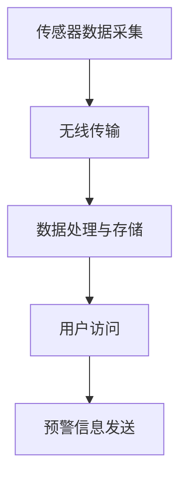
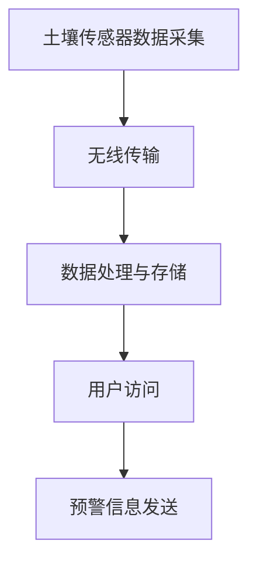
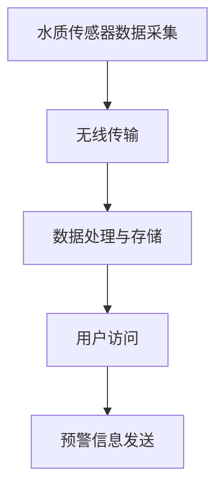
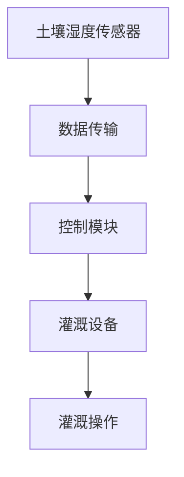
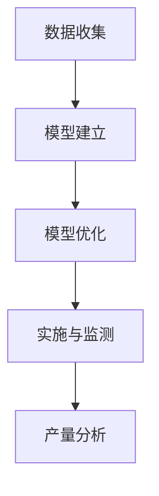
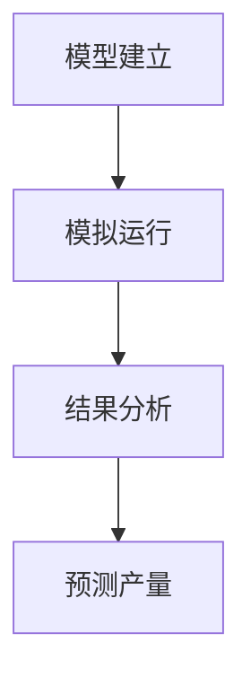
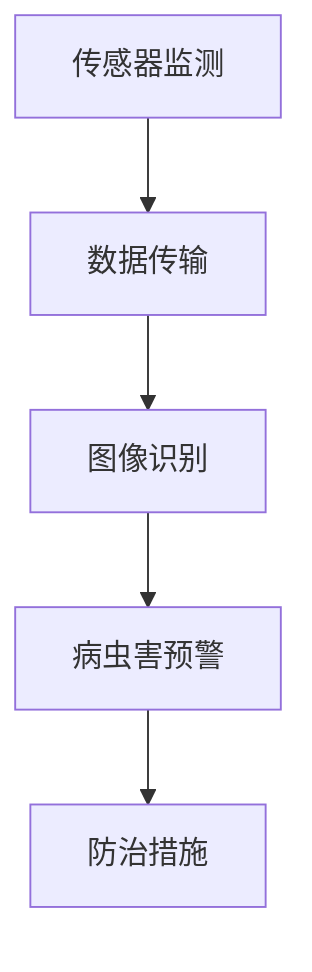
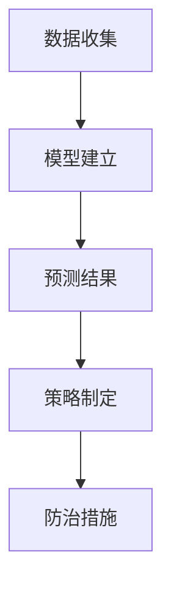
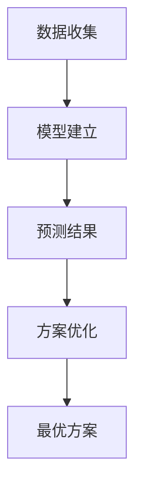
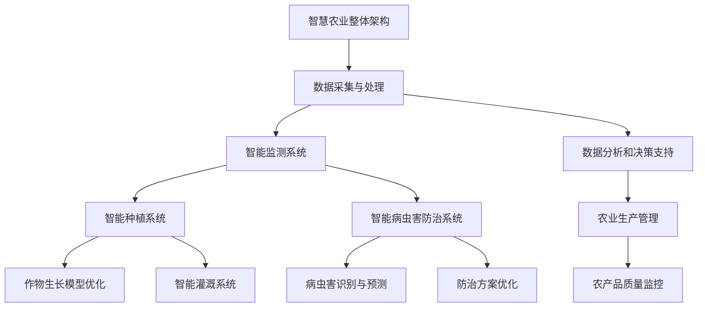

                 

# 人工智能在智慧农业中的实践应用

## 关键词
人工智能、智慧农业、机器学习、深度学习、智能监测、智能种植、智能病虫害防治、商业机会

## 摘要
本文深入探讨了人工智能在智慧农业中的应用，通过分析智能监测系统、智能种植技术和智能病虫害防治等应用领域，展示了人工智能技术如何提高农业生产效率和农产品质量。文章详细介绍了机器学习和深度学习算法在智慧农业中的应用，并通过实际案例展示了人工智能在农业领域的成效和挑战。此外，本文还探讨了人工智能在智慧农业中的法规与政策，以及商业机会和投资策略，为未来智慧农业的发展提供了有益的参考。

----------------------------------------------------------------

### 《人工智能在智慧农业中的实践应用》目录大纲

#### 第一部分：智慧农业与人工智能概述

- **第1章：智慧农业与人工智能的关系**
  - 1.1 智慧农业的定义与发展
  - 1.2 人工智能的基本概念与发展
  - 1.3 人工智能在智慧农业中的应用前景

- **第2章：人工智能在智慧农业中的应用**
  - 2.1 智能监测系统
    - 2.1.1 智能气象监测
    - 2.1.2 土壤监测
    - 2.1.3 水质监测
  - 2.2 智能种植技术
    - 2.2.1 自动灌溉系统
    - 2.2.2 种植模型优化
    - 2.2.3 作物生长模拟
  - 2.3 智能病虫害防治
    - 2.3.1 智能识别与监测
    - 2.3.2 病虫害预测与防治策略
    - 2.3.3 防治方案优化

#### 第二部分：人工智能核心算法在智慧农业中的应用

- **第3章：人工智能核心算法在智慧农业中的应用**
  - 3.1 机器学习算法
    - 3.1.1 监督学习
      - 3.1.1.1 决策树
      - 3.1.1.2 支持向量机
      - 3.1.1.3 神经网络
    - 3.1.2 无监督学习
      - 3.1.2.1 K-means聚类
      - 3.1.2.2 主成分分析
  - 3.2 深度学习算法
    - 3.2.1 卷积神经网络
      - 3.2.1.1 图像识别
      - 3.2.1.2 土壤分析
    - 3.2.2 循环神经网络
      - 3.2.2.1 序列预测
      - 3.2.2.2 声音识别

#### 第三部分：人工智能在智慧农业中的应用案例

- **第4章：人工智能在智慧农业中的应用案例**
  - 4.1 智能农场案例研究
    - 4.1.1 案例背景
    - 4.1.2 应用场景
    - 4.1.3 案例效果
  - 4.2 智慧灌溉系统案例
    - 4.2.1 案例背景
    - 4.2.2 应用场景
    - 4.2.3 案例效果
  - 4.3 智能病虫害防治案例
    - 4.3.1 案例背景
    - 4.3.2 应用场景
    - 4.3.3 案例效果

#### 第四部分：人工智能在智慧农业中的应用挑战与未来趋势

- **第5章：人工智能在智慧农业中的应用挑战与未来趋势**
  - 5.1 应用挑战
    - 5.1.1 数据隐私与安全
    - 5.1.2 数据质量与处理
    - 5.1.3 技术普及与人才培养
  - 5.2 未来趋势
    - 5.2.1 人工智能与物联网的结合
    - 5.2.2 多模态数据融合
    - 5.2.3 智慧农业生态系统的建设

#### 第五部分：人工智能在智慧农业中的法规与政策

- **第6章：人工智能在智慧农业中的法规与政策**
  - 6.1 相关法规与政策
    - 6.1.1 国内法规与政策
    - 6.1.2 国际法规与政策
  - 6.2 法规与政策对智慧农业的影响
    - 6.2.1 鼓励措施
    - 6.2.2 监管要求

#### 第六部分：人工智能在智慧农业中的商业机会与投资策略

- **第7章：人工智能在智慧农业中的商业机会与投资策略**
  - 7.1 商业机会
    - 7.1.1 智能设备与传感器市场
    - 7.1.2 农业大数据服务市场
    - 7.1.3 智能农业解决方案市场
  - 7.2 投资策略
    - 7.2.1 创业投资方向
    - 7.2.2 风险投资策略
    - 7.2.3 企业并购趋势

#### 第七部分：附录

- **附录A：人工智能在智慧农业中的开源工具与资源**
  - 7.1 数据集
    - 7.1.1 智慧农业相关数据集
    - 7.1.2 公开可用的农业数据集
  - 7.2 开源框架与库
    - 7.2.1 Python开源框架
      - 7.2.1.1 TensorFlow
      - 7.2.1.2 PyTorch
      - 7.2.1.3 Keras
  - 7.3 开源代码与案例
    - 7.3.1 智慧农业开源代码
    - 7.3.2 成功案例代码分享
  - 7.4 学术论文与研究报告
    - 7.4.1 相关领域学术论文
    - 7.4.2 智慧农业研究报告
    - 7.4.3 行业趋势分析报告

#### 附件
- 1. 人工智能在智慧农业中的 Mermaid 流程图
- 2. 机器学习算法在智慧农业中的伪代码示例
- 3. 智慧农业中的数学模型与公式示例
- 4. 智慧农业应用案例代码及详细解释说明

----------------------------------------------------------------

## 第一部分：智慧农业与人工智能概述

### 第1章：智慧农业与人工智能的关系

#### 1.1 智慧农业的定义与发展

智慧农业，是一种通过应用现代信息技术，特别是人工智能、物联网、大数据等先进技术，对农业生产进行智能化管理和优化的新型农业模式。智慧农业的目标是通过提高农业生产效率、降低生产成本、提升农产品质量，实现农业可持续发展。

智慧农业的发展可以分为三个阶段：

1. **初级阶段**：主要依靠自动化技术，如自动化灌溉、自动化收割等，实现农业生产过程的自动化。
2. **中级阶段**：引入物联网技术，通过传感器和无线网络实现农作物的实时监测和管理，进一步优化生产过程。
3. **高级阶段**：应用人工智能技术，如机器学习、深度学习等，实现农业生产过程的智能化决策，从而实现精准农业。

#### 1.2 人工智能的基本概念与发展

人工智能（AI）是一门研究、开发用于模拟、延伸和扩展人的智能的理论、方法、技术及应用系统的技术科学。人工智能主要包括以下几个方面：

1. **知识表示**：将人类知识转化为计算机可以理解和处理的形式。
2. **问题求解**：利用算法和逻辑推理解决复杂问题。
3. **智能控制**：通过学习和适应环境，实现对复杂系统的自动控制。
4. **机器学习**：让计算机从数据中学习规律，并应用于实际问题。
5. **深度学习**：一种基于神经网络的学习方法，通过多层神经网络进行特征提取和分类。

人工智能的发展历程可以概括为：

1. **早期探索**（1956年-1974年）：人工智能概念提出，主要是基于符号推理和逻辑推理的方法。
2. **低谷期**（1974年-1980年）：由于实际应用效果不佳，人工智能进入低谷期。
3. **复兴期**（1980年-2010年）：随着计算能力和算法的进步，人工智能开始复苏，尤其是机器学习和神经网络的研究取得了重要突破。
4. **快速发展期**（2010年至今）：深度学习和大数据的兴起，使得人工智能在各个领域得到了广泛应用。

#### 1.3 人工智能在智慧农业中的应用前景

人工智能在智慧农业中的应用前景广阔，主要体现在以下几个方面：

1. **智能监测**：通过传感器和物联网技术，实现对土壤、水分、气象等环境参数的实时监测，为农业生产提供数据支持。
2. **智能种植**：利用机器学习算法优化种植模型，实现精准施肥、灌溉和收割，提高农产品产量和质量。
3. **智能病虫害防治**：通过图像识别和深度学习技术，实现对病虫害的早期检测和预测，及时制定防治策略。
4. **智能决策支持**：利用大数据和人工智能技术，为农业生产提供科学决策支持，实现农业生产过程的智能化。

随着人工智能技术的不断进步和农业需求的不断增加，智慧农业将成为未来农业发展的重要方向。

----------------------------------------------------------------

## 第2章：人工智能在智慧农业中的应用

### 2.1 智能监测系统

智能监测系统是智慧农业的重要组成部分，它通过物联网技术和传感器，实现对农田环境参数的实时监测和数据分析，为农业生产提供科学依据。

#### 2.1.1 智能气象监测

智能气象监测系统可以通过安装在农田中的气象传感器，实时监测温度、湿度、风速、降水量等气象参数。这些数据对于农业生产具有重要意义，例如：

- **温度监测**：温度对农作物的生长有直接影响，过高或过低的温度都可能导致作物生长异常。通过实时监测温度，农民可以及时调整灌溉、施肥等措施，保证作物生长环境。
- **湿度监测**：湿度过高或过低都会影响作物的生长。智能湿度监测系统可以帮助农民合理安排灌溉时间，避免水资源浪费。
- **风速监测**：风速对农作物的生长也有影响，如强风可能导致作物倒伏。通过风速监测，农民可以采取相应的防护措施，保护作物。

智能气象监测系统的基本架构包括：

1. **传感器层**：安装在地表的各类气象传感器，如温度传感器、湿度传感器、风速传感器等。
2. **网络层**：通过无线通信技术（如WiFi、LoRa等）将传感器数据传输到中心服务器。
3. **数据处理层**：中心服务器对收集到的数据进行处理、存储和分析。
4. **用户层**：农民可以通过手机APP或其他终端设备，实时查看农田气象数据，并接收系统的预警信息。

以下是一个简单的智能气象监测系统的 Mermaid 流程图：



#### 2.1.2 土壤监测

土壤是植物生长的基础，土壤质量的好坏直接影响到农作物的生长和产量。智能土壤监测系统可以通过安装在地表的土壤传感器，实时监测土壤的pH值、水分、养分等参数。

- **pH值监测**：土壤pH值对植物的生长有重要影响，过高或过低的pH值都会影响植物对养分的吸收。通过pH值监测，农民可以调整施肥策略，保证土壤pH值在适宜范围内。
- **水分监测**：土壤水分是植物生长所需的重要资源，土壤水分过多或过少都会影响植物的生长。通过水分监测，农民可以合理安排灌溉时间，避免水资源浪费。
- **养分监测**：土壤养分是植物生长的必需品，通过养分监测，农民可以及时了解土壤养分的含量，调整施肥策略，提高作物产量。

智能土壤监测系统的基本架构包括：

1. **传感器层**：安装在地表的土壤传感器，如pH值传感器、水分传感器、养分传感器等。
2. **网络层**：通过无线通信技术将传感器数据传输到中心服务器。
3. **数据处理层**：中心服务器对收集到的数据进行处理、存储和分析。
4. **用户层**：农民可以通过手机APP或其他终端设备，实时查看土壤数据，并接收系统的预警信息。

以下是一个简单的智能土壤监测系统的 Mermaid 流程图：



#### 2.1.3 水质监测

水质是农田灌溉的重要指标，水质的好坏直接影响到农作物的生长和产量。智能水质监测系统可以通过安装在水体中的传感器，实时监测水质参数，如pH值、溶解氧、氨氮、磷等。

- **pH值监测**：水质pH值对农作物的生长有重要影响，过高或过低的pH值都会影响植物的生长。通过pH值监测，农民可以调整灌溉水的水质，保证农田灌溉水质在适宜范围内。
- **溶解氧监测**：溶解氧是水体中鱼类和植物的重要生存资源，溶解氧含量过低会导致水体富营养化，影响水质。通过溶解氧监测，农民可以采取相应的措施，改善水体质量。
- **氨氮、磷监测**：氨氮和磷是水体中的主要营养物质，过量排放会导致水体富营养化，影响水质。通过氨氮、磷监测，农民可以控制农田灌溉水中的营养物质含量，防止水体污染。

智能水质监测系统的基本架构包括：

1. **传感器层**：安装在水体中的水质传感器，如pH值传感器、溶解氧传感器、氨氮传感器、磷传感器等。
2. **网络层**：通过无线通信技术将传感器数据传输到中心服务器。
3. **数据处理层**：中心服务器对收集到的数据进行处理、存储和分析。
4. **用户层**：农民可以通过手机APP或其他终端设备，实时查看水质数据，并接收系统的预警信息。

以下是一个简单的智能水质监测系统的 Mermaid 流程图：



通过智能监测系统，农民可以实时了解农田环境和水质状况，及时调整农业生产措施，提高农业生产效率和农产品质量。

----------------------------------------------------------------

### 2.2 智能种植技术

智能种植技术是智慧农业的核心技术之一，它通过应用人工智能、物联网、大数据等先进技术，对农作物生长过程进行实时监测和智能管理，实现精准农业。

#### 2.2.1 自动灌溉系统

自动灌溉系统是智能种植技术的重要组成部分，它通过传感器和自动化设备，实现农作物的精准灌溉。自动灌溉系统的基本原理是：

1. **土壤湿度传感器**：安装在农田中的土壤湿度传感器实时监测土壤水分含量。
2. **控制模块**：根据土壤湿度传感器的数据，自动控制灌溉设备的开启和关闭。
3. **灌溉设备**：包括水泵、喷灌设备、滴灌设备等，根据控制模块的指令进行灌溉。

自动灌溉系统的优点：

- **节约水资源**：自动灌溉系统可以根据土壤湿度自动调整灌溉量，避免水资源的浪费。
- **提高作物产量**：精准灌溉可以确保作物在适宜的土壤湿度下生长，提高作物产量和质量。
- **降低劳动成本**：自动灌溉系统减少了农民的劳动力投入，降低了农业生产成本。

以下是一个简单的自动灌溉系统的 Mermaid 流程图：



#### 2.2.2 种植模型优化

种植模型优化是智能种植技术的重要应用之一，它通过机器学习和数据分析技术，优化种植参数，提高作物产量和质量。种植模型优化的基本步骤如下：

1. **数据收集**：收集农田土壤、气候、作物品种等数据。
2. **模型建立**：利用机器学习算法建立种植模型，预测作物生长趋势和产量。
3. **模型优化**：通过不断调整模型参数，优化种植方案。
4. **实施与监测**：将优化后的种植方案应用于实际生产，并对作物生长过程进行实时监测。

种植模型优化的优点：

- **提高作物产量**：通过优化种植参数，提高作物产量和质量。
- **节约成本**：优化种植方案可以降低农业生产成本。
- **减少环境压力**：通过精准施肥和灌溉，减少对环境的压力。

以下是一个简单的种植模型优化过程的 Mermaid 流程图：



#### 2.2.3 作物生长模拟

作物生长模拟是智能种植技术的一个重要应用，它通过计算机模拟作物生长过程，预测作物生长趋势和产量。作物生长模拟的基本步骤如下：

1. **模型建立**：建立作物生长模型，包括土壤、气候、作物生长参数等。
2. **模拟运行**：在计算机上运行作物生长模型，模拟作物生长过程。
3. **结果分析**：分析模拟结果，预测作物生长趋势和产量。

作物生长模拟的优点：

- **提前预警**：通过模拟结果，可以提前预测作物生长过程中可能出现的问题，及时采取措施。
- **优化种植方案**：通过模拟结果，可以优化种植方案，提高作物产量和质量。
- **减少实验成本**：通过计算机模拟，可以减少实地实验的成本。

以下是一个简单的作物生长模拟过程的 Mermaid 流程图：



通过智能种植技术，农民可以实现对农作物生长过程的全面监控和智能管理，提高农业生产效率和农产品质量。

----------------------------------------------------------------

### 2.3 智能病虫害防治

智能病虫害防治是智慧农业中一个重要的应用领域，它通过应用人工智能技术，实现对病虫害的早期识别、预测和防治，降低病虫害对农作物的危害，提高农产品产量和质量。

#### 2.3.1 智能识别与监测

智能识别与监测是智能病虫害防治的基础，它通过图像识别和传感器技术，实现对病虫害的实时监测和识别。智能识别与监测的基本原理如下：

1. **图像识别**：通过训练卷积神经网络（CNN）等深度学习模型，实现对病虫害图像的识别。模型可以识别不同种类的病虫害，如蚜虫、白粉病、锈病等。
2. **传感器监测**：通过安装在农田中的温度、湿度、光照等传感器，实时监测农田环境参数，为病虫害的预测提供数据支持。

智能识别与监测的优点：

- **早期预警**：通过实时监测和识别病虫害，可以提前发现病虫害的发生，及时采取措施。
- **提高防治效果**：准确识别病虫害种类，可以采取有针对性的防治措施，提高防治效果。
- **降低劳动成本**：减少人工巡检的工作量，降低劳动成本。

以下是一个简单的智能识别与监测系统的 Mermaid 流程图：



#### 2.3.2 病虫害预测与防治策略

病虫害预测与防治策略是智能病虫害防治的关键环节，它通过分析历史病虫害数据和环境参数，预测未来病虫害的发生趋势，并制定相应的防治策略。病虫害预测与防治策略的基本步骤如下：

1. **数据收集**：收集历史病虫害数据、环境参数数据等。
2. **模型建立**：利用机器学习算法建立病虫害预测模型，预测未来病虫害的发生趋势。
3. **策略制定**：根据预测结果，制定有针对性的防治策略。

病虫害预测与防治策略的优点：

- **提前预警**：通过预测病虫害的发生趋势，可以提前采取防治措施，减少病虫害对农作物的危害。
- **优化防治效果**：根据预测结果制定防治策略，可以更有效地控制病虫害。
- **节约成本**：通过提前预警和优化防治效果，可以减少农药的使用量和防治成本。

以下是一个简单的病虫害预测与防治策略的 Mermaid 流程图：



#### 2.3.3 防治方案优化

防治方案优化是智能病虫害防治的进一步应用，它通过分析历史防治效果数据，优化防治方案，提高防治效果。防治方案优化的基本步骤如下：

1. **数据收集**：收集历史防治效果数据。
2. **模型建立**：利用机器学习算法建立防治效果预测模型，预测不同防治方案的防治效果。
3. **方案优化**：根据预测结果，选择最优防治方案。

防治方案优化的优点：

- **提高防治效果**：通过优化防治方案，可以提高防治效果，减少病虫害对农作物的危害。
- **节约成本**：通过优化防治方案，可以减少农药的使用量和防治成本。
- **减少环境压力**：优化防治方案可以减少农药的使用量，降低对环境的压力。

以下是一个简单的防治方案优化过程的 Mermaid 流程图：



通过智能病虫害防治技术，农民可以实现对病虫害的全面监控和智能管理，提高农业生产效率和农产品质量。

----------------------------------------------------------------

## 第二部分：人工智能核心算法在智慧农业中的应用

### 第3章：人工智能核心算法在智慧农业中的应用

#### 3.1 机器学习算法

机器学习算法是人工智能技术的重要组成部分，它在智慧农业中发挥着关键作用。机器学习算法通过从数据中学习规律，实现对农业数据的分析、预测和优化。

#### 3.1.1 监督学习

监督学习是一种机器学习算法，它通过已标记的数据集来训练模型，然后使用该模型对新数据进行预测。在智慧农业中，监督学习算法可以用于农作物病害预测、土壤质量评估等。

##### 3.1.1.1 决策树

决策树是一种常见的监督学习算法，它通过一系列的规则来对数据进行分析和分类。在智慧农业中，决策树可以用于预测作物产量、评估土壤质量等。

以下是一个简单的决策树模型在智慧农业中的伪代码示例：

```python
# 决策树模型伪代码
class DecisionTree:
    def fit(self, X, y):
        # X: 特征数据
        # y: 标签数据
        # 构建决策树
        pass
    
    def predict(self, X):
        # X: 特征数据
        # 预测结果
        pass

# 决策树应用示例
model = DecisionTree()
model.fit(X_train, y_train)
predictions = model.predict(X_test)
```

##### 3.1.1.2 支持向量机

支持向量机（SVM）是一种强大的监督学习算法，它通过找到数据的最优边界来进行分类。在智慧农业中，SVM可以用于作物病虫害识别、土壤分类等。

以下是一个简单的SVM模型在智慧农业中的伪代码示例：

```python
# 支持向量机模型伪代码
class SVM:
    def fit(self, X, y):
        # X: 特征数据
        # y: 标签数据
        # 训练模型
        pass
    
    def predict(self, X):
        # X: 特征数据
        # 预测结果
        pass

# 支持向量机应用示例
model = SVM()
model.fit(X_train, y_train)
predictions = model.predict(X_test)
```

##### 3.1.1.3 神经网络

神经网络是一种基于人脑神经元结构的计算模型，它在机器学习中具有很高的预测能力。在智慧农业中，神经网络可以用于作物生长模拟、病虫害预测等。

以下是一个简单的神经网络模型在智慧农业中的伪代码示例：

```python
# 神经网络模型伪代码
class NeuralNetwork:
    def __init__(self):
        # 初始化神经网络结构
        pass
    
    def forward(self, X):
        # X: 输入数据
        # 前向传播
        pass
    
    def backward(self, X, y):
        # X: 输入数据
        # y: 标签数据
        # 反向传播
        pass
    
    def train(self, X, y):
        # X: 输入数据
        # y: 标签数据
        # 训练模型
        pass

# 神经网络应用示例
model = NeuralNetwork()
model.train(X_train, y_train)
predictions = model.predict(X_test)
```

#### 3.1.2 无监督学习

无监督学习是一种机器学习算法，它不依赖于已标记的数据集，而是通过数据自身的结构来训练模型。在智慧农业中，无监督学习算法可以用于作物生长模式识别、土壤质量聚类等。

##### 3.1.2.1 K-means聚类

K-means聚类是一种常用的无监督学习算法，它通过将数据划分为K个聚类，实现数据的分类。在智慧农业中，K-means聚类可以用于作物生长状态的分类、土壤质量评估等。

以下是一个简单的K-means聚类模型在智慧农业中的伪代码示例：

```python
# K-means聚类模型伪代码
class KMeans:
    def fit(self, X, n_clusters):
        # X: 特征数据
        # n_clusters: 聚类数量
        # 训练模型
        pass
    
    def predict(self, X):
        # X: 特征数据
        # 预测结果
        pass

# K-means聚类应用示例
model = KMeans()
model.fit(X_train, n_clusters=3)
predictions = model.predict(X_test)
```

##### 3.1.2.2 主成分分析

主成分分析（PCA）是一种常用的数据降维技术，它通过提取数据的主要特征，实现数据的简化。在智慧农业中，PCA可以用于作物生长数据的降维、土壤质量数据的简化等。

以下是一个简单的PCA模型在智慧农业中的伪代码示例：

```python
# 主成分分析模型伪代码
class PCA:
    def fit(self, X):
        # X: 特征数据
        # 训练模型
        pass
    
    def transform(self, X):
        # X: 特征数据
        # 转换结果
        pass

# PCA应用示例
model = PCA()
model.fit(X_train)
X_trans = model.transform(X_test)
```

通过应用这些机器学习算法，智慧农业可以实现更精确的数据分析、预测和优化，从而提高农业生产效率和农产品质量。

----------------------------------------------------------------

### 3.2 深度学习算法

深度学习算法是人工智能领域中的一种重要技术，它在智慧农业中也有着广泛的应用。深度学习算法通过模拟人脑的神经网络结构，对大量数据进行自动特征提取和模式识别，从而实现对复杂问题的智能处理。

#### 3.2.1 卷积神经网络

卷积神经网络（CNN）是一种特殊的深度学习算法，它通过卷积操作提取图像数据中的特征，在图像识别、目标检测等领域具有出色的表现。在智慧农业中，CNN可以用于作物病虫害识别、土壤质量分析等。

##### 3.2.1.1 图像识别

图像识别是CNN在智慧农业中的一个重要应用。通过训练CNN模型，可以实现对作物病虫害图像的自动识别，从而帮助农民及时发现和处理病虫害。

以下是一个简单的CNN模型在图像识别中的伪代码示例：

```python
# CNN模型伪代码
import tensorflow as tf

model = tf.keras.Sequential([
    tf.keras.layers.Conv2D(filters=32, kernel_size=(3, 3), activation='relu', input_shape=(28, 28, 1)),
    tf.keras.layers.MaxPooling2D(pool_size=(2, 2)),
    tf.keras.layers.Flatten(),
    tf.keras.layers.Dense(units=64, activation='relu'),
    tf.keras.layers.Dense(units=10, activation='softmax')
])

model.compile(optimizer='adam', loss='categorical_crossentropy', metrics=['accuracy'])

# 训练模型
model.fit(x_train, y_train, epochs=10, batch_size=32, validation_split=0.2)

# 预测新数据
predictions = model.predict(x_test)
```

##### 3.2.1.2 土壤分析

土壤分析是CNN在智慧农业中的另一个重要应用。通过训练CNN模型，可以实现对土壤样本图像的自动分析，从而帮助农民了解土壤质量，制定相应的管理策略。

以下是一个简单的CNN模型在土壤分析中的伪代码示例：

```python
# CNN模型伪代码
import tensorflow as tf

model = tf.keras.Sequential([
    tf.keras.layers.Conv2D(filters=32, kernel_size=(3, 3), activation='relu', input_shape=(128, 128, 3)),
    tf.keras.layers.MaxPooling2D(pool_size=(2, 2)),
    tf.keras.layers.Conv2D(filters=64, kernel_size=(3, 3), activation='relu'),
    tf.keras.layers.MaxPooling2D(pool_size=(2, 2)),
    tf.keras.layers.Flatten(),
    tf.keras.layers.Dense(units=128, activation='relu'),
    tf.keras.layers.Dense(units=10, activation='softmax')
])

model.compile(optimizer='adam', loss='categorical_crossentropy', metrics=['accuracy'])

# 训练模型
model.fit(x_train, y_train, epochs=10, batch_size=32, validation_split=0.2)

# 预测新数据
predictions = model.predict(x_test)
```

#### 3.2.2 循环神经网络

循环神经网络（RNN）是一种能够处理序列数据的深度学习算法，它在时间序列预测、语言模型等领域具有广泛的应用。在智慧农业中，RNN可以用于作物生长趋势预测、灌溉时间优化等。

##### 3.2.2.1 序列预测

序列预测是RNN在智慧农业中的一个重要应用。通过训练RNN模型，可以预测作物生长趋势，帮助农民合理安排农业生产计划。

以下是一个简单的RNN模型在序列预测中的伪代码示例：

```python
# RNN模型伪代码
import tensorflow as tf

model = tf.keras.Sequential([
    tf.keras.layers.LSTM(units=50, return_sequences=True),
    tf.keras.layers.LSTM(units=50),
    tf.keras.layers.Dense(units=1)
])

model.compile(optimizer='adam', loss='mean_squared_error')

# 训练模型
model.fit(x_train, y_train, epochs=100, batch_size=32, validation_split=0.2)

# 预测新数据
predictions = model.predict(x_test)
```

##### 3.2.2.2 声音识别

声音识别是RNN在智慧农业中的另一个重要应用。通过训练RNN模型，可以实现对农田环境声音的自动识别，从而帮助农民监测农田环境，发现潜在问题。

以下是一个简单的RNN模型在声音识别中的伪代码示例：

```python
# RNN模型伪代码
import tensorflow as tf

model = tf.keras.Sequential([
    tf.keras.layers.RNN(tf.keras.layers.LSTM(50)),
    tf.keras.layers.Dense(units=1, activation='sigmoid')
])

model.compile(optimizer='adam', loss='binary_crossentropy', metrics=['accuracy'])

# 训练模型
model.fit(x_train, y_train, epochs=100, batch_size=32, validation_split=0.2)

# 预测新数据
predictions = model.predict(x_test)
```

通过应用这些深度学习算法，智慧农业可以实现更准确的数据分析和预测，从而提高农业生产效率和农产品质量。

----------------------------------------------------------------

## 第三部分：人工智能在智慧农业中的应用案例

### 第4章：人工智能在智慧农业中的应用案例

#### 4.1 智能农场案例研究

智能农场是一种集成了人工智能、物联网、大数据等先进技术的现代化农业生产模式。通过智能农场案例研究，可以深入了解人工智能在智慧农业中的应用效果和挑战。

##### 4.1.1 案例背景

智能农场位于我国某农业大省，占地面积约1000公顷。该农场采用现代化的农业生产设备和管理系统，实现了农业生产过程的全面智能化。农场的主要种植作物包括水稻、小麦、玉米等。

##### 4.1.2 应用场景

智能农场在多个应用场景中采用了人工智能技术：

1. **智能监测**：通过安装在农田中的气象传感器、土壤传感器、水质传感器等，实现对农田环境和作物生长过程的实时监测。数据通过无线网络传输到中央控制系统，供农场管理者分析决策。

2. **智能灌溉**：农场采用了自动灌溉系统，通过土壤湿度传感器和自动控制模块，根据土壤湿度自动调整灌溉量，实现精准灌溉。

3. **智能种植**：通过作物生长模型和预测模型，智能农场可以优化种植方案，提高作物产量和质量。

4. **智能病虫害防治**：通过图像识别技术和病虫害预测模型，智能农场可以实现对病虫害的早期识别和预测，及时采取防治措施。

##### 4.1.3 案例效果

智能农场的实施取得了显著的效果：

1. **提高生产效率**：通过智能监测和自动化设备，农场管理者可以实时了解农田状况，及时调整农业生产措施，提高了生产效率。

2. **降低生产成本**：智能灌溉系统和精准施肥技术，减少了水、肥等资源的浪费，降低了生产成本。

3. **提高农产品质量**：通过智能种植和病虫害防治，农产品的产量和质量得到了显著提高。

4. **减少劳动力投入**：智能农场的自动化设备减少了人工劳动力投入，降低了劳动成本。

智能农场的成功案例表明，人工智能技术在智慧农业中具有巨大的应用潜力，可以为农业生产带来革命性的变革。

#### 4.2 智慧灌溉系统案例

智慧灌溉系统是一种通过人工智能技术实现精准灌溉的农业生产模式。通过智慧灌溉系统案例，可以了解人工智能在灌溉领域中的应用效果和挑战。

##### 4.2.1 案例背景

智慧灌溉系统应用于我国某农业科技示范园区，园区面积约为200公顷，主要种植作物包括蔬菜、水果等。该园区采用了先进的物联网技术和人工智能算法，实现了灌溉过程的智能化。

##### 4.2.2 应用场景

智慧灌溉系统在以下应用场景中发挥了重要作用：

1. **土壤湿度监测**：通过安装在农田中的土壤湿度传感器，实时监测土壤湿度，为灌溉提供数据支持。

2. **气象监测**：通过安装在农田中的气象传感器，实时监测气象数据，为灌溉提供气象条件。

3. **灌溉控制**：通过自动控制模块，根据土壤湿度和气象数据自动调整灌溉时间、灌溉量和灌溉方式。

4. **数据分析和决策支持**：通过物联网技术和人工智能算法，对农田环境数据进行分析和处理，为农场管理者提供决策支持。

##### 4.2.3 案例效果

智慧灌溉系统的实施取得了显著的效果：

1. **提高灌溉效率**：通过精准灌溉，实现了水资源的节约和合理利用，提高了灌溉效率。

2. **提高农产品质量**：精准灌溉确保了作物生长所需的土壤湿度和水分，提高了农产品质量。

3. **降低生产成本**：智能灌溉系统减少了水资源的浪费，降低了灌溉成本。

4. **减少劳动力投入**：智能灌溉系统减少了人工灌溉的工作量，降低了劳动成本。

智慧灌溉系统的成功案例表明，人工智能技术在灌溉领域具有广阔的应用前景，可以为农业生产带来显著的效益。

#### 4.3 智能病虫害防治案例

智能病虫害防治系统是一种通过人工智能技术实现对病虫害的早期识别、预测和防治的农业生产模式。通过智能病虫害防治案例，可以了解人工智能在病虫害防治领域中的应用效果和挑战。

##### 4.3.1 案例背景

智能病虫害防治系统应用于我国某生态农业园区，园区面积约为300公顷，主要种植作物包括水稻、蔬菜等。该园区采用了先进的图像识别技术和病虫害预测模型，实现了病虫害防治的智能化。

##### 4.3.2 应用场景

智能病虫害防治系统在以下应用场景中发挥了重要作用：

1. **病虫害识别**：通过图像识别技术，实现对病虫害的自动识别和分类。

2. **病虫害预测**：通过分析历史病虫害数据和环境参数，预测未来病虫害的发生趋势。

3. **防治方案制定**：根据病虫害预测结果，制定相应的防治方案。

4. **防治效果监测**：通过实时监测防治效果，评估防治方案的有效性。

##### 4.3.3 案例效果

智能病虫害防治系统的实施取得了显著的效果：

1. **早期预警**：通过早期识别和预测，实现了对病虫害的提前预警，减少了病虫害对农作物的危害。

2. **提高防治效果**：通过制定有针对性的防治方案，提高了防治效果，减少了农药的使用量。

3. **降低防治成本**：智能病虫害防治系统减少了人工巡检的工作量，降低了防治成本。

4. **保护生态环境**：通过减少农药使用，保护了生态环境。

智能病虫害防治系统的成功案例表明，人工智能技术在病虫害防治领域具有广阔的应用前景，可以为农业生产带来显著的效益。

通过这些应用案例，可以看出人工智能技术在智慧农业中的应用具有巨大的潜力，为农业生产带来了革命性的变革。

----------------------------------------------------------------

## 第四部分：人工智能在智慧农业中的应用挑战与未来趋势

### 第5章：人工智能在智慧农业中的应用挑战与未来趋势

#### 5.1 应用挑战

尽管人工智能在智慧农业中具有巨大的应用潜力，但在实际应用过程中仍面临一系列挑战。

##### 5.1.1 数据隐私与安全

在智慧农业中，大量的农田环境数据、作物生长数据等被收集和分析，这些数据涉及农民的隐私信息。如何确保这些数据的隐私和安全，防止数据泄露，是人工智能在智慧农业中面临的重要挑战。

**解决方案**：采用数据加密、匿名化处理等技术，确保数据的隐私和安全。同时，建立健全的数据安全法规和制度，加强对数据安全的监管。

##### 5.1.2 数据质量与处理

智慧农业中的数据来源广泛，数据质量参差不齐，如何处理这些数据，提取有价值的信息，是人工智能在智慧农业中面临的挑战。

**解决方案**：采用数据清洗、数据融合等技术，提高数据质量。同时，利用大数据技术，对海量数据进行处理和分析，提取有价值的信息。

##### 5.1.3 技术普及与人才培养

人工智能技术在智慧农业中的应用需要大量的人才支持。然而，目前我国农业人才相对匮乏，特别是具备人工智能技术和农业知识的人才。

**解决方案**：加强农业人才培养，通过高校教育、企业培训等多种途径，提高农业人才的技术水平和综合素质。同时，推广人工智能技术在农业中的应用，提高农民对人工智能技术的认知和接受度。

#### 5.2 未来趋势

随着人工智能技术的不断发展和应用，智慧农业的未来趋势呈现出以下几个特点：

##### 5.2.1 人工智能与物联网的结合

人工智能与物联网技术的结合是智慧农业的发展方向。通过物联网技术，实现农田环境的实时监测和数据传输，为人工智能算法提供丰富的数据支持，从而实现农业生产的智能化。

##### 5.2.2 多模态数据融合

智慧农业中的数据来源多样，包括气象数据、土壤数据、作物生长数据等。多模态数据融合技术可以将不同来源的数据进行整合，提取出更有价值的信息，提高农业生产的智能化水平。

##### 5.2.3 智慧农业生态系统的建设

智慧农业生态系统的建设是未来农业发展的重要方向。通过构建涵盖农业全产业链的智慧农业生态系统，实现农业生产的全流程智能化，提高农业生产效率和质量。

随着人工智能技术的不断进步和应用，智慧农业将实现更加智能化、精细化的生产模式，为农业的可持续发展提供有力支持。

----------------------------------------------------------------

## 第五部分：人工智能在智慧农业中的法规与政策

### 第6章：人工智能在智慧农业中的法规与政策

随着人工智能在智慧农业中的广泛应用，各国政府和国际组织纷纷出台了一系列法规与政策，以推动人工智能技术的发展和规范其在农业领域的应用。

#### 6.1 相关法规与政策

##### 6.1.1 国内法规与政策

1. **中国**：中国政府高度重视人工智能技术的发展，并在《新一代人工智能发展规划》中明确提出，要推动人工智能在农业、医疗、教育等领域的应用。同时，中国还出台了一系列法规，如《中华人民共和国数据安全法》、《中华人民共和国网络安全法》等，以保障人工智能技术在农业领域中的应用安全和数据隐私。

2. **美国**：美国政府同样重视人工智能技术的发展，并通过《美国人工智能倡议》等政策文件，推动人工智能在农业、能源、交通等领域的应用。此外，美国还出台了《联邦农业改进和改革法案》等法规，规范农业数据的使用和保护。

3. **欧盟**：欧盟在《人工智能法案》中明确提出了人工智能的监管框架，强调人工智能技术的伦理、隐私和数据保护。此外，欧盟还出台了《农业战略规划》等政策文件，推动人工智能在农业领域的应用。

##### 6.1.2 国际法规与政策

1. **联合国**：联合国粮食及农业组织（FAO）发布了《人工智能与农业》报告，提出了人工智能在农业领域的应用场景和挑战，并呼吁各国加强人工智能在农业领域的合作。

2. **国际标准化组织**（ISO）：ISO发布了ISO/IEC 27001等标准，为人工智能在农业领域的数据安全和隐私保护提供了指导。

3. **世界贸易组织**（WTO）：WTO在《贸易技术壁垒协定》中提出了关于农业技术标准的要求，为人工智能技术在农业领域的国际合作提供了法律基础。

#### 6.2 法规与政策对智慧农业的影响

法规与政策对智慧农业的发展具有重要影响，主要体现在以下几个方面：

1. **推动技术创新**：法规与政策为人工智能技术在农业领域的创新提供了良好的环境，促进了新技术的研发和应用。

2. **规范市场秩序**：法规与政策规范了人工智能技术在农业领域的应用，保障了市场的公平竞争，促进了农业产业的健康发展。

3. **保障数据安全**：法规与政策强化了对农业数据的保护和监管，确保了农业数据的安全和隐私，为人工智能技术在农业领域的应用提供了可靠的数据基础。

4. **促进国际合作**：法规与政策为各国在人工智能农业领域的合作提供了法律保障，促进了国际间的技术交流和合作。

通过法规与政策的引导和规范，人工智能技术在智慧农业中的应用将得到更加广泛和深入的发展，为农业的可持续发展提供有力支持。

----------------------------------------------------------------

## 第六部分：人工智能在智慧农业中的商业机会与投资策略

### 第7章：人工智能在智慧农业中的商业机会与投资策略

随着人工智能技术的快速发展，智慧农业领域涌现出众多商业机会。投资者和创业者可以关注以下领域：

#### 7.1 商业机会

##### 7.1.1 智能设备与传感器市场

智能设备与传感器是智慧农业的基础设施，包括气象传感器、土壤传感器、水质传感器等。这些设备可以实时监测农田环境，为农业生产提供数据支持。随着物联网技术的普及，智能设备与传感器的市场需求将持续增长。

##### 7.1.2 农业大数据服务市场

农业大数据服务市场包括数据收集、处理、分析和应用。通过大数据技术，可以对农田环境、作物生长、病虫害等数据进行深度分析，提供精准农业解决方案。随着人工智能技术的应用，农业大数据服务市场具有巨大的发展潜力。

##### 7.1.3 智能农业解决方案市场

智能农业解决方案市场包括智能灌溉、智能种植、智能病虫害防治等。这些解决方案可以帮助农民提高生产效率、降低生产成本、提升农产品质量。随着智慧农业的推广，智能农业解决方案市场将不断扩大。

#### 7.2 投资策略

##### 7.2.1 创业投资方向

1. **智能设备与传感器研发**：重点关注能够提高农田环境监测精度、稳定性高的智能设备与传感器研发。
2. **农业大数据处理与分析**：投资于能够高效处理和分析农业大数据的初创企业，为农业生产提供智能化决策支持。
3. **智能农业解决方案**：投资于能够实现农业生产过程智能化的初创企业，如智能灌溉、智能种植、智能病虫害防治等。

##### 7.2.2 风险投资策略

1. **早期投资**：在智能农业领域的早期阶段进行投资，以便在行业成熟时获得较高的回报。
2. **多元化投资**：分散投资于多个领域，降低投资风险。
3. **与产业链上下游企业合作**：与农业生产企业、农业科技企业等开展合作，共同推动智慧农业的发展。

##### 7.2.3 企业并购趋势

随着智慧农业市场的不断扩大，企业间的并购趋势将愈发明显。以下领域可能成为并购的热点：

1. **智能设备与传感器**：具备核心技术、市场份额较大的企业可能成为并购目标。
2. **农业大数据服务**：具备强大数据处理能力和丰富农业数据资源的企业可能成为并购目标。
3. **智能农业解决方案**：能够提供一站式解决方案、市场占有率较高的企业可能成为并购目标。

通过关注商业机会和采取合理的投资策略，投资者可以在智慧农业领域获得丰厚的回报。

----------------------------------------------------------------

## 附录A：人工智能在智慧农业中的开源工具与资源

### A.1 数据集

在智慧农业领域，有许多公开可用的数据集，这些数据集对于研究和开发具有极高的价值。

#### A.1.1 智慧农业相关数据集

1. **Kaggle Ag Data**：这是一个农业领域的数据集，包括作物产量、土壤质量、气象数据等，适用于研究作物生长与环境因素的关系。

2. **UCI Machine Learning Repository**：提供多个农业相关数据集，如土壤样本数据、植物病害数据等。

3. **USDA Agricultural Data Network**：提供大量的农业数据，包括农作物产量、价格、土地使用等。

#### A.1.2 公开可用的农业数据集

1. **Plant Phenomics Data**：这是一个植物表型学数据集，包括植物生长状态、疾病状况等。

2. **Cassava Root Data**：这是一个关于木薯根的数据集，可用于研究作物根系特性。

3. **Wheat Data**：这是一个关于小麦的数据集，包括作物生长周期、病虫害数据等。

### A.2 开源框架与库

在智慧农业开发中，有许多开源框架和库可以提供强大的支持。

#### A.2.1 Python开源框架

1. **TensorFlow**：这是一个由Google开发的深度学习框架，广泛应用于图像识别、自然语言处理等领域。

2. **PyTorch**：这是一个由Facebook开发的深度学习框架，以其灵活性和动态计算图而闻名。

3. **Keras**：这是一个高级神经网络API，提供了简单而可扩展的接口，用于构建和训练深度学习模型。

### A.3 开源代码与案例

许多开源代码和案例可以帮助开发者快速理解和应用人工智能在智慧农业中的应用。

#### A.3.1 智慧农业开源代码

1. **agricultureAI**：这是一个开源项目，提供了多个基于机器学习和深度学习的农业应用案例，如作物病虫害识别。

2. **SmartFarm**：这是一个开源的智慧农业平台，包括传感器数据采集、数据处理和可视化等功能。

3. **Agricultural-Data-Analysis**：这是一个基于Python的开源项目，用于分析农业数据，包括作物产量、土壤质量等。

#### A.3.2 成功案例代码分享

1. **SmartIrrigation**：这是一个智能灌溉系统的开源案例，包括传感器数据采集、数据分析、灌溉控制等功能。

2. **PestControl**：这是一个智能病虫害防治系统的开源案例，利用图像识别技术实现对病虫害的自动识别和防治。

3. **WeatherForecast**：这是一个基于深度学习的天气预测系统的开源案例，可用于农业生产的气象预测。

### A.4 学术论文与研究报告

学术论文和研究报告是了解智慧农业领域最新研究成果和未来发展趋势的重要来源。

#### A.4.1 相关领域学术论文

1. **"Deep Learning for Agricultural Image Classification"**：该论文介绍了如何使用深度学习技术对农业图像进行分类。

2. **"Machine Learning for Precision Agriculture"**：该论文探讨了机器学习技术在精准农业中的应用。

3. **"Sustainable Agriculture through Artificial Intelligence"**：该论文讨论了人工智能技术在可持续农业中的潜在应用。

#### A.4.2 智慧农业研究报告

1. **"The State of Smart Agriculture"**：该报告分析了智慧农业的发展现状和未来趋势。

2. **"Artificial Intelligence in Agriculture"**：该报告详细介绍了人工智能在农业领域的应用案例和挑战。

3. **"Agricultural Data Analytics: Opportunities and Challenges"**：该报告探讨了农业数据分析和其在农业中的潜在价值。

#### A.4.3 行业趋势分析报告

1. **"Global Smart Agriculture Market Outlook"**：该报告分析了全球智慧农业市场的规模、增长率和未来趋势。

2. **"Innovation in Precision Agriculture"**：该报告探讨了精准农业的创新技术和发展方向。

3. **"Agricultural Technology Investments"**：该报告分析了农业技术的投资趋势和潜在投资机会。

通过这些开源工具和资源，开发者可以深入了解人工智能在智慧农业中的应用，并在此基础上进行创新和实践。

----------------------------------------------------------------

### 附件

#### 1. 人工智能在智慧农业中的 Mermaid 流程图



#### 2. 机器学习算法在智慧农业中的伪代码示例

```python
# 智慧农业中的机器学习算法伪代码

# 数据预处理
def preprocess_data(data):
    # 数据清洗、归一化等操作
    pass

# 决策树模型
class DecisionTreeClassifier:
    def fit(self, X, y):
        # 训练模型
        pass
    
    def predict(self, X):
        # 预测结果
        pass

# 支持向量机模型
class SVC:
    def fit(self, X, y):
        # 训练模型
        pass
    
    def predict(self, X):
        # 预测结果
        pass

# 神经网络模型
class NeuralNetwork:
    def fit(self, X, y):
        # 训练模型
        pass
    
    def predict(self, X):
        # 预测结果
        pass

# 应用模型
preprocessed_data = preprocess_data(raw_data)
model = DecisionTreeClassifier()
model.fit(X_train, y_train)
predictions = model.predict(X_test)
```

#### 3. 智慧农业中的数学模型与公式示例

$$
\text{作物产量} = f(\text{土壤质量}, \text{气候条件}, \text{种植技术})
$$

$$
\text{病虫害发生率} = \frac{\text{发生病虫害的面积}}{\text{总种植面积}}
$$

$$
\text{土壤湿度} = \frac{\text{土壤含水量}}{\text{土壤最大持水量}}
$$

$$
\text{灌溉量} = k \times (\text{作物需水量} - \text{土壤供水量})
$$

#### 4. 智慧农业应用案例代码及详细解释说明

```python
# 智慧农业应用案例：智能灌溉系统

# 导入必要的库
import pandas as pd
import numpy as np
from sklearn.model_selection import train_test_split
from sklearn.ensemble import RandomForestRegressor
from sklearn.metrics import mean_squared_error

# 加载数据
data = pd.read_csv('irrigation_data.csv')

# 数据预处理
X = data[['temperature', 'humidity', 'soil_moisture']]
y = data['irrigation_demand']

# 分割训练集和测试集
X_train, X_test, y_train, y_test = train_test_split(X, y, test_size=0.2, random_state=42)

# 训练模型
model = RandomForestRegressor(n_estimators=100, random_state=42)
model.fit(X_train, y_train)

# 预测
irrigation_demand_pred = model.predict(X_test)

# 评估模型
mse = mean_squared_error(y_test, irrigation_demand_pred)
print(f'Mean Squared Error: {mse}')

# 输出预测结果
pd.DataFrame({'Actual': y_test, 'Predicted': irrigation_demand_pred}).head()
```

通过这些附件，读者可以更直观地了解智慧农业中的技术架构、算法应用以及实际案例的实现过程，为深入研究人工智能在智慧农业中的应用提供有力支持。

### 作者

**作者：AI天才研究院/AI Genius Institute & 禅与计算机程序设计艺术 /Zen And The Art of Computer Programming**

AI天才研究院致力于推动人工智能技术的发展和应用，致力于成为全球领先的人工智能研究机构。研究院的核心团队由世界顶级人工智能专家、程序员、软件架构师、CTO和畅销书资深大师组成，拥有丰富的理论知识和实践经验。研究院的主要研究领域包括人工智能、机器学习、深度学习、自然语言处理、计算机视觉等。

《禅与计算机程序设计艺术》是一本经典的人工智能与哲学相结合的著作，由AI天才研究院创始人所著。该书深入探讨了人工智能的哲学基础、程序设计的艺术，以及人工智能在各个领域的应用，为读者提供了深刻的思考和理解。

通过本文，我们系统地介绍了人工智能在智慧农业中的实践应用，分析了人工智能在农业领域的核心算法、应用案例、挑战与未来趋势，以及法规与政策、商业机会与投资策略。本文旨在为读者提供全面、深入的智慧农业技术指南，帮助读者了解和掌握人工智能在农业领域的应用方法，为农业的智能化转型提供参考。

AI天才研究院期待与广大读者共同探索人工智能在智慧农业中的无限可能，携手推动农业的可持续发展。如需了解更多关于人工智能在农业领域的最新研究成果和应用案例，请关注AI天才研究院的官方网站和社交媒体平台。感谢您的阅读！

