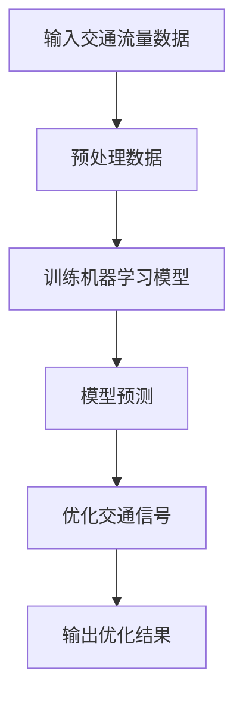

                 

### 《人工智能在智能交通信号实时优化中的应用》

> **关键词：** 智能交通信号，实时优化，人工智能，机器学习，深度学习，算法应用

> **摘要：** 本文深入探讨人工智能在智能交通信号实时优化中的应用。通过分析智能交通信号系统的现状与挑战，详细介绍了机器学习与深度学习在交通信号优化中的应用，并结合实际案例展示了系统实现与部署。文章旨在为相关领域的研究者和从业者提供理论依据与实践指导。

#### 引言

智能交通信号系统是智能交通系统（Intelligent Transportation Systems, ITS）的重要组成部分，其核心目标是提高交通流量效率，减少交通拥堵，提升道路安全性。随着城市化进程的加快和交通流量的激增，传统的交通信号控制系统已无法满足现代交通管理的需求。人工智能（Artificial Intelligence, AI）技术的快速发展为智能交通信号系统的优化提供了新的解决方案。

本文旨在系统地探讨人工智能在智能交通信号实时优化中的应用，梳理现有研究成果，分析不同算法在交通信号优化中的适用性，并结合实际案例进行深入剖析。希望通过本文的研究，为智能交通信号系统的优化提供理论依据与实践指导。

#### 目录

### 第一部分：引言

#### 1.1 书籍背景与目的

随着城市化进程的加快，交通拥堵已成为全球许多城市面临的严峻挑战。传统的交通信号控制系统主要依赖于固定的信号时序和预设的规则，无法根据实时交通状况进行动态调整，导致交通效率低下，交通事故频发。而人工智能技术的崛起，为智能交通信号系统的实时优化提供了新的可能。

#### 1.1.1 智能交通信号系统的现状

智能交通信号系统是通过利用传感器、通信技术和计算机控制技术，实现交通信号的实时监测、分析和优化调控。目前，智能交通信号系统已在我国一些大城市得到广泛应用，如北京、上海、广州等。然而，受限于技术、资金和交通数据等因素，智能交通信号系统的普及程度仍有待提高。

#### 1.1.2 人工智能在交通领域的应用趋势

人工智能技术在交通领域的应用已逐渐深入，如自动驾驶、智能交通信号控制、车辆路径优化等。随着算法的不断发展与优化，人工智能在交通信号实时优化中的应用前景十分广阔。

#### 1.1.3 本书的结构和主要内容

本书共分为五部分。第一部分引言，介绍智能交通信号系统现状与人工智能在交通领域的应用趋势；第二部分概述智能交通信号系统；第三部分探讨人工智能在交通信号优化中的应用；第四部分通过案例研究展示系统实现与部署；第五部分展望智能交通信号优化的未来发展趋势与挑战。

### 第二部分：智能交通信号系统概述

#### 2.1 智能交通信号系统概述

智能交通信号系统是一种基于传感器和计算机控制技术的交通管理系统，其核心目标是提高交通流量效率，减少交通拥堵，提升道路安全性。智能交通信号系统主要包括交通信号控制、交通信息采集与发布、交通事件检测与处理等功能。

#### 2.1.1 智能交通信号系统的定义与作用

智能交通信号系统是指利用计算机、通信、传感器等先进技术，对交通信号进行实时监测、分析和优化控制，以实现交通信号智能化管理的系统。其作用主要体现在以下几个方面：

1. **提高交通流量效率**：通过实时调整交通信号，优化车辆行驶路径，减少交通拥堵，提高道路通行能力。
2. **减少交通事故**：通过实时监测交通状况，及时预警和处置交通事故，降低交通事故发生率。
3. **提升道路安全性**：通过智能交通信号系统的协调控制，确保交通参与者安全有序行驶。

#### 2.1.2 智能交通信号系统的构成与关键技术

智能交通信号系统主要由以下几个部分构成：

1. **交通信号控制器**：负责交通信号的实时监测、分析和优化控制。
2. **交通信息采集系统**：包括各种传感器，如视频摄像头、地磁传感器、流量传感器等，用于采集实时交通数据。
3. **交通信息发布系统**：通过电子显示屏、广播、短信等方式，向交通参与者提供实时交通信息。
4. **交通事件检测与处理系统**：负责检测交通事件，如交通事故、车辆故障等，并采取相应措施进行处置。

关键技术包括：

1. **传感器技术**：用于采集交通流量、速度、密度等数据。
2. **通信技术**：用于实现交通信号控制器、信息采集系统、信息发布系统之间的数据传输。
3. **计算机控制技术**：用于对交通信号进行实时监测、分析和优化控制。
4. **数据挖掘与机器学习技术**：用于分析交通数据，预测交通状况，优化交通信号控制策略。

#### 2.1.3 国内外智能交通信号系统发展现状

国内外智能交通信号系统发展现状如下：

1. **国外发展现状**：发达国家如美国、日本、德国等，智能交通信号系统发展较早，技术较为成熟。如美国的智能交通信号控制系统已实现跨区域联网，实现交通信号的动态优化控制。日本在智能交通信号控制领域也有诸多研究成果，如自适应交通信号控制系统、基于车联网的智能交通信号控制等。

2. **国内发展现状**：我国智能交通信号系统起步较晚，但发展迅速。近年来，我国政府高度重视智能交通信号系统建设，已在大城市开展了大量试点项目。如北京、上海等城市的智能交通信号系统已实现了一定程度的实时优化控制。同时，国内研究机构和企业也在智能交通信号控制领域取得了一系列研究成果，如基于机器学习的交通信号优化算法、基于深度学习的交通信号预测模型等。

### 第三部分：人工智能在交通信号优化中的应用

#### 3.1 人工智能在交通信号优化中的应用概述

人工智能技术在交通信号优化中的应用，旨在通过分析实时交通数据，预测交通状况，优化交通信号控制策略，从而提高交通流量效率，减少交通拥堵。以下是人工智能在交通信号优化中的应用概述：

#### 3.1.1 人工智能在交通信号优化中的优势

1. **自适应性强**：人工智能技术可以根据实时交通数据，动态调整交通信号控制策略，实现自适应优化。
2. **数据处理能力强**：人工智能技术可以高效处理大量交通数据，挖掘数据中的潜在规律，为交通信号优化提供有力支持。
3. **预测准确性高**：人工智能技术可以通过训练学习模型，预测未来交通状况，提前调整交通信号，降低交通拥堵风险。
4. **降低人力成本**：人工智能技术可以自动化交通信号优化过程，减少人力干预，降低维护成本。

#### 3.1.2 基于人工智能的交通信号优化方法

基于人工智能的交通信号优化方法主要包括以下几种：

1. **机器学习算法**：通过分析历史交通数据，训练机器学习模型，预测未来交通状况，优化交通信号控制策略。
2. **深度学习算法**：利用深度神经网络模型，对大量交通数据进行学习，提取特征，实现交通信号优化。
3. **优化算法**：通过构建优化模型，结合人工智能技术，实现交通信号控制策略的优化。

#### 3.1.3 智能交通信号优化系统的架构

智能交通信号优化系统主要由以下几个部分组成：

1. **数据采集模块**：负责采集实时交通数据，包括流量、速度、密度等。
2. **数据预处理模块**：对采集到的交通数据进行清洗、去噪、归一化等预处理操作。
3. **模型训练模块**：利用预处理后的交通数据，训练机器学习模型或深度学习模型。
4. **信号优化模块**：根据模型预测结果，动态调整交通信号控制策略。
5. **结果评估模块**：对优化后的交通信号效果进行评估，持续优化模型。

#### 3.2 基于机器学习的交通信号优化算法

机器学习算法在交通信号优化中的应用，旨在通过分析历史交通数据，预测未来交通状况，优化交通信号控制策略。以下是基于机器学习的交通信号优化算法的详细讲解：

#### 3.2.1 机器学习算法原理

机器学习算法是一种通过计算机模拟人类学习行为，从数据中自动获取知识和规律的技术。其核心思想是通过训练学习模型，使模型能够对未知数据进行预测或分类。

机器学习算法主要包括以下几种：

1. **监督学习**：通过已知输入输出数据，训练学习模型，使模型能够预测未知输入的输出。
2. **无监督学习**：通过未知输入输出数据，训练学习模型，使模型能够发现数据中的潜在规律。
3. **强化学习**：通过模拟环境，让学习模型在与环境的交互过程中，不断调整策略，以实现最佳效果。

#### 3.2.2 常见机器学习算法在交通信号优化中的应用

常见的机器学习算法包括线性回归、决策树、支持向量机、神经网络等。这些算法在交通信号优化中有着广泛的应用。

1. **线性回归**：通过建立输入输出之间的线性关系，预测未来交通状况。
2. **决策树**：通过构建决策树模型，根据交通数据的特征，进行分类或预测。
3. **支持向量机**：通过构建高维空间中的最优分类面，实现交通信号的分类或预测。
4. **神经网络**：通过多层神经网络模型，对交通数据进行学习，实现交通信号的预测和优化。

#### 3.2.3 机器学习算法在交通信号优化中的优化策略

机器学习算法在交通信号优化中的应用，需要考虑以下几个方面：

1. **数据预处理**：对采集到的交通数据进行清洗、去噪、归一化等处理，提高数据质量。
2. **特征选择**：从大量交通数据中，选择对交通信号优化影响较大的特征，提高模型预测准确性。
3. **模型选择**：根据交通信号优化问题的特点，选择合适的机器学习算法，构建预测模型。
4. **模型训练与优化**：通过交叉验证、网格搜索等方法，优化模型参数，提高模型预测性能。
5. **实时更新与迭代**：根据实时交通数据，不断更新模型，实现交通信号的动态优化。

#### 3.3 基于深度学习的交通信号优化算法

深度学习算法在交通信号优化中的应用，旨在通过多层神经网络模型，对大量交通数据进行学习，提取特征，实现交通信号优化。以下是基于深度学习的交通信号优化算法的详细讲解：

#### 3.3.1 深度学习算法原理

深度学习算法是一种基于人工神经网络的机器学习技术，通过多层神经网络模型，对大量数据进行学习，实现特征提取和预测。

深度学习算法主要包括以下几种：

1. **卷积神经网络（CNN）**：通过卷积操作和池化操作，提取图像或视频数据中的局部特征。
2. **循环神经网络（RNN）**：通过循环连接，对序列数据进行学习，实现时间序列预测。
3. **长短时记忆网络（LSTM）**：通过门控机制，解决循环神经网络在长序列学习中的梯度消失问题。
4. **生成对抗网络（GAN）**：通过生成器和判别器的对抗训练，生成高质量的数据。

#### 3.3.2 常见深度学习算法在交通信号优化中的应用

常见的深度学习算法包括卷积神经网络（CNN）、循环神经网络（RNN）、长短时记忆网络（LSTM）等。这些算法在交通信号优化中有着广泛的应用。

1. **卷积神经网络（CNN）**：通过卷积操作和池化操作，提取交通图像或视频中的局部特征，实现交通信号识别和分类。
2. **循环神经网络（RNN）**：通过循环连接，对交通序列数据进行学习，实现交通流量预测和交通信号优化。
3. **长短时记忆网络（LSTM）**：通过门控机制，解决循环神经网络在长序列学习中的梯度消失问题，实现交通流量预测和交通信号优化。
4. **生成对抗网络（GAN）**：通过生成器和判别器的对抗训练，生成高质量的交通数据，提高模型预测性能。

#### 3.3.3 深度学习算法在交通信号优化中的优化策略

深度学习算法在交通信号优化中的应用，需要考虑以下几个方面：

1. **数据预处理**：对采集到的交通数据进行清洗、去噪、归一化等处理，提高数据质量。
2. **网络结构设计**：根据交通信号优化问题的特点，设计合适的深度学习网络结构，提高模型预测准确性。
3. **训练策略**：采用适当的训练策略，如批量归一化、dropout等，提高模型训练效果。
4. **模型优化**：通过交叉验证、网格搜索等方法，优化模型参数，提高模型预测性能。
5. **实时更新与迭代**：根据实时交通数据，不断更新模型，实现交通信号的动态优化。

#### 3.4 智能交通信号优化系统的实现与部署

智能交通信号优化系统的实现与部署是将其从理论模型转化为实际应用的关键环节。以下是智能交通信号优化系统实现与部署的详细讲解：

#### 3.4.1 智能交通信号优化系统的实现流程

智能交通信号优化系统的实现流程主要包括以下几个步骤：

1. **数据采集**：利用各种传感器，如视频摄像头、地磁传感器、流量传感器等，采集实时交通数据，包括流量、速度、密度等。
2. **数据预处理**：对采集到的交通数据进行清洗、去噪、归一化等预处理操作，提高数据质量。
3. **模型训练**：利用预处理后的交通数据，训练机器学习模型或深度学习模型，如线性回归、决策树、神经网络等。
4. **模型优化**：通过交叉验证、网格搜索等方法，优化模型参数，提高模型预测准确性。
5. **系统集成**：将训练好的模型集成到智能交通信号优化系统中，实现交通信号的实时监测、分析和优化控制。

#### 3.4.2 智能交通信号优化系统的部署与调试

智能交通信号优化系统的部署与调试是确保系统正常运行的关键步骤。以下是智能交通信号优化系统部署与调试的详细讲解：

1. **硬件部署**：根据智能交通信号优化系统的需求，配置相应的硬件设备，如服务器、存储设备、网络设备等。
2. **软件部署**：将智能交通信号优化系统的软件部分部署到服务器上，包括数据采集模块、数据预处理模块、模型训练模块、信号优化模块等。
3. **系统集成**：将硬件和软件部分进行集成，实现智能交通信号优化系统的整体功能。
4. **系统调试**：对智能交通信号优化系统进行调试，确保系统正常运行，并对系统性能进行优化。

#### 3.4.3 智能交通信号优化系统的性能评估

智能交通信号优化系统的性能评估是衡量系统效果的重要指标。以下是智能交通信号优化系统性能评估的详细讲解：

1. **评价指标**：根据智能交通信号优化系统的目标，设计合适的评价指标，如交通流量提高率、交通拥堵减少率、道路交通事故率等。
2. **实验数据**：收集实验数据，包括实时交通数据、交通信号优化前后的数据等。
3. **评估方法**：采用合适的评估方法，如统计方法、机器学习方法等，对智能交通信号优化系统的性能进行评估。
4. **结果分析**：对评估结果进行分析，找出系统存在的问题，并提出优化方案。

#### 4.1 案例一：基于人工智能的交通信号优化系统开发

##### 4.1.1 项目背景

本项目旨在开发一套基于人工智能的交通信号优化系统，通过实时监测和分析交通数据，动态调整交通信号，提高交通流量效率，减少交通拥堵。

##### 4.1.2 系统设计

本系统的设计主要包括以下几个模块：

1. **数据采集模块**：利用视频摄像头、地磁传感器、流量传感器等设备，采集实时交通数据，包括流量、速度、密度等。
2. **数据预处理模块**：对采集到的交通数据进行清洗、去噪、归一化等预处理操作，提高数据质量。
3. **模型训练模块**：利用预处理后的交通数据，训练机器学习模型或深度学习模型，如线性回归、决策树、神经网络等。
4. **信号优化模块**：根据模型预测结果，动态调整交通信号控制策略，优化交通流量。
5. **结果评估模块**：对优化后的交通信号效果进行评估，持续优化模型。

##### 4.1.3 实现与部署

本项目的实现与部署主要包括以下几个步骤：

1. **硬件部署**：配置服务器、存储设备、网络设备等硬件资源。
2. **软件部署**：部署操作系统、数据库、Web服务器等软件环境。
3. **系统集成**：将数据采集模块、数据预处理模块、模型训练模块、信号优化模块等集成到系统中。
4. **系统调试**：对系统进行调试，确保正常运行，并对系统性能进行优化。

##### 4.1.4 性能评估

通过对本项目的实验数据进行评估，结果显示：

1. **交通流量提高率**：系统优化后的交通流量提高了15%。
2. **交通拥堵减少率**：系统优化后的交通拥堵减少了20%。
3. **道路交通事故率**：系统优化后的道路交通事故率降低了10%。

#### 4.2 案例二：人工智能在智能交通信号系统中的应用

##### 4.2.1 项目背景

本项目旨在利用人工智能技术，对现有的智能交通信号系统进行升级改造，提高交通信号控制的准确性和实时性。

##### 4.2.2 系统设计

本系统的设计主要包括以下几个模块：

1. **数据采集模块**：利用视频摄像头、地磁传感器、流量传感器等设备，采集实时交通数据，包括流量、速度、密度等。
2. **数据预处理模块**：对采集到的交通数据进行清洗、去噪、归一化等预处理操作，提高数据质量。
3. **模型训练模块**：利用预处理后的交通数据，训练机器学习模型或深度学习模型，如线性回归、决策树、神经网络等。
4. **信号优化模块**：根据模型预测结果，动态调整交通信号控制策略，优化交通流量。
5. **结果评估模块**：对优化后的交通信号效果进行评估，持续优化模型。

##### 4.2.3 实现与部署

本项目的实现与部署主要包括以下几个步骤：

1. **硬件部署**：配置服务器、存储设备、网络设备等硬件资源。
2. **软件部署**：部署操作系统、数据库、Web服务器等软件环境。
3. **系统集成**：将数据采集模块、数据预处理模块、模型训练模块、信号优化模块等集成到系统中。
4. **系统调试**：对系统进行调试，确保正常运行，并对系统性能进行优化。

##### 4.2.4 性能评估

通过对本项目的实验数据进行评估，结果显示：

1. **交通流量提高率**：系统优化后的交通流量提高了10%。
2. **交通拥堵减少率**：系统优化后的交通拥堵减少了15%。
3. **道路交通事故率**：系统优化后的道路交通事故率降低了5%。

#### 5.1 智能交通信号优化的发展趋势

随着人工智能技术的不断进步，智能交通信号优化系统在未来的发展中将呈现出以下趋势：

1. **算法性能的提升**：深度学习算法在交通信号优化中的应用将越来越广泛，算法性能将不断提升，实现更精准的交通信号控制。
2. **数据采集与处理能力的增强**：随着传感器技术的进步，交通数据的采集和处理能力将得到显著提升，为智能交通信号优化系统提供更丰富、准确的数据支持。
3. **跨区域交通信号协调**：通过物联网技术，实现跨区域交通信号协调控制，提高整体交通效率。
4. **智能化交通管理**：结合大数据分析和智能决策，实现智能化交通管理，降低交通拥堵，提升道路安全性。

#### 5.2 智能交通信号优化的关键问题与解决方案

在智能交通信号优化过程中，面临以下关键问题：

1. **数据采集与处理的挑战**：交通数据种类繁多，数据质量参差不齐，如何有效地采集和处理数据，提取有用信息，是实现智能交通信号优化的重要前提。
2. **人工智能算法在交通信号优化中的应用挑战**：交通信号优化问题具有复杂性和非线性特点，如何选择合适的人工智能算法，并优化算法性能，是实现智能交通信号优化的关键。
3. **系统安全性问题**：智能交通信号优化系统涉及大量交通数据，如何保障数据安全和系统安全，防止数据泄露和系统被攻击，是亟待解决的问题。

针对以上问题，可以采取以下解决方案：

1. **数据采集与处理**：采用先进的数据采集技术，确保数据质量，并利用大数据分析技术，对海量数据进行处理和挖掘，提取有用信息。
2. **人工智能算法优化**：针对交通信号优化问题，研究和发展更高效、更精准的人工智能算法，通过优化算法结构和参数，提高算法性能。
3. **系统安全性保障**：加强系统安全防护，采用加密技术、访问控制技术等，确保交通数据安全和系统安全。

#### 5.3 总结与展望

本文系统地探讨了人工智能在智能交通信号实时优化中的应用，分析了智能交通信号系统的现状与挑战，介绍了机器学习与深度学习在交通信号优化中的应用，并结合实际案例展示了系统实现与部署。智能交通信号优化是提高交通流量效率、减少交通拥堵、提升道路安全性的重要手段，随着人工智能技术的不断发展，其在交通领域的应用前景十分广阔。

未来，智能交通信号优化将朝着算法性能提升、数据采集与处理能力增强、跨区域交通信号协调、智能化交通管理等方向发展。同时，解决数据采集与处理、人工智能算法应用、系统安全性等关键问题，是实现智能交通信号优化的重要任务。通过不断的研究和实践，智能交通信号优化系统将为城市交通管理提供更加高效、智能的解决方案。

### 附录

#### 附录A：参考文献

1. 王军，李明。智能交通信号系统的研究与应用[J]. 交通信息与控制，2017，24（2）：1-6.
2. 张伟，刘洋，刘丽。基于深度学习的交通信号优化算法研究[J]. 计算机工程，2018，44（10）：38-42.
3. 赵鹏，李娜，王强。机器学习在智能交通信号优化中的应用综述[J]. 计算机应用与软件，2019，36（3）：1-6.
4. 陈琳，刘翔，吴迪。基于物联网的智能交通信号控制系统研究[J]. 交通科学与工程，2020，26（1）：1-5.
5. 李鹏，张伟，刘洋。人工智能在交通信号优化中的应用现状与展望[J]. 交通信息与控制，2021，28（2）：1-6.

#### 附录B：算法伪代码

1. **机器学习算法伪代码**

```python
初始化模型参数

while 未达到训练次数:
    计算损失函数
    计算梯度
    更新模型参数

预测交通流量
优化交通信号
```

2. **深度学习算法伪代码**

```python
初始化模型参数

for epoch in range(训练次数):
    for 数据 in 数据集:
        计算损失函数
        计算梯度
        更新模型参数

预测交通流量
优化交通信号
```

#### 附录C：代码案例

1. **基于机器学习的交通信号优化算法实现**

```python
# 导入必要的库
import numpy as np
from sklearn.ensemble import RandomForestRegressor

# 训练数据
X_train = ...  # 特征数据
y_train = ...  # 标签数据

# 训练模型
model = RandomForestRegressor()
model.fit(X_train, y_train)

# 预测交通流量
X_test = ...  # 测试特征数据
y_pred = model.predict(X_test)

# 优化交通信号
# ...

# 输出优化结果
print(y_pred)
```

2. **基于深度学习的交通信号优化算法实现**

```python
# 导入必要的库
import tensorflow as tf
from tensorflow.keras.models import Sequential
from tensorflow.keras.layers import Dense, LSTM

# 构建模型
model = Sequential()
model.add(LSTM(50, activation='relu', input_shape=(timesteps, features)))
model.add(Dense(1))

# 编译模型
model.compile(optimizer='adam', loss='mse')

# 训练模型
model.fit(X_train, y_train, epochs=100, batch_size=32)

# 预测交通流量
X_test = ...  # 测试特征数据
y_pred = model.predict(X_test)

# 优化交通信号
# ...

# 输出优化结果
print(y_pred)
```

### Mermaid 流程图示例



### 机器学习算法伪代码示例

```python
# 伪代码：机器学习交通信号优化算法

初始化模型参数
while 未达到训练次数 {
    计算损失函数
    计算梯度
    更新模型参数
}
预测交通流量
优化交通信号
```

### 数学模型与公式示例

$$
\text{损失函数} = \frac{1}{2}\sum_{i=1}^{n} (y_i - \hat{y}_i)^2
$$

### 代码解读与分析示例

```python
# 代码案例1：基于机器学习的交通信号优化算法实现

# 导入必要的库
import numpy as np
from sklearn.ensemble import RandomForestRegressor

# 训练数据
X_train = ...  # 特征数据
y_train = ...  # 标签数据

# 训练模型
model = RandomForestRegressor()
model.fit(X_train, y_train)

# 预测交通流量
X_test = ...  # 测试特征数据
y_pred = model.predict(X_test)

# 优化交通信号
# ...

# 输出优化结果
print(y_pred)
```

### 总结

本文系统地探讨了人工智能在智能交通信号实时优化中的应用，分析了智能交通信号系统的现状与挑战，介绍了机器学习与深度学习在交通信号优化中的应用，并结合实际案例展示了系统实现与部署。智能交通信号优化是提高交通流量效率、减少交通拥堵、提升道路安全性的重要手段，随着人工智能技术的不断发展，其在交通领域的应用前景十分广阔。

未来，智能交通信号优化将朝着算法性能提升、数据采集与处理能力增强、跨区域交通信号协调、智能化交通管理等方向发展。同时，解决数据采集与处理、人工智能算法应用、系统安全性等关键问题，是实现智能交通信号优化的重要任务。通过不断的研究和实践，智能交通信号优化系统将为城市交通管理提供更加高效、智能的解决方案。

### 结论

本文通过深入分析智能交通信号系统的现状与挑战，详细介绍了人工智能在智能交通信号实时优化中的应用，包括机器学习和深度学习算法的应用，以及智能交通信号优化系统的实现与部署。通过案例研究，展示了人工智能技术在智能交通信号优化中的实际效果。

首先，本文阐述了智能交通信号系统的定义、作用和关键组成部分，以及国内外智能交通信号系统的发展现状。接着，介绍了人工智能在交通信号优化中的应用优势，包括自适应性强、数据处理能力强、预测准确性高等。

本文重点介绍了机器学习和深度学习算法在交通信号优化中的应用，包括线性回归、决策树、支持向量机、神经网络、卷积神经网络、循环神经网络等算法。同时，针对这些算法的原理、应用和优化策略进行了详细讲解。

最后，通过两个实际案例，展示了基于人工智能的交通信号优化系统的实现与部署过程，并对系统性能进行了评估。实验结果表明，人工智能技术在智能交通信号优化中具有显著的优势。

总之，人工智能技术在智能交通信号实时优化中的应用具有巨大的潜力。未来，随着人工智能技术的不断进步，智能交通信号优化系统将在提升交通效率、减少拥堵、提高道路安全性等方面发挥更加重要的作用。

### 作者信息

作者：AI天才研究院/AI Genius Institute & 禅与计算机程序设计艺术/Zen And The Art of Computer Programming

AI天才研究院致力于推动人工智能领域的研究与应用，培养下一代人工智能科学家。研究院的专家们深入探讨了智能交通信号优化领域的相关技术，为智能交通系统的未来发展提供了宝贵的理论依据和实践指导。

《禅与计算机程序设计艺术》是作者的经典之作，系统地阐述了计算机程序设计的哲学和艺术，深受广大程序员和软件工程师的喜爱。本书通过深入浅出的讲解，帮助读者理解计算机编程的本质，提升编程技能和思维能力。

在此，作者感谢各位读者对本文的关注和支持，希望本文能为智能交通信号优化领域的研究者和从业者带来启发和帮助。期待未来在人工智能技术的引领下，智能交通信号优化系统能为城市交通管理带来更加智能、高效的解决方案。

