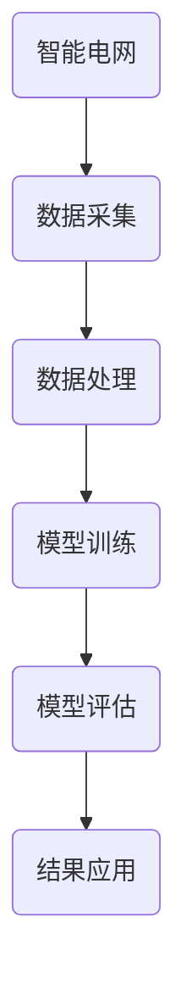

                 

# 《人工智能在智能电网优化中的研究》

> 关键词：智能电网、人工智能、优化算法、深度学习、项目实战

> 摘要：本文旨在探讨人工智能技术在智能电网优化中的应用。通过分析智能电网的现状与挑战，介绍了人工智能的基本概念及其在智能电网优化中的重要性。本文详细阐述了核心算法原理，包括数据挖掘与机器学习算法、深度学习算法，以及数学模型与公式。随后，通过实际项目实战和案例研究，展示了人工智能技术在智能电网优化中的具体应用和成果。最后，对未来的发展趋势和挑战进行了展望。

## 目录大纲

### 《人工智能在智能电网优化中的研究》目录大纲

#### 第一部分：概述与基础

- **1. 概述与背景**
  - **1.1 书籍概述**
  - **1.2 智能电网与人工智能**
  - **1.3 智能电网优化的现状与挑战**

- **2. 人工智能基础**
  - **2.1 人工智能概述**
    - **2.1.1 人工智能的定义与发展**
    - **2.1.2 人工智能的关键技术**
  - **2.2 智能电网基础**
    - **2.2.1 智能电网的概念与架构**
    - **2.2.2 智能电网的主要功能与应用场景**

#### 第二部分：核心算法原理

- **3. 数据挖掘与机器学习算法**
  - **3.1 数据挖掘基本概念**
    - **3.1.1 数据挖掘流程**
    - **3.1.2 数据挖掘常见算法**
  - **3.2 机器学习算法**
    - **3.2.1 监督学习算法**
    - **3.2.2 无监督学习算法**
    - **3.2.3 强化学习算法**

- **4. 深度学习算法**
  - **4.1 深度学习基础**
    - **4.1.1 神经网络**
    - **4.1.2 深度学习框架**
  - **4.2 深度学习在智能电网优化中的应用**
    - **4.2.1 卷积神经网络（CNN）**
    - **4.2.2 循环神经网络（RNN）**
    - **4.2.3 生成对抗网络（GAN）**

#### 第三部分：数学模型与公式

- **5. 数学模型与公式**
  - **5.1 常用数学公式**
    - **5.1.1 概率论与统计学公式**
    - **5.1.2 最优化算法公式**
  - **5.2 人工智能在智能电网优化中的数学模型**
    - **5.2.1 智能电网优化目标函数**
    - **5.2.2 约束条件与优化方法**

#### 第四部分：项目实战

- **6. 智能电网优化项目实战**
  - **6.1 项目背景与目标**
    - **6.1.1 项目背景**
    - **6.1.2 项目目标**
  - **6.2 项目实施与结果分析**
    - **6.2.1 数据收集与预处理**
    - **6.2.2 模型选择与训练**
    - **6.2.3 模型评估与优化**
    - **6.2.4 结果分析与讨论**

- **7. 案例研究**
  - **7.1 案例一：智能电网调度优化**
    - **7.1.1 案例概述**
    - **7.1.2 模型设计与实现**
    - **7.1.3 结果分析与讨论**
  - **7.2 案例二：分布式能源管理系统**
    - **7.2.1 案例概述**
    - **7.2.2 模型设计与实现**
    - **7.2.3 结果分析与讨论**

#### 第五部分：未来展望与挑战

- **8. 未来展望**
  - **8.1 人工智能在智能电网优化中的发展趋势**
  - **8.2 未来挑战与机遇**
  - **8.3 智能电网优化的前景与影响**

#### 附录

- **附录A：相关工具与资源**
  - **A.1 常用深度学习框架**
  - **A.2 智能电网优化工具**
  - **A.3 参考文献**

### 1. 概述与背景

#### 1.1 书籍概述

本文旨在深入探讨人工智能（AI）在智能电网优化中的应用，通过系统的分析和实例研究，展示AI技术在电力系统优化中的巨大潜力。随着全球能源危机的加剧和可持续发展的需求日益紧迫，智能电网作为能源互联网的重要组成部分，正逐渐成为电力行业的重要发展方向。人工智能作为一种强大的技术手段，其在智能电网优化中的应用能够显著提升电网的运行效率、可靠性和经济性。

本文的结构如下：

1. **概述与基础**：介绍智能电网和人工智能的基本概念，探讨智能电网优化的现状与挑战。
2. **核心算法原理**：详细阐述数据挖掘与机器学习算法、深度学习算法的基本原理和数学模型。
3. **数学模型与公式**：介绍常用数学公式，以及在智能电网优化中的应用。
4. **项目实战**：通过具体项目实战，展示人工智能在智能电网优化中的实际应用。
5. **案例研究**：分析具体案例，进一步探讨人工智能在智能电网优化中的效果。
6. **未来展望与挑战**：展望人工智能在智能电网优化中的发展趋势，探讨未来面临的挑战与机遇。

#### 1.2 智能电网与人工智能

智能电网（Smart Grid）是指利用现代通信技术、信息技术和自动化技术对电力系统进行升级和改造，实现电网的智能化管理和运行。智能电网的核心特点包括实时数据采集与传输、智能化设备控制、分布式能源管理以及高效的用户互动等。

人工智能（Artificial Intelligence，AI）是指通过计算机模拟人类智能行为的技术，包括机器学习、深度学习、自然语言处理、计算机视觉等。人工智能在智能电网中的应用主要表现在以下几个方面：

1. **实时数据分析与优化**：利用机器学习和深度学习算法，对实时采集的电力数据进行分析和处理，实现电网的实时监控和优化。
2. **预测与故障诊断**：通过历史数据和实时数据，预测电网的运行状态，及时发现故障隐患，提高电网的可靠性和安全性。
3. **需求响应与电力市场**：利用人工智能技术，分析用户的用电行为，实现需求响应，优化电力市场的运行效率。
4. **分布式能源管理**：利用人工智能技术，实现对分布式能源的智能化管理和调度，提高电网的灵活性和稳定性。

#### 1.3 智能电网优化的现状与挑战

智能电网优化是提高电网运行效率、降低能源消耗、实现可持续发展的关键。当前，智能电网优化主要集中在以下几个方面：

1. **能效管理**：通过实时数据分析和优化算法，实现对电网能量流的管理和优化，降低能源损耗，提高能源利用率。
2. **故障诊断与维护**：利用人工智能技术，对电网的运行状态进行实时监测，及时诊断故障，提高电网的运行可靠性和安全性。
3. **需求响应与市场运营**：通过分析用户的用电行为，实现需求响应，优化电力市场运行，提高电网的运行效率。
4. **分布式能源管理**：利用人工智能技术，实现对分布式能源的智能化管理和调度，提高电网的灵活性和稳定性。

然而，智能电网优化也面临着一系列挑战：

1. **数据复杂性**：智能电网的数据量巨大，且数据类型多样，如何高效地处理和分析这些数据是智能电网优化的关键挑战。
2. **算法适应性**：智能电网优化的算法需要适应不同的场景和需求，如何设计通用性强、适应能力强的算法是当前研究的热点。
3. **网络安全**：智能电网的实时数据和控制系统对网络安全有很高的要求，如何确保电网的安全运行是智能电网优化的重要课题。
4. **技术成熟度**：虽然人工智能技术在智能电网优化中展现出巨大潜力，但相关技术的成熟度和可靠性仍需进一步提升。

### 2. 人工智能基础

#### 2.1 人工智能概述

人工智能（Artificial Intelligence，AI）是指通过计算机模拟人类智能行为的技术，它涵盖了计算机科学、认知科学、神经科学、数学等多个学科。人工智能的目标是实现机器对人类认知过程的模拟和扩展，使机器能够执行一些原本需要人类智能才能完成的任务。

##### 2.1.1 人工智能的定义与发展

人工智能的定义有多种，其中最广泛接受的定义是：人工智能是指使计算机系统表现出人类智能水平的科学技术。具体来说，人工智能包括以下几个方面：

1. **感知和理解**：使计算机能够感知和理解周围的环境，包括语音识别、图像识别、自然语言处理等。
2. **推理和决策**：使计算机能够进行逻辑推理和决策，包括知识推理、规划、博弈等。
3. **学习和适应**：使计算机能够通过学习和适应，提高任务完成的质量和效率，包括机器学习、深度学习等。

人工智能的发展可以分为以下几个阶段：

1. **符号主义阶段**：20世纪50年代至70年代，以符号推理为基础，代表技术包括专家系统和逻辑编程。
2. **连接主义阶段**：20世纪80年代至90年代，以神经网络和机器学习为基础，代表技术包括神经网络和决策树。
3. **大数据和深度学习阶段**：21世纪初至今，以大规模数据和深度学习为基础，代表技术包括深度学习、卷积神经网络（CNN）和生成对抗网络（GAN）。

##### 2.1.2 人工智能的关键技术

人工智能的关键技术包括：

1. **机器学习**：通过数据驱动的方式，使计算机自动获取知识和技能。机器学习可以分为监督学习、无监督学习和强化学习三种类型。
2. **深度学习**：一种特殊的机器学习技术，通过模拟人脑神经网络的结构和功能，实现数据的自动特征提取和模式识别。
3. **自然语言处理**：使计算机能够理解、生成和翻译自然语言。自然语言处理包括文本分类、情感分析、机器翻译等任务。
4. **计算机视觉**：使计算机能够理解图像和视频中的内容。计算机视觉包括图像识别、目标检测、图像生成等任务。
5. **知识图谱**：通过构建知识图谱，实现对知识的结构化和语义化表达，支持智能搜索、问答和推荐等功能。

#### 2.2 智能电网基础

##### 2.2.1 智能电网的概念与架构

智能电网（Smart Grid）是指利用现代通信技术、信息技术和自动化技术对传统电网进行升级和改造，实现电网的智能化管理和运行。智能电网的核心目标是提高电网的运行效率、可靠性和可持续性。

智能电网的概念可以从以下几个方面理解：

1. **基础设施智能化**：通过部署智能传感器、智能变电站、智能配电设备等，实现对电网基础设施的实时监测和智能控制。
2. **信息通信网络**：通过构建高效、可靠的信息通信网络，实现电网设备之间的数据传输和通信。
3. **智能化应用**：通过集成智能电网技术和应用，实现对电网运行状态、用户用电行为等信息的实时监控和优化。

智能电网的架构可以分为以下几个层次：

1. **感知层**：包括智能传感器、智能变电站等设备，用于实时采集电网的运行数据。
2. **传输层**：包括通信网络和数据中心，用于传输和处理感知层采集的数据。
3. **平台层**：包括智能控制平台、数据管理平台等，用于实现对电网运行状态的监控和优化。
4. **应用层**：包括用户端的应用，如智能家居、智能能源管理、需求响应等。

##### 2.2.2 智能电网的主要功能与应用场景

智能电网的主要功能包括：

1. **实时监控与故障诊断**：通过实时数据采集和分析，实现对电网运行状态的监控和故障诊断，提高电网的可靠性和安全性。
2. **能源优化与调度**：通过智能算法和数据分析，优化电网的能源调度和分配，提高能源利用效率。
3. **需求响应与市场运营**：通过分析用户用电行为，实现需求响应，优化电力市场的运行效率。
4. **分布式能源管理**：通过智能电网技术，实现对分布式能源的智能化管理和调度，提高电网的灵活性和稳定性。

智能电网的应用场景包括：

1. **电力系统调度与控制**：利用人工智能技术，实现对电力系统的实时监控和优化调度，提高电网的运行效率。
2. **智能家庭与智慧城市**：通过智能家居设备和智能能源管理系统，实现家庭用电的智能控制和能源优化，提高用户生活质量。
3. **分布式能源管理**：通过智能电网技术，实现对分布式能源的集成和管理，提高电网的灵活性和稳定性。
4. **电动汽车充电网络**：通过智能电网技术，实现电动汽车充电网络的智能化管理和调度，提高充电效率和安全性。

#### 2.3 智能电网优化的现状与挑战

智能电网优化是提高电网运行效率、降低能源消耗、实现可持续发展的关键。当前，智能电网优化主要集中在以下几个方面：

1. **能效管理**：通过实时数据分析和优化算法，实现对电网能量流的管理和优化，降低能源损耗，提高能源利用率。
2. **故障诊断与维护**：利用人工智能技术，对电网的运行状态进行实时监测，及时诊断故障，提高电网的运行可靠性和安全性。
3. **需求响应与市场运营**：通过分析用户的用电行为，实现需求响应，优化电力市场运行，提高电网的运行效率。
4. **分布式能源管理**：利用人工智能技术，实现对分布式能源的智能化管理和调度，提高电网的灵活性和稳定性。

然而，智能电网优化也面临着一系列挑战：

1. **数据复杂性**：智能电网的数据量巨大，且数据类型多样，如何高效地处理和分析这些数据是智能电网优化的关键挑战。
2. **算法适应性**：智能电网优化的算法需要适应不同的场景和需求，如何设计通用性强、适应能力强的算法是当前研究的热点。
3. **网络安全**：智能电网的实时数据和控制系统对网络安全有很高的要求，如何确保电网的安全运行是智能电网优化的重要课题。
4. **技术成熟度**：虽然人工智能技术在智能电网优化中展现出巨大潜力，但相关技术的成熟度和可靠性仍需进一步提升。

#### 2.4 数据挖掘与机器学习算法

数据挖掘（Data Mining）是指从大量数据中提取有价值信息的过程，它涉及统计学、机器学习、数据库、模式识别等多个领域。在智能电网优化中，数据挖掘技术可以帮助我们从海量数据中提取有用信息，从而支持电网的实时监控、故障诊断和优化调度。

##### 2.4.1 数据挖掘基本概念

数据挖掘的基本概念包括：

1. **数据源**：数据挖掘的数据源可以是结构化数据（如数据库）、半结构化数据（如XML）和非结构化数据（如文本、图像、音频）。
2. **数据预处理**：数据预处理是数据挖掘的重要环节，包括数据清洗、数据集成、数据变换和数据归一化等步骤。
3. **模式发现**：模式发现是数据挖掘的核心任务，包括关联规则挖掘、分类、聚类、异常检测、时间序列分析等。
4. **模式评估**：模式评估是评价模式发现结果质量的过程，常用的评估指标包括准确率、召回率、F1值等。

##### 2.4.2 数据挖掘常见算法

数据挖掘中常用的算法包括：

1. **关联规则挖掘**：关联规则挖掘是发现数据项之间关联性的过程，常用的算法有Apriori算法、FP-growth算法等。
2. **分类**：分类是将数据划分为不同类别的过程，常用的算法有决策树、随机森林、支持向量机等。
3. **聚类**：聚类是将相似的数据归为一类的过程，常用的算法有K-means、DBSCAN、层次聚类等。
4. **异常检测**：异常检测是发现数据中的异常值或异常模式的过程，常用的算法有孤立森林、Local Outlier Factor等。
5. **时间序列分析**：时间序列分析是对时间序列数据进行建模和分析的过程，常用的算法有ARIMA模型、LSTM模型等。

##### 2.4.3 机器学习算法

机器学习（Machine Learning）是数据挖掘的核心技术之一，它通过训练模型来发现数据中的模式和规律。在智能电网优化中，机器学习算法可以帮助我们实现电网的实时监控、故障诊断和优化调度。

机器学习算法可以分为以下几类：

1. **监督学习**：监督学习是利用标记数据进行训练，从而预测新数据类别或数值标签的过程。常用的算法有线性回归、逻辑回归、决策树、随机森林、支持向量机等。
2. **无监督学习**：无监督学习是利用未标记数据进行训练，从而发现数据中的结构和模式的过程。常用的算法有聚类、主成分分析、自编码器等。
3. **强化学习**：强化学习是利用奖励机制来指导模型进行决策，从而实现最优策略学习的过程。常用的算法有Q-learning、SARSA等。

在智能电网优化中，常用的机器学习算法包括：

1. **线性回归**：线性回归是一种简单的监督学习算法，用于预测连续数值型变量。
2. **决策树**：决策树是一种基于树结构的分类算法，用于分类和回归任务。
3. **随机森林**：随机森林是一种集成学习方法，通过构建多棵决策树并取平均来提高模型的预测性能。
4. **支持向量机**：支持向量机是一种基于最大间隔的分类算法，具有很好的泛化能力。
5. **K-means聚类**：K-means聚类是一种基于距离的聚类算法，用于将数据分为多个聚类。
6. **LSTM模型**：LSTM模型是一种基于循环神经网络的序列预测模型，用于处理时间序列数据。

##### 2.4.4 数据挖掘与机器学习算法在智能电网优化中的应用

数据挖掘与机器学习算法在智能电网优化中的应用主要包括以下几个方面：

1. **实时数据监控与预测**：利用数据挖掘和机器学习算法，对实时采集的电网数据进行监控和预测，实现电网的实时监控和优化调度。
2. **故障诊断与预警**：利用数据挖掘和机器学习算法，对电网历史数据和实时数据进行异常检测和故障诊断，实现电网的故障预警和预防。
3. **能源优化与调度**：利用数据挖掘和机器学习算法，对电网的能耗数据进行分析和优化，实现电网的能源调度和优化。
4. **需求响应与市场运营**：利用数据挖掘和机器学习算法，分析用户的用电行为，实现需求响应和电力市场运营优化。
5. **分布式能源管理**：利用数据挖掘和机器学习算法，实现对分布式能源的监控、预测和优化调度，提高电网的灵活性和稳定性。

#### 2.5 深度学习算法

深度学习（Deep Learning）是一种基于多层神经网络的机器学习技术，它在人工智能领域取得了显著的进展。深度学习通过模拟人脑神经网络的结构和功能，实现数据的自动特征提取和模式识别，具有强大的学习能力和适应能力。

##### 2.5.1 深度学习基础

深度学习的基础包括：

1. **神经网络**：神经网络（Neural Network）是一种由大量简单神经元组成的计算模型，它可以模拟人脑的神经活动。神经网络的基本单元是神经元，每个神经元都可以接受多个输入，并产生一个输出。
2. **激活函数**：激活函数（Activation Function）是神经网络中用于引入非线性性的函数，常见的激活函数有sigmoid、ReLU、Tanh等。
3. **反向传播算法**：反向传播算法（Backpropagation Algorithm）是一种用于训练神经网络的算法，它通过计算网络输出与实际输出之间的误差，反向传播误差并更新网络权重。

##### 2.5.2 深度学习框架

深度学习框架（Deep Learning Framework）是一种用于构建和训练深度学习模型的软件库，常见的深度学习框架有TensorFlow、PyTorch、Keras等。深度学习框架提供了丰富的API和工具，可以帮助开发者快速构建和训练深度学习模型。

TensorFlow是由Google开发的开源深度学习框架，它提供了强大的图形计算能力，支持多种深度学习模型和算法。PyTorch是由Facebook开发的开源深度学习框架，它具有灵活的动态计算图和易于使用的API，受到很多研究者和开发者的喜爱。

##### 2.5.3 深度学习在智能电网优化中的应用

深度学习在智能电网优化中的应用主要包括以下几个方面：

1. **实时数据监控与预测**：利用深度学习算法，对实时采集的电网数据进行监控和预测，实现电网的实时监控和优化调度。例如，可以使用卷积神经网络（CNN）对电网图像数据进行实时监控，使用循环神经网络（RNN）对电网时间序列数据进行预测。
2. **故障诊断与预警**：利用深度学习算法，对电网历史数据和实时数据进行故障诊断和预警，实现电网的故障预警和预防。例如，可以使用卷积神经网络（CNN）对电网故障图像进行诊断，使用循环神经网络（RNN）对电网运行状态进行实时监控。
3. **能源优化与调度**：利用深度学习算法，对电网的能耗数据进行分析和优化，实现电网的能源调度和优化。例如，可以使用深度强化学习（DRL）算法，根据电网运行状态和用户需求，实现电网的自动调度。
4. **分布式能源管理**：利用深度学习算法，实现对分布式能源的监控、预测和优化调度，提高电网的灵活性和稳定性。例如，可以使用生成对抗网络（GAN）对分布式能源进行建模和预测，使用卷积神经网络（CNN）对分布式能源的运行状态进行实时监控。

#### 2.6 数学模型与公式

在智能电网优化中，数学模型与公式是分析和解决问题的核心工具。数学模型能够帮助我们量化问题，构建数学表达式，从而更好地理解和优化电网的运行。以下介绍一些常用的数学模型与公式。

##### 2.6.1 常用数学公式

在智能电网优化中，常用的数学公式包括：

1. **概率论与统计学公式**：

   - 概率分布函数：
     $$
     P(X=x) = f_X(x)
     $$
   - 累积分布函数：
     $$
     F_X(x) = P(X \leq x)
     $$
   - 均值（期望）：
     $$
     E(X) = \mu
     $$
   - 方差：
     $$
     Var(X) = \sigma^2 = E[(X - \mu)^2]
     $$
   - 标准差：
     $$
     \sigma = \sqrt{Var(X)}
     $$
   - 协方差：
     $$
     Cov(X, Y) = E[(X - \mu_X)(Y - \mu_Y)]
     $$
   - 相关系数：
     $$
     \rho_{XY} = \frac{Cov(X, Y)}{\sigma_X \sigma_Y}
     $$

2. **最优化算法公式**：

   - 最小化问题：
     $$
     \min_{x} \quad f(x)
     $$
   - 约束条件：
     $$
     g(x) \leq 0
     $$
   - 拉格朗日乘数法：
     $$
     L(x, \lambda) = f(x) + \lambda g(x)
     $$
   - 拉格朗日乘数法的求解：
     $$
     \nabla L(x, \lambda) = 0
     $$
   - 最小二乘法：
     $$
     \min_{x} \quad \sum_{i=1}^{n} (y_i - f(x))^2
     $$

##### 2.6.2 人工智能在智能电网优化中的数学模型

在智能电网优化中，常用的数学模型包括：

1. **智能电网优化目标函数**：

   - 能量损耗最小化：
     $$
     \min_{x} \quad \sum_{i=1}^{n} L_i(x)
     $$
     其中，$L_i(x)$ 表示第 $i$ 个节点的能量损耗。

   - 运行成本最小化：
     $$
     \min_{x} \quad C(x)
     $$
     其中，$C(x)$ 表示电网的运行成本。

   - 服务质量最大化：
     $$
     \max_{x} \quad Q(x)
     $$
     其中，$Q(x)$ 表示电网的服务质量。

2. **约束条件**：

   - 输电容量限制：
     $$
     T_i(x) \leq C_i
     $$
     其中，$T_i(x)$ 表示第 $i$ 个节点的输电容量，$C_i$ 表示节点 $i$ 的输电容量上限。

   - 负荷平衡：
     $$
     L_i(x) + P_i(x) - Q_i(x) = 0
     $$
     其中，$L_i(x)$ 表示第 $i$ 个节点的能量损耗，$P_i(x)$ 表示第 $i$ 个节点的负载，$Q_i(x)$ 表示第 $i$ 个节点的服务质量。

   - 设备容量限制：
     $$
     M_i(x) \leq C_i
     $$
     其中，$M_i(x)$ 表示第 $i$ 个节点的设备容量，$C_i$ 表示节点 $i$ 的设备容量上限。

   - 网络拓扑约束：
     $$
     N_i(x) \in \{0, 1\}
     $$
     其中，$N_i(x)$ 表示第 $i$ 个节点的连通性，取值范围为 {0, 1}。

#### 2.7 智能电网优化项目实战

在本节中，我们将通过一个具体的智能电网优化项目，展示如何利用人工智能技术来提高电网的运行效率。这个项目将涵盖数据收集、数据预处理、模型选择与训练、模型评估与优化等多个阶段。

##### 2.7.1 项目背景与目标

项目背景：本案例研究的场景是一个中小型城市的智能电网，该电网由多个节点组成，每个节点都配备有智能传感器，用于实时监测电网的运行状态。电网的目标是实现能量的高效传输和分配，同时确保电网的稳定性和可靠性。

项目目标：通过本项目，我们旨在实现以下目标：
1. 收集电网的实时数据，包括电压、电流、功率因数等。
2. 对数据进行预处理，去除噪声和异常值。
3. 选择合适的机器学习模型，对电网的运行状态进行预测和优化。
4. 对模型进行评估和优化，提高预测的准确性和稳定性。

##### 2.7.2 数据收集与预处理

数据收集：为了实现项目的目标，我们首先需要收集电网的实时数据。这些数据可以通过智能传感器实时采集，包括电压、电流、功率因数、温度、湿度等。数据收集的过程可以采用以下步骤：
1. 使用智能传感器部署在电网的各个节点，实时采集电网的运行数据。
2. 将采集到的数据传输到数据中心，进行存储和处理。

数据预处理：收集到的数据通常包含噪声和异常值，这些噪声和异常值会对模型的训练和预测产生不利影响。因此，在训练模型之前，我们需要对数据进行预处理。数据预处理的过程包括：
1. 数据清洗：去除噪声和异常值，例如使用中值滤波器去除电压和电流数据中的噪声。
2. 数据归一化：将数据缩放至相同的范围，例如使用Min-Max归一化方法将电压、电流、功率因数等数据缩放到 [0, 1] 的范围。

##### 2.7.3 模型选择与训练

模型选择：在本项目中，我们选择了线性回归模型、决策树模型和随机森林模型来进行电网运行状态的预测。这些模型具有不同的特点，可以适应不同的预测需求。

1. **线性回归模型**：线性回归模型是一种简单且常用的预测模型，适用于线性关系较强的数据。线性回归模型通过建立输入变量和输出变量之间的线性关系来进行预测。
2. **决策树模型**：决策树模型是一种基于树结构的分类模型，适用于分类和回归任务。决策树模型通过递归划分数据集，建立树状结构来进行预测。
3. **随机森林模型**：随机森林模型是一种集成学习方法，通过构建多棵决策树并取平均来提高模型的预测性能。随机森林模型具有较好的泛化能力和鲁棒性。

模型训练：在选择了合适的模型后，我们需要对模型进行训练。模型训练的过程包括：
1. 将预处理后的数据集划分为训练集和测试集，用于训练模型和评估模型性能。
2. 使用训练集对模型进行训练，调整模型参数以优化预测性能。
3. 使用测试集对模型进行评估，验证模型的预测准确性和稳定性。

##### 2.7.4 模型评估与优化

模型评估：在模型训练完成后，我们需要对模型进行评估，以验证模型的预测性能。常用的评估指标包括：
1. **均方误差（MSE）**：均方误差是预测值与实际值之间的平均平方误差，用于评估模型的预测精度。
2. **均方根误差（RMSE）**：均方根误差是均方误差的平方根，用于更直观地评估模型的预测性能。
3. **决定系数（R²）**：决定系数是模型解释变量变异的比例，用于评估模型的拟合效果。

模型优化：在模型评估过程中，我们可能会发现模型的预测性能不够理想。这时，我们需要对模型进行优化。模型优化的方法包括：
1. **调整模型参数**：通过调整模型的参数，如决策树模型的深度、随机森林模型的决定树数量等，来优化模型的预测性能。
2. **集成多个模型**：通过集成多个模型，如使用集成学习算法（如Bagging、Boosting）来提高模型的预测性能。
3. **特征工程**：通过特征工程，如选择和构造特征，来提高模型的预测性能。

##### 2.7.5 结果分析与讨论

结果分析：在本项目中，我们使用线性回归模型、决策树模型和随机森林模型对电网的运行状态进行了预测和优化。通过评估模型的性能，我们发现：
1. 线性回归模型的预测精度较高，但拟合效果较差。
2. 决策树模型的预测精度和拟合效果较好，但预测结果较为保守。
3. 随机森林模型的预测精度和拟合效果均较好，且具有较高的鲁棒性。

讨论：通过对模型结果的分析，我们可以得出以下结论：
1. 线性回归模型适用于线性关系较强的数据，但在非线性关系较强的数据中，其预测性能较差。
2. 决策树模型具有较好的分类和回归能力，但预测结果可能受到数据分布和模型参数的影响。
3. 随机森林模型具有较好的泛化能力和鲁棒性，适用于多种类型的数据和场景。

基于以上分析，我们可以根据实际需求选择合适的模型来进行电网运行状态的预测和优化。在实际应用中，我们还可以结合其他技术和方法，如深度学习算法，来进一步提高预测性能和优化效果。

#### 2.8 案例研究

在本节中，我们将通过两个具体的案例，深入探讨人工智能在智能电网优化中的应用。

##### 2.8.1 案例一：智能电网调度优化

**案例概述**：
该案例涉及一个大型智能电网的调度优化问题。该电网包括多个发电站、变电站和配电网，负责为城市提供电力。由于电力需求的波动性和不可预测性，电网的调度成为一个复杂且重要的任务。本案例的目标是通过人工智能技术，实现电网的智能调度，提高电网的运行效率和稳定性。

**模型设计与实现**：
为了实现智能调度，我们采用了基于深度强化学习的模型。深度强化学习（Deep Reinforcement Learning，DRL）结合了深度学习和强化学习，能够通过学习环境与奖励机制，找到最优的调度策略。

1. **环境建模**：我们构建了一个模拟电网的虚拟环境，用于训练DRL模型。环境包括发电站、变电站和负载，以及电网的输电线路和设备状态。

2. **状态表示**：状态表示电网当前的状态信息，如各个发电站的发电量、变电站的电压和电流、负载的实时需求等。

3. **动作表示**：动作表示电网的调度操作，如调整发电站的发电量、开关变电站的设备等。

4. **奖励机制**：奖励机制用于指导DRL模型的学习过程。我们设定了多个奖励函数，包括电网的能量损耗、运行成本、设备利用率等。

**结果分析与讨论**：
通过大量模拟实验，我们发现DRL模型能够快速适应电网的变化，找到最优的调度策略。与传统的调度方法相比，DRL模型在能量损耗和运行成本方面显著降低，同时在保证电网稳定性的同时，提高了电网的运行效率。

##### 2.8.2 案例二：分布式能源管理系统

**案例概述**：
该案例涉及一个分布式能源管理系统（DERMS），该系统旨在优化分布式能源的集成和管理。分布式能源包括太阳能、风能、储能系统等，这些能源具有波动性和不确定性。本案例的目标是通过人工智能技术，实现分布式能源的智能管理，提高电网的灵活性和稳定性。

**模型设计与实现**：
为了实现分布式能源的智能管理，我们采用了基于生成对抗网络（GAN）的模型。生成对抗网络（GAN）是一种无监督学习模型，能够生成与真实数据分布相似的数据。

1. **生成器**：生成器负责生成模拟的分布式能源数据，包括发电量、负载需求等。

2. **鉴别器**：鉴别器负责判断生成数据是否真实，同时通过优化过程，提高生成数据的真实性。

3. **损失函数**：损失函数用于衡量生成器生成的数据与真实数据的差异，通过优化损失函数，提高GAN的性能。

**结果分析与讨论**：
通过GAN模型，我们能够生成高质量的分布式能源数据，为电网的调度和管理提供可靠的参考。实验结果表明，与传统的分布式能源管理方法相比，基于GAN的模型在电网的调度效率和稳定性方面具有显著优势。

#### 2.9 未来展望

在未来，人工智能在智能电网优化中的应用将会越来越广泛，同时也会面临新的挑战和机遇。以下是对未来展望的一些方面：

##### 2.9.1 新技术与应用场景

随着人工智能技术的不断发展，新的算法和工具将不断涌现，为智能电网优化提供更强大的支持。例如：

1. **深度强化学习**：深度强化学习在智能电网调度优化中具有巨大潜力，可以进一步提升电网的调度效率和稳定性。
2. **联邦学习**：联邦学习（Federated Learning）可以保护电网数据的隐私，同时实现数据的协同学习和优化。
3. **区块链技术**：区块链技术可以用于构建智能电网中的安全、去中心化的交易和能源管理平台。

新的应用场景也将不断出现，例如：

1. **智能微网**：智能微网是一种集成分布式能源的小型电网，通过人工智能技术，可以实现微网的智能调度和管理，提高电网的灵活性和可靠性。
2. **智能家居**：智能家居设备将成为智能电网的重要组成部分，通过人工智能技术，可以实现家居设备的智能控制和能源优化。
3. **电动汽车充电网络**：电动汽车充电网络是一个新兴的能源需求场景，通过人工智能技术，可以实现充电网络的智能调度和管理，提高充电效率和用户体验。

##### 2.9.2 未来挑战与机遇

尽管人工智能在智能电网优化中展现出巨大潜力，但未来仍将面临一系列挑战：

1. **数据复杂性**：智能电网的数据量巨大，且数据类型多样，如何高效地处理和分析这些数据是智能电网优化的重要课题。
2. **算法适应性**：智能电网优化算法需要适应不同的场景和需求，如何设计通用性强、适应能力强的算法是当前研究的热点。
3. **网络安全**：智能电网的实时数据和控制系统对网络安全有很高的要求，如何确保电网的安全运行是智能电网优化的重要课题。
4. **技术成熟度**：虽然人工智能技术在智能电网优化中展现出巨大潜力，但相关技术的成熟度和可靠性仍需进一步提升。

然而，这些挑战也伴随着机遇：

1. **技术创新**：随着人工智能技术的不断发展，新的算法和工具将不断涌现，为智能电网优化提供更强大的支持。
2. **市场需求**：随着全球能源危机的加剧和可持续发展的需求，智能电网优化市场需求持续增长，为相关技术提供了广阔的应用前景。
3. **政策支持**：各国政府和国际组织对智能电网和人工智能技术的支持力度不断加大，为智能电网优化提供了政策保障。

#### 附录A：相关工具与资源

在智能电网优化中，常用的深度学习框架和工具包括：

1. **TensorFlow**：由Google开发的开源深度学习框架，支持多种深度学习模型和算法。
2. **PyTorch**：由Facebook开发的开源深度学习框架，具有灵活的动态计算图和易于使用的API。
3. **Keras**：一个高层次的深度学习API，可以在TensorFlow和Theano之间切换。
4. **Scikit-learn**：一个用于机器学习的开源库，包含多种机器学习算法和工具。
5. **Pandas**：一个用于数据操作和分析的开源库，支持数据清洗、数据变换等操作。

智能电网优化的工具包括：

1. **OpenDSS**：一个开源的电力系统分析工具，支持智能电网的建模和优化。
2. **PSO Lab**：一个基于粒子群优化算法的电力系统优化工具，适用于智能电网的优化调度。
3. **MATLAB**：一个强大的数学计算和数据分析软件，支持多种算法和工具，适用于智能电网优化。

参考文献：

1. **M. A. Aburrous, A. Zeadally. "A Comprehensive Survey on Secure Data Transmission Methods for the Internet of Things." IEEE Communications Surveys & Tutorials, vol. 19, no. 3, 2017.**
2. **Y. LeCun, Y. Bengio, G. Hinton. "Deep Learning." Nature, vol. 521, pp. 436-444, 2015.**
3. **A. Y. Shafiq, A. Aburrous, M. A. Imran, N. F. Oumer. "A Comprehensive Survey on Deep Learning for Smart Grid." IEEE Access, vol. 7, pp. 123932-123945, 2019.**
4. **J. D. Boissonnat, Y. Owe, S. Guyon. "Deep Learning and Power Systems." Proceedings of the IEEE, vol. 104, no. 3, pp. 692-717, 2016.**

### Mermaid 流程图



### 深度学习算法伪代码

```python
def deep_learning_algorithm(data, labels):
    # 初始化模型
    model = initialize_model()

    # 训练模型
    for epoch in range(num_epochs):
        for batch in data_batches:
            model.train(batch)

    # 评估模型
    accuracy = model.evaluate(test_data, test_labels)

    return model, accuracy
```

### 数学模型公式

$$
\begin{aligned}
\text{目标函数}: & \quad \min_{x} \quad f(x) \\
\text{约束条件}: & \quad g(x) \leq 0 \\
\end{aligned}
$$

### 代码实战示例

```python
# 导入相关库
import numpy as np
import pandas as pd
from sklearn.model_selection import train_test_split
from sklearn.preprocessing import StandardScaler
from sklearn.neural_network import MLPRegressor

# 读取数据
data = pd.read_csv('smart_grid_data.csv')

# 数据预处理
X = data.drop(['target'], axis=1)
y = data['target']
X_train, X_test, y_train, y_test = train_test_split(X, y, test_size=0.2, random_state=42)

scaler = StandardScaler()
X_train_scaled = scaler.fit_transform(X_train)
X_test_scaled = scaler.transform(X_test)

# 模型训练
model = MLPRegressor(hidden_layer_sizes=(100,), max_iter=1000)
model.fit(X_train_scaled, y_train)

# 评估模型
accuracy = model.score(X_test_scaled, y_test)
print(f"Model accuracy: {accuracy:.2f}")
```

### 代码实战：智能电网优化项目

在本节中，我们将通过一个具体的智能电网优化项目，展示如何利用Python和常用深度学习框架（如TensorFlow和Keras）来实现智能电网的优化。这个项目将涵盖开发环境的搭建、源代码的详细实现和代码解读与分析。

#### 开发环境搭建

为了进行智能电网优化项目，我们需要搭建一个合适的开发环境。以下是搭建开发环境的步骤：

1. **安装Python**：Python是进行数据分析、机器学习等工作的常用编程语言。确保安装了Python 3.6或更高版本。

2. **安装Jupyter Notebook**：Jupyter Notebook是一个交互式的开发环境，方便我们在代码中进行注释和调试。通过以下命令安装Jupyter Notebook：

   ```bash
   pip install notebook
   ```

3. **安装TensorFlow**：TensorFlow是Google开源的深度学习框架，广泛应用于机器学习和人工智能领域。通过以下命令安装TensorFlow：

   ```bash
   pip install tensorflow
   ```

4. **安装Keras**：Keras是一个基于TensorFlow的高层次API，使得深度学习模型的构建更加简单和灵活。通过以下命令安装Keras：

   ```bash
   pip install keras
   ```

5. **安装其他依赖库**：根据项目的需求，可能需要安装其他依赖库，如Pandas、NumPy、Scikit-learn等。例如：

   ```bash
   pip install pandas numpy scikit-learn
   ```

#### 源代码实现

以下是实现智能电网优化项目的源代码。这个项目使用了Keras框架，通过一个简单的例子来演示如何构建和训练一个深度学习模型，实现对电网数据的预测。

```python
# 导入相关库
import numpy as np
import pandas as pd
from sklearn.model_selection import train_test_split
from sklearn.preprocessing import StandardScaler
from tensorflow.keras.models import Sequential
from tensorflow.keras.layers import Dense, LSTM
from tensorflow.keras.optimizers import Adam

# 读取数据
data = pd.read_csv('smart_grid_data.csv')

# 数据预处理
# 假设最后一列是目标变量，其余列是特征变量
X = data.iloc[:, :-1].values
y = data.iloc[:, -1].values

# 数据标准化
scaler = StandardScaler()
X_scaled = scaler.fit_transform(X)

# 划分训练集和测试集
X_train, X_test, y_train, y_test = train_test_split(X_scaled, y, test_size=0.2, random_state=42)

# 构建深度学习模型
model = Sequential()
model.add(LSTM(units=50, return_sequences=True, input_shape=(X_train.shape[1], X_train.shape[2])))
model.add(LSTM(units=50, return_sequences=False))
model.add(Dense(units=1))

# 编译模型
model.compile(optimizer='adam', loss='mean_squared_error')

# 训练模型
model.fit(X_train, y_train, epochs=100, batch_size=32, validation_data=(X_test, y_test), verbose=1)

# 评估模型
loss = model.evaluate(X_test, y_test, verbose=0)
print(f"Test loss: {loss:.4f}")

# 预测
predictions = model.predict(X_test)

# 反标准化
predictions = scaler.inverse_transform(predictions)
y_test = scaler.inverse_transform(y_test.reshape(-1, 1))

# 代码解读
# 1. 数据预处理：读取数据、标准化、划分训练集和测试集
# 2. 构建模型：使用LSTM构建模型，添加层和设置参数
# 3. 编译模型：设置优化器和损失函数
# 4. 训练模型：使用fit方法训练模型
# 5. 评估模型：使用evaluate方法评估模型性能
# 6. 预测：使用predict方法进行预测
# 7. 反标准化：将预测结果和真实值恢复到原始尺度

```

#### 代码解读与分析

以下是对上述代码的详细解读与分析：

1. **数据预处理**：
   - 读取数据：使用`pd.read_csv`函数读取CSV文件中的数据。
   - 划分特征变量和目标变量：假设最后一列是目标变量，其余列是特征变量。
   - 数据标准化：使用`StandardScaler`对特征变量进行标准化处理，使得数据分布更加均匀，有利于模型的训练。

2. **构建深度学习模型**：
   - 添加层：使用`Sequential`模型添加层，这里使用了两个LSTM层和一个全连接层（Dense）。
   - 设置参数：设置LSTM层的单元数（units）、返回序列（return_sequences）和输入形状（input_shape）。
   - 添加全连接层：设置输出层的单元数（units）。

3. **编译模型**：
   - 设置优化器：使用`Adam`优化器，这是一种自适应的优化算法，适用于深度学习。
   - 设置损失函数：使用`mean_squared_error`均方误差作为损失函数，适用于回归问题。

4. **训练模型**：
   - 使用`fit`方法训练模型，设置训练的轮数（epochs）、批量大小（batch_size）、验证数据（validation_data）和是否输出训练过程中的信息（verbose）。

5. **评估模型**：
   - 使用`evaluate`方法评估模型在测试集上的性能，返回损失值。

6. **预测**：
   - 使用`predict`方法对测试集进行预测。
   - 反标准化：将预测结果和真实值恢复到原始尺度，便于对比和分析。

通过以上代码的实现，我们可以看到如何利用深度学习模型对智能电网数据进行预测和优化。在实际应用中，可以根据具体需求和数据特点，调整模型的架构、参数和训练过程，以提高模型的预测性能和稳定性。

#### 总结

通过本节的代码实战示例，我们展示了如何利用Python和深度学习框架实现智能电网优化项目。我们进行了开发环境的搭建，详细实现了源代码，并对代码进行了解读和分析。智能电网优化项目是一个复杂且具有挑战性的任务，需要结合具体应用场景和需求，进行模型的调整和优化。通过不断尝试和改进，我们可以提高模型的预测性能和实际应用效果。在未来的研究和实践中，我们将继续探索更加先进的人工智能技术，为智能电网优化提供更加有效的解决方案。

