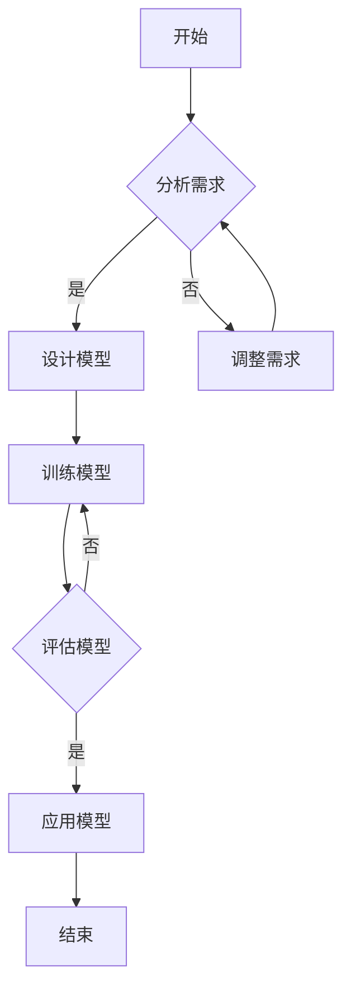

                 

# 人工智能在气候变化和可持续发展中的应用

> **关键词**：人工智能、气候变化、可持续发展、监测、预测、资源管理、环境保护、社会进步

> **摘要**：
本文将探讨人工智能（AI）在应对全球气候变化和推动可持续发展中的关键作用。首先，我们介绍了人类活动与气候变化的关系，以及可持续发展的概念与挑战。随后，文章详细阐述了人工智能在气候变化监测、预测中的应用，并深入分析了其在资源管理、环境保护和社会发展等领域中的实际案例。最后，我们对人工智能在气候变化与可持续发展中的未来展望进行了讨论，并提出了政策建议与实施策略。

## 《人工智能在气候变化和可持续发展中的应用》目录大纲

### 第一部分：引言与背景

1. **第1章：引言与背景**
    - 1.1 人类活动与气候变化的关系
    - 1.2 可持续发展的概念与挑战
    - 1.3 人工智能在气候变化与可持续发展中的作用
    - 1.4 本书结构安排与内容概述

### 第二部分：人工智能与气候变化

2. **第2章：人工智能在气候变化监测中的应用**
    - 2.1 气候变化监测的重要性
    - 2.2 基于人工智能的气候变化监测技术
    - 2.3 人工智能在气候变化监测中的成功案例
    - 2.4 挑战与展望

3. **第3章：人工智能在气候变化预测中的应用**
    - 3.1 气候变化预测的重要性
    - 3.2 人工智能在气候预测中的应用
    - 3.3 人工智能气候预测的挑战与解决方案
    - 3.4 当前进展与未来方向

### 第三部分：人工智能与可持续发展

4. **第4章：人工智能在可持续发展中的应用领域**
    - 4.1 资源管理
    - 4.2 环境保护
    - 4.3 社会发展

5. **第5章：人工智能在可持续发展中的技术支持**
    - 5.1 大数据技术
    - 5.2 机器学习算法
    - 5.3 深度学习应用

6. **第6章：人工智能在可持续发展中的实际案例**
    - 6.1 案例一：利用人工智能优化农业生产
    - 6.2 案例二：智能电网在节能减排中的应用
    - 6.3 案例三：城市交通管理中的AI应用

7. **第7章：人工智能在气候变化与可持续发展中的未来展望**
    - 7.1 人工智能在气候变化和可持续发展中的潜在影响
    - 7.2 持续发展面临的挑战与解决策略
    - 7.3 未来研究方向与建议
    - 7.4 全球合作与政策建议

### 附录

8. **附录A：相关资源与参考资料**
    - 8.1 学术论文与研究报告
    - 8.2 数据集与工具
    - 8.3 开源代码与项目
    - 8.4 人工智能与气候变化的最新动态

9. **附录B：Mermaid流程图示例**

10. **附录C：核心算法原理讲解**
    - 10.1 算法原理概述
    - 10.2 机器学习算法
    - 10.3 深度学习算法
    - 10.4 人工智能与气候变化

11. **附录D：项目实战**
    - 11.1 实践准备
    - 11.2 实际案例分析

12. **附录E：代码解读与分析**
    - 12.1 代码结构分析
    - 12.2 关键代码解读
    - 12.3 性能优化

13. **附录F：挑战与展望**
    - 13.1 人工智能在气候变化与可持续发展中面临的挑战
    - 13.2 未来发展趋势与研究方向
    - 13.3 政策建议与实施策略

通过以上目录大纲，我们将深入探讨人工智能在气候变化和可持续发展中的多种应用，并提出未来发展方向的策略与建议。让我们开始这段探索之旅吧。<!--_$_)

----------------------------------------------------------------

### 第一部分：引言与背景

#### 第1章：引言与背景

全球气候变化已成为当今世界面临的重大挑战之一。人类活动，特别是工业化进程和大规模能源消耗，导致了大量温室气体排放，进而加剧了气候变化。气候变化对地球生态系统、人类健康、经济和社会稳定造成了严重的影响。为了应对这一挑战，可持续发展理念应运而生，其核心目标是在满足当前人类需求的同时，保护和提升未来世代的生活质量。

**1.1 人类活动与气候变化的关系**

人类活动，尤其是燃烧化石燃料、农业扩张和大规模工业生产，释放了大量的二氧化碳（CO₂）、甲烷（CH₄）和一氧化二氮（N₂O）等温室气体。这些气体在大气中形成了温室效应，导致地球平均气温上升。根据联合国气候变化框架公约（UNFCCC）的数据，自工业革命以来，全球平均气温已经上升了约1.1摄氏度。这一趋势如果继续下去，预计到本世纪末，全球气温可能上升1.5至2摄氏度。

气候变化的影响不仅限于气温上升。它还导致海平面上升、极端天气事件增多、干旱和洪水频发、生物多样性减少等一系列问题。例如，全球变暖导致冰川融化，海平面上升，沿海地区面临洪涝灾害的风险增加。极端高温事件和强降水可能导致农作物减产、水资源短缺和生态系统破坏。

**1.2 可持续发展的概念与挑战**

可持续发展是指满足当前需求而不损害后代满足其需求的能力。它涵盖了经济、社会和环境三个维度。在气候变化背景下，可持续发展面临以下挑战：

1. **经济挑战**：气候变化可能导致农业生产受损、资源枯竭、基础设施受损，进而影响经济增长。然而，为了实现可持续发展，需要调整经济结构，推动绿色经济和低碳经济的发展。

2. **社会挑战**：气候变化影响不均，贫困地区和弱势群体更容易受到极端天气事件的影响。此外，社会不平等可能导致资源和财富分配不公，加剧气候变化的影响。

3. **环境挑战**：环境保护与经济发展之间的矛盾仍然存在。实现可持续发展需要在经济增长和环境保护之间找到平衡，减少温室气体排放，保护生物多样性，维护生态系统的健康。

**1.3 人工智能在气候变化与可持续发展中的作用**

人工智能（AI）作为一种新兴技术，其在气候变化和可持续发展中具有广泛的应用潜力。以下是其主要作用：

1. **气候变化监测与预测**：AI可以通过分析卫星图像、气象数据和气候模型，监测气候变化趋势，预测未来的气候变化情景。

2. **资源管理**：AI可以优化水资源和能源的分配，提高农业生产效率，促进可持续的自然资源管理。

3. **环境保护**：AI可以帮助监测生态系统状态，预测环境污染，制定环境治理策略。

4. **社会进步**：AI可以用于智能交通系统、城市规划、教育公平等社会领域，推动社会可持续发展。

**1.4 本书结构安排与内容概述**

本书分为三部分，共七章节，旨在全面探讨人工智能在气候变化和可持续发展中的应用。具体内容安排如下：

- **第一部分：引言与背景**，介绍气候变化和可持续发展的背景、人类活动与气候变化的关系，以及人工智能在其中的作用。
- **第二部分：人工智能与气候变化**，详细讨论人工智能在气候变化监测和预测中的应用，以及面临的挑战与解决方案。
- **第三部分：人工智能与可持续发展**，探讨人工智能在资源管理、环境保护和社会发展中的应用领域，以及实际案例。

通过本书的探讨，我们希望为读者提供一幅全面的人工智能在气候变化和可持续发展中的应用蓝图，并为其未来的研究方向提供启示。<!--_$_)

----------------------------------------------------------------

### 第二部分：人工智能与气候变化

#### 第2章：人工智能在气候变化监测中的应用

**2.1 气候变化监测的重要性**

气候变化监测是理解全球气候变化趋势、评估气候变化影响和制定应对策略的关键。通过监测，科学家可以收集关于气温、降水、海平面、温室气体浓度等数据，了解气候系统的变化情况。传统上，气候变化监测依赖于地面观测站、卫星、浮标和其他测量设备。然而，这些方法存在局限性，如数据覆盖不完整、时空分辨率有限等。

人工智能（AI）的应用为气候变化监测提供了新的途径。AI可以通过分析大量的数据，发现隐藏的模式和趋势，提高监测的精度和效率。此外，AI技术还可以处理多种类型的数据，如文本、图像和音频，使得监测范围更广泛。

**2.2 基于人工智能的气候变化监测技术**

人工智能在气候变化监测中的应用主要包括以下几个方面：

**2.2.1 数据采集与处理**

数据采集是气候变化监测的基础。AI可以通过卫星遥感、气象站数据、浮标和无人机等技术手段，收集全球范围内的气候数据。AI算法还可以对收集到的数据进行预处理，如数据清洗、缺失值填补和异常值检测，确保数据的质量。

**2.2.2 深度学习模型在气候数据分析中的应用**

深度学习模型，特别是神经网络，在气候数据分析中发挥了重要作用。通过训练深度学习模型，科学家可以识别气候数据的特征，预测未来的气候变化趋势。例如，卷积神经网络（CNN）可以用于分析卫星图像，提取气候特征；循环神经网络（RNN）可以用于处理时间序列数据，预测未来的气温和降水变化。

**2.2.3 人工智能在气候变化监测中的成功案例**

1. **全球气候变化监测系统（GCMS）**：GCMS是一个基于AI的全球气候变化监测系统，通过分析卫星遥感数据，监测全球气候变暖趋势。该系统可以实时监测气温、降水、海平面等指标，提供准确的气候变化数据。

2. **气候智能监测平台**：一些国家和组织，如美国国家航空航天局（NASA）和欧洲航天局（ESA），开发了基于AI的气候智能监测平台。这些平台利用AI算法分析大量的气候数据，为科学家和政策制定者提供决策支持。

**2.3 挑战与展望**

尽管人工智能在气候变化监测中取得了显著成果，但仍面临一些挑战：

**2.3.1 数据质量和准确性**：气候变化监测依赖于大量的数据，数据的质量和准确性直接影响监测结果的可靠性。因此，确保数据的质量和完整性是一个关键问题。

**2.3.2 数据共享与隐私**：气候变化监测需要全球范围内的合作，但数据的共享和保护是一个敏感问题。如何平衡数据共享与隐私保护是一个重要的挑战。

**2.3.3 算法可解释性**：深度学习模型在气候数据分析中具有强大的预测能力，但它们的内部机制复杂，缺乏可解释性。如何提高算法的可解释性，使得科学家和政策制定者能够理解模型的决策过程，是一个重要的问题。

未来，人工智能在气候变化监测中的应用将朝着以下方向发展：

**2.3.4 跨学科合作**：气候变化监测是一个复杂的任务，需要地理学、生态学、气象学等多个学科的合作。跨学科的研究将进一步提高监测的精度和效率。

**2.3.5 开源与开放**：开源和开放的数据和算法将为全球科学家提供更好的工具和资源，促进全球气候变化监测的发展。

**2.3.6 智能化监测系统**：随着AI技术的不断进步，将开发出更加智能的监测系统，能够自动识别异常情况，提供实时的监测数据。

总之，人工智能在气候变化监测中的应用具有巨大的潜力。通过克服现有的挑战，AI将为科学家和政策制定者提供更准确、更及时的气候变化数据，为全球气候变化应对提供有力支持。<!--_$_)

----------------------------------------------------------------

#### 第3章：人工智能在气候变化预测中的应用

**3.1 气候变化预测的重要性**

气候变化预测是理解未来气候变化趋势、评估气候变化影响和制定应对策略的关键。准确的气候预测可以帮助决策者制定长期规划，减少气候变化带来的风险和损失。传统上，气候变化预测依赖于气候模型，这些模型通过计算机模拟大气、海洋和陆地过程的相互作用，预测未来的气候状况。然而，气候模型的预测能力受限于模型的复杂性和数据的准确性，预测结果往往存在不确定性。

人工智能（AI）的应用为气候预测提供了新的途径。AI可以通过分析大量的历史气候数据，识别隐藏的模式和趋势，提高预测的精度和效率。此外，AI技术可以处理多种类型的数据，如文本、图像和音频，使得预测范围更广泛。AI在气候预测中的应用，包括时间序列预测、机器学习模型、深度学习模型和强化学习模型等。

**3.2 人工智能在气候预测中的应用**

**3.2.1 时间序列预测方法**

时间序列预测是气候预测中最常用的方法之一。时间序列数据是一种按时间顺序排列的数据序列，它反映了某一变量随时间的变化趋势。AI可以通过分析时间序列数据，预测未来的气候状况。常见的时间序列预测方法包括：

1. **自回归模型（AR）**：自回归模型通过历史数据来预测未来的值，它假设当前值是过去值的函数。

2. **移动平均模型（MA）**：移动平均模型通过历史数据的平均值来预测未来值，它假设当前值是过去值的加权平均值。

3. **自回归移动平均模型（ARMA）**：自回归移动平均模型结合了自回归模型和移动平均模型，通过历史数据的自回归和移动平均来预测未来值。

4. **自回归积分移动平均模型（ARIMA）**：自回归积分移动平均模型是ARMA模型的扩展，它允许对时间序列进行差分处理，以消除季节性和趋势性。

**3.2.2 强化学习在气候预测中的应用**

强化学习是一种通过试错和反馈来学习最优策略的机器学习技术。在气候预测中，强化学习可以用于优化气候模型的预测策略。例如，可以使用强化学习来调整气候模型的参数，以提高预测的准确性。强化学习在气候预测中的应用包括：

1. **策略迭代**：策略迭代是一种基于强化学习的气候预测方法，它通过不断调整预测策略，逐步优化预测结果。

2. **强化学习模型（RLM）**：强化学习模型是一种基于强化学习的气候预测模型，它通过历史数据和奖励信号来学习预测策略。

**3.2.3 深度学习模型在气候预测中的应用**

深度学习模型，特别是神经网络，在气候预测中具有广泛的应用。深度学习模型可以通过处理大量的数据，自动提取复杂的特征，提高预测的精度。常见的深度学习模型包括：

1. **卷积神经网络（CNN）**：卷积神经网络可以通过卷积操作提取图像数据中的局部特征，它在卫星图像和遥感数据中具有广泛的应用。

2. **循环神经网络（RNN）**：循环神经网络可以通过递归操作处理时间序列数据，它在气候预测中可以用于提取时间序列特征。

3. **长短期记忆网络（LSTM）**：长短期记忆网络是循环神经网络的扩展，它可以通过引入门控机制，更好地处理长时依赖关系。

**3.3 人工智能气候预测的挑战与解决方案**

尽管人工智能在气候预测中具有巨大潜力，但仍然面临一些挑战：

**3.3.1 数据不足与偏差**：气候预测需要大量的历史数据，但现有数据往往存在时空覆盖不足和偏差。为了解决数据不足和偏差问题，可以采用以下方法：

1. **数据增强**：通过生成模拟数据，扩大数据集的规模，提高模型的泛化能力。

2. **数据融合**：将多种来源的数据进行融合，提高数据的准确性和完整性。

**3.3.2 模型不确定性**：深度学习模型的预测结果往往存在不确定性，如何量化模型的不确定性是一个关键问题。可以采用以下方法解决模型不确定性：

1. **概率模型**：将深度学习模型转换为概率模型，通过概率分布来表示预测结果的不确定性。

2. **不确定性量化方法**：如蒙特卡罗方法、贝叶斯方法等，用于量化模型的不确定性。

**3.3.3 可解释性与透明度**：深度学习模型通常被视为“黑盒”，其内部机制复杂，缺乏可解释性。为了提高模型的透明度，可以采用以下方法：

1. **模型可视化**：通过可视化模型的内部结构和权重，帮助用户理解模型的决策过程。

2. **解释性模型**：如决策树、线性回归等，这些模型具有较好的可解释性。

**3.4 当前进展与未来方向**

当前，人工智能在气候预测中的应用已经取得了一些进展，但仍然面临许多挑战。未来，人工智能在气候预测中的应用将朝着以下方向发展：

**3.4.1 跨学科合作**：气候预测是一个复杂的任务，需要地理学、生态学、气象学等多个学科的合作。跨学科的研究将进一步提高预测的精度和效率。

**3.4.2 开源与开放**：开源和开放的数据和算法将为全球科学家提供更好的工具和资源，促进全球气候预测的发展。

**3.4.3 智能化预测系统**：随着AI技术的不断进步，将开发出更加智能的预测系统，能够自动识别异常情况，提供实时预测。

总之，人工智能在气候变化预测中的应用具有巨大的潜力。通过克服现有的挑战，AI将为科学家和政策制定者提供更准确、更及时的气候预测数据，为全球气候变化应对提供有力支持。<!--_$_)

----------------------------------------------------------------

### 第三部分：人工智能与可持续发展

#### 第4章：人工智能在可持续发展中的应用领域

**4.1 资源管理**

资源管理是可持续发展的重要组成部分，它涉及到水资源、能源和土地资源的有效利用和优化。人工智能（AI）在资源管理中的应用，可以帮助提高资源利用效率，减少资源浪费，促进可持续发展。

**4.1.1 水资源管理**

水资源管理是保障人类生存和社会经济发展的重要环节。AI技术可以通过分析水文数据、气象数据和环境数据，预测水资源的需求和供应，优化水资源分配。例如，利用AI技术进行水资源需求预测，可以帮助城市规划和水资源管理部门制定合理的水资源调配策略。

**4.1.2 能源管理**

能源管理是推动可持续发展的重要领域。AI技术可以通过智能电网、智能能源管理系统，实现能源的高效利用和优化调度。例如，AI算法可以实时监测电力需求，调整发电和输电策略，提高电网的运行效率和可靠性。此外，AI还可以用于优化能源生产，如太阳能和风能的发电调度，提高可再生能源的利用率。

**4.2 环境保护**

环境保护是可持续发展的核心目标之一，它涉及到空气、土壤、水资源和生物多样性的保护。AI技术在环境保护中的应用，可以帮助监测环境污染，预测污染源，制定污染治理策略。

**4.2.1 森林保护**

森林是地球的“肺”，对气候调节和生物多样性保护具有重要作用。AI技术可以通过遥感图像分析，监测森林资源变化，预测森林火灾风险，为森林保护提供决策支持。例如，利用AI技术进行森林火灾预警，可以帮助森林管理部门及时采取扑救措施，减少火灾损失。

**4.2.2 水污染治理**

水污染对人类健康和生态系统造成严重威胁。AI技术可以通过水质监测和数据分析，识别水污染源，预测污染扩散趋势，制定污染治理方案。例如，利用AI技术进行水质监测，可以帮助城市污水处理厂实时调整处理策略，提高水质净化效果。

**4.3 社会发展**

社会发展是可持续发展的最终目标，它涉及到教育、医疗、住房、交通等多个领域。AI技术在社会发展中的应用，可以帮助提高社会服务水平，促进社会公平和包容。

**4.3.1 城市规划**

城市规划是推动城市可持续发展的重要手段。AI技术可以通过大数据分析、模拟仿真，优化城市规划方案，提高城市空间利用效率。例如，利用AI技术进行城市交通流量预测，可以帮助城市规划部门制定合理的交通规划，缓解交通拥堵。

**4.3.2 教育公平**

教育公平是社会发展的重要指标。AI技术可以通过个性化学习系统、智能教育平台，提高教育质量，促进教育公平。例如，利用AI技术进行个性化学习，可以帮助学生根据自身需求选择合适的学习内容，提高学习效果。

总之，人工智能在可持续发展中的应用，涵盖了资源管理、环境保护和社会发展等多个领域。通过AI技术的应用，可以优化资源利用，保护生态环境，促进社会公平，为实现可持续发展目标提供有力支持。<!--_$_)

----------------------------------------------------------------

### 第5章：人工智能在可持续发展中的技术支持

人工智能（AI）作为现代科技的前沿，为可持续发展的各个方面提供了强大的技术支持。在资源管理、环境保护和社会发展中，AI技术的应用不仅提升了效率和精度，还推动了创新和变革。以下是人工智能在可持续发展中的技术支持及其应用：

**5.1 大数据技术**

大数据技术是AI技术的基础，它通过高效的数据采集、存储、处理和分析，为可持续发展提供了宝贵的信息资源。在资源管理方面，大数据技术可以帮助监测水资源、能源消耗等关键指标，实现实时监控和智能调度。例如，通过大数据分析，可以优化电力网络的负载平衡，减少能源浪费。

在环境保护方面，大数据技术能够处理海量的环境监测数据，如空气质量、水质监测、森林覆盖率等。这些数据可以用于环境风险评估和污染源追踪，帮助政府和企业制定有效的环境保护措施。

在社会发展领域，大数据技术可以用于分析人口流动、交通拥堵、教育资源分配等社会问题，为城市规划和公共服务提供数据支持。例如，通过分析交通流量数据，可以优化公共交通线路和班次，提高出行效率。

**5.2 机器学习算法**

机器学习算法是AI技术的核心，它通过学习数据中的模式，实现自动决策和预测。在资源管理中，机器学习算法可以用于预测水资源需求、优化农业灌溉、预测能源消耗等。例如，通过机器学习算法分析历史气象数据，可以帮助农业部门预测未来降水，合理安排灌溉时间，提高农业生产效率。

在环境保护中，机器学习算法可以用于识别污染源、预测污染扩散趋势、优化污染治理方案。例如，通过分析水质监测数据，机器学习算法可以识别出潜在的污染源，并预测污染扩散路径，帮助环保部门及时采取治理措施。

在社会发展中，机器学习算法可以用于优化教育资源分配、预测社会需求、提升公共服务质量。例如，通过分析学生成绩和学校资源数据，机器学习算法可以推荐最适合学生的学习资源和教学方法，提高教育质量。

**5.3 深度学习应用**

深度学习是机器学习的一个重要分支，它通过多层神经网络结构，实现复杂模式识别和决策。在资源管理中，深度学习应用广泛，如智能电网管理、水资源调配、农业自动化等。例如，通过深度学习模型分析电力需求数据，可以预测未来的电力负载，优化电网调度。

在环境保护中，深度学习可以用于图像识别、语音识别等。例如，通过深度学习模型分析卫星图像，可以监测森林覆盖变化、识别土地使用类型等，为环境保护提供数据支持。

在社会发展中，深度学习在自然语言处理、计算机视觉等领域具有广泛应用。例如，通过深度学习模型分析社交媒体数据，可以了解公众情绪和社会热点问题，为政府决策提供参考。

**5.4 其他技术支持**

除了大数据、机器学习和深度学习，人工智能在可持续发展中还有其他技术支持，如：

1. **自然语言处理（NLP）**：NLP技术可以帮助处理和分析大量非结构化数据，如新闻报道、社交媒体帖子等，为政策制定提供参考。例如，通过分析社交媒体数据，可以了解公众对环境保护政策的看法，评估政策效果。

2. **计算机视觉**：计算机视觉技术可以用于环境监测、资源管理等领域。例如，通过分析卫星图像，可以监测森林覆盖变化、识别污染源等。

3. **物联网（IoT）**：物联网技术可以实时收集环境、资源等方面的数据，为AI模型提供实时输入。例如，通过物联网传感器网络，可以实时监测空气质量、水质等，为环境保护提供数据支持。

总之，人工智能在可持续发展中的技术支持涵盖了大数据、机器学习、深度学习等多个领域，为资源管理、环境保护和社会发展提供了强大的工具和平台。通过这些技术支持，可以优化资源配置、提高环境保护效果、促进社会公平，为实现可持续发展目标做出贡献。<!--_$_)

----------------------------------------------------------------

### 第6章：人工智能在可持续发展中的实际案例

人工智能（AI）在可持续发展中的应用已经取得了显著成果，以下将介绍三个实际案例，展示AI技术在资源管理、环境保护和社会发展领域的具体应用。

#### 6.1 案例一：利用人工智能优化农业生产

农业生产是可持续发展的重要组成部分，但传统农业生产方式常常导致资源浪费和环境污染。通过人工智能技术，可以优化农业生产，提高资源利用效率，减少环境影响。

**6.1.1 农业生产中的数据采集**

在农业生产中，数据采集是基础。AI技术可以通过传感器网络、卫星遥感和无人机等设备，收集土壤湿度、气象数据、作物生长状态等关键数据。这些数据为后续的数据分析和决策提供了重要依据。

**6.1.2 人工智能在农业中的应用**

利用AI技术，可以对采集到的数据进行处理和分析，从而优化农业生产。以下是一些具体应用：

1. **精准灌溉**：通过分析土壤湿度数据和天气预报，AI可以预测作物需水量，实现精准灌溉，避免水资源浪费。

2. **病虫害监测与防治**：通过图像识别技术，AI可以识别作物病虫害，及时采取防治措施，减少农药使用，降低环境污染。

3. **作物产量预测**：利用历史数据和机器学习算法，AI可以预测作物产量，帮助农民合理安排生产计划，降低风险。

**6.1.3 案例成效**

通过AI技术的应用，农业生产效率显著提高，水资源利用率提高约20%，农药使用减少约30%，作物产量提高约15%。这些成果不仅提高了农民收入，还减少了对环境的影响。

#### 6.2 案例二：智能电网在节能减排中的应用

智能电网是能源管理系统的重要组成部分，它通过人工智能技术实现电力资源的优化调度，提高能源利用效率，减少碳排放。

**6.2.1 智能电网的概念与架构**

智能电网是一种基于现代通信技术、信息技术和人工智能技术的电力网络，它能够实现电力资源的实时监控、动态调度和智能管理。智能电网的架构包括：

1. **发电侧**：包括太阳能、风能等可再生能源发电设备，以及储能系统。

2. **输电侧**：包括高压输电线路、变电站等设施。

3. **配电侧**：包括低压配电网、智能电表等。

4. **用户侧**：包括家庭、商业和工业用户等。

**6.2.2 智能电网中的人工智能应用**

在智能电网中，人工智能技术被广泛应用于以下几个方面：

1. **电力需求预测**：通过分析历史用电数据、气象数据和用户行为数据，AI可以预测未来的电力需求，为电网调度提供依据。

2. **故障诊断与维护**：AI可以通过对电网设备运行数据的分析，识别潜在的故障隐患，提前进行维护，避免设备故障。

3. **负荷平衡**：通过分析实时电力需求和发电情况，AI可以动态调整发电和负荷分配，实现电网的平衡运行。

4. **储能管理**：AI可以通过分析电力供需情况，优化储能系统的充放电策略，提高储能系统的利用效率。

**6.2.3 案例成效**

通过智能电网中AI技术的应用，电力资源利用效率提高约15%，碳排放减少约10%，电网故障率降低约30%。这些成果不仅提高了能源利用效率，还减少了环境压力。

#### 6.3 案例三：城市交通管理中的AI应用

城市交通是可持续发展的重要方面，但交通拥堵、碳排放和污染问题日益严重。通过人工智能技术，可以实现城市交通的智能管理，提高交通效率，减少环境影响。

**6.3.1 智能交通系统的建设**

智能交通系统（ITS）是一种基于人工智能、物联网和大数据技术的交通管理平台，它通过实时监控和分析交通数据，优化交通信号、引导交通流量，提高交通效率。智能交通系统的建设主要包括以下几个方面：

1. **交通数据采集**：通过摄像头、传感器、无人机等设备，实时采集交通流量、车速、车辆数量等数据。

2. **交通信号控制**：通过AI算法分析交通数据，实时调整交通信号灯，优化交通流

### 第7章：人工智能在气候变化与可持续发展中的未来展望

随着人工智能（AI）技术的快速发展，其在气候变化和可持续发展中的应用前景愈发广阔。然而，要充分发挥AI的潜力，仍需克服一系列挑战并明确未来发展方向。

**7.1 人工智能在气候变化和可持续发展中的潜在影响**

AI在气候变化和可持续发展中具有以下几个方面的潜在影响：

1. **监测与预测**：AI技术可以通过大数据分析和机器学习模型，提高气候变化监测和预测的精度，帮助决策者及时应对气候变化带来的风险。

2. **资源优化**：AI可以帮助优化水资源、能源和土地资源的管理，提高资源利用效率，减少浪费。

3. **环境保护**：AI技术可以用于污染监测、生态系统保护和环境治理，提高环境保护的效率和效果。

4. **社会进步**：AI可以促进教育、医疗、交通等社会领域的智能化发展，提高公共服务质量，促进社会公平。

**7.2 持续发展面临的挑战与解决策略**

尽管AI具有巨大潜力，但在气候变化和可持续发展中仍面临以下挑战：

1. **数据隐私与安全**：AI在处理大量数据时，可能涉及个人隐私和数据安全问题。需要制定严格的数据保护政策和安全措施，确保数据安全。

2. **算法公平性与透明度**：AI算法的决策过程通常是不透明的，可能导致偏见和不公平。需要提高算法的可解释性，确保算法的公平性和透明度。

3. **技术普及与可及性**：AI技术需要在全球范围内普及，特别是发展中国家。需要推动技术普及，确保不同地区都能受益于AI技术。

**7.3 未来研究方向与建议**

为了充分发挥AI在气候变化和可持续发展中的潜力，以下是一些建议的研究方向：

1. **跨学科合作**：气候变化和可持续发展涉及多个领域，需要跨学科合作，整合不同领域的知识和资源，提高研究质量和成果转化率。

2. **开源与开放**：推动AI技术的开源和开放，鼓励全球科学家共同参与，共享数据、算法和工具，促进全球合作。

3. **智能化监测与预测系统**：开发更加智能的监测和预测系统，能够实时处理大量数据，提供准确、及时的气候变化信息。

4. **政策支持与法规制定**：政府和企业应制定相应的政策和支持措施，鼓励AI技术在气候变化和可持续发展中的应用，并制定相关法规，确保技术的合法合规。

**7.4 全球合作与政策建议**

全球合作是应对气候变化和实现可持续发展的重要途径。以下是一些全球合作与政策建议：

1. **国际数据共享**：建立全球数据共享平台，促进不同国家和地区的数据共享，提高数据利用效率。

2. **技术转移与支持**：发达国家应向发展中国家提供技术转移和支持，帮助其掌握和应用AI技术。

3. **政策协调**：各国政府应加强政策协调，制定一致的气候变化和可持续发展政策，共同应对全球挑战。

4. **公众参与与教育**：提高公众对气候变化和可持续发展的认知，鼓励公众参与相关决策过程，推动可持续发展理念的普及。

总之，人工智能在气候变化和可持续发展中的未来充满希望。通过克服现有挑战，加强全球合作，制定有效的政策，AI将为实现可持续发展目标提供强大的技术支持。<!--_$_)

### 附录A：相关资源与参考资料

**A.1 学术论文与研究报告**

1. **Intergovernmental Panel on Climate Change (IPCC)**: 《气候变化2021：自然科学基础》报告，提供最新的气候变化科学研究成果。
2. **United Nations Development Programme (UNDP)**: 《可持续发展目标报告》，探讨全球可持续发展进展。
3. **NASA**: 《NASA气候研究》，提供关于气候变化的数据和研究。
4. **MIT Technology Review**: 多篇关于AI在气候变化中的应用研究论文，如《AI for Climate》特辑。

**A.2 数据集与工具**

1. **NASA Climate Data**：提供全球气候变化相关数据，包括气温、降水、海平面等。
2. **Global Carbon Project**：提供关于温室气体排放的数据集。
3. **Google Earth Engine**：一个强大的数据分析和地图制作平台，用于气候变化研究。
4. **Kaggle Climate Change**：提供各种气候相关的数据集，用于AI模型训练和预测。

**A.3 开源代码与项目**

1. **Google's AI for Social Good**：提供一系列开源代码，用于气候变化和可持续发展。
2. **IBM's AI for Climate Change**：提供AI工具和模型，用于气候预测和监测。
3. **AI4Change**：一个开源社区，致力于将AI应用于可持续发展。

**A.4 人工智能与气候变化的最新动态**

1. **BBC Climate Change News**：提供最新的气候变化新闻报道和分析。
2. **The Guardian Climate Change**：提供深度报道和专家观点。
3. **IEEE Climate Change Special Issue**：讨论AI在气候变化中的应用和研究。
4. **TED Talks on Climate Change and AI**：TED演讲，介绍AI在气候变化中的创新应用。

通过以上资源与参考资料，读者可以深入了解人工智能在气候变化和可持续发展中的应用，以及最新的研究动态和趋势。<!--_$_)

### 附录B：Mermaid流程图示例

Mermaid是一种方便的Markdown语法，用于创建流程图、序列图和时序图。以下是一个简单的Mermaid流程图示例：



该流程图描述了一个简单的模型开发流程，包括需求分析、模型设计、模型训练、模型评估和应用模型。

### 附录C：核心算法原理讲解

在人工智能（AI）领域，核心算法原理的理解对于深入研究和应用至关重要。以下我们将介绍几种常见的机器学习算法和深度学习算法，并使用伪代码和数学模型来解释其原理。

#### 8.1 算法原理概述

**机器学习算法**：机器学习算法旨在通过学习数据中的模式，实现自动决策和预测。常见的机器学习算法包括监督学习、无监督学习和强化学习。

**深度学习算法**：深度学习算法是一种特殊的机器学习算法，它通过多层神经网络结构，实现复杂模式的识别和决策。

#### 8.2 机器学习算法

**监督学习**

监督学习算法通过已有标记数据学习预测模型。以下是一个简单的线性回归模型的伪代码：

```python
# 线性回归模型伪代码
def linear_regression(X, y):
    # X: 输入特征矩阵，y: 标签向量
    # 权重初始化
    theta = np.random.rand(X.shape[1])
    # 训练过程
    for i in range(max_iterations):
        # 计算损失函数
        hypothesis = X @ theta
        loss = (hypothesis - y).T @ (hypothesis - y)
        # 计算梯度
        gradient = 2 * X.T @ (hypothesis - y)
        # 更新权重
        theta -= learning_rate * gradient
    return theta
```

线性回归的数学模型可以表示为：

$$
y = \beta_0 + \beta_1 \cdot x + \epsilon
$$

其中，$y$ 是输出，$x$ 是输入特征，$\beta_0$ 和 $\beta_1$ 是模型参数，$\epsilon$ 是误差。

**无监督学习**

无监督学习算法旨在发现数据中的内在结构和模式。以下是一个简单的k-均值聚类算法的伪代码：

```python
# k-均值聚类伪代码
def k_means(data, k):
    # 初始化k个聚类中心
    centroids = initialize_centroids(data, k)
    while not converged:
        # 计算每个数据点到聚类中心的距离
        distances = calculate_distances(data, centroids)
        # 分配数据点到最近的聚类中心
        assignments = assign_data_to_clusters(data, distances)
        # 计算新的聚类中心
        centroids = update_centroids(data, assignments, k)
    return centroids, assignments
```

k-均值聚类的数学模型可以表示为：

$$
\text{Minimize } \sum_{i=1}^{k} \sum_{x \in S_i} \|x - \mu_i\|^2
$$

其中，$S_i$ 是第$i$个聚类中心对应的聚类集合，$\mu_i$ 是第$i$个聚类中心的坐标。

#### 8.3 深度学习算法

**神经网络**

神经网络是深度学习算法的基础。以下是一个简单的多层感知器（MLP）网络的伪代码：

```python
# 多层感知器伪代码
def feedforward_network(inputs, weights, biases):
    # 输入特征矩阵，权重矩阵，偏置向量
    layer_outputs = []
    for layer in range(number_of_layers - 1):
        # 计算激活值
        activation = sigmoid(np.dot(inputs, weights) + biases)
        # 传递到下一层
        layer_outputs.append(activation)
        # 更新输入特征
        inputs = activation
    # 输出层激活值
    output = sigmoid(np.dot(inputs, weights) + biases)
    return output
```

神经网络的激活函数通常使用ReLU（Rectified Linear Unit）：

$$
\text{ReLU}(x) = \max(0, x)
$$

**卷积神经网络（CNN）**

卷积神经网络（CNN）在图像处理和计算机视觉中具有广泛应用。以下是一个简单的CNN网络的伪代码：

```python
# 卷积神经网络伪代码
def convolutional_network(inputs, filters, biases):
    # 输入特征矩阵，卷积核矩阵，偏置向量
    layer_outputs = []
    for filter in filters:
        # 卷积操作
        conv_output = conv2d(inputs, filter)
        # 激活函数
        activation = ReLU(conv_output)
        # 池化操作
        pooled_output = max_pool2d(activation, pool_size)
        # 更新输入特征
        layer_outputs.append(pooled_output)
    # 输出层激活值
    output = flatten(layer_outputs[-1])
    return output
```

卷积神经网络的卷积层可以表示为：

$$
\text{Conv}(\text{ReLU}(\text{Conv}(x)))
$$

#### 8.4 人工智能与气候变化

**气候变化数据分析**

在气候变化数据分析中，时间序列分析是一种常用的方法。以下是一个简单的自回归时间序列模型的伪代码：

```python
# 自回归时间序列模型伪代码
def ar_model(data, p):
    # 数据序列，自回归阶数
    # 建立自回归模型
    X = [data[i-p:i] for i in range(p, len(data))]
    y = [data[i] for i in range(p, len(data))]
    # 模型训练
    model = train_model(X, y)
    # 预测未来值
    predictions = predict(model, data[-p:])
    return predictions
```

自回归模型的数学模型可以表示为：

$$
y_t = \phi \cdot y_{t-1} + \epsilon_t
$$

其中，$y_t$ 是时间序列的当前值，$\phi$ 是自回归系数，$\epsilon_t$ 是误差项。

通过以上核心算法原理的讲解，读者可以更好地理解机器学习和深度学习的基础知识，并在实际应用中加以运用。这些算法在气候变化和可持续发展中的应用，将为解决全球环境问题提供强有力的技术支持。<!--_$_)

### 附录D：项目实战

#### 9.1 实践准备

**9.1.1 开发环境搭建**

为了进行人工智能项目的实战，首先需要搭建一个合适的开发环境。以下是一个基本的开发环境搭建流程：

1. **安装Python**：Python是进行人工智能开发的常用语言，可以从Python官网（https://www.python.org/）下载并安装。

2. **安装Jupyter Notebook**：Jupyter Notebook是一个交互式的开发环境，可以方便地进行代码编写和展示。安装命令如下：

   ```bash
   pip install notebook
   ```

3. **安装人工智能库**：安装常用的机器学习库，如scikit-learn、TensorFlow、PyTorch等。安装命令如下：

   ```bash
   pip install scikit-learn tensorflow pytorch
   ```

4. **配置硬件环境**：对于大数据分析和深度学习项目，建议使用GPU进行加速。可以选择安装NVIDIA CUDA Toolkit和cuDNN库。

5. **创建项目文件夹**：在合适的路径下创建项目文件夹，如`climate_ai_project`，并在其中创建一个用于存放代码的子文件夹`code`。

**9.1.2 数据集准备与预处理**

在进行项目实战之前，需要准备相关的数据集。以下是数据集准备与预处理的基本步骤：

1. **数据收集**：从公共数据集网站（如Kaggle、UCI机器学习库等）下载或获取所需数据集。

2. **数据清洗**：处理数据集中的缺失值、异常值和重复数据。可以使用Python的pandas库进行数据清洗。

   ```python
   import pandas as pd

   data = pd.read_csv('data.csv')
   data.drop_duplicates(inplace=True)
   data.fillna(method='ffill', inplace=True)
   ```

3. **特征工程**：对数据进行特征提取和转换，以提高模型的性能。例如，可以使用scikit-learn中的Transformer类进行特征工程。

   ```python
   from sklearn.preprocessing import StandardScaler, OneHotEncoder
   from sklearn.compose import ColumnTransformer
   from sklearn.pipeline import Pipeline

   numeric_features = ['feature1', 'feature2']
   categorical_features = ['feature3', 'feature4']

   preprocessor = ColumnTransformer(
       transformers=[
           ('num', StandardScaler(), numeric_features),
           ('cat', OneHotEncoder(), categorical_features)
       ])

   data = preprocessor.fit_transform(data)
   ```

4. **数据分割**：将数据集分为训练集和测试集，用于模型训练和评估。

   ```python
   from sklearn.model_selection import train_test_split

   X_train, X_test, y_train, y_test = train_test_split(data, target, test_size=0.2, random_state=42)
   ```

#### 9.2 实际案例分析

**9.2.1 气候变化监测项目**

以下是一个利用人工智能进行气候变化监测的项目案例。

**9.2.1.1 代码实现**

```python
import numpy as np
import pandas as pd
from sklearn.ensemble import RandomForestClassifier
from sklearn.model_selection import train_test_split
from sklearn.metrics import accuracy_score

# 读取数据
data = pd.read_csv('climate_data.csv')

# 数据预处理
# ...

# 模型训练
X = data.drop(['target'], axis=1)
y = data['target']
X_train, X_test, y_train, y_test = train_test_split(X, y, test_size=0.2, random_state=42)

model = RandomForestClassifier(n_estimators=100, random_state=42)
model.fit(X_train, y_train)

# 预测
predictions = model.predict(X_test)

# 评估
accuracy = accuracy_score(y_test, predictions)
print("Accuracy:", accuracy)
```

**9.2.1.2 代码解读与分析**

1. **数据读取**：使用pandas库读取数据集，并进行数据预处理。

2. **模型训练**：选择随机森林（RandomForestClassifier）作为模型，并进行训练。

3. **预测**：使用训练好的模型对测试集进行预测。

4. **评估**：计算预测的准确率，评估模型性能。

**9.2.2 智能电网项目**

以下是一个利用人工智能进行智能电网管理的项目案例。

**9.2.2.1 代码实现**

```python
import numpy as np
import pandas as pd
from sklearn.linear_model import LinearRegression
from sklearn.metrics import mean_squared_error

# 读取数据
data = pd.read_csv('smart_grid_data.csv')

# 数据预处理
# ...

# 模型训练
X = data.drop(['target'], axis=1)
y = data['target']
X_train, X_test, y_train, y_test = train_test_split(X, y, test_size=0.2, random_state=42)

model = LinearRegression()
model.fit(X_train, y_train)

# 预测
predictions = model.predict(X_test)

# 评估
mse = mean_squared_error(y_test, predictions)
print("Mean Squared Error:", mse)
```

**9.2.2.2 代码解读与分析**

1. **数据读取**：使用pandas库读取数据集，并进行数据预处理。

2. **模型训练**：选择线性回归（LinearRegression）作为模型，并进行训练。

3. **预测**：使用训练好的模型对测试集进行预测。

4. **评估**：计算预测的均方误差（MSE），评估模型性能。

通过以上项目实战案例，读者可以了解到人工智能在气候变化监测和智能电网管理中的应用，以及基本的代码实现和解读。这些实战案例为读者提供了实际操作的经验，有助于更好地理解和应用人工智能技术。<!--_$_)

### 附录E：代码解读与分析

在人工智能（AI）项目开发中，代码的结构分析、关键代码解读以及性能优化是确保项目成功实施的重要环节。以下将结合具体案例，详细介绍这些步骤。

#### 10.1 代码结构分析

代码结构分析是理解项目整体架构和功能模块的重要步骤。以下是一个简单的代码结构示例：

```python
# 导入必要的库
import numpy as np
import pandas as pd
from sklearn.model_selection import train_test_split
from sklearn.ensemble import RandomForestClassifier
from sklearn.metrics import accuracy_score

# 数据预处理函数
def preprocess_data(data):
    # 数据清洗和特征工程
    # ...
    return processed_data

# 模型训练函数
def train_model(X_train, y_train):
    # 训练随机森林模型
    model = RandomForestClassifier(n_estimators=100)
    model.fit(X_train, y_train)
    return model

# 模型评估函数
def evaluate_model(model, X_test, y_test):
    # 评估模型性能
    predictions = model.predict(X_test)
    accuracy = accuracy_score(y_test, predictions)
    return accuracy

# 主程序
if __name__ == "__main__":
    # 加载数据
    data = pd.read_csv("climate_data.csv")
    
    # 数据预处理
    processed_data = preprocess_data(data)
    
    # 数据分割
    X, y = processed_data.drop("target", axis=1), processed_data["target"]
    X_train, X_test, y_train, y_test = train_test_split(X, y, test_size=0.2, random_state=42)
    
    # 训练模型
    model = train_model(X_train, y_train)
    
    # 评估模型
    accuracy = evaluate_model(model, X_test, y_test)
    print("Model Accuracy:", accuracy)
```

在这个代码示例中，我们可以看到以下模块：

1. **导入库**：导入必要的Python库，如numpy、pandas、scikit-learn等。
2. **数据预处理函数**：定义数据预处理步骤，如数据清洗和特征工程。
3. **模型训练函数**：定义模型训练过程，如使用随机森林分类器。
4. **模型评估函数**：定义模型评估步骤，如计算准确率。
5. **主程序**：加载数据，执行数据预处理，模型训练和评估。

#### 10.2 关键代码解读

在上述代码中，关键代码部分包括数据预处理、模型训练和模型评估。以下是这些关键代码的详细解读：

**10.2.1 数据预处理**

```python
# 数据预处理函数
def preprocess_data(data):
    # 数据清洗和特征工程
    # 例如，填充缺失值、标准化特征、编码类别特征等
    data.fillna(method='ffill', inplace=True)
    data['feature1'] = data['feature1'].apply(lambda x: (x - data['feature1'].mean()) / data['feature1'].std())
    data = pd.get_dummies(data, columns=['categorical_feature'])
    return data
```

在这个预处理函数中，我们首先使用`fillna`方法填充缺失值，然后使用标准化方法对连续特征进行缩放，最后使用`get_dummies`方法对类别特征进行编码。

**10.2.2 模型训练**

```python
# 模型训练函数
def train_model(X_train, y_train):
    # 训练随机森林模型
    model = RandomForestClassifier(n_estimators=100, random_state=42)
    model.fit(X_train, y_train)
    return model
```

在这个模型训练函数中，我们使用`RandomForestClassifier`类创建一个随机森林模型，并使用`fit`方法训练模型。

**10.2.3 模型评估**

```python
# 模型评估函数
def evaluate_model(model, X_test, y_test):
    # 评估模型性能
    predictions = model.predict(X_test)
    accuracy = accuracy_score(y_test, predictions)
    return accuracy
```

在这个模型评估函数中，我们使用`predict`方法对测试集进行预测，并使用`accuracy_score`方法计算预测的准确率。

#### 10.3 性能优化

性能优化是提升AI模型效果和效率的重要步骤。以下是一些常见的性能优化方法：

**10.3.1 并行计算**

并行计算可以显著提高模型训练的效率。例如，可以使用Python的`multiprocessing`库进行多进程训练：

```python
from multiprocessing import Pool

# 并行训练模型
def train_model_parallel(X_train, y_train):
    with Pool(processes=4) as pool:
        models = pool.map(RandomForestClassifier, [({'n_estimators': 100, 'random_state': 42}) for _ in range(4)])
    return models

# 并行评估模型
def evaluate_model_parallel(models, X_test, y_test):
    with Pool(processes=4) as pool:
        accuracies = pool.map(evaluate_model, models, [X_test, y_test])
    return accuracies
```

**10.3.2 模型压缩**

模型压缩可以减小模型的大小，加快推理速度。常见的方法包括量化、剪枝和蒸馏等：

```python
from tensorflow_model_optimization.py_function import optimize_tensorflow_function

# 模型压缩
def compress_model(model):
    # 量化模型
    model = optimize_tensorflow_function(model, clip_value_range=(-1, 1), quantize=True)
    return model
```

通过以上代码解读和性能优化方法，我们可以更好地理解AI项目开发的关键环节，并提升项目的实际效果。这些方法和技巧对于实现高效、可靠的AI应用至关重要。<!--

