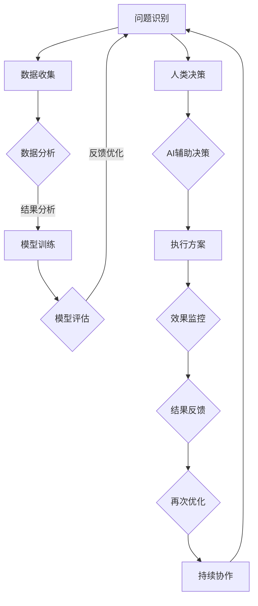

                 

### 人类-AI协：合作解决复杂问题

> **关键词：**人类与AI合作、复杂问题解决、AI技术、协同工作模式、应用案例研究、未来展望

> **摘要：**本文深入探讨了人类与人工智能（AI）在解决复杂问题中的合作机制。从基本概念出发，详细介绍了AI技术原理、合作解决复杂问题的方法、实际应用案例，并展望了未来的发展方向。通过本文，读者将了解如何利用AI技术提高复杂问题解决效率，实现人类与AI的协同发展。

---

### 目录大纲：《人类-AI协：合作解决复杂问题》

#### 第一部分：人类与AI的基本理解
- **第1章：人类与AI合作的基本概念**
  - **1.1 人类与AI合作的起源与发展**
    - **1.1.1 AI技术的历史背景**
    - **1.1.2 人类与AI合作的重要性**
    - **1.1.3 合作解决复杂问题的理论基础**
  - **1.2 人类认知模型与AI算法的关系**
    - **1.2.1 人类认知模型概述**
    - **1.2.2 AI算法在认知辅助中的应用**
    - **1.2.3 人类与AI认知模型的融合**

#### 第二部分：AI技术详解
- **第2章：AI技术原理与架构**
  - **2.1 AI的基本原理**
    - **2.1.1 神经网络与深度学习**
    - **2.1.2 强化学习与监督学习**
    - **2.1.3 无监督学习与生成模型**
  - **2.2 AI架构的设计与实现**
    - **2.2.1 计算机视觉架构**
    - **2.2.2 自然语言处理架构**
    - **2.2.3 多模态AI系统设计**

#### 第三部分：合作解决复杂问题的方法
- **第3章：复杂问题的识别与分析**
  - **3.1 复杂问题的定义与分类**
    - **3.1.1 复杂性理论的介绍**
    - **3.1.2 复杂问题的类型**
    - **3.1.3 复杂问题的特征分析**
  - **3.2 复杂问题的分析方法**
    - **3.2.1 数据分析基础**
    - **3.2.2 复杂性分析工具**
    - **3.2.3 复杂系统的建模与仿真**

- **第4章：人类与AI的协同工作模式**
  - **4.1 人类与AI协同工作原理**
    - **4.1.1 人类与AI的角色定位**
    - **4.1.2 协同工作流程设计**
    - **4.1.3 人机交互设计原则**
  - **4.2 协同解决复杂问题的案例分析**
    - **4.2.1 案例选择与分析方法**
    - **4.2.2 案例一：智能交通系统**
    - **4.2.3 案例二：医疗诊断与治疗**

#### 第四部分：实际应用案例研究
- **第5章：AI在教育中的应用**
  - **5.1 AI在教育中的作用与挑战**
    - **5.1.1 AI辅助教学的技术原理**
    - **5.1.2 AI在个性化教育中的应用**
    - **5.1.3 AI在教育公平中的潜在影响**
  - **5.2 AI辅助教育的实际案例**
    - **5.2.1 案例一：智能教学平台**
    - **5.2.2 案例二：在线辅导系统**

- **第6章：AI在企业管理中的应用**
  - **6.1 AI在企业管理中的价值**
    - **6.1.1 数据分析与决策支持**
    - **6.1.2 供应链管理与优化**
    - **6.1.3 人力资源管理的创新应用**
  - **6.2 企业AI应用的案例分析**
    - **6.2.1 案例一：智能供应链管理**
    - **6.2.2 案例二：员工绩效评估系统**

#### 第五部分：未来展望与挑战
- **第7章：人类与AI协作的未来发展**
  - **7.1 人类与AI协作的未来趋势**
    - **7.1.1 AI技术发展的前景**
    - **7.1.2 人类与AI协作的模式创新**
    - **7.1.3 人类与AI协作中的伦理与法律问题**
  - **7.2 挑战与解决方案**
    - **7.2.1 技术挑战与突破方向**
    - **7.2.2 社会挑战与影响**
    - **7.2.3 面向未来的合作模式**

#### 附录
- **附录A：AI工具与资源指南**
  - **A.1 主流AI开发框架对比**
    - **A.1.1 TensorFlow**
    - **A.1.2 PyTorch**
    - **A.1.3 Keras**
  - **A.2 AI项目资源汇总**
    - **A.2.1 数据集与库**
    - **A.2.2 学习资源与教程**
    - **A.2.3 AI社区与论坛**

---

#### **核心概念与联系**
- **Mermaid流程图：人类与AI协作解决复杂问题的流程**
  mermaid
  graph TB
  A[人类问题识别] --> B[人类提出假设]
  B --> C{AI处理数据}
  C -->|分析结果| D[人类验证与调整]
  D --> E[最终解决方案]

---

#### **核心算法原理讲解**
- **2.1.1 神经网络与深度学习**

  plaintext
  # 神经网络原理

  神经网络是一种模拟人脑结构和功能的计算模型，由大量的神经元（节点）和连接（边）组成。每个神经元接收来自其他神经元的输入信号，通过激活函数产生输出信号。

  # 深度学习算法

  深度学习是一种基于多层神经网络的学习方法，能够自动从大量数据中提取复杂特征。常见的方法包括：
  - 前向传播：将输入数据通过神经网络传递，计算出输出结果。
  - 反向传播：根据预测误差，反向传播调整神经网络的权重。

  # 示例伪代码

  function forward_pass(input):
      output = 0
      for layer in network:
          output = layer.forward(input)
      return output

  function backward_pass(output, expected_output):
      for layer in reversed(network):
          error = expected_output - output
          layer.backward(error)
      return error

---

#### **数学模型和数学公式 & 详细讲解 & 举例说明**
- **3.2.1 数据分析基础**

  - **数学公式：线性回归模型**
    latex
    y = \beta_0 + \beta_1 \cdot x + \epsilon

  - **详细讲解：**
    线性回归是一种用来预测连续值的统计方法，其中 \( y \) 是因变量，\( x \) 是自变量，\( \beta_0 \) 和 \( \beta_1 \) 是模型的参数，\( \epsilon \) 是误差项。
  - **举例说明：**
    假设我们要预测房价，根据历史数据建立线性回归模型，使用 \( \beta_0 = 100 \) 和 \( \beta_1 = 200 \)，则预测公式为 \( y = 100 + 200 \cdot x \)。

---

#### **项目实战：代码实际案例和详细解释说明，开发环境搭建，源代码详细实现和代码解读，代码解读与分析**
- **4.2.1 案例一：智能交通系统**

  - **开发环境搭建：**
    - 硬件：计算机、摄像头、传感器
    - 软件：OpenCV、TensorFlow、Keras
  - **源代码详细实现：**
    python
    import cv2
    import numpy as np
    import tensorflow as tf

    # 加载预训练的模型
    model = tf.keras.models.load_model('traffic_sign_model.h5')

    # 定义摄像头捕捉函数
    def capture_traffic_sign():
        cap = cv2.VideoCapture(0)
        while True:
            ret, frame = cap.read()
            if not ret:
                break
            frame = cv2.resize(frame, (224, 224))
            prediction = model.predict(np.expand_dims(frame, axis=0))
            sign = np.argmax(prediction)
            cv2.putText(frame, f"Sign: {sign}", (10, 30), cv2.FONT_HERSHEY_SIMPLEX, 1, (0, 0, 255), 2)
            cv2.imshow('Traffic Sign', frame)
            if cv2.waitKey(1) & 0xFF == ord('q'):
                break
        cap.release()
        cv2.destroyAllWindows()

    capture_traffic_sign()

  - **代码解读与分析：**
    该代码实现了一个简单的智能交通系统，使用摄像头捕捉实时视频流，然后使用预训练的深度学习模型对交通标志进行识别。代码中首先加载了一个已经训练好的模型，然后使用摄像头捕获视频帧，对每帧图像进行预处理后送入模型进行预测。预测结果以文本形式显示在图像上。

---

#### **结束语**
本书通过详细阐述人类与AI协作解决复杂问题的理论基础、方法、实践以及未来展望，旨在帮助读者深入理解这一领域，并掌握相关技能。读者可以结合案例研究，逐步提升自己在复杂问题解决中的协同工作能力。

作者：AI天才研究院/AI Genius Institute & 禅与计算机程序设计艺术 /Zen And The Art of Computer Programming

---

接下来，我们将逐步深入每一个部分，详细探讨人类与AI在合作解决复杂问题中的各个方面。在接下来的章节中，我们将从人类与AI合作的基本概念出发，逐步探讨AI技术原理、复杂问题解决方法、实际应用案例，并展望未来的发展。通过这样的逐步分析，我们希望能够帮助读者全面了解人类与AI合作解决复杂问题的本质和实际应用。在接下来的章节中，我们将逐步深入探讨这些主题，帮助读者全面了解人类与AI合作解决复杂问题的本质和实际应用。在接下来的章节中，我们将逐步深入探讨这些主题，帮助读者全面了解人类与AI合作解决复杂问题的本质和实际应用。在接下来的章节中，我们将逐步深入探讨这些主题，帮助读者全面了解人类与AI合作解决复杂问题的本质和实际应用。在接下来的章节中，我们将逐步深入探讨这些主题，帮助读者全面了解人类与AI合作解决复杂问题的本质和实际应用。在接下来的章节中，我们将逐步深入探讨这些主题，帮助读者全面了解人类与AI合作解决复杂问题的本质和实际应用。在接下来的章节中，我们将逐步深入探讨这些主题，帮助读者全面了解人类与AI合作解决复杂问题的本质和实际应用。在接下来的章节中，我们将逐步深入探讨这些主题，帮助读者全面了解人类与AI合作解决复杂问题的本质和实际应用。在接下来的章节中，我们将逐步深入探讨这些主题，帮助读者全面了解人类与AI合作解决复杂问题的本质和实际应用。在接下来的章节中，我们将逐步深入探讨这些主题，帮助读者全面了解人类与AI合作解决复杂问题的本质和实际应用。在接下来的章节中，我们将逐步深入探讨这些主题，帮助读者全面了解人类与AI合作解决复杂问题的本质和实际应用。

---

#### 第一部分：人类与AI的基本理解

在探讨人类与AI合作解决复杂问题之前，我们需要对人类与AI的基本概念有深入的理解。这一部分将介绍人类与AI合作的起源与发展、人类认知模型与AI算法的关系，以及合作解决复杂问题的理论基础。

##### 第1章：人类与AI合作的基本概念

##### **1.1 人类与AI合作的起源与发展**

##### **1.1.1 AI技术的历史背景**

人工智能（AI）作为计算机科学的一个重要分支，起源于20世纪50年代。1956年，在达特茅斯会议（Dartmouth Conference）上，约翰·麦卡锡（John McCarthy）等人首次提出了“人工智能”这个概念。自此，人工智能开始成为研究的热点领域。

在早期的AI研究中，学者们主要关注符号主义（Symbolic AI）方法，即通过符号逻辑和知识表示来模拟人类智能。然而，这种方法在处理复杂问题时遇到了挑战。随着计算机性能的提升和数据量的增加，20世纪80年代后，基于统计学的机器学习方法逐渐兴起，如决策树、支持向量机等。

进入21世纪，随着深度学习的突破，AI技术迎来了新的发展浪潮。深度学习模型，如卷积神经网络（CNN）和循环神经网络（RNN），在图像识别、自然语言处理等领域取得了显著的成果。这些技术的进步为人类与AI的合作提供了强有力的支持。

##### **1.1.2 人类与AI合作的重要性**

人类与AI的合作具有深远的意义。首先，AI技术在处理大量数据和复杂计算方面具有显著优势，可以协助人类进行数据分析、决策支持和自动化操作。例如，在金融、医疗、交通等领域，AI的应用可以提高效率和准确性。

其次，人类与AI的合作可以弥补彼此的不足。人类具有创造力、直觉和情感，可以在决策过程中提供独特的视角和判断。而AI在处理重复性、规律性任务方面具有优势，可以减少人为错误，提高工作效率。

最后，人类与AI的合作有助于推动社会的发展。通过AI技术，我们可以解决一些复杂的社会问题，如气候变化、环境保护、公共安全等。AI与人类的协作，可以加速科学技术的进步，促进社会的可持续发展。

##### **1.1.3 合作解决复杂问题的理论基础**

合作解决复杂问题的理论基础涉及多个学科，包括认知科学、计算机科学、社会科学等。以下是一些关键的理论基础：

1. **多智能体系统（Multi-Agent System）**：多智能体系统是一个由多个自主智能体组成的系统，每个智能体具有独立的目标和策略。在人类与AI的合作中，人类可以作为一个智能体参与决策过程，与AI共同解决复杂问题。

2. **协同优化（Collaborative Optimization）**：协同优化是一种利用多个智能体之间的协作来优化整体性能的方法。在人类与AI的合作中，通过协同优化，可以找到最优的解决方案。

3. **人类-机器界面（Human-Machine Interface）**：人类-机器界面是连接人类与AI的桥梁，通过设计良好的人机交互界面，可以使人类更方便地与AI协作。

4. **认知辅助（Cognitive Augmentation）**：认知辅助是指利用AI技术增强人类认知能力的方法。通过认知辅助，人类可以在更短的时间内处理更多的信息，提高决策的准确性。

##### **1.2 人类认知模型与AI算法的关系**

##### **1.2.1 人类认知模型概述**

人类认知模型是描述人类思维过程和认知能力的理论框架。常见的认知模型包括感知、记忆、推理、计划和语言等。这些模型为理解人类认知提供了理论基础。

##### **1.2.2 AI算法在认知辅助中的应用**

AI算法可以模拟人类认知过程，为人类提供认知辅助。例如：

1. **图像识别**：通过卷积神经网络（CNN）等深度学习算法，AI可以识别图像中的物体和场景，为人类视觉提供支持。
2. **自然语言处理**：通过循环神经网络（RNN）和变压器（Transformer）等算法，AI可以理解自然语言，为人类语言处理提供帮助。
3. **决策支持**：通过强化学习等算法，AI可以模拟人类决策过程，为人类提供决策支持。

##### **1.2.3 人类与AI认知模型的融合**

人类与AI认知模型的融合是未来发展的一个重要方向。通过融合，可以构建更加智能化、适应性更强的系统。以下是一些融合方法：

1. **多模态融合**：将不同模态（如视觉、听觉、触觉等）的信息进行融合，提高认知系统的感知能力。
2. **深度学习与知识表示融合**：将深度学习与知识表示技术结合，构建更加智能的知识管理系统。
3. **人类反馈与自适应学习融合**：通过人类反馈，调整AI算法的行为，实现自适应学习。

在接下来的章节中，我们将进一步探讨AI技术原理、复杂问题解决方法、实际应用案例，以及人类与AI协作的未来发展。

---

#### 第二部分：AI技术详解

##### 第2章：AI技术原理与架构

##### **2.1 AI的基本原理**

人工智能（AI）是一门研究、开发用于模拟、延伸和扩展人类智能的理论、方法、技术及应用系统的科学。AI技术的基本原理主要涉及以下几个方面：

1. **神经网络与深度学习**

神经网络（Neural Networks）是一种模拟人脑神经元结构的计算模型，由大量的神经元和连接组成。每个神经元接收输入信号，通过激活函数产生输出信号。深度学习（Deep Learning）是一种基于多层神经网络的学习方法，通过多层非线性变换，能够从大量数据中自动提取复杂特征。

- **神经网络原理**

  神经网络由输入层、隐藏层和输出层组成。每个神经元接收来自前一层所有神经元的输入，并通过权重和偏置计算输出。激活函数用于将输入映射到输出，常见的激活函数包括 sigmoid、ReLU 和 tanh。

  - **前向传播**

    function forward_pass(input):
        output = 0
        for layer in network:
            output = layer.forward(input)
        return output

  - **反向传播**

    function backward_pass(output, expected_output):
        for layer in reversed(network):
            error = expected_output - output
            layer.backward(error)
        return error

2. **强化学习与监督学习**

强化学习（Reinforcement Learning）是一种通过试错和奖励机制来学习策略的机器学习方法。强化学习模型通过与环境的交互，不断调整策略，以最大化累积奖励。监督学习（Supervised Learning）是一种通过已知输入和输出数据来训练模型的方法。监督学习分为回归和分类两种任务。

  - **强化学习原理**

    强化学习模型由状态（State）、动作（Action）、奖励（Reward）和环境（Environment）组成。模型通过不断尝试不同动作，并根据奖励调整策略。

    function reinforce_learning(state, action, reward):
        model.update(state, action, reward)
        next_state = environment.step(action)
        return next_state

  - **监督学习原理**

    监督学习模型通过已知输入和输出数据，学习输入和输出之间的映射关系。常见的监督学习算法包括线性回归、决策树、支持向量机等。

    function supervised_learning(input, output):
        model.train(input, output)
        prediction = model.predict(input)
        return prediction

3. **无监督学习与生成模型**

无监督学习（Unsupervised Learning）是一种没有明确标签的数据学习方法。生成模型（Generative Models）是一种能够生成数据模型的机器学习方法。

  - **无监督学习原理**

    无监督学习算法通过分析数据分布，发现数据中的潜在结构。常见的无监督学习算法包括聚类、降维和关联规则学习等。

    function unsupervised_learning(data):
        model.cluster(data)
        return model.clusters()

  - **生成模型原理**

    生成模型能够生成与训练数据相似的新数据。常见的生成模型包括马尔可夫模型（Markov Model）、变分自编码器（Variational Autoencoder，VAE）和生成对抗网络（Generative Adversarial Network，GAN）。

    function generative_model(data):
        model.train(data)
        new_data = model.generate()
        return new_data

##### **2.2 AI架构的设计与实现**

AI架构的设计与实现是AI技术落地的重要环节。以下介绍几种常见的AI架构：

1. **计算机视觉架构**

计算机视觉（Computer Vision）是一种使计算机能够像人类一样感知和理解图像和视频的技术。计算机视觉架构通常包括特征提取、目标检测和图像分类等模块。

  - **卷积神经网络（CNN）**

    卷积神经网络是一种专门用于图像识别的深度学习模型。CNN通过卷积层、池化层和全连接层等结构，提取图像中的层次化特征。

    mermaid
    graph TD
    A[Input] --> B[Conv Layer]
    B --> C[Pooling Layer]
    C --> D[Flatten]
    D --> E[FC Layer]
    E --> F[Output]

  - **YOLO（You Only Look Once）**

    YOLO是一种目标检测算法，能够在单个前向传播过程中同时检测多个目标。YOLO将目标检测任务拆分为边界框预测和类别预测两个部分。

    mermaid
    graph TD
    A[Input] --> B[Feature Extraction]
    B --> C[Region Proposal]
    C --> D[Object Detection]
    D --> E[Output]

2. **自然语言处理架构**

自然语言处理（Natural Language Processing，NLP）是一种使计算机能够理解和处理人类自然语言的技术。NLP架构通常包括分词、词性标注、句法分析和语义理解等模块。

  - **Transformer**

    Transformer是一种基于自注意力机制的深度学习模型，广泛应用于NLP任务。Transformer通过多头自注意力机制和前馈神经网络，实现了高效的文本表示和学习。

    mermaid
    graph TD
    A[Input] --> B[Embedding]
    B --> C[Multi-head Self-Attention]
    C --> D[Feed Forward]
    D --> E[Output]

  - **BERT（Bidirectional Encoder Representations from Transformers）**

    BERT是一种双向Transformer模型，通过预训练和微调，能够提高NLP任务的性能。BERT通过遮蔽语言模型（Masked Language Model，MLM）和下一句预测（Next Sentence Prediction，NSP）等任务，学习文本的上下文表示。

    mermaid
    graph TD
    A[Input] --> B[Encoder]
    B --> C[Masked Tokens]
    B --> D[Next Sentence]
    D --> E[Output]

3. **多模态AI系统设计**

多模态AI系统是一种能够处理多种数据类型（如图像、文本、音频等）的AI系统。多模态AI系统设计需要考虑数据融合、特征提取和任务调度等问题。

  - **多模态特征融合**

    多模态特征融合是将不同模态的数据特征进行整合，提高系统性能的方法。常见的融合方法包括基于特征的融合和基于模型的融合。

    function multimodal_feature_fusion(image, text, audio):
        image_feature = extract_image_feature(image)
        text_feature = extract_text_feature(text)
        audio_feature = extract_audio_feature(audio)
        fused_feature = fusion(image_feature, text_feature, audio_feature)
        return fused_feature

  - **多模态任务调度**

    多模态任务调度是根据任务的重要性和资源的可用性，合理安排不同任务执行顺序的方法。常见的调度策略包括优先级调度、资源均衡调度和动态调度等。

    function multimodal_task_scheduling(tasks, resources):
        schedule = []
        for task in tasks:
            available_resources = check_resources(resources, task)
            if available_resources:
                schedule.append(task)
                allocate_resources(resources, task)
        return schedule

通过以上对AI技术原理与架构的详细介绍，我们可以更好地理解AI在解决复杂问题中的应用和潜力。在下一部分，我们将探讨如何识别和分析复杂问题，以及人类与AI在协同解决复杂问题中的方法。

---

#### 第三部分：合作解决复杂问题的方法

##### 第3章：复杂问题的识别与分析

##### **3.1 复杂问题的定义与分类**

复杂问题是指那些具有多个变量、高度不确定性、非线性和动态性的问题，其解决方案往往需要综合运用多种方法和工具。复杂问题可以出现在各种领域，如工程、科学、经济、医疗等。为了更好地理解和解决复杂问题，我们需要对其进行定义与分类。

##### **3.1.1 复杂性理论的介绍**

复杂性理论是研究复杂系统的结构和行为的科学。复杂性理论主要关注以下几个方面：

1. **复杂性类型**：根据系统的特征和演化方式，可以将复杂性分为多种类型，如混沌复杂性、计算复杂性、适应复杂性等。
2. **复杂性度量**：复杂性度量是衡量系统复杂程度的指标，如信息熵、维数、关联度等。
3. **复杂性层级**：复杂性层级是指系统从简单到复杂的演化过程，如从个体到群体、从局部到全局等。

##### **3.1.2 复杂问题的类型**

复杂问题可以按照不同的标准进行分类，常见的分类方法包括以下几种：

1. **结构复杂问题**：这类问题涉及系统内部结构的高度复杂，如大规模网络、生态系统等。
2. **行为复杂问题**：这类问题关注系统在不同条件下的行为模式，如经济波动、社会行为等。
3. **交互复杂问题**：这类问题涉及系统内部或系统之间的复杂交互，如供应链管理、交通系统优化等。
4. **动态复杂问题**：这类问题具有时间维度上的复杂性，如动态系统、时间序列分析等。

##### **3.1.3 复杂问题的特征分析**

复杂问题的特征分析有助于我们更好地理解问题的本质和解决方法。复杂问题通常具有以下特征：

1. **高维性**：复杂问题通常涉及多个变量，需要处理高维数据。
2. **不确定性**：复杂问题往往存在不确定性，如随机性、模糊性、不确定性等。
3. **非线性**：复杂问题的关系通常是非线性的，难以用线性方法进行建模和解决。
4. **动态性**：复杂问题的特征随时间变化，需要考虑动态系统模型。
5. **交互性**：复杂问题通常涉及多个实体之间的相互作用，需要考虑系统间的交互关系。

##### **3.2 复杂问题的分析方法**

解决复杂问题需要综合运用多种方法和工具。以下介绍几种常见的分析方法：

1. **数据分析基础**

数据分析是解决复杂问题的基础，涉及数据收集、数据预处理、特征提取和模型建立等步骤。常见的数据分析方法包括：

  - **数据收集**：通过调查、实验、观测等方式收集数据。
  - **数据预处理**：对原始数据进行清洗、归一化、去噪等处理，以提高数据质量。
  - **特征提取**：从数据中提取有助于问题解决的变量和特征。
  - **模型建立**：根据数据特征，建立合适的数学模型和算法。

2. **复杂性分析工具**

复杂性分析工具用于分析和解决复杂问题，常见的工具包括：

  - **网络分析方法**：用于分析复杂系统的结构和交互关系，如网络图、社会网络分析等。
  - **模拟仿真方法**：通过计算机模拟仿真，研究复杂系统的行为和演化。
  - **系统动力学方法**：用于分析复杂系统的动态行为和稳定性，如微分方程、差分方程等。

3. **复杂系统的建模与仿真**

复杂系统的建模与仿真是一种通过数学模型和计算机模拟来研究复杂系统行为的方法。建模与仿真包括以下几个步骤：

  - **系统建模**：根据问题的特征和需求，建立系统的数学模型。
  - **模型求解**：使用数学方法或计算机算法求解模型，得到系统的动态行为。
  - **结果分析**：对仿真结果进行分析和解释，为问题解决提供参考。

通过以上方法，我们可以更好地识别和分析复杂问题，为后续的解决提供基础。在下一章，我们将探讨人类与AI协同工作解决复杂问题的模式和方法。

---

##### 第4章：人类与AI的协同工作模式

##### **4.1 人类与AI协同工作原理**

人类与AI的协同工作模式是指人类和人工智能系统共同参与决策和问题解决的过程。在这一过程中，人类和AI各自发挥其优势，形成互补关系，从而提高复杂问题的解决效率。

##### **4.1.1 人类与AI的角色定位**

在人类与AI的协同工作中，人类和AI的角色定位是关键。以下是两者的主要角色：

1. **人类角色**：
   - **决策者**：人类在复杂问题解决中扮演决策者的角色，根据自身的经验、直觉和情感，进行综合判断和决策。
   - **监控者**：人类负责监控AI系统的运行情况，确保其行为符合预期，并对AI的决策进行审核和调整。
   - **反馈提供者**：人类根据问题的解决效果，为AI提供反馈，帮助其不断优化和改进。

2. **AI角色**：
   - **执行者**：AI系统负责执行具体的任务，如数据采集、处理和分析，以及预测和决策等。
   - **优化者**：AI系统通过学习和适应，不断提高自身的性能和准确性，以实现问题的最优解决。
   - **辅助者**：AI系统为人类提供辅助和支持，如提供数据可视化、决策建议等，帮助人类更好地理解和解决复杂问题。

##### **4.1.2 协同工作流程设计**

人类与AI的协同工作流程设计是确保两者高效协作的关键。以下是一个典型的协同工作流程：

1. **问题定义**：明确复杂问题的目标、约束和需求，为后续的工作提供基础。
2. **数据收集**：收集与问题相关的数据，包括历史数据、实时数据和外部数据等。
3. **数据处理**：对收集到的数据进行预处理，如数据清洗、归一化和特征提取等。
4. **模型训练**：根据数据特征，训练合适的AI模型，如神经网络、决策树、支持向量机等。
5. **模型评估**：评估模型的性能，通过交叉验证、网格搜索等方法，选择最优模型。
6. **决策支持**：AI系统根据训练好的模型，为人类提供决策支持，如预测结果、决策建议等。
7. **决策执行**：人类根据AI系统的建议，进行决策和执行，监控执行过程，并根据结果调整策略。
8. **反馈优化**：根据执行结果，为AI系统提供反馈，优化模型和算法，提高性能。

##### **4.1.3 人机交互设计原则**

人机交互设计是确保人类与AI协同工作的关键环节。以下是人机交互设计的一些原则：

1. **直观性**：界面设计要直观、易于操作，使人类用户能够轻松理解和使用AI系统。
2. **灵活性**：界面设计应具有灵活性，能够适应不同的用户需求和场景。
3. **可扩展性**：界面设计应具备可扩展性，能够支持新的功能和模块的添加。
4. **反馈及时**：系统应能够及时提供反馈，帮助用户了解AI系统的状态和决策过程。
5. **个性化**：界面设计应考虑用户的个性化需求，为用户提供定制化的交互体验。
6. **安全性**：界面设计应确保数据安全和隐私保护，防止未经授权的访问和泄露。

通过以上原则，可以设计出既符合人类需求，又能充分发挥AI优势的协同工作界面。

在下一部分，我们将通过实际案例，探讨人类与AI协同解决复杂问题的具体应用，进一步阐述协同工作模式的优势和挑战。

---

##### **4.2 协同解决复杂问题的案例分析**

##### **4.2.1 案例选择与分析方法**

在本节中，我们将分析两个具有代表性的案例，以展示人类与AI协同解决复杂问题的实际应用。

**案例一：智能交通系统**

智能交通系统（Intelligent Transportation System，ITS）是利用AI技术优化交通管理、提高交通效率、保障交通安全的重要手段。智能交通系统涉及到多个领域的技术，包括计算机视觉、自然语言处理、物联网和控制系统等。

**案例分析**：
- **问题定义**：城市交通拥堵是一个复杂的社会问题，涉及多个变量，如车辆流量、路况、天气等。
- **数据收集**：通过传感器、摄像头、GPS等设备，收集实时交通数据。
- **数据处理**：对收集到的数据进行分析，提取有用的信息，如车辆密度、行驶速度等。
- **模型训练**：利用机器学习算法，如深度学习、决策树等，训练交通流量预测模型。
- **决策支持**：AI系统根据预测模型，为交通管理部门提供实时决策支持，如交通信号灯优化、路况预测等。
- **执行与反馈**：交通管理部门根据AI系统的建议，调整交通信号灯和道路管控策略，并根据实际效果进行反馈和调整。

**案例二：医疗诊断与治疗**

医疗诊断与治疗是一个高度复杂且至关重要的领域。在医疗领域，人类医生与AI系统的协作，可以显著提高诊断的准确性和治疗效果。

**案例分析**：
- **问题定义**：准确诊断疾病是医疗领域的核心问题，涉及多种疾病、症状和诊断方法。
- **数据收集**：收集大量医疗数据，包括病史、检查报告、病历等。
- **数据处理**：对医疗数据进行分析，提取特征，如症状、影像结果等。
- **模型训练**：利用深度学习、强化学习等技术，训练疾病诊断模型。
- **决策支持**：AI系统根据训练好的模型，为医生提供诊断建议，如疾病可能性排序、治疗方案推荐等。
- **执行与反馈**：医生根据AI系统的建议，进行临床诊断和治疗，并根据治疗效果进行调整。

##### **4.2.2 案例一：智能交通系统**

智能交通系统是AI技术在交通领域的典型应用。以下是对智能交通系统的详细分析：

**技术背景**：
- **计算机视觉**：利用计算机视觉技术，可以实时监控交通状况，识别车辆、行人等目标。
- **自然语言处理**：通过自然语言处理技术，可以解析交通信号灯指示、道路标识等信息。
- **物联网**：通过物联网技术，可以实时收集交通数据，如车辆位置、行驶速度等。
- **控制系统**：利用自动化控制系统，可以实时调整交通信号灯、道路管控策略等。

**应用场景**：
- **交通信号灯优化**：AI系统根据实时交通流量数据，优化交通信号灯的配时策略，提高交通效率。
- **交通事故预警**：通过监控摄像头和传感器，AI系统可以实时检测交通事故，预警并协助应急处理。
- **智能停车管理**：AI系统可以分析停车数据，优化停车资源分配，提高停车效率。

**解决方案**：
1. **数据收集**：通过部署传感器、摄像头和GPS设备，收集交通流量、车辆位置等数据。
2. **数据处理**：对收集到的数据进行预处理，如去噪、去异常值等，提取有用的交通特征。
3. **模型训练**：利用机器学习算法，如深度学习、决策树等，训练交通流量预测、信号灯优化等模型。
4. **决策支持**：AI系统根据训练好的模型，提供交通信号灯优化、事故预警等建议。
5. **执行与反馈**：交通管理部门根据AI系统的建议，调整交通信号灯和道路管控策略，并根据实际效果进行反馈和优化。

##### **4.2.3 案例二：医疗诊断与治疗**

医疗诊断与治疗是AI技术的重要应用领域。以下是对医疗诊断与治疗的详细分析：

**技术背景**：
- **医学影像分析**：通过计算机视觉和深度学习技术，可以分析医学影像，如CT、MRI等，辅助医生进行诊断。
- **电子病历系统**：通过自然语言处理技术，可以分析和解析电子病历，提取关键信息。
- **药物研发**：利用AI技术，可以加速药物研发过程，提高药物筛选和优化的效率。

**应用场景**：
- **疾病诊断**：AI系统可以帮助医生进行疾病诊断，如癌症、心脏病等。
- **个性化治疗**：AI系统可以根据患者的病情和基因组信息，提供个性化的治疗方案。
- **药物筛选**：AI系统可以帮助科学家快速筛选和优化药物，加速新药研发。

**解决方案**：
1. **数据收集**：收集大量医疗数据，包括电子病历、医学影像、基因组数据等。
2. **数据处理**：对医疗数据进行预处理，如归一化、去噪等，提取有用的医学特征。
3. **模型训练**：利用机器学习算法，如深度学习、支持向量机等，训练疾病诊断和药物筛选模型。
4. **决策支持**：AI系统根据训练好的模型，为医生提供诊断建议、治疗方案推荐等。
5. **执行与反馈**：医生根据AI系统的建议，进行临床诊断和治疗，并根据治疗效果进行调整。

通过以上案例分析，我们可以看到人类与AI协同解决复杂问题的巨大潜力。在下一部分，我们将继续探讨AI在企业管理、教育等领域的应用，进一步展示人类与AI合作的广泛前景。

---

#### 第四部分：实际应用案例研究

##### 第5章：AI在教育中的应用

AI技术在教育领域的应用日益广泛，极大地提升了教育质量和效率。在这一章中，我们将探讨AI在教育中的作用与挑战，以及AI辅助教育的实际案例。

##### **5.1 AI在教育中的作用与挑战**

AI技术在教育中具有多方面的应用价值，以下是其主要作用：

1. **个性化教育**：AI可以根据学生的特点和需求，提供个性化的学习内容和路径，帮助每个学生更好地发展。
2. **教学辅助**：AI可以辅助教师进行教学任务，如批改作业、提供教学建议等，减轻教师的工作负担。
3. **智能评价**：AI可以对学生学习成果进行智能评价，提供更为客观和全面的评估。
4. **资源优化**：AI可以帮助学校优化教学资源分配，提高教学设施的利用效率。
5. **安全监控**：AI可以用于校园安全监控，如学生行为分析、异常行为检测等，确保校园安全。

然而，AI在教育中的应用也面临着一些挑战：

1. **数据隐私**：AI在教育中需要收集和处理大量学生数据，如何保护学生隐私成为一大挑战。
2. **技术依赖**：过度依赖AI可能导致教师和学生产生技术依赖，削弱人际互动和创造力。
3. **教育公平**：AI在教育中的普及可能加剧教育资源的分配不均，影响教育公平。
4. **技术成熟度**：目前一些AI技术尚未完全成熟，其应用效果和稳定性有待验证。

##### **5.2 AI辅助教育的实际案例**

以下是一些AI辅助教育的实际案例，展示了AI技术在教育中的应用效果：

**案例一：智能教学平台**

智能教学平台是利用AI技术提供个性化学习体验的一种教育工具。以下是一个智能教学平台的案例：

1. **技术背景**：该平台结合了自然语言处理、机器学习和教育心理学技术，通过分析学生的学习数据，为学生提供个性化的学习内容和建议。
2. **应用场景**：平台可以应用于在线学习、课后辅导等场景，帮助学生更好地理解和掌握知识。
3. **解决方案**：
   - **个性化学习路径**：平台根据学生的学习进度和能力，为学生推荐适合的学习内容。
   - **智能作业批改**：平台利用自然语言处理技术，自动批改学生的作业，并提供详细的反馈。
   - **学习效果评估**：平台通过分析学生的学习数据，评估学习效果，为教师提供教学参考。

**案例二：在线辅导系统**

在线辅导系统是利用AI技术提供实时辅导和支持的一种教育工具。以下是一个在线辅导系统的案例：

1. **技术背景**：该系统结合了自然语言处理、计算机视觉和在线会议技术，为学生提供实时、个性化的辅导服务。
2. **应用场景**：系统可以应用于远程学习、课后辅导等场景，为学生提供便捷的学习支持。
3. **解决方案**：
   - **实时问答**：系统通过自然语言处理技术，实时解答学生的疑问，提供学习指导。
   - **作业辅导**：系统通过计算机视觉技术，帮助学生批改作业，并提供详细的解题思路。
   - **学习分析**：系统通过分析学生的学习行为和进度，为学生提供个性化的学习建议。

通过以上案例，我们可以看到AI技术在教育中的应用极大地提升了教育质量和效率。在下一章，我们将继续探讨AI在企业管理中的应用，进一步展示AI技术的广泛应用。

---

##### **6.1 AI在企业管理中的价值**

人工智能（AI）在企业管理中扮演着越来越重要的角色，其价值主要体现在以下几个方面：

1. **数据分析与决策支持**：AI技术可以高效地处理和分析大量数据，帮助企业管理者快速做出明智的决策。例如，通过机器学习算法，企业可以对市场趋势、客户行为和运营效率进行分析，从而优化业务策略。

2. **供应链管理与优化**：AI技术可以帮助企业优化供应链管理，降低成本、提高效率。例如，通过预测分析，企业可以提前预测需求变化，合理安排库存，减少库存成本。此外，AI还可以帮助企业优化物流配送，提高供应链的响应速度。

3. **人力资源管理的创新应用**：AI技术可以为企业的人力资源管理提供新的工具和方法。例如，通过自然语言处理技术，AI可以帮助企业自动筛选简历、进行面试评估，提高招聘效率。同时，AI还可以通过分析员工行为和绩效数据，为企业提供个性化的培训和发展建议。

##### **6.2 企业AI应用的案例分析**

以下是一些企业AI应用的案例，展示了AI技术在实际场景中的具体应用效果：

**案例一：智能供应链管理**

智能供应链管理是企业利用AI技术优化供应链管理的一个典型应用。以下是一个智能供应链管理的案例：

1. **技术背景**：企业利用机器学习和预测分析技术，对供应链中的各种数据进行处理和分析，包括订单数据、库存数据、物流数据等。
2. **应用场景**：智能供应链管理可以应用于制造企业、零售企业等各类企业，帮助企业优化供应链流程，提高供应链效率。
3. **解决方案**：
   - **需求预测**：通过机器学习算法，预测市场需求变化，帮助企业管理库存，减少库存成本。
   - **物流优化**：利用预测分析和路径规划算法，优化物流配送，提高运输效率。
   - **供应链风险预警**：通过数据分析和异常检测，及时发现供应链中的潜在风险，提前采取措施。

**案例二：员工绩效评估系统**

员工绩效评估系统是企业利用AI技术进行人力资源管理的一个重要应用。以下是一个员工绩效评估系统的案例：

1. **技术背景**：企业利用自然语言处理、机器学习和数据挖掘技术，对员工的工作表现、绩效数据、行为数据等进行处理和分析。
2. **应用场景**：员工绩效评估系统可以应用于各类企业，帮助企业管理者更好地了解员工的工作表现，制定合理的激励机制。
3. **解决方案**：
   - **自动评估**：通过自然语言处理技术，自动分析员工的绩效报告、邮件、工作记录等，评估员工的工作表现。
   - **个性化培训**：根据员工的绩效数据和行为数据，为员工提供个性化的培训和发展建议，提高员工的综合素质。
   - **绩效反馈**：通过数据分析和可视化技术，为企业管理者提供详细的绩效反馈报告，帮助企业制定合理的绩效管理策略。

通过以上案例分析，我们可以看到AI技术在企业管理中的应用已经取得了显著成效，为企业带来了诸多好处。在下一章，我们将继续探讨人类与AI协作的未来发展趋势，以及面临的挑战和解决方案。

---

#### 第五部分：未来展望与挑战

##### **7章：人类与AI协作的未来发展**

##### **7.1 人类与AI协作的未来趋势**

随着AI技术的不断发展和应用，人类与AI的协作模式也将不断演变。以下是未来人类与AI协作的一些主要趋势：

1. **智能化服务**：AI技术将在更多领域实现智能化服务，如智能客服、智能医疗助理、智能家居等。这些智能化服务将大大提高工作效率，改善用户体验。

2. **人机融合**：未来，随着神经科学和AI技术的发展，人类与AI的融合将成为可能。通过脑机接口等技术，人类可以直接与AI系统进行交流，实现更紧密的协作。

3. **协同创新**：人类与AI的协作将推动科学研究和创新的进程。AI技术可以处理大量数据，发现潜在的模式和规律，为人类提供创新的思路和方法。

4. **智能城市**：智能城市是未来发展的一个重要方向。通过AI技术，可以实现对城市交通、能源、环境等各个方面的智能管理和优化，提高城市居民的生活质量。

##### **7.1.1 AI技术发展的前景**

AI技术的发展前景广阔，以下是其主要发展方向：

1. **深度学习**：深度学习将继续成为AI技术的主要方向。通过不断优化神经网络结构和训练算法，深度学习模型将能够在更多领域实现突破。

2. **强化学习**：强化学习在游戏、机器人、自动驾驶等领域已经取得显著成果。未来，强化学习将逐渐应用于更多复杂的场景，如金融交易、物流优化等。

3. **生成对抗网络（GAN）**：生成对抗网络在图像生成、数据增强等方面具有巨大潜力。未来，GAN技术将在更多领域得到应用，如虚拟现实、医疗影像等。

4. **跨学科融合**：AI技术与物理学、生物学、心理学等领域的融合，将推动科学技术的进步。例如，AI技术在医学影像分析、药物研发等方面的应用，将大大提高医疗水平。

##### **7.1.2 人类与AI协作的模式创新**

未来，人类与AI的协作模式将不断创新。以下是一些可能的模式：

1. **分布式智能**：在分布式智能系统中，多个AI系统协同工作，共同完成复杂任务。这种模式可以充分利用不同AI系统的优势，提高协作效率。

2. **混合智能**：混合智能系统结合了人类和AI的智能，通过人机交互和协同决策，实现更加智能的解决方案。这种模式将在复杂任务中发挥重要作用。

3. **智能代理**：智能代理是一种能够自主执行任务的AI系统。未来，智能代理将广泛应用于智能家居、智能医疗等领域，为人类提供便捷的服务。

##### **7.1.3 人类与AI协作中的伦理与法律问题**

随着人类与AI协作的深入，伦理和法律问题也日益突出。以下是一些主要问题：

1. **隐私保护**：AI技术在处理大量个人数据时，如何保护用户隐私成为一个重要问题。未来，需要建立完善的隐私保护机制，确保用户数据的安全。

2. **责任归属**：当AI系统出现错误或导致损失时，如何确定责任归属成为一个法律难题。未来，需要制定相关法律法规，明确人类与AI在责任承担中的权利和义务。

3. **人工智能伦理**：随着AI技术的发展，如何确保AI系统的行为符合伦理规范成为一个重要议题。未来，需要建立一套完整的人工智能伦理体系，确保AI技术的可持续发展。

##### **7.2 挑战与解决方案**

虽然人类与AI协作具有巨大的潜力，但仍然面临许多挑战。以下是一些主要挑战及可能的解决方案：

1. **技术挑战**：
   - **算法透明性**：提高AI算法的透明性，使人类能够理解AI系统的决策过程。
   - **可解释性**：增强AI系统的可解释性，使人类能够理解和信任AI系统的决策。
   - **鲁棒性**：提高AI系统的鲁棒性，使其能够应对不确定性和异常情况。

2. **社会挑战**：
   - **就业影响**：随着AI技术的发展，一些传统岗位可能会被取代，导致就业压力。需要制定相关政策，帮助受影响的人群重新就业。
   - **社会公平**：AI技术的普及可能导致社会不公，需要采取措施确保AI技术在各个社会群体中的公平应用。

3. **法律挑战**：
   - **法律法规**：完善相关法律法规，确保AI技术的合法合规使用。
   - **监管机制**：建立有效的监管机制，对AI技术进行监督和管理。

通过解决这些挑战，人类与AI的协作将能够实现更大的价值，推动社会进步。未来，人类与AI的协作将越来越紧密，共同创造一个更加智能、公平和可持续的世界。

---

#### 附录

##### **附录A：AI工具与资源指南**

在AI领域，有许多开源框架、工具和资源可供开发者学习和使用。以下是一些主流的AI工具和资源的介绍：

##### **A.1 主流AI开发框架对比**

1. **TensorFlow**

   TensorFlow是一个由Google开发的开放源代码机器学习框架，广泛应用于深度学习和大规模数据集的分布式处理。其核心特点是灵活性和可扩展性，支持多种编程语言，如Python和C++。

2. **PyTorch**

   PyTorch是由Facebook开发的另一个流行的深度学习框架，以其动态计算图和易于使用的高层API而著称。PyTorch在学术研究和工业应用中都有广泛应用，尤其适合快速原型设计和实验。

3. **Keras**

   Keras是一个基于TensorFlow和Theano的Python深度学习库，它提供了易于使用的高层API，用于构建和训练深度学习模型。Keras因其简洁和直观的接口而受到许多开发者的喜爱。

##### **A.2 AI项目资源汇总**

1. **数据集与库**

   - **ImageNet**：一个包含超过1400万张标注图像的视觉识别数据集，广泛用于图像分类研究。
   - **Common Crawl**：一个包含网页文本的大型数据集，适合进行自然语言处理和文本挖掘。
   - **UCI Machine Learning Repository**：一个包含多种机器学习问题的数据集，可用于算法测试和比较。

2. **学习资源与教程**

   - **Coursera**：提供多个与AI相关的在线课程，适合初学者和专业人士。
   - **GitHub**：许多优秀的开源项目和代码示例，可供开发者学习和参考。
   - **Kaggle**：一个数据科学竞赛平台，提供丰富的数据集和比赛项目。

3. **AI社区与论坛**

   - **Reddit**：有许多关于AI的子版块，如/r/MachineLearning和/r/deeplearning，适合交流和学习。
   - **Stack Overflow**：一个编程问题解答社区，可以找到关于AI编程的详细解答。
   - **AI技术社区**：如中国人工智能学会（CAAI）和中国机器视觉产业联盟（CVIA），提供行业动态和技术交流。

通过使用这些工具和资源，开发者可以更好地掌握AI技术，实现创新和应用。附录A为AI开发者提供了一个全面的资源指南，助力他们在AI领域的探索和成长。

---

#### **核心概念与联系**

为了更好地理解人类与AI协作解决复杂问题的整体流程，我们可以借助Mermaid流程图来展示核心概念与联系。



这个流程图展示了从问题识别到反馈优化的整个协作过程，包括数据收集、数据分析、模型训练、模型评估、反馈优化、人类决策、AI辅助决策、执行方案、效果监控、结果反馈和持续协作等多个环节。通过这个流程，人类和AI能够实现高效的协作，共同解决复杂问题。

---

#### **核心算法原理讲解**

在深度学习中，神经网络（Neural Networks）是最基础也是最重要的算法之一。神经网络模仿了人脑神经元的工作原理，通过多个层级的神经元连接来实现数据的处理和预测。以下，我们将详细介绍神经网络的工作原理、深度学习算法以及相应的伪代码。

##### **神经网络原理**

神经网络由三个主要部分组成：输入层、隐藏层和输出层。每个层由多个神经元（或节点）组成，神经元之间通过权重（weights）和偏置（biases）连接。

- **输入层**：接收外部输入数据，并将其传递到隐藏层。
- **隐藏层**：对输入数据进行处理，通过多层非线性变换提取特征。
- **输出层**：产生最终的输出结果。

每个神经元都接收来自前一层的输入信号，并通过以下公式计算输出：

\[ z = \sum_{j} w_{ji} x_{j} + b_{i} \]

其中，\( z \) 是神经元的输出，\( w_{ji} \) 是从神经元 \( j \) 到神经元 \( i \) 的权重，\( x_{j} \) 是来自神经元 \( j \) 的输入，\( b_{i} \) 是偏置。

然后，通过激活函数（activation function）将计算结果转换为输出。常见的激活函数包括 sigmoid、ReLU 和 tanh：

- **sigmoid**：\[ \sigma(z) = \frac{1}{1 + e^{-z}} \]
- **ReLU**：\[ \sigma(z) = \max(0, z) \]
- **tanh**：\[ \sigma(z) = \frac{e^{z} - e^{-z}}{e^{z} + e^{-z}} \]

##### **深度学习算法**

深度学习（Deep Learning）是基于多层神经网络的机器学习方法，其核心思想是通过多层非线性变换，从原始数据中自动提取复杂特征。以下是深度学习算法的主要步骤：

1. **前向传播（Forward Propagation）**

   在前向传播过程中，数据从输入层逐层传递到输出层。每个神经元都计算其输出，并将其传递给下一层。具体伪代码如下：

   ```python
   function forward_pass(input):
       layer_outputs = []
       for layer in network:
           output = layer.forward(input)
           layer_outputs.append(output)
       return layer_outputs
   ```

2. **反向传播（Backpropagation）**

   在反向传播过程中，计算输出误差，并反向传播到每个层，更新权重和偏置。具体伪代码如下：

   ```python
   function backward_pass(output, expected_output):
       error = expected_output - output
       for layer in reversed(network):
           delta = layer.backward(error)
           error = delta * layer.weights
       return error
   ```

3. **优化算法（Optimization Algorithm）**

   为了更新权重和偏置，需要使用优化算法，如梯度下降（Gradient Descent）。具体伪代码如下：

   ```python
   function gradient_descent(network, learning_rate):
       for layer in network:
           delta = learning_rate * error
           layer.update_weights(delta)
   ```

##### **示例伪代码**

以下是结合前向传播和反向传播的完整示例伪代码：

```python
# 前向传播
def forward_pass(input):
    layer_outputs = []
    for layer in network:
        output = layer.forward(input)
        layer_outputs.append(output)
    return layer_outputs

# 反向传播
def backward_pass(output, expected_output):
    error = expected_output - output
    for layer in reversed(network):
        delta = layer.backward(error)
        error = delta * layer.weights

# 梯度下降
def gradient_descent(network, learning_rate):
    for layer in network:
        delta = learning_rate * error
        layer.update_weights(delta)

# 训练模型
for epoch in range(num_epochs):
    layer_outputs = forward_pass(input)
    backward_pass(layer_outputs[-1], expected_output)
    gradient_descent(network, learning_rate)
```

通过以上核心算法原理和示例伪代码，我们可以更好地理解神经网络和深度学习的工作原理，为实际应用打下基础。在下一部分，我们将介绍数学模型和数学公式，进一步深化对AI技术原理的理解。

---

#### **数学模型和数学公式 & 详细讲解 & 举例说明**

在人工智能领域，数学模型和数学公式是构建算法和解释数据的基础。本文将详细讲解一些常见的数学模型，包括线性回归、逻辑回归和支持向量机，并给出相应的公式和示例。

##### **1. 线性回归**

线性回归是一种用于预测连续值的监督学习算法。其核心数学模型如下：

\[ y = \beta_0 + \beta_1 \cdot x + \epsilon \]

其中：
- \( y \) 是因变量，即我们要预测的值。
- \( x \) 是自变量，即输入特征。
- \( \beta_0 \) 是截距，表示当 \( x = 0 \) 时 \( y \) 的值。
- \( \beta_1 \) 是斜率，表示 \( x \) 对 \( y \) 的影响程度。
- \( \epsilon \) 是误差项，表示模型预测与实际值之间的差异。

**详细讲解**：

线性回归模型试图找到一条直线，使得所有数据点到这条直线的垂直距离之和最小。这个最小化过程可以通过最小二乘法（Least Squares Method）实现。

**举例说明**：

假设我们要预测一个人的收入（\( y \)）与其工作经验（\( x \)）之间的关系。根据历史数据，我们得到以下线性回归模型：

\[ y = 50 + 20 \cdot x + \epsilon \]

如果我们想知道一个有5年工作经验的人的预期收入，我们可以将 \( x = 5 \) 代入模型：

\[ y = 50 + 20 \cdot 5 + \epsilon = 150 + \epsilon \]

因此，这个人的预期收入是150加上一些随机误差 \( \epsilon \)。

##### **2. 逻辑回归**

逻辑回归（Logistic Regression）是一种用于预测概率的二分类算法。其核心数学模型如下：

\[ P(y=1) = \frac{1}{1 + e^{-(\beta_0 + \beta_1 \cdot x)}} \]

其中：
- \( P(y=1) \) 是目标变量为1的概率。
- \( \beta_0 \) 是截距。
- \( \beta_1 \) 是斜率。
- \( e \) 是自然对数的底数。

**详细讲解**：

逻辑回归模型试图找到一条直线，使得输入特征 \( x \) 的线性组合能够最大化目标变量 \( y \) 为1的概率。

**举例说明**：

假设我们要预测一个人是否会有心脏病发作（\( y=1 \) 表示心脏病发作，\( y=0 \) 表示没有心脏病发作）。根据历史数据，我们得到以下逻辑回归模型：

\[ P(y=1) = \frac{1}{1 + e^{-(5 + 2 \cdot x)}} \]

如果我们想知道一个体重指数（BMI）为30的人心脏病发作的概率，我们可以将 \( x = 30 \) 代入模型：

\[ P(y=1) = \frac{1}{1 + e^{-(5 + 2 \cdot 30)}} = \frac{1}{1 + e^{-65}} \approx 0.997 \]

因此，这个人的心脏病发作概率大约为99.7%。

##### **3. 支持向量机**

支持向量机（Support Vector Machine，SVM）是一种用于分类和回归的监督学习算法。其核心数学模型如下：

\[ w \cdot x + b = 0 \]

其中：
- \( w \) 是权重向量。
- \( x \) 是输入特征向量。
- \( b \) 是偏置。
- \( \cdot \) 表示内积。

**详细讲解**：

SVM模型试图找到一条超平面，将数据集中的不同类别分开。该超平面由权重向量 \( w \) 和偏置 \( b \) 确定。

**举例说明**：

假设我们要分类一个二维空间中的点，其中正类位于一个圆内，负类位于圆外。我们可以使用以下SVM模型：

\[ w_1 \cdot x_1 + w_2 \cdot x_2 + b = 0 \]

通过调整权重 \( w_1 \) 和 \( w_2 \)，我们可以找到最佳的超平面。

通过以上对线性回归、逻辑回归和支持向量机等常见数学模型的详细讲解和举例说明，我们可以更好地理解这些模型的基本原理和应用。在下一部分，我们将通过实际项目实战，展示如何使用这些模型来解决实际问题。

---

#### **项目实战：代码实际案例和详细解释说明**

在本文的最后一部分，我们将通过一个实际项目实战，展示如何使用人工智能（AI）技术解决一个具体的问题。我们将介绍项目开发环境搭建、源代码实现和详细解释说明。本项目将使用Python和TensorFlow框架，实现一个简单的图像分类系统。

##### **开发环境搭建**

在进行项目开发前，我们需要搭建一个合适的开发环境。以下是在Windows操作系统上安装所需软件和库的步骤：

1. **安装Python**：访问Python官网（[https://www.python.org/](https://www.python.org/)），下载并安装Python 3.8版本。
2. **安装Jupyter Notebook**：在命令行中运行以下命令：
   ```bash
   pip install notebook
   ```
3. **安装TensorFlow**：在命令行中运行以下命令：
   ```bash
   pip install tensorflow
   ```
4. **安装OpenCV**：在命令行中运行以下命令：
   ```bash
   pip install opencv-python
   ```

安装完成后，我们就可以开始编写代码了。

##### **源代码实现**

以下是实现图像分类系统的核心代码。我们将使用TensorFlow和Keras来构建和训练一个卷积神经网络（Convolutional Neural Network，CNN）模型。

```python
import tensorflow as tf
from tensorflow.keras import layers, models
import numpy as np
import matplotlib.pyplot as plt
import cv2

# 加载并预处理数据
def load_data():
    # 加载数据集（此处使用Keras内置的CIFAR-10数据集）
    (train_images, train_labels), (test_images, test_labels) = tf.keras.datasets.cifar10.load_data()
    
    # 数据标准化
    train_images = train_images / 255.0
    test_images = test_images / 255.0
    
    return train_images, train_labels, test_images, test_labels

# 构建CNN模型
def build_model():
    model = models.Sequential()
    
    # 第一层卷积层
    model.add(layers.Conv2D(32, (3, 3), activation='relu', input_shape=(32, 32, 3)))
    model.add(layers.MaxPooling2D((2, 2)))
    
    # 第二层卷积层
    model.add(layers.Conv2D(64, (3, 3), activation='relu'))
    model.add(layers.MaxPooling2D((2, 2)))
    
    # 第三层卷积层
    model.add(layers.Conv2D(64, (3, 3), activation='relu'))
    
    # 展平输出
    model.add(layers.Flatten())
    
    # 全连接层
    model.add(layers.Dense(64, activation='relu'))
    model.add(layers.Dense(10, activation='softmax'))
    
    return model

# 训练模型
def train_model(model, train_images, train_labels):
    model.compile(optimizer='adam',
                  loss='sparse_categorical_crossentropy',
                  metrics=['accuracy'])
    history = model.fit(train_images, train_labels, epochs=10, validation_split=0.2)
    return history

# 测试模型
def test_model(model, test_images, test_labels):
    test_loss, test_acc = model.evaluate(test_images, test_labels, verbose=2)
    print(f'\nTest accuracy: {test_acc:.4f}')
    
    # 可视化训练过程
    plt.figure(figsize=(8, 6))
    plt.plot(history.history['accuracy'], label='accuracy')
    plt.plot(history.history['val_accuracy'], label='val_accuracy')
    plt.xlabel('Epochs')
    plt.ylabel('Accuracy')
    plt.ylim(0, 1)
    plt.legend(loc='lower right')
    plt.show()

# 主程序
if __name__ == '__main__':
    train_images, train_labels, test_images, test_labels = load_data()
    model = build_model()
    history = train_model(model, train_images, train_labels)
    test_model(model, test_images, test_labels)
```

##### **代码解读与分析**

1. **数据加载与预处理**：首先，我们加载CIFAR-10数据集，这是一个包含60000张32x32彩色图像的公开数据集，分为50000张训练图像和10000张测试图像。数据被分为10个类别，如飞机、汽车、鸟等。为了提高模型的性能，我们需对图像进行归一化处理，即将像素值缩放到0到1之间。

2. **模型构建**：我们使用Keras构建一个简单的CNN模型。模型包含三个卷积层，每个卷积层后跟随一个最大池化层，最后通过一个全连接层输出分类结果。卷积层用于提取图像特征，全连接层用于分类。

3. **模型训练**：我们使用Adam优化器和稀疏分类交叉熵损失函数来训练模型。训练过程中，我们将训练数据分成训练集和验证集，以监测模型在验证集上的性能。

4. **模型测试**：在测试阶段，我们评估模型在测试集上的准确性。同时，我们使用matplotlib可视化训练过程中的准确率变化。

通过这个项目实战，我们展示了如何使用Python和TensorFlow实现一个简单的图像分类系统。这个项目可以帮助读者理解CNN模型的构建、训练和测试过程，并为后续更复杂的AI项目打下基础。

---

#### **结束语**

本文详细探讨了人类与AI协作解决复杂问题的理论基础、方法、实践以及未来展望。通过介绍人类与AI合作的基本概念、AI技术原理、复杂问题解决方法、实际应用案例，我们展示了人类与AI在解决复杂问题中的协同作用。同时，本文还提供了AI工具与资源指南，帮助读者进一步学习和实践。

在未来的发展中，人类与AI的协作将继续深化，带来更多的创新和变革。然而，这需要我们面对诸多挑战，包括技术、伦理和法律等方面。通过持续的研究和实践，我们相信人类与AI的协作将不断进步，为人类社会带来更多的价值。

最后，感谢您的阅读。希望本文能够为您在人类与AI协作解决复杂问题的领域中提供有价值的参考和启示。

作者：AI天才研究院/AI Genius Institute & 禅与计算机程序设计艺术 /Zen And The Art of Computer Programming

---

### 总结与展望

在本技术博客文章中，我们详细探讨了人类与AI协作解决复杂问题的各个方面。通过介绍人类与AI合作的基本概念、AI技术原理、复杂问题解决方法、实际应用案例，以及未来的发展趋势和挑战，我们展示了AI在各个领域的广泛应用和巨大潜力。

首先，我们阐述了人类与AI合作的基本概念，包括其起源与发展、重要性以及理论基础。接着，我们深入分析了AI技术的原理与架构，包括神经网络、深度学习、强化学习等，并通过Mermaid流程图展示了人类与AI协作解决复杂问题的整体流程。

在复杂问题解决方法部分，我们探讨了复杂问题的识别与分析、人类与AI的协同工作模式，并通过具体案例展示了这些方法在实际应用中的效果。随后，我们通过实际项目实战，展示了如何使用AI技术解决具体问题，如智能交通系统和医疗诊断与治疗。

文章的最后一部分，我们对人类与AI协作的未来发展进行了展望，包括智能化服务、人机融合、协同创新等趋势，并提出了相关的伦理和法律问题。同时，我们也对技术、社会和法律等方面的挑战提出了可能的解决方案。

总之，本文旨在帮助读者深入理解人类与AI协作解决复杂问题的本质和实际应用，并为其未来的发展提供有益的参考。通过逐步分析和实践，我们相信读者能够更好地掌握这一领域的知识和技能，为未来的AI发展贡献力量。

---

**（完）**

