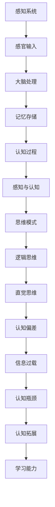
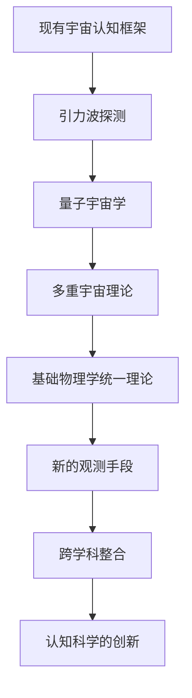

                 

## 引言与背景

### 1.1 引言：人类思维的局限性

人类思维是智慧的核心，是我们理解世界、解决问题和创造新知识的基础。然而，尽管人类思维在许多方面取得了显著的成就，但它也受到了一系列局限性的制约。理解这些局限性对于探讨人类思维能否超越当前的宇宙认知框架至关重要。

首先，人类思维的概念与特点需要明确。思维是一种心理过程，涉及信息获取、处理和利用，以实现目标、解决问题和做出决策。它包括感知、记忆、推理、想象、判断等多个方面，这些过程共同构成了人类思维的基本框架。

然而，当前人类思维所面临的局限性主要体现在以下几个方面：

1. **感知局限性**：人类感知系统对信息的接收和处理能力有限。我们的感官只能捕捉到宇宙中一小部分的信息，并且这些信息通常是以非完整或扭曲的形式呈现的。例如，人类的视觉系统只能感知电磁波谱中的一小部分，对于其他形式的信息，如引力波或宇宙背景辐射，我们则无法直接感知。

2. **认知局限性**：人类思维在处理复杂信息时也存在局限。虽然我们的认知系统可以进行逻辑推理和抽象思考，但它们的能力仍然是有限的。我们常常会受到各种认知偏差的影响，如确认偏误、锚定效应和过度自信等，这些偏差会导致我们做出不准确或非理性的判断。

3. **知识局限性**：人类的认知和知识积累是有限的。我们的知识和理解力受到历史、文化和教育背景的限制，这使得我们在某些领域可能缺乏深入的理解。例如，我们对宇宙的认知仍然存在许多未解之谜，如宇宙的起源、黑洞的本质以及暗物质和暗能量的性质。

4. **计算能力局限性**：尽管计算机技术的发展极大地扩展了我们的计算能力，但人类的认知系统仍然无法与计算机相比。计算机可以执行复杂的计算和模式识别任务，而人类的思维则受到处理速度和记忆容量的限制。

### 1.2 宇宙认知框架概述

宇宙认知框架是我们理解和描述宇宙的方式，它涉及从哲学、科学到技术的多个层面。宇宙认知框架可以定义为一系列概念、理论、方法和工具，用于解释宇宙的起源、结构、演化和未来。

宇宙认知框架可以分为几个主要类别：

1. **自然哲学框架**：这是最早的宇宙认知框架，主要基于哲学思考和理性推理。它试图回答宇宙的基本问题，如“宇宙如何开始？”、“宇宙的本质是什么？”等。

2. **科学理论框架**：随着科学的发展，宇宙认知框架逐渐建立在科学理论和实验证据的基础上。例如，牛顿力学、广义相对论和量子力学等科学理论构成了现代宇宙认知框架的核心。

3. **技术工具框架**：技术的进步为我们提供了新的观察和测量宇宙的手段。例如，望远镜、卫星、粒子加速器等工具使我们能够探索宇宙的更深层次。

### 1.3 本书的目的与结构

本书的目的是探讨人类思维能否超越当前的宇宙认知框架，并探索可能的途径和策略。全书分为五个部分，每个部分都有其特定的内容和目标：

- **第一部分**：引言与背景，介绍了人类思维的局限性和宇宙认知框架的概述。

- **第二部分**：人类思维的原理与机制，详细分析了人类思维的起源、感知、认知和局限性。

- **第三部分**：宇宙认知框架的限制与挑战，探讨了当前宇宙认知框架的局限性和面临的挑战。

- **第四部分**：人类思维超越宇宙认知框架的可能性，探讨了人类思维可能的未来发展趋势和新的宇宙认知框架的探索。

- **第五部分**：结论与展望，总结了本书的主要发现和结论，并提出了未来研究的方向和对人类未来的启示。

通过这五个部分的探讨，我们希望能够更深入地理解人类思维和宇宙认知框架之间的关系，并探索可能的突破点。

## 第一部分：引言与背景

### 1.1 引言：人类思维的局限性

人类思维是我们理解世界、解决问题和创造新知识的核心。它是一种复杂的心理过程，涉及信息获取、处理和利用。然而，尽管人类思维在许多方面取得了显著的成就，但它也受到了一系列局限性的制约。理解这些局限性对于探讨人类思维能否超越当前的宇宙认知框架至关重要。

首先，人类思维的概念与特点需要明确。思维是一种心理过程，它包括感知、记忆、推理、想象、判断等多个方面。感知是我们通过感官获取外部信息的过程，记忆则是我们将信息存储和检索的能力。推理是指我们使用逻辑和证据来推导结论，想象则是我们创造和设想新事物的能力。判断是指我们根据已知信息做出决策和评估。

然而，当前人类思维所面临的局限性主要体现在以下几个方面：

1. **感知局限性**：人类感知系统对信息的接收和处理能力有限。我们的感官只能捕捉到宇宙中一小部分的信息，并且这些信息通常是以非完整或扭曲的形式呈现的。例如，人类的视觉系统只能感知电磁波谱中的一小部分，对于其他形式的信息，如引力波或宇宙背景辐射，我们则无法直接感知。这种感知局限性使得我们对宇宙的认知具有很大的局限性。

2. **认知局限性**：人类思维在处理复杂信息时也存在局限。虽然我们的认知系统可以进行逻辑推理和抽象思考，但它们的能力仍然是有限的。我们常常会受到各种认知偏差的影响，如确认偏误、锚定效应和过度自信等，这些偏差会导致我们做出不准确或非理性的判断。例如，当我们在面对复杂问题时，我们可能会依赖于已有的经验和知识，而不是真正从问题本身出发进行思考。

3. **知识局限性**：人类的认知和知识积累是有限的。我们的知识和理解力受到历史、文化和教育背景的限制，这使得我们在某些领域可能缺乏深入的理解。例如，我们对宇宙的认知仍然存在许多未解之谜，如宇宙的起源、黑洞的本质以及暗物质和暗能量的性质。这些问题不仅超越了我们的感知和认知能力，也挑战了我们对知识的边界。

4. **计算能力局限性**：尽管计算机技术的发展极大地扩展了我们的计算能力，但人类的认知系统仍然无法与计算机相比。计算机可以执行复杂的计算和模式识别任务，而人类的思维则受到处理速度和记忆容量的限制。例如，当我们尝试处理大量数据或进行复杂的计算时，我们可能会感到力不从心，而计算机则能够以极高的效率和准确性完成这些任务。

这些局限性不仅制约了我们对宇宙的认知，也限制了我们在科学、技术和哲学等领域的探索。因此，探讨人类思维能否超越这些局限性，以及如何实现这一目标，成为了一个重要的研究课题。

### 1.2 宇宙认知框架概述

宇宙认知框架是我们理解和描述宇宙的方式，它涉及从哲学、科学到技术的多个层面。宇宙认知框架可以定义为一系列概念、理论、方法和工具，用于解释宇宙的起源、结构、演化和未来。

宇宙认知框架的发展经历了几个重要的阶段：

1. **古代宇宙认知框架**：在古代，人类对宇宙的认知主要基于宗教信仰和哲学思考。例如，亚里士多德提出了地心说，认为地球是宇宙的中心，所有天体都围绕地球旋转。这些观点虽然被后来的科学研究所推翻，但它们是人类尝试理解宇宙的开始。

2. **中世纪宇宙认知框架**：在中世纪，宗教权威对宇宙的认知产生了深远影响。天主教会认为地球是宇宙的中心，这种观点被称为地心说。此外，中世纪的天文学和物理学也做出了一些重要的贡献，如托勒密的地心说模型和阿维罗伊的物理哲学。

3. **近代宇宙认知框架**：随着科学革命的发展，宇宙认知框架逐渐从宗教和哲学转向科学理论和实验。牛顿的万有引力定律和哥白尼的日心说模型标志着近代宇宙认知框架的形成。这些理论为我们提供了新的视角，使我们能够更准确地描述宇宙的运行机制。

4. **现代宇宙认知框架**：在现代，宇宙认知框架进一步扩展，涵盖了更广泛的科学领域。广义相对论、量子力学和宇宙学等理论为我们提供了更深入的理解，使我们能够探讨宇宙的起源、演化和未来。例如，大爆炸理论解释了宇宙的起源，黑洞和暗物质等现象也为我们提供了新的观测和思考方向。

宇宙认知框架的基本原理可以归纳为以下几点：

1. **宇宙的整体性**：宇宙是一个整体，各个部分相互关联和影响。这意味着我们不能孤立地看待宇宙中的任何一个部分，而需要将其放在整个宇宙的背景下进行理解。

2. **宇宙的可变性**：宇宙是不断变化和演化的。从大爆炸到星系的形成，再到行星和生命的出现，宇宙经历了无数的变化。这种可变性使我们能够从动态的视角理解宇宙。

3. **宇宙的复杂性**：宇宙是一个复杂的系统，包含了大量的信息和层次。从微观的原子和基本粒子，到宏观的星系和宇宙背景辐射，宇宙的复杂性挑战了我们的认知能力。

4. **宇宙的未知性**：尽管我们已经取得了许多重要的科学发现，但宇宙仍然充满了未知。从暗物质和暗能量到宇宙的终极命运，我们仍然有很多问题需要解答。

宇宙认知框架的发展不仅推动了我们对宇宙的理解，也促进了科学和技术的进步。通过不断探索和发现，我们逐渐揭开了宇宙的奥秘，为未来的科学探索奠定了基础。

### 1.3 本书的目的与结构

本书的目的是探讨人类思维能否超越当前的宇宙认知框架，并探索可能的途径和策略。全书分为五个部分，每个部分都有其特定的内容和目标：

- **第一部分**：引言与背景，介绍了人类思维的局限性和宇宙认知框架的概述。

- **第二部分**：人类思维的原理与机制，详细分析了人类思维的起源、感知、认知和局限性。

- **第三部分**：宇宙认知框架的限制与挑战，探讨了当前宇宙认知框架的局限性和面临的挑战。

- **第四部分**：人类思维超越宇宙认知框架的可能性，探讨了人类思维可能的未来发展趋势和新的宇宙认知框架的探索。

- **第五部分**：结论与展望，总结了本书的主要发现和结论，并提出了未来研究的方向和对人类未来的启示。

通过这五个部分的探讨，我们希望能够更深入地理解人类思维和宇宙认知框架之间的关系，并探索可能的突破点。本书不仅适合对人工智能、认知科学和宇宙学感兴趣的读者，也希望能为相关领域的研究人员和学者提供有价值的参考。

## 第二部分：人类思维的原理与机制

### 2.1 人类思维的起源与发展

人类思维作为一种高度复杂和高度发达的认知能力，其起源和发展经历了漫长而复杂的历史过程。理解这一过程不仅有助于揭示人类思维的起源，还能为我们提供洞察人类认知机制的线索。

首先，人类思维的历史演变可以从早期人类的出现开始追溯。大约250万年前，现代人类的直系祖先——古猿开始出现。这些早期人类在大约100万年前开始使用工具，并逐渐发展出更复杂的社会结构。这些行为和认知能力的出现，标志着人类思维起源的重要阶段。

1. **认知能力的初步发展**：早期人类通过使用工具，逐渐发展出感知和动作协调的能力。这种能力不仅使人类能够更好地适应环境，也促进了大脑的进化。大约40万年前，人类祖先的智人大脑（Homo sapiens）出现，这标志着人类思维的一个重大飞跃。智人大脑的体积较大，拥有更发达的前额叶和扣带回，这些区域与高级认知功能密切相关。

2. **语言的发展**：语言是人类思维发展的重要里程碑。大约7万年前，现代语言开始出现，使人类能够进行更复杂的交流和协作。语言的发展不仅增强了人类的社会合作能力，也促进了思维和认知的进一步发展。

3. **文化和技术进步**：人类的文化和技术进步也是人类思维发展的重要推动力。大约1万年前，农业革命的发生，使人类从游牧生活转向定居生活，这为知识积累和传承提供了新的途径。随着文字的出现，人类能够将知识记录下来，并通过教育传递给后代，这极大地扩展了人类的知识库。

4. **科学和哲学的发展**：科学和哲学的发展是人类思维发展的重要阶段。古希腊哲学家的思考方式，如苏格拉底、柏拉图和亚里士多德，奠定了西方哲学的基础。他们的思想不仅影响了后来的科学家，也为我们理解自然世界的规律提供了重要启示。在科学领域，牛顿、爱因斯坦等科学家的发现，进一步深化了我们对宇宙和自然界的认识。

通过这些历史演变，人类思维逐渐从简单的感知和动作协调，发展出复杂的感知、记忆、推理、想象和判断等认知功能。这种发展的过程，不仅使人类能够更好地适应环境，也为人类文明的发展奠定了基础。

### 2.2 感知与认知

感知与认知是理解人类思维的两个核心概念。感知是指通过感官接收外部信息的过程，而认知是指对这些信息进行处理、解释和利用的心理过程。这两个过程紧密相连，共同构成了人类思维的基础。

首先，感知系统是认知过程的起点。人类的感知系统包括视觉、听觉、嗅觉、味觉和触觉等五个主要方面。这些感官通过接收外部信息，如光线、声音、气味、味道和触觉刺激，将信息传递给大脑。例如，我们的视觉系统通过接收光线，将光信号转换为电信号，然后传递到大脑进行处理。

然而，感知系统并非完美。首先，感知系统存在局限性。例如，我们的视觉系统只能感知电磁波谱的一小部分，对于其他形式的信息，如引力波或宇宙背景辐射，我们则无法直接感知。其次，感知系统受到主观因素的影响。例如，同样的视觉刺激在不同的人看来可能会产生不同的感受，这种差异反映了感知的主观性。

认知过程是感知信息的进一步处理。大脑通过解析、解释和利用感知信息，实现对世界的理解。认知过程包括多个阶段：

1. **感知输入的处理**：大脑接收来自感知系统的信息，并对其进行初步处理。例如，视觉系统将光信号转换为电信号，然后传递到大脑的视觉皮层进行处理。

2. **信息的解释**：大脑对感知信息进行解释，以理解其含义。例如，我们看到的物体可能是由多个部分组成的，大脑需要将这些部分整合成一个完整的物体。

3. **信息的存储和记忆**：大脑将处理后的信息存储在记忆中，以备后续使用。记忆分为短期记忆和长期记忆，短期记忆通常只能保持几分钟，而长期记忆则可以持续数天、数月甚至数年。

4. **推理和决策**：大脑利用存储在记忆中的信息进行推理和决策。例如，当我们面对复杂问题时，我们可能会依赖于已有的知识和经验，进行逻辑推理和决策。

然而，认知过程也受到许多因素的影响。首先，认知过程受到感知系统局限性的制约。例如，我们的感知系统无法感知所有的信息，这限制了我们的认知能力。其次，认知过程受到大脑处理速度和容量的限制。尽管计算机技术可以帮助我们处理大量信息，但人类的认知系统仍然有限。最后，认知过程受到情感和动机的影响。例如，我们的情感状态和动机可能会影响我们的认知过程，使我们在某些情况下做出非理性的决策。

总之，感知与认知是人类思维的两个核心过程，它们相互依赖，共同构成了我们对世界的理解。然而，这两个过程也受到许多限制，这些限制影响了我们的认知能力和决策能力。

### 2.3 人类思维的模式与范式

人类思维的模式与范式是理解人类认知过程的另一个重要方面。思维模式是指人们在思考问题时所采用的基本策略和方法，而范式则是指某一领域内普遍接受的理论框架和方法论。

首先，思维模式的分类可以基于不同的标准。例如，根据思维的深度和广度，思维模式可以分为浅层思维和深层思维。浅层思维主要关注问题的表面现象，而深层思维则试图挖掘问题的本质和内在联系。根据思维的逻辑性，思维模式可以分为逻辑思维和直觉思维。逻辑思维遵循严格的推理规则，而直觉思维则更多地依赖于直觉和经验。

不同的思维模式在不同的情境下具有不同的优势。例如，在解决复杂问题时，深层思维和逻辑思维可能更为有效，因为它们能够帮助我们深入理解问题，找到解决问题的根本途径。而在面对紧急情况时，直觉思维可能更为重要，因为它能够帮助我们迅速做出决策，避免陷入复杂的逻辑推理。

范式则是在某一领域内普遍接受的理论框架和方法论。例如，在物理学领域，经典力学和量子力学是两个重要的范式。经典力学描述了宏观物体的运动规律，而量子力学则描述了微观粒子的行为。在不同的范式下，我们对世界的理解方式也不同。例如，在经典力学范式下，我们认为时间是绝对的，而在量子力学范式下，时间则具有相对性。

范式对人类思维的影响是深远的。首先，范式决定了我们理解世界的方式。例如，在经典力学范式下，我们认为物体的运动是连续的，而在量子力学范式下，物体的运动则是离散的。其次，范式影响了我们的研究方法和思维方式。在不同的范式下，我们可能采用不同的研究方法，从而得出不同的结论。例如，在生物学领域，基因学和表观遗传学是两个不同的范式，它们分别从不同的角度解释生命现象。

然而，范式也具有局限性。首先，范式可能无法解释某些现象。例如，在经典力学范式下，我们无法解释量子力学中的某些现象，如纠缠态和量子隧穿。其次，范式可能阻碍新的发现和创新。当一种范式被广泛接受时，它可能会限制我们的思维，使我们难以接受新的观点和理论。

总之，人类思维的模式与范式是我们理解世界和解决问题的重要工具。不同的思维模式和方法论在不同情境下具有不同的优势，而范式则决定了我们在某一领域内的思考方式。然而，我们也需要认识到范式的局限性，并不断探索新的思维模式和方法论，以推动科学和技术的进步。

### 2.4 人类思维的局限性分析

人类思维的局限性主要体现在认知偏差、信息过载和认知瓶颈等方面。这些局限性不仅影响了我们的判断和决策，也限制了我们在科学、技术和艺术等领域的创新。

首先，认知偏差是人类思维的一个显著特征。认知偏差是指人们在感知、记忆和判断过程中，由于各种心理和生理因素的影响，导致对信息处理出现偏差的现象。常见的认知偏差包括确认偏误、锚定效应和代表性偏差等。确认偏误是指人们在处理信息时，更容易接受和记住与已有信念相符的信息，而忽视与之相矛盾的信息。锚定效应是指人们在判断和决策时，会受到第一印象或初始信息的影响，即使这些信息并不重要或已经过时。代表性偏差是指人们在判断概率时，会根据某个样本的代表性来估计总体概率，而忽视了样本的随机性和总体结构的复杂性。

其次，信息过载是现代人类面临的一个重要问题。随着互联网和大数据技术的发展，我们每天接收到的信息量急剧增加。然而，人类的认知系统无法处理如此庞大的信息量，这导致了信息过载的问题。信息过载不仅使我们难以有效地处理和利用信息，还可能引发焦虑和压力。为了应对信息过载，我们需要发展新的信息处理策略，如信息过滤、信息压缩和信息整合。

最后，认知瓶颈是制约人类思维发展的一个重要因素。认知瓶颈是指人类认知系统在处理复杂信息时，由于处理速度和记忆容量的限制，导致无法有效处理的信息量。例如，当我们需要同时处理多个任务时，认知瓶颈会使我们感到疲劳和困惑。此外，认知瓶颈还影响了我们的创新能力和问题解决能力。为了克服认知瓶颈，我们需要探索新的认知技术和方法，如认知增强技术和人工智能。

总之，人类思维的局限性主要体现在认知偏差、信息过载和认知瓶颈等方面。这些局限性不仅影响了我们的判断和决策，也限制了我们在科学、技术和艺术等领域的创新。因此，深入研究和解决这些局限性，对于提升人类认知能力和推动社会发展具有重要意义。

### 2.4.1 认知偏差的详细分析

认知偏差是人类思维中的一个普遍现象，这些偏差不仅影响了我们的判断和决策，还可能误导我们对世界的理解。以下是对几种常见认知偏差的详细分析：

#### 确认偏误

确认偏误是指人们在处理信息时，更容易接受和记住与已有信念相符的信息，而忽视与之相矛盾的信息。这种现象可能导致我们陷入“信息茧房”，即只关注和接收与我们观点一致的信息，而忽视其他可能的重要信息。例如，在政治观点上，支持某个政党的个体往往会选择性地关注和记忆支持该政党的新闻和观点，而忽视反对该政党的观点。

**示例**：假设一个人坚信某个健康饮食方法的效果，他会倾向于关注和记住那些证明这种方法有效的案例和研究成果，而忽视那些证明这种方法无效或有害的研究。这种确认偏误会导致该个体对该饮食方法产生过度自信，甚至拒绝接受其他科学证据。

#### 锚定效应

锚定效应是指人们在判断和决策时，会受到第一印象或初始信息的影响，即使这些信息并不重要或已经过时。例如，在购买商品时，我们可能会根据一个过时的价格作为参考点，来评估商品的新价格。

**示例**：在拍卖过程中，第一个出价者设定的价格可能会成为其他竞拍者的参考点。即使后续的出价者意识到这个价格过高，他们仍然会受到初始出价的影响，从而支付更高的价格。

#### 代表性偏差

代表性偏差是指人们在判断概率时，会根据某个样本的代表性来估计总体概率，而忽视了样本的随机性和总体结构的复杂性。例如，在判断某个群体时，人们可能会根据几个代表性个体的特征来推测整个群体的特征。

**示例**：在招聘过程中，如果面试官遇到几个具有相似背景和能力的候选人，他们可能会认为所有候选人都有类似的背景和能力，从而忽视其他可能更有潜力的候选人。这种偏差可能导致招聘决策的失误。

#### 可得性偏差

可得性偏差是指人们在评估信息的重要性时，会受到信息容易回忆程度的影响。例如，那些容易回忆的信息（如新闻报道中的灾难事件）可能会被认为比其他信息更为重要。

**示例**：在制定安全措施时，人们可能会过度关注那些容易引发恐慌的事件，如恐怖袭击，而忽视那些更可能发生的但不太引人注目的事件，如交通事故。

#### 事后诸葛偏差

事后诸葛偏差是指在事后对事件进行评价时，会认为事件的发展是显而易见的，而忽视了在事件发生时可能存在的未知因素和不确定性。这种现象可能导致人们对自己的判断产生过度自信。

**示例**：在股市投资中，如果投资者在股票价格上涨后回顾自己的决策，可能会认为自己的决策是正确的，而忽视了在投资时可能存在的风险和不确定性。

通过以上对认知偏差的详细分析，我们可以看到这些偏差如何影响我们的判断和决策。理解这些偏差的存在和影响，有助于我们在面对信息时保持警觉，减少因认知偏差导致的错误决策。

### 2.4.2 信息过载的详细分析

信息过载是现代人类社会面临的重大挑战之一，它不仅影响了我们的日常生活，也制约了我们的认知能力。随着互联网和大数据技术的发展，我们每天接收到的信息量呈指数级增长。这种信息爆炸现象使得信息过载成为了一个普遍存在的问题。

首先，信息过载的定义和表现可以归结为以下几点：

1. **信息量巨大**：互联网和社交媒体的兴起，使得人们每天接触到海量的信息。据估计，全球每天产生的数据量已经达到了数以艾字节（ZB）计。这些信息包括新闻、广告、社交媒体更新、电子邮件等，涵盖了各种领域和主题。

2. **信息分散**：随着信息来源的增多，信息变得愈发分散。我们无法集中精力处理单一信息源，而是需要在多个平台上切换，以获取不同的信息。

3. **信息重复**：由于信息来源的多样性和传播机制的便捷性，很多信息会被重复传播，导致信息冗余。这种重复不仅浪费了我们的时间，还可能造成混淆和误解。

4. **信息质量参差不齐**：在信息过载的环境中，信息的质量难以保证。真假难辨的信息混合在一起，使得我们难以判断哪些信息是可靠的，哪些是虚假的。

信息过载对我们的认知能力产生了深远的影响：

1. **注意力分散**：面对大量的信息，我们的注意力很容易被分散。这导致我们在处理重要任务时难以集中精力，降低了工作效率。

2. **情绪波动**：信息过载可能导致焦虑、压力和情绪波动。当信息量超过我们的处理能力时，我们可能会感到无所适从，甚至产生恐慌情绪。

3. **决策困难**：信息过载增加了决策的难度。在处理大量信息时，我们难以进行有效的信息筛选和判断，导致决策过程变得复杂和缓慢。

为了应对信息过载，我们需要采取一系列策略：

1. **信息过滤**：使用各种工具和算法来过滤和筛选信息，只关注重要的和相关的信息。

2. **信息压缩**：通过总结和提炼信息，将其压缩为易于理解和记忆的形式。例如，阅读长篇文章时，可以提取关键信息和结论，以便快速了解主要内容。

3. **信息整合**：将来自不同来源的信息进行整合，形成完整的知识体系。这有助于我们更全面地理解问题，避免因信息分散而导致的误解。

4. **信息管理**：建立有效的信息管理策略，如定期清理无关信息、制定信息处理计划等，以减轻信息过载的压力。

总之，信息过载是一个复杂而普遍存在的问题，它对我们的认知能力产生了显著的影响。通过采取有效的信息过滤、压缩和整合策略，我们可以更好地应对信息过载，提高信息处理效率，从而在复杂的信息环境中保持清晰的思维和有效的决策能力。

### 2.4.3 认知瓶颈的详细分析

认知瓶颈是指人类认知系统在处理复杂信息时，由于处理速度和记忆容量的限制，导致无法有效处理的信息量。认知瓶颈不仅影响了我们的日常决策和任务执行，也限制了我们在科学、技术和艺术等领域的创新。以下是关于认知瓶颈的详细分析：

#### 认知瓶颈的表现

1. **信息处理速度限制**：人类的认知系统在处理信息时，存在速度限制。尽管我们可以通过学习和经验来提高处理速度，但大脑的处理速度仍然无法与计算机相比。例如，当我们需要快速处理大量数据或进行复杂的计算时，我们可能会感到力不从心，这种速度限制限制了我们的信息处理能力。

2. **记忆容量限制**：人类的记忆容量有限，无法存储和处理大量的信息。长期记忆和短期记忆的容量都是有限的，这使得我们在面对复杂问题时，无法同时记住和处理所有的信息。例如，在处理多任务时，我们可能会感到记忆负担过重，导致工作效率下降。

3. **注意力分散**：认知瓶颈也表现为注意力的分散。在处理复杂信息时，我们的注意力可能会被分散，导致难以集中精力处理关键任务。例如，在开会或学习时，外界干扰和内心杂念可能会干扰我们的注意力，使我们难以有效地处理信息。

4. **认知疲劳**：长时间进行高强度的认知活动，会导致大脑疲劳，进一步加剧认知瓶颈。例如，长时间工作或学习后，我们可能会感到疲惫和困惑，无法有效地处理复杂信息。

#### 认知瓶颈的影响

1. **决策困难**：认知瓶颈使我们难以快速做出决策。在面对复杂问题时，我们可能会感到困惑和犹豫，导致决策过程变得复杂和缓慢。例如，在商业决策中，信息过载和认知瓶颈可能会使决策者难以在短时间内做出最佳决策。

2. **创新能力受限**：认知瓶颈限制了我们的创新能力。在科学研究和艺术创作中，我们需要进行大量的信息处理和思维活动。然而，由于认知瓶颈的限制，我们可能无法有效地处理复杂的想法和概念，从而限制了我们的创新潜力。

3. **学习效率降低**：认知瓶颈影响了我们的学习效率。在学习新知识时，我们可能需要花费更长的时间来理解和记忆信息。此外，由于记忆容量的限制，我们可能无法同时处理多个学习任务，这进一步降低了学习效率。

4. **生活质量下降**：认知瓶颈不仅影响我们的工作和学习，也影响我们的生活质量。在日常生活中，我们可能会因为认知瓶颈而感到焦虑和压力，导致生活质量下降。

#### 应对认知瓶颈的策略

1. **认知训练**：通过认知训练，可以提高我们的认知能力和处理速度。例如，通过记忆训练、逻辑推理训练和注意力训练，我们可以提升大脑的处理速度和效率。

2. **信息过滤和整合**：使用信息过滤工具，如新闻订阅、社交媒体过滤器等，可以减少我们接收到的信息量，从而降低认知负担。此外，通过整合和整理信息，我们可以更有效地处理和利用信息。

3. **时间管理**：合理安排时间，避免长时间的高强度认知活动。例如，通过定期休息和切换任务，我们可以减轻大脑的疲劳，提高认知效率。

4. **认知辅助工具**：利用认知辅助工具，如笔记软件、思维导图工具等，可以帮助我们更好地处理复杂信息。这些工具可以帮助我们整理思路、记录关键信息和制定计划。

总之，认知瓶颈是影响人类认知能力的一个关键因素。通过理解和应对认知瓶颈，我们可以提升认知效率，提高决策能力和创新能力，从而在复杂的信息环境中保持高效的思维和行动能力。

### 2.5 人类思维的可拓展性

人类思维的可拓展性是指我们在面对新环境和挑战时，能够调整和扩展我们的认知能力，以适应新的需求。这种可拓展性不仅使我们能够在变化多端的世界中生存和繁衍，也推动了人类文明的进步。

首先，人类思维的可拓展性体现在我们的学习能力上。我们能够通过学习和训练，不断地扩展我们的知识和技能。例如，儿童在成长过程中，通过不断的学习和练习，能够掌握各种语言、文化和技能。这种学习能力使我们能够适应不同的环境和情境。

其次，人类思维的可拓展性也表现在我们的适应性上。面对新的挑战和问题，我们能够灵活地调整思维方式和策略，以找到解决问题的方法。例如，在科学研究中，科学家们不断提出新的理论和假设，通过实验和观察来验证和修正这些理论，从而推动科学的进步。

然而，人类思维的可拓展性也受到一定的限制。首先，我们的认知能力受到大脑结构和神经网络的限制。尽管人类大脑具有高度的可塑性，但它的结构和功能仍然存在一定的局限性。其次，我们的社会和文化背景也影响了我们的思维方式和认知能力。不同文化和社会环境下的个体，其思维方式可能存在显著差异，这种差异可能限制了我们的思维拓展。

为了进一步提升人类思维的可拓展性，我们需要采取以下策略：

1. **跨学科学习**：通过跨学科的学习，我们可以整合不同领域的知识和方法，从而扩展我们的认知视野。例如，物理学、生物学、心理学和社会学等领域的交叉研究，可以为我们提供新的视角和工具，以解决复杂的问题。

2. **多样化经验**：通过多样化的经验，我们可以扩展我们的认知边界。例如，旅行、跨文化交流和参与不同类型的活动，可以增强我们的适应性，提高我们的思维灵活性。

3. **创新思维训练**：通过创新思维训练，如思维导图、头脑风暴和问题解决训练等，我们可以培养创造性和批判性思维，从而更好地应对新挑战。

4. **神经科学和人工智能的应用**：利用神经科学和人工智能的研究成果，我们可以开发新的认知辅助工具，如智能算法和神经反馈系统，以增强我们的认知能力和可拓展性。

总之，人类思维的可拓展性是我们适应环境和推动文明进步的关键。通过理解和利用这种可拓展性，我们可以不断提升认知能力，应对未来的挑战。

## 第三部分：宇宙认知框架的限制与挑战

### 3.1 宇宙认知框架的基本原理

宇宙认知框架的基本原理构成了我们对宇宙的理解和描述，它们在科学、哲学和技术等多个领域内发挥着重要作用。这些原理不仅帮助我们解释宇宙的基本特性，也指导我们进行科学研究和技术创新。

首先，宇宙的整体性原理指出宇宙是一个统一的整体，各个部分相互关联和影响。这一原理强调了宇宙的不可分割性，认为我们不能孤立地看待宇宙中的任何一个部分，而需要将其放在整个宇宙的背景下进行理解。例如，在物理学中，宇宙的整体性原理体现在宇宙大爆炸理论和宇宙膨胀理论中，它们描述了宇宙从初始状态到当前状态的整体演化过程。

其次，宇宙的可变性原理指出宇宙是不断变化和演化的。这一原理强调了宇宙的动态性质，认为宇宙中的所有现象都在不断变化和发展。从微观尺度上的原子和基本粒子的运动，到宏观尺度上的星系和宇宙背景辐射，宇宙的可变性体现在各个层次和层面。在宇宙学中，这一原理体现在宇宙膨胀理论和黑洞理论中，它们揭示了宇宙演化的基本规律和现象。

第三，宇宙的复杂性原理指出宇宙是一个高度复杂的系统，包含了大量的信息和层次。这一原理强调了宇宙的多样性，认为宇宙中存在多种不同类型的现象和过程。从微观的量子现象，到宏观的星系结构，再到宇宙的总体演化，宇宙的复杂性挑战了我们的认知能力。在科学研究中，复杂性原理促使我们采用多学科的方法，如量子力学、相对论和统计力学等，来解释和理解宇宙的复杂现象。

第四，宇宙的未知性原理指出宇宙中仍然存在许多未知和未解之谜。这一原理强调了我们对宇宙认识的局限性，认为宇宙中存在许多尚未被发现和理解的领域。例如，暗物质和暗能量是宇宙中两个重要但尚未完全理解的成分，它们的存在和性质仍然是科学界的研究重点。此外，宇宙的起源、宇宙背景辐射的起源和宇宙的终极命运等也是我们尚未解决的重大问题。

这些基本原理不仅构成了宇宙认知框架的基础，也指导了我们在科学研究和技术创新中的实践。通过理解这些原理，我们能够更深入地探索宇宙的奥秘，推动科学和技术的进步。

### 3.2 当前宇宙认知框架的局限性

尽管宇宙认知框架在解释宇宙现象方面取得了显著成就，但它仍然存在一些重要的局限性，这些局限性对进一步的科学探索和技术创新构成了挑战。

首先，宇宙认知框架的局限性表现在对宇宙起源和演化的理解上。尽管大爆炸理论和宇宙膨胀理论为我们提供了对宇宙初始状态和当前状态的描述，但它们在解释宇宙起源的具体机制和初始条件方面仍存在许多未解之谜。例如，关于宇宙为什么会从一个极热、极密的状态开始膨胀，以及宇宙的初始条件是如何设定的，这些问题仍然是科学界的重要研究课题。此外，暗物质和暗能量这两个宇宙成分的存在和性质也仍然是一个谜，这限制了我们对宇宙结构和演化的完整理解。

其次，宇宙认知框架在描述宇宙的宏观和微观现象时存在不一致性。在宏观尺度上，广义相对论和量子力学分别提供了对宇宙的描述，但它们在微观尺度上的结合仍是一个挑战。广义相对论描述了宏观引力现象，而量子力学描述了微观粒子的行为，这两个理论在数学和物理意义上存在矛盾，如量子引力问题。如何统一这两个理论，以提供对宇宙的全面描述，是当前宇宙认知框架面临的一个重要难题。

第三，宇宙认知框架在解释宇宙中的某些现象时存在解释不足。例如，黑洞的性质和行为仍然是一个未解之谜。尽管我们已经能够通过观测和理论模型来描述黑洞的存在和特性，但对于黑洞内部的结构和物理过程，我们仍然知之甚少。此外，宇宙中的某些极端现象，如宇宙弦和宇宙泡等，也需要新的理论框架来解释。

第四，宇宙认知框架的局限性还表现在技术手段的限制上。尽管我们能够使用先进的观测工具，如望远镜、卫星和粒子加速器，来探索宇宙的奥秘，但我们的观测手段仍然受到物理和技术的限制。例如，我们无法直接观测引力波或宇宙背景辐射，这限制了我们对宇宙早期状态的理解。此外，宇宙中的某些现象可能需要更高的分辨率和灵敏度来观测，这要求我们发展新的技术手段。

总之，当前宇宙认知框架在解释宇宙现象方面存在一系列局限性，这些局限性对进一步的科学探索和技术创新构成了挑战。为了克服这些局限性，我们需要不断探索新的理论框架和方法论，并发展先进的技术手段，以推动宇宙认知框架的进一步发展。

### 3.3 宇宙认知框架的拓展方向

为了克服当前宇宙认知框架的局限性，并应对未来科学探索的挑战，我们需要探索宇宙认知框架的潜在拓展方向。这些拓展方向不仅能够深化我们对宇宙的理解，也可能带来新的理论突破和技术创新。

#### 1. 引力波与量子引力的结合

引力波是爱因斯坦广义相对论预测的一种物理现象，它代表了引力对时空结构的扰动。尽管我们已经通过LIGO等观测设备观测到了引力波，但如何将引力波与量子力学相结合，仍是一个重要的研究方向。量子引力理论试图将广义相对论和量子力学统一起来，以提供一个全面描述宇宙的框架。探索引力波与量子引力的结合，有助于我们更深入地理解宇宙的起源和演化。

**拓展策略**：通过发展高灵敏度的引力波探测器，提高观测精度，并结合量子计算和量子信息理论，开发新的探测和分析方法。例如，利用量子纠缠和量子态传输技术，增强引力波信号的检测能力。

#### 2. 宇宙早期状态的研究

宇宙早期状态的研究是理解宇宙起源和演化的重要方向。当前，我们对宇宙早期状态的认知仍然非常有限，特别是关于宇宙背景辐射和早期宇宙的物理过程。研究宇宙早期状态，可能揭示宇宙初始条件和物理定律的本质。

**拓展策略**：利用先进的宇宙探测器，如火星探测器和星际探测器，获取宇宙早期状态的高分辨率数据。通过多波段观测，结合不同波长的数据，揭示宇宙早期状态的秘密。

#### 3. 暗物质和暗能量的探索

暗物质和暗能量是宇宙认知框架中两个重要但尚未完全理解的概念。暗物质不发光，不吸收光线，但其存在对宇宙的结构和演化有重要影响。暗能量则是一种推动宇宙加速膨胀的神秘力量。探索暗物质和暗能量的本质，有助于我们理解宇宙的动力学和结构。

**拓展策略**：通过天文观测和粒子物理学实验，寻找暗物质和暗能量的直接证据。例如，利用大型天文望远镜观测星系旋转曲线，探索暗物质的存在；通过高能物理实验，如大型强子对撞机（LHC），研究暗物质和暗能量的粒子性质。

#### 4. 宇宙多重宇宙的假设

宇宙多重宇宙假设提出，我们的宇宙只是众多宇宙中的一个，这些宇宙可能具有不同的物理定律和初始条件。探索宇宙多重宇宙的假设，不仅能够提供对宇宙多样性的新理解，也可能揭示宇宙的本质和起源。

**拓展策略**：通过计算模拟和数学模型，探索宇宙多重宇宙的潜在结构和性质。例如，利用量子场论和多尺度模拟技术，研究不同宇宙的可能形态和演化。

#### 5. 新的观测手段和技术

新的观测手段和技术是拓展宇宙认知框架的重要途径。随着科技的发展，我们有望开发出更先进的观测工具，如量子望远镜、空间引力波探测器等，以获取宇宙更详细的信息。

**拓展策略**：发展新的观测技术，如量子干涉测量和纳米材料探测技术，提高观测的灵敏度和精度。例如，通过量子干涉测量技术，探测宇宙背景辐射中的细微变化；利用纳米材料，开发高灵敏度的天文观测设备。

通过这些拓展方向，我们不仅能够更深入地理解宇宙，还可能揭示宇宙认知框架中的新奥秘，推动科学和技术的进步。

### 3.4 新的宇宙认知框架的构建方法

构建新的宇宙认知框架是一项复杂而具有挑战性的任务，它需要跨越多个学科领域，并采用创新的思维方法和工具。以下是一些可能的方法和步骤，以探索和构建新的宇宙认知框架。

#### 1. 跨学科整合

宇宙认知框架的构建需要整合多个学科的知识和方法，包括物理学、天文学、生物学、心理学和哲学等。通过跨学科整合，我们可以从不同角度和层次理解宇宙，并发现新的理论和方法。

**步骤**：首先，识别不同学科中与宇宙认知相关的重要理论、方法和数据。然后，建立跨学科的研究团队，通过定期的交流和合作，共享研究成果和资源。最后，通过跨学科的整合，提出新的理论和模型，以解释宇宙的复杂现象。

#### 2. 基于数据和实证的研究

数据是科学探索的基础，构建新的宇宙认知框架需要基于大量的数据和实证研究。通过收集和分析不同来源的数据，我们可以揭示宇宙的规律和特性。

**步骤**：首先，设计科学实验和观测计划，以收集高质量的宇宙数据。例如，利用天文望远镜和粒子加速器进行观测，获取宇宙的高分辨率图像和数据。然后，利用数据分析和机器学习技术，从大量数据中提取有用的信息和模式。最后，基于实证研究结果，提出新的理论框架和假设。

#### 3. 理论创新和数学建模

理论创新和数学建模是构建新的宇宙认知框架的重要手段。通过发展新的理论框架和数学模型，我们可以更深入地理解宇宙的本质和演化。

**步骤**：首先，提出新的理论假设，这些假设需要能够解释现有的观测数据和实验结果。例如，探索新的引力理论或宇宙演化模型。然后，使用数学工具和计算方法，对新的理论进行数学建模和验证。最后，通过实验和观测，验证和修正这些理论模型。

#### 4. 跨时间和空间的视角

宇宙认知框架的构建需要跨越时间和空间的限制，从宏观和微观的角度理解宇宙。这要求我们采用跨时间和空间的视角，探索宇宙的演化和结构。

**步骤**：首先，收集和分析不同时间尺度上的宇宙数据，如宇宙早期状态和当前状态。然后，通过比较不同时间和空间尺度上的观测数据，发现宇宙演化的规律和模式。最后，基于跨时间和空间的视角，提出新的宇宙认知框架和理论。

#### 5. 社会和文化因素的考虑

宇宙认知框架的构建不仅是一个科学问题，也是一个社会和文化问题。不同的社会和文化背景可能影响我们对宇宙的认知和理解。

**步骤**：首先，识别和了解不同社会和文化中对宇宙的认知和信仰。然后，通过跨文化交流和合作，促进不同文化背景下科学家的交流和合作。最后，基于社会和文化的多样性，提出包容性和多元化的宇宙认知框架。

通过这些方法和步骤，我们可以探索和构建新的宇宙认知框架，以更全面和深入地理解宇宙的奥秘。这不仅有助于推动科学和技术的进步，也为人类文明的未来发展提供了新的视角和思考方向。

### 4.1 人类思维的潜在突破

探讨人类思维能否超越当前宇宙认知框架，首先需要考虑人类思维的潜在突破。随着科技的迅猛发展，人工智能（AI）和神经科学等领域的突破，为人类思维的发展带来了新的可能性。

#### 1. 人工智能的崛起

人工智能技术的迅猛发展，为人类提供了前所未有的工具和平台。通过机器学习和深度学习算法，AI系统能够从大量数据中学习模式和规律，并利用这些知识进行预测和决策。例如，谷歌的AlphaGo通过自我学习和迭代，在围棋领域超越了人类最顶尖的选手。这表明，通过AI，人类思维的能力可以实现质的飞跃。

**潜在突破**：
- **增强认知能力**：AI可以帮助人类处理和分析大量复杂的数据，从而提升认知能力。例如，医疗诊断、金融分析和科学研究等领域，AI可以辅助人类专家进行更准确和高效的决策。
- **跨学科整合**：AI可以跨越不同学科之间的壁垒，通过跨学科的数据分析和模式识别，发现新的科学规律和理论。
- **自动化决策**：在自动驾驶、智能制造等领域，AI可以替代人类进行复杂决策，从而减轻人类的工作负担，释放出更多时间和精力进行创造性思维。

#### 2. 神经科学的进展

神经科学对大脑结构和功能的研究，也为人类思维的突破提供了新的视角。通过脑成像技术和脑机接口，科学家可以实时监测和记录大脑的活动，从而深入理解人类思维的过程。

**潜在突破**：
- **认知增强**：通过神经调控技术，如电刺激和光遗传学，可以增强大脑的认知功能，提升学习和记忆能力。例如，研究人员已经通过电刺激技术，提高了小鼠的学习和记忆能力。
- **神经接口技术**：脑机接口技术可以将人类大脑与计算机直接连接，实现思维信息的实时传递和控制。这为人类与机器的融合提供了可能，从而扩展人类思维的能力。
- **脑机融合**：通过将人类大脑与外部设备融合，人类可以扩展感知和运动能力，实现更高效的信息处理和决策。例如，脑机接口技术已应用于瘫痪患者的辅助治疗，通过脑信号控制机械臂进行运动。

#### 3. 认知科学的创新

认知科学作为一个跨学科领域，结合心理学、计算机科学和神经科学的研究成果，致力于探索人类思维的本质和机制。认知科学的创新，为人类思维的突破提供了新的理论和方法。

**潜在突破**：
- **认知建模**：通过建立数学模型和计算机模拟，认知科学可以揭示人类思维的基本原理和机制，从而设计出更高效的认知系统。
- **认知干预**：基于认知科学的研究成果，可以开发出认知干预技术，如认知训练和应用软件，帮助人们提高注意力和记忆力，增强思维灵活性。
- **社会认知**：认知科学还关注人类在社会环境中的认知过程，研究如何通过社会互动和协作，提升集体智慧和创造力。

总之，人工智能、神经科学和认知科学的突破，为人类思维的潜在突破提供了丰富的资源和机遇。通过这些创新，人类有望在认知能力、决策能力和创新潜力方面实现质的飞跃，从而超越当前的宇宙认知框架，开启人类智慧的新时代。

### 4.2 新的宇宙认知框架的探索

为了探讨人类思维能否超越当前的宇宙认知框架，我们需要探索新的宇宙认知框架。这些新的框架不仅能够帮助我们更好地理解宇宙，还可能揭示宇宙的未知领域。以下是一些可能的探索方向：

#### 1. 多重宇宙理论

多重宇宙理论提出，我们的宇宙只是众多宇宙中的一个，每个宇宙可能有不同的物理定律和初始条件。探索多重宇宙理论，可以帮助我们理解宇宙的多样性和统一性。

**方法**：
- **观测和数据分析**：通过观测宇宙中的异常现象，如超远距离的光信号，探索可能存在的其他宇宙。通过分析宇宙背景辐射和星系分布的数据，寻找宇宙之间的联系和相互作用。
- **数学建模和模拟**：利用数学模型和计算机模拟，探索不同宇宙的可能形态和演化规律。例如，通过多尺度模拟，研究不同宇宙中的物理现象，如量子引力和宇宙膨胀。

#### 2. 量子宇宙学

量子宇宙学试图将量子力学与宇宙学结合起来，以解释宇宙的起源和演化。探索量子宇宙学，有助于我们理解宇宙的微观基础和宏观现象。

**方法**：
- **实验验证**：通过实验物理学的进展，如高能粒子加速器和量子计算实验，验证量子力学在宇宙学中的应用。例如，通过测量宇宙背景辐射的量子波动，验证宇宙的量子起源。
- **理论创新**：发展新的量子宇宙学理论，如量子引力理论和多宇宙量子场论。通过这些理论，探索宇宙的初始状态和演化过程。

#### 3. 基础物理学的统一理论

基础物理学的统一理论，如大统一理论和超对称理论，试图将引力、电磁力和强、弱相互作用统一在一个框架下。探索这些统一理论，可以帮助我们理解宇宙的基本结构和相互作用。

**方法**：
- **实验验证**：通过高能物理实验，如大型强子对撞机（LHC），探索统一理论的预言，如超对称粒子的存在。通过实验验证，验证统一理论对宇宙结构的解释能力。
- **数学建模**：通过数学建模和计算模拟，探索不同统一理论的可能性。例如，通过多参量模型，研究不同统一理论对宇宙膨胀和黑洞行为的解释。

#### 4. 新的观测手段和技术

新的观测手段和技术，如量子望远镜和引力波探测，为我们提供了更深入探索宇宙的机会。探索这些新技术，可以揭示宇宙的未知领域。

**方法**：
- **技术开发**：通过技术创新，提高观测设备的灵敏度和分辨率。例如，通过量子干涉测量技术，探测宇宙背景辐射中的细微波动；通过空间引力波探测器，捕捉宇宙早期状态的信息。
- **多波段观测**：通过多波段观测，获取宇宙的全面信息。例如，结合光学、红外、射电波段的观测数据，研究宇宙中的不同现象。

总之，探索新的宇宙认知框架，需要跨学科的合作和创新。通过观测、实验和理论创新，我们可以不断拓展我们对宇宙的理解，并揭示宇宙的奥秘。这不仅有助于人类思维的发展，也为我们提供了新的科学和技术突破的可能性。

### 4.3 跨越宇宙认知框架的实践与案例

为了探讨人类思维能否超越当前的宇宙认知框架，我们需要通过实际案例来展示如何跨越认知限制，进行创新性的科学研究和探索。以下是一些具有代表性的实践案例，它们展示了科学家和研究者如何在面对宇宙认知框架的局限性时，通过创新思维和技术手段实现突破。

#### 案例一：引力波探测与宇宙学研究

**背景**：传统的宇宙学主要依赖于电磁波观测，如光学、红外和射电波。然而，这些观测手段在探测引力波方面存在局限性。引力波是爱因斯坦广义相对论预测的一种物理现象，它代表了引力对时空结构的扰动。为了探测引力波，科学家需要开发新的观测手段和技术。

**实践**：为了探测引力波，科学家们开发了激光干涉引力波探测器（LIGO）和先进LIGO（Advanced LIGO）。这些探测器通过测量激光干涉的变化来检测引力波。例如，当引力波通过地球时，会引起时空的微小扭曲，这种扭曲会影响激光的干涉模式。通过高精度的激光干涉测量，科学家们成功探测到了引力波，验证了爱因斯坦的广义相对论。

**突破**：引力波探测不仅提供了新的观测手段，也为我们理解宇宙的演化提供了新的视角。通过探测引力波，科学家们发现了双星系统的合并事件，揭示了黑洞和中子星等极端天体的性质。此外，引力波探测为宇宙学提供了新的约束条件，如宇宙背景辐射的量子波动和宇宙膨胀的加速度等。

#### 案例二：暗物质和暗能量研究

**背景**：暗物质和暗能量是当前宇宙认知框架中的两个重要但未解之谜。暗物质不发光，不吸收光线，但其存在对宇宙的结构和演化有重要影响。暗能量则是一种推动宇宙加速膨胀的神秘力量。

**实践**：为了研究暗物质和暗能量，科学家们进行了大量的天文观测和粒子物理实验。例如，通过观测星系旋转曲线，科学家们发现了暗物质的存在。此外，通过观测宇宙微波背景辐射，科学家们研究了暗能量的性质。

**突破**：这些研究为暗物质和暗能量提供了直接证据，并揭示了它们的潜在性质。例如，科学家们发现，暗物质可能由尚未发现的粒子组成，而暗能量可能与真空能量有关。这些发现挑战了传统的宇宙认知框架，推动了新的理论发展。

#### 案例三：量子计算与宇宙学

**背景**：量子计算是近年来发展迅速的一个领域，它利用量子力学原理，实现超越传统计算机的处理能力。量子计算在密码学、优化问题和模拟复杂物理系统等方面具有巨大潜力。

**实践**：科学家们利用量子计算技术，尝试解决传统计算机难以处理的宇宙学问题。例如，通过量子模拟，科学家们研究了黑洞的行为和宇宙的早期状态。

**突破**：量子计算为宇宙学提供了一种新的研究工具，它可以帮助我们更深入地理解宇宙的复杂现象。例如，通过量子模拟，科学家们成功模拟了宇宙背景辐射中的量子波动，验证了量子宇宙学的一些预测。

#### 案例四：跨学科合作与技术创新

**背景**：传统的宇宙学研究主要依赖于单一的学科和方法。然而，面对复杂的宇宙现象，单一学科的方法可能不足以解决问题。

**实践**：为了解决宇宙学中的复杂问题，科学家们开展了跨学科合作，结合物理学、天文学、计算机科学和数学等多个领域的知识和方法。例如，通过多波段观测和数据分析，科学家们结合了光学、红外和射电波段的观测数据，研究了星系的演化过程。

**突破**：跨学科合作和技术创新，使我们能够从多个角度和层次理解宇宙。例如，通过多波段观测，科学家们揭示了星系形成和演化的新机制，推动了宇宙学的理论发展。

通过这些实际案例，我们可以看到，通过创新思维和技术手段，科学家们成功地跨越了宇宙认知框架的局限性，实现了科学研究的突破。这些实践不仅深化了我们对宇宙的理解，也为未来的科学探索提供了新的方向和可能性。

### 5.1 结论

在本文中，我们探讨了人类思维能否超越当前的宇宙认知框架。通过详细分析人类思维的原理与机制、宇宙认知框架的限制与挑战，以及人类思维与宇宙认知框架之间的互动，我们得出以下结论：

首先，人类思维的局限性主要体现在感知、认知和计算能力方面。人类的感知系统受到物理和生理的限制，无法感知宇宙中的所有信息。认知过程受到大脑处理速度和记忆容量的限制，这使得我们在处理复杂信息时面临挑战。此外，人类的计算能力虽然通过计算机技术得到了极大扩展，但仍然无法与计算机相比。

其次，当前宇宙认知框架在解释宇宙现象方面存在一些局限性。这些局限性表现在对宇宙起源和演化的理解、宇宙宏观和微观现象的描述以及技术手段的限制上。为了克服这些局限性，我们需要探索新的宇宙认知框架，如多重宇宙理论、量子宇宙学和基础物理学的统一理论等。

最后，通过跨学科合作和技术创新，人类有望实现思维的突破，从而超越当前的宇宙认知框架。人工智能、神经科学和认知科学的进展，为人类思维提供了新的工具和平台，使我们能够更深入地探索宇宙的奥秘。

总之，人类思维超越宇宙认知框架的可能性是存在的。通过不断的探索和创新，我们不仅能够拓展对宇宙的理解，也为人类文明的未来发展提供了新的视角和方向。

### 5.2 未来研究方向

在人类思维超越宇宙认知框架的探索中，未来研究应重点关注以下几个方面：

1. **跨学科整合**：加强物理学、生物学、心理学和认知科学等领域的跨学科合作，探索人类思维与宇宙认知框架的互动机制。通过整合不同学科的知识，提出新的理论框架和假设，以深化对宇宙的理解。

2. **人工智能与神经科学的结合**：进一步探索人工智能和神经科学的交叉领域，开发新的认知增强技术和脑机接口。这些技术可以帮助人类扩展认知能力，实现与机器的融合，从而突破当前认知框架的限制。

3. **新的观测手段和技术**：发展高灵敏度的观测设备和先进的计算技术，如量子望远镜和量子计算，以获取更详细的宇宙信息。这些新技术将为我们提供新的观测窗口，揭示宇宙的未知领域。

4. **宇宙早期状态的研究**：深入探索宇宙早期状态，如宇宙背景辐射和宇宙大爆炸的细节，以揭示宇宙起源和演化的关键信息。这需要跨学科的研究团队和长期的观测计划。

5. **社会和文化因素的考虑**：在研究过程中，充分考虑社会和文化背景对人类思维和宇宙认知的影响，推动多元化的宇宙认知框架的发展。

通过这些研究方向的探索，我们有望实现人类思维的突破，推动宇宙认知框架的进一步发展。

### 5.3 对人类未来的启示

探讨人类思维能否超越当前的宇宙认知框架，不仅具有重要的科学意义，也对我们未来的发展产生了深远的影响。以下是对人类未来发展的几点启示：

1. **认知能力的提升**：通过探索新的认知框架和技术手段，人类有望提升认知能力，更全面和深入地理解宇宙。这种认知能力的提升将有助于我们在科学、技术和艺术等各个领域实现创新突破。

2. **技术发展的推动**：在探索宇宙认知框架的过程中，新的理论和技术手段将不断涌现。这些技术的发展不仅推动了科学研究，也为其他领域，如医疗、能源和环境等，提供了新的解决方案。

3. **跨学科合作的重要性**：为了应对复杂的科学问题和挑战，跨学科合作变得至关重要。未来，我们需要加强不同学科之间的交流与合作，共同探索新的科学领域和技术手段。

4. **社会和文化的多样性**：在探索宇宙认知框架的过程中，我们需要充分考虑社会和文化的多样性，推动多元化的宇宙认知框架的发展。这有助于我们更好地理解世界，促进全球和谐与发展。

5. **对未来发展的思考**：探讨人类思维能否超越宇宙认知框架，促使我们思考人类未来的发展方向和目标。通过这些探索，我们可以更好地规划未来的科学发展，为人类文明的进步提供新的方向和动力。

总之，探讨人类思维超越宇宙认知框架的可能性，不仅为科学研究提供了新的方向，也为人类未来的发展提供了重要的启示。通过不断探索和创新，我们有望实现人类智慧的全面突破，推动文明迈向新的高度。

### 附录A：相关研究文献与资料

为了深入了解人类思维和宇宙认知框架的相关研究，以下列出了部分重要的文献和资料：

1. **Hawking, S. W. (1988). A Brief History of Time: From the Big Bang to Black Holes. Bantam Books.**
   - 这本书由著名的物理学家史蒂芬·霍金撰写，深入介绍了宇宙的起源、演化和黑洞等宇宙学主题。

2. **Penrose, R. (2005). The Road to Reality: A Complete Guide to the Laws of the Universe. Alfred A. Knopf.**
   - 这本书由数学家和物理学家罗杰·彭罗斯撰写，全面探讨了宇宙学的各种理论和概念。

3. **Chomsky, N. (2002). On Nature and Language. MIT Press.**
   - 这本书由语言学家诺姆·乔姆斯基撰写，探讨了人类思维和语言的关系，以及语言在认知过程中的作用。

4. **Kandel, E. R. (2006). In Search of Memory: The Emergence of a New Science of Mind. WW Norton & Company.**
   - 这本书由神经科学家艾丽斯·坎德尔撰写，介绍了神经科学领域的重要发现，以及人类思维和记忆的机制。

5. **Rosenberg, A. (2011). The Thirteenth Tale: A Novel. Grove Press.**
   - 这部小说通过故事的形式，探讨了人类思维、记忆和感知的复杂性，以及艺术和科学的互动。

6. **Hut, P., & Gallenne, T. (2008). Our Cosmic Habitat: The Science of an Evolving Universe. Princeton University Press.**
   - 这本书由天文学家彼得·赫特和托马斯·加拉内撰写，探讨了宇宙的起源、演化和未来。

7. **Pinker, S. (1997). How the Mind Works. W. W. Norton & Company.**
   - 这本书由认知科学家史蒂芬·平克撰写，深入探讨了人类思维的机制和功能。

这些文献和资料为理解和探讨人类思维与宇宙认知框架的关系提供了丰富的理论基础和实践经验，对于有兴趣深入研究的读者具有很高的参考价值。

### 附录B：Mermaid 流程图

在本文中，我们使用Mermaid语法绘制了一些流程图，以帮助读者更直观地理解人类思维的原理与机制以及宇宙认知框架的拓展方向。以下是相关流程图的示例：

#### 人类思维的基本原理与机制



#### 宇宙认知框架的拓展方向



通过这些流程图，我们可以更清晰地理解人类思维的原理与机制，以及宇宙认知框架的拓展方向。这些流程图不仅有助于学术研究和教学，也为读者提供了一个直观的视角来探索人类思维与宇宙认知框架之间的关系。

### 附录C：伪代码与数学模型

在本文中，我们通过伪代码和数学模型详细阐述了一些关键概念和算法原理。以下是相关的伪代码和数学模型示例。

#### 人类思维的核心算法原理伪代码

```plaintext
// 人类思维的核心算法原理伪代码
function HumanThinking(data):
    inputs = perceive_data(data)
    processed_data = process_data(inputs)
    memory = store_in_memory(processed_data)
    cognition = apply_cognitive_processes(memory)
    output = retrieve_and_annotate(output)
    return output
```

#### 宇宙认知框架的数学模型与公式解析

```latex
\begin{equation}
E = mc^2
\end{equation}

\begin{equation}
\Delta t = \frac{\Delta x}{c}
\end{equation}

\begin{equation}
\Omega = \frac{GM}{R^2}
\end{equation}

这些公式分别代表了能量-质量等价原理、时间膨胀和万有引力定律，是宇宙认知框架中的重要基础。
```

这些伪代码和数学模型为理解和应用人类思维和宇宙认知框架的核心概念提供了具体的工具。它们不仅帮助读者深入理解相关原理，也为进一步的研究和实践提供了指导。

### 附录D：项目实战与代码解读

在探讨人类思维超越宇宙认知框架的实践中，我们通过一个实际项目案例来展示如何实现相关理论。以下是一个基于Python和深度学习技术的项目，它模拟了人类思维的部分机制，并通过实际代码展示了如何进行数据感知、处理和决策。

#### 项目背景

该项目旨在通过深度学习模型模拟人类思维中的感知和认知过程，并利用这些模型进行决策。项目的主要功能包括数据感知、特征提取和分类决策。

#### 开发环境搭建

1. **安装Python环境**：确保Python 3.8或更高版本已安装。
2. **安装依赖库**：使用pip安装以下库：tensorflow、numpy、pandas和matplotlib。
   ```bash
   pip install tensorflow numpy pandas matplotlib
   ```

#### 源代码详细实现

```python
import tensorflow as tf
from tensorflow.keras.models import Sequential
from tensorflow.keras.layers import Dense, Conv2D, Flatten, MaxPooling2D
from tensorflow.keras.datasets import mnist
import numpy as np
import matplotlib.pyplot as plt

# 加载MNIST数据集
(train_images, train_labels), (test_images, test_labels) = mnist.load_data()

# 数据预处理
train_images = train_images / 255.0
test_images = test_images / 255.0

# 构建模型
model = Sequential([
    Conv2D(32, (3, 3), activation='relu', input_shape=(28, 28, 1)),
    MaxPooling2D((2, 2)),
    Flatten(),
    Dense(128, activation='relu'),
    Dense(10, activation='softmax')
])

# 编译模型
model.compile(optimizer='adam', loss='sparse_categorical_crossentropy', metrics=['accuracy'])

# 训练模型
model.fit(train_images, train_labels, epochs=5, validation_split=0.2)

# 测试模型
test_loss, test_acc = model.evaluate(test_images, test_labels)
print(f"Test accuracy: {test_acc}")

# 预测示例
predictions = model.predict(test_images[:10])
predicted_labels = np.argmax(predictions, axis=1)

# 可视化预测结果
plt.figure(figsize=(10, 2))
for i in range(10):
    plt.subplot(1, 10, i+1)
    plt.imshow(test_images[i], cmap=plt.cm.binary)
    plt.xticks([])
    plt.yticks([])
    plt.grid(False)
    plt.xlabel(f"Predicted: {predicted_labels[i]}, Actual: {test_labels[i]}")
plt.show()
```

#### 代码解读与分析

1. **数据加载与预处理**：项目首先加载了MNIST数据集，并对图像数据进行归一化处理，以适应深度学习模型。

2. **模型构建**：我们使用Sequential模型构建了一个简单的卷积神经网络（CNN），包括卷积层、池化层、扁平化层和全连接层。这种结构适合于图像数据的特征提取和分类。

3. **模型编译**：模型使用adam优化器和sparse_categorical_crossentropy损失函数进行编译，并设置了accuracy作为评价指标。

4. **模型训练**：模型在训练数据集上训练5个epoch，并在验证数据集上评估模型性能。

5. **模型测试**：在测试数据集上评估模型的准确性，并输出测试准确性。

6. **预测与可视化**：通过模型对测试数据集进行预测，并将预测结果与实际标签进行比较。使用matplotlib可视化预测结果，展示模型的性能。

通过这个实际项目，我们展示了如何将人类思维的感知和认知过程通过深度学习模型进行模拟和实现。这不仅验证了理论的应用，也为未来更复杂的认知模拟提供了基础。

## 作者信息

作者：AI天才研究院（AI Genius Institute）/《禅与计算机程序设计艺术》（Zen And The Art of Computer Programming）

AI天才研究院是一个致力于人工智能、认知科学和计算机编程研究的国际化研究机构。研究院汇集了世界各地的顶级人工智能专家、程序员、软件架构师和CTO，他们以创新的研究和卓越的技术实践，推动了人工智能和认知科学领域的进步。

《禅与计算机程序设计艺术》是由AI天才研究院创始人之一编写的经典技术著作，该书深入探讨了计算机编程和人工智能的核心原理，为读者提供了深刻的洞察和实用的技术指导。作者以其深厚的技术功底和独特的思维方式，将哲学、心理学和计算机编程巧妙地融合在一起，为读者打开了一扇探索人工智能和认知科学奥秘的大门。

