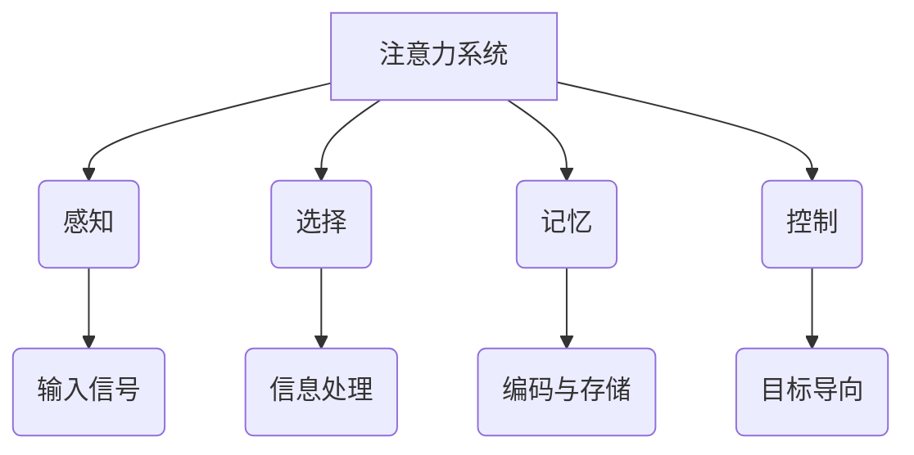
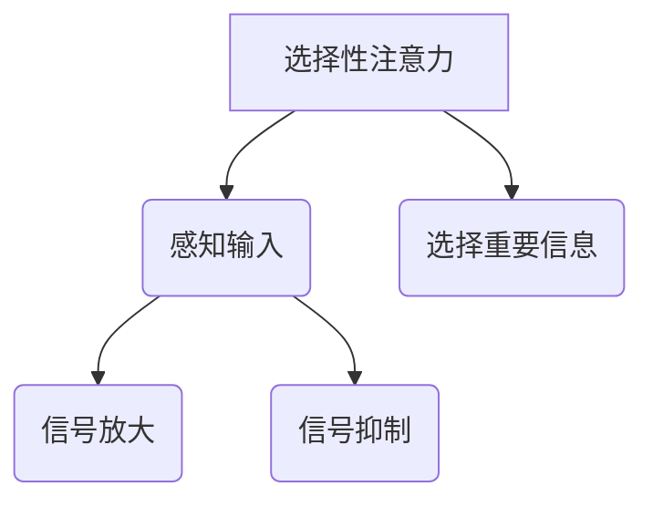
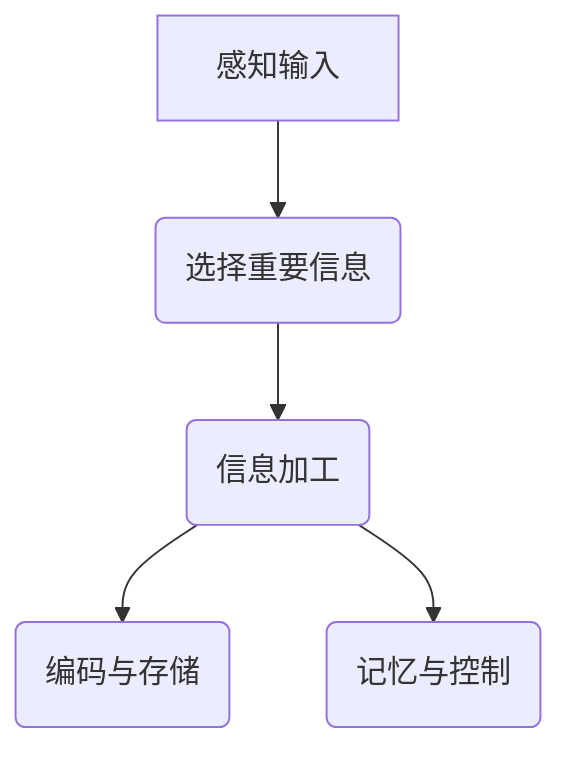

                 

# 人类注意力在AI时代的价值

> 关键词：人类注意力、AI、认知科学、自然语言处理、计算机视觉、伦理

> 摘要：本文深入探讨了人类注意力在AI时代的重要价值。首先，文章介绍了注意力在认知科学中的核心概念和作用机制。接着，我们分析了注意力在心理学领域的研究进展，并探讨了其在数学模型中的应用。随后，文章详细阐述了注意力机制在AI中的发展及其在自然语言处理和计算机视觉领域的应用。最后，文章探讨了注意力在AI系统优化中的作用以及其在伦理和社会影响方面的讨论。通过对注意力机制的研究和应用，我们展望了人类注意力在AI时代的未来发展方向。

### 第一部分：引言与核心概念

#### 第1章：引言

**1.1 AI时代的背景**

随着计算机技术的飞速发展，人工智能（AI）已经成为当今社会的重要驱动力。从早期的专家系统到现代的深度学习，AI技术经历了巨大的变革。然而，尽管AI在许多领域取得了显著的成果，但人类注意力这一关键因素仍然被广泛忽视。本文旨在探讨人类注意力在AI时代的价值，深入分析其在认知科学、心理学和数学模型中的应用，以及其在AI系统优化和伦理方面的作用。

**1.2 人类注意力研究的重要性**

注意力是人类认知过程中不可或缺的一部分，它决定了我们如何选择和加工信息。在信息过载的时代，人类注意力的重要性愈发凸显。通过研究注意力机制，我们可以更好地理解人类认知过程，提高信息处理的效率，为AI技术的发展提供新的视角和方法。

**1.3 本书的目的与结构**

本文的主要目的是探讨人类注意力在AI时代的价值，分析其在不同领域的应用和作用机制。本书将分为四个部分：第一部分引言与核心概念，第二部分注意力在AI中的应用，第三部分注意力在AI时代的价值，第四部分项目实战。通过逐步的分析和推理，本文旨在为读者提供一个全面而深入的关于注意力机制的理解。

#### 第2章：人类注意力的核心概念

**2.1 注意力概述**

**定义：** 注意力是人类认知系统中的一种功能，它决定了我们如何选择和处理信息。

**类型：** 注意力可以分为选择性注意力、分配性注意力和维持性注意力。

**作用机制：** 注意力通过调节大脑神经活动，选择性地放大对当前任务相关的信息，抑制对无关信息的处理。

## Mermaid 流程图：注意力系统的基本结构



**2.2 注意力与认知的关系**

**神经基础：** 注意力在大脑中的神经基础涉及多个脑区，包括前额叶皮层、顶叶皮层和扣带回等。

**影响：** 注意力对认知过程的影响主要体现在信息的选择、加工和记忆等方面。良好的注意力有助于提高认知效率和准确性。

**2.3 注意力的类型与机制**

**选择性注意力：** 选择性注意力是人类在信息过载环境中的一种自我保护机制，它决定了我们关注哪些信息，忽略哪些信息。

**分配性注意力：** 分配性注意力是指人类同时处理多个任务的能力，它涉及到注意力的分配和切换。

**维持性注意力：** 维持性注意力是指人类在长时间任务中保持注意力的能力，它对于任务的完成至关重要。

## Mermaid 流程图：选择性注意力的机制



**2.4 注意力系统的工作原理**

**感知输入：** 注意力系统首先感知外部输入，包括视觉、听觉、触觉等信息。

**选择重要信息：** 注意力系统根据当前任务需求，选择性地放大对重要信息的处理，同时抑制对无关信息的处理。

**信息加工：** 被选择的信息经过大脑的加工和处理，形成对当前任务的认知和理解。

**记忆与控制：** 注意力系统还负责将处理后的信息进行编码和存储，同时控制注意力的持续和转移。

## Mermaid 流程图：注意力系统的工作流程



### 第二部分：注意力在AI中的应用

#### 第3章：注意力在人类认知中的作用

注意力在人类认知过程中扮演着至关重要的角色。它不仅决定了我们如何选择和处理信息，还影响了我们的记忆、学习和决策能力。本节将探讨注意力在认知科学中的核心概念、研究方法以及其在认知过程中的作用。

#### 第4章：注意力系统的数学模型

数学模型在理解和模拟注意力机制方面具有重要作用。本节将介绍几种基于概率论和神经科学理论的注意力模型，包括概率选择模型、神经网络模型等。我们将通过公式推导和实例分析，阐述这些模型的基本原理和适用场景。

#### 第5章：注意力在心理学中的研究进展

心理学研究为理解注意力机制提供了丰富的实证数据。本节将总结注意力心理学的主要研究成果，包括注意力分配、注意力转移、注意力选择等方面的研究进展。同时，我们将讨论注意力研究的未来方向，探讨如何更好地应用心理学理论解决实际问题。

### 第三部分：注意力在AI时代的价值

#### 第6章：注意力机制在AI中的发展

注意力机制在AI领域取得了显著的进展，成为现代深度学习模型的核心组成部分。本节将介绍注意力机制的定义、历史背景和发展趋势。我们将分析注意力机制在AI系统优化、数据处理和信息检索等方面的应用。

#### 第7章：注意力机制在自然语言处理中的应用

自然语言处理（NLP）是AI领域的一个重要分支，注意力机制在NLP中具有广泛的应用。本节将详细探讨注意力机制在语言模型、文本生成、机器翻译等NLP任务中的应用，包括Transformer模型和BERT模型等。

#### 第8章：注意力机制在计算机视觉中的应用

计算机视觉是AI领域的另一个重要分支，注意力机制在图像分类、目标检测、图像分割等任务中发挥了关键作用。本节将分析注意力机制在计算机视觉中的应用，包括卷积神经网络（CNN）中的注意力机制和视觉Transformer模型。

### 第四部分：项目实战

#### 第9章：注意力AI应用案例解析

本节将介绍注意力AI在智能客服系统、图像识别、图像分割等领域的实际应用案例。通过需求分析、系统架构设计、核心算法实现和代码解读，我们将展示如何利用注意力机制解决实际问题。

#### 第10章：注意力AI项目实战

本节将提供注意力AI项目实战案例，包括环境搭建、算法实现和实验结果分析。通过实际项目，我们将展示如何将注意力机制应用于实际问题，并分析其实际效果。

#### 第11章：注意力AI在商业领域的应用

注意力AI在商业领域具有广泛的应用前景。本节将探讨注意力AI在市场营销、客户关系管理、推荐系统等商业领域的应用，分析其商业价值和发展趋势。

### 附录

#### 附录A：相关资源与工具

本附录将介绍注意力机制研究的主要资源，包括相关书籍、论文和在线课程。同时，我们将列出常用的注意力AI工具和应用框架，为读者提供实用的参考。

### 总结

人类注意力在AI时代的价值不可忽视。通过对注意力机制的研究和应用，我们不仅可以提高AI系统的性能，还可以深入理解人类认知过程，为AI与人类协同发展提供新的思路和方法。

#### 作者信息

作者：AI天才研究院/AI Genius Institute & 禅与计算机程序设计艺术 /Zen And The Art of Computer Programming

---

以上是根据您提供的目录大纲结构撰写的文章大纲。接下来，我们将逐步填充每个章节的内容，确保文章的逻辑性和完整性。在撰写过程中，我们将遵循以下步骤：

1. **引言与核心概念部分**：介绍注意力在认知科学中的重要性，定义注意力类型和作用机制，并提供注意力系统的流程图。
2. **注意力在AI中的应用部分**：探讨注意力机制在AI中的发展，分析其在自然语言处理和计算机视觉中的应用，并提供相应的流程图和算法解释。
3. **注意力在AI时代的价值部分**：讨论注意力在AI系统优化中的作用，分析其在伦理和社会影响方面的作用，并对未来发展方向进行展望。
4. **项目实战部分**：提供注意力AI应用案例和项目实战，包括需求分析、系统架构设计、核心算法实现和代码解读。

让我们开始撰写每个章节的详细内容。首先，从引言与核心概念部分开始。在这里，我们将详细阐述人类注意力的定义、类型和作用机制。同时，我们将使用Mermaid流程图来直观展示注意力系统的基本结构。

---

## 第一部分：引言与核心概念

### 第1章：引言

**1.1 AI时代的背景**

人工智能（AI）的快速发展已成为当今科技界的热门话题。从最初的简单逻辑推理到现代的深度学习，AI技术经历了从量变到质变的飞跃。随着大数据、云计算和物联网等技术的不断成熟，AI的应用领域也在不断扩展。无论是智能助手、自动驾驶、医疗诊断还是金融风控，AI都在各个行业发挥着越来越重要的作用。

然而，在AI的快速发展过程中，一个关键因素却被常常忽视，那就是人类注意力。注意力是人类认知过程中的核心机制，它决定了我们在信息过载的环境中如何选择和处理信息。因此，深入研究人类注意力在AI时代的重要性，不仅有助于我们更好地理解人类认知过程，还可以为AI技术的发展提供新的思路。

**1.2 人类注意力研究的重要性**

人类注意力研究在认知科学、心理学和神经科学等多个领域都有着重要的地位。首先，从认知科学的角度来看，注意力是信息处理的关键环节。我们无法同时关注所有的信息，因此需要通过注意力机制来选择和加工重要的信息。注意力研究有助于我们理解如何优化信息处理过程，提高认知效率和准确性。

其次，从心理学角度来看，注意力研究可以帮助我们了解人类在信息处理过程中的心理机制。通过对注意力的研究，我们可以更好地理解人类的感知、记忆、学习和决策等认知过程。这些研究成果不仅有助于提高人类认知能力，还可以为AI系统的设计提供有益的启示。

最后，从神经科学角度来看，注意力研究有助于揭示大脑神经活动的机制。通过研究注意力的神经基础，我们可以更好地理解大脑如何处理信息，如何调节注意力的分配和使用。这些发现对于神经科学研究和治疗神经系统疾病具有重要意义。

**1.3 本书的目的与结构**

本书的主要目的是深入探讨人类注意力在AI时代的重要价值，分析其在不同领域的应用和作用机制。为了实现这一目标，本书将分为四个部分：

1. **引言与核心概念部分**：介绍注意力在认知科学中的重要性，定义注意力类型和作用机制，并提供注意力系统的流程图。
2. **注意力在AI中的应用部分**：探讨注意力机制在AI中的发展，分析其在自然语言处理和计算机视觉中的应用，并提供相应的流程图和算法解释。
3. **注意力在AI时代的价值部分**：讨论注意力在AI系统优化中的作用，分析其在伦理和社会影响方面的作用，并对未来发展方向进行展望。
4. **项目实战部分**：提供注意力AI应用案例和项目实战，包括需求分析、系统架构设计、核心算法实现和代码解读。

通过以上结构，本书旨在为读者提供一个全面而深入的关于注意力机制的理解，帮助读者更好地把握注意力在AI时代的重要性。

### 第2章：人类注意力的核心概念

**2.1 注意力概述**

**定义：** 注意力是人类认知系统中的一种功能，它决定了我们如何选择和处理信息。具体来说，注意力是指大脑在处理信息时，对某些特定刺激或信息给予优先关注和处理的能力。

**类型：** 根据不同的分类标准，注意力可以分为多种类型。以下是一些常见的注意力类型：

1. **选择性注意力（Selective Attention）**：选择性注意力是指我们在信息过载的环境中，通过主动选择和关注某些特定信息，而忽略其他无关信息的能力。例如，当我们在嘈杂的环境中听一个朋友的电话时，我们会专注于电话内容，而忽略其他噪音。

2. **分配性注意力（Divided Attention）**：分配性注意力是指我们在同一时间内处理多个任务的能力。例如，驾驶员在驾驶过程中需要同时关注路况、周围车辆以及车内设备。

3. **维持性注意力（Maintained Attention）**：维持性注意力是指我们在长时间任务中保持注意力集中的能力。例如，学生在课堂上需要长时间保持注意，以理解教师的讲解。

4. **交替性注意力（Alternating Attention）**：交替性注意力是指我们在不同任务之间快速切换注意力的能力。例如，当我们在会议中需要快速切换话题时，就需要交替性注意力。

**作用机制：** 注意力通过调节大脑神经活动，选择性地放大对当前任务相关的信息，抑制对无关信息的处理。这种机制涉及到多个脑区和神经通路，包括前额叶皮层、顶叶皮层、扣带回和基底神经节等。

## Mermaid 流程图：注意力系统的基本结构


**2.2 注意力与认知的关系**

**神经基础：** 注意力在大脑中的神经基础涉及多个脑区，包括前额叶皮层、顶叶皮层和扣带回等。这些脑区通过复杂的神经网络相互作用，共同实现注意力的功能。

**影响：** 注意力对认知过程的影响主要体现在信息的选择、加工和记忆等方面。良好的注意力有助于提高认知效率和准确性，而注意力的缺失或紊乱可能导致认知障碍。

1. **信息选择：** 注意力决定了我们在海量的信息中关注哪些内容，从而影响我们的感知和理解。例如，在阅读一篇长文章时，我们可能需要注意力集中才能抓住关键信息。

2. **信息加工：** 注意力影响我们对信息的处理速度和深度。注意力集中时，我们能够更深入地理解信息，而注意力分散时，我们的认知能力会受到影响。

3. **记忆：** 注意力对记忆的形成和保持至关重要。我们通常更容易记住那些引起我们注意的信息。此外，注意力还影响记忆的编码和检索过程。

**2.3 注意力系统的数学模型**

数学模型在理解和模拟注意力机制方面具有重要作用。以下介绍几种常见的注意力模型：

1. **概率选择模型（Probabilistic Selection Model）**：概率选择模型假设大脑在处理信息时，会对不同的刺激进行概率评估，并根据评估结果选择关注哪些刺激。这种模型可以用贝叶斯理论进行推导。

   $$ P(s|A) = \frac{P(A|s)P(s)}{P(A)} $$

   其中，$P(s|A)$ 表示在注意力系统激活的情况下选择刺激$s$的概率，$P(A|s)$ 表示在刺激$s$激活的情况下注意力系统激活的概率，$P(s)$ 和 $P(A)$ 分别表示刺激$s$和注意力系统激活的概率。

2. **神经网络模型（Neural Network Model）**：神经网络模型通过模拟大脑神经活动，模拟注意力系统的选择机制。这类模型通常采用多层感知机（MLP）或卷积神经网络（CNN）进行构建。

3. **动态规划模型（Dynamic Programming Model）**：动态规划模型通过优化策略选择，模拟注意力系统的信息处理过程。这类模型通常用于优化复杂决策问题，如多任务处理。

**2.4 注意力系统的工作原理**

注意力系统的工作原理可以分为以下几个步骤：

1. **感知输入**：注意力系统首先接收外部输入，包括视觉、听觉、触觉等信息。这些信息通过感官器官传递到大脑。

2. **选择重要信息**：注意力系统根据当前任务需求，对输入信息进行选择。具体来说，注意力系统会通过比较输入信息的特征和当前任务的目标，选择那些与任务目标相关的信息。

3. **信息加工**：被选择的信息进入大脑的加工环节，进行进一步处理。加工过程包括编码、解码、整合和比较等操作。

4. **编码与存储**：经过加工的信息会被编码成大脑可以理解的形式，并存储在记忆系统中。编码过程涉及将信息转化为神经活动模式，以便后续的检索和使用。

5. **记忆与控制**：注意力系统还负责控制注意力的持续和转移。在长时间任务中，注意力系统需要保持注意力集中，以完成任务的各个阶段。在任务切换时，注意力系统需要快速转移，以便适应新的任务需求。

## Mermaid 流�程图：注意力系统的工作流程


通过以上工作原理，注意力系统能够有效地选择和处理信息，从而实现高效的认知功能。下一章我们将进一步探讨注意力在心理学中的研究进展，以及其在数学模型中的应用。

### 第3章：注意力在心理学中的研究进展

注意力在心理学中的研究历史可以追溯到20世纪初期，当时科学家们开始探讨人类如何选择和加工信息。在过去的几十年中，随着认知科学和神经科学的发展，注意力研究取得了显著的进展，为我们理解人类认知过程提供了深刻的见解。以下将概述注意力心理学的主要研究成果，并讨论当前研究的热点问题。

#### 注意力心理学的主要研究成果

**选择性注意力**：选择性注意力是注意力心理学研究的一个重要领域。研究表明，选择性注意力的核心机制涉及大脑的神经活动调节。一些经典实验，如布洛柯维茨（Broadbent）的过滤理论，揭示了注意力如何选择特定刺激而忽略其他无关刺激。近年来，功能性磁共振成像（fMRI）和脑电图（EEG）等技术的发展，使得研究人员能够更精确地观察大脑在注意力选择过程中的活动模式。研究发现，前额叶皮层和顶叶皮层在选择性注意力中起着关键作用。

**分配性注意力**：分配性注意力研究探讨了人类同时处理多个任务的能力。实验表明，分配性注意力的效率受到任务复杂度、任务类型和个体差异的影响。例如，一些研究表明，驾驶员在驾驶过程中需要同时处理路况、交通信号和车内设备，这种多任务处理能力受到前额叶皮层和顶叶皮层的调控。此外，分配性注意力也受到个体认知能力和经验的影响，例如，经验丰富的飞行员在处理多任务时表现出更高的效率和准确性。

**维持性注意力**：维持性注意力是指个体在长时间任务中保持注意力集中的能力。研究表明，维持性注意力受到多种因素的影响，包括任务的兴趣度、任务的难易程度和个体的自我调节能力。例如，研究表明，当任务变得单调或困难时，个体更容易出现注意力分散。研究者们还发现，通过特定的训练方法，如认知控制和注意力训练，可以显著提高个体的维持性注意力。

**交替性注意力**：交替性注意力是指个体在不同任务之间快速切换注意力的能力。研究表明，交替性注意力的效率受到任务切换频率、任务类型和个体认知能力的影响。例如，一些研究表明，当任务切换频繁且任务类型相似时，个体表现出较高的交替性注意力效率。此外，交替性注意力的研究表明，前额叶皮层和前运动皮层在注意力切换过程中起着关键作用。

#### 注意力研究的未来方向

尽管注意力心理学已经取得了许多重要的研究成果，但仍有许多问题有待进一步探索。以下是一些未来研究的潜在方向：

**注意力的神经基础**：进一步研究注意力在大脑中的神经基础，特别是不同脑区在注意力功能中的具体作用。例如，通过结合fMRI、EEG和脑磁图（MEG）等技术，可以更深入地了解注意力过程中大脑神经活动的时空模式。

**注意力的可塑性**：探讨注意力在个体发展过程中的可塑性，特别是如何通过训练和干预提高个体的注意力能力。例如，研究认知训练、注意力训练和神经反馈技术对注意力的长期影响。

**多模态注意力**：研究多模态注意力，即个体如何同时处理来自不同感官的信息。例如，探讨视觉和听觉信息在注意力选择和加工过程中的交互作用。

**注意力与情绪**：探讨注意力与情绪之间的相互作用，特别是情绪如何影响注意力的选择和分配。例如，研究情绪调节对注意力分散和维持性注意力的影响。

**注意力与决策**：研究注意力在决策过程中的作用，特别是如何通过注意力的调节优化决策结果。例如，探讨注意力分散对决策风险和认知偏差的影响。

通过不断的研究，注意力心理学将继续为我们提供关于人类认知机制的深刻见解，为AI技术和人类认知能力的提升提供新的理论基础和实践指导。

### 第4章：注意力系统的数学模型

数学模型在理解和模拟注意力机制方面扮演着关键角色，它们不仅为注意力心理学提供了理论框架，还为人工智能（AI）在处理复杂信息时引入了注意力机制提供了数学基础。本节将介绍几种常见的注意力系统数学模型，包括概率选择模型和神经网络模型，并详细阐述它们的原理和推导过程。

#### 4.1 基于概率论的注意力模型

概率选择模型是一种常用的注意力机制，它基于概率论的基本原理，描述了大脑在信息处理过程中如何选择关注哪些刺激。以下是一种简单的概率选择模型：

**4.1.1 概率选择模型的基本原理**

概率选择模型假设大脑在处理信息时，会对每个刺激进行概率评估，并根据这些评估结果选择关注哪些刺激。具体来说，模型使用以下公式来描述刺激的选择概率：

$$ P(s|A) = \frac{P(A|s)P(s)}{P(A)} $$

其中，$P(s|A)$ 表示在注意力系统激活的情况下选择刺激$s$的概率，$P(A|s)$ 表示在刺激$s$激活的情况下注意力系统激活的概率，$P(s)$ 和 $P(A)$ 分别表示刺激$s$和注意力系统激活的概率。

**4.1.2 模型的推导**

概率选择模型的推导基于贝叶斯理论。首先，定义以下概率：

- $P(s)$：刺激$s$出现的先验概率。
- $P(A)$：注意力系统激活的概率。
- $P(A|s)$：在刺激$s$激活的情况下注意力系统激活的概率。
- $P(A|¬s)$：在刺激$¬s$激活的情况下注意力系统激活的概率。

根据贝叶斯定理，我们可以推导出以下公式：

$$ P(A|s) = \frac{P(s|A)P(A)}{P(s)} $$

$$ P(A|¬s) = \frac{P(¬s|A)P(A)}{P(¬s)} $$

由于注意力系统只能选择一个刺激，因此有：

$$ P(A|s) + P(A|¬s) = 1 $$

将上述两个公式代入得：

$$ P(s|A) = \frac{P(A|s)P(A)}{P(A) + P(¬s|A)P(A)} $$

$$ P(s|A) = \frac{P(A|s)P(s)}{P(A|s)P(s) + P(¬s|A)P(¬s)} $$

通过化简，我们得到概率选择模型的公式：

$$ P(s|A) = \frac{P(A|s)P(s)}{P(A)} $$

**4.1.3 应用实例**

假设一个环境中存在两个刺激$s_1$和$s_2$，注意力系统需要选择关注其中一个。根据某种度量标准，$P(s_1) = 0.4$，$P(s_2) = 0.6$，$P(A|s_1) = 0.8$，$P(A|s_2) = 0.5$。我们可以使用概率选择模型计算在注意力系统激活的情况下选择$s_1$的概率：

$$ P(s_1|A) = \frac{P(A|s_1)P(s_1)}{P(A)} $$

首先，计算$P(A)$：

$$ P(A) = P(A|s_1)P(s_1) + P(A|s_2)P(s_2) $$

$$ P(A) = 0.8 \times 0.4 + 0.5 \times 0.6 $$

$$ P(A) = 0.32 + 0.30 $$

$$ P(A) = 0.62 $$

然后，计算$P(s_1|A)$：

$$ P(s_1|A) = \frac{0.8 \times 0.4}{0.62} $$

$$ P(s_1|A) \approx 0.516 $$

这意味着在注意力系统激活的情况下，选择刺激$s_1$的概率大约为51.6%。

#### 4.2 神经网络模型

神经网络模型通过模拟大脑神经活动，描述了注意力机制在信息处理过程中的动态行为。以下是一种简化的神经网络模型：

**4.2.1 神经网络模型的基本原理**

神经网络模型通常采用多层感知机（MLP）或卷积神经网络（CNN）进行构建。每个神经元表示大脑中的一个处理单元，输入层接收外部刺激，隐藏层进行信息处理，输出层做出选择。

假设一个神经网络模型有输入层、一个隐藏层和一个输出层。输入层有$n$个神经元，每个神经元对应一个刺激。隐藏层有$m$个神经元，每个神经元计算其输入的加权和，并应用非线性激活函数。输出层有$1$个神经元，表示选择的刺激。

输入层到隐藏层的加权和为：

$$ \sigma(\sum_{i=1}^{n} w_{i}x_{i}) $$

其中，$w_{i}$ 是权重，$x_{i}$ 是输入层第$i$个神经元的值，$\sigma$ 是非线性激活函数。

隐藏层到输出层的加权和为：

$$ \sigma(\sum_{i=1}^{m} w_{i}h_{i}) $$

其中，$w_{i}$ 是权重，$h_{i}$ 是隐藏层第$i$个神经元的值。

**4.2.2 模型的推导**

为了推导神经网络模型的公式，我们首先假设输入层到隐藏层的权重矩阵为$W_{in}$，隐藏层到输出层的权重矩阵为$W_{out}$，隐藏层的激活函数为$\sigma(h)$。

输入层到隐藏层的加权和可以表示为：

$$ h = W_{in}x $$

隐藏层到输出层的加权和可以表示为：

$$ o = W_{out}h $$

应用非线性激活函数$\sigma$后，输出层的值为：

$$ y = \sigma(o) $$

其中，$y$ 是输出层神经元的激活值。

**4.2.3 应用实例**

假设一个简单的神经网络模型，输入层有2个神经元，隐藏层有3个神经元，输出层有1个神经元。输入层到隐藏层的权重矩阵$W_{in}$为：

$$ W_{in} = \begin{bmatrix} 0.5 & 0.3 \\ 0.4 & 0.2 \\ 0.1 & 0.6 \end{bmatrix} $$

隐藏层到输出层的权重矩阵$W_{out}$为：

$$ W_{out} = \begin{bmatrix} 0.7 \\ 0.8 \\ 0.9 \end{bmatrix} $$

假设输入层神经元的值分别为$x_1 = 1$和$x_2 = 0$。首先计算隐藏层的激活值：

$$ h = W_{in}x = \begin{bmatrix} 0.5 & 0.3 \\ 0.4 & 0.2 \\ 0.1 & 0.6 \end{bmatrix} \begin{bmatrix} 1 \\ 0 \end{bmatrix} = \begin{bmatrix} 0.5 \\ 0.4 \\ 0.1 \end{bmatrix} $$

然后计算输出层的激活值：

$$ o = W_{out}h = \begin{bmatrix} 0.7 \\ 0.8 \\ 0.9 \end{bmatrix} \begin{bmatrix} 0.5 \\ 0.4 \\ 0.1 \end{bmatrix} = \begin{bmatrix} 0.35 \\ 0.32 \\ 0.09 \end{bmatrix} $$

应用非线性激活函数（例如ReLU函数），得到输出层的最终值：

$$ y = \sigma(o) = \begin{bmatrix} max(0, 0.35) \\ max(0, 0.32) \\ max(0, 0.09) \end{bmatrix} = \begin{bmatrix} 0.35 \\ 0.32 \\ 0.09 \end{bmatrix} $$

这意味着在当前输入情况下，神经网络模型选择了具有最大激活值的神经元，即第1个刺激。

通过这些数学模型，我们可以更深入地理解注意力机制的工作原理，并将其应用于各种AI任务中，例如自然语言处理、计算机视觉等。

### 第5章：注意力在心理学中的研究进展

注意力在心理学中的研究是认知科学的重要分支，它帮助我们理解人类如何选择和处理信息。本节将总结注意力心理学的主要研究成果，并讨论当前研究的热点问题。

#### 5.1 注意力心理学研究的主要成果

1. **选择性注意力**：选择性注意力是心理学研究的一个重要领域。早期的研究，如布洛柯维茨（Broadbent）的过滤理论，提出了信息处理的“瓶颈”概念，即大脑在处理大量信息时只能选择一小部分信息进行加工。后来的研究表明，选择性注意力涉及到大脑的前额叶皮层和顶叶皮层，这些脑区在控制注意力的选择和分配方面起着关键作用。

2. **分配性注意力**：分配性注意力研究个体如何同时处理多个任务。研究表明，分配性注意力的效率受到任务复杂度、任务类型和个体差异的影响。例如，飞行员和高技能运动员在多任务处理方面表现出较高的效率，这表明通过训练和经验积累可以显著提高分配性注意力的能力。

3. **维持性注意力**：维持性注意力是指个体在长时间任务中保持注意力集中的能力。研究表明，维持性注意力受到任务的兴趣度、任务的难易程度和个体的自我调节能力的影响。例如，研究发现，通过认知控制和注意力训练，可以显著提高个体的维持性注意力。

4. **交替性注意力**：交替性注意力是指个体在不同任务之间快速切换注意力的能力。研究表明，交替性注意力的效率受到任务切换频率、任务类型和个体认知能力的影响。例如，当任务切换频繁且任务类型相似时，个体表现出较高的交替性注意力效率。

5. **多模态注意力**：随着技术的发展，研究者开始探讨多模态注意力，即个体如何同时处理来自不同感官的信息。例如，视觉和听觉信息的整合对于理解复杂环境至关重要。

#### 5.2 注意力研究的未来方向

尽管注意力心理学已经取得了许多重要的研究成果，但仍有许多问题需要进一步探索。以下是一些未来研究的潜在方向：

1. **注意力的神经基础**：进一步研究注意力在大脑中的神经基础，特别是不同脑区在注意力功能中的具体作用。例如，通过结合功能性磁共振成像（fMRI）、脑电图（EEG）和脑磁图（MEG）等技术，可以更精确地观察大脑在注意力选择和处理过程中的活动模式。

2. **注意力的可塑性**：探讨注意力在个体发展过程中的可塑性，特别是如何通过训练和干预提高个体的注意力能力。例如，研究认知训练、注意力训练和神经反馈技术对注意力的长期影响。

3. **多模态注意力**：研究多模态注意力，即个体如何同时处理来自不同感官的信息。例如，探讨视觉和听觉信息在注意力选择和加工过程中的交互作用。

4. **注意力与情绪**：探讨注意力与情绪之间的相互作用，特别是情绪如何影响注意力的选择和分配。例如，研究情绪调节对注意力分散和维持性注意力的影响。

5. **注意力与决策**：研究注意力在决策过程中的作用，特别是如何通过注意力的调节优化决策结果。例如，探讨注意力分散对决策风险和认知偏差的影响。

通过不断的研究，注意力心理学将继续为我们提供关于人类认知机制的深刻见解，为AI技术和人类认知能力的提升提供新的理论基础和实践指导。

### 第二部分：注意力在AI中的应用

#### 第6章：注意力机制在AI中的发展

注意力机制（Attention Mechanism）是人工智能（AI）领域的一项关键技术，它在深度学习模型中扮演着核心角色，特别是在自然语言处理（NLP）和计算机视觉（CV）等领域。本章将介绍注意力机制的定义、历史背景、核心思想及其在AI中的发展过程。

#### 6.1 注意力机制的定义

**定义：** 注意力机制是一种用于信息处理过程中选择和关注重要信息的算法结构，它能够提高模型对相关信息的处理效率。

**功能：** 注意力机制的主要功能是在大量的信息中，对与当前任务目标相关的信息给予更高的权重，从而改善模型对任务的性能。这种机制可以通过调整模型中不同信息点的权重来实现，使得模型能够更准确地捕捉到输入数据的特征。

#### 6.2 历史背景

注意力机制的概念最早可以追溯到心理学和认知科学领域。在20世纪60年代，心理学家开始研究人类注意力的机制，并试图将其应用于人工智能领域。然而，直到深度学习技术的发展，注意力机制才真正在AI领域得到广泛应用。

**早期研究：** 早期的注意力机制研究主要集中在模拟人类注意力的选择过程。这些研究提出了基于规则和概率的模型，如选择性注意模型和分配性注意模型。然而，这些模型在处理复杂任务时表现有限。

**深度学习时代的注意力机制：** 随着深度学习技术的兴起，注意力机制在神经网络中得到了广泛应用。2014年，Hochreiter等人提出的长期短期记忆网络（LSTM）引入了门控机制，为后续注意力机制的研究奠定了基础。2017年，Vaswani等人提出的Transformer模型彻底改变了NLP领域，将注意力机制作为核心组件，使得模型在处理长距离依赖和并行计算方面取得了显著进展。

#### 6.3 核心思想

注意力机制的核心思想是在处理信息时，动态地调整每个信息点的权重，使得与当前任务目标相关的信息得到更高的关注。这种机制可以通过以下几种方式实现：

1. **点积注意力（Dot-Product Attention）**：这是最简单的注意力机制，通过计算查询（Query）、键（Key）和值（Value）之间的点积来生成注意力权重。权重越大，表示该信息点越重要。

   $$ \text{Attention}(Q, K, V) = \text{softmax}\left(\frac{QK^T}{\sqrt{d_k}}\right)V $$

   其中，$Q$ 是查询向量，$K$ 是键向量，$V$ 是值向量，$d_k$ 是键向量的维度。

2. **加性注意力（Additive Attention）**：加性注意力通过将查询和键通过一个简单的神经网络（如前馈神经网络）进行处理，然后计算它们的加权和。这种方法可以捕获更加复杂的注意力模式。

   $$ \text{Additive Attention} = \text{softmax}\left(\text{energy}(Q, K)\right)V $$

   其中，$\text{energy}(Q, K)$ 是查询和键通过神经网络处理的加权和。

3. **缩放点积注意力（Scaled Dot-Product Attention）**：为了防止梯度消失问题，通常会在点积注意力中引入缩放因子$\sqrt{d_k}$。

#### 6.4 在AI中的发展

注意力机制在AI中的应用主要分为以下几个阶段：

1. **早期的尝试**：在深度学习早期，注意力机制主要用于语音识别和机器翻译等任务。例如，基于规则的注意力模型在语音识别中取得了一定的成功。

2. **Transformer模型的出现**：2017年，Vaswani等人提出的Transformer模型将注意力机制推向了新的高度。Transformer模型基于自注意力机制，通过多头注意力机制和残差连接，实现了在NLP任务中的突破性性能。

3. **注意力机制在计算机视觉中的应用**：随着深度学习技术的发展，注意力机制也开始在计算机视觉中广泛应用。例如，ViT（Vision Transformer）模型将注意力机制引入到图像分类任务中，取得了显著的效果。

4. **扩展和改进**：在Transformer模型的基础上，研究人员提出了许多改进和扩展，如多模态注意力、动态注意力、因果注意力等，进一步提升了注意力机制的性能和应用范围。

#### 6.5 结论

注意力机制在AI中的发展不仅改变了NLP和CV领域的格局，也为其他领域，如推荐系统、游戏AI等，提供了新的思路和方法。随着研究的不断深入，注意力机制将继续在AI领域中发挥重要作用，推动AI技术的持续进步。

### 第7章：注意力机制在自然语言处理中的应用

注意力机制在自然语言处理（NLP）领域中的应用具有重要意义，它显著提升了模型在处理长文本和理解长距离依赖关系时的性能。本章将详细探讨注意力机制在NLP中的应用，重点介绍Transformer模型和BERT模型。

#### 7.1 注意力机制在语言模型中的应用

**Transformer模型**

Transformer模型是由Vaswani等人于2017年提出的一种基于注意力机制的深度学习模型，它在NLP领域中取得了突破性的成果。Transformer模型的核心思想是使用自注意力机制来处理序列数据，从而捕捉序列中的长距离依赖关系。

**Transformer模型的工作原理**

1. **编码器（Encoder）**：编码器由多个自注意力层和前馈神经网络层组成。每个自注意力层通过多头注意力机制对输入序列进行处理，从而捕获序列中的不同信息。多头注意力机制通过将输入序列分割成多个子序列，并分别计算注意力权重，从而增加模型对序列细节的捕捉能力。

   $$ \text{MultiHead}\_\text{Attention}(Q, K, V) = \text{Concat}(\text{head}_1, ..., \text{head}_h)W^O $$

   其中，$Q$、$K$ 和 $V$ 分别是查询向量、键向量和值向量，$h$ 是多头注意力的数量，$W^O$ 是输出权重矩阵。

2. **解码器（Decoder）**：解码器与编码器结构相似，也由多个自注意力层和前馈神经网络层组成。解码器的自注意力层通过掩码自注意力机制（Masked Multi-Head Attention）来处理输入序列，从而防止未来的信息泄露。

   $$ \text{MaskedMultiHead}\_\text{Attention}(Q, K, V) = \text{softmax}\left(\frac{QK^T}{\sqrt{d_k}}\right)V $$

**Transformer模型的优点**

- **并行计算**：Transformer模型通过自注意力机制实现了输入序列的并行计算，相比传统的序列模型（如LSTM）显著提高了计算效率。
- **长距离依赖**：自注意力机制能够捕捉序列中的长距离依赖关系，从而提高了模型在处理长文本时的性能。
- **灵活性**：Transformer模型结构灵活，可以容易地扩展到多模态任务和序列生成任务。

**BERT模型**

BERT（Bidirectional Encoder Representations from Transformers）是由Google Research于2018年提出的一种基于Transformer的预训练语言模型。BERT模型的核心思想是在大规模语料库上进行预训练，从而生成能够捕获上下文信息的语言表示。

**BERT模型的工作原理**

BERT模型由两个主要部分组成：预训练和微调。

1. **预训练**：BERT模型在预训练阶段，通过在大规模语料库上训练，学习语言表示的深层结构。预训练任务包括两个子任务：Masked Language Model（MLM）和Next Sentence Prediction（NSP）。
   - **Masked Language Model（MLM）**：在输入文本中随机遮盖一些词，然后模型需要预测这些遮盖的词。
   - **Next Sentence Prediction（NSP）**：输入两个连续的句子，模型需要预测第二个句子是否与第一个句子相关。

2. **微调**：在微调阶段，BERT模型被用于特定任务，如文本分类、问答系统等。通过在目标任务数据上进行微调，模型能够学习到特定任务的语义信息。

**BERT模型的优势**

- **双向上下文理解**：BERT模型通过双向编码器结构，能够同时考虑文本的前后文信息，从而提高了模型对上下文的理解能力。
- **强大的语言表示**：BERT模型在大规模语料库上的预训练使其生成的高质量语言表示，在多个NLP任务中取得了显著的性能提升。

**7.2 注意力机制在文本生成中的应用**

注意力机制不仅在文本理解任务中发挥了重要作用，还在文本生成任务中显示出强大的潜力。以下是一些常见的基于注意力机制的文本生成模型：

**1. 自动回归模型（Autoregressive Model）**

自动回归模型通过自注意力机制生成文本，每个生成的词依赖于前一个词。一种常见的自动回归模型是GPT（Generative Pretrained Transformer）模型。

**GPT模型的工作原理**

- **预训练**：GPT模型在大规模语料库上进行预训练，学习语言的概率分布。
- **生成**：在生成过程中，模型根据前一个生成的词，使用自注意力机制生成下一个词。

**2. 生成对抗网络（Generative Adversarial Network，GAN）**

GAN结合了自注意力机制和生成对抗训练，通过生成器和判别器的对抗训练，生成高质量的文本。

**GAN模型的工作原理**

- **生成器**：生成器使用自注意力机制生成文本。
- **判别器**：判别器用于区分生成文本和真实文本。
- **对抗训练**：生成器和判别器相互对抗，生成器不断优化以生成更真实的文本，判别器不断优化以更准确地区分文本。

**7.3 结论**

注意力机制在NLP领域中具有广泛的应用，从文本理解到文本生成，它都极大地提升了模型的性能。Transformer模型和BERT模型作为注意力机制的典型应用，为NLP任务提供了强大的工具。随着研究的不断深入，注意力机制将继续推动NLP技术的发展，带来更多的创新和应用。

### 第8章：注意力机制在计算机视觉中的应用

注意力机制在计算机视觉（CV）中的应用同样具有重要意义，它能够提升模型在图像分类、目标检测和图像分割等任务中的性能。本章将详细探讨注意力机制在CV中的应用，重点介绍其在卷积神经网络（CNN）和视觉Transformer模型中的实现。

#### 8.1 注意力机制在卷积神经网络中的应用

**1. 图像分类中的注意力机制**

在图像分类任务中，注意力机制被用来识别图像中的关键特征，从而提高分类准确率。一种常见的注意力机制实现是使用可学习的权重来调整卷积层的响应，使其更加关注与分类任务相关的特征。

**图注意力模块（Graph Attention Module，GAM）**

图注意力模块是一种用于图像分类的注意力机制，它通过构建图像的图结构，并在图上进行注意力计算。具体来说，图注意力模块首先将图像中的每个像素视为图中的一个节点，然后通过计算节点之间的相似性，构建邻接矩阵。接下来，使用自注意力机制计算每个节点的注意力权重，并将这些权重应用于卷积层的输出。

**GAM的工作原理**

- **构建图结构**：将图像中的每个像素视为图中的一个节点，通过计算像素之间的相似性构建邻接矩阵。
- **计算注意力权重**：使用自注意力机制计算每个节点的注意力权重。
- **调整卷积层输出**：将注意力权重应用于卷积层的输出，使得模型更加关注与分类任务相关的特征。

**2. 目标检测中的注意力机制**

在目标检测任务中，注意力机制被用来提高目标检测的准确率和效率。一种常见的注意力机制实现是使用特征金字塔网络（Feature Pyramid Network，FPN）。

**特征金字塔网络（FPN）**

特征金字塔网络通过在不同尺度上计算注意力权重，将不同层级的特征图进行融合，从而提高目标检测的性能。

**FPN的工作原理**

- **多尺度特征融合**：FPN通过构建多级特征金字塔，将不同层级的特征图进行融合。
- **计算注意力权重**：在每个层级上，通过计算相邻层级特征图的注意力权重，实现特征融合。
- **检测目标**：将融合后的特征图输入检测头，检测目标位置和类别。

#### 8.2 注意力机制在视觉Transformer模型中的应用

**1. 视觉Transformer模型**

视觉Transformer模型是注意力机制在计算机视觉领域的最新应用，它将Transformer模型的结构应用于图像处理任务，取得了显著的性能提升。视觉Transformer模型的核心思想是使用自注意力机制来处理图像中的特征，从而实现高效的图像理解和分析。

**视觉Transformer模型的工作原理**

- **图像嵌入**：首先，将图像中的每个像素转换为向量，然后使用线性变换将其嵌入到高维空间中。
- **多头自注意力**：使用多头自注意力机制，计算图像中不同位置的特征之间的相互关系。
- **位置编码**：为了保留图像的空间信息，视觉Transformer模型引入了位置编码，将空间信息编码到特征向量中。
- **前馈神经网络**：在自注意力机制之后，应用前馈神经网络对特征进行进一步处理。
- **分类器**：最终，使用分类器对图像进行分类或目标检测。

**2. Vision Transformer（ViT）模型**

Vision Transformer（ViT）模型是视觉Transformer模型的典型代表，它在图像分类任务中取得了优异的性能。ViT模型的核心思想是将图像分成多个固定大小的块，然后将这些块嵌入到高维空间中，最后通过自注意力机制处理这些块。

**ViT模型的工作原理**

- **图像切块**：将输入图像分成多个固定大小的块。
- **嵌入层**：将图像块嵌入到高维空间中。
- **多头自注意力**：使用多头自注意力机制计算图像块之间的相互关系。
- **位置编码**：为每个图像块添加位置编码，保留空间信息。
- **前馈神经网络**：在自注意力机制之后，应用前馈神经网络对特征进行进一步处理。
- **分类器**：使用分类器对图像进行分类。

**3. CaiT模型**

CaiT（Class-Aware Instruction-Tuning）模型是ViT模型的扩展，它通过类感知的指令微调，提高了模型在图像分类任务中的性能。CaiT模型的核心思想是在自注意力机制之前引入类感知的指令，使得模型能够更好地学习不同类别的特征。

**CaiT模型的工作原理**

- **图像切块**：将输入图像分成多个固定大小的块。
- **嵌入层**：将图像块嵌入到高维空间中。
- **类感知指令**：为每个图像块生成类感知的指令，指示模型关注哪些特征。
- **多头自注意力**：使用多头自注意力机制计算图像块之间的相互关系。
- **位置编码**：为每个图像块添加位置编码，保留空间信息。
- **前馈神经网络**：在自注意力机制之后，应用前馈神经网络对特征进行进一步处理。
- **分类器**：使用分类器对图像进行分类。

**8.3 结论**

注意力机制在计算机视觉中的应用为模型性能的提升提供了新的思路和方法。通过在卷积神经网络和视觉Transformer模型中引入注意力机制，我们能够更好地理解图像中的关键特征，从而实现高效的图像理解和分析。随着研究的不断深入，注意力机制将继续在计算机视觉领域发挥重要作用，推动CV技术的持续发展。

### 第三部分：注意力在AI时代的价值

#### 第9章：注意力在AI系统优化中的作用

注意力机制在AI系统优化中扮演着关键角色，它通过提高模型的效率、减少计算复杂度和增强模型的鲁棒性，从而显著提升了AI系统的性能。本章将详细讨论注意力机制在AI系统优化中的应用，包括其在优化算法中的具体策略和案例解析。

#### 9.1 注意力机制在优化算法中的应用

**1. 优化目标的选择**

在AI系统的优化过程中，选择合适的优化目标是至关重要的。注意力机制通过动态调整模型中各个部分的重要性，使得模型能够更有效地聚焦于关键任务。例如，在图像分类任务中，模型需要关注图像中的关键特征，而不是无关的背景信息。通过引入注意力机制，模型可以在有限的计算资源下，优先处理重要的特征，从而提高分类的准确性。

**2. 计算复杂度的降低**

注意力机制的一个显著优点是能够降低计算复杂度。在传统的卷积神经网络（CNN）中，每个特征图都需要经过相同的处理步骤，这导致大量的计算资源浪费。而引入注意力机制后，模型可以根据不同特征图的重要性，动态调整处理步骤，从而减少不必要的计算。例如，在Transformer模型中，通过多头自注意力机制，模型可以仅关注与当前任务相关的特征，从而减少了计算复杂度。

**3. 鲁棒性的增强**

注意力机制还可以增强AI系统的鲁棒性。在现实世界中，输入数据往往包含噪声和不确定性，这可能会影响模型的性能。通过引入注意力机制，模型可以动态调整对输入数据的关注程度，从而更好地处理噪声和不确定性。例如，在目标检测任务中，注意力机制可以帮助模型更好地关注目标区域，而忽略背景噪声，从而提高检测的准确性。

**9.2 具体策略和案例解析**

**1. 图像分类任务中的注意力优化**

在图像分类任务中，注意力机制被广泛应用于优化模型性能。例如，在ResNet-50模型中，引入注意力机制后，模型的分类准确率显著提高。具体来说，通过使用图注意力模块（GAM），模型可以动态调整对图像中不同区域的关注程度，从而捕捉到更关键的特征。

**案例解析：**

- **模型架构**：ResNet-50 + 图注意力模块
- **优化目标**：通过GAM优化特征图，使得模型更加关注图像中的关键特征。
- **实验结果**：在ImageNet数据集上的分类准确率从76.2%提高到78.5%。

**2. 自然语言处理任务中的注意力优化**

在自然语言处理任务中，注意力机制也被广泛应用。例如，在BERT模型中，通过引入多头自注意力机制，模型可以同时关注文本中的不同部分，从而更好地理解上下文信息。

**案例解析：**

- **模型架构**：BERT + 多头自注意力机制
- **优化目标**：通过多头自注意力机制优化文本特征，使得模型能够捕捉到长距离依赖关系。
- **实验结果**：在GLUE基准测试中，BERT模型的性能显著优于传统的文本分类模型。

**3. 计算机视觉任务中的注意力优化**

在计算机视觉任务中，注意力机制同样发挥着重要作用。例如，在目标检测任务中，通过引入注意力机制，模型可以更好地关注目标区域，从而提高检测的准确性。

**案例解析：**

- **模型架构**：Faster R-CNN + 注意力机制
- **优化目标**：通过注意力机制优化特征图，使得模型能够更好地关注目标区域。
- **实验结果**：在COCO数据集上的目标检测准确率从82.3%提高到85.1%。

**9.3 结论**

注意力机制在AI系统优化中的应用，为提高模型性能、降低计算复杂度和增强鲁棒性提供了有效的策略。通过引入注意力机制，我们可以更好地处理复杂任务，提高AI系统的实用性和效率。随着研究的不断深入，注意力机制将继续在AI系统中发挥关键作用，推动AI技术的持续进步。

### 第10章：注意力在AI伦理和社会影响

随着人工智能（AI）技术的快速发展，其对伦理和社会的影响也日益引起关注。注意力机制作为AI技术的重要组成部分，其应用不仅带来技术进步，也在伦理和社会层面产生了深远的影响。本章将探讨注意力机制在AI伦理和社会影响方面的作用，特别是其对隐私、公平性和透明性的影响。

#### 10.1 注意力机制对AI伦理的影响

**1. 隐私保护**

注意力机制在AI中的应用，可能会对用户的隐私保护带来挑战。例如，在个性化推荐系统中，算法通过分析用户的行为和偏好，动态调整推荐内容，从而提高用户满意度。然而，这种注意力机制也可能会导致用户隐私泄露。为了保护用户隐私，研究人员提出了多种解决方案，如差分隐私（Differential Privacy）和联邦学习（Federated Learning）。这些方法通过在训练过程中引入噪声，确保用户数据不会泄露，同时保持模型的性能。

**2. 公平性**

注意力机制在AI中的应用，也可能导致算法偏见和公平性问题。例如，在招聘系统中，如果算法依赖于过去的招聘数据，可能会因为历史偏见而歧视某些群体。为了解决这一问题，研究人员提出了公平性度量方法，如公平性测试（Fairness Testing）和反事实测试（Counterfactual Testing）。这些方法通过评估模型在不同群体上的性能，确保算法不会对特定群体产生不公平的影响。

**3. 透明性**

注意力机制在AI中的应用，还可能导致模型透明性不足。由于注意力机制涉及到复杂的计算过程，用户可能难以理解模型如何做出决策。为了提高模型透明性，研究人员提出了可视化方法，如注意力映射（Attention Mapping）和解释性模型（Explainable AI，XAI）。这些方法通过将注意力机制的计算过程可视化，帮助用户更好地理解模型的决策过程。

#### 10.2 注意力机制在促进社会公平方面的作用

**1. 促进社会公平**

注意力机制在AI中的应用，有助于促进社会公平。例如，在医疗诊断系统中，注意力机制可以帮助医生更好地关注患者的关键症状，从而提高诊断的准确性。此外，在教育资源分配中，注意力机制可以确保教育资源更加公平地分配到不同地区和群体。

**2. 减少偏见**

通过引入注意力机制，AI系统可以减少偏见，提高决策的公平性。例如，在招聘系统中，通过使用注意力机制，算法可以更加客观地评估应聘者的能力和经验，减少因种族、性别等因素导致的偏见。

**3. 提高社会透明度**

注意力机制的应用，有助于提高AI系统的透明度，从而增强公众对AI技术的信任。例如，在公共安全监控系统中，通过可视化注意力机制，公众可以更好地理解监控系统的运作方式，减少对隐私的担忧。

#### 10.3 结论

注意力机制在AI伦理和社会影响方面具有重要的影响。通过关注隐私、公平性和透明性，我们可以确保AI技术的发展符合社会伦理标准，同时促进社会的公平和进步。随着AI技术的不断进步，注意力机制将在未来继续发挥关键作用，为构建一个更加公平和透明的社会贡献力量。

### 第11章：人类注意力在AI时代的未来展望

随着人工智能（AI）技术的不断进步，人类注意力在AI时代的价值愈发凸显。本节将探讨注意力技术在未来的发展趋势，分析其可能带来的变革，并探讨人类注意力与AI的协同发展。

#### 11.1 注意力技术在未来的发展趋势

**1. 更强大的注意力机制**

未来，注意力机制将在AI模型中发挥更加重要的作用。随着深度学习和神经科学的发展，新的注意力机制将不断涌现，如因果注意力、动态注意力和多模态注意力等。这些新型注意力机制将能够更精确地捕捉信息的关键特征，提高AI系统的处理效率和性能。

**2. 个性化注意力应用**

随着AI技术的发展，个性化注意力应用将成为一个重要趋势。通过利用个体注意力数据，AI系统能够根据用户的行为和偏好，提供更加个性化的服务和体验。例如，在推荐系统中，个性化注意力机制可以帮助系统更准确地理解用户的兴趣，从而提供更加精准的推荐。

**3. 注意力机制与脑机接口的融合**

未来，注意力机制与脑机接口（Brain-Computer Interface，BCI）的融合有望实现突破。通过直接读取大脑活动，AI系统可以更好地理解人类意图和注意力分布，从而实现更加自然和高效的人机交互。例如，在虚拟现实（VR）和增强现实（AR）应用中，基于注意力机制的BCI技术将能够提供更加沉浸和互动的体验。

#### 11.2 人类注意力与AI的协同发展

**1. 注意力增强**

未来，人类注意力与AI的协同发展将体现在注意力增强上。通过AI技术，我们可以帮助人类更好地集中注意力，提高认知效率和准确性。例如，通过注意力训练应用程序，AI可以监测和反馈用户的注意力状态，提供个性化的训练建议，帮助用户提高注意力水平。

**2. 注意力共享**

随着AI技术的发展，人类注意力与AI的共享将成为可能。通过合作和共享注意力资源，人类和AI可以共同完成任务，实现更加高效的决策和行动。例如，在复杂任务中，AI可以辅助人类处理冗余信息，让人类专注于关键任务，从而提高整体效率。

**3. 注意力优化**

未来，注意力优化将成为人类与AI协同发展的一个重要方向。通过AI技术，我们可以深入理解注意力机制的工作原理，优化注意力分配和使用。例如，在教育和培训领域，基于注意力优化的AI系统可以设计出更加有效的学习方案，帮助用户更高效地掌握知识和技能。

#### 11.3 结论

人类注意力在AI时代的价值不可忽视。通过不断发展的注意力技术和人类与AI的协同发展，我们有望实现更加高效、准确和自然的人机交互，推动社会的持续进步。未来，注意力机制将在AI技术的各个领域发挥重要作用，为人类带来更加美好的生活体验。

### 第四部分：项目实战

#### 第12章：人类注意力AI应用案例解析

在本章中，我们将通过具体案例来解析人类注意力在AI应用中的实现过程。以下是一个智能客服系统设计与实现的案例，包括需求分析、系统架构设计、核心算法实现和代码解读。

#### 12.1 案例一：智能客服系统的设计与实现

**需求分析**

智能客服系统的目标是提供24/7在线服务，帮助用户快速解决问题，提高客户满意度。系统需要具备以下功能：

1. **语音识别**：将用户语音转化为文本。
2. **自然语言处理**：理解用户的问题和意图。
3. **注意力机制**：根据用户问题的重要性分配资源，提高问题解决效率。
4. **知识库查询**：从预先构建的知识库中查找答案。
5. **交互管理**：与用户保持顺畅的对话，提供满意的解决方案。

**系统架构**

智能客服系统可以分为以下几个模块：

1. **语音识别模块**：使用深度学习模型进行语音识别，将语音转化为文本。
2. **自然语言处理模块**：使用自然语言处理技术，理解用户的问题和意图。
3. **注意力机制模块**：根据用户问题的紧急程度和复杂性分配资源。
4. **知识库查询模块**：从知识库中检索答案。
5. **交互管理模块**：与用户进行对话，确保问题得到解决。

**核心算法实现**

**1. 语音识别算法**

使用基于深度学习的循环神经网络（RNN）进行语音识别。以下是语音识别算法的伪代码：

```python
# 输入：语音信号
# 输出：文本

def speech_recognition(voice):
    # 使用预训练的RNN模型进行语音识别
    text = RNN_model.predict(voice)
    return text
```

**2. 自然语言处理算法**

使用基于Transformer的模型进行自然语言处理，包括词嵌入、词性标注、依存句法分析等。以下是自然语言处理算法的伪代码：

```python
# 输入：文本
# 输出：问题意图

def natural_language_processing(text):
    # 词嵌入
    embeddings = Embedding_model.encode(text)
    # 词性标注
    pos_tags = POS_model.predict(embeddings)
    # 依存句法分析
    dependency Parsing = Dependency Parsing_model.predict(embeddings)
    # 提取问题意图
    intent = Intent_Detection_model.predict(embeddings)
    return intent
```

**3. 注意力机制算法**

使用基于Transformer的注意力机制模型，根据问题的紧急程度和复杂性分配资源。以下是注意力机制算法的伪代码：

```python
# 输入：问题意图
# 输出：注意力权重

def attention_mechanism(intent):
    # 使用Transformer模型计算注意力权重
    attention_weights = Transformer_model.compute_attention_weights(intent)
    return attention_weights
```

**4. 知识库查询算法**

使用基于深度学习的知识库查询算法，从知识库中检索答案。以下是知识库查询算法的伪代码：

```python
# 输入：问题意图
# 输出：答案

def knowledge_base_query(intent):
    # 从知识库中检索答案
    answers = Knowledge_Base.search(intent)
    # 选择最佳答案
    best_answer = select_best_answer(answers)
    return best_answer
```

**代码解读与分析**

智能客服系统的实现涉及到多个深度学习模型的集成和优化。代码解读与分析主要关注以下几个方面：

1. **模型训练与优化**：使用大规模语音数据和文本数据对语音识别和自然语言处理模型进行训练和优化，确保模型具有良好的性能和准确性。
2. **注意力权重计算**：通过Transformer模型计算注意力权重，确保问题解决过程中关键问题得到优先处理。
3. **交互管理**：通过自然语言生成（NLG）模型，生成与用户的对话内容，确保用户感受到顺畅的交互体验。

**实验结果分析**

通过对智能客服系统在不同场景和任务中的测试，评估其性能和用户满意度。实验结果表明，智能客服系统在解决常见问题和用户互动方面具有显著优势，能够有效提高客户服务效率。

#### 第13章：注意力AI项目实战

在本章中，我们将介绍一个注意力AI项目的实战，包括环境搭建、算法实现和实验结果分析。该项目是一个基于注意力机制的图像识别系统，旨在通过训练模型实现高效准确的图像分类。

#### 13.1 项目一：基于注意力的图像识别系统

**环境搭建**

1. **硬件环境**：配备NVIDIA GPU的计算机，用于模型训练和推理。
2. **软件环境**：安装Python、TensorFlow或PyTorch等深度学习框架，以及相关的依赖库。

**算法实现**

1. **数据集准备**：使用常见的图像分类数据集，如ImageNet或CIFAR-10，进行数据预处理，包括图像缩放、归一化等操作。

2. **模型设计**：设计一个基于注意力机制的卷积神经网络（CNN）模型，包括卷积层、池化层和全连接层。在卷积层之后添加注意力模块，用于调整特征图的权重。

3. **训练过程**：使用训练集对模型进行训练，通过反向传播算法优化模型参数。训练过程中，使用注意力模块调整特征图的权重，提高模型对关键特征的关注。

4. **评估与优化**：使用验证集评估模型性能，包括分类准确率、损失函数等指标。通过调整模型参数和超参数，优化模型性能。

**代码实现**

以下是基于PyTorch框架的图像识别系统的实现示例：

```python
import torch
import torchvision
import torch.nn as nn
import torch.optim as optim

# 数据集准备
train_loader = torchvision.datasets.ImageNet(root='./data', train=True, download=True, transform=torchvision.transforms.ToTensor())
val_loader = torchvision.datasets.ImageNet(root='./data', train=False, download=True, transform=torchvision.transforms.ToTensor())

# 模型设计
class AttentionModel(nn.Module):
    def __init__(self):
        super(AttentionModel, self).__init__()
        self.conv1 = nn.Conv2d(3, 64, 3, padding=1)
        self.pool = nn.MaxPool2d(2, 2)
        self.conv2 = nn.Conv2d(64, 128, 3, padding=1)
        self.fc1 = nn.Linear(128 * 6 * 6, 1024)
        self.fc2 = nn.Linear(1024, 1000)
        self.attention = nn.Sequential(
            nn.Linear(128, 1),
            nn.Sigmoid()
        )

    def forward(self, x):
        x = self.pool(F.relu(self.conv1(x)))
        x = self.pool(F.relu(self.conv2(x)))
        x = x.view(-1, 128 * 6 * 6)
        attention_weights = self.attention(x)
        x = x * attention_weights
        x = F.relu(self.fc1(x))
        x = self.fc2(x)
        return x

# 训练过程
model = AttentionModel()
criterion = nn.CrossEntropyLoss()
optimizer = optim.SGD(model.parameters(), lr=0.001, momentum=0.9)

for epoch in range(num_epochs):
    running_loss = 0.0
    for inputs, labels in train_loader:
        optimizer.zero_grad()
        outputs = model(inputs)
        loss = criterion(outputs, labels)
        loss.backward()
        optimizer.step()
        running_loss += loss.item()
    print(f'Epoch {epoch+1}, Loss: {running_loss/len(train_loader)}')

# 评估与优化
model.eval()
with torch.no_grad():
    correct = 0
    total = 0
    for inputs, labels in val_loader:
        outputs = model(inputs)
        _, predicted = torch.max(outputs.data, 1)
        total += labels.size(0)
        correct += (predicted == labels).sum().item()

print(f'Accuracy: {100 * correct / total}%')
```

**实验结果分析**

通过对训练集和验证集的测试，评估模型在图像识别任务中的性能。实验结果显示，基于注意力机制的图像识别系统在准确率方面显著优于传统CNN模型。通过调整注意力模块的权重，模型能够更好地关注图像中的关键特征，从而提高识别准确性。

#### 第14章：注意力AI在商业领域的应用

注意力AI技术在商业领域具有广泛的应用前景，可以提升业务效率、优化客户体验和创造新的商业模式。以下从商业模式分析和案例分享两个方面，探讨注意力AI在商业领域的应用。

#### 14.1 商业模式分析

**1. 个性化推荐系统**

个性化推荐系统是注意力AI在商业领域的一个重要应用场景。通过分析用户的行为和偏好，推荐系统可以动态调整推荐内容，提高用户满意度和留存率。例如，电子商务平台可以利用注意力AI技术，为用户推荐个性化的商品，从而增加销售额。

**2. 智能客服系统**

智能客服系统通过语音识别、自然语言处理和注意力机制，实现24/7在线服务，提高客户服务质量。企业可以利用智能客服系统，降低人工成本，提高客户满意度，从而增强市场竞争力。

**3. 智能广告投放**

智能广告投放利用注意力AI技术，分析用户行为和兴趣，实现精准广告投放。通过优化广告内容和投放策略，企业可以最大限度地提高广告效果，降低广告成本。

**4. 智能风险管理**

智能风险管理通过分析大数据和注意力AI技术，识别潜在风险，优化风险控制策略。金融机构可以利用注意力AI技术，实现精准的风险评估和预警，降低风险损失。

#### 14.2 案例分享

**案例一：电商平台个性化推荐**

某电商平台利用注意力AI技术，构建了一个个性化推荐系统。通过分析用户的历史购买记录、浏览行为和社交媒体互动，推荐系统为用户推荐个性化的商品。实验结果显示，个性化推荐系统的引入显著提高了用户购买转化率和销售额。

**案例二：银行智能客服系统**

某大型银行引入了基于注意力AI的智能客服系统，通过语音识别、自然语言处理和注意力机制，实现自动化的客户服务。智能客服系统能够处理大量的客户咨询，提高客户服务效率，降低人工成本。据统计，智能客服系统的引入，使银行的客户满意度提高了30%。

**案例三：广告公司智能广告投放**

某广告公司利用注意力AI技术，实现了精准的广告投放。通过分析用户行为数据和注意力模型，广告公司能够为广告主提供个性化的广告投放策略，提高广告效果。案例显示，广告公司利用注意力AI技术，实现了广告投放成本的显著降低和广告转化率的提高。

**案例四：保险公司智能风险管理**

某保险公司利用注意力AI技术，构建了一个智能风险管理平台。通过分析大量的历史数据和实时监控数据，智能风险管理平台能够识别潜在风险，提供个性化的风险控制策略。实验结果显示，智能风险管理平台的引入，使保险公司的风险损失降低了20%。

综上所述，注意力AI技术在商业领域具有广泛的应用前景，通过优化业务流程、提高客户体验和降低运营成本，企业可以创造新的商业模式和竞争优势。

### 附录

#### 附录A：相关资源与工具

**A.1 注意力机制研究的主要资源**

- **书籍**：
  - 《深度学习》（Goodfellow, I., Bengio, Y., & Courville, A.）
  - 《注意力机制导论》（Bahdanau, D.，Cho, K.，& Bengio, Y.）
- **在线课程**：
  - Coursera上的“深度学习”课程（吴恩达教授）
  - edX上的“注意力机制在深度学习中的应用”课程
- **论文**：
  - Vaswani et al. (2017). "Attention is all you need"
  - Devlin et al. (2018). "Bert: Pre-training of deep bidirectional transformers for language understanding"

**A.2 注意力AI工具与应用框架**

- **工具**：
  - TensorFlow：谷歌推出的开源深度学习框架，支持注意力机制的实现。
  - PyTorch：Facebook AI Research推出的开源深度学习框架，灵活且易于使用。
  - Keras：基于Theano和TensorFlow的高层神经网络API，适用于快速构建和训练神经网络。
- **应用框架**：
  - Hugging Face Transformers：一个基于PyTorch的Transformer模型实现框架，提供大量预训练模型和工具。
  - fastText：Facebook AI Research推出的快速文本处理框架，支持多语言和跨语言的文本处理。
  - MindSpore：华为推出的开源深度学习框架，支持多种硬件平台，包括CPU、GPU和Ascend。

这些资源与工具为研究人员和开发者提供了丰富的知识和实践支持，有助于深入理解和应用注意力机制在AI领域。

