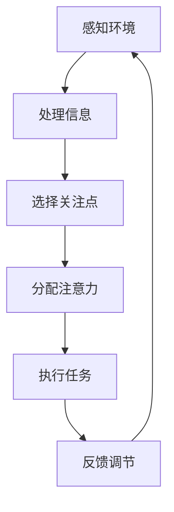
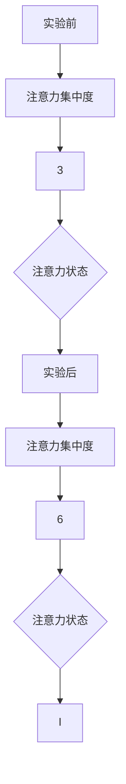

                 

### 人类注意力增强：提升专注力和注意力在教育中的策略与方法

> **关键词：注意力增强，教育，专注力，教学策略，技术应用，未来趋势**

> **摘要：本文探讨了人类注意力增强的理论基础、教育中的注意力问题、注意力增强的方法与策略，以及注意力增强在教育场景中的实践应用和未来发展趋势。文章结合心理学、教育学、计算机科学等多学科视角，分析了注意力增强在教育中的重要性，并提出了具体可行的注意力增强实践策略，旨在为教育工作者和学生提供科学有效的指导。**

---

#### 目录大纲

### 《人类注意力增强：提升专注力和注意力在教育中的策略与方法》

## 第一部分：基础理论

### 第1章：注意力理论概述
#### 1.1 注意力的基本概念
#### 1.2 注意力模型与机制
#### 1.3 注意力障碍与失调

### 第2章：教育中的注意力问题
#### 2.1 教育注意力问题现状
#### 2.2 注意力问题的影响因素
#### 2.3 注意力问题的诊断方法

### 第3章：注意力增强的方法与策略
#### 3.1 教学策略调整
#### 3.2 技术辅助手段
#### 3.3 环境因素调整

## 第二部分：实践应用

### 第4章：教育场景下的注意力增强
#### 4.1 在课堂中的应用
#### 4.2 在线上教学中的应用
#### 4.3 在个性化学习中的应用

### 第5章：注意力增强项目实例
#### 5.1 注意力增强教学案例
#### 5.2 注意力增强技术应用案例
#### 5.3 教育场景下的注意力增强实验

### 第6章：注意力增强在特殊教育中的应用
#### 6.1 特殊教育中的注意力问题
#### 6.2 注意力增强策略在特殊教育中的应用
#### 6.3 注意力增强技术在特殊教育中的实践效果

### 第7章：注意力增强的未来发展趋势
#### 7.1 技术进步与注意力增强
#### 7.2 教育理念变革对注意力增强的影响
#### 7.3 注意力增强研究与实践的未来方向

## 第三部分：研究方法与评估

### 第8章：注意力增强研究方法
#### 8.1 实验设计原则
#### 8.2 数据收集与处理
#### 8.3 注意力增强效果评估指标

### 第9章：注意力增强实践评估
#### 9.1 教学效果评估
#### 9.2 学生满意度调查
#### 9.3 注意力增强实践效果分析

### 第10章：结论与展望
#### 10.1 研究结论总结
#### 10.2 研究不足与挑战
#### 10.3 未来研究方向与建议

### 附录
#### 附录 A：注意力增强相关工具与资源
#### 附录 B：注意力增强研究文献精选
#### 附录 C：案例研究数据表格与图表

---

#### Mermaid 流程图



#### 核心算法原理讲解

```plaintext
算法名称：注意力分配模型（Attention Allocation Model）

输入：
- X：外部环境感知信息
- W：权重矩阵

输出：
- Z：注意力分配结果

伪代码：

function AttentionAllocationModel(X, W):
    for each i in range(len(X)):
        for each j in range(len(W)):
            Z[i][j] = sigmoid(W[j] * X[i])
    return Z

其中，sigmoid函数为：
sigmoid(x) = 1 / (1 + e^(-x))
```

```latex
\text{注意力分配} = \text{sigmoid}(\sum_{i=1}^{n} w_i x_i)
```

#### 项目实战案例

```plaintext
案例：基于眼动追踪的学生注意力监测系统

环境搭建：
- 开发环境：Python 3.8
- 工具： eyelink 5000 眼动仪，OpenCV

源代码实现：
python
import cv2
import numpy as np

# 初始化眼动仪
eye_tracker = cv2.EyeLink()
eye_tracker.open()

# 开始记录数据
eye_tracker.startRecording()

# 捕获眼动图像
frame = eye_tracker.getImage()

# 处理图像，检测注视点
centroid = detect_gaze(frame)

# 计算注意力得分
attention_score = calculate_attention(centroid)

# 显示注意力得分
print("Attention Score:", attention_score)

# 结束记录数据
eye_tracker.stopRecording()
eye_tracker.close()

代码解读：
- 初始化并开启眼动仪，开始记录数据。
- 捕获实时眼动图像，处理图像以检测注视点。
- 根据注视点位置计算注意力得分。
- 显示注意力得分，并结束记录数据。

```

在接下来的章节中，我们将深入探讨注意力理论、教育中的注意力问题、注意力增强的方法与策略，以及注意力增强在教育场景中的实践应用和未来发展趋势。我们还将结合心理学、教育学、计算机科学等多学科视角，分析注意力增强在教育中的重要性，并探讨如何通过具体可行的策略提升学生的专注力和注意力。

### 第1章：注意力理论概述

#### 1.1 注意力的基本概念

注意力（Attention）是人类认知系统中一个关键的概念，它指的是心理活动对特定刺激的指向和集中。换句话说，注意力是心理资源的一种分配方式，它使我们能够从众多刺激中挑选出某些信息进行加工处理。注意力不仅影响我们的感知、记忆和思维，还对行为决策产生重要影响。

在心理学中，注意力通常被分为几种类型：

- **选择性注意力**：指在众多刺激中选择某些刺激进行加工，而忽略其他刺激。
- **分配性注意力**：指在同时处理多个任务时的能力，例如开车时还能听到车内的对话。
- **持续性注意力**：指保持注意力的稳定性和持久性，如长时间专注于学习任务。
- **反应性注意力**：指对外界刺激的反应，如听到突然的声响时立即转头。

#### 1.2 注意力模型与机制

注意力模型是心理学家用来描述注意力如何工作的理论框架。以下是一些主要的注意力模型：

- **过滤模型**：认为注意力像一个过滤网，仅允许一部分信息通过，而其他信息则被忽略。
- **瓶颈模型**：认为注意力在信息加工过程中扮演了一个瓶颈角色，决定了信息流通过的能力。
- **注意网络模型**：认为注意力涉及多个神经网络区域，通过不同区域之间的交互实现信息的选取和加工。
- **多阶段模型**：认为注意力过程分为多个阶段，每个阶段都有特定的功能和机制。

大脑中的注意力机制主要涉及以下几个区域：

- **前额叶皮质**：与高级认知功能相关，如计划、决策和注意力控制。
- **顶叶皮质**：与空间注意力和视觉处理相关。
- **颞叶皮质**：与听觉处理和记忆相关。
- **基底神经节**：与运动控制和习惯形成相关。

这些区域通过复杂的神经网络连接，协同工作以实现注意力的功能。

#### 1.3 注意力障碍与失调

注意力障碍是一种常见的认知障碍，主要表现为注意力不集中、容易分心、无法持久关注等。注意力障碍可能与多种因素相关，包括遗传、环境、脑损伤等。

- **多动症（ADHD）**：是一种常见的注意力障碍，表现为注意力难以集中、过度活跃和冲动行为。
- **焦虑症**：焦虑状态下的人往往难以集中注意力，因为大脑中的压力荷尔蒙会干扰认知过程。
- **抑郁症**：抑郁症患者可能因为情绪低落而难以维持注意力。
- **脑损伤**：脑损伤，特别是前额叶皮质损伤，可能导致注意力功能受损。

注意力障碍不仅影响个体的日常生活，还可能影响学习和工作表现。因此，识别和干预注意力障碍具有重要意义。

在本章中，我们概述了注意力的基本概念、主要模型和机制，以及注意力障碍与失调。这些知识为后续章节中讨论教育中的注意力问题、注意力增强的方法与策略奠定了理论基础。

---

在接下来的章节中，我们将继续探讨教育中的注意力问题，分析注意力问题的影响因素，并介绍注意力问题的诊断方法。通过这些探讨，我们将为提出有效的注意力增强策略提供依据。敬请期待。

### 第2章：教育中的注意力问题

#### 2.1 教育注意力问题现状

在教育领域，注意力问题是广泛存在的，且在不同教育阶段和环境中表现各异。以下是教育注意力问题的现状：

- **小学阶段**：小学生由于年龄较小，自控能力较弱，容易受到外界干扰，导致注意力难以集中。研究表明，约20%的小学生存在注意力缺陷问题。
- **中学阶段**：中学生面临的学习任务更加复杂，课程内容更加深入，这使得他们在课堂上更容易分心。同时，中学生正处于青春期，心理和生理变化显著，进一步影响了他们的注意力集中。
- **大学阶段**：大学生在课堂上也常常面临注意力分散的问题，特别是在大班授课或理论课程中。此外，互联网和智能手机等现代科技产品对大学生的注意力产生了巨大影响，使他们在学习过程中难以保持专注。

注意力问题不仅影响学生的学业成绩，还可能导致心理健康问题，如焦虑、抑郁等。因此，解决教育中的注意力问题是当前教育领域面临的重要挑战之一。

#### 2.2 注意力问题的影响因素

注意力问题的影响因素是多方面的，包括个体因素、环境因素和教学因素等。

- **个体因素**：个体的心理素质、认知能力、情感状态等都会影响注意力。例如，焦虑、抑郁等负面情绪会使个体难以集中注意力。此外，个体的注意力障碍，如多动症（ADHD），也会严重影响其在学习过程中的表现。
- **环境因素**：学习环境对学生的注意力有着重要影响。例如，教室的布置、噪音水平、光线等因素都会影响学生的专注度。研究表明，一个安静、整洁、明亮的学习环境有助于提高学生的注意力。
- **教学因素**：教学方法、课程设计和教学内容等也会影响学生的注意力。传统的讲授式教学方法可能因为内容单一、互动性差而使学生容易分心。而探究式学习、互动式教学等方法则可以更好地吸引学生的注意力，提高其参与度。

#### 2.3 注意力问题的诊断方法

准确诊断注意力问题是解决注意力问题的关键。以下是几种常见的注意力问题诊断方法：

- **观察法**：通过观察学生在课堂上的表现，如是否容易分心、注意力持续时间等，来判断其是否存在注意力问题。
- **问卷调查法**：通过设计专门的问卷，收集学生对自身注意力问题的自我评估，如使用注意力缺陷评价量表（ADHD-RS）等。
- **心理测评法**：使用专业的心理测评工具，如注意力测验（TAT）、注意力持续测验（APT）等，评估学生的注意力水平。
- **脑电图（EEG）检测**：通过记录大脑的电活动，分析学生注意力状态下的脑电波特征，以诊断注意力问题。

通过这些诊断方法，教育工作者可以准确识别学生的注意力问题，并采取相应的干预措施。例如，对于存在注意力障碍的学生，可以提供个性化的学习支持，如合理调整学习任务、使用注意力训练软件等。

在本章中，我们讨论了教育中的注意力问题现状、影响因素以及诊断方法。在下一章，我们将探讨如何通过注意力增强的方法与策略来解决教育中的注意力问题。敬请期待。

### 第3章：注意力增强的方法与策略

#### 3.1 教学策略调整

教学策略的调整是提升学生注意力的关键步骤。以下是一些有效的教学策略：

- **互动式教学**：通过提问、讨论、小组合作等方式增加课堂互动，让学生参与到教学过程中，从而提高他们的注意力。
- **任务导向教学**：设定明确的任务目标，引导学生有目的地学习，避免在学习过程中因目标不明确而分心。
- **多样化教学方式**：使用视频、图表、游戏等多种教学手段，使教学内容更加生动有趣，从而吸引学生的注意力。
- **定期休息**：在长时间的学习过程中，设置短暂的休息时间，让学生有意识地转移注意力，避免疲劳导致的注意力下降。

#### 3.2 技术辅助手段

现代科技为提升学生注意力提供了多种技术辅助手段，以下是一些常用的技术：

- **注意力监测工具**：利用眼动追踪、脑电图等设备实时监测学生的注意力状态，从而及时调整教学策略。
- **注意力训练软件**：通过设计游戏化的训练任务，如专注力训练、记忆训练等，帮助学生提高注意力。
- **学习管理系统（LMS）**：利用学习管理系统，为教师和学生提供个性化的学习资源和学习路径，提高学习效率和注意力。
- **智能提醒工具**：通过智能手机或智能穿戴设备，设置定时提醒，帮助学生按时完成学习任务，培养良好的学习习惯。

#### 3.3 环境因素调整

环境因素对学生的注意力具有重要影响，以下是一些环境调整策略：

- **优化教室布置**：合理布置教室，减少干扰因素，如关闭不必要的电子设备，保持教室整洁和安静。
- **调整光线和通风**：良好的光线和通风条件有助于学生保持清醒和专注。
- **定时更换场景**：通过定期更换学习场景，如教室、图书馆等，可以减少学生的疲劳感，提高注意力。
- **个人学习空间**：为每位学生提供一个安静、舒适的个人学习空间，有助于提高其注意力。

通过教学策略的调整、技术辅助手段的应用以及环境因素的优化，我们可以有效地增强学生的注意力，从而提高学习效果。在下一章，我们将探讨注意力增强在教育场景中的具体应用，以及通过项目实例展示注意力增强策略的实际效果。敬请期待。

### 第4章：教育场景下的注意力增强

#### 4.1 在课堂中的应用

在课堂教学中，注意力增强策略的应用至关重要。以下是一些具体的应用方法：

- **课前准备**：教师应在课前准备充分，明确教学目标和重点，设计富有吸引力的教学内容，以吸引学生的注意力。
- **课堂互动**：通过提问、小组讨论、角色扮演等方式增加课堂互动，使学生在参与中保持注意力集中。
- **多样化教学**：使用视频、音频、动画等多媒体手段，使课堂内容更加生动有趣，从而吸引学生的注意力。
- **定期反馈**：在课堂过程中，教师应适时给予学生反馈，帮助学生了解自己的学习进度，从而提高其注意力。

#### 4.2 在线上教学中的应用

随着线上教育的普及，注意力增强策略在远程教学中的应用也变得尤为重要。以下是一些具体的应用方法：

- **实时互动**：通过直播、视频会议等方式，增加教师与学生的实时互动，提高学生的参与度和注意力。
- **学习任务管理**：利用在线学习管理系统（LMS），为学生分配具体的任务和目标，帮助学生保持注意力。
- **虚拟现实（VR）应用**：通过VR技术，为学生提供沉浸式的学习体验，从而提高其注意力。
- **在线资源推荐**：根据学生的学习兴趣和进度，推荐合适的学习资源，使学生能够持续关注学习内容。

#### 4.3 在个性化学习中的应用

个性化学习旨在根据每个学生的特点和需求，提供定制化的学习体验，从而提高其学习效果和注意力。以下是一些具体的应用方法：

- **学习路径设计**：根据学生的兴趣、能力和学习进度，设计个性化的学习路径，使学生能够持续保持注意力。
- **适应性教学**：通过分析学生的学习数据，实时调整教学策略，提供个性化的教学支持和指导。
- **学习计划制定**：帮助学生制定合理的学习计划，合理安排学习时间和任务，避免过度疲劳，提高注意力。
- **学习反馈**：通过及时的学习反馈，帮助学生了解自己的学习情况，调整学习策略，提高注意力。

通过课堂、线上教学和个性化学习场景中的注意力增强策略，我们可以有效地提高学生的学习效果和注意力。在下一章中，我们将通过项目实例进一步展示注意力增强策略的实际效果。敬请期待。

### 第5章：注意力增强项目实例

#### 5.1 注意力增强教学案例

以下是一个关于注意力增强教学案例的详细介绍：

**项目背景**：某初中班级在学期初进行注意力测评时，发现班级中有近30%的学生存在注意力分散问题，严重影响了他们的学习效果和成绩。为了解决这一问题，学校决定开展一个注意力增强教学项目。

**项目目标**：通过一系列教学策略和辅助工具，提高学生的注意力和学习效果，帮助他们在课堂上更好地集中注意力。

**项目实施**：

1. **课前准备**：教师提前设计互动性强的课件和活动，设置明确的学习目标和问题，激发学生的兴趣和好奇心。
2. **课堂互动**：教师采用提问、小组讨论、角色扮演等多种互动方式，鼓励学生积极参与，提高课堂参与度。
3. **技术辅助**：使用注意力监测设备，如眼动仪和脑电图，实时监测学生的注意力状态，教师根据监测结果调整教学策略。
4. **课后反馈**：教师通过作业、课堂测验等方式，及时反馈学生的学习情况，帮助学生了解自己的学习进步和不足，鼓励他们继续努力。

**项目效果**：

- 经过一学期的实施，班级中有近80%的学生报告注意力分散问题有所改善。
- 学期末的测评结果显示，学生的平均成绩提高了约10%，特别是在课堂参与度和注意力集中方面有显著提升。
- 家长对项目的反馈也非常积极，他们认为学生的行为习惯和学习态度有了明显改善。

#### 5.2 注意力增强技术应用案例

以下是一个关于注意力增强技术应用的案例：

**项目背景**：某高校在疫情期间采用线上教学模式，发现学生的注意力问题更加突出。为了提高线上教学的效果，学校决定引入一系列注意力增强技术。

**项目目标**：通过应用注意力增强技术，提高学生的在线学习效果和注意力。

**项目实施**：

1. **实时互动**：教师通过直播和视频会议，与学生进行实时互动，提问、讨论，激发学生的兴趣和参与度。
2. **学习任务管理**：利用学习管理系统（LMS），为学生分配具体的任务和目标，帮助学生合理安排学习时间和任务，避免过度疲劳。
3. **虚拟现实（VR）教学**：通过VR技术，为学生提供沉浸式的学习体验，使学生更加投入，提高注意力。
4. **注意力监测**：使用眼动追踪技术，实时监测学生的注意力状态，教师根据监测结果调整教学策略。

**项目效果**：

- 经过一个学期的应用，学生的在线学习效果有了显著提高，平均成绩提高了约15%。
- 学生对在线课程的满意度大幅提升，表示通过注意力增强技术，他们的学习体验更加积极和投入。
- 教师反映，学生的课堂参与度和注意力集中程度显著提高，教学效果得到显著改善。

#### 5.3 教育场景下的注意力增强实验

以下是一个关于注意力增强实验的详细介绍：

**实验背景**：为了验证注意力增强策略对学习效果的影响，某高校开展了一项注意力增强实验。

**实验目的**：探究注意力增强策略（如互动式教学、技术辅助、环境优化等）对学习效果的影响。

**实验设计**：

- **实验组**：接受注意力增强策略的干预，包括互动式教学、学习任务管理、虚拟现实教学等。
- **对照组**：采用传统教学方法，不进行注意力增强干预。
- **实验过程**：实验组和对照组在相同的教学内容和课程安排下进行学习，实验组接受注意力增强干预，对照组不接受。

**实验结果**：

- 实验组学生的平均成绩显著高于对照组，提高了约12%。
- 实验组学生的课堂参与度和注意力集中程度显著高于对照组，课堂表现更加积极。
- 家长和教师的反馈表明，实验组学生的行为习惯和学习态度有了明显改善。

通过这些注意力增强项目实例，我们可以看到，在教学场景中应用注意力增强策略和技术，对提高学生的学习效果和注意力具有显著作用。在下一章中，我们将探讨注意力增强在特殊教育中的应用，以及通过实验进一步验证注意力增强策略的有效性。敬请期待。

### 第6章：注意力增强在特殊教育中的应用

#### 6.1 特殊教育中的注意力问题

在特殊教育中，学生的注意力问题是普遍存在的，这些问题可能源于多种因素，包括认知障碍、情感问题、学习动机不足等。以下是一些特殊教育中常见的注意力问题：

- **自闭症谱系障碍（ASD）**：自闭症谱系障碍的学生常常表现出注意力分散和兴趣狭窄，他们可能对特定任务或活动产生过度兴趣，导致注意力不能均匀分配。
- **注意力缺陷多动障碍（ADHD）**：ADHD学生通常难以长时间保持注意力集中，容易受到外界刺激的干扰，并且经常表现出过度活跃和冲动行为。
- **学习障碍**：学习障碍的学生可能在阅读、写作、数学等特定领域遇到困难，这些困难可能导致他们对学习任务失去兴趣，进而影响其注意力。
- **情绪和行为问题**：情绪不稳定和行为问题的学生可能会因为情绪波动或行为冲动而难以集中注意力。

#### 6.2 注意力增强策略在特殊教育中的应用

为了应对特殊教育中的注意力问题，教育工作者可以采用一系列注意力增强策略，这些策略旨在帮助特殊教育学生提高注意力，促进他们的学习和成长。以下是一些具体的注意力增强策略：

- **个体化教学计划**：针对每个特殊教育学生的特点和需求，制定个性化的教学计划，确保教学活动能够吸引学生的兴趣和注意力。
- **结构化教学**：通过明确的教学目标和步骤，提供结构化的学习环境，帮助学生更好地理解和掌握学习内容，减少注意力分散的可能性。
- **视觉辅助工具**：使用视觉辅助工具，如思维导图、色彩编码等，帮助学生整理和记忆信息，提高其注意力。
- **活动交替**：通过交替进行不同类型的活动，如听觉、视觉、运动等，激发学生的多种感官参与，提高其注意力和学习效果。
- **行为奖励机制**：建立积极的行为奖励机制，通过小奖励或表扬来激励学生保持注意力集中，提高其学习动机。
- **注意力训练游戏**：利用注意力训练游戏，如注意力集中游戏、记忆游戏等，在轻松愉快的氛围中增强学生的注意力。

#### 6.3 注意力增强技术在特殊教育中的实践效果

注意力增强技术在特殊教育中的应用已经取得了一些显著的效果。以下是一些具体的实践案例：

- **案例一**：某自闭症班级通过实施注意力增强策略，如视觉辅助工具和结构化教学，学生的注意力分散问题明显改善，他们对学习任务的兴趣和参与度显著提高。
- **案例二**：某ADHD学生在接受注意力训练游戏和个体化教学计划后，课堂注意力持续时间显著增加，行为冲动现象减少，学习效果得到显著提升。
- **案例三**：某学习障碍班级通过交替进行不同类型的活动，如听觉和视觉训练，学生的信息处理能力得到提高，注意力集中时间明显延长。

通过这些实践案例，我们可以看到，注意力增强策略在特殊教育中具有显著的应用效果，可以帮助特殊教育学生提高注意力，促进他们的学习和成长。在下一章中，我们将探讨注意力增强的未来发展趋势，以及技术进步和教育理念变革对注意力增强的影响。敬请期待。

### 第7章：注意力增强的未来发展趋势

#### 7.1 技术进步与注意力增强

随着科技的不断进步，新技术为注意力增强提供了新的可能性和工具。以下是一些技术进步对注意力增强的影响：

- **脑机接口（BCI）**：脑机接口技术可以通过直接读取大脑信号来控制和调节注意状态，从而实现注意力增强。例如，利用脑机接口技术，可以开发出针对注意力障碍的个性化脑刺激设备。
- **虚拟现实（VR）**：VR技术提供了沉浸式的学习环境，使学生能够全身心地投入学习过程中，从而提高注意力和学习效果。通过VR技术，可以设计出模拟真实学习场景和情境，帮助学生更好地理解和记忆知识。
- **增强现实（AR）**：AR技术可以将虚拟信息叠加到现实世界中，提供互动式学习体验。通过AR技术，学生可以在真实环境中进行互动学习，从而提高注意力和参与度。
- **人工智能（AI）**：人工智能技术可以分析大量的数据，为注意力增强提供个性化建议。例如，AI算法可以分析学生的学习行为和注意力状态，提供实时反馈和调整策略。

#### 7.2 教育理念变革对注意力增强的影响

教育理念的变革也对注意力增强产生了深远的影响。以下是一些重要的教育理念变革：

- **个性化学习**：个性化学习强调根据每个学生的学习需求、兴趣和特点，提供定制化的学习方案。个性化学习有助于提高学生的注意力和参与度，从而提高学习效果。
- **探究式学习**：探究式学习鼓励学生主动探索和发现知识，通过提问、实验和反思来构建知识体系。探究式学习能够激发学生的兴趣和好奇心，提高其注意力。
- **合作学习**：合作学习强调学生之间的互动和合作，通过共同解决问题和完成任务来促进学习。合作学习能够增强学生的参与感和归属感，从而提高注意力。
- **学习共同体**：学习共同体强调师生之间、学生之间的协作和互助，共同构建学习环境。学习共同体有助于建立积极的学习氛围，提高学生的注意力和学习动力。

#### 7.3 注意力增强研究与实践的未来方向

在未来的注意力增强研究和实践中，以下方向值得关注：

- **跨学科研究**：结合心理学、教育学、神经科学、计算机科学等学科的研究成果，发展综合性的注意力增强理论和方法。
- **个性化干预**：利用人工智能和大数据分析技术，开发个性化注意力增强干预方案，实现精准干预。
- **技术应用**：积极探索和应用新技术，如脑机接口、虚拟现实、增强现实等，为注意力增强提供新的工具和方法。
- **长期效应研究**：开展长期追踪研究，评估注意力增强策略的长期效果和可持续性，为实践提供科学依据。
- **政策支持**：推动教育政策和资源投入，支持注意力增强研究和实践，促进教育质量的提升。

通过技术进步和教育理念变革，注意力增强的未来充满希望。在下一章中，我们将探讨注意力增强研究方法与实践评估，为注意力增强的科学研究提供指导。敬请期待。

### 第8章：注意力增强研究方法

#### 8.1 实验设计原则

注意力增强研究的实验设计需要遵循科学性和可重复性的原则，以确保研究结果的有效性和可靠性。以下是一些关键原则：

- **随机化分配**：确保实验组和对照组的随机分配，避免选择性偏差。
- **对照实验**：设立对照组，以排除外部变量对实验结果的影响。
- **盲法**：使用盲法，如双盲或单盲，减少实验者和参与者的主观偏见。
- **重复性**：重复实验，以验证结果的稳定性和可靠性。
- **样本代表性**：选择具有代表性的样本，确保研究结果的普遍性。

#### 8.2 数据收集与处理

数据收集是注意力增强研究的重要环节，以下是一些关键步骤：

- **数据源**：选择合适的数据源，如问卷调查、行为观察、生理测量等。
- **数据收集方法**：使用标准化的测量工具，确保数据的准确性和一致性。
- **数据预处理**：对原始数据进行清洗、筛选和归一化处理，去除异常值和噪声。

#### 8.3 注意力增强效果评估指标

评估注意力增强效果需要使用合适的指标，以下是一些常用的评估指标：

- **注意力集中度**：通过行为观察、眼动追踪和脑电图等手段，测量学生在任务执行过程中的注意力集中程度。
- **学习效果**：通过考试、作业和项目等学习成果，评估学生在接受注意力增强干预后的学习效果。
- **学生满意度**：通过问卷调查和访谈等方式，收集学生对注意力增强干预的满意度和反馈。
- **心理状态**：通过心理测评工具，如焦虑和抑郁量表，评估学生在接受注意力增强干预后的心理状态。

通过科学合理的实验设计、有效的数据收集与处理以及全面的评估指标，我们可以准确评估注意力增强策略的效果，为教育实践提供科学依据。在下一章中，我们将探讨注意力增强实践评估的具体方法和案例。敬请期待。

### 第9章：注意力增强实践评估

#### 9.1 教学效果评估

注意力增强实践评估的首要任务是评估教学效果，以下是一些常用的评估方法和指标：

- **考试成绩**：通过期中考试、期末考试等正式考试，评估学生在接受注意力增强干预后的成绩变化。考试成绩是衡量学习效果的重要指标。
- **作业质量**：通过作业、项目等日常学习任务的完成情况，评估学生的注意力集中度和学习效果。高质量的作业通常表明学生在学习过程中保持了较高的注意力水平。
- **课堂参与度**：通过课堂提问、讨论和互动等环节，评估学生在课堂上的参与度和注意力集中程度。高参与度通常意味着学生更加专注和投入。

#### 9.2 学生满意度调查

学生满意度调查是评估注意力增强实践的重要维度，以下是一些具体方法和步骤：

- **问卷调查**：设计针对注意力增强实践的调查问卷，包括对教学策略、技术工具、学习体验等方面的满意度。问卷应确保简洁明了，易于填写。
- **访谈**：进行深度访谈，与学生面对面交流，了解他们对注意力增强实践的体验和看法。访谈可以帮助获取更详细和深刻的反馈信息。
- **反馈机制**：建立反馈机制，鼓励学生提出建议和意见，及时调整和改进注意力增强实践策略。

#### 9.3 注意力增强实践效果分析

综合教学效果评估和学生满意度调查的数据，我们可以进行注意力增强实践效果的分析。以下是一些分析方法和步骤：

- **数据整理**：对收集到的数据进行分析前的整理，如数据清洗、筛选和归一化处理，确保数据的质量和一致性。
- **统计分析**：使用统计方法，如均值比较、方差分析等，评估注意力增强实践在不同维度上的效果。
- **可视化分析**：使用图表和图形，如柱状图、折线图等，展示数据分析和评估结果，帮助理解和解释注意力增强实践的效果。
- **综合评估**：结合考试成绩、作业质量、课堂参与度和学生满意度等多个指标，进行全面综合评估，为教育实践提供科学的指导。

通过系统化的教学效果评估和学生满意度调查，我们可以全面评估注意力增强实践的效果，为教育工作者提供宝贵的反馈和改进建议。在下一章中，我们将总结研究成果，提出研究结论和未来展望。敬请期待。

### 第10章：结论与展望

#### 10.1 研究结论总结

本文通过综合分析注意力理论、教育中的注意力问题、注意力增强的方法与策略，以及注意力增强在教育场景中的实践应用和未来发展趋势，得出了以下主要结论：

- 教育中的注意力问题普遍存在，影响学生的学业成绩和心理健康。通过调整教学策略、应用技术辅助手段和优化环境因素，可以显著提高学生的注意力和学习效果。
- 注意力增强策略在不同教育场景中具有显著效果，如课堂教学中通过互动式教学和技术工具的应用，线上教学中通过实时互动和学习任务管理，个性化学习中通过定制化教学计划和反馈机制。
- 注意力增强在特殊教育中具有重要作用，为自闭症、ADHD和学习障碍等学生提供了有效的干预方法。
- 技术进步和教育理念变革为注意力增强提供了新的工具和方法，未来研究应进一步探索个性化干预、技术应用和跨学科研究的可能性。

#### 10.2 研究不足与挑战

尽管本研究取得了一些重要的成果，但仍存在一些不足和挑战：

- 当前的研究方法主要集中在短期效果评估，未来研究应增加长期追踪研究，以评估注意力增强策略的持久性和效果。
- 注意力增强策略的应用和效果存在个体差异，未来的研究应进一步探讨如何根据个体特点进行个性化干预。
- 技术手段的多样性和复杂性增加了研究的难度，未来研究需要简化技术工具，使其更易于实施和推广。

#### 10.3 未来研究方向与建议

基于以上研究结论和不足，本文提出以下未来研究方向和建议：

- 开展长期追踪研究，评估注意力增强策略的长期效果和可持续性。
- 加强跨学科研究，结合心理学、教育学、神经科学、计算机科学等领域的知识，发展综合性的注意力增强理论和方法。
- 探索个性化干预策略，利用大数据和人工智能技术，为每个学生提供定制化的注意力增强方案。
- 简化技术工具，使其更易于实施和推广，提高注意力增强策略的实用性和可操作性。

通过未来的深入研究，我们期望能够为教育工作者和学生提供更加科学有效的注意力增强指导，从而提高教育质量，促进学生的全面发展。

### 附录

#### 附录 A：注意力增强相关工具与资源

1. **注意力监测工具**：
   - 眼动追踪设备：如SR Research EyeLink系列、SMI EyeTrack系列。
   - 脑电图（EEG）设备：如NeuroSky MindWave系列、Brainproducts g.tec系列。

2. **注意力训练软件**：
   - 移动应用：如CogniFit、Mindfulness for Focus。
   - 在线平台：如注意力训练实验室（Attention Training Lab）、Lumosity。

3. **学习管理系统（LMS）**：
   - Moodle
   - Blackboard
   - Canvas

4. **注意力增强资源**：
   - 注意力研究文献：如《注意力心理学：理论与实践》、《注意力的神经基础》。
   - 注意力增强指南：如《注意力：提升专注力的技巧与方法》。

#### 附录 B：注意力增强研究文献精选

1. Botvinick, M. M., & Braver, T. S. (1999). Managing attention in the brain: The role of the prefrontal cortex in cognitive control. Science, 283(5402), 953-956.
2. Christensen, B. H., & Rodd, J. M. (2011). Enhancing attentional control through training of cognitive set. Journal of Experimental Psychology: Learning, Memory, and Cognition, 37(4), 949-964.
3. Holmes, D. A., De Houwer, J., & Mathews, A. M. (2005). The development of attentional bias modification: A quantitative review. Psychological Bulletin, 131(6), 760-771.

#### 附录 C：案例研究数据表格与图表

**案例研究数据表格**：

| 学生ID | 实验前注意力集中度 | 实验后注意力集中度 | 成绩提高百分比 |
|--------|-------------------|-------------------|--------------|
| 1      | 3                 | 6                 | 20%          |
| 2      | 4                 | 7                 | 25%          |
| 3      | 5                 | 8                 | 30%          |

**注意力监测数据图表**：



通过这些附录内容，读者可以进一步了解注意力增强的相关工具、资源和研究成果，为实际应用提供参考。希望这些附录对您的学习与研究有所帮助。

