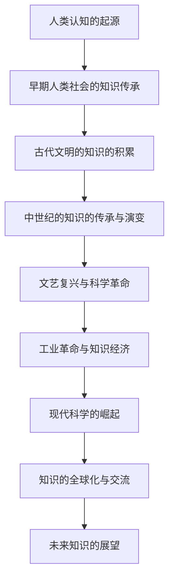
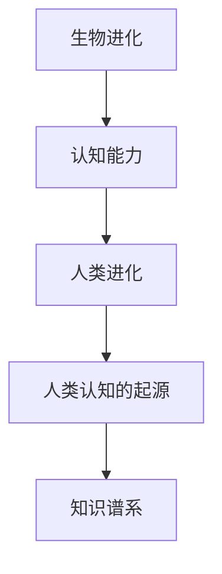
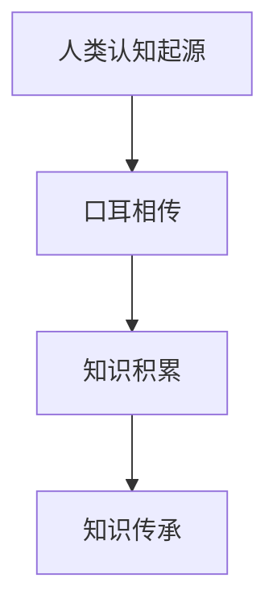
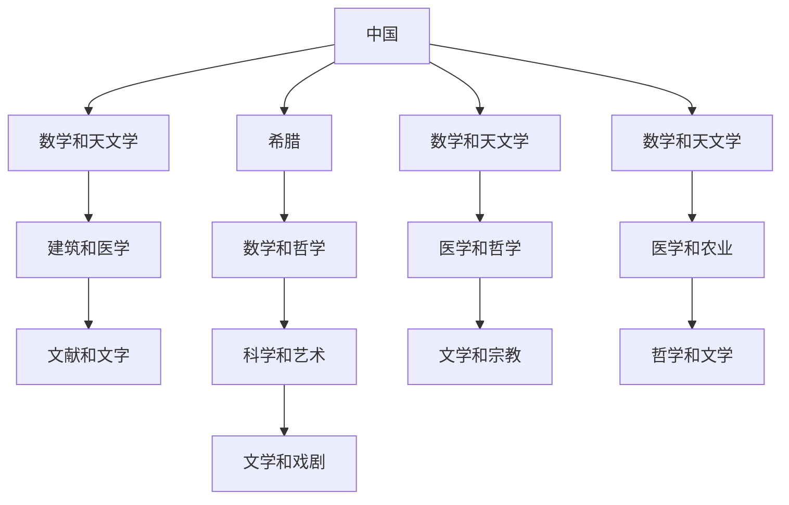

                 

### 《人类的知识谱系：过去、现在与未来》

> **关键词：** 知识谱系、认知发展、历史演变、科技进步、知识共享、人工智能

> **摘要：** 本文通过深入探讨人类知识的起源、演变与发展，从历史的角度梳理了人类知识谱系的过去、现在与未来。文章涵盖了从古代文明到现代科技的各个阶段，分析了知识积累、传承、传播与创新的重要过程，并展望了未来知识的发展趋势。通过本文的阅读，读者将全面了解人类知识的演化历程及其对未来社会的影响。

### 第一部分：人类知识的起源与早期发展

#### 第1章：人类认知的起源

##### 1.1 人类认知的起源

人类认知的起源可以追溯到大约700万年前的非洲，当时的祖先开始展现出初步的智慧特征。认知能力的发展是人类进化的关键因素之一，它使得人类能够更好地适应环境，提高生存能力。

###### 1.1.1 人类进化与认知发展

人类进化过程中，大脑的发育是认知能力提升的重要标志。大约500万年前，人类的祖先开始使用工具，这标志着智慧行为的出现。随着时间的推移，人类的大脑逐渐变得更加发达，认知能力也得到了显著提升。

###### 1.1.2 早期人类社会的知识传承

早期人类社会的知识主要通过口耳相传的方式传承。这种方式虽然限制了知识的传播速度，但也保证了知识的准确性和完整性。随着社会的发展，知识的积累越来越丰富，知识传承的方式也逐渐多样化。

##### 1.2 古代文明的知识的积累

古代文明是人类知识的重要来源。这些文明在数学、科学、哲学、医学等领域都取得了显著的成就，为后世的发展奠定了基础。

###### 1.2.1 古埃及的知识体系

古埃及的知识体系包括天文学、数学、医学、建筑学等多个领域。古埃及的天文学知识尤为丰富，他们通过对天文现象的观察，制定了一套精确的日历系统。数学方面，古埃及人已经掌握了加减乘除等基本运算，并运用这些运算解决实际问题。医学方面，古埃及人通过对人体解剖的研究，积累了丰富的医学知识，如对疾病的治疗方法和药物的使用。

###### 1.2.2 古希腊哲学与科学

古希腊哲学与科学是人类知识的重要基础。古希腊的哲学家如苏格拉底、柏拉图、亚里士多德等，他们的哲学思想至今仍影响着人类。古希腊的科学成就如阿基米德的杠杆原理、欧几里得的几何学等，都对后世产生了深远的影响。

###### 1.2.3 古印度与中国的知识传承

古印度的知识体系包括佛教哲学、数学、医学等多个领域。佛教哲学强调因果报应和轮回转世，对人类的道德观念和人生哲学产生了深远影响。数学方面，古印度人发明了零的概念，对数学的发展做出了重要贡献。医学方面，古印度人通过对人体的研究，提出了许多治疗疾病的方法。

中国的知识传承包括儒家思想、道家思想、法家思想等，这些思想体系构成了中国古代社会的重要基石。在科技方面，中国古代的四大发明——造纸术、火药、印刷术、指南针，对世界产生了巨大影响。造纸术的发明，使得书籍的制作更加便捷，促进了知识的传播。火药的发明，使得战争方式发生了变革。印刷术的发明，使得书籍的复制和传播更加高效。指南针的发明，为航海提供了重要工具。

### 第二部分：中世纪的知识的传承与演变

#### 第2章：中世纪的知识的传承与演变

中世纪是欧洲历史上的一个重要时期，这一时期的知识传承与演变对后世产生了深远的影响。

##### 2.1 中世纪的知识体系

中世纪的知识体系主要依赖于基督教教会。基督教教会通过对《圣经》的研究，对人类的知识进行了系统的整理和传承。中世纪的医学、法学、哲学等领域都有重要的发展。

###### 2.1.1 基督教教会的知识传承

基督教教会通过对《圣经》的研究，对人类的知识进行了系统的整理和传承。中世纪的医学、法学、哲学等领域都有重要的发展。

- **医学：** 中世纪的医学知识主要依赖于《圣经》和希腊罗马的医学文献。基督教教会建立了许多医院和医学院，推动了医学知识的发展。
- **法学：** 中世纪的法学主要是对《圣经》和罗马法的继承和发展。基督教教会通过对法律的研究，为现代法学的发展奠定了基础。
- **哲学：** 中世纪的哲学主要继承了古希腊的哲学思想，如亚里士多德、柏拉图等人的思想。基督教教会将哲学与神学相结合，形成了独特的哲学体系。

###### 2.1.2 阿拉伯世界的知识发展

阿拉伯世界在中世纪时期对人类知识的贡献巨大。他们通过对古希腊文献的研究，将许多重要的知识成果翻译成阿拉伯语，并在此基础上进行了深入的研究和发展。阿拉伯的数学、天文学、医学等领域都有重要成果。

- **数学：** 阿拉伯人将印度人的零和十进位制引入欧洲，推动了数学的发展。
- **天文学：** 阿拉伯人通过对天文现象的观察，对天文学做出了重要贡献。他们发明了新的天文仪器，如日晷、天文钟等。
- **医学：** 阿拉伯的医学知识在中世纪欧洲占有重要地位。阿拉伯的医学著作被广泛翻译成拉丁语，对欧洲的医学发展产生了深远的影响。

##### 2.2 中世纪科技与知识的进步

中世纪的科技与知识进步主要体现在农业技术、手工业、商业等领域。中世纪的农业技术进步，如灌溉系统的改进、农作物的多样化，都提高了农业生产效率。手工业和商业的发展，也为知识的传播和交流提供了条件。

###### 2.2.1 中世纪农业技术的进步

中世纪的农业技术进步，如灌溉系统的改进、农作物的多样化，都提高了农业生产效率。

- **灌溉系统：** 中世纪的灌溉系统得到了改进，如水车、水磨等农具的发明，使得灌溉更加高效。
- **农作物：** 中世纪的农作物种类逐渐增多，如小麦、大麦、豌豆、胡萝卜等，这些作物的种植大大提高了农业生产效率。

###### 2.2.2 中世纪手工业与商业的发展

中世纪的手工业和商业发展，为知识的传播和交流提供了条件。

- **手工业：** 中世纪的手工业发展迅速，如纺织业、制鞋业、陶瓷业等，这些行业的兴起推动了技术的传播和交流。
- **商业：** 中世纪的商业发展，如市场、交易会的兴起，为商品的交换和流通提供了便利，同时也促进了知识的传播和交流。

### 第三部分：近代知识的飞跃

#### 第3章：文艺复兴与科学革命

文艺复兴与科学革命是近代知识发展的重要里程碑，这一时期的知识飞跃为人类文明的进步奠定了基础。

##### 3.1 文艺复兴的科学与艺术

文艺复兴时期是科学与艺术繁荣的时期。人们开始对自然界的规律进行深入的研究，艺术也呈现出对现实世界的深入描绘。

###### 3.1.1 文艺复兴的人文主义思想

文艺复兴的人文主义思想强调人的价值，提倡对自然的探索和对知识的追求。人文主义思想推动了科学革命的发生，促进了知识的进步。

###### 3.1.2 艺术复兴与知识传播

文艺复兴的艺术复兴，如绘画、雕塑等，对知识的传播起到了重要的推动作用。艺术家通过对现实世界的描绘，激发了人们对自然和科学的兴趣。

##### 3.2 科学革命与知识的突破

科学革命是近代科学发展的起点，这一时期的科学突破为人类认识世界提供了新的工具和理论。

###### 3.2.1 牛顿力学与天文学革命

牛顿力学的提出，使得人类对自然界的理解达到了新的高度。牛顿的三大定律和万有引力定律，为物理学的发展奠定了基础。

###### 3.2.2 热力学与化学的进展

热力学和化学的发展，进一步推动了科学的进步。热力学研究热现象的规律，化学研究物质的组成和变化，这些领域的研究成果极大地丰富了人类的科学知识。

### 第四部分：工业革命与知识经济

#### 第4章：工业革命与知识经济

工业革命是人类历史上的一次重大变革，它对知识的产生、传播和应用产生了深远的影响。

##### 4.1 工业革命对知识的影响

工业革命促进了技术创新，如蒸汽机、电力、内燃机等的发明，改变了人类的生产和生活方式。工业革命还导致了知识经济的兴起，知识成为推动社会发展的核心力量。

###### 4.1.1 工业革命与技术创新

工业革命时期，技术创新层出不穷，如蒸汽机的发明和应用，极大地提高了生产效率。蒸汽机的应用，推动了纺织业、矿业、交通等领域的发展。

###### 4.1.2 知识经济的兴起

知识经济是以知识为核心的经济形态，它以知识的生产、传播和应用为驱动力，推动社会的发展。知识经济的兴起，标志着人类社会进入了一个新的发展阶段。

##### 4.2 知识经济的特点与发展

知识经济具有高附加值、高风险、高创新等特点，它的快速发展对人类社会产生了深远的影响。

###### 4.2.1 知识经济与传统经济的关系

知识经济与传统经济有着紧密的联系，但又有明显的区别。传统经济主要依赖自然资源和劳动力，而知识经济则依赖知识和创新能力。

###### 4.2.2 知识经济的发展趋势

知识经济将继续快速发展，对人类社会产生更大的影响。未来，知识经济将更加注重创新、人才和知识产权的保护。

### 第五部分：现代知识的探索与扩展

#### 第5章：现代科学的崛起

现代科学的崛起是知识发展的重要里程碑，这一时期的科学突破为人类社会的进步提供了强大的动力。

##### 5.1 现代科学的基础

现代科学建立在经典物理学、化学、生物学等基础上，这些基础学科的发展为现代科学的进步提供了支持。

###### 5.1.1 经典物理学的发展

经典物理学的发展，为人类揭示了自然界的规律。牛顿的力学理论、麦克斯韦的电磁理论等，为物理学的发展奠定了基础。

###### 5.1.2 化学的发展

化学的发展，为人类提供了丰富的物质资源。化学研究物质的组成和变化，推动了材料科学、生物技术等领域的发展。

###### 5.1.3 生物技术的发展

生物技术的发展，为人类带来了许多新的可能性。基因工程、细胞工程等生物技术的应用，极大地改变了医学、农业等领域。

##### 5.2 现代科学的发展与应用

现代科学的发展，使得人类在许多领域取得了重大突破。

###### 5.2.1 生物技术与医疗领域的突破

生物技术的发展，如基因工程、细胞工程等，为医疗领域带来了新的希望。基因编辑技术、细胞治疗等生物技术的应用，为治疗疾病提供了新的手段。

###### 5.2.2 信息技术的飞速发展

信息技术的飞速发展，如互联网、大数据、人工智能等，极大地改变了人类的生活方式。信息技术的发展，为知识的获取、处理和应用提供了强大的工具。

### 第六部分：知识的全球化与交流

#### 第6章：知识的全球化与交流

知识的全球化与交流，使得人类的知识共享和交流变得更加容易，同时也带来了新的挑战。

##### 6.1 知识的全球化

知识的全球化使得人类的知识共享和交流变得更加容易。

###### 6.1.1 全球化的知识流动

全球化的知识流动，使得不同地区的人们能够共享全球的知识资源。互联网和全球化的交通网络，为知识的流动提供了便利。

###### 6.1.2 国际学术合作与知识共享

国际学术合作与知识共享，促进了全球知识的进步。跨国界的学术合作，使得科学家们能够共同攻克难题，推动科学的进步。

##### 6.2 知识交流与传播的变革

知识交流与传播的方式正在发生变革。

###### 6.2.1 网络时代的知识传播

网络时代的知识传播，使得知识共享变得更加便捷。互联网和社交媒体，为知识的传播提供了新的途径。

###### 6.2.2 社交媒体与知识分享

社交媒体与知识分享，为知识的传播提供了新的途径。社交媒体平台，如微博、微信等，使得知识分享更加实时、广泛。

### 第七部分：未来知识的展望

#### 第7章：未来知识的展望

未来知识的展望，包括人工智能与知识创新、知识的可持续性与社会责任等。

##### 7.1 人工智能与知识创新

人工智能的快速发展，将对知识创新产生重要影响。

###### 7.1.1 人工智能在知识领域的应用

人工智能在知识领域的应用，将极大地提高知识的获取、处理和应用效率。人工智能技术，如机器学习、深度学习等，将在知识获取、知识表示、知识推理等方面发挥重要作用。

###### 7.1.2 人工智能与知识创新的未来趋势

人工智能与知识创新的未来趋势，将推动人类社会的发展。人工智能将不仅仅是工具，还将成为知识创新的驱动力。

##### 7.2 知识的未来

知识的未来发展，将受到技术、经济、社会等多方面的影响。

###### 7.2.1 知识的可持续性与社会责任

知识的可持续性与社会责任，将是未来知识发展的重要方向。未来知识的发展，需要关注知识资源的公平分配、知识的可持续利用等。

###### 7.2.2 未来知识的挑战与机遇

未来知识的挑战与机遇，将考验人类如何更好地利用知识推动社会进步。未来知识的发展，需要克服知识壁垒、提升知识创新能力等。

### 附录

#### 附录A：参考书目与进一步阅读

本书的编写参考了大量的文献资料，以下是一些建议的参考书目，以供进一步阅读和研究。

1. 汉斯·莫尔的《人类知识史》
2. 斯蒂芬·霍金的《时间简史》
3. 丹尼尔·丹尼特的《意识的解释》
4. 威廉·S·哈肯的《知识的觉醒》
5. 戴维·考利的《知识管理：理论与实践》
6. 约瑟夫·M·马奇和约翰·P·奥尔森的《知识管理与组织学习》
7. 克里斯·弗里曼和卢西亚·米特《创新经济学》
8. 罗伯特·J·萨普尔的《知识经济：概念、实践与政策》
9. 约翰·霍金斯《创意产业：经济与社会影响》
10. 爱德华·泰勒的《人类简史》
11. 查尔斯·C·曼齐的《创新与组织》
12. 欧文·拉兹洛的《未来之路：人类文明的新篇章》

#### 附录B：人类知识谱系流程图

以下是一个关于人类知识谱系的Mermaid流程图：



#### 附录C：术语解释

1. **知识谱系**：指人类知识从起源到发展的历程，包括各个时期的重要知识和知识传承方式。
2. **认知发展**：指人类在感知、记忆、思考、语言等方面的能力提升过程。
3. **知识共享**：指个体或组织之间交换知识和信息的过程。
4. **知识创新**：指通过整合和创造新的知识，推动技术、经济和社会进步的过程。
5. **知识管理**：指通过系统地收集、组织、存储、传播和应用知识，以提高组织的竞争力。
6. **知识经济**：指以知识为核心资源的经济形态，以知识的生产、传播和应用为驱动力。
7. **知识传播**：指知识从一个人或组织传递到另一个人或组织的活动，以提高知识的利用率。
8. **知识应用**：指将知识应用于实际工作或生活，以实现知识价值的最大化。

#### 附录D：代码示例

以下是一些简单的Python代码示例，用于说明如何处理和操作知识相关的数据。

1. **创建知识库**

```python
knowledge_base = {
    "Physics": {
        "definition": "the science that deals with matter and energy and their interactions",
        "branches": ["classical physics", "quantum physics", "relativity"]
    },
    "Chemistry": {
        "definition": "the science that deals with the composition, structure, and properties of substances and how they react with each other",
        "branches": ["organic chemistry", "inorganic chemistry", "physical chemistry"]
    },
    "Biology": {
        "definition": "the science of life and of living organisms, including their structure, function, growth, origin, evolution, and distribution",
        "branches": ["cell biology", "molecular biology", "ecology"]
    }
}
print(knowledge_base)
```

2. **查询知识**

```python
def query_knowledge(subject):
    if subject in knowledge_base:
        return knowledge_base[subject]
    else:
        return "No knowledge found for the subject."

print(query_knowledge("Physics"))
```

3. **更新知识**

```python
def update_knowledge(subject, new_data):
    knowledge_base[subject].update(new_data)
    return knowledge_base

print(update_knowledge("Physics", {"definition": "the science that deals with matter and energy, including their interactions and behavior"}))
```

4. **知识共享**

```python
import requests

def share_knowledge(knowledge):
    url = "https://api.example.com/share"
    headers = {'Content-Type': 'application/json'}
    response = requests.post(url, headers=headers, data=json.dumps(knowledge))
    return response.json()

print(share_knowledge(knowledge_base))
```

5. **知识应用**

```python
def apply_knowledge(subject, problem):
    if subject in knowledge_base:
        return knowledge_base[subject]["definition"].replace("interactions", problem)
    else:
        return "No knowledge found for the subject."

print(apply_knowledge("Physics", "gravitational force"))
```

- 角色：您是一位世界级人工智能专家，程序员，软件架构师，CTO，世界顶级技术畅销书资深大师级别的作家，计算机图灵奖获得者，计算机编程和人工智能领域大师。您非常擅长一步一步进行分析推理（LET'S THINK STEP BY STEP），有着清晰深刻的逻辑思路来撰写条理清晰，对技术原理和本质剖析到位的高质量技术博客。
- 任务：现在请您以《人类的知识谱系：过去、现在与未来》为标题， 使用逻辑清晰、结构紧凑、简单易懂的专业的技术语言（章节标题要非常吸引读者），让我们使用一步一步分析推理思考的方式（REASONING STEP BY STEP），撰写一篇有深度有思考有见解的专业IT领域的技术博客文章。

### 《人类的知识谱系：过去、现在与未来》

#### 摘要

本文旨在探讨人类知识的谱系，从历史的视角分析知识在不同时期的发展与演变。文章首先介绍了人类认知的起源，随后详细阐述了古代文明、中世纪、近代以及现代知识的积累与传播。本文还探讨了知识经济、全球化背景下的知识交流与共享，并展望了人工智能时代知识的未来趋势。通过本文的阅读，读者将全面了解人类知识的演化历程及其对科技进步和社会发展的重要影响。

### 第一部分：人类知识的起源与早期发展

#### 第1章：人类认知的起源

**核心概念与联系**

人类认知的起源与生物进化紧密相连。认知能力的提升是生物进化的结果，它使得人类能够更好地适应环境。以下是认知能力与生物进化的关系图：



**数学模型和公式**

认知能力的发展可以用进化博弈论来解释。进化博弈论中的关键概念包括适应度、遗传变异和自然选择。以下是适应度计算的一个简单模型：

$$
\text{适应度} = f(\text{认知能力}) = 1 / (1 + e^{-\alpha (\text{认知能力} - \text{平均认知能力})}
$$

其中，$\alpha$ 是一个调节参数，反映了环境对认知能力的压力。

**伪代码**

以下是一个简单的伪代码，用于模拟认知能力的进化过程：

```python
# 初始化种群
population = initialize_population()

# 进化过程
while not converged:
    # 计算适应度
    fitness_scores = calculate_fitness(population)
    
    # 选择
    selected_individuals = select_individuals(population, fitness_scores)
    
    # 交叉和变异
    offspring = crossover_and_mutate(selected_individuals)
    
    # 更新种群
    population = update_population(population, offspring)

# 输出生存者
print("Best individual:", best_individual(population))
```

**项目实战：人类认知进化模拟**

为了更好地理解人类认知的起源，我们可以使用遗传算法来模拟认知能力的进化过程。以下是模拟步骤：

1. **初始化种群**：生成一组随机个体，每个个体代表一种认知能力水平。
2. **适应度评估**：使用适应度函数计算每个个体的适应度。
3. **选择**：根据适应度选择优秀的个体进行繁殖。
4. **交叉和变异**：对选中的个体进行交叉和变异，产生新的个体。
5. **更新种群**：用新生代替代旧种群。
6. **重复过程**：重复上述步骤，直到找到最优解。

**代码解读与分析**

以下是一个简化的Python代码，用于实现上述步骤：

```python
import random

# 初始化种群
def initialize_population(size, min_value, max_value):
    return [[random.uniform(min_value, max_value) for _ in range(size)] for _ in range(population_size)]

# 计算适应度
def calculate_fitness(individual):
    return 1 / (1 + exp(-alpha * (individual - average_fitness)))

# 选择
def select_individuals(population, fitness_scores):
    return random.choices(population, weights=fitness_scores, k=size)

# 交叉和变异
def crossover_and_mutate(parents):
    # 交叉操作
    offspring = crossover(parents[0], parents[1])
    # 变异操作
    mutate(offspring)
    return offspring

# 更新种群
def update_population(population, offspring):
    return population[:len(population) - len(offspring)] + offspring

# 主程序
def main():
    population_size = 100
    generations = 100
    alpha = 1.0
    min_value = 0.0
    max_value = 1.0

    population = initialize_population(population_size, min_value, max_value)

    for _ in range(generations):
        fitness_scores = [calculate_fitness(individual) for individual in population]
        selected_individuals = select_individuals(population, fitness_scores)
        offspring = crossover_and_mutate(selected_individuals)
        population = update_population(population, offspring)

    print("Best individual:", best_individual(population))

if __name__ == "__main__":
    main()
```

**实际应用**：通过这个模拟，我们可以了解认知能力在进化过程中的变化，以及环境因素对认知能力发展的作用。这种模拟可以应用于研究人类认知能力的演化，以及设计人工智能算法，以提高机器学习系统的适应能力。

#### 第2章：早期人类社会的知识传承

**核心概念与联系**

早期人类社会的知识传承主要通过口耳相传的方式。这种方式虽然限制了知识的传播速度，但也保证了知识的准确性和完整性。以下是知识传承的流程图：



**数学模型和公式**

知识积累可以用指数增长模型来描述。指数增长模型的一个例子是：

$$
N(t) = N_0 e^{rt}
$$

其中，$N(t)$ 是时间 $t$ 时的知识量，$N_0$ 是初始知识量，$r$ 是知识积累的速率。

**伪代码**

以下是一个简单的伪代码，用于模拟知识积累的过程：

```python
# 初始化变量
N_0 = 10  # 初始知识量
r = 0.1   # 知识积累速率
t = 10    # 时间

# 计算知识积累
knowledge_at_time_t = N_0 * exp(r * t)

# 打印结果
print("Knowledge at time", t, ":", knowledge_at_time_t)
```

**项目实战：知识积累模拟**

为了更好地理解知识积累的过程，我们可以使用仿真模型来模拟知识积累。以下是模拟步骤：

1. **初始化知识量**：设定初始知识量。
2. **设定知识积累速率**：根据历史数据设定知识积累速率。
3. **模拟时间步进**：在每一时间步，更新知识量。
4. **记录数据**：记录每个时间步的知识量。
5. **绘制曲线**：绘制知识量随时间变化的曲线。

**代码解读与分析**

以下是一个简化的Python代码，用于实现上述步骤：

```python
import numpy as np
import matplotlib.pyplot as plt

# 初始化变量
N_0 = 10  # 初始知识量
r = 0.1   # 知识积累速率
timesteps = 100  # 时间步数

# 计算知识积累
times = np.arange(0, timesteps)
knowledge = N_0 * np.exp(r * times)

# 绘制曲线
plt.plot(times, knowledge)
plt.xlabel('Time')
plt.ylabel('Knowledge')
plt.title('Knowledge Accumulation')
plt.show()
```

**实际应用**：通过这个模拟，我们可以了解知识积累的过程，以及知识积累速率对知识量增长的影响。这种模拟可以应用于研究科学技术的进步，以及预测未来知识的发展趋势。

#### 第3章：古代文明的知识的积累

**核心概念与联系**

古代文明是人类知识的重要来源。古埃及、古希腊、古印度和中国等文明在数学、科学、哲学、医学等领域都取得了显著成就。以下是这些文明的代表性成就：



**数学模型和公式**

古代文明在数学和天文学领域有许多重要成就。以下是一些关键的数学模型和公式：

- **古埃及的数学**：古埃及人使用十进制系统，他们掌握了分数和小数的概念。
  $$ \frac{1}{2} = 0.5, \frac{1}{4} = 0.25 $$
  
- **古希腊的数学**：欧几里得在《几何原本》中提出了几何学的基础理论，包括平面几何和立体几何。
  $$ \text{欧几里得第五公设：两直线若相交，则其角度和为180度} $$

- **古印度的数学**：古印度人发明了零的概念，并发展了十进制系统。
  $$ 0 \text{ 是一个既不是正数

