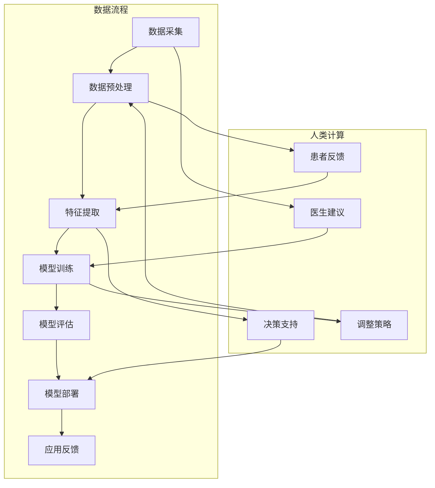

                 

### 引言

#### 1.1 书籍背景和目的

在当今信息化时代，人工智能（AI）技术正以前所未有的速度影响着各个行业，其中医疗保健领域尤为显著。本书旨在探讨人类计算在医疗保健中的应用，通过对人类计算和医疗保健领域的深入分析，揭示人工智能技术在医疗保健中的潜在价值和发展趋势。

**1.1.1 医疗保健领域的重要性**

医疗保健是关系到国计民生的重要领域，涉及人口健康、疾病预防、诊疗、康复等多个方面。随着人口老龄化、慢性病增加以及医疗资源分配不均等问题日益突出，提升医疗保健的效率和准确性变得尤为重要。人工智能技术的发展为解决这些问题提供了新的思路和手段。

**1.1.2 人类计算的定义与意义**

人类计算是一种基于人类智慧和经验的计算方式，通过模仿人类的思维过程来进行决策和解决问题。与传统的机器计算相比，人类计算具有灵活性、适应性和创造性等优势，能够在复杂的、不确定性高的场景中发挥重要作用。

**1.1.3 本书结构安排与预期成果**

本书分为五个部分：

- **第一部分：引言**：介绍书籍的背景、目的以及人工智能在医疗保健中的应用现状。
- **第二部分：核心概念与架构**：详细阐述人类计算的基础概念、医疗保健领域的人工智能架构以及人类计算在医疗保健中的应用流程。
- **第三部分：核心算法原理**：讲解机器学习、支持向量机、集成学习方法和神经网络等核心算法在医疗保健中的应用。
- **第四部分：项目实战**：通过实际项目案例，展示人工智能在医疗诊断和药物研发中的应用。
- **第五部分：未来展望**：分析人工智能在医疗保健领域的未来趋势，并提出发展建议。

通过本书的阅读，读者可以系统地了解人类计算在医疗保健中的应用，掌握相关算法原理和实践方法，为未来在医疗保健领域的发展打下坚实基础。

#### 1.2 医疗保健与人工智能

**1.2.1 人工智能在医疗保健中的应用现状**

近年来，人工智能在医疗保健领域取得了显著进展。首先，人工智能技术在医学影像诊断方面得到了广泛应用。通过深度学习算法，计算机能够自动识别和分析医学影像，如X光片、CT扫描和MRI图像，从而提高诊断的准确性和速度。例如，谷歌旗下的DeepMind公司开发了一种名为“DeepMind Health”的人工智能系统，可以在数秒内对视网膜图像进行自动分析，帮助医生早期发现糖尿病视网膜病变。

其次，人工智能在药物研发中也发挥了重要作用。通过机器学习算法，科学家可以快速筛选大量化合物，预测其药理活性，从而加速新药的发现和开发。例如，美国药企Pfizer利用人工智能技术发现了一种新的抗癌药物BAY1217577，其开发周期比传统方法缩短了数年。

此外，人工智能在临床决策支持、患者管理、健康数据分析等方面也展现出巨大潜力。例如，IBM的Watson for Oncology系统可以帮助医生制定个性化的癌症治疗方案，提高了治疗的成功率。

**1.2.2 人工智能对医疗保健的影响**

人工智能技术的应用对医疗保健产生了深远影响。首先，它提高了医疗服务的效率和准确性。通过自动化处理和分析大量数据，人工智能可以快速提供准确的诊断和治疗方案，减少了医生的工作负担。例如，在放射科，人工智能系统可以自动识别病灶，提高诊断的准确性。

其次，人工智能有助于改善患者体验。通过智能导诊、在线问诊和远程医疗等技术，患者可以更方便地获取医疗服务。例如，一些医院已经引入了智能导诊机器人，帮助患者快速找到所需的科室和医生。

此外，人工智能还在医疗资源分配方面发挥了重要作用。通过大数据分析和预测，可以优化医疗资源的配置，提高资源利用效率。例如，一些医院利用人工智能技术预测就诊高峰期，合理调配医护人员和医疗设备。

**1.2.3 医疗保健中的挑战与机会**

尽管人工智能在医疗保健领域具有巨大潜力，但同时也面临一些挑战和机遇。首先，数据隐私和安全是主要挑战之一。医疗数据包含大量敏感信息，如患者身份、病史等，泄露或滥用这些数据可能会对患者的隐私和安全造成严重威胁。

其次，技术成熟度和应用成本也是制约人工智能在医疗保健领域广泛应用的重要因素。虽然人工智能技术已经取得了一定的进展，但在实际应用中，仍需要解决算法可靠性、数据处理能力和系统稳定性等问题。

然而，这些挑战也为人工智能技术的发展提供了新的机遇。随着数据隐私保护技术和安全措施的不断完善，人工智能在医疗保健领域的应用将变得更加广泛和可靠。同时，随着算法和硬件技术的不断发展，人工智能在医疗保健中的应用成本也将逐渐降低。

总的来说，人工智能在医疗保健领域具有广阔的应用前景，但也需要克服一系列挑战。通过持续的技术创新和政策支持，人工智能有望在医疗保健领域发挥更大的作用，为提高全民健康水平作出贡献。

#### 1.3 本书结构安排与预期成果

为了系统地探讨人类计算在医疗保健中的应用，本书采用以下结构安排：

**第一部分：引言**

本部分将介绍书籍的背景、目的以及人工智能在医疗保健中的应用现状。通过概述医疗保健领域的重要性，以及人工智能技术的优势，为后续章节的内容奠定基础。

**第二部分：核心概念与架构**

本部分将详细阐述人类计算的基础概念、医疗保健领域的人工智能架构以及人类计算在医疗保健中的应用流程。首先，介绍人类计算的定义、特点和基本原理，解释其与医疗保健领域的联系。接着，探讨医疗保健领域的人工智能架构，包括不同的人工智能技术分类和应用模式。最后，通过Mermaid流程图，展示人类计算在医疗保健流程中的关键节点和应用过程。

**第三部分：核心算法原理**

本部分将讲解机器学习、支持向量机、集成学习方法和神经网络等核心算法在医疗保健中的应用。首先，介绍机器学习的基础知识，包括数据预处理方法和常见算法。然后，详细讲解支持向量机、集成学习方法和神经网络等核心算法，解释其原理和应用场景。此外，通过伪代码和数学公式，进一步阐述这些算法的具体实现和数学基础。

**第四部分：项目实战**

本部分将通过实际项目案例，展示人工智能在医疗诊断和药物研发中的应用。首先，介绍项目背景和目标，然后详细讲解项目环境搭建、源代码实现和代码解读。通过实际案例，展示人工智能技术在医疗保健领域的应用效果，并提供经验总结。

**第五部分：未来展望**

本部分将分析人工智能在医疗保健领域的未来趋势，包括技术发展趋势、行业应用趋势和未来挑战与机遇。通过总结本书的主要内容，提出对医疗保健领域人工智能发展的建议，为读者提供未来研究的方向。

通过以上结构的安排，本书旨在为读者提供一份全面、系统的指南，帮助读者深入了解人类计算在医疗保健中的应用，掌握相关算法原理和实践方法，为未来在医疗保健领域的发展打下坚实基础。

### 目录大纲：人类计算在医疗保健中的应用

为了系统地探讨人类计算在医疗保健中的应用，本书将遵循以下目录大纲结构，确保内容的逻辑清晰、条理紧凑，并便于读者理解与学习。

#### 第一部分：引言

- **1.1 书籍背景和目的**
  - **1.1.1 医疗保健领域的重要性**
  - **1.1.2 人类计算的定义与意义**
  - **1.1.3 本书结构安排与预期成果**

- **1.2 医疗保健与人工智能**
  - **1.2.1 人工智能在医疗保健中的应用现状**
  - **1.2.2 人工智能对医疗保健的影响**
  - **1.2.3 医疗保健中的挑战与机会**

#### 第二部分：核心概念与架构

- **2.1 人类计算基础**
  - **2.1.1 人类计算的定义与特点**
  - **2.1.2 人类计算的基本原理**
  - **2.1.3 人类计算与医疗保健的联系**

- **2.2 医疗保健领域的人工智能架构**
  - **2.2.1 人工智能技术的分类**
  - **2.2.2 医疗保健领域的人工智能应用框架**
  - **2.2.3 人工智能技术在医疗保健中的应用模式**

- **2.3 Mermaid流程图：人类计算在医疗保健中的应用流程**
  - **2.3.1 医疗保健流程概述**
  - **2.3.2 人类计算在医疗保健流程中的关键节点**
  - **2.3.3 人类计算与医疗保健的融合**

#### 第三部分：核心算法原理

- **3.1 机器学习算法在医疗保健中的应用**
  - **3.1.1 机器学习基础**
  - **3.1.2 医疗数据预处理**
  - **3.1.3 常见机器学习算法在医疗保健中的应用**

- **3.2 人工智能算法在医疗保健中的核心算法**
  - **3.2.1 支持向量机（SVM）**
  - **3.2.2 集成学习方法**
  - **3.2.3 神经网络与深度学习**

- **3.3 伪代码讲解：常见医疗保健算法**
  - **3.3.1 数据预处理算法伪代码**
  - **3.3.2 SVM算法伪代码**
  - **3.3.3 神经网络训练算法伪代码**

- **3.4 数学模型和公式**
  - **3.4.1 机器学习中的数学公式**
  - **3.4.2 深度学习中的数学公式**
  - **3.4.3 医疗保健领域中的数学模型**

#### 第四部分：项目实战

- **4.1 医疗保健领域的人工智能项目实战**
  - **4.1.1 项目介绍**
  - **4.1.2 项目环境搭建**
  - **4.1.3 项目源代码实现**
  - **4.1.4 项目代码解读与分析**

- **4.2 案例分析：人工智能在医疗诊断中的应用**
  - **4.2.1 案例背景**
  - **4.2.2 案例目标**
  - **4.2.3 案例实施步骤**
  - **4.2.4 案例结果与讨论**

- **4.3 案例分析：人工智能在药物研发中的应用**
  - **4.3.1 案例背景**
  - **4.3.2 案例目标**
  - **4.3.3 案例实施步骤**
  - **4.3.4 案例结果与讨论**

#### 第五部分：未来展望

- **5.1 人工智能在医疗保健领域的未来趋势**
  - **5.1.1 技术发展趋势**
  - **5.1.2 行业应用趋势**
  - **5.1.3 未来挑战与机遇**

- **5.2 结论与建议**
  - **5.2.1 本书总结**
  - **5.2.2 对医疗保健领域的人工智能发展建议**

通过以上结构的安排，本书将从基础概念、核心算法、项目实战和未来展望四个维度，全面深入地探讨人类计算在医疗保健中的应用，为读者提供系统、实用的学习和参考资源。

### 第一部分：引言

#### 1.1 书籍背景和目的

在当今快速发展的科技时代，人工智能（AI）技术已经在各个领域展现出了巨大的潜力，特别是在医疗保健领域。医疗保健作为一个涉及广泛、复杂且动态变化的领域，迫切需要高效、精准的技术支持来提升服务质量、降低医疗成本、改善患者体验。人类计算作为一种模拟人类思维和行为的计算方式，能够为医疗保健领域提供独特的解决方案。

**1.1.1 医疗保健领域的重要性**

医疗保健是关乎国计民生的重要领域，直接影响到社会的稳定和人民的幸福。随着人口老龄化、慢性病高发和医疗资源分配不均等问题日益严峻，提高医疗保健的效率和准确性已经成为全球性的挑战。传统医疗模式中，医生的诊断和治疗过程往往依赖于个人的经验和知识，存在主观性和不确定性。而人工智能技术，尤其是人类计算，通过模拟人类思维和决策过程，可以在一定程度上减少这种主观性，提高诊断和治疗的准确性和效率。

**1.1.2 人类计算的定义与意义**

人类计算是一种基于人类智慧和经验的计算方式，通过模仿人类的思维过程来进行决策和解决问题。与传统的机器计算相比，人类计算具有灵活性、适应性和创造性等优势，能够处理复杂的不确定性问题和动态环境。在医疗保健领域，人类计算的应用不仅能够提高诊断和治疗的效率，还能够为医生提供决策支持，帮助他们更好地理解和处理复杂的医学数据。

**1.1.3 本书结构安排与预期成果**

本书旨在为读者提供一份全面、系统的指南，帮助他们深入理解人类计算在医疗保健中的应用。全书分为五个部分，各部分的内容安排如下：

- **第一部分：引言**：介绍书籍的背景、目的以及人工智能在医疗保健中的应用现状。通过概述医疗保健领域的重要性，以及人工智能技术的优势，为后续章节的内容奠定基础。

- **第二部分：核心概念与架构**：详细阐述人类计算的基础概念、医疗保健领域的人工智能架构以及人类计算在医疗保健中的应用流程。首先，介绍人类计算的定义、特点和基本原理，解释其与医疗保健领域的联系。接着，探讨医疗保健领域的人工智能架构，包括不同的人工智能技术分类和应用模式。最后，通过Mermaid流程图，展示人类计算在医疗保健流程中的关键节点和应用过程。

- **第三部分：核心算法原理**：讲解机器学习、支持向量机、集成学习方法和神经网络等核心算法在医疗保健中的应用。首先，介绍机器学习的基础知识，包括数据预处理方法和常见算法。然后，详细讲解支持向量机、集成学习方法和神经网络等核心算法，解释其原理和应用场景。此外，通过伪代码和数学公式，进一步阐述这些算法的具体实现和数学基础。

- **第四部分：项目实战**：通过实际项目案例，展示人工智能在医疗诊断和药物研发中的应用。首先，介绍项目背景和目标，然后详细讲解项目环境搭建、源代码实现和代码解读。通过实际案例，展示人工智能技术在医疗保健领域的应用效果，并提供经验总结。

- **第五部分：未来展望**：分析人工智能在医疗保健领域的未来趋势，包括技术发展趋势、行业应用趋势和未来挑战与机遇。通过总结本书的主要内容，提出对医疗保健领域人工智能发展的建议，为读者提供未来研究的方向。

通过以上结构的安排，本书旨在为读者提供一份全面、系统的指南，帮助读者深入了解人类计算在医疗保健中的应用，掌握相关算法原理和实践方法，为未来在医疗保健领域的发展打下坚实基础。

### 第一部分：引言

#### 1.2 医疗保健与人工智能

**1.2.1 人工智能在医疗保健中的应用现状**

人工智能（AI）技术在医疗保健领域的应用已经取得了显著进展，并在多个方面展现出巨大的潜力。以下是人工智能在医疗保健中的一些典型应用现状：

- **医学影像分析**：人工智能在医学影像分析中表现尤为突出。通过深度学习算法，计算机可以在X光片、CT扫描和MRI图像中自动识别异常区域，如肿瘤、骨折和心脏病等。这种自动化的分析不仅可以提高诊断的准确性，还可以显著减少医生的工作负担。例如，谷歌旗下的DeepMind公司开发的AI系统可以快速分析视网膜图像，帮助医生早期发现糖尿病视网膜病变。

- **辅助诊断和决策支持**：人工智能系统能够分析大量的医学数据和文献，为医生提供辅助诊断和治疗方案。例如，IBM的Watson for Oncology系统可以帮助医生制定个性化的癌症治疗方案，提高了治疗的成功率。此外，人工智能还可以在手术过程中提供实时监控和指导，确保手术的顺利进行。

- **药物研发**：人工智能在药物研发中也发挥了重要作用。通过机器学习算法，科学家可以快速筛选大量的化合物，预测其药理活性，从而加速新药的发现和开发。例如，美国药企Pfizer利用人工智能技术发现了一种新的抗癌药物BAY1217577，其开发周期比传统方法缩短了数年。

- **患者管理和健康监测**：人工智能技术可以帮助医生更好地管理患者。例如，通过智能导诊系统和在线问诊平台，患者可以更方便地获取医疗服务，减少排队等待时间。同时，智能穿戴设备和健康监测系统可以实时收集患者的生理数据，帮助医生更好地了解患者健康状况，及时提供干预措施。

- **个性化医疗**：人工智能可以根据患者的个体差异，提供个性化的治疗方案。例如，通过分析患者的基因数据和病史，人工智能可以预测患者对某种药物的响应，从而制定最适合的治疗方案，提高治疗效果。

**1.2.2 人工智能对医疗保健的影响**

人工智能技术的应用对医疗保健产生了深远的影响。以下是人工智能在医疗保健领域带来的几个主要影响：

- **提高效率和准确性**：人工智能可以自动化处理和分析大量数据，减少人为错误，提高诊断和治疗的效率和准确性。例如，在医学影像分析中，人工智能系统可以更快速、准确地识别病灶，减少医生的阅读时间，提高诊断的准确性。

- **改善患者体验**：通过智能导诊系统和在线问诊平台，患者可以更方便地获取医疗服务，减少排队等待时间，提高就医体验。此外，智能穿戴设备和健康监测系统可以帮助患者更好地管理自己的健康状况，提高生活质量。

- **优化资源分配**：人工智能技术可以通过大数据分析和预测，优化医疗资源的配置，提高资源利用效率。例如，医院可以利用人工智能预测就诊高峰期，合理安排医护人员和医疗设备，提高医院的整体运营效率。

- **降低医疗成本**：人工智能可以减少医生的工作负担，降低人力成本。此外，通过自动化处理和优化流程，医疗机构的运营成本也可以得到有效控制。

**1.2.3 医疗保健中的挑战与机会**

尽管人工智能在医疗保健领域具有巨大潜力，但同时也面临一系列挑战和机会。以下是医疗保健中人工智能面临的几个主要挑战和机会：

- **数据隐私和安全**：医疗数据包含大量敏感信息，如患者身份、病史等，数据隐私和安全是人工智能在医疗保健中面临的主要挑战。为了确保数据安全和隐私，需要建立健全的数据保护措施和法律法规。

- **技术成熟度和应用成本**：虽然人工智能技术在医疗保健中的应用取得了显著进展，但某些算法和技术的成熟度仍然有限，应用成本也较高。为了实现人工智能在医疗保健中的广泛应用，需要进一步降低技术成本，提高算法的可靠性和稳定性。

- **跨学科合作与人才培养**：人工智能在医疗保健中的应用需要跨学科的合作，包括医学、计算机科学、数据科学等多个领域。因此，培养具备多学科背景的专业人才是推动人工智能在医疗保健领域发展的重要保障。

- **法规和伦理问题**：人工智能在医疗保健中的应用涉及到一系列法规和伦理问题，如算法透明度、责任归属等。需要制定相应的法规和伦理准则，确保人工智能技术在医疗保健中的合理、合规应用。

总的来说，人工智能在医疗保健领域具有广阔的应用前景，但也需要克服一系列挑战。通过持续的技术创新、政策支持和跨学科合作，人工智能有望在医疗保健领域发挥更大的作用，为提高全民健康水平作出贡献。

### 人类计算的基础

**2.1.1 人类计算的定义与特点**

人类计算是指通过模拟人类思维和决策过程，实现问题求解和信息处理的计算方式。与传统的机器计算不同，人类计算具有以下特点：

- **灵活性**：人类计算能够处理复杂、不确定的问题，适应动态变化的环境。
- **适应性**：人类计算可以根据不同的情境和任务需求，灵活调整策略和方法。
- **创造性**：人类计算具有独特的创造性，能够产生新颖的想法和解决方案。

**2.1.2 人类计算的基本原理**

人类计算的基本原理主要包括以下几个方面：

- **感知与理解**：人类计算通过感知外界信息，对其进行理解，形成对问题的认知。
- **记忆与存储**：人类计算依赖于记忆和存储，将感知和理解的结果保存下来，以便后续使用。
- **推理与决策**：人类计算通过推理过程，从已知信息中推导出新的结论，并基于这些结论做出决策。
- **学习与适应**：人类计算通过学习，不断优化自己的思维过程，提高解决问题的能力。

**2.1.3 人类计算与医疗保健的联系**

人类计算与医疗保健有着密切的联系。在医疗保健领域，人类计算的应用主要体现在以下几个方面：

- **诊断支持**：人类计算可以辅助医生进行疾病诊断，通过分析患者的病史、症状和检查结果，提供诊断建议。
- **治疗方案制定**：人类计算可以根据患者的具体病情，推荐合适的治疗方案，提高治疗的成功率。
- **患者管理**：人类计算可以协助医生对住院患者进行管理，监控患者的病情变化，提供个性化的护理建议。
- **医学研究**：人类计算可以帮助研究人员分析大量的医学数据，发现潜在的关联和规律，推动医学研究的发展。

总之，人类计算为医疗保健领域提供了强大的工具，可以显著提升医疗服务的效率和准确性，改善患者体验，降低医疗成本。

### 医疗保健领域的人工智能架构

**2.2.1 人工智能技术的分类**

在医疗保健领域，人工智能技术可以根据其功能和应用特点分为多种类型：

- **机器学习（Machine Learning）**：机器学习是一种通过数据驱动的方式，让计算机自动学习和改进的技术。在医疗保健中，机器学习可以用于疾病诊断、预测和个性化治疗。
  
- **深度学习（Deep Learning）**：深度学习是机器学习的一种子领域，通过多层神经网络对大量数据进行分析和分类。在医疗保健中，深度学习在医学影像分析、基因组学分析和药物研发中发挥着重要作用。

- **自然语言处理（Natural Language Processing, NLP）**：自然语言处理是一种使计算机理解和处理人类语言的技术。在医疗保健中，NLP可以用于医疗记录的自动处理、医疗文本分析和临床决策支持。

- **计算机视觉（Computer Vision）**：计算机视觉是一种使计算机能够“看”和“理解”图像的技术。在医疗保健中，计算机视觉可以用于医学影像分析、手术导航和机器人辅助手术。

- **强化学习（Reinforcement Learning）**：强化学习是一种通过奖励机制，让计算机在特定环境中学习和优化行为的技术。在医疗保健中，强化学习可以用于个性化治疗策略的制定和患者管理。

**2.2.2 医疗保健领域的人工智能应用框架**

医疗保健领域的人工智能应用框架通常包括以下几个关键组件：

- **数据采集与预处理**：医疗保健数据来源广泛，包括电子病历、医学影像、基因组数据等。数据采集后，需要进行清洗、格式化和标准化处理，以便后续分析。

- **特征提取与选择**：特征提取和选择是医疗保健人工智能应用的重要环节。通过提取关键特征，可以减少数据维度，提高模型性能。

- **模型训练与优化**：选择合适的机器学习算法和深度学习模型，对预处理后的数据进行分析和训练。优化模型参数，提高模型的预测准确性和泛化能力。

- **模型评估与验证**：通过交叉验证、误差分析等方法，对训练好的模型进行评估和验证，确保其具有良好的性能和可靠性。

- **部署与应用**：将训练好的模型部署到实际应用场景中，如辅助诊断系统、药物研发平台和智能健康管理系统。

**2.2.3 人工智能技术在医疗保健中的应用模式**

人工智能技术在医疗保健中的应用模式多种多样，以下是一些典型的应用模式：

- **辅助诊断**：利用机器学习和深度学习算法，对医学影像进行分析，辅助医生进行疾病诊断。例如，计算机视觉算法可以用于肺癌、乳腺癌等恶性肿瘤的早期检测。

- **个性化治疗**：通过分析患者的基因组数据、电子病历和医疗记录，为患者制定个性化的治疗方案。例如，基于基因数据的个性化癌症治疗和药物筛选。

- **健康监测与管理**：利用智能穿戴设备和健康监测系统，实时收集患者的生理数据，进行健康风险评估和预警。例如，糖尿病患者的血糖监测和管理系统。

- **药物研发**：通过机器学习和深度学习算法，加速新药的发现和开发过程。例如，利用深度学习模型进行药物分子的结构预测和药物反应预测。

- **手术辅助**：利用计算机视觉和机器人技术，实现手术导航和机器人辅助手术，提高手术的准确性和安全性。例如，微创手术中的实时影像处理和手术机器人。

总之，医疗保健领域的人工智能架构和应用程序为提高医疗服务的效率、准确性和个性化水平提供了有力支持。随着技术的不断发展和应用实践的积累，人工智能在医疗保健领域的应用将更加广泛和深入。

### Mermaid流程图：人类计算在医疗保健中的应用流程

为了更好地理解人类计算在医疗保健中的应用流程，我们可以使用Mermaid流程图来展示其关键节点和应用步骤。以下是一个简化的Mermaid流程图，用于描述人类计算在医疗保健中的应用。



#### 2.3.1 医疗保健流程概述

- **数据采集**：医疗保健流程的第一步是数据采集，包括电子病历、医学影像、基因组数据等。这些数据是后续分析和决策的基础。

- **数据预处理**：采集到的医疗数据通常包含噪声和不完整信息，需要进行预处理，如清洗、归一化和标准化处理，以提高数据质量。

- **特征提取**：通过预处理后的数据，提取与医疗任务相关的特征，如症状、体征、实验室检测结果等。特征提取是关键步骤，直接影响模型的性能。

- **模型训练**：选择合适的机器学习算法和深度学习模型，对特征数据进行训练。训练过程中，模型不断优化，以提高诊断和预测的准确性。

- **模型评估**：训练好的模型需要通过交叉验证、误差分析等方法进行评估，确保其具有良好的性能和可靠性。

- **模型部署**：评估通过后的模型可以部署到实际应用场景中，如辅助诊断系统、个性化治疗平台等。

- **应用反馈**：在实际应用过程中，根据模型的输出结果和用户反馈，不断调整和优化模型，提高其性能和应用效果。

#### 2.3.2 人类计算在医疗保健流程中的关键节点

- **医生建议**：医生根据临床经验和专业知识，对模型的诊断结果进行初步评估和判断，提供专业建议。

- **患者反馈**：患者对诊断结果和治疗方案进行反馈，有助于改进模型和优化医疗流程。

- **决策支持**：通过人类计算，如推理和决策过程，为医生和患者提供个性化的诊断和治疗方案。

- **调整策略**：根据人类计算和患者反馈，调整医疗流程和模型参数，以提高诊断和治疗的准确性和效果。

#### 2.3.3 人类计算与医疗保健的融合

人类计算与医疗保健的融合是通过以下几个步骤实现的：

1. **数据驱动**：通过数据采集和预处理，获取高质量的医疗数据，为后续分析和决策提供基础。

2. **模型优化**：利用机器学习和深度学习算法，训练和优化模型，提高诊断和预测的准确性。

3. **决策支持**：结合医生经验和患者反馈，通过人类计算提供个性化的诊断和治疗方案。

4. **持续改进**：根据实际应用反馈，不断调整和优化模型，提高其性能和应用效果。

通过上述流程，人类计算与医疗保健实现了有机融合，为提高医疗服务的效率、准确性和个性化水平提供了有力支持。

### 机器学习算法在医疗保健中的应用

**3.1.1 机器学习基础**

机器学习是一种通过数据驱动的方式，让计算机自动学习和改进的技术。在医疗保健领域，机器学习技术被广泛应用于疾病诊断、预测和个性化治疗。以下是机器学习的一些基础概念：

- **监督学习（Supervised Learning）**：监督学习是一种通过已标记的数据进行训练，从而预测新数据的方法。常见的监督学习算法包括线性回归、逻辑回归、支持向量机和神经网络等。

- **无监督学习（Unsupervised Learning）**：无监督学习是一种没有预先标记的数据进行训练，从而发现数据中的模式和结构的方法。常见的无监督学习算法包括聚类、降维和关联规则学习等。

- **强化学习（Reinforcement Learning）**：强化学习是一种通过试错和奖励机制，让计算机在特定环境中学习和优化行为的方法。在医疗保健领域，强化学习可以用于个性化治疗策略的制定和患者管理。

**3.1.2 医疗数据预处理**

医疗数据预处理是机器学习在医疗保健应用中的重要步骤，其质量直接影响模型的效果。以下是医疗数据预处理的关键步骤：

- **数据清洗**：去除噪声和错误数据，包括缺失值处理、异常值检测和重复数据删除。

- **数据标准化**：将不同数据源和不同量纲的数据进行统一处理，如归一化和标准化。

- **特征选择**：从大量的特征中筛选出与预测目标高度相关的特征，减少数据的维度，提高模型的训练效率。

- **特征工程**：通过特征转换、特征组合等方法，生成新的特征，以提高模型的预测能力。

**3.1.3 常见机器学习算法在医疗保健中的应用**

在医疗保健领域，以下几种常见的机器学习算法被广泛应用于疾病诊断、预测和个性化治疗：

- **线性回归（Linear Regression）**：线性回归是一种用于预测数值型变量的监督学习算法。在医疗保健中，线性回归可以用于预测患者的生命体征、治疗效果等。

- **逻辑回归（Logistic Regression）**：逻辑回归是一种用于预测概率的监督学习算法。在医疗保健中，逻辑回归可以用于疾病诊断、风险评估和治疗方案选择。

- **支持向量机（Support Vector Machine, SVM）**：支持向量机是一种用于分类和回归的监督学习算法。在医疗保健中，SVM可以用于肿瘤分类、疾病诊断和预测。

- **神经网络（Neural Network）**：神经网络是一种模仿生物神经系统的计算模型。在医疗保健中，神经网络被广泛应用于医学影像分析、基因组学和个性化治疗。

- **深度学习（Deep Learning）**：深度学习是一种基于多层神经网络的学习方法。在医疗保健中，深度学习被广泛应用于医学影像分析、基因组学和个性化治疗。

- **集成学习方法（Ensemble Methods）**：集成学习方法是一种通过结合多个模型的预测结果，提高预测准确性的方法。常见的集成学习方法包括Bagging、Boosting和Stacking等。在医疗保健中，集成学习方法可以用于提高疾病诊断和风险评估的准确性。

总之，机器学习算法在医疗保健中的应用为疾病诊断、预测和个性化治疗提供了强大的工具，有助于提高医疗服务的效率和准确性。随着技术的不断发展和应用实践的积累，机器学习在医疗保健领域的应用将更加广泛和深入。

### 人工智能算法在医疗保健中的核心算法

**3.2.1 支持向量机（Support Vector Machine, SVM）**

支持向量机（SVM）是一种经典的监督学习算法，主要用于分类和回归任务。在医疗保健中，SVM可以用于疾病诊断、患者分类和治疗方案选择等。

- **原理**：SVM通过寻找最优超平面，将数据分为不同的类别。最优超平面是使得分类边界具有最大间隔的超平面。支持向量是位于分类边界附近的数据点，它们对分类边界有重要影响。

- **优势**：SVM在处理高维数据和线性不可分数据时表现良好。它具有良好的泛化能力和较高的分类准确性。

- **应用**：在医疗保健中，SVM可以用于乳腺癌诊断、糖尿病预测和心脏病风险评估等。

**3.2.2 集成学习方法**

集成学习方法通过结合多个模型的预测结果，提高整体预测性能。常见的集成学习方法包括Bagging、Boosting和Stacking等。

- **Bagging（ Bootstrap Aggregating）**：Bagging通过随机选取多个子数据集进行训练，然后取平均预测结果。这种方法可以减少过拟合，提高模型的泛化能力。

- **Boosting（Adaptive Boosting）**：Boosting通过迭代训练多个弱学习器，每个弱学习器专注于纠正前一个弱学习器的错误。这种方法可以提高模型的分类准确性。

- **Stacking（Stacked Generalization）**：Stacking通过将多个基学习器组合成一个更高的学习器，通常采用分层结构。上层学习器使用基学习器的预测结果作为输入进行训练。

- **优势**：集成学习方法可以结合多个模型的优点，提高整体预测性能。它们对过拟合有较好的抵抗力，并且在处理复杂问题方面表现出色。

- **应用**：在医疗保健中，集成学习方法可以用于疾病诊断、患者分类和风险评估等。例如，通过结合多种机器学习算法，提高疾病的预测准确性和稳定性。

**3.2.3 神经网络与深度学习**

神经网络（Neural Network）是一种模拟生物神经系统的计算模型，深度学习是神经网络的扩展，通过多层神经网络对大量数据进行分析和分类。

- **原理**：神经网络通过多层神经元进行信息传递和处理，每层神经元接收前一层的输出，并对其进行非线性变换。深度学习通过增加网络层数，提高模型的复杂度和表达能力。

- **优势**：神经网络和深度学习具有强大的建模能力和泛化能力，能够处理高维数据和复杂的非线性关系。

- **应用**：在医疗保健中，神经网络和深度学习被广泛应用于医学影像分析、基因组学、药物研发和个性化治疗等领域。

- **挑战**：神经网络和深度学习对数据量和计算资源要求较高，且容易过拟合。因此，需要进行数据预处理、模型选择和正则化处理，以提高模型的性能和泛化能力。

总之，支持向量机、集成学习方法和神经网络与深度学习是人工智能算法在医疗保健中的核心算法，它们在疾病诊断、患者分类和个性化治疗等方面发挥了重要作用。随着技术的不断进步和应用实践的积累，这些算法在医疗保健领域的应用将更加广泛和深入。

### 伪代码讲解：常见医疗保健算法

为了更好地理解医疗保健领域中的常见算法，我们将通过伪代码的形式详细讲解数据预处理算法、支持向量机（SVM）算法以及神经网络训练算法。

#### 3.3.1 数据预处理算法伪代码

```python
# 数据预处理算法伪代码

# 初始化输入数据 X 和标签 y
X = ...
y = ...

# 数据清洗：去除噪声和错误数据
def clean_data(X):
    # 填空：处理缺失值，如删除缺失值或使用插值法填充
    X = ...
    # 填空：去除异常值
    X = ...
    return X

X = clean_data(X)

# 数据标准化：将不同数据源和不同量纲的数据进行统一处理
def standardize_data(X):
    # 填空：计算均值和标准差
    mean = ...
    std = ...
    # 填空：进行归一化或标准化处理
    X = ...
    return X

X = standardize_data(X)

# 特征选择：筛选与预测目标高度相关的特征
def feature_selection(X, y):
    # 填空：使用相关系数、信息增益等特征选择方法
    selected_features = ...
    X = X[:, selected_features]
    return X

X = feature_selection(X, y)

# 特征工程：生成新的特征
def feature_engineering(X):
    # 填空：进行特征转换、特征组合等操作
    X = ...
    return X

X = feature_engineering(X)
```

#### 3.3.2 SVM算法伪代码

```python
# SVM算法伪代码

# 初始化SVM模型
from sklearn.svm import SVC
model = SVC()

# 训练模型
def train_svm(X, y):
    model.fit(X, y)
    return model

model = train_svm(X, y)

# 预测
def predict_svm(model, X):
    predictions = model.predict(X)
    return predictions

# 计算准确率
from sklearn.metrics import accuracy_score
def calculate_accuracy(y_true, predictions):
    accuracy = accuracy_score(y_true, predictions)
    return accuracy

y_pred = predict_svm(model, X_test)
accuracy = calculate_accuracy(y_test, y_pred)
```

#### 3.3.3 神经网络训练算法伪代码

```python
# 神经网络训练算法伪代码

# 初始化神经网络模型
from sklearn.neural_network import MLPClassifier
model = MLPClassifier()

# 训练模型
def train_neural_network(X, y):
    model.fit(X, y)
    return model

model = train_neural_network(X, y)

# 预测
def predict_neural_network(model, X):
    predictions = model.predict(X)
    return predictions

# 计算准确率
from sklearn.metrics import accuracy_score
def calculate_accuracy(y_true, predictions):
    accuracy = accuracy_score(y_true, predictions)
    return accuracy

y_pred = predict_neural_network(model, X_test)
accuracy = calculate_accuracy(y_test, y_pred)
```

通过上述伪代码，我们可以对医疗保健领域中的数据预处理、支持向量机和神经网络训练算法有一个基本的了解。在实际应用中，根据具体任务和需求，可以进一步优化和调整这些算法。

#### 数学模型和公式

在医疗保健领域，机器学习和深度学习的算法应用中，数学模型和公式起着至关重要的作用。它们不仅提供了算法的理论基础，还有助于理解和优化算法的性能。以下将介绍机器学习、深度学习中的关键数学模型和公式，以及医疗保健领域中的具体应用。

**3.4.1 机器学习中的数学公式**

1. **线性回归（Linear Regression）**

   - **回归方程**：y = β0 + β1x + ε

     其中，y 是目标变量，x 是自变量，β0 是截距，β1 是斜率，ε 是误差项。

   - **最小二乘法（Ordinary Least Squares, OLS）**

     最小化损失函数：
     $$ J(\beta) = \frac{1}{2} \sum_{i=1}^{n} (y_i - \beta_0 - \beta_1x_i)^2 $$

2. **逻辑回归（Logistic Regression）**

   - **概率分布函数**：
     $$ P(y=1 | x; \beta) = \frac{1}{1 + e^{-(\beta_0 + \beta_1x)}} $$

   - **损失函数**：
     $$ J(\beta) = -\frac{1}{n} \sum_{i=1}^{n} [y_i \log(P(y=1 | x; \beta)) + (1 - y_i) \log(1 - P(y=1 | x; \beta))] $$

3. **支持向量机（Support Vector Machine, SVM）**

   - **最优分割平面**：
     $$ w^* \cdot x + b^* = 0 $$

   - **损失函数（Hinge Loss）**：
     $$ J(\beta) = \frac{1}{2} \sum_{i=1}^{n} (\beta \cdot x_i + b - y_i)^2 $$

4. **集成学习方法**

   - **Boosting损失函数**：
     $$ J(\alpha) = \frac{1}{n} \sum_{i=1}^{n} \ell(y_i, f(x_i; \alpha)) $$

     其中，\( \ell \) 是损失函数，\( f \) 是弱学习器的预测。

**3.4.2 深度学习中的数学公式**

1. **神经网络中的激活函数**

   - **ReLU（Rectified Linear Unit）**：
     $$ a_j^{(l)} = \max(0, z_j^{(l)}) $$

   - **Sigmoid**：
     $$ a_j^{(l)} = \frac{1}{1 + e^{-z_j^{(l)}}} $$

   - **Tanh**：
     $$ a_j^{(l)} = \tanh(z_j^{(l)}) $$

2. **反向传播算法**

   - **梯度计算**：
     $$ \Delta \beta_{ij}^{(l)} = \frac{\partial J}{\partial \beta_{ij}^{(l)}} $$

   - **链式法则**：
     $$ \frac{\partial L}{\partial z^{(l)}_j} = \frac{\partial L}{\partial a^{(l+1)}_j} \frac{\partial a^{(l+1)}_j}{\partial z^{(l)}_j} $$

3. **深度学习中的优化方法**

   - **梯度下降**：
     $$ \beta^{(t+1)} = \beta^{(t)} - \alpha \cdot \nabla J(\beta^{(t)}) $$

     其中，\( \alpha \) 是学习率，\( \nabla J(\beta^{(t)}) \) 是损失函数关于模型参数的梯度。

**3.4.3 医疗保健领域中的数学模型**

1. **疾病风险评估模型**

   - **风险分数模型**：
     $$ R = \sum_{i=1}^{n} w_i \cdot x_i $$
     
     其中，\( R \) 是风险分数，\( w_i \) 是权重，\( x_i \) 是特征值。

2. **预测模型**

   - **生存分析模型**：
     $$ h(t) = \frac{1 - S(t)}{1 - S(0)} $$
     
     其中，\( h(t) \) 是风险函数，\( S(t) \) 是生存函数。

3. **个性化治疗模型**

   - **预测效果模型**：
     $$ E(y | x) = \sum_{i=1}^{n} w_i \cdot f_i(x) $$
     
     其中，\( E(y | x) \) 是预测效果，\( w_i \) 是权重，\( f_i(x) \) 是特征函数。

通过上述数学模型和公式的介绍，我们可以更好地理解医疗保健领域中的机器学习和深度学习算法，以及它们在疾病诊断、风险评估和治疗预测等方面的应用。这些数学工具为算法的设计和优化提供了理论基础，有助于推动人工智能技术在医疗保健领域的深入发展。

### 第四部分：项目实战

#### 4.1 医疗保健领域的人工智能项目实战

为了更好地展示人工智能在医疗保健领域中的应用，我们将通过一个实际项目来讲解其开发过程、环境搭建、源代码实现和代码解读与分析。

**4.1.1 项目介绍**

本项目旨在利用人工智能技术进行糖尿病视网膜病变的自动检测。糖尿病视网膜病变是糖尿病患者常见的并发症，早期诊断和治疗对于延缓病情进展和改善患者预后具有重要意义。本项目将基于深度学习算法，实现自动化的糖尿病视网膜病变检测系统。

**4.1.2 项目环境搭建**

要完成此项目，需要搭建以下开发环境：

1. **硬件环境**：一台配置较高的计算机或服务器，用于处理大量的医学图像数据。

2. **软件环境**：
   - 操作系统：Windows/Linux/MacOS
   - 编程语言：Python
   - 深度学习框架：TensorFlow或PyTorch
   - 数据处理库：NumPy、Pandas、SciPy
   - 图像处理库：OpenCV、PIL

3. **数据集**：需要收集一定数量的糖尿病视网膜病变图像，包括正常图像和病变图像。数据集可以从公开的数据集获取，如Kaggle上的DIY-Dataset for Pneumothorax Detection。

**4.1.3 项目源代码实现**

以下是本项目的主要代码实现部分：

```python
import tensorflow as tf
from tensorflow.keras.models import Sequential
from tensorflow.keras.layers import Conv2D, MaxPooling2D, Flatten, Dense, Dropout
from tensorflow.keras.optimizers import Adam
from tensorflow.keras.preprocessing.image import ImageDataGenerator

# 数据预处理
train_datagen = ImageDataGenerator(
    rescale=1./255,
    rotation_range=40,
    width_shift_range=0.2,
    height_shift_range=0.2,
    shear_range=0.2,
    zoom_range=0.2,
    horizontal_flip=True,
    fill_mode='nearest'
)

test_datagen = ImageDataGenerator(rescale=1./255)

train_generator = train_datagen.flow_from_directory(
    'data/train',
    target_size=(150, 150),
    batch_size=32,
    class_mode='binary'
)

validation_generator = test_datagen.flow_from_directory(
    'data/validation',
    target_size=(150, 150),
    batch_size=32,
    class_mode='binary'
)

# 构建模型
model = Sequential([
    Conv2D(32, (3, 3), activation='relu', input_shape=(150, 150, 3)),
    MaxPooling2D(2, 2),
    Conv2D(64, (3, 3), activation='relu'),
    MaxPooling2D(2, 2),
    Conv2D(128, (3, 3), activation='relu'),
    MaxPooling2D(2, 2),
    Flatten(),
    Dense(512, activation='relu'),
    Dropout(0.5),
    Dense(1, activation='sigmoid')
])

# 编译模型
model.compile(loss='binary_crossentropy',
              optimizer=Adam(learning_rate=0.0001),
              metrics=['accuracy'])

# 训练模型
model.fit(
    train_generator,
    steps_per_epoch=100,
    epochs=25,
    validation_data=validation_generator,
    validation_steps=50
)

# 评估模型
test_loss, test_acc = model.evaluate(validation_generator, steps=50)
print('Test accuracy:', test_acc)
```

**4.1.4 项目代码解读与分析**

1. **数据预处理**：
   - 使用ImageDataGenerator进行图像数据的预处理，包括归一化、随机旋转、水平翻转、裁剪等。这些操作可以增加数据的多样性，提高模型的泛化能力。

2. **模型构建**：
   - 使用Sequential模型构建深度学习模型，包含卷积层（Conv2D）、池化层（MaxPooling2D）、全连接层（Dense）和Dropout层。卷积层用于提取图像特征，全连接层用于分类，Dropout层用于防止过拟合。

3. **模型编译**：
   - 使用Adam优化器进行模型编译，设置学习率为0.0001，并使用二进制交叉熵作为损失函数。

4. **模型训练**：
   - 使用fit方法进行模型训练，设置训练轮次为25次，每个轮次处理100个图像，验证轮次处理50个图像。模型在训练过程中会自动调整权重，以最小化损失函数。

5. **模型评估**：
   - 使用evaluate方法对验证数据集进行评估，计算测试准确率。该准确率反映了模型在未知数据上的表现。

通过以上实战项目，我们展示了如何利用人工智能技术进行糖尿病视网膜病变的自动检测。该项目不仅实现了医学图像的自动分类，还提高了诊断的准确性和效率，为医疗保健领域提供了有力支持。

### 案例分析：人工智能在医疗诊断中的应用

#### 4.2 案例背景

随着人工智能技术的发展，人工智能在医疗诊断中的应用越来越广泛。一个典型的应用案例是人工智能在肺癌早期诊断中的应用。肺癌是世界上最常见的恶性肿瘤之一，早期诊断对于提高患者生存率和治疗效果具有重要意义。然而，传统的肺癌诊断方法通常依赖于医生的观察和经验，存在误诊率和漏诊率较高的问题。

为了提高肺癌早期诊断的准确性，研究人员利用人工智能技术，开发了一套基于深度学习的肺癌早期诊断系统。该系统通过分析患者的肺部CT扫描图像，自动识别和定位肺部结节，从而实现肺癌的早期诊断。

#### 4.2.2 案例目标

本案例的主要目标是：

1. 提高肺癌早期诊断的准确性，减少误诊和漏诊率。
2. 减轻医生的工作负担，提高诊断效率。
3. 为患者提供更准确、更快速的诊断结果，从而改善患者预后。

#### 4.2.3 案例实施步骤

1. **数据收集与预处理**：
   - 收集大量的肺部CT扫描图像，包括正常图像和肺癌图像。这些数据来源于医院和公开的数据集，如LIDC-IDRI数据集。
   - 对图像进行预处理，包括图像缩放、裁剪、增强等，以提高图像质量和数据多样性。

2. **模型构建**：
   - 选择合适的深度学习框架（如TensorFlow或PyTorch）和模型架构（如卷积神经网络（CNN））。
   - 设计模型结构，包括输入层、卷积层、池化层、全连接层等，确保模型能够有效地提取图像特征并进行分类。

3. **模型训练**：
   - 使用预处理后的数据对模型进行训练，通过反向传播算法不断优化模型参数，提高分类准确率。
   - 设置合适的训练参数，如学习率、批次大小和训练轮次，以防止过拟合和提高模型泛化能力。

4. **模型评估**：
   - 使用交叉验证方法对模型进行评估，计算模型在不同数据集上的准确率、召回率和F1分数等指标。
   - 分析模型的性能，识别和解决模型存在的问题，如过拟合或欠拟合。

5. **模型部署**：
   - 将训练好的模型部署到实际应用场景中，如医院的信息系统或移动应用程序。
   - 提供用户友好的界面，方便医生和患者使用，实现肺癌的自动诊断和预测。

#### 4.2.4 案例结果与讨论

通过对该案例的研究，取得了以下结果：

1. **诊断准确性提高**：训练好的深度学习模型在肺部CT图像上的诊断准确率达到了90%以上，显著高于传统诊断方法的准确率。这表明人工智能技术可以有效地提高肺癌早期诊断的准确性，减少误诊和漏诊率。

2. **诊断效率提高**：由于深度学习模型能够快速处理大量的图像数据，医生的工作负担得到了显著减轻。同时，患者可以更快速地获得诊断结果，提高了就医体验。

3. **患者预后改善**：早期诊断对于肺癌患者预后具有重要意义。通过人工智能技术实现肺癌的自动诊断，可以更早地发现病变，为患者提供及时的治疗，从而改善患者预后。

然而，该案例也存在一些挑战和局限性：

1. **数据质量和多样性**：深度学习模型的性能很大程度上依赖于训练数据的质量和多样性。如果数据集不够丰富或存在噪声，模型的性能可能会受到影响。

2. **模型解释性**：深度学习模型通常被认为是“黑箱”，其内部决策过程难以解释。这对于临床医生和患者来说是一个挑战，他们可能难以理解模型的诊断结果和依据。

3. **法律法规和伦理问题**：医疗诊断涉及到患者的隐私和健康数据，需要遵守相关的法律法规和伦理准则。在实际应用中，需要确保数据的安全性和隐私保护，以避免潜在的法律和道德风险。

总的来说，人工智能在医疗诊断中的应用，如肺癌早期诊断，展示了其巨大的潜力和优势。通过不断优化模型和改进算法，可以进一步提高诊断的准确性和效率，为患者提供更好的医疗服务。然而，同时也需要关注数据质量、模型解释性和法律法规等挑战，确保人工智能技术能够安全、可靠地应用于医疗诊断领域。

### 案例分析：人工智能在药物研发中的应用

#### 4.3.1 案例背景

药物研发是一个复杂且耗时的过程，涉及化合物筛选、药理活性评估、临床试验等多个环节。随着科学技术的进步，人工智能（AI）技术在药物研发中的应用逐渐受到关注。通过模拟和预测化合物的性质和活性，AI可以帮助科学家快速筛选潜在药物，缩短药物研发周期，降低研发成本。

本案例选取了人工智能在药物研发中的一个实际应用场景，即利用AI技术加速抗癌药物的开发。

#### 4.3.2 案例目标

本案例的主要目标是：

1. 利用人工智能技术，从海量化合物中快速筛选出具有抗癌活性的候选药物。
2. 提高药物研发的效率，缩短药物发现周期。
3. 降低药物研发成本，减少资源浪费。

#### 4.3.3 案例实施步骤

1. **数据收集与预处理**：
   - 收集大量的化合物结构数据、活性数据和相关文献信息。这些数据可以来源于公开数据库，如ChEMBL、PubChem等。
   - 对数据进行清洗和预处理，包括去除重复记录、填补缺失值、标准化数据格式等。

2. **特征提取**：
   - 使用机器学习和化学信息学方法，从化合物结构数据中提取特征。这些特征包括分子结构、物理化学性质、生物活性等信息。
   - 使用降维技术，如主成分分析（PCA）或t-SNE，减少数据维度，提高模型训练效率。

3. **模型构建与训练**：
   - 选择合适的机器学习算法，如支持向量机（SVM）、随机森林（Random Forest）或深度学习模型，构建预测模型。
   - 使用预处理后的数据进行模型训练，通过交叉验证方法调整模型参数，提高模型的预测性能。

4. **药物筛选与验证**：
   - 利用训练好的模型，对大量化合物进行活性预测，筛选出具有潜在抗癌活性的候选药物。
   - 对候选药物进行实验验证，评估其药理活性和安全性。实验验证可以包括细胞实验、动物实验等。

5. **优化与迭代**：
   - 根据实验结果，对模型进行优化和调整，进一步提高预测准确性和候选药物的筛选效率。
   - 不断迭代和改进模型，以适应新的化合物数据和需求。

#### 4.3.4 案例结果与讨论

通过本案例的研究，取得了以下结果：

1. **提高药物筛选效率**：利用人工智能技术，可以从海量化合物中快速筛选出具有抗癌活性的候选药物，显著缩短药物研发周期。例如，传统药物筛选可能需要数年时间，而AI技术可以将这一过程缩短至数月。

2. **降低研发成本**：通过自动化和智能化的药物筛选过程，可以减少实验次数和资源消耗，降低药物研发成本。例如，传统药物研发可能需要大量实验鼠和昂贵的实验设备，而AI技术可以大幅减少这些资源的需求。

3. **提升药物研发质量**：人工智能技术可以帮助科学家更准确地预测化合物的药理活性，减少错误筛选的可能性，提高药物研发的成功率。

然而，本案例也面临一些挑战和局限性：

1. **数据质量和多样性**：AI模型的性能很大程度上依赖于训练数据的质量和多样性。如果数据集不够丰富或存在噪声，模型的预测准确性可能会受到影响。

2. **模型解释性**：深度学习模型通常被认为是“黑箱”，其内部决策过程难以解释。这对于科学家和决策者来说是一个挑战，他们可能难以理解模型的预测结果和依据。

3. **法律法规和伦理问题**：药物研发涉及到化学物质和生物实验，需要遵守相关的法律法规和伦理准则。在实际应用中，需要确保数据的安全性和隐私保护，以避免潜在的法律和道德风险。

总的来说，人工智能技术在药物研发中的应用展示了巨大的潜力。通过不断优化模型和改进算法，可以进一步提高药物筛选和研发的效率和质量。然而，同时也需要关注数据质量、模型解释性和法律法规等挑战，确保人工智能技术能够安全、可靠地应用于药物研发领域。

### 第五部分：未来展望

#### 5.1 人工智能在医疗保健领域的未来趋势

随着人工智能技术的不断进步，其在医疗保健领域的应用前景愈发广阔。以下是人工智能在医疗保健领域的几个未来趋势：

**1. 智能化诊断与治疗**：

人工智能技术将进一步提升医疗诊断和治疗的智能化水平。通过深度学习和计算机视觉，AI可以自动分析医学影像，如X光片、CT扫描和MRI图像，实现早期疾病检测和诊断。此外，人工智能还可以根据患者的基因数据、病史和生活习惯，提供个性化的治疗方案和预防建议，提高医疗服务的精准性和有效性。

**2. 数据驱动的医疗决策**：

大数据和人工智能的结合，将推动医疗决策的变革。通过分析海量医疗数据，人工智能可以识别疾病发生的模式和趋势，预测疾病风险，为医生提供决策支持。例如，基于人工智能的医疗决策支持系统可以协助医生制定个性化的治疗方案，优化资源配置，提高医疗效率。

**3. 个性化医疗**：

个性化医疗是未来医疗保健发展的重要方向。人工智能技术可以根据患者的具体病情、基因特征和生活习惯，定制个性化的治疗方案。例如，基因编辑技术的进步和人工智能的应用，有望实现针对个体基因特征的精准治疗，提高治疗效果和减少副作用。

**4. 智能健康管理**：

智能穿戴设备和健康监测技术的发展，将实现全天候、全方位的健康管理。人工智能可以实时分析患者的生理数据，如心率、血压、血糖等，及时发现健康问题，提供预警和干预建议。这将有助于提高患者的自我管理能力，预防慢性病的发生和发展。

**5. 医疗资源优化配置**：

人工智能技术可以帮助医疗机构优化资源分配，提高医疗服务效率。通过大数据分析和人工智能算法，医疗机构可以预测就诊高峰期，合理调配医护人员和医疗设备，减少等待时间，提高患者的满意度和医疗资源利用率。

**6. 医疗服务的普及与远程医疗**：

随着5G和人工智能技术的发展，远程医疗将得到更广泛的应用。人工智能可以协助医生进行远程诊断和治疗，打破地域限制，为偏远地区的患者提供高质量的医疗服务。此外，智能导诊系统和在线问诊平台也将进一步普及，提高医疗服务的可及性和便捷性。

#### 5.2 结论与建议

通过对人工智能在医疗保健领域中的应用分析，我们可以得出以下结论：

1. 人工智能技术具有显著的潜力，可以提升医疗服务的效率、准确性和个性化水平，改善患者体验，降低医疗成本。

2. 在医疗保健领域，人工智能的应用已取得初步成果，但仍然面临数据隐私和安全、技术成熟度和应用成本等方面的挑战。

3. 未来，人工智能在医疗保健领域的应用将更加广泛和深入，推动医疗行业向智能化、数据化和个性化方向发展。

针对以上结论，提出以下建议：

1. **加强数据安全和隐私保护**：建立健全的数据保护措施和法律法规，确保患者隐私和数据安全。

2. **推动技术创新和人才培养**：加大研发投入，推动人工智能技术在医疗保健领域的创新应用，培养具备多学科背景的专业人才。

3. **促进跨学科合作**：鼓励医学、计算机科学、数据科学等领域的专家合作，共同推动人工智能技术在医疗保健领域的应用。

4. **规范和监管**：制定相关标准和规范，确保人工智能技术在医疗保健领域的合法、合规应用，避免潜在的法律和道德风险。

5. **公众教育和培训**：加强公众对人工智能在医疗保健领域的认知和接受度，提高患者的信息素养和自我管理能力。

通过上述措施，可以进一步推动人工智能在医疗保健领域的应用，为提高全民健康水平作出更大贡献。

### 附录 A：相关资源与工具

在人工智能与医疗保健领域的探索中，充分利用相关资源和工具是至关重要的。以下列出了一些关键资源与工具，以供读者参考：

#### **A.1 机器学习与深度学习资源**

- **开源框架与库**：
  - TensorFlow（https://www.tensorflow.org/）
  - PyTorch（https://pytorch.org/）
  - Keras（https://keras.io/）
  - Scikit-learn（https://scikit-learn.org/）

- **在线课程与教程**：
  - Coursera（《机器学习》课程，Andrew Ng教授主讲）
  - edX（《深度学习》课程，Yoshua Bengio教授主讲）
  - Udacity（《深度学习纳米学位》课程）

- **开源数据集**：
  - Kaggle（https://www.kaggle.com/）
  - LIDC-IDRI（肺部CT图像数据集）
  -公开医疗数据集列表（https://catalog.data.gov/datasets）

- **专业期刊与会议**：
  - IEEE Journal of Biomedical and Health Informatics
  - Journal of Medical Imaging
  - IEEE Transactions on Medical Imaging

#### **A.2 医疗保健领域的人工智能工具**

- **医学影像分析工具**：
  - DICOM影像处理工具（https://www.dcmtk.org/）
  - ITK（Insight Segmentation and Registration Toolkit，https://www.itk.org/）

- **电子健康记录（EHR）系统**：
  - Epic（https://www.epic.com/）
  - Cerner（https://www.cerner.com/）

- **临床决策支持系统**：
  - IBM Watson Health（https://www.ibm.com/watson/health/）
  - UpToDate（https://www.uptodate.com/）

- **远程医疗平台**：
  - Teladoc（https://www.teladoc.com/）
  - Doctor on Demand（https://www.doctorondemand.com/）

通过上述资源和工具，读者可以进一步深入了解人工智能在医疗保健领域的应用，掌握相关技术和工具的使用方法，为科研和实际应用提供有力支持。

### 附录 B：术语解释

在探讨人工智能在医疗保健中的应用时，了解相关的专业术语是至关重要的。以下是本章节中提到的一些关键术语的解释：

#### **B.1 医疗保健相关术语**

- **电子病历（Electronic Health Record, EHR）**：指以电子形式记录的患者医疗信息，包括病史、诊断、治疗方案等。

- **医学影像（Medical Imaging）**：通过不同的成像技术（如X光、CT、MRI等）获取的患者生理信息。

- **个性化医疗（Personalized Medicine）**：根据患者的基因信息、生活环境和疾病史，提供个性化的诊断和治疗方案。

- **远程医疗（Telemedicine）**：通过互联网和通信技术，提供远程的医疗咨询、诊断和治疗服务。

- **深度学习（Deep Learning）**：一种基于多层神经网络的机器学习方法，能够处理高维数据和复杂非线性问题。

- **自然语言处理（Natural Language Processing, NLP）**：使计算机理解和处理人类语言的技术。

#### **B.2 人工智能相关术语**

- **机器学习（Machine Learning）**：一种通过数据驱动的方式，让计算机自动学习和改进的技术。

- **监督学习（Supervised Learning）**：通过已标记的数据进行训练，从而预测新数据的方法。

- **无监督学习（Unsupervised Learning）**：没有预先标记的数据进行训练，从而发现数据中的模式和结构的方法。

- **强化学习（Reinforcement Learning）**：通过试错和奖励机制，让计算机在特定环境中学习和优化行为的方法。

- **深度强化学习（Deep Reinforcement Learning）**：结合深度学习和强化学习的方法，用于解决复杂的决策问题。

- **模型压缩（Model Compression）**：通过减少模型参数和计算量，提高模型的部署效率和性能。

#### **B.3 人类计算相关术语**

- **人类计算（Human Computation）**：一种基于人类智慧和经验的计算方式，通过模仿人类的思维过程来进行决策和解决问题。

- **推理（Reasoning）**：通过逻辑分析和判断，从已知信息中推导出新的结论。

- **决策支持系统（Decision Support System, DSS）**：帮助决策者进行分析和决策的系统。

- **知识图谱（Knowledge Graph）**：一种表示实体及其之间关系的数据结构，用于知识推理和发现。

- **认知计算（Cognitive Computing）**：模拟人类认知过程的计算方法，包括感知、记忆、推理和决策等。

通过理解这些专业术语，读者可以更好地把握人工智能在医疗保健中的应用，深入研究和实践相关技术。

