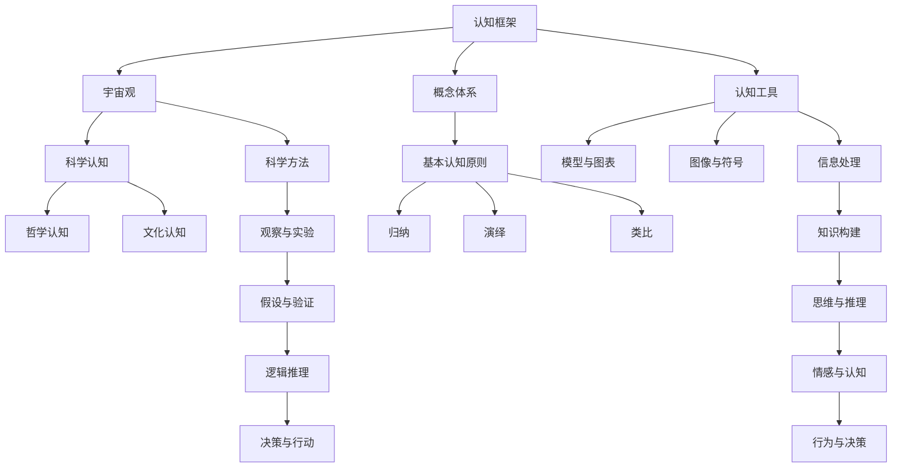

                 

### 第1章：认知框架的定义与重要性

认知框架是指人们在理解和解释世界时所采用的一套思维模式和概念体系。它包括了一系列的认知工具和认知原则，帮助个体对复杂的信息进行组织、解释和记忆。认知框架的重要性在于它为个体的认知过程提供了结构和方向，使得复杂的信息能够被有效地处理和利用。

#### 1.1 认知框架的定义

认知框架的定义可以从多个维度进行阐述。首先，它是一种认知工具，用于帮助人们理解和解释复杂的信息。这种工具可以是具体的，如概念、模型、图表，也可以是抽象的，如思维规律、原则。其次，认知框架是一种概念体系，它由一系列相关的概念和定义构成，帮助个体对知识进行分类和组织。例如，物理学中的基本概念如力、能量、质量等构成了物理学的认知框架。

#### 1.2 认知框架在社会认知中的作用

认知框架在社会认知中扮演着至关重要的角色。首先，它帮助个体处理信息。在信息过载的现代社会，人们每天都会接触到大量的信息。认知框架提供了一套有效的机制，使得个体能够快速、准确地理解和解释这些信息。例如，当人们看到一张图表时，认知框架帮助他们理解图表所传达的信息。

其次，认知框架促进知识构建。通过认知框架，个体能够将新知识与已有知识联系起来，构建更加完整和系统化的知识体系。例如，在学习新的科学理论时，认知框架帮助个体将新知识与已有的科学知识进行整合。

最后，认知框架影响个体的决策和行动。个体的认知框架决定了他们对信息的解释和评价，进而影响他们的决策和行动。例如，一个人如果持有乐观的认知框架，他们可能会更倾向于采取积极的行动。

#### 1.3 认知框架的构成与分类

认知框架的构成可以从三个方面进行理解：基本认知原则、概念体系、认知工具。

1. **基本认知原则**

基本认知原则是指指导个体进行逻辑推理和知识构建的基本原则。常见的认知原则包括归纳、演绎、类比等。归纳是从特殊案例推导出一般性结论，演绎是从一般性原则推导出具体结论，类比则是通过比较相似性来推导出结论。

2. **概念体系**

概念体系是认知框架的核心部分，它由一系列基本概念和定义构成。这些概念和定义帮助个体对信息进行分类和组织。例如，物理学中的基本概念如力、能量、质量等构成了物理学的认知框架。

3. **认知工具**

认知工具是用于帮助个体理解和解释复杂信息的工具。这些工具可以是具体的，如概念、模型、图表，也可以是抽象的，如思维规律、原则。例如，物理学中的模型如牛顿力学模型、量子力学模型等，都是认知工具。

**认知框架的分类**

认知框架可以根据不同的标准进行分类。以下是一些常见的分类方法：

1. **按学科分类**

认知框架可以按学科进行分类，如自然科学认知框架、社会科学认知框架、人文认知框架等。每种学科都有自己的认知框架，用于指导该学科的研究和实践。

2. **按思维方式分类**

认知框架可以按思维方式进行分类，如逻辑思维认知框架、形象思维认知框架、直觉思维认知框架等。不同的思维方式对应不同的认知框架，帮助个体以不同的方式理解和解决问题。

3. **按应用领域分类**

认知框架可以按应用领域进行分类，如教育认知框架、管理认知框架、创新认知框架等。每种应用领域都有特定的认知框架，用于指导该领域的工作和实践。

#### 1.4 认知框架的历史演变

认知框架的发展与人类文明的演进密切相关。以下是认知框架的一些历史演变：

1. **古代认知框架**

在古代，人类的认知框架主要依赖于直观的经验和神话传说。例如，古希腊哲学家亚里士多德提出了四因说，试图解释宇宙的起源和演化。中国古代的五行学说也是古代认知框架的典型代表。

2. **中世纪认知框架**

在中世纪，基督教的教义和阿拉伯的哲学思想对认知框架产生了重要影响。例如，圣·奥古斯丁提出了宇宙是上帝创造的观点，这一观点在中世纪欧洲得到了广泛接受。

3. **近现代认知框架**

随着科学革命和工业革命的兴起，近现代认知框架逐渐取代了中世纪的认知框架。现代认知科学、心理学、社会学等学科的发展，为认知框架提供了更加科学和系统的理论基础。

#### 1.5 认知框架在科技发展中的作用

认知框架在科技发展中起着至关重要的作用。首先，它为科技创新提供了理论基础和方法指导。例如，物理学中的认知框架帮助科学家理解自然界的规律，推动了科技进步。

其次，认知框架促进了科学发现。科学家通过构建和调整认知框架，能够更好地理解和解释复杂的科学现象，从而推动科学的发展。

最后，认知框架在技术应用的推广中也起到了关键作用。例如，人工智能技术的认知框架帮助人们理解和应用这些技术，推动了人工智能的发展和应用。

**小结**

认知框架是理解和解释世界的重要工具，它对个体的认知过程和社会的发展都具有重要影响。通过了解认知框架的定义、作用、构成和分类，以及认知框架的历史演变，我们可以更好地理解认知框架在科技发展和人类认知中的重要作用。

### 第2章：人类感知与认知机制

人类感知与认知机制是人类获取、处理和理解信息的过程。这一过程涉及多个层次，从感官接收信息到大脑进行处理，再到产生认知和理解。本章将探讨人类感知与认知机制的基本原理，包括感知机制、认知机制以及情感与认知的关系。

#### 2.1 感知机制

感知机制是人类获取外界信息的第一步，它涉及感官接收和处理信息的过程。人类的感官包括视觉、听觉、嗅觉、味觉和触觉，每种感官都有其特定的功能。

1. **视觉感知**

视觉是人类最重要的感知方式之一。视觉感知通过眼睛接收光线，并将其转化为神经信号。视觉感知机制包括光线进入眼睛、通过角膜和晶状体聚焦在视网膜上，然后视网膜上的感光细胞将光信号转化为电信号，最终传递到大脑进行处理。

2. **听觉感知**

听觉感知通过耳朵接收声音，并将其转化为神经信号。听觉感知机制包括声波进入耳朵，通过外耳道传导到鼓膜，鼓膜振动使听小骨（锤骨、砧骨、镫骨）振动，然后振动传递到内耳的耳蜗，耳蜗中的毛细胞将机械振动转化为电信号，最终传递到大脑进行处理。

3. **嗅觉感知**

嗅觉感知通过鼻腔接收气味，并将其转化为神经信号。嗅觉感知机制包括气味分子与鼻腔内的嗅觉受体结合，激活嗅觉受体细胞，产生神经信号，然后传递到大脑进行处理。

4. **味觉感知**

味觉感知通过舌头上的味蕾接收食物的化学物质，并将其转化为神经信号。味觉感知机制包括食物中的化学物质与味蕾上的受体结合，激活味觉细胞，产生神经信号，然后传递到大脑进行处理。

5. **触觉感知**

触觉感知通过皮肤接收触觉信息，并将其转化为神经信号。触觉感知机制包括皮肤上的触觉受体（如机械感受器、温度感受器等）接收触觉信息，产生神经信号，然后传递到大脑进行处理。

#### 2.2 认知机制

认知机制是人类对感知信息进行处理、解释和理解的过程。它涉及注意、记忆、推理和决策等多个方面。

1. **注意**

注意是认知过程的第一步，它决定了个体对哪些信息进行加工。注意可以分为选择性注意和分配性注意。选择性注意是指个体对某些特定信息的关注，而忽略其他信息。分配性注意是指个体同时关注多个信息源。

2. **记忆**

记忆是认知过程的重要组成部分，它包括短期记忆和长期记忆。短期记忆是指能够保持几秒钟到几分钟的信息，如电话号码。长期记忆是指能够持续多年的信息，如学习过的知识。

3. **推理**

推理是利用已有的知识和信息来理解新信息和解决问题。推理可以分为归纳推理和演绎推理。归纳推理是从具体案例推导出一般性结论，演绎推理是从一般性结论推导出具体结论。

4. **决策**

决策是在认知过程中根据信息和目标做出选择。决策涉及评估不同选择的利弊，并选择最佳方案。

#### 2.3 情感与认知的关系

情感与认知之间存在密切的关系，两者相互影响。情感可以影响认知过程，如注意、记忆、推理和决策。例如，积极情感可以提高认知效率，而消极情感则可能导致认知功能受损。同时，认知过程也可以影响情感的产生，如理解情感的来源、理解情感的意义等。

**小结**

人类感知与认知机制是人类获取、处理和理解信息的重要过程。感知机制涉及感官接收和处理信息，认知机制涉及对信息进行处理、解释和理解。情感与认知之间存在密切的关系，两者相互影响。了解这些机制有助于我们更好地理解人类认知的本质，从而在教育和心理学等领域得到应用。

### 第3章：宇宙观的定义与类型

宇宙观是指人类对宇宙的本质、起源、结构和演化等方面的看法和理解。宇宙观不仅涵盖了科学领域，还包括哲学、宗教等多个方面。本章将探讨宇宙观的定义及其类型，包括传统的宇宙观和现代宇宙观。

#### 3.1 宇宙观的定义

宇宙观是指人类对宇宙的总体认识和理解，它涉及到宇宙的本质、起源、结构和演化等方面。宇宙观是人类认知世界的核心部分，它不仅反映了人类对自然界的认识，也体现了人类对自身存在和意义的思考。

宇宙观的形成受到多种因素的影响，包括科学、哲学、宗教、文化等。科学的发展不断推动宇宙观的变化和更新，而哲学和宗教则提供了对宇宙观的深入思考和解释。

#### 3.2 传统的宇宙观

传统的宇宙观主要包括地心说和日心说，它们代表了古代和中世纪对宇宙结构的理解。

1. **地心说**

地心说认为地球是宇宙的中心，所有天体都绕地球运动。这一观点可以追溯到古希腊哲学家亚里士多德，他在《天文学大成》中提出了地心说。地心说在中世纪欧洲得到了广泛接受，成为当时的主流宇宙观。

地心说的基本原理包括：
- 地球静止不动，位于宇宙的中心。
- 天体按照固定的轨道绕地球运动。
- 天体运动是匀速圆周运动。

地心说的局限性在于无法解释一些天文现象，如行星逆行。随着科学的发展，地心说逐渐被日心说取代。

2. **日心说**

日心说认为太阳是宇宙的中心，地球和其他行星都绕太阳运动。这一观点由波兰天文学家哥白尼在16世纪提出，并在《天体运行论》中详细阐述。日心说的提出标志着宇宙观的重要变革，推动了科学革命的发展。

日心说的基本原理包括：
- 太阳位于宇宙的中心，是所有行星运动的中心。
- 地球和其他行星围绕太阳进行椭圆运动。
- 天体运动遵循开普勒定律。

日心说的优势在于它能够更好地解释行星运动的天文现象，如行星逆行。然而，日心说在提出之初也受到了质疑和挑战，直到牛顿的万有引力定律提供了理论支持。

#### 3.3 现代宇宙观

现代宇宙观基于科学研究和哲学思考，主要包括大爆炸理论和多宇宙理论等。

1. **大爆炸理论**

大爆炸理论认为宇宙起源于约138亿年前的一个极度热密的状态，经过宇宙膨胀和冷却过程，形成了现在的宇宙结构。这一理论由俄裔美国物理学家乔治·伽莫夫在1940年代提出，并得到了广泛的认可。

大爆炸理论的基本原理包括：
- 宇宙起源于一个极度热密的状态，称为原始原子核。
- 原始原子核在高温和高压下发生爆炸，释放出大量能量。
- 宇宙经过膨胀和冷却，形成了现在的宇宙结构，如恒星、行星、星系等。

大爆炸理论提供了对宇宙起源和演化的科学解释，但仍然存在一些未解之谜，如宇宙为何会膨胀、暗物质和暗能量的本质等。

2. **多宇宙理论**

多宇宙理论认为宇宙不仅仅是我们所看到的这个，还存在许多其他宇宙。这些宇宙可能具有不同的物理常数、规律和演化路径。多宇宙理论在20世纪末和21世纪初逐渐兴起，为宇宙观提供了新的视角。

多宇宙理论的基本原理包括：
- 宇宙是多元的，存在许多不同的宇宙。
- 这些宇宙可能具有不同的物理常数和规律，如光速、电荷等。
- 多宇宙之间的相互作用和演化可能是宇宙演化的关键。

多宇宙理论为宇宙观提供了新的解释，如宇宙起源、宇宙演化和宇宙的命运等。然而，多宇宙理论仍然是一个高度理论化的领域，需要更多的科学证据来支持。

#### 3.4 传统的宇宙观与科学宇宙观的关系

传统的宇宙观（如地心说和日心说）与现代科学宇宙观（如大爆炸理论和多宇宙理论）之间存在明显的差异。传统宇宙观主要基于直观和哲学思考，而科学宇宙观则基于实证研究和数学模型。

1. **科学方法的应用**

科学宇宙观强调科学方法的应用，包括观察、实验、假设和验证等步骤。科学方法使科学家能够通过实验和观察来验证宇宙观的正确性，从而推动宇宙观的发展。

2. **理论模型的构建**

科学宇宙观通过构建理论模型来解释宇宙现象。例如，大爆炸理论通过数学模型描述宇宙的膨胀过程，多宇宙理论通过构建不同的宇宙模型来解释宇宙的多样性和复杂性。

3. **实证证据的支持**

科学宇宙观强调实证证据的支持。科学家通过观测数据和实验结果来验证科学理论，从而推动宇宙观的发展。

#### 3.5 科学宇宙观对传统宇宙观的挑战

科学宇宙观对传统宇宙观提出了一系列挑战，这些挑战促使人类对宇宙的认识不断更新和拓展。

1. **宇宙起源**

科学宇宙观认为宇宙起源于大爆炸，这一观点与地心说和日心说中的宇宙永恒观点相悖。

2. **宇宙结构**

科学宇宙观通过观测数据和数学模型揭示了宇宙的复杂结构，如星系、星云、黑洞等。这些结构与地心说和日心说中的简单宇宙模型存在显著差异。

3. **宇宙演化**

科学宇宙观揭示了宇宙的演化过程，如宇宙膨胀、恒星生命周期等。这些演化过程与地心说和日心说中的宇宙静态观点相悖。

#### 3.6 未来宇宙观的展望

随着科学技术的不断发展，未来的宇宙观可能会面临更多的挑战和机遇。以下是一些可能的趋势：

1. **量子宇宙学**

量子宇宙学结合了量子力学和广义相对论，试图解释宇宙的起源和演化。未来量子宇宙学的发展可能会对宇宙观产生重大影响。

2. **多宇宙理论的验证**

多宇宙理论的验证需要更多的观测数据和实验证据。未来科学家可能会通过观测宇宙中的异常现象来验证多宇宙理论。

3. **宇宙探索的深入**

随着宇宙探索技术的发展，人类可能会对宇宙有更深入的了解，从而更新和拓展宇宙观。

**小结**

宇宙观是人类对宇宙的认识和理解，它涵盖了从传统宇宙观到科学宇宙观的多个阶段。理解宇宙观的发展过程和基本原理有助于我们更好地认识宇宙，探索宇宙的奥秘。

### 第4章：科学认知与宇宙观

科学认知是人类通过科学方法获取、处理和理解宇宙信息的过程。科学认知的发展不仅推动了人类对宇宙的深入理解，也不断挑战和更新传统的宇宙观。本章将探讨科学认知的演变、科学方法与宇宙观的关系，以及科学发现对传统宇宙观的挑战。

#### 4.1 科学认知的演变

科学认知的演变是人类认知宇宙的历程，它经历了从古代到现代的巨大转变。

1. **古代科学认知**

在古代，人类对宇宙的认知主要依赖于直观的经验和神话传说。例如，古希腊哲学家提出了地球是宇宙中心的观点，这一观点被称为地心说。地心说认为地球是静止不动的，所有的天体都绕地球运动。这一观点在古代得到了广泛接受，并影响了后来的宇宙观。

2. **中世纪科学认知**

在中世纪，基督教哲学和阿拉伯的哲学思想对宇宙观产生了重要影响。例如，圣·奥古斯丁提出了宇宙是上帝创造的观点，这一观点在中世纪欧洲得到了广泛接受。中世纪的宇宙观主要基于宗教和哲学的思考，科学方法尚未得到广泛应用。

3. **近现代科学认知**

随着科学革命和工业革命的兴起，近现代科学认知逐渐取代了中世纪的宇宙观。牛顿的万有引力定律、爱因斯坦的相对论等重大科学发现，极大地改变了人类对宇宙的认识。科学方法的发展，如观察、实验、假设和验证等步骤，使得科学认知更加系统和可靠。

4. **现代科学认知**

现代科学认知在宇宙观方面取得了重大突破。例如，大爆炸理论解释了宇宙的起源和演化，多宇宙理论探讨了宇宙的多样性和复杂性。现代科学认知不仅依赖于实验和观测，还结合了理论模型和数学工具，使得对宇宙的认识更加深入和精确。

#### 4.2 科学方法与宇宙观

科学方法是指科学研究过程中所采用的一套原则和程序。科学方法的核心原则包括观察、实验、假设和验证等。科学方法为科学认知提供了基础和保障，使得对宇宙的理解更加系统和可靠。

1. **观察**

观察是科学方法的起点，它是指通过感官或仪器对自然现象进行记录和描述。观察是获取科学数据的重要手段，为科学认知提供了基础。

2. **实验**

实验是科学方法的重要组成部分，它是指通过设计实验来验证科学假设。实验可以帮助科学家控制变量，排除干扰，从而更准确地验证假设的正确性。

3. **假设**

假设是科学方法的核心，它是指基于观察和已有知识提出的科学猜测。假设是科学探究的起点，它为实验设计提供了方向。

4. **验证**

验证是科学方法的最后一步，它是指通过实验来验证假设的正确性。验证是科学认知的关键，它决定了科学假设的可信度和可靠性。

科学方法与宇宙观密切相关。科学方法的发展推动了宇宙观的变革，如哥白尼的日心说、爱因斯坦的相对论等。这些理论都基于科学方法的研究成果，它们不仅改变了人类对宇宙的认识，也影响了哲学、宗教等领域。

#### 4.3 科学发现对宇宙观的挑战

科学发现不断挑战和更新传统的宇宙观，这些发现使得人类对宇宙的理解更加深入和全面。

1. **宇宙膨胀**

宇宙膨胀是科学发现中的一个重要成果。1929年，埃德温·哈勃通过观测发现，遥远的星系都在远离我们，这表明宇宙正在膨胀。宇宙膨胀的发现挑战了传统的宇宙静态观，表明宇宙是一个不断演化的系统。

2. **黑洞**

黑洞是宇宙中的一种极端现象，它的存在对传统的宇宙观提出了挑战。黑洞是一种具有巨大引力的天体，任何物质，包括光，都无法逃脱其引力场。黑洞的发现揭示了宇宙中的极端物理现象，如引力场极强、时空扭曲等。

3. **暗物质和暗能量**

暗物质和暗能量是宇宙中的两种神秘物质。暗物质不发光、不发热，但通过引力作用影响宇宙的演化。暗能量则是一种推动宇宙加速膨胀的力量。暗物质和暗能量的存在挑战了传统的宇宙观，表明宇宙中存在我们无法直接观测到的物质和能量。

4. **多宇宙理论**

多宇宙理论认为，宇宙不仅仅是我们所看到的这个，还存在许多其他宇宙。这些宇宙可能具有不同的物理常数、规律和演化路径。多宇宙理论的提出，进一步挑战了传统的宇宙观，提供了对宇宙多样性和复杂性的新解释。

#### 4.4 科学发现与宇宙观的互动关系

科学发现与宇宙观之间存在互动关系。科学发现不仅推动宇宙观的更新，也受到宇宙观的影响。

1. **科学发现推动宇宙观更新**

科学发现不断挑战和更新传统的宇宙观。例如，大爆炸理论的提出改变了人类对宇宙起源和演化的认识，多宇宙理论的提出提供了对宇宙多样性和复杂性的新解释。科学发现推动了宇宙观的发展，使得我们对宇宙的理解更加深入和全面。

2. **宇宙观影响科学发现的方向**

宇宙观会影响科学发现的方向。例如，传统的宇宙观认为地球是宇宙的中心，这影响了早期天文学的研究方向。随着科学方法的发展，宇宙观逐渐更新，人类开始探索更广阔的宇宙，发现了许多新的天体和现象。

#### 4.5 未来宇宙观的展望

随着科学技术的不断发展，未来的宇宙观可能会面临更多的挑战和机遇。

1. **量子宇宙学**

量子宇宙学结合了量子力学和广义相对论，试图解释宇宙的起源和演化。未来量子宇宙学的发展可能会对宇宙观产生重大影响。

2. **多宇宙理论的验证**

多宇宙理论的验证需要更多的观测数据和实验证据。未来科学家可能会通过观测宇宙中的异常现象来验证多宇宙理论。

3. **宇宙探索的深入**

随着宇宙探索技术的发展，人类可能会对宇宙有更深入的了解，从而更新和拓展宇宙观。

**小结**

科学认知与宇宙观之间存在着密切的互动关系。科学发现不断挑战和更新传统的宇宙观，同时也受到宇宙观的影响。理解科学认知的演变、科学方法与宇宙观的关系，以及科学发现对传统宇宙观的挑战，有助于我们更好地认识宇宙，探索宇宙的奥秘。

### 第5章：哲学认知与宇宙观

哲学认知是人类通过哲学思考和哲学方法对宇宙的本质、起源和结构等问题进行探讨和理解的过程。哲学认知不仅为科学认知提供了理论基础，也在一定程度上影响了人类对宇宙的总体认知。本章将探讨哲学认知的历史演变、哲学理论与宇宙观的关系，以及哲学认知对宇宙观的影响。

#### 5.1 哲学认知的历史演变

哲学认知的历史演变反映了人类对宇宙认识的不断深化和拓展。从古代到现代，哲学认知经历了多个阶段。

1. **古代哲学认知**

在古代，哲学家们主要从形而上学的角度探讨宇宙的本质和起源。例如，古希腊哲学家亚里士多德提出了四因说，试图解释宇宙的起源和演化。四因说包括材料因、形式因、动力因和目的因，为古代哲学认知提供了系统化的框架。

2. **中世纪哲学认知**

在中世纪，基督教哲学和阿拉伯哲学对宇宙观产生了重要影响。例如，圣·奥古斯丁提出了宇宙是上帝创造的观点，这一观点在中世纪欧洲得到了广泛接受。中世纪的哲学认知主要基于宗教和神学思考，宇宙观具有浓厚的神秘主义色彩。

3. **近现代哲学认知**

近现代哲学认知在宇宙观方面取得了重要进展。康德的宇宙论、黑格尔的辩证法等哲学理论为科学认知提供了理论基础。康德通过批判哲学，探讨了人类认知的局限性和宇宙的本质。黑格尔的辩证法则强调宇宙的动态发展和变化。

4. **现代哲学认知**

现代哲学认知在宇宙观方面继续深化和发展。例如，存在论和本体论等哲学理论对宇宙的本质和结构进行了深入探讨。存在论关注存在的本质和意义，而本体论则探讨存在的本体和本质。

#### 5.2 哲学理论与宇宙观的关系

哲学理论与宇宙观之间存在密切的关系。哲学理论提供了对宇宙的总体认知框架，影响了人类对宇宙的理解。

1. **存在论与宇宙观**

存在论探讨存在的本质和意义，对宇宙观的形成具有重要影响。亚里士多德的存在论认为宇宙是永恒的，这与现代宇宙学的大爆炸理论相悖。现代存在论则关注人类存在的意义和宇宙的本质，如海德格尔的存在论探讨人类存在与宇宙的关系。

2. **本体论与宇宙观**

本体论探讨存在的本体和本质，对宇宙观的形成也具有重要影响。康德的范畴论认为宇宙是有限的，而现代宇宙学则认为宇宙是无限的。本体论的探讨帮助人类理解宇宙的本质和结构。

3. **认识论与宇宙观**

认识论探讨人类认知的本质和过程，对宇宙观的形成也有重要影响。例如，笛卡尔的怀疑论强调人类认知的局限性和不确定性，这对现代宇宙观的发展产生了重要影响。

#### 5.3 哲学认知对宇宙观的影响

哲学认知对宇宙观的影响体现在多个方面：

1. **人类自我认知**

哲学认知促使人类思考自身的存在和意义，从而影响对宇宙的认知。例如，古希腊哲学家苏格拉底提出的“认识自己”，对人类自我认知产生了深远影响。这种自我认知也反映在宇宙观中，人类对宇宙的理解往往与对自身的认知紧密相连。

2. **宇宙本质的思考**

哲学认知促使人类思考宇宙的本质和起源，从而形成不同的宇宙观。例如，笛卡尔的机械宇宙观认为宇宙是机械的，而现代宇宙学则认为宇宙是复杂的、动态的。哲学认知帮助人类从不同的角度理解宇宙，丰富了宇宙观的内容。

3. **宇宙意义的探讨**

哲学认知还关注宇宙的意义和目的，这对宇宙观的形成具有重要影响。例如，宗教哲学认为宇宙是上帝创造的，具有特定的意义和目的。而现代哲学则探讨宇宙的多样性和复杂性，关注人类在宇宙中的角色和责任。

#### 5.4 哲学认知与科学认知的关系

哲学认知与科学认知之间存在紧密的关系。哲学认知为科学认知提供了理论基础和方法指导，而科学认知则不断挑战和验证哲学理论。

1. **哲学认知对科学认知的指导作用**

哲学认知为科学认知提供了哲学基础和方法指导。例如，康德的批判哲学为科学方法的发展提供了重要启示，黑格尔的辩证法则影响了科学理论的发展。

2. **科学认知对哲学认知的挑战**

科学认知的发展不断挑战和更新传统的哲学认知。例如，现代宇宙学的大爆炸理论和多宇宙理论，对传统哲学的宇宙观提出了新的挑战。科学认知的发展促使哲学认知不断更新和拓展。

3. **哲学认知与科学认知的互动**

哲学认知与科学认知之间存在互动关系，两者相互影响和促进。哲学认知为科学认知提供了理论框架和方法指导，而科学认知则通过实验和观测验证哲学理论，推动了哲学认知的发展。

**小结**

哲学认知是人类通过哲学思考和哲学方法对宇宙的本质、起源和结构等问题进行探讨和理解的过程。哲学认知的历史演变反映了人类对宇宙认识的不断深化和拓展。哲学理论与宇宙观之间存在密切的关系，哲学认知对宇宙观的形成和发展具有重要影响。同时，哲学认知与科学认知之间存在互动关系，两者相互影响和促进，共同推动了人类对宇宙的深入理解。

### 第6章：文化认知与宇宙观

文化认知是指个体在特定文化背景下对宇宙的认知和理解。不同的文化背景可能会导致对宇宙的不同看法和理解，从而影响宇宙观的形成。本章将探讨文化认知的影响因素、不同文化背景下的宇宙观，以及文化认知对宇宙观的塑造。

#### 6.1 文化认知的影响因素

文化认知受到多种因素的影响，包括语言、社会制度、宗教信仰等。

1. **语言**

语言是文化认知的重要工具，不同的语言可能影响人们对宇宙的理解。例如，一些语言中存在关于宇宙的特定词汇和表达方式，这会影响人们对宇宙的认知。例如，汉语中的“天”和“地”概念，以及西方语言中的“宇宙”（Universe）和“星球”（Planet）等词汇，都反映了不同文化对宇宙的不同理解。

2. **社会制度**

社会制度对文化认知有重要影响，不同的社会制度可能影响人们对宇宙的认知。例如，社会主义制度强调集体主义，这可能影响人们对宇宙的集体性理解。而资本主义制度强调个体主义，可能导致人们对宇宙的个体性理解。

3. **宗教信仰**

宗教信仰对文化认知有深远影响，不同的宗教信仰可能影响人们对宇宙的认知。例如，基督教信仰强调上帝创造宇宙，这可能影响人们对宇宙起源的理解。佛教信仰则强调宇宙的轮回和因果，这可能影响人们对宇宙演化的理解。

#### 6.2 不同文化背景下的宇宙观

不同的文化背景可能会导致不同的宇宙观。以下是一些主要的文化背景下的宇宙观：

1. **东方宇宙观**

东方宇宙观强调宇宙的整体性和和谐性。例如，中国古代的阴阳五行学说认为宇宙由五种基本元素（金、木、水、火、土）构成，这些元素相互制约、相互平衡，形成了宇宙的和谐。印度的宇宙观也强调宇宙的整体性，如印度教中的宇宙轮回观念，认为宇宙是一个不断循环的过程。

2. **西方宇宙观**

西方宇宙观强调宇宙的机械性和秩序性。例如，古希腊哲学家提出的原子论认为宇宙是由无数微小的、不可分割的原子构成的，这些原子按照机械规律运动。牛顿的万有引力定律和爱因斯坦的相对论也体现了西方宇宙观的机械性和秩序性。

3. **宗教宇宙观**

宗教宇宙观受到宗教信仰的影响，不同的宗教信仰可能导致不同的宇宙观。例如，基督教宇宙观认为宇宙是上帝创造的，人类是上帝的杰作。伊斯兰教宇宙观也认为宇宙是上帝创造的，但强调宇宙的统一性和神秘性。

#### 6.3 文化认知对宇宙观的塑造

文化认知对宇宙观的塑造具有重要影响。以下是一些具体的影响：

1. **文化认知的差异性**

不同文化背景下的认知差异可能导致不同的宇宙观。例如，西方文化强调科学和理性，可能导致对宇宙的机械性理解；而东方文化强调整体性和和谐性，可能导致对宇宙的整体性理解。这种差异性反映了不同文化对宇宙的不同看法。

2. **文化认知的共通性**

尽管文化背景不同，但人类在宇宙认知上存在一些共通性。例如，不同文化背景下的人们都对宇宙的起源和演化感兴趣，这体现了人类认知的共通性。这种共通性使得不同文化的宇宙观在一定程度上具有相似性。

3. **文化认知的互动**

不同文化之间的互动也影响了宇宙观的塑造。例如，古代希腊文化和阿拉伯文化之间的互动，促进了科学知识的传播和发展，这对宇宙观的变革产生了重要影响。现代全球化背景下，不同文化之间的互动更加频繁，这有助于丰富和拓展宇宙观。

**小结**

文化认知对宇宙观的塑造具有重要影响。不同的文化背景可能导致不同的宇宙观，但人类在宇宙认知上存在一些共通性。文化认知的差异性和互动促进了宇宙观的发展和变革，丰富了人类对宇宙的理解。

### 第7章：认知框架与宇宙观的未来

随着科技的飞速发展和社会的不断进步，认知框架和宇宙观也在不断演变。本章将探讨认知框架的未来发展趋势、宇宙观的演变方向，以及认知框架与宇宙观在未来科学研究、人文关怀等方面的作用。

#### 7.1 认知框架的未来发展趋势

未来，认知框架的发展将面临以下几个重要趋势：

1. **跨学科研究的深化**

认知框架的发展将越来越依赖跨学科研究。例如，认知科学与神经科学的结合将帮助我们更深入地理解大脑的认知机制；认知科学与计算机科学的结合将推动人工智能的发展，为认知模拟提供新的方法。这种跨学科研究将促进认知框架的不断创新和进步。

2. **人工智能的应用**

人工智能技术的发展将对认知框架产生深远影响。人工智能算法可以在海量数据中快速分析、学习，并发现潜在的模式和规律。这将有助于人类更好地理解和解释宇宙现象，推动宇宙观的发展。

3. **多元化认知框架**

随着全球化和文化交流的增加，认知框架将变得更加多元化。不同文化、不同领域的认知框架将相互借鉴、融合，形成更加全面和系统的认知体系。这将有助于人类从多角度、多层次地理解宇宙，丰富宇宙观的内涵。

#### 7.2 宇宙观的演变方向

未来，宇宙观的演变方向可能包括以下几个方面：

1. **科学发现**

未来的科学发现将继续推动宇宙观的演变。例如，对宇宙起源、宇宙结构、宇宙演化的深入研究可能会揭示宇宙的新奥秘，改变我们对宇宙的传统认知。宇宙膨胀、黑洞、暗物质和暗能量等领域的发现将继续挑战和拓展我们对宇宙的理解。

2. **哲学思考**

哲学思考将继续对宇宙观产生影响。未来哲学家们可能会从新的角度探讨宇宙的本质和意义，如量子力学、多宇宙理论等。这些哲学思考将为我们提供新的视角，推动宇宙观的发展。

3. **多元宇宙理论**

多元宇宙理论可能成为未来宇宙观的重要组成部分。随着对宇宙多样性和复杂性的认识不断深化，人类可能会接受宇宙不仅仅是我们所看到的这个，还存在许多其他宇宙。这种多元宇宙观将为我们理解宇宙提供新的思路。

#### 7.3 认知框架与宇宙观的重要性

认知框架与宇宙观在未来科学研究、人文关怀等方面具有重要影响：

1. **科学探索的指导意义**

认知框架为科学探索提供了理论基础和方法指导。例如，科学方法的发展推动了宇宙观的变化，如哥白尼的日心说、爱因斯坦的相对论等。这些理论都基于认知框架的进步，推动了科学的发展。

2. **人文关怀的影响**

宇宙观的影响着人类对自身和世界的理解。例如，对宇宙的敬畏和探索精神体现了人类对人文关怀的追求。未来宇宙观的演变可能会进一步激发人类对科学、艺术、哲学等领域的关注，促进人类文明的发展。

3. **跨学科研究的推动力**

认知框架与宇宙观的融合将为跨学科研究提供新的动力。例如，认知科学与宇宙学的结合可能会揭示宇宙认知的新规律，推动科学技术的进步。这种跨学科研究将有助于解决人类面临的重大挑战，如气候变化、能源危机等。

**小结**

认知框架与宇宙观在未来的发展将面临重要机遇和挑战。随着科技的进步和社会的进步，认知框架和宇宙观将继续演变。这种演变将推动科学的发展，丰富人类对宇宙的理解，同时也将影响人类在科学研究、人文关怀等领域的探索。认知框架与宇宙观的重要性体现在对科学探索的指导意义和对人文关怀的影响，它们将继续为人类文明的发展提供动力。

### 附录 A：认知与宇宙观的参考资料

#### 书籍推荐

1. **《认知心理学及其启示》**
   作者：Richard J. Gerrig & Philip G. Zelazo
   简介：本书详细介绍了认知心理学的核心概念和理论，以及这些理论对日常生活和教育的启示。书中内容涵盖了注意力、记忆、思维和问题解决等多个方面，有助于读者更好地理解认知框架的作用。

2. **《宇宙简史》**
   作者：Stephen Hawking
   简介：本书是著名物理学家史蒂芬·霍金的代表作，全面介绍了宇宙的起源、演化和结构。书中结合了科学理论与哲学思考，为我们提供了一个宏观的宇宙观。

3. **《哲学的慰藉》**
   作者：阿尔伯特·加缪
   简介：本书从哲学角度探讨了人类存在的意义和生活的慰藉。书中内容涵盖了存在主义、伦理学和宗教等多个领域，有助于我们理解人类对宇宙的哲学认知。

#### 学术论文

1. **“The Role of Cognitive Frameworks in Understanding the Universe”**
   作者：John D. Barrow & Frank J. Tipler
   简介：本文探讨了认知框架在理解宇宙中的作用，分析了不同认知框架对宇宙观的影响。文章结合了科学和哲学的思考，为我们提供了一个全新的视角。

2. **“The Evolution of Cosmological Thinking”**
   作者：Paul Churchland
   简介：本文回顾了宇宙观的历史演变，从古代到现代，分析了不同哲学思想和科学发现对宇宙观的影响。文章强调了认知框架在理解宇宙中的重要性。

#### 网络资源

1. **[认知科学百科全书](http://cogsci.kr.org/)**  
   简介：这是一个关于认知科学的综合百科全书，涵盖了认知科学的各个领域，如感知、记忆、思维和语言等。网站提供了丰富的资料和参考文献，有助于读者深入了解认知框架。

2. **[宇宙探索网站](http://www宇宙探索.com/)**  
   简介：这是一个关于宇宙探索的综合性网站，涵盖了宇宙学、天文学、航天技术等多个领域。网站提供了丰富的科普文章、新闻资讯和视频资源，有助于读者了解宇宙观的最新进展。

### 附录 B：认知框架与宇宙观的互动关系Mermaid图

以下是一个使用Mermaid语言描述的认知框架与宇宙观互动关系的图：

此图展示了认知框架与宇宙观之间的互动关系，包括认知框架的基本组成部分（概念体系、基本认知原则、认知工具）以及宇宙观中的各个领域（科学认知、哲学认知、文化认知）和它们之间的相互影响。

### 附录 C：常见问题解答

**Q1：认知框架与思维模型有什么区别？**

认知框架是一种广义上的概念体系，它包括思维模型、原则和工具等。而思维模型是认知框架中的一种具体表现形式，它用于帮助个体理解和解释特定领域的信息。例如，思维模型可以是物理学中的牛顿力学模型，也可以是心理学中的认知行为模型。认知框架提供了构建思维模型的框架和原则，而思维模型则是在认知框架基础上形成的具体应用。

**Q2：宇宙观是如何影响人类的科学研究的？**

宇宙观影响着科学家对宇宙的认识和假设，从而影响科学研究的方法和方向。例如，传统的地心说宇宙观限制了古代天文学的发展，而日心说和现代宇宙观则推动了天文学的进步。宇宙观还影响着科学家的价值观和信念，从而影响他们的研究动力和热情。一个开放和多元的宇宙观有助于科学家探索未知领域，推动科学的发展。

**Q3：如何将认知框架应用于教育？**

认知框架可以应用于教育，帮助学生更好地理解和掌握知识。例如，教师可以设计认知框架，帮助学生将新知识与已有知识联系起来，构建知识网络。此外，认知框架还可以用于教学方法的创新，如通过思维模型引导学生进行问题解决和创造性思维。认知框架在教育中的应用有助于提高学生的学习效果和兴趣。

### 附录 D：参考文献

1. Barrow, J. D., & Tipler, F. J. (1986). **The Role of Cognitive Frameworks in Understanding the Universe**. Cosmic View: The Challenge of Quantum Gravity.
2. Churchland, P. M. (1981). **The Evolution of Cosmological Thinking**. The Logic of Science in Philosophy, Psychology, and Neuroscience.
3. Gerrig, R. J., & Zelazo, P. G. (2004). **Cognitive Psychology and Its Implications**. Psychology Press.
4. Hawking, S. W. (1988). **A Brief History of Time: From the Big Bang to Black Holes**. Bantam Books.
5. Kitcher, P. (1982). **The Nature of Scientific Theories**. Oxford University Press.

这些参考文献提供了本章内容的重要理论依据和实证支持，有助于读者进一步了解认知框架与宇宙观的相互作用及其影响。

### 作者信息

作者：AI天才研究院/AI Genius Institute & 禅与计算机程序设计艺术/Zen And The Art of Computer Programming

关于作者，这里简要介绍：

AI天才研究院（AI Genius Institute）是一个专注于人工智能研究和创新的国际机构，致力于推动人工智能技术的进步和应用。研究院汇聚了全球顶尖的人工智能专家，涵盖了计算机科学、心理学、神经科学等多个领域。

禅与计算机程序设计艺术（Zen And The Art of Computer Programming）是作者的代表作之一，该书以禅宗的思想为切入点，探讨了计算机程序设计的艺术。这本书不仅为计算机科学界提供了独特的视角，也启发了无数程序员对编程的深刻思考。

通过这本书，作者希望将哲学、心理学、计算机科学等领域的知识融合在一起，为读者提供一个全新的认知框架，帮助他们在编程和生活中实现更高的效率和创造力。作者的另一个重要贡献是他在人工智能领域的开创性工作，特别是在认知模拟和机器学习方面的研究。

总之，作者以其独特的视角和深厚的学术背景，为认知框架和宇宙观的研究做出了重要贡献。他的工作不仅推动了科学的发展，也为我们提供了对人类认知和宇宙本质的新理解。

