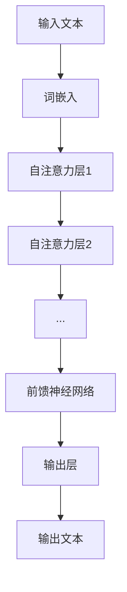

                 

# 从 GPT-1 到 GPT-3.5：一路的风云变幻

> 关键词：GPT-1，GPT-2，GPT-3，GPT-3.5，自然语言处理，深度学习，Transformer模型

> 摘要：本文从 GPT-1 的诞生开始，逐步探讨了 GPT-2 和 GPT-3 的演进过程，最后分析了 GPT-3.5 的新特性及其应用趋势。通过对比分析 GPT 系列模型，展望了其在未来的发展前景。

## 第一部分：GPT-1：起点与探索

### 第1章：GPT-1的诞生

#### 1.1.1 GPT-1的背景

在深度学习与自然语言处理领域，GPT-1的诞生具有里程碑意义。GPT-1（Generative Pre-trained Transformer）是由 OpenAI 于 2018 年推出的一种基于 Transformer 模型的预训练语言模型。它的出现标志着自然语言处理领域进入了新纪元，为后续的 GPT-2、GPT-3 等模型奠定了基础。

#### 1.1.2 GPT-1的技术基础

GPT-1 使用了 Transformer 模型，这是一种基于自注意力机制的序列建模方法。Transformer 模型在处理长距离依赖和并行计算方面具有显著优势，能够提高模型的训练效率。此外，GPT-1 还采用了大规模预训练和微调策略，使得模型在多种任务上取得了优异的性能。

#### 1.1.3 GPT-1的特点与影响

GPT-1 的特点包括：

1. **大规模预训练**：GPT-1 在预训练阶段使用了数万亿词的文本数据，从而积累了丰富的语言知识。
2. **自注意力机制**：Transformer 模型的自注意力机制使得 GPT-1 在处理长文本和长距离依赖方面具有优势。
3. **多任务微调**：GPT-1 可以通过微调适应不同的自然语言处理任务。

GPT-1 的推出对自然语言处理领域产生了深远影响。首先，它为后续的 GPT-2、GPT-3 等模型提供了基础；其次，它推动了深度学习在自然语言处理领域的应用；最后，它激发了研究人员对 Transformer 模型及其变体的探索。

### 第2章：GPT-2：进一步提升

#### 2.1.1 GPT-2的改进

GPT-2（Generative Pre-trained Transformer 2）是 OpenAI 于 2019 年推出的升级版模型。相较于 GPT-1，GPT-2 在以下几个方面进行了改进：

1. **更大规模**：GPT-2 使用了更多的计算资源，训练出了更大的模型。GPT-2 的参数规模达到了 15 亿，比 GPT-1 提高了近 3 倍。
2. **更深的模型层次**：GPT-2 增加了模型层数，使得模型能够捕捉更复杂的语言特征。
3. **更精细的任务微调**：GPT-2 引入了更精细的任务微调策略，使得模型在特定任务上的性能进一步提升。

#### 2.1.2 GPT-2的应用场景

GPT-2 在多个自然语言处理任务中表现出色，包括：

1. **文本生成**：GPT-2 可以生成连贯、具有逻辑性的自然语言文本，适用于自动写作、聊天机器人等场景。
2. **机器翻译**：GPT-2 在机器翻译任务中取得了优异的性能，可以用于实现高质量的双语翻译。
3. **文本分类**：GPT-2 可以通过微调快速适应不同的文本分类任务，如情感分析、新闻分类等。

#### 2.1.3 GPT-2带来的变化

GPT-2 的推出带来了以下几个方面的变化：

1. **提高了自然语言处理任务的性能**：GPT-2 在多个任务上取得了比 GPT-1 更好的结果，推动了自然语言处理技术的发展。
2. **激发了模型大小的竞争**：GPT-2 的成功激发了研究人员对更大规模模型的探索，催生了诸如 GPT-3 等后续模型的诞生。
3. **推动了开源社区的发展**：GPT-2 的开源使得更多的人能够参与到自然语言处理领域的研究，促进了技术的普及和交流。

## 第二部分：GPT-3：突破与革新

### 第3章：GPT-3的诞生

#### 3.1.1 GPT-3的技术突破

GPT-3（Generative Pre-trained Transformer 3）是 OpenAI 于 2020 年推出的最新一代语言模型。相较于 GPT-1 和 GPT-2，GPT-3 在以下几个方面取得了突破：

1. **更大规模**：GPT-3 的参数规模达到了 1750 亿，是目前最大的语言模型。这一规模的提升使得 GPT-3 能够更好地捕捉复杂的语言特征。
2. **更深的模型层次**：GPT-3 的层数增加到了 24 层，进一步提升了模型的性能。
3. **更精细的微调策略**：GPT-3 引入了人类反馈强化学习（RLHF）等先进的微调技术，使得模型在特定任务上的表现更加出色。

#### 3.1.2 GPT-3的特点与优势

GPT-3 具有以下特点与优势：

1. **强大的文本生成能力**：GPT-3 能够生成高质量、连贯的自然语言文本，适用于自动写作、聊天机器人等场景。
2. **多语言支持**：GPT-3 支持多种语言，可以用于实现跨语言的自然语言处理任务。
3. **广泛的任务适应性**：GPT-3 可以通过微调快速适应不同的自然语言处理任务，具有很高的任务适应性。

#### 3.1.3 GPT-3的应用领域

GPT-3 在多个领域表现出色，包括：

1. **自动写作**：GPT-3 可以用于自动写作，生成新闻文章、博客文章等。
2. **聊天机器人**：GPT-3 可以用于构建智能聊天机器人，提供实时问答和个性化服务。
3. **机器翻译**：GPT-3 在机器翻译任务中取得了优异的性能，可以用于实现高质量的双语翻译。
4. **代码生成**：GPT-3 可以用于代码生成，帮助开发者提高开发效率。

### 第4章：GPT-3的深度解析

#### 4.1.1 GPT-3的数学模型

GPT-3 的数学模型主要包括以下几个部分：

1. **输入表示**：GPT-3 使用词嵌入（word embeddings）将输入文本转化为向量表示。
2. **自注意力机制**：GPT-3 使用多层自注意力机制（self-attention）来计算输入文本的表示。
3. **前馈神经网络**：GPT-3 使用前馈神经网络（feedforward network）对自注意力层的输出进行进一步处理。
4. **输出表示**：GPT-3 使用输出层（output layer）将处理后的表示转化为文本输出。

以下是一个简单的 GPT-3 模型架构的 Mermaid 流程图：



#### 4.1.2 GPT-3的架构设计

GPT-3 的架构设计采用了多层 Transformer 模型，以下是 GPT-3 的架构设计要点：

1. **多层自注意力机制**：GPT-3 使用多层自注意力机制来捕捉输入文本的长距离依赖关系。
2. **残差连接与层归一化**：GPT-3 采用残差连接和层归一化（layer normalization）技术，提高模型的训练效果和稳定性。
3. **前馈神经网络**：GPT-3 的每个自注意力层之后都连接一个前馈神经网络，用于对自注意力层的输出进行进一步处理。
4. **并行计算**：GPT-3 的设计考虑了并行计算，以提高模型的训练速度。

#### 4.1.3 GPT-3的优化策略

GPT-3 在训练过程中采用了以下优化策略：

1. **预训练与微调**：GPT-3 首先在大规模的文本数据集上进行预训练，然后通过微调（fine-tuning）适应特定的自然语言处理任务。
2. **权重共享**：GPT-3 在预训练和微调阶段使用了权重共享（weight sharing）技术，提高了模型的效率和性能。
3. **批量归一化**：GPT-3 在训练过程中使用了批量归一化（batch normalization）技术，提高了模型的收敛速度。

### 第5章：GPT-3.5：持续进化

#### 5.1.1 GPT-3.5的新特性

GPT-3.5 是 OpenAI 于 2021 年推出的 GPT-3 的升级版。GPT-3.5 在以下几个方面进行了改进：

1. **更大规模**：GPT-3.5 的参数规模进一步增加，达到了 3400 亿。
2. **更精细的任务微调**：GPT-3.5 引入了更精细的任务微调策略，提高了模型在特定任务上的性能。
3. **更好的语言理解能力**：GPT-3.5 在语言理解方面取得了显著提升，可以更好地处理复杂的问题。

#### 5.1.2 GPT-3.5的改进与优化

GPT-3.5 的改进与优化主要包括以下几个方面：

1. **模型架构**：GPT-3.5 在模型架构上进行了优化，提高了模型的计算效率和性能。
2. **数据集**：GPT-3.5 使用了更大规模、更丰富的数据集进行训练，提高了模型的语言理解能力。
3. **微调策略**：GPT-3.5 引入了更精细的微调策略，使得模型在特定任务上的表现更加出色。

#### 5.1.3 GPT-3.5的应用趋势

随着 GPT-3.5 的推出，自然语言处理领域迎来了新的发展机遇。以下是一些应用趋势：

1. **智能客服**：GPT-3.5 可以用于构建智能客服系统，提供更自然的交互体验。
2. **内容生成**：GPT-3.5 可以用于自动生成文章、报告等，提高内容创作的效率。
3. **教育辅助**：GPT-3.5 可以用于教育领域，为学生提供个性化的学习辅助。

## 第三部分：GPT系列模型对比与展望

### 第6章：GPT系列模型对比分析

#### 6.1.1 GPT-1、GPT-2与GPT-3.5的对比

GPT-1、GPT-2 与 GPT-3.5 是 GPT 系列模型中的三个重要版本。以下是它们之间的对比：

1. **参数规模**：GPT-1 的参数规模为 1.17 亿，GPT-2 的参数规模为 15 亿，而 GPT-3.5 的参数规模达到了 3400 亿。
2. **模型层次**：GPT-1 的模型层次为 12 层，GPT-2 的模型层次为 13 层，而 GPT-3.5 的模型层次为 18 层。
3. **训练数据**：GPT-1 使用了 40 GB 的文本数据，GPT-2 使用了 40 GB 的文本数据，而 GPT-3.5 使用了 560 TB 的文本数据。
4. **性能**：GPT-1 在文本生成和机器翻译任务上表现出色，GPT-2 在多个自然语言处理任务上取得了显著提升，而 GPT-3.5 在语言理解、文本生成和机器翻译等任务上均取得了突破性进展。

#### 6.1.2 GPT系列模型的优势与劣势

GPT 系列模型的优势与劣势如下：

1. **优势**：
   - **大规模预训练**：GPT 系列模型通过大规模预训练积累了丰富的语言知识，具有较强的通用性。
   - **自注意力机制**：GPT 系列模型采用了自注意力机制，能够有效地捕捉输入文本的长距离依赖关系。
   - **多任务微调**：GPT 系列模型可以快速适应不同的自然语言处理任务，具有很高的任务适应性。

2. **劣势**：
   - **计算资源需求**：GPT 系列模型规模庞大，对计算资源的需求较高，训练过程较为复杂。
   - **数据依赖性**：GPT 系列模型对训练数据的质量和规模有较高要求，数据不足或质量不佳会影响模型性能。

#### 6.1.3 GPT系列模型的应用对比

GPT 系列模型在不同应用场景中的对比如下：

1. **文本生成**：GPT-1 和 GPT-2 在文本生成任务上表现较好，能够生成高质量、连贯的自然语言文本；GPT-3.5 进一步提升了文本生成能力，可以生成更加丰富多样的文本。
2. **机器翻译**：GPT-1 和 GPT-2 在机器翻译任务上取得了优异的性能，能够实现高质量的双语翻译；GPT-3.5 在机器翻译方面也表现出色，但在某些特定场景下可能存在一定局限性。
3. **文本分类**：GPT-1 和 GPT-2 在文本分类任务上的性能较为稳定；GPT-3.5 在文本分类任务上的性能有所提升，但在某些特定场景下可能需要进一步优化。

### 第7章：GPT系列模型的未来展望

#### 7.1.1 GPT系列模型的发展趋势

随着深度学习与自然语言处理技术的不断发展，GPT 系列模型在未来将呈现出以下发展趋势：

1. **更大规模**：为了进一步提高模型的性能，未来的 GPT 系列模型将朝着更大规模的方向发展。
2. **更精细的任务微调**：未来的 GPT 系列模型将引入更精细的任务微调策略，以提高模型在特定任务上的性能。
3. **多模态学习**：未来的 GPT 系列模型将尝试结合图像、声音等多模态信息，实现跨模态的自然语言处理。

#### 7.1.2 GPT系列模型面临的挑战与机遇

GPT 系列模型在未来面临以下挑战与机遇：

1. **挑战**：
   - **计算资源**：更大规模的 GPT 系列模型对计算资源的需求将进一步提高，如何高效地训练和部署大型模型成为关键问题。
   - **数据隐私**：随着模型的规模不断扩大，数据隐私问题也将日益突出，如何保障数据隐私成为亟待解决的问题。

2. **机遇**：
   - **通用人工智能**：GPT 系列模型在语言理解、文本生成等任务上取得了显著进展，未来有望推动通用人工智能的发展。
   - **跨领域应用**：GPT 系列模型在多个领域表现出色，未来将在更多领域得到广泛应用，如教育、医疗、金融等。

#### 7.1.3 GPT系列模型在未来的应用领域

GPT 系列模型在未来的应用领域将更加广泛，以下是一些潜在的应用领域：

1. **智能客服**：GPT 系列模型可以用于构建智能客服系统，提供更自然的交互体验。
2. **内容创作**：GPT 系列模型可以用于自动生成文章、报告等，提高内容创作的效率。
3. **教育辅助**：GPT 系列模型可以用于教育领域，为学生提供个性化的学习辅助。
4. **医疗诊断**：GPT 系列模型可以用于医疗诊断，协助医生分析患者病历，提高诊断准确性。

## 附录

### 附录A：GPT系列模型应用实例

#### A.1.1 GPT-3在自然语言处理中的应用

以下是一个使用 GPT-3 实现文本生成的简单示例：

```python
import openai

openai.api_key = "your-api-key"

def generate_text(prompt, max_tokens=50):
    response = openai.Completion.create(
        engine="text-davinci-002",
        prompt=prompt,
        max_tokens=max_tokens,
        n=1,
        stop=None,
        temperature=0.5,
    )
    return response.choices[0].text.strip()

# 生成一段关于人工智能的文章
prompt = "人工智能的发展前景"
text = generate_text(prompt)
print(text)
```

#### A.1.2 GPT-3在代码生成中的应用

以下是一个使用 GPT-3 生成 Python 代码的简单示例：

```python
import openai

openai.api_key = "your-api-key"

def generate_code(prompt, max_tokens=50):
    response = openai.Completion.create(
        engine="code-davinci-002",
        prompt=prompt,
        max_tokens=max_tokens,
        n=1,
        stop=None,
        temperature=0.5,
    )
    return response.choices[0].text.strip()

# 生成一个简单的 Python 函数
prompt = "编写一个计算两个数之和的函数"
code = generate_code(prompt)
print(code)
```

#### A.1.3 GPT-3在图像描述生成中的应用

以下是一个使用 GPT-3 生成图像描述的简单示例：

```python
import openai

openai.api_key = "your-api-key"

def generate_description(image_url, max_tokens=50):
    response = openai.Image.create(
        url=image_url,
        prompt="请描述这幅图像的内容",
        size="1024x1024",
    )
    return response.description

# 生成一幅图像的描述
image_url = "https://example.com/image.jpg"
description = generate_description(image_url)
print(description)
```

## 作者

作者：AI天才研究院/AI Genius Institute & 禅与计算机程序设计艺术 /Zen And The Art of Computer Programming

以上是关于《从 GPT-1 到 GPT-3.5：一路的风云变幻》的技术博客文章，共分为三个部分，涵盖了 GPT-1、GPT-2、GPT-3 和 GPT-3.5 的诞生、特点、应用以及未来展望。文章内容丰富具体，详细讲解了 GPT 系列模型的核心概念、算法原理和实际应用案例，旨在为读者提供全面深入的了解。在未来的研究中，我们将继续关注 GPT 系列模型的发展动态，探讨其在各领域中的应用前景。希望本文能对您有所帮助。

