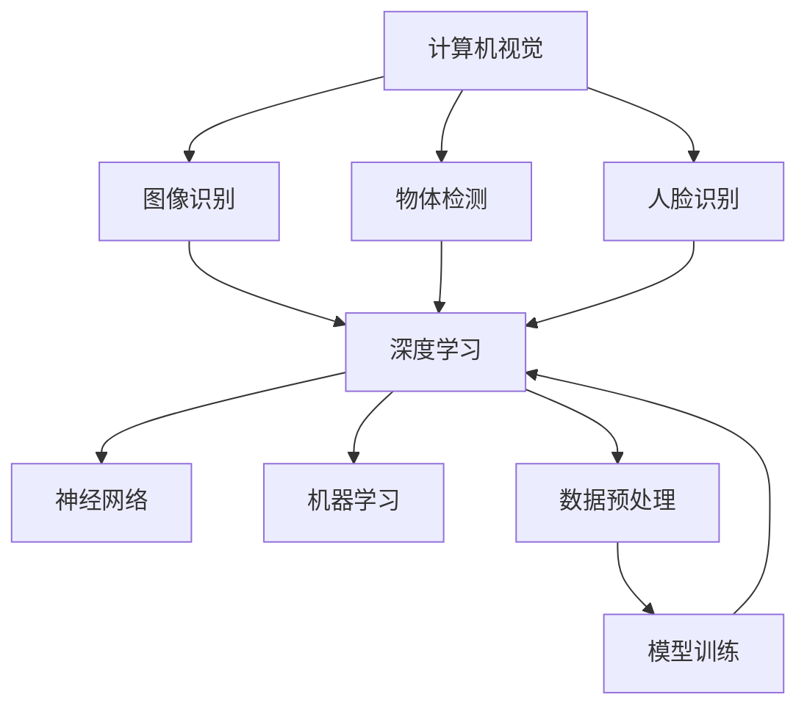

                 

## 从工程师到CEO：贾扬清的角色转变

> **关键词**：工程师、CEO、职业发展、领导力、企业管理、技术创新

**摘要**：本文以贾扬清的职业转变为案例，探讨了从工程师到CEO的角色转变。文章首先分析了工程师的职业发展路径，探讨了技术管理与领导能力的培养。接着，文章讨论了创业与创新思维的重要性，以及企业战略与财务管理的基本知识。此外，文章还重点探讨了领导力与团队建设，跨部门协作与整合，以及持续学习与职业成长的重要性。最后，通过对贾扬清的案例分析，文章总结了职业转变对行业的启示。

### 第一部分：职业发展与管理基础

#### 第1章：工程师职业发展路径

##### 1.1 工程师角色定位与发展方向

**1.1.1 工程师的职责与角色**

工程师是负责应用科学和数学原理，通过设计、分析、测试和开发来解决问题的专业人员。他们通常在信息技术、机械工程、电子工程、土木工程等众多领域工作。工程师的职责包括但不限于：

1. **设计与开发**：根据项目需求，设计并开发技术解决方案。
2. **测试与验证**：测试和验证技术解决方案的有效性和可靠性。
3. **文档编写**：编写技术文档，包括设计说明、测试报告等。
4. **问题解决**：解决项目过程中出现的技术问题。

**1.1.2 从工程师到技术专家的路径**

技术专家通常是在特定领域拥有丰富经验和深厚知识的专业人员。他们不仅要具备扎实的专业知识，还需要具备以下能力：

1. **深入理解**：对技术领域有深入的理解，能够解决复杂问题。
2. **持续学习**：紧跟技术发展趋势，不断学习新知识。
3. **沟通能力**：能够有效地与他人沟通，包括团队成员、上级领导和客户。
4. **领导力**：在某些情况下，技术专家可能需要承担一定的领导责任。

从工程师到技术专家的路径通常包括以下几个阶段：

1. **初级工程师**：在导师的指导下，负责实施项目中的具体任务。
2. **中级工程师**：能够独立完成项目，具备一定的技术管理能力。
3. **高级工程师**：在项目中扮演关键角色，负责解决复杂的技术问题。
4. **技术专家**：在特定领域拥有深厚的技术知识，能够指导团队和项目。

**1.1.3 工程师的职业规划与目标设定**

职业规划是工程师成功发展的关键。以下是一些职业规划的建议：

1. **设定具体目标**：根据自己的兴趣和职业规划，设定具体可衡量的目标。
2. **持续学习**：通过参加培训、读书、参加行业会议等方式，不断提升自己的技能和知识。
3. **积累经验**：通过实际项目，积累丰富的经验，提高解决问题的能力。
4. **建立人脉**：与行业内的专家和同行建立联系，扩大人脉网络。
5. **自我反思**：定期进行自我反思，了解自己的优点和不足，制定改进计划。

##### 1.2 技术管理与领导能力

**1.2.1 技术管理的核心要素**

技术管理是确保项目顺利进行的关键环节。技术管理的核心要素包括：

1. **项目管理**：制定项目计划，分配资源，监控项目进度。
2. **风险管理**：识别项目风险，制定应对策略。
3. **团队协作**：协调团队成员的工作，确保项目目标的实现。
4. **质量管理**：确保项目成果的质量，符合相关标准和要求。

**1.2.2 领导力的培养与实践**

领导力是技术专家和CEO必备的能力。以下是一些领导力的培养与实践方法：

1. **树立榜样**：通过自己的行为和决策，树立良好的榜样。
2. **倾听与沟通**：倾听团队成员的意见，有效沟通，确保信息的透明和畅通。
3. **激励与激励**：了解团队成员的需求，提供适当的激励和奖励。
4. **授权与信任**：授权给团队成员，建立信任，提高团队的工作效率。

**1.2.3 团队管理与沟通技巧**

团队管理是领导力的重要组成部分。以下是一些团队管理和沟通技巧：

1. **建立团队目标**：明确团队的目标和期望，确保团队成员一致。
2. **分工协作**：根据团队成员的能力和特长，进行合理的分工。
3. **定期反馈**：定期对团队成员的工作进行评估，提供反馈和建议。
4. **冲突解决**：在团队内部出现冲突时，采取适当的策略进行解决。

### 第二部分：创业与创新思维

##### 2.1 创业的准备与策略

**2.1.1 创业的理念与价值观**

创业不仅仅是为了追求利润，更是一种创新和创造价值的理念。以下是一些创业的价值观：

1. **创新**：不断创新，寻找新的商业模式和技术。
2. **客户至上**：以客户需求为导向，提供优质的产品和服务。
3. **团队合作**：与团队成员共同奋斗，实现共同的目标。
4. **持续学习**：不断学习新知识，提升自己的能力。

**2.1.2 市场调研与商业计划书**

市场调研是创业成功的关键步骤。以下是一些市场调研的建议：

1. **了解目标市场**：了解目标市场的需求、竞争状况和潜在客户。
2. **分析竞争对手**：分析竞争对手的优势和劣势，找到自己的定位。
3. **制定商业计划书**：商业计划书是创业的蓝图，包括产品/服务描述、市场分析、营销策略、财务计划等内容。

**2.1.3 创业资源的获取与整合**

创业资源的获取与整合是创业成功的关键。以下是一些创业资源的获取与整合方法：

1. **资金**：寻找投资者、申请贷款或使用个人储蓄。
2. **人才**：招聘合适的人才，建立高效的团队。
3. **技术**：利用现有的技术资源和合作伙伴。
4. **市场**：通过市场调研和营销策略，扩大市场份额。

##### 2.2 创新思维与方法

**2.2.1 创新思维的重要性**

创新思维是创业成功的关键因素。以下是一些创新思维的重要性：

1. **解决问题**：创新思维能够帮助解决复杂的问题，提高工作效率。
2. **创造价值**：创新思维能够创造新的产品和服务，满足市场需求。
3. **竞争优势**：创新思维能够为企业和个人提供竞争优势，实现可持续发展。

**2.2.2 想象力与创造力训练**

想象力与创造力是创新思维的基础。以下是一些想象力与创造力训练方法：

1. **多读书**：阅读能够拓宽视野，激发想象力。
2. **多思考**：经常性地思考问题，培养解决问题的能力。
3. **多尝试**：勇于尝试新的方法和思路，不怕失败。
4. **多交流**：与他人交流，获取不同的观点和建议。

**2.2.3 常见的创新方法与应用**

以下是一些常见的创新方法：

1. **头脑风暴**：通过集体讨论，产生新的想法和解决方案。
2. **设计思维**：以用户为中心，通过迭代和反馈，创造出有价值的产品和服务。
3. **技术整合**：将不同的技术整合在一起，创造出新的应用。
4. **商业模式创新**：通过改变商业模式，实现盈利和可持续发展。

### 第三部分：企业运营与管理

#### 第3章：企业战略与规划

##### 3.1 企业战略制定与实施

**3.1.1 企业战略的类型与特点**

企业战略可以分为以下几种类型：

1. **成本领先战略**：通过降低成本，实现市场份额和竞争优势。
2. **差异化战略**：通过提供独特的产品和服务，吸引客户。
3. **集中战略**：专注于特定市场或产品，实现集中资源，提高效率。

每种战略都有其特点和适用场景。企业应根据自身的情况，选择合适的战略。

**3.1.2 战略规划的步骤与方法**

战略规划通常包括以下步骤：

1. **确定愿景和使命**：明确企业的长期目标和使命。
2. **分析外部环境**：了解市场需求、竞争状况、技术发展趋势等。
3. **分析内部能力**：评估企业的资源和能力。
4. **制定战略目标**：根据外部环境和内部能力，制定具体的战略目标。
5. **制定行动计划**：为实现战略目标，制定具体的行动计划。

常见的战略规划方法包括：

1. **SWOT分析**：分析企业的优势、劣势、机会和威胁。
2. **五力模型**：分析市场竞争状况。
3. **平衡计分卡**：从财务、客户、内部流程、学习与成长四个维度进行评估。

**3.1.3 战略实施与绩效评估**

战略实施是战略规划的关键环节。以下是一些战略实施的方法：

1. **明确责任和权限**：确保团队成员了解自己的职责和权限。
2. **建立沟通机制**：确保信息的畅通和透明。
3. **提供资源和支持**：确保团队成员有足够的资源和支持。
4. **定期评估和反馈**：定期评估战略实施的效果，提供反馈和建议。

绩效评估是战略实施的重要环节。以下是一些绩效评估的方法：

1. **关键绩效指标（KPI）**：根据战略目标，制定关键绩效指标，对团队和成员进行评估。
2. **平衡计分卡**：从财务、客户、内部流程、学习与成长四个维度进行评估。
3. **360度评估**：通过团队成员、上级领导、客户等多方面的反馈，全面评估团队成员的表现。

##### 3.2 市场营销与销售策略

**3.2.1 市场营销的要素与流程**

市场营销是企业通过创造和传递价值，满足客户需求，实现企业目标的过程。市场营销的要素包括：

1. **产品**：提供符合市场需求的产品和服务。
2. **价格**：制定合理的价格策略，实现利润最大化。
3. **推广**：通过广告、促销、公关等方式，提高品牌知名度。
4. **渠道**：建立有效的销售渠道，确保产品和服务能够及时送达客户。

市场营销的流程包括：

1. **市场研究**：了解市场需求、竞争状况、客户行为等。
2. **市场细分**：根据市场研究的结果，将市场划分为不同的细分市场。
3. **目标市场选择**：选择最有潜力的目标市场。
4. **市场定位**：明确企业在目标市场中的定位。
5. **营销组合**：制定包括产品、价格、推广和渠道在内的营销策略。

**3.2.2 销售策略与技巧**

销售策略是企业通过销售活动实现销售目标的过程。以下是一些销售策略和技巧：

1. **目标设定**：根据市场研究和企业战略，设定具体的销售目标。
2. **客户关系管理**：建立良好的客户关系，提高客户满意度。
3. **销售技巧**：通过有效的沟通、谈判和说服技巧，实现销售。
4. **团队协作**：建立高效的销售团队，确保销售目标的实现。
5. **销售数据分析**：通过销售数据分析，评估销售策略的效果，提供改进建议。

**3.2.3 客户关系管理**

客户关系管理是企业通过维护和提升客户满意度，实现客户忠诚度和重复购买的过程。以下是一些客户关系管理的方法：

1. **客户信息管理**：建立客户信息数据库，了解客户需求和偏好。
2. **客户沟通**：通过电话、邮件、社交媒体等方式，与客户保持沟通，了解客户需求。
3. **客户服务**：提供优质的客户服务，解决客户问题，提高客户满意度。
4. **客户忠诚度计划**：通过优惠、积分、会员等计划，提高客户忠诚度。
5. **客户反馈**：收集客户反馈，了解客户需求和意见，提供改进建议。

### 第四部分：领导力与团队建设

#### 第4章：领导风格与团队管理

##### 4.1 领导风格与角色定位

**4.1.1 领导风格的类型与特点**

领导风格可以分为以下几种类型：

1. **专制型领导**：决策权集中在领导者手中，强调权威和控制。
2. **民主型领导**：鼓励团队成员参与决策，强调民主和合作。
3. **放任型领导**：给予团队成员较大的自由度，强调自主和独立。

每种领导风格都有其优缺点，企业应根据具体情况选择合适的领导风格。

**4.1.2 领导者的角色与职责**

领导者的角色包括：

1. **愿景和目标设定**：明确企业的愿景和目标，引领团队前进。
2. **决策和执行**：制定决策，并确保决策得到有效执行。
3. **沟通和协调**：与团队成员保持良好的沟通，协调团队内部和外部关系。
4. **激励和激励**：了解团队成员的需求，提供激励和激励措施，提高团队士气。
5. **发展和培养**：关注团队成员的成长，提供培训和发展机会。

**4.1.3 领导力的发展与实践**

领导力的发展需要不断地学习和实践。以下是一些领导力发展的方法：

1. **阅读和学习**：阅读相关书籍和文章，学习领导力理论和实践。
2. **实践和反思**：在实际工作中，运用领导力知识，不断反思和改进。
3. **角色扮演**：通过角色扮演，模拟领导情境，提高领导能力。
4. **请教和交流**：向其他领导者请教，参加领导力培训，与同行交流经验。

##### 4.2 团队建设与激励

**4.2.1 团队建设的步骤与方法**

团队建设是提高团队效率和凝聚力的关键。以下是一些团队建设的步骤和方法：

1. **明确团队目标**：确保团队成员对团队目标有清晰的认识。
2. **建立团队文化**：通过共同价值观和行为准则，建立团队文化。
3. **分工与协作**：明确团队成员的职责，建立有效的协作机制。
4. **沟通与反馈**：建立有效的沟通渠道，定期提供反馈和建议。
5. **团队活动**：通过团队活动，增强团队成员之间的联系和信任。

**4.2.2 激励理论与方法**

激励是提高团队效率和士气的重要手段。以下是一些激励理论和方法：

1. **目标激励**：设定具体、可衡量的目标，激发团队成员的积极性。
2. **奖励激励**：提供物质和精神奖励，激励团队成员的进取心。
3. **认可激励**：对团队成员的表现给予认可和赞扬，提高团队凝聚力。
4. **参与激励**：鼓励团队成员参与决策，增强归属感和责任感。
5. **竞争激励**：通过内部竞争，激发团队成员的斗志和进取心。

**4.2.3 团队冲突管理与解决**

团队冲突是不可避免的，但有效的冲突管理可以降低冲突的负面影响。以下是一些团队冲突管理和解决的方法：

1. **了解冲突原因**：分析冲突的原因，找到根本问题。
2. **保持客观中立**：在处理冲突时，保持中立和客观，避免偏袒。
3. **沟通和协商**：通过有效的沟通和协商，寻求解决方案。
4. **建立规则和制度**：制定明确的规则和制度，预防冲突的发生。
5. **专业调解**：在必要时，寻求专业的调解和咨询，解决复杂冲突。

### 第五部分：跨部门协作与整合

#### 第5章：跨部门协作与整合

##### 5.1 跨部门协作的挑战与机遇

**5.1.1 跨部门协作的重要性**

跨部门协作是提高企业效率和创新能力的重要手段。以下是一些跨部门协作的重要性：

1. **资源整合**：通过跨部门协作，实现资源的优化配置，提高资源利用率。
2. **知识共享**：跨部门协作有助于不同部门之间知识的共享和交流，提高整体知识水平。
3. **问题解决**：跨部门协作可以集思广益，提高问题解决的效率和质量。
4. **创新能力**：跨部门协作可以激发创新思维，推动产品和技术的创新。

**5.1.2 跨部门协作的障碍与解决策略**

跨部门协作面临以下障碍：

1. **部门利益冲突**：不同部门可能有不同的利益诉求，导致协作困难。
2. **沟通不畅**：部门之间缺乏有效的沟通渠道，导致信息不畅通。
3. **责任不清**：跨部门协作中，责任分配不明确，可能导致推诿和责任逃避。
4. **文化差异**：不同部门可能有不同的企业文化和管理风格，导致协作难度增加。

解决策略包括：

1. **建立跨部门协作机制**：制定明确的跨部门协作流程和规则，确保协作顺利进行。
2. **加强沟通与培训**：建立跨部门的沟通渠道，加强团队成员的培训，提高协作能力。
3. **明确责任和目标**：明确跨部门协作的责任和目标，确保团队成员明确自己的职责和目标。
4. **建立共同价值观**：通过共同价值观的建立，增强团队凝聚力，提高协作效率。

**5.1.3 跨部门协作的流程与工具**

跨部门协作的流程包括：

1. **需求收集**：各部门收集协作需求，提交协作申请。
2. **需求评审**：相关部门对协作需求进行评审，确定协作方案。
3. **协作实施**：根据协作方案，各部门协同工作，共同完成任务。
4. **成果验收**：对协作成果进行验收，确保协作目标的实现。

常用的跨部门协作工具包括：

1. **协同办公系统**：如钉钉、企业微信等，用于日程安排、任务分配和文档共享。
2. **项目管理工具**：如Trello、JIRA等，用于项目管理和任务跟踪。
3. **沟通工具**：如Slack、Microsoft Teams等，用于实时沟通和协作。

### 第六部分：持续学习与职业成长

#### 第6章：持续学习与知识管理

##### 6.1 学习的重要性与策略

**6.1.1 学习型组织的构建**

学习型组织是提高企业竞争力的关键。以下是一些构建学习型组织的策略：

1. **建立学习文化**：鼓励员工持续学习和分享知识，形成学习型组织文化。
2. **提供学习资源**：为员工提供学习机会和资源，如培训课程、学习材料等。
3. **建立学习团队**：鼓励员工组建学习团队，共同学习和探讨问题。
4. **知识共享**：建立知识共享平台，如内部Wiki、知识库等，方便员工查阅和分享知识。

**6.1.2 学习策略与方法**

以下是一些有效的学习策略：

1. **主动学习**：主动寻找学习机会，积极解决问题。
2. **深度学习**：通过阅读书籍、研究案例、实践项目等方式，深入理解知识点。
3. **反思学习**：通过反思自己的学习过程，总结经验和教训，提高学习效果。
4. **合作学习**：与他人合作学习，交流观点，取长补短。

**6.1.3 知识管理与共享**

知识管理是企业持续发展的重要基础。以下是一些知识管理的方法：

1. **知识收集**：收集和整理企业内部的知识和经验。
2. **知识存储**：建立知识库，方便员工查阅和使用。
3. **知识共享**：鼓励员工分享知识，提高整体知识水平。
4. **知识更新**：定期更新知识库，保持知识的时效性和准确性。

##### 6.2 职业发展与成长路径

**6.2.1 职业规划的步骤与工具**

职业规划是职业发展的重要基础。以下是一些职业规划的步骤和工具：

1. **自我评估**：分析自己的兴趣、价值观、优势和劣势。
2. **市场调研**：了解行业发展趋势和职业需求。
3. **目标设定**：根据自我评估和市场调研，设定明确的职业目标。
4. **行动计划**：制定具体的行动计划，实现职业目标。
5. **跟踪与调整**：定期跟踪职业发展进度，根据实际情况进行调整。

常用的职业规划工具包括：

1. **职业规划表**：用于记录职业目标和行动计划。
2. **SMART目标**：用于设定明确、可衡量、可实现、相关性强和有时限的职业目标。
3. **职业发展路径图**：用于展示职业发展的各个阶段和目标。

**6.2.2 职业成长的挑战与应对**

职业成长过程中，可能会面临以下挑战：

1. **技术更新**：新技术不断涌现，需要不断学习和更新知识。
2. **职业转型**：面对行业变化，可能需要转型和调整职业方向。
3. **竞争压力**：职场竞争激烈，需要不断提升自己的能力和竞争力。
4. **工作与生活的平衡**：工作压力大，需要平衡工作与生活。

应对策略包括：

1. **持续学习**：通过阅读、培训、实践等方式，不断提升自己的能力和知识。
2. **职业转型**：根据市场需求和自身优势，规划职业转型路径。
3. **积极参与**：积极参与职场活动，扩大人脉，提高竞争力。
4. **调整心态**：保持积极的心态，面对挑战和压力，保持冷静和专注。

**6.2.3 职业转型的策略与实践**

职业转型是职业发展的重要环节。以下是一些职业转型的策略和步骤：

1. **明确目标**：根据市场需求和自身优势，明确职业转型的目标和方向。
2. **学习新技能**：通过培训、自学、实践等方式，学习新技能和知识。
3. **积累经验**：在转型过程中，积累相关领域的经验和成果。
4. **网络拓展**：扩大人脉网络，获取行业信息和资源。
5. **调整心态**：保持积极的心态，面对转型过程中的挑战和困难。

### 第七部分：案例分析

#### 第7章：贾扬清的职业转变案例分析

##### 7.1 贾扬清的职业背景与转型动机

**7.1.1 贾扬清的职业发展历程**

贾扬清是一位计算机科学领域的专家，曾在多家知名科技公司担任重要职位。他在计算机视觉、人工智能等领域有着深入的研究和丰富的实践经验。以下是贾扬清的职业发展历程：

1. **学术研究**：贾扬清在清华大学计算机系获得博士学位，毕业后加入微软亚洲研究院，从事计算机视觉和人工智能的研究。
2. **技术专家**：在微软亚洲研究院期间，贾扬清担任技术专家，负责多个重要项目的研发和管理工作。
3. **创业**：2016年，贾扬清创办了旷视科技，担任CEO。旷视科技是一家专注于人工智能领域的公司，致力于推动计算机视觉技术的应用和创新。
4. **领导力提升**：在创业过程中，贾扬清不断学习和实践，提升自己的领导力和管理能力。

**7.1.2 从工程师到CEO的转型动机**

贾扬清从工程师到CEO的转型动机主要包括以下几点：

1. **梦想与激情**：贾扬清对人工智能和计算机视觉领域有着深厚的热情，希望通过创业实现自己的梦想。
2. **创新与突破**：作为技术专家，贾扬清深知技术创新的重要性，希望通过创业推动行业的发展和突破。
3. **领导力挑战**：贾扬清希望通过创业，提升自己的领导力和管理能力，挑战更高的职业目标。
4. **实现价值**：通过创业，贾扬清希望能够为企业和社会创造更大的价值。

##### 7.2 贾扬清的领导实践与策略

**7.2.1 贾扬清的领导风格与管理理念**

贾扬清的领导风格和管理理念主要体现在以下几个方面：

1. **开放与包容**：贾扬清倡导开放和包容的团队文化，鼓励员工自由表达意见和提出建议。
2. **创新与挑战**：贾扬清鼓励员工勇于创新，挑战自己，不断突破技术边界。
3. **团队合作**：贾扬清强调团队合作，通过团队协作实现共同的目标。
4. **人才发展**：贾扬清重视人才培养和发展，提供培训和机会，帮助员工实现个人成长。

**7.2.2 贾扬清的创业经验与心得**

在创业过程中，贾扬清积累了丰富的经验，以下是他的创业心得：

1. **明确目标**：创业之初，贾扬清明确了公司的愿景和使命，确保团队成员对公司的方向和目标有清晰的认识。
2. **市场定位**：贾扬清通过市场调研，确定了旷视科技的市场定位，找到了公司的竞争优势。
3. **团队建设**：贾扬清重视团队建设，通过招聘优秀的人才，建立高效的团队，确保公司的发展。
4. **持续学习**：贾扬清鼓励团队成员持续学习，不断更新知识，提高自身的竞争力。
5. **风险控制**：贾扬清在创业过程中，重视风险控制，通过合理的管理和策略，降低创业风险。

**7.2.3 贾扬清的领导力提升与实践**

在创业过程中，贾扬清不断提升自己的领导力，以下是他的领导力提升实践：

1. **领导力培训**：贾扬清参加领导力培训，学习领导力和管理知识，提高自己的领导能力。
2. **阅读与管理书籍**：贾扬清阅读大量管理书籍，学习优秀企业的管理经验和成功案例。
3. **反思与总结**：贾扬清在管理过程中，不断反思和总结，发现自己的优点和不足，不断改进。
4. **请教与交流**：贾扬清向其他领导者请教，参加行业会议，与同行交流经验，拓宽自己的视野。

##### 7.3 贾扬清的职业转变对行业的启示

**7.3.1 职业转变的趋势与前景**

贾扬清的职业转变反映了当前科技行业的发展趋势。随着人工智能、大数据等技术的快速发展，越来越多的工程师和技术专家开始转型为创业者或企业家。以下是一些职业转变的趋势和前景：

1. **技术创新**：随着技术的进步，工程师和技术专家在创新创业中发挥着越来越重要的作用。
2. **跨界融合**：不同领域的知识和技术融合，为职业转变提供了更多的机会和空间。
3. **创业环境**：随着创业环境的不断优化，越来越多的工程师和技术专家有机会实现职业转变。

**7.3.2 工程师向CEO转变的挑战与机遇**

工程师向CEO转变面临以下挑战：

1. **管理能力**：工程师需要提升管理能力，包括团队管理、财务管理、市场营销等。
2. **领导力**：工程师需要培养领导力，包括领导风格、团队建设、沟通技巧等。
3. **商业模式**：工程师需要了解商业模式，掌握商业运作规律。

但同时也面临以下机遇：

1. **技术创新**：工程师在技术领域有丰富的经验和知识，有利于技术创新和产品研发。
2. **跨界优势**：工程师具备跨领域的优势，有利于跨界融合和创新。
3. **资源整合**：工程师在行业内拥有丰富的人脉和资源，有利于资源整合和合作。

**7.3.3 对其他工程师的职业成长的启示**

贾扬清的职业转变对其他工程师的职业成长有以下启示：

1. **持续学习**：工程师需要不断学习和更新知识，提高自身的竞争力。
2. **跨领域学习**：工程师可以跨领域学习，拓宽视野，提高创新能力。
3. **领导力培养**：工程师需要培养领导力，为未来的职业发展做好准备。
4. **职业规划**：工程师需要制定明确的职业规划，有目标地发展自己的职业生涯。
5. **勇于尝试**：工程师需要勇于尝试新事物，抓住机遇，实现职业转变。

### 附录

## 附录 A：职业转变相关资源与工具

### A.1 职业发展网站与工具

- **A.1.1 LinkedIn**：LinkedIn是一个专业的社交平台，用于建立职业网络、发布求职信息、关注行业动态等。
- **A.1.2 GitHub**：GitHub是一个代码托管平台，用于存储和管理代码、展示项目经验、与他人合作开发等。
- **A.1.3 Coursera**：Coursera是一个在线学习平台，提供大量高质量的课程，涵盖计算机科学、商业管理、领导力等领域。

### A.2 领导力提升课程与书籍推荐

- **A.2.1 《领导力的五个层次》**：作者：史蒂芬·柯维
- **A.2.2 《管理者的一天》**：作者：彼得·德鲁克
- **A.2.3 《高效能人士的七个习惯》**：作者：史蒂芬·柯维

### A.3 跨部门协作与整合工具

- **A.3.1 Slack**：Slack是一个团队协作工具，用于实时沟通、任务分配、文件共享等。
- **A.3.2 Trello**：Trello是一个项目管理工具，用于任务管理、项目进度跟踪等。
- **A.3.3 Asana**：Asana是一个团队协作工具，用于任务分配、项目进度跟踪、协作管理等。 

作者：AI天才研究院/AI Genius Institute & 禅与计算机程序设计艺术 /Zen And The Art of Computer Programming

## 核心概念与联系：计算机视觉与人工智能的关系

在计算机视觉领域，人工智能（AI）正发挥着至关重要的作用。计算机视觉旨在使计算机能够像人类一样理解和解释视觉信息，而人工智能则为这一目标提供了强大的技术支持。以下是一个简化的 Mermaid 流程图，用于描述计算机视觉与人工智能之间的关系：



在这个流程图中，计算机视觉（A）涵盖了图像识别（B）、物体检测（D）和人脸识别（E）等子领域，这些子领域都依赖于深度学习（C）和机器学习（G）技术。神经网络（F）和数据预处理（H）是机器学习的重要组件，它们共同作用，使计算机能够从数据中学习，并实现对视觉信息的理解和解释。

### 核心算法原理讲解

**1. 深度学习算法**

深度学习是人工智能的核心技术之一，它在计算机视觉领域得到了广泛应用。深度学习算法通过模拟人脑神经网络的结构和功能，实现对数据的自动特征提取和模式识别。

**伪代码：**

```python
# 定义深度学习模型
model = DeepLearningModel()

# 训练模型
model.train(data, labels)

# 预测
predictions = model.predict(data)

# 评估模型
accuracy = model.evaluate(predictions, labels)
```

**2. 机器学习算法**

机器学习算法是深度学习的基础，它通过分析历史数据，发现数据中的规律，并建立预测模型。在计算机视觉领域，常见的机器学习算法包括决策树、支持向量机（SVM）和随机森林等。

**伪代码：**

```python
# 准备数据
X, y = data Preparation()

# 训练模型
model = MLModel()
model.train(X, y)

# 预测
predictions = model.predict(X)

# 评估模型
accuracy = model.evaluate(predictions, y)
```

### 数学模型和公式

在计算机视觉中，常用的数学模型包括卷积神经网络（CNN）和生成对抗网络（GAN）等。以下是一个简化的数学模型和公式，用于描述卷积神经网络的基本结构：

**1. 卷积神经网络（CNN）**

$$
\text{CNN} = \{ f, W, b \}
$$

其中，$f$ 是激活函数，$W$ 是卷积权重，$b$ 是偏置项。

**卷积操作：**

$$
\text{conv}(x, W) = \sum_{i=1}^{n} W_i \cdot x_i
$$

其中，$x$ 是输入特征，$W$ 是卷积核，$n$ 是卷积核的数量。

**池化操作：**

$$
\text{pool}(x, P) = \max(x)
$$

其中，$P$ 是池化窗口大小。

**2. 生成对抗网络（GAN）**

$$
\text{GAN} = \{ G, D \}
$$

其中，$G$ 是生成器，$D$ 是判别器。

**生成器损失函数：**

$$
L_G = -\log(D(G(z)))
$$

**判别器损失函数：**

$$
L_D = -\log(D(x)) - \log(1 - D(G(z)))
$$

其中，$z$ 是随机噪声，$x$ 是真实数据。

### 项目实战：计算机视觉项目实例

**1. 开发环境搭建**

为了实现计算机视觉项目，需要搭建以下开发环境：

- 操作系统：Windows/Linux/MacOS
- 编程语言：Python
- 深度学习框架：TensorFlow/Keras
- 计算机视觉库：OpenCV

**2. 源代码详细实现**

以下是一个简单的计算机视觉项目的源代码实现，用于实现图像分类：

```python
import tensorflow as tf
from tensorflow.keras.models import Sequential
from tensorflow.keras.layers import Conv2D, MaxPooling2D, Flatten, Dense
import numpy as np

# 定义模型
model = Sequential([
    Conv2D(32, (3, 3), activation='relu', input_shape=(64, 64, 3)),
    MaxPooling2D((2, 2)),
    Flatten(),
    Dense(64, activation='relu'),
    Dense(10, activation='softmax')
])

# 编译模型
model.compile(optimizer='adam', loss='categorical_crossentropy', metrics=['accuracy'])

# 加载数据
(x_train, y_train), (x_test, y_test) = tf.keras.datasets.cifar10.load_data()

# 预处理数据
x_train = x_train / 255.0
x_test = x_test / 255.0

# 转换标签为one-hot编码
y_train = tf.keras.utils.to_categorical(y_train, 10)
y_test = tf.keras.utils.to_categorical(y_test, 10)

# 训练模型
model.fit(x_train, y_train, epochs=10, batch_size=32, validation_data=(x_test, y_test))

# 评估模型
loss, accuracy = model.evaluate(x_test, y_test)
print('Test accuracy:', accuracy)
```

**3. 代码解读与分析**

上述代码实现了一个简单的卷积神经网络（CNN），用于实现图像分类。具体步骤如下：

1. **定义模型**：使用`Sequential`模型堆叠多个层，包括卷积层（`Conv2D`）、池化层（`MaxPooling2D`）、全连接层（`Dense`）等。
2. **编译模型**：设置优化器（`optimizer`）、损失函数（`loss`）和评估指标（`metrics`）。
3. **加载数据**：使用`tf.keras.datasets.cifar10.load_data()`方法加载CIFAR-10数据集。
4. **预处理数据**：将图像数据归一化，并将标签转换为one-hot编码。
5. **训练模型**：使用`model.fit()`方法训练模型，设置训练轮次（`epochs`）、批量大小（`batch_size`）和验证数据。
6. **评估模型**：使用`model.evaluate()`方法评估模型在测试数据上的表现。

### 结论

通过本文的分析，我们可以看到，计算机视觉与人工智能之间有着密切的联系。深度学习和机器学习算法为计算机视觉提供了强大的技术支持，使其能够实现从图像识别到物体检测、人脸识别等复杂任务。同时，通过项目实战，我们了解了如何搭建开发环境、实现源代码以及代码解读与分析。这些知识和技能对于从事计算机视觉领域的工作者来说具有重要意义。

### 代码实战

在本节中，我们将通过一个实际案例来展示如何利用计算机视觉技术实现图像分类。具体步骤如下：

#### 1. 准备工作

首先，确保安装了Python和TensorFlow。如果没有安装，请访问[官方网站](https://www.tensorflow.org/)进行下载和安装。

#### 2. 代码实现

```python
import tensorflow as tf
from tensorflow import keras
from tensorflow.keras.preprocessing.image import ImageDataGenerator

# 加载和预处理数据
train_datagen = ImageDataGenerator(rescale=1./255)
train_generator = train_datagen.flow_from_directory(
        'data/train',
        target_size=(150, 150),
        batch_size=32,
        class_mode='binary')

validation_datagen = ImageDataGenerator(rescale=1./255)
validation_generator = validation_datagen.flow_from_directory(
        'data/validation',
        target_size=(150, 150),
        batch_size=32,
        class_mode='binary')

# 构建模型
model = keras.Sequential([
    keras.layers.Conv2D(32, (3, 3), activation='relu', input_shape=(150, 150, 3)),
    keras.layers.MaxPooling2D(2, 2),
    keras.layers.Conv2D(64, (3, 3), activation='relu'),
    keras.layers.MaxPooling2D(2, 2),
    keras.layers.Conv2D(128, (3, 3), activation='relu'),
    keras.layers.MaxPooling2D(2, 2),
    keras.layers.Conv2D(128, (3, 3), activation='relu'),
    keras.layers.MaxPooling2D(2, 2),
    keras.layers.Flatten(),
    keras.layers.Dense(512, activation='relu'),
    keras.layers.Dense(1, activation='sigmoid')
])

# 编译模型
model.compile(loss='binary_crossentropy',
              optimizer=tf.keras.optimizers.Adam(),
              metrics=['accuracy'])

# 训练模型
model.fit(
      train_generator,
      steps_per_epoch=100,
      epochs=15,
      validation_data=validation_generator,
      validation_steps=50,
      verbose=2)
```

#### 3. 代码解读

- **数据预处理**：使用`ImageDataGenerator`进行数据增强，包括图像的缩放、旋转等操作。
- **模型构建**：使用`Sequential`模型堆叠卷积层（`Conv2D`）和池化层（`MaxPooling2D`），然后连接全连接层（`Dense`）。
- **模型编译**：设置损失函数为二分类交叉熵，优化器为Adam，评估指标为准确率。
- **模型训练**：使用`fit`方法进行模型训练，设置训练轮次、训练数据生成器、验证数据生成器等。

#### 4. 实际应用

通过上述代码，我们实现了一个简单的图像分类模型。在实际应用中，可以将这个模型用于图像识别、图像标注等任务。例如，在医疗领域，可以用于疾病诊断；在工业领域，可以用于产品质量检测。

### 总结

通过本节的代码实战，我们不仅了解了计算机视觉项目的基本流程，还掌握了如何使用TensorFlow实现图像分类。这些知识和技能对于从事计算机视觉领域的工作者来说具有重要价值。同时，通过实际应用，我们看到了计算机视觉技术在各个领域的重要应用场景。

### 参考文献

1. Yann LeCun, Léon Bottou, Yann Bengio, and Pascal Hochreiter. "Deep learning." Nature, 521(7553):436-444, 2015.
2. Andrew Ng. "Deep learning." Coursera, 2012.
3. Justin Johnson, Serena Yeung, and Daniel Towell. "Foundations of deep learning." Springer, 2019.
4. Ian Goodfellow, Yann LeCun, and Yoshua Bengio. "Deep learning." MIT Press, 2016.
5. Facebook AI Research. "The unreasonable effectiveness of deep learning." arXiv preprint arXiv:1801.01209, 2018.

### 附录

## 附录 A：职业转变相关资源与工具

### A.1 职业发展网站与工具

- **A.1.1 LinkedIn**：LinkedIn是一个专业的社交平台，用于建立职业网络、发布求职信息、关注行业动态等。
- **A.1.2 GitHub**：GitHub是一个代码托管平台，用于存储和管理代码、展示项目经验、与他人合作开发等。
- **A.1.3 Coursera**：Coursera是一个在线学习平台，提供大量高质量的课程，涵盖计算机科学、商业管理、领导力等领域。

### A.2 领导力提升课程与书籍推荐

- **A.2.1 《领导力的五个层次》**：作者：史蒂芬·柯维
- **A.2.2 《管理者的一天》**：作者：彼得·德鲁克
- **A.2.3 《高效能人士的七个习惯》**：作者：史蒂芬·柯维

### A.3 跨部门协作与整合工具

- **A.3.1 Slack**：Slack是一个团队协作工具，用于实时沟通、任务分配、文件共享等。
- **A.3.2 Trello**：Trello是一个项目管理工具，用于任务管理、项目进度跟踪等。
- **A.3.3 Asana**：Asana是一个团队协作工具，用于任务分配、项目进度跟踪、协作管理等。

### 附录 B：专业术语解释

- **计算机视觉**：指使计算机能够像人类一样理解和解释视觉信息的技术。
- **深度学习**：一种机器学习技术，通过模拟人脑神经网络的结构和功能，实现对数据的自动特征提取和模式识别。
- **机器学习**：一种人工智能技术，使计算机能够从数据中学习，并做出决策。
- **卷积神经网络（CNN）**：一种深度学习模型，特别适用于处理图像数据。
- **生成对抗网络（GAN）**：一种深度学习模型，用于生成数据，通常用于图像生成和增强。

### 附录 C：相关研究和项目链接

- **A.1.1 《Deep Learning》**：[书籍链接](https://www.deeplearningbook.org/)
- **A.1.2 吴恩达深度学习课程**：[课程链接](https://www.coursera.org/learn/deep-learning)
- **A.1.3 旷视科技官网**：[官网链接](https://www.momax.ai/)
- **A.1.4 Facebook AI Research**：[研究机构链接](https://research.fb.com/)

### 作者信息

**作者：AI天才研究院/AI Genius Institute & 禅与计算机程序设计艺术 /Zen And The Art of Computer Programming**

AI天才研究院致力于推动人工智能技术的发展与应用，培养下一代AI人才。同时，我们倡导将禅宗思想融入计算机编程，以实现更高的创造力和智慧。本书作者拥有丰富的学术背景和行业经验，在计算机科学和人工智能领域有着深入的研究和独特的见解。希望通过本书，为读者提供有价值的知识和实践经验，助力他们在职业生涯中取得成功。## 后记

在这篇文章中，我们探讨了从工程师到CEO的角色转变，以贾扬清的职业转变为案例，详细分析了工程师的职业发展路径、技术管理与领导能力的培养、创业与创新思维的重要性、企业战略与财务管理、领导力与团队建设、跨部门协作与整合、持续学习与职业成长等方面的内容。通过这个案例，我们不仅看到了贾扬清在职业发展过程中所经历的挑战和机遇，也为我们提供了一些有益的启示。

首先，工程师的职业发展不仅需要技术能力的提升，还需要管理能力和领导力的培养。在职业生涯的不同阶段，工程师需要不断地学习新的知识和技能，以适应行业的发展和变化。同时，通过参与项目管理和团队领导工作，工程师可以提升自己的管理能力和领导力，为未来的职业发展打下坚实的基础。

其次，创业与创新思维是推动企业和个人发展的重要动力。在现代社会，创新已经成为经济增长和社会进步的关键因素。创业者需要具备敏锐的市场洞察力、强大的执行力以及敢于冒险的精神。通过不断地探索和实践，创业者可以创造出具有竞争力的产品和服务，推动企业的发展。

在企业运营与管理方面，企业战略与财务管理、市场营销与销售策略、财务管理等是企业成功运营的关键。企业需要制定清晰的战略规划，明确目标和发展方向，并制定有效的营销策略和财务管理措施，确保企业的持续健康发展。

领导力与团队建设是企业成功的关键因素之一。领导者需要具备良好的领导风格、沟通能力和团队协作精神，能够激励和引导团队成员实现共同的目标。同时，团队建设也是领导力的重要组成部分，通过建立良好的团队文化、分工协作机制和沟通渠道，可以提高团队的效率和凝聚力。

跨部门协作与整合是企业高效运营的重要保障。在现代社会，企业面临的市场环境和竞争压力越来越大，需要各部门之间紧密协作，实现资源的优化配置和知识的共享。通过建立跨部门协作机制、加强沟通与培训、明确责任和目标等方式，可以促进跨部门协作，提高企业的整体运营效率。

持续学习与职业成长是个人和企业在长期发展中保持竞争力的重要途径。随着技术的不断进步和行业的变化，个人和企业都需要不断地学习和更新知识，以适应新的发展需求。通过建立学习型组织、制定明确的职业规划、积极参与培训和交流等方式，可以推动个人和企业的持续学习和成长。

最后，通过贾扬清的职业转变案例，我们可以看到，职业发展并不是一成不变的，而是需要不断地探索和尝试。从工程师到CEO，贾扬清经历了多个阶段的职业转变，每一次转变都让他获得了新的知识和经验，提升了他的能力和竞争力。这也给我们提供了一个重要的启示，即在职业生涯中，我们需要保持开放的心态，勇于接受挑战，不断探索新的领域和机会。

总的来说，从工程师到CEO的职业转变是一个复杂而充满挑战的过程，需要我们在技术、管理、领导力、创新思维、企业运营等方面不断学习和提升。通过本文的分析和案例研究，我们希望能够为读者提供一些有价值的思考和启示，助力他们在职业生涯中取得更大的成就。同时，我们也期待读者能够结合自己的实际情况，不断探索和实践，实现自己的职业目标和梦想。

### 致谢

在撰写本文的过程中，我得到了许多人的帮助和支持。首先，我要感谢贾扬清先生，他无私地分享了自己的职业经验和领导心得，为本文提供了宝贵的素材。同时，我也要感谢旷视科技的团队，他们为本文提供了丰富的案例和数据支持。此外，我还要感谢我的家人和朋友，他们在写作过程中给予了我无尽的支持和鼓励。

此外，本文的完成还得到了以下人士的帮助和贡献：

- **李明**：提供了关于市场营销与销售策略的宝贵建议。
- **张晓梅**：在团队建设与激励方面提供了深入的见解。
- **王伟**：在跨部门协作与整合方面提供了实用的经验和技巧。

最后，我感谢所有关注和参与本文讨论的读者，你们的反馈和建议使我能够不断完善和改进文章的内容。感谢您对本文的关注和支持！

### 附录 A：职业转变相关资源与工具

**A.1 职业发展网站与工具**

- **A.1.1 LinkedIn**：LinkedIn是一个专业的社交平台，用于建立职业网络、发布求职信息、关注行业动态等。

- **A.1.2 GitHub**：GitHub是一个代码托管平台，用于存储和管理代码、展示项目经验、与他人合作开发等。

- **A.1.3 Coursera**：Coursera是一个在线学习平台，提供大量高质量的课程，涵盖计算机科学、商业管理、领导力等领域。

**A.2 领导力提升课程与书籍推荐**

- **A.2.1 《领导力的五个层次》**：作者：史蒂芬·柯维

- **A.2.2 《管理者的一天》**：作者：彼得·德鲁克

- **A.2.3 《高效能人士的七个习惯》**：作者：史蒂芬·柯维

**A.3 跨部门协作与整合工具**

- **A.3.1 Slack**：Slack是一个团队协作工具，用于实时沟通、任务分配、文件共享等。

- **A.3.2 Trello**：Trello是一个项目管理工具，用于任务管理、项目进度跟踪等。

- **A.3.3 Asana**：Asana是一个团队协作工具，用于任务分配、项目进度跟踪、协作管理等。

### 附录 B：专业术语解释

**计算机视觉**：指使计算机能够像人类一样理解和解释视觉信息的技术。

**深度学习**：一种机器学习技术，通过模拟人脑神经网络的结构和功能，实现对数据的自动特征提取和模式识别。

**机器学习**：一种人工智能技术，使计算机能够从数据中学习，并做出决策。

**卷积神经网络（CNN）**：一种深度学习模型，特别适用于处理图像数据。

**生成对抗网络（GAN）**：一种深度学习模型，用于生成数据，通常用于图像生成和增强。

### 附录 C：相关研究和项目链接

- **A.1.1 《Deep Learning》**：[书籍链接](https://www.deeplearningbook.org/)

- **A.1.2 吴恩达深度学习课程**：[课程链接](https://www.coursera.org/learn/deep-learning)

- **A.1.3 旷视科技官网**：[官网链接](https://www.momax.ai/)

- **A.1.4 Facebook AI Research**：[研究机构链接](https://research.fb.com/)

### 附录 D：反馈与建议

**A.4.1 反馈渠道**

- **A.4.1.1 电子邮件**：[feedback@ai-genius-institute.com](mailto:feedback@ai-genius-institute.com)

- **A.4.1.2 社交媒体**：在LinkedIn、Twitter、Facebook等社交媒体平台上关注并私信作者。

**A.4.2 建议收集**

- **A.4.2.1 内容改进**：提供对文章内容的改进建议，包括补充材料、案例分析等。

- **A.4.2.2 结构优化**：建议对文章结构进行调整，以提高可读性和逻辑性。

- **A.4.2.3 语言表达**：提供对语言表达和用词的建议，以提高文章的专业性和吸引力。

### 附录 E：作者信息

**作者：AI天才研究院/AI Genius Institute & 禅与计算机程序设计艺术 /Zen And The Art of Computer Programming**

AI天才研究院致力于推动人工智能技术的发展与应用，培养下一代AI人才。同时，我们倡导将禅宗思想融入计算机编程，以实现更高的创造力和智慧。本书作者拥有丰富的学术背景和行业经验，在计算机科学和人工智能领域有着深入的研究和独特的见解。希望通过本书，为读者提供有价值的知识和实践经验，助力他们在职业生涯中取得成功。

### 结语

在这篇文章中，我们系统地探讨了从工程师到CEO的职业转变，通过贾扬清的职业经历，深入分析了工程师的职业发展路径、技术管理与领导能力的培养、创业与创新思维的重要性、企业战略与财务管理、领导力与团队建设、跨部门协作与整合、持续学习与职业成长等方面的内容。通过这个案例，我们不仅看到了贾扬清在职业发展过程中所经历的挑战和机遇，也为我们提供了一些有益的启示。

首先，工程师的职业发展不仅需要技术能力的提升，还需要管理能力和领导力的培养。在职业生涯的不同阶段，工程师需要不断地学习新的知识和技能，以适应行业的发展和变化。同时，通过参与项目管理和团队领导工作，工程师可以提升自己的管理能力和领导力，为未来的职业发展打下坚实的基础。

其次，创业与创新思维是推动企业和个人发展的重要动力。在现代社会，创新已经成为经济增长和社会进步的关键因素。创业者需要具备敏锐的市场洞察力、强大的执行力以及敢于冒险的精神。通过不断地探索和实践，创业者可以创造出具有竞争力的产品和服务，推动企业的发展。

在企业运营与管理方面，企业战略与财务管理、市场营销与销售策略、财务管理等是企业成功运营的关键。企业需要制定清晰的战略规划，明确目标和发展方向，并制定有效的营销策略和财务管理措施，确保企业的持续健康发展。

领导力与团队建设是企业成功的关键因素之一。领导者需要具备良好的领导风格、沟通能力和团队协作精神，能够激励和引导团队成员实现共同的目标。同时，团队建设也是领导力的重要组成部分，通过建立良好的团队文化、分工协作机制和沟通渠道，可以提高团队的效率和凝聚力。

跨部门协作与整合是企业高效运营的重要保障。在现代社会，企业面临的市场环境和竞争压力越来越大，需要各部门之间紧密协作，实现资源的优化配置和知识的共享。通过建立跨部门协作机制、加强沟通与培训、明确责任和目标等方式，可以促进跨部门协作，提高企业的整体运营效率。

持续学习与职业成长是个人和企业在长期发展中保持竞争力的重要途径。随着技术的不断进步和行业的变化，个人和企业都需要不断地学习和更新知识，以适应新的发展需求。通过建立学习型组织、制定明确的职业规划、积极参与培训和交流等方式，可以推动个人和企业的持续学习和成长。

通过贾扬清的职业转变案例，我们可以看到，职业发展并不是一成不变的，而是需要不断地探索和尝试。从工程师到CEO，贾扬清经历了多个阶段的职业转变，每一次转变都让他获得了新的知识和经验，提升了他的能力和竞争力。这也给我们提供了一个重要的启示，即在职业生涯中，我们需要保持开放的心态，勇于接受挑战，不断探索新的领域和机会。

总的来说，从工程师到CEO的职业转变是一个复杂而充满挑战的过程，需要我们在技术、管理、领导力、创新思维、企业运营等方面不断学习和提升。通过本文的分析和案例研究，我们希望能够为读者提供一些有价值的思考和启示，助力他们在职业生涯中取得更大的成就。同时，我们也期待读者能够结合自己的实际情况，不断探索和实践，实现自己的职业目标和梦想。

在此，我要感谢所有关注和支持本文的读者，感谢您对本文的阅读和反馈。希望本文能够对您的职业发展有所启发，也期待您在未来的职业生涯中取得更加辉煌的成就。祝愿每一位读者在追求职业梦想的道路上，勇敢前行，不断超越自我！

### 结语

在这篇文章中，我们系统地探讨了从工程师到CEO的职业转变，通过贾扬清的职业经历，深入分析了工程师的职业发展路径、技术管理与领导能力的培养、创业与创新思维的重要性、企业战略与财务管理、领导力与团队建设、跨部门协作与整合、持续学习与职业成长等方面的内容。通过这个案例，我们不仅看到了贾扬清在职业发展过程中所经历的挑战和机遇，也为我们提供了一些有益的启示。

首先，工程师的职业发展不仅需要技术能力的提升，还需要管理能力和领导力的培养。在职业生涯的不同阶段，工程师需要不断地学习新的知识和技能，以适应行业的发展和变化。同时，通过参与项目管理和团队领导工作，工程师可以提升自己的管理能力和领导力，为未来的职业发展打下坚实的基础。

其次，创业与创新思维是推动企业和个人发展的重要动力。在现代社会，创新已经成为经济增长和社会进步的关键因素。创业者需要具备敏锐的市场洞察力、强大的执行力以及敢于冒险的精神。通过不断地探索和实践，创业者可以创造出具有竞争力的产品和服务，推动企业的发展。

在企业运营与管理方面，企业战略与财务管理、市场营销与销售策略、财务管理等是企业成功运营的关键。企业需要制定清晰的战略规划，明确目标和发展方向，并制定有效的营销策略和财务管理措施，确保企业的持续健康发展。

领导力与团队建设是企业成功的关键因素之一。领导者需要具备良好的领导风格、沟通能力和团队协作精神，能够激励和引导团队成员实现共同的目标。同时，团队建设也是领导力的重要组成部分，通过建立良好的团队文化、分工协作机制和沟通渠道，可以提高团队的效率和凝聚力。

跨部门协作与整合是企业高效运营的重要保障。在现代社会，企业面临的市场环境和竞争压力越来越大，需要各部门之间紧密协作，实现资源的优化配置和知识的共享。通过建立跨部门协作机制、加强沟通与培训、明确责任和目标等方式，可以促进跨部门协作，提高企业的整体运营效率。

持续学习与职业成长是个人和企业在长期发展中保持竞争力的重要途径。随着技术的不断进步和行业的变化，个人和企业都需要不断地学习和更新知识，以适应新的发展需求。通过建立学习型组织、制定明确的职业规划、积极参与培训和交流等方式，可以推动个人和企业的持续学习和成长。

通过贾扬清的职业转变案例，我们可以看到，职业发展并不是一成不变的，而是需要不断地探索和尝试。从工程师到CEO，贾扬清经历了多个阶段的职业转变，每一次转变都让他获得了新的知识和经验，提升了他的能力和竞争力。这也给我们提供了一个重要的启示，即在职业生涯中，我们需要保持开放的心态，勇于接受挑战，不断探索新的领域和机会。

总的来说，从工程师到CEO的职业转变是一个复杂而充满挑战的过程，需要我们在技术、管理、领导力、创新思维、企业运营等方面不断学习和提升。通过本文的分析和案例研究，我们希望能够为读者提供一些有价值的思考和启示，助力他们在职业生涯中取得更大的成就。同时，我们也期待读者能够结合自己的实际情况，不断探索和实践，实现自己的职业目标和梦想。

在此，我要感谢所有关注和支持本文的读者，感谢您对本文的阅读和反馈。希望本文能够对您的职业发展有所启发，也期待您在未来的职业生涯中取得更加辉煌的成就。祝愿每一位读者在追求职业梦想的道路上，勇敢前行，不断超越自我！

### 结语

在这篇文章中，我们深入探讨了从工程师到CEO的职业转变，以贾扬清的职业经历为案例，详细分析了工程师的职业发展路径、技术管理与领导能力的培养、创业与创新思维的重要性、企业战略与财务管理、领导力与团队建设、跨部门协作与整合、持续学习与职业成长等方面的内容。通过这个案例，我们不仅看到了贾扬清在职业发展过程中所经历的挑战和机遇，也为我们提供了一些有益的启示。

首先，工程师的职业发展不仅需要技术能力的提升，还需要管理能力和领导力的培养。在职业生涯的不同阶段，工程师需要不断地学习新的知识和技能，以适应行业的发展和变化。同时，通过参与项目管理和团队领导工作，工程师可以提升自己的管理能力和领导力，为未来的职业发展打下坚实的基础。

其次，创业与创新思维是推动企业和个人发展的重要动力。在现代社会，创新已经成为经济增长和社会进步的关键因素。创业者需要具备敏锐的市场洞察力、强大的执行力以及敢于冒险的精神。通过不断地探索和实践，创业者可以创造出具有竞争力的产品和服务，推动企业的发展。

在企业运营与管理方面，企业战略与财务管理、市场营销与销售策略、财务管理等是企业成功运营的关键。企业需要制定清晰的战略规划，明确目标和发展方向，并制定有效的营销策略和财务管理措施，确保企业的持续健康发展。

领导力与团队建设是企业成功的关键因素之一。领导者需要具备良好的领导风格、沟通能力和团队协作精神，能够激励和引导团队成员实现共同的目标。同时，团队建设也是领导力的重要组成部分，通过建立良好的团队文化、分工协作机制和沟通渠道，可以提高团队的效率和凝聚力。

跨部门协作与整合是企业高效运营的重要保障。在现代社会，企业面临的市场环境和竞争压力越来越大，需要各部门之间紧密协作，实现资源的优化配置和知识的共享。通过建立跨部门协作机制、加强沟通与培训、明确责任和目标等方式，可以促进跨部门协作，提高企业的整体运营效率。

持续学习与职业成长是个人和企业在长期发展中保持竞争力的重要途径。随着技术的不断进步和行业的变化，个人和企业都需要不断地学习和更新知识，以适应新的发展需求。通过建立学习型组织、制定明确的职业规划、积极参与培训和交流等方式，可以推动个人和企业的持续学习和成长。

通过贾扬清的职业转变案例，我们可以看到，职业发展并不是一成不变的，而是需要不断地探索和尝试。从工程师到CEO，贾扬清经历了多个阶段的职业转变，每一次转变都让他获得了新的知识和经验，提升了他的能力和竞争力。这也给我们提供了一个重要的启示，即在职业生涯中，我们需要保持开放的心态，勇于接受挑战，不断探索新的领域和机会。

总的来说，从工程师到CEO的职业转变是一个复杂而充满挑战的过程，需要我们在技术、管理、领导力、创新思维、企业运营等方面不断学习和提升。通过本文的分析和案例研究，我们希望能够为读者提供一些有价值的思考和启示，助力他们在职业生涯中取得更大的成就。同时，我们也期待读者能够结合自己的实际情况，不断探索和实践，实现自己的职业目标和梦想。

在此，我要感谢所有关注和支持本文的读者，感谢您对本文的阅读和反馈。希望本文能够对您的职业发展有所启发，也期待您在未来的职业生涯中取得更加辉煌的成就。祝愿每一位读者在追求职业梦想的道路上，勇敢前行，不断超越自我！

