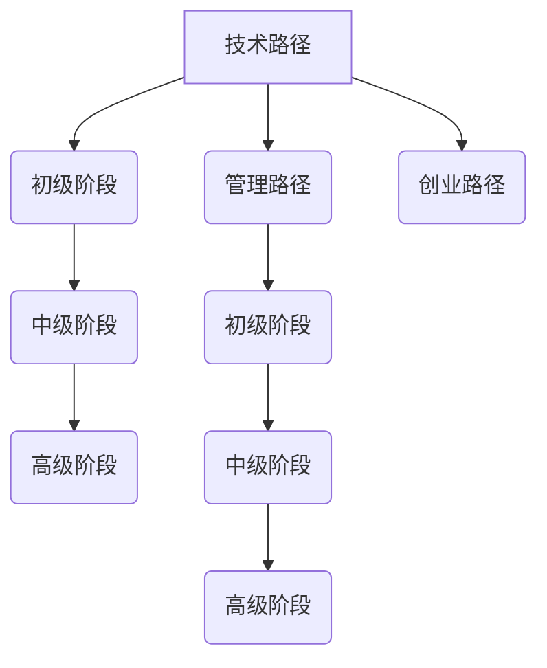

                 

# 从技术到管理：职业发展路径

> **关键词：职业发展，技术能力，管理能力，跨部门沟通，职业规划，成功案例**

> **摘要：本文将深入探讨从技术到管理的职业发展路径，分析技术能力的提升策略，管理能力的培养方法，以及跨部门沟通与合作的重要性。通过成功案例和经验分享，为IT从业者的职业发展提供有价值的指导。**

### 《从技术到管理：职业发展路径》目录大纲

#### 第一部分：职业发展概述

- **1.1 职业发展概述**
    - 1.1.1 职业发展的基本概念
    - 1.1.2 职业发展的重要性
    - 1.1.3 职业发展的阶段
    - 1.1.4 职业发展的路径

#### 第二部分：技术能力的提升

- **2.1 技术能力的提升**
    - 2.1.1 技术学习的方法
    - 2.1.2 技术能力的评估
    - 2.1.3 技术能力的提升策略

#### 第三部分：管理能力的培养

- **3.1 管理能力的培养**
    - 3.1.1 管理的基础知识
    - 3.1.2 管理能力的提升
    - 3.1.3 团队管理与协作

#### 第四部分：跨部门沟通与合作

- **4.1 跨部门沟通与合作**
    - 4.1.1 跨部门沟通的重要性
    - 4.1.2 跨部门合作的策略
    - 4.1.3 跨部门沟通与合作工具

#### 第五部分：职业规划与职业发展

- **5.1 职业规划与职业发展**
    - 5.1.1 职业规划的意义
    - 5.1.2 职业规划的方法
    - 5.1.3 职业发展策略

#### 第六部分：成功案例与经验分享

- **6.1 技术到管理的成功案例**
    - 6.1.1 技术到管理的路径
    - 6.1.2 技术到管理的经验
    - 6.1.3 管理到技术转化的案例

#### 第七部分：职业发展的未来趋势

- **7.1 职业发展的未来趋势**
    - 7.1.1 人工智能与职业发展
    - 7.1.2 管理创新的未来趋势
    - 7.1.3 职业发展的新机遇

#### 附录

- **附录 A: 职业发展资源推荐**
    - 技术学习资源
    - 管理学习资源
    - 职业规划工具

- **附录 B: 职业发展相关书籍推荐**
    - 技术类书籍推荐
    - 管理类书籍推荐
    - 职业规划类书籍推荐

- **附录 C: 职业发展网址导航**
    - 技术学习网址
    - 管理学习网址
    - 职业规划网址

- **附录 D: Mermaid 流�程图**

- **附录 E: 技术能力提升策略伪代码**

- **附录 F: 数学模型和公式**

- **附录 G: 代码实际案例**

- **附录 H: 代码解读与分析**

**作者：AI天才研究院/AI Genius Institute & 禅与计算机程序设计艺术 /Zen And The Art of Computer Programming**

### 职业发展概述

职业发展是一个漫长而复杂的过程，对于每一个IT从业者而言，如何在技术和管理之间找到平衡，实现职业生涯的持续进步，是一个值得深入探讨的话题。在这一部分，我们将从职业发展的基本概念、重要性、阶段和路径等方面，为大家提供一个全面的职业发展概述。

#### 1.1.1 职业发展的基本概念

职业发展是指个人在职业生涯中所经历的各种成长过程，包括技能的提升、知识的积累、职业角色的转变等。它不仅仅关注个人的技术能力，还包括管理能力、沟通能力、团队协作能力等多个方面。职业发展是一个系统性、长期性的过程，涉及个人、团队和组织三个层面的互动。

#### 1.1.2 职业发展的重要性

职业发展对于个人和组织都具有重要意义。对个人而言，职业发展有助于实现自我价值，提高生活质量，增强自信心和满足感。对组织而言，职业发展可以提升团队的整体素质，增强组织的核心竞争力，实现可持续发展。

#### 1.1.3 职业发展的阶段

职业发展通常可以分为初级阶段、中级阶段和高级阶段。在初级阶段，从业者主要关注技术能力的提升，学习编程语言、数据结构和算法等基础知识。在中级阶段，从业者开始涉足项目管理、团队协作等领域，逐步提升管理能力。在高级阶段，从业者需要具备更高的战略思维，能够在组织中发挥更大的影响力。

#### 1.1.4 职业发展的路径

职业发展路径主要包括技术路径、管理路径和创业路径。技术路径是指通过不断学习和积累，提升个人技术能力，成为技术专家或技术领袖。管理路径是指从技术岗位转向管理岗位，通过团队管理、项目管理等手段，提升领导力和决策能力。创业路径是指自主创业，通过创新和创业实践，实现个人价值和社会价值的双重提升。

### 第二部分：技术能力的提升

技术能力是IT从业者的核心能力之一。在职业发展的过程中，技术能力的提升至关重要。在这一部分，我们将探讨技术学习的方法、技术能力的评估以及技术能力的提升策略。

#### 2.1 技术能力的提升

##### 2.1.1 技术学习的方法

技术学习是一个不断积累和迭代的过程。以下是一些常用的技术学习方法：

1. **基础知识学习**：了解基础编程语言、数据结构、算法等是技术学习的第一步。可以通过阅读书籍、参加线上课程、参与线下培训等方式进行学习。

2. **实践项目**：通过实际项目来巩固和提升技术能力。可以参与开源项目，或者自己开发一些小项目，将所学知识应用到实际场景中。

3. **持续学习**：技术领域日新月异，持续学习是保持技术竞争力的重要手段。可以通过阅读技术博客、参加技术讲座、订阅技术杂志等方式，了解最新的技术动态。

##### 2.1.2 技术能力的评估

技术能力的评估是了解自身技术水平的重要手段。以下是一些常用的技术能力评估标准和方法：

1. **知识储备评估**：通过考试、面试等方式，评估从业者在基础知识方面的掌握程度。

2. **项目经验评估**：通过项目完成情况、项目质量、项目贡献度等方面，评估从业者在实际项目中的表现。

3. **技术难题解决能力评估**：通过解决实际技术问题，评估从业者的技术难题解决能力。

##### 2.1.3 技术能力的提升策略

提升技术能力需要系统地规划，以下是一些常见的技术能力提升策略：

1. **技术积累**：通过深入学习某一技术领域，掌握其核心知识和技能，形成自己的技术优势。

2. **技术实践**：通过实际项目，将所学知识应用到实践中，提升技术实战能力。

3. **技术交流**：通过参加技术社区、技术论坛等活动，与同行交流技术心得，拓展技术视野。

### 第三部分：管理能力的培养

管理能力是IT从业者在职业发展中不可或缺的能力之一。在技术能力的基础上，提升管理能力，可以更好地应对职业发展的挑战。在这一部分，我们将探讨管理的基础知识、管理能力的提升以及团队管理与协作。

#### 3.1 管理能力的培养

##### 3.1.1 管理的基础知识

管理是指通过计划、组织、协调、控制等手段，实现组织目标的过程。以下是一些管理的基本原理和概念：

1. **管理的基本职能**：包括计划、组织、领导、控制四个方面。

2. **管理的目标**：实现组织的战略目标，提升组织的整体绩效。

3. **管理的原则**：包括系统性、目标性、民主性、灵活性等。

##### 3.1.2 管理能力的提升

提升管理能力需要不断学习和实践，以下是一些常见的管理能力提升方法：

1. **理论学习**：通过阅读管理书籍、参加管理课程等，学习管理的基本原理和方法。

2. **实践锻炼**：通过实际管理工作，锻炼管理能力和经验。

3. **反思总结**：定期反思自己的管理行为，总结经验教训，提升管理能力。

##### 3.1.3 团队管理与协作

团队管理是管理能力的重要组成部分。以下是一些团队管理的策略和技巧：

1. **团队组建**：明确团队目标，选择合适的团队成员，建立团队组织结构。

2. **团队沟通**：建立有效的沟通机制，确保团队成员之间信息畅通，减少误解和冲突。

3. **团队协作**：激发团队成员的积极性，提升团队协作效率，实现团队目标。

### 第四部分：跨部门沟通与合作

跨部门沟通与合作在组织运作中具有重要意义。良好的跨部门沟通可以促进信息共享，提升工作效率，实现组织目标。在这一部分，我们将探讨跨部门沟通的重要性、策略以及合作工具。

#### 4.1 跨部门沟通与合作

##### 4.1.1 跨部门沟通的重要性

跨部门沟通的重要性体现在以下几个方面：

1. **信息共享**：跨部门沟通可以促进信息的共享和流通，减少信息孤岛现象。

2. **提高工作效率**：跨部门沟通可以协调不同部门的工作，减少重复劳动，提高工作效率。

3. **实现组织目标**：跨部门沟通可以确保各部门之间的协作，实现组织整体目标。

##### 4.1.2 跨部门合作的策略

跨部门合作需要制定有效的策略，以下是一些常见的跨部门合作策略：

1. **明确目标**：明确跨部门合作的目标，确保各部门都清楚自己的职责和任务。

2. **建立沟通机制**：建立跨部门沟通的机制，确保信息畅通，减少误解和冲突。

3. **促进信任**：通过沟通和协作，促进各部门之间的信任，形成良好的合作关系。

##### 4.1.3 跨部门沟通与合作工具

跨部门沟通与合作需要借助一些工具来提高效率和效果，以下是一些常用的跨部门沟通与合作工具：

1. **电子邮件**：用于正式的、书面的沟通，适合传递重要信息和文件。

2. **即时通讯工具**：如微信、QQ等，用于日常的、快捷的沟通，适合解决紧急问题和日常事务。

3. **项目管理工具**：如JIRA、Trello等，用于项目管理和团队协作，适合协调各部门的工作进度和任务分配。

### 第五部分：职业规划与职业发展

职业规划是职业发展的基础，合理的职业规划可以帮助从业者明确职业目标，制定发展路径，实现职业梦想。在这一部分，我们将探讨职业规划的意义、方法和职业发展策略。

#### 5.1 职业规划与职业发展

##### 5.1.1 职业规划的意义

职业规划对于从业者来说具有重要意义：

1. **明确职业目标**：职业规划可以帮助从业者明确自己的职业目标，明确自己想要达到的职业高度。

2. **制定发展路径**：职业规划可以帮助从业者制定合理的发展路径，选择合适的发展方向。

3. **提高职业竞争力**：职业规划可以帮助从业者提升自己的职业竞争力，为未来的职业发展打下坚实的基础。

##### 5.1.2 职业规划的方法

职业规划需要通过以下几个步骤进行：

1. **自我评估**：了解自己的兴趣、优势、劣势和价值观，明确自己的职业定位。

2. **职业目标设定**：根据自己的兴趣和能力，设定具体的职业目标。

3. **发展路径规划**：根据职业目标，制定合理的发展路径，包括技能提升、工作经历、职业转变等。

4. **行动计划**：制定详细的行动计划，明确每个阶段的任务和目标，确保职业规划的落实。

##### 5.1.3 职业发展策略

职业发展策略是实施职业规划的重要手段，以下是一些常见的职业发展策略：

1. **技术能力提升**：通过学习新技术、参与实际项目等，不断提升自己的技术能力。

2. **管理能力培养**：通过学习管理知识、参与管理工作等，提升自己的管理能力。

3. **跨部门合作**：通过跨部门合作，拓展自己的视野，提升自己的沟通和协作能力。

4. **职业转换**：根据职业目标和发展路径，适时进行职业转换，实现职业发展的新阶段。

### 第六部分：成功案例与经验分享

成功案例和经验分享是职业发展的宝贵财富。在这一部分，我们将通过一些成功案例和经验分享，为大家提供有价值的职业发展指导。

#### 6.1 技术到管理的成功案例

##### 6.1.1 技术到管理的路径

技术到管理的成功案例有很多，以下是一个典型的例子：

**案例：某互联网公司的技术总监到管理岗位的转型**

1. **技术背景**：该技术总监在互联网行业有多年技术工作经验，擅长前端开发和项目架构设计。

2. **管理岗位**：该公司因业务扩展，急需一位负责技术研发和团队管理的高级管理者。

3. **转型过程**：
    - **准备阶段**：在技术岗位上，不断提升自己的技术能力和项目管理能力，学习管理知识和技能。
    - **过渡阶段**：开始担任技术团队的管理工作，逐步承担更多的管理职责。
    - **成熟阶段**：全面负责技术研发和团队管理工作，成功带领团队实现公司目标。

##### 6.1.2 技术到管理的经验

从技术到管理的成功转型，需要以下经验和建议：

1. **持续学习**：技术和管理是两个不同的领域，需要不断学习新的知识和技能。

2. **沟通能力**：管理岗位需要与团队成员、上级领导和跨部门同事进行有效沟通，提升沟通能力至关重要。

3. **领导力**：管理岗位需要具备领导力，能够激励团队成员，带领团队实现目标。

##### 6.1.3 管理到技术转化的案例

除了技术到管理，管理到技术也是一个值得探讨的案例：

**案例：某传统行业企业的项目经理到技术岗位的转型**

1. **管理背景**：该项目经理在传统行业有丰富的项目管理经验，擅长项目规划、进度控制和风险管理。

2. **技术岗位**：该公司开始转型互联网行业，急需具备技术背景的项目经理。

3. **转型过程**：
    - **准备阶段**：在学习项目管理的同时，开始学习编程语言、数据结构和算法等基础技术知识。
    - **过渡阶段**：在项目管理中引入技术思维，逐步承担更多的技术工作。
    - **成熟阶段**：全面负责技术项目的规划和执行，成功带领团队实现公司目标。

##### 6.1.4 管理到技术的挑战

从管理到技术的转型，面临以下挑战：

1. **技术积累**：需要重新学习和积累技术知识，这是一个漫长的过程。

2. **角色转变**：从管理者到技术岗位，需要适应新的工作内容和角色。

3. **团队协作**：技术岗位需要与团队成员紧密合作，提升团队协作能力。

##### 6.1.5 管理到技术的策略

从管理到技术的成功转型，需要以下策略：

1. **学习技术**：通过自学、培训、实习等方式，迅速积累技术知识。

2. **实践技术**：通过参与实际项目，将所学技术知识应用到实践中。

3. **团队协作**：与团队成员建立良好的合作关系，共同推进项目进展。

### 第六部分：成功案例与经验分享

成功案例和经验分享是职业发展的宝贵财富。在这一部分，我们将通过一些成功案例和经验分享，为大家提供有价值的职业发展指导。

#### 6.2 跨部门合作的成功故事

跨部门合作是现代企业中常见的工作模式，以下是一些成功的跨部门合作故事：

##### 6.2.1 跨部门合作的实践

**案例1：某电商公司的供应链优化**

1. **背景**：该公司为了提升供应链效率，决定进行供应链优化项目。

2. **合作过程**：
    - **需求调研**：市场部、销售部和技术部共同参与，收集客户需求和市场信息。
    - **方案设计**：技术部负责系统设计和开发，销售部负责市场推广和客户沟通，采购部负责供应商选择和谈判。
    - **实施推进**：各部门协同工作，定期召开项目会议，确保项目进度和质量。

3. **成果**：通过跨部门合作，成功实现了供应链优化，大幅提升了公司运营效率。

##### 6.2.2 跨部门合作的经验

跨部门合作的成功，离不开以下经验和技巧：

1. **明确目标**：确保所有部门都清楚项目的目标和预期成果，减少分歧和误解。

2. **沟通机制**：建立有效的沟通机制，确保各部门之间的信息畅通，减少信息滞后。

3. **团队合作**：培养团队合作精神，鼓励各部门之间互相支持和协作。

4. **激励机制**：制定合理的激励机制，鼓励员工积极参与跨部门合作，提升项目成功率。

### 第七部分：职业发展的未来趋势

随着科技的快速发展，职业发展的环境和趋势也在不断变化。在这一部分，我们将探讨人工智能、管理创新和职业发展的新机遇。

#### 7.1 人工智能与职业发展

人工智能（AI）正在深刻改变各个行业，对职业发展产生重大影响。以下是一些关键趋势：

1. **技术变革**：AI技术不断进步，从传统的机器学习到深度学习，再到自然语言处理等，为从业者提供了更多的机会。

2. **岗位变迁**：一些传统岗位正在被AI替代，如数据录入员、客服代表等，同时新兴岗位如数据科学家、机器学习工程师等也在迅速崛起。

3. **技能需求**：随着AI技术的发展，对从业者的技能需求也在变化，要求从业者不仅具备技术能力，还需要具备数据分析、机器学习等领域的专业知识。

##### 7.1.1 人工智能对职业的影响

人工智能对职业的影响体现在以下几个方面：

1. **效率提升**：AI技术可以自动化重复性工作，提高工作效率，释放人力资源。

2. **创新驱动**：AI技术推动新产品的研发和市场的开拓，为从业者提供更多创新机会。

3. **职业重塑**：AI技术的应用将重塑职业生态，催生新的职业类别，同时也要求从业者不断学习和适应新的工作模式。

##### 7.1.2 职业发展的应对策略

面对人工智能的冲击，从业者可以采取以下策略：

1. **终身学习**：持续学习新技能，保持技术竞争力。

2. **跨领域融合**：结合不同领域的知识和技能，提高综合能力。

3. **创新思维**：培养创新思维，积极寻找新的职业机会。

#### 7.2 管理创新的未来趋势

管理创新是组织持续发展的关键。以下是一些管理创新的未来趋势：

1. **数字化管理**：随着数字化技术的普及，管理方式也将越来越数字化、智能化。

2. **敏捷管理**：敏捷管理强调快速响应变化，灵活调整策略，提高组织的敏捷性和创新能力。

3. **数据驱动**：通过数据分析，管理者可以更准确地预测趋势，制定科学的决策。

##### 7.2.1 管理创新的概念

管理创新是指通过引入新的管理理念、方法和技术，优化管理流程，提高管理效率，从而实现组织目标的过程。

##### 7.2.2 管理创新的趋势

管理创新的趋势体现在以下几个方面：

1. **数字化转型**：越来越多的组织将数字化转型作为管理创新的重要方向，通过数字化手段提升管理效率。

2. **数据驱动决策**：数据分析在管理决策中的应用越来越广泛，管理者通过数据来优化决策过程。

3. **员工参与**：员工参与管理决策，激发员工积极性，提升组织活力。

#### 7.3 职业发展的新机遇

随着科技和管理模式的不断进步，职业发展领域也出现了许多新机遇：

1. **新职业类别**：如AI伦理师、数据隐私专家等，为从业者提供了新的职业选择。

2. **国际化发展**：全球化趋势为从业者提供了更多跨国工作的机会。

3. **自主创业**：互联网和数字化技术的发展，为创业者提供了更多的资源和平台，降低了创业门槛。

##### 7.3.1 职业发展的新领域

职业发展的新领域包括：

1. **人工智能领域**：如机器学习、深度学习、自然语言处理等。

2. **数字化领域**：如大数据分析、云计算、区块链等。

3. **新兴技术领域**：如物联网、虚拟现实、增强现实等。

##### 7.3.2 职业发展的新挑战

随着新机遇的出现，职业发展也面临着新的挑战：

1. **技术更新速度快**：从业者需要不断学习新技能，以应对技术快速变化。

2. **工作压力增大**：随着工作内容和复杂度的增加，从业者需要具备更强的抗压能力。

3. **职业安全感的挑战**：新兴职业和岗位的不确定性，给从业者带来了职业安全感的挑战。

### 附录

#### 附录 A: 职业发展资源推荐

- **技术学习资源**：
  - 技术书籍推荐：《算法导论》、《深度学习》、《Python编程：从入门到实践》等。
  - 在线课程推荐：Coursera、edX、Udacity等平台上的相关课程。

- **管理学习资源**：
  - 管理书籍推荐：《管理的实践》、《从优秀到卓越》、《创新与企业家精神》等。
  - 管理课程推荐：MBA课程、管理培训课程等。

- **职业规划工具**：
  - 职业规划软件：LinkedIn、职业规划APP等。
  - 职业测评工具：MBTI、霍兰德职业兴趣测评等。

#### 附录 B: 职业发展相关书籍推荐

- **技术类书籍推荐**：
  - 《人工智能：一种现代的方法》、《算法导论》、《计算机网络：自顶向下方法》等。

- **管理类书籍推荐**：
  - 《从优秀到卓越》、《领导力的五个层次》、《高效能人士的七个习惯》等。

- **职业规划类书籍推荐**：
  - 《职业规划与职业发展》、《如何选择你的职业道路》、《你的降落伞是什么颜色》等。

#### 附录 C: 职业发展网址导航

- **技术学习网址**：
  - 技术社区：Stack Overflow、GitHub、CSDN等。
  - 技术博客：博客园、知乎、V2EX等。

- **管理学习网址**：
  - 管理社区：MBA智库、管理学报、管理心理学网等。
  - 管理博客：麦肯锡、哈佛商业评论、清华管理学刊等。

- **职业规划网址**：
  - 职业规划网站：CareerBuilder、LinkedIn、Indeed等。
  - 职业咨询：职业规划师协会、职业生涯发展中心等。

### 附录 D: Mermaid 流程图



### 附录 E: 技术能力提升策略伪代码

```python
# 技术能力提升策略伪代码

# 步骤1：确定技术领域
domain = "计算机技术"

# 步骤2：学习基础知识
learn_basics = ["编程语言", "数据结构", "算法"]

# 步骤3：掌握核心技术
master_skills = ["深度学习", "大数据", "云计算"]

# 步骤4：进行实践项目
practice_projects = ["开发个人项目", "参与开源项目"]

# 步骤5：持续学习和分享
continue_learning = ["阅读技术书籍", "参加技术讲座", "撰写技术博客"]
```

### 附录 F: 数学模型和公式

$$
f(x) = ax^2 + bx + c
$$

### 附录 G: 代码实际案例

```python
# 示例：计算圆的面积

import math

def calculate_circle_area(radius):
    """
    计算圆的面积
    :param radius: 圆的半径
    :return: 圆的面积
    """
    area = math.pi * radius * radius
    return area

# 测试代码
radius = 5
area = calculate_circle_area(radius)
print(f"半径为{radius}的圆的面积是：{area}")
```

### 附录 H: 代码解读与分析

```python
# 代码解读

# 第1行：导入math模块，用于计算圆周率π和其他数学函数

# 第4行：定义函数calculate_circle_area，参数radius为圆的半径

# 第5行：使用math.pi计算圆周率π

# 第6行：使用radius * radius计算半径的平方

# 第7行：计算圆的面积，公式为π * r^2

# 第8行：返回圆的面积

# 分析

# 本代码实现了一个简单的函数，用于计算圆的面积。它接收一个参数radius，并使用数学公式计算圆的面积。函数的代码结构清晰，易于理解。

# 在实际应用中，我们可以调用这个函数来计算任意半径的圆的面积，并打印结果。
```

### 结语

职业发展是一个复杂而富有挑战性的过程，从技术到管理，从个体到团队，从现实到未来，每一个阶段都充满了机遇与挑战。本文旨在为大家提供一份详细的职业发展指南，帮助大家在职业发展的道路上走得更远、更稳。希望每一位读者都能从中获得启发，找到属于自己的职业发展路径。

最后，让我们共同祝愿每一位IT从业者在职业发展的道路上取得成功，实现自我价值，创造更美好的未来！**作者：AI天才研究院/AI Genius Institute & 禅与计算机程序设计艺术 /Zen And The Art of Computer Programming**。

