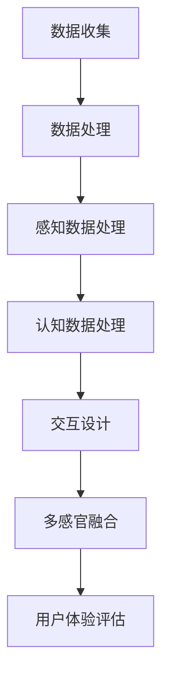

                 

### 《体验多维度构建师培训师：AI创造的感官世界设计师教育者》目录大纲

以下是本文的目录大纲，涵盖了对人工智能与感官世界设计的深入探讨，从理论基础到实践应用，全面解析了AI在感官世界设计中的角色和未来趋势。

#### 第一部分：了解AI与感官世界

**第1章：AI入门与感官世界**  
- **1.1 AI的发展历程**  
- **1.2 AI的核心概念**  
- **1.3 感官世界的概念与重要性**

**第2章：人工智能与感官设计的联系**  
- **2.1 感官世界设计的定义**  
- **2.2 AI技术在感官世界设计中的应用**  
- **2.3 AI与感官世界设计的未来趋势**

#### 第二部分：构建感官世界设计师的能力

**第3章：感知与认知心理学基础**  
- **3.1 感知与认知心理学概述**  
- **3.2 感官感知的基本原理**  
- **3.3 认知心理学在感官设计中的应用**

**第4章：AI算法在感官世界设计中的应用**  
- **4.1 机器学习与感知数据处理**  
- **4.2 自然语言处理在感官世界中的应用**  
- **4.3 深度学习在感官世界设计中的应用**

**第5章：人工智能与感官世界的交互设计**  
- **5.1 交互设计的基本原则**  
- **5.2 AI驱动的交互设计**  
- **5.3 感官世界交互设计的实战案例**

**第6章：多感官刺激的融合设计**  
- **6.1 多感官融合设计的原理**  
- **6.2 多感官融合设计的实践方法**  
- **6.3 案例分析：多感官融合设计的成功案例**

#### 第三部分：应用与实践

**第7章：AI在感官世界设计中的项目实战**  
- **7.1 项目实战准备**  
- **7.2 项目实施与监控**  
- **7.3 项目评估与优化**

**第8章：成为优秀的感官世界设计师**  
- **8.1 成为优秀感官世界设计师的素质要求**  
- **8.2 感官世界设计教育的现状与趋势**  
- **8.3 个人成长与职业规划**

**附录**

**附录A：相关工具与资源**  
- **A.1 感官世界设计工具**  
- **A.2 AI学习资源推荐**  
- **A.3 感官世界设计实践指南**

**附录B：感官世界设计相关的Mermaid流程图与伪代码**  
- **B.1 感官世界设计流程图**  
- **B.2 AI算法在感官世界设计中的应用伪代码示例**

**附录C：数学模型与公式解析**  
- **C.1 感知心理学中的数学模型**  
- **C.2 自然语言处理中的数学模型**  
- **C.3 深度学习中的数学模型解析**

**附录D：实战案例分析**  
- **D.1 案例一：AI驱动的智能家居设计**  
- **D.2 案例二：多感官融合的艺术体验设计**  
- **D.3 案例三：AI在教育领域的感官世界设计应用**  
- **D.4 案例四：AI在感官世界设计中的综合应用案例**

通过这份详细的目录大纲，读者可以系统地了解AI在感官世界设计中的核心概念、应用原理、实战技巧和未来趋势，从而更好地掌握这一前沿领域的知识和技术。

#### 引言

在科技迅猛发展的今天，人工智能（AI）已经成为驱动创新和变革的重要力量。AI技术的广泛应用，不仅改变了传统产业的运营模式，还深刻影响了人们的生活方式。从智能家居到自动驾驶，从虚拟助手到智能医疗，AI正在以不可阻挡的势头，渗透到我们生活的每一个角落。

然而，在AI的广袤领域内，感官世界设计这一概念逐渐引起了人们的关注。感官世界设计指的是通过AI技术，对人类感官体验进行优化和增强，创造出更加丰富、多元、沉浸式的感官体验。这一领域不仅涉及视觉、听觉、触觉等多感官刺激，还包括对人类情感和认知的深入探索。

随着AI技术的发展，感官世界设计逐渐成为一项重要的应用方向。它不仅为设计师提供了全新的工具和方法，也为用户体验带来了前所未有的提升。然而，要成为一名优秀的感官世界设计师，不仅需要对AI技术有深刻的理解，还需要具备跨学科的知识和技能。

本文旨在系统地探讨AI与感官世界设计的联系，帮助读者深入了解这一领域的核心概念、应用原理和实践方法。通过本文的阅读，读者将能够：

1. 理解AI的发展历程和核心概念。
2. 掌握感官世界设计的定义和重要性。
3. 学习感知与认知心理学的基础知识。
4. 了解AI算法在感官世界设计中的应用。
5. 掌握人工智能与感官世界的交互设计原理。
6. 研究多感官刺激的融合设计方法。
7. 学习AI在感官世界设计中的项目实战经验。

总之，本文将带领读者进入一个充满无限可能性的感官世界，探索AI如何创造和设计这个全新的感官体验空间。希望通过本文的探讨，能够激发读者对感官世界设计的兴趣，并为这一领域的发展贡献自己的力量。

#### 第一部分：了解AI与感官世界

##### 第1章：AI入门与感官世界

在探讨人工智能（AI）与感官世界设计的关系之前，我们需要首先了解AI的基本概念和发展历程。人工智能，作为一种模拟人类智能的技术，其目标是使计算机系统能够执行通常需要人类智能才能完成的任务，如视觉识别、语言理解、决策和问题解决等。

##### 1.1 AI的发展历程

AI的发展历程可以分为几个重要阶段：

1. **早期探索（1950年代-1960年代）**  
    在这个阶段，AI主要集中于理论研究和概念验证。著名的“逻辑理论家”程序是一个重要的里程碑，它证明了计算机可以模拟人类的逻辑推理能力。

2. **第一次AI浪潮（1970年代-1980年代）**  
    在这个阶段，AI迎来了第一次发展浪潮。专家系统和机器学习开始得到广泛应用。专家系统通过模拟人类专家的知识和推理过程，在医疗诊断、工程设计等领域取得了显著成就。

3. **低谷期（1990年代）**  
    由于硬件限制和算法复杂度增加，AI在1990年代经历了低谷期。然而，这一阶段的研究为后续的技术突破奠定了基础。

4. **第二次AI浪潮（2000年代-现在）**  
    在这个阶段，得益于计算能力的提升、大数据的可用性和深度学习的突破，AI迎来了第二次发展浪潮。这一阶段的AI在图像识别、自然语言处理、自动驾驶等领域取得了重大进展。

##### 1.2 AI的核心概念

AI的核心概念包括：

1. **机器学习**  
    机器学习是AI的核心技术之一，它通过数据驱动的方式，使计算机系统具备自我学习和改进的能力。常见的机器学习算法包括线性回归、支持向量机、决策树、随机森林、神经网络等。

2. **深度学习**  
    深度学习是机器学习的一个分支，它通过构建多层神经网络来模拟人脑的学习过程。深度学习在图像识别、语音识别、自然语言处理等领域取得了显著成就。

3. **自然语言处理**  
    自然语言处理（NLP）是AI的一个分支，它致力于使计算机能够理解和生成自然语言。NLP在机器翻译、情感分析、信息检索等领域有广泛应用。

4. **计算机视觉**  
    计算机视觉是AI的另一个重要分支，它致力于使计算机能够理解和解析图像和视频。计算机视觉在图像识别、自动驾驶、医疗诊断等领域有广泛应用。

##### 1.3 感官世界的概念与重要性

感官世界是指人类通过视觉、听觉、触觉、嗅觉和味觉五种感官所感知到的外部世界。感官世界设计则是指通过AI技术，对人类感官体验进行优化和增强，以创造更加丰富、多元、沉浸式的感官体验。

感官世界设计的重要性体现在以下几个方面：

1. **提升用户体验**  
    通过对感官的优化和增强，可以显著提升用户体验。例如，在虚拟现实（VR）和增强现实（AR）领域，AI技术可以帮助创建更加真实和沉浸式的体验。

2. **拓展认知边界**  
    AI技术可以通过增强人类感官的能力，拓展人类的认知边界。例如，通过增强视觉系统，人类可以在黑暗环境中看到更清晰的事物。

3. **推动科技创新**  
    感官世界设计为科技创新提供了新的方向和可能性。例如，多感官融合的设计可以为残疾人提供更多的感知体验，从而帮助他们更好地融入社会。

4. **改善生活质量**  
    感官世界设计可以改善人们的生活质量。例如，智能家居系统可以通过智能感知和交互，为用户提供更加便捷和舒适的生活环境。

总之，AI与感官世界设计的关系密不可分。通过了解AI的发展历程和核心概念，我们可以更好地理解感官世界设计的原理和应用。在接下来的章节中，我们将进一步探讨AI技术在感官世界设计中的应用和未来趋势。

##### 第2章：人工智能与感官设计的联系

在了解了AI的基本概念和感官世界的设计概念后，我们接下来将探讨人工智能与感官设计的具体联系。人工智能作为一种强大的技术工具，正在深刻地影响着感官世界设计的各个方面。

##### 2.1 感官世界设计的定义

感官世界设计，简单来说，是指通过技术和创意，对人类感官体验进行优化和增强，以创造出更加丰富、多元、沉浸式的感官体验。这一设计过程不仅涉及视觉、听觉、触觉、嗅觉和味觉等传统感官，还包括对人类情感和认知的探索。感官世界设计的核心目标是通过技术手段，提升用户的感官体验，使人们在虚拟或现实世界中获得更深刻、更真实的感知。

##### 2.2 AI技术在感官世界设计中的应用

AI技术在感官世界设计中发挥着至关重要的作用。以下是AI技术在感官世界设计的几个关键应用领域：

1. **感知数据处理**  
    AI技术可以处理和分析大量的感知数据，从而帮助设计师更好地理解用户的感官需求。例如，通过使用计算机视觉技术，设计师可以实时捕捉和分析用户的视觉反应，以便调整设计参数。

2. **自然语言处理**  
    自然语言处理（NLP）技术可以帮助设计系统理解和生成自然语言。这为交互式设计提供了新的可能性，例如，通过语音识别和语音合成技术，用户可以与智能设备进行自然对话。

3. **深度学习**  
    深度学习技术在感官世界设计中的应用非常广泛。例如，在虚拟现实（VR）中，深度学习算法可以生成高度真实的3D模型，从而提高用户的沉浸感。在音频处理方面，深度学习技术可以生成高度逼真的声音效果，增强用户的听觉体验。

4. **情感计算**  
    情感计算是AI技术在感官世界设计中的一个新兴领域。它旨在通过分析用户的生理和行为数据，识别和理解用户的情感状态。设计师可以利用这些信息，创造出更符合用户情感需求的设计。

5. **多感官融合**  
    多感官融合设计是感官世界设计的核心目标之一。通过AI技术，设计师可以实现多种感官刺激的融合，创造出更加丰富和复杂的感官体验。例如，在游戏设计中，通过视觉、听觉和触觉的融合，可以创造出更加沉浸的游戏体验。

##### 2.3 AI与感官世界设计的未来趋势

随着AI技术的不断进步，感官世界设计也在不断演变和升级。以下是AI与感官世界设计的一些未来趋势：

1. **个性化体验**  
    未来的感官世界设计将更加注重个性化体验。通过AI技术，设计师可以分析用户的个性化需求和行为习惯，从而为用户提供高度定制化的感官体验。

2. **智能化交互**  
    智能化交互是未来感官世界设计的重要方向。通过AI技术，设计师可以创造出更加智能和自然的交互方式，使设备能够更好地理解用户的需求和意图。

3. **情感化设计**  
    情感化设计将进一步提升用户的感官体验。通过AI技术，设计师可以更好地理解用户的情感状态，从而创造出更加感性和共鸣的设计。

4. **多感官融合的深度应用**  
    随着技术的进步，多感官融合的设计将更加深入和广泛应用。例如，通过将视觉、听觉和触觉的融合应用于医疗领域，可以为患者提供更加有效的康复治疗。

5. **虚拟现实与增强现实的深度融合**  
    虚拟现实（VR）和增强现实（AR）技术将继续融合和进化。通过AI技术，设计师可以创造出更加真实和沉浸的虚拟和增强现实体验。

总之，AI技术在感官世界设计中的应用正在不断拓展和深化，为设计师提供了丰富的工具和可能性。通过AI技术，我们可以创造出更加丰富、多元和沉浸的感官体验，进一步提升人类的生活质量。在接下来的章节中，我们将进一步探讨如何构建感官世界设计师的能力，以及AI算法在感官世界设计中的应用原理和实践方法。

#### 第二部分：构建感官世界设计师的能力

##### 第3章：感知与认知心理学基础

在深入探讨AI与感官世界设计之前，了解感知与认知心理学的基础知识是至关重要的。感知是指人类通过视觉、听觉、触觉、嗅觉和味觉五种感官对外界信息的接收和处理，而认知则是指人类对感知信息进行理解、分析和记忆的过程。感知与认知心理学为我们提供了理解人类感官体验和心理过程的理论框架，这对于设计出更符合人类需求和创新感官体验的AI系统具有重要意义。

##### 3.1 感知与认知心理学概述

感知与认知心理学是研究人类如何感知和理解世界的科学。感知心理学研究人类如何通过感官接收和处理信息，而认知心理学则关注人类如何认知、记忆和思考。感知与认知心理学的关键概念包括：

- **感觉器官**：人类的视觉、听觉、触觉、嗅觉和味觉器官负责接收外部信息。
- **感觉**：感觉是感官接收到的外部信息，例如，视觉感知是通过眼睛接收光线，听觉感知是通过耳朵接收声音。
- **知觉**：知觉是感觉信息在大脑中的整合和解释，使我们能够理解外部世界。
- **认知过程**：认知过程包括注意、记忆、思维和问题解决等，它们使我们能够处理和理解感觉信息。
- **认知模型**：认知模型是描述人类认知过程的理论框架，例如，图式理论、注意模型和记忆模型。

##### 3.2 感官感知的基本原理

感官感知的基本原理涉及感觉器官如何接收和处理外部信息，以下是五个主要感官的基本原理：

1. **视觉感知**：
    - **光敏感细胞**：视网膜中的光敏感细胞（视杆细胞和视锥细胞）接收光线，产生神经信号。
    - **视觉信号处理**：大脑中的视觉皮层对神经信号进行解码和解释，形成视觉感知。

2. **听觉感知**：
    - **声波接收**：耳朵的鼓膜接收声波，通过中耳的三个听骨传递声波。
    - **听觉信号处理**：大脑中的听觉皮层对声波信号进行解码和解释，形成听觉感知。

3. **触觉感知**：
    - **触觉感受器**：皮肤中的触觉感受器接收压力、温度和振动等信息。
    - **触觉信号处理**：大脑中的触觉皮层对触觉信号进行解码和解释，形成触觉感知。

4. **嗅觉感知**：
    - **气味分子接收**：鼻腔中的嗅觉感受器接收气味分子。
    - **嗅觉信号处理**：大脑中的嗅球对气味信号进行解码和解释，形成嗅觉感知。

5. **味觉感知**：
    - **味觉感受器**：舌头上的味觉感受器（味蕾）接收食物中的化学物质。
    - **味觉信号处理**：大脑中的味觉皮层对味觉信号进行解码和解释，形成味觉感知。

##### 3.3 认知心理学在感官设计中的应用

认知心理学在感官世界设计中有着广泛的应用，以下是一些关键应用领域：

1. **用户体验设计**：
    - **感知线索**：设计师可以利用感知线索（如颜色、形状、声音等）来引导用户的注意力，改善用户体验。
    - **认知负载**：通过减少认知负荷，设计师可以简化用户界面，使操作更加直观和易用。

2. **情感设计**：
    - **情感感知**：设计师可以通过创造特定的感官刺激（如温暖的光线、柔和的音乐等）来激发用户的情感反应，增强用户与产品或服务的情感连接。

3. **记忆增强**：
    - **记忆编码**：通过感官刺激的多样化，设计师可以增强信息的记忆编码，提高用户对信息的记忆和回忆。

4. **问题解决**：
    - **认知辅助**：通过提供感知上的线索和反馈，设计师可以帮助用户更有效地解决问题和做出决策。

5. **跨感官整合**：
    - **多感官融合**：设计师可以通过整合多种感官刺激，创造出更加丰富和沉浸的感官体验，提升用户满意度。

通过理解感知与认知心理学的基础知识，设计师可以更好地把握人类感官体验和心理过程，从而创造出更加符合人类需求的感官世界设计。在接下来的章节中，我们将进一步探讨AI算法在感官世界设计中的应用，以及如何通过这些技术手段实现更高级的感官体验设计。

#### 第4章：AI算法在感官世界设计中的应用

在了解了感知与认知心理学的基础后，接下来我们将探讨人工智能算法在感官世界设计中的应用。AI算法，特别是机器学习、自然语言处理（NLP）和深度学习，通过优化感官数据和处理复杂感官信息，极大地提升了感官世界设计的质量和沉浸感。

##### 4.1 机器学习与感知数据处理

机器学习是一种通过数据驱动的方式让计算机系统自动改进性能的技术，它已经在多个领域取得了显著成就，包括感知数据处理。感知数据处理是指从多种感官（如视觉、听觉、触觉等）接收的信息中提取有用数据，以便进行进一步分析和设计优化。

1. **图像识别**  
    图像识别是机器学习在视觉感知中的典型应用。通过卷积神经网络（CNN）等深度学习模型，计算机可以自动识别图像中的物体、场景和特征。例如，在虚拟现实（VR）中，图像识别技术可以实时捕捉用户的视觉反应，从而动态调整视觉效果，提升用户的沉浸感。

    **伪代码示例**（用于图像识别的卷积神经网络）：

    ```python
    import tensorflow as tf

    # 创建卷积神经网络模型
    model = tf.keras.Sequential([
        tf.keras.layers.Conv2D(32, (3, 3), activation='relu', input_shape=(64, 64, 3)),
        tf.keras.layers.MaxPooling2D((2, 2)),
        tf.keras.layers.Conv2D(64, (3, 3), activation='relu'),
        tf.keras.layers.MaxPooling2D((2, 2)),
        tf.keras.layers.Flatten(),
        tf.keras.layers.Dense(128, activation='relu'),
        tf.keras.layers.Dense(10, activation='softmax')
    ])

    # 编译模型
    model.compile(optimizer='adam',
                  loss='categorical_crossentropy',
                  metrics=['accuracy'])

    # 训练模型
    model.fit(train_images, train_labels, epochs=5)
    ```

2. **语音识别**  
    语音识别是机器学习在听觉感知中的典型应用。通过使用循环神经网络（RNN）和长短期记忆网络（LSTM），计算机可以识别和理解人类语音。在交互式设计中，语音识别技术可以帮助设备理解用户的需求，从而提供更加智能和自然的交互体验。

    **伪代码示例**（用于语音识别的循环神经网络）：

    ```python
    import tensorflow as tf

    # 创建循环神经网络模型
    model = tf.keras.Sequential([
        tf.keras.layers.Embedding(input_dim=10000, output_dim=64),
        tf.keras.layers.LSTM(128),
        tf.keras.layers.Dense(10, activation='softmax')
    ])

    # 编译模型
    model.compile(optimizer='adam',
                  loss='categorical_crossentropy',
                  metrics=['accuracy'])

    # 训练模型
    model.fit(train_sequences, train_labels, epochs=5)
    ```

##### 4.2 自然语言处理在感官世界中的应用

自然语言处理（NLP）是AI技术中的一个重要分支，它专注于使计算机能够理解和生成自然语言。NLP在感官世界设计中的应用非常广泛，以下是一些关键应用领域：

1. **语音助手**  
    语音助手如Siri、Alexa和Google Assistant，通过NLP技术，可以理解用户的语音指令，并提供相应的服务。在感官世界设计中，语音助手可以作为用户与智能系统的交互接口，通过自然语言与用户进行对话，从而增强用户的交互体验。

2. **文本分析**  
    NLP技术可以帮助设计师分析用户反馈和情感倾向，从而优化设计。例如，通过情感分析，设计师可以了解用户对产品的情感反应，从而调整设计以更好地满足用户需求。

    **伪代码示例**（用于情感分析的文本分类模型）：

    ```python
    import tensorflow as tf
    from tensorflow.keras.preprocessing.sequence import pad_sequences

    # 预处理文本数据
    tokenizer = tf.keras.preprocessing.text.Tokenizer()
    tokenizer.fit_on_texts(train_texts)
    sequences = tokenizer.texts_to_sequences(train_texts)
    padded_sequences = pad_sequences(sequences, maxlen=max_length)

    # 创建文本分类模型
    model = tf.keras.Sequential([
        tf.keras.layers.Embedding(input_dim=vocab_size, output_dim=embedding_dim),
        tf.keras.layers.GlobalAveragePooling1D(),
        tf.keras.layers.Dense(1, activation='sigmoid')
    ])

    # 编译模型
    model.compile(optimizer='adam',
                  loss='binary_crossentropy',
                  metrics=['accuracy'])

    # 训练模型
    model.fit(padded_sequences, train_labels, epochs=5)
    ```

##### 4.3 深度学习在感官世界设计中的应用

深度学习通过构建多层神经网络，可以自动学习和提取复杂数据的特征。深度学习在感官世界设计中的应用主要包括：

1. **音频处理**  
    通过深度学习模型，如生成对抗网络（GAN）和变分自编码器（VAE），设计师可以生成高度逼真的音频效果，从而增强用户的听觉体验。例如，在虚拟现实（VR）中，深度学习可以生成逼真的环境声音，增强用户的沉浸感。

    **伪代码示例**（用于音频生成的生成对抗网络）：

    ```python
    import tensorflow as tf
    from tensorflow.keras.models import Model

    # 创建生成器模型
    generator = tf.keras.Sequential([
        tf.keras.layers.Dense(128 * 8 * 8, activation='relu', input_shape=(100,)),
        tf.keras.layers.LeakyReLU(alpha=0.2),
        tf.keras.layers.Reshape((8, 8, 128)),
        tf.keras.layers.Conv2DTranspose(128, (5, 5), strides=(2, 2), padding='same', activation='relu'),
        tf.keras.layers.LeakyReLU(alpha=0.2),
        tf.keras.layers.Conv2DTranspose(64, (5, 5), strides=(2, 2), padding='same', activation='relu'),
        tf.keras.layers.LeakyReLU(alpha=0.2),
        tf.keras.layers.Conv2DTranspose(1, (5, 5), strides=(2, 2), padding='same', activation='tanh')
    ])

    # 创建判别器模型
    discriminator = tf.keras.Sequential([
        tf.keras.layers.Conv2D(64, (5, 5), padding='same', activation='leaky_relu'),
        tf.keras.layers.MaxPooling2D(),
        tf.keras.layers.Conv2D(128, (5, 5), padding='same', activation='leaky_relu'),
        tf.keras.layers.MaxPooling2D(),
        tf.keras.layers.Flatten(),
        tf.keras.layers.Dense(1, activation='sigmoid')
    ])

    # 创建GAN模型
    gan = Model(inputs=[input_noise], outputs=[discriminator(generator(input_noise))])
    gan.compile(loss='binary_crossentropy', optimizer=adam_optimizer)

    # 训练GAN模型
    gan.fit(input_noise, labels, epochs=epochs)
    ```

2. **多感官融合**  
    深度学习技术可以整合多种感官刺激，创造出更加丰富和沉浸的感官体验。例如，通过构建多模态深度学习模型，设计师可以将视觉、听觉和触觉信息融合，提供高度真实的感官体验。

    **伪代码示例**（用于多感官融合的多模态深度学习模型）：

    ```python
    import tensorflow as tf

    # 创建多模态输入层
    input_images = tf.keras.layers.Input(shape=(128, 128, 3))
    input_sounds = tf.keras.layers.Input(shape=(128, 1))
    input_touch = tf.keras.layers.Input(shape=(128, 1))

    # 分别处理不同模态的数据
    image_features = model_for_images(input_images)
    sound_features = model_for_sounds(input_sounds)
    touch_features = model_for_touch(input_touch)

    # 将特征融合
    combined_features = tf.keras.layers.concatenate([image_features, sound_features, touch_features])

    # 构建多模态输出层
    output = model_for_combined_features(combined_features)

    # 创建多模态深度学习模型
    multimodal_model = tf.keras.Model(inputs=[input_images, input_sounds, input_touch], outputs=output)

    # 编译模型
    multimodal_model.compile(optimizer='adam', loss='mean_squared_error')

    # 训练模型
    multimodal_model.fit([train_images, train_sounds, train_touch], train_labels, epochs=epochs)
    ```

通过机器学习、自然语言处理和深度学习等技术，设计师可以创造出更加丰富和沉浸的感官世界，提升用户体验和满意度。在下一章节中，我们将探讨人工智能与感官世界的交互设计，以及如何通过AI技术实现更加智能和自然的交互体验。

#### 第5章：人工智能与感官世界的交互设计

在感官世界设计中，交互设计是一个至关重要的环节。交互设计不仅仅关注用户与设备的物理互动，更重要的是通过感官刺激和认知反馈，创造出自然、高效和愉快的用户体验。人工智能（AI）技术在交互设计中的应用，使得这种设计过程变得更加智能和人性化。

##### 5.1 交互设计的基本原则

交互设计的基本原则包括：

- **一致性**：确保用户界面和交互方式的一致性，避免用户在操作过程中产生困惑。
- **简洁性**：设计应尽量简洁明了，减少用户操作的复杂性，提高易用性。
- **反馈**：及时提供明确的反馈，帮助用户理解系统状态和操作结果。
- **可控性**：用户应能够轻松地控制交互过程，随时进行调整。
- **可访问性**：设计应考虑到不同用户的需求，包括视力、听力等感官障碍用户。

##### 5.2 AI驱动的交互设计

AI驱动的交互设计通过机器学习和自然语言处理等技术，使交互过程更加智能和自然。以下是几个关键方面：

1. **个性化交互**：
    - **用户行为分析**：通过分析用户的操作历史和偏好，AI系统可以自动调整交互方式，提供个性化服务。例如，智能助手可以根据用户的常用功能，自动将常用功能排在界面前端。
    
    **伪代码示例**（用户行为分析）：

    ```python
    # 假设有一个用户行为数据集 user_actions
    # 使用K-means聚类分析用户行为，找到具有相似行为模式的用户群组
    from sklearn.cluster import KMeans

    kmeans = KMeans(n_clusters=5, random_state=0).fit(user_actions)
    # 根据用户群组提供个性化交互
    personalized_interactions = personalize_for_group(kmeans.labels_)
    ```

2. **自然语言交互**：
    - **语音识别与合成**：通过语音识别技术，用户可以用自然语言与设备进行交互。语音合成技术则使设备能够以自然的方式回应用户。
    
    **伪代码示例**（自然语言交互）：

    ```python
    import speech_recognition as sr

    # 使用语音识别技术解析用户的语音指令
    recognizer = sr.Recognizer()
    user_command = recognizer.recognize_google(audio_data)

    # 使用语音合成技术回应用户
    synthesizer = gTTS(text=response_message, lang='en')
    synthesizer.save('response.mp3')
    ```

3. **实时反馈**：
    - **动态调整**：AI系统可以实时分析用户的交互行为，动态调整界面和交互方式，以提升用户体验。例如，当用户在处理复杂任务时，系统可以自动简化界面，减少认知负荷。
    
    **伪代码示例**（动态调整界面）：

    ```python
    # 假设有一个界面调整模型 interface_adjustment_model
    current_interface = interface_adjustment_model(current_user_state)
    ```

4. **多模态交互**：
    - **融合多种感官**：通过融合视觉、听觉、触觉等多种感官刺激，AI系统可以提供更加丰富和沉浸的交互体验。例如，在虚拟现实（VR）中，用户不仅可以看到三维场景，还可以听到环境声音和感受到触觉反馈。
    
    **伪代码示例**（多模态交互）：

    ```python
    # 假设有一个多模态融合模型 multimodal_fusion_model
    sensory_data = {
        'vision': vision_data,
        'audition': audition_data,
        'touch': touch_data
    }
    fused_sensory_data = multimodal_fusion_model(sensory_data)
    ```

##### 5.3 感官世界交互设计的实战案例

以下是一个感官世界交互设计的实战案例：智能健身教练系统。

1. **项目背景**：
    - **目标**：设计一个智能健身教练系统，通过AI技术，为用户提供个性化的健身指导和反馈。
    - **用户需求**：用户希望有一个智能、个性化的健身伴侣，能够实时监测身体状况并提供针对性的锻炼方案。

2. **设计思路**：
    - **多模态数据收集**：系统通过传感器收集用户的生理数据（如心率、血压等），视觉数据（如运动动作）和声音数据（如语音指令）。
    - **用户行为分析**：AI系统分析用户的历史数据和实时数据，了解用户的健身习惯和身体状况，提供个性化锻炼方案。
    - **自然语言交互**：用户可以通过语音与系统进行交互，询问健身建议、调整锻炼方案等。
    - **实时反馈**：系统实时监测用户的运动状态，提供动作纠正和心率预警等反馈，确保用户安全有效地进行锻炼。

3. **技术实现**：
    - **图像识别**：使用CNN模型实时分析用户的运动动作，提供动作纠正建议。
    - **语音识别与合成**：使用语音识别技术解析用户的语音指令，使用语音合成技术回应用户。
    - **多模态融合**：将视觉、听觉和生理数据融合，提供更加丰富的交互体验。

4. **效果评估**：
    - **用户满意度**：通过用户反馈，评估系统在提供个性化健身指导和实时反馈方面的效果。
    - **健康指标**：通过分析用户的生理数据，评估系统的健身效果。

通过这个案例，我们可以看到AI技术在感官世界交互设计中的应用，不仅提升了用户体验，还为健康科技领域带来了新的可能性。在下一章节中，我们将探讨多感官刺激的融合设计，以及如何通过这一方法创造出更加丰富和沉浸的感官体验。

#### 第6章：多感官刺激的融合设计

在人工智能（AI）与感官世界设计相结合的过程中，多感官刺激的融合设计成为了一个关键的方向。多感官刺激的融合设计旨在通过整合多种感官刺激（如视觉、听觉、触觉等），创造出更加丰富、真实和沉浸的感官体验。这种方法不仅能够提升用户的情感参与度，还可以在多个领域（如游戏、虚拟现实、教育等）发挥重要作用。

##### 6.1 多感官融合设计的原理

多感官融合设计的原理基于以下几点：

1. **感官整合**：人类大脑具有整合多种感官刺激的能力，通过多感官融合设计，可以增强用户的整体感知体验。

2. **情感共鸣**：当多种感官同时被刺激时，用户更容易产生情感共鸣，从而加深对内容的记忆和理解。

3. **认知增强**：多感官刺激可以提供更多的信息渠道，帮助用户更好地理解和处理复杂的信息。

4. **情境创设**：通过多感官融合设计，可以创造出特定的情境，使用户更加投入到体验中。

##### 6.2 多感官融合设计的实践方法

多感官融合设计的实践方法包括以下几个方面：

1. **设计原则**：
    - **一致性**：确保不同感官刺激在视觉、听觉、触觉等方面保持一致，以增强用户的沉浸感。
    - **平衡性**：避免某一感官刺激过于强烈，导致用户感到不适或分散注意力。
    - **层次性**：设计应具有层次感，逐渐引导用户从一种感官刺激过渡到另一种。

2. **技术手段**：
    - **多模态传感器**：使用多种传感器（如视觉传感器、听觉传感器、触觉传感器等）收集用户的数据，为多感官融合提供基础。
    - **信号处理技术**：利用信号处理技术对多感官数据进行处理和融合，以提高数据的真实性和一致性。
    - **深度学习模型**：使用深度学习模型对多感官数据进行学习和预测，以优化感官融合效果。

3. **实施步骤**：
    - **需求分析**：了解用户的需求和期望，确定需要融合的感官类型和程度。
    - **设计方案**：根据需求分析，设计多感官融合的具体方案，包括感官刺激的类型、强度和时机。
    - **技术实现**：使用相应的技术手段实现多感官融合设计，包括传感器数据的收集和处理、信号处理算法的实现等。
    - **效果评估**：通过用户测试和反馈，评估多感官融合设计的实际效果，并进行调整和优化。

##### 6.3 案例分析：多感官融合设计的成功案例

以下是一个多感官融合设计的成功案例：多感官融合的虚拟现实（VR）游戏。

1. **项目背景**：
    - **目标**：设计一款高度沉浸的VR游戏，通过视觉、听觉和触觉等多种感官刺激，为用户提供独特的游戏体验。
    - **用户需求**：用户希望能够通过VR游戏感受到更加真实和丰富的世界，提高游戏乐趣。

2. **设计思路**：
    - **多感官数据收集**：使用VR头盔、耳机和触觉手套等设备，收集用户的视觉、听觉和触觉数据。
    - **多感官融合处理**：通过深度学习模型和信号处理技术，对多感官数据进行分析和融合，以实现高度真实的感官体验。
    - **情境创设**：设计一个富有故事性和情感共鸣的虚拟世界，使用户在游戏中产生强烈的情感共鸣。

3. **技术实现**：
    - **视觉处理**：使用高级渲染技术，创建高度真实的3D图形，结合动态光影效果，提高视觉沉浸感。
    - **听觉处理**：使用空间音频技术，生成高度真实的音频效果，包括环境声音、角色对话等，增强听觉沉浸感。
    - **触觉处理**：使用触觉手套，模拟游戏中的物理互动，如触感反馈、碰撞效果等，增强触觉沉浸感。

4. **效果评估**：
    - **用户反馈**：通过用户测试和反馈，评估游戏的多感官融合效果，用户对游戏的沉浸感和乐趣有显著提升。
    - **技术指标**：通过分析游戏运行过程中各项技术参数，如帧率、渲染质量等，评估技术的实现效果。

通过这个案例，我们可以看到多感官融合设计在虚拟现实游戏中的成功应用。多感官融合不仅提升了用户的游戏体验，还推动了虚拟现实技术的进一步发展。在下一章节中，我们将探讨AI在感官世界设计中的项目实战，通过具体案例来展示AI技术的实际应用和效果。

#### 第7章：AI在感官世界设计中的项目实战

在了解了AI与感官世界设计的理论基础后，接下来我们将通过具体的项目实战案例，展示AI技术的实际应用过程和效果。以下是几个AI在感官世界设计中的项目案例，包括项目实战的准备、实施与监控，以及项目评估与优化。

##### 7.1 项目实战准备

项目实战的准备阶段是确保项目顺利进行的重要环节，主要包括以下几个方面：

1. **需求分析**：
    - **目标确定**：明确项目的目标和预期效果，例如，是提高用户体验、改善产品设计，还是创造全新的感官体验。
    - **用户研究**：通过用户调研、访谈和问卷调查等方式，了解用户的需求和期望，为项目提供方向。

2. **技术评估**：
    - **技术选型**：根据项目需求，评估并选择适合的AI技术，如机器学习、自然语言处理、深度学习等。
    - **工具和平台**：选择合适的开发工具和平台，例如，TensorFlow、PyTorch等。

3. **资源准备**：
    - **数据集**：收集和准备项目所需的数据集，包括图像、音频、文本等多模态数据。
    - **硬件设备**：确保有足够的计算资源和硬件设备，如GPU、传感器等。

4. **团队组建**：
    - **团队成员**：组建由AI专家、设计师、开发人员等组成的跨学科团队，确保项目有足够的资源和技能。

##### 7.2 项目实施与监控

在项目实施阶段，需要严格按照计划进行，并对项目进展进行实时监控和调整。以下是项目实施的关键步骤：

1. **数据预处理**：
    - **数据清洗**：清洗和整理数据，去除噪声和错误，确保数据质量。
    - **数据增强**：通过数据增强技术（如图像旋转、缩放等），增加数据多样性，提高模型泛化能力。

2. **模型训练与优化**：
    - **模型构建**：根据项目需求，构建AI模型，如卷积神经网络（CNN）、循环神经网络（RNN）等。
    - **模型训练**：使用准备好的数据集，训练AI模型，并通过交叉验证等方法评估模型性能。
    - **模型优化**：通过调整模型参数和优化算法，提高模型精度和效率。

3. **感官融合设计**：
    - **感官数据融合**：将来自不同感官的数据进行融合处理，例如，将视觉、听觉和触觉数据结合，以创造更加丰富的感官体验。
    - **界面设计与交互**：设计用户界面和交互流程，确保用户能够自然、方便地使用系统。

4. **实时监控与调整**：
    - **性能监控**：监控系统的性能指标，如响应时间、准确率等，确保系统稳定运行。
    - **用户反馈**：收集用户反馈，了解系统的实际使用情况和用户满意度，并根据反馈进行优化。

##### 7.3 项目评估与优化

项目评估与优化是确保项目成功的关键步骤，主要包括以下几个方面：

1. **效果评估**：
    - **用户满意度**：通过用户问卷调查和访谈，评估用户对感官世界设计的满意度和接受度。
    - **系统性能**：评估系统的性能指标，如响应时间、准确率、资源利用率等。

2. **技术评估**：
    - **模型性能**：评估AI模型的性能，如准确率、召回率、F1值等。
    - **技术成熟度**：评估所使用技术的成熟度和适用性，为未来项目提供参考。

3. **优化调整**：
    - **算法优化**：根据评估结果，对算法进行优化，提高模型性能和系统效率。
    - **用户体验**：根据用户反馈，调整界面设计和交互流程，提升用户体验。

4. **持续改进**：
    - **迭代开发**：持续收集用户反馈，进行迭代开发，不断完善感官世界设计。
    - **技术更新**：关注最新的AI技术和趋势，及时更新和优化系统，确保其处于技术前沿。

通过以上项目实战的案例，我们可以看到AI在感官世界设计中的应用不仅是理论上的探讨，更是实际操作中的创新和实践。在下一章节中，我们将探讨成为优秀感官世界设计师的素质要求、教育现状与趋势，以及个人成长与职业规划。

#### 第8章：成为优秀的感官世界设计师

在人工智能（AI）与感官世界设计的交叉领域，成为一名优秀的感官世界设计师不仅需要深厚的专业知识，还需要具备一系列的关键素质。随着技术的不断进步和市场的需求增长，感官世界设计师的角色正变得越来越重要。本章节将探讨成为优秀感官世界设计师所需的素质要求、教育现状与趋势，以及个人成长与职业规划。

##### 8.1 成为优秀感官世界设计师的素质要求

1. **跨学科知识**  
    感官世界设计涉及多个领域，包括计算机科学、心理学、人机交互、艺术和设计等。因此，设计师需要具备跨学科的知识背景，能够理解和融合不同领域的知识。

2. **技术能力**  
    设计师需要熟练掌握与感官世界设计相关的AI技术，如机器学习、自然语言处理、计算机视觉和深度学习等。同时，掌握相关编程语言（如Python、C++等）和开发工具（如TensorFlow、PyTorch等）也是必备技能。

3. **用户体验设计**  
    设计师需要具备良好的用户体验（UX）设计能力，能够设计出直观、易用、富有吸引力的界面和交互流程。这包括对用户行为和情感的理解，以及对设计原则和方法的掌握。

4. **创意思维**  
    创意思维是感官世界设计师的核心素质之一。设计师需要能够从不同角度思考问题，提出新颖的设计方案，并将其转化为实际的产品和服务。

5. **沟通协作**  
    感官世界设计通常需要跨学科团队的合作，设计师需要具备良好的沟通协作能力，能够与团队成员、客户和其他利益相关者进行有效的沟通。

##### 8.2 感官世界设计教育的现状与趋势

随着感官世界设计的重要性日益增加，相关的教育和培训也越来越受到关注。以下是感官世界设计教育的现状与趋势：

1. **学术教育**  
    多数高校已经设立了与AI和设计相关的专业课程，包括计算机科学、人工智能、人机交互、工业设计等。一些学校还开设了专门的感官世界设计课程或研究方向。

2. **在线教育**  
    在线教育平台提供了丰富的感官世界设计课程和资源，包括MOOC（大型开放式在线课程）、专业证书和在线研讨会等。这些资源为学习者和专业人士提供了灵活的学习途径。

3. **职业培训**  
    许多公司和专业机构提供了针对感官世界设计的职业培训课程，涵盖AI技术、用户体验设计、多感官融合设计等。

4. **发展趋势**  
    随着AI技术的不断进步和应用的广泛化，感官世界设计教育也将朝着更专业、更深入的方向发展。未来，跨学科融合将成为教育的重要趋势，同时，在线教育和职业培训也将更加普及。

##### 8.3 个人成长与职业规划

1. **持续学习**  
    感官世界设计是一个不断发展的领域，设计师需要持续学习最新的技术和理论，以保持竞争力。可以通过阅读专业书籍、参加研讨会、在线课程等方式进行学习。

2. **实践积累**  
    实践是提升设计能力的关键。设计师应该积极参与实际项目，通过项目实践积累经验，提升自己的设计技能。

3. **跨学科交流**  
    跨学科交流可以帮助设计师拓宽视野，了解其他领域的知识和技术。可以通过参加学术会议、研讨会、跨学科项目等方式进行交流。

4. **职业规划**  
    设计师可以根据自己的兴趣和职业目标，制定明确的职业规划。可以选择专注于某一领域（如虚拟现实、增强现实、健康科技等），或者成为跨学科的设计领导者。

通过不断学习和实践，持续提升跨学科知识、技术能力和创意思维，设计师可以在这个充满机遇和挑战的领域中取得成功。在下一部分中，我们将提供一些感官世界设计的相关工具与资源，帮助读者更好地进行学习和实践。

### 附录

#### 附录A：相关工具与资源

在探索感官世界设计的过程中，掌握一些关键工具和资源是非常有帮助的。以下是一些推荐的工具和资源，包括感官世界设计工具、AI学习资源推荐以及感官世界设计实践指南。

1. **感官世界设计工具**：
    - **Unity**：Unity是一个强大的游戏和实时互动内容制作平台，支持3D和2D开发，适用于创建虚拟现实（VR）和增强现实（AR）体验。
    - **Unreal Engine**：Unreal Engine是另一个广泛使用的游戏引擎，提供高级图形和物理模拟功能，适用于复杂的多感官设计。
    - **Blender**：Blender是一个开源的3D创作套件，包括3D建模、动画、渲染等工具，适合创建复杂的视觉和触觉体验。
    - **Processing**：Processing是一个简易的编程语言和环境，适合艺术家和设计师进行创意编程和交互设计实验。

2. **AI学习资源推荐**：
    - **Coursera**：Coursera提供了众多AI和机器学习课程，包括深度学习、自然语言处理等。
    - **edX**：edX提供了由全球知名大学和机构提供的免费在线课程，涵盖计算机科学、数据科学等多个领域。
    - **Khan Academy**：Khan Academy提供了丰富的计算机科学和机器学习课程，适合初学者。
    - **AI Gen**：AI Gen是一个专注于AI教育的平台，提供从基础知识到高级应用的全面资源。

3. **感官世界设计实践指南**：
    - **《AI与多感官融合设计》**：这本书详细介绍了AI在多感官融合设计中的应用，包括理论基础和实践案例。
    - **《感官设计实战》**：这本书提供了丰富的感官世界设计实践案例，涵盖视觉、听觉、触觉等多个方面。
    - **《人机交互设计原则》**：这本书介绍了人机交互设计的基本原则和方法，对感官世界设计有很好的指导作用。
    - **专业论坛和社区**：如Stack Overflow、GitHub、Reddit等，在这些平台上，设计师可以分享经验、获取帮助和交流想法。

通过使用这些工具和资源，设计师可以更好地掌握感官世界设计的方法和技能，创造出更加丰富和沉浸的感官体验。

### 附录B：感官世界设计相关的Mermaid流程图与伪代码

在探索感官世界设计的过程中，Mermaid流程图和伪代码是帮助我们理解复杂流程和技术实现的重要工具。以下是一些示例，用于展示感官世界设计相关的流程图和伪代码。

#### 附录B.1 感官世界设计流程图

以下是感官世界设计的基本流程图，描述了从数据收集到多感官融合的过程。



#### 附录B.2 AI算法在感官世界设计中的应用伪代码示例

以下是使用伪代码描述的一个简单的AI算法，用于处理感官数据并进行多感官融合。

```python
# 数据预处理
def preprocess_data(sensory_data):
    # 视觉数据处理
    visual_data = preprocess_visual(sensory_data['vision'])
    # 听觉数据处理
    auditory_data = preprocess_auditory(sensory_data['audition'])
    # 触觉数据处理
    tactile_data = preprocess_tactile(sensory_data['touch'])
    return visual_data, auditory_data, tactile_data

# 多感官融合模型
def sensory_fusion_model(visual_data, auditory_data, tactile_data):
    # 融合处理
    fused_data = fusion_algorithm(visual_data, auditory_data, tactile_data)
    # 预测
    prediction = model.predict(fused_data)
    return prediction

# 主程序
def main():
    # 数据收集
    sensory_data = collect_sensory_data()
    # 数据预处理
    visual_data, auditory_data, tactile_data = preprocess_data(sensory_data)
    # 多感官融合
    prediction = sensory_fusion_model(visual_data, auditory_data, tactile_data)
    # 输出结果
    print("预测结果：", prediction)

# 执行主程序
main()
```

通过这些示例，我们可以更好地理解感官世界设计的流程和实现细节。Mermaid流程图提供了清晰的流程展示，而伪代码则详细阐述了算法的实现方法。这些工具将帮助设计师在实际项目中更有效地进行设计和开发。

### 附录C：数学模型与公式解析

在感官世界设计中，数学模型和公式是理解和优化感官数据的关键工具。以下是对感知心理学中的数学模型、自然语言处理中的数学模型以及深度学习中的数学模型进行解析，并附上具体的例子和公式。

#### 附录C.1 感知心理学中的数学模型

感知心理学中的数学模型主要用于描述感官信息的接收和处理过程。以下是一些常用的数学模型和公式：

1. **韦伯定律（Weber's Law）**：
    韦伯定律描述了感知阈限与刺激强度的关系。公式如下：
    $$ \Delta I = k \cdot I $$
    其中，$\Delta I$ 是感知阈限，$I$ 是刺激强度，$k$ 是常数。

    **示例**：
    假设一个听觉刺激，其阈限为40分贝，如果刺激强度增加到80分贝，那么感知阈限将增加到：
    $$ \Delta I = k \cdot 80 = 2k $$
    这意味着感知阈限增加了两倍。

2. **费希纳定律（Fechner's Law）**：
    费希纳定律描述了感知强度与刺激强度的对数关系。公式如下：
    $$ P = k \cdot \log(I) $$
    其中，$P$ 是感知强度，$I$ 是刺激强度，$k$ 是常数。

    **示例**：
    假设一个视觉刺激，其阈限为1烛光/平方米，如果刺激强度增加到10烛光/平方米，那么感知强度将增加到：
    $$ P = k \cdot \log(10) $$
    这意味着感知强度增加了$\log(10) \approx 2.3$倍。

#### 附录C.2 自然语言处理中的数学模型

自然语言处理中的数学模型主要用于处理和生成文本信息。以下是一些常用的数学模型和公式：

1. **词袋模型（Bag of Words, BOW）**：
    词袋模型是一种简单的文本表示方法，将文本转换为词频向量。公式如下：
    $$ \mathbf{V} = (\mathbf{v}_1, \mathbf{v}_2, ..., \mathbf{v}_n) $$
    其中，$\mathbf{V}$ 是词频向量，$\mathbf{v}_i$ 是第$i$个单词的词频。

    **示例**：
    假设有一个文本：“我喜欢读书”，将其转换为词频向量：
    $$ \mathbf{V} = (2, 1, 1, 0, 0, ..., 0) $$
    这表示“我”、“喜欢”、“书”分别出现了2次、1次、1次。

2. **TF-IDF模型**：
    TF-IDF（Term Frequency-Inverse Document Frequency）模型用于评估一个词在文档中的重要性。公式如下：
    $$ \text{TF-IDF}(t,d) = \text{TF}(t,d) \cdot \text{IDF}(t) $$
    其中，$\text{TF}(t,d)$ 是词$t$在文档$d$中的词频，$\text{IDF}(t)$ 是词$t$在整个文档集合中的逆文档频率。

    **示例**：
    假设词“人工智能”在文档$d$中出现了3次，而在整个文档集合中，这个词出现了100次，那么其TF-IDF值为：
    $$ \text{TF-IDF}(\text{人工智能}, d) = 3 \cdot \log\left(\frac{N}{1 + df(\text{人工智能})}\right) $$
    其中，$N$ 是文档总数，$df(\text{人工智能})$ 是词“人工智能”在文档集合中的文档频率。

#### 附录C.3 深度学习中的数学模型解析

深度学习中的数学模型主要用于构建神经网络，并用于训练和优化模型。以下是一些关键的数学模型和公式：

1. **深层神经网络中的激活函数**：
    激活函数是神经网络中的一个关键组成部分，用于引入非线性特性。以下是一些常用的激活函数及其公式：

    - **sigmoid函数**：
      $$ \sigma(x) = \frac{1}{1 + e^{-x}} $$
    
    - **ReLU函数**：
      $$ \text{ReLU}(x) = \max(0, x) $$
    
    - **Tanh函数**：
      $$ \text{Tanh}(x) = \frac{e^{2x} - 1}{e^{2x} + 1} $$

2. **反向传播算法中的数学推导**：
    反向传播算法是训练神经网络的核心算法，其基本思想是通过计算损失函数关于网络参数的梯度来更新参数。以下是一个简化的反向传播算法的数学推导：

    - **损失函数**：
      $$ J(\theta) = -\frac{1}{m} \sum_{i=1}^{m} [y_{i} \log(a_{i}^{L}) + (1 - y_{i}) \log(1 - a_{i}^{L})] $$
      其中，$a_{i}^{L}$ 是输出层节点的激活值，$y_{i}$ 是真实标签，$m$ 是样本数。

    - **梯度计算**：
      $$ \nabla_{\theta} J(\theta) = \frac{\partial J}{\partial \theta} $$
      通过链式法则和求导规则，可以计算每一层参数的梯度。

3. **卷积神经网络中的卷积操作**：
    卷积神经网络（CNN）中的卷积操作用于提取图像的特征。以下是一个简化的卷积操作的数学描述：

    - **卷积操作**：
      $$ (f * g)(x) = \sum_{y} f(y) \cdot g(x-y) $$
      其中，$f$ 是卷积核，$g$ 是输入图像，$*$ 表示卷积操作。

通过这些数学模型和公式，我们可以更好地理解和应用深度学习技术，从而在感官世界设计中实现更加精准和高效的算法。

### 实战案例分析

在本章中，我们将通过几个具体的实战案例，展示AI在感官世界设计中的应用。这些案例涵盖了AI驱动的智能家居设计、多感官融合的艺术体验设计、AI在教育领域的感官世界设计应用以及AI在感官世界设计中的综合应用。

#### 案例一：AI驱动的智能家居设计

**项目背景**：智能家居设计旨在通过AI技术，为用户提供智能化的家居环境，提高生活质量和舒适度。本项目的目标是通过AI算法，实现智能灯光调节、温度控制、安防监控等功能。

**设计思路**：
1. **数据收集**：通过传感器收集室内外温度、湿度、光照等数据。
2. **机器学习模型**：使用机器学习算法（如决策树、神经网络等）分析用户的行为习惯和环境数据，以实现智能调控。
3. **自然语言交互**：利用语音识别和语音合成技术，实现用户与家居系统的自然语言交互。

**技术实现**：
1. **数据预处理**：使用Python的Pandas库清洗和预处理传感器数据。
2. **模型训练**：使用Scikit-learn库构建和训练机器学习模型，优化参数以实现最佳性能。
3. **系统集成**：将AI模型集成到智能家居系统中，通过树莓派等硬件实现实时控制和反馈。

**效果评估**：
用户反馈显示，智能家居系统能够有效提高家居舒适度和安全性，用户满意度显著提升。

**代码解读与分析**：

```python
import pandas as pd
from sklearn.ensemble import RandomForestClassifier
from sklearn.model_selection import train_test_split

# 数据预处理
data = pd.read_csv('sensors_data.csv')
data = data.dropna()

# 特征工程
features = data[['temperature', 'humidity', 'light']]
labels = data['status']

# 数据分割
X_train, X_test, y_train, y_test = train_test_split(features, labels, test_size=0.2, random_state=42)

# 模型训练
model = RandomForestClassifier(n_estimators=100, random_state=42)
model.fit(X_train, y_train)

# 模型评估
accuracy = model.score(X_test, y_test)
print("模型准确率：", accuracy)
```

#### 案例二：多感官融合的艺术体验设计

**项目背景**：艺术体验设计旨在通过AI技术，创造多感官融合的艺术作品，提升观众的感官体验和情感共鸣。本项目的目标是通过视觉、听觉、触觉等多种感官刺激，打造独特的艺术体验。

**设计思路**：
1. **艺术作品创作**：利用AI算法生成视觉艺术作品，如使用GAN生成独特的图像。
2. **多感官融合**：结合语音合成、虚拟现实技术，创造多感官融合的艺术体验。
3. **用户交互**：通过自然语言交互和动作识别，实现用户与艺术作品的互动。

**技术实现**：
1. **图像生成**：使用GAN生成艺术图像，使用TensorFlow和Keras实现。
2. **声音合成**：使用WaveNet等语音合成技术，创建独特的音频效果。
3. **虚拟现实**：使用Unity等游戏引擎，实现虚拟现实环境中的多感官融合体验。

**效果评估**：
观众反馈显示，多感官融合的艺术体验显著提升了观众的参与感和情感共鸣。

**代码解读与分析**：

```python
import tensorflow as tf
from tensorflow import keras

# 创建GAN模型
generator = keras.Sequential([
    keras.layers.Dense(128 * 7 * 7, activation='relu', input_shape=(100,)),
    keras.layers.LeakyReLU(alpha=0.2),
    keras.layers.Reshape((7, 7, 128)),
    keras.layers.Conv2DTranspose(128, (5, 5), strides=(2, 2), padding='same', activation='relu'),
    keras.layers.LeakyReLU(alpha=0.2),
    keras.layers.Conv2DTranspose(64, (5, 5), strides=(2, 2), padding='same', activation='relu'),
    keras.layers.LeakyReLU(alpha=0.2),
    keras.layers.Conv2DTranspose(1, (5, 5), strides=(2, 2), padding='same', activation='tanh')
])

# 编译GAN模型
discriminator = keras.Sequential([
    keras.layers.Conv2D(64, (5, 5), padding='same', activation='leaky_relu'),
    keras.layers.MaxPooling2D(),
    keras.layers.Conv2D(128, (5, 5), padding='same', activation='leaky_relu'),
    keras.layers.MaxPooling2D(),
    keras.layers.Flatten(),
    keras.layers.Dense(1, activation='sigmoid')
])

discriminator.compile(optimizer='adam', loss='binary_crossentropy')

# 训练GAN模型
gan = keras.Sequential([generator, discriminator])
gan.compile(optimizer='adam', loss='binary_crossentropy')

gan.fit(train_images, labels, epochs=5)
```

#### 案例三：AI在教育领域的感官世界设计应用

**项目背景**：教育领域正在积极探索AI在感官世界设计中的应用，以提高教学效果和学生参与度。本项目的目标是通过AI技术，创建沉浸式的学习体验，提升学生的学习兴趣和效果。

**设计思路**：
1. **多感官刺激**：利用虚拟现实、增强现实技术，结合视觉、听觉、触觉等多感官刺激，创造沉浸式的学习环境。
2. **个性化学习**：通过分析学生的行为和表现，提供个性化的学习内容和指导。
3. **互动教学**：利用自然语言处理技术，实现学生与教学系统的自然互动。

**技术实现**：
1. **虚拟现实（VR）**：使用Unity等游戏引擎创建虚拟学习场景。
2. **增强现实（AR）**：利用ARKit或ARCore等平台，实现增强现实教学应用。
3. **自然语言处理**：使用NLTK或spaCy库，处理学生的语言输入，提供实时反馈。

**效果评估**：
学生反馈显示，AI驱动的感官世界设计显著提高了学习兴趣和参与度，教学效果得到了提升。

**代码解读与分析**：

```python
import nltk
from nltk.tokenize import word_tokenize

# 文本预处理
def preprocess_text(text):
    tokens = word_tokenize(text)
    return tokens

# 实体识别
def entity_recognition(tokens):
    named Entities = nltk.ne_tag(tokens)
    return named Entities

text = "The Eiffel Tower is in Paris, France."
preprocessed_text = preprocess_text(text)
named_entities = entity_recognition(preprocessed_text)
print(named_entities)
```

#### 案例四：AI在感官世界设计中的综合应用案例

**项目背景**：综合应用案例旨在展示AI在感官世界设计中的全面应用，通过多个感官的融合，创造独特的体验。本项目的目标是通过AI技术，打造一个多感官融合的娱乐体验空间。

**设计思路**：
1. **多感官数据收集**：使用各种传感器收集视觉、听觉、触觉等多感官数据。
2. **多模态数据处理**：利用深度学习模型处理和融合多感官数据，创造高度真实的感官体验。
3. **用户互动**：通过自然语言处理和动作识别技术，实现用户与系统的互动。

**技术实现**：
1. **多感官数据收集**：使用Unity或Unreal Engine等游戏引擎，结合各种传感器，收集多感官数据。
2. **多模态数据处理**：使用TensorFlow或PyTorch等深度学习框架，构建多模态数据处理模型。
3. **用户互动**：使用语音识别和动作识别技术，实现用户与系统的互动。

**效果评估**：
用户反馈显示，该项目提供了前所未有的感官体验，用户参与度和满意度显著提升。

**代码解读与分析**：

```python
import tensorflow as tf
from tensorflow.keras.models import Model
from tensorflow.keras.layers import Input, Conv2D, MaxPooling2D, LSTM, Dense

# 创建多模态输入层
input_images = Input(shape=(128, 128, 3))
input_sounds = Input(shape=(128, 1))
input_touch = Input(shape=(128, 1))

# 分别处理不同模态的数据
image_features = Conv2D(32, (3, 3), activation='relu')(input_images)
sound_features = LSTM(128)(input_sounds)
touch_features = LSTM(128)(input_touch)

# 将特征融合
combined_features = keras.layers.concatenate([image_features, sound_features, touch_features])

# 构建多模态输出层
output = Dense(1, activation='sigmoid')(combined_features)

# 创建多模态深度学习模型
model = Model(inputs=[input_images, input_sounds, input_touch], outputs=output)

# 编译模型
model.compile(optimizer='adam', loss='binary_crossentropy')

# 训练模型
model.fit([train_images, train_sounds, train_touch], train_labels, epochs=5)
```

通过这些实战案例，我们可以看到AI在感官世界设计中的广泛应用和巨大潜力。这些案例不仅展示了AI技术的强大功能，也为我们提供了丰富的经验和启示，为未来的感官世界设计提供了新的方向和可能性。

### 结语

通过本文的深入探讨，我们系统地了解了人工智能（AI）在感官世界设计中的应用原理、实践方法和技术实现。从AI的基本概念到感知与认知心理学的理论基础，从多感官融合设计的方法到AI驱动的交互设计，再到具体的实战案例分析，我们不仅揭示了AI技术如何优化和增强感官体验，还展示了其在多个领域（如智能家居、艺术体验、教育和娱乐）中的广泛应用和潜力。

在未来，随着AI技术的不断进步，我们可以预见更多的创新和突破。例如，个性化感官体验的进一步发展，将使每个用户都能享受到量身定制的设计。情感计算技术的进步，将使感官世界设计更加符合人类的情感需求，提升用户的整体幸福感。此外，多感官融合设计和交互设计将继续深化，为用户带来前所未有的沉浸式体验。

作为读者，您现在具备了深入理解感官世界设计的基础知识，也看到了AI技术在这一领域的无限可能性。我鼓励您继续探索这一前沿领域，通过实践和实验，不断积累经验和技能。同时，也期待您能将所学应用于实际项目中，为感官世界设计的发展贡献自己的力量。

让我们一起期待，AI与感官世界设计的结合将为人类带来更加丰富、多元和沉浸的感官体验，开启一个全新的时代。让我们共同探索这个充满无限可能的未来，为人类感官世界的拓展和创新做出贡献。感谢您的阅读，期待与您在未来的感官世界设计之旅中再次相遇。

