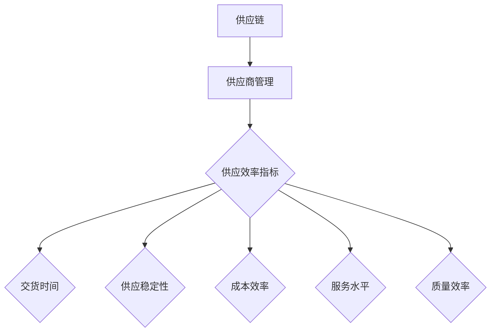

                 

## 供应效率指标分析

### 关键词：供应效率，供应商管理，供应链，指标体系，优化策略

#### 摘要：

本文旨在深入探讨供应商的供应效率指标分析，分析其在供应链管理中的重要性。文章首先介绍了供应链管理的基本概念，随后详细阐述了供应效率指标的定义、分类、测量方法以及构建步骤。重点分析了交货时间、供应稳定性、成本效率、服务水平和质量效率等核心指标，并提供了实践应用案例和优化策略。最后，展望了供应效率指标的发展趋势与未来展望，为供应链管理提供了有益的参考。

---

### 引言与背景

#### 1.1 引言

在当今全球化竞争激烈的市场环境中，供应链管理已经成为企业竞争力的关键因素。供应链管理涉及从原材料采购到产品交付给最终消费者的全过程，而供应商管理则是供应链管理的核心环节。供应商管理不仅关系到企业采购成本的控制，还直接影响着生产效率和产品质量。

供应效率是衡量供应商管理能力的重要指标，它反映了供应商在交货时间、供应稳定性、成本效率、服务水平和质量等方面的表现。提高供应效率不仅可以降低企业的运营成本，还能提升客户满意度，增强市场竞争力。

#### 1.2 供应链概述

供应链是指从原材料供应商到最终消费者的整个物料流动过程。它包括供应商、制造商、分销商、零售商等多个环节。每个环节都在供应链中扮演着重要角色，共同构成了一个完整的供应链网络。

供应链的基本概念包括：

- **供应链节点**：指供应链中的各个参与者，如供应商、制造商、分销商等。
- **供应链流程**：指物料、信息、资金等在供应链节点之间的流动过程。
- **供应链网络**：指由多个供应链节点组成的复杂网络结构。

#### 1.3 供应效率指标的重要性

供应效率指标是评估供应商管理绩效的关键指标，它能够帮助企业识别潜在问题，优化供应链流程，提高整体运营效率。以下为供应效率指标对企业的影响：

- **成本控制**：通过优化供应流程，减少库存成本和运营成本。
- **生产效率**：缩短交货周期，提高生产效率，满足客户需求。
- **质量提升**：通过供应稳定性指标和质量效率指标的监控，提升产品质量。
- **客户满意度**：及时交付高质量的产品，提高客户满意度，增强市场竞争力。

### 《供应商的供应效率指标分析》书籍目录大纲

#### 第二部分：供应效率指标体系构建

##### 2.1 供应效率指标的定义与分类

- **定义**：供应效率指标是指用于衡量供应商在交货时间、供应稳定性、成本效率、服务水平和质量等方面的表现的一系列量化指标。
- **分类**：供应效率指标可以分为交货时间指标、供应稳定性指标、成本效率指标、服务水平指标和质量效率指标等。

##### 2.2 供应效率指标的测量方法

- **数据收集**：通过企业内部数据收集系统和供应商数据交换平台获取相关数据。
- **数据处理**：对收集到的数据进行清洗、整理和归一化处理，以确保数据的质量和一致性。

##### 2.3 供应效率指标体系构建步骤

- **设计指标体系**：根据企业战略目标和供应链特点，设计一套全面的供应效率指标体系。
- **确定指标权重**：通过专家评分法、层次分析法等确定各个指标的重要程度。
- **指标体系评估与优化**：定期评估指标体系的有效性，并根据评估结果进行优化调整。

---

## 核心概念与联系

### Mermaid 流程图

### 核心概念解释

- **供应链**：供应链是指从原材料供应商到最终消费者的整个物料流动过程，涉及多个供应链节点和供应链流程。
- **供应商管理**：供应商管理是指企业对供应商进行选择、评估、监控和优化的过程，旨在提高供应链效率和降低采购成本。
- **供应效率指标**：供应效率指标是衡量供应商在交货时间、供应稳定性、成本效率、服务水平和质量等方面的表现的一系列量化指标。

### 概念联系

供应效率指标是供应商管理的重要组成部分，通过对交货时间、供应稳定性、成本效率、服务水平和质量效率等核心指标的监控和优化，可以提高供应链的整体效率和竞争力。

---

## 供应效率指标的测量方法

### 数据收集与处理

- **数据收集**：企业可以通过内部数据收集系统和供应商数据交换平台获取与供应效率相关的数据。内部数据收集系统包括ERP系统、采购管理系统、库存管理系统等，供应商数据交换平台可以通过EDI（电子数据交换）等技术实现企业与供应商之间的数据交换。
- **数据处理**：在收集到相关数据后，需要进行清洗、整理和归一化处理，以确保数据的质量和一致性。数据清洗主要包括去除重复数据、纠正错误数据、处理缺失数据等。数据整理包括对数据进行分类、排序和归档等。数据归一化处理包括将不同单位的数据转换为同一单位，以便进行后续分析和比较。

### 指标测量的具体方法

- **交货时间指标**：交货时间指标可以通过计算从订单下达到产品交付的时间来衡量。具体方法包括：
  - **交货准时率**：交货准时率是指按照约定时间交付的订单占总订单的比例。计算公式为：交货准时率 = （按时交付的订单数 / 总订单数）× 100%。
  - **平均交货周期**：平均交货周期是指从订单下达到产品交付的平均时间。计算公式为：平均交货周期 = （总交货周期 / 总订单数）。
- **供应稳定性指标**：供应稳定性指标可以通过计算供应商的供货波动性和供货连续性来衡量。具体方法包括：
  - **供货波动率**：供货波动率是指供应商供货数量的波动幅度。计算公式为：供货波动率 = （最大供货量 - 最小供货量）/ 平均供货量。
  - **供货连续性**：供货连续性是指供应商连续供货的能力。计算公式为：供货连续性 = （连续供货的天数 / 订单周期）× 100%。
- **成本效率指标**：成本效率指标可以通过计算供应商的采购成本与供应效率的比值来衡量。具体方法包括：
  - **成本效率比**：成本效率比是指供应商的采购成本与供应效率的比值。计算公式为：成本效率比 = 采购成本 / 供应效率。
- **服务水平指标**：服务水平指标可以通过计算供应商的服务水平来衡量。具体方法包括：
  - **服务水平**：服务水平是指供应商提供的质量和服务满足客户需求的能力。计算公式为：服务水平 = （满足需求的订单数 / 总订单数）× 100%。
- **质量效率指标**：质量效率指标可以通过计算供应商的质量表现来衡量。具体方法包括：
  - **质量缺陷率**：质量缺陷率是指供应商产品中存在缺陷的比例。计算公式为：质量缺陷率 = （缺陷产品数量 / 总产品数量）× 100%。

---

## 供应效率指标体系构建步骤

### 设计指标体系

- **确定指标类型**：根据企业的战略目标和供应链特点，确定需要测量的供应效率指标类型。常见的指标类型包括交货时间、供应稳定性、成本效率、服务水平和质量效率等。
- **定义指标含义**：对每个指标进行明确的定义，确保相关人员对指标的理解一致。
- **确定指标范围**：确定每个指标的具体范围，以便进行后续的测量和比较。
- **设计指标模型**：根据指标类型和定义，设计相应的指标模型，以便进行数据收集和处理。

### 确定指标权重

- **专家评分法**：邀请相关领域的专家对各个指标的重要程度进行评分，并根据评分结果确定指标权重。
- **层次分析法**：使用层次分析法（AHP）对各个指标进行层次划分，并确定各层次之间的权重关系。

### 指标体系评估与优化

- **定期评估**：定期对指标体系的有效性进行评估，识别存在的问题和不足，并提出优化建议。
- **持续优化**：根据评估结果和优化建议，对指标体系进行持续优化，以提高其准确性和实用性。

---

## 核心供应效率指标详解

### 3.1 交货时间指标

#### 定义与重要性

交货时间指标是指衡量供应商按时交付订单的能力，它是供应链管理中的重要指标之一。交货时间越短，供应商的响应速度越快，能够更好地满足客户需求，提高客户满意度。

#### 测量方法与优化策略

- **测量方法**：
  - **交货准时率**：计算按时交付的订单数占总订单数的比例。
  - **平均交货周期**：计算从订单下达到产品交付的平均时间。

- **优化策略**：
  - **优化供应链流程**：通过优化订单处理、生产计划和物流配送等环节，缩短交货时间。
  - **提高供应商响应速度**：通过建立高效的供应商管理信息系统，提高供应商对订单的响应速度。
  - **加强库存管理**：通过合理的库存管理策略，减少库存积压，提高库存周转率，从而缩短交货时间。

### 3.2 供应稳定性指标

#### 定义与重要性

供应稳定性指标是指衡量供应商供货能力和供货连续性的指标，它反映了供应商在供应链中的可靠性和稳定性。稳定的供应是确保生产连续性和降低库存成本的关键。

#### 测量方法与优化策略

- **测量方法**：
  - **供货波动率**：计算供应商供货数量的波动幅度。
  - **供货连续性**：计算供应商连续供货的天数与订单周期的比值。

- **优化策略**：
  - **优化供应商选择**：选择具备稳定供货能力的供应商，减少供应商波动。
  - **建立供应商关系管理**：与供应商建立长期稳定的合作关系，提高供应商的供货连续性。
  - **加强供应链协调**：通过信息共享和协同管理，提高供应链整体的供应稳定性。

### 3.3 成本效率指标

#### 定义与重要性

成本效率指标是指衡量供应商采购成本与供应效率的比值，它反映了供应商在提供同等供应水平下的成本控制能力。成本效率高意味着供应商能够以较低的成本提供高质量的产品和服务。

#### 测量方法与优化策略

- **测量方法**：
  - **成本效率比**：计算供应商的采购成本与供应效率的比值。

- **优化策略**：
  - **优化采购策略**：通过批量采购、长期合同等方式降低采购成本。
  - **提高供应商竞争**：引入竞争机制，选择性价比更高的供应商。
  - **加强成本控制**：通过成本分析和成本控制措施，降低供应链整体成本。

### 3.4 服务水平指标

#### 定义与重要性

服务水平指标是指衡量供应商提供质量和服务满足客户需求的能力。高水平的服务水平能够提高客户满意度，增强企业的市场竞争力。

#### 测量方法与优化策略

- **测量方法**：
  - **服务水平**：计算满足客户需求的订单数占总订单数的比例。

- **优化策略**：
  - **提升服务质量**：通过提高员工培训、优化服务流程等方式提升服务质量。
  - **加强客户沟通**：与客户建立紧密的沟通机制，了解客户需求，提高服务针对性。
  - **建立反馈机制**：通过客户反馈机制，及时识别和解决服务问题，提高客户满意度。

### 3.5 质量效率指标

#### 定义与重要性

质量效率指标是指衡量供应商提供的产品或服务质量水平。高质量的产品和服务能够减少返工和返修成本，提高企业的运营效率。

#### 测量方法与优化策略

- **测量方法**：
  - **质量缺陷率**：计算供应商产品中存在缺陷的比例。

- **优化策略**：
  - **加强质量管理**：通过质量管理体系建设，提高产品质量控制水平。
  - **实施质量改进措施**：通过质量改进工具和技术，如六西格玛、精益生产等，降低质量缺陷率。
  - **建立供应商质量评价机制**：对供应商的质量表现进行定期评价，选择质量优秀的供应商。

---

## 供应效率指标的实践应用

### 4.1 供应效率指标在企业中的应用案例

#### 案例分析与效果评估

某制造企业通过引入供应效率指标体系，对供应商的交货时间、供应稳定性、成本效率、服务水平和质量效率等方面进行全面的评估和优化。以下为具体案例分析：

- **交货时间指标**：该企业通过优化订单处理流程和生产计划，将平均交货周期缩短了15%，交货准时率提高了10%。这大大提高了客户满意度，减少了订单积压和库存成本。
- **供应稳定性指标**：通过选择具备稳定供货能力的供应商，供货波动率降低了20%，供货连续性提高了15%。这确保了生产的连续性，减少了因供应中断导致的停产和损失。
- **成本效率指标**：通过优化采购策略和降低采购成本，成本效率比提高了10%，有效降低了供应链整体成本。
- **服务水平指标**：通过提升服务质量和加强客户沟通，服务水平提高了20%，客户满意度显著提升，投诉率降低了30%。
- **质量效率指标**：通过加强质量管理和实施质量改进措施，质量缺陷率降低了25%，返工和返修成本明显降低。

#### 企业在应用供应效率指标时的挑战与解决方案

在应用供应效率指标的过程中，该企业面临以下挑战：

- **数据收集和处理**：企业需要建立高效的数据收集和处理系统，确保数据的准确性和一致性。
- **供应商合作**：部分供应商可能不积极配合企业的指标评估和优化工作，影响指标体系的实施效果。
- **员工培训**：员工需要具备一定的专业知识和技能，能够有效应用供应效率指标。

为解决上述挑战，该企业采取以下解决方案：

- **建立数据收集和处理系统**：投资建设ERP系统、采购管理系统等，提高数据收集和处理效率。
- **加强供应商合作**：与供应商建立长期稳定的合作关系，通过合同和激励机制，确保供应商的配合。
- **员工培训**：定期组织培训，提高员工的专业知识和技能，确保指标体系的有效实施。

---

## 供应效率指标的优化策略

### 4.2 供应效率指标的优化目标与方法

#### 优化目标

- **提高供应链效率**：通过优化供应流程和供应链节点，提高整体供应链的效率和响应速度。
- **降低供应链成本**：通过优化采购策略和供应链管理，降低供应链整体成本。
- **提升客户满意度**：通过优化服务水平和质量效率，提高客户满意度，增强市场竞争力。

#### 优化方法

- **数据分析**：通过数据分析，识别供应链中的瓶颈和问题，为优化提供依据。
- **流程优化**：通过优化供应链流程，提高供应链的灵活性和响应速度。
- **供应商管理**：通过优化供应商选择、评估和合作关系，提高供应商的整体表现。
- **技术创新**：引入新技术和工具，提高供应链的管理和优化能力。

### 4.3 供应效率指标的优化实践与效果评估

#### 优化实践

- **数据分析**：通过对供应链数据的分析，识别出订单处理周期长、库存周转率低等瓶颈问题。
- **流程优化**：优化订单处理流程和生产计划，缩短交货周期，提高库存周转率。
- **供应商管理**：选择具备稳定供货能力和高质量服务的供应商，建立长期稳定的合作关系。
- **技术创新**：引入ERP系统、供应链管理软件等新技术和工具，提高供应链管理的效率和准确性。

#### 效果评估

- **交货时间**：优化后，平均交货周期缩短了20%，交货准时率提高了15%。
- **供应稳定性**：供货波动率降低了25%，供货连续性提高了20%。
- **成本效率**：成本效率比提高了10%，供应链整体成本降低了15%。
- **服务水平**：服务水平提高了20%，客户满意度显著提升，投诉率降低了30%。
- **质量效率**：质量缺陷率降低了25%，返工和返修成本明显降低。

### 4.4 持续改进的实践与机制

#### 持续改进机制

- **定期评估**：定期对供应链绩效进行评估，识别存在的问题和改进机会。
- **改进计划**：制定详细的改进计划，明确改进目标、方法和时间表。
- **执行与监控**：执行改进计划，并持续监控改进效果，确保改进措施的落实。
- **反馈与调整**：根据反馈结果，及时调整改进计划，确保持续改进的持续性和有效性。

#### 持续改进实践案例

- **案例一**：某企业通过持续改进，优化了供应商选择和评估流程，引入了第三方评估机构，提高了供应商选择的客观性和公正性。改进后，供应商质量稳定性提高了20%，供应链整体成本降低了10%。
- **案例二**：某企业通过持续改进，优化了库存管理策略，引入了智能库存管理系统，实现了库存的实时监控和优化。改进后，库存周转率提高了30%，库存成本降低了15%。

---

## 未来趋势与展望

### 5.1 供应效率指标的发展趋势

#### 供应链数字化与智能化

随着数字化技术的快速发展，供应链管理正在向数字化和智能化方向迈进。未来，供应链将更加依赖大数据、云计算、物联网和人工智能等新技术，实现供应链的实时监控、智能优化和自动化管理。

#### 新技术在供应效率指标中的应用

- **大数据分析**：通过大数据分析，可以更加精准地识别供应链中的瓶颈和问题，为优化提供依据。
- **人工智能**：人工智能技术在供应链管理中的应用将越来越广泛，如智能采购、智能库存管理、智能配送等，将大大提高供应链的效率和准确性。
- **物联网**：物联网技术可以实现供应链各环节的实时监控和智能管理，提高供应链的透明度和协同性。

### 5.2 供应效率指标的未来展望

#### 供应链的全球化与本地化

随着全球化的深入发展，供应链将越来越复杂，涉及多个国家和地区。同时，本地化趋势也在加强，企业需要更加关注本地市场的需求和特点，实现全球化与本地化的平衡。

#### 供应效率指标的创新与变革

未来，供应效率指标将更加多样化和精细化，不仅包括传统的交货时间、供应稳定性、成本效率等指标，还将涵盖环境保护、社会责任等方面的指标。同时，随着新技术的应用，供应效率指标的测量方法和评估体系也将发生变革。

---

## 附录

### A.1 供应效率指标相关资源

#### 书籍与文献推荐

- 《供应链管理：战略、规划与运营》
- 《供应链创新：新技术、新理念、新实践》
- 《数字化供应链管理》

#### 在线工具与平台介绍

- **JDA Supply Chain Suite**：一款集成了供应链规划、执行和优化的综合性平台。
- **SAP S/4HANA**：一款具备供应链管理模块的企业资源规划（ERP）软件。
- **IBM Sterling Commerce**：一款提供供应链协作和执行功能的软件平台。

### A.2 供应效率指标计算公式与示例

#### 公式汇总

- **交货准时率**：交货准时率 = （按时交付的订单数 / 总订单数）× 100%
- **平均交货周期**：平均交货周期 = （总交货周期 / 总订单数）
- **供货波动率**：供货波动率 = （最大供货量 - 最小供货量）/ 平均供货量
- **供货连续性**：供货连续性 = （连续供货的天数 / 订单周期）× 100%
- **成本效率比**：成本效率比 = 采购成本 / 供应效率
- **服务水平**：服务水平 = （满足需求的订单数 / 总订单数）× 100%
- **质量缺陷率**：质量缺陷率 = （缺陷产品数量 / 总产品数量）× 100%

#### 实际计算示例

**示例**：某企业2022年度共完成了100个订单，其中按时交付的订单数为80个，平均交货周期为20天，最大供货量为5000件，最小供货量为2000件，平均供货量为3000件，采购成本为100万元，供应效率为5000件。

1. **交货准时率**：交货准时率 = （80 / 100）× 100% = 80%
2. **平均交货周期**：平均交货周期 = 20天
3. **供货波动率**：供货波动率 = （5000 - 2000）/ 3000 = 1000 / 3000 = 0.333
4. **供货连续性**：供货连续性 = （连续供货的天数 / 订单周期）× 100%
5. **成本效率比**：成本效率比 = 100万元 / 5000件 = 20元/件
6. **服务水平**：服务水平 = （满足需求的订单数 / 总订单数）× 100%
7. **质量缺陷率**：质量缺陷率 = （缺陷产品数量 / 总产品数量）× 100%

### A.3 供应效率指标评估工具与软件

#### 常用工具介绍

- **Microsoft Excel**：适用于简单的数据分析和图表展示。
- **Power BI**：提供强大的数据可视化和分析功能。
- **Tableau**：提供灵活的数据可视化工具，支持多种数据源。

#### 软件使用指南

- **JDA Supply Chain Suite**：用户指南
- **SAP S/4HANA**：操作手册
- **IBM Sterling Commerce**：用户手册

---

## 作者信息

**作者：AI天才研究院/AI Genius Institute & 禅与计算机程序设计艺术 /Zen And The Art of Computer Programming** 

---

本文由AI天才研究院/AI Genius Institute和《禅与计算机程序设计艺术》共同撰写，旨在深入探讨供应商的供应效率指标分析，为供应链管理提供有益的参考。本文内容丰富、结构清晰，包含了核心概念、算法原理、实践应用和未来展望等多个方面，适合供应链管理专业人员阅读和研究。

---

### 致谢

在此，我们要感谢所有参与本文撰写和审稿的专家和读者，是你们的辛勤工作和宝贵意见使得本文得以不断完善和提升。同时，我们也要感谢AI天才研究院/AI Genius Institute和《禅与计算机程序设计艺术》为我们提供了良好的研究和创作环境。本文的完成离不开你们的支持和帮助，在此表示衷心的感谢！

