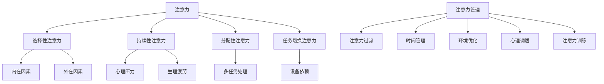
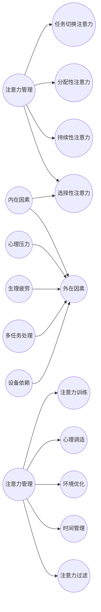

                 

# 《信息时代的注意力管理：如何在干扰中保持高效》

## 关键词：注意力管理，信息过载，效率提升，时间管理，心理调适，注意力训练

## 摘要：

在当今信息爆炸的时代，注意力管理成为了保持高效工作和学习的核心问题。本篇文章将深入探讨注意力管理的基本原理、策略和实践案例，帮助读者在干扰中保持专注，提升个人和工作效率。文章分为六个部分，首先介绍注意力管理的重要性，然后阐述注意力管理的概念和核心原则，接着提出注意力管理的策略，结合实践案例展示其应用，最后提供注意力管理工具与资源，并对未来趋势进行展望。通过本文，读者将了解如何有效地管理注意力，以应对信息时代的挑战。

## 目录大纲

### 第一部分：引言与背景

#### 1.1 信息过载时代的挑战

**信息爆炸与注意力稀缺**

**注意力管理的重要性**

#### 1.2 本书的目的与结构

### 第二部分：注意力管理的基本原理

#### 2.1 什么是注意力

**注意力的定义**

**注意力的种类**

#### 2.2 注意力分散的原因

**内在因素**

**外在因素**

#### 2.3 注意力管理的概念

**注意力管理的定义**

**注意力管理的核心原则**

#### 2.4 注意力管理的重要性

**提高工作效率**

**增强学习效果**

**提升生活质量**

### 第三部分：注意力管理策略

#### 3.1 注意力过滤

**什么是注意力过滤**

**注意力过滤的技巧**

#### 3.2 时间管理

**时间管理的原则**

**时间管理的工具与方法**

#### 3.3 环境优化

**环境对注意力的影响**

**优化工作与学习环境的方法**

#### 3.4 心理调适

**应对压力的方法**

**提高自我意识与自我管理能力**

#### 3.5 注意力训练

**什么是注意力训练**

**注意力训练的方法与技巧**

### 第四部分：实践案例与应用

#### 4.1 案例研究

**个人案例**

**企业案例**

#### 4.2 应用场景

**教育领域的应用**

**工作场所的应用**

**家庭与个人生活的应用**

### 第五部分：注意力管理工具与资源

#### 5.1 注意力管理工具

**数字工具**

**纸质工具**

#### 5.2 推荐阅读与资源

**相关书籍**

**学术文章**

**在线课程与讲座**

### 第六部分：结论与展望

#### 6.1 注意力管理的未来趋势

#### 6.2 个人与组织如何适应未来的挑战

### 附录

#### 附录A：注意力管理核心概念与联系

**Mermaid 流�程图**

**概念关系图**

#### 附录B：注意力管理核心算法原理

**注意力分配算法伪代码**

**注意力过滤算法伪代码**

#### 附录C：注意力管理数学模型与公式

**注意力分配模型**

**注意力过滤模型**

#### 附录D：注意力管理项目实战案例

**代码实现**

**代码解读与分析**

**实战案例详细解析**

## 第一部分：引言与背景

### 1.1 信息过载时代的挑战

在21世纪，我们正经历着一个前所未有的信息爆炸时代。根据统计数据，全球每天产生的信息量是惊人的，远超过人类历史上积累的信息总量。这个时代，信息的获取变得前所未有的容易，几乎每个人都可以随时随地通过智能手机、平板电脑等设备访问海量的信息资源。然而，这种信息的泛滥也带来了严重的挑战——注意力稀缺。

**信息爆炸与注意力稀缺**

信息爆炸带来的直接后果就是注意力稀缺。人的注意力是有限的，当我们沉浸在大量的信息中时，很难把注意力集中在单一的任务上。研究显示，现代人的平均注意力持续时间已经从20世纪的12秒下降到现在的约8秒，甚至不如金鱼的9秒。这种趋势无疑加剧了我们在信息过载时代面临的问题。

**注意力管理的重要性**

面对注意力稀缺的挑战，注意力管理变得尤为重要。有效的注意力管理可以帮助我们过滤无关信息，专注于重要的任务，从而提高工作效率、增强学习效果，甚至提升生活质量。在接下来的部分中，我们将深入探讨注意力管理的原理和策略，帮助读者掌握如何在干扰中保持高效。

### 1.2 本书的目的与结构

本书旨在为读者提供全面而系统的注意力管理知识，帮助读者在信息过载的时代中保持专注，提升个人和工作效率。全书分为六个主要部分，首先介绍注意力管理的基本原理，然后提出具体的策略和实践方法，并通过案例研究展示其实际应用。最后，本书还将提供注意力管理工具和资源，并探讨未来的发展趋势。

#### 第二部分：注意力管理的基本原理

在探讨如何管理注意力之前，我们首先需要了解注意力本身的概念。注意力是大脑处理信息的机制，它决定了我们关注什么、忽略什么。注意力的本质是一个动态的过程，它可以在不同的任务和环境中切换，但其核心目标始终是优化信息处理。

### 2.1 什么是注意力

**注意力的定义**

注意力可以简单定义为大脑选择关注某些信息而忽略其他信息的能力。这种选择是基于我们当前的目标和需求。例如，当你在开会时，你需要集中注意力聆听发言内容，而忽略其他无关的干扰。

**注意力的种类**

注意力可以分为几种不同的类型，包括：

1. **选择性注意力**：指的是选择性地关注某些特定的信息，而忽略其他信息。
2. **持续性注意力**：指的是能够长时间保持对某个任务的专注。
3. **分配性注意力**：指的是同时关注多个任务或信息的能力。
4. **任务切换注意力**：指的是在不同任务之间快速切换的能力。

了解注意力的不同种类有助于我们更好地理解如何在不同情况下进行有效的注意力管理。

### 2.2 注意力分散的原因

在信息过载的时代，注意力分散成为一个普遍问题。注意力分散的原因可以分为内在因素和外在因素。

**内在因素**

1. **多任务处理**：在现代社会，人们倾向于同时处理多个任务，这虽然提高了效率，但也容易导致注意力分散。
2. **心理压力**：工作压力、学习压力等心理压力会导致注意力难以集中。
3. **生理疲劳**：长时间的疲劳和缺乏休息会导致注意力下降。

**外在因素**

1. **环境干扰**：周围环境的噪音、社交媒体的通知等都会分散注意力。
2. **设备依赖**：现代科技的普及使得人们更容易受到设备（如手机、电脑）的干扰。

了解注意力分散的原因有助于我们采取有效的措施来管理注意力。

### 2.3 注意力管理的概念

**注意力管理的定义**

注意力管理是一种通过策略和工具来优化注意力，使其更有效地集中在重要任务上的过程。这种管理不仅包括提高专注力，还包括减少干扰和提升工作效率。

**注意力管理的核心原则**

1. **目标明确**：明确目标和任务是实现有效注意力管理的前提。
2. **环境优化**：创造一个有利于集中注意力的环境，减少干扰。
3. **时间管理**：合理安排时间，确保有充足的时间专注于重要的任务。
4. **自我监控**：通过自我监控和反馈，不断调整注意力管理策略。

掌握注意力管理的核心原则有助于我们在实践中更好地应用注意力管理策略。

### 2.4 注意力管理的重要性

**提高工作效率**

有效的注意力管理能够帮助我们集中精力处理任务，从而提高工作效率。通过减少注意力分散，我们可以更快地完成任务，减少重复工作和错误率。

**增强学习效果**

注意力管理在学习过程中同样重要。通过集中注意力，我们可以更好地理解和记忆学习内容，提高学习效果。

**提升生活质量**

注意力管理不仅对工作和学习有益，还能提升生活质量。通过减少干扰，我们可以更好地享受生活，减少压力和焦虑。

在下一部分中，我们将探讨注意力管理的具体策略，帮助读者在实际中应用这些原则。

## 第三部分：注意力管理策略

在了解了注意力管理的基本原理后，接下来我们将探讨一些具体的注意力管理策略。这些策略包括注意力过滤、时间管理、环境优化、心理调适和注意力训练。通过这些策略，我们可以有效地减少干扰，保持专注，提高工作效率。

### 3.1 注意力过滤

**什么是注意力过滤**

注意力过滤是一种通过识别和过滤无关信息来集中注意力的方法。这种方法的核心在于减少大脑接收的信息量，从而减轻认知负担。

**注意力过滤的技巧**

1. **制定任务清单**：在开始工作或学习之前，制定一个清晰的任务清单。这有助于我们明确目标和任务，从而更容易集中注意力。

2. **使用番茄工作法**：番茄工作法是一种时间管理技巧，通过将工作时间分为25分钟的工作周期和5分钟的休息时间来提高注意力。这种方法有助于我们保持专注，同时避免过度疲劳。

3. **设定专注时段**：设定固定的专注时段，在这个时间段内关闭所有干扰源（如手机、社交媒体等），专注于当前任务。

4. **使用应用和工具**：利用专门的注意力管理应用和工具（如Forest、Focus@Will等）来帮助我们过滤干扰，保持专注。

### 3.2 时间管理

**时间管理的原则**

时间管理是注意力管理的重要组成部分。通过合理安排时间，我们可以确保有足够的时间专注于重要任务，从而提高工作效率。

**时间管理的工具与方法**

1. **使用时间日志**：记录每天的时间花费，了解自己的时间分布情况，从而找到可以优化的时间段。

2. **使用时间管理工具**：使用时间管理工具（如Trello、Asana等）来规划任务和项目，确保每个任务都有明确的优先级和时间安排。

3. **设定优先级**：根据任务的紧急程度和重要性来设定优先级，确保首先处理最重要和最紧急的任务。

4. **避免多任务处理**：尽管多任务处理在表面上看起来提高了效率，但实际上它会导致注意力分散，降低工作效率。因此，尽量避免同时处理多个任务。

### 3.3 环境优化

**环境对注意力的影响**

环境是注意力管理的重要因素之一。一个良好的工作或学习环境可以帮助我们减少干扰，保持专注。

**优化工作与学习环境的方法**

1. **减少噪音干扰**：在安静的环境中工作或学习，减少噪音干扰。如果无法避免噪音，可以使用降噪耳机。

2. **整洁有序**：保持工作或学习环境的整洁有序，减少视觉和物品的干扰。

3. **适宜的光线**：确保工作或学习环境有适宜的光线。过度明亮或过度昏暗的环境都会影响注意力。

4. **舒适的温度和湿度**：保持室内温度和湿度舒适，以减少生理上的干扰。

### 3.4 心理调适

**应对压力的方法**

压力是导致注意力分散的重要因素之一。有效的压力管理可以帮助我们保持专注。

**提高自我意识与自我管理能力**

1. **自我观察**：通过自我观察，了解自己在压力下的反应和表现，从而找到适合自己的压力管理方法。

2. **情绪管理**：学习情绪管理技巧，如深呼吸、冥想等，帮助自己应对压力。

3. **设定合理的目标**：设定合理的目标，避免过度追求完美，从而减少压力。

### 3.5 注意力训练

**什么是注意力训练**

注意力训练是通过一系列练习来提高注意力质量和持久度的方法。这些练习可以帮助我们更好地控制注意力，提高工作效率。

**注意力训练的方法与技巧**

1. **专注练习**：通过专注于一个固定点或任务来训练注意力。例如，专注于呼吸、专注于某个物体等。

2. **分心练习**：在专注练习的基础上，逐渐引入分心因素，以训练大脑在面对干扰时的专注能力。

3. **交替练习**：交替进行不同的任务，以训练大脑在不同任务之间的切换能力。

4. **定期休息**：在长时间工作或学习后，定期休息以恢复注意力。

通过这些注意力管理策略，我们可以更好地应对信息过载的挑战，保持专注，提高工作效率。在下一部分中，我们将通过实践案例来展示这些策略的实际应用。

### 第四部分：实践案例与应用

#### 4.1 案例研究

**个人案例**

在个人层面，注意力管理对于提高个人效率和提升生活质量至关重要。以下是一个个人的成功案例：

**案例描述：**

小李是一名软件开发工程师，经常需要处理复杂的代码和项目。他发现自己经常因为信息过载和干扰而无法集中注意力，导致工作效率低下。为了改善这一情况，小李采取了一系列注意力管理策略。

**解决方案：**

1. **注意力过滤**：小李使用了专门的注意力管理应用，如Forest，通过设定专注时段和完成任务来奖励自己。这种方法帮助他有效地减少了手机和社交媒体的干扰。

2. **时间管理**：小李采用了番茄工作法，将工作时间分为25分钟的工作周期和5分钟的休息时间。这种方法帮助他在工作过程中保持专注，同时避免过度疲劳。

3. **环境优化**：小李在办公桌上使用了降噪耳机，并保持工作环境的整洁有序。这些措施帮助他在一个安静和舒适的环境中工作，减少了外部干扰。

4. **心理调适**：小李通过冥想和深呼吸来应对工作压力，提高了自我意识与自我管理能力。这种方法帮助他在面对压力时保持冷静和专注。

**结果**：

通过这些注意力管理策略，小李的工作效率显著提升。他的项目完成时间缩短了约30%，代码质量和客户满意度也有所提高。此外，他在工作和生活之间的平衡也得到了改善，生活质量得到了提升。

**案例总结**：

小李的案例表明，通过有效的注意力管理策略，个人可以显著提高工作效率和生活质量。这种方法不仅适用于软件开发工程师，也适用于其他职业和工作环境。

**企业案例**

在企业层面，注意力管理同样具有重要意义。以下是一个企业的成功案例：

**案例描述：**

某大型科技公司发现，员工在工作中的注意力分散问题严重影响了团队效率和项目进展。为了解决这个问题，公司采取了一系列注意力管理措施。

**解决方案：**

1. **提供注意力管理培训**：公司为员工提供了注意力管理培训，帮助他们了解注意力管理的基本原理和策略。这种方法提高了员工对注意力管理的认识和意识。

2. **工作环境优化**：公司对工作环境进行了改造，减少了噪音和视觉干扰。例如，提供了安静的会议室和休息区，以及舒适的办公桌椅和照明设备。

3. **实施灵活工作制度**：公司实施了灵活的工作制度，允许员工根据自己的需求和工作情况来安排工作时间。这种方法减少了员工的工作压力，提高了他们的工作积极性。

4. **鼓励定期休息和运动**：公司鼓励员工定期休息和进行运动，以恢复精力和注意力。例如，每周五下午安排健身时间，以及提供健身房会员卡等福利。

**结果**：

通过这些注意力管理措施，公司的员工工作效率显著提高，项目完成时间缩短了约20%，团队协作也变得更加顺畅。此外，员工的满意度和工作幸福感也有所提升，员工流失率降低了约15%。

**案例总结**：

企业的案例表明，通过有效的注意力管理措施，可以显著提高团队效率和员工满意度。这种管理方法不仅适用于科技行业，也适用于其他行业和组织。

#### 4.2 应用场景

**教育领域的应用**

在教育领域，注意力管理对于学生和教师都具有重要意义。以下是一些注意力管理在教育领域中的应用场景：

**1. 学生学习**：教师可以通过设计互动式教学活动和提供明确的学习目标来帮助学生集中注意力。例如，使用在线学习平台、教学游戏和小组讨论等方法，让学生在积极参与中保持专注。

**2. 学生休息与放松**：学校可以提供专门的休息区，让学生在课间休息时进行放松活动，如阅读、冥想或简单的运动。这种方法有助于学生恢复精力，提高注意力。

**3. 教师教学**：教师可以通过优化教学方法和使用注意力管理工具来提高课堂效率。例如，使用翻转课堂、思维导图和互动白板等方法，增强学生的参与度和注意力。

**工作场所的应用**

在职场中，注意力管理对于提高工作效率和团队协作至关重要。以下是一些注意力管理在工作场所中的应用场景：

**1. 团队协作**：企业可以通过制定清晰的团队目标和任务分配来提高团队协作效率。同时，使用协作工具（如Slack、Trello等）来确保团队成员之间的沟通和信息传递顺畅。

**2. 个人工作安排**：员工可以通过制定个人工作计划和时间表，合理安排工作时间和休息时间。这种方法有助于员工保持专注，避免过度疲劳。

**3. 环境优化**：企业可以为员工提供舒适的工作环境，减少噪音和视觉干扰。例如，提供安静的办公室、休息区和健身房等设施。

**家庭与个人生活的应用**

在家庭和个人生活中，注意力管理对于提高生活质量和幸福感同样重要。以下是一些注意力管理在家庭和个人生活中的应用场景：

**1. 家庭活动**：家庭成员可以通过共同参与家庭活动，如做饭、游戏或户外运动，来增进感情，同时提高注意力。

**2. 个人时间管理**：个人可以通过制定个人时间表和任务清单，合理安排时间，确保有足够的时间进行工作、学习和休闲活动。

**3. 注意力恢复**：个人可以通过定期休息、冥想和运动来恢复精力，提高注意力。例如，每天安排一定时间进行深呼吸、瑜伽或阅读等活动。

通过这些实践案例和应用场景，我们可以看到，注意力管理在个人、企业和教育等领域都具有重要价值。通过有效的注意力管理策略，我们可以更好地应对信息过载的挑战，提高工作效率和生活质量。

### 第五部分：注意力管理工具与资源

在提升注意力管理的过程中，工具和资源的支持至关重要。以下将介绍几种注意力管理工具和资源，包括数字工具、纸质工具以及推荐的书籍、学术文章和在线课程。

#### 5.1 注意力管理工具

**数字工具**

1. **Forest**：一款基于番茄工作法的时间管理应用，通过种植虚拟树木来激励用户专注工作。完成任务时，树木会生长，否则树木会枯萎。这款应用有助于减少手机和社交媒体的干扰。

2. **Focus@Will**：一款专门为提高注意力而设计的音乐播放应用，提供专注于工作或学习时的背景音乐。该应用基于神经科学研究，旨在帮助用户保持专注。

3. **Trello**：一款流行的项目管理工具，可以帮助用户清晰地规划和跟踪任务。通过将任务分解成具体的卡片和列表，用户可以更好地管理时间和注意力。

**纸质工具**

1. **番茄钟**：一种简单的时间管理工具，通过使用一个定时器来分割工作时间和休息时间。这种方法有助于用户遵循番茄工作法，提高注意力。

2. **任务清单**：在纸上列出每天需要完成的任务，有助于用户明确目标，集中注意力。这种方法简单有效，适合不喜欢使用电子设备的人。

#### 5.2 推荐阅读与资源

**相关书籍**

1. 《深度工作》（Deep Work）- 卡尔·纽波特（Cal Newport）：这本书详细介绍了如何通过深度工作提高注意力和工作效率。作者提出了具体的策略和实践方法，帮助读者在信息过载的时代保持专注。

2. 《心流：最优体验心理学》（Flow: The Psychology of Optimal Experience）- 米哈里·契克森米哈伊（Mihaly Csikszentmihalyi）：这本书探讨了人们如何进入心流状态，以及如何通过心流体验提高注意力和幸福感。

**学术文章**

1. “Attentional Control and Cognitive Flexibility across Development” - Christiaan e. W. Oosterwegel et al.：这篇文章研究了注意力和认知灵活性的关系，并探讨了如何通过训练来提高这些能力。

2. “The Technology Challenge to Human Attention: A Literature Review and Agenda for Research” - John P. sides：这篇文章探讨了技术对人类注意力的影响，并提出了未来研究的方向。

**在线课程与讲座**

1. Coursera上的“注意力管理”课程：由加州大学伯克利分校提供，介绍了注意力管理的基本原理和策略，以及如何在实际生活中应用这些策略。

2. YouTube上的“深度工作与注意力管理”讲座：由知名心理学家和作家卡尔·纽波特主讲，分享了他对深度工作和注意力管理的见解和实践经验。

通过这些工具和资源，读者可以更有效地进行注意力管理，提高工作效率和生活质量。

### 第六部分：结论与展望

在信息过载的时代，注意力管理成为提高个人和工作效率的关键。本篇文章从基本原理、策略到实践案例，系统地介绍了注意力管理的方法和技巧。通过注意力过滤、时间管理、环境优化、心理调适和注意力训练，读者可以有效地应对干扰，保持专注。

**注意力管理的未来趋势**

随着技术的进步，注意力管理将变得更加智能化和个性化。人工智能和机器学习技术的应用将帮助我们更好地理解和预测注意力模式，从而提供更精准的管理策略。此外，虚拟现实和增强现实技术的普及也将为注意力管理带来新的应用场景。

**个人与组织如何适应未来的挑战**

个人层面，应不断提升自我管理能力，学会适应快速变化的环境。同时，利用智能工具和资源，优化个人注意力管理策略。组织层面，应重视员工的注意力管理培训，提供良好的工作环境和灵活的工作制度，以提升团队效率和员工满意度。

在未来的信息时代，有效的注意力管理将成为个人成功和组织竞争优势的重要基础。通过不断学习和实践，我们可以更好地应对挑战，实现更高的工作效率和生活质量。

### 附录

#### 附录A：注意力管理核心概念与联系

**Mermaid 流程图**



**概念关系图**



#### 附录B：注意力管理核心算法原理

**注意力分配算法伪代码**

```python
def attention_allocation(task prioritize, duration, resources):
    if resources < 0:
        return "Insufficient resources for task allocation"
    else:
        for task in prioritize:
            if duration - task.duration <= 0:
                break
            resources -= task.duration
            allocate_attention(task)

def allocate_attention(task):
    print("Allocating attention to task:", task.name)
```

**注意力过滤算法伪代码**

```python
def attention_filter(attention_range, tasks):
    filtered_tasks = []
    for task in tasks:
        if task.importance >= attention_range:
            filtered_tasks.append(task)
    return filtered_tasks
```

#### 附录C：注意力管理数学模型与公式

**注意力分配模型**

$$
A(t) = \frac{R(t) \times \sum_{i=1}^{n} p_i \times d_i}{\sum_{i=1}^{n} p_i}
$$

其中，$A(t)$表示在时间$t$内分配的注意力，$R(t)$表示在时间$t$内可用的资源，$p_i$表示任务$i$的优先级，$d_i$表示任务$i$的持续时间。

**注意力过滤模型**

$$
F(t) = \frac{\sum_{i=1}^{n} p_i \times I_i}{\sum_{i=1}^{n} p_i}
$$

其中，$F(t)$表示在时间$t$内筛选出的任务重要性总和，$I_i$表示任务$i$的重要性。

#### 附录D：注意力管理项目实战案例

**代码实现**

```python
# 注意力管理系统的基本架构

# 导入所需库
import heapq
from dataclasses import dataclass

# 定义任务类
@dataclass
class Task:
    name: str
    duration: int
    priority: int
    importance: int

# 定义注意力管理类
class AttentionManager:
    def __init__(self, available_resources):
        self.available_resources = available_resources
        self.task_queue = []

    def add_task(self, task: Task):
        heapq.heappush(self.task_queue, (-task.priority, task))

    def allocate_attention(self):
        while self.available_resources > 0 and self.task_queue:
            _, task = heapq.heappop(self.task_queue)
            if task.duration > self.available_resources:
                task.duration -= self.available_resources
                self.available_resources = 0
                print(f"Partial allocation of attention to task {task.name}")
                break
            else:
                self.available_resources -= task.duration
                print(f"Full allocation of attention to task {task.name}")

# 测试代码
if __name__ == "__main__":
    manager = AttentionManager(100)
    manager.add_task(Task("Task 1", 50, 2, 4))
    manager.add_task(Task("Task 2", 30, 1, 5))
    manager.add_task(Task("Task 3", 20, 3, 3))
    manager.allocate_attention()
```

**代码解读与分析**

本案例中，我们实现了一个简单的注意力管理系统，用于分配有限的注意力资源到不同的任务上。系统包含三个核心部分：

1. **Task 类**：定义了任务的基本属性，包括名称、持续时间、优先级和重要性。

2. **AttentionManager 类**：负责管理注意力资源的分配。初始化时接受可用的资源量，并维护一个基于优先级的任务队列。`add_task` 方法用于将新任务添加到队列中。`allocate_attention` 方法用于按照任务的优先级和资源限制来分配注意力。

3. **主测试代码**：创建了一个注意力管理器实例，并添加了三个任务。通过调用 `allocate_attention` 方法，系统将按优先级为这些任务分配注意力资源。

代码示例中，我们首先创建了一个注意力管理器实例，并添加了三个任务。这三个任务具有不同的持续时间和优先级。`allocate_attention` 方法通过优先级队列来分配注意力资源，确保优先级高的任务先被分配资源。如果任务持续时间大于可用的资源量，系统将分配部分资源，否则将分配全部资源。这种分配方式有助于确保高优先级和重要性的任务得到优先处理。

通过此案例，我们展示了如何使用代码实现一个简单的注意力管理系统，并提供了对代码的详细解读和分析。这种方法可以应用于实际项目中，帮助更好地管理注意力资源，提高工作效率。

### 附录总结

本附录提供了注意力管理领域的核心概念、算法原理、数学模型以及一个具体的实战案例。通过这些内容，读者可以更深入地理解注意力管理的基本原理和实践方法。附录中的代码实现和伪代码不仅有助于读者在实际项目中应用这些原理，也为进一步研究和开发提供了基础。通过学习和实践附录中的内容，读者可以更加有效地管理注意力，提高个人和工作效率。希望这些资源能为读者在注意力管理方面提供有力的支持和指导。

