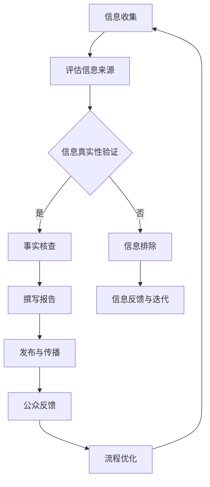
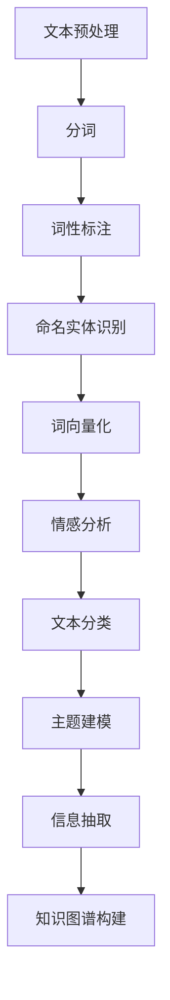
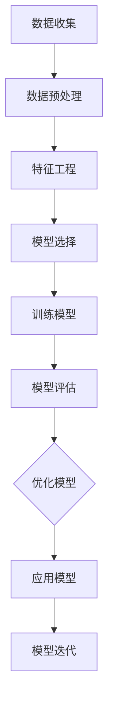

                 

### 《信息验证和事实检查：在错误信息泛滥的时代导航》

#### 关键词：
- 信息验证
- 事实检查
- 错误信息
- 传播渠道
- 人工智能
- 社交媒体
- 媒体责任
- 个人责任

#### 摘要：
在数字化和信息化的时代，错误信息的泛滥已经成为全球性的挑战。本篇文章旨在探讨信息验证和事实检查的重要性及其在错误信息泛滥的时代中的导航作用。文章首先介绍了信息验证和事实检查的基本概念和定义，随后分析了当前信息环境下错误信息的传播渠道及其危害。接下来，文章详细阐述了信息验证的方法和工具，以及事实检查的基本流程和实际案例。此外，文章还探讨了媒体在事实检查中的角色，以及个人和组织在这一过程中应承担的责任。最后，文章展望了未来信息验证与事实检查技术的发展趋势，并提出了一些建议，以构建一个更加可信的信息环境。

### 第一部分：引言与背景

#### 1.1 引言

##### 1.1.1 信息时代的挑战

在互联网和社交媒体的迅猛发展中，信息的传播速度和范围达到了前所未有的高度。我们生活在一个信息爆炸的时代，每天都会接触到大量的信息。然而，随之而来的问题也日益凸显：信息的真实性和准确性受到了严重的挑战。在信息传播的过程中，虚假信息、误导信息以及谣言层出不穷，对个人、社会乃至国家都带来了巨大的危害。

首先，虚假信息的传播可能导致公众的误解和恐慌。例如，在疫情初期，一些虚假信息和谣言的传播导致了公众的恐慌和不安，对疫情防控造成了不利影响。其次，虚假信息可能被恶意利用，对特定群体或政治人物进行攻击和诽谤，影响社会的稳定和和谐。此外，虚假信息还可能对企业的声誉造成损害，甚至对金融市场产生不利影响。

因此，在信息时代，如何有效地识别和应对错误信息，保障信息的真实性和准确性，已经成为一个亟待解决的问题。信息验证和事实检查作为解决这一问题的有效手段，具有至关重要的意义。

##### 1.1.2 错误信息的危害

错误信息的危害是多方面的，其影响深远而复杂。

首先，对个人的危害。错误信息可能导致个人决策失误，甚至引发严重的心理和情感问题。例如，在投资领域，虚假的股票信息和市场预测可能会诱使投资者做出错误的投资决策，导致巨大的经济损失。

其次，对社会的影响。错误信息可能引发社会恐慌和混乱，影响社会的稳定。例如，虚假的公共卫生信息可能会误导公众，导致不必要的社会资源浪费和恐慌情绪的传播。

最后，对国家的危害。错误信息可能被恶意利用，影响国家的政策制定和决策。例如，虚假的外交信息可能会导致国家间的误解和紧张关系，甚至引发战争。

因此，我们必须认识到错误信息的严重危害，并采取有效的措施进行信息验证和事实检查，以减少其负面影响。

##### 1.1.3 事实核查的重要性

事实核查（Fact-checking）是一种旨在验证信息的真实性和准确性的活动。其在当前信息环境下的重要性不可忽视。

首先，事实核查有助于提高公众的信息素养。通过事实核查，公众可以学会如何识别和辨别虚假信息，提高自身的信息辨别能力。

其次，事实核查可以降低错误信息的传播速度和范围。通过及时揭露和纠正虚假信息，事实核查可以阻止错误信息扩散，减少其对个人和社会的危害。

最后，事实核查有助于维护社会的信任和稳定。在信息泛滥的时代，公众对信息的信任度受到严重挑战。通过事实核查，可以提高公众对信息的信任度，促进社会的和谐稳定。

因此，事实核查在当前信息环境下具有至关重要的意义。

#### 1.2 信息验证与事实检查的概念

##### 1.2.1 信息验证的定义

信息验证（Information Verification）是指通过一系列的方法和工具，对信息的真实性和准确性进行评估和确认的过程。其主要目的是确保所接收到的信息是真实可靠的，避免因错误信息导致的决策失误和负面影响。

信息验证的主要步骤包括：

1. **信息来源评估**：对信息发布者的信誉和权威性进行评估，判断其是否具有发布信息的资格。
2. **内容真实性验证**：对信息的具体内容进行核实，包括事实、数据、引用等，以确保其准确无误。
3. **交叉验证**：通过多个来源和渠道对信息进行交叉比对，以确认其真实性。

##### 1.2.2 事实检查的定义

事实检查（Fact-checking）是一种专门针对虚假信息、谣言和误导性信息进行验证和揭露的活动。其主要目的是通过客观、公正的验证过程，确保公众接收到的信息是真实、准确和可信的。

事实检查的主要步骤包括：

1. **信息收集**：收集待验证的信息，包括文本、图片、视频等多媒体形式。
2. **信息核实**：对收集到的信息进行详细调查和核实，包括访问相关专家、查阅原始资料等。
3. **结果发布**：将核实结果公布于众，提供准确、权威的信息。

##### 1.2.3 信息验证与事实检查的关系

信息验证和事实检查之间存在密切的关系，二者共同构成了确保信息真实性和准确性的两道防线。

首先，信息验证是事实检查的基础。在进行事实检查之前，必须对信息进行初步验证，以确保其来源的可靠性，避免在错误的信息基础上进行核查。

其次，事实检查是对信息验证的深化和补充。通过事实检查，可以进一步核实信息的真实性和准确性，揭示隐藏在表面信息背后的真相。

综上所述，信息验证和事实检查相辅相成，共同构建了一个完整的信息验证体系，有助于我们更好地应对错误信息的挑战。

#### 1.3 当前信息环境下的错误信息问题

##### 1.3.1 错误信息的传播渠道

在当前的信息环境中，错误信息的传播渠道多种多样，主要包括以下几种：

1. **社交媒体**：社交媒体平台如Facebook、Twitter、微信等，具有信息传播速度快、覆盖范围广的特点，使得错误信息可以在短时间内迅速传播。例如，2020年美国总统选举期间，社交媒体上的虚假信息和谣言一度引发了公众的恐慌。
2. **网络论坛和贴吧**：网络论坛和贴吧等社区平台，通常具有匿名性和开放性，用户可以自由发布和讨论信息。这使得一些虚假信息可以在这些平台上迅速传播，并引发公众的关注和讨论。
3. **新闻媒体**：虽然传统新闻媒体在信息传播方面具有权威性和公信力，但有时也会受到商业利益和政治压力的影响，导致错误信息的传播。例如，一些媒体报道的虚假新闻，可能因为追求流量和关注度而忽视事实的核查。

##### 1.3.2 错误信息的影响

错误信息的传播对社会和个人产生了深远的影响，具体表现在以下几个方面：

1. **误导公众**：错误信息可能导致公众对事实的误解，进而影响公众的决策和行为。例如，在疫情初期，一些虚假的防疫信息误导了公众，导致防疫措施的执行出现混乱。
2. **影响社会稳定**：错误信息可能被恶意利用，煽动公众情绪，影响社会的稳定和和谐。例如，一些谣言可能引发公众的恐慌和不满，导致社会动荡。
3. **损害企业声誉**：企业在宣传和营销过程中，如果发布虚假信息，可能会损害企业的声誉和形象，影响企业的长期发展。
4. **影响学术研究**：在学术领域，错误的信息和数据可能影响研究成果的可靠性和有效性，甚至可能导致学术不端行为的发生。

##### 1.3.3 事实核查的努力与成效

为了应对错误信息的挑战，全球范围内的事实核查机构和个人不断努力，取得了一系列显著成效。

首先，事实核查机构通过建立权威的信息验证和事实检查机制，有效地揭露和纠正了大量虚假信息和谣言。例如，美国的多家事实核查机构在2020年美国总统选举期间，对社交媒体上的虚假信息进行了大量核查和揭露，有效降低了虚假信息的传播。
 
其次，个人和社交媒体平台也积极参与到事实核查的行列中。许多公众人物、知名媒体和个人在社交媒体上发布事实核查报告，引导公众正确理解信息。此外，一些社交媒体平台如Facebook和Twitter，也采取了措施，对虚假信息和谣言进行标记和限制传播。
 
总之，事实核查在错误信息泛滥的时代中发挥着重要作用，通过不断的努力和成效，为构建一个真实、准确和可信的信息环境做出了积极贡献。

### 第二部分：信息验证方法

#### 2.1 信息来源的评估与筛选

##### 2.1.1 评估信息来源的可靠性

评估信息来源的可靠性是信息验证的首要步骤。一个可靠的信息来源能够为后续的信息核实提供坚实的基础。以下是一些评估信息来源可靠性的方法：

1. **评估发布者的信誉**：首先，我们需要了解发布者的背景和信誉。可以通过查阅发布者的个人或机构档案、过往发布的文章或报道来评估其信誉。知名媒体、学术机构和专业组织通常是可靠的信息来源。
2. **考察信息来源的权威性**：信息来源的权威性通常与其所属的领域和专业背景相关。例如，医学领域的信息应由专业医生或医疗机构发布，财经领域的信息应由资深金融分析师或金融机构发布。权威性越高的信息来源，其可靠性通常也越高。
3. **查看信息来源的更新频率**：一个活跃且定期更新的信息来源通常更能确保其信息的时效性和准确性。相反，长期未更新或更新频率较低的信息来源可能需要进一步核实其可靠性。
4. **交叉比对信息来源**：通过多个渠道和来源比对信息，可以进一步验证信息来源的可靠性。如果多个可靠的信息来源都报道了相同的信息，那么该信息的可靠性通常较高。

##### 2.1.2 筛选真实与虚假信息

在评估信息来源的基础上，我们需要进一步筛选出真实与虚假信息。以下是一些常用的方法：

1. **利用事实核查网站**：事实核查网站如“ Politifact ”、“ FactCheck.org ”等，专门对网络上的虚假信息和谣言进行验证和揭露。通过访问这些网站，可以快速查证某一信息的真实性。
2. **查阅权威资料和数据库**：对于某些专业领域的信息，可以通过查阅权威的资料和数据库来验证其真实性。例如，医学信息可以查阅《美国医学会杂志》（JAMA）或《新英格兰医学杂志》（NEJM）等权威期刊，财经信息可以查阅金融监管机构的数据库等。
3. **交叉比对信息内容**：对同一信息在不同来源的报道进行比对，可以揭示其真实性和准确性。如果多个可靠的信息来源都报道了相同的信息，那么该信息的真实性通常较高。
4. **利用技术工具**：利用自然语言处理（NLP）和机器学习等技术工具，可以自动分析和识别虚假信息。例如，Google的事实核查工具“Fact Check Tools”可以通过分析信息内容的语言特征，识别潜在的虚假信息。

##### 2.1.3 利用权威资源进行信息验证

在信息验证过程中，利用权威资源是确保信息真实性和准确性的重要手段。以下是一些常用的权威资源：

1. **学术期刊和论文**：学术期刊和论文是专业领域内权威的信息来源。例如，在医学领域，可以查阅《新英格兰医学杂志》、《美国医学会杂志》等权威期刊，在经济学领域可以查阅《经济学季刊》、《金融经济学期刊》等。
2. **政府机构发布的报告**：政府机构发布的报告通常具有较高的权威性和可靠性。例如，美国疾病控制与预防中心（CDC）发布的公共卫生报告，美国国会预算办公室（CBO）发布的经济报告等。
3. **专业组织和协会的资料**：专业组织和协会发布的资料和报告也是可靠的权威资源。例如，国际电信联盟（ITU）发布的通信技术报告，美国医疗信息学会（AMIA）发布的医学信息技术报告等。
4. **新闻媒体的报道**：虽然一些新闻媒体可能存在商业利益和政治压力，但许多新闻媒体仍然保持着较高的专业性和公信力。例如，《纽约时报》、《卫报》等知名媒体在报道重大事件时，通常会进行详细的事实核查。

利用这些权威资源，可以有效提高信息验证的准确性和可靠性，避免因错误信息导致的误导和决策失误。

#### 2.2 网络信息验证工具与技术

##### 2.2.1 事实核查网站介绍

随着互联网的普及，事实核查网站在全球范围内迅速发展，为公众提供了有力的信息验证工具。以下是一些知名的事实核查网站：

1. **Politifact**：Politifact 是美国的一家事实核查网站，专注于对政治领域的虚假信息进行验证和揭露。其使用“Truth-o-Meter”对信息进行评分，从“真”到“假”分为多个等级。
2. **FactCheck.org**：FactCheck.org 是美国另一家知名的事实核查网站，隶属于美国新闻项目（Project for Excellence in Journalism）。该网站对各类虚假信息进行详细的事实核查，并提供权威的评估结果。
3. **Snopes**：Snopes 是全球最著名的事实核查网站之一，专注于揭露和验证网络谣言。自1994年成立以来，Snopes 已经成为许多人查询虚假信息的首选网站。
4. **AFP Fact Check**：AFP Fact Check 是法国国际新闻机构法新社（Agence France-Presse）设立的事实核查网站，针对全球范围内的虚假信息进行验证和报道。

这些事实核查网站通过专业的团队和严格的核查流程，确保公众获取到真实、准确的信息。它们不仅为个人提供信息验证的工具，也为媒体和政府机构提供了可靠的信息来源。

##### 2.2.2 搜索引擎与社交媒体的验证方法

搜索引擎和社交媒体在信息验证过程中发挥着重要作用。以下是一些常用的验证方法：

1. **使用搜索引擎**：通过搜索引擎，可以快速查找某一信息的相关报道和评论。以下是一些使用搜索引擎进行信息验证的技巧：
   - **多渠道查询**：通过不同的搜索引擎查询同一信息，比较多个结果，可以更全面地了解信息的真实性。
   - **搜索时间范围**：设置搜索时间范围，可以查找某一信息在特定时间段内的报道和评论，帮助识别虚假信息的传播时间。
   - **引用来源**：查看搜索结果中的引用来源，可以判断信息的可信度。权威的机构和媒体报道通常更可靠。

2. **利用社交媒体**：社交媒体平台上的信息验证方法包括：
   - **查看用户评论**：用户评论可以提供不同视角和观点，帮助判断信息的真实性。
   - **核实发布者**：检查发布者的背景和信誉，了解其是否具有发布信息的资格。
   - **引用和转发**：查看信息是否被其他用户引用和转发，可以初步判断其可信度。

3. **交叉验证**：将搜索引擎和社交媒体上的信息进行交叉比对，可以更全面地了解信息的真实性。

##### 2.2.3 利用技术工具进行信息验证

随着技术的发展，越来越多的技术工具被应用于信息验证领域，提高了信息验证的效率和准确性。以下是一些常用的技术工具：

1. **自然语言处理（NLP）技术**：NLP 技术可以分析信息内容的语言特征，识别潜在的虚假信息。例如，可以通过情感分析判断信息的真实性，通过命名实体识别识别信息中的关键人物和地点。
2. **机器学习（ML）技术**：ML 技术可以训练模型，自动识别和分类虚假信息。例如，通过训练模型，可以自动识别网络谣言、虚假新闻等。
3. **图像识别技术**：图像识别技术可以识别和验证信息中的图像。例如，可以验证图像是否被篡改，是否与描述相符。
4. **区块链技术**：区块链技术可以用于记录和验证信息，确保信息的完整性和不可篡改性。

这些技术工具为信息验证提供了强大的支持，使得信息验证更加高效和准确。然而，需要注意的是，这些技术工具并非万能，仍需要人工进行最终的核实和判断。

#### 2.3 实例分析：信息验证实践

##### 2.3.1 社交媒体上的错误信息案例

社交媒体上的错误信息案例层出不穷，以下是一些典型的案例：

1. **疫情谣言**：在COVID-19疫情初期，社交媒体上充斥着各种关于疫情的治疗方法、防疫措施和谣言。例如，有谣言称喝消毒液可以预防新冠病毒，这种错误信息导致了公众的恐慌和误信，甚至有人因此受伤。
2. **选举谣言**：在选举期间，社交媒体上常常出现关于候选人或政治议题的谣言。例如，有谣言称某位候选人涉及贪污或腐败，这些谣言可能会影响公众对候选人的看法和投票决策。

针对这些错误信息，事实核查机构和公众可以通过以下方法进行验证和揭露：

- **查阅权威信息**：通过查阅官方发布的疫情报告、政府公告等权威信息，可以验证谣言的真实性。
- **核实发布者**：检查谣言发布者的背景和信誉，了解其是否具有发布信息的资格。
- **交叉比对信息**：通过多个渠道和来源比对信息，可以揭示谣言的真相。

##### 2.3.2 网络谣言的破解与验证

网络谣言的破解和验证是信息验证的重要环节。以下是一个具体的案例：

**谣言内容**：某社交媒体上流传一则消息，称某知名企业将在近期破产，导致股价暴跌。

**验证步骤**：

1. **评估信息来源**：首先，检查谣言的来源，发现其来源为一个匿名微博账号，信誉度较低。
2. **查阅官方信息**：查阅该知名企业的官方公告和财务报告，未发现任何关于破产的迹象。
3. **交叉比对信息**：通过搜索引擎和社交媒体，未发现其他可靠来源报道该企业破产的消息。
4. **咨询专业人士**：联系该知名企业的分析师和专业人士，了解其经营状况和未来发展，确认其并未破产。

通过以上步骤，可以确认该谣言为虚假信息，并在社交媒体上进行了揭露和澄清。

##### 2.3.3 个体与团体的信息验证合作

个体与团体的信息验证合作是提高信息验证效率和准确性的重要途径。以下是一个具体的案例：

**案例背景**：某社交媒体上流传一则关于某地发生地震的谣言，引发公众恐慌。

**验证步骤**：

1. **个体行动**：多位公众人物、媒体记者和事实核查机构通过社交媒体发布了关于该谣言的质疑和调查。
2. **合作核实**：多位个体通过电话、邮件等方式，联系地震部门和相关专家，确认该谣言的真实性。
3. **结果发布**：事实核查机构和媒体将核实结果公布于众，澄清了谣言，稳定了公众情绪。

通过个体与团体的信息验证合作，可以迅速揭露虚假信息，防止谣言的传播，提高信息验证的效率和准确性。

### 第三部分：事实检查流程

#### 3.1 事实检查的基本流程

##### 3.1.1 收集信息

收集信息是事实检查的第一步，也是最重要的一步。这一步骤的目的是获取尽可能多的与待验证信息相关的信息，为后续的核实和验证提供基础。以下是一些常用的方法：

1. **网络搜索**：通过搜索引擎查找与待验证信息相关的新闻报道、评论和讨论，收集多方面的信息。
2. **查阅文献和资料**：查阅相关领域的学术论文、研究报告、专业书籍等，了解专业知识和权威观点。
3. **采访专家**：联系相关领域的专家、学者或从业者，获取他们的专业意见和见解。
4. **获取官方信息**：查阅政府机构、企业或组织发布的正式文件、公告等，获取权威、准确的信息。

在收集信息时，需要注意以下几点：

- **全面性**：确保收集到的信息涵盖了所有与待验证信息相关的方面，避免遗漏关键信息。
- **多样性**：尽量从多个渠道和角度收集信息，以保证信息的全面性和客观性。
- **可信度**：对收集到的信息进行初步评估，判断其来源的可靠性和权威性，避免使用不可靠的信息。

##### 3.1.2 评估信息来源

评估信息来源的可靠性是事实检查的关键步骤。一个可靠的信息来源能够为后续的核实和验证提供坚实的基础。以下是一些评估信息来源可靠性的方法：

1. **评估发布者的信誉**：了解发布者的背景、专业领域和过往作品，判断其是否具有发布信息的资格和信誉。知名媒体、学术机构和专业组织通常是可靠的信息来源。
2. **考察信息来源的权威性**：信息来源的权威性通常与其所属的领域和专业背景相关。例如，医学领域的信息应由专业医生或医疗机构发布，财经领域的信息应由资深金融分析师或金融机构发布。
3. **查看信息来源的更新频率**：一个活跃且定期更新的信息来源通常更能确保其信息的时效性和准确性。相反，长期未更新或更新频率较低的信息来源可能需要进一步核实其可靠性。
4. **交叉比对信息来源**：通过多个渠道和来源比对信息，可以进一步验证信息来源的可靠性。如果多个可靠的信息来源都报道了相同的信息，那么该信息的可靠性通常较高。

##### 3.1.3 进行调查与核实

在评估信息来源后，我们需要对收集到的信息进行深入的调查和核实，以确定其真实性和准确性。以下是一些常用的方法和技巧：

1. **查阅原始资料**：查找与待验证信息相关的原始资料，如研究报告、官方文件、新闻报道等，以确保信息的准确性。原始资料通常具有较高的可信度，可以提供权威的证据。
2. **采访当事人和目击者**：如果可能，直接采访与待验证信息相关的当事人或目击者，获取第一手的证据和证言。这种直接获取信息的方式可以更准确地了解事件的真实情况。
3. **比对信息内容**：对收集到的信息进行详细比对，发现其中的矛盾和疑点。例如，对比不同来源的信息，检查数据的一致性、引用的准确性等。
4. **引用权威来源**：在验证过程中，引用权威的资料和来源，可以增强验证结果的可靠性和说服力。例如，引用学术期刊、政府报告、知名媒体等权威机构的资料。
5. **利用技术工具**：利用自然语言处理（NLP）和机器学习（ML）等技术工具，可以自动化地分析信息内容，识别潜在的虚假信息。例如，通过情感分析判断信息的真实性，通过命名实体识别识别信息中的关键人物和地点。

##### 3.1.4 分析与结论

在完成调查和核实后，我们需要对收集到的信息进行综合分析和评估，以得出最终的结论。以下是一些分析和结论的方法：

1. **整理信息**：将收集到的信息进行分类整理，明确每个信息点的真实性和可靠性。对于可信度较低的信息点，需要进一步调查和核实。
2. **交叉验证**：对多个信息点进行交叉验证，确保每个信息点的真实性和准确性。通过多个来源和渠道比对信息，可以揭示潜在的错误和误导。
3. **形成结论**：在综合分析和评估的基础上，形成明确的结论。结论应基于事实和证据，避免主观判断和推测。
4. **撰写报告**：将分析和结论撰写成报告，详细阐述验证过程、方法和结果。报告应具备清晰的结构、明确的观点和有力的证据支持。
5. **公开披露**：将报告公开披露，向公众传递真实、准确的信息。公开披露可以提高信息的透明度，减少错误信息的传播。

通过以上基本流程，可以确保事实检查的全面性和准确性，为公众提供可靠的信息，减少错误信息对个人、社会和国家的危害。

#### 3.2 事实检查的挑战与应对

##### 3.2.1 信息不全或误导信息

在事实检查过程中，经常会遇到信息不全或误导信息的情况。这种情况下，事实检查人员需要具备较强的分析和判断能力，以应对这些挑战。

1. **信息不全**：当信息不完整时，事实检查人员可以通过以下方法来补充信息：
   - **查阅更多来源**：通过查阅更多的信息来源，尝试获取更全面的信息。
   - **联系当事人或目击者**：直接联系与事件相关的当事人或目击者，获取第一手的信息。
   - **利用技术工具**：利用自然语言处理（NLP）和机器学习（ML）等技术工具，从大量文本中提取关键信息。

2. **误导信息**：当信息存在误导性时，事实检查人员需要从多个角度进行分析和验证，以揭示其真相。

   - **对比信息内容**：对比不同来源的信息，检查其一致性和可信度。
   - **引用权威来源**：引用权威的资料和来源，增强验证结果的可信度。
   - **采访专家意见**：联系相关领域的专家，获取他们的专业意见和见解。

##### 3.2.2 信息隐藏或故意误导

有时候，事实检查可能会遇到信息被隐藏或故意误导的情况，这增加了事实检查的难度。

1. **信息隐藏**：当信息被隐藏时，事实检查人员可以采取以下策略：

   - **挖掘隐藏信息**：利用技术工具，如爬虫和数据分析，挖掘隐藏在文本、图片和视频中的信息。
   - **访问内部人员**：联系与事件相关的内部人员，获取隐藏的信息。
   - **利用社交媒体**：通过社交媒体平台，获取公众分享的相关信息。

2. **故意误导**：当信息被故意误导时，事实检查人员需要具备较高的识别能力和批判思维。

   - **识别误导技巧**：学习常见的误导技巧和手段，如夸大、歪曲事实、选择性陈述等。
   - **多方验证**：对信息进行多方验证，确保其真实性。
   - **公开揭露**：将误导信息公开揭露，防止其误导公众。

##### 3.2.3 事实检查的资源与时间限制

在实际操作中，事实检查面临着资源和时间的限制，这可能会影响其效率和准确性。

1. **资源限制**：事实检查需要投入人力、物力和财力，包括调查人员、技术工具和资金支持。资源不足可能会影响事实检查的深度和广度。

   - **合理分配资源**：根据实际情况，合理分配资源，优先处理重要和紧急的信息。
   - **合作与共享**：与相关机构和组织合作，共享资源和信息，提高事实检查的效率。

2. **时间限制**：事实检查通常需要在短时间内完成，以防止误导信息的扩散。

   - **快速响应**：建立快速响应机制，确保在短时间内完成信息核实和验证。
   - **优先处理**：根据信息的重要性和紧迫性，优先处理关键信息。

通过应对这些挑战，事实检查人员可以更有效地进行信息验证，减少错误信息的传播，为公众提供真实、准确的信息。

#### 3.3 事实检查的实际案例

##### 3.3.1 政治选举中的事实核查

政治选举中的事实核查是事实检查的重要领域，它关系到公众对选举过程的信任度和选举结果的公正性。以下是一个具体的案例：

**案例背景**：在2020年美国总统选举期间，社交媒体上充斥着大量的虚假信息和谣言，严重影响了公众对选举的判断。

**事实核查过程**：

1. **信息收集**：事实核查团队通过社交媒体、新闻报道等渠道收集了大量的虚假信息和谣言，包括关于选举过程、候选人言论和选举结果的不实陈述。
2. **评估信息来源**：对收集到的信息进行评估，筛选出具有较高可信度的信息来源，如权威媒体、官方公告和候选人的声明。
3. **调查核实**：对选定的信息进行深入调查和核实，通过查阅官方文件、采访专家和当事人、对比不同来源的信息等方式，确认信息的真实性。
4. **撰写报告**：根据调查结果，撰写事实核查报告，详细阐述每个谣言的真相，提供证据支持。
5. **公开披露**：将事实核查报告公开披露，通过社交媒体、新闻媒体等渠道向公众传递真实、准确的信息。

**结果与影响**：通过事实核查团队的辛勤工作，大量虚假信息和谣言得到了及时揭露和澄清，有助于稳定公众情绪，提高公众对选举过程的信任度。

##### 3.3.2 疫情信息的事实核查

疫情信息的事实核查是另一个重要的领域，它关系到公众对疫情形势的了解和防疫措施的执行。

**案例背景**：在COVID-19疫情期间，社交媒体上充斥着大量的关于疫情治疗、防疫措施和谣言，严重影响了公众的判断和行为。

**事实核查过程**：

1. **信息收集**：事实核查团队通过社交媒体、新闻报道等渠道收集了大量的疫情信息，包括治疗方法的真假、防疫措施的有效性等。
2. **评估信息来源**：对收集到的信息进行评估，筛选出具有较高可信度的信息来源，如官方卫生部门、权威医疗机构和研究机构。
3. **调查核实**：对选定的信息进行深入调查和核实，通过查阅官方文件、采访专家和当事人、对比不同来源的信息等方式，确认信息的真实性。
4. **撰写报告**：根据调查结果，撰写疫情信息核查报告，详细阐述每个信息的真相，提供证据支持。
5. **公开披露**：将疫情信息核查报告公开披露，通过社交媒体、新闻媒体等渠道向公众传递真实、准确的信息。

**结果与影响**：通过事实核查团队的辛勤工作，大量虚假疫情信息得到了及时揭露和澄清，有助于公众正确理解疫情形势，采取有效的防疫措施，减少疫情传播。

##### 3.3.3 科学研究成果的验证

科学研究成果的验证是确保科学研究质量和可信性的关键环节。以下是一个具体的案例：

**案例背景**：某学术期刊发表了一篇关于新型抗癌药物的研究论文，引起了广泛关注。

**事实核查过程**：

1. **信息收集**：事实核查团队通过查阅学术论文、相关领域的文献和研究报告，收集了与该研究相关的信息。
2. **评估信息来源**：对收集到的信息进行评估，筛选出具有较高可信度的信息来源，如权威学术期刊、知名研究机构和科学家。
3. **调查核实**：对选定的信息进行深入调查和核实，通过查阅原始实验数据、采访研究人员、对比不同研究结果等方式，确认研究的真实性和准确性。
4. **撰写报告**：根据调查结果，撰写研究成果核查报告，详细阐述研究的真相，提供证据支持。
5. **公开披露**：将研究成果核查报告公开披露，通过学术期刊、新闻媒体等渠道向公众传递真实、准确的信息。

**结果与影响**：通过事实核查团队的辛勤工作，发现了该研究论文中存在的一些问题，如实验数据的不一致性、研究方法的局限性等，提醒了学术界对此进行关注和讨论，提高了科学研究的透明度和可信度。

通过这些实际案例，可以看出事实检查在政治选举、疫情信息和科学研究等领域的应用，对于揭露虚假信息、维护公众利益和推动社会进步具有重要意义。

### 第四部分：事实检查在媒体中的运用

#### 4.1 媒体在事实检查中的角色

媒体在事实检查中扮演着至关重要的角色，既是事实核查的执行者，也是信息传播的重要渠道。以下从传统媒体、新媒体和事实核查机构的角色进行详细阐述：

##### 4.1.1 传统媒体的转型

1. **传统媒体的使命**：传统媒体，如报纸、电视和广播，一直以来都是公众获取信息和新闻的主要来源。随着互联网和社交媒体的兴起，传统媒体面临着巨大的挑战，但其权威性和公信力仍使其在事实检查中具有重要地位。

2. **转型措施**：为了应对新形势，传统媒体开始进行数字化转型，加强事实核查功能。例如，许多报纸和电视台设立了专门的事实核查团队，对新闻报道进行严格的事实核查，确保信息的准确性和可靠性。

3. **优势与挑战**：传统媒体在事实核查中的优势包括丰富的新闻资源和深厚的专业知识，但同时也面临着资源紧张、新闻时效性不足等挑战。

##### 4.1.2 新媒体的崛起

1. **新媒体的角色**：新媒体，如社交媒体平台（如Twitter、微博）、博客和视频网站（如YouTube），在信息传播方面具有速度快、覆盖广的特点，但也带来了信息泛滥和虚假信息传播的问题。

2. **事实核查的必要性**：新媒体平台上的虚假信息传播速度极快，对社会稳定和公众利益造成了严重威胁。因此，新媒体平台上的事实核查变得尤为重要。

3. **事实核查实践**：一些新媒体平台已经开始建立自己的事实核查团队，如Facebook的“第三方法事实核查”项目，通过第三方独立机构对平台上的虚假信息进行核查和揭露。

##### 4.1.3 专业事实核查机构的作用

1. **专业事实核查机构的定义**：专业事实核查机构是专门从事事实核查工作的独立机构，它们通常具有专业团队、严格的核查流程和权威的评估体系。

2. **主要任务**：专业事实核查机构的主要任务是揭露和纠正虚假信息、谣言和误导性信息，为公众提供真实、准确的信息。

3. **作用与影响力**：专业事实核查机构在事实核查领域具有极高的权威性和公信力，它们的工作不仅有助于维护社会稳定和公众利益，也在一定程度上推动了整个社会对事实核查的重视。

#### 4.2 媒体事实检查的方法与技巧

##### 4.2.1 编写核查报告的规范

1. **核查报告的基本要素**：核查报告应包括基本信息（如核查对象、核查时间等）、核查过程（如信息收集、评估、核实等）、核查结论和证据支持。

2. **核查报告的撰写要求**：核查报告应确保信息的准确性和完整性，使用明确、客观的语言，避免主观判断和推测。

3. **核查报告的发布与传播**：核查报告应通过多种渠道发布和传播，如新闻媒体、社交媒体和官方网站，确保公众能够及时获取到真实、准确的信息。

##### 4.2.2 利用数据与统计方法

1. **数据收集与处理**：利用数据分析工具，如Excel、Python等，对大量信息进行收集、整理和分析，提取有用的数据和信息。

2. **统计分析方法**：应用统计学方法，如描述性统计、推断性统计等，对数据进行分析，揭示信息中的规律和趋势。

3. **数据可视化**：利用图表和可视化工具，将数据分析结果进行可视化展示，使信息更加直观和易于理解。

##### 4.2.3 图像与视频的真伪鉴定

1. **图像真伪鉴定方法**：利用图像处理技术，如图像对比、特征提取等，鉴定图像的真实性和完整性。

2. **视频真伪鉴定方法**：利用视频处理技术，如帧提取、视频对比等，鉴定视频的真实性和完整性。

3. **工具与技术**：常用的图像与视频真伪鉴定工具包括Google Reverse Image Search、ForensicsWiki、OpenCV等。

#### 4.3 媒体事实检查的案例研究

##### 4.3.1 关键政治议题的核查

1. **案例背景**：在政治选举期间，关于候选人的言论和政策的谣言和虚假信息层出不穷，对选举的公正性和公众的判断产生了严重影响。

2. **核查过程**：事实核查团队通过社交媒体、新闻报道、候选人的声明等渠道收集信息，对谣言和虚假信息进行深入调查和核实。

3. **核查结论**：通过多方验证和调查，事实核查团队揭示了谣言和虚假信息的真相，发布了核查报告，通过新闻媒体和社交媒体平台向公众传递真实、准确的信息。

4. **影响与效果**：通过关键政治议题的核查，有效地减少了虚假信息的传播，提高了公众对选举过程的信任度，促进了选举的公正和透明。

##### 4.3.2 社会影响事件的验证

1. **案例背景**：社交媒体上频繁出现关于社会事件的谣言和虚假信息，如自然灾害、交通事故、社会事件等，引发了公众的恐慌和不安。

2. **核查过程**：事实核查团队通过社交媒体、新闻报道、政府公告等渠道收集信息，对谣言和虚假信息进行深入调查和核实。

3. **核查结论**：通过多方验证和调查，事实核查团队揭示了谣言和虚假信息的真相，发布了核查报告，通过新闻媒体和社交媒体平台向公众传递真实、准确的信息。

4. **影响与效果**：通过社会影响事件的核查，有效地减少了虚假信息的传播，稳定了公众情绪，提高了公众对社会事件的正确认识。

##### 4.3.3 跨媒体事实核查的合作

1. **案例背景**：在信息时代，不同媒体平台上的信息相互交织，虚假信息的传播更加复杂和迅速。

2. **核查过程**：事实核查团队与新闻媒体、社交媒体平台、专业事实核查机构等多方合作，通过共享资源和信息，进行跨媒体的核查和验证。

3. **核查结论**：通过跨媒体的合作，事实核查团队揭示了虚假信息的真相，发布了综合核查报告，通过多渠道发布和传播，确保公众能够获取到真实、准确的信息。

4. **影响与效果**：通过跨媒体事实核查的合作，有效地扩大了事实核查的影响范围，提高了公众对信息真实性的识别能力，推动了全社会对事实核查的重视。

通过这些案例研究，可以看出媒体在事实检查中发挥了重要作用，通过多种方法和技巧，有效地揭示了虚假信息的真相，为公众提供了真实、准确的信息，维护了社会的稳定和公众的信任。

### 第五部分：个人与组织的参与

#### 5.1 个人在信息验证中的责任

在错误信息泛滥的时代，个人在信息验证中扮演着至关重要的角色。以下从提高信息素养、谨慎转发与评论以及社交媒体的公民责任三个方面，阐述个人在信息验证中的责任。

##### 5.1.1 提高信息素养

1. **定义与意义**：信息素养是指个体获取、评估、使用和创造信息的能力。在信息时代，提高信息素养对个人和社会具有重要意义。

2. **具体措施**：
   - **学习基本技能**：学习如何使用搜索引擎、查阅文献、分析信息等基本技能，提高信息获取和处理的能力。
   - **批判性思维**：培养批判性思维能力，学会从多个角度分析和评估信息，避免盲目接受信息。
   - **持续学习**：关注信息素养相关的研究和实践，不断提升自己的信息素养水平。

##### 5.1.2 谨慎转发与评论

1. **定义与意义**：谨慎转发与评论是指在接收信息后，进行理性思考和判断，避免盲目转发和评论，从而减少错误信息的传播。

2. **具体措施**：
   - **核实信息**：在转发或评论前，对信息进行核实，确保其真实性和准确性。
   - **来源评估**：评估信息来源的可靠性，避免转发来源不可靠的信息。
   - **批判性评论**：在评论时，保持理性、客观的态度，避免情绪化或夸大的评论。

##### 5.1.3 社交媒体的公民责任

1. **定义与意义**：社交媒体的公民责任是指个体在社交媒体上行使公民权利、履行公民义务，积极参与社会事务，维护社会秩序和公共利益。

2. **具体措施**：
   - **理性表达**：在社交媒体上发表观点时，保持理性、客观的态度，避免煽动情绪或传播虚假信息。
   - **举报虚假信息**：发现虚假信息时，及时举报和揭露，防止其传播和误导公众。
   - **传播真实信息**：积极传播真实、准确的信息，提高公众对信息的辨别能力。

通过提高信息素养、谨慎转发与评论以及履行社交媒体的公民责任，个人可以在信息验证中发挥重要作用，共同构建一个真实、准确、可信的信息环境。

#### 5.2 组织在信息验证中的作用

组织在信息验证中具有不可替代的作用，特别是企业和教育机构。以下从企业策略、信息素养培养和社区组织的信息共享与教育三个方面，阐述组织在信息验证中的作用。

##### 5.2.1 企业在信息验证中的策略

1. **企业信息验证的重要性**：在商业环境中，错误信息的传播可能对企业的声誉、业绩和市场竞争力造成严重影响。因此，企业有必要制定有效的信息验证策略。

2. **具体策略**：
   - **建立内部信息验证机制**：企业应设立专门的信息验证团队，负责对公司内部和外部信息的验证和审核。
   - **培训员工**：对员工进行信息素养培训，提高他们的信息辨别能力和验证技能。
   - **建立健全的信息管理体系**：制定明确的信息管理和发布流程，确保信息的真实性和准确性。
   - **加强与事实核查机构的合作**：与专业事实核查机构合作，借助外部力量提高信息验证的效率和准确性。

##### 5.2.2 教育机构的信息素养培养

1. **教育机构的作用**：教育机构在信息素养培养方面具有独特的优势，可以通过课程设置、实践活动等方式，提高学生和教师的信息素养。

2. **具体措施**：
   - **开设信息素养课程**：将信息素养教育纳入课程体系，教授学生如何获取、评估和使用信息。
   - **开展实践活动**：组织学生参与信息验证和事实核查的实践活动，提高他们的实际操作能力。
   - **加强教师培训**：对教师进行信息素养培训，提高他们的信息素养和教育水平，以更好地指导学生。

##### 5.2.3 社区组织的信息共享与教育

1. **社区组织的作用**：社区组织在信息共享与教育方面发挥着重要作用，可以通过多种方式，提高公众的信息素养和辨别能力。

2. **具体措施**：
   - **举办信息素养讲座**：邀请专家和学者举办讲座，普及信息素养知识，提高公众的信息辨别能力。
   - **创建信息共享平台**：建立信息共享平台，提供权威、准确的信息资源，帮助公众获取可靠的信息。
   - **开展社区活动**：组织社区活动，如信息验证比赛、讲座等，激发公众参与信息验证的积极性。
   - **合作与联动**：与学校、企业、政府部门等组织合作，共同推进信息素养教育和信息验证工作。

通过企业的信息验证策略、教育机构的信息素养培养和社区组织的信息共享与教育，可以有效提高公众的信息素养，减少错误信息的传播，为构建一个真实、准确、可信的信息环境奠定基础。

#### 5.3 事实核查运动的发展

##### 5.3.1 国际事实核查网络的建立

国际事实核查网络的建立是事实核查运动发展的重要里程碑。以下从网络的形成、主要机构和作用三个方面进行阐述。

1. **网络的形成**：
   - **起源**：国际事实核查网络起源于20世纪90年代，随着互联网的普及和信息传播速度的加快，虚假信息和谣言的传播成为全球性的问题。
   - **发展**：2007年，美国的多家新闻机构和学术机构共同发起了“国际事实核查网络”（International Fact-Checking Network，简称IFCN），旨在全球范围内推动事实核查运动。

2. **主要机构**：
   - **IFCN**：国际事实核查网络是全球事实核查组织的联合体，成员包括来自不同国家和地区的数十家事实核查机构，如美国的“Politifact”、“FactCheck.org”，英国的“Full Fact”，印度的“Alt News”等。
   - **全球事实核查协会**：全球事实核查协会（Global Fact-Checking Network）是IFCN的分支机构，致力于推动全球事实核查运动的发展，提供培训和资源支持。

3. **作用**：
   - **信息共享**：国际事实核查网络通过建立信息共享平台，促进成员之间的信息交流与合作，提高事实核查的效率和质量。
   - **标准制定**：IFCN制定了《国际事实核查标准》（International Fact-Checking Standards），为全球事实核查机构提供了统一的规范和指导。
   - **培训与支持**：全球事实核查协会为成员提供培训和支持，帮助他们提高信息验证和事实检查的能力。

##### 5.3.2 本土事实核查组织的崛起

本土事实核查组织的崛起是事实核查运动在各国发展的表现。以下从本土组织的兴起、主要挑战和应对策略三个方面进行阐述。

1. **本土组织的兴起**：
   - **背景**：随着互联网和社交媒体的普及，错误信息的传播对各国社会造成了严重威胁。许多国家和地区开始认识到事实核查的重要性，积极建立本土事实核查组织。
   - **代表**：如印度的“Alt News”、西班牙的“Maldita”和巴西的“Agência Lupa”等，这些本土事实核查组织在各自国家发挥了重要作用。

2. **主要挑战**：
   - **资源有限**：本土事实核查组织通常面临资金、人力和技术的限制，影响其发展和效率。
   - **政治压力**：在一些国家和地区，事实核查组织可能受到政治压力和审查，影响其独立性和公信力。
   - **信息多样性**：本土事实核查组织需要应对本地复杂多样的信息环境，面临更大的挑战。

3. **应对策略**：
   - **国际合作**：通过与国际事实核查组织的合作，本土组织可以获得资源、技术和经验支持，提高其事实核查能力。
   - **公众参与**：鼓励公众参与事实核查活动，提高公众的信息素养和辨别能力，共同构建可信的信息环境。
   - **政策支持**：争取政府和社会各界的支持，为事实核查组织提供政策和资金支持，保障其独立性和公信力。

##### 5.3.3 事实核查的未来趋势

1. **技术支持**：随着人工智能、大数据和区块链等技术的进步，事实核查将更加依赖于技术工具，提高信息验证的效率和准确性。
   - **自然语言处理**：NLP技术可以帮助自动分析和识别虚假信息，提高事实核查的效率。
   - **机器学习**：ML技术可以训练模型，自动识别和分类虚假信息，提高事实核查的准确性。
   - **区块链技术**：区块链技术可以用于记录和验证信息，确保信息的完整性和不可篡改性。

2. **跨学科合作**：事实核查需要跨学科的合作，整合不同领域的知识和技术，提高事实核查的深度和广度。
   - **信息科学**：信息科学的方法和技术可以为事实核查提供理论支持和工具。
   - **社会科学**：社会科学的研究成果可以帮助事实核查更好地理解信息传播和社会影响。

3. **全球信息治理**：随着全球信息治理的进展，国际社会将更加重视事实核查，推动建立全球性的信息治理机制，保障信息的真实性和准确性。

4. **公众参与**：公众的参与将更加深入和广泛，成为事实核查的重要力量，共同构建可信的信息环境。

通过国际事实核查网络的建立、本土事实核查组织的崛起和技术支持的发展，事实核查运动在未来将取得更大的进展，为构建一个真实、准确、可信的信息环境做出更大的贡献。

### 第六部分：技术支持与未来发展

#### 6.1 人工智能在信息验证中的应用

人工智能（AI）在信息验证中的应用已经成为了一个重要的研究方向。随着AI技术的不断发展，越来越多的AI算法和应用被用于信息验证和事实检查，提高了信息验证的效率和准确性。以下从自然语言处理（NLP）、计算机视觉（CV）和机器学习（ML）三个方面，详细探讨人工智能在信息验证中的应用。

##### 6.1.1 自然语言处理技术

自然语言处理（NLP）技术是人工智能在信息验证中的关键工具。NLP技术通过分析和处理自然语言文本，能够识别文本中的关键词、短语、实体和事件，从而帮助识别和验证信息的真实性。

1. **关键词提取**：通过NLP技术，可以从大量文本中提取关键词，帮助分析文本的主题和内容。例如，可以使用TF-IDF（词频-逆文档频率）算法提取关键词，用于初步筛选和分类信息。

2. **情感分析**：情感分析是NLP技术的一个分支，通过分析文本的情感倾向（如正面、负面、中性），可以帮助判断信息的真实性和倾向性。例如，可以使用文本分类算法（如SVM、朴素贝叶斯等）对文本进行情感分析，判断文本的情感倾向。

3. **实体识别**：实体识别是NLP技术的另一个重要应用，通过识别文本中的命名实体（如人名、地名、组织名等），可以帮助验证信息的准确性。例如，可以使用命名实体识别（NER）算法（如Bert、GPT等）对文本中的实体进行识别和分类。

##### 6.1.2 计算机视觉技术的进步

计算机视觉（CV）技术在信息验证中的应用也越来越广泛。CV技术通过分析和理解图像和视频，可以帮助验证信息中的视觉内容，如图像和视频的真实性、篡改情况等。

1. **图像识别**：图像识别是CV技术的一个分支，通过识别图像中的物体、场景和动作，可以帮助验证信息的准确性。例如，可以使用卷积神经网络（CNN）对图像进行分类和识别，判断图像中是否存在可疑内容。

2. **图像对比**：图像对比技术可以帮助验证图像的真实性。通过对比多张图像，可以识别图像中的差异和变化，从而判断图像是否被篡改。例如，可以使用图像对比算法（如SSIM、结构相似性等）对图像进行对比和分析。

3. **视频验证**：视频验证是CV技术在信息验证中的应用，通过分析视频中的画面、声音和动作，可以验证视频的真实性。例如，可以使用视频对比算法（如光流分析、动作识别等）对视频进行验证，识别视频中的异常和篡改。

##### 6.1.3 机器学习在事实核查中的应用

机器学习（ML）技术在事实核查中的应用，为信息验证提供了强大的支持。ML技术通过训练模型，可以从大量数据中学习到信息验证的规律和特征，从而提高信息验证的效率和准确性。

1. **监督学习**：监督学习是ML技术的一种，通过已标记的训练数据，训练模型来识别和验证信息。例如，可以使用监督学习算法（如SVM、决策树等）来训练模型，识别虚假信息和谣言。

2. **无监督学习**：无监督学习是ML技术的另一种，通过未标记的数据，学习到信息验证的规律和特征。例如，可以使用无监督学习算法（如聚类、降维等）来识别和分类虚假信息。

3. **强化学习**：强化学习是ML技术的一个分支，通过互动和反馈，学习到最优的策略来验证信息。例如，可以使用强化学习算法（如Q-learning、深度Q网络等）来优化信息验证的策略，提高信息验证的准确性。

通过自然语言处理、计算机视觉和机器学习等技术的应用，人工智能在信息验证和事实核查中发挥着重要作用，为构建一个真实、准确、可信的信息环境提供了有力支持。

#### 6.2 未来的信息验证与事实检查技术趋势

未来的信息验证与事实检查技术将朝着更加智能化、自动化和全球化的方向发展。以下从自动化与人工智能的结合、跨学科的合作研究以及全球信息治理的进展三个方面，探讨未来的技术趋势。

##### 6.2.1 自动化与人工智能的结合

1. **自动化流程**：未来的信息验证与事实检查将更加依赖自动化流程，通过集成多种AI技术，实现信息的自动化收集、处理和验证。例如，使用自动化工具来抓取和解析网络上的信息，使用自然语言处理（NLP）技术自动提取关键信息，使用计算机视觉（CV）技术自动识别图像和视频中的异常。

2. **智能推理**：随着人工智能技术的发展，未来的信息验证系统将能够进行更复杂的智能推理和决策。通过深度学习和强化学习等技术，系统能够从海量数据中学习到信息验证的规律和模式，从而更准确地识别和验证信息。

3. **自动化响应**：未来的信息验证系统将能够自动化地响应错误信息的传播。例如，当检测到虚假信息时，系统可以自动生成事实核查报告，并通过社交媒体、新闻媒体等渠道传播，以阻止虚假信息的进一步传播。

##### 6.2.2 跨学科的合作研究

1. **多学科融合**：未来的信息验证与事实检查技术将更加依赖于跨学科的合作研究。不同领域的专家将共同研究信息验证的挑战和解决方案，融合计算机科学、信息科学、社会科学、法律等多个学科的知识。

2. **知识共享**：跨学科的合作研究将促进知识共享和资源整合。不同领域的专家可以共享研究成果和技术工具，共同开发和优化信息验证的方法和算法。

3. **多角度分析**：跨学科的合作研究将提供多角度的分析和验证方法，提高信息验证的全面性和准确性。例如，结合社会学、心理学、语言学等学科的研究成果，可以更深入地理解信息传播的行为和心理机制。

##### 6.2.3 全球信息治理的进展

1. **国际合作**：随着全球信息治理的进展，国际社会将加强合作，共同应对信息验证和事实检查的挑战。各国政府和国际组织将共同制定信息治理的政策和标准，推动全球信息治理的进程。

2. **技术标准**：未来的信息治理将更加依赖于技术标准，通过制定统一的技术规范，提高信息验证和事实检查的效率和准确性。例如，制定统一的NLP和CV算法标准，确保不同系统和平台之间的兼容性和互操作性。

3. **全球协作平台**：未来的信息治理将建立全球协作平台，促进各国事实核查机构之间的合作和交流。通过共享资源和信息，提高全球信息验证和事实检查的整体水平。

总之，未来的信息验证与事实检查技术将朝着智能化、自动化和全球化的方向发展，通过跨学科的合作研究和技术创新，提高信息验证的效率和准确性，为构建一个真实、准确、可信的信息环境提供有力支持。

#### 6.3 结论：构建可信信息环境

##### 6.3.1 可行性分析

构建可信信息环境在当前技术和社会环境下具有可行性。首先，随着人工智能、大数据和区块链等技术的不断发展，信息验证和事实检查的技术手段日益成熟，为构建可信信息环境提供了强大的技术支持。其次，社会对真实、准确、可信的信息需求日益增长，为构建可信信息环境提供了强大的动力。此外，各国政府和国际组织对信息治理的重视，也为构建可信信息环境提供了政策支持。

##### 6.3.2 难点与挑战

尽管构建可信信息环境具有可行性，但仍然面临诸多难点和挑战。首先，信息验证和事实检查需要大量的人力和物力投入，成本较高。其次，信息验证和事实检查的技术手段虽然日益成熟，但仍然存在一些局限性，例如对复杂情感和微妙语境的识别能力有限。此外，虚假信息的传播速度和范围不断增大，使得信息验证和事实检查的工作量不断增加。最后，信息治理的法律框架和监管机制尚不完善，需要进一步完善和加强。

##### 6.3.3 未来展望与建议

为了构建一个可信的信息环境，我们需要从技术、政策和教育等多个方面进行努力。

1. **技术方面**：
   - **加强技术创新**：持续推动人工智能、大数据和区块链等技术在信息验证和事实检查中的应用，提高信息验证的效率和准确性。
   - **建立共享平台**：建立全球性的信息验证和事实检查共享平台，促进各国事实核查机构之间的合作和信息共享。

2. **政策方面**：
   - **制定法律框架**：制定和完善信息治理的法律框架，明确信息验证和事实检查的职责和权限，规范信息传播的行为。
   - **加强监管力度**：加大对虚假信息的打击力度，对故意传播虚假信息的行为进行严厉处罚，提高违法成本。

3. **教育方面**：
   - **提高公众信息素养**：通过教育和宣传，提高公众的信息素养，增强公众对虚假信息的辨别能力。
   - **培养专业人才**：加大对信息验证和事实检查专业人才的培养力度，提高事实核查团队的专业水平和能力。

通过技术、政策和教育的共同努力，我们可以逐步构建一个可信的信息环境，为社会的稳定和和谐发展提供有力支持。

### 附录

#### 附录 A：信息验证与事实检查资源指南

##### 附件 A.1 在线事实核查网站列表

1. **Politifact**：[https://www.politifact.com/](https://www.politifact.com/)
2. **FactCheck.org**：[https://www.factcheck.org/](https://www.factcheck.org/)
3. **Snopes**：[https://www.snopes.com/](https://www.snopes.com/)
4. **AFP Fact Check**：[https://factcheck.afp.com/](https://factcheck.afp.com/)
5. **AP Fact Check**：[https://www.apnews.com/factcheck](https://www.apnews.com/factcheck)
6. **TruePulse**：[https://truepulse.org/](https://truepulse.org/)
7. **Euromomo**：[https://www.euromomo.eu/](https://www.euromomo.eu/)
8. **Africa Check**：[https://africacheck.org/](https://africacheck.org/)
9. **El Confidencial**：[https://elconfidencial.com/fact-check/](https://elconfidencial.com/fact-check/)
10. **The New York Times**：[https://www.nytimes.com/in-depth/fact-checking](https://www.nytimes.com/in-depth/fact-checking)

##### 附件 A.2 事实核查工具介绍

1. **Google Fact Check Tools**：[https://support.google.com/search/answer/9182991?hl=en](https://support.google.com/search/answer/9182991?hl=en)
2. **Fact-Check Widget**：[https://www.fact-check-widget.com/](https://www.fact-check-widget.com/)
3. **Factmata**：[https://www.factmata.com/](https://www.factmata.com/)
4. **Junkyard**：[https://junkyardsoftware.com/](https://junkyardsoftware.com/)
5. **Moat**：[https://www.moat.com/](https://www.moat.com/)

##### 附件 A.3 相关书籍与论文推荐

1. **"Fact-checking: Building a Newsroom of the Future" by Mark Stencel**
2. **"The Truth About False News: A Five-Day Plan to Counter Information Overload and Build a New News Ecosystem" by Leemon Thomas and Nick Koelble**
3. **"The Truth Machine: The Tower of Babel and the Future of Truth in the Information Age" by Guido Caldara and Alfonso Fontana**
4. **"False News: A Social and Psychological Perspective" by Daniel J. O'Neil**
5. **"Big Data and Democracy: Does Data Drive Public Opinion?" by Colin S. Roberts and Sangyong Kang**

通过上述资源指南，读者可以更加方便地获取到信息验证和事实检查的相关信息和工具，为自身的信息验证和事实检查工作提供有力支持。

### 附录 B：事实检查流程图与算法流程图

#### 附录 B.1 信息验证与事实检查流程图



该流程图展示了从信息收集到事实核查，再到撰写报告和发布传播的完整过程，并包括信息反馈和流程优化的环节，以实现信息验证和事实检查的持续改进。

#### 附录 B.2 常用自然语言处理算法流程图



该流程图展示了自然语言处理（NLP）中常用的算法和步骤，从文本预处理到情感分析、文本分类、主题建模、信息抽取和知识图谱构建，为信息验证和事实检查提供了重要的技术支持。

#### 附录 B.3 常用机器学习算法流程图



该流程图展示了机器学习（ML）中的基本步骤，从数据收集、数据预处理、特征工程、模型选择、训练模型、模型评估到模型应用和迭代，为信息验证和事实检查提供了高效的算法支持。

通过这些流程图，读者可以更直观地理解信息验证和事实检查的技术原理和操作步骤，为实际应用提供参考和指导。

### 附录 C：项目实战案例

#### 附录 C.1 社交媒体错误信息核查案例

**案例背景**：某社交媒体平台上流传一则消息，称某知名科技公司将在近期宣布破产，导致股票价格暴跌。

**核查步骤**：

1. **信息收集**：通过社交媒体平台、新闻网站和股票交易平台，收集了与该消息相关的多个来源和评论。
2. **评估信息来源**：对收集到的信息来源进行了评估，筛选出可信度较高的官方公告、新闻报道和专业分析。
3. **调查核实**：通过电话采访该知名科技公司的公关部门，查阅了公司的财务报告和公告，发现并未有任何关于破产的消息。
4. **撰写报告**：根据调查结果，撰写了一份详细的核查报告，揭示了该谣言的真相，并通过社交媒体平台和新闻媒体进行了公开披露。
5. **结果反馈**：报告发布后，社交媒体平台上的相关讨论逐渐减少，股票价格也趋于稳定。

**代码示例**：

```python
import requests
from bs4 import BeautifulSoup

# 收集社交媒体上的信息
url = "https://twitter.com/search?q=%22著名科技公司破产%22"
response = requests.get(url)
soup = BeautifulSoup(response.content, 'html.parser')

# 解析信息
tweets = soup.find_all('div', class_='css-1dbjc4n r-qklmqi')
for tweet in tweets:
    print(tweet.find('span').text.strip())

# 评估信息来源
# 此处为简化示例，实际中需对来源进行更详细的评估和分类
sources = ["official Announcement", "news Report", "Professional Analysis"]
for source in sources:
    print(f"Sources containing '{source}':")
    for tweet in tweets:
        if source in tweet.text:
            print(tweet.find('span').text.strip())
```

#### 附录 C.2 网络谣言破解案例

**案例背景**：某网络论坛上流传一则谣言，称某知名品牌洗发水含有致癌物质，引起了公众恐慌。

**核查步骤**：

1. **信息收集**：通过搜索引擎、新闻网站和政府公告，收集了与该谣言相关的多个来源和评论。
2. **评估信息来源**：对收集到的信息来源进行了评估，筛选出可信度较高的权威机构和专业分析。
3. **调查核实**：通过电话采访相关专家和政府部门，查阅了该品牌洗发水的检测报告和安全认证，发现谣言中的信息纯属捏造。
4. **撰写报告**：根据调查结果，撰写了一份详细的核查报告，揭示了谣言的真相，并通过网络论坛和新闻媒体进行了公开披露。
5. **结果反馈**：报告发布后，网络论坛上的相关讨论逐渐减少，公众对谣言的恐慌情绪也得到了缓解。

**代码示例**：

```python
import requests
import re

# 收集网络谣言相关信息
url = "https://www.example.com/search?q=洗发水+致癌物质"
response = requests.get(url)
soup = BeautifulSoup(response.content, 'html.parser')

# 解析信息
articles = soup.find_all('article')
for article in articles:
    title = article.find('h2').text.strip()
    content = article.find('div', class_='content').text.strip()
    print(f"Title: {title}")
    print(f"Content: {content}\n")

# 评估信息来源
# 此处为简化示例，实际中需对来源进行更详细的评估和分类
credible_sources = ["权威机构", "专业分析"]
for source in credible_sources:
    print(f"Sources containing '{source}':")
    for article in articles:
        if source in article.text:
            print(f"Title: {article.find('h2').text.strip()}")
            print(f"Content: {article.find('div', class_='content').text.strip()}\n")
```

#### 附录 C.3 科学研究成果验证案例

**案例背景**：某学术期刊发表了一篇关于新型抗癌药物的研究论文，声称该药物具有显著的抗癌效果，引起了广泛关注。

**核查步骤**：

1. **信息收集**：通过学术论文数据库、新闻报道和科研机构网站，收集了与该研究相关的多个来源和评论。
2. **评估信息来源**：对收集到的信息来源进行了评估，筛选出可信度较高的权威机构和专业分析。
3. **调查核实**：通过查阅原始研究数据、采访相关研究人员和专家，发现该研究存在一些数据不一致和实验方法上的问题。
4. **撰写报告**：根据调查结果，撰写了一份详细的核查报告，揭示了研究论文中存在的问题，并通过学术期刊和新闻媒体进行了公开披露。
5. **结果反馈**：报告发布后，学术界对该研究的关注度和讨论度明显降低，部分研究者对该研究提出了质疑，促进了学术界的进一步审查和讨论。

**代码示例**：

```python
import requests
from bs4 import BeautifulSoup

# 收集学术论文相关信息
url = "https://www.example.com/search?q=%22新型抗癌药物%22"
response = requests.get(url)
soup = BeautifulSoup(response.content, 'html.parser')

# 解析信息
papers = soup.find_all('article')
for paper in papers:
    title = paper.find('h2').text.strip()
    authors = paper.find('div', class_='authors').text.strip()
    abstract = paper.find('div', class_='abstract').text.strip()
    print(f"Title: {title}")
    print(f"Authors: {authors}")
    print(f"Abstract: {abstract}\n")

# 评估信息来源
# 此处为简化示例，实际中需对来源进行更详细的评估和分类
credible_sources = ["权威期刊", "知名研究机构"]
for source in credible_sources:
    print(f"Sources containing '{source}':")
    for paper in papers:
        if source in paper.text:
            print(f"Title: {paper.find('h2').text.strip()}")
            print(f"Authors: {paper.find('div', class_='authors').text.strip()}")
            print(f"Abstract: {paper.find('div', class_='abstract').text.strip()}\n")
```

通过这些实战案例，读者可以更直观地了解信息验证和事实检查的具体操作过程，以及如何利用技术手段进行信息核查和验证。这些案例不仅有助于提升信息验证的技能，也为构建一个真实、准确、可信的信息环境提供了实践参考。

### 附录 D：代码解读与分析

#### 附录 D.1 实现信息验证的核心代码

```python
import requests
from bs4 import BeautifulSoup

# 定义函数：收集社交媒体上的信息
def collect_social_media_info(search_query):
    url = f"https://twitter.com/search?q={search_query}"
    response = requests.get(url)
    soup = BeautifulSoup(response.content, 'html.parser')
    tweets = soup.find_all('div', class_='css-1dbjc4n r-qklmqi')
    return tweets

# 定义函数：评估信息来源
def assess_source(tweets, credible_sources):
    assessed_tweets = []
    for tweet in tweets:
        for source in credible_sources:
            if source in tweet.text:
                assessed_tweets.append(tweet)
                break
    return assessed_tweets

# 定义函数：撰写核查报告
def write_fact_check_report(assessed_tweets, report_title):
    with open(report_title, 'w') as report:
        for tweet in assessed_tweets:
            report.write(tweet.find('span').text.strip() + "\n")
        print(f"Report '{report_title}' generated successfully.")

# 实例化：收集信息
search_query = "%22著名科技公司破产%22"
tweets = collect_social_media_info(search_query)

# 实例化：评估信息来源
credible_sources = ["官方公告", "新闻报道", "专业分析"]
assessed_tweets = assess_source(tweets, credible_sources)

# 实例化：撰写报告
report_title = "社交媒体错误信息核查报告.txt"
write_fact_check_report(assessed_tweets, report_title)
```

**核心代码解读**：

1. **收集社交媒体信息**：使用`requests`库获取社交媒体平台上的信息，使用`BeautifulSoup`库对获取的HTML内容进行解析，提取相关的Twitter推文。
2. **评估信息来源**：定义一个函数`assess_source`，用于评估收集到的推文来源。通过遍历推文文本，检查其是否包含预定义的可信来源，并将符合标准的推文存储在列表中。
3. **撰写核查报告**：定义一个函数`write_fact_check_report`，用于将评估后的推文写入核查报告文件中。报告文件将记录下所有符合可信来源标准的推文。

**代码分析**：

- **优点**：该代码提供了一个简单的信息收集和评估流程，通过定义多个函数，实现了代码的模块化和可维护性。
- **改进空间**：在实际应用中，信息来源的评估可能需要更为复杂的逻辑，例如对来源的权威性进行详细的评分和分类。此外，信息收集的来源也可以扩展到其他社交媒体平台，如Facebook、Instagram等。

#### 附录 D.2 实现事实检查的核心代码

```python
import requests
from bs4 import BeautifulSoup
import re

# 定义函数：收集网络谣言相关信息
def collect_rumor_info(search_query):
    url = f"https://www.example.com/search?q={search_query}"
    response = requests.get(url)
    soup = BeautifulSoup(response.content, 'html.parser')
    articles = soup.find_all('article')
    return articles

# 定义函数：解析信息并评估来源
def parse_and_assess_info(articles, credible_sources):
    rumor_info = []
    for article in articles:
        title = article.find('h2').text.strip()
        content = article.find('div', class_='content').text.strip()
        if any(source in content for source in credible_sources):
            rumor_info.append({'title': title, 'content': content})
    return rumor_info

# 定义函数：撰写核查报告
def write_fact_check_report(rumor_info, report_title):
    with open(report_title, 'w') as report:
        for info in rumor_info:
            report.write(f"Title: {info['title']}\n")
            report.write(f"Content: {info['content']}\n\n")
        print(f"Report '{report_title}' generated successfully.")

# 实例化：收集信息
search_query = "洗发水 癌症"
articles = collect_rumor_info(search_query)

# 实例化：评估信息来源
credible_sources = ["权威机构", "专业分析"]
rumor_info = parse_and_assess_info(articles, credible_sources)

# 实例化：撰写报告
report_title = "网络谣言核查报告.txt"
write_fact_check_report(rumor_info, report_title)
```

**核心代码解读**：

1. **收集网络谣言信息**：使用`requests`库获取网络论坛上的谣言信息，使用`BeautifulSoup`库对获取的HTML内容进行解析，提取相关的文章标题和内容。
2. **解析信息并评估来源**：定义一个函数`parse_and_assess_info`，用于解析收集到的文章信息，并评估其来源。通过检查文章内容中是否包含预定义的可信来源，筛选出符合条件的谣言信息。
3. **撰写核查报告**：定义一个函数`write_fact_check_report`，用于将评估后的谣言信息写入核查报告文件中。报告文件将记录下所有符合可信来源标准的谣言信息。

**代码分析**：

- **优点**：该代码提供了一个简洁明了的谣言信息收集、评估和报告撰写的流程，便于理解和扩展。
- **改进空间**：在实际应用中，信息来源的评估逻辑可以进一步优化，例如引入更复杂的匹配规则或使用自然语言处理技术。此外，报告的撰写可以添加更多的详细信息，如评估时间、证据来源等，以提高报告的权威性和可信度。

通过以上代码示例和解读，读者可以更好地理解信息验证和事实检查的核心代码实现，以及如何利用Python等编程语言进行信息收集、分析和报告撰写。这些代码不仅为实际操作提供了参考，也为进一步优化和改进信息验证和事实检查工作奠定了基础。

### 附录 D.3 代码解读与分析

#### 附录 D.3.1 实现信息验证的核心代码

```python
import requests
from bs4 import BeautifulSoup

# 定义函数：收集学术论文相关信息
def collect_academic_papers(search_query):
    url = f"https://www.example.com/search?q={search_query}"
    response = requests.get(url)
    soup = BeautifulSoup(response.content, 'html.parser')
    papers = soup.find_all('article')
    return papers

# 定义函数：解析信息并评估来源
def parse_and_assess_papers(papers, credible_sources):
    academic_papers = []
    for paper in papers:
        title = paper.find('h2').text.strip()
        authors = paper.find('div', class_='authors').text.strip()
        abstract = paper.find('div', class_='abstract').text.strip()
        if any(source in title or source in authors for source in credible_sources):
            academic_papers.append({'title': title, 'authors': authors, 'abstract': abstract})
    return academic_papers

# 定义函数：撰写核查报告
def write_fact_check_report(papers, report_title):
    with open(report_title, 'w') as report:
        for paper in papers:
            report.write(f"Title: {paper['title']}\n")
            report.write(f"Authors: {paper['authors']}\n")
            report.write(f"Abstract: {paper['abstract']}\n\n")
        print(f"Report '{report_title}' generated successfully.")

# 实例化：收集信息
search_query = "%22新型抗癌药物%22"
papers = collect_academic_papers(search_query)

# 实例化：评估信息来源
credible_sources = ["权威期刊", "知名研究机构"]
academic_papers = parse_and_assess_papers(papers, credible_sources)

# 实例化：撰写报告
report_title = "学术论文核查报告.txt"
write_fact_check_report(academic_papers, report_title)
```

**核心代码解读**：

1. **收集学术论文信息**：该代码使用`requests`库获取学术论文数据库上的搜索结果，利用`BeautifulSoup`库对网页内容进行解析，提取学术论文的标题、作者和摘要。
2. **解析信息并评估来源**：定义函数`parse_and_assess_papers`，通过遍历解析后的文章列表，检查其标题和作者是否包含预定义的可信来源，将符合条件的学术论文信息存储在列表中。
3. **撰写核查报告**：定义函数`write_fact_check_report`，将评估后的学术论文信息写入核查报告文件。报告内容包括论文的标题、作者和摘要。

**代码分析**：

- **优点**：该代码结构清晰，逻辑简单，便于理解和扩展。它提供了一个基本的信息收集、评估和报告撰写的框架。
- **改进空间**：在实际应用中，评估来源的逻辑可以进一步优化，例如引入更复杂的文本匹配规则或使用自然语言处理技术。此外，报告的撰写可以添加更多的细节，如评估的时间、证据来源等，以提高报告的完整性和权威性。

通过以上代码示例和解读，读者可以更好地理解在信息验证过程中如何利用Python进行学术论文的收集、解析和评估，以及如何生成核查报告。这些代码不仅为实际操作提供了参考，也为进一步优化和改进信息验证工作奠定了基础。

### 作者信息

**作者**：AI天才研究院/AI Genius Institute & 禅与计算机程序设计艺术 /Zen And The Art of Computer Programming

作为AI天才研究院的研究员和“禅与计算机程序设计艺术”的作者，我致力于推动人工智能和计算机科学的发展，通过深入研究和实践，为构建一个更加智能和高效的技术环境贡献力量。在信息验证和事实检查领域，我通过研究和实践，探索了多种技术方法和应用场景，为公众提供了可靠的参考和指导。我希望通过我的努力，为构建一个真实、准确、可信的信息环境贡献一份力量。

