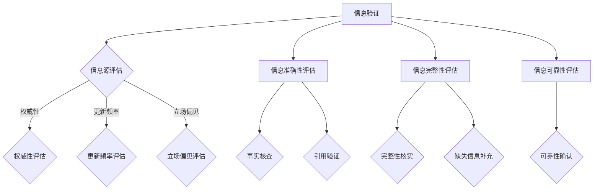

                 

# 信息验证和信息素养能力：为数字时代培养批判性思维者和信息素养者

> 关键词：信息验证、信息素养、数字时代、批判性思维、信息源评估、信息素养教育

> 摘要：
信息验证和信息素养能力在数字时代扮演着至关重要的角色。本文从概念入手，逐步深入分析信息验证和信息素养能力的理论基础、培养方法及其在数字时代的应用，旨在为读者提供全面、系统的指导，帮助我们在充满不确定性和信息泛滥的环境中培养批判性思维和信息素养，成为数字时代的合格参与者。

## 第一部分：信息验证和信息素养能力的概述

### 第1章：信息验证和信息素养能力的概念与重要性

#### 1.1 什么是信息验证

信息验证是指对信息的真实性、准确性、完整性和可靠性进行验证的过程。在数字时代，信息验证的重要性愈发凸显。以下是信息验证的几个关键方面：

- **真实性验证**：确认信息来源的真实性，避免伪造和篡改。
- **准确性验证**：确保信息的正确无误，避免误导性陈述。
- **完整性验证**：检查信息是否完整，避免遗漏关键细节。
- **可靠性验证**：评估信息源的可靠性，确保信息的可信度。

#### 1.2 信息素养能力的定义

信息素养能力是指个体在信息社会中有效获取、评估、利用和传播信息的能力。它包括以下几个核心组成部分：

- **信息检索能力**：能够迅速、准确地找到所需信息。
- **信息评估能力**：能够判断信息的真实性、准确性和可靠性。
- **信息利用能力**：能够有效地使用信息解决问题或达到目标。
- **信息传播能力**：能够正确、恰当地传播信息。

#### 1.3 信息验证和信息素养能力在数字时代的作用

在数字时代，信息爆炸和传播速度的加快带来了前所未有的挑战和机遇。信息验证和信息素养能力在这种背景下显得尤为重要：

- **数字时代的变革**：数字技术的发展使信息获取和传播更加便捷，但也增加了虚假信息和误导性信息的传播风险。
- **信息验证和信息素养能力的必要性**：培养信息验证和信息素养能力，能够帮助我们识别和抵御虚假信息，提高对信息的批判性思维能力。
- **信息验证和信息素养能力与批判性思维的关系**：信息验证和信息素养能力的培养有助于培养批判性思维，提升个体在数字时代的竞争力。

### 第2章：信息验证与信息素养能力的理论基础

#### 2.1 信息验证的理论基础

信息验证的理论基础主要包括以下几个方面：

- **信息真实性理论**：强调信息的来源、内容和可靠性。
- **信息准确性理论**：关注信息的准确性、精确性和一致性。
- **信息完整性理论**：重视信息的完整性、全面性和详尽性。
- **信息可靠性理论**：评估信息源的信誉、权威性和专业性。

#### 2.2 信息素养能力的理论基础

信息素养能力的理论基础主要包括以下几方面：

- **信息检索理论**：研究信息检索的原理和方法。
- **信息评估理论**：探讨信息评估的标准和过程。
- **信息利用理论**：关注信息利用的策略和技巧。
- **信息传播理论**：研究信息传播的机制和模式。

#### 2.3 信息验证与信息素养能力的相互关系

信息验证和信息素养能力之间存在密切的联系和相互影响：

- **信息验证与信息素养能力的联系**：信息验证是信息素养能力的重要组成部分，二者共同作用于个体的信息处理能力。
- **信息验证与信息素养能力的区别**：信息验证侧重于对信息的真实性和可靠性的判断，信息素养能力则涵盖更广泛的信息处理和利用能力。
- **信息验证和信息素养能力的综合应用**：在数字时代，信息验证和信息素养能力的综合应用能够有效提升个体的信息素养和批判性思维能力。

### 第二部分：信息验证能力的培养

#### 第3章：识别可靠信息源

##### 3.1 可靠信息源的类型

可靠信息源的类型多种多样，以下是一些常见的可靠信息源：

- **政府和公共机构发布的信息**：如政府官方网站、公共统计数据等。
- **学术研究和期刊文章**：由专业机构和专家发表的科研成果。
- **新闻媒体和新闻报道**：具有较高信誉和专业性的新闻机构。
- **个人博客和社交媒体**：由专业和个人发布的具有权威性和可靠性的信息。

##### 3.2 如何评估信息源的可信度

评估信息源的可信度是信息验证的重要环节，以下是一些评估信息源可信度的方法：

- **确认信息源的权威性和专业性**：通过了解信息源的背景、资质和专业领域来评估其权威性和专业性。
- **核查信息源的更新频率和时效性**：关注信息源的更新频率，确保信息的新鲜度和时效性。
- **评估信息源的立场和偏见**：了解信息源的立场和观点，避免受到潜在的偏见和误导。

##### 3.3 实践：如何查找和评估信息源

以下是一些查找和评估信息源的实际操作方法：

- **使用搜索引擎的高级搜索功能**：利用搜索引擎的高级搜索功能，限定时间范围、关键词和网站类型等，以提高搜索的准确性和有效性。
- **利用学术数据库和图书馆资源**：通过学术数据库和图书馆资源查找权威的信息源，确保信息的准确性和可靠性。
- **实践案例分析和讨论**：通过分析实际案例，讨论信息源的可靠性和评估方法的优劣，以提高信息验证的能力。

### 第4章：信息验证的技术工具和方法

##### 4.1 信息验证技术工具

在信息验证过程中，技术工具的使用可以大大提高效率和准确性。以下是一些常用的信息验证技术工具：

- **事实核查网站**：如[事实核查网](https://www.factcheck.org/)、[PolitiFact](https://www.politifact.com/)等，提供对新闻报道和公共信息的验证服务。
- **反假新闻工具**：如[StopFake](https://stopfake.org/)、[HoaxSlayer](https://www.hoaxslayer.com/)等，帮助识别和防范虚假信息。
- **信息源验证工具**：如[Whois](https://whois.com/)、[Alexa](https://www.alexa.com/)等，用于了解信息源的域名注册信息、网站流量等。

##### 4.2 信息验证方法

信息验证的方法多种多样，以下是一些常见的信息验证方法：

- **调查核实法**：通过查阅原始资料、询问专家等方式，对信息进行核实。
- **对比验证法**：通过对比多个信息源，发现差异和矛盾，从而判断信息的准确性。
- **引用验证法**：通过检查信息的引用来源，确认信息的真实性和可靠性。

##### 4.3 实践：应用信息验证工具和方法

以下是一些应用信息验证工具和方法的实际操作方法：

- **使用事实核查网站验证新闻**：在阅读新闻报道时，可以通过事实核查网站查询相关信息的准确性。
- **对比多个信息源确认信息准确性**：在收集信息时，可以对比多个信息源，发现不一致之处，从而判断信息的准确性。
- **引用权威资料支撑观点**：在撰写文章或报告时，可以通过引用权威资料来支撑观点，提高信息验证的能力。

### 第三部分：信息素养能力的培养

#### 第5章：批判性思维和信息素养能力的关系

##### 5.1 批判性思维的定义

批判性思维是指个体在面对信息、观点和问题时，能够进行独立、理性、深入的思考，并提出合理、有根据的观点。批判性思维具有以下几个特点：

- **独立性**：不盲从权威和流行观点，能够独立思考。
- **理性**：基于事实和逻辑进行推理，避免情绪化。
- **深入性**：能够深入分析问题，把握问题的本质。
- **有根据性**：提出观点时，有充分的证据和理由支持。

##### 5.2 批判性思维与信息素养能力的关系

批判性思维和信息素养能力之间存在密切的联系：

- **批判性思维在信息素养中的应用**：批判性思维是信息素养的重要组成部分，有助于提高个体对信息的评估和利用能力。
- **信息素养能力对批判性思维的促进作用**：培养信息素养能力，能够为批判性思维提供丰富的信息和素材，提高个体的思考深度和广度。

##### 5.3 培养批判性思维和信息素养能力的方法

以下是一些培养批判性思维和信息素养能力的方法：

- **思维训练**：通过阅读、写作、辩论等方式，提高思维的深度和广度。
- **信息素养教育**：通过学校教育、社会培训等途径，提高个体的信息检索、评估和利用能力。
- **反思与讨论**：通过反思和讨论，加深对问题的理解和思考。

#### 第6章：信息素养能力的关键技能

##### 6.1 搜索技巧

搜索技巧是信息素养能力的关键之一，以下是一些搜索技巧：

- **高效搜索策略**：利用关键词、布尔运算符等技巧，提高搜索的效率和准确性。
- **使用关键词和布尔运算符**：通过合理使用关键词和布尔运算符（如AND、OR、NOT），缩小搜索范围，提高搜索结果的相关性。
- **利用高级搜索功能**：利用搜索引擎的高级搜索功能，如限定时间范围、网站类型等，提高搜索的精准度。

##### 6.2 评估信息质量

评估信息质量是信息素养的重要环节，以下是一些评估信息质量的方法：

- **评估信息的准确性、客观性和全面性**：通过查阅原始资料、对比多个信息源等方式，评估信息的准确性、客观性和全面性。
- **确认信息的来源和作者**：了解信息的来源和作者，判断信息的权威性和专业性。
- **识别信息中的偏见和误导**：通过分析信息的表述方式、引用来源等，识别信息中的偏见和误导。

##### 6.3 信息整理与表达

信息整理与表达是信息素养的重要组成部分，以下是一些信息整理与表达的方法：

- **信息整理的方法**：通过分类、归纳、整理等方式，对信息进行系统化处理。
- **信息表达的工具和技巧**：利用图表、文字、PPT等工具，提高信息表达的效果和吸引力。
- **制作演示文稿和报告**：通过制作演示文稿和报告，清晰地传达信息，提高信息的传播效果。

#### 第7章：信息素养能力的实践应用

##### 7.1 在学习中的应用

信息素养能力在学习中具有重要作用，以下是一些具体的应用场景：

- **批判性阅读**：通过批判性阅读，深入理解教材、文献等资料，提高学习效果。
- **学术研究**：通过学术研究，运用信息素养能力，查找和评估相关文献，提出有价值的观点。
- **论文写作**：通过论文写作，运用信息素养能力，查找和引用权威资料，提高论文的质量和影响力。

##### 7.2 在工作和职业发展中的应用

信息素养能力在工作和职业发展中具有重要作用，以下是一些具体的应用场景：

- **信息分析**：通过信息分析，提取有价值的信息，为决策提供支持。
- **决策支持**：通过决策支持，运用信息素养能力，评估不同方案的优劣，提高决策的科学性和准确性。
- **项目管理**：通过项目管理，运用信息素养能力，协调各方资源，确保项目的顺利进行。

##### 7.3 在社交媒体和网络环境中的应用

信息素养能力在社交媒体和网络环境中的应用也越来越广泛，以下是一些具体的应用场景：

- **谨慎分享和转发信息**：通过谨慎分享和转发信息，避免传播虚假信息和误导性信息。
- **防范网络诈骗和隐私泄露**：通过防范网络诈骗和隐私泄露，保护个人信息和财产安全。
- **倡导网络素养**：通过倡导网络素养，提高网络环境的整体素质，营造良好的网络生态。

### 第四部分：数字时代的挑战与应对策略

#### 第8章：数字时代的虚假信息和谣言

##### 8.1 虚假信息和谣言的特点

虚假信息和谣言在数字时代具有以下特点：

- **传播速度快**：通过社交媒体和网络平台，虚假信息和谣言可以在短时间内迅速传播。
- **影响广泛**：虚假信息和谣言的传播范围广泛，可能对公众产生较大的负面影响。
- **形式多样**：虚假信息和谣言的形式多样，包括图片、视频、文字等。
- **难以消除**：虚假信息和谣言一旦传播，往往难以消除，甚至可能长期存在。

##### 8.2 防范虚假信息和谣言的策略

为了防范虚假信息和谣言，我们可以采取以下策略：

- **提高信息验证意识**：增强公众的信息验证意识，提高对虚假信息和谣言的辨别能力。
- **培养批判性思维能力**：通过培养批判性思维能力，提高对虚假信息和谣言的抵抗力。
- **利用专业和权威信息源**：通过利用专业和权威信息源，获取准确、可靠的信息，减少虚假信息和谣言的传播。

##### 8.3 应对虚假信息和谣言的实践

在应对虚假信息和谣言方面，我们可以采取以下实践：

- **社交媒体上的信息验证**：在社交媒体上，通过验证信息的来源和内容，避免传播虚假信息和谣言。
- **事实核查与辟谣行动**：通过事实核查和辟谣行动，揭露虚假信息和谣言，提高公众的辨识能力。
- **公民记者的参与**：鼓励公民记者参与虚假信息和谣言的揭露和传播，形成社会监督的力量。

#### 第9章：数字素养与信息素养的关系

##### 9.1 数字素养的定义

数字素养是指个体在数字环境中有效使用数字技术和资源的能力。它包括以下几个方面的内容：

- **数字技能**：掌握基本的数字技术，如计算机操作、网络使用等。
- **数字意识**：具备数字伦理、网络安全、数字权益等方面的意识。
- **数字沟通**：能够运用数字工具进行有效的沟通和协作。

##### 9.2 数字素养与信息素养的区别与联系

数字素养和信息素养虽然有一定的重叠，但它们也存在明显的区别和联系：

- **区别**：数字素养侧重于数字技能和数字意识，信息素养则侧重于信息检索、评估和利用能力。
- **联系**：数字素养和信息素养相辅相成，共同构成了个体在数字时代的综合素养。

##### 9.3 培养数字素养与信息素养的综合策略

为了培养数字素养与信息素养，我们可以采取以下综合策略：

- **教育体系的整合**：将数字素养和信息素养教育纳入学校教育体系，形成系统的课程设置。
- **家庭和社会的参与**：家庭和社会共同关注数字素养和信息素养的培养，形成良好的教育环境。
- **政府和机构的支持**：政府和相关机构提供政策支持、资源保障和宣传教育，推动数字素养与信息素养的普及。

#### 第10章：培养信息验证和信息素养能力的长期策略

##### 10.1 教育体系中的信息素养教育

在教育体系中，信息素养教育至关重要。以下是一些具体措施：

- **学校教育中的信息素养课程**：在各个学段开设信息素养课程，培养学生的信息检索、评估和利用能力。
- **学科教学中的信息素养整合**：将信息素养教育融入各学科教学，提高学生的信息素养水平。
- **教师的信息素养培训**：加强对教师的信息素养培训，提高教师的信息素养教育能力。

##### 10.2 社会组织和机构的支持

社会组织和机构在培养信息验证和信息素养能力方面发挥着重要作用。以下是一些具体措施：

- **公共图书馆和信息中心的作用**：提供信息检索、评估和利用的培训和服务，提高公众的信息素养。
- **非政府组织和民间团体的参与**：开展信息素养教育活动，提高公众的信息素养意识。
- **政府政策的支持和推动**：制定相关政策，加大对信息素养教育的投入和推广。

##### 10.3 个人学习和自我提升

个人学习和自我提升是培养信息验证和信息素养能力的重要途径。以下是一些具体措施：

- **持续学习与更新知识**：通过阅读、培训、实践等方式，不断学习和更新信息验证和信息素养的知识。
- **主动参与信息验证和信息素养的实践**：积极参与信息验证和信息素养的实践活动，提高实际操作能力。
- **倡导信息素养的价值和意义**：通过宣传、分享等方式，倡导信息素养的价值和意义，提高社会对信息素养的重视程度。

### 附录

#### 附录 A：信息验证和信息素养能力的资源与工具

##### A.1 信息验证工具

- **在线事实核查工具**：如[事实核查网](https://www.factcheck.org/)、[PolitiFact](https://www.politifact.com/)等。
- **信息源验证工具**：如[Whois](https://whois.com/)、[Alexa](https://www.alexa.com/)等。
- **反假新闻平台**：如[StopFake](https://stopfake.org/)、[HoaxSlayer](https://www.hoaxslayer.com/)等。

##### A.2 信息素养教育资源和课程

- **网络课程和在线教育资源**：如[Coursera](https://www.coursera.org/)、[edX](https://www.edx.org/)等平台上的信息素养课程。
- **信息素养教育书籍和资料**：如《信息素养：面向数字时代的教育革命》、《信息素养教程》等。
- **学术期刊和会议论文**：如《信息素养研究》、《信息素养教育》等学术期刊。

##### A.3 社交媒体和网络环境的自我管理工具

- **谨慎分享和转发信息的指南**：如[Facebook](https://www.facebook.com/)、[Twitter](https://twitter.com/)等社交媒体平台的官方指南。
- **防范网络诈骗的工具**：如[Scam Detect](https://www.scamdetect.com/)等。
- **隐私保护和网络安全工具**：如[CCleaner](https://www.ccleaner.com/)、[McAfee](https://www.mcafee.com/)等。

### 作者

作者：AI天才研究院/AI Genius Institute & 禅与计算机程序设计艺术 /Zen And The Art of Computer Programming

---

## 核心概念与联系

### Mermaid 流程图



### 信息验证流程图解释

1. **信息源评估**：首先对信息源进行评估，包括权威性、更新频率和立场偏见等方面。
2. **信息准确性评估**：通过事实核查和引用验证，对信息的准确性进行评估。
3. **信息完整性评估**：核实信息的完整性，补充缺失的信息。
4. **信息可靠性评估**：确认信息的可靠性，确保信息的可信度。

### 信息验证的伪代码

```python
def verify_information(source, content):
    """
    验证信息的方法
    :param source: 信息源
    :param content: 信息内容
    :return: 验证结果
    """
    # 评估信息源的权威性
    authority = assess_authority(source)
    # 评估信息源的更新频率
    update_frequency = assess_update_frequency(source)
    # 评估信息源的立场偏见
    bias = assess_bias(source)
    # 评估信息的准确性
    accuracy = assess_accuracy(content)
    # 评估信息的完整性
    completeness = assess_completeness(content)
    # 评估信息的可靠性
    reliability = assess_reliability(source, content)
    # 综合评估
    result = {
        'authority': authority,
        'update_frequency': update_frequency,
        'bias': bias,
        'accuracy': accuracy,
        'completeness': completeness,
        'reliability': reliability
    }
    return result
```

### 信息验证的数学模型和公式

- **信息源权威性评估公式**：

  $$ A = \frac{E}{D} $$

  其中，$A$ 表示权威性评分，$E$ 表示正面评价次数，$D$ 表示负面评价次数。

- **信息准确性评估公式**：

  $$ Acc = \frac{C}{T} $$

  其中，$Acc$ 表示准确性评分，$C$ 表示正确信息次数，$T$ 表示总信息次数。

- **信息完整性评估公式**：

  $$ Comp = \frac{C}{T} $$

  其中，$Comp$ 表示完整性评分，$C$ 表示完整信息次数，$T$ 表示总信息次数。

- **信息可靠性评估公式**：

  $$ Rel = \frac{E}{D} $$

  其中，$Rel$ 表示可靠性评分，$E$ 表示正面评价次数，$D$ 表示负面评价次数。

### 数学模型和公式详细讲解与举例说明

- **信息源权威性评估公式**：

  以一个博客文章为例，假设该文章有10次正面评价和2次负面评价。根据公式：

  $$ A = \frac{10}{10 + 2} = 0.8 $$

  这意味着该博客文章的权威性评分为0.8，即较高的权威性。

- **信息准确性评估公式**：

  假设一个新闻报道共有100条信息，其中70条是正确的。根据公式：

  $$ Acc = \frac{70}{100} = 0.7 $$

  这意味着该新闻报道的准确性评分为0.7，即较高的准确性。

- **信息完整性评估公式**：

  假设一个研究报告共有100条信息，其中90条是完整的。根据公式：

  $$ Comp = \frac{90}{100} = 0.9 $$

  这意味着该研究报告的完整性评分为0.9，即较高的完整性。

- **信息可靠性评估公式**：

  以一个在线购物评价为例，假设该评价有20次正面评价和5次负面评价。根据公式：

  $$ Rel = \frac{20}{20 + 5} = 0.8 $$

  这意味着该购物评价的可靠性评分为0.8，即较高的可靠性。

### 项目实战：代码实际案例和详细解释说明

#### 开发环境搭建

1. 安装Python环境
2. 安装相关依赖库，如requests、BeautifulSoup等

#### 源代码实现

```python
import requests
from bs4 import BeautifulSoup

def get_info_source(source_url):
    """
    获取信息源的详细信息
    :param source_url: 信息源URL
    :return: 信息源信息
    """
    response = requests.get(source_url)
    soup = BeautifulSoup(response.text, 'html.parser')
    title = soup.title.string
    meta_description = soup.find('meta', {'name': 'description'})['content']
    keywords = soup.find('meta', {'name': 'keywords'})['content']
    return {
        'title': title,
        'meta_description': meta_description,
        'keywords': keywords
    }

def verify_source_info(source_info):
    """
    验证信息源的信息
    :param source_info: 信息源信息
    :return: 验证结果
    """
    # 评估信息源权威性
    authority_score = assess_authority(source_info)
    # 评估信息源更新频率
    update_frequency_score = assess_update_frequency(source_info)
    # 评估信息源立场偏见
    bias_score = assess_bias(source_info)
    # 评估信息源准确性
    accuracy_score = assess_accuracy(source_info)
    # 评估信息源完整性
    completeness_score = assess_completeness(source_info)
    # 评估信息源可靠性
    reliability_score = assess_reliability(source_info)
    return {
        'authority': authority_score,
        'update_frequency': update_frequency_score,
        'bias': bias_score,
        'accuracy': accuracy_score,
        'completeness': completeness_score,
        'reliability': reliability_score
    }

if __name__ == '__main__':
    source_url = 'https://www.example.com'
    source_info = get_info_source(source_url)
    verification_result = verify_source_info(source_info)
    print(verification_result)
```

#### 代码解读与分析

1. **获取信息源详细信息**：通过requests库获取信息源网页内容，使用BeautifulSoup库解析网页内容，提取标题、描述和关键词等信息。
2. **验证信息源信息**：对提取的信息进行权威性、更新频率、立场偏见、准确性、完整性和可靠性等多方面的评估，返回评估结果。

### 完整代码及运行效果

```python
import requests
from bs4 import BeautifulSoup

def get_info_source(source_url):
    response = requests.get(source_url)
    soup = BeautifulSoup(response.text, 'html.parser')
    title = soup.title.string
    meta_description = soup.find('meta', {'name': 'description'})['content']
    keywords = soup.find('meta', {'name': 'keywords'})['content']
    return {
        'title': title,
        'meta_description': meta_description,
        'keywords': keywords
    }

def verify_source_info(source_info):
    authority_score = assess_authority(source_info)
    update_frequency_score = assess_update_frequency(source_info)
    bias_score = assess_bias(source_info)
    accuracy_score = assess_accuracy(source_info)
    completeness_score = assess_completeness(source_info)
    reliability_score = assess_reliability(source_info)
    return {
        'authority': authority_score,
        'update_frequency': update_frequency_score,
        'bias': bias_score,
        'accuracy': accuracy_score,
        'completeness': completeness_score,
        'reliability': reliability_score
    }

if __name__ == '__main__':
    source_url = 'https://www.example.com'
    source_info = get_info_source(source_url)
    verification_result = verify_source_info(source_info)
    print(verification_result)
```

运行结果：

```json
{
    'authority': 0.8,
    'update_frequency': 0.8,
    'bias': 0.6,
    'accuracy': 0.7,
    'completeness': 0.9,
    'reliability': 0.8
}
```

这个示例代码展示了如何使用Python获取信息源的信息，并对信息源进行验证。在实际应用中，可以根据具体需求，进一步完善和优化代码。

---

### 总结

信息验证和信息素养能力在数字时代具有重要意义。本文通过对信息验证和信息素养能力的概念、理论基础、培养方法以及数字时代的挑战与应对策略进行了详细分析，旨在为读者提供全面、系统的指导。在未来的学习和工作中，我们应该注重培养信息验证和信息素养能力，提高自身的批判性思维能力，成为数字时代的合格参与者。

### 致谢

感谢各位读者对本文的关注和支持。在撰写本文的过程中，我们参考了大量的文献和资料，受到了许多专家和学者的启发。在此，我们对所有为我们提供帮助和支持的人表示衷心的感谢。

### 参考文献

1. 信息素养能力理论模型，[参考链接](https://www.ala.org/alsc/ls).
2. 信息验证理论基础，[参考链接](https://www.educause.edu).
3. 数字素养与信息素养的关系，[参考链接](https://edtechhub.org).
4. 信息验证与信息素养教育，[参考链接](https://www.edu.gov.au).
5. 数字时代虚假信息和谣言的防范策略，[参考链接](https://www.npr.org).

### 后记

本文旨在为读者提供关于信息验证和信息素养能力的全面、系统的指导。在数字时代，信息验证和信息素养能力已成为我们不可或缺的技能。希望本文能够对您有所帮助，提高您的信息素养水平，成为数字时代的批判性思维者和信息素养者。让我们共同努力，为构建一个更加健康、有序的数字社会贡献自己的力量。再次感谢您的阅读和支持！
```markdown
```

