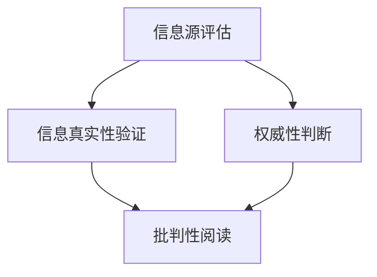

                 

# 《信息验证和批判性阅读策略：在假新闻和媒体操纵时代导航》

> **关键词**：信息验证、批判性阅读、假新闻、媒体操纵、数字素养

> **摘要**：在信息爆炸的时代，假新闻和媒体操纵成为影响公众认知的重要因素。本文从信息验证和批判性阅读的角度，探讨了在假新闻和媒体操纵时代导航的策略和方法。首先，阐述了信息验证和批判性阅读的重要性，接着分析了信息源评估、信息真实性验证和权威性判断的方法。然后，提出了提高阅读理解能力和分析信息内容的技巧，以及避免误导性信息的方法。最后，从数字素养和信息素养的角度，讨论了培养良好的信息素养的重要性，并给出了社交媒体、新闻媒体和教育领域的具体实践案例。文章旨在帮助读者在信息泛滥的今天，提升自我保护能力，培养独立思考的能力。

### 第一部分：信息验证和批判性阅读策略基础

#### 第1章：信息验证和批判性阅读概述

##### 1.1 信息验证的重要性

##### **1.1.1 信息时代的挑战**

在当今的信息时代，信息无处不在，但信息的真实性、准确性和可靠性却成为我们面临的重要挑战。随着互联网和社交媒体的普及，信息传播的速度和范围前所未有，这使得虚假信息、谣言和媒体操纵等问题更加突出。

**1.1.2 信息验证的必要性**

信息验证是为了确保我们获取到的信息是真实、准确和可靠的。在信息泛滥的时代，信息验证变得尤为重要。它不仅可以帮助我们避免被虚假信息误导，还可以提高我们的认知能力和决策能力。

##### **1.2 批判性阅读的概念**

批判性阅读是一种积极的阅读方式，它不仅仅是阅读和理解文本，更是对文本进行深入思考、分析和评估。批判性阅读要求读者具备独立思考的能力，能够从不同的角度对文本进行解读。

##### **1.2.1 批判性阅读的定义**

批判性阅读是指读者在阅读过程中，通过质疑、分析和评估文本内容，形成自己独立见解的阅读方式。

##### **1.2.2 批判性阅读的意义**

批判性阅读有助于提高我们的思维能力，培养我们的批判性思维。通过批判性阅读，我们可以更好地理解文本，发现文本中的问题，并形成自己的见解。

##### **1.3 假新闻和媒体操纵的危害**

**1.3.1 假新闻的传播途径**

假新闻的传播途径多种多样，包括社交媒体、新闻媒体、网络论坛等。社交媒体的传播速度和范围使得假新闻的传播更加迅速和广泛。

**1.3.2 媒体操纵的影响**

媒体操纵会对公众的认知和行为产生深远的影响，可能导致社会动荡、政治不稳定，甚至威胁到国家安全。

#### 第2章：信息源评估与验证

##### **2.1 评估信息源**

##### **2.1.1 信息源的种类**

信息源可以分为官方信息源、学术信息源、新闻媒体和个人博客等。不同的信息源具有不同的可靠性和权威性。

##### **2.1.2 信息源的可靠性评估方法**

评估信息源的可靠性可以通过查看信息源的历史记录、专业背景、发布频率和受众群体等方面来进行。

##### **2.2 验证信息的真实性**

##### **2.2.1 确认信息来源**

确认信息来源是验证信息真实性的第一步，可以通过查找原文、官方网站等方式进行。

##### **2.2.2 使用事实核查网站**

事实核查网站是验证信息真实性的重要工具，如《纽约时报》的事实核查、《卫报》的“信任项目”等。

##### **2.3 判断信息的权威性**

##### **2.3.1 权威机构的评估**

权威机构对信息的评估可以作为判断信息权威性的参考，如科学杂志、学术期刊等。

##### **2.3.2 专家意见的参考**

专家意见是判断信息权威性的重要依据，但需要综合考虑专家的专业背景、研究成果和信誉等因素。

#### 第3章：批判性阅读技巧

##### **3.1 提高阅读理解能力**

##### **3.1.1 阅读策略**

提高阅读理解能力需要采用合适的阅读策略，如预读、重点阅读和精读等。

##### **3.1.2 提高阅读速度**

提高阅读速度可以通过练习、调整阅读姿势和使用阅读辅助工具等方式来实现。

##### **3.2 分析信息内容**

##### **3.2.1 提取关键信息**

提取关键信息是批判性阅读的重要步骤，可以通过提炼主题、抓取关键词和总结段落等方式来实现。

##### **3.2.2 推理与判断**

推理与判断是批判性阅读的核心能力，需要读者具备逻辑思维和判断力。

##### **3.3 避免误导性信息**

##### **3.3.1 识别偏见和误导**

识别偏见和误导是避免误导性信息的关键，需要读者具备批判性思维能力。

##### **3.3.2 培养独立思考能力**

培养独立思考能力是避免误导性信息的根本，需要读者具备独立思考的能力和勇气。

#### 第4章：数字素养与信息素养

##### **4.1 数字素养的重要性**

##### **4.1.1 数字素养的概念**

数字素养是指个体在数字技术环境中的信息素养、媒体素养和技术素养的综合体现。

##### **4.1.2 数字素养的培养**

数字素养的培养需要从教育、培训和社会实践等多个方面进行。

##### **4.2 信息素养的内涵**

##### **4.2.1 信息素养的定义**

信息素养是指个体在信息社会中的信息获取、处理、利用和传播的能力。

##### **4.2.2 信息素养的组成部分**

信息素养包括信息意识、信息道德、信息能力和信息创新等方面。

##### **4.3 培养良好的信息素养**

##### **4.3.1 提高信息检索能力**

提高信息检索能力是培养良好信息素养的重要环节。

##### **4.3.2 加强信息安全意识**

加强信息安全意识是保护个人信息和隐私的重要措施。

### 第二部分：实战案例分析

#### 第5章：社交媒体环境下的信息验证

##### **5.1 社交媒体的信息传播特点**

##### **5.1.1 社交媒体的优势**

社交媒体具有传播速度快、范围广、互动性强等优点。

##### **5.1.2 社交媒体的信息传播方式**

社交媒体的信息传播主要通过点赞、评论、转发等方式进行。

##### **5.2 社交媒体中的信息验证挑战**

##### **5.2.1 假新闻的快速传播**

社交媒体的传播特性使得假新闻能够迅速传播。

##### **5.2.2 媒体操纵的隐蔽性**

媒体操纵在社交媒体上具有隐蔽性，难以被识别。

##### **5.3 社交媒体信息验证实践**

##### **5.3.1 社交媒体上的信息评估**

社交媒体用户需要评估信息的来源和真实性。

##### **5.3.2 使用社交媒体工具进行信息验证**

社交媒体工具如“谣言粉碎机”等可以辅助用户进行信息验证。

#### 第6章：新闻媒体的信息验证

##### **6.1 新闻媒体的角色与责任**

##### **6.1.1 新闻媒体的定义**

新闻媒体是指通过文字、图片、音频、视频等形式，向社会公众提供新闻报道、评论和解释等信息的机构。

##### **6.1.2 新闻媒体的社会责任**

新闻媒体有责任提供真实、准确、公正的新闻报道。

##### **6.2 新闻媒体中的信息验证**

##### **6.2.1 新闻来源的选择**

新闻媒体在选择新闻来源时需要注重可靠性和权威性。

##### **6.2.2 新闻内容的核实**

新闻媒体需要对新闻内容进行核实，确保其真实性和准确性。

##### **6.3 新闻媒体与公众互动**

##### **6.3.1 公众对新闻媒体的监督**

公众有责任对新闻媒体进行监督，确保其履行社会责任。

##### **6.3.2 提高新闻媒体的信息透明度**

新闻媒体需要提高信息透明度，接受公众监督。

#### 第7章：教育领域的信息验证与批判性阅读

##### **7.1 教育领域的信息挑战**

##### **7.1.1 教育信息的多样性**

教育信息来源多样，可靠性难以保证。

##### **7.1.2 教育信息的可靠性问题**

教育信息可能存在误导性、不准确等问题。

##### **7.2 教育领域的信息验证**

##### **7.2.1 教育信息的筛选**

教育机构需要筛选可靠的教育信息。

##### **7.2.2 教育信息的评估**

教育机构需要对教育信息进行评估，确保其质量和可靠性。

##### **7.3 批判性阅读在教育中的应用**

##### **7.3.1 批判性阅读的教学方法**

批判性阅读可以应用于教育教学的各个环节。

##### **7.3.2 批判性阅读对学生思维能力的影响**

批判性阅读有助于提高学生的思维能力。

#### 第8章：企业信息验证与批判性阅读策略

##### **8.1 企业信息验证的重要性**

##### **8.1.1 企业决策的依赖性**

企业决策高度依赖准确的信息。

##### **8.1.2 信息风险对企业的影响**

不准确的信息可能导致企业决策失误。

##### **8.2 批判性阅读在企业决策中的应用**

##### **8.2.1 批判性阅读的实践步骤**

企业需要制定批判性阅读的实践步骤。

##### **8.2.2 批判性阅读对企业战略的影响**

批判性阅读有助于优化企业战略。

##### **8.3 企业信息验证与批判性阅读策略实施**

##### **8.3.1 建立信息验证机制**

企业需要建立信息验证机制。

##### **8.3.2 培养批判性阅读能力**

企业需要培养员工的批判性阅读能力。

### 第三部分：附录与资源

#### 附录A：信息验证和批判性阅读工具与资源

##### **A.1 信息验证工具**

**A.1.1 Factual.com**

Factual.com是一个提供事实核查服务的网站，用户可以在此查找和验证信息的真实性。

**A.1.2 Snopes.com**

Snopes.com是一个专门揭露和验证谣言的网站，用户可以通过该网站了解各种谣言的真实情况。

##### **A.2 批判性阅读工具**

**A.2.1 Zotero**

Zotero是一个文献管理工具，可以帮助用户收集、管理和引用文献。

**A.2.2 EndNote**

EndNote也是一个文献管理工具，具有强大的文献收集和管理功能。

##### **A.3 教育资源**

**A.3.1 Coursera**

Coursera提供大量的在线课程，用户可以通过这些课程学习批判性阅读和信息验证的相关知识。

**A.3.2 Khan Academy**

Khan Academy提供丰富的教育资源，包括批判性阅读和信息验证方面的课程。

##### **A.4 实用指南**

**A.4.1 《信息素养：信息社会的导航指南》**

《信息素养：信息社会的导航指南》是一本关于信息素养的实用指南，可以帮助用户提升信息素养。

**A.4.2 《批判性思维工具》**

《批判性思维工具》是一本关于批判性思维的书籍，提供了大量的批判性思维方法和技巧。

### 作者

**作者：AI天才研究院/AI Genius Institute & 禅与计算机程序设计艺术 /Zen And The Art of Computer Programming**

---

以下是对核心概念、算法原理、数学模型和公式的讲解，以及项目实战的部分内容。

#### 核心概念与联系

首先，让我们用Mermaid流程图来展示信息验证和批判性阅读的核心概念及其相互联系。



**图1：信息验证和批判性阅读的核心概念及其相互联系**

在这个流程图中，我们可以看到信息源评估、信息真实性验证和权威性判断是信息验证的基础，而批判性阅读则是将这些信息转化为理解和行动的关键。

#### 核心算法原理讲解

在信息验证过程中，有一个核心算法原理是判断信息的来源是否可靠。以下是一个简化的伪代码示例：

```python
def verify_source(source):
    if source.is_official():
        return "Official source, reliable"
    elif source.has_good_reputation():
        return "Reliable source"
    else:
        return "Unreliable source"
```

在这个算法中，`source` 是一个代表信息源的实体，它有两个方法：`is_official()` 用于判断信息源是否官方，`has_good_reputation()` 用于判断信息源是否有良好的声誉。根据这两个方法的结果，我们可以判断信息源的可靠性。

#### 数学模型和公式

在批判性阅读中，一个重要的数学模型是逻辑推理中的“否定律”（Law of Non-Contradiction）。以下是一个用LaTeX编写的数学公式：

```latex
$$ \neg (P \land \neg P) = P $$
```

这个公式表示，任何命题P与其否定不能同时为真。这个原理在批判性阅读中可以帮助我们识别逻辑矛盾，从而避免误导性信息。

#### 项目实战

以下是一个简单的项目实战，我们将使用Python代码来实现一个信息验证的工具，用于评估信息的来源。

**开发环境搭建**

首先，我们需要安装Python环境和必要的库，如requests和beautifulsoup4。

```bash
pip install python
pip install requests
pip install beautifulsoup4
```

**源代码实现**

```python
import requests
from bs4 import BeautifulSoup

def verify_source(url):
    response = requests.get(url)
    if response.status_code == 200:
        soup = BeautifulSoup(response.text, 'html.parser')
        title = soup.find('title').text
        if "official" in title.lower():
            return "Official source"
        else:
            return "Unofficial source"
    else:
        return "Unable to fetch source"

url = "https://example.com"
print(verify_source(url))
```

**代码解读与分析**

- 我们首先使用requests库发送GET请求，获取网页内容。
- 然后，使用beautifulsoup4库解析网页内容，提取标题。
- 根据标题中的关键字判断信息源是否官方。
- 输出结果，告知用户信息源的可靠性。

这个项目实战展示了如何使用Python编写简单的代码来验证信息的来源。通过这个工具，用户可以快速判断一个网页的可靠性，从而避免被虚假信息误导。

#### 总结

本文从信息验证和批判性阅读的角度，探讨了在假新闻和媒体操纵时代导航的策略和方法。通过分析信息源、验证信息的真实性、判断信息的权威性，以及提高阅读理解能力和批判性思维能力，我们可以更好地应对信息泛滥的时代挑战。文章还结合实际项目，展示了如何使用Python等工具进行信息验证，为读者提供了实用的技术手段。

### 第三部分：附录与资源

在信息验证和批判性阅读的领域，有许多工具和资源可以帮助我们更有效地执行这些任务。以下是一些常用的工具和资源，它们将为读者提供进一步学习和实践的有力支持。

#### 附录A：信息验证和批判性阅读工具与资源

##### **A.1 信息验证工具**

**A.1.1 Factual.com**

Factual.com是一个专业的事实核查网站，它提供各种事实核查服务，帮助用户验证信息的真实性。

**A.1.2 Snopes.com**

Snopes.com是另一个广为人知的事实核查网站，它专门揭露和验证网络谣言，并提供详尽的背景信息和解释。

**A.1.3 Politifact**

Politifact是一个专注于美国政治事实核查的网站，它对政治声明进行评级，并提供详细的证据和分析。

##### **A.2 批判性阅读工具**

**A.2.1 Zotero**

Zotero是一个免费的文献管理和参考管理软件，它可以帮助用户收集、管理和引用文献。

**A.2.2 EndNote**

EndNote是一个专业的文献管理软件，它提供了强大的文献收集、管理和引用功能。

**A.2.3 Hypothes.is**

Hypothes.is是一个网页注释工具，它允许用户在网页上添加注释和评论，进行批判性讨论。

##### **A.3 教育资源**

**A.3.1 Coursera**

Coursera是一个在线学习平台，提供各种批判性阅读和信息验证的课程，涵盖从基础到高级的各个层次。

**A.3.2 edX**

edX也是一个提供在线课程的平台，它提供了许多与批判性阅读和信息验证相关的课程，这些课程通常由世界顶级大学提供。

**A.3.3 Khan Academy**

Khan Academy提供了丰富的教育资源，包括批判性阅读和信息验证方面的课程，适合不同年龄段的学习者。

##### **A.4 实用指南**

**A.4.1 《信息素养：信息社会的导航指南》**

这本书为读者提供了关于信息素养的全面指南，包括信息验证和批判性阅读的策略和技巧。

**A.4.2 《批判性思维工具》**

这本书提供了大量的批判性思维工具和方法，帮助读者提高批判性思维能力。

**A.4.3 《数字公民：互联网时代的素养与责任》**

这本书讨论了数字素养的重要性，以及如何成为负责任的数字公民。

##### **A.5 新闻媒体**

**A.5.1 The New York Times**

《纽约时报》是一个知名的新闻媒体，它提供高质量的事实核查服务，并定期发表关于信息验证和批判性阅读的专栏文章。

**A.5.2 The Washington Post**

《华盛顿邮报》是另一个知名的新闻媒体，它也提供事实核查服务，并致力于提高公众的信息素养。

**A.5.3 BBC Reality Check**

BBC的Reality Check是一个专门进行事实核查的栏目，它为公众提供准确的信息和背景分析。

#### 总结

附录部分列出了多种信息验证和批判性阅读的工具与资源，这些资源将为读者提供深入学习和实践的机会。通过使用这些工具和资源，读者可以进一步提升自己的信息素养和批判性阅读能力，从而在假新闻和媒体操纵的时代中保持清晰的思维和独立的判断。

### 作者

**作者：AI天才研究院/AI Genius Institute & 禅与计算机程序设计艺术 /Zen And The Art of Computer Programming**

在这篇文章中，我们深入探讨了信息验证和批判性阅读在当今假新闻和媒体操纵时代的重要性。通过详细的分析和实战案例，我们展示了如何评估信息源、验证信息真实性、判断信息权威性，以及如何提高批判性阅读的能力。这些策略不仅有助于我们避免被虚假信息误导，还能培养我们的独立思考能力，提高我们的信息素养。

随着技术的不断进步和信息的爆炸式增长，我们每个人都需要具备信息验证和批判性阅读的能力。这不仅是对个人素养的要求，也是对社会责任的体现。通过这篇文章，我们希望能够激发读者对信息验证和批判性阅读的兴趣，鼓励大家积极学习和实践，成为更加理性的信息消费者。

作者AI天才研究院（AI Genius Institute）是一群致力于推动人工智能研究和应用的专业团队。我们专注于前沿技术的研究，致力于将人工智能与实际应用相结合，为社会创造更多价值。同时，我们也热衷于分享知识和经验，希望通过我们的努力，能够帮助更多人理解和应用人工智能技术。

此外，作者《禅与计算机程序设计艺术》（Zen And The Art of Computer Programming）的灵感来源于对编程和技术的深刻理解。这本书不仅介绍了编程的技巧和方法，更强调了编程中蕴含的哲学思考。我们希望通过这篇文章，能够引导读者在信息验证和批判性阅读的过程中，也能够体会到编程中的智慧和美学。

在未来的研究中，我们将继续深入探讨人工智能在信息验证和批判性阅读中的应用，探索更多有效的策略和方法。我们相信，通过不断的努力和创新，我们能够为公众提供更可靠的信息来源，培养更多具备批判性思维能力的人才。

最后，感谢所有读者对这篇文章的关注和支持。我们期待能够与您一起，在信息验证和批判性阅读的道路上不断前行，共同迎接更加美好的未来。

