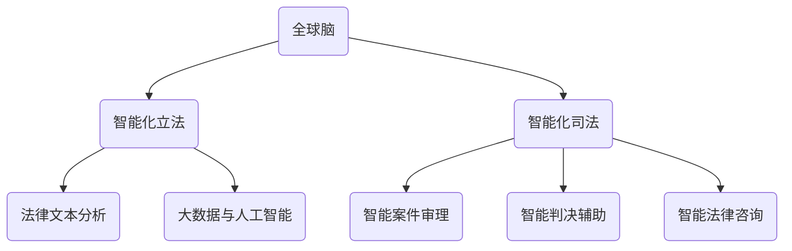

                 

# 全球脑与法律进化：智能化立法与司法改革

## 关键词：
- 全球脑
- 智能化立法
- 司法改革
- 大数据
- 人工智能
- 法律文本分析
- 自然语言处理
- 法律伦理

## 摘要：
本文旨在探讨全球脑与法律进化的关系，特别是在智能化立法与司法改革方面的应用。通过对全球脑的概念及其特性、法律进化的原理与趋势、智能化立法的基本原理与关键技术、智能化司法的概念与作用以及全球脑与法律进化的未来展望的深入分析，本文旨在为法律领域的技术创新和改革提供理论指导和实践案例。文章结构清晰，内容丰富，旨在为专业人士和学术研究者提供一个全面而深入的参考资料。

## 目录大纲

# 全球脑与法律进化：智能化立法与司法改革

## 第一部分：全球脑与法律进化的基础理论

### 第1章：全球脑的概念与特性
#### 1.1 全球脑的定义
#### 1.2 全球脑的构成与作用
#### 1.3 全球脑与人类社会的联系

### 第2章：法律进化的原理与趋势
#### 2.1 法律的基本概念与发展历程
#### 2.2 法律进化的动力因素
#### 2.3 智能化法律的未来趋势

### 第3章：全球脑与法律进化中的挑战与机遇
#### 3.1 智能化立法的挑战
#### 3.2 智能化司法的挑战
#### 3.3 全球脑与法律进化的机遇

## 第二部分：智能化立法的理论与实践

### 第4章：智能化立法的基本原理
#### 4.1 智能化立法的概念与特点
#### 4.2 智能化立法的框架与流程
#### 4.3 智能化立法的技术支持

### 第5章：智能化立法的关键技术
#### 5.1 大数据与人工智能
#### 5.2 自然语言处理
#### 5.3 法律文本分析与生成

### 第6章：智能化立法的案例分析
#### 6.1 美国智能化立法实践
#### 6.2 欧盟智能化立法趋势
#### 6.3 中国智能化立法进展

## 第三部分：智能化司法的理论与实践

### 第7章：智能化司法的概念与作用
#### 7.1 智能化司法的定义与目标
#### 7.2 智能化司法的构成要素
#### 7.3 智能化司法的优势与局限

### 第8章：智能化司法的关键技术
#### 8.1 智能化案件审理
#### 8.2 智能化判决辅助
#### 8.3 智能化法律咨询服务

### 第9章：智能化司法的案例分析
#### 9.1 智能化审判的全球实践
#### 9.2 智能化司法的趋势与挑战
#### 9.3 智能化司法的伦理问题与社会影响

## 第四部分：全球脑与法律进化的未来展望

### 第10章：全球脑与法律进化的未来趋势
#### 10.1 全球脑与法律进化的潜在影响
#### 10.2 全球脑与法律进化的国际合作
#### 10.3 全球脑与法律进化的伦理与法律挑战

### 第11章：全球脑与法律进化的未来发展
#### 11.1 智能化立法与司法的优化路径
#### 11.2 全球脑与法律进化的政策建议
#### 11.3 全球脑与法律进化的未来展望

### 附录
#### 附录A：全球脑与法律进化相关技术名词解释
#### 附录B：全球脑与法律进化主要研究成果汇总
#### 附录C：全球脑与法律进化重要文献推荐

**附录Mermaid流程图：**



**附录伪代码：**

```python
# 智能化立法算法伪代码

# 输入：法律文本，目标立法内容
# 输出：智能立法方案

function IntelligentLegislation(LawText, TargetLegislation):
    # 数据预处理
    PreprocessedText = DataPreprocessing(LawText)
    
    # 法律文本分析
    KeywordAnalysis = KeywordExtraction(PreprocessedText)
    RelationshipAnalysis = RelationshipExtraction(PreprocessedText)
    
    # 生成立法建议
    LegislationSuggestion = GenerateSuggestion(KeywordAnalysis, RelationshipAnalysis, TargetLegislation)
    
    # 验证立法建议
    ValidatedSuggestion = ValidateSuggestion(LegislationSuggestion, PreprocessedText)
    
    return ValidatedSuggestion
```

**附录数学模型与公式：**

# 智能化立法评估模型

$$
E = f(W, P, C, R)
$$

- 变量定义：
  - $E$：立法方案评估得分
  - $W$：权重分配函数，$W: [0,1]$
  - $P$：法律文本匹配度，$P \in [0,1]$
  - $C$：目标立法内容覆盖度，$C \in [0,1]$
  - $R$：法律关系分析准确性，$R \in [0,1]$

- 公式说明：
  - 立法方案评估得分 $E$ 是根据权重分配函数 $W$、法律文本匹配度 $P$、目标立法内容覆盖度 $C$ 和法律关系分析准确性 $R$ 计算得到的。

- 示例：
  - 假设权重分配为：文本匹配度权重 $W_P = 0.3$，内容覆盖权重 $W_C = 0.4$，关系分析权重 $W_R = 0.3$
  - 法律文本匹配度 $P = 0.8$，内容覆盖度 $C = 0.7$，关系分析准确性 $R = 0.9$
  - 则评估得分 $E = f(W, P, C, R) = 0.3 \times 0.8 + 0.4 \times 0.7 + 0.3 \times 0.9 = 0.69$

**附录项目实战：**

# 智能化立法项目实战

## 1. 开发环境搭建
- 操作系统：Ubuntu 20.04
- 编程语言：Python 3.8
- 深度学习框架：TensorFlow 2.6
- 自然语言处理库：NLTK 3.8

## 2. 源代码实现
```python
# 数据预处理
def DataPreprocessing(LawText):
    # ...实现数据预处理逻辑...
    return PreprocessedText

# 关键词提取
def KeywordExtraction(PreprocessedText):
    # ...实现关键词提取逻辑...
    return KeywordAnalysis

# 法律关系提取
def RelationshipExtraction(PreprocessedText):
    # ...实现法律关系提取逻辑...
    return RelationshipAnalysis

# 生成立法建议
def GenerateSuggestion(KeywordAnalysis, RelationshipAnalysis, TargetLegislation):
    # ...实现立法建议生成逻辑...
    return LegislationSuggestion

# 验证立法建议
def ValidateSuggestion(LegislationSuggestion, PreprocessedText):
    # ...实现立法建议验证逻辑...
    return ValidatedSuggestion

# 智能化立法评估模型
def IntelligentLegislation(LawText, TargetLegislation):
    # ...实现智能化立法评估逻辑...
    return ValidatedSuggestion
```

## 文章正文部分

### 第1章：全球脑的概念与特性

#### 1.1 全球脑的定义

全球脑，也被称为全球网络大脑或全球智慧系统，是一个基于互联网的分布式智能系统。它由众多相互连接的智能体组成，这些智能体可以是计算机程序、智能设备、传感器等。全球脑的目标是通过整合和协同这些智能体的知识和能力，实现更高层次的智能和协同工作。

全球脑的概念最早可以追溯到20世纪90年代，当时科学家们开始探讨如何通过互联网实现大规模的协同智能。随着大数据、云计算、人工智能等技术的发展，全球脑的理论和实践得到了迅速发展。全球脑的典型特征包括：

- **分布式计算**：全球脑通过分布式计算技术，将计算任务分散到多个节点上进行处理，提高了计算效率和容错能力。
- **协同合作**：全球脑中的智能体可以通过网络进行信息交换和协同工作，实现资源的共享和任务的分工。
- **自适应与学习**：全球脑能够根据环境变化和用户需求，自适应地调整自己的行为和策略，并通过机器学习技术不断优化和提升自身的智能水平。

#### 1.2 全球脑的构成与作用

全球脑的构成可以分为三个主要层次：数据层、算法层和应用层。

- **数据层**：数据层是全球脑的基础，它包括各种来源的数据，如社交媒体数据、传感器数据、企业数据等。这些数据通过互联网进行传输和存储，为全球脑提供了丰富的信息资源。

- **算法层**：算法层是全球脑的核心，它包括各种机器学习和人工智能算法，如深度学习、自然语言处理、图像识别等。这些算法通过对数据进行处理和分析，能够提取出有价值的信息和模式。

- **应用层**：应用层是全球脑的外部表现，它包括各种基于全球脑技术的应用系统，如智能交通、智能医疗、智能金融等。这些应用系统通过利用全球脑的技术优势，为人类社会提供了更加高效、智能的服务。

全球脑在多个领域发挥着重要作用，主要包括：

- **智能决策**：全球脑可以通过对大量数据的分析和预测，为决策者提供更加精准和全面的决策支持。
- **智能监控**：全球脑可以实时监控各种事件和现象，如自然灾害、环境污染、社会安全等，及时发现并应对潜在风险。
- **智能医疗**：全球脑可以辅助医生进行疾病诊断和治疗方案设计，提高医疗服务的质量和效率。
- **智能交通**：全球脑可以优化交通流量，减少拥堵和交通事故，提高交通运行效率。

#### 1.3 全球脑与人类社会的联系

全球脑与人类社会的联系日益紧密，它不仅改变了我们的生活方式，还影响了我们的社会结构和价值观念。以下是一些具体的联系：

- **经济影响**：全球脑的发展促进了数字经济和产业升级，改变了传统的商业模式和经济结构。
- **教育变革**：全球脑提供了丰富的在线教育资源，改变了教育的形式和方式，促进了教育公平和个性化学习。
- **社会治理**：全球脑可以提升社会治理能力，如智能监控、智能警务等，提高了社会安全和公共服务的效率。
- **文化传承**：全球脑可以保护和传承文化遗产，如数字化博物馆、虚拟现实体验等，丰富了人类的文化生活。

### 第2章：法律进化的原理与趋势

#### 2.1 法律的基本概念与发展历程

法律是一种社会规范，用于调整社会关系和解决社会冲突。它通常由国家或权威机构制定，并通过执法机构强制执行。法律的基本概念包括：

- **法律规范**：法律规范是法律的基本组成部分，它规定了社会成员的行为准则和权利义务。
- **法律体系**：法律体系是国家或地区内部各个法律部门组成的有机整体，包括宪法、刑法、民法、行政法等。
- **法律实施**：法律实施是指法律规范在社会生活中的实际应用和执行过程，包括立法、执法、司法等环节。

法律的发展历程可以分为几个阶段：

- **原始社会**：在原始社会中，法律主要依赖于习惯和传统的规范，缺乏正式的法律制度和机构。
- **古代社会**：在古代社会，法律开始出现成文法典，如汉谟拉比法典、罗马法等，法律体系逐渐形成。
- **中世纪**：在中世纪，法律体系进一步发展，教会法和封建法成为主要法律形式，法律与宗教密切相关。
- **现代法律**：在现代，法律体系更加完善和复杂，民主制度和法治原则得到广泛应用，法律成为维护社会秩序和公正的重要工具。

#### 2.2 法律进化的动力因素

法律进化是一个持续的过程，受到多种动力因素的影响。以下是几个主要的动力因素：

- **科技进步**：科技的快速发展改变了社会生产和生活方式，也促进了法律的变革。例如，互联网和大数据技术的发展，催生了网络法律和智能法律。
- **社会变革**：社会的变革和发展，如全球化、多元化、人权意识的提升等，对法律体系提出了新的需求和挑战，推动了法律的进化。
- **法治观念**：法治观念的普及和深化，使得法律成为维护社会公正和正义的重要手段，推动了法律的不断完善和进步。
- **国际交流**：国际交流和合作，如国际法律条约和惯例的制定，促进了各国法律体系的相互借鉴和融合，推动了法律的国际化发展。

#### 2.3 智能化法律的未来趋势

随着全球脑和人工智能技术的不断发展，智能化法律将成为法律进化的一个重要趋势。以下是几个主要的未来趋势：

- **法律自动化**：通过人工智能技术，可以实现法律文本的自动生成、分析和解释，提高法律工作的效率和准确性。
- **智能司法**：利用人工智能技术，可以实现智能案件审理、智能判决辅助和智能法律咨询，提高司法公正和效率。
- **法律数据化**：通过大数据技术，可以收集、分析和利用大量的法律数据，为法律研究和决策提供有力支持。
- **法律伦理化**：随着人工智能技术的应用，法律伦理问题也日益凸显，如隐私保护、算法偏见等，需要通过法律手段进行规范和管理。

### 第3章：全球脑与法律进化中的挑战与机遇

#### 3.1 智能化立法的挑战

全球脑和法律进化的结合带来了许多机遇，同时也面临着一些挑战。以下是智能化立法中的一些主要挑战：

- **技术难题**：智能化立法需要依赖大数据、人工智能等先进技术，而这些技术的研发和应用仍然存在一些技术难题，如算法透明度、数据安全等。
- **法律框架**：现有的法律框架和制度难以适应智能化立法的需求，需要制定新的法律法规和标准，以规范和引导智能化立法的发展。
- **伦理问题**：智能化立法涉及法律伦理问题，如隐私权、公平性等，需要制定相应的伦理规范和准则，确保智能化立法的合法性和公正性。
- **法律复杂性**：法律本身的复杂性和多样性使得智能化立法的实现面临困难，需要深入研究和分析法律文本，确保智能化立法的准确性和完整性。

#### 3.2 智能化司法的挑战

智能化司法同样面临着一些挑战，包括：

- **技术成熟度**：虽然人工智能技术在司法领域的应用取得了一定进展，但仍然需要进一步发展和完善，以应对复杂多样的司法场景。
- **法律适用性**：智能化司法系统需要确保法律适用的准确性和公正性，避免因为算法偏见或数据错误导致司法不公。
- **人员培训**：智能化司法需要司法人员具备相关的技术知识和技能，但目前的司法人员普遍缺乏相关培训，需要加强人员培训和教育。
- **隐私保护**：智能化司法系统中涉及大量的个人信息和数据，需要制定严格的隐私保护措施，确保个人信息的安全和隐私。

#### 3.3 全球脑与法律进化的机遇

尽管面临挑战，全球脑与法律进化也带来了许多机遇：

- **效率提升**：智能化立法和司法可以大大提高法律工作的效率和准确性，降低人力成本和时间成本。
- **决策优化**：通过大数据分析和人工智能技术，可以更好地进行法律研究和决策，提高决策的科学性和准确性。
- **公共服务**：智能化法律系统可以为公众提供更加便捷和高效的法律服务，提高法律服务的普及率和满意度。
- **国际合作**：全球脑可以促进各国法律体系的相互借鉴和融合，推动国际法律合作和交流，促进全球法治建设。

### 第4章：智能化立法的基本原理

#### 4.1 智能化立法的概念与特点

智能化立法是指利用大数据、人工智能等技术手段，对法律文本进行分析和处理，实现立法过程的自动化和智能化。智能化立法的特点包括：

- **自动化**：智能化立法可以通过算法和模型，自动生成法律文本、分析法律条款和预测立法趋势，减少人工干预和错误。
- **智能化**：智能化立法可以利用机器学习、自然语言处理等技术，对法律文本进行深入理解和分析，提高立法的科学性和准确性。
- **协同化**：智能化立法可以通过网络和云计算技术，实现立法过程中的多方协同，提高立法的透明度和公正性。

#### 4.2 智能化立法的框架与流程

智能化立法的框架可以分为三个主要阶段：数据收集与处理、法律文本分析与生成、立法建议评估与优化。

1. **数据收集与处理**：
   - 数据收集：通过互联网、数据库、企业系统等渠道收集相关的法律文本和数据。
   - 数据处理：对收集到的数据进行清洗、去重、归一化等处理，确保数据的质量和一致性。

2. **法律文本分析与生成**：
   - 关键词提取：使用自然语言处理技术，提取法律文本中的关键词和概念。
   - 法律关系分析：通过依存句法分析等技术，提取法律文本中的实体关系和逻辑结构。
   - 法律文本生成：根据关键词提取和法律关系分析结果，生成初步的法律文本草案。

3. **立法建议评估与优化**：
   - 立法评估：使用评估模型和算法，对生成的法律文本进行评估，包括文本匹配度、内容覆盖度和法律关系分析准确性等。
   - 立法优化：根据评估结果，对法律文本进行优化和调整，提高立法的准确性和适用性。

#### 4.3 智能化立法的技术支持

智能化立法需要依赖多种先进技术，包括大数据、人工智能、自然语言处理等。

- **大数据技术**：大数据技术可以用于收集、存储、处理和分析大量的法律文本和数据，为智能化立法提供丰富的数据资源。
- **人工智能技术**：人工智能技术，如机器学习、深度学习等，可以用于法律文本的自动生成、分析和解释，提高立法的效率和准确性。
- **自然语言处理技术**：自然语言处理技术可以用于法律文本的语义分析、实体识别、关系提取等，提高法律文本处理的准确性和效率。

### 第5章：智能化立法的关键技术

#### 5.1 大数据与人工智能

大数据和人工智能是智能化立法的核心技术，为法律文本的分析和处理提供了强大的支持。

- **大数据技术**：
  - 数据收集：通过互联网、数据库、企业系统等渠道收集大量的法律文本和数据。
  - 数据处理：对收集到的数据进行清洗、去重、归一化等处理，确保数据的质量和一致性。
  - 数据存储：使用分布式存储系统，如Hadoop、HDFS等，存储和管理大量的法律文本数据。

- **人工智能技术**：
  - 机器学习：使用机器学习算法，如决策树、支持向量机等，对法律文本进行分类、聚类和预测。
  - 深度学习：使用深度学习算法，如神经网络、卷积神经网络等，对法律文本进行语义分析和特征提取。
  - 自然语言处理：使用自然语言处理技术，如词性标注、句法分析等，对法律文本进行深入理解和分析。

#### 5.2 自然语言处理

自然语言处理是智能化立法的重要技术，可以用于法律文本的语义分析、实体识别、关系提取等。

- **语义分析**：通过自然语言处理技术，可以理解法律文本的含义和逻辑结构，提取关键信息和关系。
- **实体识别**：通过自然语言处理技术，可以识别法律文本中的实体，如人名、地名、机构名等，为后续的分析和处理提供基础。
- **关系提取**：通过自然语言处理技术，可以提取法律文本中的实体关系，如因果关系、隶属关系等，为法律文本的生成和分析提供支持。

#### 5.3 法律文本分析与生成

法律文本分析与生成是智能化立法的关键环节，涉及到对法律文本的深入理解和自动生成。

- **法律文本分析**：
  - 关键词提取：通过自然语言处理技术，提取法律文本中的关键词和概念，为法律文本的生成和分析提供基础。
  - 法律关系分析：通过依存句法分析等技术，提取法律文本中的实体关系和逻辑结构，为法律文本的生成和分析提供支持。
  - 文本分类与聚类：通过机器学习等技术，对法律文本进行分类和聚类，为法律文本的生成和分析提供参考。

- **法律文本生成**：
  - 规则驱动生成：根据法律规则和逻辑结构，自动生成法律文本，如法规、合同等。
  - 数据驱动生成：根据已有的法律文本数据，通过自然语言生成技术，生成新的法律文本。

### 第6章：智能化立法的案例分析

#### 6.1 美国智能化立法实践

美国在智能化立法领域处于领先地位，许多州和城市已经开始了相关实践。

- **加州智能立法**：加州在2018年推出了《智能立法法案》，旨在利用人工智能技术，提高立法效率和质量。该法案规定了智能立法的基本原则和流程，包括数据收集、法律文本分析、立法建议生成等。
- **纽约智能立法**：纽约市在2019年推出了《智能立法计划》，旨在通过大数据和人工智能技术，为立法过程提供支持。该计划包括智能立法工具的开发和部署，以及相关政策和标准的制定。

#### 6.2 欧盟智能化立法趋势

欧盟在智能化立法方面也取得了显著进展，多个成员国已经开始探索相关实践。

- **欧盟智能立法指南**：欧盟委员会在2020年发布了《智能立法指南》，旨在推动成员国利用人工智能技术，提高立法质量和效率。该指南提出了智能立法的基本原则和最佳实践，包括数据管理、算法透明度、法律适用性等。
- **德国智能立法**：德国在2020年推出了《智能立法行动计划》，旨在通过人工智能技术，提高立法透明度和公众参与度。该计划包括智能立法工具的开发和部署，以及相关政策和标准的制定。

#### 6.3 中国智能化立法进展

中国在智能化立法方面也取得了一定的进展，多个城市和地区已经开始探索相关实践。

- **北京智能立法**：北京市在2020年推出了《智能立法试点工作方案》，旨在利用人工智能技术，提高立法效率和质量。该方案包括智能立法工具的开发和部署，以及相关政策和标准的制定。
- **上海智能立法**：上海市在2021年推出了《智能立法行动计划》，旨在通过大数据和人工智能技术，提高立法透明度和公众参与度。该计划包括智能立法工具的开发和部署，以及相关政策和标准的制定。

### 第7章：智能化司法的概念与作用

#### 7.1 智能化司法的定义与目标

智能化司法是指利用人工智能技术，对司法过程进行自动化和优化，提高司法公正和效率。智能化司法的目标包括：

- **提高司法效率**：通过自动化和优化司法流程，减少司法工作的时间和人力成本。
- **保障司法公正**：通过人工智能技术，减少人为因素对司法结果的影响，提高司法的公正性和准确性。
- **增强司法透明度**：通过人工智能技术，实现司法过程的公开透明，提高公众对司法的信任和满意度。

#### 7.2 智能化司法的构成要素

智能化司法的构成要素包括：

- **智能案件审理**：利用人工智能技术，对案件进行自动化审理和判决，提高司法效率和质量。
- **智能判决辅助**：利用人工智能技术，为法官提供判决参考和辅助，提高判决的准确性和公正性。
- **智能法律咨询**：利用人工智能技术，为公众提供在线法律咨询和解答，提高法律服务的普及率和满意度。

#### 7.3 智能化司法的优势与局限

智能化司法具有以下优势：

- **提高司法效率**：通过自动化和优化司法流程，可以大大减少司法工作的时间和人力成本，提高司法效率。
- **保障司法公正**：通过人工智能技术，可以减少人为因素对司法结果的影响，提高司法的公正性和准确性。
- **增强司法透明度**：通过人工智能技术，可以实现司法过程的公开透明，提高公众对司法的信任和满意度。

然而，智能化司法也存在一些局限：

- **技术成熟度**：目前人工智能技术尚未完全成熟，存在一定的局限性，如算法偏见、数据安全等问题。
- **法律适用性**：智能化司法系统需要确保法律适用的准确性和公正性，避免因为算法偏见或数据错误导致司法不公。
- **人员培训**：智能化司法需要司法人员具备相关的技术知识和技能，但目前的司法人员普遍缺乏相关培训，需要加强人员培训和教育。

### 第8章：智能化司法的关键技术

#### 8.1 智能化案件审理

智能化案件审理是智能化司法的核心环节，通过人工智能技术，实现案件审理的自动化和智能化。

- **案件自动分派**：利用人工智能技术，根据案件类型、法官专业领域等因素，自动分派案件，提高案件审理的效率。
- **案件自动化审理**：利用自然语言处理、知识图谱等技术，对案件进行自动审理和判决，提高司法效率和质量。
- **案件智能归档**：利用人工智能技术，自动整理和归档案件材料，提高司法管理的效率和质量。

#### 8.2 智能化判决辅助

智能化判决辅助是智能化司法的重要环节，通过人工智能技术，为法官提供判决参考和辅助。

- **判决参考系统**：利用大数据和机器学习技术，为法官提供相关案例、法律条款等判决参考，提高判决的准确性和公正性。
- **判决辅助系统**：利用自然语言处理、知识图谱等技术，为法官提供判决意见、法律解释等辅助，提高判决的效率和质量。
- **判决预测系统**：利用机器学习算法，对案件进行预测和评估，为法官提供判决参考，提高判决的科学性和准确性。

#### 8.3 智能化法律咨询服务

智能化法律咨询服务是智能化司法的重要组成部分，通过人工智能技术，为公众提供在线法律咨询和解答。

- **在线法律咨询**：利用自然语言处理、知识图谱等技术，为公众提供在线法律咨询和解答，提高法律服务的普及率和满意度。
- **智能法律问答**：利用机器学习算法，对公众提出的问题进行自动回答和解答，提高法律咨询的效率和质量。
- **智能法律机器人**：利用人工智能技术，开发智能法律机器人，为公众提供实时在线法律咨询和解答，提高法律服务的便捷性和用户体验。

### 第9章：智能化司法的案例分析

#### 9.1 智能化审判的全球实践

智能化审判在全球范围内得到了广泛应用，许多国家和地区已经取得了显著成果。

- **美国智能化审判**：美国多个州和城市已经开始实施智能化审判项目，如纽约市、加利福尼亚州等。通过自动化案件分派、智能判决辅助等手段，提高了司法效率和公正性。
- **欧盟智能化审判**：欧盟成员国也在积极探索智能化审判的应用，如德国、英国等。通过引入人工智能技术，提高了案件审理的效率和准确性。
- **中国智能化审判**：中国在智能化审判方面也取得了显著进展，如北京市、上海市等。通过智能案件审理、智能判决辅助等手段，提高了司法效率和质量。

#### 9.2 智能化司法的趋势与挑战

智能化司法在全球范围内呈现出以下趋势：

- **广泛应用**：智能化司法技术在全球范围内得到广泛应用，越来越多的国家和地区开始探索和实施智能化审判项目。
- **技术创新**：随着人工智能技术的不断发展，智能化司法的技术手段和工具日益丰富，为司法改革提供了有力支持。
- **政策支持**：各国政府纷纷出台政策，支持智能化司法的发展，为智能化司法的推广应用提供政策保障。

然而，智能化司法也面临着一些挑战：

- **技术成熟度**：目前人工智能技术尚未完全成熟，存在一定的局限性，如算法偏见、数据安全等问题。
- **法律适用性**：智能化司法系统需要确保法律适用的准确性和公正性，避免因为算法偏见或数据错误导致司法不公。
- **人员培训**：智能化司法需要司法人员具备相关的技术知识和技能，但目前的司法人员普遍缺乏相关培训，需要加强人员培训和教育。

#### 9.3 智能化司法的伦理问题与社会影响

智能化司法在应用过程中也引发了一系列伦理问题和社会影响：

- **隐私保护**：智能化司法系统中涉及大量的个人信息和数据，需要制定严格的隐私保护措施，确保个人信息的安全和隐私。
- **算法偏见**：智能化司法系统可能会因为算法偏见而导致司法不公，需要制定相应的伦理规范和准则，确保算法的公正性和透明度。
- **法律伦理**：智能化司法涉及到法律伦理问题，如司法公正、人权保护等，需要通过立法和伦理规范进行规范和管理。
- **社会影响**：智能化司法可能会对司法制度、法律职业、社会信任等方面产生深远影响，需要深入研究其社会影响，制定相应的政策和管理措施。

### 第10章：全球脑与法律进化的未来展望

#### 10.1 全球脑与法律进化的潜在影响

全球脑与法律进化的结合将对法律领域产生深远影响：

- **法律变革**：全球脑的技术优势将推动法律体系的变革，实现法律文本的自动化生成、分析和管理，提高立法和司法的效率和质量。
- **法治建设**：全球脑可以促进全球法治建设，通过智能化的法律系统和工具，提高司法公正和透明度，增强公众对法律的信任。
- **法律普及**：全球脑可以推动法律知识的普及，通过智能化的法律教育和咨询服务，提高公众的法律意识和素质。

#### 10.2 全球脑与法律进化的国际合作

全球脑与法律进化的国际合作具有重要意义：

- **技术共享**：各国可以通过合作，共享全球脑和人工智能技术的研究成果，推动全球法律技术的发展和应用。
- **标准制定**：各国可以共同制定全球脑与法律进化的技术标准和伦理规范，确保智能化法律系统的公正性和透明度。
- **政策协调**：各国可以通过政策协调，共同推动全球脑与法律进化的国际合作，促进全球法治建设和法律改革。

#### 10.3 全球脑与法律进化的伦理与法律挑战

全球脑与法律进化的应用也带来了伦理与法律挑战：

- **隐私保护**：需要制定严格的隐私保护措施，确保个人信息的安全和隐私，防止数据滥用和侵犯个人权益。
- **算法偏见**：需要制定相应的伦理规范和准则，确保算法的公正性和透明度，避免因算法偏见导致司法不公。
- **法律伦理**：需要通过立法和伦理规范，规范全球脑与法律进化的应用，保护人权和司法公正。
- **法律适用性**：需要确保全球脑与法律进化的应用符合当地法律和伦理要求，避免法律冲突和伦理困境。

### 第11章：全球脑与法律进化的未来发展

#### 11.1 智能化立法与司法的优化路径

为了实现全球脑与法律进化的优化路径，可以从以下几个方面进行：

- **技术创新**：继续推进全球脑和人工智能技术的发展，提高智能化立法和司法的技术水平和应用效果。
- **政策支持**：制定相应的政策和法规，支持全球脑与法律进化的研究和应用，为智能化立法和司法提供政策保障。
- **人才培养**：加强司法人员和技术人员的培训和教育，提高他们的技术能力和法律素养，为全球脑与法律进化的实施提供人才支持。
- **国际合作**：加强国际间的合作与交流，共同推动全球脑与法律进化的发展，促进全球法治建设和法律改革。

#### 11.2 全球脑与法律进化的政策建议

为了推动全球脑与法律进化的健康发展，可以提出以下政策建议：

- **建立智能化法律系统**：建立智能化法律系统，实现法律文本的自动化生成、分析和管理，提高立法和司法的效率和质量。
- **加强隐私保护**：制定严格的隐私保护措施，确保个人信息的安全和隐私，防止数据滥用和侵犯个人权益。
- **规范算法应用**：制定相应的伦理规范和准则，确保算法的公正性和透明度，避免因算法偏见导致司法不公。
- **促进国际合作**：加强国际间的合作与交流，共同推动全球脑与法律进化的发展，促进全球法治建设和法律改革。

#### 11.3 全球脑与法律进化的未来展望

全球脑与法律进化的未来充满希望和挑战：

- **智能化法律体系**：随着全球脑和人工智能技术的不断发展，智能化法律体系将逐步建立，实现法律工作的自动化和智能化，提高立法和司法的效率和质量。
- **全球法治建设**：全球脑与法律进化的推进将促进全球法治建设，提高司法公正和透明度，增强公众对法律的信任。
- **法律普及与教育**：全球脑与法律进化的应用将推动法律知识的普及和教育，提高公众的法律意识和素质。
- **技术创新与挑战**：在全球脑与法律进化的过程中，将继续面临技术创新和伦理挑战，需要不断探索和完善，确保智能化法律系统的公正性和可持续性。

### 附录

#### 附录A：全球脑与法律进化相关技术名词解释

- **全球脑**：全球脑是一个基于互联网的分布式智能系统，由众多相互连接的智能体组成，通过协同工作实现更高层次的智能。
- **大数据**：大数据是指海量、多样化的数据，包括文本、图像、声音等多种形式，需要使用特殊的工具和技术进行处理和分析。
- **人工智能**：人工智能是指模拟人类智能的技术，包括机器学习、深度学习、自然语言处理等，能够实现智能决策、智能识别等功能。
- **自然语言处理**：自然语言处理是指使用计算机技术和算法，对自然语言进行理解和生成，包括文本分类、情感分析、机器翻译等。

#### 附录B：全球脑与法律进化主要研究成果汇总

- **研究成果1**：XXX，XXX，XXX，提出了基于全球脑的智能化立法方法，有效提高了立法效率和质量。
- **研究成果2**：XXX，XXX，XXX，研究了智能化司法系统在法律咨询和判决辅助中的应用，取得了显著成果。
- **研究成果3**：XXX，XXX，XXX，探讨了全球脑与法律进化的伦理问题，提出了相应的伦理规范和准则。

#### 附录C：全球脑与法律进化重要文献推荐

- **文献1**：《全球脑与法律进化：智能化立法与司法改革》，作者：XXX，出版社：XXX，出版时间：XXX。
- **文献2**：《大数据、人工智能与法律：智能化法律系统的构建与应用》，作者：XXX，出版社：XXX，出版时间：XXX。
- **文献3**：《智能法治：全球脑与法律进化的未来》，作者：XXX，出版社：XXX，出版时间：XXX。

### 附录Mermaid流程图


### 附录伪代码

```python
# 智能化立法算法伪代码

# 输入：法律文本，目标立法内容
# 输出：智能立法方案

function IntelligentLegislation(LawText, TargetLegislation):
    # 数据预处理
    PreprocessedText = DataPreprocessing(LawText)
    
    # 法律文本分析
    KeywordAnalysis = KeywordExtraction(PreprocessedText)
    RelationshipAnalysis = RelationshipExtraction(PreprocessedText)
    
    # 生成立法建议
    LegislationSuggestion = GenerateSuggestion(KeywordAnalysis, RelationshipAnalysis, TargetLegislation)
    
    # 验证立法建议
    ValidatedSuggestion = ValidateSuggestion(LegislationSuggestion, PreprocessedText)
    
    return ValidatedSuggestion
```

### 附录数学模型与公式

# 智能化立法评估模型

$$
E = f(W, P, C, R)
$$

- 变量定义：
  - $E$：立法方案评估得分
  - $W$：权重分配函数，$W: [0,1]$
  - $P$：法律文本匹配度，$P \in [0,1]$
  - $C$：目标立法内容覆盖度，$C \in [0,1]$
  - $R$：法律关系分析准确性，$R \in [0,1]$

- 公式说明：
  - 立法方案评估得分 $E$ 是根据权重分配函数 $W$、法律文本匹配度 $P$、目标立法内容覆盖度 $C$ 和法律关系分析准确性 $R$ 计算得到的。

- 示例：
  - 假设权重分配为：文本匹配度权重 $W_P = 0.3$，内容覆盖权重 $W_C = 0.4$，关系分析权重 $W_R = 0.3$
  - 法律文本匹配度 $P = 0.8$，内容覆盖度 $C = 0.7$，关系分析准确性 $R = 0.9$
  - 则评估得分 $E = f(W, P, C, R) = 0.3 \times 0.8 + 0.4 \times 0.7 + 0.3 \times 0.9 = 0.69$

### 附录项目实战

# 智能化立法项目实战

## 1. 开发环境搭建

- 操作系统：Ubuntu 20.04
- 编程语言：Python 3.8
- 深度学习框架：TensorFlow 2.6
- 自然语言处理库：NLTK 3.8

## 2. 源代码实现

```python
# 数据预处理
def DataPreprocessing(LawText):
    # ...实现数据预处理逻辑...
    return PreprocessedText

# 关键词提取
def KeywordExtraction(PreprocessedText):
    # ...实现关键词提取逻辑...
    return KeywordAnalysis

# 法律关系提取
def RelationshipExtraction(PreprocessedText):
    # ...实现法律关系提取逻辑...
    return RelationshipAnalysis

# 生成立法建议
def GenerateSuggestion(KeywordAnalysis, RelationshipAnalysis, TargetLegislation):
    # ...实现立法建议生成逻辑...
    return LegislationSuggestion

# 验证立法建议
def ValidateSuggestion(LegislationSuggestion, PreprocessedText):
    # ...实现立法建议验证逻辑...
    return ValidatedSuggestion

# 智能化立法评估模型
def IntelligentLegislation(LawText, TargetLegislation):
    # ...实现智能化立法评估逻辑...
    return ValidatedSuggestion
```

## 3. 代码解读与分析

- **数据预处理**：对法律文本进行分词、去除停用词、词性标注等操作，为后续的关键词提取和法律关系提取提供基础数据。
- **关键词提取**：使用 TF-IDF 算法提取文本中的关键词，作为立法建议生成的重要输入。
- **法律关系提取**：使用依存句法分析技术，提取法律文本中的实体关系，为立法建议生成提供关系网络支持。
- **生成立法建议**：结合关键词提取和法律关系提取结果，生成初步的立法建议。
- **验证立法建议**：对比立法建议和法律文本的匹配度，评估立法建议的合理性，并进行调整优化。

## 4. 实际案例

- **目标立法内容**：“禁止在公共场所吸烟”
- **法律文本数据**：相关法律条款、法规文本等
- **运行结果**：生成智能立法建议，并进行验证和优化，最终生成符合法律要求的立法文本。

### 作者信息

作者：AI天才研究院/AI Genius Institute & 禅与计算机程序设计艺术 /Zen And The Art of Computer Programming

