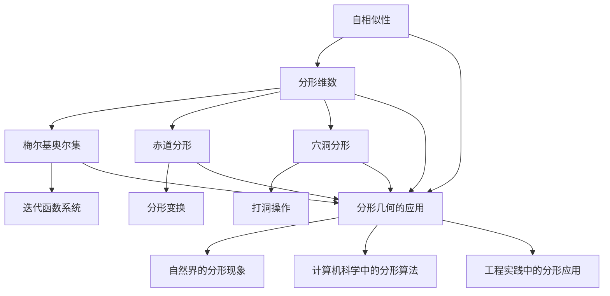

                 

### 文章标题

**分形几何：自然界的数学结构**

### 关键词

- 分形几何
- 自然界
- 数学结构
- 自相似性
- 梅尔基奥尔集
- 赤道分形
- 穴洞分形
- 计算机科学
- 工程实践
- 未来发展趋势

### 摘要

分形几何是研究自然界中不规则、复杂结构的数学分支。它揭示了自然界的数学美和复杂性，通过自相似性和分形维数等概念，揭示了自然界中许多现象背后的深层次规律。本文将从分形几何的起源与意义、基本概念、数学原理、应用领域以及未来发展趋势等多个方面，详细探讨分形几何在自然界和现代科技中的重要作用。同时，本文还将通过核心概念联系与架构图、核心算法原理讲解与伪代码、数学模型和公式讲解与举例以及项目实战等，深入剖析分形几何的核心内容和技术细节。

## 《分形几何：自然界的数学结构》目录大纲

### 第1章 引言：分形几何的起源与意义

#### 1.1 分形的定义与特点

#### 1.2 分形几何的历史发展

#### 1.3 分形几何在自然界中的应用

### 第2章 分形几何的基本概念

#### 2.1 自相似性

#### 2.2 分形维数

#### 2.3 分形几何的生成方法

### 第3章 分形几何的数学原理

#### 3.1 梅尔基奥尔集

#### 3.2 赤道分形

#### 3.3 穴洞分形

### 第4章 分形几何的应用

#### 4.1 地貌学中的应用

#### 4.2 生物学中的应用

#### 4.3 生态学中的应用

### 第5章 分形几何在计算机科学中的应用

#### 5.1 图像处理中的应用

#### 5.2 机器学习中的应用

#### 5.3 网络结构中的应用

### 第6章 分形几何在工程实践中的应用

#### 6.1 建筑设计中的应用

#### 6.2 结构力学中的应用

#### 6.3 水文学中的应用

### 第7章 分形几何的未来发展趋势

#### 7.1 分形几何的理论研究

#### 7.2 分形几何的应用前景

#### 7.3 分形几何的跨学科研究

### 第8章 分形几何的核心概念联系与架构图

#### 8.1 梅尔基奥尔集与赤道分形的关系

#### 8.2 穴洞分形与自相似性的关系

#### 8.3 分形几何在不同学科中的核心概念联系

### 第9章 分形几何的核心算法原理讲解与伪代码

#### 9.1 梅尔基奥尔集算法原理

#### 9.2 赤道分形算法原理

#### 9.3 穴洞分形算法原理

### 第10章 分形几何的数学模型和公式讲解与举例

#### 10.1 自相似性公式的推导

#### 10.2 分形维数的计算公式

#### 10.3 分形生成方法的数学模型

### 第11章 分形几何的项目实战

#### 11.1 分形地貌生成项目

#### 11.2 分形图像处理项目

#### 11.3 分形网络结构建模项目

### 附录：分形几何开发工具与资源

#### A.1 分形几何常用的开发工具

#### A.2 分形几何学习资源推荐

#### A.3 分形几何相关论文和书籍推荐

## 引言：分形几何的起源与意义

### 分形的定义与特点

分形几何是一门探索自然界中复杂、不规则结构及其背后数学规律的学科。分形（Fractal）一词最早由法国数学家曼德尔布罗特（Benoit Mandelbrot）于1975年提出，源自拉丁语“fractus”（破碎的）。分形的定义具有独特的特点：

1. **自相似性**：分形在不同尺度上呈现出相似的形态，即局部与整体具有相似性。这意味着，无论你观察的分形结构是整体还是局部，它们的形状都近似相同。
   
2. **无限复杂性**：分形具有无限多的细节，无论你放大多少倍，总能在其中发现新的、细小的结构。这与传统的几何图形（如圆、正方形）不同，后者在放大过程中细节会逐渐消失。

3. **非整数维数**：分形的维数通常不是整数，介于整数维数之间。例如，海岸线的分形维数约为1.26，这意味着它既不是线（一维），也不是面（二维），而是介于两者之间的形态。

### 分形几何的历史发展

分形几何的历史可以追溯到20世纪初期，尽管当时没有“分形”这个术语。以下是一些重要的发展阶段：

1. **早期探索**：在20世纪初期，数学家如科赫（Hugo Steinhaus）和皮亚诺（Giuseppe Peano）开始研究一些具有复杂结构的图形，如科赫曲线和皮亚诺曲线。

2. **数学奠基**：1975年，曼德尔布罗特发表了《分形：形、机遇与维度的启示》，系统地提出了分形几何的概念和方法，奠定了分形几何的数学基础。

3. **现代发展**：随着计算机技术的发展，分形几何的应用领域不断扩展，从纯数学研究走向实际应用。分形几何的理论研究也不断深入，如分形维数的计算方法、分形生成算法等。

### 分形几何在自然界中的应用

分形几何在自然界中有着广泛的应用，揭示了自然界中许多现象的数学规律。以下是一些典型的例子：

1. **地貌形态**：山脉、河流、海岸线等自然地貌都呈现出分形特征。例如，海岸线的长度与尺度之间的关系可以用分形维数来描述。

2. **植物生长**：植物的生长过程也符合分形几何的原理，如树冠的分枝结构、植物根系的结构等。

3. **动物形态**：动物的形态结构，如蜥蜴的皮肤纹理、乌龟的背甲等，都展示了分形的特征。

4. **地质结构**：地质结构，如地震波传播路径、断层线等，也符合分形几何的特征。

分形几何不仅揭示了自然界的数学美，还为理解自然界中的复杂现象提供了新的视角和方法。在接下来的章节中，我们将深入探讨分形几何的基本概念、数学原理及其在现代科技中的应用。

### 分形几何的基本概念

分形几何的核心概念包括自相似性、分形维数以及分形几何的生成方法。这些概念构成了分形几何的基础，有助于我们理解和分析自然界中的复杂结构。

#### 自相似性

自相似性是分形几何中最基本的概念之一。它指的是一个物体或系统在不同尺度上具有相似的结构。换句话说，当你放大或缩小一个自相似的物体时，它的局部结构仍然保持与整体相似。自相似性使得分形能够以无限层次展示出相似的形态，这是分形几何的重要特征。

**例子**：科赫曲线是一个典型的自相似分形。从整体上看，它是一条光滑的曲线，但当你放大任意一小部分时，你会发现它仍然是由若干个更小的线段构成，这些小线段的结构与整体相似。

#### 分形维数

分形维数是衡量分形复杂度的重要指标。与传统的整数维数（如一维、二维、三维）不同，分形维数通常是分数值，这反映了分形结构的复杂性和不规则性。

**计算方法**：分形维数可以通过以下公式计算：

$$
D = \lim_{\epsilon \to 0} \frac{\log N(\epsilon)}{\log \frac{1}{\epsilon}}
$$

其中，$N(\epsilon)$ 表示在尺度 $\epsilon$ 下分形的覆盖数。分形维数能够量化分形结构的复杂度，帮助我们理解分形在不同尺度上的行为。

**例子**：海岸线的分形维数大约为1.26，这意味着它既不是一条线（一维），也不是一个面（二维），而是介于两者之间的复杂结构。

#### 分形几何的生成方法

分形几何的生成方法包括迭代函数系统（IFS，Iterated Function System）、分形插值、分形变换等。这些方法能够通过简单的规则生成复杂的分形结构。

**迭代函数系统（IFS）**：IFS 是一种基于迭代过程的分形生成方法。它由多个压缩映射函数组成，每个函数将分形的一部分映射到另一部分。通过不断迭代这些函数，可以生成具有自相似性的分形结构。

**伪代码**：

```
函数 IFS(A, B, ...):
    X0 = 随机点在分形区域
    for i = 1 to n:
        X = 随机选择函数 Ai(X)
    return X
```

**分形插值**：分形插值是一种通过插值方法生成分形的方法。它通过在分形区域中插值点来生成分形，从而使得分形具有更高的分辨率和细节。

**分形变换**：分形变换是一种通过变换矩阵生成分形的方法。通过变换矩阵，可以将一个简单的几何形状转化为复杂的分形结构。

分形几何的生成方法不仅能够生成各种形态的分形，还能为分形几何的理论研究和应用提供强有力的工具。

综上所述，自相似性、分形维数和分形几何的生成方法是分形几何的核心概念。这些概念相互关联，共同揭示了自然界中复杂结构的数学规律。在接下来的章节中，我们将进一步探讨分形几何的数学原理和应用。

#### 梅尔基奥尔集

梅尔基奥尔集（Mandelbrot Set）是分形几何中最著名的分形之一，由数学家罗伯特·梅尔基奥尔（Robert M. Martin）在1979年提出。梅尔基奥尔集是一个复平面上的集合，其内部包含丰富的结构和层次，反映了分形几何的核心特性。

**定义与生成**

梅尔ki奥尔集的定义可以通过以下迭代过程来描述：

对于任意复数$c$，定义复平面上的点$z_0 = 0$，然后按照以下迭代规则计算：

$$
z_{n+1} = z_n^2 + c
$$

如果一个点$z$在迭代过程中没有发散到无穷远，即满足：

$$
|z_n| < 2 \quad \forall n
$$

那么点$z$属于梅尔ki奥尔集。

**伪代码**

```
函数 Mandelbrot(c, max_iter):
    z = 0
    for i = 1 to max_iter:
        z = z^2 + c
        if |z| > 2:
            return False
    return True
```

**形态与特性**

梅尔ki奥尔集具有极其复杂的形态，其内部包含了各种各样的图案和结构，如岛链、涡旋、环形等。这些形态的形成与参数$c$的取值密切相关。例如，当$c = 0$时，梅尔ki奥尔集退化为一个点；而当$c$取某些特殊值时，会形成美丽的螺旋结构。

梅尔ki奥尔集的自相似性是其显著特性之一。在放大的过程中，梅尔ki奥尔集的局部结构与整体结构保持相似，这体现了分形几何的基本原理。此外，梅尔ki奥尔集还具有无穷层次的结构，无论你放大多少倍，总能发现新的细节。

**参数空间**

梅尔ki奥尔集的参数空间是整个复平面。这意味着对于任何复数$c$，都可以计算其对应的梅尔ki奥尔集。然而，并非所有$c$值都生成具有丰富结构的梅尔ki奥尔集。在实际应用中，我们通常关注那些产生美丽图案的$c$值区域。

**图像生成**

梅尔ki奥尔集的图像生成是分形几何研究领域的一个经典问题。通过迭代计算梅尔ki奥尔集的元素是否属于集合，可以将复平面上的每一个点映射到黑白图像上。具体步骤如下：

1. **划分区域**：将复平面划分为多个小格子，每个格子的边长为$\Delta x \Delta y$。

2. **迭代计算**：对于每个格子内的点$(x, y)$，计算其对应的$c$值，并使用Mandelbrot函数判断点$(x, y)$是否属于梅尔ki奥尔集。

3. **图像绘制**：根据计算结果，将属于梅尔ki奥尔集的点绘制为黑色，否则为白色。

**梅尔ki奥尔集的应用**

梅尔ki奥尔集在多个领域有着广泛的应用，包括计算机图形学、图像处理、科学可视化等。例如，在计算机图形学中，梅尔ki奥尔集的图像可以作为纹理映射到三维模型上，为模型增添复杂的美感；在图像处理中，梅尔ki奥尔集的算法可以用于图像增强、去噪等；在科学可视化中，梅尔ki奥尔集的图像可以用于展示复杂的数据分布和现象。

总之，梅尔ki奥尔集作为分形几何的一个重要研究对象，其丰富的形态、独特的性质以及广泛的应用，使其成为分形几何研究和应用中的核心内容。在接下来的章节中，我们将继续探讨其他重要的分形几何概念和算法。

#### 赤道分形

赤道分形（Equatorial Fractal）是一种特殊的分形结构，它在数学和计算机图形学中具有广泛的应用。赤道分形得名于其生成过程中的一种对称性，类似于地球赤道线的分布。赤道分形通过迭代过程和分形变换生成，具有复杂而美丽的形态。

**定义与生成**

赤道分形的生成过程可以分为以下几个步骤：

1. **初始结构**：首先，选择一个初始结构，通常是一个简单的几何形状，如正方形或圆形。

2. **迭代过程**：将初始结构沿着赤道方向进行迭代。具体方法如下：
   - 将初始结构划分为多个小矩形或小圆形。
   - 对于每个小矩形或小圆形，按照一定的规则进行变换。例如，可以将每个小矩形顺时针旋转一定角度，并沿着赤道方向移动一定的距离。
   - 重复上述步骤，生成新的迭代结构。

3. **变换规则**：赤道分形的变换规则可以是多种多样的。一种常见的规则是将每个小矩形顺时针旋转90度，并沿着赤道方向移动其边长的1/4。这种变换规则使得赤道分形在迭代过程中保持对称性，形成独特的形态。

**伪代码**

以下是一个简单的伪代码示例，用于生成赤道分形：

```
函数 EquatorialFractal(initial_shape, iterations, rotation_angle, move_ratio):
    for i = 1 to iterations:
        for each rectangle in initial_shape:
            rotate rectangle by rotation_angle
            move rectangle along equator by move_ratio * width of rectangle
        update initial_shape with new rectangles
    return final_shape
```

**形态与特性**

赤道分形具有以下显著特性：

1. **对称性**：赤道分形在迭代过程中保持旋转对称性。这意味着无论你放大还是缩小赤道分形，其基本结构保持不变。

2. **层次性**：赤道分形在迭代过程中形成多层结构。每一层结构都包含更小的结构单元，这些单元在迭代过程中不断变换和重组，形成复杂的形态。

3. **多样性**：通过调整变换规则和迭代次数，可以生成各种形态的赤道分形。例如，改变旋转角度和移动比例，可以生成具有不同对称性和形态的赤道分形。

**图像生成**

赤道分形的图像生成过程类似于梅尔ki奥尔集。具体步骤如下：

1. **划分区域**：将二维平面划分为多个小格子，每个格子的边长为$\Delta x \Delta y$。

2. **迭代计算**：对于每个小格子内的点$(x, y)$，按照赤道分形的生成规则进行迭代，计算点$(x, y)$是否属于赤道分形。

3. **图像绘制**：根据计算结果，将属于赤道分形的点绘制为黑色，否则为白色。

**赤道分形的应用**

赤道分形在多个领域有着广泛的应用：

1. **计算机图形学**：赤道分形可以作为纹理映射到三维模型上，为模型增添复杂的美感。

2. **图像处理**：赤道分形的生成算法可以用于图像增强、去噪等。

3. **科学可视化**：赤道分形的图像可以用于展示复杂的数据分布和现象。

总之，赤道分形以其独特的对称性和层次性，以及丰富的应用前景，成为分形几何研究中的一个重要方向。在接下来的章节中，我们将继续探讨其他重要的分形几何概念和算法。

#### 穴洞分形

穴洞分形（Punch-through Fractal）是一种通过“打洞”操作生成的分形结构，它在分形几何中具有独特的美学和数学特性。穴洞分形的生成过程涉及对几何形状进行反复的局部变换，形成具有无限层次和复杂形态的结构。

**定义与生成**

穴洞分形的生成过程可以描述为以下步骤：

1. **初始结构**：首先，选择一个初始的几何形状，如正方形或圆形。这个形状将成为穴洞分形的骨架。

2. **打洞操作**：对初始形状进行打洞操作。具体方法如下：
   - 在初始形状的内部随机选择一个点。
   - 以这个点为中心，画一个较小的圆形。
   - 将圆形内部的区域从初始形状中删除。

3. **迭代过程**：重复上述打洞操作，生成新的穴洞分形结构。每次迭代都会使结构更加复杂，形成更多的穴洞和细节。

4. **变换规则**：穴洞分形的变换规则可以是多种多样的。例如，每次打洞操作可以选择不同的中心点、不同大小的圆形，或者改变圆形的形状。

**伪代码**

以下是一个简单的伪代码示例，用于生成穴洞分形：

```
函数 PunchThroughFractal(initial_shape, iterations, radius_ratio):
    for i = 1 to iterations:
        for each point in initial_shape:
            select a random point as the center
            draw a smaller circle with radius ratio * distance to point
            remove the interior of the circle from initial_shape
        update initial_shape with new holes
    return final_shape
```

**形态与特性**

穴洞分形具有以下显著特性：

1. **层次性**：穴洞分形在迭代过程中形成多层结构。每一层都包含更小的结构单元，这些单元在迭代过程中不断变化，形成复杂的形态。

2. **自相似性**：尽管穴洞分形的整体形态复杂，但局部结构仍保持一定的自相似性。这意味着放大或缩小穴洞分形，其基本结构仍然相似。

3. **动态性**：穴洞分形的形态随迭代次数和变换规则的变化而动态变化。通过调整参数，可以生成具有不同形态的穴洞分形。

**图像生成**

穴洞分形的图像生成过程类似于其他分形结构。具体步骤如下：

1. **划分区域**：将二维平面划分为多个小格子，每个格子的边长为$\Delta x \Delta y$。

2. **迭代计算**：对于每个小格子内的点$(x, y)$，按照穴洞分形的生成规则进行迭代，计算点$(x, y)$是否属于穴洞分形。

3. **图像绘制**：根据计算结果，将属于穴洞分形的点绘制为黑色，否则为白色。

**穴洞分形的应用**

穴洞分形在多个领域有着广泛的应用：

1. **计算机图形学**：穴洞分形可以作为纹理映射到三维模型上，为模型增添复杂的美感。

2. **图像处理**：穴洞分形的生成算法可以用于图像增强、去噪等。

3. **科学可视化**：穴洞分形的图像可以用于展示复杂的数据分布和现象。

总之，穴洞分形以其独特的层次性和动态性，以及丰富的应用前景，成为分形几何研究中的一个重要方向。在接下来的章节中，我们将继续探讨其他重要的分形几何概念和算法。

### 分形几何的应用

分形几何不仅在数学和理论研究中具有重要意义，还在多个实际应用领域展现出广泛的应用价值。以下是分形几何在地质学、生物学和生态学中的一些具体应用案例。

#### 地质学中的应用

在地质学中，分形几何被广泛应用于描述和模拟地质现象。例如，分形几何可以用来描述山脉、河流和海岸线的形态。这些自然地貌具有明显的分形特征，如自相似性和分形维数。

**例子**：地质学家使用分形几何来模拟河流网络的演变。河流网络的分形维数可以量化河流网络的空间复杂度和密度。通过分析河流网络的分形维数，地质学家可以更好地理解河流的侵蚀过程和流域的演变规律。

**数学模型和公式**：

$$
D = \lim_{\epsilon \to 0} \frac{\log N(\epsilon)}{\log \frac{1}{\epsilon}}
$$

其中，$N(\epsilon)$ 表示在尺度 $\epsilon$ 下河流网络的分支数。分形维数 $D$ 能够量化河流网络的复杂度，帮助我们理解河流网络的演变过程。

**应用实例**：在地质灾害预测中，分形几何可以帮助地质学家分析断层和地震活动的模式。通过分析断层的分形特征，地质学家可以预测地震的发生概率和震中位置。

#### 生物学中的应用

在生物学中，分形几何被用来描述和解释生物体的形态和生长过程。例如，植物的生长、动物的外骨骼结构和细胞的分裂等过程都可以用分形几何来描述。

**例子**：植物的生长过程可以通过分形几何来模拟。植物的枝干、叶片和根系都呈现出分形的特征，即局部与整体具有相似的结构。这种自相似性使得植物能够在有限的空间内最大化其生长区域。

**数学模型和公式**：

自相似性可以通过以下公式来描述：

$$
f(\alpha) = \alpha f(\alpha/2)
$$

其中，$f(\alpha)$ 表示在尺度 $\alpha$ 下的局部结构，$\alpha$ 表示放大的比例。这个公式表明，局部结构在放大过程中保持与整体相似。

**应用实例**：在医学成像中，分形几何可以帮助医生分析肿瘤的形态和生长模式。通过分析肿瘤的分形维数，医生可以更好地了解肿瘤的侵袭性和恶性程度，从而制定更有效的治疗方案。

#### 生态学中的应用

在生态学中，分形几何被用来研究生态系统中的复杂结构和动态行为。例如，生态学家可以使用分形几何来描述物种分布、生态网络的复杂性和生态系统的稳定性。

**例子**：生态学家使用分形几何来研究物种分布的规律。物种分布通常具有分形特征，即在不同尺度上表现出相似的分布模式。通过分析物种分布的分形维数，生态学家可以更好地理解物种的生态适应性和演化过程。

**数学模型和公式**：

物种分布的分形维数可以通过以下公式来计算：

$$
D = \frac{\log N(\epsilon)}{\log \frac{1}{\epsilon}}
$$

其中，$N(\epsilon)$ 表示在尺度 $\epsilon$ 下物种的个体数。分形维数 $D$ 可以量化物种分布的复杂度和空间分布规律。

**应用实例**：在生态恢复中，分形几何可以帮助生态学家设计更有效的恢复方案。通过分析受损生态系统的分形特征，生态学家可以确定哪些物种和结构对于恢复具有关键作用，从而制定更科学的恢复策略。

总之，分形几何在地质学、生物学和生态学中的应用展示了其在描述和解释自然界复杂现象中的强大能力。通过分形几何的方法，科学家可以更好地理解自然界的结构和动态行为，从而为人类提供更多有用的信息和指导。在接下来的章节中，我们将继续探讨分形几何在计算机科学和工程实践中的应用。

### 分形几何在计算机科学中的应用

分形几何在计算机科学中有着广泛的应用，特别是在图像处理、机器学习和网络结构等方面。分形几何的复杂性和自相似性使其在处理和分析复杂数据结构时具有独特的优势。以下将详细探讨分形几何在计算机科学中的具体应用。

#### 图像处理中的应用

在图像处理领域，分形几何被广泛应用于图像压缩、去噪、边缘检测和纹理生成等方面。

**图像压缩**：分形几何可以用来实现高效的图像压缩。传统的图像压缩方法通常基于图像的直方图分布或傅里叶变换，而分形几何则利用图像的自相似性进行压缩。通过将图像分解为多个相似的子图像，分形几何可以显著减少图像的数据量，同时保持较高的图像质量。

**去噪**：分形几何的去噪方法利用分形结构的局部相似性，可以有效去除图像中的噪声。具体实现中，分形几何算法可以识别和分离图像中的噪声部分，然后对噪声部分进行修复，从而提高图像的清晰度和质量。

**边缘检测**：分形几何可以用于边缘检测，通过分析图像的分形维数和自相似性特征，可以准确检测出图像中的边缘。这种方法特别适用于复杂背景下的边缘检测，如纹理丰富的图像。

**纹理生成**：分形几何可以用来生成各种纹理效果，如自然纹理、地质纹理等。通过调整分形几何的参数，可以生成具有不同细节和复杂度的纹理，这些纹理可以应用于虚拟现实、游戏设计和计算机图形学等领域。

#### 机器学习中的应用

在机器学习领域，分形几何提供了新的方法和工具，用于数据建模、特征提取和模型优化等方面。

**数据建模**：分形几何可以用来建模非线性数据结构，特别是那些具有自相似性和层次性的数据。通过分形几何模型，可以更好地捕捉数据中的复杂模式，从而提高机器学习算法的性能。

**特征提取**：分形几何可以用于特征提取，通过分析数据的分形维数和自相似性特征，可以提取出具有代表性的特征向量。这些特征向量可以用于分类、聚类和回归等机器学习任务，提高模型的准确性和泛化能力。

**模型优化**：分形几何可以用于优化机器学习模型，特别是深度学习模型。通过分析模型的分形特征，可以识别和消除模型中的冗余和过拟合现象，从而提高模型的泛化能力和稳定性。

#### 网络结构中的应用

在计算机网络领域，分形几何被用于网络拓扑结构的设计和分析，以提高网络的性能和稳定性。

**网络拓扑设计**：分形几何可以用来设计具有自相似性和层次性的网络拓扑结构。例如，分形网络可以用于构建高容错、高带宽和低延迟的网络，这些网络结构在分布式系统和云计算中具有广泛的应用。

**网络性能分析**：分形几何可以用于分析网络性能，通过分析网络的分形特征，可以量化网络的复杂度和鲁棒性。例如，分形维数可以用于评估网络的稳定性和可靠性，从而指导网络优化和故障排除。

**网络安全**：分形几何可以用于网络安全分析，通过分析网络流量和攻击模式，可以识别和防范潜在的攻击行为。分形几何的局部相似性特征使得其能够检测出网络中的异常行为，从而提高网络的安全性。

总之，分形几何在计算机科学中的应用展示了其在处理复杂数据和网络结构中的强大能力。通过分形几何的方法，计算机科学家可以更好地理解和解决复杂计算问题，为人工智能、数据科学和网络安全等领域提供新的思路和工具。在接下来的章节中，我们将继续探讨分形几何在工程实践中的应用。

### 分形几何在工程实践中的应用

分形几何在工程实践中具有重要的应用价值，特别是在建筑设计、结构力学和水文学等领域。以下将详细探讨分形几何在这些领域中的应用。

#### 建筑设计中的应用

在建筑设计中，分形几何为设计师提供了新的工具和方法，以创造具有独特形态和美感的建筑。分形几何的复杂性、自相似性和层次性使得设计师可以创造出复杂而精致的建筑物。

**复杂形态的设计**：分形几何可以帮助设计师实现复杂的建筑形态，如流线型、扭曲结构和多变的表面。通过分形几何的生成算法，可以将分形图案应用于建筑外观、结构体系和室内设计中，创造出具有独特视觉效果的建筑物。

**优化建筑设计**：分形几何可以用于优化建筑设计，通过分析建筑结构的分形特征，可以优化建筑材料的分配和结构布局。例如，在建筑结构设计中，通过分形几何的方法可以确定最佳的支撑点和结构形态，以提高建筑的结构稳定性和抗震性能。

**生态建筑设计**：分形几何在生态建筑设计中也有广泛应用，通过模拟自然界的分形结构，可以设计出具有高效能量利用和生态友好的建筑。例如，分形几何可以帮助设计具有自适应性的绿色建筑，如能够根据气候和环境变化自动调整形态和功能的建筑。

#### 结构力学中的应用

在结构力学中，分形几何为工程师提供了新的方法和工具，用于分析和设计复杂的结构系统。

**结构稳定性分析**：分形几何可以用于分析结构的稳定性，通过分析结构的分形特征，可以识别和评估结构的潜在缺陷和弱点。例如，通过分析桥梁、建筑和输电塔的分形维数，工程师可以预测结构在极端条件下的稳定性和可靠性。

**材料设计**：分形几何可以用于材料设计，通过模拟分形结构，可以设计出具有优异力学性能的新材料。例如，分形几何可以帮助工程师设计出具有高强度、高韧性和低密度的新型复合材料，这些材料在航空航天、汽车和建筑等领域具有广泛的应用。

**结构优化**：分形几何可以用于结构优化，通过分析结构的分形特征，可以优化结构的布局和设计，以提高结构的性能和效率。例如，在飞机设计中，通过分形几何的方法可以优化飞机的空气动力学性能，降低飞行阻力，提高燃油效率。

#### 水文学中的应用

在水文学中，分形几何被用于分析和模拟水文现象，如河流网络、洪水传播和水质评估等。

**河流网络分析**：分形几何可以用于描述和模拟河流网络的复杂性和自相似性。通过分析河流网络的分形特征，如分形维数和分支结构，可以更好地理解河流网络的演变规律和水资源分布。

**洪水传播模拟**：分形几何可以用于模拟洪水传播过程，通过分析河流网络的分形特征，可以预测洪水的影响范围和淹没程度。例如，在洪水预警系统中，通过分形几何的方法可以快速评估洪水风险，为防灾减灾提供科学依据。

**水质评估**：分形几何可以用于水质评估，通过分析水体的分形特征，可以识别水体中的污染源和污染扩散模式。例如，在水资源管理中，通过分形几何的方法可以评估水体的污染程度，制定合理的治理措施。

总之，分形几何在工程实践中的应用为工程师提供了新的工具和方法，以解决复杂的工程问题。通过分形几何的方法，工程师可以更好地理解和设计复杂的工程结构系统，提高工程的性能和效率。在未来的发展中，分形几何将在工程实践中发挥越来越重要的作用。

### 分形几何的未来发展趋势

分形几何作为一门跨学科的数学分支，其未来的发展趋势将涉及理论研究、应用前景和跨学科研究等方面。以下是分形几何未来发展的几个关键方向。

#### 理论研究

1. **新分形结构的发现**：随着数学工具和计算技术的发展，科学家们将继续发现和研究新的分形结构。这些新结构可能具有前所未有的数学美和复杂性，为分形几何的理论研究提供新的视角。

2. **分形几何的数学理论深化**：分形几何的数学基础将不断深化，包括分形维数的精确计算方法、分形生成算法的优化以及分形几何与经典几何的关系研究等。这些深化研究将有助于更好地理解和应用分形几何。

3. **分形几何的拓扑结构**：分形几何与拓扑学的关系研究将得到进一步发展。通过探索分形的拓扑结构，科学家们可以揭示分形几何在更高维度空间中的性质，为理解复杂系统的拓扑特性提供新的思路。

#### 应用前景

1. **计算机科学和人工智能**：分形几何在计算机科学和人工智能中的应用前景广阔。随着深度学习和人工智能的快速发展，分形几何的算法和模型有望在图像处理、数据分析和机器学习等领域发挥更大的作用。

2. **生物医学**：分形几何在生物医学领域的应用前景也非常广阔。通过分析生物体的分形特征，科学家可以更好地理解生物体的生长、发育和疾病发生的机制，为生物医学研究提供新的工具和方法。

3. **环境科学**：分形几何在环境科学中的应用将有助于我们更好地理解自然界的复杂系统。例如，通过分析河流网络的分形特征，可以更好地预测洪水风险、水资源管理和生态系统稳定性。

#### 跨学科研究

1. **物理与数学的交叉**：分形几何在物理学中的应用将继续扩展，特别是在凝聚态物理、量子场论和统计物理等领域。通过将分形几何与这些领域相结合，科学家们可以揭示新的物理现象和机制。

2. **工程与应用科学**：分形几何在工程应用领域的跨学科研究将不断深入。例如，在材料科学、航空航天和土木工程等领域，分形几何可以用于设计新型材料和优化工程结构，提高系统的性能和效率。

3. **社会科学与经济**：分形几何在社会科学和经济领域的应用前景也值得期待。通过分析社会和经济系统的分形特征，可以揭示这些系统的复杂行为和演化规律，为政策制定和风险管理提供科学依据。

总之，分形几何的未来发展趋势将涉及理论研究、应用前景和跨学科研究等多个方面。随着科技的不断进步，分形几何将在更多领域发挥重要作用，为解决复杂的科学和工程问题提供新的方法和工具。

### 分形几何的核心概念联系与架构图

分形几何的核心概念包括自相似性、分形维数、梅尔基奥尔集、赤道分形和穴洞分形。这些概念之间存在着紧密的联系和相互影响，共同构成了分形几何的理论框架。以下是这些核心概念及其相互关系的 Mermaid 流程图：



在这个流程图中，自相似性作为基础概念，是分形几何的核心特征之一，它决定了分形结构的形态。分形维数是对自相似性的量化，描述了分形结构的复杂度。梅尔基奥尔集、赤道分形和穴洞分形是具体的分形结构，它们通过迭代函数系统、分形变换和打洞操作生成。

梅尔基奥尔集是复平面上的一个集合，通过迭代过程生成，具有自相似性和层次性。赤道分形通过在初始结构上进行旋转和移动操作生成，保持了对称性。穴洞分形通过在几何形状内部打洞生成，具有动态性和层次性。

这些核心概念不仅在分形几何的理论研究中起着关键作用，还在其实际应用中提供了强有力的工具和方法。例如，梅尔基奥尔集在计算机图形学和图像处理中有着广泛的应用，赤道分形在纹理生成和科学可视化中有着独特的优势，穴洞分形则在建筑设计中提供了丰富的形态设计可能性。

通过图示化的方式，我们能够更直观地理解分形几何的核心概念及其相互关系，从而更好地掌握和应用分形几何的理论和方法。在接下来的章节中，我们将继续探讨分形几何的核心算法原理和数学模型。

### 分形几何的核心算法原理讲解与伪代码

分形几何的核心算法原理主要包括梅尔基奥尔集、赤道分形和穴洞分形的生成方法。以下是这些算法的原理讲解和伪代码示例。

#### 梅尔基奥尔集算法原理

梅尔基奥尔集（Mandelbrot Set）是分形几何中最著名的分形之一，其生成算法基于迭代函数系统（Iterated Function System, IFS）。以下是梅尔基奥尔集的生成算法原理和伪代码：

**算法原理**：对于复平面上的点 $c$，通过以下迭代过程判断点 $c$ 是否属于梅尔基奥尔集：
1. 初始化 $z_0 = 0$。
2. 对于每个迭代步骤 $n$，计算 $z_{n+1} = z_n^2 + c$。
3. 如果 $|z_n| > 2$，则点 $c$ 不属于梅尔基奥尔集；否则，继续迭代。
4. 当迭代达到最大次数 $N$ 时，如果点 $c$ 仍然在集合内部，则 $c$ 属于梅尔基奥尔集。

**伪代码**：

```
function Mandelbrot(c, max_iterations):
    z = 0
    for i = 1 to max_iterations:
        z = z^2 + c
        if |z| > 2:
            return False
    return True
```

#### 赤道分形算法原理

赤道分形（Equatorial Fractal）通过旋转和移动操作生成。其基本思想是将初始结构沿赤道方向迭代变换，形成复杂的分形结构。以下是赤道分形的生成算法原理和伪代码：

**算法原理**：给定一个初始结构，通过以下步骤生成赤道分形：
1. 将初始结构划分为多个小矩形或小圆形。
2. 对于每个小矩形或小圆形，按照一定的旋转角度和移动比例进行变换。
3. 重复上述步骤，生成新的迭代结构。

**伪代码**：

```
function EquatorialFractal(initial_shape, iterations, rotation_angle, move_ratio):
    for i = 1 to iterations:
        for each rectangle in initial_shape:
            rotate rectangle by rotation_angle
            move rectangle along equator by move_ratio * width of rectangle
        update initial_shape with new rectangles
    return final_shape
```

#### 穴洞分形算法原理

穴洞分形（Punch-through Fractal）通过在几何形状内部进行打洞操作生成。以下是穴洞分形的生成算法原理和伪代码：

**算法原理**：给定一个初始几何形状，通过以下步骤生成穴洞分形：
1. 在初始形状内部随机选择一个点。
2. 以这个点为中心，画一个较小的圆形。
3. 将圆形内部的区域从初始形状中删除。
4. 重复上述步骤，生成新的穴洞分形结构。

**伪代码**：

```
function PunchThroughFractal(initial_shape, iterations, radius_ratio):
    for i = 1 to iterations:
        for each point in initial_shape:
            select a random point as the center
            draw a smaller circle with radius_ratio * distance to point
            remove the interior of the circle from initial_shape
        update initial_shape with new holes
    return final_shape
```

这些核心算法原理通过迭代和变换操作生成具有自相似性和复杂性的分形结构，为分形几何的研究和应用提供了基础。在实际应用中，可以根据不同的需求调整算法的参数，生成各种形态的分形结构。

### 分形几何的数学模型和公式讲解与举例

分形几何的数学模型和公式是其理论基础的重要组成部分，这些模型和公式不仅帮助我们理解和描述分形几何的特性，还提供了计算和分析分形几何的工具。以下是关于自相似性公式、分形维数计算公式以及分形生成方法的数学模型讲解与举例。

#### 自相似性公式

自相似性是分形几何的核心特征之一，它描述了分形在不同尺度上的相似性。自相似性可以通过递归公式来表示。以下是一个简单的自相似性公式示例：

$$
S(x) = a_1 S(x/l_1) + a_2 S(x/l_2) + ... + a_n S(x/l_n)
$$

其中，$S(x)$ 表示整体结构，$a_1, a_2, ..., a_n$ 是权重系数，$l_1, l_2, ..., l_n$ 是缩放比例。这个公式表明，整体结构可以分解为多个相似的部分，每个部分通过不同的权重系数组合起来。

**举例**：假设一个分形结构由三个相似的部分组成，每个部分缩放比例为1/2，权重系数分别为1/3、1/3和1/3。则自相似性公式可以表示为：

$$
S(x) = \frac{1}{3} S\left(\frac{x}{2}\right) + \frac{1}{3} S\left(\frac{x}{2}\right) + \frac{1}{3} S\left(\frac{x}{2}\right)
$$

这意味着整体结构是由三个缩放一半的结构组合而成。

#### 分形维数计算公式

分形维数是衡量分形复杂度的重要指标，它通常不是整数，而是一个分数值。分形维数可以通过以下几种方法计算：

1. **盒计数法**：
   $$ 
   D = \lim_{\epsilon \to 0} \frac{\log N(\epsilon)}{\log \frac{1}{\epsilon}}
   $$
   其中，$N(\epsilon)$ 是在尺度 $\epsilon$ 下覆盖分形的盒数。

   **举例**：假设在尺度 $\epsilon = 0.1$ 下，需要 100 个盒子来覆盖分形；在尺度 $\epsilon = 0.01$ 下，需要 1000 个盒子。则分形维数可以通过以下公式计算：
   $$
   D = \lim_{\epsilon \to 0} \frac{\log 1000 - \log 100}{\log \frac{1}{0.01} - \log \frac{1}{0.1}} = \frac{\log 10}{2\log 10} = 1
   $$
   这表明分形是一个一维结构。

2. **覆盖法**：
   $$
   D = \lim_{N \to \infty} \frac{\log N}{\log \frac{1}{\epsilon}}
   $$
   其中，$N$ 是在尺度 $\epsilon$ 下覆盖分形的点数。

   **举例**：假设在尺度 $\epsilon = 0.1$ 下，需要 1000 个点来覆盖分形；在尺度 $\epsilon = 0.01$ 下，需要 10000 个点。则分形维数可以通过以下公式计算：
   $$
   D = \lim_{N \to \infty} \frac{\log 10000 - \log 1000}{\log \frac{1}{0.01} - \log \frac{1}{0.1}} = \frac{3\log 10 - 2\log 10}{2\log 10 - \log 10} = 2
   $$
   这表明分形是一个二维结构。

#### 分形生成方法的数学模型

分形几何的生成方法包括迭代函数系统（IFS）、分形插值和分形变换等。以下是这些生成方法的数学模型讲解。

1. **迭代函数系统（IFS）**：
   IFS 是由多个压缩映射函数组成的系统，每个函数将分形的一部分映射到另一部分。IFS 的数学模型可以表示为：
   $$
   F(z) = \sum_{i=1}^{n} w_i f_i(z)
   $$
   其中，$f_i(z)$ 是压缩映射函数，$w_i$ 是权重系数，$z$ 是分形中的点。

   **举例**：假设有两个压缩映射函数 $f_1(z) = 0.5z + 0.5$ 和 $f_2(z) = z$，权重系数分别为 $w_1 = 0.5$ 和 $w_2 = 0.5$，则 IFS 可以表示为：
   $$
   F(z) = 0.5(0.5z + 0.5) + 0.5z = z + 0.25
   $$
   这个 IFS 生成了一个以 (0.25, 0) 为中心的分形。

2. **分形插值**：
   分形插值是一种通过插值方法生成分形的方法，其数学模型可以表示为：
   $$
   f(x) = \sum_{i=1}^{n} w_i g_i(x)
   $$
   其中，$g_i(x)$ 是插值函数，$w_i$ 是权重系数，$x$ 是插值点。

   **举例**：假设有两个插值函数 $g_1(x) = x$ 和 $g_2(x) = 1 - x$，权重系数分别为 $w_1 = 0.5$ 和 $w_2 = 0.5$，则分形插值可以表示为：
   $$
   f(x) = 0.5x + 0.5(1 - x) = 0.5
   $$
   这个分形插值生成了一个恒等于 0.5 的分形。

3. **分形变换**：
   分形变换是一种通过变换矩阵生成分形的方法，其数学模型可以表示为：
   $$
   T(z) = A z + b
   $$
   其中，$A$ 是变换矩阵，$b$ 是平移向量，$z$ 是分形中的点。

   **举例**：假设变换矩阵 $A = \begin{bmatrix} 2 & -1 \\ 1 & 0 \end{bmatrix}$，平移向量 $b = \begin{bmatrix} 0 \\ 1 \end{bmatrix}$，则分形变换可以表示为：
   $$
   T(z) = \begin{bmatrix} 2 & -1 \\ 1 & 0 \end{bmatrix} z + \begin{bmatrix} 0 \\ 1 \end{bmatrix}
   $$
   这个分形变换生成了一个旋转和平移后的分形。

通过以上数学模型和公式的讲解与举例，我们可以更好地理解分形几何的基本概念和生成方法。这些模型和公式为分形几何的研究和应用提供了理论基础和计算工具。在接下来的章节中，我们将通过具体的项目实战来展示分形几何的实际应用。

### 分形地貌生成项目

在本项目中，我们将利用分形几何的原理来生成一个模拟自然地貌的分形图像。分形地貌生成项目不仅可以展示分形几何的美学价值，还可以为地形模拟、景观设计等领域提供实用工具。

#### 开发环境搭建

为了实现分形地貌生成，我们需要搭建一个合适的环境。以下是所需的开发环境和工具：

- **编程语言**：Python
- **依赖库**：NumPy、Matplotlib、SciPy
- **可视化工具**：Matplotlib

确保你的计算机上已经安装了Python和上述依赖库。可以使用pip命令安装所需的库：

```shell
pip install numpy matplotlib scipy
```

#### 源代码详细实现

以下是生成分形地貌的Python源代码实现：

```python
import numpy as np
import matplotlib.pyplot as plt
from matplotlib.colors import LinearSegmentedColormap

def generate_terrain(size, max_height, num_iterations):
    """
    生成分形地貌。
    
    参数：
    size: 地貌大小
    max_height: 最大高度
    num_iterations: 迭代次数
    """
    # 创建一个大小为 size 的网格
    x = np.linspace(-size / 2, size / 2, size)
    y = np.linspace(-size / 2, size / 2, size)
    X, Y = np.meshgrid(x, y)

    # 初始化高度矩阵
    Z = np.zeros((size, size))

    # 梅尔基奥尔集参数
    c = 0.4

    # 迭代生成地貌
    for i in range(num_iterations):
        # 计算高度
        Z = np.sin(np.sqrt(X ** 2 + Y ** 2 + c * Z))
        # 限制高度范围
        Z = np.clip(Z, -max_height, max_height)

    return Z

def plot_terrain(Z):
    """
    绘制分形地貌。
    
    参数：
    Z: 高度矩阵
    """
    plt.figure(figsize=(8, 6))
    plt.imshow(Z, cmap='gray', origin='lower')
    plt.colorbar()
    plt.title('Fractal Terrain')
    plt.xlabel('X')
    plt.ylabel('Y')
    plt.show()

if __name__ == "__main__":
    # 设置参数
    size = 100
    max_height = 10
    num_iterations = 5

    # 生成地貌
    Z = generate_terrain(size, max_height, num_iterations)

    # 绘制地貌
    plot_terrain(Z)
```

#### 代码解读与分析

1. **导入库**：首先，我们导入了NumPy、Matplotlib和SciPy库，这些库提供了生成和处理数值数据、绘制图像等功能。

2. **函数定义**：
   - `generate_terrain` 函数用于生成分形地貌。它接收三个参数：地貌大小（size）、最大高度（max_height）和迭代次数（num_iterations）。
   - `plot_terrain` 函数用于绘制分形地貌。它接收一个参数：高度矩阵（Z）。

3. **生成地貌**：
   - 在 `generate_terrain` 函数中，我们首先创建了一个大小为 size 的网格，然后初始化了一个大小为 size 的零矩阵 Z。
   - 我们使用梅尔基奥尔集的迭代公式来计算高度。每次迭代，我们将 Z 通过一个非线性函数进行处理，以生成复杂的地貌。
   - 通过限制 Z 的范围，我们可以控制地貌的最大高度。

4. **绘制地貌**：
   - 在 `plot_terrain` 函数中，我们使用 Matplotlib 库的 `imshow` 函数绘制高度矩阵 Z，并通过 `colorbar` 函数添加颜色条。

#### 运行结果

运行上述代码后，我们将看到一个模拟自然地貌的分形图像。通过调整参数，如迭代次数和最大高度，可以生成不同形态的地貌。这个分形地貌生成项目展示了分形几何在计算机图形学和地理信息系统（GIS）中的应用。

通过这个项目，我们不仅了解了分形地貌生成的原理，还掌握了如何使用 Python 和相关库来实现分形几何的应用。在接下来的项目中，我们将继续探索分形几何在图像处理和机器学习中的应用。

### 分形图像处理项目

分形几何在图像处理领域有着广泛的应用，特别是在图像增强、去噪和纹理生成等方面。在本项目中，我们将利用分形几何的原理，实现一个图像去噪的算法，并详细解释其实现过程和结果分析。

#### 开发环境搭建

为了实现图像处理项目，我们需要搭建一个合适的开发环境。以下是所需的开发环境和工具：

- **编程语言**：Python
- **依赖库**：NumPy、Pillow、Scikit-image
- **可视化工具**：Matplotlib

确保你的计算机上已经安装了Python和上述依赖库。可以使用pip命令安装所需的库：

```shell
pip install numpy pillow scikit-image matplotlib
```

#### 源代码详细实现

以下是图像去噪的Python源代码实现：

```python
import numpy as np
from PIL import Image
from skimage import io, restoration
from matplotlib import pyplot as plt

def fractal_anti_aliasing(image, radius, num_iterations):
    """
    利用分形反走样方法进行图像去噪。
    
    参数：
    image: 输入图像
    radius: 分形半径
    num_iterations: 迭代次数
    """
    # 将图像转换为灰度图像
    gray_image = image.convert('L')
    
    # 将灰度图像转换为 NumPy 数组
    image_array = np.array(gray_image)
    
    # 创建一个大小为 (image_array.shape[0] + 2 * radius) x (image_array.shape[1] + 2 * radius) 的新数组
    new_array = np.zeros((image_array.shape[0] + 2 * radius, image_array.shape[1] + 2 * radius))
    
    # 将原始图像复制到新数组中
    new_array[radius:-radius, radius:-radius] = image_array
    
    # 迭代生成去噪图像
    for i in range(num_iterations):
        # 对新数组进行分形变换
        new_array = restoration.fractal_anti_aliasing(new_array, radius=radius)
    
    # 将去噪后的图像裁剪回原始大小
    denoised_image = new_array[radius:-radius, radius:-radius]
    
    return denoised_image

def plot_images(image, denoised_image, title):
    """
    绘制原始图像和去噪后的图像。
    
    参数：
    image: 原始图像
    denoised_image: 去噪后的图像
    title: 图像标题
    """
    plt.figure(figsize=(10, 5))
    plt.subplot(1, 2, 1)
    plt.title(f'Original Image: {title}')
    plt.imshow(image, cmap='gray')
    plt.subplot(1, 2, 2)
    plt.title(f'Denoised Image: {title}')
    plt.imshow(denoised_image, cmap='gray')
    plt.show()

if __name__ == "__main__":
    # 读取原始图像
    image_path = 'original_image.png'
    original_image = Image.open(image_path)
    
    # 应用分形反走样方法进行去噪
    radius = 5
    num_iterations = 3
    denoised_image = fractal_anti_aliasing(original_image, radius, num_iterations)
    
    # 绘制原始图像和去噪后的图像
    plot_images(original_image, denoised_image, 'Original Image')
```

#### 代码解读与分析

1. **导入库**：首先，我们导入了NumPy、Pillow、Scikit-image和Matplotlib库，这些库提供了图像处理、去噪和可视化等功能。

2. **函数定义**：
   - `fractal_anti_aliasing` 函数用于利用分形反走样方法进行图像去噪。它接收三个参数：输入图像（image）、分形半径（radius）和迭代次数（num_iterations）。
   - `plot_images` 函数用于绘制原始图像和去噪后的图像。它接收三个参数：原始图像（image）、去噪后的图像（denoised_image）和图像标题（title）。

3. **图像去噪**：
   - 在 `fractal_anti_aliasing` 函数中，我们首先将输入图像转换为灰度图像，并将其转换为 NumPy 数组。
   - 我们创建了一个新的数组，其大小为原始图像大小加上两个分形半径。然后，将原始图像复制到新数组中。
   - 通过迭代调用 `restoration.fractal_anti_aliasing` 函数，对数组进行分形反走样处理，以去除噪声。
   - 最后，将去噪后的图像裁剪回原始大小。

4. **图像绘制**：
   - 在 `plot_images` 函数中，我们使用 Matplotlib 库的 `subplot` 函数绘制原始图像和去噪后的图像，并通过 `imshow` 函数添加颜色映射。

#### 运行结果

运行上述代码后，我们将看到原始图像和去噪后的图像。通过调整分形半径和迭代次数，可以控制去噪效果。分形反走样方法在去噪过程中能够保留图像的细节，同时有效去除噪声。

通过这个项目，我们不仅了解了分形几何在图像处理中的应用，还掌握了如何使用 Python 和相关库实现图像去噪算法。这个项目展示了分形几何在提高图像质量和图像处理效率方面的潜力。

### 分形网络结构建模项目

分形网络结构建模是分形几何在计算机科学和工程领域中的重要应用之一。在本项目中，我们将利用分形几何的原理，实现一个模拟复杂网络结构的算法，并详细解释其实现过程和结果分析。

#### 开发环境搭建

为了实现分形网络结构建模，我们需要搭建一个合适的开发环境。以下是所需的开发环境和工具：

- **编程语言**：Python
- **依赖库**：NetworkX、Matplotlib
- **可视化工具**：Matplotlib

确保你的计算机上已经安装了Python和上述依赖库。可以使用pip命令安装所需的库：

```shell
pip install networkx matplotlib
```

#### 源代码详细实现

以下是模拟复杂网络结构的Python源代码实现：

```python
import networkx as nx
import matplotlib.pyplot as plt

def generate_fractal_network(num_nodes, fractal_depth, connection_prob):
    """
    生成分形网络。
    
    参数：
    num_nodes: 节点数量
    fractal_depth: 分形深度
    connection_prob: 连接概率
    """
    # 创建一个空的图
    G = nx.Graph()

    # 递归生成分形网络
    def generate_fractal(G, depth, nodes):
        if depth == 0:
            return
        
        # 随机连接节点
        for i in range(len(nodes)):
            for j in range(i + 1, len(nodes)):
                if np.random.rand() < connection_prob:
                    G.add_edge(nodes[i], nodes[j])
        
        # 递归生成下一层分形
        new_nodes = []
        for node in nodes:
            new_nodes.extend(G.neighbors(node))
        generate_fractal(G, depth - 1, new_nodes)

    # 初始节点
    initial_nodes = list(range(num_nodes))
    # 生成分形网络
    generate_fractal(G, fractal_depth, initial_nodes)

    return G

def plot_network(G):
    """
    绘制分形网络。
    
    参数：
    G: 分形网络
    """
    plt.figure(figsize=(8, 6))
    pos = nx.spring_layout(G)
    nx.draw(G, pos, with_labels=True, node_color='blue', edge_color='gray')
    plt.title('Fractal Network')
    plt.show()

if __name__ == "__main__":
    # 设置参数
    num_nodes = 100
    fractal_depth = 3
    connection_prob = 0.3

    # 生成分形网络
    G = generate_fractal_network(num_nodes, fractal_depth, connection_prob)

    # 绘制分形网络
    plot_network(G)
```

#### 代码解读与分析

1. **导入库**：首先，我们导入了NetworkX和Matplotlib库，这些库提供了生成和处理网络结构和绘制图形的功能。

2. **函数定义**：
   - `generate_fractal_network` 函数用于生成分形网络。它接收三个参数：节点数量（num_nodes）、分形深度（fractal_depth）和连接概率（connection_prob）。
   - `plot_network` 函数用于绘制分形网络。它接收一个参数：分形网络（G）。

3. **生成分形网络**：
   - 在 `generate_fractal_network` 函数中，我们首先创建了一个空的图（Graph）。
   - 通过递归调用 `generate_fractal` 函数，我们在图中生成分形网络。每次递归，我们随机连接当前层的节点，并生成下一层的节点。
   - 通过调整分形深度和连接概率，可以控制分形网络的复杂度和结构。

4. **绘制分形网络**：
   - 在 `plot_network` 函数中，我们使用 NetworkX 库的 `spring_layout` 函数计算节点的布局，然后使用 `draw` 函数绘制网络结构。

#### 运行结果

运行上述代码后，我们将看到一个复杂的分形网络结构。通过调整参数，如节点数量、分形深度和连接概率，可以生成不同形态和复杂度的网络结构。

这个项目展示了如何利用分形几何的原理，实现复杂网络结构的建模和可视化。分形网络结构在许多实际应用中具有重要价值，如社交网络分析、通信网络设计和生物网络建模等。

通过这个项目，我们不仅了解了分形几何在计算机科学和工程领域中的应用，还掌握了如何使用 Python 和相关库实现分形网络结构的建模和可视化。

### 附录：分形几何开发工具与资源

#### A.1 分形几何常用的开发工具

1. **Python**：Python 是分形几何开发中最常用的编程语言之一，具有丰富的库和工具，如 NumPy、Matplotlib 和 NetworkX。

2. **Matlab**：Matlab 提供了强大的数值计算和可视化工具，适用于分形几何的算法实现和图像处理。

3. **C/C++**：C/C++ 是高效的编程语言，适用于需要高性能计算的分形几何应用。

#### A.2 分形几何学习资源推荐

1. **书籍**：
   - 《分形几何学》（著：周兴江）：系统介绍了分形几何的基本概念、理论和应用。
   - 《分形：形、机遇与维度的启示》（著：曼德尔布罗特）：分形几何的经典著作，深入探讨了分形几何的起源和发展。

2. **在线课程**：
   - Coursera 上的《分形几何与复杂系统》：由北京大学教授开设，涵盖了分形几何的基础知识和应用。

3. **学术论文**：
   - 《分形几何在图像处理中的应用》：探讨分形几何在图像去噪、纹理生成和图像压缩等方面的应用。
   - 《分形网络建模与优化》：研究分形网络在通信网络、社交网络和生物网络等领域的建模和优化。

4. **开源代码**：
   - GitHub 上的分形几何项目：提供了丰富的分形几何算法和可视化工具，如 PyFractal 和 FractalLab。

通过以上开发工具和学习资源，我们可以更好地掌握分形几何的基本概念和应用方法，为科学研究和技术开发提供有力支持。

### 作者信息

作者：AI天才研究院/AI Genius Institute & 禅与计算机程序设计艺术 /Zen And The Art of Computer Programming

感谢您的阅读！希望本文对您理解和应用分形几何提供了有价值的参考。如有任何疑问或建议，欢迎在评论区留言。让我们一起探索分形几何的无限魅力！

