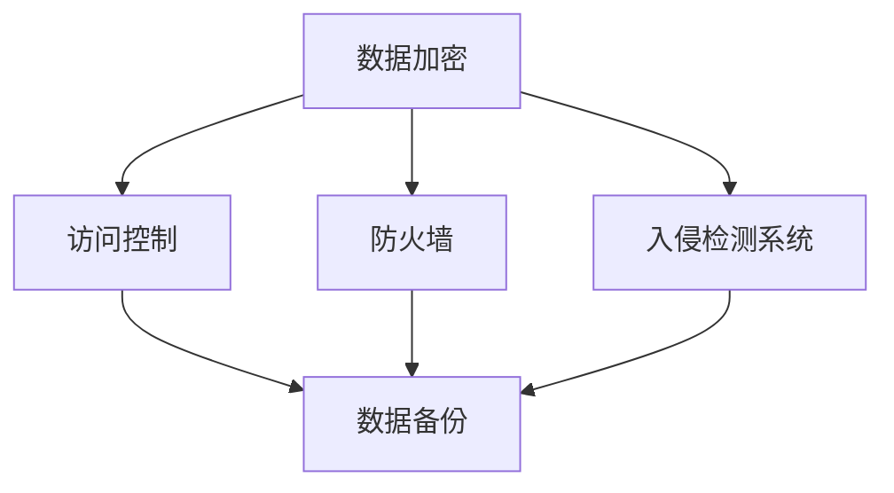

                 

### 《创业公司的数据安全策略：赢得客户信任的关键》

#### 关键词：
- 数据安全
- 客户信任
- 创业公司
- 数据保护
- 法规合规

#### 摘要：
本文将深入探讨创业公司如何构建和实施数据安全策略，以赢得客户信任。文章分为四个主要部分：数据安全的重要性、构建数据安全策略、实施数据安全策略和持续优化数据安全策略。通过案例分析、核心概念讲解、技术选型与实践，本文旨在为创业公司提供一套完整的、易于理解的数据安全策略框架，确保企业在快速发展的同时，保护客户数据和增强市场竞争力。

### 目录大纲

1. **引言**：数据安全与客户信任
2. **数据安全概述**
3. **数据安全法概述**
4. **数据泄露的风险评估**
5. **核心概念与联系**
6. **构建数据安全策略框架**
7. **数据分类与分级管理**
8. **数据加密与保护**
9. **访问控制与身份验证**
10. **数据备份与恢复**
11. **数据安全意识培训**
12. **安全技术选型与部署**
13. **安全监测与响应**
14. **数据安全合规性审计**
15. **案例分析一：某创业公司的数据安全事件**
16. **案例分析二：行业最佳实践**
17. **数据安全策略的评估与改进**
18. **数据安全策略的持续优化**
19. **结论**：数据安全策略的重要性
20. **附录A：数据安全工具与资源**
21. **附录B：数据安全法规汇编**

---

#### 第一部分：数据安全的重要性

#### 1. 引言：数据安全与客户信任

在当今数字化时代，数据已经成为企业的核心资产。创业公司尤其依赖客户数据的收集和分析来推动业务发展和创新。然而，随着数据量的增加和数据类型的多样化，数据安全风险也日益凸显。一个成功的数据安全策略不仅关乎企业的生存和发展，更关乎客户信任的建立和维护。

**数据安全的重要性**

数据安全是指保护数据免受未经授权的访问、篡改、泄露、破坏或丢失的过程。对于创业公司而言，数据安全的重要性体现在以下几个方面：

- **客户信任**：数据泄露事件可能导致客户信息的丢失或滥用，进而损害客户对企业的信任。在竞争激烈的市场中，客户信任是企业的宝贵资产。
  
- **法律合规**：全球范围内，数据安全法规越来越严格，企业需要遵守各种数据保护法规，如欧盟的《通用数据保护条例》（GDPR）和中国的《网络安全法》。违反法规可能导致巨额罚款和声誉损失。
  
- **业务连续性**：数据泄露或丢失可能导致业务中断，影响企业的运营效率和客户服务。

- **市场竞争力**：拥有良好的数据安全策略可以提高企业的市场竞争力，吸引更多客户和投资者。

**客户信任与企业数据安全的关系**

客户信任是企业成功的基石。客户愿意将个人信息和业务数据交给创业公司，是基于对企业的信任。以下因素表明客户信任与企业数据安全之间的紧密联系：

- **隐私保护**：客户期望企业能够妥善保护其个人信息和隐私，避免数据泄露事件。
  
- **透明度**：企业需要向客户透明地告知其数据保护措施和政策，增强客户的信任。
  
- **快速响应**：一旦发生数据泄露事件，企业需要迅速采取行动，通知受影响的客户并采取措施减少损害，这有助于维护客户信任。

在接下来的章节中，我们将深入探讨数据安全的基本概念、法规合规要求、风险评估方法以及构建和实施数据安全策略的步骤。通过这些内容，创业公司将能够更好地理解和实施数据安全策略，从而赢得客户信任，实现可持续发展。

---

### 2. 数据安全概述

数据安全是一个广泛而复杂的领域，涵盖了从数据生成到处理、存储和传输的各个阶段。为了全面了解数据安全，我们需要首先掌握其基本概念，并了解常见的威胁类型。

**数据安全的基本概念**

数据安全的基本概念包括以下几个方面：

- **数据加密**：通过加密算法将数据转换为密文，只有持有正确密钥的用户才能解密和访问原始数据。加密技术是保护数据隐私和完整性的重要手段。

- **访问控制**：通过权限管理和身份验证机制，控制用户对数据的访问权限。访问控制策略确保只有授权用户可以访问特定的数据。

- **防火墙**：用于监控和控制进出企业网络的流量，防止未经授权的访问和攻击。防火墙是网络安全的基础设施。

- **入侵检测系统（IDS）**：用于实时监控网络流量和系统活动，检测潜在的安全威胁和攻击。IDS可以帮助企业迅速发现和应对安全事件。

- **数据备份**：定期将数据备份到安全的地方，以防止数据丢失或损坏。数据备份是灾难恢复的重要组成部分。

**数据安全威胁的类型**

在数据安全领域，常见的威胁类型包括：

- **数据泄露**：未经授权的个体或组织访问和获取敏感数据。数据泄露可能导致个人隐私泄露、商业机密泄露等严重后果。

- **恶意软件**：包括病毒、蠕虫、木马等恶意软件，可以破坏系统、窃取数据和造成其他形式的损害。

- **钓鱼攻击**：通过欺骗性的电子邮件或网站，诱骗用户提供敏感信息，如用户名、密码和信用卡号。

- **DDoS攻击**：通过大量请求攻击目标服务器，导致其无法正常服务。DDoS攻击可以造成业务中断和损失。

- **内部威胁**：企业内部员工或合作伙伴的恶意行为，可能导致数据泄露或滥用。

了解数据安全的基本概念和威胁类型，对于创业公司来说至关重要。在构建数据安全策略时，企业需要充分考虑这些威胁，并采取相应的防护措施。接下来，我们将探讨数据安全法规的概述，以及企业合规的重要性。

---

### 3. 数据安全法概述

随着数字化时代的到来，全球各国纷纷出台了严格的数据安全法规，以保护个人隐私和商业数据。这些法规不仅为企业提供了合规的要求，同时也成为了企业构建数据安全策略的重要参考。

**各国数据安全法的比较**

在全球范围内，几个主要国家的数据安全法规具有代表性的包括：

- **欧盟的《通用数据保护条例》（GDPR）**：GDPR是迄今为止最严格的数据保护法规之一，它规定了企业在处理欧盟居民的个人信息时必须遵守的一系列规则。GDPR的要求包括数据最小化、数据匿名化、数据泄露通知等。

- **美国的《加州消费者隐私法案》（CCPA）**：CCPA主要针对加州居民的个人数据保护，要求企业明确告知用户其数据的收集和使用情况，并提供数据访问和删除的权利。

- **中国的《网络安全法》**：中国的网络安全法要求企业在收集、存储和处理个人信息时必须遵守严格的规范，包括数据本地化存储和用户数据保护。

- **澳大利亚的《隐私法》**：澳大利亚的隐私法涵盖了个人信息的处理和保护，要求企业采取合理措施保护个人信息，防止数据泄露和滥用。

**企业合规的重要性**

数据安全法的合规对于企业具有重要意义，主要体现在以下几个方面：

- **法律风险降低**：遵守数据安全法可以减少因违规操作导致的法律风险，避免高额罚款和诉讼。

- **客户信任增强**：透明和合规的数据处理方式能够增强客户对企业的信任，提高客户满意度和忠诚度。

- **市场竞争优势**：在数据安全法规日益严格的背景下，具备合规能力的企业将在市场竞争中占据优势。

- **业务连续性保障**：通过合规措施，企业可以更好地保护数据，减少数据泄露和系统故障的风险，保障业务连续性。

为了确保合规，企业需要采取以下措施：

- **建立数据保护组织**：设立专门的部门或团队负责数据保护和合规工作。

- **制定数据保护政策**：明确数据保护的目标、责任和流程，确保所有员工了解和遵守相关法规。

- **进行定期审计和评估**：定期评估数据保护措施的有效性，及时调整和改进。

- **培训员工**：对员工进行数据保护培训，提高他们的合规意识和操作技能。

在下一章节中，我们将讨论数据泄露的风险评估，并解析一些实际的数据泄露案例，帮助企业更好地理解和应对数据安全威胁。

---

### 4. 数据泄露的风险评估

数据泄露的风险评估是构建有效数据安全策略的重要步骤。通过评估潜在的数据泄露风险，企业可以识别关键威胁点，采取相应的防护措施，从而确保数据的安全性和完整性。以下是一个详细的风险评估框架，以及一些典型的数据泄露案例解析。

**风险评估框架**

1. **风险识别**：识别企业面临的各种潜在数据泄露风险，包括外部威胁和内部威胁。

2. **风险分析**：分析每种风险的可能性和影响，确定其对企业运营和数据安全的威胁程度。

3. **风险评估**：根据风险的可能性和影响，对风险进行优先级排序，确定需要优先解决的风险。

4. **风险应对**：制定和实施风险缓解措施，包括技术手段和管理措施。

**风险识别**

风险识别是风险评估的第一步，企业需要全面了解可能威胁数据安全的因素。以下是常见的数据泄露风险：

- **恶意软件**：包括病毒、蠕虫、木马等，可以通过网络传播，窃取或破坏企业数据。
- **网络攻击**：包括DDoS攻击、SQL注入、跨站脚本攻击等，可以破坏企业网络和系统。
- **内部威胁**：内部员工或合作伙伴的恶意行为，可能导致数据泄露或滥用。
- **物理安全威胁**：如设备被盗、数据泄露等。
- **人为错误**：如员工误操作、数据备份失败等。

**风险分析**

风险分析旨在评估每种风险的可能性和影响。以下是常用的评估方法：

- **定量分析**：使用数学模型和统计数据评估风险的可能性和影响。
- **定性分析**：通过专家意见、历史数据和情景分析等方法评估风险。

**风险评估**

在风险识别和分析的基础上，企业需要对风险进行优先级排序。以下是常见的评估标准：

- **风险优先级**：根据风险的可能性和影响，将风险分为高、中、低三个等级。
- **风险暴露度**：综合考虑风险的可能性和影响，计算风险暴露度，用于确定风险应对策略。

**风险应对**

针对识别和评估出的风险，企业需要制定和实施风险缓解措施。以下是常见的技术手段和管理措施：

- **技术手段**：包括防火墙、入侵检测系统（IDS）、数据加密、访问控制等。
- **管理措施**：包括安全培训、安全政策制定、安全审计等。

**数据泄露案例解析**

以下是一些典型的数据泄露案例，通过分析这些案例，企业可以更好地理解数据泄露的风险，并采取有效的防护措施。

1. **案例一：某电商平台的客户数据泄露**  
某电商平台在2017年遭受了一次严重的网络攻击，导致数百万客户的个人信息（包括姓名、地址、电子邮件和密码）泄露。分析显示，攻击者利用SQL注入漏洞，成功入侵了数据库。这个案例说明，网络攻击是数据泄露的重要风险来源，企业需要加强网络安全防护。

2. **案例二：某金融机构的内部威胁**  
某金融机构的一名内部员工泄露了数千客户的账户信息，导致客户遭受财务损失。分析显示，员工利用职务之便，非法访问了客户数据，并将其出售给外部犯罪分子。这个案例表明，内部威胁是企业需要高度关注的另一个风险点。

3. **案例三：某医疗机构的物理安全威胁**  
某医疗机构的病人数据存储在未上锁的文件柜中，导致数百病人的个人信息泄露。分析显示，由于物理安全措施不足，攻击者成功窃取了敏感数据。这个案例提醒企业，物理安全同样重要，不能忽视。

通过这些案例的分析，企业可以更好地理解数据泄露风险的复杂性和多样性，从而采取全面的防护措施，确保数据的安全和客户信任。

---

#### 5. 核心概念与联系

在构建创业公司的数据安全策略时，理解核心概念及其相互联系是至关重要的。以下将介绍数据安全的关键环节，并使用Mermaid流程图展示这些环节之间的联系。

**数据安全的关键环节**

1. **数据加密**：通过加密技术保护数据的隐私和完整性。
2. **访问控制**：限制对数据的访问权限，确保只有授权用户可以访问敏感信息。
3. **防火墙**：监控和过滤进出网络的流量，防止未经授权的访问。
4. **入侵检测系统（IDS）**：监控网络活动，检测和响应潜在的攻击。
5. **数据备份**：定期备份数据，防止数据丢失和损坏。

**Mermaid 流程图**

以下是一个简化的Mermaid流程图，展示了这些关键环节之间的联系：

**流程图解析**

1. **数据加密**：数据加密是保护数据的第一道防线，它确保数据在存储和传输过程中不会被未经授权的用户读取。加密数据后，只有拥有解密密钥的用户才能访问原始数据。

2. **访问控制**：访问控制与数据加密相辅相成。通过访问控制机制，企业可以设置不同的权限级别，确保只有经过身份验证的用户才能访问特定的数据。例如，敏感数据可能只允许特定的管理员用户访问。

3. **防火墙**：防火墙是一个网络安全系统，它监控和过滤进出网络的流量。防火墙可以防止外部攻击，例如DDoS攻击和SQL注入攻击，确保网络的安全性。

4. **入侵检测系统（IDS）**：入侵检测系统实时监控网络活动，检测可能的攻击和异常行为。IDS可以帮助企业迅速发现和响应潜在的安全威胁，防止数据泄露和其他安全问题。

5. **数据备份**：数据备份是确保数据可用性和业务连续性的关键措施。定期备份数据可以防止由于硬件故障、恶意攻击或人为错误导致的数据丢失。在发生数据泄露或系统故障时，企业可以迅速恢复数据，减少业务中断。

通过理解这些核心概念及其相互联系，创业公司可以构建一个全面的、多层次的数据安全策略，确保数据的安全性和客户信任。

---

#### 6. 构建数据安全策略框架

构建一个有效的数据安全策略是企业确保数据安全和客户信任的关键步骤。一个全面的数据安全策略不仅需要涵盖技术层面的防护措施，还需要包括管理措施和员工培训等方面。以下是一个详细的数据安全策略框架，以及其组成部分。

**数据安全策略框架**

1. **制定数据安全策略的原则**

   - **明确数据保护的目标**：确保数据的机密性、完整性和可用性。
   - **全员参与**：数据安全是全员责任，需要从管理层到普通员工都积极参与。
   - **持续改进**：数据安全策略需要定期评估和更新，以应对不断变化的安全威胁。

2. **数据安全策略的组成部分**

   - **数据分类**：根据数据的敏感性和重要性，将数据分为不同的类别，例如公开数据、内部数据和敏感数据。
   - **数据保护标准**：制定具体的数据保护标准，例如加密、访问控制、备份等。
   - **权限管理**：建立严格的权限管理机制，确保只有授权用户可以访问特定的数据。
   - **数据备份和恢复**：制定数据备份和恢复策略，确保在发生数据泄露或丢失时能够迅速恢复数据。
   - **安全培训**：定期对员工进行数据安全培训，提高他们的安全意识和操作技能。
   - **合规性审计**：定期进行合规性审计，确保企业遵守相关数据安全法规。

3. **制定数据安全策略的具体步骤**

   - **风险评估**：评估企业面临的数据安全风险，识别潜在的安全威胁和漏洞。
   - **确定保护需求**：根据风险评估的结果，确定企业需要采取的数据保护措施。
   - **制定数据安全策略**：结合企业的实际情况，制定具体的数据安全策略。
   - **实施和监控**：将数据安全策略付诸实施，并持续监控其执行情况，确保策略的有效性。
   - **更新和改进**：根据监控结果和新的安全威胁，定期更新和改进数据安全策略。

**核心原则**

- **最小化原则**：仅收集和存储必要的数据，避免过度收集。
- **透明度原则**：向用户明确告知其数据的使用和保护方式。
- **责任原则**：明确数据保护的责任，确保每个员工都清楚自己的责任。
- **应急原则**：制定应急预案，确保在数据泄露或系统故障时能够迅速响应。

通过遵循这些原则和步骤，创业公司可以构建一个全面、有效且持续改进的数据安全策略，从而保护客户数据和增强市场竞争力。

---

#### 7. 数据分类与分级管理

在构建数据安全策略时，数据分类与分级管理是确保数据安全性的关键环节。数据分类有助于识别数据的敏感性和重要性，从而采取相应的保护措施。以下将详细阐述数据分类的标准和分级管理的实践，以帮助创业公司建立科学、有效的数据安全管理体系。

**数据分类的标准**

1. **根据数据的敏感性分类**

   - **公开数据**：对所有人公开的数据，如公开的新闻报道、产品说明书等。
   - **内部数据**：仅内部员工可以访问的数据，如员工通讯录、公司内部报告等。
   - **敏感数据**：包含个人隐私信息、商业机密的数据，如客户信息、财务报表等。
   - **机密数据**：最为敏感的数据，可能对企业的运营和利益造成重大影响，如客户信用报告、研发计划等。

2. **根据数据的重要性分类**

   - **常规数据**：对业务运营有辅助作用但非必要的数据，如员工工作日志、日常操作记录等。
   - **关键数据**：对业务运营至关重要，一旦丢失或泄露将导致严重后果的数据，如客户订单、库存信息等。
   - **核心数据**：对企业的核心竞争力至关重要，一旦泄露可能对公司造成致命打击的数据，如客户关系数据、研发成果等。

**数据分级管理的实践**

1. **访问控制**

   - **根据数据敏感性设置访问权限**：对于不同级别的数据，设置不同的访问权限。例如，公开数据可以公开访问，内部数据仅内部员工可访问，敏感数据和机密数据则需要严格的身份验证和授权。
   - **动态权限管理**：根据员工职位、角色和工作需要，动态调整其访问权限。例如，离职员工的访问权限应及时取消，新员工的访问权限应及时开通。

2. **数据加密**

   - **传输加密**：在数据传输过程中，使用加密技术确保数据的安全，防止数据在传输过程中被窃取或篡改。
   - **存储加密**：对于敏感数据和机密数据，在存储时进行加密，确保数据在存储介质上也是安全的。

3. **数据备份与恢复**

   - **定期备份**：根据数据的重要性和变更频率，制定不同的备份策略。例如，敏感数据需要每天备份，常规数据可以每周备份。
   - **异地备份**：将数据备份存储在不同的地理位置，以防止因自然灾害、网络攻击等导致的数据丢失。
   - **快速恢复**：制定数据恢复流程，确保在数据丢失或泄露事件发生后，能够迅速恢复数据，减少业务中断。

4. **安全审计**

   - **定期审计**：定期对数据访问和操作进行审计，确保数据访问和使用符合安全策略和规定。
   - **违规处理**：对违规访问和使用数据的行为进行追责和处理，确保数据安全政策的严肃性和有效性。

通过科学的数据分类与分级管理实践，创业公司可以更有效地保护其数据资产，增强客户信任，确保业务的稳定运行。

---

#### 8. 数据加密与保护

在数据安全策略中，数据加密是保护数据隐私和完整性的重要手段。加密技术通过将数据转换成密文，使得未经授权的用户无法读取和访问数据。以下将详细探讨加密技术的基本原理，以及创业公司在实际操作中如何使用数据加密来保护其数据。

**加密技术的基本原理**

加密技术涉及将明文数据通过加密算法转换为密文的过程。这个过程需要两个密钥：加密密钥和解密密钥。加密算法根据这两个密钥将明文数据转换为密文，而只有拥有解密密钥的用户才能将密文还原成明文数据。

1. **对称加密算法**：对称加密算法使用相同的密钥进行加密和解密。常见的对称加密算法包括AES（高级加密标准）和DES（数据加密标准）。对称加密算法的优点是加密和解密速度快，但缺点是密钥的分发和管理复杂。

2. **非对称加密算法**：非对称加密算法使用一对密钥：公钥和私钥。公钥用于加密数据，私钥用于解密数据。常见的非对称加密算法包括RSA（RSA加密算法）和ECC（椭圆曲线加密算法）。非对称加密算法的优点是密钥管理简单，但加密和解密速度相对较慢。

**企业如何使用数据加密**

1. **传输过程中的数据加密**

   - **HTTPS**：在数据传输过程中，使用HTTPS协议（HTTP over TLS/SSL）来加密数据，确保数据在传输过程中不会被窃听或篡改。
   - **VPN**：通过虚拟私人网络（VPN）加密数据，确保远程访问数据的安全。

2. **存储过程中的数据加密**

   - **全磁盘加密**：对存储在硬盘上的数据进行全磁盘加密，确保即使硬盘被盗，数据也无法被未经授权的用户访问。
   - **文件加密**：对存储在文件服务器或云存储中的敏感文件进行加密，确保只有授权用户可以访问这些文件。

3. **数据库加密**

   - **数据库加密插件**：使用数据库加密插件对数据库中的数据进行加密，确保数据库数据的安全。
   - **透明数据库加密**：一些数据库管理系统（如MySQL、Oracle等）提供了透明数据库加密功能，自动对存储的数据进行加密，无需开发者进行额外操作。

4. **数据备份加密**

   - **备份文件加密**：对备份数据文件进行加密，确保在数据恢复过程中，备份数据也是安全的。

**示例**

假设一个创业公司需要加密其客户的敏感信息（如姓名、地址、电子邮件和密码），以下是一个简单的加密步骤：

1. **选择加密算法**：选择AES加密算法，使用256位密钥。
2. **加密数据**：使用AES算法和密钥将客户的敏感信息加密，生成密文。
3. **存储密钥**：将加密密钥安全存储在安全的密钥管理系统中，确保只有授权用户可以访问密钥。
4. **传输加密**：在将加密数据传输到服务器时，使用HTTPS协议确保数据在传输过程中的安全。
5. **存储加密**：在数据库中存储加密数据时，使用数据库加密插件确保数据在存储过程中的安全。

通过上述步骤，创业公司可以确保客户的敏感信息在传输和存储过程中都是安全的，从而增强客户信任，保护企业数据资产。

---

#### 9. 访问控制与身份验证

访问控制与身份验证是确保企业数据安全的重要机制。访问控制通过限制对数据的访问权限，防止未经授权的用户访问敏感信息。身份验证则通过验证用户的身份，确保只有授权用户可以访问系统资源和数据。以下将详细讨论访问控制机制和身份验证方法，以及如何在实际操作中应用这些技术。

**访问控制机制**

1. **基于角色的访问控制（RBAC）**：RBAC根据用户的角色分配访问权限。每个角色都有特定的权限集合，用户通过其角色获得相应的访问权限。例如，管理员角色可以访问所有系统设置和敏感数据，而普通用户只能访问其工作需要的部分数据。

2. **基于属性的访问控制（ABAC）**：ABAC不仅考虑用户的角色，还考虑环境属性（如时间、地理位置）和资源的属性（如数据敏感性）。这种机制更加灵活，可以根据具体的业务场景进行细粒度的访问控制。

3. **访问控制列表（ACL）**：ACL为每个资源（如文件、目录、数据库表）分配一个访问控制列表，列出可以访问该资源的用户或用户组及其权限。ACL的优点是简单直观，但缺点是当资源数量庞大时，管理复杂度增加。

4. **多因素身份验证（MFA）**：MFA结合多种验证方式（如密码、短信验证码、指纹识别、智能卡等），提高用户身份验证的可靠性。例如，用户需要输入密码并通过短信验证码才能登录系统。

**身份验证方法**

1. **单点登录（SSO）**：SSO允许用户通过一个账户登录多个系统，减少用户需要记忆的密码数量，提高用户体验。SSO通常结合OAuth 2.0或SAML等标准实现。

2. **密码验证**：密码验证是最常用的身份验证方法，用户通过输入用户名和密码来验证身份。为了提高安全性，可以使用强密码策略（如密码长度、复杂度要求）和多密码哈希（如SHA-256）。

3. **生物识别验证**：生物识别验证通过用户的生物特征（如指纹、面部识别、虹膜扫描等）验证身份，具有较高的安全性和用户体验。

4. **二步验证（2FA）**：二步验证在用户输入密码后，还需要通过第二种方式（如短信验证码、手机应用生成的验证码）验证身份，提高登录安全性。

**实际操作中的应用**

1. **实现RBAC和ABAC**：企业可以根据业务需求，使用现有的身份验证和访问控制框架（如OAuth 2.0、OpenID Connect等）实现RBAC和ABAC。

2. **集成MFA**：在企业系统中集成MFA，如使用Google Authenticator等移动应用生成验证码，提高用户登录安全性。

3. **使用SSO**：部署SSO解决方案，减少用户登录多个系统时的复杂度，提高工作效率。

4. **加强密码策略**：使用强密码策略，如要求密码长度至少8位，包含字母、数字和特殊字符，定期强制用户更改密码。

5. **部署生物识别系统**：在关键系统中部署生物识别验证，确保只有授权用户可以访问。

通过合理应用访问控制与身份验证机制，企业可以显著提高数据安全性，防止未经授权的访问和滥用，增强客户信任，确保业务的稳健发展。

---

#### 10. 数据备份与恢复

数据备份与恢复是数据安全策略的重要组成部分，旨在确保企业数据在遭受损失或破坏时能够迅速恢复，从而保障业务的连续性和可靠性。以下将详细探讨数据备份的策略和恢复的方法，并给出具体的实施步骤。

**数据备份的策略**

1. **全量备份与增量备份**

   - **全量备份**：每次备份整个数据集，确保数据完整性。缺点是备份时间长、存储空间需求大。
   - **增量备份**：只备份自上次备份以来发生变化的数据，速度快，存储空间需求小。缺点是恢复时可能需要多个备份文件。

2. **本地备份与远程备份**

   - **本地备份**：将备份数据存储在企业内部或近地的存储设备上，便于快速恢复。缺点是安全性较低，易受物理损坏影响。
   - **远程备份**：将备份数据存储在远程服务器或云存储中，提高数据安全性。缺点是恢复时可能受网络速度限制。

3. **定期备份与实时备份**

   - **定期备份**：按照固定时间间隔（如每天、每周）进行备份。适用于数据变化不频繁的情况。
   - **实时备份**：实时监控数据变化，并立即进行备份。适用于数据变化频繁、要求高数据恢复速度的场景。

**数据恢复的方法**

1. **基于文件的恢复**

   - **直接恢复**：直接从备份文件中恢复所需的数据文件，适用于小规模的数据恢复。
   - **逐层恢复**：从最近的备份文件开始恢复，逐步回滚到需要的版本，适用于数据丢失或损坏较为严重的情况。

2. **基于数据库的恢复**

   - **数据库恢复工具**：使用数据库提供的恢复工具（如MySQL的`mysqlpump`、Oracle的`RMAN`等）恢复数据库。
   - **数据还原**：将备份的数据还原到数据库中，确保数据的完整性和一致性。

**实施步骤**

1. **备份计划制定**：根据企业的业务需求和数据重要性，制定具体的备份计划，包括备份频率、备份类型、备份存储位置等。

2. **备份工具选择**：选择合适的备份工具（如Veeam、Bacula、Rclone等），确保备份过程高效、安全。

3. **备份执行**：按照备份计划，定期执行备份操作，确保备份数据的完整性和可用性。

4. **备份验证**：定期进行备份验证，确保备份数据可恢复。可以通过备份恢复测试、数据一致性检查等方法验证备份的有效性。

5. **备份监控**：实时监控备份过程，及时发现和解决备份过程中出现的问题。

6. **备份恢复演练**：定期进行备份恢复演练，确保在发生数据丢失或损坏时，能够迅速、准确地恢复数据。

通过科学的数据备份与恢复策略和实施步骤，企业可以确保数据的安全性和可用性，降低数据丢失的风险，保障业务的连续性和稳定性。

---

#### 11. 数据安全意识培训

数据安全意识培训是确保数据安全策略有效实施的重要环节。通过提高员工的数据安全意识，企业可以减少人为错误和内部威胁，从而提高整体数据安全性。以下将详细讨论数据安全培训的策略、目标和实施案例。

**数据安全培训的策略**

1. **定期培训**：定期组织数据安全培训，确保所有员工都能及时了解最新的数据安全知识和技能。培训内容应包括数据安全的基本原则、常见的安全威胁和防护措施等。

2. **个性化培训**：根据员工的角色和职责，提供个性化的培训内容。例如，IT部门员工需要深入了解技术层面的安全防护措施，而普通员工则主要关注日常操作中的数据安全注意事项。

3. **线上线下结合**：采用线上线下相结合的培训方式，既可以通过在线课程方便员工学习，又可以组织线下研讨会和实操培训，提高培训效果。

4. **案例分析**：通过分析实际的数据安全事件，让员工了解数据泄露的严重后果，增强其安全意识。案例可以包括企业内部发生的真实事件，也可以引用行业内的典型案例。

**培训目标**

1. **提高数据安全意识**：让员工认识到数据安全的重要性，了解可能面临的威胁和风险。

2. **增强操作技能**：通过培训，提高员工在数据安全方面的操作技能，确保其在日常工作中能够正确执行数据安全措施。

3. **建立合规文化**：培养员工遵守数据安全法规和公司政策的意识，确保企业能够合规运营。

**实施案例**

1. **案例一：某创业公司的数据安全培训**

   某创业公司定期组织数据安全培训，包括以下内容：

   - 数据安全基础知识：讲解数据安全的基本概念、常见威胁和防护措施。
   - 常见威胁案例分析：通过实际案例讲解网络钓鱼、恶意软件等常见威胁，提高员工的安全意识。
   - 实操培训：组织员工进行实际操作演练，例如如何正确设置密码、如何识别和应对网络钓鱼邮件等。
   - 考试评估：培训结束后进行考试，评估员工的学习效果，确保其掌握必要的数据安全知识。

2. **案例二：某金融机构的数据安全意识培训**

   某金融机构采取了以下措施提高员工的数据安全意识：

   - 定期开展网络安全竞赛，鼓励员工积极参与，增强其安全意识。
   - 在公司内部网站上发布数据安全相关文章和视频，供员工随时学习。
   - 定期组织外部专家进行数据安全讲座，分享最新的安全趋势和防护技巧。
   - 对新员工进行专项培训，确保其在上岗前了解公司的数据安全政策和操作规范。

通过以上策略和案例，企业可以有效提高员工的数据安全意识，减少数据安全事件的发生，确保数据的保护和业务的连续性。

---

#### 12. 技术选型与部署

在实施数据安全策略的过程中，选择合适的技术并进行有效的部署至关重要。以下将详细介绍常见的数据安全技术，以及企业在技术选型与部署过程中需要考虑的关键因素。

**常见的数据安全技术**

1. **防火墙**：防火墙用于监控和控制进出网络的流量，防止未经授权的访问和攻击。根据工作方式，防火墙分为包过滤防火墙、状态检测防火墙和应用级网关。

2. **入侵检测系统（IDS）和入侵防御系统（IPS）**：IDS用于检测网络中的异常行为和潜在攻击，IPS则能够在检测到威胁时立即采取行动，阻止攻击。根据检测方法，IDS/IPS分为基于签名的检测和基于异常行为的检测。

3. **数据加密**：数据加密用于保护数据的隐私和完整性，包括传输加密（如TLS/SSL）和存储加密（如AES）。常见的加密技术有对称加密（如AES、DES）和非对称加密（如RSA、ECC）。

4. **访问控制**：访问控制用于限制用户对数据的访问权限，确保只有授权用户可以访问敏感信息。常见的访问控制方法包括基于角色的访问控制（RBAC）和基于属性的访问控制（ABAC）。

5. **多因素身份验证（MFA）**：MFA结合多种验证方式（如密码、短信验证码、指纹识别、智能卡等），提高用户身份验证的可靠性。

6. **数据备份与恢复**：数据备份用于防止数据丢失和损坏，常见的方法有全量备份、增量备份和差异备份。数据恢复技术包括基于文件的恢复和基于数据库的恢复。

**技术选型与部署过程**

1. **需求分析**：明确企业的数据安全需求，包括数据类型、规模、重要性和业务场景等。

2. **技术评估**：评估各种数据安全技术的性能、功能、成本和兼容性，选择最适合企业需求的技术。

3. **方案设计**：根据需求和技术评估结果，设计具体的数据安全方案，包括系统架构、配置和部署计划。

4. **试点部署**：在部分环境中进行技术试点部署，验证方案的有效性和可行性，发现和解决潜在问题。

5. **全面部署**：根据试点结果，全面部署数据安全方案，确保覆盖所有关键系统和数据。

6. **监控与优化**：部署后，持续监控数据安全系统的运行情况，根据反馈进行优化和调整。

**关键因素**

1. **性能和效率**：数据安全技术不能影响业务的正常运行，需要在不降低性能的前提下确保数据安全。

2. **兼容性和扩展性**：所选技术应与企业现有的IT系统兼容，并具备扩展能力，以适应未来的发展需求。

3. **成本效益**：数据安全技术的成本应在可承受范围内，同时要考虑长期的维护和运营成本。

4. **易用性**：数据安全系统应易于使用和管理，提高操作效率和用户体验。

5. **法规合规**：所选技术应符合相关数据安全法规和标准，确保企业合规运营。

通过综合考虑这些因素，企业可以选型和部署有效的数据安全方案，确保数据的安全性和业务连续性。

---

#### 13. 安全监测与响应

在数据安全策略中，安全监测与响应是关键环节，旨在实时发现和应对安全威胁，确保数据的安全性和业务的连续性。以下将详细介绍安全监测的策略和流程，以及安全事件响应的处理方法。

**安全监测策略**

1. **实时监控**：通过部署入侵检测系统（IDS）、防火墙和日志分析工具，实时监控网络流量、系统活动和日志记录，及时发现异常行为和潜在威胁。

2. **威胁情报**：利用威胁情报平台，收集和分析来自第三方和内部的安全信息，包括漏洞、恶意软件和攻击趋势等，为监测和响应提供支持。

3. **自动化监测**：通过自动化工具和脚本，定期扫描和检测系统中的安全漏洞和配置问题，确保及时发现和修复潜在风险。

4. **日志分析**：定期分析系统日志、网络流量日志和安全事件日志，识别异常模式和潜在威胁，确保及时发现安全事件。

5. **风险评估**：定期进行风险评估，评估系统面临的潜在威胁和风险，制定相应的监测和响应策略。

**安全事件响应流程**

1. **事件识别**：通过实时监控和日志分析，发现潜在的安全事件。事件识别包括异常流量、异常登录、系统漏洞扫描结果等。

2. **初步评估**：对识别出的事件进行初步评估，判断其严重性和可能的影响。初步评估包括事件类型、攻击手段、受影响系统等。

3. **确认与验证**：通过深入分析和验证，确认安全事件的性质和范围。确认与验证包括分析日志、网络流量、系统漏洞等。

4. **响应计划**：根据事件的性质和严重性，制定具体的响应计划。响应计划包括隔离受影响系统、通知相关团队、采取紧急措施等。

5. **应急处理**：根据响应计划，立即采取应急措施，包括关闭受攻击的服务、隔离受感染的系统、修复漏洞等，以阻止事件的进一步扩散。

6. **事件报告**：将安全事件报告给相关负责人，包括事件性质、影响范围、处理措施等，确保事件得到及时处理和记录。

7. **回顾与总结**：在事件处理后，对事件进行回顾和总结，分析事件的根源、影响和响应效果，制定改进措施，提高未来的应对能力。

通过有效的安全监测与响应，企业可以及时发现和应对安全威胁，降低安全事件的影响，确保数据的安全性和业务的连续性。

---

#### 14. 数据安全合规性审计

数据安全合规性审计是企业确保其数据安全策略和操作符合相关法规和标准的重要手段。通过合规性审计，企业不仅可以降低法律风险，还能增强客户信任和内部管理效率。以下将详细介绍合规性审计的目的、重要性以及具体的审计流程和工具。

**目的**

1. **验证合规性**：确保企业遵循相关数据安全法规和标准，如GDPR、CCPA、ISO 27001等。
2. **发现潜在风险**：识别数据安全策略和操作中的漏洞和不足，提前采取改进措施。
3. **提升管理效率**：通过系统化的审计流程，提升数据安全管理的规范性和效率。

**重要性**

1. **法律风险降低**：遵守数据安全法规可以降低因违规操作导致的法律风险，避免高额罚款和诉讼。
2. **客户信任增强**：透明和合规的数据处理方式能够增强客户对企业的信任，提高客户满意度和忠诚度。
3. **内部管理优化**：通过审计，企业可以识别和优化数据安全管理体系，提高整体运营效率。

**审计流程**

1. **准备阶段**：确定审计目标、范围和标准，组建审计团队，制定审计计划。
2. **风险评估**：评估企业面临的数据安全风险，识别潜在合规性问题。
3. **审计实施**：根据审计计划，开展现场审计或远程审计，收集相关证据和资料。
4. **报告撰写**：撰写审计报告，详细记录审计发现、问题和改进建议。
5. **跟进与改进**：跟踪审计发现的问题和改进建议的落实情况，确保企业持续改进数据安全管理体系。

**审计工具**

1. **日志分析工具**：用于收集和分析系统日志、网络流量日志等，发现潜在的安全事件和合规性问题。
2. **安全评估工具**：用于评估企业现有的数据安全策略和操作，发现漏洞和不足。
3. **合规性检查表**：用于对照相关法规和标准，检查企业是否符合合规要求。
4. **合规性审计软件**：如Pentesting、AuditStream等，提供自动化的合规性检查和报告生成功能。

通过合规性审计，企业可以确保其数据安全策略和操作符合相关法规和标准，降低法律风险，增强客户信任，提升内部管理效率。

---

#### 15. 案例分析一：某创业公司的数据安全事件

**事件概述**

某创业公司在2021年遭遇了一次严重的数据泄露事件，导致数万客户的个人信息（包括姓名、地址、电话号码和电子邮件地址）泄露。事件发生在一次网络攻击中，攻击者通过钓鱼邮件诱骗公司员工点击恶意链接，成功入侵了公司的内部系统。

**处理措施**

1. **立即隔离受影响的系统**：公司迅速切断了受攻击系统的访问，防止攻击者继续扩大攻击范围。

2. **通知相关当局**：公司立即通知了当地网络安全部门，并启动了内部调查。

3. **通知受影响的客户**：公司通过邮件和短信通知受影响的客户，告知他们可能面临的风险，并提供临时防护建议。

4. **技术调查和修复**：公司聘请了专业的网络安全团队进行技术调查，确定攻击方式、入侵点和漏洞。随后，公司对系统进行了修复和加固。

**效果**

1. **客户信任恢复**：公司通过及时透明的沟通和积极的应对措施，赢得了客户的信任，客户流失率保持在较低水平。

2. **合规性提升**：事件发生后，公司加强了内部数据安全管理和员工培训，确保符合相关数据安全法规。

3. **业务连续性保障**：公司通过事件调查和系统修复，确保了业务的连续性，避免了业务中断和财务损失。

**经验教训**

1. **加强员工培训**：定期进行数据安全培训，提高员工对钓鱼攻击等安全威胁的识别能力。

2. **强化安全意识**：建立全面的安全意识文化，让每个员工都认识到数据安全的重要性。

3. **及时响应**：建立快速响应机制，确保在发生安全事件时能够迅速采取措施，减少损失。

通过这个案例，创业公司可以看到数据安全事件可能带来的严重后果，以及如何通过及时、有效的应对措施来减少损失，保障客户信任和业务连续性。

---

#### 16. 案例分析二：行业最佳实践

**数据安全策略的案例分析**

在全球范围内，许多行业领先的企业在数据安全策略方面积累了丰富的经验。以下将介绍几个典型的行业最佳实践，以及它们如何帮助创业公司构建有效的数据安全策略。

**1. 谷歌的数据安全策略**

**关键举措**：
- **数据最小化原则**：谷歌遵循数据最小化原则，仅收集和存储必要的数据，避免过度收集。
- **多因素身份验证**：谷歌在登录和敏感操作时采用多因素身份验证（MFA），确保只有授权用户可以访问数据。
- **数据加密**：谷歌对存储和传输的数据进行加密，确保数据在存储和传输过程中都是安全的。

**启示**：
- **数据最小化**：创业公司应遵循数据最小化原则，仅收集和存储必要的数据，减少数据泄露的风险。
- **多因素身份验证**：采用多因素身份验证，提高用户身份验证的可靠性，防止未经授权的访问。
- **数据加密**：对数据进行加密，确保数据在存储和传输过程中都是安全的。

**2. 银行业的最佳实践**

**关键举措**：
- **访问控制**：银行通过严格的访问控制机制，确保只有授权员工可以访问敏感数据。
- **日志审计**：银行定期审计系统日志，监控数据访问和操作，及时发现异常行为。
- **安全培训**：银行定期对员工进行数据安全培训，提高员工的安全意识和操作技能。

**启示**：
- **严格的访问控制**：创业公司应建立严格的访问控制机制，确保只有授权用户可以访问敏感数据。
- **日志审计**：定期审计系统日志，监控数据访问和操作，及时发现异常行为。
- **安全培训**：定期对员工进行数据安全培训，提高员工的安全意识和技能。

**3. 电子商务企业的数据安全策略**

**关键举措**：
- **安全支付系统**：电子商务企业采用安全支付系统（如SSL/TLS），确保支付数据在传输过程中是加密的。
- **数据备份与恢复**：电子商务企业定期备份数据，并制定详细的数据恢复流程，确保在数据泄露或系统故障时能够迅速恢复。
- **用户隐私保护**：电子商务企业明确告知用户其数据的收集和使用情况，增强用户信任。

**启示**：
- **安全支付系统**：创业公司应采用安全支付系统，确保支付数据在传输过程中的安全性。
- **数据备份与恢复**：定期备份数据，并制定详细的数据恢复流程，确保在发生数据泄露或系统故障时能够迅速恢复。
- **用户隐私保护**：明确告知用户其数据的收集和使用情况，增强用户信任。

**适用于创业公司的建议**

1. **制定全面的策略**：创业公司应制定详细的数据安全策略，包括数据分类、加密、访问控制、备份和恢复等方面。

2. **遵循最佳实践**：借鉴行业领先企业的最佳实践，结合自身业务特点，制定适合的数据安全策略。

3. **持续培训与改进**：定期对员工进行数据安全培训，提高安全意识和技能。同时，持续评估和改进数据安全策略，以应对新的安全威胁。

通过学习行业最佳实践，创业公司可以构建和实施有效的数据安全策略，确保数据的安全性和客户信任，实现可持续发展。

---

#### 17. 数据安全策略的评估与改进

评估和改进数据安全策略是确保企业数据安全长期有效的关键步骤。通过定期评估和持续改进，企业可以及时发现和解决数据安全策略中的不足，提高数据保护的效率和可靠性。以下将详细介绍评估数据安全策略的指标、评估方法以及改进策略。

**评估指标**

1. **合规性**：评估企业数据安全策略是否符合相关法规和标准，如GDPR、CCPA、ISO 27001等。

2. **有效性**：评估数据安全策略在实际应用中的效果，包括防护措施的执行情况、安全事件的响应速度和效果等。

3. **员工参与度**：评估员工对数据安全策略的接受度和参与度，包括安全培训的覆盖率和效果等。

4. **技术成熟度**：评估企业采用的数据安全技术是否最新、是否满足业务需求。

5. **数据泄露风险**：评估企业当前面临的数据泄露风险，包括漏洞数量、威胁情报的利用情况等。

**评估方法**

1. **自我评估**：企业内部团队根据数据安全策略的要求和执行情况，进行自我评估。

2. **第三方审计**：聘请专业的第三方审计机构，对企业数据安全策略进行独立评估。

3. **安全演习**：通过模拟攻击和安全事件，评估数据安全策略的应急响应能力和防护效果。

4. **数据分析**：分析企业安全日志、威胁情报和用户反馈，评估数据安全策略的有效性和潜在问题。

**改进策略**

1. **制定改进计划**：根据评估结果，制定具体的改进计划，包括技术升级、流程优化和员工培训等方面。

2. **技术升级**：采用最新的安全技术，如高级加密算法、多因素身份验证等，提高数据安全性。

3. **流程优化**：优化数据安全流程，确保数据在收集、存储、处理和传输过程中的安全。

4. **员工培训**：定期对员工进行数据安全培训，提高其安全意识和操作技能。

5. **持续改进**：建立持续改进机制，定期评估和调整数据安全策略，以应对新的安全威胁。

通过科学、系统的评估与改进，企业可以不断提升数据安全水平，保障数据的安全性和业务连续性。

---

#### 18. 数据安全策略的持续优化

随着技术的不断进步和网络安全威胁的日益复杂，创业公司需要持续优化其数据安全策略，以保持数据的完整性和机密性。以下将探讨数据安全策略优化的必要性、面临的挑战以及具体的优化方法。

**必要性**

1. **技术更新**：随着云计算、物联网、人工智能等新技术的广泛应用，数据安全环境变得更加复杂。企业需要不断更新和优化数据安全策略，以适应新的技术环境和威胁。

2. **法规变化**：全球范围内的数据安全法规不断更新和加强，如欧盟的GDPR、加州的CCPA等。企业需要持续关注法规变化，确保数据安全策略符合最新法规要求。

3. **业务扩展**：企业随着业务的扩展，数据量和数据类型不断增加，数据安全风险也随之增加。因此，数据安全策略需要持续优化，以应对业务扩展带来的挑战。

**挑战**

1. **资源限制**：创业公司通常面临资源有限的问题，包括人力、资金和技术资源。这给数据安全策略的优化带来了一定的挑战。

2. **技能不足**：企业内部可能缺乏足够的数据安全专业人才，难以应对复杂的网络安全威胁。

3. **快速变化的安全威胁**：网络攻击手段不断演变，企业需要不断更新和优化安全策略，以应对新的安全威胁。

**优化方法**

1. **定期评估**：定期对数据安全策略进行评估，分析其有效性和潜在问题。通过自我评估和第三方审计，确保数据安全策略符合业务需求和安全要求。

2. **技术升级**：采用最新的数据安全技术和工具，如高级加密算法、人工智能威胁检测、零信任架构等，提高数据安全性。

3. **流程优化**：优化数据安全流程，确保数据在收集、存储、处理和传输过程中的安全。引入自动化和智能化的安全流程，提高效率和响应速度。

4. **员工培训**：定期对员工进行数据安全培训，提高其安全意识和操作技能。通过模拟演练和实战案例，提高员工对安全威胁的识别和应对能力。

5. **合规性管理**：建立合规性管理机制，确保数据安全策略符合相关法规和标准。定期进行合规性审计，及时发现和解决合规性问题。

6. **持续改进**：建立持续改进机制，通过监控和分析安全事件，不断优化数据安全策略。鼓励员工提出改进建议，形成全员参与的数据安全文化。

通过持续优化数据安全策略，创业公司可以不断提升数据安全水平，确保数据的完整性和机密性，增强客户信任和市场竞争力。

---

### 19. 结论：数据安全策略的重要性

在数字化时代，数据安全已经成为企业发展的关键因素。本文通过深入探讨创业公司的数据安全策略，揭示了数据安全在保护客户信任、保障业务连续性和增强市场竞争力方面的关键作用。以下是本文的主要结论：

1. **数据安全的重要性**：数据安全不仅关乎企业的生存和发展，更是赢得客户信任的基石。客户对企业的信任建立在对其数据的保护上，任何数据泄露事件都可能导致客户信任的丧失。

2. **数据安全策略的构建**：有效的数据安全策略应包括数据分类与分级管理、数据加密、访问控制、备份与恢复、安全监测与响应等多个方面。通过科学、系统的策略构建，企业可以更好地保护其数据资产。

3. **法规合规性**：随着全球数据安全法规的不断完善，企业需要严格遵守相关法规，确保数据安全策略的合规性。这不仅有助于降低法律风险，还能增强企业的合规意识和信誉。

4. **员工培训与意识**：提高员工的数据安全意识和操作技能是确保数据安全策略有效实施的关键。通过定期培训和演练，企业可以培养出具有高度安全意识的专业团队。

5. **持续优化**：数据安全策略不是一成不变的，而是需要根据技术发展、业务扩展和安全威胁的变化进行持续优化。通过定期评估和改进，企业可以不断提升数据安全水平。

面向未来，企业应关注以下几个趋势：

1. **零信任架构**：随着远程工作和移动办公的普及，零信任架构（Zero Trust Architecture）将成为数据安全的重要方向。零信任架构强调“永不信任，始终验证”，可以有效提高数据安全性。

2. **人工智能与机器学习**：利用人工智能和机器学习技术，企业可以更高效地检测和响应安全威胁，提高数据安全防护的智能化水平。

3. **云安全**：随着云计算的广泛应用，企业需要更加重视云安全，确保在云环境中数据的安全性和合规性。

4. **网络安全意识**：在数字化转型的过程中，提高员工的网络安全意识是确保数据安全的重要环节。企业应持续开展网络安全意识培训，培养员工的网络安全素养。

总之，数据安全策略的重要性不言而喻。创业公司应高度重视数据安全，构建全面、有效的数据安全策略，确保在快速发展的同时，保护客户数据和增强市场竞争力。

---

### 附录A：数据安全工具与资源

为了帮助企业更好地实施数据安全策略，以下列举了一些常见的数据安全工具和资源，包括安全工具的介绍、选型建议和常见数据安全问题的解决方案。

**1. 常用数据安全工具介绍**

- **加密工具**：如GnuPG、 VeraCrypt等，用于加密文件和磁盘。
- **防火墙**：如pfSense、Cisco Firepower等，用于保护网络流量。
- **入侵检测系统（IDS）**：如Snort、Suricata等，用于检测和响应网络攻击。
- **数据备份工具**：如Bacula、Veeam等，用于定期备份数据。
- **多因素身份验证（MFA）**：如Google Authenticator、RSA SecurID等，用于提高用户身份验证的安全性。

**2. 技术选型建议**

- **根据业务需求**：选择适合业务规模和需求的数据安全工具，避免过度投资。
- **考虑兼容性**：确保所选工具与现有系统兼容，减少整合难度。
- **评估性能**：选择性能优异的工具，确保在保证安全的同时不影响业务运行。
- **关注更新和维护**：选择有良好技术支持、定期更新的工具，确保长期稳定运行。

**3. 常见数据安全问题的解决方案**

- **数据泄露**：通过数据加密、访问控制和网络安全监控来防范数据泄露。
- **恶意软件攻击**：通过安装杀毒软件、防火墙和定期更新操作系统来防止恶意软件攻击。
- **网络钓鱼攻击**：通过员工安全培训、多因素身份验证和实时监控来防范网络钓鱼攻击。
- **数据备份失败**：通过定期测试备份恢复流程、选择可靠的数据存储服务商来确保数据备份的可靠性。

通过合理选择和使用数据安全工具，企业可以有效提升数据安全性，降低数据泄露和丢失的风险。

---

### 附录B：数据安全法规汇编

为了帮助企业更好地理解和遵守数据安全法规，以下简要概述了一些主要的数据安全法规，包括法规概述、主要内容及其对企业的要求。

**1. 欧盟的《通用数据保护条例》（GDPR）**

**概述**：GDPR是欧盟制定的关于数据保护的全面法规，于2018年5月25日生效。其主要目标是加强个人数据的保护，确保个人数据的安全和隐私。

**主要内容**：
- **数据主体权利**：包括知情权、访问权、修改权、删除权和反对权。
- **数据控制者和处理者的责任**：确保数据处理的合法性、透明性和安全性。
- **数据泄露通知**：在数据泄露事件发生后，必须在72小时内通知监管机构和受影响的个人。

**对企业的要求**：企业必须制定数据保护政策，进行数据泄露风险评估，确保数据加密和访问控制的有效性。

**2. 美国的《加州消费者隐私法案》（CCPA）**

**概述**：CCPA是加州针对消费者数据保护的法案，于2020年1月1日生效。其主要目标是赋予消费者对其个人数据的控制权，限制企业对消费者数据的收集和使用。

**主要内容**：
- **消费者数据定义**：包括姓名、地址、电子邮件、生物识别信息等。
- **消费者权利**：包括知情权、访问权、删除权和拒绝销售权。

**对企业的要求**：企业必须明确告知消费者其数据收集和使用情况，提供消费者数据访问和删除的渠道，并采取措施保护消费者数据。

**3. 中国的《网络安全法》**

**概述**：网络安全法是中国制定的关于网络安全的基本法律，于2017年6月1日生效。其主要目标是加强网络安全管理，保障网络空间的安全和稳定。

**主要内容**：
- **网络安全等级保护**：要求企业根据网络安全风险等级，采取相应的安全保护措施。
- **个人信息保护**：要求企业采取措施保护个人信息，防止个人信息泄露和滥用。

**对企业的要求**：企业必须建立健全的网络安全管理体系，进行网络安全风险评估，采取有效的数据保护措施，定期进行网络安全培训和演练。

**4. 澳大利亚的《隐私法》**

**概述**：隐私法是澳大利亚关于数据保护的主要法规，于1988年生效。其主要目标是保护个人隐私，规范个人信息的收集、使用和披露。

**主要内容**：
- **个人信息保护原则**：包括透明度、合法性、目的明确、数据质量、安全性和个人信息主体权利。

**对企业的要求**：企业必须制定隐私保护政策，明确个人信息的收集、使用和披露目的，采取安全措施保护个人信息，确保个人信息主体的权利得到保障。

了解和遵守这些数据安全法规，对于企业确保数据安全、保护客户隐私、降低法律风险具有重要意义。

---

### 作者

作者：**AI天才研究院（AI Genius Institute）/禅与计算机程序设计艺术（Zen And The Art of Computer Programming）**

本文由AI天才研究院和禅与计算机程序设计艺术的联合作者撰写。AI天才研究院专注于人工智能和机器学习领域的前沿研究和应用，致力于推动技术的进步和产业创新。禅与计算机程序设计艺术则是一系列深入探讨计算机编程艺术和哲学的经典著作，为程序员提供了独特的思考方式和解决问题的方法。本文旨在通过深入的技术分析和实践指导，为创业公司提供一套全面、实用且有效的数据安全策略，助力企业在数字化时代取得成功。

