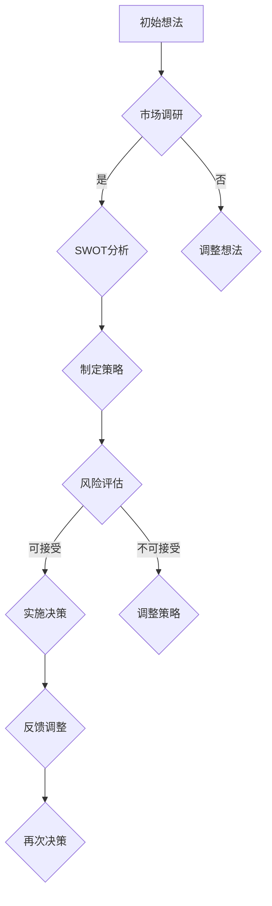

                 

# 《创业者的决策技巧：在不确定性中前进》

> **关键词**：创业者、决策、不确定性、数据分析、风险识别、人际关系网络、心态、案例研究、创新思维

> **摘要**：本文深入探讨了创业者在面对不确定性时如何做出有效决策的技巧。通过构建决策框架、识别与评估风险、应用数据分析、构建人际关系网络、保持积极心态以及从实际案例中汲取教训，创业者可以在充满变数的环境中稳步前行。

### 《创业者的决策技巧：在不确定性中前进》目录大纲

#### 第1章 引言：创业与决策的关系

#### 1.1 创业的本质与挑战

#### 1.2 不确定性在创业中的地位

#### 1.3 决策在创业成功中的关键作用

#### 第2章 创业者的决策框架

#### 2.1 决策理论的基本原理

#### 2.2 SWOT分析法在创业决策中的应用

#### 2.3 决策树与预期值计算

#### 第3章 创业中的风险识别与评估

#### 3.1 风险识别的步骤与方法

#### 3.2 风险评估的标准与工具

#### 3.3 风险管理与决策

#### 第4章 数据分析在决策中的应用

#### 4.1 数据分析的基本概念

#### 4.2 数据驱动决策的方法

#### 4.3 数据可视化与分析工具

#### 第5章 创业者的人际关系网络与决策

#### 5.1 人际关系网络的重要性

#### 5.2 网络分析法与决策

#### 5.3 人际关系管理与决策

#### 第6章 创业者的心态与决策

#### 6.1 创业者心态的重要性

#### 6.2 如何保持积极心态

#### 6.3 心态与决策的相互影响

#### 第7章 实际案例中的决策技巧

#### 7.1 成功创业者的决策案例分析

#### 7.2 失败创业者的决策教训

#### 7.3 决策技巧的实践应用

#### 第8章 决策技巧的进阶之路

#### 8.1 创新思维在决策中的应用

#### 8.2 灵活应变与敏捷决策

#### 8.3 决策技巧的提升方法

#### 第9章 附录

#### 9.1 决策相关资源推荐

#### 9.2 常用决策工具介绍

#### 9.3 练习题与答案解析

#### Mermaid 流程图：创业者决策流程



### 核心算法原理讲解

#### 决策树算法伪代码：

```python
def decision_tree(data, attributes):
    if all_values_equal(data, attributes[0]):
        return most_common_value(data, attributes[0])
    if attributes.isEmpty():
        return majority_vote(data)
    best_attribute = get_best_attribute(data, attributes)
    tree = {}
    for value in unique_values(best_attribute):
        subset = filter_data(data, best_attribute, value)
        tree[value] = decision_tree(subset, attributes - {best_attribute})
    return tree
```

#### 风险评估公式：

$$
R = P \times E
$$

其中，\( R \) 是总风险，\( P \) 是风险发生的概率，\( E \) 是风险发生后的损失值。

#### 举例说明：

假设创业项目中，市场调研显示某风险的概率为0.3，发生后的损失值为5000元，则该风险的总风险计算如下：

$$
R = 0.3 \times 5000 = 1500 \text{元}
$$

### 项目实战

#### 实际案例：使用数据分析工具分析创业项目可行性

1. **环境搭建**：安装Python环境及数据分析库，如Pandas、Numpy、Scikit-learn。
2. **数据收集**：收集市场调研数据、竞争对手数据、消费者行为数据等。
3. **数据预处理**：清洗数据，进行数据转换、缺失值处理等。
4. **数据分析**：使用Pandas进行数据探索性分析，使用Scikit-learn进行预测建模。
5. **结果解读**：分析结果对创业项目的意义，提出优化建议。

#### 代码实现：

```python
import pandas as pd
from sklearn.model_selection import train_test_split
from sklearn.ensemble import RandomForestClassifier
from sklearn.metrics import accuracy_score

# 加载数据
data = pd.read_csv('startup_data.csv')

# 数据预处理
data = data.dropna()
X = data.drop('target', axis=1)
y = data['target']

# 数据划分
X_train, X_test, y_train, y_test = train_test_split(X, y, test_size=0.2, random_state=42)

# 模型训练
model = RandomForestClassifier(n_estimators=100)
model.fit(X_train, y_train)

# 模型评估
y_pred = model.predict(X_test)
accuracy = accuracy_score(y_test, y_pred)
print(f'Model Accuracy: {accuracy:.2f}')
```

#### 代码解读与分析

1. **数据加载与预处理**：使用Pandas加载数据，并进行缺失值处理，保证数据质量。
2. **模型选择与训练**：选择随机森林模型进行训练，利用Scikit-learn库的API。
3. **模型评估**：使用测试集进行模型评估，计算准确率，评估模型性能。

通过以上步骤，可以实现对创业项目可行性的数据分析，为决策提供依据。

### 作者

**作者：AI天才研究院/AI Genius Institute & 禅与计算机程序设计艺术 /Zen And The Art of Computer Programming**<|im_end|>## 第1章 引言：创业与决策的关系

### 1.1 创业的本质与挑战

创业是一种充满挑战和机遇的活动，其核心在于创新和创造价值。创业的本质可以概括为以下几个关键要素：

1. **创新**：创业者通过独特的视角和思维，发现市场中的空缺或机会，开发出新颖的产品或服务，满足市场需求。
2. **资源整合**：创业需要创业者利用有限的资源，包括资金、人力、技术等，进行高效整合，以实现商业目标。
3. **风险承担**：创业伴随着高不确定性，创业者需要面对市场变化、竞争压力、技术风险等多方面的挑战，承担相应的风险。
4. **持续迭代**：成功创业不仅仅是开发出优秀的产品或服务，更需要持续不断地进行产品迭代和市场推广，以适应市场的变化。

创业过程中的挑战主要包括以下几个方面：

- **市场不确定性**：市场变化迅速，创业者需要不断调整策略以应对市场变化。
- **资源有限**：创业初期，资金、人力和时间的有限性使得创业者必须在资源有限的情况下做出最优决策。
- **竞争压力**：市场上已有企业和新进入者的竞争使得创业者需要具备强大的竞争力和创新能力。
- **法律和监管**：创业者需要了解并遵守相关法律法规，确保企业运营的合法性和合规性。

### 1.2 不确定性在创业中的地位

不确定性是创业过程中的核心特征之一。在创业初期，市场情况、客户需求、技术发展等都存在高度的不确定性。创业者需要在这种不确定性中做出决策，以确保企业能够稳步发展。

不确定性在创业中的地位主要体现在以下几个方面：

- **影响决策**：不确定性使得创业者无法准确预测未来的市场状况，从而影响决策的制定和实施。
- **增加风险**：不确定性增加了创业项目的风险，创业者需要具备应对风险的能力。
- **促进创新**：在不确定的环境中，创业者需要不断创新以适应市场变化，这促进了企业的技术创新和商业模式创新。
- **塑造企业核心竞争力**：面对不确定性，创业者需要培养快速响应市场变化的能力，这成为企业核心竞争力的一部分。

### 1.3 决策在创业成功中的关键作用

决策在创业成功中起着至关重要的作用。一个明智的决策可以引导企业走向成功，而一个错误的决策可能导致企业的失败。

决策在创业成功中的关键作用主要体现在以下几个方面：

- **指导行动**：决策明确了企业的目标和方向，为企业的行动提供了指导。
- **资源分配**：决策决定了企业资源的分配，包括资金、人力、技术等，影响企业的运营效率和效果。
- **风险控制**：决策过程中考虑潜在的风险和应对措施，有助于企业降低风险，提高成功率。
- **市场响应**：决策需要快速响应市场变化，调整策略以保持竞争力。

总之，创业者在面对不确定性时，需要构建一个有效的决策框架，结合数据分析、风险评估、人际关系网络和心态管理等多个方面，做出明智的决策，以实现创业成功。

### 第2章 创业者的决策框架

在充满不确定性的创业环境中，创业者需要构建一个全面的决策框架，以帮助他们在复杂和动态的市场中做出明智的决策。决策框架由多个核心部分组成，包括决策理论的基本原理、SWOT分析法的应用以及决策树与预期值计算。以下将逐步介绍这些关键要素，为创业者提供实用的决策工具。

#### 2.1 决策理论的基本原理

决策理论是研究个体或群体在不确定环境下做出合理决策的科学。其核心思想是通过系统化和结构化的方法，帮助决策者在面对复杂情况时做出最优选择。决策理论主要包括以下几个基本原理：

1. **决策过程**：决策过程通常包括识别问题、收集信息、制定方案、评估方案和选择方案等步骤。创业者需要明确每个步骤的具体内容，以确保决策的全面性和有效性。

   - **识别问题**：首先，创业者需要明确企业面临的问题或机会，这可以通过市场调研、客户反馈和内部评估等多种途径实现。
   - **收集信息**：收集与问题相关的各种信息，包括市场数据、竞争情况、技术趋势等。这些信息将为后续的决策提供依据。
   - **制定方案**：在收集到足够的信息后，创业者需要制定多个可能的解决方案，每个方案都要具有可行性和创新性。
   - **评估方案**：对每个方案进行评估，包括分析方案的优缺点、潜在风险和预期收益等。创业者需要采用定量和定性相结合的方法进行评估。
   - **选择方案**：根据评估结果，选择最符合企业目标和价值观的方案进行实施。

2. **理性决策**：理性决策模型假设决策者在充分信息下，通过最大化收益或最小化损失来实现个人目标。理性决策要求创业者具备清晰的目标和价值观，以及高效的信息处理能力。

3. **有限理性决策**：现实中的决策往往受到信息不完全、认知限制和时间压力等因素的影响。有限理性决策模型认为，决策者在面对不确定性和资源限制时，会采取次优的决策，但总体上仍能够实现较好的结果。

#### 2.2 SWOT分析法在创业决策中的应用

SWOT分析法是一种常用的战略规划工具，用于评估企业的优势（Strengths）、劣势（Weaknesses）、机会（Opportunities）和威胁（Threats）。通过SWOT分析，创业者可以全面了解企业的内外部环境，为决策提供有力支持。

1. **优势分析**：优势是指企业相对于竞争对手所具有的竞争优势，包括技术、品牌、人才、资金等。创业者需要识别和利用这些优势，以巩固市场地位和提升竞争力。

   - **技术优势**：如专利技术、研发能力等。
   - **品牌优势**：如知名度、口碑等。
   - **人才优势**：如优秀的管理团队、技术团队等。

2. **劣势分析**：劣势是指企业相对于竞争对手所存在的劣势，包括管理、技术、市场等。创业者需要识别和克服这些劣势，以避免在市场竞争中处于不利地位。

   - **管理劣势**：如管理体系不完善、执行力差等。
   - **技术劣势**：如技术水平落后、创新能力不足等。
   - **市场劣势**：如市场定位不准确、营销策略不当等。

3. **机会分析**：机会是指外部环境中可能对企业带来积极影响的因素，包括市场趋势、政策变化、技术进步等。创业者需要抓住这些机会，以实现企业的快速发展。

   - **市场趋势**：如消费者需求的变化、行业趋势等。
   - **政策变化**：如政府支持政策、税收优惠等。
   - **技术进步**：如新技术的应用、创新产品的推出等。

4. **威胁分析**：威胁是指外部环境中可能对企业造成负面影响的因素，包括竞争对手、市场变化、政策法规等。创业者需要识别和应对这些威胁，以保护企业的利益。

   - **竞争对手**：如市场份额的争夺、价格战等。
   - **市场变化**：如市场需求的变化、竞争格局的变化等。
   - **政策法规**：如政策限制、行业监管等。

通过SWOT分析，创业者可以更全面地了解企业的现状，为决策提供清晰的思路。在制定决策时，创业者需要根据SWOT分析的结果，综合考虑内部优势和劣势以及外部机会和威胁，制定出符合企业实际情况的决策方案。

#### 2.3 决策树与预期值计算

决策树是一种直观的决策分析工具，用于表示决策过程和结果。它通过一系列的选择和结果节点，帮助决策者理解不同决策路径的后果，并选择最优方案。

1. **决策树的构建**

   - **根节点**：表示初始决策点。
   - **内部节点**：表示根据某个条件做出的决策。
   - **叶节点**：表示决策的最终结果。

   构建决策树的基本步骤包括：

   - **确定决策点**：根据问题的具体情况，确定需要做出决策的关键节点。
   - **列出所有可能的决策选项**：针对每个决策点，列出所有可能的决策选项。
   - **评估每个决策选项的结果**：为每个决策选项评估可能的结果，包括收益、成本和风险等。
   - **绘制决策树**：根据以上步骤，绘制出决策树。

2. **预期值计算**

   预期值是指在不同决策路径下，可能的结果的加权平均值。预期值计算可以帮助决策者了解不同决策路径的潜在收益或损失。

   预期值的计算公式为：

   $$
   E = \sum_{i=1}^{n} (p_i \times r_i)
   $$

   其中，\( E \) 表示预期值，\( p_i \) 表示第 \( i \) 个结果的概率，\( r_i \) 表示第 \( i \) 个结果的价值。

   例如，对于一个有两个决策选项的问题，其中一个决策选项有60%的概率获得1000元收益，另一个决策选项有40%的概率获得500元收益，则预期值计算如下：

   $$
   E = (0.6 \times 1000) + (0.4 \times 500) = 600 + 200 = 800 \text{元}
   $$

   通过预期值计算，决策者可以比较不同决策选项的潜在收益，从而选择最优方案。

总之，构建决策框架是创业者在不确定性环境中做出有效决策的关键。通过理解决策理论的基本原理、应用SWOT分析法以及利用决策树和预期值计算，创业者可以更系统地分析问题，做出明智的决策，从而提高创业成功的可能性。

### 第3章 创业中的风险识别与评估

在创业过程中，风险识别与评估是决策过程中至关重要的一环。风险不仅来源于外部市场环境，也可能源自企业内部的管理和运营。为了有效管理风险，创业者需要系统地识别和评估潜在风险，并制定相应的风险管理和决策策略。

#### 3.1 风险识别的步骤与方法

风险识别是风险管理的基础，旨在发现企业可能面临的各种风险。以下是一些常用的风险识别步骤和方法：

1. **访谈法**：通过与内部员工、管理层和外部专家进行访谈，收集他们对企业面临风险的主观看法和经验。这种方法有助于发现潜在的风险因素。

2. **头脑风暴**：组织团队成员进行头脑风暴，列出可能影响企业运营的各种风险。这种方法有助于广泛收集意见和建议。

3. **SWOT分析**：利用SWOT分析法，评估企业的优势、劣势、机会和威胁，识别可能的风险。这种方法可以帮助企业从多个角度考虑风险。

4. **历史数据分析**：分析企业历史上的风险事件，识别重复出现的风险模式。这种方法有助于发现常见风险，为预防措施提供依据。

5. **问卷调查**：通过问卷调查，收集员工、客户和其他利益相关者的意见，了解他们对企业风险的看法。这种方法可以获取多方面的信息，提高风险识别的全面性。

#### 3.2 风险评估的标准与工具

风险评估是对识别出的风险进行定量或定性分析，以确定其严重性和发生概率。以下是一些常用的风险评估标准和工具：

1. **定性风险评估**：定性风险评估主要通过专家判断，对风险的严重性和发生概率进行评估。常用的评估标准包括风险严重性等级（如高、中、低）和风险概率等级（如高、中、低）。

   - **风险矩阵**：使用风险矩阵，将风险的严重性和发生概率进行组合，得到风险等级。风险矩阵是一种直观且易于理解的风险评估工具。

   ```mermaid
   graph TD
       A[高] --> B{高风险}
       B --> C{高严重性 & 高概率}
       B --> D{高严重性 & 中概率}
       B --> E{高严重性 & 低概率}

       A --> F{中风险}
       F --> G{中严重性 & 高概率}
       F --> H{中严重性 & 中概率}
       F --> I{中严重性 & 低概率}

       A --> J{低风险}
       J --> K{低严重性 & 高概率}
       J --> L{低严重性 & 中概率}
       J --> M{低严重性 & 低概率}
   ```

2. **定量风险评估**：定量风险评估通过数学模型和统计数据，对风险的严重性和发生概率进行量化分析。常用的评估方法包括预期值计算和敏感性分析。

   - **预期值计算**：预期值是风险事件发生的概率与该事件可能造成损失的乘积。预期值的计算公式为：

     $$
     EV = P \times L
     $$

     其中，\( EV \) 表示预期值，\( P \) 表示风险事件发生的概率，\( L \) 表示该事件造成的损失。

   - **敏感性分析**：敏感性分析通过改变某个或某些变量，观察对结果的影响程度。敏感性分析可以帮助创业者了解风险的敏感度，为风险管理提供参考。

#### 3.3 风险管理与决策

风险管理与决策是创业过程中不可或缺的一部分。有效的风险管理可以提高企业应对风险的能力，减少潜在损失。以下是一些风险管理策略：

1. **风险规避**：通过避免或拒绝高风险项目，减少风险对企业的影响。这种方法适用于高风险且收益不显著的项目。

2. **风险转移**：通过购买保险、签订合同或与其他企业合作，将风险转移给第三方。这种方法适用于高风险但可以通过合同或其他协议来降低损失的风险。

3. **风险降低**：通过改进企业管理、加强内部控制、提高技术水平等措施，降低风险的发生概率或损失程度。这种方法适用于中等风险但可以通过措施有效控制的风险。

4. **风险接受**：对于一些无法避免或转移的风险，创业者可以选择接受风险，并制定相应的应急预案。这种方法适用于低风险或风险可控的风险。

在决策过程中，创业者需要综合考虑风险管理的策略，结合企业实际情况和资源，做出最优决策。以下是一个简化的决策过程：

- **识别风险**：通过访谈、头脑风暴、SWOT分析等方法，识别企业可能面临的风险。
- **评估风险**：使用定性或定量方法，评估风险的严重性和发生概率。
- **制定风险管理策略**：根据风险评估结果，选择风险规避、风险转移、风险降低或风险接受等策略。
- **实施风险管理措施**：根据风险管理策略，制定具体的措施并实施。
- **监控与调整**：定期监控风险状况，根据实际情况调整风险管理策略。

通过上述步骤，创业者可以系统地管理风险，提高企业应对不确定性的能力，从而在创业过程中稳步前进。

### 第4章 数据分析在决策中的应用

在创业环境中，数据分析是一种强大的工具，可以帮助创业者从海量信息中提取有价值的数据，并利用这些数据做出更加明智的决策。数据分析不仅能够提高决策的准确性和效率，还能为企业提供前瞻性的洞察，从而在激烈的市场竞争中占据优势。

#### 4.1 数据分析的基本概念

数据分析是指通过系统的方法来收集、整理、分析并解释数据，以便从数据中提取有价值的信息和知识。数据分析的基本概念包括：

- **数据源**：数据源是数据的来源，可以是内部数据库、外部数据提供商或实时数据流。
- **数据清洗**：数据清洗是指对数据进行预处理，包括去除重复数据、纠正错误、填补缺失值等，以确保数据的质量和一致性。
- **数据转换**：数据转换是指将数据从一种格式转换为另一种格式，以便于后续分析和处理。
- **数据存储**：数据存储是指将处理后的数据存储到数据库或数据仓库中，以便于后续查询和分析。
- **数据探索**：数据探索是指通过可视化工具和统计方法，对数据进行初步分析，以发现数据中的规律和趋势。

#### 4.2 数据驱动决策的方法

数据驱动决策是一种基于数据的决策方法，通过收集和分析数据，为决策提供客观的依据。以下是一些数据驱动决策的方法：

1. **描述性分析**：描述性分析是一种基础的数据分析方法，主要用于描述数据的分布、趋势和相关性。通过描述性分析，创业者可以了解数据的总体特征，为后续的决策提供基础。

   - **统计摘要**：计算数据的均值、中位数、标准差等统计量，以描述数据的集中趋势和离散程度。
   - **数据可视化**：使用图表、图形等可视化工具，将数据以直观的方式展示出来，以便更好地理解和分析数据。

2. **预测性分析**：预测性分析是一种基于历史数据和统计模型的预测方法，用于预测未来的趋势和变化。通过预测性分析，创业者可以提前了解市场动向，为决策提供前瞻性指导。

   - **时间序列分析**：通过分析时间序列数据，预测未来的趋势。常用的时间序列分析方法包括移动平均法、指数平滑法、ARIMA模型等。
   - **回归分析**：通过建立回归模型，分析自变量和因变量之间的关系，预测因变量的取值。常见的回归分析方法包括线性回归、多项式回归、逻辑回归等。

3. **决策树**：决策树是一种直观的决策分析工具，通过一系列的选择和结果节点，帮助决策者理解不同决策路径的后果，并选择最优方案。决策树可以用于风险评估、市场预测等场景。

4. **机器学习**：机器学习是一种利用算法从数据中自动学习和发现规律的方法。通过训练机器学习模型，创业者可以预测客户行为、市场趋势等，为决策提供更加准确的依据。

   - **分类模型**：用于将数据分为不同的类别。常见的分类模型包括决策树、支持向量机、神经网络等。
   - **回归模型**：用于预测连续变量的取值。常见的回归模型包括线性回归、多项式回归、岭回归等。

#### 4.3 数据可视化与分析工具

数据可视化是将数据分析结果以图形、图表等形式展示出来的过程，有助于直观地理解和解释数据。以下是一些常用的数据可视化工具：

1. **Python库**：Python具有丰富的数据可视化库，如Matplotlib、Seaborn、Plotly等，可以生成各种类型的图表和图形。

   ```python
   import matplotlib.pyplot as plt
   import seaborn as sns

   # 绘制条形图
   sns.barplot(x='category', y='value', data=data)
   plt.show()

   # 绘制散点图
   sns.regplot(x='x', y='y', data=data)
   plt.show()
   ```

2. **商业智能工具**：商业智能工具，如Tableau、Power BI等，提供了强大的数据可视化和分析功能，适合企业用户进行数据探索和分析。

3. **Excel**：Excel是常用的数据分析工具，提供了丰富的数据可视化和分析功能，适合初学者和小规模数据分析。

   ```excel
   # 创建图表
   INSERT CHART TYPE (如条形图、折线图等)

   # 调整图表样式
   FORMAT CHART (如颜色、标签、网格线等)
   ```

通过数据分析和数据可视化，创业者可以从数据中发现有价值的信息，为决策提供科学的依据。数据驱动决策不仅提高了决策的准确性和效率，还为企业提供了前瞻性的洞察，帮助创业者更好地应对市场变化，实现企业的可持续发展。

### 第5章 创业者的人际关系网络与决策

在创业过程中，人际关系网络是创业者获取资源、信息和支持的重要渠道。一个强大的人际关系网络可以帮助创业者更好地应对不确定性，做出更明智的决策。

#### 5.1 人际关系网络的重要性

人际关系网络在创业决策中的作用不可忽视，主要体现在以下几个方面：

1. **资源获取**：创业者可以通过人际关系网络获取资金、技术、人才等资源，这些资源对于企业的生存和发展至关重要。
2. **信息传递**：人际关系网络是信息传递的桥梁，创业者可以通过网络获取市场动态、行业趋势等关键信息，为决策提供依据。
3. **支持与协作**：在创业过程中，创业者常常需要与他人合作，人际关系网络为合作提供了基础，有助于解决创业中的难题。
4. **品牌传播**：创业者的人际关系网络有助于品牌的传播，通过网络效应，可以提高企业的知名度和市场影响力。

#### 5.2 网络分析法与决策

网络分析法是一种用于分析人际关系网络的工具，通过量化网络中的节点（个体）和边（关系），揭示网络的结构特征和动态变化。以下是一些常用的网络分析方法和其在决策中的应用：

1. **节点中心性**：节点中心性是衡量节点在网络中的重要性的指标。常用的中心性指标包括度数中心性、中间中心性和接近中心性。度数中心性表示节点连接的边数，中间中心性表示节点在短路径中的数量，接近中心性表示节点与其他节点的接近程度。

   - **度数中心性**：度数中心性较高的节点通常具有较高的权力和影响力，创业者可以通过与这些节点建立联系，获取更多的资源和支持。
   - **中间中心性**：中间中心性较高的节点在网络中起到了连接不同群体的桥梁作用，创业者可以利用这些节点传递信息、协调合作。
   - **接近中心性**：接近中心性较高的节点与其他节点之间的距离较短，创业者可以通过这些节点更快地获取信息，提高决策的时效性。

2. **社区检测**：社区检测是识别网络中紧密连接的子群组的方法。通过社区检测，创业者可以识别出关键群体，了解不同群体之间的互动和协作模式。

   - **基于模块度的社区检测**：模块度是衡量网络模块化程度的一个指标，模块度越高，表示网络中的社区结构越明显。创业者可以通过提高模块度，增强内部协作，提高决策效率。
   - **基于谱聚类的社区检测**：谱聚类是一种基于网络节点之间的相似性度量的社区检测方法。通过谱聚类，创业者可以识别出具有相似特征和互动模式的社区，为资源分配和决策提供参考。

3. **网络演化分析**：网络演化分析是研究网络随时间变化的特征和规律的方法。通过网络演化分析，创业者可以了解人际关系网络的动态变化，预测未来的人际关系网络结构。

   - **网络增长模型**：网络增长模型用于预测网络中节点和边的变化趋势。创业者可以利用网络增长模型，预测关键节点的加入和关系的建立，提前布局人际关系网络。
   - **网络动态模型**：网络动态模型用于分析网络中的节点和边在时间序列中的变化。创业者可以通过网络动态模型，了解网络中关键节点的行为和关系变化，及时调整人际关系网络策略。

通过网络分析法，创业者可以更深入地了解人际关系网络的结构和动态，从而做出更加科学的决策。以下是一个简化的网络分析过程：

- **数据收集**：收集创业者的人际关系网络数据，包括节点和边的属性。
- **数据预处理**：对数据进行清洗和转换，确保数据的质量和一致性。
- **网络分析**：使用网络分析工具和方法，分析节点中心性、社区结构、网络演化等特征。
- **决策支持**：根据网络分析结果，制定人际关系网络策略，优化资源分配和决策过程。
- **持续优化**：定期更新网络数据，重新进行网络分析，根据实际情况调整人际关系网络策略。

总之，创业者的人际关系网络在决策中起着至关重要的作用。通过有效的网络分析，创业者可以更好地了解和利用人际关系网络，提高决策的准确性和效率，从而在竞争激烈的市场中取得优势。

### 第6章 创业者的心态与决策

在创业的道路上，心态是决定成败的关键因素之一。一个积极的心态能够帮助创业者更好地应对挑战，从失败中吸取教训，持续创新，最终实现创业目标。相反，消极的心态则可能使创业者陷入困境，失去动力和信心。因此，探讨创业者的心态与决策之间的相互影响，对于理解创业成功的重要因素具有重要意义。

#### 6.1 创业者心态的重要性

创业者的心态对决策有着深远的影响，主要体现在以下几个方面：

1. **适应能力**：积极的心态使创业者能够更好地适应不断变化的市场环境。他们能够迅速捕捉市场动态，及时调整策略，以应对新的挑战和机遇。
2. **创新思维**：积极的心态激发创业者的创新思维，使他们能够从不同角度思考问题，找到独特的解决方案。创新思维是创业成功的重要驱动力。
3. **抗挫折能力**：创业过程中难免会遇到挫折和失败，积极的心态使创业者能够勇敢面对挫折，从失败中汲取教训，不断尝试和改进。
4. **信心与决心**：积极的心态增强创业者的信心和决心，使他们能够坚持自己的信念，克服困难，实现目标。信心和决心是创业过程中不可或缺的精神支柱。

#### 6.2 如何保持积极心态

保持积极心态并非易事，但以下方法可以帮助创业者培养和维持积极的心态：

1. **设定明确目标**：明确的目标为创业者提供了前进的方向和动力。通过设定短期和长期目标，创业者可以更好地规划自己的行动，保持积极的心态。
2. **积极自我暗示**：通过自我暗示和积极的心理建设，创业者可以提升自信心。例如，每天对自己说：“我是优秀的创业者，我能够克服任何困难。”
3. **学会放松**：适当的放松和休息有助于缓解压力，保持心态平衡。创业者可以通过运动、冥想、阅读等方式进行放松。
4. **积极应对失败**：将失败视为学习和成长的机会，而不是打击。通过分析失败的原因，创业者可以找到改进的方法，为未来的决策提供参考。
5. **建立支持网络**：与家人、朋友、同事和导师建立良好的关系，建立一个支持网络。在遇到困难时，这些支持者可以提供帮助和鼓励，帮助创业者保持积极的心态。

#### 6.3 心态与决策的相互影响

心态和决策是相辅相成的，它们之间的相互影响主要体现在以下几个方面：

1. **心态影响决策**：积极的心态使创业者能够更加理性地分析和评估决策选项，减少冲动决策的可能性。相反，消极的心态可能导致创业者过于保守或过于冒险，影响决策的准确性。
2. **决策影响心态**：决策的成功与否直接影响创业者的心态。成功的决策可以增强创业者的信心和积极性，而失败的决策则可能导致挫折感和消极情绪。因此，创业者需要通过不断的决策实践，调整心态，以应对创业过程中的挑战。
3. **心态与决策的动态平衡**：在创业过程中，心态和决策是一个动态平衡的过程。创业者需要不断地调整心态，以适应新的决策环境和挑战，同时通过成功的决策来提升自己的心态。

总之，创业者的心态与决策是紧密相连的。通过保持积极的心态，创业者能够做出更加明智的决策，提高创业成功的可能性。同时，成功的决策又可以进一步巩固和提升创业者的心态，形成一个良性循环。因此，创业者需要重视心态管理，将其作为决策过程中不可或缺的一部分。

### 第7章 实际案例中的决策技巧

在创业者的实际经历中，决策技巧的应用不仅决定了企业的生存，也影响了其长远的发展。通过分析成功创业者和失败创业者的决策过程，我们可以提炼出一系列实用的决策技巧，帮助创业者更好地在不确定性中前进。

#### 7.1 成功创业者的决策案例分析

**案例一：Airbnb的初创决策**

Airbnb的创始人布莱恩·切斯基（Brian Chesky）和乔·杰比亚（Joe Gebbia）在2008年金融危机期间，利用自己的公寓举办了首次民宿体验，从而开创了Airbnb这个共享经济平台。他们的成功决策主要包括以下几点：

1. **快速响应市场需求**：布莱恩和乔迅速发现了市场上的民宿需求，并在短时间内制定了相应的策略，提供了简单易用的民宿预订平台。
2. **灵活调整策略**：在早期，Airbnb面临多家竞品的竞争，他们通过不断调整产品和服务，如优化用户界面、增加房东和房客的信任机制等，提升了用户体验，巩固了市场地位。
3. **数据驱动决策**：Airbnb利用用户数据和反馈，持续优化产品和服务，确保每个决策都有数据支持。这种数据驱动的决策方式帮助他们快速适应市场变化，保持了竞争优势。

**案例二：Facebook的初创决策**

Facebook的创始人马克·扎克伯格（Mark Zuckerberg）在2004年创建了Facebook，其成功决策主要体现在以下方面：

1. **明确目标**：扎克伯格始终坚持创建一个连接所有人的社交平台的愿景，这一明确的目标为他的决策提供了方向。
2. **快速迭代**：Facebook在早期不断进行产品迭代，从最初的哈佛校园内部社交网络，逐步扩展到大学、企业，最终成为全球最大的社交平台。这种快速迭代的方法帮助他们迅速占领市场。
3. **利用人才**：扎克伯格重视团队建设和人才引进，通过招聘优秀的工程师和产品经理，确保了公司技术和管理上的持续创新。

#### 7.2 失败创业者的决策教训

**案例一：Pandora的失败决策**

Pandora是一家音乐流媒体公司，曾在美国市场上占据重要地位。然而，由于一系列的决策失误，Pandora最终未能保持竞争优势，导致市场份额大幅下滑。

1. **忽视市场变化**：Pandora在早期未能及时应对音乐流媒体市场的变化，如对用户需求的洞察不足、对竞争对手的动态反应迟缓，导致其市场地位被竞争对手侵蚀。
2. **过度依赖单一产品**：Pandora过度依赖其播放器，忽视了其他潜在的业务增长点，如音乐版权、广告收入等，导致其商业模式单一，缺乏抗风险能力。
3. **投资决策失误**：Pandora在扩张过程中进行了多笔错误的投资，如收购了一些不相关的公司，导致资金链紧张，最终影响了公司的整体战略。

**案例二：WeWork的失败决策**

WeWork曾被视为共享办公空间领域的领军企业，但由于一系列的财务和战略问题，最终导致公司破产。

1. **扩张过快**：WeWork在短时间内迅速扩张，开设了大量的共享办公空间，但未能及时实现盈利，导致公司财务状况恶化。
2. **战略不清**：WeWork在扩张过程中，未能明确其核心业务和战略方向，导致资源分散，难以形成核心竞争力。
3. **忽视风险管理**：WeWork在扩张过程中，忽视了现金流管理和风险控制，导致资金链断裂，最终导致破产。

#### 7.3 决策技巧的实践应用

通过以上成功和失败的案例分析，我们可以提炼出一些实用的决策技巧，供创业者参考：

1. **快速响应市场变化**：创业者需要时刻关注市场动态，及时调整策略，以应对市场的变化和竞争。
2. **数据驱动决策**：充分利用数据分析，为决策提供科学依据，确保每个决策都有数据支持。
3. **灵活调整策略**：在决策过程中，要灵活应对各种不确定因素，不断调整和优化策略，以适应不断变化的环境。
4. **明确目标和愿景**：创业者需要明确自己的目标和愿景，确保每个决策都与长远目标一致。
5. **重视团队建设和人才引进**：建立一支高效的团队，引进优秀的人才，为企业的持续创新提供支持。
6. **风险管理**：在决策过程中，要充分考虑潜在风险，制定相应的风险应对措施，确保企业的稳定运营。

通过以上决策技巧的实践应用，创业者可以在不确定性中前进，提高创业成功的可能性。

### 第8章 决策技巧的进阶之路

在创业的道路上，决策技巧的不断提升是确保企业持续发展的关键。通过创新思维、灵活应变和持续学习，创业者可以不断优化决策过程，提高决策质量，从而在竞争激烈的市场中占据优势。以下是一些进阶决策技巧的探讨。

#### 8.1 创新思维在决策中的应用

创新思维是创业者决策过程中的重要工具，它能够帮助创业者突破传统思维模式，发现新的解决方案。以下是一些创新思维的方法：

1. **头脑风暴**：通过集体讨论，激发团队成员的创意，产生大量新颖的想法。在头脑风暴过程中，鼓励团队成员自由表达，不评价想法的优劣，以收集更多的创意。
2. **设计思维**：设计思维是一种以用户为中心的创新方法，通过深入理解用户需求，设计出符合用户期望的产品或服务。设计思维强调用户体验，有助于创业者从用户角度出发做出决策。
3. **逆向思维**：逆向思维是通过对传统观念的反思和颠覆，找到新的解决方案。例如，考虑问题的反面、极端情况或者反常思路，以发现潜在的创新点。
4. **跨学科思维**：跨学科思维是通过融合不同领域的知识和方法，创造新的视角和解决方案。创业者可以积极寻求与其他行业和领域的合作，以激发创新思维。

#### 8.2 灵活应变与敏捷决策

在快速变化的市场环境中，灵活应变和敏捷决策是创业者的必备能力。以下是一些实现灵活应变和敏捷决策的策略：

1. **快速反馈机制**：建立快速反馈机制，及时获取市场反馈和用户反馈，根据反馈调整决策。通过定期召开反馈会议、使用问卷调查等方式，确保信息的及时传递和响应。
2. **敏捷开发**：采用敏捷开发方法，将项目分解为小的迭代周期，每个迭代周期结束时进行评估和调整。这种方法有助于快速响应市场变化，提高产品或服务的市场适应能力。
3. **灵活资源调配**：根据市场变化和项目进展，灵活调配资源，确保资源的最优利用。例如，在市场机会出现时，迅速调整预算和人力配置，抓住市场先机。
4. **风险预警系统**：建立风险预警系统，对潜在风险进行监测和评估，提前制定应对措施。通过风险预警系统，创业者可以及时发现并解决潜在问题，避免风险扩大。

#### 8.3 决策技巧的提升方法

为了不断提升决策技巧，创业者可以采取以下方法：

1. **持续学习**：通过参加培训课程、阅读相关书籍和文献、参加行业研讨会等方式，不断学习新的知识和技能。持续学习可以帮助创业者掌握最新的市场动态和决策理论。
2. **实践应用**：将所学知识和方法应用于实际决策过程中，通过实践来检验和提升决策技巧。创业者可以在项目中尝试不同的决策方法，分析成功和失败的原因，不断优化决策过程。
3. **团队合作**：与团队成员建立紧密的合作关系，共同参与决策过程。团队合作可以带来不同的视角和经验，有助于提高决策的全面性和准确性。
4. **反思与总结**：定期对决策过程进行反思和总结，分析成功和失败的原因，提炼出有效的决策经验。通过反思和总结，创业者可以不断改进决策方法，提升决策质量。

总之，通过创新思维、灵活应变和持续学习，创业者可以不断提升决策技巧，提高决策质量，从而在创业过程中稳步前行，实现企业的长期发展。

### 第9章 附录

在创业决策过程中，掌握相关资源、工具和练习题是提高决策能力的有效途径。以下将介绍一些有用的资源、常用决策工具以及练习题与答案解析，帮助创业者更好地理解决策理论和方法。

#### 9.1 决策相关资源推荐

1. **书籍**：
   - 《决策分析》（Decision Analysis and Applications）作者：Paul R. Rivlin
   - 《精益创业》（The Lean Startup）作者：Eric Ries
   - 《决策与判断》（Judgment in Managerial Decision Making）作者：Max H. Bazerman & Don A. Moore

2. **在线课程**：
   - Coursera上的《决策科学》（Scientific Methods for Decision Making）
   - edX上的《商业决策分析》（Business Decision Analysis）
   - Udemy上的《决策心理学：如何做出更好的决策》

3. **网站和博客**：
   - McKinsey & Company的决策与策略博客
   - HBR.org的决策与领导力文章
   - The Decision Review，专注于决策科学的最新研究和案例分析

#### 9.2 常用决策工具介绍

1. **SWOT分析工具**：
   - MindMeister：在线的思维导图工具，可用于创建SWOT分析图。
   - Canva：图形设计工具，提供丰富的模板和素材，可制作专业的SWOT分析图表。

2. **数据可视化工具**：
   - Tableau：强大的数据可视化工具，支持多种数据源和图表类型。
   - Power BI：微软开发的商业智能工具，提供丰富的数据可视化和分析功能。
   - Google Charts：Google提供的免费数据可视化工具，支持多种图表类型和交互功能。

3. **风险评估工具**：
   - Risk Matrix：Excel模板，用于创建和评估风险矩阵。
   - Risk Map Pro：专业风险评估软件，提供全面的风险识别、评估和管理功能。

4. **决策树工具**：
   - DeciTree：在线决策树构建工具，支持多种决策树算法和可视化。
   - Crystal Ball：基于Excel的风险模拟和决策分析软件，支持决策树分析和模拟。

#### 9.3 练习题与答案解析

**练习题一：SWOT分析**

**问题**：以您的创业项目为例，进行SWOT分析，并简要说明每个要素。

**答案**：
- **优势**：
  - 技术创新：项目使用了最新的AI技术，具有技术领先优势。
  - 团队优势：拥有丰富的创业经验和专业知识，能够高效执行。
  - 市场潜力：目标市场具有巨大潜力，需求稳定增长。
- **劣势**：
  - 资金限制：初期资金有限，需要严格控制预算。
  - 竞争压力：市场上已有几家知名企业，竞争激烈。
  - 品牌知名度：品牌尚未建立，市场认知度较低。
- **机会**：
  - 市场需求增长：目标市场正处于快速增长阶段，需求旺盛。
  - 政策支持：政府提供了税收优惠和资金支持，有利于企业发展。
  - 新技术应用：新技术的发展为项目提供了更多可能性。
- **威胁**：
  - 竞争加剧：竞争对手可能会加大投入，抢占市场份额。
  - 市场变化：市场需求可能发生变化，影响项目的发展。
  - 法律法规：政策变化可能对项目运营带来不确定性。

**练习题二：风险评估**

**问题**：根据您的创业项目，识别三种主要风险，并进行评估。

**答案**：
- **风险一：技术风险**
  - 概率：0.3（中等）
  - 损失：项目研发失败，导致资金损失和项目推迟
  - 风险评估：R = 0.3 × 500,000 = 150,000 元

- **风险二：市场风险**
  - 概率：0.2（低）
  - 损失：市场需求未达到预期，导致销售额下降
  - 风险评估：R = 0.2 × 200,000 = 40,000 元

- **风险三：法律风险**
  - 概率：0.1（低）
  - 损失：违反相关法律法规，导致法律诉讼和罚款
  - 风险评估：R = 0.1 × 100,000 = 10,000 元

**综合评估**：总风险 R = 150,000 + 40,000 + 10,000 = 200,000 元

通过上述练习题，创业者可以更清晰地了解SWOT分析和风险评估的方法，为实际决策提供参考。

### 总结与致谢

本文详细探讨了创业者在不确定性环境中如何做出有效决策的技巧。通过构建决策框架、识别与评估风险、应用数据分析、构建人际关系网络、保持积极心态以及从实际案例中汲取教训，创业者可以在充满变数的环境中稳步前行。我们希望本文能够为创业者提供实用的决策工具和思路，助力他们在创业道路上取得成功。

最后，感谢所有读者对本文的关注和支持。如果您有任何疑问或建议，欢迎在评论区留言，我们将竭诚为您解答。同时，也感谢AI天才研究院和《禅与计算机程序设计艺术》对本文的贡献。

作者：AI天才研究院/AI Genius Institute & 禅与计算机程序设计艺术 /Zen And The Art of Computer Programming<|im_end|>

