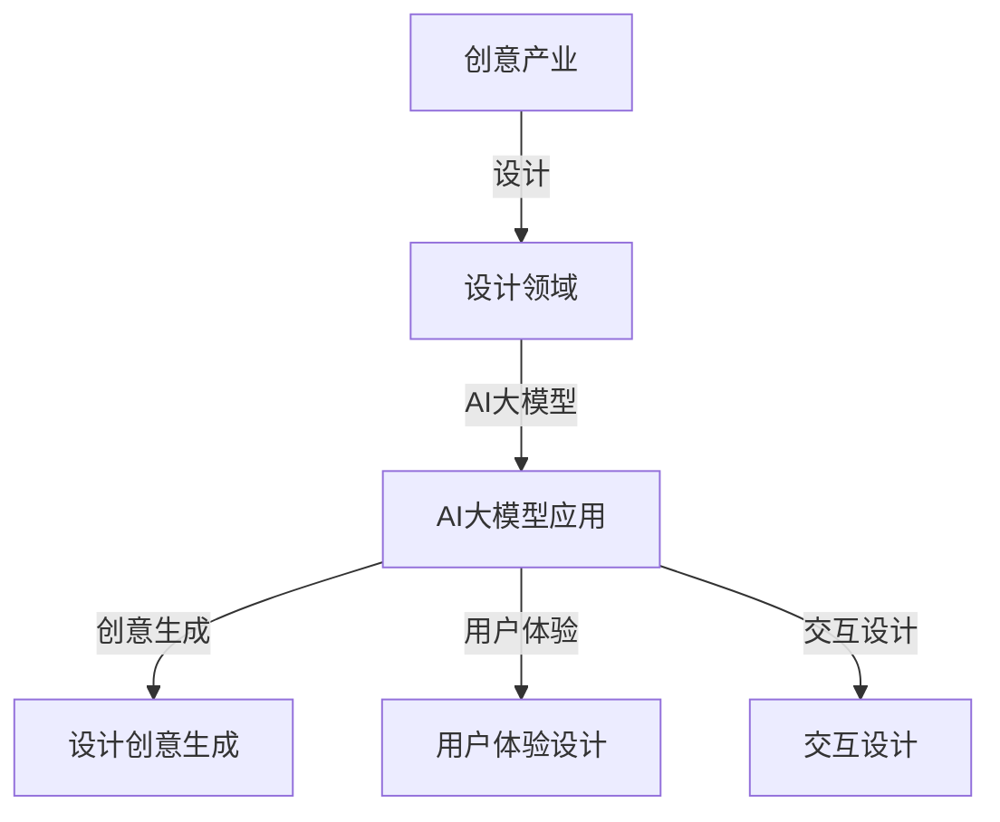

                 

## 《创意产业变革：AI大模型在设计领域的应用》

### 关键词
- 创意产业
- AI大模型
- 设计
- 应用
- 变革

### 摘要
本文将探讨创意产业中设计领域的变革，重点分析AI大模型的应用及其带来的影响。我们将从创意产业的概述、AI大模型的基础知识、AI大模型在设计领域的具体应用、案例分析、挑战与未来趋势，到实践指南，全面剖析AI大模型在设计领域的潜力与挑战，为读者提供深入的技术见解和实践指导。

---

### 《创意产业变革：AI大模型在设计领域的应用》目录大纲

#### 第一部分：引言与背景
- **第1章：创意产业概述**
  - **1.1 创意产业的定义与分类**
  - **1.2 创意产业在全球经济中的地位**
  - **1.3 设计在创意产业中的作用**

#### 第二部分：AI大模型基础
- **第2章：AI大模型概述**
  - **2.1 AI大模型的概念**
  - **2.2 AI大模型的技术发展历程**
  - **2.3 主流AI大模型介绍**
    - **2.3.1 GPT系列模型**
    - **2.3.2 BERT及其变体**
    - **2.3.3 其他知名大模型**

#### 第三部分：AI大模型在设计领域的应用
- **第3章：AI大模型在设计中的核心作用**
  - **3.1 AI大模型在设计创意生成中的应用**
  - **3.2 AI大模型在用户体验设计中的应用**
  - **3.3 AI大模型在交互设计中的应用**

#### 第四部分：AI大模型设计应用案例分析
- **第4章：创意产业中的AI大模型应用案例**
  - **4.1 案例研究一：AI大模型在游戏设计中的应用**
  - **4.2 案例研究二：AI大模型在影视制作中的应用**
  - **4.3 案例研究三：AI大模型在建筑设计中的应用**

#### 第五部分：AI大模型设计应用挑战与未来趋势
- **第5章：AI大模型在设计应用中的挑战**
  - **5.1 数据隐私与伦理问题**
  - **5.2 技术与创意融合的难题**
  - **5.3 AI大模型设计人才的培养**

#### 第六部分：AI大模型设计应用实践
- **第6章：AI大模型设计应用实践指南**
  - **6.1 实践一：搭建AI大模型设计应用环境**
  - **6.2 实践二：设计一个AI大模型创意生成应用**
  - **6.3 实践三：AI大模型用户体验设计实战**

#### 第七部分：附录
- **附录A：AI大模型设计应用相关资源**
  - **A.1 开发工具和框架推荐**
  - **A.2 学习资源和参考资料**

---

**核心概念与联系**

以下是一个简化的Mermaid流程图，展示了本文讨论的核心概念及其相互关系：



**核心算法原理讲解**

在本节中，我们将简要介绍生成式对抗网络（GAN）的基本原理，这是AI大模型设计中常见的一种算法。

### 生成式对抗网络（GAN）

GAN由两部分组成：生成器（Generator）和判别器（Discriminator）。生成器的任务是生成逼真的数据，而判别器的任务是区分真实数据和生成数据。

#### 生成器（Generator）

生成器的目标是从一个随机噪声分布中生成数据。以下是一个简单的生成器伪代码示例：

```python
# 伪代码：生成器
def generator(z):
    # z 是一个随机噪声向量
    x = dense(128, activation='relu')(z)
    x = dense(256, activation='relu')(x)
    x = dense(output_shape, activation='tanh')(x)
    model = Model(inputs=z, outputs=x)
    return model
```

#### 判别器（Discriminator）

判别器的目标是判断输入数据是真实的还是生成的。以下是一个简单的判别器伪代码示例：

```python
# 伪代码：判别器
def discriminator(x):
    x = dense(128, activation='relu')(x)
    x = dense(256, activation='relu')(x)
    output = dense(1, activation='sigmoid')(x)
    model = Model(inputs=x, outputs=output)
    return model
```

#### 损失函数

GAN的训练过程是通过对抗两个模型的交互来完成的。以下是一个简单的损失函数示例：

```python
# 伪代码：损失函数
def loss_function(real_data, fake_data, discriminator):
    real_loss = K.mean(-K.log(discriminator(real_data)))
    fake_loss = K.mean(-K.log(1 - discriminator(fake_data)))
    total_loss = real_loss + fake_loss
    return total_loss
```

#### 训练过程

GAN的训练过程涉及到交替更新生成器和判别器。以下是一个简单的训练过程伪代码示例：

```python
# 伪代码：GAN训练过程
for epoch in range(num_epochs):
    for real_data in data_loader:
        # 训练判别器
        d_loss_real = loss_function(real_data, generator(z_fake), discriminator)
        d_loss_fake = loss_function(fake_data, generator(z_real), discriminator)
        d_total_loss = d_loss_real + d_loss_fake

        # 更新判别器权重
        optimizer_d.update(d_total_loss)

        for z_real, z_fake in zip(z_real_loader, z_fake_loader):
            # 训练生成器
            g_loss = loss_function(fake_data, generator(z_real), discriminator)
            
            # 更新生成器权重
            optimizer_g.update(g_loss)

    # 在每个epoch结束后，保存模型权重
    model.save_weights('model_weights.h5')
```

**数学模型和数学公式讲解**

以下是一些GAN中常用的数学模型和数学公式。

### 判别器损失函数（D_loss）

$$ D(x, \hat{y}) = \int p(y|x) q(y|x) dy $$

其中，$x$ 是真实数据，$\hat{y}$ 是判别器的预测输出。

### 生成器损失函数（G_loss）

$$ G(z, \hat{x}) = \int p(x|z) q(z|x) dz $$

其中，$z$ 是随机噪声，$\hat{x}$ 是生成器的预测输出。

### 项目实战

在本节中，我们将介绍一个具体的GAN项目实战——生成人脸图像。

#### 开发环境搭建

1. 安装Python、TensorFlow等。
2. 配置GPU支持。

#### 源代码实现

以下是一个生成人脸图像的GAN项目示例。

```python
import tensorflow as tf
from tensorflow.keras.layers import Dense, Input
from tensorflow.keras.models import Model

# 生成器模型
def generator(z):
    x = Dense(128, activation='relu')(z)
    x = Dense(256, activation='relu')(x)
    x = Dense(784, activation='tanh')(x)
    model = Model(inputs=z, outputs=x)
    return model

# 判别器模型
def discriminator(x):
    x = Dense(128, activation='relu')(x)
    x = Dense(256, activation='relu')(x)
    output = Dense(1, activation='sigmoid')(x)
    model = Model(inputs=x, outputs=output)
    return model

# GAN模型
def gan(generator, discriminator):
    z = Input(shape=(100,))
    x = generator(z)
    valid = discriminator(x)
    fake = discriminator(z)
    model = Model(inputs=z, outputs=[valid, fake])
    return model

# 损失函数
def loss_function(real_data, fake_data, discriminator):
    real_loss = K.mean(-K.log(discriminator(real_data)))
    fake_loss = K.mean(-K.log(1 - discriminator(fake_data)))
    total_loss = real_loss + fake_loss
    return total_loss

# 模型编译
discriminator.compile(optimizer='adam', loss='binary_crossentropy')
generator.compile(optimizer='adam', loss='binary_crossentropy')
gan_model = gan(generator, discriminator)
gan_model.compile(optimizer='adam', loss='binary_crossentropy')

# 训练模型
for epoch in range(num_epochs):
    for real_data in data_loader:
        # 训练判别器
        d_loss_real = loss_function(real_data, generator(z_fake), discriminator)
        d_loss_fake = loss_function(fake_data, generator(z_real), discriminator)
        d_total_loss = d_loss_real + d_loss_fake

        # 更新判别器权重
        optimizer_d.update(d_total_loss)

        for z_real, z_fake in zip(z_real_loader, z_fake_loader):
            # 训练生成器
            g_loss = loss_function(fake_data, generator(z_real), discriminator)
            
            # 更新生成器权重
            optimizer_g.update(g_loss)

    # 在每个epoch结束后，保存模型权重
    model.save_weights('model_weights.h5')
```

#### 代码解读与分析

1. **生成器模型**：定义了一个简单的全连接网络，用于从随机噪声中生成人脸图像。
2. **判别器模型**：定义了一个简单的全连接网络，用于判断输入数据是真实人脸图像还是生成的人脸图像。
3. **GAN模型**：将生成器和判别器组合在一起，形成一个整体模型。
4. **损失函数**：使用二元交叉熵作为损失函数，用于衡量生成器和判别器的性能。
5. **模型编译**：编译模型，指定优化器和损失函数。
6. **训练模型**：使用交替训练策略，交替更新生成器和判别器的权重。

---

### 附录A：AI大模型设计应用相关资源

#### A.1 开发工具和框架推荐

- **TensorFlow**：由Google开发的开源机器学习框架，支持GPU加速。
- **PyTorch**：由Facebook开发的开源机器学习库，具有动态计算图。
- **Keras**：基于TensorFlow和Theano的开源神经网络库，易于使用。

#### A.2 学习资源和参考资料

- **《深度学习》（Ian Goodfellow等著）**：深度学习的经典教材。
- **《Generative Adversarial Networks: Theory and Applications》（张翔著）**：GAN的深入讲解。
- **相关在线课程和教程（如Udacity、Coursera等）**：提供丰富的AI和GAN学习资源。

