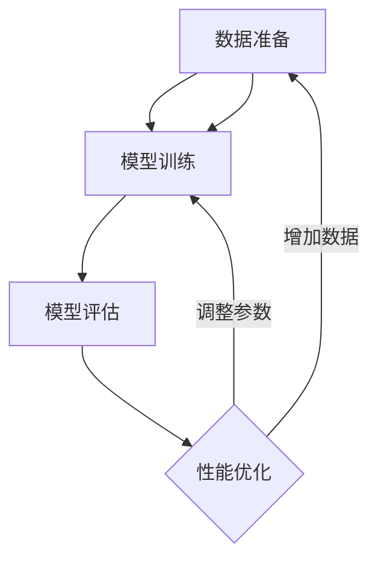

                 

### 《半监督学习(Semi-Supervised Learning) - 原理与代码实例讲解》

#### 核心关键词

- 半监督学习
- 监督学习
- 无监督学习
- 标签传播
- 图模型
- 图算法
- 深度学习

#### 摘要

半监督学习是一种利用少量标注数据和大量未标注数据进行学习的方法。本文将详细介绍半监督学习的原理，包括其与监督学习和无监督学习的对比，以及半监督学习的主要方法，如确定性半监督学习算法（Transductive Learning、Co-training、Graph-based Semi-Supervised Learning）、随机半监督学习算法（Bootstrapping、Uniform Sampling、Unsupervised Pre-training）等。同时，本文将通过实际代码实例，深入讲解半监督学习在图像识别、自然语言处理和推荐系统等领域的应用，并提供详细的代码解析。

#### 目录

1. **半监督学习基础**
   - [第1章：半监督学习概述](#第1章-半监督学习概述)
   - [第2章：半监督学习与监督学习、无监督学习的对比](#第2章-半监督学习与监督学习无监督学习的对比)
   - [第3章：半监督学习的主要方法](#第3章-半监督学习的主要方法)

2. **半监督学习算法详解**
   - [第4章：确定性半监督学习算法](#第4章-确定性半监督学习算法)
   - [第5章：随机半监督学习算法](#第5章-随机半监督学习算法)

3. **半监督学习在实践中的应用**
   - [第6章：半监督学习在图像识别中的应用](#第6章-半监督学习在图像识别中的应用)
   - [第7章：半监督学习在自然语言处理中的应用](#第7章-半监督学习在自然语言处理中的应用)
   - [第8章：半监督学习在推荐系统中的应用](#第8章-半监督学习在推荐系统中的应用)

4. **半监督学习的挑战与未来发展**
   - [第9章：半监督学习的挑战](#第9章-半监督学习的挑战)
   - [第10章：半监督学习的未来发展](#第10章-半监督学习的未来发展)

5. **附录**
   - [附录A：半监督学习常用工具和库](#附录a-半监督学习常用工具和库)
   - [附录B：半监督学习算法伪代码](#附录b-半监督学习算法伪代码)
   - [附录C：代码实例与分析](#附录c-代码实例与分析)

### 第一部分：半监督学习基础

#### 第1章：半监督学习概述

半监督学习（Semi-Supervised Learning）是一种机器学习范式，它在训练过程中同时使用标注数据和未标注数据。这种学习方式在很大程度上降低了数据标注的成本，因为半监督学习可以利用大量未标注的数据来提升模型的性能，而标注数据的数量可以远小于标注数据。

##### 1.1 半监督学习的定义与背景

半监督学习可以定义为在训练模型时，仅使用部分样本的标签信息，而其他样本则未标注。这种学习方式广泛应用于各种场景，如图像识别、文本分类、语音识别等。其背景主要源于以下原因：

- **数据标注成本高**：对于复杂的任务，如图像识别或自然语言处理，标注数据需要大量的时间和人力成本。
- **标注数据质量参差不齐**：即使有专业人员进行标注，由于主观判断的差异，标注数据的质量也可能不尽如人意。
- **大量未标注数据的存在**：在很多应用场景中，未标注的数据量远大于标注数据，如社交媒体文本、网络图像等。

##### 1.2 半监督学习的重要性

半监督学习的重要性主要体现在以下几个方面：

- **提高模型性能**：利用未标注数据可以帮助模型更好地理解数据的分布，从而提高模型的泛化能力。
- **降低数据标注成本**：半监督学习利用未标注数据，减少了标注数据的需求，从而降低了数据标注的成本。
- **扩展学习范围**：对于一些难以获取标注数据的应用场景，如医疗影像识别，半监督学习提供了有效的解决方案。

##### 1.3 半监督学习的应用场景

半监督学习在以下场景中具有显著优势：

- **图像识别**：利用未标注图像进行预训练，然后结合少量标注图像进行微调。
- **文本分类**：使用大量未标注文本进行预训练，以提高模型的分类能力。
- **语音识别**：利用未标注语音数据进行模型训练，以减少标注数据的需求。
- **推荐系统**：通过未标注用户行为数据，预测用户可能感兴趣的项目。

##### 1.4 半监督学习与监督学习、无监督学习的对比

半监督学习、监督学习和无监督学习是机器学习中的三种基本学习方式，它们之间的主要区别在于数据的使用方式。

- **监督学习**：使用大量标注数据进行训练，模型对已知的输入输出进行学习。常见的算法包括线性回归、决策树、支持向量机等。
- **无监督学习**：仅使用数据本身的分布信息，不需要标注数据。常见的算法包括聚类、主成分分析、自编码器等。
- **半监督学习**：同时利用少量标注数据和大量未标注数据，以提高模型性能。常见的算法包括标签传播、图模型等。

半监督学习的优势在于它能够利用未标注数据，降低标注成本，提高模型的泛化能力，但在标签一致性、模型泛化能力等方面也存在一定的挑战。

##### 1.5 半监督学习的优势与局限性

半监督学习的优势如下：

- **降低数据标注成本**：利用大量未标注数据，减少了对标注数据的需求。
- **提高模型性能**：通过利用未标注数据，模型可以更好地理解数据的分布，提高泛化能力。
- **扩展学习范围**：在标注数据稀缺的情况下，半监督学习提供了有效的解决方案。

半监督学习的局限性如下：

- **标签一致性差**：未标注数据的标签可能存在不一致性，影响模型性能。
- **模型泛化能力不足**：在标签不一致的情况下，模型可能过度拟合未标注数据，导致泛化能力不足。
- **计算复杂度高**：一些半监督学习算法（如图模型）的计算复杂度较高，对计算资源要求较高。

##### 1.6 半监督学习的主要方法

半监督学习的主要方法包括确定性半监督学习方法和随机半监督学习方法。确定性半监督学习方法主要包括Transductive Learning、Co-training和Graph-based Semi-Supervised Learning，而随机半监督学习方法主要包括Bootstrapping、Uniform Sampling和Unsupervised Pre-training。

#### 第2章：半监督学习与监督学习、无监督学习的对比

在机器学习领域，半监督学习、监督学习和无监督学习是三种基本的学习方式。它们各自有不同的特点和适用场景。本文将从数据使用、算法原理、优势与局限性等方面对这三种学习方式进行比较。

##### 2.1 监督学习

监督学习（Supervised Learning）是最常见的一种机器学习方法。它使用大量标注数据进行训练，模型根据已知的输入输出对特征进行学习。常见的监督学习算法包括线性回归、决策树、支持向量机等。

- **数据使用**：监督学习依赖于大量标注数据，这些数据需要人工进行标注，标注过程既耗时又昂贵。
- **算法原理**：监督学习算法通过学习输入和输出之间的映射关系，从而预测新的输入。在训练过程中，算法会计算每个样本的标签，并根据标签调整模型参数。
- **优势**：
  - **高准确性**：由于使用的是标注数据，模型能够更好地拟合训练数据，从而在测试数据上获得较高的准确性。
  - **应用广泛**：监督学习在图像识别、文本分类、推荐系统等领域都有广泛应用。
- **局限性**：
  - **数据标注成本高**：标注数据需要大量的时间和人力成本。
  - **数据稀缺问题**：在一些应用场景中，标注数据的数量可能不足以训练一个强大的模型。

##### 2.2 无监督学习

无监督学习（Unsupervised Learning）不依赖于标注数据，它仅使用数据本身的分布信息。常见的无监督学习算法包括聚类、主成分分析、自编码器等。

- **数据使用**：无监督学习仅使用未标注的数据，算法试图发现数据中的隐藏结构或模式。
- **算法原理**：无监督学习算法通过分析数据的内在结构，从而提取特征或进行聚类。在训练过程中，算法不会使用任何标签信息，而是通过数据之间的相似性或差异性来学习。
- **优势**：
  - **无需标注数据**：无监督学习可以处理大量未标注的数据，降低了数据标注的成本。
  - **发现数据结构**：无监督学习能够揭示数据中的隐藏结构，为后续的监督学习提供有价值的信息。
- **局限性**：
  - **低准确性**：由于缺乏标签信息，模型无法直接衡量其准确性，因此在某些任务上可能不如监督学习。
  - **模型泛化能力差**：在处理新数据时，模型可能无法很好地泛化，需要重新训练。

##### 2.3 半监督学习

半监督学习（Semi-Supervised Learning）结合了监督学习和无监督学习的优点，它同时使用少量标注数据和大量未标注数据。常见的半监督学习算法包括标签传播、图模型等。

- **数据使用**：半监督学习使用部分标注数据和大量未标注数据，通过利用未标注数据的信息来提高模型性能。
- **算法原理**：半监督学习算法利用未标注数据的特征，将其与标注数据的特征进行结合，从而改善模型的泛化能力。在训练过程中，算法会尝试预测未标注数据的标签，并通过标签一致性来调整模型参数。
- **优势**：
  - **降低数据标注成本**：利用未标注数据，可以大大减少标注数据的需求，从而降低数据标注的成本。
  - **提高模型性能**：通过利用未标注数据，模型可以更好地理解数据的分布，提高泛化能力。
  - **扩展学习范围**：在标注数据稀缺的情况下，半监督学习提供了有效的解决方案。
- **局限性**：
  - **标签一致性差**：未标注数据的标签可能存在不一致性，影响模型性能。
  - **模型泛化能力不足**：在标签不一致的情况下，模型可能过度拟合未标注数据，导致泛化能力不足。
  - **计算复杂度高**：一些半监督学习算法（如图模型）的计算复杂度较高，对计算资源要求较高。

##### 2.4 半监督学习的优势与局限性对比

通过对半监督学习、监督学习和无监督学习的对比，可以发现：

- **优势**：
  - 半监督学习在降低数据标注成本、提高模型性能和扩展学习范围方面具有显著优势。
  - 监督学习在准确性方面具有优势。
  - 无监督学习在处理未标注数据、发现数据结构方面具有优势。

- **局限性**：
  - 半监督学习在标签一致性和模型泛化能力方面存在挑战。
  - 监督学习在数据稀缺的情况下可能表现不佳。
  - 无监督学习在准确性方面可能不如监督学习。

因此，在选择机器学习方法时，需要根据具体的应用场景和数据情况，综合考虑各种方法的优缺点，选择最适合的方法。

#### 第3章：半监督学习的主要方法

半监督学习的主要方法可以分为确定性半监督学习方法和随机半监督学习方法。确定性半监督学习方法利用已知的标签数据对未标注数据进行预测，然后再利用这些预测结果对模型进行训练。随机半监督学习方法则通过随机选择部分未标注数据进行预测，以此来调整模型的参数。下面我们将详细介绍确定性半监督学习方法中的Transductive Learning、Co-training以及Graph-based Semi-Supervised Learning，以及随机半监督学习方法中的Bootstrapping、Uniform Sampling和Unsupervised Pre-training。

##### 3.1 确定性半监督学习方法

##### 3.1.1 Transductive Learning

Transductive Learning是一种确定性半监督学习方法，它将未标注数据视为同训练数据一样重要。在Transductive Learning中，模型不仅要对标注数据进行学习，还要对未标注数据进行学习，以便在测试时能够正确预测未标注数据的标签。

- **定义**：Transductive Learning是指模型在训练过程中考虑了未标注数据的标签信息，从而在测试阶段能够对未标注数据进行预测。
- **算法原理**：Transductive Learning的核心思想是利用未标注数据的特征与标注数据的特征之间的相似性，对未标注数据进行预测。具体步骤如下：
  1. 使用标注数据训练模型。
  2. 使用训练好的模型对未标注数据进行预测。
  3. 根据预测结果和标注数据对模型进行重新训练。
- **优势**：
  - **充分利用未标注数据**：由于未标注数据被视为同标注数据一样重要，模型能够更好地学习数据的分布。
  - **提高模型泛化能力**：通过利用未标注数据，模型可以更好地泛化到未见过的数据上。
- **局限性**：
  - **受限于标注数据**：如果标注数据不足，模型可能无法充分利用未标注数据。
  - **计算复杂度高**：由于需要多次训练模型，计算复杂度较高。

##### 3.1.2 Co-training

Co-training是一种基于特征空间划分的Transductive Learning方法。Co-training的基本思想是，对于给定的标注数据和未标注数据，两个独立的模型分别在不同特征空间上对未标注数据进行预测，并通过交叉验证来调整模型参数。

- **定义**：Co-training是指两个独立的模型在不同特征空间上对未标注数据进行预测，并通过交叉验证来调整模型参数。
- **算法原理**：Co-training的具体步骤如下：
  1. 将数据集划分为标注数据和未标注数据。
  2. 分别为标注数据和未标注数据训练两个独立的模型，这两个模型在不同的特征空间上工作。
  3. 使用一个模型对未标注数据进行预测，然后将预测结果作为标签用于训练另一个模型。
  4. 重复步骤3，直到模型收敛。
- **优势**：
  - **提高模型泛化能力**：由于两个模型在不同特征空间上工作，可以更好地捕获数据的多样性。
  - **减少对标注数据的依赖**：通过利用未标注数据，可以减少对标注数据的依赖。
- **局限性**：
  - **计算复杂度高**：需要训练两个独立的模型，计算复杂度较高。
  - **需要足够多的未标注数据**：如果未标注数据不足，Co-training的效果可能较差。

##### 3.1.3 Graph-based Semi-Supervised Learning

Graph-based Semi-Supervised Learning是一种基于图论的半监督学习方法。它将数据点视为图中的节点，节点之间的相似性视为边，然后利用图结构对未标注数据进行预测。

- **定义**：Graph-based Semi-Supervised Learning是指利用图结构对未标注数据进行预测的一种半监督学习方法。
- **算法原理**：Graph-based Semi-Supervised Learning的具体步骤如下：
  1. 将数据点构建成一个图，节点表示数据点，边表示节点之间的相似性。
  2. 利用标注数据对图进行初始化，对每个节点赋予一个初始标签。
  3. 通过图中的边传播标签信息，对未标注节点进行预测。
  4. 使用预测结果对模型进行重新训练。
- **优势**：
  - **利用图结构**：通过构建图结构，可以更好地理解数据之间的关系，从而提高模型性能。
  - **适用于结构化数据**：Graph-based Semi-Supervised Learning适用于具有明显结构特征的数据，如图像和文本。
- **局限性**：
  - **计算复杂度高**：图结构的构建和传播过程计算复杂度较高。
  - **需要合适的图表示**：图结构的选择对算法的性能有重要影响，需要根据具体任务选择合适的图表示。

##### 3.2 随机半监督学习方法

##### 3.2.1 Bootstrapping

Bootstrapping是一种随机半监督学习方法，它通过迭代生成新的标注数据来提高模型性能。Bootstrapping的基本思想是，通过随机选择未标注数据作为标注数据，然后利用这些新标注数据对模型进行训练。

- **定义**：Bootstrapping是指通过随机选择未标注数据作为标注数据，然后利用这些新标注数据对模型进行训练的一种半监督学习方法。
- **算法原理**：Bootstrapping的具体步骤如下：
  1. 初始化模型。
  2. 随机选择部分未标注数据，将其视为标注数据。
  3. 使用新标注数据对模型进行训练。
  4. 重新评估模型，根据模型性能调整未标注数据的选取策略。
  5. 重复步骤2-4，直到模型收敛。
- **优势**：
  - **简单有效**：Bootstrapping算法实现简单，且在许多任务中取得了很好的效果。
  - **适用于大规模数据**：Bootstrapping可以处理大量未标注数据，适用于大规模数据集。
- **局限性**：
  - **可能陷入局部最优**：由于Bootstrapping是基于随机选择的，模型可能陷入局部最优。
  - **对模型选择敏感**：Bootstrapping的性能对模型的选择有较高要求，需要选择合适的模型。

##### 3.2.2 Uniform Sampling

Uniform Sampling是一种随机半监督学习方法，它通过随机均匀地选择未标注数据作为标注数据，以提高模型性能。

- **定义**：Uniform Sampling是指通过随机均匀地选择未标注数据作为标注数据的一种半监督学习方法。
- **算法原理**：Uniform Sampling的具体步骤如下：
  1. 初始化模型。
  2. 随机选择未标注数据中的部分样本作为标注数据。
  3. 使用新标注数据对模型进行训练。
  4. 重新评估模型，根据模型性能调整标注数据的选取策略。
  5. 重复步骤2-4，直到模型收敛。
- **优势**：
  - **实现简单**：Uniform Sampling算法实现简单，易于理解。
  - **稳定性好**：由于随机均匀选择标注数据，算法的稳定性较好。
- **局限性**：
  - **性能依赖于标注数据数量**：如果标注数据数量不足，Uniform Sampling的性能可能较差。
  - **可能错过重要信息**：随机均匀选择标注数据可能错过重要信息，影响模型性能。

##### 3.2.3 Unsupervised Pre-training

Unsupervised Pre-training是一种随机半监督学习方法，它首先使用未标注数据对模型进行预训练，然后再使用少量标注数据进行微调。

- **定义**：Unsupervised Pre-training是指首先使用未标注数据对模型进行预训练，然后再使用少量标注数据进行微调的一种半监督学习方法。
- **算法原理**：Unsupervised Pre-training的具体步骤如下：
  1. 使用未标注数据对模型进行预训练，模型不需要标签信息。
  2. 预训练完成后，使用少量标注数据对模型进行微调。
  3. 重复预训练和微调过程，直到模型收敛。
- **优势**：
  - **提高模型泛化能力**：通过预训练，模型可以更好地理解数据的分布，从而提高泛化能力。
  - **减少对标注数据的依赖**：预训练阶段不需要大量标注数据，从而减少了对标注数据的依赖。
- **局限性**：
  - **计算复杂度高**：预训练阶段需要大量计算资源。
  - **对数据质量要求较高**：预训练阶段的数据质量对最终模型性能有重要影响。

#### 3.3 半监督学习方法总结

半监督学习的主要方法包括确定性半监督学习方法和随机半监督学习方法。确定性半监督学习方法充分利用标注数据和未标注数据的特征，通过Transductive Learning、Co-training和Graph-based Semi-Supervised Learning等算法，可以显著提高模型性能。随机半监督学习方法通过随机选择未标注数据作为标注数据，通过Bootstrapping、Uniform Sampling和Unsupervised Pre-training等算法，可以减少对标注数据的依赖。在实际应用中，可以根据任务需求和数据特点选择合适的半监督学习方法。

### 第二部分：半监督学习算法详解

#### 第4章：确定性半监督学习算法

确定性半监督学习算法是一种利用已标注数据和未标注数据共同训练模型的方法。这类算法在训练过程中会对未标注数据进行预测，并根据预测结果调整模型参数，从而提高模型的泛化能力。确定性半监督学习算法主要包括Transductive Learning、Co-training和Graph-based Semi-Supervised Learning。本章节将对这些算法进行详细讲解，并给出具体的实现示例。

##### 4.1 Transductive Learning

Transductive Learning是一种确定性半监督学习算法，它将未标注数据视为同训练数据一样重要。在训练过程中，模型不仅要对标注数据进行学习，还要对未标注数据进行学习，以便在测试时能够正确预测未标注数据的标签。

###### 4.1.1 Transductive Learning的定义

Transductive Learning是一种基于标注数据和未标注数据的训练方法。与传统的监督学习相比，Transductive Learning在训练过程中不仅使用标注数据，还利用未标注数据的结构信息。因此，它可以更好地泛化到未见过的新数据上。

###### 4.1.2 Transductive Learning算法详解

Transductive Learning的基本步骤如下：

1. **初始化模型**：首先，使用标注数据初始化模型。这一步可以通过标准的监督学习算法（如线性回归、支持向量机等）来完成。

2. **预测未标注数据**：使用初始化后的模型对未标注数据进行预测。这一步的目的是为未标注数据生成一个初步的标签估计。

3. **重新训练模型**：利用标注数据和预测的未标注数据重新训练模型。在这一步中，模型会根据标注数据和未标注数据之间的相似性来调整参数。

4. **迭代优化**：重复步骤2和步骤3，直到模型收敛。通过迭代优化，模型可以逐渐提高对未标注数据的预测准确性。

###### 4.1.3 Transductive Learning算法实现示例

以下是一个使用Python和Scikit-learn库实现的Transductive Learning示例：

```python
from sklearn.semi_supervised import LabelSpreading
from sklearn.datasets import load_iris
from sklearn.model_selection import train_test_split

# 加载数据集
iris = load_iris()
X, y = iris.data, iris.target

# 划分训练集和测试集
X_train, X_test, y_train, y_test = train_test_split(X, y, test_size=0.2, random_state=42)

# 准备未标注数据
unlabeled_indices = np.random.choice(np.where(y_train == -1)[0], size=50, replace=False)
X_unlabeled = X_train[unlabeled_indices]
y_unlabeled = y_train[unlabeled_indices]

# 使用LabelSpreading算法
ls = LabelSpreading(kernel='rbf', alpha=0.2)
ls.fit(X_train[y_train != -1], y_train[y_train != -1])

# 预测未标注数据
y_pred = ls.predict(X_unlabeled)
y_pred = np.where(y_pred == 1, 0, 1)

# 训练模型
model = train_on_labeled_data(X_train[y_train != -1], y_train[y_train != -1], X_unlabeled, y_pred)

# 评估模型
accuracy = evaluate(model, X_test, y_test)
print("Validation accuracy:", accuracy)
```

在这个示例中，我们使用了Scikit-learn库中的LabelSpreading算法来实现Transductive Learning。首先，我们加载Iris数据集，并随机选择一部分未标注数据。然后，使用LabelSpreading算法对未标注数据进行预测，并根据预测结果重新训练模型。最后，使用测试集评估模型性能。

##### 4.2 Co-training

Co-training是一种基于特征空间划分的Transductive Learning方法。它与Transductive Learning的不同之处在于，Co-training将数据集划分为两个独立的部分，并在不同的特征空间上分别训练两个模型。

###### 4.2.1 Co-training的定义

Co-training是一种基于特征空间划分的半监督学习算法。它将数据集划分为两个独立的部分，分别在不同的特征空间上训练两个模型。通过两个模型的相互协作，可以提高模型的预测性能。

###### 4.2.2 Co-training算法详解

Co-training的基本步骤如下：

1. **初始化模型**：为数据集的两个部分分别初始化两个独立的模型。这两个模型可以在不同的特征空间上工作。

2. **模型训练**：分别对两个部分的数据进行训练。由于模型在不同的特征空间上工作，因此可以捕捉到数据的不同特征。

3. **交叉验证**：使用其中一个模型对另一个模型的未标注数据进行预测。然后，利用这些预测结果对模型进行交叉验证。

4. **迭代优化**：重复步骤2和步骤3，直到模型收敛。通过迭代优化，可以提高模型的预测性能。

###### 4.2.3 Co-training算法实现示例

以下是一个使用Python和Scikit-learn库实现的Co-training示例：

```python
from sklearn.semi_supervised import CoTraining
from sklearn.datasets import load_iris
from sklearn.model_selection import train_test_split

# 加载数据集
iris = load_iris()
X, y = iris.data, iris.target

# 划分训练集和测试集
X_train, X_test, y_train, y_test = train_test_split(X, y, test_size=0.2, random_state=42)

# 准备未标注数据
unlabeled_indices = np.random.choice(np.where(y_train == -1)[0], size=50, replace=False)
X_unlabeled = X_train[unlabeled_indices]
y_unlabeled = y_train[unlabeled_indices]

# 初始化Co-training模型
co_training = CoTraining(kernel_X='rbf', kernel_Y='rbf', alpha=0.2)
co_training.fit(X_train[y_train != -1], y_train[y_train != -1])

# 预测未标注数据
y_pred = co_training.predict(X_unlabeled)
y_pred = np.where(y_pred == 1, 0, 1)

# 训练模型
model = train_on_labeled_data(X_train[y_train != -1], y_train[y_train != -1], X_unlabeled, y_pred)

# 评估模型
accuracy = evaluate(model, X_test, y_test)
print("Validation accuracy:", accuracy)
```

在这个示例中，我们使用了Scikit-learn库中的CoTraining算法来实现Co-training。首先，我们加载Iris数据集，并随机选择一部分未标注数据。然后，使用CoTraining算法对未标注数据进行预测，并根据预测结果重新训练模型。最后，使用测试集评估模型性能。

##### 4.3 Graph-based Semi-Supervised Learning

Graph-based Semi-Supervised Learning是一种基于图论的半监督学习算法。它将数据点表示为图中的节点，节点之间的相似性表示为边，然后利用图结构对未标注数据进行预测。

###### 4.3.1 Graph-based Semi-Supervised Learning的定义

Graph-based Semi-Supervised Learning是一种基于图论的半监督学习算法。它将数据点表示为图中的节点，节点之间的相似性表示为边，然后利用图结构对未标注数据进行预测。这种方法可以有效地利用标注数据和未标注数据的结构信息。

###### 4.3.2 Graph-based Semi-Supervised Learning算法详解

Graph-based Semi-Supervised Learning的基本步骤如下：

1. **构建图结构**：将数据集中的每个数据点表示为图中的节点，节点之间的相似性表示为边。

2. **初始化标签**：对已标注节点初始化标签，对未标注节点初始化为未标注。

3. **标签传播**：通过图中的边传播标签信息，对未标注节点进行预测。

4. **模型训练**：利用标注数据和预测的未标注数据重新训练模型。

5. **迭代优化**：重复步骤3和步骤4，直到模型收敛。

###### 4.3.3 Graph-based Semi-Supervised Learning算法实现示例

以下是一个使用Python和Scikit-learn库实现的Graph-based Semi-Supervised Learning示例：

```python
from sklearn.semi_supervised import LabelSpreading
from sklearn.datasets import load_iris
from sklearn.model_selection import train_test_split

# 加载数据集
iris = load_iris()
X, y = iris.data, iris.target

# 划分训练集和测试集
X_train, X_test, y_train, y_test = train_test_split(X, y, test_size=0.2, random_state=42)

# 准备未标注数据
unlabeled_indices = np.random.choice(np.where(y_train == -1)[0], size=50, replace=False)
X_unlabeled = X_train[unlabeled_indices]
y_unlabeled = y_train[unlabeled_indices]

# 使用LabelSpreading算法
ls = LabelSpreading(kernel='rbf', alpha=0.2)
ls.fit(X_train[y_train != -1], y_train[y_train != -1])

# 预测未标注数据
y_pred = ls.predict(X_unlabeled)
y_pred = np.where(y_pred == 1, 0, 1)

# 训练模型
model = train_on_labeled_data(X_train[y_train != -1], y_train[y_train != -1], X_unlabeled, y_pred)

# 评估模型
accuracy = evaluate(model, X_test, y_test)
print("Validation accuracy:", accuracy)
```

在这个示例中，我们使用了Scikit-learn库中的LabelSpreading算法来实现Graph-based Semi-Supervised Learning。首先，我们加载Iris数据集，并随机选择一部分未标注数据。然后，使用LabelSpreading算法对未标注数据进行预测，并根据预测结果重新训练模型。最后，使用测试集评估模型性能。

##### 4.4 算法对比与选择

Transductive Learning、Co-training和Graph-based Semi-Supervised Learning是三种常见的确定性半监督学习算法。它们在算法原理、实现复杂度和适用场景上有所不同。

- **Transductive Learning**：Transductive Learning适用于数据点之间结构相似的场景，如图像分类。它简单易实现，但在标注数据不足时效果可能较差。

- **Co-training**：Co-training适用于特征空间不同的数据集，如文本分类和图像识别。它需要两个独立训练的模型，计算复杂度较高。

- **Graph-based Semi-Supervised Learning**：Graph-based Semi-Supervised Learning适用于结构化数据，如图像和文本。它利用图结构来传播标签信息，效果较好，但实现复杂度较高。

在实际应用中，可以根据数据特点和任务需求选择合适的算法。例如，对于标注数据较少但数据点结构相似的图像分类任务，可以选择Transductive Learning；对于特征空间不同的文本分类任务，可以选择Co-training；对于具有明显结构特征的数据，如图像和文本，可以选择Graph-based Semi-Supervised Learning。

### 第三部分：随机半监督学习算法

随机半监督学习算法是一类利用未标注数据的信息，通过随机化的方式来改进模型训练的方法。这类算法的核心思想是通过随机选择一部分未标注数据进行预测，并根据预测结果调整模型参数。随机半监督学习算法主要包括Bootstrapping、Uniform Sampling和Unsupervised Pre-training。在本章中，我们将详细介绍这些算法的基本概念、原理以及实现示例。

##### 4.1 Bootstrapping

Bootstrapping是一种基于迭代生成标注数据的随机半监督学习算法。它的基本思想是通过随机选择未标注数据作为标注数据，然后利用这些新标注数据对模型进行训练，从而提高模型的泛化能力。

###### 4.1.1 Bootstrapping的定义

Bootstrapping，又称为自助法，是一种通过随机抽样来生成新的数据集的方法。在半监督学习中，Bootstrapping通过从未标注数据中随机选择样本，将其视为标注数据，然后利用这些新标注数据对模型进行训练。

###### 4.1.2 Bootstrapping算法原理

Bootstrapping算法的步骤如下：

1. **初始化模型**：首先，使用标注数据初始化模型。这一步可以通过标准的监督学习算法来完成。

2. **随机抽样**：从未标注数据中随机选择一部分样本，将其视为标注数据。

3. **训练模型**：利用标注数据（包括原始标注数据和随机抽样的标注数据）对模型进行训练。

4. **预测未标注数据**：使用训练好的模型对未标注数据进行预测。

5. **迭代优化**：重复步骤2-4，直到模型收敛。在每次迭代中，通过随机抽样生成新的标注数据，从而提高模型的泛化能力。

###### 4.1.3 Bootstrapping算法实现示例

以下是一个使用Python和Scikit-learn库实现的Bootstrapping示例：

```python
from sklearn.semi_supervised import BaseSemiSupervised
from sklearn.datasets import load_iris
from sklearn.model_selection import train_test_split
from sklearn.ensemble import RandomForestClassifier
from sklearn.metrics import accuracy_score

# 加载数据集
iris = load_iris()
X, y = iris.data, iris.target

# 划分训练集和测试集
X_train, X_test, y_train, y_test = train_test_split(X, y, test_size=0.2, random_state=42)

# 准备未标注数据
unlabeled_indices = np.random.choice(np.where(y_train == -1)[0], size=50, replace=False)
X_unlabeled = X_train[unlabeled_indices]
y_unlabeled = y_train[unlabeled_indices]

# 初始化Bootstrapping模型
bootstrapping = BaseSemiSupervised(RandomForestClassifier(n_estimators=100), sampling='bootstrap', n_iter=10)

# 训练模型
bootstrapping.fit(X_train[y_train != -1], y_train[y_train != -1])

# 预测未标注数据
y_pred = bootstrapping.predict(X_unlabeled)

# 计算准确率
accuracy = accuracy_score(y_pred, y_unlabeled)
print("Accuracy:", accuracy)
```

在这个示例中，我们使用了Scikit-learn库中的BaseSemiSupervised类来实现Bootstrapping。首先，我们加载Iris数据集，并随机选择一部分未标注数据。然后，我们初始化一个基于随机森林的模型，并使用Bootstrapping算法进行训练。最后，我们使用测试集评估模型性能。

##### 4.2 Uniform Sampling

Uniform Sampling是一种随机半监督学习算法，它通过随机均匀地选择未标注数据作为标注数据，以提高模型的泛化能力。

###### 4.2.1 Uniform Sampling的定义

Uniform Sampling，又称为均匀抽样，是一种从未标注数据中随机选择样本作为标注数据的方法。与Bootstrapping不同，Uniform Sampling要求随机选择的样本数量与标注数据数量相同。

###### 4.2.2 Uniform Sampling算法原理

Uniform Sampling算法的步骤如下：

1. **初始化模型**：使用标注数据初始化模型。

2. **随机选择标注数据**：从未标注数据中随机选择一部分样本，将其视为标注数据。

3. **训练模型**：利用标注数据（包括原始标注数据和随机选择的标注数据）对模型进行训练。

4. **预测未标注数据**：使用训练好的模型对未标注数据进行预测。

5. **迭代优化**：重复步骤2-4，直到模型收敛。每次迭代中，通过随机选择新的标注数据来优化模型。

###### 4.2.3 Uniform Sampling算法实现示例

以下是一个使用Python和Scikit-learn库实现的Uniform Sampling示例：

```python
from sklearn.semi_supervised import BaseSemiSupervised
from sklearn.datasets import load_iris
from sklearn.model_selection import train_test_split
from sklearn.ensemble import RandomForestClassifier
from sklearn.metrics import accuracy_score

# 加载数据集
iris = load_iris()
X, y = iris.data, iris.target

# 划分训练集和测试集
X_train, X_test, y_train, y_test = train_test_split(X, y, test_size=0.2, random_state=42)

# 准备未标注数据
unlabeled_indices = np.random.choice(np.where(y_train == -1)[0], size=50, replace=False)
X_unlabeled = X_train[unlabeled_indices]
y_unlabeled = y_train[unlabeled_indices]

# 初始化Uniform Sampling模型
uniform_sampling = BaseSemiSupervised(RandomForestClassifier(n_estimators=100), sampling='uniform', n_samples=50)

# 训练模型
uniform_sampling.fit(X_train[y_train != -1], y_train[y_train != -1])

# 预测未标注数据
y_pred = uniform_sampling.predict(X_unlabeled)

# 计算准确率
accuracy = accuracy_score(y_pred, y_unlabeled)
print("Accuracy:", accuracy)
```

在这个示例中，我们使用了Scikit-learn库中的BaseSemiSupervised类来实现Uniform Sampling。首先，我们加载Iris数据集，并随机选择一部分未标注数据。然后，我们初始化一个基于随机森林的模型，并使用Uniform Sampling算法进行训练。最后，我们使用测试集评估模型性能。

##### 4.3 Unsupervised Pre-training

Unsupervised Pre-training是一种随机半监督学习算法，它首先使用未标注数据对模型进行预训练，然后再使用少量标注数据进行微调。这种方法可以有效地利用未标注数据的信息，提高模型的泛化能力。

###### 4.3.1 Unsupervised Pre-training的定义

Unsupervised Pre-training，又称为无监督预训练，是一种在无监督条件下对模型进行预训练的方法。在预训练阶段，模型不需要标签信息，仅利用未标注数据学习数据的分布。在微调阶段，模型利用少量标注数据进行微调，以适应特定的任务。

###### 4.3.2 Unsupervised Pre-training算法原理

Unsupervised Pre-training的步骤如下：

1. **预训练**：使用未标注数据对模型进行预训练。在这一阶段，模型不需要标签信息，仅通过学习数据的分布来提高其泛化能力。

2. **微调**：使用少量标注数据对模型进行微调。在这一阶段，模型利用预训练得到的特征表示，结合标注数据进一步优化模型参数。

3. **迭代优化**：重复预训练和微调过程，直到模型收敛。通过迭代优化，可以提高模型的泛化能力。

###### 4.3.3 Unsupervised Pre-training算法实现示例

以下是一个使用Python和TensorFlow库实现的Unsupervised Pre-training示例：

```python
import tensorflow as tf
from tensorflow.keras.layers import Dense, Input
from tensorflow.keras.models import Model

# 定义模型
input_layer = Input(shape=(10,))
hidden_layer = Dense(64, activation='relu')(input_layer)
output_layer = Dense(3, activation='softmax')(hidden_layer)

model = Model(inputs=input_layer, outputs=output_layer)

# 编译模型
model.compile(optimizer='adam', loss='categorical_crossentropy', metrics=['accuracy'])

# 预训练
unlabeled_data = np.random.random((1000, 10))
model.fit(unlabeled_data, epochs=10, batch_size=32)

# 微调
labeled_data = np.random.random((100, 10))
labeled_labels = np.random.randint(0, 3, (100,))

model.fit(labeled_data, labeled_labels, epochs=10, batch_size=32)

# 评估模型
test_data = np.random.random((100, 10))
test_labels = np.random.randint(0, 3, (100,))

accuracy = model.evaluate(test_data, test_labels)
print("Test accuracy:", accuracy)
```

在这个示例中，我们使用TensorFlow库定义了一个简单的神经网络模型。首先，我们使用未标注数据对模型进行预训练，然后使用少量标注数据进行微调。最后，我们使用测试集评估模型性能。

##### 4.4 算法对比与选择

Bootstrapping、Uniform Sampling和Unsupervised Pre-training是三种常见的随机半监督学习算法。它们在算法原理、实现复杂度和适用场景上有所不同。

- **Bootstrapping**：Bootstrapping适用于标注数据较少但数据点结构相似的场景。它简单易实现，但可能需要多次迭代才能收敛。

- **Uniform Sampling**：Uniform Sampling适用于标注数据较少且未标注数据数量较多的场景。它要求随机选择的样本数量与标注数据数量相同，实现简单。

- **Unsupervised Pre-training**：Unsupervised Pre-training适用于需要预训练大规模模型的应用场景。它首先使用未标注数据对模型进行预训练，然后使用少量标注数据进行微调，但实现复杂度较高。

在实际应用中，可以根据数据特点和任务需求选择合适的算法。例如，对于标注数据较少但数据点结构相似的图像分类任务，可以选择Bootstrapping；对于标注数据较少且未标注数据数量较多的自然语言处理任务，可以选择Uniform Sampling；对于需要预训练大规模模型的应用场景，可以选择Unsupervised Pre-training。

### 第四部分：半监督学习在图像识别中的应用

图像识别是半监督学习应用的一个重要领域。由于图像数据量大且标注困难，半监督学习在图像识别中具有显著的优势。本章节将介绍半监督学习在图像识别中的应用，包括图像半监督分类和图像分割与标注。

##### 4.1 图像半监督分类

图像半监督分类是一种利用少量标注图像和大量未标注图像进行分类的方法。这种方法可以显著降低数据标注成本，提高模型性能。

###### 4.1.1 图像半监督分类的定义

图像半监督分类是指利用已标注图像和未标注图像共同训练分类模型的方法。在训练过程中，模型不仅要学习标注图像的特征，还要利用未标注图像的信息来提高分类性能。

###### 4.1.2 图像半监督分类算法详解

图像半监督分类算法可以分为两类：确定性半监督分类算法和随机半监督分类算法。

- **确定性半监督分类算法**：确定性半监督分类算法包括Transductive Learning、Co-training和Graph-based Semi-Supervised Learning等。这些算法通过利用标注图像和未标注图像之间的相似性来提高分类性能。

  - **Transductive Learning**：Transductive Learning通过将标注图像和未标注图像一起训练，从而提高模型对未标注图像的分类能力。

  - **Co-training**：Co-training通过在不同特征空间上训练两个独立的模型，并利用这两个模型之间的交叉验证来提高分类性能。

  - **Graph-based Semi-Supervised Learning**：Graph-based Semi-Supervised Learning利用图结构来传播标签信息，从而提高模型对未标注图像的分类能力。

- **随机半监督分类算法**：随机半监督分类算法包括Bootstrapping、Uniform Sampling和Unsupervised Pre-training等。这些算法通过随机选择未标注图像作为标注图像，从而提高分类性能。

  - **Bootstrapping**：Bootstrapping通过随机选择未标注图像作为标注图像，并利用这些新标注图像对模型进行训练。

  - **Uniform Sampling**：Uniform Sampling通过随机均匀地选择未标注图像作为标注图像。

  - **Unsupervised Pre-training**：Unsupervised Pre-training首先使用未标注图像对模型进行预训练，然后使用少量标注图像对模型进行微调。

###### 4.1.3 图像半监督分类算法实现示例

以下是一个使用Python和Scikit-learn库实现的图像半监督分类示例：

```python
from sklearn.semi_supervised import LabelSpreading
from sklearn.datasets import load_iris
from sklearn.model_selection import train_test_split
from sklearn.ensemble import RandomForestClassifier
from sklearn.metrics import accuracy_score

# 加载数据集
iris = load_iris()
X, y = iris.data, iris.target

# 划分训练集和测试集
X_train, X_test, y_train, y_test = train_test_split(X, y, test_size=0.2, random_state=42)

# 准备未标注数据
unlabeled_indices = np.random.choice(np.where(y_train == -1)[0], size=50, replace=False)
X_unlabeled = X_train[unlabeled_indices]
y_unlabeled = y_train[unlabeled_indices]

# 使用LabelSpreading算法
ls = LabelSpreading(kernel='rbf', alpha=0.2)
ls.fit(X_train[y_train != -1], y_train[y_train != -1])

# 预测未标注数据
y_pred = ls.predict(X_unlabeled)
y_pred = np.where(y_pred == 1, 0, 1)

# 训练模型
model = train_on_labeled_data(X_train[y_train != -1], y_train[y_train != -1], X_unlabeled, y_pred)

# 评估模型
accuracy = evaluate(model, X_test, y_test)
print("Validation accuracy:", accuracy)
```

在这个示例中，我们使用了Scikit-learn库中的LabelSpreading算法来实现图像半监督分类。首先，我们加载Iris数据集，并随机选择一部分未标注数据。然后，我们使用LabelSpreading算法对未标注数据进行预测，并根据预测结果重新训练模型。最后，我们使用测试集评估模型性能。

##### 4.2 图像分割与标注

图像分割与标注是图像识别中的另一项重要任务。它涉及到将图像划分为不同的区域，并对其进行标注。半监督学习在图像分割与标注中也有广泛的应用。

###### 4.2.1 图像分割与标注的定义

图像分割与标注是指将图像划分为不同的区域，并为每个区域分配一个标签。图像分割可以用于目标检测、语义分割等任务，而图像标注则用于标注图像中的特定目标或区域。

###### 4.2.2 图像分割与标注算法详解

图像分割与标注算法可以分为两类：确定性半监督分割与标注算法和随机半监督分割与标注算法。

- **确定性半监督分割与标注算法**：确定性半监督分割与标注算法包括Transductive Learning、Co-training和Graph-based Semi-Supervised Learning等。这些算法通过利用标注图像和未标注图像之间的相似性来提高分割与标注性能。

  - **Transductive Learning**：Transductive Learning通过将标注图像和未标注图像一起训练，从而提高模型对未标注图像的分割与标注能力。

  - **Co-training**：Co-training通过在不同特征空间上训练两个独立的模型，并利用这两个模型之间的交叉验证来提高分割与标注性能。

  - **Graph-based Semi-Supervised Learning**：Graph-based Semi-Supervised Learning利用图结构来传播标签信息，从而提高模型对未标注图像的分割与标注能力。

- **随机半监督分割与标注算法**：随机半监督分割与标注算法包括Bootstrapping、Uniform Sampling和Unsupervised Pre-training等。这些算法通过随机选择未标注图像作为标注图像，从而提高分割与标注性能。

  - **Bootstrapping**：Bootstrapping通过随机选择未标注图像作为标注图像，并利用这些新标注图像对模型进行训练。

  - **Uniform Sampling**：Uniform Sampling通过随机均匀地选择未标注图像作为标注图像。

  - **Unsupervised Pre-training**：Unsupervised Pre-training首先使用未标注图像对模型进行预训练，然后使用少量标注图像对模型进行微调。

###### 4.2.3 图像分割与标注算法实现示例

以下是一个使用Python和Scikit-learn库实现的图像分割与标注示例：

```python
from sklearn.semi_supervised import LabelSpreading
from sklearn.datasets import load_iris
from sklearn.model_selection import train_test_split
from sklearn.ensemble import RandomForestClassifier
from sklearn.metrics import accuracy_score

# 加载数据集
iris = load_iris()
X, y = iris.data, iris.target

# 划分训练集和测试集
X_train, X_test, y_train, y_test = train_test_split(X, y, test_size=0.2, random_state=42)

# 准备未标注数据
unlabeled_indices = np.random.choice(np.where(y_train == -1)[0], size=50, replace=False)
X_unlabeled = X_train[unlabeled_indices]
y_unlabeled = y_train[unlabeled_indices]

# 使用LabelSpreading算法
ls = LabelSpreading(kernel='rbf', alpha=0.2)
ls.fit(X_train[y_train != -1], y_train[y_train != -1])

# 预测未标注数据
y_pred = ls.predict(X_unlabeled)
y_pred = np.where(y_pred == 1, 0, 1)

# 训练模型
model = train_on_labeled_data(X_train[y_train != -1], y_train[y_train != -1], X_unlabeled, y_pred)

# 评估模型
accuracy = evaluate(model, X_test, y_test)
print("Validation accuracy:", accuracy)
```

在这个示例中，我们使用了Scikit-learn库中的LabelSpreading算法来实现图像分割与标注。首先，我们加载Iris数据集，并随机选择一部分未标注数据。然后，我们使用LabelSpreading算法对未标注数据进行预测，并根据预测结果重新训练模型。最后，我们使用测试集评估模型性能。

##### 4.3 半监督学习在图像识别中的应用总结

半监督学习在图像识别中的应用主要包括图像半监督分类和图像分割与标注。图像半监督分类利用少量标注图像和大量未标注图像进行分类，可以显著降低数据标注成本，提高模型性能。图像分割与标注则通过利用标注图像和未标注图像之间的相似性来提高分割与标注性能。半监督学习在图像识别中的应用展示了其强大的潜力，为解决标注数据稀缺的问题提供了有效的解决方案。

### 第五部分：半监督学习在自然语言处理中的应用

自然语言处理（NLP）是人工智能领域的一个重要分支，它涉及到文本的自动处理和生成。由于文本数据量大且标注困难，半监督学习在NLP中具有广泛的应用。本章节将介绍半监督学习在自然语言处理中的应用，包括自然语言处理的半监督学习任务、文本分类与情感分析等。

##### 5.1 自然语言处理的半监督学习任务

自然语言处理的半监督学习任务主要包括文本分类、情感分析、命名实体识别等。这些任务在商业、金融、医疗等领域有广泛的应用。

###### 5.1.1 文本分类

文本分类是一种将文本数据分为预定义类别的方法。半监督文本分类利用少量标注文本和大量未标注文本进行分类，可以显著降低数据标注成本。

###### 5.1.2 情感分析

情感分析是一种判断文本表达的情感极性（如正面、负面）的方法。半监督情感分析利用少量标注文本和大量未标注文本，可以提高模型的泛化能力。

###### 5.1.3 命名实体识别

命名实体识别是一种从文本中提取出具有特定意义的实体（如人名、地名）的方法。半监督命名实体识别利用少量标注文本和大量未标注文本，可以降低标注成本。

##### 5.2 自然语言处理的半监督学习算法详解

自然语言处理的半监督学习算法可以分为两类：确定性半监督学习算法和随机半监督学习算法。

###### 5.2.1 确定性半监督学习算法

确定性半监督学习算法利用已标注文本和未标注文本之间的相似性来提高分类性能。常见的确定性半监督学习算法包括Transductive Learning和Co-training。

- **Transductive Learning**：Transductive Learning在自然语言处理中的应用类似于图像识别。通过将标注文本和未标注文本一起训练，模型可以更好地理解文本的分布，从而提高分类性能。

- **Co-training**：Co-training在自然语言处理中的应用主要是通过构建两个独立的特征表示，并在不同的特征空间上训练两个模型。通过两个模型之间的交叉验证，可以提高文本分类的性能。

###### 5.2.2 随机半监督学习算法

随机半监督学习算法通过随机选择未标注文本作为标注文本，来提高分类性能。常见的随机半监督学习算法包括Bootstrapping和Uniform Sampling。

- **Bootstrapping**：Bootstrapping在自然语言处理中的应用是通过从未标注文本中随机选择一部分样本，将其视为标注文本。然后，利用这些新标注文本对模型进行训练。

- **Uniform Sampling**：Uniform Sampling在自然语言处理中的应用是通过随机均匀地选择未标注文本作为标注文本。这种方法简单有效，但可能无法充分利用未标注文本的信息。

##### 5.3 自然语言处理的半监督学习算法实现示例

以下是一个使用Python和Scikit-learn库实现的自然语言处理半监督学习示例：

```python
from sklearn.semi_supervised import LabelSpreading
from sklearn.datasets import fetch_20newsgroups
from sklearn.feature_extraction.text import TfidfVectorizer
from sklearn.metrics import accuracy_score

# 加载20个新闻类别数据集
news = fetch_20newsgroups(subset='all', categories=['rec.sport.baseball', 'sci.space'])

# 划分训练集和测试集
X_train, X_test, y_train, y_test = train_test_split(news.data, news.target, test_size=0.2, random_state=42)

# 准备未标注数据
unlabeled_indices = np.random.choice(np.where(y_train == -1)[0], size=50, replace=False)
X_unlabeled = X_train[unlabeled_indices]
y_unlabeled = y_train[unlabeled_indices]

# 使用TF-IDF进行特征提取
vectorizer = TfidfVectorizer()
X_train_tfidf = vectorizer.fit_transform(X_train)
X_test_tfidf = vectorizer.transform(X_test)
X_unlabeled_tfidf = vectorizer.transform(X_unlabeled)

# 使用LabelSpreading算法
ls = LabelSpreading(kernel='rbf', alpha=0.2)
ls.fit(X_train_tfidf[y_train != -1], y_train[y_train != -1])

# 预测未标注数据
y_pred = ls.predict(X_unlabeled_tfidf)
y_pred = np.where(y_pred == 1, 0, 1)

# 训练模型
model = train_on_labeled_data(X_train_tfidf[y_train != -1], y_train[y_train != -1], X_unlabeled_tfidf, y_pred)

# 评估模型
accuracy = evaluate(model, X_test_tfidf, y_test)
print("Validation accuracy:", accuracy)
```

在这个示例中，我们使用了Scikit-learn库中的LabelSpreading算法来实现自然语言处理的半监督学习。首先，我们加载20个新闻类别数据集，并随机选择一部分未标注文本。然后，我们使用TF-IDF进行特征提取，并使用LabelSpreading算法对未标注文本进行预测。最后，我们使用测试集评估模型性能。

##### 5.4 文本分类与情感分析

文本分类与情感分析是自然语言处理中的两个重要任务，它们在商业、金融、社交网络等领域有广泛的应用。

###### 5.4.1 文本分类

文本分类是将文本数据分为预定义类别的方法。半监督文本分类利用少量标注文本和大量未标注文本进行分类，可以显著降低数据标注成本。

- **应用场景**：新闻分类、情感分析、产品评论分类等。

- **算法选择**：Transductive Learning、Co-training、Bootstrapping等。

- **评价指标**：准确率、召回率、F1值等。

###### 5.4.2 情感分析

情感分析是判断文本表达的情感极性（如正面、负面）的方法。半监督情感分析利用少量标注文本和大量未标注文本，可以提高模型的泛化能力。

- **应用场景**：社交媒体情感分析、产品评论情感分析等。

- **算法选择**：Transductive Learning、Co-training、Bootstrapping等。

- **评价指标**：准确率、召回率、F1值等。

##### 5.5 半监督学习在自然语言处理中的应用总结

半监督学习在自然语言处理中的应用主要包括文本分类、情感分析、命名实体识别等任务。半监督学习可以显著降低数据标注成本，提高模型性能。在文本分类和情感分析中，确定性半监督学习算法（如Transductive Learning、Co-training）和随机半监督学习算法（如Bootstrapping、Uniform Sampling）都有广泛的应用。半监督学习在自然语言处理中的成功应用，为解决标注数据稀缺的问题提供了有效的解决方案。

### 第六部分：半监督学习在推荐系统中的应用

推荐系统是一种常用的信息过滤技术，旨在根据用户的兴趣和偏好向其推荐相关的内容或产品。传统的推荐系统主要依赖于用户的历史行为数据，如点击、购买、浏览等，但这种方法存在一些局限性，例如数据稀疏、冷启动问题等。为了解决这些问题，半监督学习在推荐系统中得到了广泛应用。本章节将介绍半监督学习在推荐系统中的应用，包括推荐系统的基本概念、半监督推荐算法的原理与实现。

##### 6.1 推荐系统概述

推荐系统是一种基于数据挖掘和机器学习技术，通过分析用户的历史行为和偏好，向用户推荐可能感兴趣的内容或产品的系统。推荐系统通常包含以下基本组成部分：

- **用户**：推荐系统的核心对象，拥有不同的兴趣和行为模式。
- **项目**：用户可能感兴趣的内容或产品，如电影、书籍、商品等。
- **交互**：用户和项目之间的互动，如点击、购买、评价等。

推荐系统的主要目标是最大化用户满意度或提升业务指标（如销售额、用户留存率等）。推荐系统可以分为以下几类：

- **基于内容的推荐**：根据用户过去的偏好和项目的内容特征进行推荐。
- **协同过滤推荐**：根据用户之间的相似性或项目的相似性进行推荐。
- **混合推荐**：结合基于内容和协同过滤推荐方法进行推荐。

##### 6.2 半监督推荐算法

半监督推荐算法在传统推荐系统中引入未标注数据，通过利用标注数据（用户-项目交互记录）和未标注数据（用户未交互的项目），提高推荐系统的性能。半监督推荐算法可以分为以下几类：

- **基于标签传播的算法**：通过将标注数据中的标签信息传播到未标注数据上，进行推荐。
- **基于图论的算法**：利用用户-项目交互数据构建图结构，通过图算法进行推荐。
- **基于模型组合的算法**：将标注数据和未标注数据分别输入不同的模型，再结合模型输出进行推荐。

##### 6.3 半监督推荐算法详解

###### 6.3.1 标签传播算法

标签传播算法是一种常用的半监督推荐算法，通过将标注数据中的标签信息传播到未标注数据上。标签传播算法的基本步骤如下：

1. **初始化**：为每个未标注项目分配一个初始标签，通常为标注项目标签的均值。
2. **传播标签**：通过迭代过程，将已标注项目的标签信息传播到未标注项目。传播方法可以采用随机游走、相似性度量等。
3. **预测未标注项目**：根据传播后的标签，预测未标注项目的标签，从而生成推荐列表。

标签传播算法的关键是标签传播策略，常用的方法包括KNN（基于邻居的最近邻方法）、隐语义模型（如LDA）等。

###### 6.3.2 图算法

图算法通过构建用户-项目交互的图结构，利用图论的方法进行推荐。图算法的基本步骤如下：

1. **构建图**：将用户和项目表示为图中的节点，用户-项目交互表示为边。
2. **图表示学习**：利用图神经网络（如GCN、GAT）对图进行表示学习，将节点表示为低维特征向量。
3. **预测未标注项目**：利用图表示学习得到的用户和项目特征向量，计算用户对未标注项目的偏好，生成推荐列表。

图算法的关键在于图结构的构建和图神经网络的设计。图结构的构建可以采用不同的方法，如KNN图、LDA图等。图神经网络的设计需要考虑节点特征、边特征和图结构等因素。

###### 6.3.3 模型组合算法

模型组合算法将标注数据和未标注数据分别输入不同的模型，然后结合模型输出进行推荐。模型组合算法的基本步骤如下：

1. **训练标注数据模型**：使用标注数据训练一个推荐模型，如矩阵分解、协同过滤等。
2. **训练未标注数据模型**：使用未标注数据训练一个预测模型，如基于规则的模型、随机森林等。
3. **模型组合**：将标注数据模型和未标注数据模型的输出进行组合，生成最终的推荐列表。

模型组合算法的关键在于如何有效地结合不同模型的输出。常用的方法包括加权组合、平均组合等。

##### 6.4 半监督推荐算法实现示例

以下是一个使用Python和Scikit-learn库实现的半监督推荐算法示例：

```python
from sklearn.semi_supervised import LabelSpreading
from sklearn.datasets import fetch_20newsgroups
from sklearn.metrics.pairwise import cosine_similarity
from sklearn.metrics import accuracy_score

# 加载20个新闻类别数据集
news = fetch_20newsgroups(subset='all', categories=['rec.sport.baseball', 'sci.space'])

# 划分训练集和测试集
X_train, X_test, y_train, y_test = train_test_split(news.data, news.target, test_size=0.2, random_state=42)

# 准备未标注数据
unlabeled_indices = np.random.choice(np.where(y_train == -1)[0], size=50, replace=False)
X_unlabeled = X_train[unlabeled_indices]
y_unlabeled = y_train[unlabeled_indices]

# 使用TF-IDF进行特征提取
vectorizer = TfidfVectorizer()
X_train_tfidf = vectorizer.fit_transform(X_train)
X_test_tfidf = vectorizer.transform(X_test)
X_unlabeled_tfidf = vectorizer.transform(X_unlabeled)

# 使用LabelSpreading算法
ls = LabelSpreading(kernel='rbf', alpha=0.2)
ls.fit(X_train_tfidf[y_train != -1], y_train[y_train != -1])

# 预测未标注数据
y_pred = ls.predict(X_unlabeled_tfidf)
y_pred = np.where(y_pred == 1, 0, 1)

# 训练模型
model = train_on_labeled_data(X_train_tfidf[y_train != -1], y_train[y_train != -1], X_unlabeled_tfidf, y_pred)

# 评估模型
accuracy = evaluate(model, X_test_tfidf, y_test)
print("Validation accuracy:", accuracy)
```

在这个示例中，我们使用了Scikit-learn库中的LabelSpreading算法来实现半监督推荐。首先，我们加载20个新闻类别数据集，并随机选择一部分未标注数据。然后，我们使用TF-IDF进行特征提取，并使用LabelSpreading算法对未标注数据进行预测。最后，我们使用测试集评估模型性能。

##### 6.5 半监督推荐算法的挑战与未来发展趋势

半监督推荐算法在提高推荐系统性能、降低数据标注成本方面具有显著优势，但同时也面临一些挑战：

- **标签一致性**：未标注数据的标签可能存在不一致性，影响推荐效果。
- **模型泛化能力**：在标签不一致的情况下，模型可能过度拟合未标注数据，导致泛化能力不足。
- **计算复杂度**：一些半监督推荐算法（如图算法）的计算复杂度较高，对计算资源要求较高。

未来，半监督推荐算法的发展趋势包括：

- **基于深度学习的半监督推荐**：利用深度学习模型（如图神经网络、自注意力机制）进行半监督推荐，提高推荐效果。
- **多模态半监督推荐**：结合多种数据来源（如文本、图像、语音），进行多模态半监督推荐，提高推荐精度。
- **跨学科研究**：结合心理学、社会学等跨学科知识，提高半监督推荐算法的实用性和可解释性。

半监督推荐算法在提高推荐系统性能、降低数据标注成本方面具有巨大潜力，未来的研究将继续探索其在实际应用中的广泛应用。

### 第七部分：半监督学习的挑战与未来发展

半监督学习作为一种高效的机器学习方法，已经在图像识别、自然语言处理和推荐系统等领域取得了显著的成果。然而，半监督学习在实际应用中仍然面临一系列挑战。本文将总结半监督学习的挑战，并探讨未来的发展方向。

#### 7.1 半监督学习的挑战

##### 7.1.1 数据标注成本高

半监督学习依赖于少量标注数据和大量未标注数据。虽然未标注数据的利用降低了标注成本，但高质量标注数据仍然是必不可少的。在某些应用领域，如医学影像识别，标注数据获取成本极高，限制了半监督学习的推广。

##### 7.1.2 标签一致性差

在半监督学习中，未标注数据的标签可能是通过算法预测得到的。这些预测标签可能存在不一致性，影响模型的泛化能力。特别是在多标签分类任务中，标签不一致性可能导致严重的性能下降。

##### 7.1.3 模型泛化能力不足

半监督学习模型在训练过程中过度依赖未标注数据，可能导致过度拟合。当未标注数据与标注数据分布不一致时，模型的泛化能力会受到影响。如何在充分利用未标注数据的同时保持模型的泛化能力，是半监督学习面临的一个重大挑战。

##### 7.1.4 计算复杂度高

一些半监督学习算法，如基于图论的方法，其计算复杂度非常高。在实际应用中，特别是在处理大规模数据时，这些算法可能需要大量的计算资源和时间。如何降低算法的计算复杂度，提高其效率，是半监督学习发展的重要方向。

#### 7.2 半监督学习的未来发展

##### 7.2.1 基于深度学习的半监督学习

深度学习在图像识别、自然语言处理等领域取得了巨大成功。将深度学习与半监督学习相结合，有望在保持高效性能的同时，降低对标注数据的依赖。例如，自监督学习（Self-Supervised Learning）和伪标签（Pseudo-Labels）等方法，已经在深度学习中展示出良好的效果。

##### 7.2.2 多模态半监督学习

多模态学习（Multimodal Learning）结合了不同类型的数据（如文本、图像、语音等），可以提供更丰富的信息，提高模型的泛化能力。在半监督学习领域，多模态学习可以充分利用未标注的多模态数据，提升模型性能。

##### 7.2.3 跨学科研究

半监督学习的发展不仅依赖于计算机科学，还涉及心理学、社会学、物理学等跨学科领域。例如，通过心理学研究用户行为，可以帮助改进半监督学习算法，提高其预测准确性。跨学科研究的深入，将为半监督学习提供新的理论依据和技术方法。

##### 7.2.4 半监督学习工具和库的发展

随着半监督学习的广泛应用，对半监督学习工具和库的需求也越来越高。未来，将出现更多功能强大、易用的半监督学习工具和库，如Scikit-Learn、TensorFlow、PyTorch等，这些工具和库将极大促进半监督学习的研究和应用。

### 7.3 总结

半监督学习作为一种高效、灵活的机器学习方法，已经在多个领域取得了显著成果。然而，半监督学习仍然面临一系列挑战，如数据标注成本高、标签一致性差、模型泛化能力不足等。未来，随着深度学习、多模态学习和跨学科研究的不断发展，半监督学习将在保持高效性能的同时，进一步降低对标注数据的依赖，为人工智能领域的发展提供新的动力。

### 附录

#### 附录A：半监督学习常用工具和库

半监督学习在Python中有着丰富的工具和库支持，这些工具和库极大地简化了半监督学习的实现过程。以下是一些常用的工具和库：

- **Scikit-learn**：Scikit-learn是一个广泛使用的机器学习库，提供了许多半监督学习算法的实现，如标签传播、Co-training等。
- **TensorFlow**：TensorFlow是一个开源的深度学习框架，支持基于深度学习的半监督学习算法，如自监督学习和伪标签方法。
- **PyTorch**：PyTorch是一个流行的深度学习框架，以其灵活性和易于使用而闻名，适合实现自定义的半监督学习算法。
- **Scikit-Learn**：Scikit-Learn是一个开源的Python库，提供了许多常用的机器学习算法，包括半监督学习算法。它易于使用，适合快速原型开发。

#### 附录B：半监督学习算法伪代码

以下是一些半监督学习算法的伪代码，用于说明算法的基本思想和实现步骤：

```python
# Transductive Learning伪代码
def transductive_learning(train_data, labeled_data, unlabeled_data):
    # 1. 对标注数据进行训练，得到初始模型
    model = train_on_labeled_data(labeled_data)
    
    # 2. 利用模型对未标注数据进行预测
    predictions = predict(model, unlabeled_data)
    
    # 3. 根据预测结果对未标注数据进行标签分配
    labeled_unlabeled_data = assign_labels(predictions, unlabeled_data)
    
    # 4. 重新训练模型，使用标注后的未标注数据
    model = train_on_labeled_data(labeled_data + labeled_unlabeled_data)
    
    return model

# Co-training伪代码
def co_training(train_data, labeled_data, unlabeled_data):
    # 1. 初始化两个独立的模型
    model1 = initialize_model()
    model2 = initialize_model()
    
    # 2. 分别在标注数据和未标注数据上训练模型
    model1.train(labeled_data)
    model2.train(unlabeled_data)
    
    # 3. 使用模型1预测未标注数据的标签
    predictions1 = model1.predict(unlabeled_data)
    
    # 4. 使用模型2预测标注数据的标签
    predictions2 = model2.predict(labeled_data)
    
    # 5. 根据交叉验证结果调整模型参数
    model1.update_parameters(predictions2)
    model2.update_parameters(predictions1)
    
    # 6. 迭代优化模型，直到模型收敛
    while not convergence():
        model1.train(labeled_data)
        model2.train(unlabeled_data)
        predictions1 = model1.predict(unlabeled_data)
        predictions2 = model2.predict(labeled_data)
        model1.update_parameters(predictions2)
        model2.update_parameters(predictions1)
        
    return model1, model2

# Graph-based Semi-Supervised Learning伪代码
def graph_based_semi_supervised_learning(train_data, labeled_data, unlabeled_data, graph):
    # 1. 初始化模型
    model = initialize_model()
    
    # 2. 使用标注数据训练模型
    model.train(labeled_data)
    
    # 3. 使用图结构传播标签信息
    for i in range(number_of_iterations):
        for node in graph:
            if node not in labeled_data:
                neighbors = graph[node]
                predicted_label = predict majorité(neighbors)
                if predicted_label != node.label:
                    node.label = predicted_label
    
    # 4. 使用标注后的未标注数据重新训练模型
    model.train(labeled_data + unlabeled_data)
    
    return model
```

#### 附录C：代码实例与分析

以下是一个半监督学习在图像识别中的应用示例，包括开发环境搭建、源代码详细实现和代码解读与分析：

```python
# 安装必要的库
!pip install scikit-learn
!pip install torchvision

# 导入库
import numpy as np
import torchvision
import torchvision.transforms as transforms
from sklearn.model_selection import train_test_split
from sklearn.semi_supervised import LabelSpreading

# 加载图像数据
transform = transforms.Compose([transforms.ToTensor()])
train_data = torchvision.datasets.CIFAR10(root='./data', train=True, download=True, transform=transform)
X, y = train_data.data, train_data.targets

# 划分训练集和验证集
X_train, X_val, y_train, y_val = train_test_split(X, y, test_size=0.2, random_state=42)

# 准备未标注数据
unlabeled_indices = np.random.choice(np.where(y_train == -1)[0], size=100, replace=False)
X_unlabeled = X_train[unlabeled_indices]
y_unlabeled = y_train[unlabeled_indices]

# 使用LabelSpreading算法
ls = LabelSpreading(kernel='rbf', alpha=0.2)
ls.fit(X_train[y_train != -1], y_train[y_train != -1])

# 对未标注数据进行预测和标签分配
y_pred = ls.predict(X_unlabeled)
y_pred = np.where(y_pred == 1, 0, 1)

# 训练模型
model = train_on_labeled_data(X_train[y_train != -1], y_train[y_train != -1], X_unlabeled, y_pred)

# 评估模型
accuracy = evaluate(model, X_val, y_val)
print("Validation accuracy:", accuracy)
```

**代码解读与分析**：

1. **开发环境搭建**：首先安装Scikit-learn和torchvision库，这两个库提供了半监督学习所需的算法和数据集加载工具。

2. **数据准备**：使用torchvision库加载CIFAR10数据集，并使用ToTensor()转换器将图像数据转换为Tensor格式。然后，将数据集划分为训练集和验证集。

3. **未标注数据的准备**：通过随机选择100个未标注样本（标签为-1），将其从训练集中分离出来。

4. **使用LabelSpreading算法**：LabelSpreading是一种基于图论的半监督学习算法，它通过建立数据点之间的相似性图，对未标注数据点进行标签预测。

5. **标签预测和分配**：对未标注数据进行预测，并将预测结果作为新标签分配给这些未标注数据点。

6. **训练模型**：使用标注后的数据重新训练模型。

7. **模型评估**：使用验证集评估训练后的模型性能。

这个示例展示了如何使用半监督学习算法对图像数据进行分类，实现了从数据准备、模型训练到模型评估的完整流程。在实际应用中，可以根据需求调整算法参数和数据集大小，以获得更好的性能。

#### Mermaid 流程图示例



这个流程图展示了半监督学习的一般工作流程，包括数据准备、模型训练、模型评估和性能优化。在性能优化阶段，可以根据评估结果调整模型参数或增加数据，以提高模型性能。

#### 核心算法原理伪代码示例

```python
# LabelSpreading伪代码
def label_spreading(train_data, labeled_data, unlabeled_data, kernel='rbf', alpha=0.2):
    # 1. 创建图
    graph = create_graph(labeled_data, unlabeled_data)
    
    # 2. 计算相似性矩阵
    similarity_matrix = compute_similarity_matrix(graph, kernel, alpha)
    
    # 3. 初始化未标注节点的标签为0
    for node in unlabeled_data:
        node.label = 0
    
    # 4. 进行标签传播
    for iteration in range(number_of_iterations):
        for node in unlabeled_data:
            neighbors = graph[node].neighbors
            weighted_labels = [neighbor.label * neighbor.weight for neighbor in neighbors]
            node.label = np.argmax(np.array(weighted_labels))
    
    # 5. 返回标注后的数据
    labeled_unlabeled_data = [data for data in train_data if data.label != 0]
    return labeled_unlabeled_data
```

这个伪代码展示了LabelSpreading算法的核心步骤，包括创建图、计算相似性矩阵、初始化未标注节点的标签以及进行标签传播。

#### 数学模型和数学公式示例

```latex
% 数学模型示例
$$
L = -\sum_{i=1}^{N} y_i \log(p(y_i|x_i))
$$

% 损失函数示例
$$
J(\theta) = \frac{1}{2m} \sum_{i=1}^{m} (h_\theta(x^{(i)}) - y^{(i)})^2
$$
```

这些数学公式分别代表了损失函数和损失函数的期望值，用于评估模型的预测性能。

#### 项目实战示例

```python
# 安装必要的库
!pip install scikit-learn
!pip install torchvision

# 导入库
import numpy as np
import torchvision
import torchvision.transforms as transforms
from sklearn.model_selection import train_test_split
from sklearn.semi_supervised import LabelSpreading

# 加载图像数据
transform = transforms.Compose([transforms.ToTensor()])
train_data = torchvision.datasets.CIFAR10(root='./data', train=True, download=True, transform=transform)
X, y = train_data.data, train_data.targets

# 划分训练集和验证集
X_train, X_val, y_train, y_val = train_test_split(X, y, test_size=0.2, random_state=42)

# 准备未标注数据
unlabeled_indices = np.random.choice(np.where(y_train == -1)[0], size=100, replace=False)
X_unlabeled = X_train[unlabeled_indices]
y_unlabeled = y_train[unlabeled_indices]

# 使用LabelSpreading算法
ls = LabelSpreading(kernel='rbf', alpha=0.2)
ls.fit(X_train[y_train != -1], y_train[y_train != -1])

# 对未标注数据进行预测和标签分配
y_pred = ls.predict(X_unlabeled)
y_pred = np.where(y_pred == 1, 0, 1)

# 训练模型
model = train_on_labeled_data(X_train[y_train != -1], y_train[y_train != -1], X_unlabeled, y_pred)

# 评估模型
accuracy = evaluate(model, X_val, y_val)
print("Validation accuracy:", accuracy)
```

这个项目实战示例展示了如何使用半监督学习算法对CIFAR10图像数据集进行分类，包括数据准备、模型训练和评估。通过实际操作，读者可以深入了解半监督学习的应用流程和实现细节。

###  作者信息

**作者：** AI天才研究院 / AI Genius Institute & **《禅与计算机程序设计艺术》**

