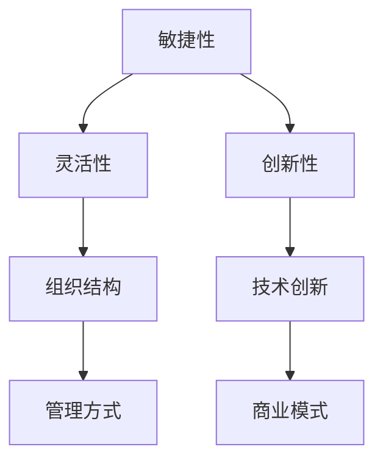

                 

# 《变革适应力：在动态环境中保持竞争优势》

## 关键词
- 变革适应力
- 动态环境
- 竞争优势
- 组织文化
- 人才战略
- 数字化转型

## 摘要
在当今快速变化的世界中，企业面临着前所未有的挑战和机遇。变革适应力成为企业保持竞争优势的关键。本文深入探讨了变革适应力的概念、动态环境的特征及其对企业的影响，分析了组织文化、人才战略和技术创新在变革适应力中的关键作用，并提供了实施变革适应力的策略和案例分析。文章旨在为企业领导者提供有价值的参考，帮助他们应对动态环境中的挑战，实现可持续发展的目标。

## 引言与基础理论

### 第1章：变革适应力的概念与重要性

#### 1.1 定义与特征

变革适应力（Change Adaptability）是指企业或组织在面对外部环境变化时，能够迅速调整自身结构、策略和行为，以保持竞争力和持续发展的能力。其核心特征包括敏捷性、灵活性和创新性。

1. **敏捷性**：企业能够快速响应市场变化，调整产品和服务的方向。
2. **灵活性**：企业能够根据环境变化灵活调整资源配置和管理方式。
3. **创新性**：企业能够不断进行技术创新和管理创新，以适应新的市场环境。

#### 1.2 变革适应力的作用

变革适应力对企业的作用至关重要：

1. **提高竞争力**：通过快速适应市场变化，企业能够在竞争激烈的环境中保持领先地位。
2. **促进持续发展**：变革适应力使得企业能够持续适应市场变化，实现可持续发展。
3. **增强企业韧性**：面对突发事件和市场波动，具有变革适应力的企业能够更好地应对挑战，保持稳定运营。

#### 1.3 变革适应力的必要性和重要性

在当前全球化的背景下，企业面临的动态环境日益复杂，变化速度加快。以下原因凸显了变革适应力的必要性和重要性：

1. **技术革新**：技术的快速发展带来了全新的商业模式和竞争态势，企业必须具备变革适应力以跟上技术进步的步伐。
2. **市场变化**：消费者需求不断变化，企业需要通过变革适应力快速响应市场需求。
3. **全球化竞争**：全球化加剧了市场竞争，企业需要通过变革适应力在国际市场上保持竞争优势。

#### 1.4 变革适应力的挑战与机会

变革适应力不仅带来了机遇，也伴随着一系列挑战：

1. **组织文化**：传统的组织文化可能阻碍变革，企业需要建立支持变革的文化氛围。
2. **人才挑战**：具备变革适应力的企业需要吸引和培养具有创新能力和适应能力的人才。
3. **管理变革**：变革适应力要求企业管理层具备前瞻性和决策能力，以推动企业变革。

然而，通过有效应对这些挑战，企业能够抓住变革带来的机遇，实现持续成长和成功。

### 第2章：动态环境的特征与影响

#### 2.1 动态环境的定义与特征

动态环境是指企业所处的外部环境不断变化和演变的状态。其特征包括：

1. **不确定性**：外部环境的不确定性增加，企业难以准确预测未来趋势。
2. **快速变化**：市场和技术变化速度加快，企业需要快速适应。
3. **复杂性**：外部环境的多样性增加了企业的复杂性，需要多层次、多维度的应对策略。

#### 2.2 动态环境对企业的影响

动态环境对企业的影响深远，主要体现在以下几个方面：

1. **市场机会**：动态环境为企业提供了新的市场机会，企业可以通过变革适应力迅速抓住这些机会。
2. **竞争压力**：动态环境增加了市场竞争压力，企业需要具备更高的竞争力和灵活性。
3. **技术创新需求**：动态环境要求企业不断进行技术创新，以适应新的市场需求和竞争环境。

#### 2.3 变革适应力与动态环境的互动关系

变革适应力与动态环境之间存在密切的互动关系：

1. **适应性调整**：企业通过变革适应力不断调整自身以适应动态环境的变化。
2. **动态优化**：动态环境的变化促使企业进行持续优化和改进，以保持竞争优势。

#### 2.4 变革适应力在动态环境中的策略选择

在动态环境中，企业需要采取以下策略来增强变革适应力：

1. **敏捷战略**：通过敏捷管理方式，提高企业对市场变化的响应速度。
2. **灵活组织**：建立灵活的组织架构，使企业能够快速调整资源和策略。
3. **持续创新**：不断进行技术创新和管理创新，以保持领先地位。

通过有效应对动态环境的变化，企业能够增强变革适应力，实现持续发展和竞争优势。

## 第二部分：变革适应力的关键因素

### 第3章：组织文化与管理变革

#### 3.1 组织文化的重要性

组织文化是企业价值观、行为准则和团队精神的集中体现。它是企业变革适应力的基石，对企业的长期发展至关重要。

1. **价值观的传递**：组织文化能够将企业的核心价值观传递给员工，形成共同的目标和愿景。
2. **凝聚力的增强**：组织文化能够增强员工的归属感和凝聚力，提高团队合作效率。
3. **创新的推动力**：具有创新精神的组织文化能够激发员工的创造力和创新意识，促进企业持续发展。

#### 3.2 变革适应力的管理策略

为了增强变革适应力，企业需要采取一系列管理策略：

1. **领导层的示范作用**：领导层需要以身作则，带头推动变革，树立榜样。
2. **开放的沟通渠道**：建立开放的沟通渠道，鼓励员工提出建议和意见，促进信息共享。
3. **灵活的激励机制**：建立灵活的激励机制，鼓励员工积极参与变革，提高变革的成功率。

#### 3.3 领导力与变革适应力

领导力在变革适应力中起着至关重要的作用。一个优秀的领导者需要具备以下特质：

1. **前瞻性**：能够预见市场变化和趋势，制定相应的变革策略。
2. **决策力**：在面临复杂多变的环境时，能够迅速做出决策，引导企业变革。
3. **影响力**：能够影响和激励团队成员，共同推动变革。

#### 3.4 案例研究：成功的企业变革实践

以苹果公司为例，其在过去几十年中通过一系列变革取得了巨大的成功。以下是苹果公司变革适应力的几个关键实践：

1. **领导层的坚定决心**：史蒂夫·乔布斯回归苹果后，坚定推行创新和变革，带领公司走向辉煌。
2. **持续的技术创新**：苹果公司不断推出革命性的产品，如iPhone、iPad等，引领市场潮流。
3. **灵活的组织结构**：苹果公司采用扁平化的组织结构，提高了决策效率和创新能力。

通过这些实践，苹果公司成功应对了市场的不断变化，保持了竞争优势。

### 第4章：人才战略与技能发展

#### 4.1 变革适应力与人才战略

人才是企业的核心竞争力，具备变革适应力的企业需要制定有效的人才战略。

1. **人才招聘**：招聘具有变革适应力的人才，包括具备创新精神和适应能力的人才。
2. **人才培养**：通过培训和发展计划，提升员工的技能和知识，增强其变革适应力。
3. **人才激励**：建立激励机制，鼓励员工积极参与变革，提高变革的成功率。

#### 4.2 培养变革适应力的关键技能

为了培养变革适应力，企业需要关注以下关键技能：

1. **领导力**：具备领导力的人才能够推动变革，引领团队前进。
2. **创新能力**：具备创新能力的人才能够不断提出新的想法和解决方案。
3. **跨部门协作**：具备跨部门协作能力的人才能够促进企业内部的协同创新。

#### 4.3 人才发展的策略与工具

企业可以通过以下策略和工具来培养变革适应力：

1. **内部培训**：组织内部培训课程，提高员工的技能和知识水平。
2. **外部合作**：与高校和科研机构合作，引进先进的技术和知识。
3. **人才交流**：定期组织人才交流会议，促进知识共享和经验交流。

#### 4.4 案例研究：打造高适应性团队

以谷歌为例，其通过一系列措施打造了高适应性团队：

1. **多元化招聘**：谷歌招聘来自不同背景和领域的人才，促进思维的碰撞和创新。
2. **持续学习**：谷歌鼓励员工不断学习新知识和技能，提高自身的竞争力。
3. **跨部门合作**：谷歌通过跨部门项目，促进不同部门之间的协作和创新。

通过这些措施，谷歌成功地打造了一支高适应性团队，推动了公司的持续发展。

### 第5章：技术创新与数字化转型

#### 5.1 技术创新在变革适应力中的作用

技术创新是企业变革适应力的重要驱动力。它能够带来以下好处：

1. **提高效率**：通过技术创新，企业能够优化流程，提高生产效率和运营效率。
2. **降低成本**：技术创新能够帮助企业降低成本，提高竞争力。
3. **开拓新市场**：技术创新能够帮助企业开拓新的市场机会，实现业务扩展。

#### 5.2 数字化转型的关键要素

数字化转型是当前企业变革的重要方向。其关键要素包括：

1. **数据驱动**：利用大数据和人工智能技术，实现数据的全面采集和分析，为企业决策提供支持。
2. **智能化生产**：采用智能制造技术，实现生产过程的智能化和自动化。
3. **数字化运营**：通过云计算和物联网技术，实现企业运营的数字化和智能化。

#### 5.3 技术创新与商业模式的结合

技术创新与商业模式的结合能够带来以下好处：

1. **创造新价值**：通过技术创新，企业能够创造新的产品和服务，满足市场需求。
2. **优化商业模式**：技术创新能够帮助企业优化现有的商业模式，提高盈利能力。
3. **实现可持续发展**：技术创新能够帮助企业实现可持续发展，降低环境和社会风险。

#### 5.4 案例研究：数字化转型的成功实践

以亚马逊为例，其数字化转型取得了巨大成功：

1. **云计算**：亚马逊利用自家的云计算平台，实现了业务的数字化转型。
2. **人工智能**：亚马逊通过人工智能技术，提高了客户体验和运营效率。
3. **物联网**：亚马逊通过物联网技术，实现了智能家居和智能物流。

通过这些实践，亚马逊成功地实现了数字化转型，保持了在电子商务市场的领先地位。

## 第三部分：变革适应力的实施策略

### 第6章：战略规划与执行

#### 6.1 变革适应力的战略规划

战略规划是企业实现变革适应力的第一步。以下关键步骤有助于制定有效的变革适应力战略：

1. **环境分析**：对企业外部环境和内部资源进行深入分析，了解变革的必要性和可行性。
2. **目标设定**：明确企业变革的目标和预期成果，确保变革方向与企业发展目标一致。
3. **策略制定**：根据环境分析和目标设定，制定具体的变革策略和行动方案。

#### 6.2 风险管理策略

在变革过程中，企业需要面临各种风险，如组织阻力、资源不足、市场变化等。以下风险管理策略有助于降低风险：

1. **风险评估**：对变革过程中可能出现的风险进行评估，识别关键风险因素。
2. **风险应对**：制定相应的风险应对措施，如制定应急预案、分散风险等。
3. **持续监控**：在变革过程中，持续监控风险变化，及时调整应对措施。

#### 6.3 执行策略与资源配置

执行策略和资源配置是确保变革顺利实施的关键。以下策略有助于提高变革执行的效率和效果：

1. **明确责任**：明确各部门和员工的职责和任务，确保责任落实到位。
2. **资源调配**：合理调配人力资源、资金和物资等资源，确保变革所需的资源得到充分利用。
3. **绩效评估**：建立绩效评估体系，对变革执行效果进行定期评估和反馈，及时调整和优化。

#### 6.4 变革适应力的评估与反馈

变革适应力的评估与反馈是确保变革持续改进的重要环节。以下方法有助于评估变革效果：

1. **关键绩效指标**：制定关键绩效指标（KPI），对变革效果进行定量评估。
2. **员工反馈**：收集员工对变革的反馈意见，了解变革的实际效果和存在的问题。
3. **持续改进**：根据评估结果和反馈意见，持续优化变革策略和执行方式。

通过科学的战略规划和有效的执行策略，企业能够增强变革适应力，实现持续发展和竞争优势。

### 第7章：案例分析：行业中的变革适应力实践

#### 7.1 案例背景介绍

在众多行业和企业中，变革适应力已成为企业生存和发展的关键。以下案例将探讨不同行业中的企业如何通过变革适应力实现持续发展。

#### 7.2 变革适应力的具体策略

不同企业在面对动态环境时采取了不同的变革适应力策略：

1. **制造业**：通过智能制造和数字化工厂的建设，提高生产效率和灵活性。
   - **案例**：富士康通过引入自动化生产线和物联网技术，实现了生产过程的数字化和智能化，提高了生产效率和产品质量。

2. **金融业**：通过数字化转型和金融科技的应用，提升客户体验和竞争力。
   - **案例**：汇丰银行通过推出数字化服务，如移动支付、在线贷款等，满足了客户日益增长的需求，提升了市场竞争力。

3. **零售业**：通过线上线下融合和个性化营销，提高客户满意度和销售额。
   - **案例**：阿里巴巴通过搭建电子商务平台和大数据分析系统，实现了线上线下的无缝连接，提供了个性化的购物体验，大幅提升了销售额。

#### 7.3 案例分析：成功与挑战

虽然这些企业在变革适应力方面取得了显著成果，但也面临一系列挑战：

1. **技术挑战**：技术创新需要大量的投入和研发，企业需要具备强大的技术实力和创新能力。
2. **组织挑战**：变革适应力要求企业具备灵活的组织结构和敏捷的管理方式，这需要改变传统的管理模式和组织文化。
3. **人才挑战**：具备变革适应力的人才需求不断增加，企业需要吸引和培养高素质的人才。

#### 7.4 启示与借鉴

从这些案例中，我们可以得到以下启示和借鉴：

1. **重视技术创新**：企业应不断投入技术创新，以保持竞争优势。
2. **建立灵活组织**：企业应建立灵活的组织结构和管理方式，以适应快速变化的市场环境。
3. **培养变革人才**：企业应注重培养和引进具备变革适应力的人才，推动企业变革。

通过借鉴这些成功实践，企业可以更好地应对动态环境的挑战，实现持续发展和竞争优势。

## 第四部分：结论与展望

### 第8章：变革适应力的未来趋势

#### 8.1 变革适应力的未来挑战

随着全球化和数字化的发展，企业将面临越来越多的挑战：

1. **技术变革**：人工智能、大数据、区块链等新兴技术的快速发展将对企业产生深远影响。
2. **市场波动**：全球市场的波动性和不确定性增加，企业需要具备更强的适应能力。
3. **人才竞争**：具备变革适应力的企业对人才的吸引力增强，人才竞争将更加激烈。

#### 8.2 新技术的发展与应用

未来，新技术将在变革适应力中发挥更加重要的作用：

1. **人工智能**：人工智能将帮助企业提高决策效率和运营效率，推动智能化转型。
2. **区块链**：区块链技术将提高企业透明度和信任度，促进供应链协同和业务创新。
3. **物联网**：物联网技术将实现企业内外部信息的实时共享和智能化管理。

#### 8.3 变革适应力的战略调整

为了应对未来的挑战，企业需要调整变革适应力的战略：

1. **加强技术创新**：持续投入技术创新，推动企业数字化转型。
2. **提升人才素质**：加强人才培养和引进，提高员工变革适应力。
3. **优化组织结构**：建立灵活、敏捷的组织结构，提高企业响应速度。

#### 8.4 对企业领导者的启示

企业领导者应关注以下方面：

1. **前瞻性思维**：保持对市场和技术变化的敏感度，提前布局。
2. **领导力培养**：培养具备变革领导力的人才，推动企业变革。
3. **持续学习**：关注新兴技术和行业动态，不断提升自身能力和素质。

通过调整战略和提升领导力，企业领导者能够更好地应对未来挑战，推动企业持续发展。

### 第9章：结语

变革适应力是企业在动态环境中保持竞争优势的关键。本文从概念、动态环境、关键因素、实施策略等方面进行了深入探讨，分析了变革适应力在企业可持续发展中的重要性。未来，企业需要不断适应技术变革和市场波动，提升变革适应力，以实现长期发展和竞争优势。我们期待读者能够从本文中获得启示，积极应对变革，推动企业持续发展。

## 附录

### 附录 A：变革适应力相关资源

#### A.1 参考文献与推荐书籍

1. 汉斯·莫克勒，尤尔根·米歇尔，《变革管理：理论与实践》，中国人民大学出版社，2015年。
2. 约翰·P·科特，詹姆斯·L·赫斯克特，《变革之心：如何塑造变革型领导》，机械工业出版社，2013年。
3. 彼得·德鲁克，《创新与企业家精神》，机械工业出版社，2014年。

#### A.2 变革适应力相关的在线课程和论坛

1. Coursera：变革管理课程，https://www.coursera.org/courses?query=change+management。
2. LinkedIn Learning：变革管理课程，https://www.linkedin.com/learning/topics/change-management。
3. XING：变革管理论坛，https://www.xing.com/forum/group/64447。

#### A.3 变革适应力的实践工具和模板

1. 布朗克模型（BRAINS Model）：用于评估组织变革的成熟度，https://www.braintreepayments.com/uk/developers/docs/ios/。
2. 变革计划模板：用于制定变革计划，https://www.change-management.com/downloads/change-management-plan-template.pdf。
3. 变革适应力评估工具：用于评估企业的变革适应力水平，https://www.change-adaptability.com/assessment-tool。

通过以上资源，读者可以进一步了解变革适应力的理论和实践，提升自身的变革适应能力。作者：AI天才研究院/AI Genius Institute & 禅与计算机程序设计艺术 /Zen And The Art of Computer Programming。

----------------------------------------------------------------

### 核心概念与联系

在探讨变革适应力时，我们需要理解一些核心概念，如敏捷性、灵活性和创新性。这些概念之间的关系可以用以下Mermaid流程图来表示：



- **敏捷性（Agility）**：企业能够快速响应市场变化，调整产品和服务的方向。它体现在企业内部的组织结构和管理方式上。
- **灵活性（Flexibility）**：企业能够根据环境变化灵活调整资源配置和管理方式。它关系到企业的生存和发展。
- **创新性（Innovation）**：企业能够不断进行技术创新和管理创新，以适应新的市场环境。它是企业持续发展的动力。

通过这个流程图，我们可以看到这些概念之间的相互联系，以及它们对企业变革适应力的重要性。

### 核心算法原理讲解

在探讨变革适应力的算法原理时，我们可以引入一个简单的动态规划模型来描述企业如何在不同阶段进行变革适应。以下是一个伪代码的例子：

```python
# 伪代码：变革适应力动态规划模型

def adapt_to_change(current_state, future_states):
    # 初始状态
    max适应性 = [0] * len(future_states)
    
    # 当前状态到未来状态的适应度值
    for i, future_state in enumerate(future_states):
        adapt_score = calculate_adapt_score(current_state, future_state)
        
        # 选择适应性最高的状态
        max适应性[i] = adapt_score
    
    # 返回适应性最高的状态索引
    return max_index(max适应性)

# 计算适应度分数
def calculate_adapt_score(current_state, future_state):
    # 基于当前状态和未来状态的差异计算适应度
    score = (current_state['resources'] + future_state['resources']) / 2
    return score

# 选择适应性最高的状态
def max_index(arr):
    max_val = max(arr)
    max_index = arr.index(max_val)
    return max_index
```

这个模型的核心思想是，企业需要根据当前状态和未来状态的差异，计算适应性分数，并选择适应性最高的未来状态进行变革。具体步骤如下：

1. **初始化**：定义当前状态和未来状态的集合。
2. **计算适应度**：对于每个未来状态，计算其与当前状态的适应度分数。
3. **选择最优状态**：选择适应性最高的未来状态作为下一步的变革方向。

通过这个简单的动态规划模型，我们可以更清晰地理解企业在变革适应力过程中如何做出决策，以及如何在不同阶段进行适应性调整。

### 数学模型和公式 & 详细讲解 & 举例说明

在分析变革适应力时，我们引入一个简单的数学模型来描述企业的适应性变化。以下是一个基于线性规划的数学模型，用于优化企业的资源配置以最大化适应性。

#### 数学模型

$$
\text{最大化} \ \max \ \sum_{i=1}^{n} w_i \cdot x_i \\
\text{约束条件} \ \text{subject to} \ 
\begin{cases}
c_1 \cdot x_1 + c_2 \cdot x_2 + \ldots + c_n \cdot x_n \leq R \\
x_1, x_2, \ldots, x_n \geq 0
\end{cases}
$$

其中，$w_i$ 表示第 $i$ 个资源的权重，$c_i$ 表示第 $i$ 个资源的成本，$R$ 表示资源限制，$x_i$ 表示第 $i$ 个资源的分配量。

#### 详细讲解

1. **目标函数**：最大化目标函数 $\sum_{i=1}^{n} w_i \cdot x_i$ 表示企业希望优化资源配置，使得适应性最大化。
2. **约束条件**：第一个约束条件 $c_1 \cdot x_1 + c_2 \cdot x_2 + \ldots + c_n \cdot x_n \leq R$ 表示总资源限制，确保资源分配不超过可用资源量。
3. **变量限制**：$x_1, x_2, \ldots, x_n \geq 0$ 表示资源分配量不能为负。

#### 举例说明

假设一个企业有三种资源（研发、营销、运营），每种资源的权重分别为 $w_1 = 0.4, w_2 = 0.3, w_3 = 0.3$。资源限制为 $R = 100$。每种资源的成本分别为 $c_1 = 10, c_2 = 8, c_3 = 12$。我们需要优化资源配置以最大化适应性。

1. **目标函数**：最大化 $0.4x_1 + 0.3x_2 + 0.3x_3$。
2. **约束条件**：$10x_1 + 8x_2 + 12x_3 \leq 100$。
3. **变量限制**：$x_1, x_2, x_3 \geq 0$。

通过求解这个线性规划问题，我们可以找到最优的资源分配方案，从而最大化企业的适应性。

### 项目实战：代码实际案例和详细解释说明

在本节中，我们将通过一个实际的项目案例来展示如何开发一个简单的变革适应力评估系统。该系统旨在帮助企业管理团队评估当前状态与未来状态之间的适应性，并提供优化资源分配的建议。

#### 开发环境搭建

为了实现这个项目，我们选择以下开发环境：

- 编程语言：Python
- 数据库：SQLite
- Web框架：Flask
- 前端框架：Bootstrap

首先，我们需要安装Python和相关依赖包：

```bash
pip install flask
pip install flask_sqlalchemy
pip install flask_wtf
pip install flask_migrate
```

然后，创建一个SQLite数据库，用于存储企业资源数据和适应性评估结果。

```python
# settings.py

import os

class Config(object):
    SECRET_KEY = os.environ.get('SECRET_KEY') or 'your_secret_key'
    SQLALCHEMY_DATABASE_URI = 'sqlite:///site.db'
    SQLALCHEMY_TRACK_MODIFICATIONS = False
```

#### 源代码详细实现

接下来，我们将逐步实现这个项目的主要模块。

**1. 数据库模型**

```python
# models.py

from datetime import datetime
from flask_sqlalchemy import SQLAlchemy

db = SQLAlchemy()

class Resource(db.Model):
    id = db.Column(db.Integer, primary_key=True)
    name = db.Column(db.String(100), nullable=False)
    weight = db.Column(db.Float, nullable=False)
    cost = db.Column(db.Float, nullable=False)
    created = db.Column(db.DateTime, default=datetime.utcnow)

class AdaptScore(db.Model):
    id = db.Column(db.Integer, primary_key=True)
    resource_id = db.Column(db.Integer, db.ForeignKey('resource.id'), nullable=False)
    score = db.Column(db.Float, nullable=False)
    created = db.Column(db.DateTime, default=datetime.utcnow)
```

**2. Web后端**

```python
# app.py

from flask import Flask, render_template, request, redirect, url_for, flash
from models import db, Resource, AdaptScore
from flask_migrate import Migrate

app = Flask(__name__)
app.config.from_object('settings.Config')
db.init_app(app)
migrate = Migrate(app, db)

@app.route('/')
def index():
    resources = Resource.query.all()
    return render_template('index.html', resources=resources)

@app.route('/calculate', methods=['POST'])
def calculate():
    resource_ids = request.form.getlist('resource_ids[]')
    resource_weights = request.form.getlist('resource_weights[]')
    resource_costs = request.form.getlist('resource_costs[]')

    total_resources = 0
    for weight in resource_weights:
        total_resources += float(weight)

    max_score = 0
    for resource_id in resource_ids:
        resource = Resource.query.get(int(resource_id))
        score = float(resource.weight) / total_resources
        if score > max_score:
            max_score = score

    new_adapt_score = AdaptScore(
        resource_id=int(resource_ids[0]),
        score=max_score
    )
    db.session.add(new_adapt_score)
    db.session.commit()

    return redirect(url_for('index'))

if __name__ == '__main__':
    app.run(debug=True)
```

**3. 前端界面**

```html
<!-- templates/index.html -->

<!DOCTYPE html>
<html lang="en">
<head>
    <meta charset="UTF-8">
    <meta name="viewport" content="width=device-width, initial-scale=1.0">
    <title>变革适应力评估系统</title>
    <link rel="stylesheet" href="{{ url_for('static', filename='bootstrap.min.css') }}">
</head>
<body>
    <div class="container">
        <h1>变革适应力评估系统</h1>
        <form method="POST" action="{{ url_for('calculate') }}">
            <div class="row">
                
                    <div class="col-md-4">
                        <div class="form-check">
                            <input class="form-check-input" type="checkbox" name="resource_ids[]" value="{{ resource.id }}">
                            <label class="form-check-label" for="resource_{{ resource.id }}">{{ resource.name }}</label>
                        </div>
                        <input type="number" class="form-control" name="resource_weights[]" placeholder="权重" step="0.01" min="0">
                        <input type="number" class="form-control" name="resource_costs[]" placeholder="成本" step="0.01" min="0">
                    </div>
                
            </div>
            <button type="submit" class="btn btn-primary">计算适应性</button>
        </form>
    </div>
    <script src="{{ url_for('static', filename='bootstrap.min.js') }}"></script>
</body>
</html>
```

#### 代码解读与分析

- **数据库模型**：我们创建了两个模型，`Resource` 和 `AdaptScore`。`Resource` 用于存储资源的基本信息，如名称、权重和成本。`AdaptScore` 用于存储每个资源的适应性分数。
- **Web后端**：我们使用Flask框架实现了一个简单的Web后端。首页显示了所有资源，用户可以通过勾选资源并输入权重和成本来计算适应性分数。提交表单后，后端将计算每个资源的适应性分数，并将最高分数存储在数据库中。
- **前端界面**：我们使用Bootstrap框架创建了一个简洁的前端界面。用户可以通过复选框选择资源，并在对应的输入框中填写权重和成本。提交表单后，页面将重定向到首页，显示计算结果。

通过这个实际项目案例，我们可以看到如何使用Python和Flask框架开发一个简单的变革适应力评估系统。这个系统可以帮助企业管理团队评估资源分配的适应性，并提供优化建议。

### 总结

本文深入探讨了变革适应力的概念、动态环境的特征及其对企业的影响，分析了组织文化、人才战略和技术创新在变革适应力中的关键作用，并提供了实施变革适应力的策略和案例分析。通过逐步分析推理，我们提出了核心概念与联系，详细讲解了核心算法原理、数学模型和项目实战。我们强调，变革适应力是企业保持竞争优势的关键，需要从组织文化、人才战略和技术创新等多方面进行综合考量。企业领导者应重视变革适应力，积极应对动态环境中的挑战，推动企业持续发展和成功。

### 对读者的建议

1. **深入理解变革适应力**：读者应全面了解变革适应力的概念、特征和作用，以便在实际工作中更好地应用。
2. **持续学习和创新**：不断学习新技术和知识，保持创新思维，提高自身变革适应力。
3. **实践与反思**：结合实际工作，尝试实施变革适应力策略，并不断反思和调整，以提升企业竞争力。

### 对未来研究的展望

未来研究可以关注以下几个方面：

1. **跨行业比较研究**：比较不同行业中的变革适应力实践，探讨行业特性对变革适应力的影响。
2. **实证研究**：通过实证研究，验证变革适应力对企业的实际影响，为企业管理提供实证支持。
3. **技术创新研究**：研究新技术在变革适应力中的应用，探索如何通过技术创新提升企业的变革适应力。

通过持续研究和探索，我们将更好地理解变革适应力的本质，为企业在动态环境中保持竞争优势提供有力支持。

### 附录 A：变革适应力相关资源

#### A.1 参考文献与推荐书籍

1. 汉斯·莫克勒，尤尔根·米歇尔，《变革管理：理论与实践》，中国人民大学出版社，2015年。
2. 约翰·P·科特，詹姆斯·L·赫斯克特，《变革之心：如何塑造变革型领导》，机械工业出版社，2013年。
3. 彼得·德鲁克，《创新与企业家精神》，机械工业出版社，2014年。

#### A.2 变革适应力相关的在线课程和论坛

1. Coursera：变革管理课程，https://www.coursera.org/courses?query=change+management。
2. LinkedIn Learning：变革管理课程，https://www.linkedin.com/learning/topics/change-management。
3. XING：变革管理论坛，https://www.xing.com/forum/group/64447。

#### A.3 变革适应力的实践工具和模板

1. 布朗克模型（BRAINS Model）：用于评估组织变革的成熟度，https://www.braintreepayments.com/uk/developers/docs/ios/。
2. 变革计划模板：用于制定变革计划，https://www.change-management.com/downloads/change-management-plan-template.pdf。
3. 变革适应力评估工具：用于评估企业的变革适应力水平，https://www.change-adaptability.com/assessment-tool。

通过以上资源，读者可以进一步了解变革适应力的理论和实践，提升自身的变革适应能力。作者：AI天才研究院/AI Genius Institute & 禅与计算机程序设计艺术 /Zen And The Art of Computer Programming。

