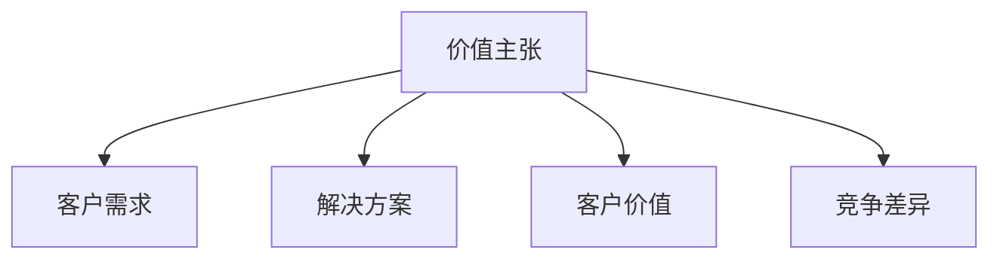
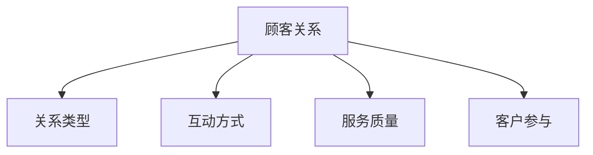
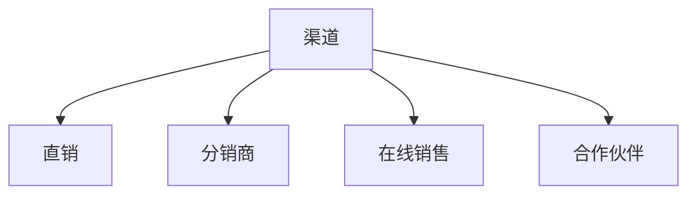
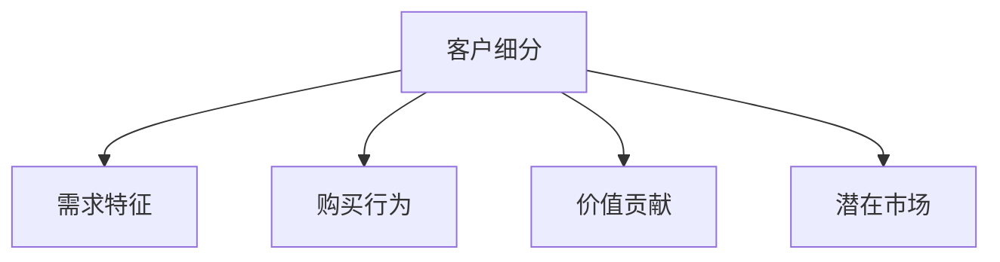
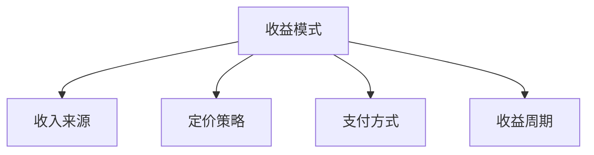
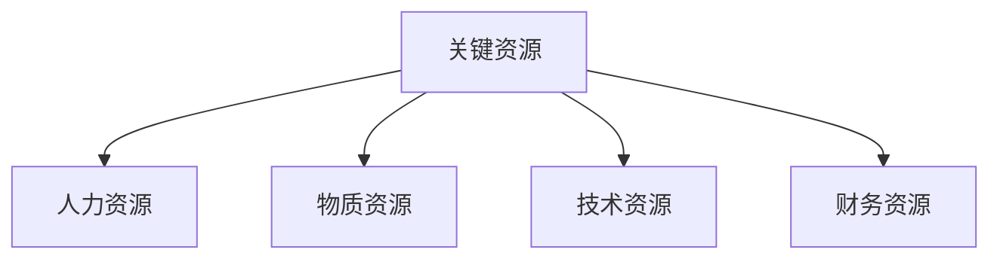
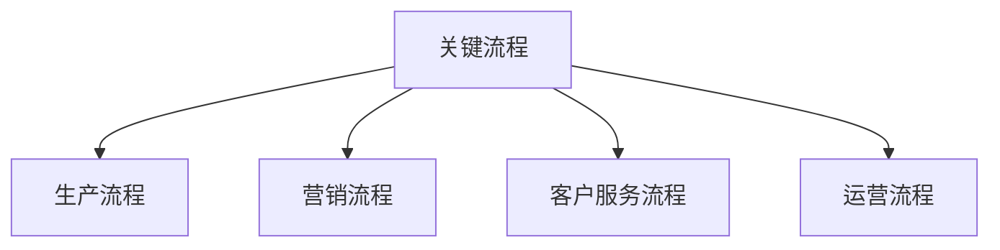
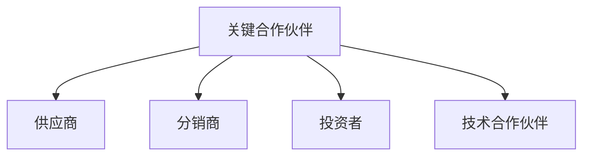
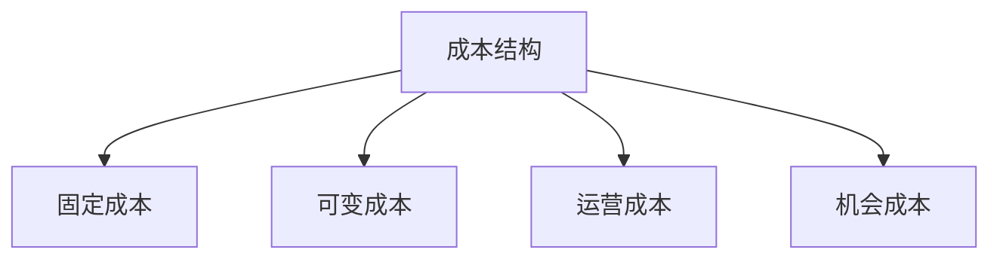

                 

# 《商业模式画布：系统化商业构想》

## 关键词
商业模式，系统化商业构想，战略规划，创新实践，案例分析，企业管理

## 摘要
在快速变化的市场环境中，构建一个稳健且灵活的商业模式对企业成功至关重要。《商业模式画布：系统化商业构想》旨在为读者提供一种清晰、易于理解的方法来构建和优化商业模型。本文将详细介绍商业模式画布的起源、核心概念、实践应用、案例分析以及其在战略规划中的重要性，帮助读者掌握系统化商业构想的方法，提升企业竞争力。

---

## 第一部分：引言与基础

### 第1章：商业模式概述

#### 1.1 商业模式的定义与重要性

商业模式（Business Model）是指企业通过何种方式创造、传递和捕获价值。简单来说，商业模式决定了企业如何赚钱，包括企业的核心产品或服务、目标市场、收入来源等。在信息技术飞速发展的今天，商业模式已成为企业成功的关键因素。

商业模式的重要性体现在以下几个方面：
1. **指导企业发展方向**：商业模式为企业提供了清晰的战略方向，有助于企业资源的最优配置。
2. **提高企业竞争力**：良好的商业模式可以增强企业的市场竞争力，为企业创造持续的价值。
3. **适应市场变化**：灵活的商业模式有助于企业快速响应市场变化，抓住机遇。
4. **降低经营风险**：通过商业模式规划，企业可以提前识别潜在风险，并采取相应的预防措施。

#### 1.2 商业模式画布的起源与发展

商业模式画布（Business Model Canvas）是由奥地利管理学者亚历山大·奥斯特瓦尔德（Alexander Osterwalder）和耶尼·皮涅尔（Yves Pigneur）在2010年提出的。这种画布式工具提供了九个核心模块，包括价值主张、客户关系、渠道、客户细分、收益模式、关键资源、关键流程、关键合作伙伴和成本结构。通过这些模块，企业家和企业管理者可以直观地理解和调整商业模式。

商业模式画布的发展经历了以下几个阶段：
1. **初版发布**：2010年，亚历山大·奥斯特瓦尔德和耶尼·皮涅尔首次发布了商业模式画布。
2. **广泛应用**：商业模式画布迅速在全球范围内得到广泛应用，成为企业管理者进行商业模式设计和优化的首选工具。
3. **持续优化**：随着商业环境的不断变化，商业模式画布也在不断更新和完善，以适应新的市场需求。

#### 1.3 本书结构与阅读建议

本书分为三个部分：
1. **第一部分：引言与基础**：介绍商业模式画布的起源、定义、重要性以及本书的结构和阅读建议。
2. **第二部分：商业模式画布实践**：详细讲解商业模式画布的每个模块，包括核心概念、实践步骤、案例分析等。
3. **第三部分：附录**：提供商业模式画布的工具与资源，以及进一步的参考书目。

阅读建议：
- 首先阅读引言部分，了解商业模式画布的基本概念和应用。
- 然后逐章阅读，掌握每个模块的具体内容和实践方法。
- 最后通过案例分析，加深对商业模式画布的理解和应用。

### 第2章：商业模式画布框架解析

#### 2.1 九宫格框架的构成

商业模式画布由九个模块组成，排列在一个九宫格中。这些模块包括：

1. **价值主张（Value Proposition）**：定义企业提供给客户的核心产品或服务。
2. **客户关系（Customer Relationships）**：企业与客户建立和维护关系的方式。
3. **渠道（Channels）**：产品或服务传递给客户的方式。
4. **客户细分（Customer Segments）**：企业目标市场细分。
5. **收益模式（Revenue Streams）**：企业从客户那里获得收入的方式。
6. **关键资源（Key Resources）**：支持商业模式运作的核心资源。
7. **关键流程（Key Activities）**：实现商业模式的核心流程。
8. **关键合作伙伴（Key Partnerships）**：与合作伙伴的关系。
9. **成本结构（Cost Structure）**：商业模式运作的成本构成。

#### 2.2 各部分含义与联系

每个模块的含义如下：

1. **价值主张**：明确企业为客户创造的价值。它是商业模式的核心，决定了企业如何区分自己与竞争对手。
2. **客户关系**：描述企业与客户之间的关系类型，如个人销售、自助服务、直接销售、多渠道销售、合作伙伴渠道等。
3. **渠道**：产品或服务传递给客户的方式，如直接销售、在线销售、分销商、合作伙伴等。
4. **客户细分**：市场细分，包括不同群体的需求和特征。
5. **收益模式**：企业从客户那里获得收入的方式，如订阅模式、交易模式、广告收入等。
6. **关键资源**：支持商业模式运作的核心资源，如技术、人员、资金、专利等。
7. **关键流程**：实现商业模式的核心流程，如产品设计、生产、销售、客户服务等。
8. **关键合作伙伴**：合作伙伴的类型和角色，如供应商、分销商、投资者等。
9. **成本结构**：商业模式运作的成本构成，如固定成本、可变成本、运营成本等。

这些模块之间相互联系，共同构成了一个完整的商业模式。例如，价值主张决定了客户关系和收益模式的选择，关键资源和关键流程支持了价值主张的实现，成本结构影响了收益模式的设计。

#### 2.3 商业模式画布的应用场景

商业模式画布可以应用于各种场景，包括：

1. **新业务开发**：在创建新业务时，商业模式画布可以帮助企业家快速梳理思路，确定核心模块。
2. **商业模式优化**：在现有业务中，商业模式画布可以帮助企业管理者识别问题和机会，进行优化调整。
3. **战略规划**：在制定企业战略时，商业模式画布可以提供清晰的业务框架，帮助管理者制定实施计划。
4. **竞争分析**：通过分析竞争对手的商业模式画布，可以了解其核心竞争力，制定相应的竞争策略。

### 第3章：商业模式画布核心概念

#### 3.1 价值主张

价值主张是企业为客户创造的核心价值。它回答了“客户为什么选择我们的产品或服务？”的问题。一个有效的价值主张应该明确、独特，能够满足客户的特定需求或解决特定问题。

**核心概念与联系：**

价值主张通常包括以下几个关键要素：

1. **客户需求**：分析客户的需求，明确价值主张的焦点。
2. **解决方案**：提供解决客户问题的方案，展示产品的独特性和优势。
3. **客户价值**：量化客户从产品或服务中获得的收益，如成本节约、效率提升等。
4. **竞争差异**：与竞争对手相比，价值主张的独特之处。

**Mermaid 流程图：**

#### 3.2 顾客关系

顾客关系是企业与客户之间的互动和沟通方式。良好的顾客关系有助于提高客户满意度，增强品牌忠诚度。

**核心概念与联系：**

顾客关系包括以下几个方面：

1. **关系类型**：如个人销售、自助服务、多渠道销售等。
2. **互动方式**：如面对面交流、电话沟通、在线交流等。
3. **服务质量**：提供高质量的客户服务，提升客户体验。
4. **客户参与**：鼓励客户参与产品或服务的设计和改进。

**Mermaid 流程图：**

#### 3.3 渠道

渠道是企业将产品或服务传递给客户的方式。选择合适的渠道可以降低成本，提高效率，扩大市场份额。

**核心概念与联系：**

渠道包括以下几个方面：

1. **直销**：企业直接向客户销售产品或服务。
2. **分销商**：通过分销商将产品或服务传递给客户。
3. **在线销售**：通过电子商务平台销售产品或服务。
4. **合作伙伴**：与合作伙伴共同推广和销售产品或服务。

**Mermaid 流程图：**

#### 3.4 客户细分

客户细分是企业根据客户的需求、特征和购买行为，将市场划分为不同的群体。有效的客户细分有助于企业制定有针对性的营销策略。

**核心概念与联系：**

客户细分包括以下几个方面：

1. **需求特征**：根据客户的需求特征进行划分，如年龄、性别、收入等。
2. **购买行为**：根据客户的购买行为进行划分，如高频消费者、低频消费者等。
3. **价值贡献**：根据客户对企业价值贡献的大小进行划分，如VIP客户、普通客户等。
4. **潜在市场**：识别潜在市场，开拓新客户。

**Mermaid 流程图：**

#### 3.5 收益模式

收益模式是企业从客户那里获得收入的方式。一个有效的收益模式可以确保企业的可持续发展。

**核心概念与联系：**

收益模式包括以下几个方面：

1. **收入来源**：如产品销售、服务收费、广告收入等。
2. **定价策略**：根据产品或服务的价值，制定合理的定价策略。
3. **支付方式**：如现金支付、信用卡支付、在线支付等。
4. **收益周期**：分析收益的周期性，确保企业的现金流稳定。

**Mermaid 流程图：**

#### 3.6 关键资源

关键资源是企业实现商业模式所需的核心资产。有效的管理关键资源可以降低成本，提高效率。

**核心概念与联系：**

关键资源包括以下几个方面：

1. **人力资源**：企业运营所需的专业人才。
2. **物质资源**：如厂房、设备、原材料等。
3. **技术资源**：如专利技术、软件平台、硬件设备等。
4. **财务资源**：企业的资金储备和融资能力。

**Mermaid 流程图：**

#### 3.7 关键流程

关键流程是企业实现商业模式的核心活动。优化关键流程可以提高效率，降低成本。

**核心概念与联系：**

关键流程包括以下几个方面：

1. **生产流程**：产品的设计、制造和交付过程。
2. **营销流程**：产品的推广、销售和售后服务。
3. **客户服务流程**：与客户的沟通、投诉处理和问题解决。
4. **运营流程**：企业日常运营的管理和监督。

**Mermaid 流�程图：**

#### 3.8 关键合作伙伴

关键合作伙伴是企业实现商业模式的重要伙伴。有效的合作伙伴关系可以降低风险，提高市场竞争力。

**核心概念与联系：**

关键合作伙伴包括以下几个方面：

1. **供应商**：提供原材料、设备或服务的合作伙伴。
2. **分销商**：帮助企业将产品或服务传递给客户的合作伙伴。
3. **投资者**：为企业提供资金支持的合作伙伴。
4. **技术合作伙伴**：提供技术支持和研发合作的合作伙伴。

**Mermaid 流程图：**

#### 3.9 成本结构

成本结构是企业实现商业模式所需的总成本。有效的成本结构可以确保企业的盈利能力。

**核心概念与联系：**

成本结构包括以下几个方面：

1. **固定成本**：不随生产规模变化的成本，如租金、设备折旧等。
2. **可变成本**：随生产规模变化的成本，如原材料、人工等。
3. **运营成本**：企业日常运营所需的成本，如办公费用、广告费用等。
4. **机会成本**：选择某种商业模式而放弃其他机会的成本。

**Mermaid 流程图：**

---

## 第二部分：商业模式画布实践

### 第4章：商业模式画布实践概述

#### 4.1 商业模式画布的实践步骤

使用商业模式画布进行实践通常包括以下步骤：

1. **明确目标**：确定进行商业模式画布实践的具体目标，如新业务开发、商业模式优化等。
2. **收集信息**：收集与商业模式相关的各种信息，包括市场分析、竞争对手分析、客户需求等。
3. **绘制画布**：根据收集的信息，填写商业模式画布的九个模块。
4. **分析评估**：对商业模式画布进行分析和评估，识别优势和不足。
5. **调整优化**：根据分析结果，对商业模式画布进行调整和优化。
6. **实施执行**：将优化后的商业模式付诸实施，并进行监控和调整。

#### 4.2 商业模式画布的调整与优化

商业模式画布的调整与优化是一个持续的过程，需要根据市场环境和企业发展情况进行适时调整。以下是一些常见的调整和优化策略：

1. **适应市场变化**：密切关注市场动态，及时调整商业模式以满足新的市场需求。
2. **优化成本结构**：通过技术创新、流程优化等手段降低成本，提高盈利能力。
3. **提升客户价值**：不断改进产品和服务，提高客户满意度，增强品牌忠诚度。
4. **拓展渠道**：开拓新的销售渠道，扩大市场份额。
5. **强化合作伙伴关系**：加强与关键合作伙伴的合作，共同提升市场竞争力。

---

## 第三部分：案例分析

### 第5章：商业模式画布应用案例

#### 5.1 成功案例解析

##### 5.1.1 苹果公司

苹果公司（Apple Inc.）是商业模式画布应用的典范。以下是苹果公司的商业模式画布：

1. **价值主张**：提供高品质、创新性的电子产品和服务，如iPhone、iPad、Mac等。
2. **客户关系**：通过直营店和在线商店建立与客户的直接联系，提供优质的售后服务。
3. **渠道**：主要通过直营店和在线商店销售产品，同时也与授权经销商合作。
4. **客户细分**：目标客户包括高端消费者、专业人士和普通消费者。
5. **收益模式**：主要通过产品销售和订阅服务获得收入，如Apple Music、iCloud等。
6. **关键资源**：强大的品牌、创新技术、设计能力等。
7. **关键流程**：产品研发、生产、市场营销、客户服务。
8. **关键合作伙伴**：与供应商、开发者、授权经销商等合作。
9. **成本结构**：研发成本、生产成本、营销成本、运营成本等。

苹果公司的成功在于其独特的价值主张、紧密的客户关系和强大的创新力。通过持续的产品创新和优质的客户服务，苹果公司成功地建立了强大的品牌忠诚度，实现了持续的高收益。

##### 5.1.2 亚马逊公司

亚马逊公司（Amazon.com, Inc.）是全球领先的电子商务公司，其商业模式也值得借鉴。以下是亚马逊公司的商业模式画布：

1. **价值主张**：提供广泛的商品选择、便捷的购物体验和高效的物流服务。
2. **客户关系**：通过会员制度、个性化的推荐和优质的售后服务，增强客户黏性。
3. **渠道**：在线商城、AWS云计算服务、亚马逊书店等。
4. **客户细分**：普通消费者、企业客户、开发者等。
5. **收益模式**：产品销售、广告收入、云计算服务收入等。
6. **关键资源**：庞大的物流网络、强大的云计算平台、海量的商品库存等。
7. **关键流程**：商品采购、物流配送、市场营销、客户服务。
8. **关键合作伙伴**：供应商、物流公司、广告商等。
9. **成本结构**：商品采购成本、物流成本、营销成本、运营成本等。

亚马逊公司的成功在于其高效的物流网络、强大的技术能力和丰富的商品选择。通过不断优化物流和云计算服务，亚马逊公司不仅实现了持续的业务增长，还成为全球云计算市场的领导者。

##### 5.1.3 微软公司

微软公司（Microsoft Corporation）是全球知名的软件公司，其商业模式也颇具特色。以下是微软公司的商业模式画布：

1. **价值主张**：提供高质量的软件和服务，如Windows操作系统、Office办公套件、Azure云计算等。
2. **客户关系**：通过直销、合作伙伴和在线销售，建立广泛的客户关系。
3. **渠道**：直销、合作伙伴渠道、在线商店等。
4. **客户细分**：企业客户、个人消费者、开发者等。
5. **收益模式**：软件销售、订阅服务、广告收入等。
6. **关键资源**：强大的技术团队、丰富的产品线、广泛的合作伙伴网络等。
7. **关键流程**：产品研发、市场营销、客户服务。
8. **关键合作伙伴**：硬件制造商、开发者、合作伙伴等。
9. **成本结构**：研发成本、营销成本、运营成本等。

微软公司的成功在于其强大的技术实力和广泛的合作伙伴网络。通过不断创新和优化产品，微软公司成功地建立了强大的市场地位，实现了持续的业务增长。

#### 5.2 失败案例分析

##### 5.2.1 乐视网

乐视网（LeEco）是中国的一家新兴互联网科技公司，其商业模式曾备受瞩目，但最终却走向了失败。以下是乐视网的商业模式画布：

1. **价值主张**：提供高质量的视频内容、智能硬件和云服务。
2. **客户关系**：通过会员制度和多样化的营销活动，吸引并留住客户。
3. **渠道**：线上销售、线下门店、合作伙伴渠道等。
4. **客户细分**：视频用户、智能硬件用户、云计算用户等。
5. **收益模式**：广告收入、硬件销售、会员订阅等。
6. **关键资源**：丰富的内容库、智能硬件技术、云计算平台等。
7. **关键流程**：内容制作、硬件生产、云计算服务、市场营销等。
8. **关键合作伙伴**：内容提供商、硬件制造商、云计算服务商等。
9. **成本结构**：内容采购成本、硬件生产成本、市场营销成本、运营成本等。

乐视网失败的主要原因在于：

1. **资金链断裂**：过度扩张导致资金链紧张，最终陷入债务危机。
2. **盈利模式不清**：尽管乐视网在多个领域布局，但盈利模式并不清晰，难以实现持续盈利。
3. **市场环境变化**：面对激烈的市场竞争，乐视网未能及时调整战略，错失发展机遇。

##### 5.2.2 神州租车

神州租车是中国的一家租车服务公司，曾一度在市场上占据领先地位，但后来逐渐被竞争对手超越。以下是神州租车的商业模式画布：

1. **价值主张**：提供便捷的租车服务，满足客户出行需求。
2. **客户关系**：通过线上预订、电话预约等方式与客户建立联系。
3. **渠道**：线上预订、线下门店等。
4. **客户细分**：个人消费者、企业客户等。
5. **收益模式**：租车费用、租车套餐等。
6. **关键资源**：车辆资源、租车服务团队等。
7. **关键流程**：车辆调度、客户服务、市场营销等。
8. **关键合作伙伴**：汽车制造商、保险公司等。
9. **成本结构**：车辆采购成本、运营成本、市场营销成本等。

神州租车失败的主要原因在于：

1. **服务质量问题**：在车辆维护和服务质量方面存在问题，导致客户满意度下降。
2. **市场竞争加剧**：面对滴滴出行等竞争对手的激烈竞争，神州租车未能保持领先地位。
3. **战略规划不足**：在战略规划方面存在不足，未能及时调整经营策略。

##### 5.2.3 唯品会

唯品会是中国的一家电商公司，主要经营品牌折扣商品。以下是唯品会的商业模式画布：

1. **价值主张**：提供品牌折扣商品，满足消费者对性价比的追求。
2. **客户关系**：通过会员制度和定期的促销活动，吸引并留住客户。
3. **渠道**：线上商城、微信小程序等。
4. **客户细分**：女性消费者、中高收入群体等。
5. **收益模式**：商品销售、广告收入等。
6. **关键资源**：强大的供应链管理能力、品牌合作关系等。
7. **关键流程**：商品采购、库存管理、市场营销等。
8. **关键合作伙伴**：品牌厂商、物流公司等。
9. **成本结构**：商品采购成本、运营成本、市场营销成本等。

唯品会失败的主要原因在于：

1. **库存管理问题**：在库存管理方面存在困难，导致商品积压和损失。
2. **市场竞争加剧**：面对拼多多等竞争对手的激烈竞争，唯品会未能保持优势。
3. **战略规划不足**：在战略规划方面存在不足，未能及时调整经营策略。

---

## 第6章：商业模式创新与变革

#### 6.1 商业模式创新的理论基础

商业模式创新（Business Model Innovation）是指企业在现有业务模式的基础上，通过引入新的元素或重新配置现有元素，实现业务模式的变革和优化。商业模式创新的理论基础包括以下几个方面：

1. **资源基础观**：企业通过整合和利用内部和外部的资源，构建竞争优势。
2. **动态能力观**：企业通过快速响应市场变化，不断调整和优化业务模式。
3. **价值网络观**：企业通过与其他企业建立合作关系，共同创造和分享价值。
4. **开放创新观**：企业通过开放创新，引入外部资源和知识，实现业务模式的变革。

#### 6.2 商业模式变革的驱动因素

商业模式变革的驱动因素包括以下几个方面：

1. **市场变化**：市场需求的变化、消费者行为的改变、新技术的出现等，迫使企业调整商业模式。
2. **竞争压力**：竞争对手的商业模式创新，迫使企业进行变革以保持竞争优势。
3. **技术进步**：新技术的应用，为企业提供了新的商业模式可能性。
4. **政策法规**：政策法规的变化，可能影响企业的商业模式选择。
5. **企业内部因素**：企业内部的战略规划、组织结构、文化等，也可能驱动商业模式变革。

#### 6.3 商业模式创新实践

商业模式创新实践包括以下几个方面：

1. **商业模式设计**：通过商业模式画布等工具，设计新的商业模式。
2. **商业模式测试**：在真实环境中测试新的商业模式，收集反馈并优化。
3. **商业模式实施**：将创新后的商业模式付诸实施，并持续监控和调整。

以下是一个简单的商业模式创新案例：

**案例背景**：某传统零售企业面临电商的激烈竞争，市场份额逐渐下降。

**解决方案**：

1. **价值主张**：提供优质的线下购物体验，结合线上购物优势，提供一站式购物服务。
2. **客户关系**：建立会员制度，提供个性化服务，增强客户黏性。
3. **渠道**：线上线下融合，建立统一的购物平台，提供无缝购物体验。
4. **客户细分**：针对不同消费群体，提供定制化的产品和服务。
5. **收益模式**：通过会员费、广告收入、商品销售等多种方式获得收入。
6. **关键资源**：强大的供应链管理能力、线上线下运营团队等。
7. **关键流程**：线上线下业务整合，提供高效的购物体验。
8. **关键合作伙伴**：物流公司、品牌厂商等。
9. **成本结构**：优化供应链管理，降低运营成本。

通过商业模式创新，该传统零售企业成功地提升了市场份额，实现了业务的持续增长。

---

## 第7章：商业模式画布与战略规划

#### 7.1 商业模式画布在战略规划中的应用

商业模式画布是一种强大的战略规划工具，可以帮助企业管理者在复杂的市场环境中制定和调整战略。以下是商业模式画布在战略规划中的应用：

1. **明确战略方向**：通过商业模式画布，管理者可以清晰地了解企业的价值主张、客户关系、渠道、客户细分等，从而明确企业的战略方向。
2. **识别优势和不足**：商业模式画布可以帮助管理者识别企业的核心资源和关键流程，了解企业的竞争优势和劣势，为战略调整提供依据。
3. **制定实施计划**：商业模式画布提供了详细的企业运营框架，管理者可以根据画布内容制定实施计划，确保战略的有效执行。
4. **应对市场变化**：商业模式画布具有高度的灵活性，管理者可以随时根据市场变化调整商业模式，确保企业能够快速响应市场变化。

#### 7.2 利用商业模式画布进行战略调整

利用商业模式画布进行战略调整通常包括以下步骤：

1. **评估当前商业模式**：对当前商业模式的各个模块进行评估，识别优势和不足。
2. **确定战略目标**：根据企业的发展目标，明确需要调整的商业模式模块。
3. **设计新商业模式**：基于战略目标，设计新的商业模式，包括价值主张、客户关系、渠道、客户细分等。
4. **实施新商业模式**：将新商业模式付诸实施，并进行监控和调整。
5. **持续优化**：根据市场反馈和业务表现，对新商业模式进行持续优化。

#### 7.3 商业模式画布在企业发展中的价值

商业模式画布在企业发展中具有以下价值：

1. **明确战略方向**：商业模式画布可以帮助企业明确战略方向，确保资源的最优配置。
2. **提升竞争力**：通过商业模式画布，企业可以识别竞争优势，提升市场竞争力。
3. **灵活应变**：商业模式画布具有高度灵活性，可以帮助企业快速响应市场变化。
4. **优化管理**：商业模式画布提供了一个清晰的业务框架，有助于企业优化管理，提高运营效率。
5. **持续创新**：商业模式画布鼓励企业持续创新，推动企业持续发展。

---

## 第8章：商业模式画布案例分析

#### 8.1 案例分析框架

进行商业模式画布案例分析通常包括以下步骤：

1. **确定分析目标**：明确分析的目的和范围，如新业务开发、商业模式优化等。
2. **收集与分析资料**：收集与商业模式相关的各种资料，如市场分析报告、竞争对手分析、客户反馈等，并进行深入分析。
3. **撰写分析报告**：根据分析结果，撰写分析报告，包括商业模式画布的各个模块、优势与不足、改进建议等。
4. **实施与监控**：根据分析报告，制定改进计划，并实施监控和调整。

#### 8.2 案例研究精选

##### 8.2.1 新兴市场创业公司

新兴市场创业公司通过商业模式画布，可以快速梳理业务思路，明确战略方向。以下是一个案例分析案例：

1. **价值主张**：提供创新的移动支付解决方案，满足消费者的便捷支付需求。
2. **客户关系**：通过线上和线下渠道，建立与客户的直接联系，提供优质的客户服务。
3. **渠道**：线上应用商店、线下合作商户等。
4. **客户细分**：年轻人、中小企业等。
5. **收益模式**：交易手续费、广告收入等。
6. **关键资源**：移动支付技术、市场推广能力等。
7. **关键流程**：支付处理、客户服务、市场营销等。
8. **关键合作伙伴**：银行、第三方支付公司等。
9. **成本结构**：技术开发成本、市场推广成本等。

通过商业模式画布，该新兴市场创业公司成功地明确了业务方向，优化了资源配置，实现了业务的快速发展。

##### 8.2.2 传统行业转型案例

传统行业企业通过商业模式画布，可以实现业务转型和升级。以下是一个案例分析案例：

1. **价值主张**：提供一站式供应链管理服务，帮助企业降低成本，提高运营效率。
2. **客户关系**：通过线上和线下渠道，建立与客户的紧密联系，提供个性化的供应链解决方案。
3. **渠道**：线上平台、线下合作伙伴等。
4. **客户细分**：中小企业、大型企业等。
5. **收益模式**：服务费、会员费等。
6. **关键资源**：供应链管理技术、行业经验等。
7. **关键流程**：供应链管理、客户服务、市场营销等。
8. **关键合作伙伴**：供应商、物流公司等。
9. **成本结构**：技术研发成本、市场推广成本等。

通过商业模式画布，该传统行业企业成功地实现了业务转型，提升了市场竞争力。

##### 8.2.3 科技公司创新案例

科技公司通过商业模式画布，可以推动技术创新和业务模式创新。以下是一个案例分析案例：

1. **价值主张**：提供基于人工智能的智能客服解决方案，帮助企业提高客户服务水平。
2. **客户关系**：通过线上和线下渠道，建立与客户的紧密联系，提供定制化的智能客服服务。
3. **渠道**：线上应用商店、线下合作伙伴等。
4. **客户细分**：中小企业、大型企业等。
5. **收益模式**：服务费、会员费等。
6. **关键资源**：人工智能技术、客户服务团队等。
7. **关键流程**：智能客服系统开发、客户服务、市场营销等。
8. **关键合作伙伴**：人工智能研究机构、云计算服务商等。
9. **成本结构**：技术研发成本、市场推广成本等。

通过商业模式画布，该科技公司成功地推动了技术创新和业务模式创新，实现了业务的快速增长。

---

## 第三部分：附录

### 附录A：商业模式画布工具与资源

#### A.1 商业模式画布工具推荐

1. **Canvas Template**：提供在线商业模式画布模板，用户可以在线填写和编辑。
2. **Microsoft PowerPoint**：使用PowerPoint制作商业模式画布，方便调整和展示。
3. **Google Drawings**：Google Drawings是一个在线绘图工具，可以制作和分享商业模式画布。

#### A.2 商业模式画布学习资源

1. **《商业模式新生代》**：亚历山大·奥斯特瓦尔德和耶尼·皮涅尔撰写的关于商业模式画布的畅销书。
2. **在线课程**：Coursera、Udemy等平台提供的商业模式画布相关课程。
3. **博客和文章**：许多专业博客和文章分享商业模式画布的实践经验和案例。

#### A.3 开源商业模式画布模板

1. **Draw.io**：一个开源的在线绘图工具，提供多种模板，包括商业模式画布。
2. **Mermaid**：一个开源的Markdown图表工具，可以生成流程图、序列图等，适用于制作商业模式画布。

### 附录B：参考书目与进一步阅读

#### B.1 基础读物

1. **《商业模式新生代》**：亚历山大·奥斯特瓦尔德和耶尼·皮涅尔著。
2. **《商业模式创新》**：杰弗里·摩尔著。
3. **《战略规划与执行》**：彼得·德鲁克著。

#### B.2 深入研究

1. **《商业模式创新实践》**：菲利普·科特勒和凯文·凯利著。
2. **《商业模式变革》**：约翰·霍金斯和杰弗里·摩尔著。
3. **《商业模式设计》**：亚历山大·奥斯特瓦尔德和耶尼·皮涅尔著。

#### B.3 实战指南

1. **《商业模式画布应用指南》**：亚历山大·奥斯特瓦尔德和耶尼·皮涅尔著。
2. **《商业模式创新案例解析》**：迈克尔·波特和詹姆斯·海斯克尔著。
3. **《商业模式创新实践手册》**：丹尼尔·卡内曼和约翰·霍金斯著。

---

**作者：AI天才研究院/AI Genius Institute & 禅与计算机程序设计艺术 /Zen And The Art of Computer Programming**

