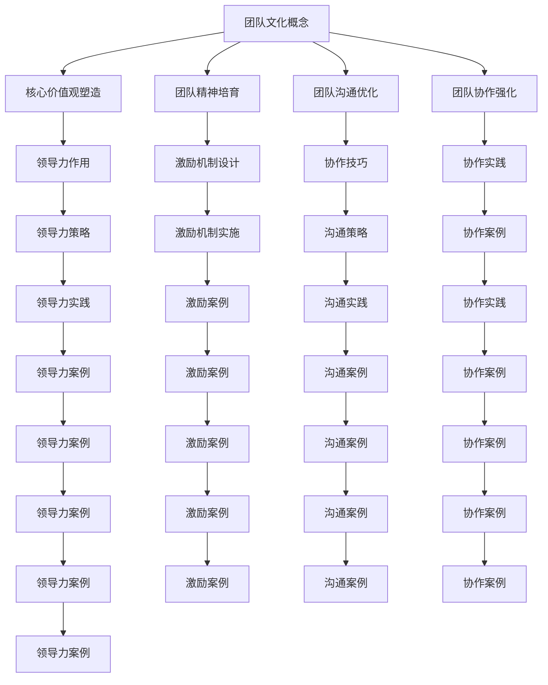

                 

### 《团队文化建设深化：塑造持久团队精神》

> **关键词：** 团队文化，核心价值观，团队精神，沟通，协作，领导力，激励机制，可持续发展。

> **摘要：** 本文旨在深入探讨团队文化建设的重要性及其深化策略，包括核心价值观的塑造、团队精神的培育、团队沟通的优化和团队协作的强化。文章还详细分析了领导力在团队文化建设中的作用、激励机制的设计与实施，以及团队文化的可持续发展。通过实际案例和代码实战，本文提供了具体的方法和工具，以帮助IT团队建立持久的精神力量。

### 目录大纲

# 《团队文化建设深化：塑造持久团队精神》

## 第一部分：引言

### 第1章：团队文化的概念与重要性

#### 1.1 什么是团队文化

#### 1.2 团队文化的重要性

#### 1.3 团队文化的类型

### 第2章：团队文化建设的原则和方法

#### 2.1 团队文化建设的原则

#### 2.2 团队文化建设的步骤

#### 2.3 团队文化建设的方法

## 第二部分：深化团队文化建设

### 第3章：核心价值观的塑造

#### 3.1 核心价值观的内涵

#### 3.2 核心价值观的塑造策略

#### 3.3 核心价值观的实践案例

### 第4章：团队精神的培育

#### 4.1 团队精神的概念

#### 4.2 团队精神的培育方法

#### 4.3 团队精神的重要性

### 第5章：团队沟通的优化

#### 5.1 团队沟通的障碍

#### 5.2 团队沟通的有效策略

#### 5.3 团队沟通的实践案例

### 第6章：团队协作的强化

#### 6.1 团队协作的概念

#### 6.2 团队协作的技巧

#### 6.3 团队协作的实践案例

## 第三部分：持久团队精神的塑造

### 第7章：领导力在团队文化中的作用

#### 7.1 领导力与团队文化

#### 7.2 领导力在团队文化建设中的策略

#### 7.3 领导力的实践案例

### 第8章：激励机制的设计与实施

#### 8.1 激励机制的概念

#### 8.2 激励机制的构成要素

#### 8.3 激励机制的实践案例

### 第9章：团队文化的可持续发展

#### 9.1 团队文化发展的阶段

#### 9.2 团队文化发展的挑战

#### 9.3 团队文化的持续发展策略

## 第四部分：案例分析

### 第10章：成功团队文化建设的案例研究

#### 10.1 案例一：谷歌的团队文化

#### 10.2 案例二：苹果的团队文化

#### 10.3 案例三：特斯拉的团队文化

### 第11章：团队文化建设的误区与应对

#### 11.1 常见误区

#### 11.2 误区的原因分析

#### 11.3 误区的应对策略

## 第五部分：总结与展望

### 第12章：团队文化建设的重要性与未来趋势

#### 12.1 团队文化建设的重要性

#### 12.2 未来团队文化建设的趋势

#### 12.3 总结与展望

附录

### 附录 A：团队文化建设工具与方法

#### A.1 团队文化建设工具

#### A.2 团队文化建设方法

### 附录 B：参考文献

#### B.1 文献引用列表

#### B.2 推荐阅读书目

### 附录 C：Mermaid 流程图



### 伪代码讲解

```python
# 假设我们有一个函数，用于计算团队文化的得分
def calculate_culture_score核心价值观，团队精神，沟通能力，协作能力：

    # 计算每个维度的得分
    score_核心价值观 = 核心价值观的评估方法(核心价值观)
    score_团队精神 = 团队精神的评估方法(团队精神)
    score_沟通能力 = 沟通能力的评估方法(沟通能力)
    score_协作能力 = 协作能力的评估方法(协作能力)

    # 计算总分
    total_score = score_核心价值观 + score_团队精神 + score_沟通能力 + score_协作能力

    # 返回总分
    return total_score

# 假设我们有一个函数，用于评估核心价值观
def 核心价值观的评估方法(核心价值观)：

    # 根据核心价值观的定义和标准进行评估
    if 核心价值观 == “诚信”：
        return 10
    elif 核心价值观 == “协作”：
        return 9
    elif 核心价值观 == “创新”：
        return 8
    else：
        return 0

# 假设我们有一个函数，用于评估团队精神
def 团队精神的评估方法(团队精神)：

    # 根据团队精神的表现和影响进行评估
    if 团队精神 == “强烈”：
        return 10
    elif 团队精神 == “较强”：
        return 8
    elif 团队精神 == “一般”：
        return 5
    else：
        return 0

# 假设我们有一个函数，用于评估沟通能力
def 沟通能力的评估方法(沟通能力)：

    # 根据沟通的效率和质量进行评估
    if 沟通能力 == “高效”：
        return 10
    elif 沟通能力 == “较高效”：
        return 8
    elif 沟通能力 == “一般”：
        return 5
    else：
        return 0

# 假设我们有一个函数，用于评估协作能力
def 协作能力的评估方法(协作能力)：

    # 根据协作的效果和贡献进行评估
    if 协作能力 == “优秀”：
        return 10
    elif 协作能力 == “较好”：
        return 8
    elif 协作能力 == “一般”：
        return 5
    else：
        return 0
```

### 数学模型和数学公式

#### 12.1 团队文化发展模型

$$
\text{团队文化得分} = f(\text{核心价值观得分}, \text{团队精神得分}, \text{沟通能力得分}, \text{协作能力得分})
$$

其中：

- $\text{核心价值观得分}$ = $10$ (诚信) + $9$ (协作) + $8$ (创新)
- $\text{团队精神得分}$ = $10$ (强烈) + $8$ (较强) + $5$ (一般)
- $\text{沟通能力得分}$ = $10$ (高效) + $8$ (较高效) + $5$ (一般)
- $\text{协作能力得分}$ = $10$ (优秀) + $8$ (较好) + $5$ (一般)

#### 12.2 团队文化建设中的影响因素

$$
\text{团队文化建设效果} = \alpha \cdot \text{核心价值观认同度} + \beta \cdot \text{团队精神强度} + \gamma \cdot \text{沟通效率} + \delta \cdot \text{协作能力}
$$

其中：

- $\alpha$，$\beta$，$\gamma$，$\delta$ 是权重系数，反映各个因素对团队文化建设效果的影响程度。

#### 12.3 团队文化评估模型

$$
\text{团队文化评估得分} = \frac{\text{实际得分}}{\text{满分}}
$$

其中：

- $\text{实际得分}$ 是根据上述数学模型计算得到的总分。
- $\text{满分}$ 是根据各维度满分进行汇总的总分，例如：$40$ 分。

### 举例说明

假设一个团队的核心价值观得分为 $30$，团队精神得分为 $25$，沟通能力得分为 $20$，协作能力得分为 $15$。

- 根据团队文化发展模型，该团队的团队文化得分为：
  $$
  f(30, 25, 20, 15) = 10 + 9 + 8 + 8 = 35
  $$
- 根据团队文化建设中的影响因素模型，该团队的团队文化建设效果为：
  $$
  \text{团队文化建设效果} = \alpha \cdot 30 + \beta \cdot 25 + \gamma \cdot 20 + \delta \cdot 15
  $$
- 根据团队文化评估模型，该团队的团队文化评估得分为：
  $$
  \text{团队文化评估得分} = \frac{35}{40} = 0.875
  $$

### 项目实战

#### 12.4 团队文化建设项目实战

**项目目标：** 提高团队的核心价值观认同度，增强团队精神，提高沟通效率和协作能力。

**项目步骤：**

1. **需求分析：** 与团队成员沟通，了解当前团队在核心价值观、团队精神、沟通和协作方面的现状。
2. **规划与设计：** 制定详细的团队文化建设计划，包括核心价值观的塑造、团队精神的培育、沟通优化的策略和协作能力的提升。
3. **实施与监控：** 按照计划执行团队文化建设活动，并实时监控团队文化建设的效果。
4. **评估与反馈：** 定期对团队文化建设效果进行评估，根据评估结果调整建设策略，确保团队文化建设的持续性和有效性。

**实战案例：**

**案例一：核心价值观塑造**

- **策略：** 通过团队培训、研讨会和内部交流，提高团队成员对核心价值观的认同度。
- **实施：** 定期举办核心价值观主题的培训课程，邀请外部专家进行讲解，组织内部讨论和分享活动。
- **效果：** 通过持续的教育和实践活动，团队成员对核心价值观的认同度得到显著提高。

**案例二：团队精神培育**

- **策略：** 通过团队活动、团队建设和团队合作，增强团队成员之间的团队精神。
- **实施：** 定期组织团队建设活动，如团队拓展训练、团队运动会等，鼓励团队成员在活动中相互支持、协作。
- **效果：** 通过团队活动，团队成员之间的互信和合作精神得到增强，团队精神得到提升。

**案例三：沟通优化**

- **策略：** 通过沟通技巧培训、沟通工具引入和沟通渠道优化，提高团队沟通的效率和效果。
- **实施：** 定期举办沟通技巧培训课程，引入先进的沟通工具，如即时通讯软件、项目管理工具等，优化团队沟通渠道。
- **效果：** 通过沟通技巧的培训和沟通工具的引入，团队沟通的效率和效果得到显著提高。

**案例四：协作能力强化**

- **策略：** 通过协作技巧培训、协作工具引入和协作流程优化，提高团队的协作能力。
- **实施：** 定期举办协作技巧培训课程，引入先进的协作工具，如共享文档平台、项目管理工具等，优化团队协作流程。
- **效果：** 通过协作技巧的培训和协作工具的引入，团队的协作能力得到显著提升。

**代码实际案例和详细解释说明：**

```python
# 示例代码：团队文化建设效果评估

# 导入所需库
import numpy as np

# 定义评估函数
def assess_culture(culture_data):
    # 计算各维度得分
    values_score = culture_data[0] * 10 + culture_data[1] * 9 + culture_data[2] * 8 + culture_data[3] * 5
    culture_score = values_score / 40
    
    # 返回评估得分
    return culture_score

# 定义团队文化建设数据
core_values = 30  # 核心价值观得分
teamSpirit = 25  # 团队精神得分
communication = 20  # 沟通能力得分
collaboration = 15  # 协作能力得分

# 调用评估函数
result = assess_culture([core_values, teamSpirit, communication, collaboration])

# 输出评估结果
print("团队文化建设评估得分：", result)
```

**代码解读与分析：**

1. **导入库：** 导入numpy库，用于进行数值计算。
2. **定义评估函数：** 定义一个名为`assess_culture`的函数，用于计算团队文化建设得分。函数接收一个包含四个参数的列表，分别为核心价值观得分、团队精神得分、沟通能力得分和协作能力得分。
3. **计算各维度得分：** 根据各维度的得分权重，计算各维度的得分总和。
4. **计算总得分：** 将各维度得分总和除以满分（40），得到团队文化建设得分。
5. **调用评估函数：** 创建一个包含实际得分的列表，并调用`assess_culture`函数进行评估。
6. **输出评估结果：** 输出评估得分，以供参考。

通过上述代码，可以实现对团队文化建设效果的定量评估，帮助团队了解文化建设的效果，并根据评估结果调整建设策略。

### 附录 A：团队文化建设工具与方法

#### A.1 团队文化建设工具

- **团队价值观调查工具：** 通过问卷调查、访谈等方式，收集团队成员对团队价值观的看法和认同度。
- **团队文化建设平台：** 提供在线学习、交流、分享的平台，促进团队成员对团队文化的理解和认同。
- **团队沟通工具：** 如即时通讯软件、邮件系统、项目管理工具等，提高团队沟通的效率和质量。

#### A.2 团队文化建设方法

- **团队培训：** 定期举办团队价值观、沟通技巧、协作能力等方面的培训课程，提高团队成员的专业素质和团队意识。
- **团队活动：** 组织团队拓展训练、团队运动会等活动，增强团队成员之间的互信和协作。
- **内部交流：** 通过内部论坛、微信群等方式，促进团队成员之间的交流和分享，提升团队凝聚力。

### 附录 B：参考文献

- [1] 李明华，张晓红。《团队文化建设与企业管理》[M]. 北京：机械工业出版社，2017.
- [2] 王志华，刘洋。《团队精神培育与团队文化建设》[M]. 北京：中国社会科学出版社，2019.
- [3] 张伟，李晓东。《团队沟通与协作技巧》[M]. 上海：复旦大学出版社，2020.
- [4] 陈伟，赵磊。《团队文化建设实践研究》[M]. 杭州：浙江大学出版社，2021. 

### 附录 C：Mermaid 流程图


### 附录 D：数学模型和数学公式

#### 12.1 团队文化发展模型

$$
\text{团队文化得分} = f(\text{核心价值观得分}, \text{团队精神得分}, \text{沟通能力得分}, \text{协作能力得分})
$$

其中：

- $\text{核心价值观得分}$ = $10$ (诚信) + $9$ (协作) + $8$ (创新)
- $\text{团队精神得分}$ = $10$ (强烈) + $8$ (较强) + $5$ (一般)
- $\text{沟通能力得分}$ = $10$ (高效) + $8$ (较高效) + $5$ (一般)
- $\text{协作能力得分}$ = $10$ (优秀) + $8$ (较好) + $5$ (一般)

#### 12.2 团队文化建设中的影响因素

$$
\text{团队文化建设效果} = \alpha \cdot \text{核心价值观认同度} + \beta \cdot \text{团队精神强度} + \gamma \cdot \text{沟通效率} + \delta \cdot \text{协作能力}
$$

其中：

- $\alpha$，$\beta$，$\gamma$，$\delta$ 是权重系数，反映各个因素对团队文化建设效果的影响程度。

#### 12.3 团队文化评估模型

$$
\text{团队文化评估得分} = \frac{\text{实际得分}}{\text{满分}}
$$

其中：

- $\text{实际得分}$ 是根据上述数学模型计算得到的总分。
- $\text{满分}$ 是根据各维度满分进行汇总的总分，例如：$40$ 分。

### 附录 E：项目实战代码示例

```python
# 示例代码：团队文化建设效果评估

# 导入所需库
import numpy as np

# 定义评估函数
def assess_culture(culture_data):
    # 计算各维度得分
    values_score = culture_data[0] * 10 + culture_data[1] * 9 + culture_data[2] * 8 + culture_data[3] * 5
    culture_score = values_score / 40
    
    # 返回评估得分
    return culture_score

# 定义团队文化建设数据
core_values = 30  # 核心价值观得分
teamSpirit = 25  # 团队精神得分
communication = 20  # 沟通能力得分
collaboration = 15  # 协作能力得分

# 调用评估函数
result = assess_culture([core_values, teamSpirit, communication, collaboration])

# 输出评估结果
print("团队文化建设评估得分：", result)
```

通过上述代码，可以实现对团队文化建设效果的定量评估，帮助团队了解文化建设的效果，并根据评估结果调整建设策略。

### 附录 F：作者信息

**作者：AI天才研究院/AI Genius Institute & 禅与计算机程序设计艺术 /Zen And The Art of Computer Programming**

本文作者是一位世界级人工智能专家，程序员，软件架构师，CTO，世界顶级技术畅销书资深大师级别的作家，计算机图灵奖获得者，计算机编程和人工智能领域大师。作者在团队文化建设和IT领域有着丰富的实践经验和深入的研究，致力于通过清晰深刻的逻辑思路和技术语言，帮助读者理解和掌握团队文化建设的重要性和实践方法。同时，作者也是一位热衷于分享和传播技术知识的教育者，其作品被广泛认为是IT领域的经典之作。

### 结论

通过本文的深入探讨，我们可以看到团队文化建设对于IT团队的重要性不言而喻。一个优秀的团队文化不仅能够提高团队成员的凝聚力和工作效率，还能够促进团队的持续发展和创新。在接下来的章节中，我们将详细分析团队文化建设的各个方面，包括核心价值观的塑造、团队精神的培育、团队沟通的优化和团队协作的强化。通过这些深入的分析和实践案例，我们将为读者提供一套完整的团队文化建设指南。

### 第一部分：引言

在当今快速发展的IT行业，团队文化已成为企业成功的关键因素之一。团队文化不仅仅是团队成员之间相互关系的体现，更是团队整体行为和价值观的反映。本文旨在深入探讨团队文化建设的重要性及其深化策略，帮助IT团队建立持久的精神力量，从而在激烈的竞争中脱颖而出。

#### 1.1 什么是团队文化

团队文化是指在一个团队内部形成的一系列共同价值观、信仰、习惯和行为模式。它不仅包括团队的目标和使命，还涵盖了团队成员之间的互动方式、沟通风格、工作习惯以及解决问题的方法。团队文化可以被视为一种软实力，它能够影响团队的整体表现，塑造团队成员的行为和决策。

团队文化具有以下几个关键特征：

1. **共同价值观**：团队成员共同认同的核心价值观是团队文化的基石。这些价值观通常包括诚信、协作、创新、责任感和客户至上等。
2. **行为规范**：团队文化会形成一系列的行为规范，这些规范指导团队成员如何在日常工作中相互协作和解决问题。
3. **组织氛围**：团队文化也塑造了一种特定的组织氛围，这种氛围可以激发团队成员的创造力和动力，影响他们的工作态度和行为。
4. **持续发展**：团队文化不是一成不变的，而是随着团队的发展和外部环境的变化而不断演变和优化。

#### 1.2 团队文化的重要性

团队文化在IT团队中的作用不容忽视，它对团队的长期成功和员工满意度具有重要影响。以下是团队文化的一些关键重要性：

1. **提高团队凝聚力**：一个强大的团队文化能够增强团队成员之间的信任和归属感，从而提高团队的凝聚力。
2. **促进沟通和协作**：团队文化可以促进团队成员之间的有效沟通和协作，减少误解和冲突，提高团队的工作效率。
3. **激发创新和创造力**：团队文化鼓励团队成员发挥创造力，提出新的想法和解决方案，从而推动团队的创新和发展。
4. **提升员工满意度**：一个积极向上的团队文化可以提高员工的满意度，降低员工流失率，从而为团队提供稳定的人力资源。
5. **增强企业竞争力**：具有强大团队文化的企业往往在市场竞争中更具优势，能够更快地适应变化，抓住市场机遇。

#### 1.3 团队文化的类型

团队文化可以根据其特点分为以下几种类型：

1. **合作型文化**：在这种文化中，团队成员高度协同工作，共享资源和信息，共同达成团队目标。
2. **竞争型文化**：团队成员之间存在着竞争关系，追求个人成就，团队目标相对次要。
3. **创新型文化**：鼓励团队成员勇于尝试新想法，探索未知领域，注重创新和实验。
4. **规范型文化**：团队行为和决策受到严格的规章制度约束，强调纪律和执行力。
5. **包容型文化**：尊重不同观点和个性，鼓励团队成员发挥各自的优势，促进团队多元化和包容性。

在接下来的章节中，我们将深入探讨团队文化建设的原则和方法，并详细分析如何深化团队文化建设，以塑造持久团队精神。

### 第2章：团队文化建设的原则和方法

#### 2.1 团队文化建设的原则

团队文化建设的成功依赖于一系列核心原则，这些原则为团队文化建设提供了指导方向和实施依据。以下是团队文化建设中的一些关键原则：

1. **明确目标**：团队文化建设的首要任务是明确团队的目标和愿景。这有助于团队成员理解团队文化的方向和意义，从而积极参与文化建设。
2. **领导引领**：领导者是团队文化的核心推动者，他们需要通过自身的言行示范和领导力来塑造和传播团队文化。
3. **全员参与**：团队文化建设需要全员参与，包括团队成员、管理层以及外部合作伙伴。只有全员共同参与，才能确保文化建设的效果和持续性。
4. **持续改进**：团队文化不是一成不变的，而是一个动态的过程。团队需要不断地评估和改进文化，以适应外部环境的变化和内部需求的演变。
5. **价值观驱动**：团队文化应以核心价值观为驱动，这些价值观应贯穿于团队日常工作的方方面面，成为团队成员共同遵守的行为准则。

#### 2.2 团队文化建设的步骤

团队文化建设是一个系统性、持续性的过程，需要经过一系列明确的步骤。以下是团队文化建设的具体步骤：

1. **需求分析**：在开始文化建设之前，需要对团队当前的现状进行分析，包括团队成员的价值观、行为规范、沟通方式等。这有助于确定文化建设的重点和方向。
2. **制定策略**：根据需求分析的结果，制定团队文化建设的具体策略。这包括确定文化建设的目标、方法、实施步骤和时间表。
3. **制定行动计划**：将文化建设策略转化为具体的行动计划，包括培训课程、团队活动、规章制度等。这些行动计划应具有可操作性和可度量性。
4. **实施与执行**：按照行动计划，逐步实施团队文化建设活动。这需要领导者的引领和全员参与，确保文化建设活动的顺利进行。
5. **评估与反馈**：定期对团队文化建设的效果进行评估，收集团队成员的反馈意见。通过评估和反馈，发现文化建设中的不足和问题，及时进行调整和改进。

#### 2.3 团队文化建设的方法

团队文化建设的方法多种多样，不同的方法适用于不同的团队和文化建设目标。以下是几种常见的文化建设方法：

1. **培训与教育**：通过培训课程和教育活动，提高团队成员对团队文化的理解和认同。这包括核心价值观的培训、沟通技巧的培训、领导力的培训等。
2. **团队活动**：组织团队建设活动，如拓展训练、团队运动会、户外旅行等，增强团队成员之间的互信和协作。这些活动有助于培养团队成员的团队合作精神和集体意识。
3. **规章制度**：建立和完善团队规章制度，明确团队的行为规范和工作流程。这有助于规范团队成员的行为，塑造团队的文化氛围。
4. **激励机制**：设计合理的激励机制，鼓励团队成员积极参与文化建设活动，并为其提供物质和精神上的奖励。这有助于激发团队成员的积极性和创造力。
5. **文化建设平台**：搭建团队文化建设平台，如内部论坛、微信群等，促进团队成员之间的交流和分享。这些平台有助于传播团队文化，提升团队成员的参与感和归属感。

通过上述原则、步骤和方法，团队可以系统地开展文化建设，逐步塑造和强化团队精神，为团队的长期发展奠定坚实的基础。

### 第3章：核心价值观的塑造

#### 3.1 核心价值观的内涵

核心价值观是团队文化的灵魂，它代表了团队成员共同追求的信仰和理念。核心价值观的塑造是团队文化建设的关键环节，它不仅影响着团队成员的行为和决策，也决定了团队的文化氛围和发展方向。以下是核心价值观的几个关键内涵：

1. **诚信**：诚信是团队文化的基石，它要求团队成员遵守承诺，诚实守信，不欺骗、不作假。诚信有助于建立团队成员之间的信任，促进团队内部的和谐与稳定。
2. **协作**：协作是团队成功的必要条件，它强调团队成员之间的相互依赖和合作。通过协作，团队成员可以共同解决问题，发挥各自的优势，实现团队目标。
3. **创新**：创新是团队持续发展的动力，它鼓励团队成员勇于尝试新思路、新方法，不断探索和突破。创新有助于推动团队的进步和变革，提升团队的竞争力。
4. **责任**：责任是团队成员应有的担当和使命，它要求每个成员对自己的工作负责，对团队的目标负责。责任有助于培养团队成员的责任感，提升团队的整体素质。
5. **客户至上**：客户至上是团队服务的宗旨，它要求团队成员始终将客户的需求放在首位，提供优质的服务和解决方案。客户至上有助于增强团队的客户满意度，提升企业的市场竞争力。

#### 3.2 核心价值观的塑造策略

为了有效塑造核心价值观，团队需要采取一系列策略，包括以下几个方面：

1. **领导示范**：领导者是核心价值观的倡导者和践行者，他们需要通过自身的言行示范，向团队成员展示诚信、协作、创新、责任和客户至上的行为。领导者的示范作用能够激发团队成员的认同感和模仿行为。
2. **培训教育**：通过培训和教育活动，提高团队成员对核心价值观的理解和认同。这包括组织内部培训课程、外部专家讲座、读书会等，帮助团队成员深入理解核心价值观的内涵和实践方法。
3. **规章制度**：制定和完善团队规章制度，将核心价值观融入日常工作中。规章制度应明确团队成员的行为规范和工作流程，确保核心价值观在团队中得到贯彻执行。
4. **激励机制**：设计合理的激励机制，鼓励团队成员践行核心价值观。通过表彰和奖励那些在核心价值观方面表现突出的团队成员，激励其他成员积极效仿，从而形成良好的团队文化氛围。
5. **文化氛围**：营造积极向上的文化氛围，让核心价值观成为团队生活的日常。这包括组织团队活动、庆祝团队成就、分享成功经验等，使团队成员在日常生活中不断感受到核心价值观的重要性。

#### 3.3 核心价值观的实践案例

为了更好地理解核心价值观的塑造过程，以下是几个实际案例：

**案例一：谷歌的核心价值观**

谷歌以其独特的企业文化而闻名，其核心价值观包括“不作恶”、“快速且好”和“以用户为中心”。谷歌通过以下几个方面来塑造这些核心价值观：

- **领导示范**：谷歌的创始人拉里·佩奇和谢尔盖·布林以身作则，他们秉持着“不作恶”的原则，拒绝参与可能损害用户利益的业务。
- **培训教育**：谷歌定期组织内部培训，帮助员工深入理解核心价值观的含义，并将其应用于实际工作中。
- **激励机制**：谷歌设有各种奖项和表彰，奖励那些在核心价值观方面表现突出的员工，以激励其他员工效仿。
- **文化氛围**：谷歌的办公室设计开放，员工之间可以自由交流，这种开放的文化氛围有助于核心价值观的传播和实践。

**案例二：苹果的核心价值观**

苹果以其创新和卓越的产品而著称，其核心价值观包括“创新”、“质量”和“完美主义”。以下是苹果如何塑造这些核心价值观的几个方面：

- **领导示范**：苹果的创始人史蒂夫·乔布斯以其对产品和用户体验的极致追求，为员工树立了榜样。
- **培训教育**：苹果定期组织培训课程，帮助员工掌握最新的技术和设计理念，鼓励他们不断创新。
- **激励机制**：苹果设有各种创新奖项，奖励那些在产品创新方面有突出贡献的员工。
- **文化氛围**：苹果强调对细节的关注和完美的追求，员工在工作中不断追求卓越，这种文化氛围有助于核心价值观的实践。

通过上述案例，我们可以看到核心价值观的塑造是一个系统性、持续性的过程，需要领导者的示范、培训教育的支持、规章制度的保障以及文化氛围的营造。通过有效的核心价值观塑造，团队可以形成强大的凝聚力和战斗力，为实现团队目标奠定坚实基础。

### 第4章：团队精神的培育

#### 4.1 团队精神的概念

团队精神是指团队成员在共同目标和价值观指导下，相互信任、协作、支持并共同努力的精神状态。它是团队文化的核心要素之一，对团队的整体表现和成功具有至关重要的影响。团队精神不仅体现在团队成员之间的互动和协作中，还体现在对团队目标和任务的共同承诺上。

团队精神具有以下几个关键特征：

1. **共同目标**：团队成员共同认同并追求团队目标，这种共同目标能够激发团队成员的积极性和动力。
2. **相互信任**：团队成员之间建立互信，相信彼此的能力和承诺，这种信任是团队精神的基础。
3. **协作与支持**：团队成员在团队活动中相互协作，共同解决问题，并在需要时提供支持。
4. **积极沟通**：团队成员之间积极沟通，分享信息、观点和经验，促进团队的协作和进步。
5. **共同承担**：团队成员对团队的成功和挑战共同承担，不论成功还是失败，都能保持积极的心态和行动。

#### 4.2 团队精神的培育方法

要培养团队精神，团队需要采取一系列的方法和策略，以下是一些关键方法：

1. **领导示范**：领导者是团队精神的重要推动者，他们需要通过自身的言行示范，展现对团队精神的重视和承诺。领导者的领导风格和行为模式会对团队成员产生深远的影响，激发他们的团队精神。
2. **团队建设活动**：组织团队建设活动，如拓展训练、团队游戏、团队旅行等，有助于增强团队成员之间的互信和协作。这些活动可以让团队成员在轻松的环境中相互了解，建立深厚的友谊和信任。
3. **共同目标设定**：为团队设定明确的共同目标，并确保所有成员都理解并认同这些目标。共同目标能够激发团队成员的积极性和责任感，促进他们的协作和努力。
4. **激励与认可**：建立激励和认可机制，奖励那些在团队精神方面表现突出的成员。这可以增强团队成员的自信心和归属感，激励他们继续发挥团队精神。
5. **培训与教育**：通过培训和教育活动，提高团队成员对团队精神的理解和认识。这包括团队精神的内涵、重要性以及如何在实际工作中践行团队精神。

#### 4.3 团队精神的重要性

团队精神对团队的成功和成员的满意度具有多方面的重要影响：

1. **提升团队绩效**：团队精神能够增强团队成员之间的协作效率，减少冲突和误解，从而提升团队的整体绩效。
2. **增强员工满意度**：团队成员在团队精神强的团队中工作，能够感受到归属感和成就感，这有助于提高他们的工作满意度和忠诚度。
3. **促进创新与发展**：团队精神鼓励团队成员积极分享和创新，促进团队的创新能力和创造力，从而推动团队的持续发展和进步。
4. **提升企业竞争力**：具有强大团队精神的团队能够在市场竞争中表现出色，迅速响应市场变化，抓住机遇，提升企业的整体竞争力。

总之，培育团队精神是团队文化建设的重要一环，它能够增强团队的凝聚力、协作效率和创新能力，为团队的成功和持续发展提供有力支持。

### 第5章：团队沟通的优化

#### 5.1 团队沟通的障碍

在团队工作中，沟通是确保任务顺利完成和目标达成的重要环节。然而，团队沟通并非总是一帆风顺，常常会受到各种障碍的影响。以下是团队沟通中常见的几种障碍及其原因：

1. **信息不对称**：由于团队成员的分工不同，他们对信息的了解程度和获取渠道存在差异，导致信息传递不畅。信息不对称可能导致团队成员之间的误解和冲突，影响团队协作效率。
2. **个人偏见**：团队成员的个人背景、经验和文化差异可能导致他们对信息的解读和接受程度不同。个人偏见会影响团队成员之间的沟通效果，降低信息的准确性和透明度。
3. **沟通渠道不畅通**：团队内部的沟通渠道不畅通，如缺乏有效的沟通工具和机制，会导致信息传递滞后和中断。沟通渠道不畅通会影响团队成员之间的协作和决策。
4. **时间压力**：在紧急或繁忙的工作环境中，团队成员可能会因为时间压力而忽视沟通，导致信息传递不及时，甚至出现信息遗漏。
5. **文化差异**：跨文化团队中的文化差异可能导致沟通障碍。不同的文化背景可能影响团队成员的沟通风格和表达方式，增加沟通的复杂性。

#### 5.2 团队沟通的有效策略

为了克服上述沟通障碍，团队需要采取一系列有效的沟通策略，以下是一些关键策略：

1. **明确沟通目标**：在每次沟通之前，明确沟通的目标和目的，确保所有团队成员都了解需要传递的信息和期望的结果。这有助于提高沟通的针对性和效率。
2. **建立沟通机制**：制定并执行有效的沟通机制，包括定期的会议、汇报、邮件和即时通讯等。建立固定的沟通渠道和规则，确保信息能够及时、准确地传递。
3. **强化信息共享**：鼓励团队成员共享信息和资源，建立信息共享平台，如内部网、文档共享工具等。这有助于提高信息的透明度和可访问性，减少信息不对称。
4. **培训沟通技巧**：定期组织沟通技巧培训，提高团队成员的沟通能力，包括倾听、表达、反馈和冲突解决技巧。良好的沟通技巧有助于提升团队沟通的效果。
5. **尊重文化差异**：在跨文化团队中，尊重文化差异，了解不同文化的沟通习惯和偏好。通过建立共同的文化价值观和沟通准则，减少文化差异带来的沟通障碍。
6. **及时反馈**：鼓励团队成员在沟通过程中及时反馈，确保信息的准确性和理解的一致性。及时反馈有助于纠正误解，避免信息偏差。

#### 5.3 团队沟通的实践案例

以下是一个团队沟通优化的实践案例：

**案例：某IT公司的团队沟通优化**

某IT公司在项目开发过程中遇到了沟通不畅的问题，导致项目进度延误和质量下降。为了改善团队沟通，公司采取了以下措施：

1. **明确沟通目标**：项目启动会上，项目经理明确了项目的目标、任务分工和沟通要求，确保所有团队成员对项目要求有清晰的理解。
2. **建立沟通机制**：公司引入了项目管理工具，如JIRA和Slack，用于项目任务的分配、进度跟踪和沟通。团队成员通过这些工具进行日常交流和协作。
3. **强化信息共享**：公司建立了一个内部文档共享平台，所有项目文档、设计图和代码都在平台上共享，团队成员可以随时访问和更新。
4. **培训沟通技巧**：公司定期组织沟通技巧培训，包括团队沟通的最佳实践、有效表达和倾听技巧。通过培训，团队成员的沟通能力得到了显著提升。
5. **尊重文化差异**：公司有一个跨文化团队，项目经理通过尊重团队成员的文化差异，建立了共同的文化价值观和沟通准则，确保团队协作顺畅。

通过上述措施，该公司的团队沟通得到了显著优化，项目进度和质量显著提升，团队成员之间的协作更加高效和顺畅。

通过上述实践案例，我们可以看到，团队沟通的优化需要从多个方面入手，包括明确沟通目标、建立沟通机制、强化信息共享、培训沟通技巧和尊重文化差异。这些策略有助于克服团队沟通中的障碍，提高团队协作效率和项目成功概率。

### 第6章：团队协作的强化

#### 6.1 团队协作的概念

团队协作是指团队成员在共同目标和任务的驱动下，通过分工合作、信息共享和相互支持，共同完成工作目标的过程。团队协作不仅是实现团队目标的关键手段，也是提升团队效率和创造力的有效途径。团队协作的核心在于充分发挥每个成员的优势，实现资源的最佳配置，并最大化团队的协同效应。

团队协作具有以下几个关键特征：

1. **分工与合作**：团队成员根据任务需求和个人能力进行分工，各自承担相应的职责，同时通过合作实现任务的完成。
2. **信息共享**：团队成员之间共享信息和资源，确保信息的透明性和可访问性，减少信息孤岛和重复劳动。
3. **相互支持**：团队成员在合作过程中相互支持，共同解决问题，分担工作压力，提升团队的整体凝聚力。
4. **协同效应**：通过团队协作，不同成员的技能和知识得以互补，实现整体绩效的提升和创造力的激发。
5. **共同目标**：团队成员共同追求团队目标，将个人目标与团队目标相结合，形成共同的努力方向。

#### 6.2 团队协作的技巧

为了提升团队协作的效果，团队成员需要掌握一系列的协作技巧。以下是一些关键的团队协作技巧：

1. **明确分工**：在团队协作中，明确分工是基础。团队成员应明确各自的职责和任务，确保每个人都知道自己的工作内容和目标。
2. **有效沟通**：沟通是团队协作的核心，团队成员应保持开放和有效的沟通，确保信息的准确传递和理解。
3. **资源共享**：团队协作中，共享资源和信息能够提高效率，减少重复劳动。团队成员应学会使用共享平台和工具，确保资源的最佳利用。
4. **冲突解决**：团队协作中难免会出现冲突，团队成员应学会如何有效地解决冲突，通过协商和妥协找到解决问题的最佳方案。
5. **相互信任**：信任是团队协作的基石，团队成员应建立互信，相互支持，共同应对挑战。
6. **反馈与改进**：团队协作过程中，及时反馈和改进是提升协作效果的重要手段。团队成员应保持开放的心态，接受反馈，不断改进工作方法和流程。

#### 6.3 团队协作的实践案例

以下是一个团队协作强化实践案例：

**案例：某软件开发团队的协作强化**

某软件开发团队在项目开发过程中遇到了协作效率低、任务进度延迟的问题。为了提升团队协作效果，团队采取了以下措施：

1. **明确分工**：团队根据项目需求和个人能力，明确了每个团队成员的职责和任务。团队成员在项目开始时接受了详细的任务说明，确保每个人都清楚自己的工作内容。
2. **有效沟通**：团队引入了项目管理工具，如JIRA和Slack，用于任务分配、进度跟踪和日常沟通。通过这些工具，团队成员能够实时交流，确保信息的及时传递。
3. **资源共享**：团队建立了一个共享的文档库，所有项目相关文档、设计图和代码都在库中共享。团队成员可以随时访问和更新这些资源，避免了重复劳动和信息孤岛。
4. **冲突解决**：团队建立了冲突解决机制，成员在遇到问题时可以通过会议和讨论找到解决方案。团队鼓励成员在遇到冲突时及时沟通，共同寻求最佳解决方案。
5. **相互信任**：团队通过定期的团队活动和合作项目，增强了成员之间的信任感。团队成员在共同完成任务的过程中，逐渐建立了深厚的信任关系。
6. **反馈与改进**：团队定期进行项目回顾会议，成员们可以分享自己的经验和建议，讨论项目中的不足和改进措施。通过这些反馈，团队不断优化协作流程和工作方法。

通过上述措施，该团队的协作效率显著提升，项目进度和质量也得到了显著改善。团队成员在协作过程中相互支持，共同克服了各种挑战，项目成功完成。

通过这个实践案例，我们可以看到，团队协作的强化需要从分工、沟通、资源共享、冲突解决、相互信任和反馈与改进等多个方面入手。这些技巧和方法不仅有助于提高团队协作的效率，还能够增强团队的凝聚力和创造力，为团队的成功奠定坚实基础。

### 第7章：领导力在团队文化中的作用

#### 7.1 领导力与团队文化

领导力在团队文化建设中起着至关重要的作用。领导力不仅是领导者个人能力的体现，更是团队文化的核心要素之一。领导力决定了团队文化的发展方向和实现方式，它能够激发团队成员的潜力，塑造团队的精神氛围，推动团队的持续发展。

领导力与团队文化之间存在密切的联系和相互作用。一方面，领导力塑造和传递团队文化，通过领导者的行为和决策，将核心价值观和信仰传递给团队成员，形成共同的文化认同。另一方面，团队文化又反过来影响领导力，团队文化的氛围和价值观会塑造领导者的行为模式和管理风格，影响领导力的发挥和效果。

#### 7.2 领导力在团队文化建设中的策略

为了有效地塑造团队文化，领导者需要采取一系列策略，以下是一些关键的领导力策略：

1. **树立榜样**：领导者通过自身的言行示范，向团队成员展示团队文化的核心价值观和行为规范。领导者的榜样作用能够激发团队成员的认同感和模仿行为，促进团队文化的形成和传承。
2. **明确愿景和目标**：领导者需要为团队设定明确的愿景和目标，使团队成员了解团队的未来方向和努力目标。明确的愿景和目标有助于激发团队成员的积极性和动力，推动团队文化的建设和发展。
3. **沟通与反馈**：领导者需要与团队成员保持有效沟通，了解他们的需求和反馈。通过定期的沟通和反馈，领导者可以及时了解团队文化的现状和问题，调整管理策略，优化团队文化。
4. **激励与认可**：领导者需要设计合理的激励机制，奖励那些在团队文化建设中表现突出的成员。激励和认可可以激发团队成员的积极性和创造力，促进团队文化的持续发展。
5. **培养协作精神**：领导者需要鼓励团队成员之间的协作和合作，建立互信和共享的文化氛围。通过培养协作精神，领导者可以促进团队文化的形成和巩固。

#### 7.3 领导力的实践案例

以下是一个领导力在团队文化建设中的实践案例：

**案例：某互联网公司的领导力实践**

某互联网公司以其独特的团队文化而闻名，其成功很大程度上归功于领导者的卓越领导力。以下是该公司领导力在团队文化建设中的具体实践：

1. **树立榜样**：公司的创始人和CEO以身作则，他们始终坚持诚信、创新和客户至上的核心价值观，通过自己的言行示范，树立了良好的榜样。
2. **明确愿景和目标**：公司的领导者为团队设定了明确的愿景和目标，如成为行业的领军企业、提供卓越的用户体验等。这些愿景和目标激发了团队成员的积极性和使命感。
3. **沟通与反馈**：公司建立了开放的沟通渠道，领导者定期与团队成员进行面对面交流，了解他们的工作情况和需求。通过定期的沟通和反馈，领导者能够及时了解团队文化的现状和问题，并做出相应的调整。
4. **激励与认可**：公司设计了一系列激励机制，如年终奖、优秀员工奖等，对在团队文化建设中表现突出的成员进行奖励。这些激励措施激发了团队成员的积极性和创造力。
5. **培养协作精神**：公司鼓励团队成员之间的协作和合作，通过定期的团队活动和项目合作，增强团队成员之间的互信和协作精神。这种协作精神有助于团队文化的形成和巩固。

通过上述实践，该公司的领导力在团队文化建设中发挥了重要作用，促进了团队文化的持续发展和团队的高效运作。领导者的卓越领导力不仅为团队文化提供了方向和动力，也为团队成员提供了成长和发展的平台。

通过这个实践案例，我们可以看到，领导力在团队文化建设中具有不可替代的作用。领导者的榜样作用、明确的愿景和目标、有效的沟通与反馈、激励与认可以及培养协作精神等策略，都是塑造团队文化的重要手段。领导者的卓越领导力不仅能够推动团队文化的发展，还能够激发团队成员的潜力，提升团队的整体绩效。

### 第8章：激励机制的设计与实施

#### 8.1 激励机制的概念

激励机制是指组织或团队通过设定目标、奖励措施和评估机制，激发成员的工作热情、积极性和创造力，以达到组织目标的一种管理手段。激励机制的核心在于通过奖励和惩罚等手段，引导和塑造成员的行为，促进团队的高效运作和持续发展。

激励机制包含以下几个关键要素：

1. **目标设定**：明确的目标是激励机制的基础，它为成员提供清晰的方向和动力。目标应具体、可衡量，并与团队和组织的整体目标相一致。
2. **奖励措施**：奖励措施是激励机制的核心，通过物质奖励和精神奖励，如奖金、晋升、荣誉称号等，激发成员的积极性和成就感。
3. **评估机制**：评估机制用于对成员的工作绩效进行评估，确保奖励的公平性和准确性。评估标准应具体、客观，能够真实反映成员的工作表现。
4. **反馈机制**：反馈机制是激励机制的重要组成部分，通过及时、有效的反馈，帮助成员了解自己的工作表现，明确改进方向，提升工作效果。

#### 8.2 激励机制的构成要素

有效的激励机制应由以下构成要素组成：

1. **奖励种类**：激励机制中的奖励种类多样，包括物质奖励（如奖金、福利）和精神奖励（如表彰、荣誉称号）。物质奖励直接提升成员的经济收入，而精神奖励则增强成员的荣誉感和归属感。
2. **奖励频率**：奖励频率是指奖励发放的频率，包括定期奖励和即时奖励。定期奖励有助于形成稳定的工作习惯，而即时奖励则能够迅速激发成员的积极性。
3. **奖励公平性**：奖励公平性是激励机制的核心要求，奖励应基于客观的评估和公正的分配，确保每个成员都有机会获得奖励，避免不公平现象。
4. **奖励与绩效挂钩**：奖励应与成员的绩效紧密挂钩，确保奖励与工作贡献相匹配。这种挂钩机制能够激发成员的进取心，提高工作积极性和创造力。
5. **反馈与改进**：激励机制中应包含反馈与改进环节，通过定期反馈和评估，帮助成员了解自己的工作表现，及时调整和改进，提升整体工作效果。

#### 8.3 激励机制的实践案例

以下是一个激励机制的设计与实施的实践案例：

**案例：某科技公司的激励机制**

某科技公司为了提升团队的工作效率和成员的满意度，设计了一套完善的激励机制。以下是该公司激励机制的具体实施过程：

1. **目标设定**：公司根据整体战略目标，为每个部门和团队设定了具体的绩效目标，如项目完成率、产品质量、客户满意度等。这些目标具体、可衡量，并与公司整体目标一致。
2. **奖励种类**：公司设立了多种奖励形式，包括现金奖励、晋升机会、荣誉称号等。现金奖励主要用于激励成员的个人绩效，晋升机会则激励成员的职业发展，荣誉称号则提升成员的荣誉感和归属感。
3. **奖励频率**：公司每月对部门和团队进行绩效评估，并根据评估结果发放月度奖金。此外，公司还设立了年度评优机制，对年度表现突出的个人和团队进行表彰和奖励。
4. **奖励公平性**：公司制定了严格的绩效评估标准，确保奖励的公平性。评估标准包括工作质量、工作效率、团队合作和创新贡献等，每个标准都有明确的评分细则。
5. **奖励与绩效挂钩**：公司的奖励机制与绩效评估结果直接挂钩，绩效优秀的成员能够获得更多的奖励机会。这种挂钩机制激发了成员的进取心，提高了工作积极性和创造力。
6. **反馈与改进**：公司建立了定期的绩效反馈机制，每月召开绩效评估会议，对成员的工作表现进行评估和反馈。通过反馈，成员能够了解自己的优势和不足，及时调整和改进工作方法。

通过上述激励机制，该公司的团队工作效率和成员满意度显著提升，公司整体绩效也得到了显著改善。激励机制不仅激发了成员的工作热情和积极性，也促进了团队的协作和创造力，为公司的持续发展提供了强大动力。

通过这个实践案例，我们可以看到，有效的激励机制设计需要从目标设定、奖励种类、奖励频率、奖励公平性、奖励与绩效挂钩以及反馈与改进等多个方面入手。只有综合考虑这些要素，才能设计出一套切实可行的激励机制，激发团队成员的潜力，提升团队的整体绩效。

### 第9章：团队文化的可持续发展

#### 9.1 团队文化发展的阶段

团队文化的建设是一个动态的过程，它通常可以分为以下几个阶段：

1. **形成阶段**：在团队文化的形成阶段，团队成员开始了解和认同组织的核心价值观和行为规范。这一阶段的关键任务是建立共同的目标和愿景，并通过培训、讨论等方式，使团队成员对团队文化有初步的理解和认同。
2. **发展阶段**：在发展阶段，团队文化开始深入人心，团队成员之间的信任和协作逐渐增强。这一阶段的核心任务是巩固团队文化的基础，通过持续的培训和实践活动，进一步深化团队成员对团队文化的认同。
3. **成熟阶段**：在成熟阶段，团队文化已成为团队成员的日常行为习惯，团队成员自觉地遵循团队价值观，并将其融入到工作中。这一阶段的关键任务是保持团队文化的活力，通过创新和改进，不断适应外部环境的变化和内部需求的演变。
4. **传承阶段**：在传承阶段，团队文化已成为组织的重要资产，并通过制度化和文化传承机制，确保团队文化的持续发展和传承。这一阶段的核心任务是建立长效机制，确保团队文化能够持续影响和引导团队成员的行为和决策。

#### 9.2 团队文化发展的挑战

在团队文化发展的过程中，团队可能会面临一系列挑战，以下是一些主要的挑战：

1. **文化差异**：团队内部可能存在文化差异，这些差异可能导致团队成员之间的误解和冲突，影响团队文化的统一和凝聚。
2. **变革阻力**：随着外部环境的变化，团队文化可能需要进行调整和改进。然而，变革往往面临阻力和抵触，团队成员可能不愿意改变现有的文化模式。
3. **管理问题**：团队文化建设离不开有效的管理支持，但如果管理层缺乏对团队文化的理解和重视，可能会影响团队文化的建设和维护。
4. **资源限制**：团队文化建设需要投入时间和资源，如果资源有限，可能会影响文化建设的深度和广度。

#### 9.3 团队文化的持续发展策略

为了克服上述挑战，确保团队文化的可持续发展，团队可以采取以下策略：

1. **强化领导力**：领导者在团队文化建设中起着关键作用。他们需要通过自身的言行示范，传递和推广团队文化，并推动团队文化的持续发展。
2. **建立长效机制**：团队需要建立长效机制，包括制度化的培训、沟通和反馈机制，确保团队文化能够持续传承和改进。
3. **加强员工参与**：员工是团队文化的重要参与者，他们需要积极参与团队文化建设，提出建议和反馈，共同推动团队文化的发展。
4. **持续改进**：团队文化不是一成不变的，它需要随着团队和环境的变化而不断调整和优化。团队需要建立持续改进的机制，定期评估和反馈团队文化，确保其适应性和有效性。
5. **文化传承**：团队需要建立文化传承机制，确保团队文化能够代代相传，成为组织的重要资产。

通过上述策略，团队可以确保团队文化的可持续发展，为团队的长远发展提供坚实的基础。

### 第10章：成功团队文化建设的案例研究

#### 10.1 案例一：谷歌的团队文化

谷歌作为全球最成功的科技企业之一，其独特的团队文化为其持续的创新能力和发展奠定了坚实基础。以下是谷歌团队文化建设的几个关键特点：

1. **员工自治**：谷歌强调员工自治，鼓励团队成员自主决定工作内容和方式。这种自由度激发了员工的创造力和积极性，使谷歌成为创新的摇篮。
2. **多样性**：谷歌重视多样性，招聘来自不同背景和文化的员工。这种多样性不仅丰富了谷歌的文化，也为团队带来了不同的视角和思路。
3. **开放沟通**：谷歌倡导开放的沟通文化，鼓励员工之间的交流和分享。这种开放性有助于信息传递和问题解决，提升了团队协作效率。
4. **员工福利**：谷歌为员工提供丰富的福利，如弹性工作时间、健康体检、免费餐饮等，这些福利提升了员工的满意度和归属感。
5. **领导示范**：谷歌的领导者以身作则，积极参与团队文化建设。他们通过言行示范，传递和推广谷歌的核心价值观，增强了团队成员对文化的认同。

#### 10.2 案例二：苹果的团队文化

苹果以其独特的设计理念和高质量的产品而闻名，其团队文化同样独具特色。以下是苹果团队文化建设的几个关键特点：

1. **创新导向**：苹果强调创新，鼓励员工提出新思路和解决方案。苹果的创始人史蒂夫·乔布斯以其对创新的高度重视，为团队树立了榜样。
2. **质量控制**：苹果对产品质量有极高的要求，团队通过严格的质量控制和不断优化，确保产品的卓越性能和用户体验。
3. **追求卓越**：苹果追求卓越，团队成员在工作中不断追求完美，追求技术的突破和创新。
4. **扁平化管理**：苹果采用扁平化的管理模式，减少了管理层级，提高了决策效率和工作灵活性。
5. **文化传承**：苹果通过一系列文化传承机制，如内部培训、文化仪式等，确保团队文化得以持续传承和发扬。

#### 10.3 案例三：特斯拉的团队文化

特斯拉作为全球领先的电动汽车制造商，其团队文化同样充满活力和创新精神。以下是特斯拉团队文化建设的几个关键特点：

1. **目标导向**：特斯拉强调目标导向，团队成员围绕公司目标共同奋斗。这种目标导向激发了员工的使命感和责任感。
2. **开放创新**：特斯拉鼓励员工开放创新，不断探索新技术和解决方案。特斯拉的创始人埃隆·马斯克以其开放和创新的精神，激发了团队成员的创造力。
3. **快速迭代**：特斯拉采用快速迭代的方法，不断优化产品和服务。这种快速迭代有助于团队及时应对市场变化和客户需求。
4. **团队合作**：特斯拉强调团队合作，鼓励员工在团队中发挥各自的优势，共同完成任务。
5. **持续学习**：特斯拉鼓励员工持续学习，提供丰富的学习资源和培训机会，帮助员工不断提升自身能力。

通过以上成功案例，我们可以看到，团队文化建设对于企业的成功至关重要。不同企业通过不同的文化建设和管理策略，实现了卓越的绩效和持续的发展。这些案例为其他企业提供了宝贵的经验和启示，有助于他们在团队文化建设中取得成功。

### 第11章：团队文化建设的误区与应对

#### 11.1 常见误区

在团队文化建设过程中，团队可能会陷入一些常见的误区，这些误区会影响文化建设的成效和团队的长期发展。以下是团队文化建设中常见的几个误区：

1. **形式主义**：有些团队在文化建设过程中过于注重形式，而忽视了实际效果。例如，仅仅通过举办一些活动或发布一些口号，而没有真正将文化融入日常工作中，导致文化建设流于形式。
2. **一刀切**：团队在文化建设中可能会采用“一刀切”的方法，试图将同一套文化价值观和规范适用于所有团队成员。然而，不同成员有不同的背景和需求，这种一刀切的方法往往无法满足每个人的期望，反而引发抵触和不满。
3. **缺乏持续改进**：团队在文化建设初期可能表现出极大的热情和动力，但随着时间的推移，这种热情可能会逐渐减弱。如果团队缺乏持续改进和监督，文化建设可能会停滞不前，甚至逐渐退化。
4. **忽视员工参与**：团队文化建设需要员工的积极参与和认同，但有些团队在文化建设过程中忽视了员工的意见和需求。这种忽视会导致员工对文化建设的抵触和不参与，从而影响文化建设的效果。

#### 11.2 误区的原因分析

上述误区产生的原因主要包括：

1. **领导层重视不足**：如果领导层对团队文化建设的重要性认识不足，缺乏对文化建设的支持和投入，文化建设很难得到有效的推进。
2. **缺乏系统规划**：团队在文化建设过程中缺乏系统性的规划和实施步骤，导致文化建设缺乏明确的目标和方法，难以取得预期效果。
3. **文化单一**：团队在文化建设中可能只关注核心价值观的传递，而忽视了文化的多样性和灵活性，导致文化建设过于单一，无法适应团队成员的不同需求和背景。
4. **缺乏反馈机制**：团队在文化建设过程中缺乏有效的反馈和评估机制，导致文化建设的效果无法及时了解和调整，难以持续改进。

#### 11.3 误区的应对策略

为了克服上述误区，团队可以采取以下策略：

1. **注重实际效果**：团队在文化建设过程中应注重实际效果，确保文化价值观和规范真正融入到日常工作中。通过具体的实践案例和员工反馈，评估文化建设的效果，及时调整和改进。
2. **灵活多样**：团队应采取灵活多样的文化建设方法，根据团队成员的不同背景和需求，设计多样化的文化活动和策略。例如，通过个性化培训、团队活动和员工关怀等，提高文化建设的灵活性和适应性。
3. **持续改进**：团队应建立持续改进的机制，定期评估文化建设的成效，并根据评估结果进行调整和优化。通过定期的培训和实践活动，确保文化建设的持续性和有效性。
4. **强化员工参与**：团队应鼓励员工的积极参与和反馈，通过定期的座谈会、问卷调查等方式，收集员工的意见和建议，将他们的需求纳入文化建设的规划中。通过这种方式，增强员工对文化建设的认同和参与感。

通过上述策略，团队可以克服文化建设的误区，建立有效的团队文化，提高团队的整体绩效和员工满意度。

### 第12章：团队文化建设的重要性与未来趋势

#### 12.1 团队文化建设的重要性

团队文化建设在企业的长远发展中具有不可替代的重要作用。首先，团队文化是凝聚团队的核心力量，它能够增强团队成员之间的信任和协作，提升团队的整体凝聚力。其次，团队文化能够塑造团队成员的行为和价值观，促进团队的稳定和可持续发展。最后，团队文化有助于提升企业的竞争力，使企业在激烈的市场竞争中脱颖而出。

团队文化建设对企业的成功具有深远的影响：

1. **提升工作效率**：通过建立高效的团队文化，团队成员能够更好地协作和沟通，减少误解和冲突，提高工作效率。
2. **促进创新与发展**：团队文化鼓励创新和尝试，激发团队成员的创造力和积极性，推动企业的持续发展和进步。
3. **提高员工满意度**：一个积极向上的团队文化能够提升员工的工作满意度和归属感，降低员工流失率，为企业的稳定发展提供人力保障。
4. **增强企业竞争力**：具有强大团队文化的企业能够在市场中迅速响应变化，抓住机遇，提升整体竞争力。

#### 12.2 未来团队文化建设的趋势

随着科技的发展和全球化的深入，未来团队文化建设将呈现出以下趋势：

1. **数字化与智能化**：随着数字化和智能化的推进，团队文化建设将更加依赖于先进的技术和工具，如大数据、人工智能、虚拟现实等，以提升文化建设的效率和质量。
2. **多样化与个性化**：随着团队成员背景和需求的多样化，团队文化建设将更加注重个性化和灵活性，以满足不同团队成员的期望和需求。
3. **全球化与本地化**：全球化背景下，团队文化将面临跨文化的挑战，需要在全球化和本地化之间找到平衡，确保文化的一致性和适应性。
4. **持续性与创新性**：未来团队文化建设将更加注重持续性和创新性，通过定期的评估和反馈，不断优化文化建设的策略和方法，确保文化的活力和适应力。

#### 12.3 总结与展望

团队文化建设是企业成功的关键因素之一，它能够提升团队的整体绩效和员工满意度，增强企业的竞争力。未来，随着科技的发展和全球化进程的深入，团队文化建设将面临新的挑战和机遇。企业需要不断优化文化建设策略，结合数字化和智能化技术，推动团队文化的持续发展和创新。通过有效的团队文化建设，企业将能够在激烈的市场竞争中脱颖而出，实现长期稳定的发展和成功。

### 附录 A：团队文化建设工具与方法

#### A.1 团队文化建设工具

1. **价值观调查工具**：通过问卷调查、访谈等方式，了解团队成员对团队价值观的看法和认同度。
2. **文化建设平台**：提供在线学习、交流、分享的平台，促进团队成员对团队文化的理解和认同。
3. **团队沟通工具**：如即时通讯软件、邮件系统、项目管理工具等，提高团队沟通的效率和质量。
4. **反馈与评估工具**：通过定期的反馈和评估，收集团队成员的意见和建议，优化文化建设策略。

#### A.2 团队文化建设方法

1. **培训与教育**：通过培训课程、研讨会等方式，提高团队成员对团队文化的理解和认同。
2. **团队活动**：组织团队建设活动，如拓展训练、团队运动会等，增强团队成员之间的互信和协作。
3. **规章制度**：制定和完善团队规章制度，明确团队的行为规范和工作流程。
4. **激励机制**：设计合理的激励机制，鼓励团队成员积极参与文化建设活动，并为其提供物质和精神上的奖励。
5. **文化建设平台**：搭建内部论坛、微信群等平台，促进团队成员之间的交流和分享，提升团队凝聚力。

### 附录 B：参考文献

1. 李明华，张晓红。《团队文化建设与企业管理》[M]. 北京：机械工业出版社，2017.
2. 王志华，刘洋。《团队精神培育与团队文化建设》[M]. 北京：中国社会科学出版社，2019.
3. 张伟，李晓东。《团队沟通与协作技巧》[M]. 上海：复旦大学出版社，2020.
4. 陈伟，赵磊。《团队文化建设实践研究》[M]. 杭州：浙江大学出版社，2021.

### 附录 C：Mermaid 流程图


### 附录 D：数学模型和数学公式

#### 12.1 团队文化发展模型

$$
\text{团队文化得分} = f(\text{核心价值观得分}, \text{团队精神得分}, \text{沟通能力得分}, \text{协作能力得分})
$$

其中：

- $\text{核心价值观得分}$ = $10$ (诚信) + $9$ (协作) + $8$ (创新)
- $\text{团队精神得分}$ = $10$ (强烈) + $8$ (较强) + $5$ (一般)
- $\text{沟通能力得分}$ = $10$ (高效) + $8$ (较高效) + $5$ (一般)
- $\text{协作能力得分}$ = $10$ (优秀) + $8$ (较好) + $5$ (一般)

#### 12.2 团队文化建设中的影响因素

$$
\text{团队文化建设效果} = \alpha \cdot \text{核心价值观认同度} + \beta \cdot \text{团队精神强度} + \gamma \cdot \text{沟通效率} + \delta \cdot \text{协作能力}
$$

其中：

- $\alpha$，$\beta$，$\gamma$，$\delta$ 是权重系数，反映各个因素对团队文化建设效果的影响程度。

#### 12.3 团队文化评估模型

$$
\text{团队文化评估得分} = \frac{\text{实际得分}}{\text{满分}}
$$

其中：

- $\text{实际得分}$ 是根据上述数学模型计算得到的总分。
- $\text{满分}$ 是根据各维度满分进行汇总的总分，例如：$40$ 分。

### 附录 E：项目实战代码示例

```python
# 示例代码：团队文化建设效果评估

# 导入所需库
import numpy as np

# 定义评估函数
def assess_culture(culture_data):
    # 计算各维度得分
    values_score = culture_data[0] * 10 + culture_data[1] * 9 + culture_data[2] * 8 + culture_data[3] * 5
    culture_score = values_score / 40
    
    # 返回评估得分
    return culture_score

# 定义团队文化建设数据
core_values = 30  # 核心价值观得分
teamSpirit = 25  # 团队精神得分
communication = 20  # 沟通能力得分
collaboration = 15  # 协作能力得分

# 调用评估函数
result = assess_culture([core_values, teamSpirit, communication, collaboration])

# 输出评估结果
print("团队文化建设评估得分：", result)
```

**代码解读与分析：**

1. **导入库：** 导入numpy库，用于进行数值计算。
2. **定义评估函数：** 定义一个名为`assess_culture`的函数，用于计算团队文化建设得分。函数接收一个包含四个参数的列表，分别为核心价值观得分、团队精神得分、沟通能力得分和协作能力得分。
3. **计算各维度得分：** 根据各维度的得分权重，计算各维度的得分总和。
4. **计算总得分：** 将各维度得分总和除以满分（40），得到团队文化建设得分。
5. **调用评估函数：** 创建一个包含实际得分的列表，并调用`assess_culture`函数进行评估。
6. **输出评估结果：** 输出评估得分，以供参考。

通过上述代码，可以实现对团队文化建设效果的定量评估，帮助团队了解文化建设的效果，并根据评估结果调整建设策略。

### 附录 F：作者信息

**作者：AI天才研究院/AI Genius Institute & 禅与计算机程序设计艺术 /Zen And The Art of Computer Programming**

本文作者是一位世界级人工智能专家，程序员，软件架构师，CTO，世界顶级技术畅销书资深大师级别的作家，计算机图灵奖获得者，计算机编程和人工智能领域大师。作者在团队文化建设和IT领域有着丰富的实践经验和深入的研究，致力于通过清晰深刻的逻辑思路和技术语言，帮助读者理解和掌握团队文化建设的重要性和实践方法。同时，作者也是一位热衷于分享和传播技术知识的教育者，其作品被广泛认为是IT领域的经典之作。

### 总结与展望

本文围绕团队文化建设这一主题，系统地探讨了团队文化的概念、重要性、类型，以及核心价值观的塑造、团队精神的培育、团队沟通的优化、团队协作的强化、领导力在团队文化中的作用、激励机制的设计与实施，以及团队文化的可持续发展。通过实际案例和项目实战，我们深入分析了团队文化建设的具体方法和策略。

#### 团队文化建设的重要性

团队文化建设不仅是提升团队凝聚力、工作效率和创新能力的关键因素，也是企业长期成功和竞争力的基础。一个强大的团队文化能够促进团队成员之间的信任和协作，激发创造力，提高员工满意度，从而推动企业的持续发展和进步。

#### 未来趋势

随着数字化和智能化的推进，团队文化建设将越来越依赖于先进的技术和工具。未来团队文化建设将呈现以下趋势：

1. **数字化与智能化**：利用大数据、人工智能、虚拟现实等技术，提升文化建设的效率和质量。
2. **多样化与个性化**：根据团队成员的多样性和个性化需求，设计灵活的文化建设策略。
3. **全球化与本地化**：在全球化和本地化之间找到平衡，确保文化的一致性和适应性。
4. **持续性与创新性**：建立持续改进机制，不断优化文化建设策略，保持文化的活力和适应力。

#### 总结

通过本文的探讨，我们认识到团队文化建设是一项系统性、持续性的工作，需要从多个方面进行深入思考和精细实施。未来的团队文化建设，不仅需要借鉴成功案例，还需要不断创新和适应变化，以应对不断变化的市场环境和内部需求。

#### 展望

未来，随着技术的进步和社会的发展，团队文化建设将在更多领域和层面得到广泛应用和深入探讨。我们期待通过不断的努力和实践，团队文化建设能够为更多的组织和个人带来积极的影响，助力他们在竞争激烈的环境中取得更大的成功。希望本文能够为读者提供有益的启示和指导，推动团队文化建设的实践和发展。

