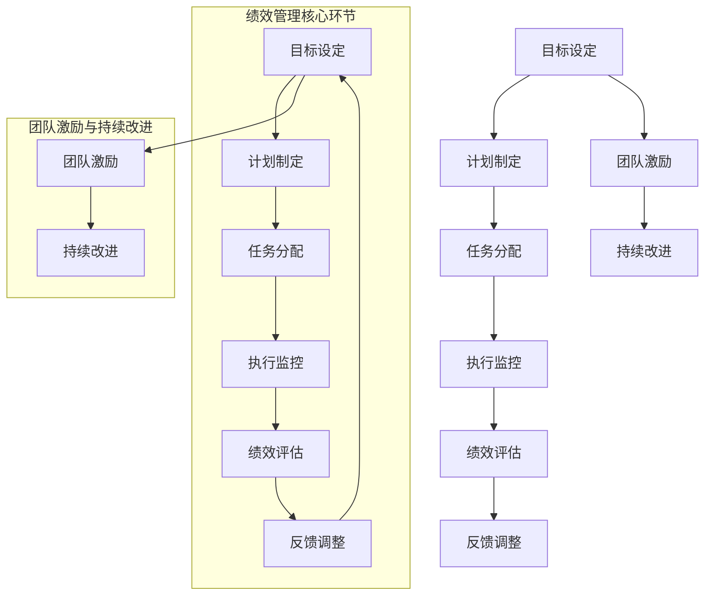

                 

# 《团队绩效管理：设定和实现团队目标》

## 关键词
- 团队绩效管理
- 目标设定
- 绩效评估
- 沟通机制
- 行动计划
- 团队激励
- 持续改进

## 摘要
本文将深入探讨团队绩效管理的核心概念和实施方法，包括目标设定、绩效评估、沟通机制、行动计划和团队激励等关键要素。通过实际案例和详细解释，我们将展示如何有效地设定和实现团队目标，提高团队绩效，从而推动组织的发展。文章还将分析团队绩效管理面临的挑战，并提出相应的解决方案，为团队的持续改进提供有益的指导。

## 目录大纲

## 第一部分：团队绩效管理概述

### 第1章：团队绩效管理的基本概念
#### 1.1 团队绩效管理的定义与重要性
#### 1.2 团队绩效管理的基本原则
#### 1.3 团队绩效管理的发展趋势

### 第2章：团队绩效管理的核心要素
#### 2.1 目标设定
#### 2.2 绩效指标
#### 2.3 绩效评估

### 第3章：团队绩效管理的实施步骤
#### 3.1 制定绩效管理计划
#### 3.2 建立有效的沟通机制
#### 3.3 实施绩效评估

## 第二部分：设定团队目标

### 第4章：明确团队目标的重要性
#### 4.1 团队目标对团队绩效的影响
#### 4.2 设定明确、具体的目标

### 第5章：设定团队目标的步骤与方法
#### 5.1 目标分解
#### 5.2 目标优先级排序
#### 5.3 制定可衡量的目标

### 第6章：团队目标的调整与更新
#### 6.1 目标调整的时机
#### 6.2 如何调整团队目标
#### 6.3 目标更新的方法

## 第三部分：实现团队目标

### 第7章：制定行动计划
#### 7.1 行动计划的制定
#### 7.2 分配任务与责任
#### 7.3 时间规划

### 第8章：激发团队动力
#### 8.1 团队激励的方法
#### 8.2 提高团队凝聚力
#### 8.3 激发个人潜力

### 第9章：监控与调整
#### 9.1 监控团队目标的实现进度
#### 9.2 调整计划与策略
#### 9.3 解决团队绩效问题

## 第四部分：团队绩效管理的实践与案例分析

### 第10章：团队绩效管理的实践案例
#### 10.1 案例一：某公司的绩效管理实践
#### 10.2 案例二：某团队的绩效管理经验

### 第11章：团队绩效管理的挑战与应对策略
#### 11.1 团队绩效管理面临的挑战
#### 11.2 应对策略与解决方案

### 第12章：团队绩效管理的未来发展
#### 12.1 新技术的应用
#### 12.2 团队绩效管理的发展趋势

## 附录

### 附录A：团队绩效管理工具与方法
#### A.1 常用的绩效管理工具
#### A.2 绩效管理方法的对比分析

### 附录B：团队绩效管理相关资料
#### B.1 常见问题解答
#### B.2 相关书籍推荐
#### B.3 学术论文与报告

## Mermaid 流程图
```
graph TD
A[团队绩效管理概述] --> B[核心要素]
B --> C[实施步骤]
A --> D[设定团队目标]
D --> E[实现团队目标]
E --> F[实践与案例分析]
F --> G[挑战与应对策略]
F --> H[未来发展]

A((团队绩效管理概述))
B((核心要素))
C((实施步骤))
D((设定团队目标))
E((实现团队目标))
F((实践与案例分析))
G((挑战与应对策略))
H((未来发展))

A-->B{实施步骤}
A-->D{设定团队目标}
B-->C{核心要素}
D-->E{实现团队目标}
E-->F{实践与案例分析}
F-->G{挑战与应对策略}
F-->H{未来发展}
```

### 第一部分：团队绩效管理概述

#### 第1章：团队绩效管理的基本概念

##### 1.1 团队绩效管理的定义与重要性

团队绩效管理是一个系统的过程，旨在确保团队的工作活动与组织的战略目标保持一致，并通过有效管理团队成员的行为和成果来提高团队的整体绩效。绩效管理不仅仅是对团队成员工作结果的评估，更是一个持续的过程，涉及目标设定、沟通、反馈、发展以及激励等多个方面。

在当今快速变化和竞争激烈的市场环境中，团队绩效管理的重要性愈发凸显。它不仅有助于提升团队的产出和效率，还能增强团队成员的士气和归属感，从而促进组织的长期成功。

团队绩效管理的定义可以概括为以下几点：

1. **目标导向**：团队绩效管理以明确的目标为导向，确保团队成员了解他们需要达成的目标，并理解这些目标对组织的价值。
2. **持续反馈**：通过定期的反馈和评估，帮助团队成员了解自己的工作表现，并提供改进的机会。
3. **发展支持**：关注团队成员的个人成长和发展，为他们提供必要的资源和指导。
4. **激励与认可**：通过激励和认可机制，激发团队成员的积极性和创造力。

##### 1.2 团队绩效管理的基本原则

为了确保团队绩效管理的有效性，以下是一些基本的原则：

1. **透明度**：绩效管理过程应该是透明的，团队成员应该清楚地了解绩效评估的标准和过程。
2. **一致性**：在评估团队成员时，应该确保评估标准和流程在组织内部保持一致。
3. **公正性**：绩效评估应该是客观和公正的，不应受到个人偏见的影响。
4. **参与性**：团队成员应该参与到绩效管理的全过程，包括目标的设定、评估和反馈。
5. **发展性**：绩效管理的目的是帮助团队成员提升工作能力和职业发展，而不是简单地评定工作成果。

##### 1.3 团队绩效管理的发展趋势

随着科技的进步和组织结构的变化，团队绩效管理也在不断演变。以下是一些当前的趋势：

1. **敏捷绩效管理**：敏捷绩效管理更注重团队成员的协作和快速响应变化的能力，而不是传统的年度评估。
2. **数据驱动**：通过使用数据分析工具，可以更准确地评估团队和个人的绩效，并基于数据做出决策。
3. **员工参与**：越来越多的组织鼓励员工参与到绩效管理过程中，通过定期的对话和反馈来改进绩效。
4. **个性化**：绩效管理正在从一刀切的方法转向更加个性化的方法，以适应不同团队成员的需求和风格。

#### 第2章：团队绩效管理的核心要素

##### 2.1 目标设定

目标设定是团队绩效管理的第一步，也是最为关键的一步。设定明确、具体和可衡量的目标是确保团队成员朝着共同目标努力的基础。

1. **SMART目标**：SMART目标是具体的（Specific）、可衡量的（Measurable）、可实现的（Achievable）、相关的（Relevant）和时限的（Time-bound）。这种方法可以帮助团队成员清晰地了解他们需要达成的目标。

2. **目标分解**：将大型目标分解为更小的、可管理的子目标，有助于团队逐步实现最终目标，并保持动力。

3. **目标优先级排序**：根据目标的重要性和紧急性对目标进行排序，确保团队首先关注最重要的目标。

##### 2.2 绩效指标

绩效指标是评估团队和个体工作表现的标准。有效的绩效指标应具有以下特点：

1. **明确性**：指标应明确，避免模糊和主观的描述。
2. **相关性**：指标应与团队的目标和组织的战略目标相关。
3. **可衡量性**：指标应有明确的衡量标准，使评估结果具有客观性。

常见的绩效指标包括：

- **量化指标**：如销售额、客户满意度、错误率等。
- **行为指标**：如团队协作、沟通效率、问题解决能力等。

##### 2.3 绩效评估

绩效评估是团队绩效管理的重要组成部分，它通过定期评估团队成员的工作表现，提供反馈和改进的机会。

1. **评估周期**：绩效评估通常分为年度评估、季度评估和月度评估等。不同的评估周期适用于不同类型的组织和团队。

2. **评估方法**：常用的评估方法包括360度评估、关键事件评估、行为观察评估等。

3. **评估结果的应用**：评估结果应被用于以下方面：

- **反馈和改进**：为团队成员提供反馈，帮助他们了解自己的优点和需要改进的地方。
- **奖励和惩罚**：根据评估结果，实施奖励和惩罚措施，以激励团队成员。
- **职业发展**：为团队成员提供职业发展机会，如培训、晋升等。

#### 第3章：团队绩效管理的实施步骤

##### 3.1 制定绩效管理计划

制定绩效管理计划是确保团队绩效管理顺利进行的重要步骤。绩效管理计划应包括以下内容：

1. **绩效管理目标**：明确绩效管理的目标，如提高团队绩效、增强团队凝聚力等。
2. **评估周期**：确定评估的周期，如年度评估、季度评估等。
3. **评估标准**：制定明确的评估标准，确保评估过程的客观性和公正性。
4. **责任分配**：明确各级管理人员和团队成员在绩效管理过程中的职责和角色。

##### 3.2 建立有效的沟通机制

有效的沟通是团队绩效管理成功的关键。建立以下沟通机制有助于提高团队的协作和沟通效率：

1. **定期会议**：定期召开团队会议，讨论团队目标、进度和问题。
2. **一对一沟通**：管理层应定期与团队成员进行一对一沟通，了解他们的工作情况和需求。
3. **反馈机制**：建立反馈机制，鼓励团队成员提供意见和建议，以便及时调整和改进工作。

##### 3.3 实施绩效评估

实施绩效评估是团队绩效管理的重要环节。以下步骤有助于确保评估过程的顺利进行：

1. **准备评估材料**：收集和整理团队成员的工作数据和表现记录。
2. **开展评估会议**：在评估会议上，对团队成员的工作进行评价，并提供反馈。
3. **记录评估结果**：将评估结果记录在绩效管理系统中，以便跟踪和管理。
4. **制定改进计划**：根据评估结果，为团队成员制定改进计划，并提供必要的支持和资源。

### 第二部分：设定团队目标

#### 第4章：明确团队目标的重要性

团队目标是指团队希望达到的成果和状态，是团队行动的指南和方向。明确团队目标的重要性体现在以下几个方面：

1. **指导工作**：明确的目标可以为团队成员提供清晰的工作方向和指导，避免盲目行动和资源浪费。
2. **激励成员**：明确的目标可以激发团队成员的积极性和动力，增强团队的凝聚力和归属感。
3. **评估绩效**：明确的目标是评估团队和个体工作绩效的基础，有助于衡量工作成果和效率。
4. **促进协作**：明确的目标可以促进团队成员之间的协作和沟通，确保团队朝着共同目标努力。

#### 4.1 团队目标对团队绩效的影响

团队目标对团队绩效有着重要的影响，具体体现在以下几个方面：

1. **提高工作效率**：明确的目标可以帮助团队成员集中精力，减少无意义的工作，提高工作效率。
2. **增强团队凝聚力**：共同的目标可以增强团队成员之间的协作和信任，提高团队的凝聚力。
3. **促进个人成长**：明确的目标可以促使团队成员不断学习和提升自己的技能，促进个人成长和职业发展。
4. **提升组织绩效**：团队目标的实现有助于提升组织的整体绩效，推动组织的发展。

#### 4.2 设定明确、具体的目标

为了确保团队目标的设定能够对团队绩效产生积极影响，目标应具备以下特点：

1. **明确性**：目标应具体、清晰，避免模糊和宽泛的描述。例如，将“提高销售额”具体化为“在下一个季度将销售额提高20%”。
2. **具体性**：目标应具有明确的衡量标准，使其可被评估和实现。例如，将“提高客户满意度”具体化为“通过客户满意度调查获得90%以上的满意度评分”。
3. **可实现性**：目标应具有可行性，考虑到团队成员的能力、资源和时间等因素。例如，将“开发一款新软件”具体化为“在三个月内完成软件的开发和测试”。
4. **相关性**：目标应与组织的战略目标和价值观相关，确保团队的工作与组织的整体发展方向保持一致。

#### 第5章：设定团队目标的步骤与方法

设定团队目标是一个系统化、结构化的过程，以下步骤和方法可以帮助团队有效地设定目标：

##### 5.1 目标分解

目标分解是将大型的、抽象的目标分解为更小、更具体的子目标，以便团队可以逐步实现最终目标。以下是一种常见的目标分解方法：

1. **确定最终目标**：首先，团队需要明确团队的整体目标，这通常是组织战略目标在团队层面的具体体现。
2. **分解为子目标**：将最终目标分解为多个子目标，每个子目标都应该具体、明确，并且相互之间具有关联性。
3. **制定行动计划**：为每个子目标制定详细的行动计划，明确所需的资源和时间安排。

##### 5.2 目标优先级排序

在设定了多个子目标之后，团队需要对目标进行优先级排序，确保团队首先关注最重要的目标。以下是一种常用的目标优先级排序方法：

1. **确定优先级标准**：根据目标的紧急性、重要性和可行性等因素，确定优先级标准。
2. **评估每个目标的优先级**：对每个目标进行评估，根据优先级标准确定其优先级。
3. **调整和优化**：根据评估结果，对目标的优先级进行调整和优化，确保团队资源得到有效利用。

##### 5.3 制定可衡量的目标

可衡量的目标是确保团队目标的实现有明确的标准和评估方法。以下是一种制定可衡量目标的方法：

1. **明确衡量指标**：确定用于衡量目标实现的指标，这些指标应具有可操作性和可衡量性。
2. **设定衡量标准**：为每个指标设定明确的衡量标准，使其具有具体的数值或范围。
3. **定期评估**：根据设定的衡量标准和指标，定期对目标的实现情况进行评估，确保目标的达成。

#### 第6章：团队目标的调整与更新

##### 6.1 目标调整的时机

团队目标不是一成不变的，它们需要根据外部环境的变化和团队内部的发展进行调整。以下是一些常见的目标调整时机：

1. **战略调整**：当组织的战略目标发生变化时，团队目标也需要相应调整，以确保与组织的整体发展方向保持一致。
2. **外部环境变化**：如市场趋势、技术发展等外部环境因素发生变化时，团队目标可能需要调整以适应新的环境。
3. **内部发展**：随着团队成员的能力提升和团队结构的调整，团队目标也需要相应调整，以适应新的团队状况。

##### 6.2 如何调整团队目标

调整团队目标是一个系统化的过程，以下是一些具体的调整方法：

1. **重新评估**：定期对团队目标进行重新评估，分析目标是否仍然符合团队和组织的发展需求。
2. **沟通与讨论**：与团队成员进行沟通和讨论，了解他们对当前目标的看法和建议，共同探讨目标调整的可能性。
3. **制定新目标**：在评估和讨论的基础上，制定新的团队目标，确保目标具有明确性、具体性和可实现性。

##### 6.3 目标更新的方法

目标更新是确保团队目标与实际情况保持一致的关键步骤。以下是一些常用的目标更新方法：

1. **定期回顾**：定期回顾团队目标的实现情况，分析目标的达成度，识别需要改进的方面。
2. **调整优先级**：根据目标的达成度和团队资源的情况，调整目标的优先级，确保团队首先关注最重要的目标。
3. **更新衡量指标**：根据目标和实际情况的变化，更新衡量指标和衡量标准，确保评估结果的准确性和有效性。

### 第三部分：实现团队目标

#### 第7章：制定行动计划

实现团队目标需要一个明确的行动计划，这有助于确保团队目标的实现有具体的步骤和时间表。以下是如何制定行动计划的步骤：

##### 7.1 行动计划的制定

1. **确定目标**：首先，明确团队的目标，确保目标具有明确性、具体性和可实现性。
2. **分解目标**：将目标分解为更小的、可管理的子目标，为每个子目标制定详细的行动计划。
3. **分配任务**：根据团队成员的能力和特长，将任务分配给适当的成员，确保每个任务都有明确的负责人。
4. **设定时间表**：为每个任务设定明确的时间表，确保任务在规定的时间内完成。

##### 7.2 分配任务与责任

1. **任务分配**：根据每个任务的特点和要求，将任务分配给适当的成员。任务分配应考虑成员的能力、经验和兴趣。
2. **明确责任**：为每个任务分配明确的负责人，确保任务的完成有责任人负责。
3. **沟通与协调**：在任务分配和责任明确后，与团队成员进行沟通和协调，确保他们对任务和要求有清晰的理解。

##### 7.3 时间规划

1. **制定时间表**：根据任务的要求和时间，为每个任务制定详细的时间表，确保任务在规定的时间内完成。
2. **监控进度**：定期监控任务进度，及时发现和解决问题，确保任务按计划进行。
3. **调整计划**：根据任务进度和实际情况，及时调整计划，确保团队目标的实现。

#### 第8章：激发团队动力

团队动力是确保团队高效工作的关键因素。以下是一些激发团队动力的方法：

##### 8.1 团队激励的方法

1. **目标激励**：通过设定明确、具体和具有挑战性的目标，激发团队成员的工作热情和动力。
2. **认可激励**：对团队成员的工作成果进行认可和奖励，增强他们的成就感和归属感。
3. **竞争激励**：通过团队间的竞争，激发团队成员的进取心和创造力。
4. **培训激励**：为团队成员提供培训和发展的机会，提升他们的能力和信心。

##### 8.2 提高团队凝聚力

1. **团队建设活动**：通过组织团队建设活动，增强团队成员之间的信任和合作，提高团队的凝聚力。
2. **沟通与交流**：鼓励团队成员之间的沟通和交流，促进信息共享和协作。
3. **共同目标**：确保团队成员有共同的目标和价值观，增强团队的凝聚力。

##### 8.3 激发个人潜力

1. **个性化发展计划**：为团队成员制定个性化的发展计划，激发他们的潜力。
2. **挑战性任务**：为团队成员分配具有挑战性的任务，激发他们的进取心和创造力。
3. **职业发展机会**：为团队成员提供职业发展的机会，激励他们不断提升自己的能力和职业素养。

#### 第9章：监控与调整

实现团队目标是一个持续的过程，需要定期监控和调整。以下是如何进行监控与调整的步骤：

##### 9.1 监控团队目标的实现进度

1. **建立监控机制**：建立定期监控机制，对团队目标的实现进度进行监控。
2. **收集数据**：通过数据收集工具和手段，收集与团队目标相关的数据，如工作量、效率、质量等。
3. **分析数据**：对收集到的数据进行分析，评估团队目标的实现情况。

##### 9.2 调整计划与策略

1. **识别问题**：根据监控结果，识别团队目标实现过程中存在的问题和障碍。
2. **分析原因**：分析问题产生的原因，找出解决问题的关键因素。
3. **制定调整计划**：根据问题分析和原因分析的结果，制定相应的调整计划，包括资源调配、任务分配、时间调整等。

##### 9.3 解决团队绩效问题

1. **及时反馈**：及时向团队成员反馈监控结果和调整计划，确保他们了解当前的情况和需要采取的行动。
2. **协同解决**：与团队成员协同合作，共同解决问题，确保团队目标的实现。
3. **持续改进**：通过持续的监控、调整和改进，不断提升团队绩效，实现团队目标。

### 第四部分：团队绩效管理的实践与案例分析

#### 第10章：团队绩效管理的实践案例

在探讨团队绩效管理的实际应用时，通过具体案例可以更好地理解其操作流程和效果。以下是两个团队绩效管理的实践案例。

##### 10.1 案例一：某公司的绩效管理实践

某公司是一家技术导向型的初创企业，其团队绩效管理的实践具有以下特点：

1. **敏捷绩效管理**：公司采用了敏捷绩效管理方法，每个季度进行一次绩效评估，而不是传统的年度评估。这种方法使得团队能够更快速地响应市场变化和客户需求。
2. **数据驱动的评估**：公司使用数据分析工具来评估团队和个人的绩效，确保评估结果基于客观的数据，而不是主观的感受。
3. **员工参与**：团队成员积极参与绩效管理的全过程，从目标设定到评估反馈，每个环节都有员工的参与和意见。

案例结果显示，通过敏捷绩效管理和数据驱动评估，公司团队的绩效显著提升，团队协作更加顺畅，员工的工作满意度和忠诚度也得到了提高。

##### 10.2 案例二：某团队的绩效管理经验

某团队是一家大型咨询公司的项目管理团队，其绩效管理经验包括以下几个方面：

1. **明确的目标设定**：团队在项目启动时，明确了具体的项目目标和预期成果，每个成员都了解自己的任务和责任。
2. **绩效指标多样化**：团队使用了多种绩效指标，包括项目进度、客户满意度、团队协作等，确保评估的全面性和客观性。
3. **定期反馈和沟通**：团队定期召开绩效反馈会议，团队成员可以就绩效问题进行讨论，提出改进建议。

通过这些实践，团队在项目管理和客户满意度方面取得了显著成效，项目成功率显著提高，客户满意度也得到了提升。

#### 第11章：团队绩效管理的挑战与应对策略

尽管团队绩效管理在许多组织中取得了成功，但仍然面临一些挑战。以下是一些常见的挑战以及相应的应对策略：

##### 11.1 团队绩效管理面临的挑战

1. **评估标准的客观性**：如何确保评估标准客观、公正，避免主观偏见是一个挑战。
2. **员工参与度**：如何提高员工在绩效管理过程中的参与度，使其真正成为绩效管理的主体。
3. **资源限制**：在资源有限的情况下，如何确保绩效管理过程的顺利进行。
4. **技术工具的使用**：如何选择合适的技术工具来支持绩效管理，提高效率。

##### 11.2 应对策略与解决方案

1. **使用量化指标**：通过使用量化指标来评估绩效，减少主观偏见，提高评估的客观性。
2. **增强员工参与**：通过定期的沟通和反馈机制，鼓励员工参与绩效管理，确保他们的声音被听到。
3. **资源优化**：通过资源优化和合理分配，确保绩效管理过程的顺利进行。
4. **培训与技术支持**：为团队成员提供相关培训和技能支持，确保他们能够有效地使用技术工具，提高绩效管理效率。

#### 第12章：团队绩效管理的未来发展

随着技术的不断进步和组织结构的演变，团队绩效管理也在不断发展和创新。以下是一些团队绩效管理的未来发展趋势：

##### 12.1 新技术的应用

1. **人工智能**：人工智能技术在绩效管理中的应用将越来越广泛，如自动化绩效评估、智能反馈等，提高绩效管理的准确性和效率。
2. **大数据分析**：大数据分析技术将使绩效评估更加精准，通过分析大量数据来识别绩效提升的机会。
3. **虚拟现实**：虚拟现实技术将被应用于绩效培训和模拟，提高团队成员的技能和协作能力。

##### 12.2 团队绩效管理的发展趋势

1. **个性化**：绩效管理将更加注重个性化，针对不同团队成员的需求和特点进行定制化的绩效管理。
2. **持续改进**：绩效管理将更加强调持续改进，通过不断的反馈和调整，提高团队的整体绩效。
3. **人本管理**：绩效管理将更加关注人的因素，注重员工的成长和发展，建立以人为本的管理模式。

### 附录

#### 附录A：团队绩效管理工具与方法

A.1 常用的绩效管理工具

1. **绩效管理系统**：如KPI（关键绩效指标）系统、OKR（目标与关键结果）系统等，用于记录和评估绩效数据。
2. **360度评估**：通过多角度、多层次的评估，获取全面的绩效反馈。
3. **行为观察评估**：通过观察团队成员的行为和工作表现，评估其绩效。

A.2 绩效管理方法的对比分析

1. **KPI与OKR**：KPI侧重于量化指标的达成，而OKR则更强调目标设定和结果导向。
2. **360度评估与行为观察评估**：360度评估注重多角度反馈，而行为观察评估则更侧重于实际工作表现。

#### 附录B：团队绩效管理相关资料

B.1 常见问题解答

1. 如何确保绩效评估的客观性？
2. 如何提高员工在绩效管理过程中的参与度？
3. 绩效管理与员工发展如何结合？

B.2 相关书籍推荐

1. 《绩效管理：实践与策略》
2. 《敏捷绩效管理：快速响应变化的方法》
3. 《人本管理：关注人的绩效管理》

B.3 学术论文与报告

1. "The Impact of Performance Management Systems on Organizational Performance"
2. "Employee Engagement in Performance Management: A Multi-Level Study"
3. "Advancing Performance Management through Data Analytics"

### Mermaid 流程图

```
graph TD
A[制定行动计划] --> B[分配任务与责任]
B --> C[时间规划]
A --> D[激发团队动力]
D --> E[监控与调整]
E --> F[实践与案例分析]
F --> G[挑战与应对策略]
F --> H[未来发展]
```

### 附录A：团队绩效管理工具与方法

#### A.1 常用的绩效管理工具

在团队绩效管理中，选择合适的工具和方法至关重要。以下是一些常用的绩效管理工具：

1. **绩效管理系统**：
   - **KPI（关键绩效指标）系统**：用于设定和跟踪团队成员的工作绩效。
   - **OKR（目标与关键结果）系统**：一种目标管理方法，强调目标的设定和关键结果的达成。

2. **360度评估**：
   - **多角度反馈**：收集来自团队成员、上级、同事和下属的反馈，形成全面的绩效评估。

3. **行为观察评估**：
   - **现场观察**：通过实际观察团队成员的工作行为，评估其绩效表现。

4. **自我评估**：
   - **员工自我评估**：鼓励团队成员对自己的工作绩效进行自我评价，增强责任感和主动性。

5. **绩效考核表**：
   - **绩效评价表**：包含具体指标和评估标准，用于系统地评价团队成员的工作表现。

#### A.2 绩效管理方法的对比分析

在实施团队绩效管理时，了解不同方法的优缺点有助于选择最合适的方法。以下是几种常见绩效管理方法的对比分析：

1. **KPI与OKR**：
   - **KPI（关键绩效指标）**：
     - 优点：量化明确，易于跟踪和比较。
     - 缺点：可能导致短期行为和忽视长期目标。
   - **OKR（目标与关键结果）**：
     - 优点：强调目标设定和结果导向，鼓励创新和主动性。
     - 缺点：需要更频繁的更新和沟通。

2. **360度评估与行为观察评估**：
   - **360度评估**：
     - 优点：多角度反馈，提供全面的绩效视角。
     - 缺点：可能存在主观偏见和不一致的评估标准。
   - **行为观察评估**：
     - 优点：基于实际工作表现，减少主观性。
     - 缺点：评估可能受到观察者的个人偏见和观察角度的限制。

### 附录B：团队绩效管理相关资料

#### B.1 常见问题解答

1. **如何确保绩效评估的客观性？**
   - 使用量化的指标和标准，减少主观评估的影响。
   - 采用多角度评估方法，收集不同来源的反馈。
   - 设立明确的评估流程和标准，确保评估过程的透明性。

2. **如何提高员工在绩效管理过程中的参与度？**
   - 定期与员工沟通，确保他们了解绩效目标和期望。
   - 鼓励员工参与目标设定和评估过程，增强其责任感。
   - 提供培训和支持，帮助员工了解绩效管理的重要性和方法。

3. **绩效管理与员工发展如何结合？**
   - 将绩效管理作为员工发展的一部分，设定与职业发展相关的绩效目标。
   - 提供培训和发展机会，支持员工实现绩效目标和职业目标。
   - 通过绩效评估结果，识别员工的潜在能力和提升空间。

#### B.2 相关书籍推荐

1. **《绩效管理：实践与策略》**（作者：皮尔·弗雷德里克·阿明）
   - 本书详细介绍了绩效管理的理论与实践，包括评估方法、目标设定和员工发展。

2. **《敏捷绩效管理：快速响应变化的方法》**（作者：卡伦·蒂莫西）
   - 本书探讨了敏捷绩效管理的理念和方法，适用于快速变化的环境。

3. **《人本管理：关注人的绩效管理》**（作者：斯蒂芬·罗宾斯）
   - 本书强调了人性化的绩效管理方法，关注员工的成长和职业发展。

#### B.3 学术论文与报告

1. **"The Impact of Performance Management Systems on Organizational Performance"**（论文）
   - 分析了绩效管理系统对组织绩效的影响，提供了实证数据。

2. **"Employee Engagement in Performance Management: A Multi-Level Study"**（论文）
   - 探讨了员工参与在绩效管理中的重要性，提出了提高员工参与度的策略。

3. **"Advancing Performance Management through Data Analytics"**（报告）
   - 探索了数据驱动在绩效管理中的应用，如何通过数据分析提高绩效评估的准确性。

### 总结

团队绩效管理是一个复杂而系统的过程，涉及目标设定、绩效评估、沟通机制、行动计划和团队激励等多个方面。通过明确团队目标、制定有效的行动计划、激发团队动力和不断监控与调整，团队可以显著提升绩效，实现组织的战略目标。未来的团队绩效管理将更加注重个性化、持续改进和技术应用，为团队的长期成功提供有力支持。

### 作者信息

**作者：AI天才研究院/AI Genius Institute & 禅与计算机程序设计艺术 /Zen And The Art of Computer Programming**

感谢您阅读本文，希望它能为您的团队绩效管理实践提供有益的启示和指导。如果您有任何疑问或建议，欢迎在评论区留言交流。祝您工作顺利，团队绩效不断提升！

### 附录：Mermaid 流程图

以下是团队绩效管理的Mermaid流程图，展示了绩效管理的主要环节和流程。



此流程图展示了从目标设定到绩效评估和反馈调整的核心环节，以及团队激励和持续改进的重要性。通过这个流程图，可以帮助团队更好地理解绩效管理的过程和各个步骤之间的关系。

