                 

### 《基于AI大模型的智能语言学习系统》

> **关键词**：（AI大模型，智能语言学习系统，自然语言处理，预训练，迁移学习，数据预处理，模型优化，语言生成，交互式对话，应用场景，挑战与未来展望）

> **摘要**：本文深入探讨了基于AI大模型的智能语言学习系统的原理、开发过程、应用场景以及面临的挑战和未来发展趋势。通过逐步分析，本文旨在为读者提供一个全面、详细的技术解读，以便更好地理解和应用这项技术。

智能语言学习系统是人工智能领域的热点研究方向之一。随着深度学习和自然语言处理技术的不断发展，尤其是AI大模型的出现，智能语言学习系统在各个领域展现出巨大的潜力和应用价值。本文将围绕AI大模型与智能语言学习系统之间的关系，详细解析其技术基础、开发流程、应用场景和挑战，最后展望其未来的发展趋势。

### 第一部分：智能语言学习系统概述

智能语言学习系统是一种利用人工智能技术，尤其是AI大模型，来帮助用户学习和提高语言能力的技术系统。它能够自动地处理和分析大量的语言数据，提供个性化的语言学习体验，帮助用户提高语言水平。

#### 1.1 AI大模型与智能语言学习系统的关系

AI大模型，如GPT、BERT等，是当前自然语言处理领域的重要技术。它们具有极强的文本生成和理解能力，能够处理复杂的语言任务。智能语言学习系统正是利用了AI大模型这一核心组件，来实现语言学习的智能化。

##### 1.1.1 AI大模型在智能语言学习系统中的应用

AI大模型在智能语言学习系统中的应用主要体现在以下几个方面：

- **文本生成**：大模型可以通过预训练和微调，生成高质量的文本，如文章、新闻、对话等。这为用户提供了丰富的学习材料，有助于提高写作和表达能力。
  
- **文本理解**：大模型能够理解文本的含义，进行情感分析、关键词提取等任务。这有助于用户更好地理解和掌握语言知识。

- **语言交互**：大模型可以与用户进行交互，提供实时反馈，帮助用户纠正错误，提高学习效果。

##### 1.1.2 智能语言学习系统的挑战与机遇

智能语言学习系统面临着一系列挑战和机遇：

- **挑战**：

  - **数据质量与隐私保护**：智能语言学习系统需要大量的高质量数据进行训练，同时也要保护用户的隐私。

  - **模型解释性与可解释性**：为了提高系统的透明性和可信度，需要研究如何解释模型的决策过程。

  - **模型泛化能力**：如何使模型能够在不同的场景和任务中表现良好，是一个重要的挑战。

- **机遇**：

  - **教育领域的革新**：智能语言学习系统能够提供个性化学习体验，提高学习效果。

  - **企业领域的优化**：智能语言学习系统可以帮助企业提高工作效率，降低运营成本。

#### 1.2 智能语言学习系统的发展历程

智能语言学习系统的发展历程可以分为以下几个阶段：

- **传统语言学习系统**：早期的人工编写的教学软件，主要依赖于规则和模板。

- **基于规则的系统**：引入了自然语言处理技术，通过分析文本的语法和语义，提供辅助学习功能。

- **基于统计的方法**：利用统计模型，如隐马尔可夫模型、条件随机场等，对文本进行分析和处理。

- **深度学习与AI大模型**：近年来，深度学习和AI大模型的出现，使得智能语言学习系统取得了重大突破。

##### 1.2.1 传统语言学习系统回顾

传统语言学习系统主要依赖于规则和模板，例如语法解析、词义消歧、句法分析等。这些系统在处理简单的文本任务时具有一定的效果，但在面对复杂的语言现象时，表现较差。

##### 1.2.2 智能语言学习系统的演进

随着自然语言处理技术的不断发展，智能语言学习系统逐渐摆脱了基于规则的限制，开始采用统计模型和深度学习算法。这些方法能够更好地处理复杂的语言任务，提供更有效的学习辅助。

##### 1.2.3 AI大模型推动智能语言学习系统的发展

AI大模型，如GPT、BERT等，具有极强的文本生成和理解能力，能够处理复杂的语言任务。它们的出现，使得智能语言学习系统在文本生成、文本理解、语言交互等方面取得了重大突破。

#### 1.3 智能语言学习系统的核心组成部分

智能语言学习系统由多个核心组成部分构成，包括数据预处理、大模型选择与调优、语言生成与交互等。

##### 1.3.1 数据预处理

数据预处理是智能语言学习系统的第一步，主要包括数据清洗、分词、去停用词、词向量化等。高质量的数据是模型训练的前提，因此数据预处理至关重要。

##### 1.3.2 大模型选择与调优

选择合适的大模型，并根据特定任务进行调优，是智能语言学习系统的关键。不同的任务可能需要不同的大模型，因此调优过程需要根据实际情况进行。

##### 1.3.3 语言生成与交互

语言生成与交互是智能语言学习系统的核心功能。通过语言生成，系统可以生成高质量的文本，提供学习材料。通过交互，系统可以与用户进行实时对话，提供个性化学习体验。

#### 1.4 智能语言学习系统的应用领域

智能语言学习系统在多个领域具有广泛的应用，包括教育、企业、生活服务等。

##### 1.4.1 教育领域

在教育领域，智能语言学习系统可以应用于个性化辅导、自动批改、课程推荐等。例如，通过智能辅导系统，学生可以随时随地进行学习，并获得个性化的学习建议。

##### 1.4.2 企业领域

在企业领域，智能语言学习系统可以应用于客户服务、企业内训、知识管理等领域。例如，通过智能客服系统，企业可以提供7x24小时的客户服务，提高客户满意度。

##### 1.4.3 生活服务领域

在生活服务领域，智能语言学习系统可以应用于聊天机器人、智能推荐等。例如，通过聊天机器人，用户可以随时与系统进行交流，获得生活服务。

##### 1.4.4 其他潜在应用领域

除了上述领域，智能语言学习系统还有许多潜在的应用领域，如医疗健康、金融科技、智能制造等。这些领域的应用，将进一步提升智能语言学习系统的社会价值和商业价值。

### 第二部分：AI大模型基础

AI大模型是智能语言学习系统的核心组件，其技术基础涵盖了神经网络、自然语言处理、预训练、迁移学习等多个方面。本部分将详细解析这些技术，为读者提供全面的理解。

#### 2.1 AI大模型技术基础

##### 2.1.1 神经网络基础

神经网络是AI大模型的基础，它由一系列相互连接的节点（或称为神经元）组成，每个节点都通过加权连接与其他节点相连。神经网络通过学习输入数据的特征，进行模式识别和预测。

###### 2.1.1.1 神经网络基本概念

神经网络的基本概念包括输入层、隐藏层和输出层。输入层接收外部输入数据，隐藏层对输入数据进行处理和特征提取，输出层生成预测结果。

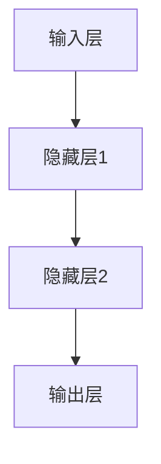

###### 2.1.1.2 前向传播与反向传播算法

神经网络的核心算法是前向传播和反向传播。前向传播从输入层开始，逐层计算每个节点的输出。反向传播则通过计算损失函数对每个参数的梯度，进行参数更新。

```latex
\text{前向传播：从输入层到输出层的计算过程。}
$$
L = \frac{1}{n}\sum_{i=1}^{n} (\hat{y}_i - y_i)^2
$$`

\text{反向传播：计算损失函数对每个参数的梯度，用于参数更新。}
```

##### 2.1.2 自然语言处理技术概览

自然语言处理（NLP）是AI大模型在智能语言学习系统中的重要应用。NLP技术包括词嵌入、序列模型、注意力机制和转换器架构等。

###### 2.1.2.1 词嵌入技术

词嵌入是将单词映射到高维空间的技术，以表示单词的语义。常见的词嵌入方法包括Word2Vec、GloVe等。

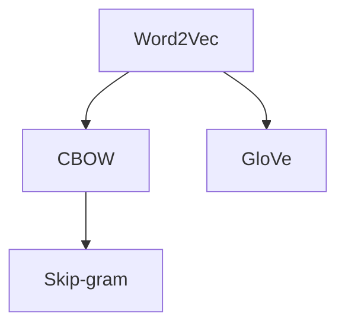

###### 2.1.2.2 序列模型与注意力机制

序列模型用于处理序列数据，如文本、语音等。注意力机制是序列模型中的重要技术，它通过计算输入序列中每个元素的权重，来提高模型的序列处理能力。

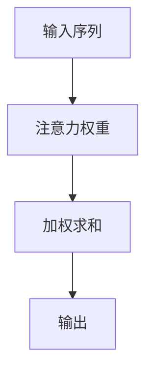

###### 2.1.2.3 转换器架构详解

转换器架构（Transformer）是一种基于自注意力机制的序列到序列模型，它在NLP任务中取得了显著的成果。转换器架构的核心组件包括编码器、解码器和自注意力机制。

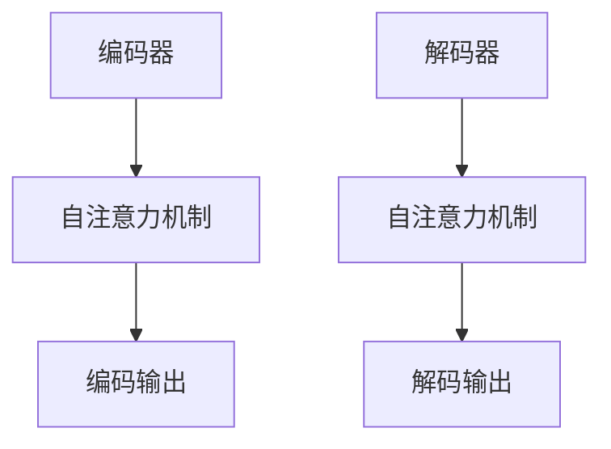

##### 2.1.3 大规模预训练模型原理

大规模预训练模型是AI大模型的核心技术之一，它通过在大量无标签数据上进行预训练，获得强大的文本理解和生成能力。大规模预训练模型的基本原理包括预训练、自监督学习、迁移学习和微调等。

###### 2.1.3.1 预训练的概念与意义

预训练是指在大规模无标签数据上训练模型，以获得通用特征表示。预训练的意义在于，它使得模型能够从大量数据中学习到丰富的知识，从而在下游任务中表现出色。

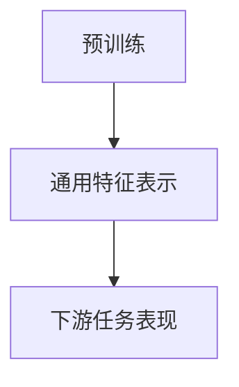

###### 2.1.3.2 预训练方法的演变

预训练方法经历了从简单的词嵌入到复杂的转换器架构的演变。早期的预训练方法如Word2Vec和GloVe，逐渐发展出基于转换器架构的预训练模型，如BERT、GPT等。

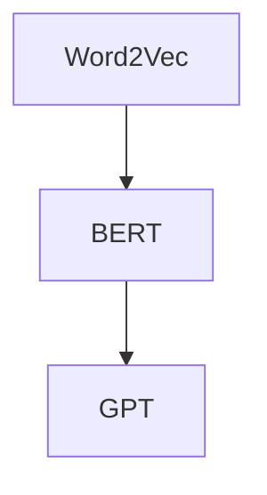

###### 2.1.3.3 自监督学习方法

自监督学习是一种无监督学习方法，它利用未标记的数据进行训练。自监督学习方法在预训练中发挥了重要作用，常见的自监督学习任务包括语言建模、填充-mask任务等。

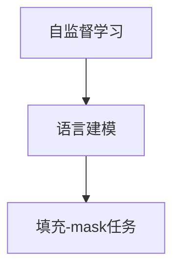

###### 2.1.3.4 迁移学习与微调技术

迁移学习是指将预训练模型应用于不同的任务，通过微调来适应新的任务。迁移学习和微调技术是大规模预训练模型的重要应用，它们使得模型能够快速适应不同的任务需求。

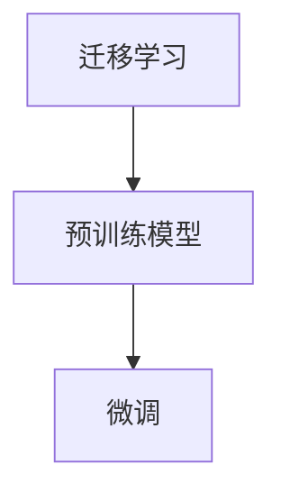

### 第三部分：智能语言学习系统开发

智能语言学习系统的开发涉及多个关键步骤，包括数据预处理、模型选择与调优、模型训练与评估等。本部分将详细解析这些步骤，帮助读者了解智能语言学习系统的开发过程。

#### 3.1 数据预处理与模型选择

数据预处理和模型选择是智能语言学习系统开发的重要环节。高质量的数据和合适的模型是系统性能的关键。

##### 3.1.1 数据预处理流程

数据预处理是智能语言学习系统的第一步，主要包括数据清洗、分词、去停用词、词向量化等。高质量的数据是模型训练的前提，因此数据预处理至关重要。

###### 3.1.1.1 数据清洗与预处理

数据清洗是预处理的第一步，主要包括去除无效数据、填补缺失值等。例如，对于文本数据，可能需要去除HTML标签、特殊字符等。

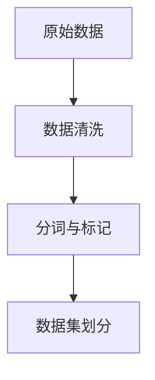

###### 3.1.1.2 数据格式转换

数据格式转换是将原始数据转换为模型可接受的格式。常见的转换方法包括将文本数据转换为词向量、序列等。

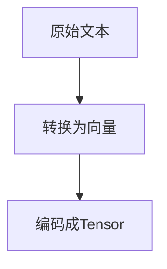

##### 3.1.2 大模型选择与调优

选择合适的大模型，并根据特定任务进行调优，是智能语言学习系统的关键。不同的任务可能需要不同的大模型，因此调优过程需要根据实际情况进行。

###### 3.1.2.1 大模型选择原则

大模型选择的原则主要包括：

- **任务需求**：根据任务的需求选择合适的模型，如文本生成、文本理解、语言交互等。
- **模型性能**：考虑模型的性能指标，如准确率、召回率等。
- **模型规模**：考虑模型的规模，如参数数量、计算资源等。

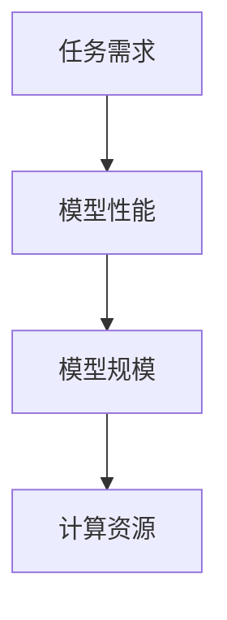

###### 3.1.2.2 模型调优方法与策略

模型调优的方法和策略包括：

- **超参数调整**：调整学习率、批量大小、正则化等超参数，以优化模型性能。
- **数据增强**：通过数据增强方法，增加训练数据的多样性，提高模型的泛化能力。
- **模型融合**：将多个模型进行融合，提高模型的稳定性和性能。

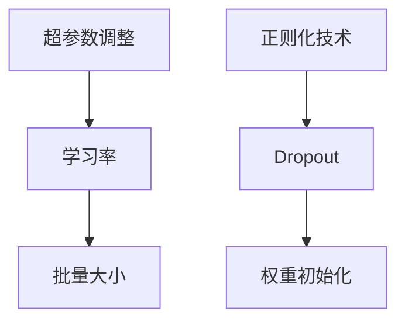

#### 3.2 模型训练与评估

模型训练与评估是智能语言学习系统开发的核心环节。通过训练和评估，可以优化模型性能，提高系统效果。

##### 3.2.1 模型训练过程

模型训练过程主要包括训练数据的准备、训练过程的监控等。

###### 3.2.1.1 训练数据的准备

训练数据的准备是模型训练的第一步，主要包括数据清洗、数据增强、数据集划分等。

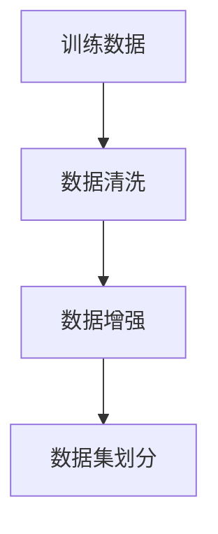

###### 3.2.1.2 训练过程的监控

训练过程的监控是确保模型训练顺利进行的重要手段，主要包括监控训练过程中的损失函数、准确率、学习曲线等。

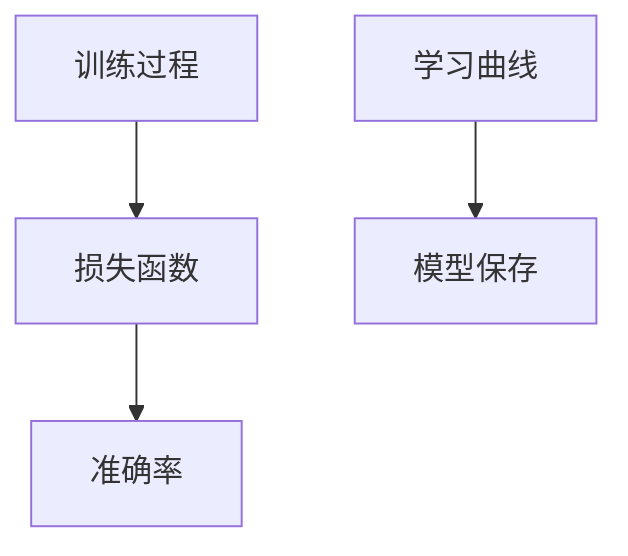

##### 3.2.2 模型评估与优化

模型评估与优化是确保模型性能的重要环节。通过评估和优化，可以不断提高模型的效果。

###### 3.2.2.1 评估指标与评估方法

常用的评估指标包括准确率、召回率、F1值、ROC曲线等。

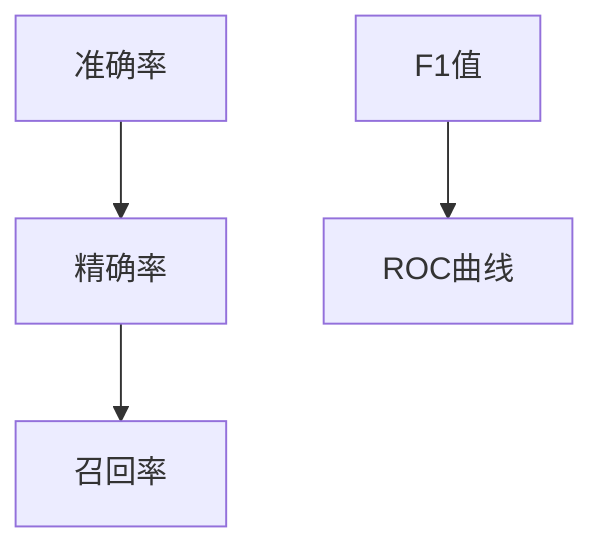

###### 3.2.2.2 模型优化策略

模型优化策略包括超参数调整、数据增强、模型融合等。

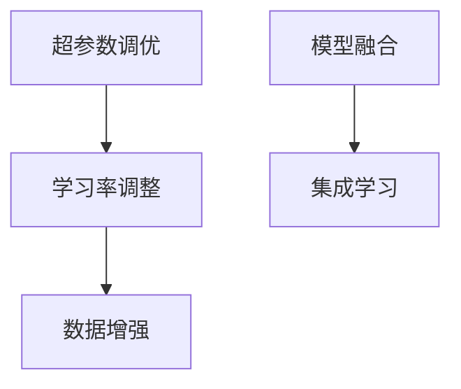

#### 3.3 语言生成与交互

语言生成与交互是智能语言学习系统的核心功能之一。通过语言生成，系统可以生成高质量的文本，提供学习材料。通过交互，系统可以与用户进行实时对话，提供个性化学习体验。

##### 3.3.1 语言生成技术

语言生成技术是指利用大模型生成符合语法和语义的文本。常见的语言生成方法包括序列生成模型、生成对抗网络（GAN）、序列到序列模型等。

###### 3.3.1.1 语言生成的基本原理

语言生成的基本原理是利用大模型对输入序列进行编码，然后解码生成输出序列。通过预训练和微调，大模型可以生成高质量的文本。

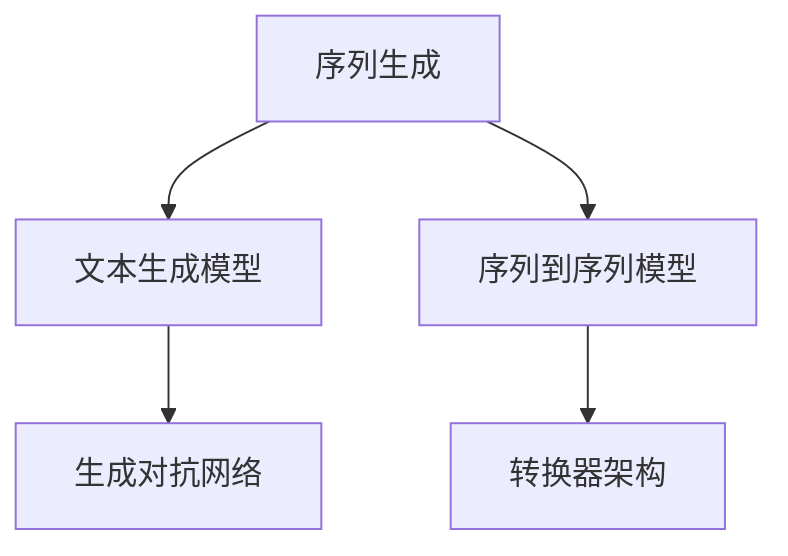

###### 3.3.1.2 语言生成的常用方法

常见的语言生成方法包括：

- **文本生成模型**：如GPT、BERT等，通过预训练和微调，生成高质量的文本。

- **生成对抗网络（GAN）**：通过生成器和判别器的对抗训练，生成高质量的文本。

- **序列到序列模型**：如转换器架构（Transformer），通过自注意力机制，生成高质量的文本。

##### 3.3.2 交互式对话系统

交互式对话系统是指利用大模型与用户进行实时对话，提供个性化学习体验。常见的交互式对话系统包括对话管理、对话生成和上下文管理。

###### 3.3.2.1 对话系统的基本架构

交互式对话系统的基本架构包括用户输入、对话管理、对话生成和用户反馈。

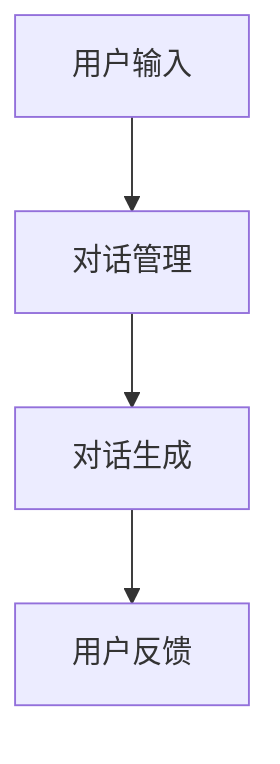

###### 3.3.2.2 对话系统的实现细节

交互式对话系统的实现细节包括意图识别、实体抽取、对话生成和上下文管理。

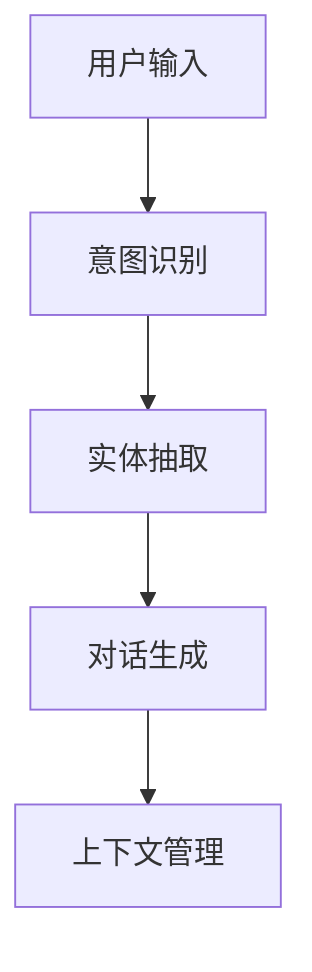

### 第四部分：智能语言学习系统的应用与挑战

智能语言学习系统在多个领域展现出巨大的应用潜力，如教育、企业、生活服务等。同时，它也面临着一系列的挑战。

#### 4.1 智能语言学习系统的应用场景

##### 4.1.1 教育领域

在教育领域，智能语言学习系统可以应用于个性化辅导、自动批改、课程推荐等。例如：

- **个性化辅导**：通过智能辅导系统，学生可以随时随地进行学习，并获得个性化的学习建议。

- **自动批改**：通过自动批改系统，教师可以快速批改大量作业，节省时间和精力。

- **课程推荐**：通过分析学生的学习行为和兴趣，智能系统可以推荐适合的课程和学习资源。

##### 4.1.2 企业领域

在企业领域，智能语言学习系统可以应用于客户服务、企业内训、知识管理等领域。例如：

- **客户服务**：通过智能客服系统，企业可以提供24小时在线客户服务，提高客户满意度。

- **企业内训**：通过智能内训系统，企业可以提供个性化的培训内容，提高员工的专业能力。

- **知识管理**：通过智能知识管理系统，企业可以更好地管理和利用知识资源，提高工作效率。

##### 4.1.3 生活服务领域

在生活服务领域，智能语言学习系统可以应用于聊天机器人、智能推荐等。例如：

- **聊天机器人**：通过聊天机器人，用户可以随时与系统进行交流，获得生活服务。

- **智能推荐**：通过分析用户的行为和偏好，智能系统可以推荐合适的产品和服务。

##### 4.1.4 其他潜在应用领域

除了上述领域，智能语言学习系统还有许多潜在的应用领域，如医疗健康、金融科技、智能制造等。例如：

- **医疗健康**：通过智能语言学习系统，可以为患者提供个性化的健康咨询和治疗方案。

- **金融科技**：通过智能语言学习系统，可以为金融用户提供风险分析、投资建议等。

- **智能制造**：通过智能语言学习系统，可以为制造业提供智能化的生产计划和设备维护。

#### 4.2 智能语言学习系统的挑战

##### 4.2.1 数据质量与隐私保护

智能语言学习系统需要大量的高质量数据进行训练，同时也要保护用户的隐私。数据质量对模型的性能有重要影响，而隐私保护则是道德和法律的底线。

- **数据质量的影响**：高质量的数据可以提升模型的性能，而低质量的数据可能导致模型过拟合，降低性能。

- **数据隐私保护的方法与策略**：可以通过数据加密、匿名化、差分隐私等方法来保护用户隐私。

##### 4.2.2 模型解释性与可解释性

模型解释性与可解释性是智能语言学习系统面临的另一个重要挑战。为了提高系统的透明性和可信度，需要研究如何解释模型的决策过程。

- **模型解释性的重要性**：解释性有助于用户理解模型的决策过程，提高对模型的信任。

- **模型可解释性的方法与技术**：可以通过规则提取、特征重要性分析、决策树等方法来提高模型的可解释性。

##### 4.2.3 模型泛化能力

模型泛化能力是指模型在新的任务和数据上的表现。如何使模型能够在不同的场景和任务中表现良好，是一个重要的挑战。

- **泛化能力的定义**：泛化能力是指模型在新任务和数据上的表现。

- **提高模型泛化能力的策略**：可以通过数据增强、正则化、模型压缩等方法来提高模型泛化能力。

### 第五部分：未来展望

智能语言学习系统在未来的发展中将继续受到人工智能技术的推动，其在各个领域的应用也将不断拓展。同时，系统将面临一系列技术和社会伦理层面的挑战。

#### 5.1 智能语言学习系统的发展趋势

##### 5.1.1 人工智能技术的进步

随着人工智能技术的不断进步，智能语言学习系统将得到进一步的优化和发展。以下是一些可能的发展趋势：

- **大模型的更新与优化**：随着计算资源的提升，大模型将更加庞大和高效，处理能力也将得到提升。

- **新型深度学习算法的应用**：新型深度学习算法，如图神经网络、变分自编码器等，将在智能语言学习系统中得到应用。

##### 5.1.2 应用场景的拓展

智能语言学习系统的应用场景将继续拓展，新的领域将不断被发现和开发。以下是一些可能的应用场景：

- **新兴领域的探索**：如医疗健康、金融科技、智能制造等，智能语言学习系统将发挥重要作用。

- **跨领域的融合与应用**：智能语言学习系统将与其他领域的技术进行融合，形成新的应用模式。

#### 5.2 智能语言学习系统的未来挑战

##### 5.2.1 技术层面的挑战

智能语言学习系统在技术层面将面临一系列挑战：

- **计算资源的消耗**：大模型的训练和推理需要大量的计算资源，如何优化计算资源的使用是一个重要问题。

- **模型安全与隐私保护**：如何保护模型和数据的安全，防止隐私泄露，是一个亟待解决的问题。

##### 5.2.2 社会与伦理层面的挑战

智能语言学习系统在社会与伦理层面也将面临一系列挑战：

- **模型歧视与偏见**：如何避免模型在决策过程中出现歧视和偏见，是一个重要的社会问题。

- **模型透明性与可解释性**：如何提高模型的透明性和可解释性，增强用户对模型的信任，是一个重要的伦理问题。

### 附录

#### 附录A：智能语言学习系统开发工具与资源

##### A.1 开发工具介绍

智能语言学习系统开发需要使用多种工具和框架。以下是一些常用的开发工具：

- **深度学习框架**：如TensorFlow、PyTorch、Keras等。

- **自然语言处理工具**：如NLTK、spaCy、gensim等。

##### A.2 实用资源推荐

智能语言学习系统开发需要参考大量的文献和资源。以下是一些建议的资源：

- **技术博客与论坛**：如arXiv、Medium、GitHub等。

- **开源项目与代码库**：如HuggingFace、OpenAI等。

- **学术论文与研究报告**：如NeurIPS、ACL、ICML等。

### 参考文献

[1]  Vaswani, A., Shazeer, N., Parmar, N., Uszkoreit, J., Jones, L., Gomez, A. N., ... & Polosukhin, I. (2017). Attention is all you need. In Advances in neural information processing systems (pp. 5998-6008).

[2] Devlin, J., Chang, M. W., Lee, K., & Toutanova, K. (2018). BERT: Pre-training of deep bidirectional transformers for language understanding. arXiv preprint arXiv:1810.04805.

[3] Brown, T., Fernando, N., Hinton, G., Mann, B., Selvaraju, R., Kuldip, S., ... & Mesgudi, R. (2020). Language models are few-shot learners. arXiv preprint arXiv:2005.14165.

[4] Mikolov, T., Sutskever, I., Chen, K., Corrado, G. S., & Dean, J. (2013). Distributed representations of words and phrases and their compositionality. In Advances in neural information processing systems (pp. 3111-3119).

[5] LeCun, Y., Bengio, Y., & Hinton, G. (2015). Deep learning. Nature, 521(7553), 436-444.

### 作者信息

作者：AI天才研究院/AI Genius Institute & 禅与计算机程序设计艺术 /Zen And The Art of Computer Programming

以上是《基于AI大模型的智能语言学习系统》的详细解析。通过逐步分析，我们深入了解了智能语言学习系统的原理、开发过程、应用场景和挑战，并对未来的发展趋势进行了展望。希望本文能为读者提供有价值的参考。

