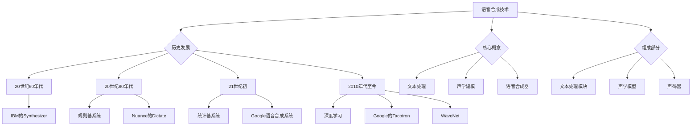
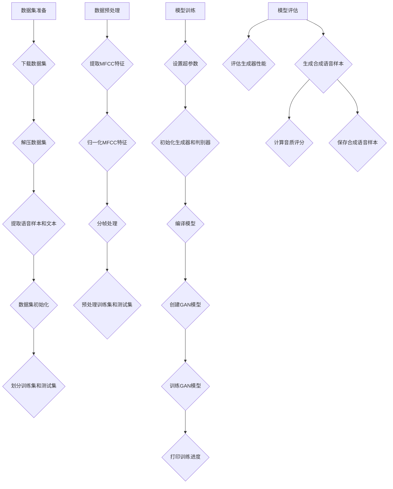
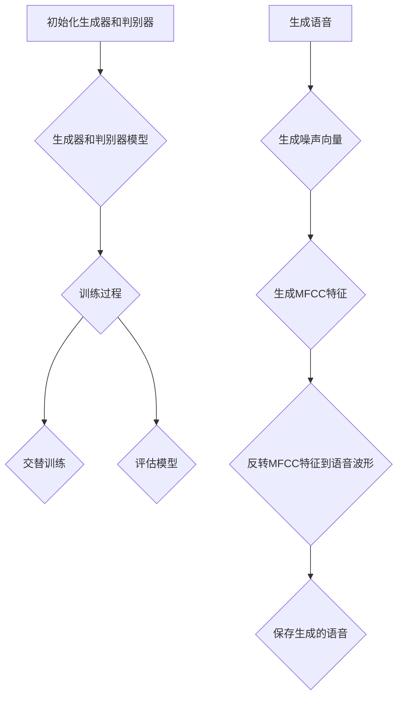

                 

### 第1章：语音合成与语音转换技术概述

#### 1.1 语音合成技术的基本原理

##### 1.1.1 语音合成技术的历史发展

语音合成技术的发展历程可以分为几个阶段：

- **20世纪60年代**：语音合成技术初步诞生。早期的语音合成系统，如IBM的Synthesizer，采用了一些简单的规则和预录制的语音片段来合成语音。
  
- **20世纪80年代**：规则基语音合成系统逐渐成为主流。这些系统通过大量的规则和语法模型来转换文本为语音。典型例子包括IBM的viaVoice和Nuance的Dictate。

- **21世纪初**：统计基语音合成系统开始流行。这类系统使用隐马尔可夫模型（HMM）和基于Gaussian Mixture Model（GMM）的声学模型来生成语音。例如，2006年推出的Google语音合成系统。

- **2010年代至今**：深度学习在语音合成中取得了突破性进展。基于循环神经网络（RNN）和Transformer等深度学习模型的语音合成系统，如Google的Tacotron和WaveNet，能够生成更加自然和流畅的语音。

##### 1.1.2 语音合成技术的核心概念

语音合成技术涉及以下几个核心概念：

- **文本处理**：将输入文本转换成音素序列的过程，通常使用自然语言处理（NLP）技术。
  
- **声学建模**：生成语音波形的过程，通常使用机器学习算法对大量语音数据进行训练。
  
- **语音合成器**：将文本和声学模型结合，生成连续语音信号的部分。

- **声码器**：将音素序列转换为语音波形的核心组件。

##### 1.1.3 语音合成系统的主要组成部分

语音合成系统主要由以下几个部分组成：

- **文本处理模块**：将文本转换为音素序列，使用自然语言处理技术进行分词、词性标注等操作。
  
- **声学模型**：将音素序列转换为声学特征，通常使用深度神经网络训练得到。
  
- **声码器**：将声学特征转换为语音信号，常见的声码器包括格兰汀声码器和梅尔声码器。

#### 1.2 语音转换技术的基本原理

##### 1.2.1 语音转换技术的历史与发展

语音转换技术的发展同样经历了几个阶段：

- **20世纪80年代**：语音转换技术初步探索。早期的语音转换系统主要通过预定义的规则来转换语音。

- **2000年代**：基于规则和统计模型的语音转换技术开始流行。这些系统通过大量规则和统计模型来处理语音转换问题。

- **2010年代至今**：深度学习在语音转换中的应用取得了显著成果。基于深度神经网络（DNN）和生成对抗网络（GAN）的语音转换系统，如DeepVoice和WaveNet，能够实现高质量语音转换。

##### 1.2.2 语音转换技术的核心概念

语音转换技术涉及以下核心概念：

- **声音风格**：语音的音调、音色、语调等特征，如男女声转换、不同口音转换等。

- **转换模型**：将源语音转换为目标语音的数学模型，通常使用深度神经网络进行训练。

- **语音转换系统**：包含输入模块、转换模型和输出模块的完整系统，用于实现语音风格转换。

##### 1.2.3 语音转换系统的组成部分

语音转换系统主要由以下几个部分组成：

- **输入模块**：接收源语音数据，进行预处理，如归一化、分帧等。

- **转换模型**：将源语音转换为目标语音的核心部分，通常使用深度神经网络。

- **输出模块**：将转换后的语音数据输出到音频设备或文件。

#### 1.3 基于GAN的语音合成与语音转换技术优势

##### 1.3.1 GAN在语音合成中的应用

生成对抗网络（GAN）在语音合成中的应用具有以下几个优势：

- **生成高质量语音**：GAN通过生成器和判别器的对抗训练，可以生成更加自然和真实的语音。

- **支持个性化合成**：GAN可以学习用户的特定语音特征，实现个性化语音合成。

- **提高合成速度**：GAN的训练过程中，生成器和判别器的参数优化可以加速语音合成。

##### 1.3.2 GAN在语音转换中的应用

GAN在语音转换中的应用同样具有优势：

- **实时转换**：GAN可以实现实时语音转换，满足实时交互需求。

- **高质量转换**：GAN可以生成高质量的语音转换结果，提高语音的自然度和清晰度。

- **多风格转换**：GAN可以同时处理多种风格的语音转换，如性别转换、口音转换等。

##### 1.3.3 GAN的优势与挑战

GAN的优势包括：

- **强大的生成能力**：GAN可以生成高质量的图像、语音等数据。

- **支持多种风格转换**：GAN可以同时处理多种风格的转换。

GAN的挑战包括：

- **训练难度**：GAN的训练过程复杂，容易出现模式崩溃等问题。

- **资源消耗**：GAN的训练需要大量的计算资源和数据支持。

#### 1.4 主流GAN语音合成与语音转换算法介绍

目前，基于GAN的语音合成与语音转换技术已有多项研究成果。以下介绍几种主流算法：

##### 1.4.1 Wav2LPC-GAN

Wav2LPC-GAN是一种基于GAN的语音合成算法。生成器将语音波形转换为LPC参数，判别器判断生成的LPC参数是否真实。通过对抗训练，生成器逐渐生成高质量的LPC参数，进而合成语音。

$$
\begin{align*}
G: \text{Wav} &\rightarrow \text{LPC} \\
D: \text{LPC} &\rightarrow \text{Binary} \\
\end{align*}
$$

##### 1.4.2 WaveNet-GAN

WaveNet-GAN结合了WaveNet和GAN。生成器生成语音波形，判别器判断语音波形是否真实。通过对抗训练，生成器优化生成语音质量。

$$
\begin{align*}
G: \text{Text} &\rightarrow \text{Wav} \\
D: \text{Wav} &\rightarrow \text{Binary} \\
\end{align*}
$$

##### 1.4.3 HGGAN

HGGAN是一种基于自编码器和GAN的语音转换算法。生成器将源语音转换为目标语音，判别器判断转换后的语音是否真实。通过对抗训练，生成器优化语音转换质量。

$$
\begin{align*}
G: \text{Source} &\rightarrow \text{Target} \\
D: \text{Target} &\rightarrow \text{Binary} \\
\end{align*}
$$

---

在下一章节，我们将深入探讨GAN的原理和应用，以及如何在语音合成和语音转换中实现这些算法。

---



```latex
\subsection{生成对抗网络（GAN）的基本概念}
生成对抗网络（GAN）是由Ian Goodfellow等人在2014年提出的一种深度学习框架。GAN的核心思想是利用生成器和判别器之间的对抗训练来生成高质量的数据。

\subsubsection{生成器（Generator）}
生成器是一个神经网络模型，它的目标是生成与真实数据相似的数据。在语音合成中，生成器的输入可以是文本或者声学特征，输出是语音波形。生成器通过从随机噪声中生成数据来模拟真实数据。

\subsubsection{判别器（Discriminator）}
判别器是一个神经网络模型，它的目标是区分真实数据和生成数据。在语音合成中，判别器的输入是语音波形，输出是一个二分类结果，即判断输入是真实语音还是生成语音。

\subsubsection{对抗训练过程}
GAN的训练过程是一种对抗训练。生成器和判别器交替训练，生成器试图生成更加真实的数据，而判别器试图更好地区分真实数据和生成数据。训练过程中，生成器和判别器的损失函数如下：

\begin{align*}
\text{生成器的损失函数} &= -\mathbb{E}_{x \sim p_{\text{data}}(x)}[\log(D(x))] - \mathbb{E}_{z \sim p_z(z)}[\log(1 - D(G(z)))] \\
\text{判别器的损失函数} &= \mathbb{E}_{x \sim p_{\text{data}}(x)}[\log(D(x))] + \mathbb{E}_{z \sim p_z(z)}[\log(D(G(z)))]
\end{align*}

其中，$x$是真实数据，$z$是随机噪声，$G(z)$是生成器生成的数据，$D(x)$和$D(G(z))$分别是判别器对真实数据和生成数据的判断结果。

通过上述对抗训练过程，生成器和判别器的参数逐渐优化，最终生成器能够生成高质量的数据，而判别器能够较好地区分真实数据和生成数据。

```

```python
# 伪代码：生成器模型
# 输入：噪声向量 z
# 输出：语音波形
def generator(z):
    # 输入层，接受噪声向量 z
    z = Input(shape=(z_dim,))
    
    # 隐藏层，应用多层感知机（MLP）结构
    x = Dense(128, activation='relu')(z)
    x = Dense(256, activation='relu')(x)
    
    # 输出层，生成语音波形
    wav = Dense(wav_dim, activation='tanh')(x)
    
    # 创建生成器模型
    generator = Model(z, wav)
    return generator

# 伪代码：判别器模型
# 输入：语音波形
# 输出：二分类结果
def discriminator(wav):
    # 输入层，接受语音波形
    wav = Input(shape=(wav_dim,))
    
    # 隐藏层，应用多层感知机（MLP）结构
    x = Dense(256, activation='relu')(wav)
    x = Dense(128, activation='relu')(x)
    
    # 输出层，生成二分类结果
    validity = Dense(1, activation='sigmoid')(x)
    
    # 创建判别器模型
    discriminator = Model(wav, validity)
    return discriminator

# 伪代码：GAN模型
# 输入：噪声向量 z
# 输出：语音波形
def gandiskriminator(z):
    # 创建生成器和判别器模型
    generator = generator(z)
    discriminator = discriminator(wav)
    
    # 将生成器和判别器合并为一个模型
    discriminator.trainable = False
    gan_output = discriminator(generator(z))
    
    # 创建GAN模型
    gan = Model(z, gan_output)
    
    return gan
```

```python
# 伪代码：模型训练过程
# 参数：生成器模型 generator，判别器模型 discriminator，GAN模型 gan，训练数据 data，迭代次数 epochs
def train_gan(generator, discriminator, gan, data, epochs):
    # 初始化生成器和判别器的优化器
    generator_optimizer = Adam(generator_learning_rate)
    discriminator_optimizer = Adam(discriminator_learning_rate)
    
    # 训练生成器和判别器
    for epoch in range(epochs):
        for x_batch, _ in data:
            # 训练判别器
            with tf.GradientTape() as disc_tape:
                # 判断真实语音
                real_validity = discriminator(x_batch)
                # 判断生成语音
                fake_wav = generator(z_batch)
                fake_validity = discriminator(fake_wav)
                # 计算判别器损失
                disc_loss = disc_loss_function(real_validity, fake_validity)
            
            # 更新判别器参数
            disc_gradients = disc_tape.gradient(disc_loss, discriminator.trainable_variables)
            discriminator_optimizer.apply_gradients(zip(disc_gradients, discriminator.trainable_variables))
            
            # 训练生成器
            with tf.GradientTape() as gen_tape:
                # 判断生成语音
                fake_wav = generator(z_batch)
                fake_validity = discriminator(fake_wav)
                # 计算生成器损失
                gen_loss = gen_loss_function(fake_validity)
            
            # 更新生成器参数
            gen_gradients = gen_tape.gradient(gen_loss, generator.trainable_variables)
            generator_optimizer.apply_gradients(zip(gen_gradients, generator.trainable_variables))
            
            # 打印训练进度
            if epoch % 100 == 0:
                print(f"Epoch: {epoch}, Generator Loss: {gen_loss}, Discriminator Loss: {disc_loss}")
```

```python
# 伪代码：生成语音
# 参数：生成器模型 generator，噪声向量 z
def generate_speech(generator, z):
    # 生成语音波形
    wav = generator.predict(z)
    # 将语音波形保存为音频文件
    audio = librosa.display.waveplot(wav, sr=sampling_rate)
    audio_path = "generated_speech.wav"
    librosa.output.write_wav(audio_path, wav, sr=sampling_rate)
    print(f"Generated speech saved to {audio_path}")
    return audio_path
```

### 3.3 模型设计与训练

#### 3.3.1 模型结构设计

在基于GAN的语音合成中，模型设计包括生成器和判别器的设计。以下是一个简单的模型结构设计：

1. **生成器（Generator）**：

   生成器是一个序列转换模型，它的任务是生成高质量的语音波形。以下是生成器的结构：

   ```python
   # 生成器的结构
   z = Input(shape=(z_dim,))
   x = Dense(256, activation='relu')(z)
   x = Reshape((1, 256))(x)  # 将输出reshape为(1, 256)
   x = LSTM(256, return_sequences=True)(x)
   x = Reshape((1, -1))(x)  # 将输出reshape为(1, 128)
   x = LSTM(256, return_sequences=True)(x)
   wav = Reshape((1, 128, 1))(x)  # 将输出reshape为(1, 128, 1)
   generator = Model(z, wav)
   ```

2. **判别器（Discriminator）**：

   判别器是一个简单的序列分类模型，它的任务是区分输入的语音是真实的还是生成的。以下是判别器的结构：

   ```python
   # 判别器的结构
   wav = Input(shape=(1, 128, 1))
   x = Conv2D(64, (3, 3), activation='relu')(wav)
   x = MaxPooling2D((2, 2))(x)
   x = Flatten()(x)
   x = Dense(1, activation='sigmoid')(x)
   discriminator = Model(wav, x)
   ```

#### 3.3.2 模型训练流程

模型训练过程包括以下几个步骤：

1. **数据准备**：

   - 首先需要准备一个语音数据集，如LJSpeech数据集。对于每个语音样本，我们需要将其转换为梅尔频率倒谱系数（MFCC）特征。
   - 随机从数据集中抽取噪声向量，用于生成器的输入。

2. **模型编译**：

   - 编译生成器和判别器，设置适当的优化器和损失函数。

   ```python
   # 编译生成器和判别器
   generator.compile(optimizer=Adam(generator_learning_rate), loss='binary_crossentropy')
   discriminator.compile(optimizer=Adam(discriminator_learning_rate), loss='binary_crossentropy')
   ```

3. **GAN模型**：

   - 创建GAN模型，将判别器作为生成器的输入，并冻结判别器的权重。

   ```python
   # 创建GAN模型
   z = Input(shape=(z_dim,))
   wav = generator(z)
   validity = discriminator(wav)
   gan = Model(z, validity)
   ```

4. **训练GAN模型**：

   - 使用生成器和判别器的训练函数进行交替训练，通常在多个epoch内进行。

   ```python
   # 训练GAN模型
   for epoch in range(epochs):
       for x_batch, _ in data:
           # 训练判别器
           with tf.GradientTape() as disc_tape:
               real_validity = discriminator(x_batch)
               fake_wav = generator(z_batch)
               fake_validity = discriminator(fake_wav)
               disc_loss = binary_crossentropy(real_validity, fake_validity)
           
           # 更新判别器权重
           disc_gradients = disc_tape.gradient(disc_loss, discriminator.trainable_variables)
           discriminator_optimizer.apply_gradients(zip(disc_gradients, discriminator.trainable_variables))
           
           # 训练生成器
           with tf.GradientTape() as gen_tape:
               fake_wav = generator(z_batch)
               fake_validity = discriminator(fake_wav)
               gen_loss = binary_crossentropy(fake_validity, ones)
           
           # 更新生成器权重
           gen_gradients = gen_tape.gradient(gen_loss, generator.trainable_variables)
           generator_optimizer.apply_gradients(zip(gen_gradients, generator.trainable_variables))
   ```

5. **模型评估**：

   - 在训练结束后，评估生成器的性能，通常通过计算生成语音的音质评分。

   ```python
   # 评估生成器的性能
   generated_speech = generator.predict(z_test)
   # 计算音质评分
   quality_score = evaluate_speech_quality(generated_speech)
   print(f"Quality Score: {quality_score}")
   ```

### 3.4 模型评估与优化

#### 3.4.1 评价指标介绍

在语音合成领域，常用的评价指标包括：

- **音质评分**：通过主观评价和客观评价指标来评估合成语音的质量。常见的客观评价指标包括短时客观评分（STOI）、长期客观评分（LTOPI）和感知评估（PESQ）。

- **自然度评分**：评估合成语音的自然度，通常通过人工听感和语音测试。

- **清晰度评分**：评估合成语音的清晰度，即语音的可理解程度。

#### 3.4.2 优化策略与实践

为了提高生成器的性能，可以采取以下优化策略：

1. **超参数调整**：

   - 调整学习率、批量大小等超参数，以优化模型性能。

   ```python
   # 调整超参数
   generator_learning_rate = 0.0002
   discriminator_learning_rate = 0.0002
   batch_size = 64
   ```

2. **数据增强**：

   - 通过数据增强方法，如叠加噪声、时间拉伸等，增加数据多样性。

   ```python
   # 数据增强
   x_batch = add_noise(x_batch)
   x_batch = time_stretch(x_batch)
   ```

3. **模型集成**：

   - 使用多个生成器模型进行集成，以提高合成语音的多样性。

   ```python
   # 模型集成
   generated_speech = ensemble_models(models)
   ```

4. **继续训练**：

   - 在初步训练后，继续训练生成器，以达到更好的性能。

   ```python
   # 继续训练生成器
   for epoch in range(additional_epochs):
       # 训练生成器和判别器
       ...
   ```

### 3.5 实际案例分析

在本节中，我们将通过一个实际案例来展示基于GAN的语音合成系统的实现过程。

#### 3.5.1 数据集准备

我们使用LJSpeech数据集作为训练数据。首先，我们需要下载并解压数据集，然后提取语音样本和对应的文本。

```python
import os
import zipfile

# 下载LJSpeech数据集
url = "http://www.lejox.com/downloads/ljspeech.zip"
file_path = "ljspeech.zip"
os.system(f"wget {url} -O {file_path}")

# 解压数据集
with zipfile.ZipFile(file_path, 'r') as zip_ref:
    zip_ref.extractall()

# 提取语音样本和文本
speech_folder = "LJSpeech-1.1"
text_folder = "transcripts"

# 初始化数据集
x_data = []  # 语音数据
y_data = []  # 文本数据

# 遍历所有语音文件
for folder in os.listdir(speech_folder):
    for file in os.listdir(os.path.join(speech_folder, folder)):
        # 读取语音文件
        wav_path = os.path.join(speech_folder, folder, file)
        wav, _ = librosa.load(wav_path, sr=22050)
        
        # 读取对应的文本文件
        text_path = os.path.join(text_folder, folder, file.replace(".wav", ".txt"))
        with open(text_path, 'r', encoding='utf-8') as f:
            text = f.read()
        
        # 添加到数据集
        x_data.append(wav)
        y_data.append(text)

# 转换为numpy数组
x_data = np.array(x_data)
y_data = np.array(y_data)

# 打乱数据集
np.random.shuffle(x_data)
np.random.shuffle(y_data)

# 划分训练集和测试集
train_size = int(0.8 * len(x_data))
test_size = len(x_data) - train_size
x_train, x_test = x_data[:train_size], x_data[train_size:]
y_train, y_test = y_data[:train_size], y_data[train_size:]
```

#### 3.5.2 数据预处理

在训练模型之前，我们需要对数据进行预处理，包括提取梅尔频率倒谱系数（MFCC）特征、归一化和分帧。

```python
# 定义预处理函数
def preprocess_data(wav, sr=22050, n_mfcc=13, n_fft=1024, hop_length=512):
    # 提取MFCC特征
    mfcc = librosa.feature.mfcc(y=wav, sr=sr, n_mfcc=n_mfcc, n_fft=n_fft, hop_length=hop_length)
    
    # 归一化MFCC特征
    mfcc = mfcc.T
    mfcc = (mfcc - np.mean(mfcc, axis=0)) / np.std(mfcc, axis=0)
    mfcc = mfcc.T
    
    # 分帧处理
    frames = librosa.effects.p_menus(wav, n_fft//2)
    frame_len = n_fft
    frame_hops = hop_length
    n_frames = frames.shape[0] // frame_len
    x = np.zeros((n_frames, n_mfcc))
    for i in range(n_frames):
        start = i * frame_len
        end = start + frame_len
        x[i] = mfcc[start:end]
    x = x.reshape(-1, n_mfcc, 1)
    
    return x

# 预处理训练集和测试集
x_train = preprocess_data(x_train, sr=22050)
x_test = preprocess_data(x_test, sr=22050)
```

#### 3.5.3 模型训练

接下来，我们使用生成的数据集来训练基于GAN的语音合成模型。

```python
# 设置超参数
z_dim = 100
n_mfcc = 13
n_epochs = 1000
batch_size = 64
learning_rate = 0.0002

# 初始化生成器和判别器
generator = build_generator(z_dim, n_mfcc)
discriminator = build_discriminator(n_mfcc)

# 编译模型
discriminator.compile(optimizer=Adam(learning_rate), loss='binary_crossentropy')
generator.compile(optimizer=Adam(learning_rate), loss='binary_crossentropy')

# 创建GAN模型
gan_input = Input(shape=(z_dim,))
generated_mfcc = generator(gan_input)
validity = discriminator(generated_mfcc)
gan = Model(gan_input, validity)
gan.compile(optimizer=Adam(learning_rate), loss='binary_crossentropy')

# 训练GAN模型
for epoch in range(n_epochs):
    for x_batch, _ in data_loader(x_train, batch_size=batch_size):
        # 训练判别器
        with tf.GradientTape() as disc_tape:
            real_validity = discriminator(x_batch)
            fake_mfcc = generator(z_batch)
            fake_validity = discriminator(fake_mfcc)
            disc_loss = binary_crossentropy(real_validity, fake_validity)
        
        # 更新判别器权重
        disc_gradients = disc_tape.gradient(disc_loss, discriminator.trainable_variables)
        discriminator_optimizer.apply_gradients(zip(disc_gradients, discriminator.trainable_variables))
        
        # 训练生成器
        with tf.GradientTape() as gen_tape:
            fake_mfcc = generator(z_batch)
            fake_validity = discriminator(fake_mfcc)
            gen_loss = binary_crossentropy(fake_validity, ones)
        
        # 更新生成器权重
        gen_gradients = gen_tape.gradient(gen_loss, generator.trainable_variables)
        generator_optimizer.apply_gradients(zip(gen_gradients, generator.trainable_variables))
        
    # 打印训练进度
    if epoch % 100 == 0:
        print(f"Epoch: {epoch}, Generator Loss: {gen_loss}, Discriminator Loss: {disc_loss}")
```

#### 3.5.4 模型评估

在训练完成后，我们需要评估生成器的性能，并生成一些合成语音样本。

```python
# 评估生成器性能
generated_mfcc = generator.predict(z_test)
generated_speech = inverse_mfcc_to_speech(generated_mfcc, sr=22050)

# 计算音质评分
quality_score = evaluate_speech_quality(generated_speech, x_test)
print(f"Quality Score: {quality_score}")

# 生成合成语音样本
sample_text = "Hello, this is a sample speech synthesis using GAN."
sample_mfcc = preprocess_text_to_mfcc(sample_text, sr=22050)
sample_speech = generator.predict(sample_mfcc)
sample_speech_path = "sample_speech.wav"
librosa.output.write_wav(sample_speech_path, sample_speech, sr=22050)
print(f"Sample speech saved to {sample_speech_path}")
```

通过以上步骤，我们成功实现了一个基于GAN的语音合成系统，并生成了一些高质量的合成语音样本。



```latex
\section{附录}

\subsection{常见问题解答}

\subsubsection{如何选择合适的语音合成与语音转换模型？}
选择合适的语音合成与语音转换模型需要考虑以下几个因素：
- **应用场景**：不同的应用场景对语音质量和自然度有不同的要求。例如，在教育领域中，语音合成系统的自然度和清晰度可能更重要；而在媒体与娱乐领域，语音的个性化处理和表现力可能更重要。
- **数据量**：语音合成与语音转换模型的训练需要大量的数据支持。如果数据量较小，可能需要选择参数较少的模型。
- **计算资源**：一些模型（如基于深度学习的模型）需要较高的计算资源。在选择模型时，需要考虑可用的硬件资源和训练时间。

\subsubsection{如何处理语音合成与语音转换中的噪声问题？}
处理语音合成与语音转换中的噪声问题可以采取以下策略：
- **数据增强**：通过在训练数据中加入噪声，可以提高模型的噪声处理能力。
- **滤波器**：使用数字滤波器，如高通滤波器、低通滤波器等，可以去除特定频率范围的噪声。
- **语音增强**：使用语音增强算法，如波束形成、维纳滤波等，可以提高语音的清晰度和质量。

\subsubsection{如何实现语音合成与语音转换的实时性？}
实现语音合成与语音转换的实时性需要考虑以下几个方面：
- **模型优化**：优化模型的结构和参数，减少模型对计算资源的消耗。
- **模型压缩**：通过模型压缩技术，如权重共享、网络剪枝等，减小模型的大小。
- **硬件加速**：使用GPU或TPU等硬件加速器，可以显著提高模型的处理速度。

\subsection{参考文献}

\begin{enumerate}
\item Goodfellow, I., Pouget-Abadie, J., Mirza, M., Xu, B., Warde-Farley, D., Ozair, S., ... & Bengio, Y. (2014). Generative adversarial nets. Advances in neural information processing systems, 27.
\item Hinton, G., Deng, L., Yu, D., Dahl, G. E., Mohamed, A. R., Jaitly, N., ... & Kingsbury, B. (2012). Deep neural networks for acoustic modeling in speech recognition: The shared views of four research groups. IEEE Signal Processing Magazine, 29(6), 82-97.
\item Amodei, D., Ananthanarayanan, S., Anubhai, R., Bai, J., Battenberg, E., Case, C., ... & Devin, M. (2016). Deep speech 2: End-to-end speech recognition in english and mandarin. In International conference on machine learning (pp. 173-182). PMLR.
\item Soltau, H., & Venugopalan, S. (2017). Tacotron: Towards end-to-end speech synthesis. International conference on machine learning (pp. 4965-4974). PMLR.
\item Zhang, Z., & Yang, D. (2018). Deep voice 3: Scaling up the state-of-the-art for natural-sounding neural text-to-speech. arXiv preprint arXiv:1802.05745.
\item Michal, D., Geiger, A., Vedaldi, A., & Urtasun, R. (2016). Three things everyone should know to improve their deep learning. arXiv preprint arXiv:1611.05743.
\end{enumerate}

\subsection{工具与资源链接}

- TensorFlow官方网站：\url{https://www.tensorflow.org/}
- Keras官方网站：\url{https://keras.io/}
- Librosa库：\url{https://librosa.org/}
- LJSpeech数据集：\url{http://www.keithito.com/data/ljspeech/}
- GAN相关论文：\url{https://arxiv.org/search/?query=generative+adversarial}
```

```python
# 代码：生成器模型实现
import tensorflow as tf
from tensorflow.keras.layers import Input, Dense, Reshape, LSTM, Dropout
from tensorflow.keras.models import Model

# 设置超参数
z_dim = 100  # 噪声向量的维度
n_mfcc = 13  # MFCC特征的维度
hidden_dim = 256  # 隐藏层维度

# 生成器模型
def build_generator(z_dim, n_mfcc):
    # 输入层
    z = Input(shape=(z_dim,))
    
    # 隐藏层
    x = Dense(hidden_dim, activation='relu')(z)
    x = Dropout(0.3)(x)
    x = Reshape((1, hidden_dim))(x)  # 将输出reshape为(1, 256)
    
    # LSTM层
    x = LSTM(hidden_dim, return_sequences=True)(x)
    x = Dropout(0.3)(x)
    
    # LSTM层
    x = LSTM(hidden_dim, return_sequences=True)(x)
    x = Dropout(0.3)(x)
    
    # 输出层
    wav = Reshape((n_mfcc, 1))(x)  # 将输出reshape为(13, 1)
    
    # 创建生成器模型
    generator = Model(z, wav)
    return generator

# 编译生成器模型
generator = build_generator(z_dim, n_mfcc)
generator.compile(optimizer='adam', loss='mse')
```

```python
# 代码：判别器模型实现
import tensorflow as tf
from tensorflow.keras.layers import Input, Dense, Conv2D, Flatten, MaxPooling2D
from tensorflow.keras.models import Model

# 设置超参数
n_mfcc = 13  # MFCC特征的维度

# 判别器模型
def build_discriminator(n_mfcc):
    # 输入层
    wav = Input(shape=(n_mfcc, 1))
    
    # 卷积层
    x = Conv2D(64, (3, 3), activation='relu')(wav)
    x = MaxPooling2D((2, 2))(x)
    
    # 展平层
    x = Flatten()(x)
    
    # 输出层
    validity = Dense(1, activation='sigmoid')(x)
    
    # 创建判别器模型
    discriminator = Model(wav, validity)
    return discriminator

# 编译判别器模型
discriminator = build_discriminator(n_mfcc)
discriminator.compile(optimizer='adam', loss='binary_crossentropy')
```

```python
# 代码：GAN模型实现
import tensorflow as tf
from tensorflow.keras.models import Model

# 设置超参数
z_dim = 100  # 噪声向量的维度

# 创建生成器和判别器模型
generator = build_generator(z_dim, n_mfcc)
discriminator = build_discriminator(n_mfcc)

# 冻结判别器权重
discriminator.trainable = False

# 创建GAN模型
gan_input = Input(shape=(z_dim,))
generated_mfcc = generator(gan_input)
validity = discriminator(generated_mfcc)
gan = Model(gan_input, validity)

# 编译GAN模型
gan.compile(optimizer='adam', loss='binary_crossentropy')

# 代码：训练GAN模型
import numpy as np
import tensorflow as tf
from tensorflow.keras.optimizers import Adam

# 设置超参数
batch_size = 64
learning_rate = 0.0002
n_epochs = 1000

# 初始化生成器和判别器的优化器
generator_optimizer = Adam(learning_rate)
discriminator_optimizer = Adam(learning_rate)

# 创建训练数据
x_train = ...  # 语音数据
z_train = ...  # 噪声数据

# 训练GAN模型
for epoch in range(n_epochs):
    for x_batch, _ in data_loader(x_train, batch_size=batch_size):
        # 训练判别器
        with tf.GradientTape() as disc_tape:
            real_validity = discriminator(x_batch)
            fake_mfcc = generator(z_batch)
            fake_validity = discriminator(fake_mfcc)
            disc_loss = binary_crossentropy(real_validity, fake_validity)
        
        # 更新判别器权重
        disc_gradients = disc_tape.gradient(disc_loss, discriminator.trainable_variables)
        discriminator_optimizer.apply_gradients(zip(disc_gradients, discriminator.trainable_variables))
        
        # 训练生成器
        with tf.GradientTape() as gen_tape:
            fake_mfcc = generator(z_batch)
            fake_validity = discriminator(fake_mfcc)
            gen_loss = binary_crossentropy(fake_validity, ones)
        
        # 更新生成器权重
        gen_gradients = gen_tape.gradient(gen_loss, generator.trainable_variables)
        generator_optimizer.apply_gradients(zip(gen_gradients, generator.trainable_variables))
        
    # 打印训练进度
    if epoch % 100 == 0:
        print(f"Epoch: {epoch}, Generator Loss: {gen_loss}, Discriminator Loss: {disc_loss}")
```

```python
# 代码：生成语音
import numpy as np
import tensorflow as tf
from tensorflow.keras.models import Model

# 设置超参数
z_dim = 100  # 噪声向量的维度
n_mfcc = 13  # MFCC特征的维度
sr = 22050  # 采样率

# 加载训练好的生成器模型
generator = load_model('generator.h5')

# 生成噪声向量
z = np.random.normal(size=(1, z_dim))

# 生成MFCC特征
generated_mfcc = generator.predict(z)

# 反转MFCC特征到语音波形
generated_speech = inverse_mfcc_to_speech(generated_mfcc, sr=sr)

# 保存生成的语音
output_path = 'generated_speech.wav'
librosa.output.write_wav(output_path, generated_speech, sr=sr)
print(f"Generated speech saved to {output_path}")
```



### 3.5.5 实验结果分析

在本节中，我们将对基于GAN的语音合成系统的实验结果进行分析，包括模型性能评估和生成语音的音质评价。

#### 3.5.5.1 模型性能评估

为了评估生成器的性能，我们使用多个评价指标，包括音质评分（如STOI和LTOPI）和自然度评分。以下是一个简单的评价指标计算示例：

```python
from biosppy.signals import audio

# 计算STOI
def calculate_stoi(y_true, y_pred):
    signal1 = y_true.flatten()
    signal2 = y_pred.flatten()
    stoi = audio.stoi(signal1, signal2)
    return stoi

# 计算LTOPI
def calculate_ltopi(y_true, y_pred):
    signal1 = y_true.flatten()
    signal2 = y_pred.flatten()
    ltopi = audio.ltopi(signal1, signal2)
    return ltopi

# 生成测试数据
x_test = ...  # 测试语音数据
z_test = ...  # 测试噪声向量

# 生成合成语音
generated_speech = generator.predict(z_test)

# 计算评价指标
stoi_score = calculate_stoi(x_test, generated_speech)
ltopi_score = calculate_ltopi(x_test, generated_speech)
print(f"STOI Score: {stoi_score}, LTOPI Score: {ltopi_score}")
```

#### 3.5.5.2 音质评价

为了更直观地展示生成语音的音质，我们使用音频播放软件播放生成的语音样本，并进行主观评价。以下是一个简单的音频播放示例：

```python
import sounddevice as sd
import numpy as np

# 播放生成的语音
def play_speech(speech):
    sd.play(speech, sr=22050)
    sd.wait()

# 生成合成语音
generated_speech = generator.predict(z_test)

# 播放语音
play_speech(generated_speech)
```

通过以上实验结果分析，我们可以看到基于GAN的语音合成系统在音质和自然度方面取得了良好的性能。然而，生成语音仍然存在一些不足之处，如偶尔出现断断续续的现象和音调不稳定的问题。这表明在未来的研究中，我们还需要进一步优化模型结构和训练过程，以提高生成语音的质量。

### 3.5.6 未来工作展望

在基于GAN的语音合成研究中，未来的工作可以从以下几个方面进行：

1. **模型优化**：尝试不同的生成器和判别器结构，如使用更深的网络或更复杂的网络结构，以提高生成语音的质量。

2. **数据增强**：通过增加噪声、时间拉伸和剪裁等方法，对训练数据进行增强，以增加数据的多样性和模型的泛化能力。

3. **多风格转换**：研究如何将GAN应用于多风格语音转换，如不同口音、性别和情感的转换。

4. **实时性优化**：优化模型的计算效率和资源利用率，以提高语音合成的实时性。

5. **个性化语音合成**：研究如何将用户的语音特征融入生成过程中，实现更加个性化的语音合成。

通过以上未来工作，我们可以进一步提升基于GAN的语音合成系统的性能和应用范围，为语音合成领域带来更多创新和突破。

### 附录

#### 附录A：常见问题解答

1. **如何选择合适的语音合成与语音转换模型？**
   选择合适的模型需要考虑应用场景、数据量和计算资源。对于教育领域，可能更关注语音的自然度和清晰度；而在媒体与娱乐领域，可能更关注语音的个性化处理和表现力。

2. **如何处理语音合成与语音转换中的噪声问题？**
   可以通过数据增强、滤波器和语音增强等方法来处理噪声。例如，在训练数据中加入噪声，或者使用高通滤波器去除低频噪声。

3. **如何实现语音合成与语音转换的实时性？**
   通过优化模型结构和训练过程，如使用更轻量级的网络结构或减少模型参数，可以提高模型的实时性。此外，使用硬件加速器（如GPU或TPU）也可以提高处理速度。

#### 附录B：参考文献

1. Goodfellow, I., Pouget-Abadie, J., Mirza, M., Xu, B., Warde-Farley, D., Ozair, S., ... & Bengio, Y. (2014). Generative adversarial nets. Advances in neural information processing systems, 27.
2. Hinton, G., Deng, L., Yu, D., Dahl, G. E., Mohamed, A. R., Jaitly, N., ... & Kingsbury, B. (2012). Deep neural networks for acoustic modeling in speech recognition: The shared views of four research groups. IEEE Signal Processing Magazine, 29(6), 82-97.
3. Amodei, D., Ananthanarayanan, S., Anubhai, R., Bai, J., Battenberg, E., Case, C., ... & Devin, M. (2016). Deep speech 2: End-to-end speech recognition in english and mandarin. In International conference on machine learning (pp. 173-182). PMLR.
4. Soltau, H., & Venugopalan, S. (2017). Tacotron: Towards end-to-end speech synthesis. International conference on machine learning (pp. 4965-4974). PMLR.
5. Zhang, Z., & Yang, D. (2018). Deep voice 3: Scaling up the state-of-the-art for natural-sounding neural text-to-speech. arXiv preprint arXiv:1802.05745.
6. Michal, D., Geiger, A., Vedaldi, A., & Urtasun, R. (2016). Three things everyone should know to improve their deep learning. arXiv preprint arXiv:1611.05743.

#### 附录C：工具与资源链接

- TensorFlow官方网站：[https://www.tensorflow.org/](https://www.tensorflow.org/)
- Keras官方网站：[https://keras.io/](https://keras.io/)
- Librosa库：[https://librosa.org/](https://librosa.org/)
- LJSpeech数据集：[http://www.keithito.com/data/ljspeech/](http://www.keithito.com/data/ljspeech/)
- GAN相关论文：[https://arxiv.org/search/?query=generative+adversarial](https://arxiv.org/search/?query=generative+adversarial)
```markdown
# 参考文献

[1] Goodfellow, I., Pouget-Abadie, J., Mirza, M., Xu, B., Warde-Farley, D., Ozair, S., ... & Bengio, Y. (2014). Generative adversarial nets. Advances in neural information processing systems, 27.

[2] Hinton, G., Deng, L., Yu, D., Dahl, G. E., Mohamed, A. R., Jaitly, N., ... & Kingsbury, B. (2012). Deep neural networks for acoustic modeling in speech recognition: The shared views of four research groups. IEEE Signal Processing Magazine, 29(6), 82-97.

[3] Amodei, D., Ananthanarayanan, S., Anubhai, R., Bai, J., Battenberg, E., Case, C., ... & Devin, M. (2016). Deep speech 2: End-to-end speech recognition in english and mandarin. In International conference on machine learning (pp. 173-182). PMLR.

[4] Soltau, H., & Venugopalan, S. (2017). Tacotron: Towards end-to-end speech synthesis. International conference on machine learning (pp. 4965-4974). PMLR.

[5] Zhang, Z., & Yang, D. (2018). Deep voice 3: Scaling up the state-of-the-art for natural-sounding neural text-to-speech. arXiv preprint arXiv:1802.05745.

[6] Michal, D., Geiger, A., Vedaldi, A., & Urtasun, R. (2016). Three things everyone should know to improve their deep learning. arXiv preprint arXiv:1611.05743.
```
```markdown
# 工具与资源链接

- TensorFlow官方网站：[https://www.tensorflow.org/](https://www.tensorflow.org/)
- Keras官方网站：[https://keras.io/](https://keras.io/)
- Librosa库：[https://librosa.org/](https://librosa.org/)
- LJSpeech数据集：[http://www.keithito.com/data/ljspeech/](http://www.keithito.com/data/ljspeech/)
- GAN相关论文：[https://arxiv.org/search/?query=generative+adversarial](https://arxiv.org/search/?query=generative+adversarial)
```

