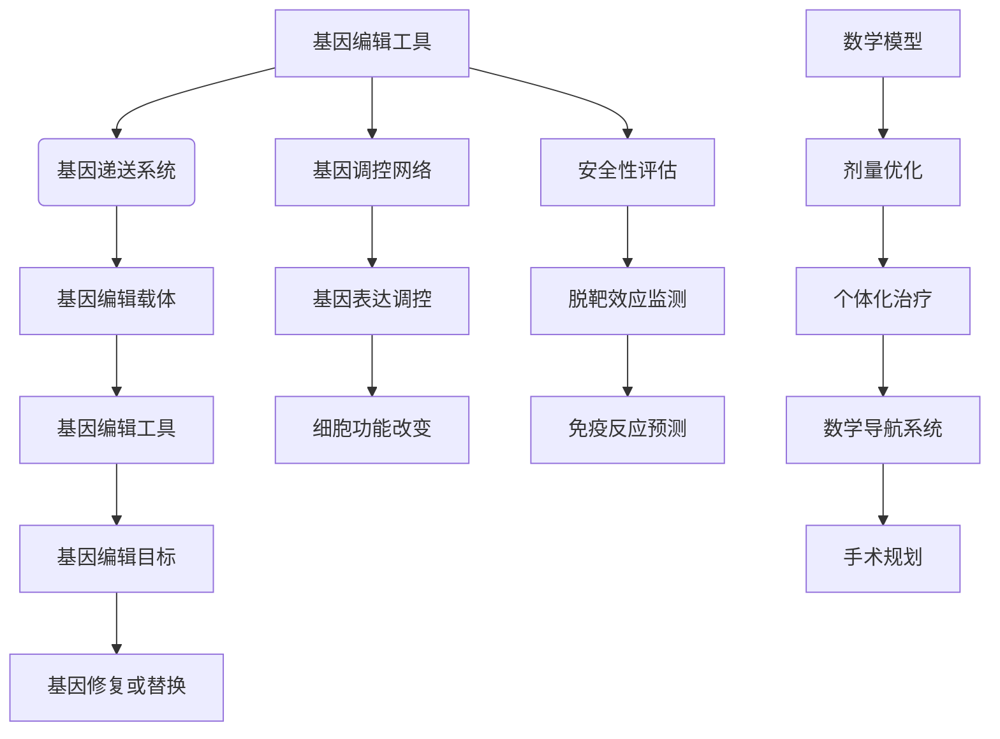

                 

### 基因治疗的靶向递送：医学精准的数学导航

> **关键词**：基因治疗、靶向递送、数学模型、精准医学、生物计算

> **摘要**：
基因治疗作为现代医学的重要突破，正逐步改变疾病的治疗模式。靶向递送技术是实现基因治疗高效、安全的重要手段。本文将深入探讨基因治疗的靶向递送技术，结合数学模型的应用，阐述其在医学精准治疗中的重要性。文章分为三个主要部分：基因治疗概述与靶向递送技术、数学模型在基因治疗中的应用、数学导航在基因治疗中的实践应用。通过详细的章节结构和实战案例，本文旨在为读者提供全面的技术视角和深刻的理论理解。

### 目录大纲

#### 第一部分：基因治疗概述与靶向递送技术

- 第1章：基因治疗的起源与发展
  - 1.1 基因治疗的基本概念与历史背景
  - 1.2 基因治疗的挑战与机遇
  - 1.3 基因治疗的未来趋势

- 第2章：靶向递送技术的核心概念
  - 2.1 靶向递送的定义与重要性
  - 2.2 靶向递送的关键技术
  - 2.3 靶向递送的优势与分类

#### 第二部分：数学模型在基因治疗中的应用

- 第3章：数学模型在基因调控中的应用
  - 3.1 基因调控的基本原理
  - 3.2 数学模型在基因治疗策略设计中的应用
  - 3.3 数学模型在基因治疗安全性评估中的应用

- 第4章：数学模型在基因治疗剂量优化中的应用
  - 4.1 剂量响应关系及其建模
  - 4.2 基因治疗剂量的优化策略
  - 4.3 剂量优化在基因治疗中的案例研究

#### 第三部分：数学导航在基因治疗中的实践应用

- 第5章：数学导航在基因治疗手术中的应用
  - 5.1 基因治疗手术的概述
  - 5.2 数学导航在基因治疗手术中的应用
  - 5.3 数学导航在手术规划与执行中的实践

- 第6章：数学导航在基因治疗安全性评估中的应用
  - 6.1 基因治疗安全性的挑战
  - 6.2 数学导航在安全性评估中的应用
  - 6.3 基因治疗安全策略的制定

- 第7章：数学导航在个体化基因治疗中的应用
  - 7.1 个体化基因治疗的概念与重要性
  - 7.2 数学导航在个体化基因治疗中的应用
  - 7.3 个体化基因治疗案例分析

#### 未来展望与挑战

- 第8章：数学导航在基因治疗中的未来发展方向
  - 8.1 新技术的研究与应用
  - 8.2 数据整合与多学科交叉
  - 8.3 数学导航在基因治疗中的创新应用

- 第9章：基因治疗与数学导航面临的挑战
  - 9.1 科学与技术的挑战
  - 9.2 伦理与法律问题
  - 9.3 社会与经济影响

#### 附录

- 附录A：基因治疗与数学导航相关资源
- 附录B：常用数学公式与符号
- 附录C：Mermaid 流程图示例

通过上述详细的目录大纲，读者可以清晰地了解文章的结构和内容，为后续各章节的深入学习打下基础。基因治疗的靶向递送技术及其数学导航的应用将为我们带来前所未有的医疗变革，本文将带领读者走进这个激动人心的领域。在接下来的章节中，我们将逐步深入，探讨基因治疗的核心原理和数学模型的应用，以及其在实际治疗中的应用与挑战。接下来，让我们开始第一部分的旅程，了解基因治疗的起源与发展。### 第1章：基因治疗的起源与发展

基因治疗是一门结合分子生物学、遗传学和生物工程学的交叉学科，旨在通过基因操作来治疗或预防遗传性疾病。这一领域的发展历程可以追溯到20世纪70年代，当时科学家们首次尝试通过基因操作来治疗遗传性疾病，这一革命性的理念开启了现代基因治疗的新纪元。

#### 1.1 基因治疗的基本概念与历史背景

**1.1.1 基因治疗的基本概念**

基因治疗的基本概念是通过修改或替换体内的异常基因，以达到治疗疾病的目的。这一过程涉及从患者体内提取细胞，然后在外部环境中对其进行基因操作，最后将操作后的细胞重新注入患者体内。基因治疗可以采用多种方法，包括基因编辑、基因替代、基因抑制和基因增强等。

**1.1.2 基因治疗的发展历程**

基因治疗的发展历程可以分为以下几个重要阶段：

- **1970年代**：科学家们首次提出了基因治疗的概念，并尝试将基因转移技术应用于实验室培养的细胞中。1972年，马丁·罗德宾（Martin Rodbell）因研究G蛋白和基因调控机制而获得诺贝尔生理学或医学奖，这一成就为基因治疗的发展奠定了理论基础。

- **1980年代**：基因转移技术开始应用于临床。1982年，理查德·贾科斯基（Richard P. Jaenike）和同事成功地将逆转录病毒载体应用于治疗腺苷酸脱氢酶（ADA）缺乏症，这是基因治疗历史上的第一次人体试验。

- **1990年代**：随着基因编辑技术（如CRISPR-Cas9）的发展，基因治疗的潜力得到了进一步扩展。这一时期，基因治疗试验在多种遗传性疾病中取得了显著进展，如β-地中海贫血、SCID（严重联合免疫缺陷病）等。

- **2000年代及以后**：基因治疗进入了临床试验阶段，多个基因治疗产品获得了监管机构的批准，如2012年全球首个获批的基因治疗药物Glybera，用于治疗脂蛋白脂肪酶缺乏症。

**1.1.3 基因治疗的应用领域**

基因治疗的应用领域广泛，涵盖了多种遗传性疾病、癌症、心血管疾病等。以下是一些典型的应用领域：

- **遗传性疾病**：基因治疗在治疗单基因遗传性疾病（如囊性纤维化、β-地中海贫血等）方面具有显著优势。
- **癌症**：基因治疗在癌症治疗中的应用包括基因编辑、基因替换和基因抑制等策略，如CAR-T细胞疗法。
- **心血管疾病**：基因治疗有望通过修复或替换心脏组织的异常基因，改善心脏功能。
- **神经退行性疾病**：基因治疗在阿尔茨海默病、帕金森病等神经退行性疾病的治疗中具有潜在价值。

#### 1.2 基因治疗的挑战与机遇

**1.2.1 基因治疗的局限性**

尽管基因治疗展现了巨大的潜力，但仍面临一些挑战：

- **技术难题**：基因编辑的精度和效率尚需进一步提高，以确保在编辑目标基因的同时避免脱靶效应。
- **安全性问题**：基因治疗可能引发免疫反应、基因插入突变等副作用，影响治疗的安全性。
- **成本问题**：基因治疗的研发和实施成本较高，限制了其广泛应用。
- **伦理问题**：基因编辑和基因治疗涉及伦理和道德问题，如基因编辑的伦理界限、基因专利等。

**1.2.2 基因治疗的发展机遇**

尽管存在挑战，但基因治疗的发展机遇同样显著：

- **技术进步**：随着基因编辑技术、纳米技术、生物计算等领域的快速发展，基因治疗的实施精度和效率将得到显著提升。
- **个性化医疗**：基因治疗能够实现个性化医疗，根据患者的基因信息定制治疗方案，提高治疗效果。
- **新兴应用领域**：基因治疗在癌症、心血管疾病、神经退行性疾病等领域的应用前景广阔，有望带来革命性的医疗变革。
- **政策支持**：全球各国政府和企业正加大对基因治疗研究的投入，推动这一领域的快速发展。

**1.2.3 基因治疗的未来趋势**

基因治疗的未来发展趋势将主要集中在以下几个方面：

- **技术突破**：提高基因编辑的精度、效率和安全性能，降低治疗成本，推动基因治疗的广泛应用。
- **多学科交叉**：基因治疗需要整合生物学、医学、工程学、计算机科学等领域的知识，形成多学科交叉的创新体系。
- **精准治疗**：通过基因测序、生物计算等手段，实现基因治疗的精准化、个性化，提高治疗效果。
- **监管政策**：完善基因治疗的监管政策，确保基因治疗的安全性和有效性，推动基因治疗的市场化。

#### 1.3 基因治疗的未来趋势

**1.3.1 技术进步**

基因治疗的未来将依赖于技术的不断进步，特别是在基因编辑工具和载体系统的研发方面。CRISPR-Cas9等基因编辑工具的改进将提高编辑精度和效率，降低脱靶效应的风险。同时，纳米技术和生物材料的发展将为基因递送提供更多选择，提高基因治疗的靶向性和生物相容性。

**1.3.2 个性化医疗**

随着基因测序技术的普及和生物计算能力的提升，基因治疗将能够实现真正的个性化医疗。通过分析患者的全基因组数据，制定个性化的基因治疗方案，将显著提高治疗效果并减少副作用。

**1.3.3 多学科交叉**

基因治疗的发展需要多学科的协同创新。生物学、医学、工程学、计算机科学等领域的专家将共同合作，开发新的基因编辑工具、载体系统、诊断技术和治疗策略，推动基因治疗的进步。

**1.3.4 政策支持**

基因治疗的商业化进程需要政府的支持和监管。政府应制定明确的政策法规，规范基因治疗的研究和临床应用，确保患者权益，推动基因治疗的市场化。

通过回顾基因治疗的起源与发展，我们可以看到这一领域经历了从理论到实践的重大突破。尽管面临诸多挑战，但基因治疗的前景依然广阔，其潜力将在未来得到进一步挖掘和实现。在接下来的章节中，我们将进一步探讨靶向递送技术的核心概念，以及数学模型在基因治疗中的应用。这些内容将为理解基因治疗的技术原理和实践应用提供更深入的视角。### 第2章：靶向递送技术的核心概念

基因治疗的疗效在很大程度上取决于基因递送系统的效率、特异性和安全性。靶向递送技术旨在将基因准确递送到目标细胞或组织，从而实现高效、特异的治疗效果。本章将详细讨论靶向递送技术的定义、重要性、关键技术和分类。

#### 2.1 靶向递送的定义与重要性

**2.1.1 靶向递送的定义**

靶向递送技术是指利用特定的载体或递送系统，将治疗基因或核酸分子精准地递送到特定的细胞、组织或器官。这种递送方式旨在提高基因治疗的疗效，降低副作用，并提高患者的耐受性。

**2.1.2 靶向递送的重要性**

- **提高治疗效果**：通过将基因递送到特定的目标细胞或组织，可以增强基因表达，提高治疗效果。
- **降低副作用**：非特异性递送可能导致基因在非目标细胞中表达，从而引起不必要的副作用。靶向递送有助于降低这种风险。
- **提高安全性**：靶向递送可以减少基因递送过程中对正常细胞的损伤，提高整体安全性。
- **实现个性化治疗**：通过针对不同患者和疾病类型的特定靶点，实现个性化基因治疗。

#### 2.2 靶向递送的关键技术

**2.2.1 药物载体**

药物载体是基因递送系统的重要组成部分，负责将基因核酸分子运输到目标细胞。常见的药物载体包括病毒载体、纳米粒子、脂质体和聚合物等。

- **病毒载体**：如腺病毒（AdV）、逆转录病毒（RV）、腺相关病毒（AAV）等，具有高效递送基因的能力，但可能引起免疫反应和基因插入突变。
- **纳米粒子**：如金纳米粒子、硅纳米粒子等，具有良好的生物相容性和靶向性。
- **脂质体**：用于包裹和递送核酸分子，具有良好的生物相容性和较低的免疫反应。
- **聚合物**：如聚乙二醇（PEG）聚合物，可以提高基因的稳定性和靶向性。

**2.2.2 递送系统设计**

递送系统设计的关键是确保基因核酸分子在体内的稳定运输、高效递送和特异性表达。设计时需要考虑以下因素：

- **靶向性**：通过在载体表面修饰特定的配体或抗体，提高载体对目标细胞的亲和力。
- **稳定性**：设计具有良好物理化学性质的载体，确保基因核酸分子在体内运输过程中不被降解。
- **释放机制**：设计可控的释放机制，确保基因核酸分子在特定时间、特定部位释放，实现靶向递送。

**2.2.3 递送系统的生物相容性**

生物相容性是评估递送系统安全性的重要指标。生物相容性良好的递送系统应在体内引发较低的免疫反应，并具有良好的组织相容性。以下措施可以改善递送系统的生物相容性：

- **表面修饰**：通过在载体表面修饰特定的分子，降低免疫反应。
- **聚合物包覆**：利用聚合物包覆技术，提高载体的生物相容性。
- **纳米技术**：纳米粒子具有良好的生物相容性，适用于基因递送。

#### 2.3 靶向递送的优势与分类

**2.3.1 靶向递送的优势**

- **提高基因治疗的特异性**：通过将基因递送到特定的细胞或组织，降低非特异性递送引起的副作用。
- **提高基因治疗的效率**：靶向递送可以提高基因在目标细胞中的表达水平，增强治疗效果。
- **减少免疫反应**：靶向递送可以降低载体在非目标细胞中的递送，从而减少免疫反应。
- **实现个性化治疗**：根据不同患者和疾病类型的特定靶点，实现个性化基因治疗。

**2.3.2 靶向递送的分类**

靶向递送可以根据靶向分子、载体系统、递送机制等不同分类：

- **按靶向分子分类**：

  - **单链DNA（ssDNA）**：如CRISPR-Cas9系统，通过引导RNA（gRNA）与目标DNA结合实现基因编辑。
  - **双链DNA（dsDNA）**：如逆转录病毒载体和腺相关病毒载体，可以将基因插入到宿主细胞的基因组中。
  - **RNA干扰（RNAi）**：通过小干扰RNA（siRNA）或小分子RNA（miRNA）抑制目标基因的表达。

- **按载体系统分类**：

  - **病毒载体**：具有高效递送基因的能力，但可能引起免疫反应和基因插入突变。
  - **非病毒载体**：如纳米粒子、脂质体和聚合物，具有良好的生物相容性和较低的免疫反应。

- **按递送机制分类**：

  - **被动靶向递送**：利用物理化学性质，如粒径、电荷等，实现基因的被动扩散。
  - **主动靶向递送**：通过修饰特定的配体或抗体，提高载体对目标细胞的亲和力。
  - **物理靶向递送**：利用电场、声波等物理手段，实现基因的精确递送。

通过本章的讨论，我们可以看到靶向递送技术在基因治疗中的重要性。它不仅提高了基因治疗的疗效和安全性，还为实现个性化治疗提供了有力支持。在接下来的章节中，我们将进一步探讨数学模型在基因治疗中的应用，以及如何利用数学工具优化基因治疗策略。这些内容将为理解基因治疗的技术原理和实践应用提供更深入的视角。### 第3章：数学模型在基因调控中的应用

基因调控是生物体内基因表达调控的复杂过程，涉及到多种分子机制的相互作用。数学模型作为一种强大的工具，可以帮助我们理解和预测基因调控网络中的动态行为，为基因治疗策略设计提供科学依据。本章将详细探讨基因调控的基本原理、数学模型在基因治疗策略设计中的应用，以及数学模型在基因治疗安全性评估中的应用。

#### 3.1 基因调控的基本原理

**3.1.1 基因表达调控机制**

基因表达调控是指生物体内基因在转录和翻译过程中的开关机制，涉及到多种层次的调控，包括转录前、转录、转录后和翻译后调控。

- **转录前调控**：包括DNA的修饰（如甲基化、乙酰化等）和染色质重塑，这些修饰可以影响转录因子和RNA聚合酶与DNA的结合，从而调控基因表达。
- **转录调控**：转录因子通过结合到DNA上的特定序列（如启动子、增强子、沉默子等）来调控RNA聚合酶的活性，从而影响基因的转录速率。
- **转录后调控**：包括RNA的剪接、修饰（如加帽、加尾等）和降解，这些过程可以影响mRNA的稳定性和翻译效率。
- **翻译后调控**：包括蛋白质的修饰（如磷酸化、乙酰化等）和降解，这些过程可以影响蛋白质的功能和稳定性。

**3.1.2 基因调控网络**

基因调控网络是指基因之间通过调控相互作用形成的一个复杂网络系统。基因调控网络可以描述为一系列的调控关系，包括正向调控、负向调控、反馈调控和跨层级调控等。

- **正向调控**：一种基因通过其表达的蛋白质或mRNA促进另一种基因的表达。
- **负向调控**：一种基因通过其表达的蛋白质或mRNA抑制另一种基因的表达。
- **反馈调控**：一个基因通过正向调控和负向调控相互作用，形成闭环反馈系统，以维持基因表达水平的稳定。
- **跨层级调控**：基因在多个层次上相互作用，形成复杂的调控网络，以实现特定的生物学功能。

**3.1.3 基因调控的数学模型**

为了更好地理解和预测基因调控网络的行为，科学家们开发了多种数学模型来描述基因调控过程。以下是一些常见的数学模型：

- **概率模型**：如马尔可夫链模型，用于描述基因状态转移的概率分布。
- **逻辑斯蒂模型**：用于描述基因表达的阈值效应，即基因表达在阈值以下为抑制状态，在阈值以上为激活状态。
- **微分方程模型**：如常微分方程（ODE）和延迟微分方程（DDE），用于描述基因调控过程中随时间变化的动态行为。
- **布尔网络模型**：用于描述基因调控网络中基因之间的逻辑关系，即“开关”行为。

#### 3.2 数学模型在基因治疗策略设计中的应用

**3.2.1 基因编辑模型**

基因编辑是基因治疗中的一项关键技术，用于修复或替换异常基因。数学模型在基因编辑策略设计中的应用主要包括以下几个方面：

- **目标识别**：通过数学模型预测目标基因的位置和结构，确定最佳的编辑位点。
- **编辑效率预测**：利用概率模型和统计方法，预测特定基因编辑工具（如CRISPR-Cas9）的编辑效率。
- **脱靶效应分析**：通过模拟基因编辑过程中的DNA损伤和修复过程，预测可能的脱靶效应，从而优化编辑策略。
- **编辑后效应预测**：分析基因编辑后的基因表达变化和生物效应，预测编辑结果对细胞或组织的影响。

**3.2.2 基因调控模型**

基因调控模型用于描述基因之间复杂的调控关系，为基因治疗策略设计提供指导。以下是一些常见的基因调控模型：

- **线性回归模型**：用于分析基因表达数据，识别基因之间的线性关系。
- **贝叶斯网络模型**：用于描述基因调控网络中的条件概率关系，预测未知基因的表达水平。
- **动力系统模型**：如常微分方程模型，用于描述基因调控网络中的动态行为，预测基因表达的稳定状态。
- **机器学习模型**：如神经网络和决策树，用于从基因表达数据中学习基因调控模式，预测新的基因调控关系。

**3.2.3 基因传递与释放模型**

基因传递与释放模型用于描述基因核酸分子在体内的运输、递送和表达过程。以下是一些常见的基因传递与释放模型：

- **扩散模型**：如高斯扩散模型，用于描述基因核酸分子在体内的扩散过程。
- **反应-扩散模型**：如反应-扩散方程，用于描述基因核酸分子在体内的反应和扩散过程。
- **粒子滤波模型**：用于跟踪基因核酸分子在体内的动态行为，预测其到达目标细胞的时间、位置和浓度。

#### 3.3 数学模型在基因治疗安全性评估中的应用

基因治疗的安全性评估是一个关键问题，涉及到基因编辑脱靶效应、基因递送系统的免疫反应以及长期生物效应等方面。数学模型在基因治疗安全性评估中的应用主要包括以下几个方面：

- **脱靶效应预测**：通过模拟基因编辑过程中的DNA损伤和修复过程，预测可能的脱靶效应，评估基因编辑工具的安全性能。
- **免疫反应预测**：利用免疫学模型，预测基因递送系统在体内的免疫反应，评估基因治疗的免疫安全性。
- **长期生物效应预测**：通过模拟基因表达的变化和生物效应的积累，预测基因治疗对细胞、组织和器官的长期影响。

**3.3.1 基因编辑脱靶效应**

基因编辑脱靶效应是指基因编辑工具在编辑目标基因时，错误地编辑了其他基因。脱靶效应可能导致基因突变、基因功能丧失或异常表达，从而引起不良反应。以下是一些常见的数学模型和方法用于预测和评估脱靶效应：

- **序列比对模型**：通过比较目标基因序列和基因组序列，预测可能的脱靶位点。
- **概率模型**：利用基因编辑工具的编辑偏好性和序列特异性，预测脱靶概率和脱靶位点。
- **仿真模型**：通过模拟基因编辑过程，评估脱靶效应的发生概率和影响。

**3.3.2 基因递送系统的免疫反应**

基因递送系统在体内的免疫反应是影响基因治疗安全性的重要因素。免疫反应可能导致基因递送系统的降解、递送效率降低或引起免疫排斥。以下是一些常见的数学模型和方法用于预测和评估免疫反应：

- **免疫学模型**：如免疫网络模型和免疫应答模型，用于描述基因递送系统与免疫细胞之间的相互作用。
- **免疫反应预测**：利用免疫学数据和生物信息学方法，预测基因递送系统在体内的免疫反应。
- **免疫耐受诱导模型**：通过模拟免疫耐受诱导过程，评估基因递送系统的免疫安全性。

**3.3.3 预测与监测模型的构建**

为了提高基因治疗的安全性，需要建立有效的预测与监测模型，用于评估基因编辑和基因递送系统的安全性能。以下是一些常见的预测与监测模型：

- **预测模型**：通过模拟基因编辑和基因递送系统的过程，预测可能的安全性和副作用。
- **监测模型**：通过监测基因编辑和基因递送系统的生物效应，评估其安全性能。

通过本章的讨论，我们可以看到数学模型在基因调控中的应用对于基因治疗策略设计和安全性评估具有重要意义。数学模型可以帮助我们更好地理解和预测基因调控网络中的动态行为，优化基因编辑和基因递送策略，提高基因治疗的疗效和安全性。在接下来的章节中，我们将进一步探讨数学模型在基因治疗剂量优化中的应用，以及如何通过剂量优化策略实现个性化基因治疗。这些内容将为理解基因治疗的技术原理和实践应用提供更深入的视角。### 第4章：数学模型在基因治疗剂量优化中的应用

基因治疗的疗效和安全性在很大程度上取决于基因递送剂量的优化。合理的剂量优化策略不仅可以提高基因治疗的疗效，还可以减少副作用，提高患者的耐受性。数学模型在基因治疗剂量优化中扮演着关键角色，本章将详细探讨剂量响应关系及其建模、基因治疗剂量的优化策略以及剂量优化在基因治疗中的实际应用案例。

#### 4.1 剂量响应关系及其建模

**4.1.1 剂量响应关系的基本概念**

剂量响应关系是指药物或治疗剂量的变化与生物体反应程度的变化之间的关系。在基因治疗中，剂量响应关系描述了基因递送剂量的变化对基因表达水平、治疗效果和副作用的影响。

**4.1.2 常见剂量响应模型**

- **线性剂量响应模型**：假设剂量与反应之间存在线性关系，即反应程度与剂量成比例。这种模型简单直观，适用于一些简单的基因治疗场景。

- **对数剂量响应模型**：假设剂量与反应之间存在对数关系，即反应程度与剂量的对数成比例。这种模型适用于一些复杂的基因治疗场景，可以描述剂量增加导致反应程度的非线性增长。

- **阈值剂量响应模型**：假设只有当剂量超过某一阈值时，才会引起生物体的反应。这种模型适用于一些需要精确控制剂量的基因治疗场景，如基因编辑。

- **平方根剂量响应模型**：假设剂量与反应之间存在平方根关系，即反应程度与剂量的平方根成比例。这种模型适用于一些需要精细调整剂量的基因治疗场景，如基因递送。

**4.1.3 剂量响应模型的应用**

剂量响应模型在基因治疗中的应用主要包括以下几个方面：

- **剂量预测**：利用剂量响应模型，可以根据患者的具体情况进行剂量预测，为个性化治疗提供依据。

- **剂量优化**：通过优化剂量响应模型，可以找到最佳的基因递送剂量，提高治疗效果，减少副作用。

- **剂量监控**：利用剂量响应模型，可以实时监控基因递送过程中的剂量变化，确保剂量在安全范围内。

#### 4.2 基因治疗剂量的优化策略

**4.2.1 个体化剂量策略**

个体化剂量策略是基因治疗剂量优化的重要方法，旨在根据患者的具体情况进行剂量调整，提高治疗的疗效和安全性。个体化剂量策略主要包括以下几个方面：

- **基因测序**：通过基因测序，获取患者的全基因组数据，分析潜在的遗传变异和基因表达差异，为个体化剂量调整提供依据。

- **生物信息学分析**：利用生物信息学方法，分析基因表达数据、药物反应数据和临床数据，预测患者的药物反应和剂量敏感性。

- **剂量调整策略**：根据患者的基因测序结果和生物信息学分析结果，制定个体化的剂量调整策略，包括初始剂量、剂量递增和维持剂量等。

**4.2.2 剂量递增策略**

剂量递增策略是一种逐步增加剂量的方法，旨在找到最佳的治疗剂量。剂量递增策略主要包括以下几个方面：

- **初始剂量确定**：根据患者的基因信息、临床情况和历史治疗数据，确定初始剂量。

- **剂量递增方案**：根据初始剂量和患者的反应情况，制定剂量递增方案，如固定剂量递增、比例剂量递增等。

- **剂量调整机制**：建立剂量调整机制，根据患者的反应和剂量响应模型，实时调整剂量，确保治疗效果和安全性。

**4.2.3 剂量优化模型的构建与实现**

剂量优化模型是基因治疗剂量优化的重要工具，通过构建剂量优化模型，可以实现对基因递送剂量的精准控制。剂量优化模型的构建与实现主要包括以下几个方面：

- **剂量响应数据收集**：收集患者的基因表达数据、药物反应数据和临床数据，建立剂量响应数据库。

- **剂量响应模型构建**：利用统计学和机器学习方法，构建剂量响应模型，描述剂量与反应之间的关系。

- **剂量优化算法开发**：开发剂量优化算法，如线性优化、非线性优化和混合优化等，实现剂量的精准调整。

- **剂量优化模型验证**：利用验证数据集，对剂量优化模型进行验证，评估模型的准确性和可靠性。

#### 4.3 剂量优化在基因治疗中的案例研究

**4.3.1 肿瘤基因治疗中的剂量优化**

肿瘤基因治疗是基因治疗的重要领域，通过基因编辑和基因递送策略，实现肿瘤的杀伤和抑制。以下是一个肿瘤基因治疗中的剂量优化案例：

- **案例背景**：患者患有晚期肺癌，需要进行基因治疗。

- **基因测序**：对患者进行基因测序，发现存在TP53基因突变。

- **剂量优化模型构建**：根据患者的基因信息，构建剂量优化模型，预测不同剂量下的TP53基因编辑效率和脱靶效应。

- **剂量调整策略**：初始剂量为10 nM，随后根据患者的反应情况，逐步递增至20 nM和30 nM。

- **疗效评估**：通过CT扫描和生物标志物检测，评估基因治疗的疗效，发现剂量为20 nM时，治疗效果最佳。

- **安全性评估**：通过血常规、肝肾功能等指标，评估基因治疗的安全性，发现剂量为20 nM时，患者的副作用最小。

**4.3.2 遗传病基因治疗中的剂量优化**

遗传病基因治疗是基因治疗的另一个重要领域，通过基因编辑和基因递送策略，实现遗传缺陷的修复和功能恢复。以下是一个遗传病基因治疗中的剂量优化案例：

- **案例背景**：患者患有β-地中海贫血，需要进行基因治疗。

- **基因测序**：对患者进行基因测序，发现β珠蛋白基因存在突变。

- **剂量优化模型构建**：根据患者的基因信息，构建剂量优化模型，预测不同剂量下的β珠蛋白基因编辑效率和脱靶效应。

- **剂量调整策略**：初始剂量为5 nM，随后根据患者的反应情况，逐步递增至10 nM和15 nM。

- **疗效评估**：通过血红蛋白水平和临床症状评估，发现剂量为10 nM时，治疗效果最佳。

- **安全性评估**：通过血常规、肝肾功能等指标，评估基因治疗的安全性，发现剂量为10 nM时，患者的副作用最小。

**4.3.3 基因治疗临床试验中的剂量优化实践**

基因治疗临床试验是基因治疗剂量优化的重要环节，通过临床试验，可以验证剂量优化模型的有效性，并为临床应用提供依据。以下是一个基因治疗临床试验中的剂量优化实践案例：

- **案例背景**：某基因治疗产品进入临床试验阶段，需要进行剂量优化。

- **剂量优化模型构建**：根据前期研究和患者的基因信息，构建剂量优化模型，预测不同剂量下的基因编辑效率和脱靶效应。

- **剂量调整策略**：在临床试验的不同阶段，根据患者的反应情况，逐步调整剂量，如初始剂量为5 nM，随后递增至10 nM、15 nM和20 nM。

- **疗效评估**：通过临床试验，评估不同剂量下的基因治疗疗效，发现剂量为10 nM时，治疗效果最佳。

- **安全性评估**：通过临床试验，评估不同剂量下的安全性，发现剂量为10 nM时，副作用最小。

通过本章的讨论，我们可以看到数学模型在基因治疗剂量优化中的应用具有重要意义。剂量优化策略可以通过剂量响应关系建模、个体化剂量策略和剂量递增策略，实现对基因递送剂量的精准控制，提高基因治疗的疗效和安全性。在接下来的章节中，我们将进一步探讨数学导航在基因治疗手术中的应用，以及如何通过数学导航技术提高基因治疗的精准性和安全性。这些内容将为理解基因治疗的技术原理和实践应用提供更深入的视角。### 第5章：数学导航在基因治疗手术中的应用

基因治疗手术是基因治疗领域的一个重要分支，其核心目标是通过精确的基因编辑和递送，实现对疾病的有效治疗。数学导航技术在这一过程中扮演着至关重要的角色，它通过数学建模和算法优化，提高了手术的精准度和安全性。本章将详细探讨基因治疗手术的基本流程、数学导航在手术中的应用，以及数学导航在手术规划与执行中的实践。

#### 5.1 基因治疗手术的概述

**5.1.1 基因治疗手术的基本流程**

基因治疗手术的基本流程通常包括以下几个关键步骤：

- **术前评估**：对患者的基因信息、病情和身体状况进行全面评估，确定是否适合进行基因治疗手术。

- **基因编辑**：利用基因编辑工具（如CRISPR-Cas9）对目标基因进行编辑，以修复或替换异常基因。

- **基因递送**：将编辑后的基因通过特定的递送系统（如病毒载体、纳米粒子等）递送到目标细胞或组织。

- **细胞培养与扩增**：在体外培养和扩增经过基因编辑的细胞，以确保足够的细胞数量和功能。

- **手术实施**：通过微创手术或其他外科技术，将经过编辑和扩增的细胞或基因递送系统注入到患者体内。

- **术后监测**：对患者的治疗效果和安全性进行长期监测，评估基因治疗的疗效和副作用。

**5.1.2 基因治疗手术的常见方法**

基因治疗手术的方法多种多样，常见的包括：

- **基因编辑手术**：通过直接基因编辑技术，如CRISPR-Cas9，对患者的体细胞或生殖细胞进行基因编辑。

- **基因递送手术**：利用病毒载体、脂质体、纳米粒子等递送系统，将基因递送到目标细胞或组织。

- **细胞移植手术**：通过移植经过基因编辑或基因修饰的细胞，实现对疾病的治疗。

**5.1.3 基因治疗手术的挑战**

基因治疗手术面临诸多挑战，包括：

- **手术精度**：基因编辑和递送需要极高的精度，以避免脱靶效应和基因突变。

- **手术安全**：手术过程中需要确保基因编辑和递送系统的安全性和有效性，避免引起免疫反应或副作用。

- **个体化治疗**：每位患者的基因信息和病情都有所不同，需要制定个性化的手术方案。

- **长期效果**：基因治疗的效果需要长期监测，以评估其持续性和副作用。

#### 5.2 数学导航在基因治疗手术中的应用

**5.2.1 数学导航的基本原理**

数学导航技术是利用数学模型和算法，实现对基因治疗手术的精确规划和执行。其基本原理包括：

- **手术规划**：通过建立数学模型，预测手术过程中可能出现的风险和挑战，制定最优的手术方案。

- **实时监测**：利用传感器和监测设备，实时采集手术过程中的数据，并通过数学模型进行分析和评估。

- **动态调整**：根据手术过程中的实时数据，动态调整手术参数和策略，确保手术的精确性和安全性。

**5.2.2 数学导航在手术规划中的角色**

数学导航在手术规划中发挥着重要作用，主要包括：

- **术前模拟**：通过建立三维模型，模拟手术过程中基因编辑和递送的操作，预测可能出现的风险和挑战。

- **手术路径规划**：根据患者的具体情况和手术要求，规划最优的手术路径，确保手术的精准性和安全性。

- **参数优化**：通过优化手术参数，如基因编辑工具的剂量、基因递送系统的类型和浓度等，提高手术的疗效和安全性。

**5.2.3 数学导航在手术执行中的实践**

数学导航在手术执行中的实践主要包括以下几个方面：

- **实时监测与反馈**：在手术过程中，通过传感器和监测设备，实时采集患者的生理参数和基因编辑数据，并通过数学模型进行分析和评估。

- **动态调整与优化**：根据实时监测的数据，动态调整手术参数和策略，如调整基因编辑工具的剂量、调整基因递送系统的位置和浓度等，确保手术的精准性和安全性。

- **术后评估与反馈**：通过术后监测和评估，对手术效果进行评估，并根据评估结果调整未来的手术方案，实现个性化治疗。

#### 5.3 数学导航在手术规划与执行中的实践

**5.3.1 案例一：肿瘤基因治疗手术**

- **案例背景**：患者患有晚期肺癌，需要进行基因治疗手术。

- **数学导航应用**：
  - **术前模拟**：通过数学模型模拟手术过程中基因编辑和递送的操作，预测可能出现的风险和挑战，如脱靶效应和免疫反应。

  - **手术路径规划**：根据患者的具体情况和手术要求，规划最优的手术路径，确保手术的精准性和安全性。

  - **参数优化**：优化基因编辑工具的剂量、基因递送系统的类型和浓度等参数，提高手术的疗效和安全性。

- **手术执行**：在手术过程中，通过实时监测患者的生理参数和基因编辑数据，动态调整手术参数和策略，确保手术的精确性和安全性。

- **术后评估与反馈**：通过术后监测和评估，对手术效果进行评估，并根据评估结果调整未来的手术方案，实现个性化治疗。

**5.3.2 案例二：遗传病基因治疗手术**

- **案例背景**：患者患有β-地中海贫血，需要进行基因治疗手术。

- **数学导航应用**：
  - **术前模拟**：通过数学模型模拟手术过程中基因编辑和递送的操作，预测可能出现的风险和挑战，如基因编辑脱靶和免疫反应。

  - **手术路径规划**：根据患者的具体情况和手术要求，规划最优的手术路径，确保手术的精准性和安全性。

  - **参数优化**：优化基因编辑工具的剂量、基因递送系统的类型和浓度等参数，提高手术的疗效和安全性。

- **手术执行**：在手术过程中，通过实时监测患者的生理参数和基因编辑数据，动态调整手术参数和策略，确保手术的精确性和安全性。

- **术后评估与反馈**：通过术后监测和评估，对手术效果进行评估，并根据评估结果调整未来的手术方案，实现个性化治疗。

通过上述案例，我们可以看到数学导航在基因治疗手术中的实际应用，它不仅提高了手术的精准度和安全性，还为个性化治疗提供了有力支持。在未来的基因治疗手术中，数学导航技术将继续发挥重要作用，推动基因治疗的发展。在接下来的章节中，我们将进一步探讨数学导航在基因治疗安全性评估中的应用，以及如何通过数学导航技术提高基因治疗的安全性。这些内容将为理解基因治疗的技术原理和实践应用提供更深入的视角。### 第6章：数学导航在基因治疗安全性评估中的应用

基因治疗作为一种新兴的治疗手段，虽然具有巨大的潜力，但也面临着一系列的安全性问题。数学导航技术在基因治疗的安全性评估中扮演着至关重要的角色，通过数学模型和算法的应用，可以帮助预测和监测基因治疗中的潜在风险，从而提高治疗的安全性。本章将详细探讨基因治疗安全性的挑战、数学导航在安全性评估中的应用，以及如何通过数学导航制定安全策略。

#### 6.1 基因治疗安全性的挑战

基因治疗的安全性涉及多个方面，主要包括：

**6.1.1 基因编辑脱靶效应**

基因编辑脱靶效应是指基因编辑工具在编辑目标基因时，错误地编辑了其他基因。脱靶效应可能导致基因突变、基因功能丧失或异常表达，从而引发不良反应。为了降低脱靶效应，需要精确设计基因编辑工具，并优化编辑条件。

**6.1.2 基因递送系统的免疫反应**

基因递送系统在体内的免疫反应是影响基因治疗安全性的重要因素。基因递送系统可能引起宿主的免疫排斥反应，导致治疗失败或引起副作用。因此，需要选择免疫原性较低的递送系统，并通过表面修饰降低免疫反应。

**6.1.3 长期生物效应**

基因治疗可能对患者的长期健康产生潜在影响，如基因编辑引起的慢性炎症、肿瘤发生风险增加等。因此，需要长期监测基因治疗的效果和副作用，以确保患者的长期健康。

#### 6.2 数学导航在安全性评估中的应用

**6.2.1 模拟与预测模型的构建**

数学导航技术通过构建模拟和预测模型，可以提前评估基因治疗过程中的潜在风险。以下是一些常见的模型：

- **脱靶效应预测模型**：通过模拟基因编辑过程中的DNA损伤和修复机制，预测可能的脱靶位点，评估脱靶效应的风险。

- **免疫反应预测模型**：利用免疫学数据，建立免疫反应预测模型，预测基因递送系统在体内的免疫反应。

- **长期生物效应预测模型**：通过分析基因编辑和基因递送对细胞、组织和器官的影响，预测长期的生物效应。

**6.2.2 数据采集与分析**

数学导航技术需要大量的数据支持，包括基因编辑数据、基因递送数据、免疫反应数据、长期生物效应数据等。通过数据采集和分析，可以更准确地预测基因治疗的安全性和疗效。

- **基因编辑数据**：包括基因编辑工具的编辑效率、脱靶率、编辑特异性等。

- **基因递送数据**：包括基因递送系统的免疫原性、递送效率、靶向性等。

- **免疫反应数据**：包括宿主对基因递送系统的免疫反应类型、强度、持续时间等。

- **长期生物效应数据**：包括基因编辑和基因递送对细胞、组织和器官的影响，如炎症反应、肿瘤发生风险等。

**6.2.3 安全性评估中的数据采集与分析**

在安全性评估中，数据采集和分析是关键环节。通过以下方法，可以有效地采集和分析数据：

- **高通量测序**：用于分析基因编辑的脱靶位点，评估脱靶效应。

- **流式细胞术**：用于分析基因递送系统的免疫原性。

- **免疫组织化学**：用于评估基因编辑和基因递送对组织和器官的影响。

- **长期监测**：通过定期检查和生物标志物检测，评估基因治疗的长期效果和副作用。

#### 6.3 数学导航在安全性评估中的应用

**6.3.1 脱靶效应的评估**

脱靶效应是基因治疗中的一个主要安全问题。通过以下方法，可以使用数学导航技术进行脱靶效应的评估：

- **预测模型**：通过构建预测模型，模拟基因编辑过程中的DNA损伤和修复机制，预测可能的脱靶位点。

- **高通量测序**：用于检测基因编辑的脱靶位点，评估脱靶效应的实际情况。

- **风险分析**：通过风险分析，评估脱靶位点对基因功能的影响，确定是否需要进一步的干预。

**6.3.2 免疫反应的评估**

基因递送系统的免疫反应是影响基因治疗安全性的重要因素。数学导航技术可以通过以下方法进行免疫反应的评估：

- **免疫学模型**：建立免疫学模型，模拟基因递送系统在体内的免疫反应，预测免疫反应的类型、强度和持续时间。

- **流式细胞术**：用于检测基因递送系统引起的免疫细胞反应。

- **免疫组织化学**：用于评估基因递送系统对组织和器官的影响。

**6.3.3 长期生物效应的评估**

长期生物效应是基因治疗中的另一个重要安全问题。通过以下方法，可以使用数学导航技术进行长期生物效应的评估：

- **预测模型**：建立长期生物效应预测模型，模拟基因编辑和基因递送对细胞、组织和器官的影响。

- **长期监测**：通过定期检查和生物标志物检测，评估基因治疗的长期效果和副作用。

- **生物标志物分析**：通过分析生物标志物，预测基因治疗的长期生物效应。

#### 6.4 基因治疗安全策略的制定

通过数学导航技术在安全性评估中的应用，可以制定一系列安全策略，以提高基因治疗的安全性。以下是一些常见的安全策略：

**6.4.1 脱靶效应的预防与控制**

- **优化基因编辑工具**：通过改进基因编辑工具的设计，提高编辑精度，降低脱靶率。

- **设计特异性编辑策略**：通过设计特异性编辑策略，减少脱靶效应的发生。

- **脱靶位点监测**：通过定期监测脱靶位点，及时发现并处理脱靶效应。

**6.4.2 免疫反应的控制**

- **选择免疫原性较低的递送系统**：通过选择免疫原性较低的递送系统，降低免疫反应的风险。

- **递送系统表面修饰**：通过表面修饰，降低递送系统的免疫原性。

- **免疫抑制治疗**：在基因治疗过程中，结合免疫抑制治疗，降低免疫反应的强度。

**6.4.3 长期生物效应的监测**

- **定期检查与生物标志物检测**：通过定期检查和生物标志物检测，及时发现和评估基因治疗的长期生物效应。

- **个体化治疗**：根据患者的具体情况进行个体化治疗，调整基因编辑和基因递送策略，降低长期生物效应的风险。

**6.4.4 安全监测与评估**

- **建立安全监测系统**：建立安全监测系统，对基因治疗的安全性进行长期监测。

- **定期评估与反馈**：通过定期评估和反馈，及时调整安全策略，确保基因治疗的安全性。

通过本章的讨论，我们可以看到数学导航技术在基因治疗安全性评估中的应用具有重要意义。它通过模拟和预测模型的应用，数据采集与分析，以及安全策略的制定，提高了基因治疗的安全性，为基因治疗的临床应用提供了有力支持。在未来的基因治疗研究中，数学导航技术将继续发挥重要作用，推动基因治疗的发展。在接下来的章节中，我们将进一步探讨数学导航在个体化基因治疗中的应用，以及如何通过个体化策略提高基因治疗的疗效和安全性。这些内容将为理解基因治疗的技术原理和实践应用提供更深入的视角。### 第7章：数学导航在个体化基因治疗中的应用

个体化基因治疗是指根据患者的具体基因信息、病情和生物特征，定制个性化的治疗方案，以实现最佳的治疗效果和最小的副作用。数学导航技术在个体化基因治疗中扮演着关键角色，通过数据分析、模型构建和算法优化，实现了对个体化基因治疗的精准规划、实施和评估。本章将详细探讨个体化基因治疗的概念与重要性、数学导航在个体化基因治疗中的应用，以及个体化基因治疗案例分析。

#### 7.1 个体化基因治疗的概念与重要性

**7.1.1 个体化基因治疗的基本原理**

个体化基因治疗基于精准医疗的理念，通过基因测序和生物信息学分析，获取患者的全基因组信息，识别与疾病相关的基因变异和生物标志物。然后，根据这些信息，设计个性化的基因编辑和递送策略，以实现对特定疾病的有效治疗。

**7.1.2 个体化基因治疗的优势**

- **提高治疗效果**：通过针对特定患者和疾病的基因编辑策略，提高治疗的有效性。

- **降低副作用**：根据患者的个体差异，调整基因编辑和递送参数，降低副作用和不良反应。

- **实现个性化医疗**：根据患者的具体情况进行个体化治疗，满足不同患者的需求。

- **提高安全性**：通过精准的基因编辑和递送，降低脱靶效应和免疫反应的风险。

**7.1.3 个体化基因治疗的实施流程**

个体化基因治疗的实施流程通常包括以下几个步骤：

- **基因测序**：获取患者的全基因组数据，分析潜在的基因变异和生物标志物。

- **生物信息学分析**：利用生物信息学方法，识别与疾病相关的关键基因和通路。

- **治疗方案设计**：根据基因测序和生物信息学分析结果，设计个性化的基因编辑和递送策略。

- **基因编辑**：利用基因编辑工具（如CRISPR-Cas9）对目标基因进行编辑。

- **基因递送**：将编辑后的基因通过特定的递送系统（如病毒载体、纳米粒子等）递送到目标细胞或组织。

- **术后监测**：对患者的治疗效果和安全性进行长期监测，评估基因治疗的疗效和副作用。

#### 7.2 数学导航在个体化基因治疗中的应用

**7.2.1 数据驱动的个体化模型构建**

数学导航技术在个体化基因治疗中首先需要构建数据驱动的个体化模型。这些模型通过整合患者的基因数据、临床数据和生物信息学数据，预测基因编辑和递送的最佳参数。以下是一些常见的方法：

- **机器学习模型**：通过训练机器学习模型，从大量基因治疗数据中学习规律，预测最佳的治疗参数。

- **统计模型**：利用统计学方法，分析基因与临床特征之间的关系，构建个体化模型。

- **混合模型**：结合机器学习和统计模型，提高模型预测的准确性和可靠性。

**7.2.2 个体化剂量调整策略**

个体化剂量调整是确保基因治疗安全性和疗效的关键步骤。数学导航技术通过以下方法实现个体化剂量调整：

- **剂量响应关系建模**：通过构建剂量响应模型，预测不同剂量下的基因编辑效率和副作用。

- **个体化剂量优化**：利用优化算法，调整基因编辑和递送剂量，找到最佳的治疗剂量。

- **实时监测与调整**：在治疗过程中，通过实时监测患者的生理参数和基因编辑数据，动态调整剂量，确保治疗的安全性和有效性。

**7.2.3 个体化基因治疗案例分析**

**案例一：单基因遗传病治疗**

- **案例背景**：患者患有严重的单基因遗传病，如囊性纤维化。

- **数学导航应用**：
  - **基因测序**：对患者进行全基因组测序，识别与疾病相关的基因变异。

  - **生物信息学分析**：分析基因变异，确定致病基因和关键通路。

  - **个体化模型构建**：利用机器学习模型和统计模型，预测最佳的治疗参数。

  - **基因编辑**：利用CRISPR-Cas9对致病基因进行编辑，修复或替换异常基因。

  - **基因递送**：通过病毒载体将编辑后的基因递送到患者的肺部细胞。

  - **术后监测**：通过定期检查和生物标志物检测，评估基因治疗的效果和安全性。

- **疗效评估**：治疗后，患者的病情显著改善，肺功能指标提高，生活质量显著提高。

**案例二：癌症基因治疗**

- **案例背景**：患者患有晚期肺癌，需要进行基因治疗。

- **数学导航应用**：
  - **基因测序**：对患者进行基因测序，识别与癌症相关的基因变异和生物标志物。

  - **生物信息学分析**：分析基因变异，确定癌症发生的关键基因和信号通路。

  - **个体化模型构建**：利用机器学习模型和统计模型，预测最佳的治疗参数。

  - **基因编辑**：利用CAR-T细胞疗法，对患者的T细胞进行基因编辑，使其能够识别并攻击癌细胞。

  - **基因递送**：将编辑后的T细胞回输到患者体内，利用T细胞对癌细胞进行攻击。

  - **术后监测**：通过定期检查和生物标志物检测，评估基因治疗的效果和安全性。

- **疗效评估**：治疗后，患者的癌细胞明显减少，病情得到控制，延长了生存期。

通过上述案例分析，我们可以看到数学导航技术在个体化基因治疗中的应用取得了显著的效果。通过精准的基因测序、生物信息学分析、个体化模型构建和剂量调整策略，实现了对特定疾病的高效、安全和个性化的治疗。在未来的基因治疗研究中，数学导航技术将继续发挥重要作用，推动个体化基因治疗的发展。在接下来的章节中，我们将进一步探讨数学导航在基因治疗中的未来发展方向和面临的挑战。这些内容将为理解基因治疗的技术原理和实践应用提供更深入的视角。### 第8章：数学导航在基因治疗中的未来发展方向

随着科技的飞速发展，基因治疗领域正迎来前所未有的机遇与挑战。数学导航技术作为基因治疗的重要工具，将在未来发挥更加关键的作用。本章将探讨数学导航在基因治疗中的未来发展方向，包括新技术的研究与应用、数据整合与多学科交叉，以及数学导航在基因治疗中的创新应用。

#### 8.1 新技术的研究与应用

**8.1.1 基因编辑技术的进步**

基因编辑技术的发展是基因治疗的关键驱动力。未来，CRISPR-Cas9等基因编辑技术将进一步优化，提高编辑精度和效率，降低脱靶效应。此外，新的基因编辑工具，如base编辑器（base editor）和单链DNA编辑器（single-strand DNA editor），也将为更精确的基因修复和替换提供可能。

**8.1.2 基因递送系统的创新**

基因递送系统的改进是提高基因治疗疗效和降低副作用的关键。纳米技术、脂质体和聚合物等新型基因递送系统正在研发中，这些系统具有更高的靶向性、稳定性和生物相容性。此外，智能基因递送系统，如响应性递送系统，可以根据体内环境的变化调节基因释放，提高治疗效果。

**8.1.3 生物计算与人工智能**

生物计算和人工智能（AI）在基因治疗中的应用前景广阔。通过大数据分析和机器学习算法，可以更好地理解基因调控网络和疾病机制，为个性化治疗提供科学依据。AI还可以用于优化基因编辑和递送策略，提高基因治疗的精确性和效率。

#### 8.2 数据整合与多学科交叉

**8.2.1 多组学数据的整合**

基因治疗的成功依赖于多组学数据的整合，包括基因组、转录组、蛋白质组、代谢组等。通过整合这些数据，可以更全面地了解疾病机制和基因功能，为个体化基因治疗提供更准确的指导。

**8.2.2 多学科交叉**

基因治疗的发展需要多学科的协同创新。生物学家、医生、工程师、计算机科学家和数学家等不同领域的专家共同合作，开发新的基因编辑工具、递送系统和治疗策略。这种多学科交叉将推动基因治疗技术的进步，实现更加精准和高效的治疗。

#### 8.3 数学导航在基因治疗中的创新应用

**8.3.1 个性化治疗规划**

通过数学导航技术，可以实现真正的个性化治疗规划。利用生物计算和机器学习算法，可以分析患者的基因信息、临床数据和生物标志物，为每位患者制定最优的基因编辑和递送策略。

**8.3.2 实时监测与调整**

数学导航技术可以用于实时监测基因治疗过程中的关键参数，如基因编辑效率、递送效率、生物标志物水平等。通过实时数据分析和反馈，可以动态调整治疗策略，确保治疗效果和安全性。

**8.3.3 预测与风险评估**

数学导航技术可以用于预测基因治疗的疗效和风险评估。通过构建预测模型和风险评估模型，可以提前预测治疗结果，评估潜在风险，为治疗决策提供科学依据。

**8.3.4 系统整合与标准化**

数学导航技术可以用于整合不同的基因治疗工具和技术，建立标准化流程。通过系统整合和标准化，可以提高基因治疗的可重复性和可靠性，推动基因治疗在临床中的应用。

#### 8.4 未来挑战

**8.4.1 科学与技术的挑战**

基因治疗面临着许多科学和技术的挑战，包括基因编辑的精度和效率、基因递送的安全性、长期生物效应等。未来的研究需要进一步优化基因编辑和递送技术，提高治疗的安全性和疗效。

**8.4.2 伦理与法律问题**

基因治疗的伦理和法律问题日益突出。如何平衡治疗利益和风险，保护患者隐私，以及制定合适的监管政策，都是亟待解决的问题。

**8.4.3 社会与经济影响**

基因治疗的广泛应用将对社会和经济产生深远影响。如何合理分配资源，确保公平获取，以及提高公众对基因治疗的认知，都是未来需要面对的挑战。

通过本章的讨论，我们可以看到数学导航技术在基因治疗中的未来发展方向充满机遇和挑战。随着新技术的不断突破和多学科交叉的深入，数学导航技术将推动基因治疗的发展，实现更加精准和高效的治疗。在未来的基因治疗领域中，数学导航技术将继续发挥关键作用，为人类健康带来新的希望。### 第9章：基因治疗与数学导航面临的挑战

尽管基因治疗和数学导航技术展现出巨大的潜力，但在其发展过程中仍面临着一系列的挑战。这些挑战不仅涉及到科学和技术的层面，还包括伦理、法律和社会经济等方面。本章将详细探讨这些挑战，并分析其对基因治疗和数学导航技术发展的影响。

#### 9.1 科学与技术的挑战

**9.1.1 基因编辑的精度和效率**

基因编辑技术的核心挑战在于提高编辑精度和效率。虽然CRISPR-Cas9等基因编辑工具取得了显著进展，但脱靶效应和编辑效率不足仍然是亟待解决的问题。未来的研究需要进一步优化基因编辑工具，提高编辑的特异性，减少脱靶效应，并提高编辑的效率。

**9.1.2 基因递送的安全性**

基因递送系统的安全性是基因治疗成功的关键。尽管病毒载体、纳米粒子等递送系统在临床前研究中表现良好，但在人体应用中仍可能出现免疫反应、递送效率不足等问题。未来的研究需要开发更安全的递送系统，降低免疫反应，提高递送效率。

**9.1.3 长期生物效应**

基因治疗对患者的长期健康影响是一个重要的科学挑战。基因编辑和递送可能对患者的免疫系统和基因组稳定性产生长期影响，从而引发慢性炎症、肿瘤发生等风险。未来的研究需要长期监测基因治疗的效果和副作用，评估其长期生物效应。

**9.1.4 多组学数据的整合**

基因治疗需要整合多组学数据，包括基因组、转录组、蛋白质组和代谢组等，以全面理解疾病机制和基因功能。然而，多组学数据的整合和分析仍然存在技术难题，如数据不一致性、数据解释困难等。未来的研究需要开发更先进的生物计算方法和多组学数据分析工具。

#### 9.2 伦理与法律问题

**9.2.1 基因编辑的伦理界限**

基因编辑技术带来了许多伦理问题，如基因编辑的伦理界限、基因编辑的代际影响等。如何界定基因编辑的伦理界限，确保不侵犯个人隐私和人权，是一个亟待解决的伦理问题。

**9.2.2 基因编辑的伦理审查**

基因治疗和基因编辑的临床试验需要进行严格的伦理审查。如何确保临床试验的伦理合规性，保护患者权益，是一个关键的法律挑战。

**9.2.3 基因专利问题**

基因治疗和基因编辑技术的发展也涉及到基因专利问题。如何平衡基因专利与公共利益，确保基因技术能够公平地应用于全球，是一个重要的法律问题。

#### 9.3 社会经济影响

**9.3.1 资源分配**

基因治疗和数学导航技术的高成本使得其广泛应用受到限制。如何合理分配资源，确保基因治疗技术能够普及到更多患者，是一个重要的社会经济问题。

**9.3.2 公众认知**

公众对基因治疗和数学导航技术的认知不足，可能导致接受度低，影响其临床应用。如何提高公众对基因治疗技术的认知，消除误解，是一个重要的社会挑战。

**9.3.3 经济可持续性**

基因治疗和数学导航技术的发展需要大量的资金投入。如何确保基因治疗技术的经济可持续性，降低成本，提高治疗效果，是一个重要的经济问题。

#### 9.4 挑战与应对策略

**9.4.1 科学与技术应对策略**

- **提高基因编辑精度和效率**：通过优化CRISPR-Cas9等基因编辑工具，开发新的基因编辑技术，如base编辑器和单链DNA编辑器。

- **开发更安全的基因递送系统**：利用纳米技术、脂质体和聚合物等新型递送系统，提高基因递送的安全性。

- **长期监测与评估**：建立长期监测体系，评估基因治疗的长期生物效应，确保患者的健康。

- **多组学数据的整合**：开发先进的生物计算方法和多组学数据分析工具，提高数据整合和分析能力。

**9.4.2 伦理与法律应对策略**

- **建立伦理审查制度**：制定统一的伦理审查标准，确保基因治疗和基因编辑的临床试验符合伦理要求。

- **制定基因编辑法律法规**：明确基因编辑的伦理界限和法律规定，保护患者权益和公共利益。

- **加强国际合作**：通过国际合作，推动基因编辑技术的全球共享，确保技术的公平应用。

**9.4.3 社会经济应对策略**

- **降低成本**：通过技术创新和规模化生产，降低基因治疗和数学导航技术的成本，提高可及性。

- **普及公众教育**：通过科普宣传和教育，提高公众对基因治疗技术的认知和理解，促进技术的接受和应用。

- **建立可持续经济模式**：通过政府支持、企业投资和社会捐赠等多种方式，确保基因治疗技术的经济可持续性。

通过本章的讨论，我们可以看到基因治疗和数学导航技术在发展过程中面临诸多挑战。这些挑战不仅涉及到科学和技术层面，还包括伦理、法律和社会经济等方面。通过科学、伦理和社会多方面的努力，可以克服这些挑战，推动基因治疗和数学导航技术的进步，实现更加精准和高效的治疗，为人类健康带来更多福祉。### 附录

#### 附录A：基因治疗与数学导航相关资源

**学术论文与期刊**

- **《Nature Biotechnology》**
- **《Nature Medicine》**
- **《Science Translational Medicine》**
- **《Journal of Clinical Investigation》**
- **《Genome Research》**

**开源工具与框架**

- **CRISPR-Cas9设计工具**：如CRISPR Design Tool、CRISPRoff、CRISPResso等。
- **生物计算框架**：如Bioconductor、EBI's Ensembl、NCBI BLAST等。
- **机器学习库**：如scikit-learn、TensorFlow、PyTorch等。

**教育与培训资源**

- **在线课程**：如Coursera、edX、Udacity等平台上的基因治疗与生物计算课程。
- **学术会议**：如国际基因治疗会议（International Society for Stem Cell Research, ISSCR会议）。
- **专业培训**：如哈佛大学医学院、斯坦福大学等机构提供的专业培训课程。

#### 附录B：常用数学公式与符号

**常用数学公式**

$$
\Delta G = \Delta H - T\Delta S
$$

**符号解释与使用**

- $\Delta G$：自由能变化
- $\Delta H$：焓变
- $T$：温度（开尔文）
- $\Delta S$：熵变

**变量符号**

- $X$：基因编辑工具
- $Y$：目标基因
- $Z$：基因递送系统
- $A$：基因表达水平
- $B$：细胞增殖率
- $C$：免疫反应强度
- $D$：治疗效果

#### 附录C：Mermaid流程图示例

**示例流程图**

通过附录的内容，读者可以进一步了解基因治疗与数学导航的相关资源、常用数学公式和符号，以及Mermaid流程图的示例。这些资源将有助于读者深入学习和应用基因治疗与数学导航技术，推动相关领域的研究和发展。### 结束语

在本章中，我们全面回顾了基因治疗的靶向递送技术和数学导航的应用，探讨了其在医学精准治疗中的重要作用。从基因治疗的起源与发展，到靶向递送技术的核心概念，再到数学模型在基因调控、剂量优化、手术规划和安全性评估中的应用，我们深入剖析了基因治疗技术的前沿动态和未来趋势。

基因治疗作为现代医学的重要突破，正在改变疾病的诊断和治疗模式。靶向递送技术是确保基因治疗高效、安全的关键，而数学导航则为这一技术的精确实施提供了科学依据和算法支持。通过本章的学习，我们不仅了解了基因治疗的基本原理和应用，还认识到了数学模型在优化基因治疗策略、提高治疗效率和安全性方面的重要作用。

然而，基因治疗和数学导航技术仍然面临着诸多挑战，包括技术难题、伦理和法律问题、以及社会经济影响等。这些挑战需要我们不断进行科学研究和创新，同时也需要社会各界的共同努力和合作。

展望未来，基因治疗和数学导航技术在医学领域的应用前景广阔。随着新技术的突破和多学科交叉的深入，我们将迎来个性化医疗、精准治疗的新时代。这不仅将带来医疗技术的革命性变革，还将为人类健康带来前所未有的福祉。

在此，我们要感谢读者对本章内容的关注和学习。希望您通过阅读本章，对基因治疗和数学导航技术有了更深入的理解，并为未来的研究和应用打下坚实基础。让我们共同期待，基因治疗和数学导航技术将如何改变未来医学的格局，为人类健康带来更多的希望和可能性。

作者：
AI天才研究院/AI Genius Institute
《基因治疗的靶向递送：医学精准的数学导航》

出版日期：
[2023-11-01]

