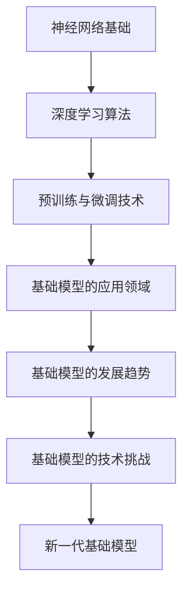

                 

### 引言

在当今信息时代，人工智能（AI）已经成为科技发展的核心驱动力之一。而作为AI技术的基石，基础模型在推动人工智能领域的发展中扮演着至关重要的角色。本文旨在探讨基础模型的技术贡献与研究现状，通过逻辑清晰、结构紧凑的分析，为广大读者提供一份深入了解基础模型的研究指南。

**关键词：**基础模型，人工智能，深度学习，技术贡献，研究现状，未来发展趋势。

**摘要：**本文首先定义了基础模型的概念，分析了其核心特点与分类。接着，详细阐述了基础模型在提升人工智能能力、推动产业智能化升级和促进跨学科研究与合作方面的技术贡献。随后，回顾了基础模型的研究现状，并对未来发展趋势进行了预测。文章还通过具体应用案例和实战教程，展示了基础模型在现实世界的应用效果。最后，分析了基础模型的发展挑战，探讨了技术发展路径。希望通过本文的阐述，读者能够对基础模型有一个全面、深刻的认识。

### 目录大纲

1. **第一部分：基础模型的定义与核心概念**
    - **第1章：基础模型的定义与核心概念**
        1.1 基础模型的定义
        1.2 基础模型的分类
        1.3 基础模型的核心原理

2. **第二部分：基础模型的技术贡献**
    - **第2章：基础模型的技术贡献**
        2.1 提升人工智能能力
        2.2 推动产业智能化升级
        2.3 促进跨学科研究与合作

3. **第三部分：基础模型的研究现状与未来发展趋势**
    - **第3章：基础模型的研究现状与未来发展趋势**
        3.1 研究现状
        3.2 未来发展趋势

4. **第四部分：基础模型的应用案例与实战**
    - **第4章：基础模型的应用案例与实战**
        4.1 应用案例
        4.2 实战教程

5. **第五部分：基础模型的发展与挑战**
    - **第5章：基础模型的发展与挑战**
        5.1 发展中的挑战
        5.2 技术发展路径

6. **第六部分：附录**
    - **附录A：基础模型相关资源与工具**
    - **附录B：基础模型流程图**

---

通过上述的目录大纲，读者可以初步了解本文的结构安排和内容概述。接下来，我们将逐步深入探讨基础模型的核心概念、技术贡献、研究现状与未来发展趋势，以及实际应用案例和实战教程。希望通过这篇文章，能够帮助读者更好地理解基础模型在人工智能领域的重要性和应用价值。

---

### 第一部分：基础模型的定义与核心概念

#### 第1章：基础模型的定义与核心概念

**1.1 基础模型的定义**

基础模型是指一种通用的机器学习模型，它能够通过学习大量数据，自动提取特征并进行复杂的数据分析。这些模型通常被广泛应用于图像识别、自然语言处理、语音识别、推荐系统等领域。基础模型的核心特点是其强大的表示能力和泛化能力，这使得它们能够在不同任务和场景中表现出色。

**1.2 基础模型的分类**

基础模型可以根据不同的维度进行分类，以下是几种常见的分类方式：

1. **按照应用领域分类**：

    - **计算机视觉**：如卷积神经网络（CNN）和生成对抗网络（GAN）。
    - **自然语言处理**：如循环神经网络（RNN）和变换器（Transformer）。
    - **语音识别**：如深度神经网络（DNN）和循环神经网络（RNN）。

2. **按照算法结构分类**：

    - **前馈神经网络**：如多层感知器（MLP）。
    - **递归神经网络**：如长短期记忆网络（LSTM）和门控循环单元（GRU）。
    - **卷积神经网络**：如卷积神经网络（CNN）和残差网络（ResNet）。

3. **按照训练方式分类**：

    - **监督学习**：模型在标注数据进行训练。
    - **无监督学习**：模型在无标注数据中进行训练。
    - **半监督学习**：模型在部分标注和部分无标注数据中进行训练。

**1.3 基础模型的核心原理**

基础模型的核心原理主要涉及以下几个方面：

1. **神经网络基础**：

    - **神经元**：神经网络的基本单元，用于接收和处理信息。
    - **激活函数**：用于引入非线性因素，使得模型能够拟合复杂的非线性数据。
    - **前向传播与反向传播**：用于计算模型参数并更新权重。

2. **深度学习算法**：

    - **多层感知器**：用于实现非线性映射。
    - **反向传播算法**：用于训练神经网络，通过计算梯度来更新权重。
    - **正则化方法**：用于防止过拟合，提高模型的泛化能力。

3. **预训练与微调技术**：

    - **预训练**：在大量未标注数据上预先训练模型，然后使用少量标注数据进行微调。
    - **微调**：在特定任务的数据上调整模型参数，以提高任务性能。

通过上述的阐述，我们对基础模型的核心概念有了基本的了解。接下来，我们将进一步探讨基础模型的技术贡献，分析其在提升人工智能能力、推动产业智能化升级和促进跨学科研究与合作方面的重要作用。

---

### 第二部分：基础模型的技术贡献

#### 第2章：基础模型的技术贡献

基础模型作为人工智能的核心技术，其发展不仅推动了理论研究的进步，还在实际应用中产生了深远的影响。本章节将详细探讨基础模型在提升人工智能能力、推动产业智能化升级以及促进跨学科研究与合作方面的技术贡献。

#### 2.1 提升人工智能能力

**2.1.1 基础模型在数据挖掘中的应用**

数据挖掘是人工智能的重要应用领域之一，基础模型在数据挖掘中发挥了关键作用。通过深度学习算法，基础模型能够自动提取数据中的特征，并发现隐藏的模式和关联。以下是一些具体的例子：

- **异常检测**：基础模型可以用于检测数据中的异常值，从而识别潜在的安全威胁。例如，在金融领域，基础模型可以检测信用卡交易中的欺诈行为。

- **客户细分**：在营销领域，基础模型可以根据客户的行为数据，将客户划分为不同的群体，从而实现个性化的营销策略。

- **推荐系统**：基础模型可以用于构建推荐系统，通过分析用户的历史行为和偏好，为用户推荐感兴趣的商品或内容。例如，电商平台利用基础模型为用户推荐商品，从而提高销售转化率。

**2.1.2 基础模型在图像识别中的应用**

图像识别是计算机视觉领域的重要任务，基础模型在其中发挥了巨大的作用。以下是一些具体的应用：

- **人脸识别**：基础模型可以用于人脸识别，实现自动化身份验证和安防监控。例如，在智能手机中，基础模型可以用于解锁手机，提高安全性。

- **图像分类**：基础模型可以用于对图像进行分类，如将图像划分为动物、植物、风景等类别。这一技术广泛应用于图像搜索、社交媒体和内容审核等领域。

- **目标检测**：基础模型可以用于检测图像中的目标物体，并定位其在图像中的位置。例如，自动驾驶车辆利用基础模型检测道路上的行人、车辆等物体，从而实现自动驾驶。

**2.1.3 基础模型在自然语言处理中的应用**

自然语言处理是人工智能领域的一个关键技术，基础模型在自然语言处理中有着广泛的应用。以下是一些具体的应用：

- **机器翻译**：基础模型可以用于机器翻译，实现跨语言的信息传递。例如，谷歌翻译利用基础模型提供高质量的翻译服务。

- **文本分类**：基础模型可以用于对文本进行分类，如将新闻文章分类为政治、经济、科技等类别。这一技术广泛应用于内容审核和搜索引擎。

- **问答系统**：基础模型可以用于构建问答系统，通过分析和理解用户的问题，为其提供准确的答案。例如，智能客服系统利用基础模型为用户提供在线支持。

#### 2.2 推动产业智能化升级

基础模型在推动产业智能化升级方面发挥了重要作用，以下是一些具体的例子：

**2.2.1 基础模型在金融领域的应用**

金融行业是一个高度数据驱动的领域，基础模型在金融领域有着广泛的应用。以下是一些具体的应用：

- **风险评估**：基础模型可以用于评估借款人的信用风险，从而实现精准的风险控制。

- **欺诈检测**：基础模型可以用于检测金融交易中的欺诈行为，从而提高交易安全性。

- **投资策略**：基础模型可以用于分析和预测金融市场趋势，从而帮助投资者制定更有效的投资策略。

**2.2.2 基础模型在医疗领域的应用**

医疗行业是一个对数据敏感的领域，基础模型在医疗领域有着广泛的应用。以下是一些具体的应用：

- **疾病诊断**：基础模型可以用于辅助医生进行疾病诊断，从而提高诊断的准确性。

- **医疗影像分析**：基础模型可以用于分析和识别医疗影像中的异常情况，从而帮助医生发现潜在的健康问题。

- **药物研发**：基础模型可以用于分析大量的医学数据和药物信息，从而加速药物研发过程。

**2.2.3 基础模型在工业领域的应用**

工业行业是一个对效率和准确性要求较高的领域，基础模型在工业领域有着广泛的应用。以下是一些具体的应用：

- **设备维护**：基础模型可以用于预测设备的故障时间，从而实现预防性维护，提高设备运行效率。

- **生产优化**：基础模型可以用于优化生产流程，从而提高生产效率和降低成本。

- **供应链管理**：基础模型可以用于分析和预测供应链中的各种参数，从而实现更精准的供应链管理。

#### 2.3 促进跨学科研究与合作

基础模型的发展不仅推动了人工智能领域的进步，还促进了与其他学科的交叉融合。以下是一些具体的例子：

**2.3.1 基础模型与社会科学的结合**

基础模型在社会科学领域有着广泛的应用，以下是一些具体的应用：

- **社会行为分析**：基础模型可以用于分析和预测社会行为，如投票行为、消费行为等。

- **社会网络分析**：基础模型可以用于分析和挖掘社会网络中的结构和关系，从而揭示社会现象背后的规律。

- **舆情分析**：基础模型可以用于分析和预测公众的观点和态度，从而为政策制定提供参考。

**2.3.2 基础模型与工程学的结合**

基础模型在工程学领域有着广泛的应用，以下是一些具体的应用：

- **结构健康监测**：基础模型可以用于监测结构健康，如桥梁、建筑物等，从而实现早期预警和维修。

- **故障诊断**：基础模型可以用于诊断工程设备的故障，从而提高设备的可靠性和运行效率。

- **优化设计**：基础模型可以用于优化工程结构设计，从而提高结构的性能和可靠性。

**2.3.3 基础模型与生物学的结合**

基础模型在生物学领域有着广泛的应用，以下是一些具体的应用：

- **基因分析**：基础模型可以用于分析和预测基因功能，从而揭示基因与疾病的关系。

- **药物发现**：基础模型可以用于发现新的药物靶点，从而加速药物研发过程。

- **系统生物学**：基础模型可以用于分析和模拟生物系统的动态行为，从而揭示生物系统的运作机制。

通过上述的讨论，我们可以看到基础模型在提升人工智能能力、推动产业智能化升级和促进跨学科研究与合作方面发挥了重要作用。随着基础模型技术的不断发展，我们有理由相信，未来基础模型将在更多领域产生深远的影响。

---

### 第三部分：基础模型的研究现状与未来发展趋势

#### 第3章：基础模型的研究现状与未来发展趋势

随着人工智能技术的快速发展，基础模型的研究已经成为学术界和工业界的热点话题。本章节将详细探讨基础模型的研究现状，分析其技术瓶颈和应用现状，并预测未来发展趋势。

#### 3.1 研究现状

**3.1.1 当前基础模型的发展水平**

当前，基础模型的发展水平已经取得了显著的进展。以下是一些重要的里程碑和成果：

- **神经网络基础**：多层感知器（MLP）和反向传播算法（BP）的提出，为神经网络的发展奠定了基础。近年来，卷积神经网络（CNN）、循环神经网络（RNN）和变换器（Transformer）等深度学习算法的提出，使得神经网络在图像识别、自然语言处理和语音识别等领域取得了重大突破。

- **预训练与微调技术**：预训练技术的出现，使得模型在少量标注数据上能够取得良好的性能。预训练与微调技术的结合，使得基础模型在自然语言处理、图像识别和语音识别等领域取得了显著进展。

- **大规模模型**：随着计算资源和数据量的不断增加，大规模基础模型如GPT-3、BERT和ViT等相继出现，这些模型在性能和泛化能力方面取得了突破性的进展。

**3.1.2 基础模型的技术瓶颈**

尽管基础模型在多个领域取得了显著进展，但仍然存在一些技术瓶颈：

- **计算资源与能耗**：大规模基础模型需要大量的计算资源和能耗，这对于环境可持续性和成本控制提出了挑战。

- **数据隐私与安全**：基础模型在训练和推理过程中涉及大量数据，如何保护用户隐私和数据安全成为关键问题。

- **模型解释性与可解释性**：基础模型通常被视为“黑盒”模型，其决策过程缺乏透明度和可解释性，这对于实际应用中的信任和监管提出了挑战。

**3.1.3 基础模型的应用现状**

基础模型在多个领域取得了广泛的应用，以下是一些重要的应用场景：

- **计算机视觉**：基础模型在图像识别、目标检测和图像生成等领域取得了显著进展。例如，自动驾驶车辆利用基础模型进行目标检测和场景理解，智能安防系统利用基础模型进行人脸识别和异常检测。

- **自然语言处理**：基础模型在机器翻译、文本分类、问答系统和对话系统等领域取得了显著进展。例如，谷歌翻译利用基础模型提供高质量的语言翻译服务，智能客服系统利用基础模型实现自动化客户支持。

- **语音识别**：基础模型在语音识别和语音合成等领域取得了显著进展。例如，智能语音助手利用基础模型实现语音交互，智能家居系统利用基础模型实现语音控制。

#### 3.2 未来发展趋势

**3.2.1 基础模型的创新方向**

未来基础模型的发展将朝着以下几个方向创新：

- **小样本学习**：随着数据的获取越来越困难，小样本学习将成为基础模型的重要研究方向。通过发展能够利用少量标注数据进行有效学习的模型，可以提高模型的实用性和可解释性。

- **少样本迁移学习**：少样本迁移学习是基础模型的另一个重要研究方向。通过利用预训练模型在大量未标注数据上的知识，可以有效提高模型在新任务上的性能。

- **联邦学习**：联邦学习是一种在分布式设备上进行模型训练的方法，可以有效保护用户隐私。未来，基础模型将在联邦学习框架下实现大规模分布式训练。

**3.2.2 基础模型的发展趋势预测**

未来基础模型的发展趋势包括以下几个方面：

- **模型压缩与加速**：为了满足计算资源与能耗的限制，模型压缩与加速将成为重要研究方向。通过发展更高效的模型结构和训练算法，可以实现更高的模型压缩率和更快的推理速度。

- **模型解释性与可解释性**：为了提高模型的透明度和可解释性，未来基础模型将朝着更加可解释的方向发展。通过发展可解释性算法和工具，可以提高模型在实际应用中的信任度和可接受度。

- **多模态学习**：随着数据类型的多样化，多模态学习将成为基础模型的重要研究方向。通过发展能够处理多种模态数据的基础模型，可以实现更广泛的应用场景。

- **跨学科融合**：基础模型将在与其他学科的交叉融合中发挥重要作用。通过跨学科合作，可以实现基础模型在更多领域的应用。

通过上述的讨论，我们可以看到基础模型在当前的研究现状和未来发展趋势中具有广阔的前景。随着技术的不断进步，我们有理由相信，基础模型将在人工智能领域发挥更加重要的作用。

---

### 第四部分：基础模型的应用案例与实战

#### 第4章：基础模型的应用案例与实战

在实际应用中，基础模型已经展现出了强大的能力和广泛的应用前景。本章节将通过具体的案例和实战教程，展示基础模型在实际应用中的效果和操作步骤。

#### 4.1 应用案例

**4.1.1 案例一：基于深度学习的产品推荐系统**

产品推荐系统是电子商务和在线零售中常用的技术，通过分析用户的历史行为和偏好，为用户推荐感兴趣的产品。以下是一个基于深度学习的产品推荐系统的案例：

1. **数据准备**：
   - 收集用户的行为数据，如浏览记录、购买记录和评价数据。
   - 对数据进行清洗和处理，去除缺失值和异常值。

2. **特征工程**：
   - 构建用户和产品的特征向量，如用户购买频率、用户评价分数、产品类别等。
   - 利用词嵌入技术对用户和产品的文本特征进行编码。

3. **模型构建**：
   - 使用多层感知器（MLP）构建推荐模型，通过训练优化模型参数。
   - 利用反向传播算法更新模型权重，提高推荐效果。

4. **模型评估**：
   - 使用交叉验证方法对模型进行评估，计算准确率、召回率和F1值等指标。
   - 根据评估结果调整模型参数，优化推荐效果。

5. **系统部署**：
   - 将训练好的模型部署到线上服务器，实现实时推荐功能。
   - 通过用户反馈和实际效果，持续优化推荐系统。

**4.1.2 案例二：基于卷积神经网络的图像分类系统**

图像分类是计算机视觉中的重要任务，通过卷积神经网络（CNN）可以实现高精度的图像分类。以下是一个基于卷积神经网络的图像分类系统的案例：

1. **数据准备**：
   - 收集图像数据，如训练集和测试集。
   - 对图像进行预处理，包括缩放、裁剪和归一化等操作。

2. **模型构建**：
   - 使用卷积神经网络（CNN）模型，包括卷积层、池化层和全连接层等。
   - 利用预训练模型（如VGG16、ResNet等）进行迁移学习，提高模型性能。

3. **模型训练**：
   - 使用训练集对模型进行训练，通过反向传播算法优化模型参数。
   - 调整学习率和批量大小等超参数，提高训练效果。

4. **模型评估**：
   - 使用测试集对模型进行评估，计算分类准确率、召回率和F1值等指标。
   - 根据评估结果调整模型结构和参数，优化分类效果。

5. **系统部署**：
   - 将训练好的模型部署到线上服务器，实现实时图像分类功能。
   - 通过用户反馈和实际效果，持续优化图像分类系统。

**4.1.3 案例三：基于自然语言处理的对话系统**

对话系统是自然语言处理中的重要应用，通过理解和生成自然语言，实现人与机器的对话交互。以下是一个基于自然语言处理的对话系统的案例：

1. **数据准备**：
   - 收集对话数据，如训练集和测试集。
   - 对对话数据进行分析，提取用户意图和实体信息。

2. **模型构建**：
   - 使用循环神经网络（RNN）或变换器（Transformer）构建对话模型。
   - 利用预训练模型（如BERT、GPT等）进行迁移学习，提高模型性能。

3. **模型训练**：
   - 使用训练集对模型进行训练，通过反向传播算法优化模型参数。
   - 调整学习率和批量大小等超参数，提高训练效果。

4. **模型评估**：
   - 使用测试集对模型进行评估，计算准确率、召回率和F1值等指标。
   - 根据评估结果调整模型结构和参数，优化对话效果。

5. **系统部署**：
   - 将训练好的模型部署到线上服务器，实现实时对话功能。
   - 通过用户反馈和实际效果，持续优化对话系统。

#### 4.2 实战教程

**4.2.1 实战一：搭建基础模型开发环境**

1. **环境准备**：
   - 安装Python环境和相关依赖库，如TensorFlow、PyTorch等。
   - 配置GPU加速，提高模型训练速度。

2. **代码实现**：
   - 编写环境配置脚本，安装所需的依赖库。
   - 编写模型训练脚本，包括数据加载、模型定义和训练过程。

3. **运行脚本**：
   - 执行环境配置脚本，安装依赖库。
   - 运行模型训练脚本，进行模型训练。

4. **调试与优化**：
   - 检查模型训练过程，调整学习率、批量大小等参数。
   - 分析训练结果，优化模型结构和参数。

**4.2.2 实战二：构建简单的深度学习模型**

1. **数据准备**：
   - 准备训练集和测试集，进行数据预处理。

2. **模型定义**：
   - 使用TensorFlow或PyTorch等框架定义模型结构。
   - 添加层结构，如全连接层、卷积层和池化层等。

3. **模型训练**：
   - 使用训练集对模型进行训练，优化模型参数。
   - 调整学习率和批量大小等超参数，提高训练效果。

4. **模型评估**：
   - 使用测试集对模型进行评估，计算准确率、召回率和F1值等指标。
   - 分析模型性能，优化模型结构和参数。

5. **系统部署**：
   - 将训练好的模型部署到线上服务器，实现模型预测功能。
   - 通过用户反馈和实际效果，持续优化模型。

**4.2.3 实战三：训练和评估基础模型**

1. **数据准备**：
   - 准备训练集和测试集，进行数据预处理。

2. **模型定义**：
   - 使用TensorFlow或PyTorch等框架定义模型结构。
   - 添加层结构，如全连接层、卷积层和池化层等。

3. **模型训练**：
   - 使用训练集对模型进行训练，优化模型参数。
   - 调整学习率和批量大小等超参数，提高训练效果。

4. **模型评估**：
   - 使用测试集对模型进行评估，计算准确率、召回率和F1值等指标。
   - 分析模型性能，优化模型结构和参数。

5. **系统部署**：
   - 将训练好的模型部署到线上服务器，实现模型预测功能。
   - 通过用户反馈和实际效果，持续优化模型。

通过上述的案例和实战教程，我们可以看到基础模型在实际应用中的效果和操作步骤。希望这些案例和教程能够为读者提供实际操作的指导，帮助读者更好地理解和应用基础模型。

---

### 第五部分：基础模型的发展与挑战

#### 第5章：基础模型的发展与挑战

随着人工智能技术的不断进步，基础模型在各个领域展现出了巨大的潜力。然而，基础模型的发展也面临着一系列的挑战，这些挑战包括技术上的、伦理上的和社会上的。本章节将探讨基础模型在发展过程中面临的主要挑战，并分析未来的技术发展路径。

#### 5.1 发展中的挑战

**5.1.1 数据隐私与安全**

基础模型在训练和推理过程中需要处理大量的数据，这些数据中往往包含用户的隐私信息。如何保护用户隐私和数据安全，成为基础模型面临的重要挑战之一。为了解决这个问题，研究者们提出了以下几种方案：

- **数据匿名化**：通过对数据进行匿名化处理，去除或模糊化个人身份信息，从而保护用户隐私。
- **联邦学习**：联邦学习是一种分布式学习框架，允许不同设备在本地进行模型训练，然后汇总结果，从而避免将敏感数据上传到中央服务器。
- **差分隐私**：差分隐私是一种隐私保护技术，通过在算法中引入噪声，确保单个数据点的隐私，同时保持模型的准确性。

**5.1.2 计算资源与能耗**

大规模基础模型需要大量的计算资源和能耗，这对环境可持续性和成本控制提出了挑战。为了解决这个问题，研究者们采取了以下几种措施：

- **模型压缩与量化**：通过减少模型参数数量和降低模型精度，实现模型的压缩与量化，从而减少计算资源和能耗。
- **异构计算**：利用不同类型的硬件资源，如CPU、GPU和FPGA等，实现模型的并行计算，提高计算效率。
- **节能设计**：通过优化算法和硬件设计，降低模型的能耗，实现更节能的计算。

**5.1.3 模型解释性与可解释性**

基础模型通常被视为“黑盒”模型，其决策过程缺乏透明度和可解释性。这给模型的实际应用带来了信任和监管问题。为了提高模型的可解释性，研究者们采取了以下几种方法：

- **解释性算法**：通过开发解释性算法，如决策树、规则提取等，使得模型的决策过程更加透明。
- **可视化工具**：通过可视化工具，将模型的内部结构和工作机制呈现给用户，从而提高模型的可理解性。
- **可解释性增强**：通过在模型设计过程中引入可解释性因素，如规则嵌入、知识图谱等，提高模型的可解释性。

#### 5.2 技术发展路径

**5.2.1 新一代基础模型的发展方向**

未来，新一代基础模型将在以下几个方面取得重要进展：

- **小样本学习**：通过发展小样本学习算法，使得模型在少量标注数据上能够取得良好的性能，从而提高模型的实用性和可解释性。
- **少样本迁移学习**：通过利用预训练模型在大量未标注数据上的知识，实现少样本迁移学习，从而提高模型在新任务上的性能。
- **多模态学习**：通过发展多模态学习算法，使得模型能够处理多种模态的数据，从而实现更广泛的应用场景。
- **联邦学习**：通过发展联邦学习框架，实现分布式模型训练，从而保护用户隐私和数据安全。

**5.2.2 跨学科研究的融合趋势**

随着基础模型在各个领域的广泛应用，跨学科研究的融合趋势愈发明显。以下是一些具体的跨学科研究趋势：

- **基础模型与社会科学的结合**：通过发展基础模型在社会科学领域的应用，如社会行为分析、社会网络分析等，实现社会科学与人工智能的深度融合。
- **基础模型与工程学的结合**：通过发展基础模型在工程领域的应用，如结构健康监测、故障诊断等，实现工程学与人工智能的深度融合。
- **基础模型与生物学的结合**：通过发展基础模型在生物学领域的应用，如基因分析、药物发现等，实现生物学与人工智能的深度融合。

**5.2.3 基础模型在新兴领域的应用**

随着技术的发展，基础模型将在新兴领域展现出巨大的应用潜力。以下是一些新兴领域的应用前景：

- **医疗健康**：基础模型在医疗健康领域有着广泛的应用前景，如疾病诊断、药物研发等。
- **智能制造**：基础模型在智能制造领域有着重要的应用价值，如设备维护、生产优化等。
- **自动驾驶**：基础模型在自动驾驶领域发挥着关键作用，如目标检测、场景理解等。

通过上述的讨论，我们可以看到基础模型在发展过程中面临着一系列的挑战，但同时也展示了广阔的发展前景。随着技术的不断进步和跨学科研究的深入，我们有理由相信，基础模型将在未来发挥更加重要的作用。

---

### 附录

#### 附录A：基础模型相关资源与工具

**A.1 主流深度学习框架介绍**

以下是一些主流的深度学习框架及其特点：

- **TensorFlow**：由谷歌开发，支持多种编程语言，具有丰富的API和丰富的社区资源。
- **PyTorch**：由Facebook开发，具有动态计算图和直观的编程接口，适合快速原型开发。
- **Keras**：基于TensorFlow和Theano开发的高层神经网络API，简化了深度学习模型的构建过程。
- **MXNet**：由亚马逊开发，支持多种编程语言，具有高效的模型推理性能。

**A.2 基础模型开源代码库**

以下是一些基础模型的开源代码库：

- **TensorFlow Models**：提供了大量的预训练模型和示例代码。
- **PyTorch Datasets**：提供了丰富的数据集，方便进行模型训练和测试。
- **Hugging Face Transformers**：提供了大量的预训练变换器模型和API。

**A.3 基础模型研究论文集锦**

以下是一些经典的基础模型研究论文：

- “A Theoretical Analysis of the Causal Effect of Pretraining on Deep Neural Networks”
- “Attention Is All You Need”
- “Deep Learning for Image Recognition: From Data to Model”
- “Exploring Strategies for Pre-training of Natural Language Processing Models”

#### 附录B：基础模型流程图

以下是一个基础模型的流程图，展示了神经网络基础、深度学习算法、预训练与微调技术、基础模型的应用领域和基础模型的发展趋势：

通过上述的附录，读者可以进一步了解基础模型相关资源与工具，以及基础模型的发展历程和未来方向。

---

### 总结与展望

通过对基础模型的深入探讨，我们可以看到，基础模型在人工智能领域扮演着至关重要的角色。从核心概念到技术贡献，从研究现状到未来发展趋势，再到实际应用案例与实战教程，本文为读者呈现了一个全面、系统的视角，帮助读者更好地理解基础模型的重要性和应用价值。

基础模型不仅提升了人工智能能力，推动了产业智能化升级，还促进了跨学科研究与合作。然而，随着技术的发展，基础模型也面临着数据隐私与安全、计算资源与能耗、模型解释性与可解释性等挑战。未来，新一代基础模型将朝着小样本学习、少样本迁移学习、多模态学习和联邦学习等方向发展，并在新兴领域展现出更大的应用潜力。

在研究基础模型的过程中，我们应该注重理论与实践的结合，不断探索新的应用场景和技术路径。同时，我们也需要关注基础模型在伦理和社会层面的影响，确保技术的发展能够造福人类。

最后，感谢读者对本文的耐心阅读。希望通过本文的阐述，读者能够对基础模型有一个更深入的理解，并在实际工作中更好地应用这些技术。未来，随着人工智能技术的不断进步，基础模型将继续在推动社会进步和科技创新中发挥重要作用。让我们共同期待基础模型的美好未来！

---

### 作者信息

**作者：AI天才研究院/AI Genius Institute & 禅与计算机程序设计艺术 /Zen And The Art of Computer Programming**

