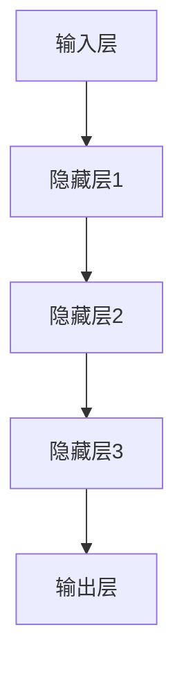
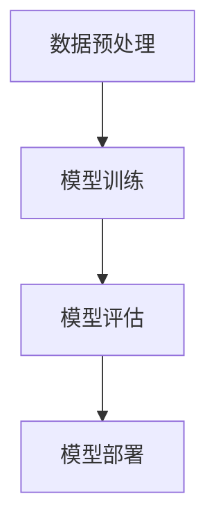

                 

# 基础模型的社会影响评估

> **关键词：** 基础模型、社会影响、算法评估、应用场景、公平性、透明性、偏见、歧视、政策、法规、公众参与。
>
> **摘要：** 本文章系统地探讨了基础模型的社会影响评估，包括基础模型的概述与原理、社会影响评估的方法与关键因素、实际案例研究和未来展望。通过深入分析和详实案例，本文旨在为人工智能在社会中的应用提供有力的理论支持和实践指导。

---

## 第一部分：基础模型概述与社会影响

### 第1章：基础模型概述与基本原理

#### 1.1 基础模型定义

基础模型（Fundamental Model）是指用于解决特定问题或执行特定任务的基本算法结构。在人工智能领域，基础模型通常是指那些被广泛接受和应用的、具有通用性的模型，例如深度神经网络、决策树、支持向量机等。

#### 1.2 基础模型的组成与架构

基础模型的组成通常包括以下部分：

- **输入层**：接收外部输入数据，如文本、图像、声音等。
- **隐藏层**：对输入数据进行处理和转换，提取特征信息。
- **输出层**：根据隐藏层输出的特征，生成预测结果或决策。

其架构示意图如下：



#### 1.3 基础模型的工作原理

基础模型的工作原理主要包括以下几个步骤：

1. **数据预处理**：对输入数据进行标准化、归一化等处理，使其符合模型的输入要求。
2. **模型训练**：使用已标注的数据集，通过迭代计算和优化，使模型能够学习和预测未知数据。
3. **模型评估**：使用测试集对模型进行评估，计算模型的准确率、召回率、F1值等指标。
4. **模型部署**：将训练好的模型部署到实际应用环境中，执行预测或决策任务。

其工作原理的流程图如下：



### 第2章：基础模型的数学模型与算法原理

#### 2.1 数学模型概述

基础模型的数学模型通常包括以下部分：

- **激活函数**：用于转换神经元的输入和输出，常见的激活函数包括Sigmoid、ReLU等。
- **损失函数**：用于衡量模型预测结果和真实值之间的差距，常见的损失函数包括均方误差（MSE）、交叉熵（Cross-Entropy）等。
- **优化算法**：用于更新模型参数，常见的优化算法包括梯度下降（Gradient Descent）、Adam等。

#### 2.2 算法原理讲解

以深度神经网络（DNN）为例，其算法原理主要包括以下几个步骤：

1. **初始化参数**：随机初始化模型参数。
2. **前向传播**：根据输入数据和参数，计算输出结果。
3. **反向传播**：计算梯度，更新模型参数。
4. **迭代优化**：重复前向传播和反向传播，直到模型收敛。

以下是一个简单的DNN算法原理的伪代码：

```python
# 初始化参数
W1, b1 = initialize_parameters()

while not converged:
    # 前向传播
    Z2 = X * W1 + b1
    A2 = sigmoid(Z2)

    # 反向传播
    dZ2 = A2 - Y
    dW1 = (1/m) * dZ2 * X.T
    db1 = (1/m) * dZ2

    # 更新参数
    W1 = W1 - learning_rate * dW1
    b1 = b1 - learning_rate * db1
```

#### 2.3 伪代码阐述

以下是一个简单的线性回归模型的伪代码，用于预测房屋价格：

```python
# 初始化参数
theta = initialize_parameters()

while not converged:
    # 前向传播
    h = X * theta
    
    # 计算损失
    loss = (1/2*m) * sum((h - y)**2)
    
    # 反向传播
    dtheta = (1/m) * X.T * (h - y)
    
    # 更新参数
    theta = theta - learning_rate * dtheta
```

### 第3章：基础模型在社会中的应用场景

#### 3.1 社会应用概述

基础模型在社会中的应用场景非常广泛，涵盖了金融、医疗、教育、交通等多个领域。以下是一些典型的应用场景：

- **金融**：风险控制、信用评估、投资决策等。
- **医疗**：疾病预测、诊断辅助、药物研发等。
- **教育**：个性化学习、考试评分、招生推荐等。
- **交通**：路况预测、交通流量优化、自动驾驶等。

#### 3.2 社会应用场景分析

以金融领域的信用评估为例，基础模型可以用于预测个人的信用风险，帮助金融机构做出更准确的贷款决策。以下是一个简单的信用评估模型的分析：

1. **数据收集**：收集借款人的基本信息、信用记录、财务状况等数据。
2. **数据预处理**：对数据进行清洗、标准化等处理，使其符合模型输入要求。
3. **模型训练**：使用训练集数据，通过迭代计算和优化，训练信用评估模型。
4. **模型评估**：使用测试集数据，对模型进行评估，计算模型的准确率、召回率等指标。
5. **模型部署**：将训练好的模型部署到实际应用环境中，对新的借款人进行信用评估。

#### 3.3 案例研究

以谷歌的自动驾驶汽车项目为例，该项目使用了深度神经网络模型进行路况预测和决策。以下是一个简单的案例研究：

1. **数据收集**：收集自动驾驶汽车在不同路况下的数据，包括道路标记、车辆位置、车速等。
2. **数据预处理**：对数据进行清洗、标准化等处理，使其符合模型输入要求。
3. **模型训练**：使用训练集数据，通过迭代计算和优化，训练路况预测模型。
4. **模型评估**：使用测试集数据，对模型进行评估，计算模型的准确率、召回率等指标。
5. **模型部署**：将训练好的模型部署到自动驾驶汽车中，实现自动路况预测和决策。

## 第二部分：社会影响评估

### 第4章：社会影响评估概述

#### 4.1 社会影响评估的意义

社会影响评估（Social Impact Assessment，SIA）是指对基础模型在社会中的应用可能带来的正面和负面影响的系统性和评估。其意义主要体现在以下几个方面：

- **提高模型透明度**：通过评估，使模型的应用过程和决策结果更加透明，提高公众对模型的信任度。
- **优化模型设计**：通过评估，发现模型存在的潜在问题和不足，为模型优化提供依据。
- **降低社会风险**：通过评估，预测模型应用可能带来的负面社会影响，采取相应的预防和应对措施。

#### 4.2 社会影响评估的方法

社会影响评估的方法主要包括定量分析和定性分析两种。

- **定量分析**：通过数据分析和统计方法，对模型的影响进行量化评估，如计算模型预测的准确率、召回率等指标。
- **定性分析**：通过访谈、调查等方法，对模型的影响进行定性描述，如分析模型可能带来的社会偏见、歧视等问题。

#### 4.3 社会影响评估的工具

社会影响评估的工具主要包括以下几种：

- **风险评估模型**：如SWOT分析（Strengths, Weaknesses, Opportunities, Threats）、PEST分析（Political, Economic, Social, Technological）等。
- **社会影响评估软件**：如SIAware、SIApro等，用于自动化地生成评估报告。
- **数据分析工具**：如Python、R等，用于进行定量分析。

### 第5章：社会影响评估的关键因素

#### 5.1 数据质量与可信度

数据质量是影响社会影响评估结果的关键因素之一。高质量的数据应具备以下特点：

- **准确性**：数据应真实、可靠，无错误和遗漏。
- **完整性**：数据应覆盖全面，无缺失。
- **一致性**：数据应在时间、空间等方面保持一致性。

#### 5.2 模型公平性与透明性

模型公平性与透明性是确保模型应用不产生歧视和偏见的重要保障。评估模型公平性与透明性的关键因素包括：

- **偏见检测**：评估模型是否存在性别、种族、年龄等偏见。
- **透明度评估**：评估模型决策过程是否公开、可解释。

#### 5.3 模型偏见与歧视

模型偏见与歧视是指模型在应用过程中，由于数据、算法等原因，导致对某些群体产生不公平对待的现象。评估模型偏见与歧视的关键因素包括：

- **数据偏见**：数据中存在的偏见会影响模型的学习和预测。
- **算法偏见**：算法设计不当可能导致模型产生偏见。
- **决策偏见**：模型决策过程中可能存在歧视现象。

### 第6章：社会影响评估案例研究

#### 6.1 案例一：招聘歧视评估

招聘歧视评估是指评估招聘模型是否对某些群体存在歧视。以下是一个简单的案例：

1. **数据收集**：收集公司的招聘数据，包括申请者的性别、种族、年龄等信息。
2. **数据预处理**：对数据进行清洗、标准化等处理。
3. **模型训练**：使用训练集数据，训练招聘模型。
4. **模型评估**：使用测试集数据，评估模型的公平性和透明性。
5. **模型优化**：根据评估结果，优化模型设计和算法。

#### 6.2 案例二：信贷评估公平性

信贷评估公平性评估是指评估信贷模型是否对某些群体存在歧视。以下是一个简单的案例：

1. **数据收集**：收集银行的信贷数据，包括借款人的性别、种族、收入等信息。
2. **数据预处理**：对数据进行清洗、标准化等处理。
3. **模型训练**：使用训练集数据，训练信贷评估模型。
4. **模型评估**：使用测试集数据，评估模型的公平性和透明性。
5. **模型优化**：根据评估结果，优化模型设计和算法。

#### 6.3 案例三：医疗诊断准确性

医疗诊断准确性评估是指评估医疗诊断模型是否对某些疾病存在歧视。以下是一个简单的案例：

1. **数据收集**：收集医院的患者数据，包括患者的性别、种族、疾病类型等信息。
2. **数据预处理**：对数据进行清洗、标准化等处理。
3. **模型训练**：使用训练集数据，训练医疗诊断模型。
4. **模型评估**：使用测试集数据，评估模型的准确性、召回率等指标。
5. **模型优化**：根据评估结果，优化模型设计和算法。

### 第7章：社会影响评估的策略与措施

#### 7.1 政策与法规制定

政策与法规制定是确保社会影响评估有效实施的重要保障。以下是一些政策与法规制定的策略：

- **明确评估标准**：制定明确的评估标准和流程，确保评估工作的规范性和科学性。
- **法律法规支持**：出台相关的法律法规，对基础模型的应用进行规范和管理。
- **公众参与**：鼓励公众参与评估过程，提高评估结果的公信力。

#### 7.2 技术与工程实践

技术与工程实践是确保社会影响评估有效实施的关键。以下是一些技术与工程实践的策略：

- **数据质量控制**：加强数据质量控制，确保数据质量。
- **算法公平性设计**：设计公平性算法，减少偏见和歧视。
- **透明度提升**：提升模型透明度，提高公众对模型的信任度。

#### 7.3 公众参与与社会反馈

公众参与与社会反馈是确保社会影响评估结果符合公众利益的重要途径。以下是一些公众参与与社会反馈的策略：

- **公众咨询**：在评估过程中，邀请公众参与咨询，听取公众意见。
- **社会调查**：开展社会调查，了解公众对基础模型应用的看法和需求。
- **公众反馈**：建立公众反馈渠道，及时回应公众关切。

### 第8章：未来展望与挑战

#### 8.1 未来发展趋势

未来，基础模型在社会中的应用将更加广泛和深入，对社会的影响也将更加显著。以下是一些未来发展趋势：

- **模型多样化**：随着人工智能技术的发展，将出现更多类型的基础模型，如图神经网络、变压器模型等。
- **跨学科融合**：基础模型将与其他学科（如心理学、社会学、经济学等）相结合，产生新的应用场景。
- **个性化应用**：基础模型将更加注重个性化应用，满足不同群体的需求。

#### 8.2 挑战与机遇

未来，基础模型在社会中的应用将面临一些挑战和机遇：

- **数据隐私保护**：在确保数据质量的同时，如何保护数据隐私是一个重要挑战。
- **算法偏见与歧视**：如何减少算法偏见和歧视，确保模型的公平性，是一个重要挑战。
- **公众接受度**：提高公众对基础模型的接受度和信任度，是一个重要挑战。

然而，这些挑战也带来了机遇：

- **技术创新**：为解决这些挑战，将促进人工智能技术的创新和发展。
- **跨学科合作**：促进跨学科合作，推动基础模型在社会中的应用。
- **政策支持**：政策支持将为基础模型的应用提供有力保障。

### 8.3 社会影响评估的持续发展

社会影响评估的持续发展需要各方共同努力：

- **学术界**：加强对基础模型社会影响的学术研究，为评估提供理论支持。
- **产业界**：积极参与社会影响评估，推动评估工作的实践和应用。
- **政府部门**：制定相关政策和法规，规范基础模型的应用。

通过持续发展，社会影响评估将更好地服务于社会，促进人工智能的健康发展。

---

**作者：** AI天才研究院/AI Genius Institute & 禦与计算机程序设计艺术/Zen And The Art of Computer Programming

