                 

### 增强智能时代：人机协作，提升人类潜能

> **关键词：** 增强智能，人机协作，人工智能，人类潜能，技术趋势

> **摘要：** 随着人工智能技术的迅猛发展，人机协作正逐渐成为现实，人类潜能的提升也迎来了新的机遇。本文将深入探讨增强智能时代的到来，人机协作的原理和实现，以及在教育、工作环境中的应用，最后讨论增强智能对社会与伦理的深远影响，为读者呈现一幅未来人机协作的美好画卷。

### 《增强智能时代：人机协作，提升人类潜能》目录大纲

**第一部分：增强智能时代概述**

- **第1章：增强智能时代的到来**
  - **1.1 增强智能的定义与核心要素**
  - **1.2 人机协作的基本概念**
  - **1.3 增强智能时代的技术发展趋势**
  - **1.4 增强智能对人类社会的影响**

- **第2章：人机协作基础**
  - **2.1 人类认知模型**
    - **2.1.1 认知神经科学基础**
    - **2.1.2 认知模型的应用**
  - **2.2 人工智能的协作能力**
    - **2.2.1 自然语言处理**
    - **2.2.2 计算机视觉**
    - **2.2.3 机器学习**
  - **2.3 人机协作系统架构设计**
    - **2.3.1 系统架构概述**
    - **2.3.2 系统组件与接口设计**
    - **2.3.3 安全性与隐私保护**

**第二部分：人机协作原理**

- **第3章：增强智能在教育中的应用**
  - **3.1 教育领域增强智能的应用实例**
  - **3.2 增强智能在个性化教学中的应用**
  - **3.3 增强智能对教育评价体系的影响**

- **第4章：增强智能在工作环境中的应用**
  - **4.1 提高工作效率的增强智能工具**
  - **4.2 增强智能在团队协作中的应用**
  - **4.3 增强智能对企业管理模式的影响**

**第三部分：提升人类潜能**

- **第5章：人机协作项目设计**
  - **5.1 项目需求分析与设计**
  - **5.2 项目开发与实现**
  - **5.3 项目测试与优化**

- **第6章：人机协作案例解析**
  - **6.1 成功案例分享**
  - **6.2 挑战与解决方案**
  - **6.3 未来发展趋势与展望**

**第四部分：增强智能时代的社会与伦理**

- **第7章：增强智能时代的社会影响**
  - **7.1 增强智能对劳动力市场的影响**
  - **7.2 增强智能对道德和法律的影响**
  - **7.3 增强智能时代的社会治理**

**附录**

- **附录A：增强智能相关资源与工具**
  - **A.1 开源框架与库**
  - **A.2 专业文献与报告**
  - **A.3 在线课程与教程**

---

在接下来的章节中，我们将一步步深入探讨增强智能时代的核心概念、人机协作的实现原理，以及其在各个领域中的应用与影响。希望通过本文的探讨，能够为读者提供有价值的见解和思考。

### 第一部分：增强智能时代概述

#### 第1章：增强智能时代的到来

在当今快速发展的科技时代，人工智能（AI）已经成为引领创新的重要力量。随着深度学习、自然语言处理、计算机视觉等技术的不断突破，人工智能的应用场景越来越广泛，已经逐渐渗透到我们生活的方方面面。然而，随着人工智能技术的不断进步，一个新的概念——增强智能（Augmented Intelligence）也应运而生。

#### 1.1 增强智能的定义与核心要素

增强智能，简称AI，是一种通过人工智能技术来增强人类认知能力、提高工作效率、优化决策过程的技术。与传统的增强技术不同，增强智能不仅仅是通过简单的自动化替代人类工作，而是在人机协作的基础上，利用人工智能技术来扩展和提升人类的智能能力。

增强智能的核心要素主要包括以下几点：

1. **人工智能技术：** 这是增强智能的基础，包括深度学习、自然语言处理、计算机视觉等先进技术，使得计算机能够模仿人类的智能行为。
   
2. **人机协作：** 增强智能的关键在于人与机器的紧密协作。通过人机交互，机器可以更好地理解人类的需求，同时人类也可以利用机器的强大计算能力来辅助决策。

3. **数据驱动：** 增强智能依赖于海量数据的收集与分析，通过数据挖掘和机器学习，机器能够不断优化自身的算法和模型。

4. **个性化定制：** 增强智能强调个性化和定制化服务，根据用户的需求和行为，提供个性化的解决方案。

#### 1.2 人机协作的基本概念

人机协作是指人类与机器系统之间在完成特定任务时进行的互动和协作。这种协作不仅涉及人类与计算机之间的交互，还包括机器系统之间的协同工作。人机协作的核心目标是利用机器的计算能力和人类的专业知识，实现优势互补，提高工作效率和决策质量。

人机协作的基本概念包括以下几点：

1. **分工与合作：** 在人机协作中，人类和机器各自承担不同的任务角色，通过有效的分工和协作，实现整体效率的提升。

2. **信息共享与反馈：** 人机协作需要建立高效的信息共享机制，确保人类和机器能够及时获取所需信息，并互相提供反馈。

3. **决策支持：** 增强智能系统通过分析数据、提供预测和优化建议，为人类决策提供支持。

4. **人机交互：** 人机协作离不开良好的人机交互设计，通过直观、易用的界面，确保人类能够方便地与机器系统进行交互。

#### 1.3 增强智能时代的技术发展趋势

随着人工智能技术的不断发展，增强智能时代的技术发展趋势也日益明显。以下是一些关键趋势：

1. **深度学习的广泛应用：** 深度学习作为人工智能的核心技术之一，其发展速度非常迅猛。在图像识别、自然语言处理、语音识别等领域，深度学习技术已经取得了显著的成果。

2. **云计算与边缘计算的结合：** 云计算为人工智能提供了强大的计算和存储能力，而边缘计算则使得数据处理更加实时、高效。两者的结合将推动增强智能技术的发展。

3. **多模态交互：** 人机协作正在从单一模态（如文本、图像）向多模态（如文本、图像、语音、手势）发展。通过多模态交互，机器能够更全面地理解人类的需求，提供更自然的交互体验。

4. **增强现实与虚拟现实：** 增强现实（AR）和虚拟现实（VR）技术的快速发展，为人机协作提供了全新的交互方式。通过AR和VR技术，人类可以在虚拟环境中与机器系统进行协作，实现沉浸式的交互体验。

5. **自主决策与智能控制：** 随着人工智能技术的进步，机器将具备更强的自主决策和智能控制能力。这不仅将提高机器的效率，还能减少人类的干预，实现更高效的人机协作。

#### 1.4 增强智能对人类社会的影响

增强智能时代的到来，将对人类社会产生深远的影响。以下是增强智能对人类社会的一些重要影响：

1. **生产力提升：** 增强智能技术能够显著提高生产力，通过人机协作，机器能够完成大量重复性、繁琐的工作，人类则可以专注于更高价值的工作。

2. **医疗健康改善：** 在医疗领域，增强智能技术可以用于疾病诊断、药物研发等，提高医疗服务的质量和效率。

3. **教育优化：** 增强智能技术可以用于个性化教学、学习分析等，帮助学生更高效地学习，提高教育质量。

4. **安全监控：** 通过增强智能技术，可以实现更高效的安全监控和预警，提高社会安全水平。

5. **伦理挑战：** 随着增强智能技术的发展，人类将面临一系列伦理挑战，如数据隐私、人工智能决策的透明性等。

通过本文的介绍，我们对增强智能时代的基本概念、技术发展趋势以及对人类社会的影响有了初步的了解。在接下来的章节中，我们将进一步探讨人机协作的原理和实现，以及增强智能在教育、工作环境中的应用。

### 第二部分：人机协作原理

#### 第2章：人机协作基础

在人机协作中，理解人类认知模型和人工智能的协作能力至关重要。这一章节将详细介绍这两个方面，以帮助读者更好地理解人机协作的基本原理。

#### 2.1 人类认知模型

人类认知模型是研究人类思维和认知过程的框架。通过认知模型，我们可以更好地理解人类如何感知、处理信息和做出决策。

**2.1.1 认知神经科学基础**

认知神经科学是研究大脑与认知行为之间关系的一门学科。它结合了神经科学、心理学、计算机科学等领域的知识，试图揭示大脑如何实现认知功能。

1. **神经网络模型**：神经网络模型是认知神经科学中的一种基本模型，它模拟了人脑的神经元结构和功能。通过神经元之间的连接和激活，神经网络可以处理和存储信息。

2. **突触可塑性**：突触可塑性是指神经元之间的连接强度可以随时间改变的现象。这一特性使得人类能够通过学习和经验改变自己的认知能力。

3. **注意力机制**：注意力机制是人类认知过程中的一种关键机制，它决定了我们在某一时刻关注哪些信息。通过注意力机制，人类可以有效地过滤无关信息，集中精力处理重要任务。

**2.1.2 认知模型的应用**

认知模型在多个领域都有应用，其中教育、心理学和人工智能领域尤为突出。

1. **教育**：认知模型可以帮助教育工作者设计更有效的教学策略，根据学生的认知特点进行个性化教学。例如，通过认知模型分析学生的认知能力，可以为他们提供适合的学习资源。

2. **心理学**：认知模型为心理学研究提供了理论基础，帮助心理学家理解人类思维和行为背后的机制。例如，通过认知模型可以解释心理障碍的成因，为治疗提供依据。

3. **人工智能**：认知模型为人工智能领域提供了灵感，使得机器能够模拟人类的认知过程。例如，通过认知模型，人工智能可以理解自然语言、进行图像识别和推理。

#### 2.2 人工智能的协作能力

人工智能的协作能力是确保人机协作顺畅进行的关键。以下是人工智能在三个主要领域的协作能力：

**2.2.1 自然语言处理**

自然语言处理（NLP）是人工智能的重要分支，它使得机器能够理解和生成人类语言。以下是NLP在协作能力方面的几个关键应用：

1. **语音识别**：语音识别技术使得机器能够将人类的语音转化为文本，实现语音交互。例如，智能助手（如Siri、Alexa）通过语音识别技术，可以理解用户的指令并作出相应反应。

2. **文本分析**：文本分析技术可以用于情感分析、话题检测、文本分类等。例如，通过情感分析，企业可以了解消费者的情感倾向，从而制定更有效的营销策略。

3. **对话系统**：对话系统是一种能够与人类进行自然语言交互的计算机系统。例如，智能客服机器人可以通过对话系统为用户提供实时、个性化的服务。

**2.2.2 计算机视觉**

计算机视觉是人工智能的另一个重要分支，它使得机器能够理解和解释视觉信息。以下是计算机视觉在协作能力方面的几个关键应用：

1. **图像识别**：图像识别技术可以用于人脸识别、物体检测、场景分类等。例如，人脸识别技术可以帮助系统识别用户身份，实现智能门禁系统。

2. **物体跟踪**：物体跟踪技术可以用于视频监控、无人驾驶等。例如，无人驾驶汽车通过物体跟踪技术，可以实时检测道路上的行人和车辆，确保行车安全。

3. **增强现实与虚拟现实**：增强现实（AR）和虚拟现实（VR）技术通过计算机视觉，将虚拟信息叠加到现实世界中。例如，AR眼镜可以通过计算机视觉技术，为用户呈现实时、增强的现实信息。

**2.2.3 机器学习**

机器学习是人工智能的核心技术，它使得机器能够从数据中学习并做出决策。以下是机器学习在协作能力方面的几个关键应用：

1. **预测与优化**：机器学习可以用于预测市场趋势、优化生产流程等。例如，通过分析历史数据，机器学习模型可以预测未来的销售趋势，帮助企业制定更有效的销售策略。

2. **分类与聚类**：分类与聚类技术可以用于数据挖掘、用户行为分析等。例如，通过分类技术，企业可以将用户分为不同的群体，为每个群体提供个性化的服务。

3. **异常检测**：异常检测技术可以用于安全监控、金融风控等。例如，通过分析交易数据，机器学习模型可以检测异常交易行为，从而防止欺诈行为。

#### 2.3 人机协作系统架构设计

人机协作系统架构设计是实现人机协作的关键。一个典型的人机协作系统通常包括以下几个组件：

**2.3.1 系统架构概述**

1. **用户接口**：用户接口是人与机器系统之间的交互界面，包括图形用户界面（GUI）、语音识别、手势识别等。通过用户接口，用户可以输入指令、查询信息、获取反馈。

2. **数据处理层**：数据处理层负责收集、存储和处理用户数据。它通常包括数据采集模块、数据存储模块、数据处理模块等。

3. **智能决策层**：智能决策层是系统的核心，它利用人工智能技术分析数据、生成预测和优化建议。智能决策层通常包括机器学习模型、自然语言处理模块、计算机视觉模块等。

4. **执行层**：执行层负责根据智能决策层的建议执行具体的操作。执行层可以包括机器人、自动化系统、智能设备等。

**2.3.2 系统组件与接口设计**

1. **用户接口设计**：用户接口设计应考虑用户的使用习惯、操作便利性和交互体验。例如，设计直观、易用的图形界面，实现自然的语音交互，支持手势识别等。

2. **数据处理层设计**：数据处理层设计应考虑数据的安全性、可靠性和高效性。例如，采用分布式存储系统，确保数据的安全性和可靠性；使用高效的数据处理算法，提高数据处理速度。

3. **智能决策层设计**：智能决策层设计应考虑机器学习模型的准确性、鲁棒性和可解释性。例如，选择合适的机器学习算法，提高模型准确性；采用交叉验证等方法，确保模型鲁棒性；通过可视化工具，提高模型的可解释性。

4. **执行层设计**：执行层设计应考虑系统的灵活性、可靠性和安全性。例如，采用模块化设计，提高系统的灵活性；使用冗余设计和备份机制，确保系统的可靠性；采用安全防护措施，提高系统的安全性。

**2.3.3 安全性与隐私保护**

在人机协作系统中，安全性和隐私保护至关重要。以下是一些关键的安全性和隐私保护措施：

1. **数据加密**：对用户数据进行加密，确保数据在传输和存储过程中的安全性。

2. **访问控制**：实施严格的访问控制策略，确保只有授权用户可以访问敏感数据。

3. **隐私保护**：在数据处理过程中，遵循隐私保护原则，确保用户隐私不被泄露。

4. **安全审计**：定期进行安全审计，检查系统的安全漏洞和风险，确保系统的安全性。

通过本章节的介绍，我们对人机协作的基本原理有了更深入的理解。在下一章节中，我们将探讨增强智能在教育和工作环境中的应用。

### 第3章：增强智能在教育中的应用

随着增强智能技术的发展，教育领域正经历着深刻的变革。增强智能在教育中的应用不仅提升了教学效果，还推动了教育模式的创新。以下将详细探讨增强智能在教育领域的主要应用实例、个性化教学的应用以及其对教育评价体系的影响。

#### 3.1 教育领域增强智能的应用实例

**1. 智能辅导系统**

智能辅导系统是增强智能在教育中最为广泛的应用之一。这类系统利用人工智能技术为学生提供个性化辅导服务。通过分析学生的学习行为和成绩数据，智能辅导系统可以为学生推荐适合的学习资源和练习题，帮助学生克服学习中的困难。

例如，智能辅导系统可以根据学生的学习进度和知识点掌握情况，自动生成个性化学习计划。当学生在某个知识点上遇到问题时，系统会提供详细的解释和指导，帮助学生理解和掌握知识点。

**2. 智能评测系统**

智能评测系统利用人工智能技术对学生的学习过程和结果进行自动评估。这类系统可以实时监控学生的学习进度，通过分析学生的答题数据，评估学生的知识点掌握情况和能力水平。

智能评测系统不仅能够快速、准确地评估学生的学习成果，还能够根据评估结果提供改进建议。例如，如果学生在一个知识点上表现不佳，系统会推荐相应的学习资源和练习题，帮助学生提高。

**3. 在线学习平台**

在线学习平台结合了增强智能技术，为学生提供更加灵活和个性化的学习体验。通过自然语言处理和机器学习技术，在线学习平台可以实时分析学生的学习行为，根据学生的学习习惯和兴趣推荐合适的学习内容。

在线学习平台还提供了丰富的互动功能，如实时问答、讨论区等，帮助学生与教师和同学进行交流。这种互动式学习模式不仅提高了学生的学习积极性，还增强了学习的有效性。

#### 3.2 增强智能在个性化教学中的应用

个性化教学是教育领域的一个重要趋势，而增强智能技术为个性化教学提供了强大的支持。

**1. 学生的个性化学习路径**

增强智能技术可以根据学生的认知特点和学习需求，为其设计个性化的学习路径。通过分析学生的学习行为数据，系统可以识别学生的优势领域和薄弱环节，从而制定有针对性的教学计划。

例如，对于某个学生在某一知识点上的掌握程度较低，系统可以优先安排相关的学习资源和练习题，帮助学生巩固知识点。同时，系统还可以根据学生的学习进度和反应，动态调整学习路径，确保学生能够逐步提升。

**2. 适应性学习资源**

增强智能技术还可以根据学生的学习需求和认知水平，提供适应性的学习资源。例如，对于同一知识点，系统可以为不同水平的学生提供不同难度的学习材料。

适应性学习资源不仅能够满足学生的个性化学习需求，还能够提高学习效率。通过为学生提供最适合的学习材料，系统可以帮助学生更好地理解和掌握知识点。

**3. 智能学习助手**

智能学习助手是增强智能在个性化教学中的另一个重要应用。这类系统可以为学生提供24/7的学习支持，帮助学生解决学习中的问题。

智能学习助手通过自然语言处理和机器学习技术，可以理解学生的问题，并提供详细的解答。例如，当学生在学习过程中遇到难题时，智能学习助手可以通过实时语音交互，为学生提供详细的解释和指导。

#### 3.3 增强智能对教育评价体系的影响

增强智能技术不仅改变了教学过程和学习方式，还对教育评价体系产生了深远的影响。

**1. 评估方式的多样化**

传统的教育评价方式主要依赖于期末考试和作业等。而增强智能技术使得评估方式更加多样化和全面化。通过分析学生的学习行为、学习进度和知识点掌握情况，系统可以为学生提供全面的评估报告。

例如，智能评测系统不仅可以评估学生的期末考试成绩，还可以评估学生在学习过程中的表现，如课堂参与度、作业完成情况等。这种多样化的评估方式更能够全面反映学生的学习效果。

**2. 个性化评估报告**

增强智能技术可以根据学生的学习特点和需求，生成个性化的评估报告。这类报告不仅能够提供学生的学习成绩，还可以分析学生的知识点掌握情况、学习习惯和潜在的学习问题。

个性化评估报告不仅有助于学生了解自己的学习状况，还可以为教师提供教学反馈，帮助教师制定更有针对性的教学计划。

**3. 智能预测与干预**

增强智能技术还可以通过数据分析，预测学生在未来的学习表现，并提供相应的干预措施。例如，如果系统预测某个学生在某一知识点上可能表现不佳，系统可以提前安排相关的学习资源和辅导，帮助学生提前做好准备。

这种智能预测与干预机制不仅可以预防学习问题的发生，还可以提高学生的学习效率和效果。

通过以上探讨，我们可以看到增强智能技术在教育领域的广泛应用，不仅提高了教学效果，还推动了教育模式的创新。在下一章节中，我们将继续探讨增强智能在工作环境中的应用。

### 第4章：增强智能在工作环境中的应用

随着增强智能技术的发展，其在工作环境中的应用也日益广泛。这一章节将详细介绍增强智能在提高工作效率、团队协作以及企业管理模式影响方面的应用。

#### 4.1 提高工作效率的增强智能工具

增强智能工具在提高工作效率方面发挥了巨大作用。以下是一些关键的应用实例：

**1. 自动化工具**

自动化工具是增强智能在提高工作效率方面最为常见的应用。通过自动化，重复性、繁琐的工作可以由机器系统自动完成，从而释放人力资源，使其能够专注于更有价值的工作。

例如，自动化工具可以用于数据录入、报告生成、邮件管理等。通过预设规则和流程，自动化工具可以自动处理大量的数据，减少人为错误，提高工作效率。

**2. 人工智能助手**

人工智能助手（如智能助手、智能秘书）是另一种提高工作效率的增强智能工具。这些助手利用自然语言处理和机器学习技术，可以理解人类的指令，并自动执行相关任务。

例如，人工智能助手可以帮助员工安排会议、管理日程、处理邮件等。通过智能助手，员工可以节省大量的时间，提高工作效率。

**3. 智能调度系统**

智能调度系统利用人工智能技术，可以根据工作量和优先级自动分配任务。通过优化任务分配和调度，智能调度系统可以确保工作高效完成。

例如，在物流和运输领域，智能调度系统可以根据订单数量、交通状况和送货地点，自动生成最优的配送路线，从而提高运输效率和准确性。

**4. 智能分析工具**

智能分析工具利用人工智能技术，可以对大量数据进行实时分析，提取有价值的信息和洞察。

例如，在金融领域，智能分析工具可以实时分析市场数据，预测股票走势，帮助投资者做出更明智的投资决策。在医疗领域，智能分析工具可以分析病历数据，预测疾病发展趋势，为医生提供诊断和治疗方案。

#### 4.2 增强智能在团队协作中的应用

团队协作是工作环境中至关重要的环节，增强智能技术在提升团队协作效率方面发挥了重要作用。

**1. 智能协作平台**

智能协作平台结合了人工智能技术，为团队协作提供了一个综合性的工作环境。通过智能协作平台，团队成员可以实时共享信息、协同工作，提高协作效率。

例如，智能协作平台可以自动整理和分类团队成员的文档、邮件和任务，确保信息的高效传递。通过智能推荐功能，平台可以推荐相关的文件、资源和讨论，帮助团队成员快速找到所需信息。

**2. 智能沟通工具**

智能沟通工具（如智能聊天机器人、智能语音助手）利用人工智能技术，提供实时、高效的沟通服务。这些工具可以处理大量的沟通请求，确保团队成员之间的沟通顺畅。

例如，智能聊天机器人可以自动回答常见问题，减轻团队成员的工作负担。智能语音助手可以通过语音交互，帮助团队成员快速完成沟通任务，提高沟通效率。

**3. 人工智能会议助手**

人工智能会议助手利用人工智能技术，提供智能化的会议支持服务。这些助手可以自动安排会议时间、提醒会议议程、记录会议内容等，确保会议的高效进行。

例如，人工智能会议助手可以根据团队成员的日程安排，自动选择合适的会议时间，并提醒相关人员。在会议过程中，助手可以记录关键信息，并生成会议纪要，确保会议内容的高效传递。

**4. 智能任务管理**

智能任务管理工具利用人工智能技术，对团队成员的任务进行自动化管理和优化。这些工具可以实时监控任务进度，识别潜在的问题和风险，并提供相应的解决方案。

例如，智能任务管理工具可以根据任务的重要性和紧急程度，自动分配任务，确保任务的高效完成。在任务执行过程中，工具可以提供实时反馈和指导，帮助团队成员更好地完成任务。

#### 4.3 增强智能对企业管理模式的影响

增强智能技术不仅提高了工作效率和团队协作效率，还对企业管理模式产生了深远的影响。

**1. 重新定义工作流程**

增强智能技术可以帮助企业重新定义工作流程，使其更加高效、灵活。通过自动化和智能化，重复性、繁琐的工作可以由机器系统自动完成，从而简化工作流程，减少人为干预。

例如，企业可以通过智能调度系统优化生产流程，确保生产过程的高效运行。通过智能分析工具，企业可以实时监控市场变化，调整生产和营销策略，确保企业的竞争力。

**2. 优化人力资源配置**

增强智能技术可以帮助企业优化人力资源配置，确保人力资源的合理利用。通过智能分析工具，企业可以识别员工的技能和潜力，为员工提供个性化的职业发展路径。

例如，企业可以通过智能任务管理工具，根据员工的技能和工作表现，自动分配适合的任务，确保员工能够发挥其最大潜力。同时，企业可以通过智能培训系统，为员工提供在线培训和学习资源，提升员工的专业技能。

**3. 改进决策质量**

增强智能技术可以帮助企业改进决策质量，提高决策的准确性。通过智能分析工具，企业可以实时收集和分析大量数据，为决策提供科学依据。

例如，企业可以通过智能分析工具，分析市场趋势、竞争对手动态等，为市场决策提供支持。在金融领域，企业可以通过智能分析工具，分析风险因素，为投资决策提供参考。

**4. 创新商业模式**

增强智能技术为企业提供了创新的商业模式，使其能够更好地适应市场变化。通过智能技术，企业可以开发新的产品和服务，拓展市场空间。

例如，企业可以通过智能助手和智能客服系统，提供个性化、智能化的客户服务，提升客户满意度。在医疗领域，企业可以通过智能诊断系统和智能药物研发系统，提供更加精准和高效的医疗服务。

总之，增强智能技术在提高工作效率、团队协作以及企业管理模式方面具有广泛的应用。通过智能技术的应用，企业可以优化工作流程，提升人力资源配置，改进决策质量，创新商业模式，从而在激烈的市场竞争中保持领先地位。

### 第5章：人机协作项目设计

人机协作项目的成功设计是确保系统高效运作的关键。本章将详细讨论人机协作项目的需求分析与设计、项目开发与实现，以及项目的测试与优化。

#### 5.1 项目需求分析与设计

**1. 需求分析**

项目需求分析是项目设计的起点，它明确了项目需要解决的问题和目标。以下是需求分析的主要步骤：

- **需求收集**：通过与利益相关者（如用户、项目经理、开发团队）进行访谈和调研，收集项目的需求。
- **需求分类**：将需求分为功能需求和非功能需求。功能需求描述系统需要实现的具体功能，非功能需求描述系统的性能、可靠性、安全性等。
- **需求优先级排序**：根据需求的紧急性和重要性，对需求进行优先级排序，确保项目团队首先实现关键需求。

**2. 系统架构设计**

系统架构设计是需求分析的结果，它定义了系统的整体结构和组件。以下是系统架构设计的主要步骤：

- **确定系统架构风格**：选择适合项目的系统架构风格，如微服务架构、单体架构等。
- **定义系统组件**：根据需求，确定系统的关键组件，如用户界面、数据处理层、智能决策层、执行层等。
- **定义组件接口**：明确各组件之间的交互接口，确保组件之间可以有效地进行数据传输和协作。
- **系统架构文档**：编写详细的系统架构文档，包括组件功能、接口设计、数据流等，为项目开发提供参考。

**3. 用户界面设计**

用户界面设计是项目设计的重要组成部分，它决定了用户与系统交互的体验。以下是用户界面设计的主要步骤：

- **用户研究**：通过用户调研和用户访谈，了解用户的需求和期望。
- **界面原型设计**：使用原型工具（如Axure、Figma）设计用户界面原型，包括菜单、按钮、表单等。
- **界面迭代**：根据用户反馈，对界面原型进行多次迭代和优化，确保界面易用、直观。

#### 5.2 项目开发与实现

**1. 开发环境搭建**

在项目开发过程中，开发环境搭建是确保项目顺利进行的基础。以下是开发环境搭建的主要步骤：

- **选择开发语言和框架**：根据项目需求，选择合适的开发语言（如Python、Java）和框架（如Django、Spring Boot）。
- **配置开发工具**：安装和配置集成开发环境（IDE），如PyCharm、Visual Studio Code。
- **搭建代码库**：使用版本控制工具（如Git）搭建代码库，确保代码的安全和协作。

**2. 源代码实现**

源代码实现是项目开发的核心，它涉及各个组件的功能实现。以下是源代码实现的主要步骤：

- **模块划分**：根据系统架构设计，将项目划分为多个模块，每个模块负责特定的功能。
- **编码实现**：根据设计文档，编写模块的源代码，实现具体的功能。
- **代码审查**：定期进行代码审查，确保代码质量，及时发现和修复潜在的问题。

**3. 集成与测试**

在源代码实现完成后，项目需要进入集成与测试阶段。以下是集成与测试的主要步骤：

- **集成测试**：将各个模块集成到一起，进行系统级测试，确保系统整体功能的正确性。
- **单元测试**：对每个模块进行单元测试，确保模块内部功能的正确性。
- **性能测试**：对系统进行性能测试，确保系统在高负载下仍能正常运行。

#### 5.3 项目测试与优化

**1. 测试阶段**

在项目开发完成后，测试阶段是确保系统质量和稳定性的关键。以下是测试阶段的主要步骤：

- **功能测试**：对系统的功能进行详细测试，确保所有功能按预期运行。
- **性能测试**：对系统的性能进行测试，确保系统在高负载下仍能正常运行。
- **安全测试**：对系统的安全性进行测试，确保系统不受恶意攻击。
- **用户体验测试**：对系统的用户体验进行测试，确保界面友好、易用。

**2. 优化阶段**

在测试阶段完成后，项目进入优化阶段。以下是优化阶段的主要步骤：

- **代码优化**：对代码进行优化，提高代码的可读性和可维护性。
- **性能优化**：对系统进行性能优化，提高系统的运行效率和响应速度。
- **用户体验优化**：对用户体验进行优化，提高系统的易用性和用户满意度。

通过以上步骤，项目团队可以确保人机协作项目的成功设计、开发和实施。在下一章节中，我们将通过具体案例，深入解析人机协作项目的实际应用和成效。

### 第6章：人机协作案例解析

在当今快速发展的科技时代，人机协作的应用已经深入到各行各业，产生了显著的效果。本章将通过具体案例，详细解析人机协作的实际应用，探讨其中的挑战与解决方案，并对未来发展趋势进行展望。

#### 6.1 成功案例分享

**1. 智能医疗诊断系统**

智能医疗诊断系统是一个结合了人工智能和医学知识的人机协作系统。该系统利用深度学习和计算机视觉技术，可以对医疗图像进行自动分析，辅助医生进行诊断。

**案例背景：**

传统的医疗诊断过程依赖于医生的视觉经验和专业知识，效率较低且易受主观因素影响。智能医疗诊断系统的出现，旨在提高诊断效率，减少误诊率。

**实现过程：**

- **数据收集与处理**：系统收集了大量的医学图像数据，经过清洗和标注后，用于训练深度学习模型。
- **模型训练与优化**：利用训练集，系统训练出能够识别疾病特征的深度学习模型，并通过交叉验证和超参数调整，优化模型性能。
- **系统集成与部署**：将训练好的模型集成到医疗诊断系统中，系统可以实时分析新上传的医疗图像，并给出诊断建议。

**效果评估：**

- **诊断速度**：智能医疗诊断系统可以快速分析医疗图像，诊断速度相比传统方法提高了数倍。
- **诊断准确性**：系统的诊断准确率高于多数医生，特别是在某些罕见病和早期病变的检测方面，效果尤为显著。
- **用户满意度**：医生和患者对系统的表现给予了高度评价，认为系统有效辅助了医疗诊断过程。

**2. 智能客服系统**

智能客服系统是一种通过人工智能技术提供24/7客户服务的人机协作系统。该系统利用自然语言处理和机器学习技术，可以自动处理客户的咨询、投诉等请求。

**案例背景：**

传统的客户服务往往需要人工干预，效率较低且成本较高。智能客服系统的出现，旨在提高客户服务效率，降低企业运营成本。

**实现过程：**

- **对话管理**：系统利用自然语言处理技术，理解客户的意图，并生成相应的回答。
- **知识库建设**：系统整合了企业内部的知识库，包括产品信息、常见问题解答等，以便快速响应客户需求。
- **交互设计**：系统界面设计简洁易用，客户可以通过文本或语音与系统进行交互。

**效果评估：**

- **响应速度**：智能客服系统可以立即响应客户请求，无需人工干预，大大提高了服务效率。
- **服务满意度**：客户对智能客服系统的满意度较高，认为系统能够快速解决他们的问题。
- **成本节约**：智能客服系统有效减少了人工客服的工作量，为企业节约了大量的人力成本。

#### 6.2 挑战与解决方案

**1. 数据隐私与安全问题**

人机协作系统通常需要处理大量用户数据，数据隐私和安全问题是面临的重大挑战。

**解决方案：**

- **数据加密**：对用户数据进行加密处理，确保数据在传输和存储过程中的安全性。
- **访问控制**：实施严格的访问控制策略，确保只有授权人员可以访问敏感数据。
- **安全审计**：定期进行安全审计，检测系统漏洞，及时修补安全漏洞。

**2. 人机协作效率与体验问题**

人机协作的效率和用户体验是人机协作系统成功的关键因素。

**解决方案：**

- **智能匹配**：利用机器学习算法，根据用户需求和系统能力，智能匹配最适合的用户服务。
- **界面优化**：设计直观、易用的用户界面，提高用户体验。
- **反馈机制**：建立用户反馈机制，收集用户反馈，不断优化系统性能。

**3. 系统集成与兼容性问题**

人机协作系统通常需要与其他系统进行集成，系统兼容性问题是一个挑战。

**解决方案：**

- **标准化接口**：设计统一的接口标准，确保系统之间的数据交换和协作。
- **模块化设计**：采用模块化设计，提高系统的灵活性和可扩展性。
- **兼容性测试**：在系统开发过程中，进行充分的兼容性测试，确保系统能够与其他系统无缝集成。

#### 6.3 未来发展趋势与展望

**1. 技术融合与创新**

随着人工智能、物联网、区块链等技术的不断融合与创新，人机协作系统将变得更加智能和高效。

**2. 个性化服务**

人机协作系统将更加注重个性化服务，通过深度学习和大数据分析，提供更加精准和个性化的服务。

**3. 智能决策支持**

人机协作系统将具备更强的智能决策支持能力，通过实时数据分析，为人类决策提供更加可靠的依据。

**4. 社会应用拓展**

人机协作系统的应用将不仅限于企业和商业领域，还将扩展到教育、医疗、公共服务等社会领域，提升社会整体效率。

**5. 伦理与法律规范**

随着人机协作技术的发展，伦理和法律规范将成为重要议题。建立完善的伦理和法律框架，确保人机协作系统的合理使用，将是未来发展的关键。

通过以上案例解析和趋势展望，我们可以看到人机协作系统在提升人类效率、优化决策过程方面的巨大潜力。在未来的发展中，人机协作系统将继续推动社会的进步和创新。

### 第四部分：增强智能时代的社会与伦理

#### 第7章：增强智能时代的社会影响

随着增强智能技术的快速发展，其对社会的各个方面产生了深远的影响。本章将深入探讨增强智能时代对劳动力市场、道德和法律的影响，以及社会治理的挑战。

#### 7.1 增强智能对劳动力市场的影响

增强智能技术对劳动力市场的影响是复杂且多层次的。一方面，它提高了劳动生产率，推动了经济增长；另一方面，它也引发了一系列就业问题和挑战。

**1. 提高劳动生产率**

增强智能技术通过自动化和智能化，显著提高了劳动生产率。例如，在制造业中，智能机器人和自动化系统可以执行重复性和高精度的工作，减少了人为错误，提高了生产效率。在服务业中，智能客服和自动化系统可以处理大量的客户咨询，提高了服务质量。

**2. 就业结构的变化**

增强智能技术的普及导致就业结构发生显著变化。一方面，传统行业中的低技能岗位可能会被自动化取代，导致失业率上升。另一方面，新兴行业和高端职位的需求增加，如数据科学家、人工智能工程师等。这要求劳动力市场进行适应和调整，提高劳动者的技能和素质。

**3. 工作性质的变化**

增强智能技术不仅改变了就业结构，还改变了工作性质。随着自动化和智能化的普及，许多工作将变得更加复杂和知识密集型。劳动者需要具备更高的技能和知识，如编程、数据分析、机器学习等。这要求教育和培训体系进行改革，以培养适应未来劳动力市场需求的技能。

#### 7.2 增强智能对道德和法律的影响

增强智能技术的发展带来了许多道德和法律问题，需要社会和政府采取相应措施来解决。

**1. 隐私保护**

增强智能技术依赖于大量个人数据的收集和分析，这引发了隐私保护的担忧。例如，智能监控系统、健康监测设备等可能会侵犯个人隐私。为了保护隐私，需要建立严格的隐私保护法规，确保个人数据的安全和隐私。

**2. 决策透明性**

增强智能系统在很多领域都扮演了决策者的角色，如自动驾驶汽车、智能医疗诊断等。然而，这些系统的决策过程往往是不透明的，这引发了决策透明性的问题。为了提高决策透明性，需要确保人工智能系统的算法和决策过程可以被理解和解释。

**3. 伦理审查**

增强智能技术的应用涉及许多伦理问题，如人工智能在军事和执法领域的应用。为了确保这些技术的伦理合法性，需要进行严格的伦理审查和监管。伦理审查应考虑人工智能技术的潜在影响，包括对人类权益、社会公正和自然环境的影响。

**4. 法律责任**

随着增强智能技术的发展，人工智能系统在许多领域将成为决策者和执行者。这引发了法律责任的问题，即当人工智能系统出现错误或造成损害时，谁应承担法律责任。为了解决这一问题，需要建立明确的法律责任框架，明确人工智能系统的法律责任和责任承担主体。

#### 7.3 增强智能时代的社会治理

增强智能时代的社会治理需要政府、企业和公众的共同努力，以应对新的挑战。

**1. 政府的角色**

政府应采取积极的政策措施，推动增强智能技术的健康发展。这包括制定相关法规和标准，确保人工智能技术的合法、安全使用；提供资金和资源支持，促进人工智能技术的研发和应用；加强跨部门协作，确保人工智能技术的综合管理和协调。

**2. 企业的责任**

企业作为增强智能技术的开发者和应用者，有责任确保其技术的合法、安全和道德使用。企业应建立严格的数据隐私保护机制，保护用户隐私；提高透明度，公开算法和决策过程；积极参与伦理审查，确保技术的伦理合法性。

**3. 公众的参与**

公众是增强智能技术应用的最大受益者和影响者，因此公众的参与至关重要。公众应积极参与到人工智能技术的讨论和决策过程中，提出意见和建议，监督人工智能技术的应用。此外，公众应提高自身的技术素养，了解人工智能技术的基本原理和应用，以便更好地适应未来社会。

总之，增强智能时代对社会的影响是深远和复杂的。为了应对这些挑战，政府、企业和公众需要共同努力，建立完善的法律、伦理和社会治理框架，确保人工智能技术的健康、安全、可持续发展。

### 附录A：增强智能相关资源与工具

为了帮助读者更好地了解和学习增强智能技术，本附录将介绍一些常用的开源框架与库、专业文献与报告，以及在线课程与教程。

#### A.1 开源框架与库

1. **TensorFlow**：Google开发的开源机器学习框架，广泛应用于深度学习、计算机视觉和自然语言处理等领域。
   - 官网：[TensorFlow官网](https://www.tensorflow.org/)
   - GitHub仓库：[TensorFlow GitHub](https://github.com/tensorflow/tensorflow)

2. **PyTorch**：Facebook开发的开源机器学习库，以其灵活性和易用性受到广泛欢迎。
   - 官网：[PyTorch官网](https://pytorch.org/)
   - GitHub仓库：[PyTorch GitHub](https://github.com/pytorch/pytorch)

3. **Scikit-learn**：Python机器学习库，提供丰富的机器学习算法和工具。
   - 官网：[Scikit-learn官网](https://scikit-learn.org/)
   - GitHub仓库：[Scikit-learn GitHub](https://github.com/scikit-learn/scikit-learn)

4. **OpenCV**：开源计算机视觉库，提供丰富的图像处理和计算机视觉算法。
   - 官网：[OpenCV官网](https://opencv.org/)
   - GitHub仓库：[OpenCV GitHub](https://github.com/opencv/opencv)

5. **NLTK**：Python自然语言处理库，提供大量的自然语言处理工具和资源。
   - 官网：[NLTK官网](https://www.nltk.org/)
   - GitHub仓库：[NLTK GitHub](https://github.com/nltk/nltk)

#### A.2 专业文献与报告

1. **《人工智能：一种现代的方法》**：David Mitchell & Michael Bratman 著，全面介绍了人工智能的基本原理和方法。
   - 电子书：[亚马逊电子书](https://www.amazon.com/dp/0262032711)

2. **《深度学习》**：Ian Goodfellow、Yoshua Bengio & Aaron Courville 著，深度学习领域的经典教材。
   - 电子书：[亚马逊电子书](https://www.amazon.com/dp/0262035618)

3. **《增强智能：人工智能的未来》**：Piero Scaruffi 著，探讨了增强智能的概念和未来发展方向。
   - 电子书：[亚马逊电子书](https://www.amazon.com/dp/1631521213)

4. **《自然语言处理综论》**：Daniel Jurafsky & James H. Martin 著，全面介绍了自然语言处理的基本原理和应用。
   - 电子书：[亚马逊电子书](https://www.amazon.com/dp/0262514131)

5. **《机器学习：概率视角》**：Kevin P. Murphy 著，从概率图模型的角度介绍了机器学习的基本概念和算法。
   - 电子书：[亚马逊电子书](https://www.amazon.com/dp/0262018028)

#### A.3 在线课程与教程

1. **Coursera**：提供丰富的在线课程，包括《机器学习》、《深度学习》等。
   - 官网：[Coursera官网](https://www.coursera.org/)

2. **edX**：由哈佛大学和麻省理工学院共同创立的在线学习平台，提供多种人工智能相关的课程。
   - 官网：[edX官网](https://www.edx.org/)

3. **Udacity**：提供实战导向的在线课程，包括《深度学习工程师纳米学位》等。
   - 官网：[Udacity官网](https://www.udacity.com/)

4. **Kaggle**：提供数据科学和机器学习的在线竞赛和教程。
   - 官网：[Kaggle官网](https://www.kaggle.com/)

通过以上资源，读者可以深入了解增强智能技术，掌握相关工具和技能，为自己的学习和职业发展提供有力支持。

### 附录B：脑图

以下是一份增强智能时代人机协作的脑图，展示了本文的核心概念和结构：

```mermaid
graph TD
A[增强智能时代：人机协作，提升人类潜能] --> B[第一部分：增强智能时代概述]
B --> C1[第1章：增强智能时代的到来]
C1 --> C11[1.1 增强智能的定义与核心要素]
C1 --> C12[1.2 人机协作的基本概念]
C1 --> C13[1.3 增强智能时代的技术发展趋势]
C1 --> C14[1.4 增强智能对人类社会的影响]
B --> C2[第2章：人机协作基础]
C2 --> C21[2.1 人类认知模型]
C21 --> C211[2.1.1 认知神经科学基础]
C21 --> C212[2.1.2 认知模型的应用]
C2 --> C22[2.2 人工智能的协作能力]
C22 --> C221[2.2.1 自然语言处理]
C22 --> C222[2.2.2 计算机视觉]
C22 --> C223[2.2.3 机器学习]
C2 --> C23[2.3 人机协作系统架构设计]
C23 --> C231[2.3.1 系统架构概述]
C23 --> C232[2.3.2 系统组件与接口设计]
C23 --> C233[2.3.3 安全性与隐私保护]
D[第二部分：人机协作原理] --> E1[第3章：增强智能在教育中的应用]
E1 --> E11[3.1 教育领域增强智能的应用实例]
E1 --> E12[3.2 增强智能在个性化教学中的应用]
E1 --> E13[3.3 增强智能对教育评价体系的影响]
D --> E2[第4章：增强智能在工作环境中的应用]
E2 --> E21[4.1 提高工作效率的增强智能工具]
E2 --> E22[4.2 增强智能在团队协作中的应用]
E2 --> E23[4.3 增强智能对企业管理模式的影响]
E[第三部分：提升人类潜能] --> F[第5章：人机协作项目设计]
F --> F1[5.1 项目需求分析与设计]
F --> F2[5.2 项目开发与实现]
F --> F3[5.3 项目测试与优化]
E --> G[第6章：人机协作案例解析]
G --> G1[6.1 成功案例分享]
G --> G2[6.2 挑战与解决方案]
G --> G3[6.3 未来发展趋势与展望]
H[第四部分：增强智能时代的社会与伦理] --> I[第7章：增强智能时代的社会影响]
I --> I1[7.1 增强智能对劳动力市场的影响]
I --> I2[7.2 增强智能对道德和法律的影响]
I --> I3[7.3 增强智能时代的社会治理]
H --> J[附录A：增强智能相关资源与工具]
J --> J1[开源框架与库]
J --> J2[专业文献与报告]
J --> J3[在线课程与教程]
```

这份脑图清晰地展示了本文的结构和内容，有助于读者更好地理解和掌握文章的核心概念。通过脑图，读者可以迅速了解各个章节之间的关系和重点内容，从而更好地吸收和应用文章的知识。

