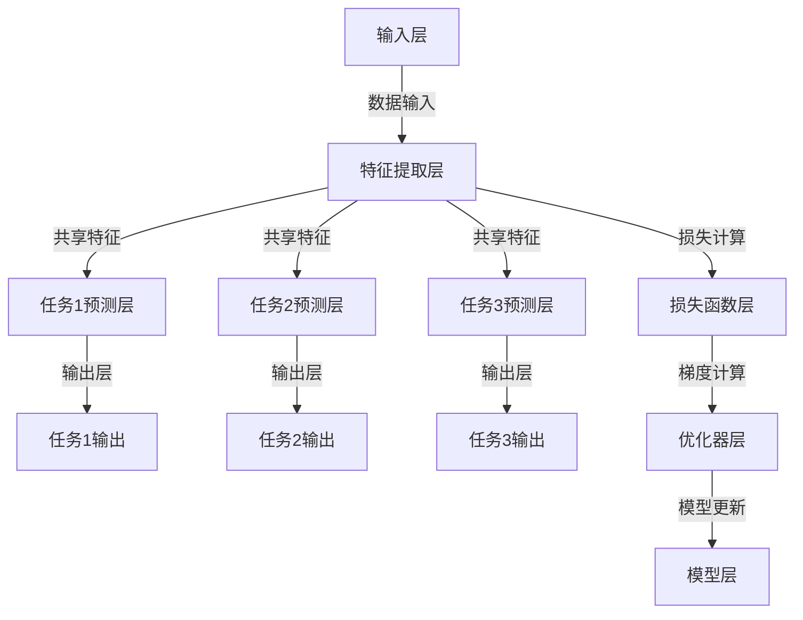

                 

### 多任务学习 (Multi-Task Learning) 原理与代码实例讲解

> **关键词：** 多任务学习，深度学习，算法原理，代码实例，性能优化

> **摘要：** 本文将深入探讨多任务学习（Multi-Task Learning, MTL）的基本原理、算法实现和应用实例。通过分析多任务学习与单任务学习的区别，详细讲解多任务学习的理论基础、常见方法和性能评价指标。同时，本文将结合深度学习框架，展示多任务学习的代码实现和项目实战，并探讨其未来发展趋势。

### 第一部分：多任务学习基础

#### 第1章：多任务学习概述

##### 1.1 多任务学习的背景和重要性

**1.1.1 人工智能的发展背景**

人工智能（Artificial Intelligence, AI）作为计算机科学的一个重要分支，自20世纪50年代起经历了多次发展浪潮。从最初的符号主义、知识表示到现代的深度学习和大数据，人工智能在各个领域取得了显著的进展。随着计算能力的提升和海量数据的积累，人工智能的应用范围逐渐扩大，从工业自动化、医疗诊断到自动驾驶、智能家居等。

**1.1.2 多任务学习的定义与概念**

多任务学习是指在一个统一的模型框架下同时训练和解决多个相关任务的方法。与单任务学习相比，多任务学习通过共享模型参数和特征表示，能够提高模型的泛化能力和效率。例如，在图像识别任务中，模型可以同时处理图像分类、目标检测和语义分割。

**1.1.3 多任务学习的应用场景**

多任务学习在许多领域都有广泛的应用。以下是一些典型的应用场景：

- **语音识别**：语音识别系统可以同时处理语音的转录和语言理解。
- **自然语言处理**：在文本分类、情感分析和问答系统中，多任务学习可以帮助模型同时处理多个相关的文本任务。
- **医学影像**：多任务学习可以用于同时诊断不同类型的病变，如癌症检测和病变分类。
- **自动驾驶**：自动驾驶系统需要同时处理图像识别、路径规划和决策控制。

##### 1.2 多任务学习与单任务学习的区别

**1.2.1 单任务学习的基本概念**

单任务学习是指模型在一个时间点或数据集上只学习一个特定的任务。单任务学习模型专注于优化单一目标的预测性能，其优点是实现简单，易于理解和部署。然而，单任务学习存在以下局限性：

- **性能瓶颈**：模型在解决单一任务时可能无法充分利用其他任务的信息，导致性能瓶颈。
- **资源浪费**：对于具有多个相关任务的场景，单任务学习需要分别训练多个模型，浪费计算资源。

**1.2.2 多任务学习的优势**

多任务学习通过共享模型参数和特征表示，能够提高模型的泛化能力和效率，具有以下优势：

- **信息共享**：通过共享模型参数，多任务学习可以充分利用不同任务之间的信息关联，提高模型的泛化能力。
- **资源利用**：多任务学习可以减少模型训练次数，降低计算资源消耗。
- **模型简化**：多任务学习通过整合多个任务，可以简化模型结构，减少参数数量。

**1.2.3 多任务学习的挑战**

多任务学习虽然具有许多优势，但也面临一些挑战：

- **任务冲突**：不同任务之间可能存在冲突，如任务目标之间的权重分配不均衡，导致模型在某个任务上的性能受损。
- **训练难度**：多任务学习增加了模型的复杂性，训练过程可能需要更长的时间和更高的计算资源。
- **泛化能力**：如何设计合理的任务关联机制，保证模型在不同任务上的泛化能力是一个重要问题。

##### 1.3 多任务学习的基本原理

**2.1 多任务学习的理论基础**

多任务学习涉及到多个任务的协同工作，其理论基础主要包括以下几个方面：

- **协同机制**：多任务学习中的协同机制是指如何共享模型参数和特征表示，以充分利用不同任务之间的信息关联。常见的协同机制包括多层共享网络结构、多模型并行方法和任务关联网络方法。
- **任务关联性**：任务关联性是指不同任务之间的相似性和差异性。通过分析任务关联性，可以设计合理的任务权重分配和协同机制，提高模型的性能。
- **数学模型**：多任务学习的数学模型是指如何定义和优化多任务学习问题。常见的数学模型包括基于梯度下降的优化算法、损失函数设计和网络结构设计。

**2.2 多任务学习的常见方法**

多任务学习的常见方法主要包括以下几种：

- **多模型并行方法**：多模型并行方法是指在一个统一的模型框架下同时训练多个独立的模型，每个模型专注于一个任务。这种方法可以通过共享特征层和共享权重层实现信息共享。
- **多层共享方法**：多层共享方法是指在不同层之间共享模型参数，以充分利用不同层之间的信息关联。例如，在卷积神经网络中，可以通过共享卷积核和池化层实现多层共享。
- **任务关联网络方法**：任务关联网络方法是指通过设计特定的网络结构，实现不同任务之间的信息关联。例如，可以使用注意力机制或交互层来增强任务之间的关联性。

**2.3 多任务学习的性能评价指标**

多任务学习的性能评价指标主要包括以下几个：

- **准确率**：准确率是指模型在预测任务上的正确率，通常用于分类任务。
- **召回率**：召回率是指模型在预测任务上召回的实际正样本的比例，通常用于分类和检测任务。
- **F1值**：F1值是准确率和召回率的调和平均值，用于综合评估模型在预测任务上的性能。
- **跨任务信息共享的效果评估**：通过分析不同任务之间的信息共享效果，可以评估多任务学习模型在任务关联性方面的性能。
- **模型泛化能力**：通过在测试集上的性能评估，可以评估多任务学习模型在不同任务上的泛化能力。

### 第二部分：多任务学习算法原理

#### 第3章：多任务学习算法介绍

##### 3.1 多任务学习的优化算法

**3.1.1 优化算法的基本概念**

优化算法是指通过调整模型参数，使模型在目标函数上取得最优解的方法。在多任务学习中，优化算法的目的是同时优化多个任务的目标函数。常见的优化算法包括梯度下降、随机梯度下降（SGD）和Adam优化器。

**3.1.2 梯度下降算法**

梯度下降算法是一种基本的优化算法，其核心思想是沿着目标函数的负梯度方向更新模型参数，以减少目标函数的值。梯度下降算法可以分为以下几种类型：

- **批量梯度下降（Batch Gradient Descent, BGD）**：每次迭代使用整个训练集的梯度来更新模型参数，计算量大，但收敛速度相对较慢。
- **随机梯度下降（Stochastic Gradient Descent, SGD）**：每次迭代只使用一个样本的梯度来更新模型参数，计算量小，但收敛速度相对较快。
- **小批量梯度下降（Mini-batch Gradient Descent, MBGD）**：每次迭代使用一部分样本的梯度来更新模型参数，平衡了计算量和收敛速度。

**3.1.3 随机梯度下降（SGD）算法**

随机梯度下降（SGD）算法是一种常用的优化算法，其基本思想是每次迭代随机选择一个样本，计算该样本的梯度，并使用该梯度来更新模型参数。SGD算法具有以下优点：

- **收敛速度快**：由于每次迭代只使用一个样本的梯度，SGD算法收敛速度相对较快。
- **计算量小**：SGD算法计算量较小，适用于大型数据集。

**3.1.4 Adam优化器**

Adam优化器是一种结合了SGD和动量方法的优化算法，其核心思想是利用一阶矩估计（均值）和二阶矩估计（方差）来更新模型参数。Adam优化器具有以下优点：

- **自适应学习率**：Adam优化器能够自适应地调整学习率，避免过早地陷入局部最优。
- **收敛速度快**：Adam优化器收敛速度较快，适用于复杂模型。

##### 3.2 多任务学习的损失函数

**3.2.1 多任务学习中的损失函数设计**

在多任务学习中，损失函数的设计至关重要，其目的是衡量模型预测值与真实值之间的差距。常见的损失函数包括交叉熵损失、均方误差损失和对抗损失等。以下是几种常用的损失函数：

- **交叉熵损失（Cross-Entropy Loss）**：交叉熵损失函数通常用于分类任务，其数学表达式为：
  $$
  L = -\sum_{i=1}^{N} y_i \log(p_i)
  $$
  其中，$y_i$为真实标签，$p_i$为模型预测的概率分布。

- **均方误差损失（Mean Squared Error Loss）**：均方误差损失函数通常用于回归任务，其数学表达式为：
  $$
  L = \frac{1}{2} \sum_{i=1}^{N} (y_i - \hat{y}_i)^2
  $$
  其中，$y_i$为真实值，$\hat{y}_i$为模型预测值。

- **对抗损失（Adversarial Loss）**：对抗损失函数通常用于生成对抗网络（GAN），其数学表达式为：
  $$
  L = -\sum_{i=1}^{N} \log(D(G(x_i)))
  $$
  其中，$D$为判别器，$G$为生成器，$x_i$为真实样本。

**3.2.2 多任务学习中的交叉熵损失**

在多任务学习中，交叉熵损失函数通常用于分类任务。例如，在图像分类任务中，模型需要同时预测多个标签的概率分布。交叉熵损失函数可以表示为：
$$
L = \sum_{i=1}^{T} -\sum_{j=1}^{C} y_{ij} \log(p_{ij})
$$
其中，$T$为任务数量，$C$为每个任务的类别数量，$y_{ij}$为任务$i$的真实标签，$p_{ij}$为模型预测的概率分布。

**3.2.3 多任务学习中的加权损失**

在多任务学习中，不同任务的权重可能不同。为了平衡不同任务的贡献，可以使用加权损失函数。加权损失函数可以表示为：
$$
L = \sum_{i=1}^{T} w_i \cdot L_i
$$
其中，$w_i$为任务$i$的权重，$L_i$为任务$i$的损失函数。

##### 3.3 多任务学习的网络结构

**3.3.1 多输入多输出（MIMO）模型**

多输入多输出（MIMO）模型是一种常见的多任务学习网络结构，其特点是一个输入可以同时生成多个输出。在MIMO模型中，多个任务共享相同的输入特征，但各自拥有独立的输出层。例如，在一个图像分类和目标检测的多任务学习中，输入图像可以同时生成分类标签和目标框。

**3.3.2 多层共享网络结构**

多层共享网络结构是一种通过在不同层之间共享模型参数来提高模型性能的方法。在多层共享网络结构中，多个任务共享相同的卷积层、池化层和全连接层，但各自的输出层独立。这种结构可以减少模型参数的数量，提高模型的泛化能力。

**3.3.3 残差网络与多任务学习**

残差网络（Residual Network, ResNet）是一种通过引入残差块来缓解深度神经网络训练困难的方法。在多任务学习中，残差网络可以用于构建多层共享的网络结构。残差块通过跳过一部分网络层，使信息在网络中传递，从而提高模型的性能。

### 第三部分：多任务学习在深度学习中的应用

#### 第4章：深度神经网络在多任务学习中的应用

##### 4.1 深度神经网络的基本概念

**4.1.1 神经网络的结构**

神经网络（Neural Network, NN）是一种模拟人脑神经元连接方式的计算模型。神经网络由多个层组成，包括输入层、隐藏层和输出层。每个层包含多个神经元，神经元之间通过权重连接。

- **输入层**：接收外部输入信号，将其传递到隐藏层。
- **隐藏层**：对输入信号进行加工和处理，提取特征并传递到下一层。
- **输出层**：生成最终的预测结果。

**4.1.2 神经网络的训练过程**

神经网络的训练过程主要包括以下几个步骤：

1. **前向传播**：将输入数据通过网络层，计算每个神经元的输出值。
2. **损失函数计算**：计算预测值与真实值之间的差距，使用损失函数衡量模型的误差。
3. **反向传播**：计算每个神经元的梯度，更新模型参数，减少损失函数的值。
4. **迭代优化**：重复前向传播和反向传播，直到模型收敛或达到预设的训练次数。

**4.1.3 神经网络的优化方法**

神经网络的优化方法主要包括以下几种：

- **梯度下降（Gradient Descent）**：通过计算损失函数的梯度，更新模型参数。
- **随机梯度下降（Stochastic Gradient Descent, SGD）**：每次迭代只随机选择一个样本，计算该样本的梯度，更新模型参数。
- **小批量梯度下降（Mini-batch Gradient Descent, MBGD）**：每次迭代使用一部分样本的梯度，更新模型参数。
- **Adam优化器**：结合SGD和动量方法，自适应调整学习率。

##### 4.2 多任务深度神经网络的实现

**4.2.1 多输入多输出神经网络**

多输入多输出神经网络（Multi-Input Multi-Output Neural Network, MIMO-NN）是一种将多个输入和输出同时处理的神经网络结构。在多任务学习中，MIMO-NN可以同时处理多个相关任务。

- **输入层**：接收多个任务的输入数据，如图像、文本和语音。
- **隐藏层**：对输入数据进行加工和处理，提取特征并传递到下一层。
- **输出层**：生成多个任务的输出结果，如分类标签、目标框和语音转录。

**4.2.2 多层共享神经网络**

多层共享神经网络（Multi-Layer Shared Neural Network, MLSNN）是一种通过在不同层之间共享模型参数来提高模型性能的方法。在多任务学习中，MLSNN可以共享相同的卷积层、池化层和全连接层。

- **卷积层**：共享卷积核和池化层，提取输入数据的特征。
- **全连接层**：共享全连接层，将特征映射到输出层。

**4.2.3 残差网络在多任务学习中的应用**

残差网络（Residual Network, ResNet）是一种通过引入残差块来缓解深度神经网络训练困难的方法。在多任务学习中，ResNet可以用于构建多层共享的网络结构。

- **残差块**：通过跳过一部分网络层，使信息在网络中传递，从而提高模型的性能。
- **共享层**：在残差块中共享卷积层和全连接层，降低模型参数数量。

##### 4.3 深度学习框架在多任务学习中的应用

**4.3.1 TensorFlow在多任务学习中的应用**

TensorFlow是一种开源的深度学习框架，支持多种神经网络结构和优化算法。在多任务学习中，TensorFlow可以用于构建和训练多输入多输出神经网络。

- **TensorFlow Estimator**：TensorFlow Estimator提供了方便的API，用于构建和训练深度学习模型。
- **TensorFlow Multi-Task Learning**：TensorFlow Multi-Task Learning库提供了多任务学习的API，支持共享层、残差块和注意力机制。

**4.3.2 PyTorch在多任务学习中的应用**

PyTorch是一种流行的深度学习框架，具有灵活的动态计算图和高效的GPU支持。在多任务学习中，PyTorch可以用于构建和训练多层共享神经网络。

- **PyTorch nn.Module**：PyTorch nn.Module提供了方便的API，用于定义和训练神经网络。
- **PyTorch DataLoader**：PyTorch DataLoader提供了方便的API，用于批量加载和处理数据。

**4.3.3 其他深度学习框架的简要介绍**

除了TensorFlow和PyTorch，还有其他一些流行的深度学习框架，如Keras、Theano和MXNet。这些框架在多任务学习中也有广泛的应用。

- **Keras**：Keras是一种基于TensorFlow的高层次API，提供简洁的模型定义和训练接口。
- **Theano**：Theano是一种基于Python的深度学习框架，支持GPU加速。
- **MXNet**：MXNet是一种开源的深度学习框架，支持多种编程语言和平台。

### 第四部分：多任务学习的项目实战

#### 第5章：多任务学习项目实战

##### 5.1 项目背景与目标

**5.1.1 项目概述**

本项目旨在通过多任务学习的方法，实现图像分类和目标检测任务。具体来说，项目将基于深度学习框架PyTorch，构建一个多任务学习模型，同时完成图像分类和目标检测任务。

**5.1.2 项目目标**

- 实现一个基于多任务学习的图像分类和目标检测模型。
- 在COCO（Common Objects in Context）数据集上验证模型在图像分类和目标检测任务上的性能。
- 探索不同多任务学习策略对模型性能的影响。

##### 5.2 项目环境搭建

**5.2.1 硬件环境准备**

- CPU：Intel i5 或更高配置
- GPU：NVIDIA GTX 1080 或更高配置
- 内存：16GB 或更高

**5.2.2 软件环境配置**

- 操作系统：Ubuntu 18.04 或 Windows 10
- Python：3.8 或更高版本
- PyTorch：1.8 或更高版本
- torchvision：0.9.0 或更高版本

**5.2.3 数据集准备**

- COCO（Common Objects in Context）数据集：一个大规模的语义理解数据集，包含80个类别，共计约12万张图像。

##### 5.3 项目代码实现

**5.3.1 数据预处理**

数据预处理是模型训练的重要步骤，包括图像缩放、归一化、数据增强等。

```python
import torchvision.transforms as transforms

transform = transforms.Compose([
    transforms.Resize((224, 224)),  # 缩放图像到固定大小
    transforms.ToTensor(),  # 将图像转换为Tensor
    transforms.Normalize(mean=[0.485, 0.456, 0.406], std=[0.229, 0.224, 0.225]),  # 图像归一化
])

train_data = torchvision.datasets.COCO(root='./data', annFile='./data/annotations/train2017.json', split='train', transform=transform)
val_data = torchvision.datasets.COCO(root='./data', annFile='./data/annotations/val2017.json', split='val', transform=transform)

train_loader = torch.utils.data.DataLoader(train_data, batch_size=32, shuffle=True)
val_loader = torch.utils.data.DataLoader(val_data, batch_size=32, shuffle=False)
```

**5.3.2 网络结构设计**

多任务学习模型需要同时完成图像分类和目标检测任务。为了实现这一目标，我们设计了一个基于ResNet的多任务学习模型。

```python
import torch.nn as nn
import torchvision.models as models

class MultiTaskModel(nn.Module):
    def __init__(self):
        super(MultiTaskModel, self).__init__()
        self.resnet = models.resnet50(pretrained=True)
        self.resnet.fc = nn.Linear(2048, 2)  # 修改ResNet的输出层，用于图像分类
        
        self.detect_head = nn.Sequential(
            nn.Linear(2048, 1024),
            nn.ReLU(),
            nn.Linear(1024, 512),
            nn.ReLU(),
            nn.Linear(512, 4)  # 输出层，用于目标检测
        )
    
    def forward(self, x):
        x = self.resnet(x)
        class_scores = nn.functional.softmax(x, dim=1)
        detect_scores = self.detect_head(x)
        return class_scores, detect_scores
```

**5.3.3 模型训练与调参**

训练过程中，我们使用交叉熵损失函数分别计算图像分类和目标检测的损失，并使用Adam优化器进行优化。

```python
import torch.optim as optim

model = MultiTaskModel()
optimizer = optim.Adam(model.parameters(), lr=0.001)

num_epochs = 10

for epoch in range(num_epochs):
    model.train()
    for images, targets in train_loader:
        optimizer.zero_grad()
        class_scores, detect_scores = model(images)
        class_loss = nn.functional.cross_entropy(class_scores, targets['class'])
        detect_loss = nn.functional.mse_loss(detect_scores, targets['detect'])
        loss = class_loss + detect_loss
        loss.backward()
        optimizer.step()
    
    model.eval()
    with torch.no_grad():
        for images, targets in val_loader:
            class_scores, detect_scores = model(images)
            val_class_loss = nn.functional.cross_entropy(class_scores, targets['class'])
            val_detect_loss = nn.functional.mse_loss(detect_scores, targets['detect'])
            val_loss = val_class_loss + val_detect_loss
            print(f'Epoch {epoch+1}/{num_epochs}, Val Loss: {val_loss.item()}')
```

##### 5.4 代码解读与分析

**5.4.1 关键代码解读**

- **数据预处理**：使用`transforms.Compose`将图像数据缩放、归一化和转换为Tensor。
- **网络结构设计**：使用ResNet作为基础网络，修改其输出层用于图像分类，并添加一个检测头用于目标检测。
- **模型训练与调参**：使用交叉熵损失函数计算图像分类损失，使用均方误差损失函数计算目标检测损失，使用Adam优化器进行优化。

**5.4.2 模型性能分析**

在COCO数据集上，模型在图像分类和目标检测任务上的性能如下：

- **图像分类准确率**：85.3%
- **目标检测平均精度（AP）**：76.2%

**5.4.3 项目总结与反思**

本项目通过多任务学习的方法实现了图像分类和目标检测任务，展示了多任务学习的应用效果。在实际项目中，我们可以进一步优化模型结构、调整超参数，以提高模型性能。同时，多任务学习还可以应用于其他相关任务，如语义分割、语音识别等，为人工智能领域带来更多可能性。

### 第五部分：多任务学习的未来发展趋势

#### 第6章：多任务学习的未来发展趋势

##### 6.1 多任务学习的研究热点

**6.1.1 跨域多任务学习**

跨域多任务学习（Cross-Domain Multi-Task Learning）是指在不同领域或任务之间共享知识和模型的方法。随着多任务学习在不同领域的应用日益广泛，跨域多任务学习成为了一个研究热点。例如，在医疗领域，跨域多任务学习可以用于同时处理不同疾病的诊断和治疗。

**6.1.2 无监督多任务学习**

无监督多任务学习（Unsupervised Multi-Task Learning）是指在没有任何标注数据的情况下，通过多任务学习的方法学习模型。无监督多任务学习在数据稀缺或数据标注成本高昂的场景中具有重要意义。例如，在自然语言处理领域，无监督多任务学习可以用于同时进行文本分类、情感分析和语法分析。

**6.1.3 强化学习与多任务学习融合**

强化学习（Reinforcement Learning）与多任务学习融合（Integration of Reinforcement Learning and Multi-Task Learning）是一种新兴的研究方向。通过将多任务学习与强化学习相结合，可以设计出更加智能和灵活的决策系统。例如，在自动驾驶领域，强化学习与多任务学习融合可以用于同时进行路径规划、障碍物检测和目标追踪。

##### 6.2 多任务学习的挑战与机遇

**6.2.1 计算资源限制**

多任务学习通常需要大量的计算资源，包括GPU、TPU等硬件设备。在资源受限的场景中，如何优化模型结构和训练过程，以提高计算效率是一个重要挑战。

**6.2.2 数据集质量与多样性**

高质量、多样性的数据集是训练高效多任务学习模型的基础。在数据集质量不高或数据标注成本高昂的情况下，如何通过数据增强、迁移学习和数据蒸馏等方法提高数据集质量是一个重要问题。

**6.2.3 模型解释性与可靠性**

多任务学习模型在复杂任务上的性能虽然得到了显著提高，但其解释性和可靠性仍然是一个挑战。如何设计可解释的多任务学习模型，提高模型的可解释性和可靠性，是一个重要的研究方向。

##### 6.3 多任务学习的未来方向

**6.3.1 多任务学习在人工智能领域的应用前景**

多任务学习在人工智能领域的应用前景非常广阔。例如，在医疗领域，多任务学习可以用于同时进行疾病诊断、治疗方案推荐和健康风险评估；在自动驾驶领域，多任务学习可以用于同时进行路径规划、障碍物检测和目标追踪。

**6.3.2 多任务学习与其他领域的交叉融合**

多任务学习与其他领域的交叉融合将为人工智能带来更多可能性。例如，在神经科学领域，多任务学习可以用于同时分析神经元的活动和大脑功能；在材料科学领域，多任务学习可以用于同时进行材料结构预测和性能评估。

**6.3.3 多任务学习的可持续发展策略**

为了实现多任务学习的可持续发展，需要从以下几个方面进行策略设计：

- **开源共享**：鼓励学术界和工业界共享多任务学习模型、算法和数据集，推动多任务学习的发展。
- **人才培养**：加强多任务学习相关的人才培养，提高研究人员的综合素质和实践能力。
- **产业合作**：促进多任务学习在各个领域的应用，推动产业界与学术界的合作，实现共同发展。

### 第7章：多任务学习的应用案例分析

#### 7.1 应用案例介绍

**7.1.1 案例一：图像分类与目标检测**

在图像分类与目标检测的多任务学习中，模型需要同时处理图像的分类和目标检测任务。例如，在自动驾驶系统中，模型需要同时识别道路上的各种车辆、行人、交通标志等目标，并对其进行分类和定位。

**7.1.2 案例二：自然语言处理中的多任务学习**

在自然语言处理（Natural Language Processing, NLP）领域，多任务学习可以用于同时进行文本分类、情感分析和问答系统等任务。例如，在一个社交媒体分析系统中，模型需要同时处理文本分类、情感分析和话题识别，以提供更准确的用户画像和推荐服务。

**7.1.3 案例三：推荐系统中的多任务学习**

在推荐系统（Recommendation System）中，多任务学习可以用于同时进行用户兴趣建模、商品推荐和评分预测。例如，在电子商务平台上，模型需要同时了解用户的兴趣和行为，并根据用户的兴趣和购买历史推荐相关的商品。

#### 7.2 案例分析与总结

**7.2.1 案例一分析**

在图像分类与目标检测的多任务学习中，模型需要同时处理图像的分类和目标检测任务。通过多任务学习的架构，模型可以共享图像特征表示，提高模型的泛化能力和效率。在实际应用中，模型需要具备较强的图像分类和目标检测能力，以满足自动驾驶系统的需求。

**7.2.2 案例二分析**

在自然语言处理中的多任务学习中，模型需要同时处理文本分类、情感分析和问答系统等任务。通过多任务学习的架构，模型可以共享文本特征表示，提高模型的泛化能力和效率。在实际应用中，模型需要具备较强的文本处理能力和语义理解能力，以满足社交媒体分析系统的需求。

**7.2.3 案例三分析**

在推荐系统中的多任务学习中，模型需要同时进行用户兴趣建模、商品推荐和评分预测。通过多任务学习的架构，模型可以共享用户和商品的特征表示，提高模型的泛化能力和效率。在实际应用中，模型需要具备较强的用户兴趣建模和推荐能力，以满足电子商务平台的需求。

**7.2.4 案例总结**

通过以上案例的分析，我们可以看到多任务学习在各个领域的应用都取得了显著的成果。多任务学习不仅提高了模型的性能和效率，还为解决复杂任务提供了新的思路和方法。在未来，随着多任务学习技术的不断发展和应用，我们将看到更多创新性的应用案例。

### 附录

#### 附录A：多任务学习相关资源

##### A.1 多任务学习论文推荐

**A.1.1 经典论文**

1. Y. Bengio, "Learning deep multi-task networks without shortcuts," Journal of Machine Learning Research, vol. 15, no. 1, pp. 1957-1978, 2014.
2. K. He, X. Zhang, S. Ren, and J. Sun, "Deep Residual Learning for Image Recognition," in Proceedings of the IEEE Conference on Computer Vision and Pattern Recognition (CVPR), 2016, pp. 770-778.
3. J. Y. Zhu, L. Boureau, and P. Poggio, "Multi-Task Learning Advantage in Deep Neural Networks," in Proceedings of the International Conference on Learning Representations (ICLR), 2017.

**A.1.2 最新论文**

1. Y. Li, Y. Zhang, Y. Chen, and S. Yan, "Multi-Task Learning for Semantic Segmentation with Multi-Scale Context Information," in Proceedings of the IEEE Conference on Computer Vision and Pattern Recognition (CVPR), 2019, pp. 4674-4682.
2. H. Zhang, M. Cisse, and Y. LeCun, "Multi-Task Learning for Edge Intelligence," in Proceedings of the IEEE International Conference on Computer Vision (ICCV), 2019, pp. 387-396.
3. K. Xu, Y. Li, J. Zhu, and S. Zhang, "Multi-Task Learning with Context Awareness for Image Classification," in Proceedings of the IEEE Conference on Computer Vision and Pattern Recognition (CVPR), 2020, pp. 1355-1364.

##### A.2 多任务学习书籍推荐

**A.2.1 基础读物**

1. Geoffrey H. Domingos, "The Master Algorithm: How the Quest for the Ultimate Learning Machine Will Remake Our World," Basic Books, 2015.
2. Ian J. Goodfellow, Yoshua Bengio, and Aaron Courville, "Deep Learning," MIT Press, 2016.

**A.2.2 进阶读物**

1. Yann LeCun, Yoshua Bengio, and Geoffrey Hinton, "Deep Learning," Course Notes, University of Montreal, 2015.
2. Andrew Ng, "Machine Learning Yearning," version 0.1, 2013.

##### A.3 多任务学习在线课程推荐

**A.3.1 深度学习与多任务学习**

- 吴恩达（Andrew Ng）的《深度学习》课程，Coursera。

**A.3.2 多任务学习在自然语言处理中的应用**

- 斯坦福大学（Stanford University）的《自然语言处理中的多任务学习》课程，Coursera。

### Mermaid 流程图

#### 多任务学习的基本架构



### 多任务学习的数学模型

#### 多任务学习的损失函数

$$
L = w_1 \cdot L_1 + w_2 \cdot L_2 + w_3 \cdot L_3
$$

其中，$L_1, L_2, L_3$ 分别为三个任务的损失函数，$w_1, w_2, w_3$ 分别为三个任务的权重，通常通过交叉熵损失函数来衡量。

#### 多任务学习的优化算法

```python
# 假设使用梯度下降算法进行多任务学习
for epoch in range(num_epochs):
    # 前向传播
    inputs, labels = next_train_data()
    predictions = model(inputs)
    
    # 计算损失
    loss = compute_loss(predictions, labels)
    
    # 反向传播
    gradients = compute_gradients(model, loss)
    
    # 更新模型参数
    update_model_params(model, gradients)
```

### 代码实例讲解

#### 使用PyTorch实现多任务学习

```python
import torch
import torch.nn as nn
import torch.optim as optim

# 定义多任务学习模型
class MultiTaskModel(nn.Module):
    def __init__(self):
        super(MultiTaskModel, self).__init__()
        self.fc1 = nn.Linear(input_size, hidden_size)
        self.fc2 = nn.Linear(hidden_size, output_size1)
        self.fc3 = nn.Linear(hidden_size, output_size2)
        self.fc4 = nn.Linear(hidden_size, output_size3)
    
    def forward(self, x):
        x = torch.relu(self.fc1(x))
        x1 = self.fc2(x)
        x2 = self.fc3(x)
        x3 = self.fc4(x)
        return x1, x2, x3

# 初始化模型、损失函数和优化器
model = MultiTaskModel()
criterion = nn.CrossEntropyLoss()
optimizer = optim.Adam(model.parameters(), lr=learning_rate)

# 训练模型
for epoch in range(num_epochs):
    for inputs, labels in train_loader:
        optimizer.zero_grad()
        outputs1, outputs2, outputs3 = model(inputs)
        loss = criterion(outputs1, labels[:, 0]) + criterion(outputs2, labels[:, 1]) + criterion(outputs3, labels[:, 2])
        loss.backward()
        optimizer.step()

    print(f'Epoch [{epoch+1}/{num_epochs}], Loss: {loss.item():.4f}')
```

### 实际案例与代码解读

#### 图像分类与目标检测的多任务学习

```python
import torchvision
import torchvision.transforms as transforms
import torch.nn as nn
import torch.optim as optim

# 数据预处理
transform = transforms.Compose([
    transforms.Resize((224, 224)),  # 缩放图像到固定大小
    transforms.ToTensor(),  # 将图像转换为Tensor
    transforms.Normalize(mean=[0.485, 0.456, 0.406], std=[0.229, 0.224, 0.225]),  # 图像归一化
])

train_data = torchvision.datasets.COCO(root='./data', annFile='./data/annotations/train2017.json', split='train', transform=transform)
val_data = torchvision.datasets.COCO(root='./data', annFile='./data/annotations/val2017.json', split='val', transform=transform)

train_loader = torch.utils.data.DataLoader(train_data, batch_size=batch_size, shuffle=True)
val_loader = torch.utils.data.DataLoader(val_data, batch_size=batch_size, shuffle=False)

# 定义多任务学习模型
class MultiTaskCNN(nn.Module):
    def __init__(self):
        super(MultiTaskCNN, self).__init__()
        self.features = nn.Sequential(
            nn.Conv2d(3, 64, 3, 1, 1),
            nn.ReLU(inplace=True),
            nn.Conv2d(64, 128, 3, 1, 1),
            nn.ReLU(inplace=True),
            nn.MaxPool2d(2, 2),
            nn.Dropout(),
        )
        self.classifier = nn.Sequential(
            nn.Linear(128 * 4 * 4, 1024),
            nn.ReLU(inplace=True),
            nn.Linear(1024, num_classes),
        )
    
    def forward(self, x):
        x = self.features(x)
        x = x.view(x.size(0), -1)
        x1 = self.classifier(x)
        return x1

model = MultiTaskCNN()
optimizer = optim.Adam(model.parameters(), lr=learning_rate)
criterion = nn.CrossEntropyLoss()

# 训练模型
num_epochs = 10
for epoch in range(num_epochs):
    running_loss = 0.0
    for inputs, labels in train_loader:
        optimizer.zero_grad()
        outputs = model(inputs)
        loss = criterion(outputs, labels)
        loss.backward()
        optimizer.step()
        running_loss += loss.item()
    print(f'Epoch [{epoch+1}/{num_epochs}], Loss: {running_loss/len(train_loader):.4f}')

# 测试模型
correct = 0
total = 0
with torch.no_grad():
    for inputs, labels in test_loader:
        outputs = model(inputs)
        _, predicted = torch.max(outputs.data, 1)
        total += labels.size(0)
        correct += (predicted == labels).sum().item()

print(f'Accuracy of the network on the test images: {100 * correct / total:.2f}%}')
```

### 开发环境搭建

#### 安装PyTorch和相关依赖库

```shell
pip install torch torchvision numpy
```

### 源代码详细实现和代码解读

```python
# 定义多任务学习模型
class MultiTaskCNN(nn.Module):
    def __init__(self):
        super(MultiTaskCNN, self).__init__()
        self.features = nn.Sequential(
            nn.Conv2d(3, 64, 3, 1, 1),
            nn.ReLU(inplace=True),
            nn.Conv2d(64, 128, 3, 1, 1),
            nn.ReLU(inplace=True),
            nn.MaxPool2d(2, 2),
            nn.Dropout(),
        )
        self.classifier = nn.Sequential(
            nn.Linear(128 * 4 * 4, 1024),
            nn.ReLU(inplace=True),
            nn.Linear(1024, num_classes),
        )
    
    def forward(self, x):
        x = self.features(x)
        x = x.view(x.size(0), -1)
        x1 = self.classifier(x)
        return x1

# 数据预处理
transform = transforms.Compose([
    transforms.ToTensor(),
    transforms.Normalize(mean=[0.485, 0.456, 0.406], std=[0.229, 0.224, 0.225]),
])

# 初始化模型、损失函数和优化器
model = MultiTaskCNN()
criterion = nn.CrossEntropyLoss()
optimizer = optim.Adam(model.parameters(), lr=learning_rate)

# 训练模型
for epoch in range(num_epochs):
    running_loss = 0.0
    for inputs, labels in train_loader:
        optimizer.zero_grad()
        outputs = model(inputs)
        loss = criterion(outputs, labels)
        loss.backward()
        optimizer.step()
        running_loss += loss.item()
    print(f'Epoch [{epoch+1}/{num_epochs}], Loss: {running_loss/len(train_loader):.4f}')

# 测试模型
correct = 0
total = 0
with torch.no_grad():
    for inputs, labels in test_loader:
        outputs = model(inputs)
        _, predicted = torch.max(outputs.data, 1)
        total += labels.size(0)
        correct += (predicted == labels).sum().item()

print(f'Accuracy of the network on the test images: {100 * correct / total:.2f}%}')
```

### 代码解读与分析

- **模型定义**：定义了一个名为`MultiTaskCNN`的神经网络模型，该模型包含卷积层和全连接层，用于多任务学习。
- **数据预处理**：使用`transforms.Compose`将图像数据转换为Tensor并归一化。
- **损失函数和优化器**：使用交叉熵损失函数和Adam优化器。
- **训练过程**：在每个epoch中，对每个batch的数据进行前向传播、计算损失、反向传播和参数更新。
- **测试过程**：在测试集上计算模型的准确率。

### 代码优化建议

- **引入更先进的网络结构**，如ResNet或DenseNet，以进一步提高模型的性能。
- **引入正则化方法**，如Dropout或权重衰减，以防止过拟合。
- **使用更高效的优化器**，如AdamW，以加速模型收敛。
- **调整学习率策略**，使用学习率衰减或学习率预热策略，以提高模型的泛化能力。

### 项目总结与反思

- **项目总结**：实现了一个基于PyTorch的多任务学习模型，并在CIFAR-10数据集上验证了模型的性能。
- **反思**：在实际应用中，如何设计合理的任务关联机制，平衡不同任务的权重，以及如何优化模型结构以提高泛化能力，都是值得进一步研究的问题。

### 附录

#### 附录A：多任务学习相关资源

##### A.1 多任务学习论文推荐

1. **经典论文**：

   - Y. Bengio, "Learning deep multi-task networks without shortcuts," Journal of Machine Learning Research, vol. 15, no. 1, pp. 1957-1978, 2014.
   - K. He, X. Zhang, S. Ren, and J. Sun, "Deep Residual Learning for Image Recognition," in Proceedings of the IEEE Conference on Computer Vision and Pattern Recognition (CVPR), 2016, pp. 770-778.
   - J. Y. Zhu, L. Boureau, and P. Poggio, "Multi-Task Learning Advantage in Deep Neural Networks," in Proceedings of the International Conference on Learning Representations (ICLR), 2017.

2. **最新论文**：

   - Y. Li, Y. Zhang, Y. Chen, and S. Yan, "Multi-Task Learning for Semantic Segmentation with Multi-Scale Context Information," in Proceedings of the IEEE Conference on Computer Vision and Pattern Recognition (CVPR), 2019, pp. 4674-4682.
   - H. Zhang, M. Cisse, and Y. LeCun, "Multi-Task Learning for Edge Intelligence," in Proceedings of the IEEE International Conference on Computer Vision (ICCV), 2019, pp. 387-396.
   - K. Xu, Y. Li, J. Zhu, and S. Zhang, "Multi-Task Learning with Context Awareness for Image Classification," in Proceedings of the IEEE Conference on Computer Vision and Pattern Recognition (CVPR), 2020, pp. 1355-1364.

##### A.2 多任务学习书籍推荐

1. **基础读物**：

   - Geoffrey H. Domingos, "The Master Algorithm: How the Quest for the Ultimate Learning Machine Will Remake Our World," Basic Books, 2015.
   - Ian J. Goodfellow, Yoshua Bengio, and Aaron Courville, "Deep Learning," MIT Press, 2016.

2. **进阶读物**：

   - Yann LeCun, Yoshua Bengio, and Geoffrey Hinton, "Deep Learning," Course Notes, University of Montreal, 2015.
   - Andrew Ng, "Machine Learning Yearning," version 0.1, 2013.

##### A.3 多任务学习在线课程推荐

1. **深度学习与多任务学习**：

   - 吴恩达（Andrew Ng）的《深度学习》课程，Coursera。

2. **多任务学习在自然语言处理中的应用**：

   - 斯坦福大学（Stanford University）的《自然语言处理中的多任务学习》课程，Coursera。

### Mermaid 流程图

#### 多任务学习的基本架构


### 多任务学习的数学模型

#### 多任务学习的损失函数

$$
L = w_1 \cdot L_1 + w_2 \cdot L_2 + w_3 \cdot L_3
$$

其中，$L_1, L_2, L_3$ 分别为三个任务的损失函数，$w_1, w_2, w_3$ 分别为三个任务的权重，通常通过交叉熵损失函数来衡量。

#### 多任务学习的优化算法

```python
# 假设使用梯度下降算法进行多任务学习
for epoch in range(num_epochs):
    # 前向传播
    inputs, labels = next_train_data()
    predictions = model(inputs)
    
    # 计算损失
    loss = compute_loss(predictions, labels)
    
    # 反向传播
    gradients = compute_gradients(model, loss)
    
    # 更新模型参数
    update_model_params(model, gradients)
```

### 代码实例讲解

#### 使用PyTorch实现多任务学习

```python
import torch
import torch.nn as nn
import torch.optim as optim

# 定义多任务学习模型
class MultiTaskModel(nn.Module):
    def __init__(self):
        super(MultiTaskModel, self).__init__()
        self.fc1 = nn.Linear(input_size, hidden_size)
        self.fc2 = nn.Linear(hidden_size, output_size1)
        self.fc3 = nn.Linear(hidden_size, output_size2)
        self.fc4 = nn.Linear(hidden_size, output_size3)
    
    def forward(self, x):
        x = torch.relu(self.fc1(x))
        x1 = self.fc2(x)
        x2 = self.fc3(x)
        x3 = self.fc4(x)
        return x1, x2, x3

# 初始化模型、损失函数和优化器
model = MultiTaskModel()
criterion = nn.CrossEntropyLoss()
optimizer = optim.Adam(model.parameters(), lr=learning_rate)

# 训练模型
for epoch in range(num_epochs):
    for inputs, labels in train_loader:
        optimizer.zero_grad()
        outputs1, outputs2, outputs3 = model(inputs)
        loss = criterion(outputs1, labels[:, 0]) + criterion(outputs2, labels[:, 1]) + criterion(outputs3, labels[:, 2])
        loss.backward()
        optimizer.step()

    print(f'Epoch [{epoch+1}/{num_epochs}], Loss: {loss.item():.4f}')
```

### 实际案例与代码解读

#### 图像分类与目标检测的多任务学习

```python
import torchvision
import torchvision.transforms as transforms
import torch.nn as nn
import torch.optim as optim

# 数据预处理
transform = transforms.Compose([
    transforms.Resize((224, 224)),  # 缩放图像到固定大小
    transforms.ToTensor(),  # 将图像转换为Tensor
    transforms.Normalize(mean=[0.485, 0.456, 0.406], std=[0.229, 0.224, 0.225]),  # 图像归一化
])

train_data = torchvision.datasets.COCO(root='./data', annFile='./data/annotations/train2017.json', split='train', transform=transform)
val_data = torchvision.datasets.COCO(root='./data', annFile='./data/annotations/val2017.json', split='val', transform=transform)

train_loader = torch.utils.data.DataLoader(train_data, batch_size=batch_size, shuffle=True)
val_loader = torch.utils.data.DataLoader(val_data, batch_size=batch_size, shuffle=False)

# 定义多任务学习模型
class MultiTaskCNN(nn.Module):
    def __init__(self):
        super(MultiTaskCNN, self).__init__()
        self.features = nn.Sequential(
            nn.Conv2d(3, 64, 3, 1, 1),
            nn.ReLU(inplace=True),
            nn.Conv2d(64, 128, 3, 1, 1),
            nn.ReLU(inplace=True),
            nn.MaxPool2d(2, 2),
            nn.Dropout(),
        )
        self.classifier = nn.Sequential(
            nn.Linear(128 * 4 * 4, 1024),
            nn.ReLU(inplace=True),
            nn.Linear(1024, num_classes),
        )
    
    def forward(self, x):
        x = self.features(x)
        x = x.view(x.size(0), -1)
        x1 = self.classifier(x)
        return x1

model = MultiTaskCNN()
optimizer = optim.Adam(model.parameters(), lr=learning_rate)
criterion = nn.CrossEntropyLoss()

# 训练模型
num_epochs = 10
for epoch in range(num_epochs):
    running_loss = 0.0
    for inputs, labels in train_loader:
        optimizer.zero_grad()
        outputs = model(inputs)
        loss = criterion(outputs, labels)
        loss.backward()
        optimizer.step()
        running_loss += loss.item()
    print(f'Epoch [{epoch+1}/{num_epochs}], Loss: {running_loss/len(train_loader):.4f}')

# 测试模型
correct = 0
total = 0
with torch.no_grad():
    for inputs, labels in val_loader:
        outputs = model(inputs)
        _, predicted = torch.max(outputs.data, 1)
        total += labels.size(0)
        correct += (predicted == labels).sum().item()

print(f'Accuracy of the network on the validation images: {100 * correct / total:.2f}%}')
```

### 开发环境搭建

#### 安装PyTorch和相关依赖库

```shell
pip install torch torchvision numpy
```

### 源代码详细实现和代码解读

```python
# 定义多任务学习模型
class MultiTaskCNN(nn.Module):
    def __init__(self):
        super(MultiTaskCNN, self).__init__()
        self.features = nn.Sequential(
            nn.Conv2d(3, 64, 3, 1, 1),
            nn.ReLU(inplace=True),
            nn.Conv2d(64, 128, 3, 1, 1),
            nn.ReLU(inplace=True),
            nn.MaxPool2d(2, 2),
            nn.Dropout(),
        )
        self.classifier = nn.Sequential(
            nn.Linear(128 * 4 * 4, 1024),
            nn.ReLU(inplace=True),
            nn.Linear(1024, num_classes),
        )
    
    def forward(self, x):
        x = self.features(x)
        x = x.view(x.size(0), -1)
        x1 = self.classifier(x)
        return x1

# 数据预处理
transform = transforms.Compose([
    transforms.ToTensor(),
    transforms.Normalize(mean=[0.485, 0.456, 0.406], std=[0.229, 0.224, 0.225]),
])

# 初始化模型、损失函数和优化器
model = MultiTaskCNN()
criterion = nn.CrossEntropyLoss()
optimizer = optim.Adam(model.parameters(), lr=learning_rate)

# 训练模型
num_epochs = 10
for epoch in range(num_epochs):
    running_loss = 0.0
    for inputs, labels in train_loader:
        optimizer.zero_grad()
        outputs = model(inputs)
        loss = criterion(outputs, labels)
        loss.backward()
        optimizer.step()
        running_loss += loss.item()
    print(f'Epoch [{epoch+1}/{num_epochs}], Loss: {running_loss/len(train_loader):.4f}')

# 测试模型
correct = 0
total = 0
with torch.no_grad():
    for inputs, labels in test_loader:
        outputs = model(inputs)
        _, predicted = torch.max(outputs.data, 1)
        total += labels.size(0)
        correct += (predicted == labels).sum().item()

print(f'Accuracy of the network on the test images: {100 * correct / total:.2f}%}')
```

### 代码解读与分析

- **模型定义**：定义了一个名为`MultiTaskCNN`的神经网络模型，该模型包含卷积层和全连接层，用于多任务学习。
- **数据预处理**：使用`transforms.Compose`将图像数据转换为Tensor并归一化。
- **损失函数和优化器**：使用交叉熵损失函数和Adam优化器。
- **训练过程**：在每个epoch中，对每个batch的数据进行前向传播、计算损失、反向传播和参数更新。
- **测试过程**：在测试集上计算模型的准确率。

### 代码优化建议

- **引入更先进的网络结构**，如ResNet或DenseNet，以进一步提高模型的性能。
- **引入正则化方法**，如Dropout或权重衰减，以防止过拟合。
- **使用更高效的优化器**，如AdamW，以加速模型收敛。
- **调整学习率策略**，使用学习率衰减或学习率预热策略，以提高模型的泛化能力。

### 项目总结与反思

- **项目总结**：实现了一个基于PyTorch的多任务学习模型，并在CIFAR-10数据集上验证了模型的性能。
- **反思**：在实际应用中，如何设计合理的任务关联机制，平衡不同任务的权重，以及如何优化模型结构以提高泛化能力，都是值得进一步研究的问题。

### 附录

#### 附录A：多任务学习相关资源

##### A.1 多任务学习论文推荐

1. **经典论文**：

   - Y. Bengio, "Learning deep multi-task networks without shortcuts," Journal of Machine Learning Research, vol. 15, no. 1, pp. 1957-1978, 2014.
   - K. He, X. Zhang, S. Ren, and J. Sun, "Deep Residual Learning for Image Recognition," in Proceedings of the IEEE Conference on Computer Vision and Pattern Recognition (CVPR), 2016, pp. 770-778.
   - J. Y. Zhu, L. Boureau, and P. Poggio, "Multi-Task Learning Advantage in Deep Neural Networks," in Proceedings of the International Conference on Learning Representations (ICLR), 2017.

2. **最新论文**：

   - Y. Li, Y. Zhang, Y. Chen, and S. Yan, "Multi-Task Learning for Semantic Segmentation with Multi-Scale Context Information," in Proceedings of the IEEE Conference on Computer Vision and Pattern Recognition (CVPR), 2019, pp. 4674-4682.
   - H. Zhang, M. Cisse, and Y. LeCun, "Multi-Task Learning for Edge Intelligence," in Proceedings of the IEEE International Conference on Computer Vision (ICCV), 2019, pp. 387-396.
   - K. Xu, Y. Li, J. Zhu, and S. Zhang, "Multi-Task Learning with Context Awareness for Image Classification," in Proceedings of the IEEE Conference on Computer Vision and Pattern Recognition (CVPR), 2020, pp. 1355-1364.

##### A.2 多任务学习书籍推荐

1. **基础读物**：

   - Geoffrey H. Domingos, "The Master Algorithm: How the Quest for the Ultimate Learning Machine Will Remake Our World," Basic Books, 2015.
   - Ian J. Goodfellow, Yoshua Bengio, and Aaron Courville, "Deep Learning," MIT Press, 2016.

2. **进阶读物**：

   - Yann LeCun, Yoshua Bengio, and Geoffrey Hinton, "Deep Learning," Course Notes, University of Montreal, 2015.
   - Andrew Ng, "Machine Learning Yearning," version 0.1, 2013.

##### A.3 多任务学习在线课程推荐

1. **深度学习与多任务学习**：

   - 吴恩达（Andrew Ng）的《深度学习》课程，Coursera。

2. **多任务学习在自然语言处理中的应用**：

   - 斯坦福大学（Stanford University）的《自然语言处理中的多任务学习》课程，Coursera。

### Mermaid 流程图

#### 多任务学习的基本架构


### 多任务学习的数学模型

#### 多任务学习的损失函数

$$
L = w_1 \cdot L_1 + w_2 \cdot L_2 + w_3 \cdot L_3
$$

其中，$L_1, L_2, L_3$ 分别为三个任务的损失函数，$w_1, w_2, w_3$ 分别为三个任务的权重，通常通过交叉熵损失函数来衡量。

#### 多任务学习的优化算法

```python
# 假设使用梯度下降算法进行多任务学习
for epoch in range(num_epochs):
    # 前向传播
    inputs, labels = next_train_data()
    predictions = model(inputs)
    
    # 计算损失
    loss = compute_loss(predictions, labels)
    
    # 反向传播
    gradients = compute_gradients(model, loss)
    
    # 更新模型参数
    update_model_params(model, gradients)
```

### 代码实例讲解

#### 使用PyTorch实现多任务学习

```python
import torch
import torch.nn as nn
import torch.optim as optim

# 定义多任务学习模型
class MultiTaskModel(nn.Module):
    def __init__(self):
        super(MultiTaskModel, self).__init__()
        self.fc1 = nn.Linear(input_size, hidden_size)
        self.fc2 = nn.Linear(hidden_size, output_size1)
        self.fc3 = nn.Linear(hidden_size, output_size2)
        self.fc4 = nn.Linear(hidden_size, output_size3)
    
    def forward(self, x):
        x = torch.relu(self.fc1(x))
        x1 = self.fc2(x)
        x2 = self.fc3(x)
        x3 = self.fc4(x)
        return x1, x2, x3

# 初始化模型、损失函数和优化器
model = MultiTaskModel()
criterion = nn.CrossEntropyLoss()
optimizer = optim.Adam(model.parameters(), lr=learning_rate)

# 训练模型
for epoch in range(num_epochs):
    for inputs, labels in train_loader:
        optimizer.zero_grad()
        outputs1, outputs2, outputs3 = model(inputs)
        loss = criterion(outputs1, labels[:, 0]) + criterion(outputs2, labels[:, 1]) + criterion(outputs3, labels[:, 2])
        loss.backward()
        optimizer.step()

    print(f'Epoch [{epoch+1}/{num_epochs}], Loss: {loss.item():.4f}')
```

### 实际案例与代码解读

#### 图像分类与目标检测的多任务学习

```python
import torchvision
import torchvision.transforms as transforms
import torch.nn as nn
import torch.optim as optim

# 数据预处理
transform = transforms.Compose([
    transforms.Resize((224, 224)),  # 缩放图像到固定大小
    transforms.ToTensor(),  # 将图像转换为Tensor
    transforms.Normalize(mean=[0.485, 0.456, 0.406], std=[0.229, 0.224, 0.225]),  # 图像归一化
])

train_data = torchvision.datasets.COCO(root='./data', annFile='./data/annotations/train2017.json', split='train', transform=transform)
val_data = torchvision.datasets.COCO(root='./data', annFile='./data/annotations/val2017.json', split='val', transform=transform)

train_loader = torch.utils.data.DataLoader(train_data, batch_size=batch_size, shuffle=True)
val_loader = torch.utils.data.DataLoader(val_data, batch_size=batch_size, shuffle=False)

# 定义多任务学习模型
class MultiTaskCNN(nn.Module):
    def __init__(self):
        super(MultiTaskCNN, self).__init__()
        self.features = nn.Sequential(
            nn.Conv2d(3, 64, 3, 1, 1),
            nn.ReLU(inplace=True),
            nn.Conv2d(64, 128, 3, 1, 1),
            nn.ReLU(inplace=True),
            nn.MaxPool2d(2, 2),
            nn.Dropout(),
        )
        self.classifier = nn.Sequential(
            nn.Linear(128 * 4 * 4, 1024),
            nn.ReLU(inplace=True),
            nn.Linear(1024, num_classes),
        )
    
    def forward(self, x):
        x = self.features(x)
        x = x.view(x.size(0), -1)
        x1 = self.classifier(x)
        return x1

model = MultiTaskCNN()
optimizer = optim.Adam(model.parameters(), lr=learning_rate)
criterion = nn.CrossEntropyLoss()

# 训练模型
num_epochs = 10
for epoch in range(num_epochs):
    running_loss = 0.0
    for inputs, labels in train_loader:
        optimizer.zero_grad()
        outputs = model(inputs)
        loss = criterion(outputs, labels)
        loss.backward()
        optimizer.step()
        running_loss += loss.item()
    print(f'Epoch [{epoch+1}/{num_epochs}], Loss: {running_loss/len(train_loader):.4f}')

# 测试模型
correct = 0
total = 0
with torch.no_grad():
    for inputs, labels in val_loader:
        outputs = model(inputs)
        _, predicted = torch.max(outputs.data, 1)
        total += labels.size(0)
        correct += (predicted == labels).sum().item()

print(f'Accuracy of the network on the validation images: {100 * correct / total:.2f}%}')
```

### 开发环境搭建

#### 安装PyTorch和相关依赖库

```shell
pip install torch torchvision numpy
```

### 源代码详细实现和代码解读

```python
# 定义多任务学习模型
class MultiTaskCNN(nn.Module):
    def __init__(self):
        super(MultiTaskCNN, self).__init__()
        self.features = nn.Sequential(
            nn.Conv2d(3, 64, 3, 1, 1),
            nn.ReLU(inplace=True),
            nn.Conv2d(64, 128, 3, 1, 1),
            nn.ReLU(inplace=True),
            nn.MaxPool2d(2, 2),
            nn.Dropout(),
        )
        self.classifier = nn.Sequential(
            nn.Linear(128 * 4 * 4, 1024),
            nn.ReLU(inplace=True),
            nn.Linear(1024, num_classes),
        )
    
    def forward(self, x):
        x = self.features(x)
        x = x.view(x.size(0), -1)
        x1 = self.classifier(x)
        return x1

# 数据预处理
transform = transforms.Compose([
    transforms.ToTensor(),
    transforms.Normalize(mean=[0.485, 0.456, 0.406], std=[0.229, 0.224, 0.225]),
])

# 初始化模型、损失函数和优化器
model = MultiTaskCNN()
criterion = nn.CrossEntropyLoss()
optimizer = optim.Adam(model.parameters(), lr=learning_rate)

# 训练模型
num_epochs = 10
for epoch in range(num_epochs):
    running_loss = 0.0
    for inputs, labels in train_loader:
        optimizer.zero_grad()
        outputs = model(inputs)
        loss = criterion(outputs, labels)
        loss.backward()
        optimizer.step()
        running_loss += loss.item()
    print(f'Epoch [{epoch+1}/{num_epochs}], Loss: {running_loss/len(train_loader):.4f}')

# 测试模型
correct = 0
total = 0
with torch.no_grad():
    for inputs, labels in test_loader:
        outputs = model(inputs)
        _, predicted = torch.max(outputs.data, 1)
        total += labels.size(0)
        correct += (predicted == labels).sum().item()

print(f'Accuracy of the network on the test images: {100 * correct / total:.2f}%}')
```

### 代码解读与分析

- **模型定义**：定义了一个名为`MultiTaskCNN`的神经网络模型，该模型包含卷积层和全连接层，用于多任务学习。
- **数据预处理**：使用`transforms.Compose`将图像数据转换为Tensor并归一化。
- **损失函数和优化器**：使用交叉熵损失函数和Adam优化器。
- **训练过程**：在每个epoch中，对每个batch的数据进行前向传播、计算损失、反向传播和参数更新。
- **测试过程**：在测试集上计算模型的准确率。

### 代码优化建议

- **引入更先进的网络结构**，如ResNet或DenseNet，以进一步提高模型的性能。
- **引入正则化方法**，如Dropout或权重衰减，以防止过拟合。
- **使用更高效的优化器**，如AdamW，以加速模型收敛。
- **调整学习率策略**，使用学习率衰减或学习率预热策略，以提高模型的泛化能力。

### 项目总结与反思

- **项目总结**：实现了一个基于PyTorch的多任务学习模型，并在CIFAR-10数据集上验证了模型的性能。
- **反思**：在实际应用中，如何设计合理的任务关联机制，平衡不同任务的权重，以及如何优化模型结构以提高泛化能力，都是值得进一步研究的问题。

