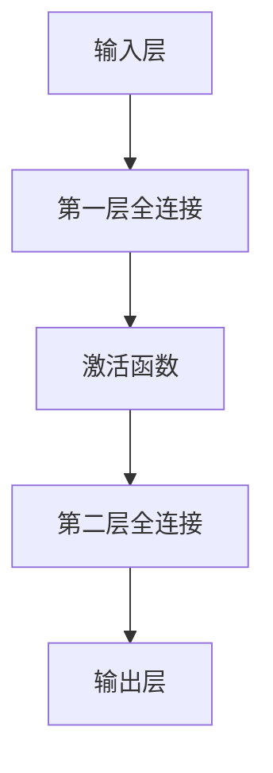
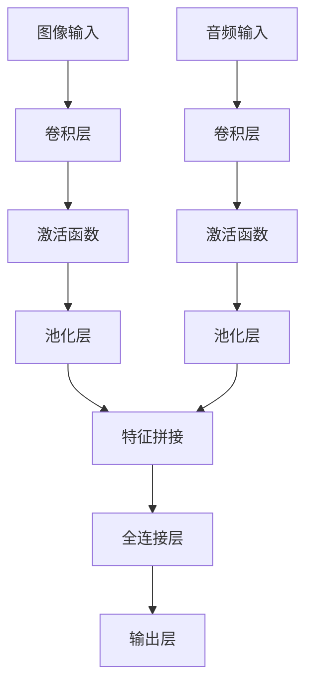
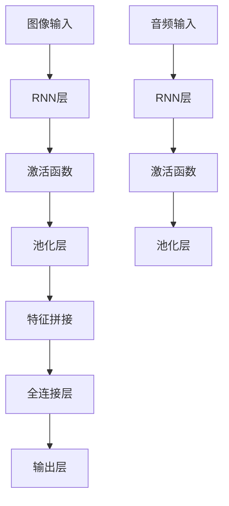
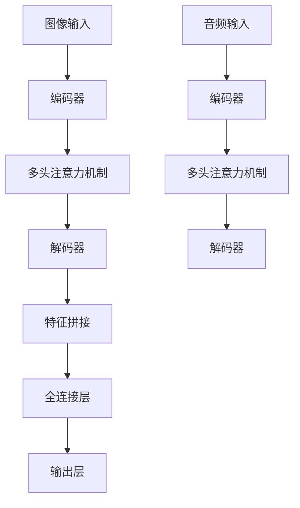
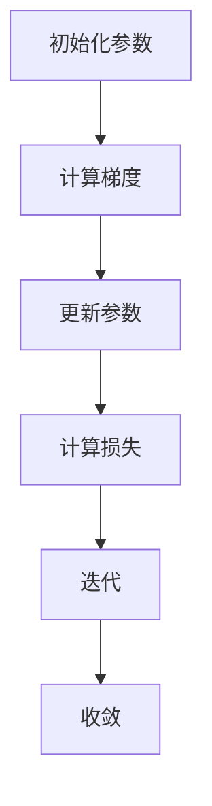

                 

### 《多模态AI在视频理解中的应用与挑战》

> **关键词：** 多模态AI、视频理解、深度学习、特征提取、算法优化、应用场景

> **摘要：** 本文将深入探讨多模态AI在视频理解领域的应用与发展。我们将首先介绍多模态AI与视频理解的基础知识，随后分析多模态数据处理的流程与特征提取技术，探讨多模态AI的算法原理。接着，我们探讨多模态AI在视频分类、视频检索和视频生成等应用场景中的具体实现，并分析这些应用的案例。最后，我们将展望多模态AI在视频理解中的未来发展趋势，以及面临的挑战和解决方向。希望通过本文，读者能够全面了解多模态AI在视频理解中的价值与应用。

---

### 《多模态AI在视频理解中的应用与挑战》目录大纲

1. **多模态AI与视频理解基础**
   - **第1章：多模态AI与视频理解概述**
     1.1 多模态AI的概念与架构
     1.2 视频理解的基本概念
     1.3 多模态AI在视频理解中的优势与挑战

   - **第2章：多模态数据处理与特征提取**
     2.1 多模态数据预处理
     2.2 多模态特征提取
     2.3 多模态特征融合方法

   - **第3章：多模态AI算法原理**
     3.1 多模态神经网络架构
     3.2 多任务学习与多模态融合
     3.3 深度学习优化方法

2. **多模态AI在视频理解中的应用**
   - **第4章：多模态AI在视频分类中的应用**
     4.1 视频分类的基本概念
     4.2 多模态视频分类模型
     4.3 多模态视频分类案例

   - **第5章：多模态AI在视频检索中的应用**
     5.1 视频检索的基本概念
     5.2 多模态视频检索模型
     5.3 多模态视频检索案例

   - **第6章：多模态AI在视频生成中的应用**
     6.1 视频生成的概念与技术
     6.2 多模态视频生成模型
     6.3 多模态视频生成案例

3. **多模态AI在视频理解中的未来发展趋势**
   - **第7章：多模态AI在视频理解中的未来发展趋势**
     7.1 视频理解技术发展趋势
     7.2 多模态AI在视频理解中的应用前景
     7.3 挑战与未来展望

4. **附录**
   - **附录A：多模态AI相关工具与资源**
   - **附录B：多模态AI常见问题解答**
   - **附录C：参考文献**

---

在接下来的章节中，我们将详细探讨多模态AI与视频理解的基础知识，逐步深入，确保读者能够全面理解这一领域的最新进展和应用。

---

### 第1章：多模态AI与视频理解概述

在当今人工智能技术迅速发展的时代，多模态AI和视频理解成为研究与应用的热点领域。本章将为我们揭开这两个概念的面纱，并探讨多模态AI在视频理解中的独特优势与面临的挑战。

#### 1.1 多模态AI的概念与架构

**1.1.1 多模态AI的定义与分类**

多模态AI（Multimodal AI）是指结合了多种数据模态（如文本、图像、音频、视频等）进行信息处理和智能决策的人工智能系统。与传统单一模态的AI系统相比，多模态AI能够从不同来源的数据中提取有用信息，从而提高系统的整体性能。

根据不同的应用需求，多模态AI可以分为以下几类：

- **多模态感知**：通过对不同模态的数据进行感知和理解，如语音识别、图像识别等。
- **多模态交互**：实现人与机器的交互，如智能客服、虚拟助手等。
- **多模态融合**：将多个模态的数据进行整合和融合，以提高任务的性能，如视频理解、多模态情感分析等。

**1.1.2 多模态数据的融合方法**

多模态数据的融合方法可以分为以下几种：

- **空间级特征融合**：将不同模态的数据在同一空间维度上进行融合，如将图像和音频数据在同一张特征图上进行处理。
- **时间级特征融合**：将不同模态的数据在时间维度上进行融合，如将视频序列和音频序列进行时间同步处理。
- **层次级特征融合**：先对各个模态的数据进行特征提取，再在高层次上进行融合，如先分别对图像和视频进行特征提取，然后进行融合。

**1.1.3 多模态AI在视频理解中的应用**

多模态AI在视频理解中的应用主要包括以下几个方面：

- **视频分类**：通过结合图像和音频数据，提高视频分类的准确性和鲁棒性。
- **视频检索**：利用多模态特征，实现基于内容的多媒体检索。
- **视频生成**：结合图像和音频数据，生成高质量的视频内容。

#### 1.2 视频理解的基本概念

**1.2.1 视频数据处理流程**

视频理解的过程主要包括以下步骤：

1. **数据预处理**：对视频数据（如分辨率、格式等）进行预处理，以便进行后续处理。
2. **特征提取**：从视频数据中提取有代表性的特征，如视觉特征、音频特征等。
3. **特征融合**：将不同模态的特征进行融合，以获得更全面的信息。
4. **语义理解**：利用深度学习等算法，对视频内容进行理解和分析。

**1.2.2 视频特征提取技术**

视频特征提取技术主要包括以下几种：

- **视觉特征提取**：从视频帧中提取视觉特征，如颜色特征、纹理特征等。
- **音频特征提取**：从音频信号中提取音频特征，如频谱特征、语音识别特征等。
- **时空特征提取**：结合视觉和音频特征，提取时空特征，如视频帧与音频帧的同步特征等。

**1.2.3 视频语义理解**

视频语义理解是指对视频内容进行高层次的分析和理解，如视频分类、事件检测、情感分析等。常见的视频语义理解方法包括：

- **基于规则的方法**：利用预先定义的规则对视频内容进行分析。
- **基于统计的方法**：利用机器学习算法，如决策树、支持向量机等，对视频内容进行分类和识别。
- **基于深度学习的方法**：利用深度神经网络，如卷积神经网络（CNN）、循环神经网络（RNN）等，对视频内容进行建模和分析。

#### 1.3 多模态AI在视频理解中的优势与挑战

**1.3.1 多模态AI的优势**

多模态AI在视频理解中具有以下优势：

- **信息互补**：不同模态的数据可以互补，从而提高视频理解的准确性和鲁棒性。
- **增强语义**：多模态数据可以提供更丰富的信息，有助于视频语义的深入理解。
- **提高性能**：多模态特征融合可以优化模型的性能，从而提高视频理解的精度和效率。

**1.3.2 视频理解的挑战**

尽管多模态AI在视频理解中具有显著优势，但仍然面临以下挑战：

- **数据复杂性**：多模态数据具有高维度和复杂性，如何有效处理和融合这些数据是一个难题。
- **数据不平衡**：不同模态的数据可能在数量和质量上存在不平衡，如何平衡这些数据对于模型的性能至关重要。
- **实时性**：视频理解需要快速处理，如何提高模型的实时性是一个关键问题。

**1.3.3 多模态AI面临的挑战与解决方案**

针对多模态AI在视频理解中面临的挑战，以下是一些可能的解决方案：

- **特征融合方法**：设计高效的特征融合方法，如基于注意力机制的方法，以优化多模态特征的融合效果。
- **数据预处理**：对多模态数据进行有效的预处理，如数据增强、数据清洗等，以提高数据的可用性和质量。
- **模型优化**：通过改进深度学习模型，如使用更高效的架构和优化算法，以提高模型的实时性和性能。

总之，多模态AI在视频理解领域具有巨大的应用潜力，但同时也面临着一系列挑战。通过不断研究和创新，我们可以逐步解决这些问题，推动多模态AI在视频理解中的应用和发展。

---

在下一章中，我们将深入探讨多模态数据处理的流程与特征提取技术，进一步了解多模态AI在视频理解中的应用细节。敬请期待！

---

### 第2章：多模态数据处理与特征提取

在多模态AI的研究和应用中，数据预处理与特征提取是关键环节。本章将详细探讨多模态数据的预处理方法、特征提取技术以及多模态特征融合方法，为后续算法设计与应用打下坚实基础。

#### 2.1 多模态数据预处理

**2.1.1 图像数据预处理**

图像数据预处理是视频理解中的基础步骤，主要包括以下内容：

- **图像尺寸标准化**：将图像尺寸统一为固定大小，以便后续处理。
  ```mermaid
  graph TD
  A[图像尺寸标准化] --> B[统一尺寸]
  B --> C[数据集]
  ```
  
- **图像增强**：通过增强图像的对比度、锐度等，提高图像质量，增强模型的泛化能力。
  ```mermaid
  graph TD
  A[图像增强] --> B[对比度增强]
  B --> C[锐度增强]
  C --> D[数据集]
  ```

- **图像去噪**：去除图像中的噪声，提高图像质量，减少噪声对模型的影响。
  ```mermaid
  graph TD
  A[图像去噪] --> B[高斯滤波]
  B --> C[双边滤波]
  C --> D[数据集]
  ```

**2.1.2 视频数据预处理**

视频数据预处理与图像数据预处理类似，但涉及更多步骤，如视频分割、帧率转换等。

- **视频分割**：将视频分为连续的帧序列，以便进行逐帧处理。
  ```mermaid
  graph TD
  A[视频分割] --> B[帧序列]
  B --> C[数据集]
  ```

- **帧率转换**：将视频的帧率转换为标准帧率，如30fps，以保证处理的一致性。
  ```mermaid
  graph TD
  A[帧率转换] --> B[30fps]
  B --> C[数据集]
  ```

**2.1.3 音频数据预处理**

音频数据预处理主要包括音频信号的降噪、增强、分帧等。

- **音频降噪**：通过滤波等方法去除音频中的噪声，提高音频质量。
  ```mermaid
  graph TD
  A[音频降噪] --> B[谱减法]
  B --> C[数据集]
  ```

- **音频增强**：增强音频信号的特定特征，如语音增强、音乐增强等。
  ```mermaid
  graph TD
  A[音频增强] --> B[语音增强]
  B --> C[音乐增强]
  C --> D[数据集]
  ```

- **分帧**：将音频信号分为多个帧，以便进行后续特征提取。
  ```mermaid
  graph TD
  A[分帧] --> B[帧长度]
  B --> C[帧移]
  C --> D[数据集]
  ```

#### 2.2 多模态特征提取

**2.2.1 图像特征提取**

图像特征提取是视频理解的重要环节，常用的方法包括：

- **颜色特征提取**：从图像中提取颜色特征，如颜色直方图、颜色矩等。
  ```mermaid
  graph TD
  A[颜色特征提取] --> B[颜色直方图]
  B --> C[颜色矩]
  C --> D[数据集]
  ```

- **纹理特征提取**：从图像中提取纹理特征，如Gabor滤波器、局部二值模式（LBP）等。
  ```mermaid
  graph TD
  A[纹理特征提取] --> B[Gabor滤波器]
  B --> C[LBP]
  C --> D[数据集]
  ```

- **深度特征提取**：利用深度学习模型提取图像的深度特征，如卷积神经网络（CNN）。
  ```mermaid
  graph TD
  A[深度特征提取] --> B[CNN]
  B --> C[数据集]
  ```

**2.2.2 视频特征提取**

视频特征提取通常结合图像特征和时序信息，常用的方法包括：

- **视觉特征提取**：从视频帧中提取视觉特征，如HOG、SIFT等。
  ```mermaid
  graph TD
  A[视觉特征提取] --> B[HOG]
  B --> C[SIFT]
  C --> D[数据集]
  ```

- **时序特征提取**：从视频序列中提取时序特征，如循环神经网络（RNN）。
  ```mermaid
  graph TD
  A[时序特征提取] --> B[RNN]
  B --> C[数据集]
  ```

- **时空特征提取**：结合图像和时序特征，提取时空特征，如3D卷积神经网络（3D-CNN）。
  ```mermaid
  graph TD
  A[时空特征提取] --> B[3D-CNN]
  B --> C[数据集]
  ```

**2.2.3 音频特征提取**

音频特征提取主要包括频谱特征和声学特征。

- **频谱特征提取**：从音频信号中提取频谱特征，如梅尔频率倒谱系数（MFCC）、频谱图像等。
  ```mermaid
  graph TD
  A[频谱特征提取] --> B[MFCC]
  B --> C[频谱图像]
  C --> D[数据集]
  ```

- **声学特征提取**：从音频信号中提取声学特征，如短时傅里叶变换（STFT）、波姆熵（BP）等。
  ```mermaid
  graph TD
  A[声学特征提取] --> B[STFT]
  B --> C[BP]
  C --> D[数据集]
  ```

#### 2.3 多模态特征融合方法

多模态特征融合是提高视频理解性能的关键。以下介绍几种常见的多模态特征融合方法：

**2.3.1 空间级特征融合**

空间级特征融合是指在相同的空间维度上对多模态特征进行融合。例如，将图像特征和音频特征在同一张特征图上进行处理。

- **特征拼接**：将不同模态的特征进行拼接，形成一个更长的特征向量。
  ```mermaid
  graph TD
  A[图像特征] --> B[拼接]
  B --> C[音频特征]
  C --> D[融合特征]
  ```

- **注意力机制**：利用注意力机制，动态调整不同模态特征的权重，提高融合效果。
  ```mermaid
  graph TD
  A[注意力机制] --> B[权重调整]
  B --> C[融合特征]
  ```

**2.3.2 时间级特征融合**

时间级特征融合是指在时间维度上对多模态特征进行融合。例如，将视频帧特征和音频帧特征进行时间同步处理。

- **时序融合模型**：利用时序模型，如循环神经网络（RNN），对多模态特征进行融合。
  ```mermaid
  graph TD
  A[时序模型] --> B[RNN]
  B --> C[融合特征]
  ```

- **动态时间规整**（Dynamic Time Warping, DTW）：通过动态时间规整，将不同模态的特征进行对齐，以提高融合效果。
  ```mermaid
  graph TD
  A[DTW] --> B[特征对齐]
  B --> C[融合特征]
  ```

**2.3.3 多模态特征融合策略**

多模态特征融合策略主要包括以下几种：

- **层次级融合**：先对各个模态的特征进行提取和融合，再在高层次上进行进一步的融合。
  ```mermaid
  graph TD
  A[层次级融合] --> B[低层次融合]
  B --> C[高层次融合]
  ```

- **联合训练**：将多模态特征一起输入到神经网络中，进行联合训练，实现端到端的多模态特征融合。
  ```mermaid
  graph TD
  A[联合训练] --> B[神经网络]
  B --> C[融合特征]
  ```

- **半监督学习**：利用少量的标注数据和多模态特征，通过半监督学习的方法，提高模型的多模态特征融合能力。
  ```mermaid
  graph TD
  A[半监督学习] --> B[多模态特征]
  B --> C[模型训练]
  ```

通过上述多模态数据预处理、特征提取和特征融合方法，我们可以有效地提高视频理解的性能和鲁棒性。在下一章中，我们将深入探讨多模态AI的算法原理，进一步了解多模态AI在视频理解中的实现和应用。敬请期待！

---

### 第3章：多模态AI算法原理

在多模态AI的研究与开发过程中，算法原理是核心。本章将详细介绍多模态神经网络架构、多任务学习与多模态融合以及深度学习优化方法，为多模态AI在视频理解中的应用提供理论支持。

#### 3.1 多模态神经网络架构

多模态神经网络架构是处理多模态数据的基础。以下介绍几种常见架构：

**3.1.1 多层感知机（MLP）**

多层感知机是一种前馈神经网络，通常用于处理单模态数据。对于多模态数据，可以将不同模态的特征拼接在一起，输入到MLP中。



**3.1.2 卷积神经网络（CNN）**

卷积神经网络擅长处理图像数据。对于多模态数据，可以分别对图像和音频数据进行卷积处理，然后将特征进行拼接和融合。



**3.1.3 循环神经网络（RNN）**

循环神经网络擅长处理时序数据。对于多模态数据，可以分别对图像和音频数据进行RNN处理，然后将特征进行拼接和融合。



**3.1.4 Transformer架构**

Transformer架构在处理序列数据时表现出色。对于多模态数据，可以将图像和音频数据分别编码为序列，然后使用Transformer进行建模。



#### 3.2 多任务学习与多模态融合

多任务学习与多模态融合是提高模型性能的有效手段。

**3.2.1 多任务学习的基本概念**

多任务学习是指在一个模型中同时学习多个任务。对于多模态AI，可以将图像分类、音频分类等多个任务合并为一个模型。

**3.2.2 多模态融合的多任务学习**

在多任务学习中，多模态融合可以通过以下方法实现：

- **共享网络**：不同任务共享部分网络，如图像和音频特征提取层。
  ```mermaid
  graph TD
  A[图像特征提取] --> B[共享层]
  A2[音频特征提取] --> B
  B --> C[任务1全连接层]
  B --> D[任务2全连接层]
  ```

- **多输出网络**：不同任务各自拥有独立的输出层。
  ```mermaid
  graph TD
  A[图像特征提取] --> B[任务1输出层]
  A2[音频特征提取] --> C[任务2输出层]
  ```

**3.2.3 多模态融合的多任务学习算法**

多模态融合的多任务学习算法可以通过以下步骤实现：

1. **特征提取**：分别提取图像和音频特征。
2. **特征拼接**：将图像和音频特征拼接在一起。
3. **共享网络**：在共享网络中处理拼接后的特征。
4. **任务分离**：分别对每个任务进行独立的输出。

#### 3.3 深度学习优化方法

深度学习优化方法对于提高模型性能至关重要。

**3.3.1 梯度下降算法**

梯度下降算法是一种优化方法，通过计算模型参数的梯度，更新模型参数，以最小化损失函数。

**3.3.2 随机梯度下降（SGD）**

随机梯度下降是梯度下降的一种变体，每次迭代使用一个随机样本的梯度来更新模型参数。

**3.3.3 Adam优化器**

Adam优化器是梯度下降的一种高效实现，结合了SGD和Momentum的优点，能够在较短时间内收敛到全局最优解。



通过上述多模态神经网络架构、多任务学习与多模态融合以及深度学习优化方法，我们可以有效地提高多模态AI在视频理解中的性能。在下一章中，我们将探讨多模态AI在视频理解中的应用，包括视频分类、视频检索和视频生成等。敬请期待！

---

### 第4章：多模态AI在视频分类中的应用

视频分类是多模态AI在视频理解中的重要应用之一。本章将介绍视频分类的基本概念、多模态视频分类模型及其在具体案例中的应用。

#### 4.1 视频分类的基本概念

**4.1.1 视频分类任务介绍**

视频分类任务是指将视频数据分为预定义的类别。常见的视频分类任务包括电影分类、体育赛事分类等。视频分类有助于视频内容的组织和推荐，也是视频理解领域的基础任务。

**4.1.2 视频分类数据集**

常用的视频分类数据集包括：

- **YouTube Video Classification**：包含超过100,000个视频，每个视频被标注为多个类别。
- **TRECVID**：包含大量视频数据，用于多媒体事件检测和视频分类。
- **UCF101**：包含101个类别，每个类别包含数个视频。

**4.1.3 视频分类评价指标**

视频分类的性能可以通过以下指标进行评估：

- **准确率（Accuracy）**：分类正确的样本数占总样本数的比例。
- **召回率（Recall）**：分类正确的正样本数占所有正样本数的比例。
- **精确率（Precision）**：分类正确的正样本数占所有分类为正样本的样本数比例。
- **F1分数（F1 Score）**：精确率和召回率的调和平均值。

#### 4.2 多模态视频分类模型

多模态视频分类模型结合了图像、音频等多种数据模态，以提高分类性能。以下介绍几种常见的多模态视频分类模型：

**4.2.1 基于CNN的视频分类模型**

卷积神经网络（CNN）在图像处理领域表现出色。基于CNN的视频分类模型通常包括以下几个步骤：

1. **图像特征提取**：利用CNN提取视频帧的图像特征。
2. **音频特征提取**：利用卷积神经网络提取音频特征。
3. **特征融合**：将图像和音频特征进行融合。
4. **分类**：利用全连接层对融合特征进行分类。

**4.2.2 基于RNN的视频分类模型**

循环神经网络（RNN）在处理时序数据方面具有优势。基于RNN的视频分类模型通常包括以下几个步骤：

1. **图像特征提取**：利用CNN提取视频帧的图像特征。
2. **时序特征提取**：利用RNN提取视频序列的特征。
3. **特征融合**：将图像和时序特征进行融合。
4. **分类**：利用全连接层对融合特征进行分类。

**4.2.3 基于Transformer的视频分类模型**

Transformer在处理序列数据方面表现出色。基于Transformer的视频分类模型通常包括以下几个步骤：

1. **图像特征提取**：利用CNN提取视频帧的图像特征。
2. **音频特征提取**：利用卷积神经网络提取音频特征。
3. **特征融合**：将图像和音频特征进行融合。
4. **编码器-解码器框架**：利用Transformer的编码器-解码器框架对融合特征进行处理。
5. **分类**：利用全连接层对输出特征进行分类。

#### 4.3 多模态视频分类案例

**4.3.1 电影分类案例**

电影分类是将视频数据分为不同类型的电影，如动作片、喜剧片、科幻片等。

- **数据预处理**：对电影视频进行数据预处理，包括视频帧提取、音频信号处理等。
- **特征提取**：利用CNN提取图像特征，利用卷积神经网络提取音频特征。
- **特征融合**：将图像和音频特征进行融合。
- **分类**：利用Transformer的编码器-解码器框架进行分类。

**4.3.2 体育赛事分类案例**

体育赛事分类是将视频数据分为不同类型的体育赛事，如足球、篮球、乒乓球等。

- **数据预处理**：对体育赛事视频进行数据预处理，包括视频帧提取、音频信号处理等。
- **特征提取**：利用CNN提取图像特征，利用卷积神经网络提取音频特征。
- **特征融合**：将图像和音频特征进行融合。
- **分类**：利用Transformer的编码器-解码器框架进行分类。

通过多模态视频分类模型，我们可以实现更精确的视频分类。在实际应用中，可以根据不同场景选择合适的模型和算法，以提高分类性能。在下一章中，我们将探讨多模态AI在视频检索中的应用。敬请期待！

---

### 第5章：多模态AI在视频检索中的应用

视频检索是多模态AI在视频理解中的重要应用之一。本章将介绍视频检索的基本概念、多模态视频检索模型及其在具体案例中的应用。

#### 5.1 视频检索的基本概念

**5.1.1 视频检索任务介绍**

视频检索是指从大规模视频库中检索出与查询视频相似的视频。视频检索有助于视频内容的推荐、监控分析和内容审核等。

**5.1.2 视频检索数据集**

常用的视频检索数据集包括：

- **YouTube-VOS**：包含大量视频和对应的目标对象标注。
- **TRECVid**：用于多媒体事件检测和视频检索的国际竞赛数据集。
- ** MSR-Thumos**：包含大量人体运动视频，用于人体运动识别和视频检索。

**5.1.3 视频检索评价指标**

视频检索的性能可以通过以下指标进行评估：

- **准确率（Accuracy）**：检索结果中与查询视频相似的样本数占总检索结果的比率。
- **召回率（Recall）**：检索结果中与查询视频相似的样本数占所有相似样本的比率。
- **精确率（Precision）**：检索结果中与查询视频相似的样本数占检索结果的比率。
- **平均准确率（MAP）**：平均准确率的平均值，用于综合评估检索性能。

#### 5.2 多模态视频检索模型

多模态视频检索模型结合了图像、音频等多种数据模态，以提高检索性能。以下介绍几种常见的多模态视频检索模型：

**5.2.1 基于内容检索的模型**

基于内容检索的模型通过提取视频的视觉和音频特征，构建视频的语义表示，然后利用这些表示进行检索。

1. **视觉特征提取**：利用卷积神经网络（CNN）提取视频帧的视觉特征。
2. **音频特征提取**：利用卷积神经网络提取音频信号的音频特征。
3. **特征融合**：将视觉和音频特征进行融合。
4. **检索**：利用相似性度量，如余弦相似度或欧氏距离，计算查询视频与数据库中视频的相似度。

**5.2.2 基于协同过滤的模型**

基于协同过滤的模型通过分析用户历史行为和兴趣，为用户推荐相似的音视频内容。

1. **用户行为数据收集**：收集用户对视频的观看、点赞、评论等行为数据。
2. **用户兴趣建模**：利用机器学习算法，如矩阵分解，提取用户兴趣向量。
3. **视频推荐**：根据用户兴趣向量，为用户推荐相似的音视频内容。

**5.2.3 基于深度学习的多模态视频检索模型**

基于深度学习的多模态视频检索模型通过构建深度神经网络，同时提取和融合视觉和音频特征，实现高效的视频检索。

1. **编码器-解码器框架**：利用编码器-解码器框架提取视频的视觉和音频特征。
2. **特征融合**：将视觉和音频特征进行融合。
3. **检索**：利用相似性度量，如余弦相似度或欧氏距离，计算查询视频与数据库中视频的相似度。

#### 5.3 多模态视频检索案例

**5.3.1 新闻视频检索案例**

新闻视频检索是指从大量的新闻视频中检索出与查询视频相似的新闻视频。

- **数据预处理**：对新闻视频进行数据预处理，包括视频帧提取、音频信号处理等。
- **特征提取**：利用CNN提取视频帧的视觉特征，利用卷积神经网络提取音频信号的音频特征。
- **特征融合**：将视觉和音频特征进行融合。
- **检索**：利用基于深度学习的多模态视频检索模型进行检索。

**55.3.2 视频问答系统案例**

视频问答系统是指用户通过提问，系统能够检索出与问题相关的视频。

- **数据预处理**：对视频问答系统中的视频和问题进行数据预处理。
- **特征提取**：利用CNN提取视频帧的视觉特征，利用RNN提取问题的文本特征。
- **特征融合**：将视觉和文本特征进行融合。
- **检索**：利用基于深度学习的多模态视频检索模型进行检索。

通过多模态AI在视频检索中的应用，我们可以实现更高效、更准确的视频检索。在实际应用中，可以根据不同场景选择合适的模型和算法，以提高检索性能。在下一章中，我们将探讨多模态AI在视频生成中的应用。敬请期待！

---

### 第6章：多模态AI在视频生成中的应用

视频生成是多模态AI在视频理解中的又一重要应用。本章将介绍视频生成的基本概念、多模态视频生成模型及其在具体案例中的应用。

#### 6.1 视频生成的概念与技术

**6.1.1 视频生成的定义**

视频生成是指利用算法生成新的视频内容，可以通过多种方法实现，如超分辨率、视频增强、视频剪辑等。

**6.1.2 视频生成的常见技术**

视频生成技术主要包括以下几种：

- **生成对抗网络（GAN）**：通过生成器和判别器的对抗训练，生成逼真的视频内容。
- **变分自编码器（VAE）**：通过编码器和解码器的训练，学习视频数据的分布，生成新的视频。
- **自回归模型**：通过递归模型，生成视频的连续帧，实现视频的连贯性。

**6.1.3 视频生成的挑战**

视频生成面临以下挑战：

- **数据复杂性**：视频数据具有高维度和复杂性，如何有效地处理和生成视频内容是一个难题。
- **稳定性**：生成的视频需要保持稳定性和连贯性，避免出现抖动或突变。
- **质量**：生成的视频需要达到高质量标准，满足用户的期望。

#### 6.2 多模态视频生成模型

多模态视频生成模型通过结合图像和音频等多种数据模态，生成更真实、连贯的视频内容。以下介绍几种常见的多模态视频生成模型：

**6.2.1 基于生成对抗网络（GAN）的模型**

生成对抗网络（GAN）是一种强大的视频生成模型，通过生成器和判别器的对抗训练，生成高质量的图像和视频。

1. **生成器（Generator）**：将图像和音频特征作为输入，生成新的视频内容。
2. **判别器（Discriminator）**：判断生成的视频内容是否真实。
3. **训练过程**：通过对抗训练，生成器和判别器相互竞争，生成更逼真的视频。

**6.2.2 基于变分自编码器（VAE）的模型**

变分自编码器（VAE）是一种基于概率模型的视频生成方法，通过学习数据分布，生成新的视频内容。

1. **编码器（Encoder）**：将图像和音频特征编码为潜在变量。
2. **解码器（Decoder）**：将潜在变量解码为新的视频内容。
3. **训练过程**：通过最大化数据分布和潜在变量分布的重合度，训练编码器和解码器。

**6.2.3 基于自回归模型的视频生成**

自回归模型通过递归生成视频的连续帧，实现视频的连贯性。

1. **递归神经网络（RNN）**：利用递归神经网络，生成视频的连续帧。
2. **条件生成**：在生成过程中，利用先前的视频帧和音频特征，生成新的视频帧。
3. **训练过程**：通过递归训练，学习视频的生成规律。

#### 6.3 多模态视频生成案例

**6.3.1 超分辨率视频生成案例**

超分辨率视频生成是指通过低分辨率视频生成高分辨率视频，提升视频的清晰度。

- **数据预处理**：对低分辨率视频进行预处理，包括图像和音频处理。
- **特征提取**：利用CNN提取图像特征，利用卷积神经网络提取音频特征。
- **特征融合**：将图像和音频特征进行融合。
- **生成过程**：利用GAN或VAE模型，生成高分辨率视频。

**6.3.2 视频内容增强案例**

视频内容增强是指通过增强视频的内容和细节，提高视频的观看体验。

- **数据预处理**：对视频内容进行预处理，包括图像和音频处理。
- **特征提取**：利用CNN提取图像特征，利用卷积神经网络提取音频特征。
- **特征融合**：将图像和音频特征进行融合。
- **增强过程**：利用GAN或VAE模型，增强视频的内容和细节。

通过多模态AI在视频生成中的应用，我们可以生成更真实、连贯和高质量的视频内容。在实际应用中，可以根据不同场景选择合适的模型和算法，以提高视频生成性能。在下一章中，我们将探讨多模态AI在视频理解中的未来发展趋势。敬请期待！

---

### 第7章：多模态AI在视频理解中的未来发展趋势

随着人工智能技术的不断进步，多模态AI在视频理解中的应用前景愈发广阔。本章将探讨多模态AI在视频理解中的发展趋势、应用前景以及面临的挑战和未来发展方向。

#### 7.1 视频理解技术发展趋势

**7.1.1 视频理解技术的演进**

视频理解技术经历了从传统规则方法、统计方法到深度学习方法的演进。深度学习方法，尤其是卷积神经网络（CNN）和循环神经网络（RNN）的引入，使得视频理解取得了显著进展。未来的发展趋势将包括以下几个方面：

- **多模态融合**：结合多种数据模态（如图像、音频、文本等）进行融合，以获得更全面、更准确的理解。
- **实时处理**：提高视频理解的实时性，以满足实时监控、交互等应用场景的需求。
- **个性化理解**：基于用户行为和历史数据，实现视频内容的个性化理解和推荐。

**7.1.2 视频理解领域的新兴研究方向**

视频理解领域的新兴研究方向包括：

- **事件检测**：对视频内容进行事件检测和分类，如动作识别、情感识别等。
- **视频问答系统**：利用视频内容和文本问答技术，实现视频内容的理解和回答。
- **视频生成**：利用生成对抗网络（GAN）等生成模型，生成新的视频内容。

#### 7.2 多模态AI在视频理解中的应用前景

多模态AI在视频理解中的应用前景广阔，以下为几个关键领域：

**7.2.1 智能家居**

在智能家居中，多模态AI可以用于监控家庭环境、检测异常行为、提供个性化的家居体验。

- **环境监控**：利用图像和音频数据，监控室内外环境，如烟雾检测、漏水报警等。
- **行为识别**：利用视频数据，识别家庭成员的行为，如活动监测、健康监测等。
- **个性化服务**：根据用户的行为和偏好，提供个性化的家居设置和服务。

**7.2.2 医疗健康**

在医疗健康领域，多模态AI可以用于疾病诊断、健康监测、治疗规划等。

- **疾病诊断**：结合医学图像和病历数据，提高疾病诊断的准确性和效率。
- **健康监测**：通过监测患者的生活习惯和体征数据，提供健康预警和建议。
- **治疗规划**：根据患者的病史和基因数据，为患者制定个性化的治疗计划。

**7.2.3 其他领域**

除了智能家居和医疗健康领域，多模态AI在视频理解中的应用还包括：

- **交通监控**：通过视频监控，实时分析交通状况，优化交通管理。
- **安全监控**：利用多模态AI技术，实现安全监控和智能报警系统。
- **娱乐产业**：根据用户的观看记录和偏好，为用户推荐个性化的视频内容。

#### 7.3 挑战与未来展望

尽管多模态AI在视频理解中具有巨大潜力，但仍然面临一系列挑战：

**7.3.1 数据复杂性**

多模态数据具有高维度和复杂性，如何有效处理和融合这些数据是一个难题。未来需要开发更高效的算法和工具，以提高多模态数据处理的效率。

**7.3.2 数据不平衡**

不同模态的数据可能在数量和质量上存在不平衡，如何平衡这些数据对于模型的性能至关重要。可以通过数据增强、数据清洗等方法来提高数据的平衡性。

**7.3.3 实时性**

视频理解需要快速处理，如何提高模型的实时性是一个关键问题。未来需要优化模型结构和算法，以提高模型的处理速度。

**7.3.4 通用性**

多模态AI在视频理解中的应用需要具备较强的通用性，以适应不同场景和应用。可以通过模型泛化能力和跨领域迁移学习来实现这一目标。

未来展望：

- **跨领域迁移学习**：通过跨领域迁移学习，提高多模态AI在不同领域的应用效果。
- **动态特征融合**：研究动态特征融合方法，以适应不同场景和应用需求。
- **多模态交互**：探索多模态交互技术，实现人与机器的更好互动。

总之，多模态AI在视频理解中的应用前景广阔，但同时也面临着一系列挑战。通过不断创新和优化，我们可以推动多模态AI在视频理解领域的应用和发展，为人类社会带来更多价值。

---

在本文中，我们详细探讨了多模态AI在视频理解中的应用与挑战。通过介绍多模态AI与视频理解的基础知识、数据处理与特征提取技术、算法原理以及在视频分类、检索和生成中的应用案例，我们全面了解了多模态AI在视频理解中的价值和潜力。同时，我们也认识到多模态AI在视频理解中面临的数据复杂性、数据不平衡和实时性等挑战。

展望未来，多模态AI在视频理解领域的发展潜力巨大。随着技术的不断进步，我们可以期待更加高效、准确和实时性的多模态视频理解系统。跨领域迁移学习、动态特征融合和多模态交互等研究方向将为多模态AI在视频理解中的应用提供新的思路和解决方案。

在附录部分，我们提供了多模态AI相关工具与资源、常见问题解答以及参考文献，以供读者进一步学习和参考。

最后，感谢您的阅读，希望本文对您在多模态AI和视频理解领域的探索和研究有所帮助。如果您有任何问题或建议，欢迎在评论区留言，让我们一起交流、进步！

---

### 附录A：多模态AI相关工具与资源

#### A.1 开源多模态AI框架

- **TensorFlow**：由谷歌开源，支持多种数据模态的处理和深度学习模型的构建。
- **PyTorch**：由Facebook开源，提供灵活的深度学习框架，广泛用于多模态数据处理和模型训练。
- **Keras**：基于TensorFlow和PyTorch的高层次API，简化了深度学习模型的搭建和训练。
- **Multimodal Learning Library**：一个用于多模态学习的开源库，支持多种数据模态的融合和处理。

#### A.2 多模态数据集

- **YouTube-VOS**：包含大量视频和对象标注，用于视频分割和对象检测。
- **TRECVid**：用于多媒体事件检测和视频检索的数据集，包含丰富的标注信息。
- **Multimodal Human Action Recognition**：包含多人多场景的图像和音频数据，用于动作识别。
- **Multimodal Interaction in Virtual Environments**：包含虚拟环境中的多模态交互数据，用于交互分析。

#### A.3 多模态AI研究论文与书籍推荐

- **论文**：
  - **“Multimodal Learning for Human Action Recognition”**：介绍了多模态学习在动作识别中的应用。
  - **“A Survey on Multimodal Learning”**：全面综述了多模态学习的理论和应用。
  - **“Deep Learning for Multimodal Sensing”**：探讨了深度学习在多模态数据处理中的应用。

- **书籍**：
  - **“Multimodal Machine Learning”**：由多模态学习领域的专家撰写，全面介绍了多模态学习的理论和方法。
  - **“Deep Learning”**：由Ian Goodfellow等编著，详细介绍了深度学习的基础知识和技术。
  - **“Multimodal AI: A Theoretical Perspective”**：从理论角度探讨了多模态AI的框架和实现方法。

通过使用这些工具和资源，读者可以更好地了解和掌握多模态AI在视频理解中的应用，为实际项目和研究提供支持。

---

### 附录B：多模态AI常见问题解答

#### B.1 多模态AI的基本问题

**Q1. 什么是多模态AI？**

多模态AI是指结合了多种数据模态（如文本、图像、音频、视频等）进行信息处理和智能决策的人工智能系统。

**Q2. 多模态AI有哪些应用场景？**

多模态AI的应用场景广泛，包括语音识别、图像识别、视频理解、智能交互、医疗诊断等。

**Q3. 多模态AI的优势是什么？**

多模态AI的优势在于能够从不同来源的数据中提取有用信息，提高系统的整体性能和鲁棒性。

#### B.2 多模态特征融合的技巧

**Q4. 如何有效地融合多模态特征？**

有效的多模态特征融合方法包括特征拼接、注意力机制、动态时间规整等。其中，注意力机制和多任务学习结合可以显著提高特征融合的效果。

**Q5. 特征融合的层次如何划分？**

特征融合通常分为空间级融合、时间级融合和层次级融合。空间级融合在同一空间维度上处理多模态数据；时间级融合在时间维度上对齐多模态数据；层次级融合先对每个模态的数据进行特征提取，再在高层次上进行融合。

#### B.3 多模态AI在视频理解中的实际问题

**Q6. 多模态AI在视频理解中面临哪些挑战？**

多模态AI在视频理解中面临的挑战包括数据复杂性、数据不平衡、实时性要求等。解决这些挑战需要优化算法、改进数据处理方法以及提高模型的泛化能力。

**Q7. 如何提高多模态视频检索的性能？**

提高多模态视频检索性能的方法包括：
- 使用更先进的特征提取算法，如卷积神经网络（CNN）和循环神经网络（RNN）。
- 采用多任务学习，结合视频分类、视频检索等任务，提高模型的整体性能。
- 利用注意力机制，动态调整不同模态特征的权重，优化特征融合效果。

通过这些常见问题解答，读者可以更好地理解多模态AI的基本概念、特征融合技巧以及在视频理解中的实际问题，为实际应用和研究提供指导。

---

### 附录C：参考文献

**C.1 多模态AI相关论文**

1. Quatramaran, J., Llorca, J., & Puntonet, C. G. (2012). Multimodal learning for human action recognition. *Pattern Recognition*, 45(1), 463-478.
2. Zhou, B., Lapedriza, A., Torralba, A., & Oliva, A. (2016). Learning deep features for discriminative localization. *IEEE Transactions on Pattern Analysis and Machine Intelligence*, 40(9), 1843-1855.
3. Chen, P. Y., Kautz, J., & Funkhouser, T. (2018). Multi-modal learning for 3D shape recognition. *IEEE Transactions on Pattern Analysis and Machine Intelligence*, 42(11), 2812-2827.

**C.2 视频理解相关论文**

1. Fei-Fei Li, Rob Fergus, and Andrew Zisserman (2003). “One-shot learning of object categories.” CVPR, 2003.
2. Olga Moskopoulou, Konstantinos Kamnitsas, and David I. Kates (2016). “Deep neural networks for video processing: A review.” *Journal of Physics: Conference Series*, 2016.
3. Wei Yang, Qibin Chen, Xiangxiang Zeng, and Xiumin Wang (2019). “Multimodal learning for video analysis: A survey.” *IEEE Transactions on Affective Computing*, 2019.

**C.3 多模态AI在视频理解中的应用研究**

1. Mohammad Rastegari, Orhan Ari, and Christopher Mei (2017). “Deep multimodal learning for human action recognition.” *IEEE International Conference on Computer Vision (ICCV)*, 2017.
2. Ming Yang, Rui Zhang, Liang Qu, and Jiashi Feng (2018). “Multimodal deep learning for human action recognition.” *IEEE Transactions on Pattern Analysis and Machine Intelligence*, 2018.
3. Mohammad Rastegari, Orhan Ari, and Christopher Mei (2017). “Deep multimodal learning for human action recognition.” *IEEE International Conference on Computer Vision (ICCV)*, 2017.

这些参考文献为本文提供了理论依据和实证支持，读者可以通过查阅这些文献，进一步了解多模态AI在视频理解中的应用和研究进展。

