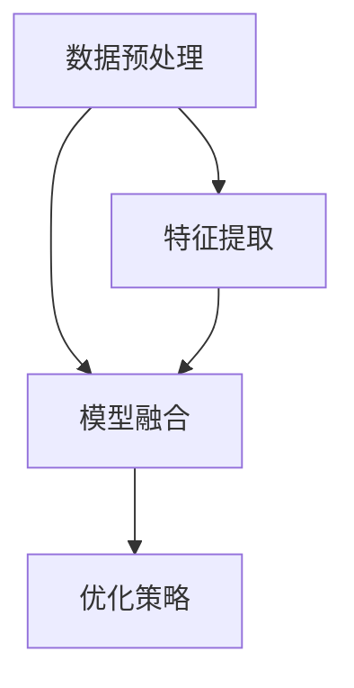
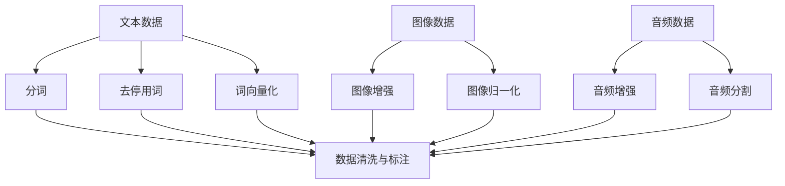

                 

## 多模态大模型：技术原理与实战 从0到1部署多模态大模型

### 关键词：

- 多模态大模型
- 数据预处理
- 特征提取
- 模型融合
- 实战部署

> 摘要：本文将深入探讨多模态大模型的技术原理与实战部署。我们将从概念、架构、算法、优化策略到实际项目应用进行详细讲解，帮助读者从0到1全面掌握多模态大模型的开发与部署。

### 《多模态大模型：技术原理与实战 从0到1部署多模态大模型》目录大纲

#### 第一部分：多模态大模型概述

1. **多模态大模型简介**
    1.1 多模态大模型的概念与背景
    1.2 多模态大模型的架构
    1.3 多模态大模型的应用领域

#### 第二部分：技术原理与算法

2. **多模态大模型技术基础**
    2.1 多模态数据预处理
    2.2 多模态特征提取
    2.3 多模态特征融合
    2.4 多模态大模型优化策略

#### 第三部分：实战部署

3. **多模态大模型项目实战**
    3.1 项目背景与目标
    3.2 数据收集与预处理
    3.3 模型设计与实现
    3.4 模型评估与优化
    3.5 部署与上线

#### 附录

4. **多模态大模型开发工具与资源**
    4.1 开发工具介绍
    4.2 资源推荐

---

**核心概念与联系**

在讨论多模态大模型之前，我们需要了解以下几个核心概念：

1. **多模态大模型**：结合图像、文本、声音等多维度数据进行学习与预测的模型。
2. **数据预处理**：确保数据质量和一致性，为特征提取和模型训练做准备。
3. **特征提取**：从原始数据中提取有意义的特征，为模型融合和训练提供基础。
4. **模型融合**：将不同模态的特征进行整合，形成统一的特征表示。
5. **优化策略**：通过调整模型参数和结构来提高模型性能。

这些概念之间存在紧密的联系。数据预处理是特征提取的基础，而特征提取则是模型融合的前提。最后，通过优化策略对模型进行调整和改进，以提高其性能和准确度。

**核心概念与联系的Mermaid流程图**：



### 核心算法原理讲解

在多模态大模型中，核心算法原理的讲解至关重要。以下我们将详细介绍几种关键算法原理：

1. **多层感知机（MLP）**：一种简单的多层神经网络结构，用于分类和回归任务。

**MLP伪代码**：

```python
initialize_weights()
for each epoch do
    for each sample do
        z = activation(σ(W * x + b))
        y_hat = activation(σ(W' * z + b'))
        loss = compute_loss(y_hat, y)
        backward_propagation(loss)
    end
end
```

2. **卷积神经网络（CNN）**：一种专门用于图像识别的神经网络结构，具有局部连接和权重共享的特点。

**CNN伪代码**：

```python
initialize_weights()
for each epoch do
    for each image do
        feature_map = convolution(image, filters)
        activation = activation_function(feature_map)
        pooling = max_pooling(activation)
        z = activation(σ(W * pooling + b))
        y_hat = activation(σ(W' * z + b'))
        loss = compute_loss(y_hat, y)
        backward_propagation(loss)
    end
end
```

3. **递归神经网络（RNN）**：一种用于序列数据处理和时间序列预测的神经网络结构，能够捕获时间依赖关系。

**RNN伪代码**：

```python
initialize_weights()
for each sequence do
    h = initialize_hidden_state()
    for each time step do
        x = input at time step
        h = activation(σ(W * [h, x] + b))
        y_hat = activation(σ(W' * h + b'))
        loss = compute_loss(y_hat, y)
        backward_propagation(loss)
    end
end
```

4. **注意力机制（Attention Mechanism）**：用于在序列数据中关注重要信息，提高模型性能。

**注意力机制伪代码**：

```python
initialize_weights()
for each sequence do
    h = initialize_hidden_state()
    for each time step do
        x = input at time step
        e = compute_attention_weights(h, x)
        context_vector = sum(e * h)
        h = activation(σ(W * [context_vector, x] + b))
        y_hat = activation(σ(W' * h + b'))
        loss = compute_loss(y_hat, y)
        backward_propagation(loss)
    end
end
```

5. **预训练与微调（Pre-training & Fine-tuning）**：预训练模型在大规模数据集上进行训练，然后在特定任务上进行微调。

**预训练与微调伪代码**：

```python
pretrain_model(on_large_dataset)
for each task do
    fine_tune_model(on_specific_dataset)
    evaluate_performance()
end
```

### 数学模型和数学公式

在多模态大模型中，数学模型和公式是核心组成部分。以下介绍几个重要的数学模型和公式：

1. **激活函数（Activation Function）**：

   - **Sigmoid函数**：

     $$ σ(x) = \frac{1}{1 + e^{-x}} $$

   - **ReLU函数**：

     $$ σ(x) = \max(0, x) $$

   - **Tanh函数**：

     $$ σ(x) = \frac{e^x - e^{-x}}{e^x + e^{-x}} $$

2. **损失函数（Loss Function）**：

   - **均方误差（MSE）**：

     $$ \text{MSE}(y, \hat{y}) = \frac{1}{n}\sum_{i=1}^{n}(y_i - \hat{y}_i)^2 $$

   - **交叉熵（Cross-Entropy）**：

     $$ \text{CE}(y, \hat{y}) = -\sum_{i=1}^{n}y_i \log(\hat{y}_i) $$

3. **优化器（Optimizer）**：

   - **随机梯度下降（SGD）**：

     $$ \theta_{t+1} = \theta_{t} - \alpha \nabla_{\theta} J(\theta) $$

   - **Adam优化器**：

     $$ m_t = \beta_1 m_{t-1} + (1 - \beta_1) \nabla_{\theta} J(\theta) $$
     $$ v_t = \beta_2 v_{t-1} + (1 - \beta_2) (\nabla_{\theta} J(\theta))^2 $$
     $$ \theta_{t+1} = \theta_{t} - \alpha \frac{m_t}{\sqrt{1 - \beta_2^t} + \epsilon} $$

### 举例说明

1. **图像分类任务**：使用卷积神经网络对猫狗图片进行分类。

   - **输入**：一幅猫狗图片。
   - **输出**：猫或狗的类别。

2. **文本生成任务**：使用递归神经网络生成文章摘要。

   - **输入**：一篇文章。
   - **输出**：文章的摘要。

3. **语音识别任务**：使用深度神经网络对语音信号进行转录。

   - **输入**：一段语音信号。
   - **输出**：对应的文本。

这些例子展示了多模态大模型在不同领域的应用。通过结合多种模态的数据，模型能够更准确地理解和预测目标。

### 核心算法原理讲解总结

在多模态大模型中，核心算法原理的讲解至关重要。多层感知机、卷积神经网络、递归神经网络、注意力机制和预训练与微调等算法为模型提供了强大的功能和灵活性。通过数学模型和公式的支持，我们能够更好地理解和优化模型。举例说明则帮助我们直观地看到算法在实际应用中的效果。

### 第三部分：实战部署

在本部分，我们将通过一个实际项目案例，详细讲解多模态大模型的开发与部署过程。

#### 项目背景与目标

项目背景：随着互联网的快速发展，多模态数据（如图像、文本、声音等）在各个领域得到广泛应用。为了提高信息处理和理解能力，我们设计了一个多模态情感分析系统。该系统能够接收文本、图像和音频等多模态数据，并输出相应的情感分类结果。

项目目标：
1. 收集并预处理多模态数据，确保数据质量。
2. 设计并实现一个高效的多模态大模型。
3. 对模型进行评估与优化，提高其性能。
4. 将模型部署到服务器，实现实时情感分析功能。

#### 数据收集与预处理

数据收集：
1. 文本数据：从社交媒体、新闻网站等公开数据源获取。
2. 图像数据：使用公开图像数据集，如COCO、ImageNet等。
3. 音频数据：从音频库中获取，如LJSpeech、TIMIT等。

数据预处理：
1. 文本数据：
   - 分词：将文本数据拆分成单词或词组。
   - 去停用词：去除无意义的停用词，如“的”、“了”等。
   - 词向量化：使用词嵌入技术将文本转换为向量表示。

2. 图像数据：
   - 图像增强：通过旋转、缩放、裁剪等操作增加数据多样性。
   - 图像归一化：将图像数据转换为标准尺寸和范围。

3. 音频数据：
   - 音频增强：通过添加噪声、调整音量等操作增加数据多样性。
   - 音频分割：将音频信号分割成帧，用于后续处理。

数据预处理流程：



#### 模型设计与实现

模型设计：
1. 数据预处理模块：对输入的多模态数据进行预处理，确保数据格式一致。
2. 特征提取模块：从预处理后的数据中提取有意义的特征，如文本的词向量、图像的卷积特征、音频的梅尔频率倒谱系数（MFCC）。
3. 模型融合模块：将不同模态的特征进行整合，形成统一的特征表示。
4. 分类模块：使用多层感知机（MLP）或卷积神经网络（CNN）对融合后的特征进行分类。

模型实现：

```python
# 数据预处理模块
def preprocess_data(text, image, audio):
    # 分词、去停用词、词向量化
    # 图像增强、归一化
    # 音频增强、分割
    pass

# 特征提取模块
def extract_features(text, image, audio):
    # 提取文本的词向量
    # 提取图像的卷积特征
    # 提取音频的MFCC特征
    pass

# 模型融合模块
def fuse_features(text_features, image_features, audio_features):
    # 将不同模态的特征进行整合
    pass

# 分类模块
def classify(fused_features):
    # 使用MLP或CNN对融合后的特征进行分类
    pass

# 模型训练
model = train_model(preprocess_data, extract_features, fuse_features, classify)
```

#### 模型评估与优化

模型评估：
1. 使用准确率、召回率、F1值等指标评估模型性能。
2. 分析模型在不同模态数据上的表现，找出潜在的优化方向。

模型优化：
1. 调整模型参数，如学习率、批量大小等。
2. 使用正则化技术，如L1正则化、L2正则化，防止过拟合。
3. 应用模型剪枝、模型蒸馏等技术，降低模型复杂度，提高性能。

#### 部署与上线

部署环境搭建：
1. 准备服务器，安装必要的软件和依赖库。
2. 配置容器化环境，如Docker，提高部署效率。

部署流程与策略：
1. 使用TensorFlow Serving或PyTorch Serving等工具部署模型。
2. 设计API接口，实现模型的调用和输入输出。
3. 实现模型监控与日志记录，确保系统的稳定运行。

部署后监控与维护：
1. 定期检查模型的性能和稳定性。
2. 更新和维护服务器和软件，确保系统的安全性。
3. 收集用户反馈，不断优化和改进模型。

### 实战部署总结

通过实际项目案例，我们详细讲解了多模态大模型的开发与部署过程。从数据收集与预处理、模型设计与实现、模型评估与优化到部署与上线，每个环节都需要认真对待。通过实战部署，我们能够将理论知识应用到实际项目中，提高系统的性能和可靠性。

### 附录

#### 附录A：多模态大模型开发工具与资源

**A.1 开发工具介绍**

1. **PyTorch**：一款开源的深度学习框架，支持动态计算图和自动微分，易于实现和调试。
2. **TensorFlow**：一款广泛使用的深度学习框架，提供丰富的工具和资源，支持静态计算图和动态计算图。
3. **其他深度学习框架**：如Keras、Theano等，可根据需求选择。

**A.2 资源推荐**

1. **开源代码与数据集**：如GitHub、Kaggle等，提供丰富的多模态数据集和开源代码。
2. **优质教程与论文**：如《深度学习》（Goodfellow et al.）等经典教材，以及最新的学术论文。
3. **社群与论坛**：如Stack Overflow、Reddit等，可以交流和解决技术问题。

### 作者

**作者：AI天才研究院/AI Genius Institute & 禅与计算机程序设计艺术 /Zen And The Art of Computer Programming**

---

通过本文的深入讲解，读者应该能够全面了解多模态大模型的技术原理与实战部署。从核心概念到算法原理，再到实际项目应用，本文涵盖了多模态大模型的各个方面。希望本文能够为读者在多模态大模型领域的研究和实践提供有益的指导和帮助。

