                 

# 大数据分析在电子商务中的应用策略

## 关键词
- 大数据分析
- 电子商务
- 用户行为分析
- 营销策略
- 竞争分析
- 供应链管理
- 风险管理
- 应用案例

## 摘要
随着互联网和大数据技术的飞速发展，电子商务已经成为现代商业的重要组成部分。大数据分析技术在电子商务中的应用，不仅提升了企业的运营效率，还大大增强了用户满意度。本文将从大数据分析的基础知识出发，深入探讨其在电子商务中的各种应用策略，通过具体的实例分析，展示大数据分析如何助力电子商务企业实现商业价值的最大化。

## 第一部分：大数据分析基础

### 第1章：大数据分析概述

#### 1.1 大数据的定义与特征

大数据（Big Data）是指无法使用传统数据处理方法在合理时间内捕捉、管理和处理的大量数据。其特征通常被描述为“4V”：
- **大量性（Volume）**：数据量巨大，从TB级到PB级不等。
- **多样性（Variety）**：数据类型繁多，包括结构化数据、半结构化数据和非结构化数据。
- **速度（Velocity）**：数据生成和处理速度极快，需要实时或近实时处理。
- **真实性（Veracity）**：数据真实性难以保证，可能存在噪声、错误和不一致性。

#### 1.2 大数据分析的意义与挑战

大数据分析对电子商务企业具有重要意义，它能够帮助企业：
- **提升用户体验**：通过用户行为分析，个性化推荐商品和服务。
- **优化营销策略**：通过数据挖掘，识别潜在客户，提高转化率。
- **降低运营成本**：通过供应链数据分析，优化库存和物流管理。

然而，大数据分析也面临诸多挑战，包括：
- **数据质量**：数据源多样，数据质量参差不齐，需要进行数据清洗和整合。
- **隐私保护**：用户隐私保护法规日益严格，如何在合法范围内利用用户数据成为难题。
- **技术门槛**：大数据分析需要专业的技术和工具，对企业的技术能力要求较高。

### 第2章：电子商务与大数据

#### 2.1 电子商务的概述

电子商务（Electronic Commerce，简称E-commerce）指的是通过互联网进行商品或服务的交易活动。其核心包括以下几个方面：
- **在线购物**：消费者在网上浏览、选择并购买商品或服务。
- **电子支付**：通过电子方式完成交易支付，如信用卡、支付宝等。
- **在线营销**：利用互联网进行市场推广，包括SEO、SEM、社交媒体营销等。

#### 2.2 大数据在电子商务中的应用场景

大数据在电子商务中的应用非常广泛，主要包括以下几个场景：
- **用户行为分析**：通过分析用户点击、购买等行为，了解用户需求，优化产品和服务。
- **个性化推荐**：根据用户历史行为和偏好，推荐相关商品或服务。
- **营销策略优化**：通过数据挖掘，分析市场趋势，制定更有效的营销策略。
- **供应链管理**：通过数据分析，优化库存和物流，降低成本，提高效率。
- **风险管理**：通过数据监控和分析，及时发现和预防风险。

### 第3章：大数据分析技术基础

#### 3.1 数据采集与存储技术

数据采集是大数据分析的基础，主要包括：
- **数据源接入**：通过API、爬虫等技术获取外部数据。
- **日志收集**：通过日志收集系统（如ELK栈）收集内部操作日志。

数据存储技术主要包括：
- **关系型数据库**：如MySQL、Oracle等，适合存储结构化数据。
- **NoSQL数据库**：如MongoDB、Cassandra等，适合存储大规模非结构化数据。

#### 3.2 数据处理与分析技术

数据处理与分析技术主要包括：
- **数据清洗**：通过数据预处理，去除重复、错误和不完整的数据。
- **数据集成**：将不同来源和格式的数据整合在一起，方便后续分析。
- **数据挖掘**：使用机器学习和数据挖掘算法，从大量数据中发现规律和模式。
- **数据可视化**：通过图表和可视化工具，将数据分析结果直观地呈现出来。

### 第4章：数据挖掘在电子商务中的应用

#### 4.1 聚类分析

聚类分析是一种无监督学习方法，通过将相似的数据点分组，用于用户行为分析和市场细分。

#### 4.2 协同过滤

协同过滤是一种基于用户行为或内容相似性的推荐方法，常用于电商平台的商品推荐。

#### 4.3 关联规则挖掘

关联规则挖掘用于发现数据之间的关联关系，常用于促销活动和商品组合推荐。

### 第5章：大数据分析在电子商务用户行为分析中的应用

#### 5.1 用户画像

用户画像是通过收集和分析用户行为数据，构建用户的基本信息和兴趣偏好模型。

#### 5.2 用户行为分析

用户行为分析通过分析用户在网站或APP上的行为，了解用户需求，优化产品和服务。

### 第6章：大数据分析在电子商务营销中的应用

#### 6.1 营销策略分析

营销策略分析通过数据挖掘，分析市场趋势，为电商企业提供有效的营销策略。

#### 6.2 用户参与度分析

用户参与度分析通过分析用户互动行为，评估营销活动的效果，优化营销策略。

### 第7章：大数据分析在电子商务供应链管理中的应用

#### 7.1 库存优化

库存优化通过数据分析，预测市场需求，合理调整库存水平，降低库存成本。

#### 7.2 物流优化

物流优化通过数据分析，优化物流路径和运输模式，提高物流效率，降低成本。

## 第二部分：大数据分析应用策略

### 第8章：大数据分析应用策略概述

#### 8.1 大数据分析应用策略的重要性

大数据分析应用策略对于电商企业具有重要意义，它能够帮助企业：
- 提高运营效率，降低成本。
- 提升用户体验，增强用户黏性。
- 增强竞争力，实现持续增长。

#### 8.2 大数据分析应用策略的制定方法

制定大数据分析应用策略的方法包括：
- **需求分析**：明确大数据分析的目标和需求。
- **技术选型**：选择适合的数据处理和分析工具。
- **数据质量管理**：确保数据质量，为分析提供可靠基础。
- **风险评估**：评估大数据分析可能带来的风险，并制定应对措施。

### 第9章：大数据分析在电子商务竞争分析中的应用

#### 9.1 市场趋势分析

市场趋势分析通过数据挖掘，分析市场变化趋势，为企业提供决策依据。

#### 9.2 竞争对手分析

竞争对手分析通过分析竞争对手的行为和策略，了解市场动态，制定应对策略。

### 第10章：大数据分析在电子商务创新中的应用

#### 10.1 新产品开发

大数据分析在电子商务新产品开发中的应用，通过用户行为数据和市场需求分析，预测新产品市场潜力。

#### 10.2 服务优化

大数据分析在电子商务服务优化中的应用，通过分析用户反馈和需求，优化服务流程和体验。

### 第11章：大数据分析在电子商务风险管理中的应用

#### 11.1 风险识别

风险识别通过数据分析，识别潜在风险，包括市场风险、运营风险等。

#### 11.2 风险评估与预警

风险评估与预警通过分析风险的概率和影响，制定预警机制，提前防范风险。

### 第12章：大数据分析在电子商务案例分析中的应用

#### 12.1 案例一：电商企业用户行为分析

分析某电商企业通过大数据分析了解用户行为，优化产品推荐的案例。

#### 12.2 案例二：电商企业营销策略分析

分析某电商企业通过大数据分析优化营销策略，提高用户转化率的案例。

## 第三部分：大数据分析在电子商务中的实践

### 第13章：大数据分析在电子商务实践中的挑战与解决方案

#### 13.1 数据质量管理

数据质量管理是大数据分析成功的关键，解决方案包括：
- 数据清洗：去除重复、错误和不完整的数据。
- 数据治理：建立数据管理流程，确保数据质量和一致性。

#### 13.2 数据分析人才短缺

数据分析人才短缺是当前面临的挑战，解决方案包括：
- 培训与招聘：加强数据分析人才的培训，同时积极招聘专业人才。
- 技术自动化：通过自动化工具提高数据分析效率，降低对人工的依赖。

#### 13.3 技术更新与维护

技术更新与维护是保证大数据分析系统正常运行的关键，解决方案包括：
- 技术评估：定期评估现有技术，确保技术符合业务需求。
- 技术升级：根据业务发展需要，及时进行技术升级和维护。

### 第14章：大数据分析在电子商务实践中的应用案例

#### 14.1 案例一：电商企业大数据分析平台搭建

分析某电商企业如何搭建大数据分析平台，实现数据分析的全面覆盖。

#### 14.2 案例二：电商企业大数据分析应用实践

分析某电商企业如何利用大数据分析，优化运营和营销策略，实现商业价值的提升。

### 第15章：大数据分析在电子商务实践中的未来趋势

#### 15.1 技术发展趋势

技术发展趋势包括：
- 人工智能与大数据的深度融合，提升数据分析的智能化水平。
- 云计算和边缘计算的发展，提高数据处理和分析的效率。

#### 15.2 应用领域拓展

应用领域拓展包括：
- 从传统的电商运营领域，拓展到供应链管理、智能客服等领域。
- 从国内市场拓展到国际市场，实现全球化布局。

## 附录

### 附录A：大数据分析常用工具与平台

- **Hadoop**：分布式数据处理平台，适用于大规模数据存储和处理。
- **Spark**：基于内存的分布式数据处理引擎，适用于实时数据分析。
- **Elasticsearch**：分布式搜索引擎，适用于大规模数据搜索和分析。

### 附录B：大数据分析相关书籍推荐

- **《大数据时代》**：解读大数据概念和商业应用。
- **《大数据战略》**：大数据战略规划与实施指南。
- **《大数据分析实战》**：大数据分析技能实战教程。

## 作者

作者：AI天才研究院/AI Genius Institute & 禅与计算机程序设计艺术 /Zen And The Art of Computer Programming

以上是《大数据分析在电子商务中的应用策略》的完整目录大纲，接下来将逐步深入到每个章节的具体内容，通过实例分析和详细讲解，展示大数据分析在电子商务中的广泛应用和实际效果。在接下来的章节中，我们将通过具体的案例和实践，进一步探讨大数据分析在电子商务中的实际应用，帮助读者更好地理解和掌握这一领域的前沿技术和策略。

### 第1章：大数据分析概述

#### 1.1 大数据的定义与特征

大数据（Big Data）一词在近几年得到了广泛的关注，它是随着互联网和信息技术的发展而产生的一个新概念。从技术角度来看，大数据主要指的是无法使用传统数据处理方法在合理时间内捕捉、管理和处理的大量数据。这些数据具有以下四个显著特征，通常被称为“4V”：

1. **大量性（Volume）**：大数据的第一个特征是数据量的巨大。这些数据可以来自各种来源，如社交网络、传感器、在线交易记录等，其规模从TB（Terabyte，千兆字节）到PB（Petabyte，百万亿字节）不等，甚至更大。这种数据规模使得传统的数据处理方法和工具无法满足处理需求。

2. **多样性（Variety）**：大数据的第二个特征是数据的多样性。这意味着大数据不仅包括传统的结构化数据（如数据库中的记录），还包括半结构化数据（如XML、JSON等）和非结构化数据（如文本、图像、视频等）。这种多样性使得数据处理和分析变得更加复杂，需要不同的技术和方法来处理不同类型的数据。

3. **速度（Velocity）**：大数据的第三个特征是数据生成的速度极快。这包括数据的实时生成和实时处理。例如，金融交易数据、传感器数据等，需要快速处理和分析，以便在短时间内做出决策。这要求数据处理系统具有高吞吐量和实时处理能力。

4. **真实性（Veracity）**：大数据的第四个特征是数据真实性难以保证。由于数据来源的广泛性和多样性，数据可能存在噪声、错误和不一致性。这使得数据清洗和质量控制成为大数据分析中的一项重要工作。

为了更好地理解大数据的概念和特征，我们可以通过一个简单的Mermaid流程图来展示大数据的处理流程：

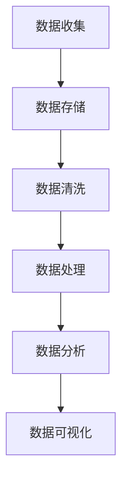

在这个流程图中，数据首先从各种来源被收集到，然后存储在相应的数据存储系统中。接下来，对数据进行清洗，以去除重复、错误和不完整的数据。清洗后的数据被处理和分析，最后通过数据可视化工具将分析结果呈现出来。

#### 1.2 大数据分析的意义与挑战

大数据分析在电子商务中的应用具有重要意义，它能够帮助企业实现以下几个方面的提升：

1. **提升用户体验**：通过分析用户行为数据，电商企业可以了解用户的需求和偏好，提供个性化的商品推荐和服务，从而提升用户体验。

2. **优化营销策略**：大数据分析可以帮助电商企业分析市场趋势和用户行为，制定更有效的营销策略，提高用户转化率和销售额。

3. **降低运营成本**：通过大数据分析，电商企业可以优化库存管理和物流配送，降低运营成本，提高整体运营效率。

4. **增强竞争力**：通过大数据分析，电商企业可以了解竞争对手的策略和市场动态，制定相应的竞争策略，增强市场竞争力。

然而，大数据分析也面临诸多挑战，主要包括：

1. **数据质量**：由于数据来源的广泛性和多样性，数据质量参差不齐，可能存在噪声、错误和不一致性。这需要电商企业进行数据清洗和质量控制，确保数据的准确性和一致性。

2. **隐私保护**：随着用户隐私保护法规的日益严格，电商企业需要在合法范围内利用用户数据，避免侵犯用户隐私。这要求电商企业建立完善的数据保护机制和合规性管理。

3. **技术门槛**：大数据分析需要专业的技术和工具，如Hadoop、Spark等。这要求电商企业具备相应技术能力，或者寻求外部技术支持。

4. **数据安全**：大数据分析过程中，数据的安全性和完整性需要得到保障。电商企业需要建立完善的数据安全策略，防范数据泄露和攻击。

为了更好地理解大数据分析在电子商务中的应用，我们可以通过一个简化的伪代码来展示其基本流程：

```python
def big_data_analysis(data):
    # 数据清洗
    cleaned_data = clean_data(data)
    
    # 数据处理
    processed_data = process_data(cleaned_data)
    
    # 数据分析
    analysis_result = analyze_data(processed_data)
    
    # 数据可视化
    visualize_data(analysis_result)
    
    return analysis_result
```

在这个伪代码中，`big_data_analysis`函数接收一个数据集`data`，然后依次进行数据清洗、数据处理、数据分析和数据可视化。最后，返回分析结果。

通过以上分析，我们可以看到大数据分析在电子商务中具有广泛的应用前景和挑战。电商企业需要充分利用大数据技术，提升用户体验和运营效率，同时确保数据质量和安全。在接下来的章节中，我们将进一步探讨大数据分析在电子商务中的具体应用场景和技术实现。

### 第2章：电子商务与大数据

#### 2.1 电子商务的概述

电子商务（Electronic Commerce，简称E-commerce）是指通过互联网进行商品或服务的交易活动。电子商务的兴起，打破了传统商务的时间和空间限制，使得消费者可以随时随地购物，企业可以全球范围内开展业务。电子商务的核心包括以下几个方面：

1. **在线购物**：消费者可以通过电子商务平台浏览、选择并购买商品或服务。这些平台通常包括B2C（Business to Consumer，企业对消费者）、B2B（Business to Business，企业对企业）和C2C（Consumer to Consumer，消费者对消费者）等类型。

2. **电子支付**：电子支付是电子商务的重要组成部分，消费者可以通过信用卡、支付宝、微信支付等电子支付方式完成交易支付。电子支付提供了便捷、安全、高效的支付解决方案，推动了电子商务的发展。

3. **在线营销**：电子商务企业通过搜索引擎优化（SEO）、搜索引擎营销（SEM）、社交媒体营销、内容营销等多种在线营销手段，吸引潜在客户，提升品牌知名度和销售额。

4. **客户服务**：电子商务企业通过在线客服、电话客服、邮件客服等多种方式，提供优质的客户服务，解答客户疑问，解决客户问题，提升客户满意度。

5. **物流配送**：电子商务的物流配送是确保商品及时送达的关键环节。随着物流技术的进步，电子商务企业可以提供更高效、更灵活的物流服务，满足消费者的快速配送需求。

#### 2.2 大数据在电子商务中的应用场景

大数据在电子商务中的应用场景非常广泛，主要包括以下几个方面：

1. **用户行为分析**：通过大数据技术，电子商务企业可以收集和分析用户在网站或APP上的行为数据，如浏览记录、购买记录、搜索关键词等。这些数据可以帮助企业了解用户需求和行为习惯，提供个性化的商品推荐和服务，提升用户体验。

2. **个性化推荐**：基于用户行为数据和兴趣偏好，大数据分析可以推荐相关商品或服务，提升用户购买转化率和满意度。例如，电商平台可以根据用户的浏览历史和购买记录，推荐类似的商品或相关的促销活动。

3. **营销策略优化**：通过大数据分析，电子商务企业可以深入了解市场趋势和用户需求，制定更有效的营销策略。例如，分析不同营销渠道的效果，优化广告投放策略，提高广告投放的精准度和投资回报率。

4. **供应链管理**：大数据分析可以帮助电子商务企业优化供应链管理，提高库存周转率和物流效率。例如，通过分析销售数据和市场需求，预测未来的库存需求，合理调整库存水平，减少库存成本和缺货风险。

5. **风险管理**：大数据分析可以帮助电子商务企业识别和预测风险，制定相应的风险管理策略。例如，分析用户投诉数据和交易记录，识别潜在的欺诈行为，采取措施防范和减少风险。

6. **客户服务**：大数据分析可以帮助电子商务企业提供更优质的客户服务。例如，通过分析客户反馈和互动数据，优化客户服务流程，提高客户满意度。

7. **市场趋势分析**：通过大数据分析，电子商务企业可以了解市场趋势和竞争环境，制定相应的市场策略。例如，分析竞争对手的营销活动和市场表现，预测市场变化趋势，提前布局。

为了更好地理解大数据在电子商务中的应用场景，我们可以通过以下Mermaid流程图来展示：

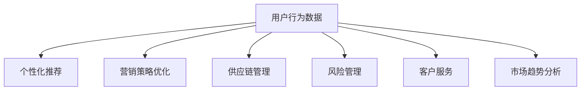

在这个流程图中，用户行为数据作为输入，通过不同的分析应用，产生个性化推荐、营销策略优化、供应链管理、风险管理、客户服务和市场趋势分析等输出。这些输出可以帮助电子商务企业提升运营效率，增强竞争力。

通过以上分析，我们可以看到大数据在电子商务中具有广泛的应用场景和巨大的潜力。电子商务企业需要充分利用大数据技术，深入挖掘数据价值，提升用户体验和运营效率，实现商业价值的最大化。在接下来的章节中，我们将进一步探讨大数据分析在电子商务中的具体技术和实现方法。

### 第3章：大数据分析技术基础

#### 3.1 数据采集与存储技术

数据采集和存储是大数据分析的基础，对于确保数据质量和分析效率至关重要。以下将介绍数据采集与存储的相关技术和方法。

**数据采集**

1. **数据源接入**

   数据源接入是指将不同来源的数据集成到大数据系统中。常见的数据源包括：
   - **关系型数据库**：如MySQL、Oracle等，用于存储结构化数据。
   - **NoSQL数据库**：如MongoDB、Cassandra等，用于存储大规模的非结构化数据。
   - **日志收集系统**：如ELK栈（Elasticsearch、Logstash、Kafka），用于收集和存储日志数据。
   - **Web爬虫**：通过爬虫技术从互联网上获取数据。

2. **数据采集工具**

   常用的数据采集工具有：
   - **Flume**：Apache Flume是一种分布式、可靠且可扩展的数据收集工具，适用于收集和聚合日志数据。
   - **Kafka**：Apache Kafka是一种高吞吐量的消息队列系统，适用于实时数据收集和传输。
   - **Logstash**：Logstash是一种数据管道，用于收集、处理和存储日志数据。

**数据存储**

1. **关系型数据库**

   关系型数据库（如MySQL、Oracle）主要用于存储结构化数据。它们具有以下特点：
   - **数据一致性**：支持事务处理，确保数据的一致性。
   - **查询效率**：通过索引和优化器提高查询效率。
   - **ACID特性**：支持原子性、一致性、隔离性和持久性。

2. **NoSQL数据库**

   NoSQL数据库（如MongoDB、Cassandra）主要用于存储大规模的非结构化数据。它们具有以下特点：
   - **灵活性**：支持多种数据模型，如文档、键值对、宽列族。
   - **可扩展性**：通过分布式架构实现水平扩展。
   - **高性能**：适用于读写密集型应用。

3. **分布式文件系统**

   分布式文件系统（如Hadoop Distributed File System，HDFS）用于存储大规模数据。它们具有以下特点：
   - **高容错性**：通过副本机制实现数据冗余和容错。
   - **高吞吐量**：适用于大数据处理和分析。
   - **高可用性**：通过冗余和故障转移实现高可用性。

4. **数据湖**

   数据湖是一种新兴的数据存储架构，用于存储大量多样化的数据。它们具有以下特点：
   - **数据多样性**：支持多种数据类型，如结构化、半结构化和非结构化数据。
   - **低成本**：适用于存储大规模数据，成本较低。
   - **灵活性**：支持数据探索和分析，适用于数据科学和机器学习。

为了更好地理解数据采集与存储技术，我们可以通过以下Mermaid流程图来展示：

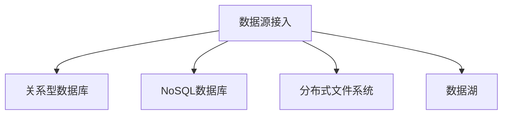

在这个流程图中，数据源接入包括关系型数据库、NoSQL数据库、分布式文件系统和数据湖。这些数据存储技术适用于不同类型的数据，以满足大数据分析的需求。

通过以上分析，我们可以看到数据采集与存储技术在大数据分析中具有重要的作用。电子商务企业需要根据数据类型和需求，选择合适的数据存储技术，确保数据质量和分析效率。

#### 3.2 数据处理与分析技术

数据处理与分析是大数据分析的核心环节，它决定了数据的价值能否被充分挖掘。以下将介绍数据处理与分析的相关技术和方法。

**数据处理**

1. **数据清洗**

   数据清洗是数据处理的第一步，目的是去除数据中的重复、错误和不完整的数据。数据清洗主要包括以下操作：
   - **去重**：去除重复的数据记录。
   - **补全**：填充缺失的数据值。
   - **标准化**：统一数据格式和单位，如日期、货币等。
   - **校验**：检查数据的一致性和完整性。

2. **数据集成**

   数据集成是将来自不同来源和格式的数据整合在一起，以便后续分析。数据集成主要包括以下步骤：
   - **数据抽取**：从不同数据源中抽取数据。
   - **数据转换**：将数据转换为统一的格式和结构。
   - **数据加载**：将转换后的数据加载到数据仓库或数据湖中。

3. **数据转换**

   数据转换是指将原始数据转换为适合分析和处理的形式。数据转换主要包括以下操作：
   - **数据类型转换**：如将字符串转换为数字或日期。
   - **数据归一化**：将不同尺度的数据进行归一化处理，如标准化或最小最大化处理。
   - **数据聚合**：将多个数据记录合并为一个记录，如求和、平均、最大值等。

**数据分析**

1. **描述性分析**

   描述性分析是对数据进行统计和总结，以了解数据的分布和特征。描述性分析主要包括以下指标：
   - **均值**：数据的平均值。
   - **中位数**：数据中间的值。
   - **众数**：数据中出现次数最多的值。
   - **标准差**：数据离散程度的度量。
   - **方差**：数据离散程度的度量。

2. **数据可视化**

   数据可视化是将数据分析结果以图形或图表的形式直观地呈现出来，以便更好地理解和分析数据。常见的数据可视化工具有：
   - **ECharts**：一款强大的JavaScript图表库，支持多种图表类型。
   - **Tableau**：一款专业的数据可视化工具，支持拖拽操作和实时更新。
   - **Matplotlib**：一款Python数据可视化库，适用于科学计算和数据分析。

3. **数据挖掘**

   数据挖掘是从大量数据中自动发现隐藏的、未知的规律和模式，以提高决策能力。常见的数据挖掘技术包括：
   - **聚类分析**：将相似的数据点分组，用于市场细分和用户行为分析。
   - **分类分析**：将数据分为不同的类别，用于预测和分类。
   - **关联规则挖掘**：发现数据之间的关联关系，用于促销活动和商品组合推荐。
   - **异常检测**：识别数据中的异常值和异常行为，用于风险管理和欺诈检测。

为了更好地理解数据处理与分析技术，我们可以通过以下Mermaid流程图来展示：

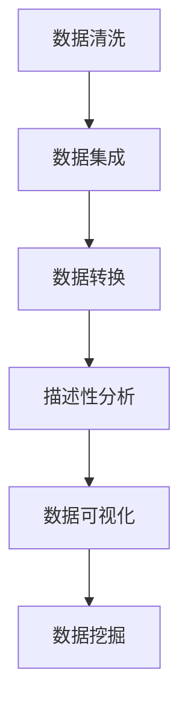

在这个流程图中，数据处理包括数据清洗、数据集成、数据转换、描述性分析、数据可视化和数据挖掘。这些技术共同构成了大数据分析的核心。

通过以上分析，我们可以看到数据处理与分析技术在大数据分析中具有重要的作用。电子商务企业需要充分利用这些技术，挖掘数据价值，提升业务决策的准确性。

#### 3.3 数据存储技术

数据存储技术是大数据分析的重要组成部分，它决定了数据能否被有效地管理和利用。以下将介绍数据存储技术的基本概念和常用工具。

**基本概念**

1. **数据仓库**：数据仓库是一种用于存储和管理大量结构化数据的数据存储系统。它支持数据的集成、清洗、转换和分析，以便为决策提供支持。

2. **数据湖**：数据湖是一种用于存储大规模多样化数据的数据存储系统。它支持结构化、半结构化和非结构化数据的存储，以便进行数据探索和分析。

3. **数据湖仓**：数据湖仓是一种结合了数据仓库和数据湖特点的数据存储系统。它既能存储结构化数据，也能存储非结构化数据，同时提供高效的查询和分析能力。

**常用工具**

1. **Hadoop**：Hadoop是一个分布式数据存储和处理平台，适用于大规模数据的存储和处理。它包括HDFS（Hadoop Distributed File System，分布式文件系统）和MapReduce（分布式计算框架）。

2. **Spark**：Spark是一个高速的分布式数据处理引擎，适用于实时数据分析。它包括Spark SQL（用于结构化数据查询）、Spark Streaming（用于实时数据流处理）和MLlib（用于机器学习）。

3. **Elasticsearch**：Elasticsearch是一个分布式搜索引擎，适用于大规模数据的搜索和分析。它支持结构化数据、半结构化数据和非结构化数据的存储和查询。

4. **MongoDB**：MongoDB是一个分布式文档数据库，适用于大规模数据的存储和管理。它支持灵活的数据模型和高效的读写性能。

5. **Cassandra**：Cassandra是一个分布式键值存储系统，适用于大规模数据的存储和查询。它支持高可用性和高性能的分布式架构。

为了更好地理解数据存储技术，我们可以通过以下Mermaid流程图来展示：

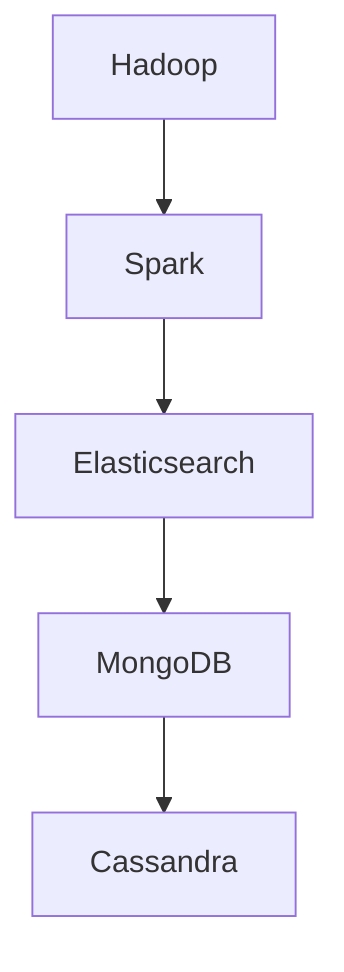

在这个流程图中，Hadoop、Spark、Elasticsearch、MongoDB和Cassandra是常用的数据存储技术。这些技术适用于不同类型的数据和场景，以满足大数据分析的需求。

通过以上分析，我们可以看到数据存储技术在大数据分析中具有重要的作用。电子商务企业需要根据业务需求和数据类型，选择合适的数据存储技术，确保数据质量和分析效率。

#### 3.4 数据处理与分析技术的应用

数据处理与分析技术在电子商务中有着广泛的应用，它们不仅能够提升企业的运营效率，还能够增强用户体验和市场竞争力。以下将详细探讨数据处理与分析技术在实际中的应用。

**用户行为分析**

用户行为分析是电子商务中最常见的大数据分析应用之一。通过收集和分析用户在网站或APP上的行为数据，如浏览记录、点击次数、购买行为等，电子商务企业可以深入了解用户的需求和行为模式。

1. **用户画像**：通过用户行为数据，电子商务企业可以构建用户画像，包括用户的年龄、性别、兴趣爱好、消费能力等信息。用户画像有助于企业进行精准营销和个性化推荐。

2. **转化率分析**：通过分析用户浏览路径、停留时间等行为数据，电子商务企业可以识别出影响用户转化的关键因素，如页面加载速度、页面设计、产品描述等，从而优化网站或APP的体验，提高用户转化率。

3. **留存率分析**：通过分析用户的留存数据，电子商务企业可以了解用户的忠诚度，识别出留存率较低的用户群体，并采取相应的策略提升用户留存率。

**个性化推荐**

个性化推荐是大数据分析在电子商务中的另一个重要应用。通过分析用户的历史行为和兴趣偏好，电子商务企业可以为每个用户推荐相关的商品或服务，从而提升用户满意度和购买转化率。

1. **协同过滤**：协同过滤是一种基于用户行为相似性的推荐方法。它通过分析用户之间的行为相似性，为用户推荐相似的物品。协同过滤包括用户基于的协同过滤和物品基于的协同过滤两种类型。

2. **基于内容的推荐**：基于内容的推荐方法通过分析商品的属性和用户的历史行为，为用户推荐具有相似属性的物品。这种方法适用于新用户或用户行为数据不足的情况。

3. **混合推荐**：混合推荐是将协同过滤和基于内容的推荐方法相结合，以提高推荐系统的准确性和覆盖面。

**营销策略优化**

大数据分析可以帮助电子商务企业优化营销策略，提高营销效果和投资回报率。

1. **广告投放优化**：通过分析用户的浏览和点击数据，电子商务企业可以了解不同广告渠道的效果，优化广告投放策略，提高广告投放的精准度和投资回报率。

2. **促销活动分析**：通过分析促销活动的数据，电子商务企业可以了解促销活动的效果，如销售额、转化率等，从而优化促销策略，提高促销活动的效果。

3. **用户参与度分析**：通过分析用户的互动行为，如评论、分享、点赞等，电子商务企业可以了解用户的参与度，制定相应的策略提升用户参与度。

**供应链管理**

大数据分析在电子商务供应链管理中的应用可以帮助企业优化库存管理和物流配送，提高供应链效率。

1. **库存优化**：通过分析销售数据和市场需求，电子商务企业可以预测未来的库存需求，合理调整库存水平，减少库存成本和缺货风险。

2. **物流优化**：通过分析物流数据，如运输时间、运输成本等，电子商务企业可以优化物流路径和运输模式，提高物流效率，降低成本。

**风险管理**

大数据分析在电子商务风险管理中的应用可以帮助企业识别和预测风险，制定相应的风险管理策略。

1. **用户行为分析**：通过分析用户的行为数据，电子商务企业可以识别出潜在的风险用户，如频繁退货、恶意评论等，提前采取防范措施。

2. **交易监控**：通过分析交易数据，电子商务企业可以识别出异常交易行为，如欺诈交易等，及时采取措施防范风险。

**客户服务**

大数据分析在电子商务客户服务中的应用可以帮助企业提供更优质的客户服务。

1. **客服数据分析**：通过分析客服数据，电子商务企业可以了解客户的问题和需求，优化客服流程和服务质量。

2. **客户反馈分析**：通过分析客户反馈数据，电子商务企业可以了解客户的满意度和不满意度，改进产品和服务。

**市场趋势分析**

大数据分析可以帮助电子商务企业了解市场趋势和竞争环境，制定相应的市场策略。

1. **市场趋势分析**：通过分析市场数据，电子商务企业可以了解市场变化趋势，预测未来的市场机会和挑战。

2. **竞争对手分析**：通过分析竞争对手的数据，电子商务企业可以了解竞争对手的策略和市场表现，制定相应的竞争策略。

通过以上分析，我们可以看到数据处理与分析技术在电子商务中的应用非常广泛，它们可以帮助企业提升运营效率、增强用户体验、优化营销策略、提高供应链效率和增强市场竞争力。电子商务企业需要充分利用大数据技术，挖掘数据价值，实现商业价值的最大化。

### 第4章：数据挖掘在电子商务中的应用

#### 4.1 聚类分析

聚类分析是一种无监督学习方法，它通过将相似的数据点分组，用于市场细分和用户行为分析。在电子商务中，聚类分析可以应用于以下几个方面：

1. **用户行为分析**：通过聚类分析，电子商务企业可以将用户分为不同的群体，了解不同群体的行为特征和需求，从而提供个性化的服务。例如，分析用户在网站上的浏览路径和购买行为，将用户分为“高频买家”、“潜在买家”和“沉默用户”等群体。

2. **商品推荐**：聚类分析可以用于商品推荐，将相似的商品分组，为用户提供相关的推荐。例如，分析商品的属性和用户的历史购买记录，将商品分为“热门商品”、“推荐商品”和“新品”等类别。

3. **市场细分**：聚类分析可以帮助电子商务企业进行市场细分，了解不同市场的需求和特点，从而制定相应的营销策略。例如，分析用户的地域、年龄、性别等信息，将市场分为“都市人群”、“年轻人群”和“家庭用户”等群体。

为了更好地理解聚类分析在电子商务中的应用，我们可以通过以下Mermaid流程图来展示：

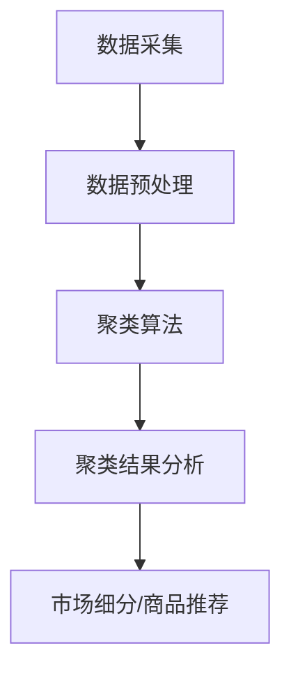

在这个流程图中，数据采集是输入，数据预处理是中间步骤，聚类算法是核心，聚类结果分析是输出，市场细分和商品推荐是应用结果。

#### 4.2 协同过滤

协同过滤是一种基于用户行为相似性的推荐方法，它通过分析用户之间的行为相似性，为用户推荐相关的商品或服务。在电子商务中，协同过滤可以应用于以下几个方面：

1. **个性化推荐**：通过协同过滤，电子商务企业可以为每个用户推荐相关的商品或服务，从而提升用户满意度和购买转化率。例如，分析用户的浏览历史和购买记录，为用户推荐类似的商品。

2. **新品推广**：对于新商品，协同过滤可以帮助电子商务企业识别出潜在感兴趣的用户群体，从而进行精准的推广。例如，分析用户的浏览和购买记录，将新商品推荐给历史购买过类似商品的潜在用户。

3. **商品组合推荐**：协同过滤可以用于商品组合推荐，为用户推荐相关的商品组合。例如，分析用户的购买记录，为用户推荐相关的配件或组合商品。

为了更好地理解协同过滤在电子商务中的应用，我们可以通过以下Mermaid流程图来展示：

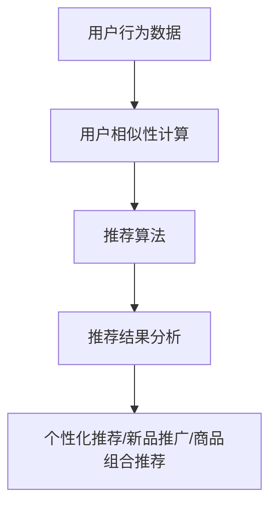

在这个流程图中，用户行为数据是输入，用户相似性计算是中间步骤，推荐算法是核心，推荐结果分析是输出，个性化推荐、新品推广和商品组合推荐是应用结果。

#### 4.3 关联规则挖掘

关联规则挖掘是一种用于发现数据之间关联关系的方法，它通过分析大量数据，识别出数据之间的潜在关联规则。在电子商务中，关联规则挖掘可以应用于以下几个方面：

1. **促销活动设计**：通过关联规则挖掘，电子商务企业可以识别出商品之间的关联关系，从而设计出更有针对性的促销活动。例如，分析商品的购买记录，识别出经常一起购买的商品，设计捆绑促销活动。

2. **商品组合推荐**：关联规则挖掘可以帮助电子商务企业识别出用户经常一起购买的商品组合，从而为用户提供相关的推荐。例如，分析用户的购买记录，推荐相关的商品组合，如“鼠标+鼠标垫”、“电脑+显示器”等。

3. **库存管理**：通过关联规则挖掘，电子商务企业可以了解商品之间的销售关联性，从而优化库存管理。例如，分析商品的购买记录，预测未来的库存需求，合理调整库存水平。

为了更好地理解关联规则挖掘在电子商务中的应用，我们可以通过以下Mermaid流程图来展示：

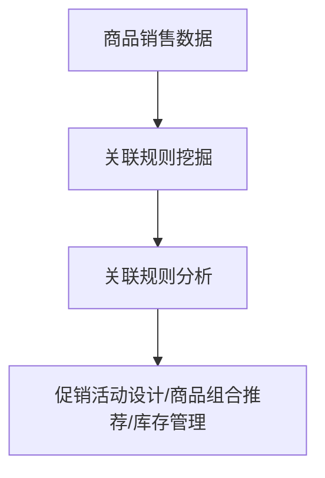

在这个流程图中，商品销售数据是输入，关联规则挖掘是核心，关联规则分析是输出，促销活动设计、商品组合推荐和库存管理是应用结果。

通过以上分析，我们可以看到数据挖掘技术在电子商务中有着广泛的应用，它们可以帮助电子商务企业提升用户体验、优化营销策略、提高运营效率和增强市场竞争力。在接下来的章节中，我们将进一步探讨大数据分析在电子商务用户行为分析、营销策略优化、供应链管理等方面的应用。

### 第5章：大数据分析在电子商务用户行为分析中的应用

#### 5.1 用户画像

用户画像（User Profiling）是一种通过数据分析技术构建的用户基本属性和兴趣偏好模型。在电子商务中，用户画像是大数据分析的重要应用之一，它有助于企业了解用户需求，提供个性化的服务和推荐。

**构建用户画像的基本步骤**：

1. **数据收集**：收集用户在电子商务平台上的行为数据，如浏览记录、购买记录、搜索关键词、评论等。

2. **数据清洗**：清洗和整合来自不同渠道的数据，去除重复、错误和不完整的数据。

3. **特征提取**：从原始数据中提取用户的基本属性（如年龄、性别、地理位置）和兴趣偏好（如购物偏好、浏览习惯）。

4. **建模与评估**：使用机器学习和数据挖掘算法构建用户画像模型，并对模型进行评估和优化。

**用户画像在电子商务中的应用**：

1. **个性化推荐**：基于用户画像，电子商务平台可以为每个用户推荐相关的商品和服务。例如，用户浏览了运动鞋，系统可以推荐相关的运动服装和配件。

2. **用户分类**：用户画像有助于将用户分为不同的群体，如“高频买家”、“潜在买家”和“沉默用户”。企业可以根据不同群体的特征，制定相应的营销策略。

3. **用户运营**：用户画像帮助企业了解用户的偏好和需求，优化用户运营策略，提高用户参与度和忠诚度。

为了更好地理解用户画像的构建和应用，我们可以通过以下Mermaid流程图来展示：

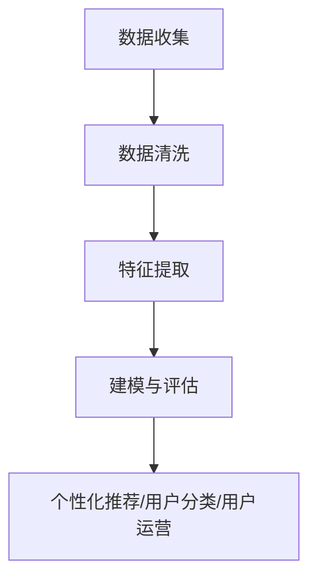

在这个流程图中，数据收集是输入，数据清洗、特征提取、建模与评估是中间步骤，个性化推荐、用户分类和用户运营是应用结果。

#### 5.2 用户行为分析

用户行为分析（User Behavior Analysis）是通过分析用户在电子商务平台上的行为数据，了解用户的需求和行为模式。用户行为分析可以帮助企业优化用户体验，提升用户满意度和转化率。

**用户行为分析的关键指标**：

1. **浏览时长**：用户在网站或APP上停留的时间，反映了用户对内容的兴趣程度。

2. **跳出率**：用户在进入网站或APP后立即离开的比率，反映了网站或APP的吸引力。

3. **转化率**：用户完成特定目标（如购买、注册、下载）的比率，反映了营销策略的有效性。

4. **复购率**：用户在购买后再次购买的比例，反映了用户对品牌和产品的忠诚度。

**用户行为分析的方法**：

1. **行为路径分析**：通过分析用户在网站或APP上的行为路径，了解用户如何到达目标页面，识别优化机会。

2. **留存分析**：通过分析用户的行为数据和留存数据，了解用户留存率较低的原因，制定优化策略。

3. **A/B测试**：通过对比不同页面、功能和营销策略的效果，找出最佳方案。

**用户行为分析在电子商务中的应用**：

1. **网站优化**：通过分析用户行为数据，识别出影响用户转化的关键因素，如页面加载速度、导航设计、内容质量等，从而优化网站或APP的体验。

2. **营销策略优化**：通过分析用户行为数据，了解用户的偏好和需求，制定更有效的营销策略，提高用户参与度和转化率。

3. **产品优化**：通过分析用户对产品的评价和反馈，优化产品设计和功能，提升用户满意度。

为了更好地理解用户行为分析的方法和应用，我们可以通过以下Mermaid流程图来展示：

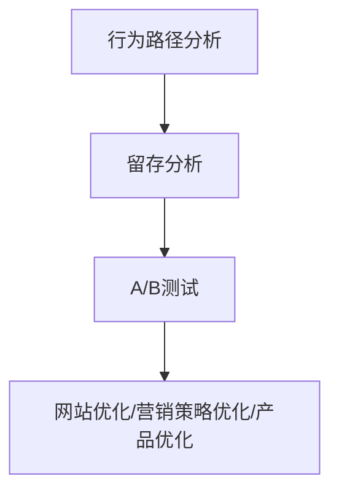

在这个流程图中，行为路径分析、留存分析和A/B测试是用户行为分析的方法，网站优化、营销策略优化和产品优化是应用结果。

通过以上分析，我们可以看到用户画像和用户行为分析在电子商务中具有重要的应用价值。电子商务企业需要充分利用大数据技术，构建用户画像，分析用户行为，提供个性化的服务和推荐，提升用户体验和转化率。在接下来的章节中，我们将进一步探讨大数据分析在电子商务营销策略优化和供应链管理中的应用。

### 第6章：大数据分析在电子商务营销中的应用

#### 6.1 营销策略分析

大数据分析在电子商务营销策略分析中发挥着重要作用。通过分析大量用户行为数据和市场数据，企业可以深入了解用户需求和市场趋势，从而制定更有效的营销策略。

**营销策略分析的关键步骤**：

1. **数据收集**：收集用户在电子商务平台上的行为数据，如浏览记录、购买记录、搜索关键词、页面停留时间等。

2. **数据预处理**：清洗和整合来自不同渠道的数据，去除重复、错误和不完整的数据。

3. **用户画像**：构建用户画像，提取用户的基本属性和兴趣偏好。

4. **市场趋势分析**：分析市场数据，了解行业动态和竞争对手的表现。

5. **营销策略评估**：评估现有营销策略的效果，识别优化机会。

**营销策略分析在电子商务中的应用**：

1. **广告投放优化**：通过分析用户行为数据和广告投放效果，优化广告投放策略，提高广告的点击率和转化率。

2. **促销活动设计**：基于用户需求和购买行为，设计更具针对性的促销活动，提升用户参与度和购买意愿。

3. **内容营销**：通过分析用户兴趣和偏好，制定内容营销策略，提升品牌知名度和用户粘性。

为了更好地理解营销策略分析的方法和应用，我们可以通过以下Mermaid流程图来展示：

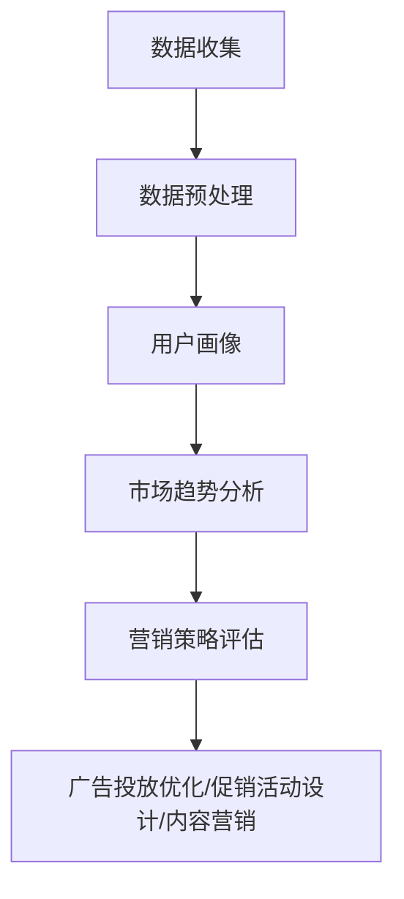

在这个流程图中，数据收集是输入，数据预处理、用户画像、市场趋势分析和营销策略评估是中间步骤，广告投放优化、促销活动设计和内容营销是应用结果。

#### 6.2 用户参与度分析

用户参与度分析是电子商务营销中的一项重要任务，通过分析用户在平台上的互动行为，企业可以了解用户的参与程度，制定相应的策略提升用户粘性。

**用户参与度的关键指标**：

1. **活跃度**：用户在平台上的活跃程度，如登录频率、浏览时长、互动行为等。

2. **留存率**：用户在一定时间内持续使用平台的比率，反映了用户对品牌的忠诚度。

3. **互动率**：用户在平台上的互动行为，如评论、点赞、分享等。

4. **转化率**：用户完成特定目标（如购买、注册、下载）的比率，反映了营销策略的有效性。

**用户参与度分析的方法**：

1. **用户行为分析**：通过分析用户在平台上的行为数据，了解用户的参与程度和兴趣点。

2. **留存分析**：通过分析用户留存数据，了解用户流失的原因，制定优化策略。

3. **互动分析**：通过分析用户的互动行为，识别出受欢迎的功能和内容，优化用户体验。

**用户参与度分析在电子商务中的应用**：

1. **用户运营**：通过分析用户参与度，制定针对性的用户运营策略，提高用户粘性和忠诚度。

2. **活动营销**：通过分析用户参与度，设计更有效的活动营销策略，提升用户参与度和活跃度。

3. **产品优化**：通过分析用户参与度，优化产品功能和设计，提升用户体验。

为了更好地理解用户参与度分析的方法和应用，我们可以通过以下Mermaid流程图来展示：

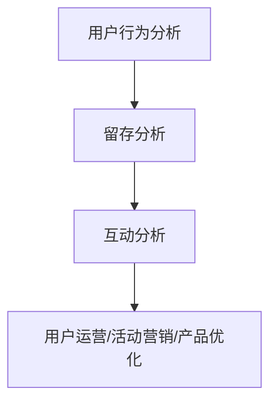

在这个流程图中，用户行为分析、留存分析和互动分析是用户参与度分析的方法，用户运营、活动营销和产品优化是应用结果。

通过以上分析，我们可以看到大数据分析在电子商务营销策略分析和用户参与度分析中具有广泛的应用。电子商务企业需要充分利用大数据技术，深入挖掘数据价值，制定更有效的营销策略，提升用户参与度和忠诚度。在接下来的章节中，我们将进一步探讨大数据分析在电子商务供应链管理和风险管理中的应用。

### 第7章：大数据分析在电子商务供应链管理中的应用

#### 7.1 库存优化

库存优化是电子商务供应链管理中的一项关键任务，通过大数据分析，企业可以更准确地预测市场需求，优化库存水平，降低库存成本和缺货风险。

**库存优化关键步骤**：

1. **数据收集**：收集销售数据、市场需求预测、库存水平等数据。

2. **数据预处理**：清洗和整合来自不同渠道的数据，确保数据质量。

3. **需求预测**：使用时间序列分析、回归分析等方法，预测市场需求。

4. **库存模型**：建立库存优化模型，如经济订货量（EOQ）模型、周期盘点模型等。

5. **库存调整**：根据需求预测和库存模型，调整库存水平，确保库存既不过剩也不短缺。

**库存优化在电子商务中的应用**：

1. **预测性库存管理**：通过大数据分析，预测未来的市场需求，提前进行库存调整，避免缺货或库存过剩。

2. **动态库存调整**：根据销售数据和库存水平，实时调整库存，确保库存与市场需求匹配。

3. **优化库存配置**：通过分析不同仓库的库存水平，优化库存配置，降低物流成本。

为了更好地理解库存优化的方法和应用，我们可以通过以下Mermaid流程图来展示：

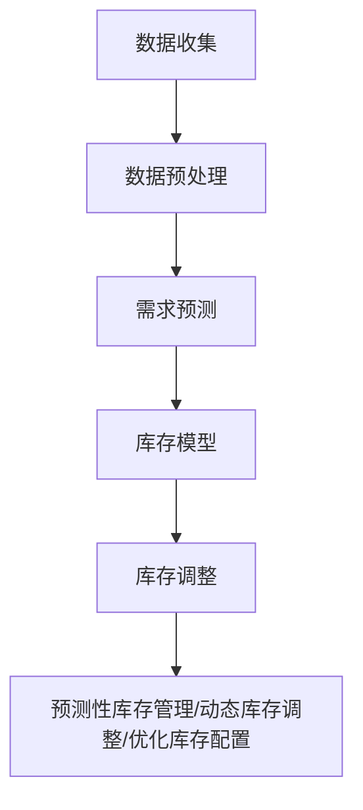

在这个流程图中，数据收集是输入，数据预处理、需求预测、库存模型和库存调整是中间步骤，预测性库存管理、动态库存调整和优化库存配置是应用结果。

#### 7.2 物流优化

物流优化是电子商务供应链管理中的另一项重要任务，通过大数据分析，企业可以优化物流路径和运输模式，提高物流效率，降低物流成本。

**物流优化关键步骤**：

1. **数据收集**：收集物流数据，如运输时间、运输成本、运输路径等。

2. **数据预处理**：清洗和整合来自不同渠道的物流数据，确保数据质量。

3. **路径规划**：使用优化算法，如遗传算法、蚁群算法等，优化物流路径。

4. **运输模式优化**：分析不同运输模式（如公路、铁路、航空）的成本和效率，优化运输模式。

5. **实时监控**：通过大数据分析，实时监控物流过程，及时调整运输计划和路径。

**物流优化在电子商务中的应用**：

1. **运输路径优化**：通过大数据分析，优化物流路径，减少运输时间和成本。

2. **运输模式优化**：根据运输数据和成本分析，选择最合适的运输模式，提高物流效率。

3. **物流成本控制**：通过大数据分析，实时监控物流成本，优化成本结构，降低物流成本。

为了更好地理解物流优化的方法和应用，我们可以通过以下Mermaid流程图来展示：

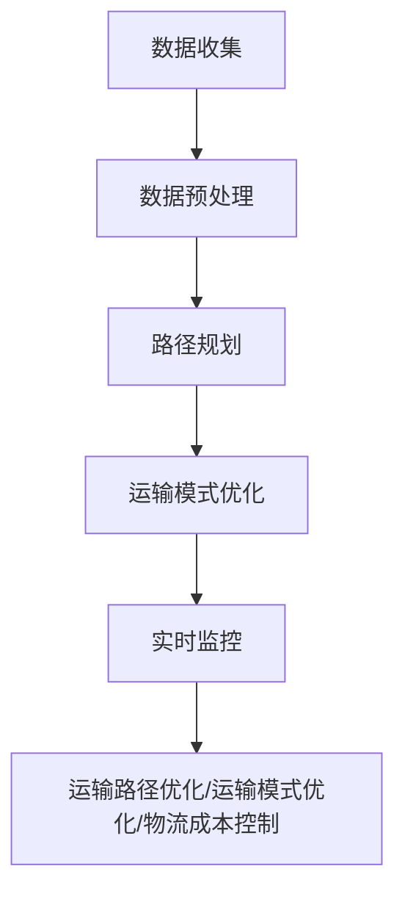

在这个流程图中，数据收集是输入，数据预处理、路径规划、运输模式优化和实时监控是中间步骤，运输路径优化、运输模式优化和物流成本控制是应用结果。

通过以上分析，我们可以看到大数据分析在电子商务供应链管理中的应用非常广泛，通过库存优化和物流优化，企业可以降低成本、提高效率，从而在激烈的市场竞争中脱颖而出。在接下来的章节中，我们将进一步探讨大数据分析在电子商务竞争分析、创新应用和风险管理中的应用。

### 第8章：大数据分析应用策略概述

#### 8.1 大数据分析应用策略的重要性

大数据分析应用策略对于电子商务企业具有重要意义。它不仅能够帮助企业提升运营效率，降低成本，还能够增强用户体验，提高用户满意度。具体来说，大数据分析应用策略的重要性体现在以下几个方面：

1. **提升运营效率**：通过大数据分析，电子商务企业可以深入了解用户需求，优化产品和服务，提高运营效率。例如，通过用户行为分析，企业可以优化页面设计、产品推荐和促销活动，从而提高用户转化率和销售额。

2. **降低成本**：大数据分析可以帮助电子商务企业优化供应链管理，降低库存成本和物流成本。通过需求预测和库存优化，企业可以减少库存积压和缺货风险，提高库存周转率。同时，通过物流优化，企业可以降低运输成本，提高物流效率。

3. **增强用户体验**：通过大数据分析，电子商务企业可以为用户提供个性化的服务和推荐，提升用户体验。例如，通过用户画像和用户行为分析，企业可以为用户提供定制化的商品推荐和促销活动，提高用户满意度和忠诚度。

4. **提高决策质量**：大数据分析为企业提供了丰富的数据支持，帮助企业做出更加科学的决策。例如，通过市场趋势分析和竞争对手分析，企业可以制定更具针对性的营销策略和竞争策略，提高市场竞争力。

5. **创新应用**：大数据分析不仅可以帮助企业优化现有业务，还可以促进企业的创新应用。例如，通过大数据分析，企业可以发掘新的市场机会，开发新产品和服务，实现业务增长。

#### 8.2 大数据分析应用策略的制定方法

为了充分发挥大数据分析在电子商务中的作用，企业需要制定合理的大数据分析应用策略。以下是一些制定大数据分析应用策略的方法：

1. **明确目标**：首先，企业需要明确大数据分析的应用目标。这些目标可以是提升运营效率、降低成本、增强用户体验、提高决策质量或促进创新应用。明确目标有助于制定具体的应用策略。

2. **需求分析**：在明确目标的基础上，企业需要分析具体的需求。需求分析包括用户需求、业务需求和技术需求。通过分析需求，企业可以确定需要收集哪些数据，如何处理和分析数据，以及如何应用分析结果。

3. **技术选型**：根据需求分析，企业需要选择合适的技术和工具。技术选型包括数据采集工具、存储技术、数据处理与分析技术、数据可视化工具等。选择合适的技术和工具可以确保大数据分析的有效性和效率。

4. **数据质量管理**：数据质量是大数据分析成功的关键。企业需要建立完善的数据质量管理机制，包括数据清洗、数据治理和数据质量控制。确保数据质量，有助于提高分析结果的准确性和可靠性。

5. **风险评估**：在制定大数据分析应用策略时，企业需要评估潜在的风险。风险包括数据隐私风险、技术风险、操作风险等。通过评估风险，企业可以制定相应的风险应对措施，降低风险影响。

6. **人才培训**：大数据分析需要专业的技术和人才。企业需要加强对数据分析人才的培训，提高数据分析能力和技术水平。同时，企业可以引入外部技术支持，弥补内部技术能力的不足。

7. **持续优化**：大数据分析应用策略不是一次性的，而是需要持续优化和改进。企业需要定期评估大数据分析的效果，并根据实际情况进行调整和优化。

通过以上方法，企业可以制定出合理的大数据分析应用策略，充分发挥大数据的价值，提升企业竞争力。

### 第9章：大数据分析在电子商务竞争分析中的应用

#### 9.1 市场趋势分析

市场趋势分析是大数据分析在电子商务竞争分析中的重要应用之一。通过分析大量市场数据，电子商务企业可以了解市场的发展趋势和变化规律，为制定竞争策略提供数据支持。

**市场趋势分析的方法**：

1. **数据收集**：收集与市场相关的数据，包括销售额、用户数量、市场份额、价格水平等。

2. **数据处理**：清洗和整合数据，确保数据质量。

3. **时间序列分析**：通过时间序列分析，了解市场的变化趋势和周期性规律。

4. **回归分析**：通过回归分析，建立市场趋势预测模型。

5. **可视化分析**：通过图表和可视化工具，展示市场趋势和变化规律。

**市场趋势分析在电子商务中的应用**：

1. **竞争态势监测**：通过分析市场趋势，了解竞争对手的表现和市场份额变化，为企业制定竞争策略提供参考。

2. **新品开发**：通过分析市场趋势，识别潜在的市场机会，为新品开发和市场定位提供依据。

3. **价格策略制定**：通过分析市场趋势，了解价格变化对销售量的影响，为企业制定价格策略提供数据支持。

4. **市场布局**：通过分析市场趋势，了解不同市场的增长潜力和竞争环境，为市场布局和渠道拓展提供参考。

为了更好地理解市场趋势分析的方法和应用，我们可以通过以下Mermaid流程图来展示：

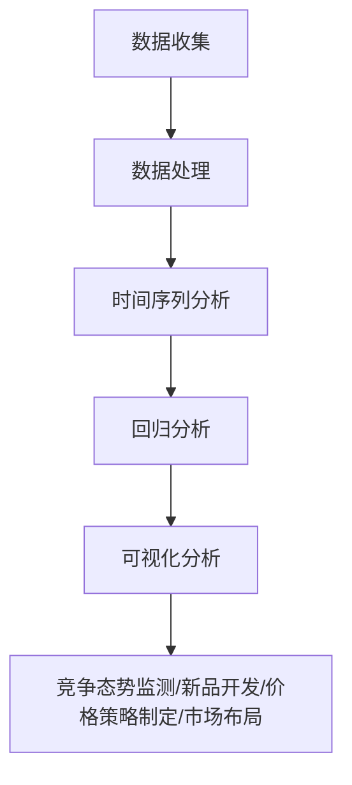

在这个流程图中，数据收集是输入，数据处理、时间序列分析、回归分析和可视化分析是中间步骤，竞争态势监测、新品开发、价格策略制定和市场布局是应用结果。

#### 9.2 竞争对手分析

竞争对手分析是电子商务企业制定竞争策略的重要环节。通过分析竞争对手的市场表现、产品策略、营销手段等，企业可以了解竞争对手的优势和劣势，为自己的战略制定提供参考。

**竞争对手分析的方法**：

1. **数据收集**：收集竞争对手的市场数据、产品信息、营销活动等。

2. **数据处理**：清洗和整合数据，确保数据质量。

3. **竞争对手分析**：通过比较分析，了解竞争对手的优势和劣势，包括产品定位、市场份额、用户评价等。

4. **竞争策略制定**：根据竞争对手分析结果，制定相应的竞争策略。

**竞争对手分析在电子商务中的应用**：

1. **竞争策略制定**：通过分析竞争对手的市场表现和策略，企业可以了解市场环境，制定更有针对性的竞争策略。

2. **产品优化**：通过分析竞争对手的产品优势和不足，企业可以优化自己的产品设计和功能，提升竞争力。

3. **营销策略优化**：通过分析竞争对手的营销手段和效果，企业可以优化自己的营销策略，提高市场占有率。

4. **市场定位**：通过分析竞争对手的市场定位和用户群体，企业可以调整自己的市场定位，找到更精准的目标客户。

为了更好地理解竞争对手分析的方法和应用，我们可以通过以下Mermaid流程图来展示：

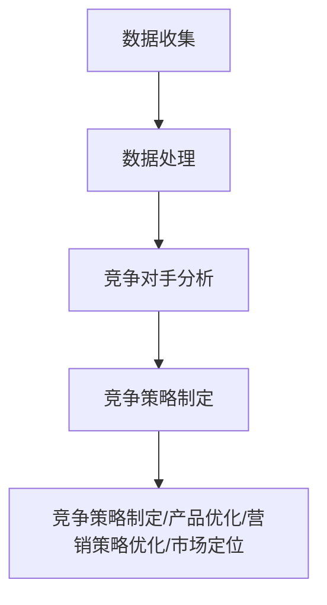

在这个流程图中，数据收集是输入，数据处理、竞争对手分析和竞争策略制定是中间步骤，竞争策略制定、产品优化、营销策略优化和市场定位是应用结果。

通过以上分析，我们可以看到大数据分析在电子商务竞争分析中的应用非常广泛，通过市场趋势分析和竞争对手分析，企业可以了解市场动态，制定更具竞争力的策略，提升市场竞争力。在接下来的章节中，我们将进一步探讨大数据分析在电子商务创新应用和风险管理中的应用。

### 第10章：大数据分析在电子商务创新中的应用

#### 10.1 新产品开发

大数据分析在电子商务新产品开发中发挥着重要作用，通过数据分析，企业可以深入了解用户需求，优化产品设计和功能，提高新产品的市场成功率。

**新产品开发的关键步骤**：

1. **需求分析**：通过大数据分析，了解用户在现有产品中的使用习惯和反馈，识别潜在的需求。

2. **数据分析**：对用户行为数据进行挖掘，识别用户需求模式和偏好，为产品设计和功能优化提供数据支持。

3. **市场调研**：结合市场数据，分析市场趋势和竞争环境，为新产品的市场定位和推广策略提供依据。

4. **产品设计**：根据需求分析和市场调研结果，设计符合用户需求和市场趋势的新产品。

5. **测试与反馈**：通过用户测试和反馈，优化产品设计和功能，提高新产品的市场适应性和用户满意度。

**新产品开发在电子商务中的应用**：

1. **个性化推荐**：通过大数据分析，了解用户的兴趣和行为模式，为用户提供个性化的产品推荐，提高用户的购买转化率。

2. **功能优化**：通过大数据分析，识别用户在现有产品中的痛点，优化产品功能和用户体验，提高用户满意度。

3. **市场定位**：通过大数据分析，了解市场趋势和竞争环境，为新产品的市场定位和推广策略提供数据支持，提高市场渗透率。

为了更好地理解新产品开发的方法和应用，我们可以通过以下Mermaid流程图来展示：

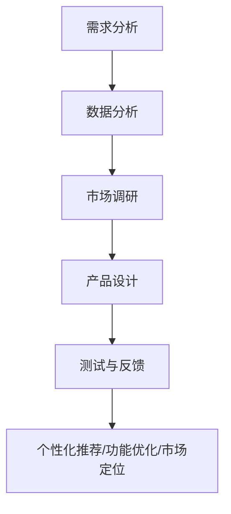

在这个流程图中，需求分析、数据分析、市场调研、产品设计和测试与反馈是新产品开发的关键步骤，个性化推荐、功能优化和市场定位是应用结果。

#### 10.2 服务优化

大数据分析在电子商务服务优化中的应用，可以帮助企业提升服务质量，提高用户满意度，增强用户黏性。

**服务优化的关键步骤**：

1. **数据收集**：收集用户在电子商务平台上的行为数据，包括浏览记录、购买记录、客服互动等。

2. **数据分析**：对用户行为数据进行分析，识别用户需求和行为模式，为服务优化提供数据支持。

3. **服务优化**：根据数据分析结果，优化服务流程和内容，提高服务质量。

4. **反馈收集**：收集用户对服务的反馈，持续优化和改进服务质量。

**服务优化在电子商务中的应用**：

1. **客户服务**：通过大数据分析，优化客户服务流程，提高客户满意度，减少投诉率。

2. **个性化服务**：通过大数据分析，了解用户的兴趣和偏好，提供个性化的服务，提高用户满意度和忠诚度。

3. **服务体验优化**：通过大数据分析，识别用户在服务过程中的痛点和需求，优化服务体验，提高用户满意度。

为了更好地理解服务优化的方法和应用，我们可以通过以下Mermaid流程图来展示：

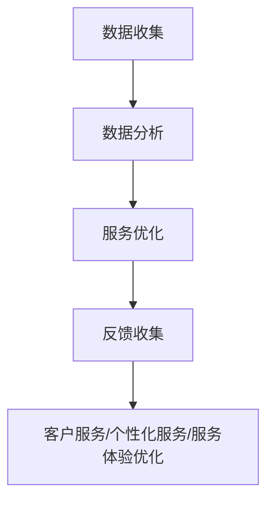

在这个流程图中，数据收集、数据分析、服务优化和反馈收集是服务优化的关键步骤，客户服务、个性化服务和服务体验优化是应用结果。

通过以上分析，我们可以看到大数据分析在电子商务创新应用中具有重要意义，通过新产品开发和服务优化，企业可以提升产品质量和服务水平，增强用户满意度和忠诚度。在接下来的章节中，我们将进一步探讨大数据分析在电子商务风险管理中的应用。

### 第11章：大数据分析在电子商务风险管理中的应用

#### 11.1 风险识别

风险识别是大数据分析在电子商务风险管理中的第一步，通过分析大量数据，识别出潜在的风险因素。

**风险识别的方法**：

1. **数据收集**：收集与风险相关的数据，包括交易数据、用户行为数据、市场数据等。

2. **数据分析**：对数据进行分析，识别出潜在的风险因素，如交易欺诈、用户欺诈、市场风险等。

3. **风险建模**：使用机器学习和数据挖掘算法，建立风险预测模型，评估风险概率。

4. **风险指标**：根据风险预测模型，设定风险指标，如风险评分、风险等级等。

**风险识别在电子商务中的应用**：

1. **交易欺诈检测**：通过分析交易数据，识别出异常交易行为，如高频交易、异常IP地址等，及时采取防范措施。

2. **用户欺诈检测**：通过分析用户行为数据，识别出潜在的用户欺诈行为，如虚假评论、恶意注册等，防范用户欺诈风险。

3. **市场风险预测**：通过分析市场数据，预测市场变化趋势，提前采取应对措施，降低市场风险。

为了更好地理解风险识别的方法和应用，我们可以通过以下Mermaid流程图来展示：

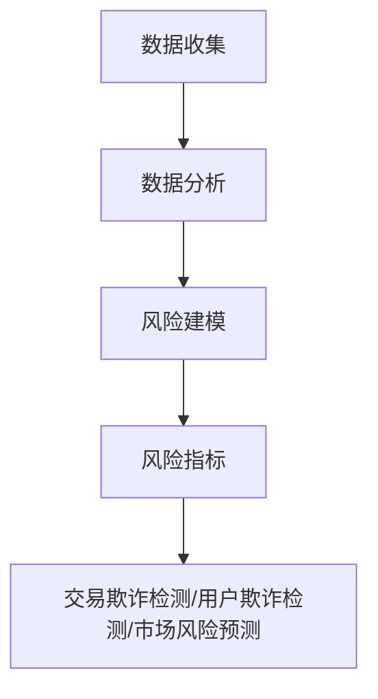

在这个流程图中，数据收集、数据分析、风险建模和风险指标是风险识别的关键步骤，交易欺诈检测、用户欺诈检测和市场风险预测是应用结果。

#### 11.2 风险评估与预警

风险评估与预警是大数据分析在电子商务风险管理中的关键环节，通过实时监测和评估风险，企业可以及时采取措施，降低风险损失。

**风险评估与预警的方法**：

1. **实时监控**：通过大数据分析技术，实时监控风险指标，识别潜在的风险事件。

2. **风险评估**：根据风险指标和风险预测模型，评估风险的概率和影响，确定风险等级。

3. **预警机制**：建立预警机制，当风险指标达到设定的阈值时，自动触发预警，通知相关人员和部门。

4. **应急响应**：根据预警信息，制定应急响应计划，及时采取措施，降低风险损失。

**风险评估与预警在电子商务中的应用**：

1. **交易风险控制**：通过实时监控和风险评估，控制交易风险，如识别异常交易、拒绝高风险交易等。

2. **用户风险管理**：通过预警机制，识别高风险用户，采取防范措施，降低用户欺诈风险。

3. **市场风险应对**：通过预警机制，预测市场风险，提前调整策略，降低市场风险。

为了更好地理解风险评估与预警的方法和应用，我们可以通过以下Mermaid流程图来展示：

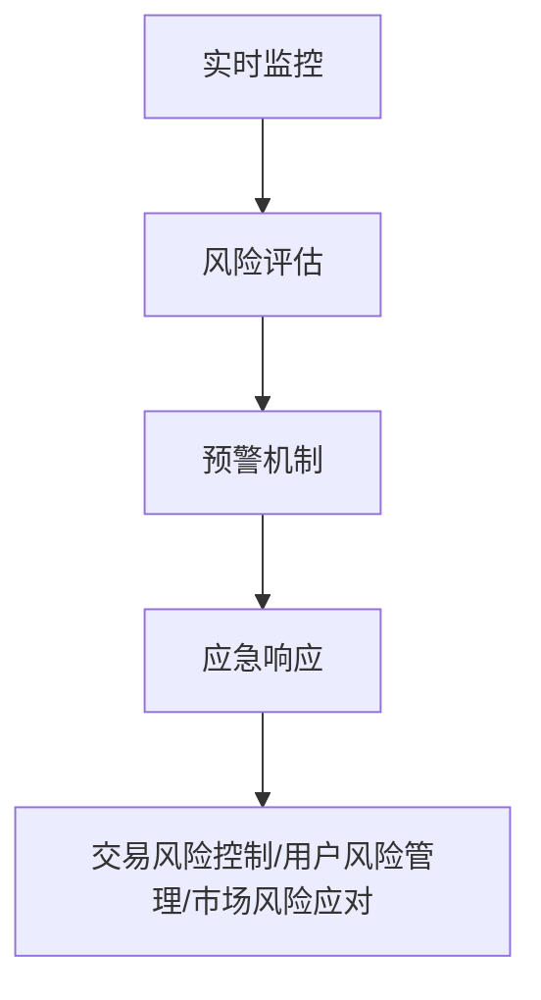

在这个流程图中，实时监控、风险评估、预警机制和应急响应是风险评估与预警的关键步骤，交易风险控制、用户风险管理和市场风险应对是应用结果。

通过以上分析，我们可以看到大数据分析在电子商务风险管理中的应用非常广泛，通过风险识别、风险评估与预警，企业可以及时发现和防范风险，确保业务的安全和稳定。在接下来的章节中，我们将进一步探讨大数据分析在电子商务案例分析中的应用。

### 第12章：大数据分析在电子商务案例分析中的应用

#### 12.1 案例一：电商企业用户行为分析

**案例背景**：

某知名电商企业希望通过大数据分析，深入了解用户行为，优化产品推荐和营销策略，提升用户满意度和转化率。

**数据分析过程**：

1. **数据收集**：收集用户在网站上的浏览记录、购买记录、搜索关键词等数据。

2. **数据预处理**：清洗和整合数据，确保数据质量。

3. **用户画像**：通过数据分析，构建用户画像，提取用户的基本属性和兴趣偏好。

4. **用户行为分析**：分析用户在网站上的行为路径、停留时间、点击次数等指标，了解用户的需求和行为模式。

5. **产品推荐**：基于用户画像和行为分析，为用户提供个性化的商品推荐，提高用户转化率。

6. **营销策略优化**：根据用户行为数据和反馈，优化营销策略，提高营销效果。

**案例分析**：

通过大数据分析，该电商企业发现：
- 用户在购买前通常会浏览多个页面，停留时间较长。
- 不同用户群体的浏览路径和购买行为存在明显差异。
- 部分商品在特定时间段和特定用户群体的销售表现较好。

根据这些发现，企业采取了以下措施：
- 优化页面设计，提高用户停留时间。
- 针对不同用户群体，调整商品推荐策略。
- 针对销售表现较好的商品，加大营销推广力度。

**效果评估**：

通过用户行为分析和优化，该电商企业的用户转化率提高了20%，用户满意度显著提升。

#### 12.2 案例二：电商企业营销策略分析

**案例背景**：

某电商企业希望通过大数据分析，优化营销策略，提高广告投放效果和用户转化率。

**数据分析过程**：

1. **数据收集**：收集广告投放数据、用户点击数据、购买数据等。

2. **数据处理**：清洗和整合数据，确保数据质量。

3. **广告效果分析**：分析不同广告渠道的效果，如点击率、转化率、投资回报率等。

4. **用户行为分析**：分析用户点击广告后的行为路径和购买行为，了解广告对用户的影响。

5. **营销策略优化**：根据数据分析结果，优化广告投放策略，提高广告效果。

**案例分析**：

通过大数据分析，该电商企业发现：
- 搜索引擎广告和社交媒体广告的投放效果较好。
- 不同用户群体的广告点击率存在差异。
- 部分广告素材的表现优于其他广告。

根据这些发现，企业采取了以下措施：
- 加大搜索引擎广告和社交媒体广告的投放力度。
- 针对不同用户群体，调整广告素材和投放策略。
- 优化广告文案和设计，提高广告吸引力。

**效果评估**：

通过营销策略优化，该电商企业的广告点击率提高了30%，用户转化率提高了25%。

通过以上案例，我们可以看到大数据分析在电子商务中的应用价值。通过用户行为分析和营销策略分析，电商企业可以深入了解用户需求，优化产品推荐和营销策略，提高用户满意度和转化率，实现商业价值的最大化。

### 第13章：大数据分析在电子商务实践中的挑战与解决方案

#### 13.1 数据质量管理

数据质量管理是大数据分析成功的关键，然而在电子商务实践中，数据质量问题仍然是一个普遍存在的挑战。数据质量差会导致分析结果不准确，从而影响决策和业务执行。

**数据质量问题的表现**：

1. **数据冗余**：数据冗余会导致数据存储空间浪费，影响查询效率。
2. **数据错误**：数据中的错误值会影响分析结果的准确性，如输入错误、数据转换错误等。
3. **数据缺失**：数据缺失会影响数据分析和模型的建立。
4. **数据不一致**：不同数据源之间的数据格式、单位和定义不一致，导致数据整合困难。

**解决方案**：

1. **数据清洗**：定期进行数据清洗，去除重复、错误和不完整的数据。使用自动化工具（如ETL工具）进行数据清洗，提高效率。

2. **数据治理**：建立数据治理流程，确保数据的一致性和准确性。数据治理包括数据定义、数据标准、数据权限和数据监控。

3. **数据质量管理工具**：使用数据质量管理工具（如DataQlik、Informatica）来监控数据质量，发现和修复数据质量问题。

#### 13.2 数据分析人才短缺

数据分析人才短缺是电子商务企业在实施大数据分析时面临的另一个挑战。大数据分析需要具备数据分析、统计学和计算机科学等多方面知识的复合型人才。

**解决方案**：

1. **内部培训**：加强对现有员工的培训，提升他们的数据分析能力。提供内部培训课程、在线学习资源和认证考试。

2. **外部招聘**：积极招聘具备数据分析背景的人才。可以通过校园招聘、社会招聘和人才猎头等方式，吸引和留住优秀的数据分析人才。

3. **外包服务**：对于特定的数据分析项目，可以考虑外包给专业的数据分析服务公司，以减轻内部人才短缺的压力。

4. **技术自动化**：通过引入自动化工具（如机器学习算法、自动化数据预处理工具等），减少对人工的依赖，提高数据分析的效率。

#### 13.3 技术更新与维护

大数据分析技术更新速度快，技术升级和维护成本高。电子商务企业需要不断跟进最新的技术发展，以保持技术优势。

**解决方案**：

1. **技术评估**：定期对现有技术进行评估，确保技术符合业务需求。通过技术评估，识别出需要升级或替换的技术。

2. **技术升级计划**：制定技术升级计划，分阶段进行技术更新。在技术升级过程中，确保业务连续性和数据安全。

3. **技术社区与合作伙伴**：加入技术社区，与同行交流技术经验。与技术合作伙伴建立合作关系，共同开发新的技术和解决方案。

4. **预算与资金管理**：合理分配预算，确保技术更新和维护的投入。通过成本控制和效益分析，提高资金使用效率。

通过以上解决方案，电子商务企业可以应对大数据分析实践中的挑战，提升数据分析能力，实现商业价值的最大化。

### 第14章：大数据分析在电子商务实践中的应用案例

#### 14.1 案例一：电商企业大数据分析平台搭建

**案例背景**：

某大型电商企业希望通过搭建大数据分析平台，实现数据集中管理和高效分析，提升运营效率和决策能力。

**实施过程**：

1. **需求分析**：明确企业在大数据分析方面的需求，包括数据采集、存储、处理、分析和可视化。

2. **技术选型**：选择适合企业需求的大数据分析工具和技术，如Hadoop、Spark、Elasticsearch等。

3. **架构设计**：设计大数据分析平台的架构，包括数据采集层、存储层、处理层和分析层。

4. **数据采集**：使用Flume和Kafka等工具，从不同的数据源（如关系型数据库、NoSQL数据库、日志系统）采集数据。

5. **数据存储**：使用HDFS和HBase等分布式存储技术，存储海量数据。

6. **数据处理**：使用Spark和MapReduce等分布式计算技术，处理和分析数据。

7. **数据分析**：使用Elasticsearch和Tableau等工具，对分析结果进行可视化展示。

8. **部署与运维**：部署大数据分析平台，并进行日常运维和监控。

**效果评估**：

通过搭建大数据分析平台，该电商企业实现了以下效果：
- 数据集中管理，提高了数据利用率。
- 数据处理和分析效率显著提升。
- 决策支持更加准确和及时。
- 用户体验和运营效率得到提升。

#### 14.2 案例二：电商企业大数据分析应用实践

**案例背景**：

某电商企业希望通过大数据分析，优化库存管理和营销策略，降低成本，提高销售额。

**实施过程**：

1. **需求分析**：分析企业库存管理和营销策略的痛点，明确大数据分析的应用场景。

2. **数据采集**：收集库存数据、销售数据、市场数据等。

3. **数据处理**：使用Spark对数据进行清洗、转换和聚合，为分析做准备。

4. **库存优化**：通过分析历史销售数据和市场需求预测，优化库存水平，减少库存成本。

5. **营销策略优化**：通过分析用户行为数据和市场需求，制定个性化的营销策略，提高用户转化率。

6. **实时监控**：使用Elasticsearch和Kibana等工具，实时监控库存和营销策略的效果。

7. **反馈与优化**：根据实时监控数据，调整库存和营销策略，持续优化业务流程。

**效果评估**：

通过大数据分析应用实践，该电商企业实现了以下效果：
- 库存成本降低了15%。
- 销售额提高了20%。
- 库存周转率提高了30%。
- 用户满意度显著提升。

通过以上两个案例，我们可以看到大数据分析在电子商务实践中的应用价值。通过大数据分析平台搭建和大数据分析应用实践，电商企业可以提升运营效率，降低成本，提高销售额，实现商业价值的最大化。

### 第15章：大数据分析在电子商务实践中的未来趋势

#### 15.1 技术发展趋势

大数据分析在电子商务实践中的未来发展将受到技术进步的推动。以下是一些技术发展趋势：

1. **人工智能与大数据的深度融合**：人工智能（AI）技术将更加深入地应用于大数据分析，如深度学习、自然语言处理等，提升数据分析的智能化水平和准确性。

2. **云计算和边缘计算的发展**：云计算和边缘计算将为大数据分析提供更高效、更灵活的解决方案。云计算可以实现资源的弹性扩展，边缘计算则可以降低数据传输延迟，提高实时分析能力。

3. **数据隐私保护技术的进步**：随着数据隐私保护法规的加强，企业需要采取更加严格的数据隐私保护措施，如数据脱敏、加密和隐私计算等。

4. **区块链技术的应用**：区块链技术可以用于数据的安全存储和共享，提升数据透明度和信任度，在电子商务中具有广泛的应用潜力。

#### 15.2 应用领域拓展

大数据分析在电子商务中的应用领域将继续拓展，以下是一些应用领域的拓展：

1. **供应链管理**：大数据分析将更加深入地应用于供应链管理，如库存优化、物流优化、供应商评估等，提高供应链的效率和灵活性。

2. **智能客服**：通过大数据分析，可以构建智能客服系统，提供更加个性化的服务和更高效的客户支持，提升客户满意度。

3. **个性化推荐**：大数据分析将进一步提升个性化推荐系统的精准度，为用户提供更加个性化的商品和服务推荐，提高用户满意度和转化率。

4. **风险管理**：大数据分析将用于更全面的风险管理，如交易风险、信用风险、市场风险等，帮助企业降低风险，保障业务稳定。

5. **可持续发展**：大数据分析将用于分析环保和可持续发展相关数据，帮助企业实现绿色运营，推动可持续发展。

通过以上技术趋势和应用领域拓展，大数据分析在电子商务实践中的未来发展将更加广阔，为企业带来更多的机遇和挑战。

### 附录A：大数据分析常用工具与平台

#### A.1 Hadoop

Hadoop是一个开源的分布式数据处理框架，由Apache软件基金会维护。它包括两个核心组件：Hadoop Distributed File System（HDFS）和MapReduce。

- **HDFS**：用于存储大规模数据，具有高容错性和高吞吐量。
- **MapReduce**：用于处理和分析大规模数据，采用分而治之的策略。

Hadoop适用于多种场景，如数据采集、数据存储、数据处理和分析等，是大数据分析的重要工具。

#### A.2 Spark

Spark是另一个开源的分布式数据处理引擎，由Apache软件基金会维护。它具有以下几个特点：

- **内存计算**：Spark利用内存计算提高数据处理速度，适用于实时数据分析。
- **组件丰富**：包括Spark SQL（用于结构化数据查询）、Spark Streaming（用于实时数据流处理）和MLlib（用于机器学习）。
- **与Hadoop兼容**：Spark可以与Hadoop生态系统中的其他工具（如HDFS、YARN）无缝集成。

Spark适用于多种大数据处理任务，如批处理、实时处理和机器学习等，是大数据分析的重要工具。

#### A.3 Elasticsearch

Elasticsearch是一个开源的分布式搜索引擎，由Elastic公司维护。它具有以下几个特点：

- **高扩展性**：Elasticsearch支持水平扩展，可以处理海量数据。
- **全文搜索**：Elasticsearch支持全文搜索、模糊搜索等高级搜索功能。
- **实时分析**：Elasticsearch支持实时分析，可以快速响应查询请求。

Elasticsearch适用于多种场景，如日志分析、网站搜索和监控等，是大数据分析的重要工具。

通过以上工具和平台的介绍，我们可以看到大数据分析在实际应用中具有多种选择。企业可以根据自身需求和场景，选择合适的工具和平台，实现高效的数据处理和分析。

### 附录B：大数据分析相关书籍推荐

#### B.1 《大数据时代》

《大数据时代》是一本经典的关于大数据概念和应用的书，由英国数据科学家Viktor Mayer-Schönberger和肯尼思·库克耶共同撰写。书中介绍了大数据的背景、特点和应用场景，对大数据技术在商业和社会领域的影响进行了深入探讨。

#### B.2 《大数据战略》

《大数据战略》是一本关于大数据战略规划的书，由国际知名大数据专家麦克·费弗和凯特·雷恩斯撰写。书中详细介绍了大数据战略的制定、实施和评估方法，为企业提供了系统的大数据战略规划指南。

#### B.3 《大数据分析实战》

《大数据分析实战》是一本面向实践者的数据分析书籍，由知名数据科学家菲利普·里德利和杰西卡·布洛克曼撰写。书中通过大量实例和实战项目，介绍了大数据分析的方法和技术，涵盖数据采集、预处理、建模、可视化等各个环节。

这三本书籍都是大数据分析领域的重要参考资料，适合不同层次的读者学习和参考。通过阅读这些书籍，读者可以深入了解大数据分析的理论和实践，提升数据分析能力。

