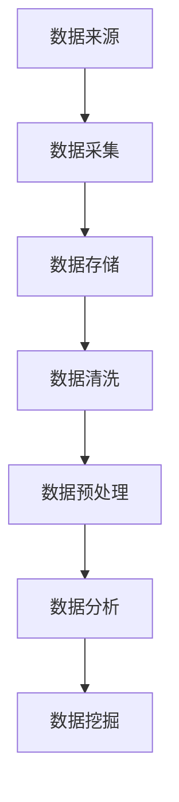

                 

# 《大数据背景下的国产电影推广策略研究》

> **关键词：** 大数据、电影产业、国产电影、推广策略、数据分析

> **摘要：** 本文将探讨大数据时代下，国产电影推广所面临的机遇和挑战。通过分析大数据在电影产业中的应用，结合实际案例，本文旨在提出一套行之有效的大数据驱动的国产电影推广策略，为电影产业的创新与发展提供参考。

## 前言

随着信息技术的迅猛发展，大数据已经渗透到了各个行业，其中包括我们熟知的电影产业。大数据不仅改变了电影生产的方式，也深刻影响了电影的推广和营销。在这篇文章中，我们将重点关注大数据背景下的国产电影推广策略。通过深入分析大数据在电影产业中的应用，结合实际案例，我们将探讨如何利用大数据提升国产电影的推广效果，提高市场占有率。

## 第一部分：大数据与电影产业概述

### 第1章：大数据时代的电影产业变革

#### 1.1 大数据定义及其特点

**核心概念与联系：**
大数据（Big Data）是指数据规模巨大、数据类型多样、数据生成速度极快的海量数据。在电影产业中，大数据不仅包括传统的票房数据、观众数据，还涵盖了社交媒体上的评论、搜索数据、甚至是地理位置信息等。

**Mermaid 流程图：**

**核心算法原理讲解：**
大数据技术在电影产业中的应用主要体现在以下几个方面：

1. **票房预测**：通过分析历史票房数据，结合当前的市场环境，利用机器学习算法进行票房预测。
2. **观众行为分析**：利用大数据分析观众的行为和偏好，为电影推广提供数据支持。
3. **市场趋势预测**：通过大数据分析，预测市场的未来趋势，为电影制作和推广提供策略指导。

**数学模型：**
票房预测的常见模型有回归分析、时间序列分析和分类模型等。

$$
\text{票房预测模型} = f(\text{历史票房数据}, \text{当前市场环境})
$$

**举例说明：**
假设我们使用线性回归模型来预测某部新电影的票房，模型公式可以表示为：

$$
\text{票房} = \beta_0 + \beta_1 \times \text{历史平均票房} + \beta_2 \times \text{当前市场环境因素}
$$

其中，$\beta_0$、$\beta_1$和$\beta_2$为模型的参数，需要通过历史数据训练得到。

#### 1.2 大数据在电影产业中的应用

**核心算法原理讲解：**
大数据在电影产业中的应用主要可以分为以下几个方面：

1. **观众行为分析**：通过分析观众的观影记录、社交媒体互动等数据，了解观众的偏好和行为模式。
2. **市场趋势预测**：利用大数据分析市场环境，预测未来电影市场的趋势。
3. **电影营销策略优化**：根据大数据分析结果，优化电影的营销策略，提高营销效果。

**数学模型：**
观众行为分析常用的模型有聚类分析、关联规则挖掘等。

$$
\text{观众偏好模型} = f(\text{观众行为数据})
$$

**举例说明：**
假设我们使用K-means聚类算法来分析观众的观影偏好，算法步骤如下：

1. 初始化聚类中心点。
2. 计算每个观众与聚类中心点的距离。
3. 根据距离最近的原则，将每个观众分配到相应的聚类中心点。
4. 重新计算聚类中心点。
5. 重复步骤2-4，直到聚类中心点不再发生变化。

通过这样的聚类分析，我们可以将观众分为不同的群体，为电影推广提供针对性的策略。

#### 1.3 国产电影产业现状分析

**市场趋势预测：**
根据当前的市场环境，我们可以预测国产电影产业的发展趋势：

1. **票房增长**：随着观众消费水平的提高和电影市场的逐渐成熟，国产电影的票房有望持续增长。
2. **类型多样化**：国产电影将更加注重多元化，满足不同观众的需求。
3. **国际合作**：国产电影与国际市场的合作将更加紧密，推动国产电影的国际化发展。

**核心算法原理讲解：**
市场趋势预测可以使用时间序列分析、ARIMA模型等方法。

$$
\text{市场趋势预测模型} = f(\text{历史票房数据}, \text{市场环境因素})
$$

**举例说明：**
假设我们使用ARIMA模型来预测未来几个月的国产电影票房，模型步骤如下：

1. **数据预处理**：对票房数据进行平稳性检验，如果数据不平稳，进行差分处理。
2. **模型识别**：根据数据的特征，选择合适的ARIMA模型参数。
3. **模型拟合**：使用历史数据对ARIMA模型进行参数估计。
4. **预测**：利用拟合好的模型，预测未来的票房数据。

通过这样的预测模型，我们可以为国产电影的发展提供参考。

### 第2章：大数据技术基础

#### 2.1 数据采集与存储

**核心算法原理讲解：**
数据采集常用的工具包括爬虫、API接口等。

**数据存储常用的技术包括关系型数据库（如MySQL）和分布式存储系统（如Hadoop HDFS）。**

**数学模型：**
数据存储的核心算法包括哈希存储和索引技术。

$$
\text{哈希存储模型} = f(\text{数据}, \text{哈希函数}, \text{存储位置})
$$

**举例说明：**
假设我们使用哈希存储模型来存储观众的观影记录，步骤如下：

1. 对观众ID进行哈希处理，得到哈希值。
2. 根据哈希值确定存储位置。
3. 存储观众的观影记录。

通过这样的存储模型，我们可以高效地管理大规模的数据。

#### 2.2 数据清洗与预处理

**核心算法原理讲解：**
数据清洗的主要步骤包括数据去重、数据填补和异常值处理。

**数学模型：**
数据填补的常用算法包括线性插值、平均值填补等。

$$
\text{数据填补模型} = f(\text{缺失值}, \text{填补方法})
$$

**举例说明：**
假设我们使用平均值填补方法来填补观众的观影记录中的缺失值，步骤如下：

1. 计算观众观影记录的平均值。
2. 用平均值填补缺失的记录。

通过这样的数据清洗和预处理，我们可以提高数据的质量，为后续的分析提供可靠的数据基础。

#### 2.3 数据分析与挖掘

**核心算法原理讲解：**
数据分析的主要方法包括描述性统计分析、相关性分析和回归分析等。

**数据挖掘的主要方法包括分类、聚类和关联规则挖掘等。**

**数学模型：**
描述性统计分析的核心算法包括均值、中位数、标准差等。

$$
\text{描述性统计分析模型} = f(\text{数据集})
$$

**举例说明：**
假设我们对观众的观影记录进行描述性统计分析，步骤如下：

1. 计算观众的平均观影次数。
2. 计算观众观影次数的中位数。
3. 计算观众观影次数的标准差。

通过这样的统计分析，我们可以了解观众的基本观影特征。

### 第3章：观众行为数据分析

#### 3.1 观众偏好分析

**核心算法原理讲解：**
观众偏好分析的主要方法包括聚类分析和因子分析。

**数学模型：**
聚类分析的核心算法包括K-means、DBSCAN等。

$$
\text{聚类分析模型} = f(\text{观众特征数据}, \text{聚类算法})
$$

**举例说明：**
假设我们使用K-means算法来分析观众的观影偏好，步骤如下：

1. 初始化聚类中心点。
2. 计算每个观众与聚类中心点的距离。
3. 根据距离最近的原则，将每个观众分配到相应的聚类中心点。
4. 重新计算聚类中心点。
5. 重复步骤2-4，直到聚类中心点不再发生变化。

通过这样的聚类分析，我们可以将观众分为不同的群体，为电影推广提供针对性的策略。

#### 3.2 观众反馈挖掘

**核心算法原理讲解：**
观众反馈挖掘的主要方法包括情感分析和主题建模。

**数学模型：**
情感分析的核心算法包括基于规则的方法、基于统计的方法和基于深度学习的方法。

$$
\text{情感分析模型} = f(\text{文本数据}, \text{情感分类器})
$$

**举例说明：**
假设我们使用基于深度学习的情感分析模型来分析观众对某部电影的评论，步骤如下：

1. 收集观众评论数据。
2. 预处理评论数据，包括文本清洗和词向量表示。
3. 训练情感分析模型。
4. 使用训练好的模型对评论进行情感分类。

通过这样的情感分析，我们可以了解观众对电影的反馈，为电影推广提供参考。

#### 3.3 观众行为预测

**核心算法原理讲解：**
观众行为预测的主要方法包括时间序列分析和机器学习算法。

**数学模型：**
时间序列分析的核心算法包括ARIMA、LSTM等。

$$
\text{观众行为预测模型} = f(\text{历史观众行为数据}, \text{预测算法})
$$

**举例说明：**
假设我们使用LSTM算法来预测观众的下一次观影行为，步骤如下：

1. 收集观众的历史观影数据。
2. 预处理数据，包括序列化处理和归一化。
3. 划分训练集和测试集。
4. 训练LSTM模型。
5. 使用训练好的模型进行预测。

通过这样的预测模型，我们可以为电影推广提供行为预测，提高推广效果。

### 第4章：市场趋势预测

#### 4.1 市场趋势分析方法

**核心算法原理讲解：**
市场趋势分析的主要方法包括时间序列分析和回归分析。

**数学模型：**
时间序列分析的核心算法包括ARIMA、LSTM等。

$$
\text{市场趋势预测模型} = f(\text{历史市场数据}, \text{预测算法})
$$

**举例说明：**
假设我们使用LSTM算法来预测电影市场的未来趋势，步骤如下：

1. 收集历史市场数据，包括票房、观众数量等。
2. 预处理数据，包括序列化处理和归一化。
3. 划分训练集和测试集。
4. 训练LSTM模型。
5. 使用训练好的模型进行预测。

通过这样的预测模型，我们可以为电影市场的未来趋势提供参考。

#### 4.2 热门电影市场趋势分析

**项目实战：**
以《哪吒之魔童降世》为例，分析其市场趋势。

1. **数据收集**：收集《哪吒之魔童降世》的历史票房数据、观众评论数据等。
2. **数据预处理**：对数据进行清洗和归一化处理。
3. **市场趋势预测**：使用LSTM模型预测《哪吒之魔童降世》的市场趋势。
4. **结果分析**：分析预测结果与实际市场表现的关系。

通过这样的项目实战，我们可以深入了解热门电影的市场趋势，为后续的电影推广提供参考。

#### 4.3 预测模型构建与评估

**核心算法原理讲解：**
预测模型的构建主要涉及数据预处理、特征工程和模型选择。

**数学模型：**
预测模型的评估指标包括准确率、召回率、F1值等。

$$
\text{预测模型评估指标} = f(\text{预测结果}, \text{真实结果})
$$

**举例说明：**
假设我们使用LSTM模型来预测电影票房，评估指标如下：

1. **准确率**：预测票房与实际票房的匹配度。
2. **召回率**：实际票房中被预测到的比例。
3. **F1值**：准确率和召回率的综合评价指标。

通过这样的评估指标，我们可以评估预测模型的性能，为模型优化提供依据。

### 第5章：电影营销策略优化

#### 5.1 营销策略分析

**项目实战：**
以《流浪地球》为例，分析其营销策略。

1. **数据收集**：收集《流浪地球》的营销数据，包括宣传物料、社交媒体互动等。
2. **数据分析**：对营销数据进行量化分析，包括点击率、转化率等。
3. **策略评估**：评估不同营销策略的效果，找出最优策略。

通过这样的项目实战，我们可以了解有效的电影营销策略，为后续的电影推广提供参考。

#### 5.2 数据驱动的营销决策

**核心算法原理讲解：**
数据驱动的营销决策主要涉及数据分析和模型预测。

**数学模型：**
营销决策的优化模型包括线性规划、多目标优化等。

$$
\text{营销决策模型} = f(\text{营销数据}, \text{优化算法})
$$

**举例说明：**
假设我们使用线性规划模型来优化电影宣传预算，步骤如下：

1. **目标函数**：定义宣传效果与预算的关系。
2. **约束条件**：定义预算限制和其他约束条件。
3. **求解**：使用线性规划求解器求解最优解。

通过这样的优化模型，我们可以实现营销资源的最佳配置。

#### 5.3 营销效果评估与优化

**核心算法原理讲解：**
营销效果评估主要涉及转化率分析、ROI计算等。

**数学模型：**
营销效果评估的指标包括转化率、ROI等。

$$
\text{营销效果评估指标} = f(\text{营销数据}, \text{评估算法})
$$

**举例说明：**
假设我们使用转化率来评估电影宣传的效果，步骤如下：

1. **定义转化率**：转化率 = 转化人数 / 总互动人数。
2. **计算转化率**：根据营销数据计算转化率。
3. **评估效果**：评估不同宣传策略的转化率，找出最佳策略。

通过这样的评估指标，我们可以不断优化电影营销策略，提高推广效果。

### 第6章：社交媒体分析

#### 6.1 社交媒体数据采集

**核心算法原理讲解：**
社交媒体数据采集主要涉及爬虫技术和API接口。

**数学模型：**
社交媒体数据采集的核心算法包括分布式爬虫算法、网络爬虫调度等。

$$
\text{数据采集模型} = f(\text{社交媒体数据}, \text{采集算法})
$$

**举例说明：**
假设我们使用分布式爬虫技术来采集微博数据，步骤如下：

1. **爬虫调度**：分配任务到多个节点。
2. **数据采集**：爬取微博页面，获取用户评论、转发等数据。
3. **数据存储**：将采集到的数据存储到数据库中。

通过这样的数据采集模型，我们可以获取大量的社交媒体数据，为后续分析提供数据基础。

#### 6.2 社交媒体内容分析

**核心算法原理讲解：**
社交媒体内容分析主要涉及文本挖掘技术。

**数学模型：**
文本挖掘的核心算法包括情感分析、主题建模等。

$$
\text{内容分析模型} = f(\text{社交媒体内容}, \text{文本挖掘算法})
$$

**举例说明：**
假设我们使用情感分析算法来分析社交媒体上的观众评论，步骤如下：

1. **数据预处理**：对评论进行文本清洗，包括去除停用词、标点符号等。
2. **特征提取**：将清洗后的文本转化为特征向量。
3. **情感分类**：使用训练好的情感分类器，对评论进行分类。

通过这样的内容分析，我们可以了解观众对电影的看法，为电影推广提供参考。

#### 6.3 社交媒体营销策略

**核心算法原理讲解：**
社交媒体营销策略主要涉及内容策划、互动管理等。

**数学模型：**
社交媒体营销策略的核心算法包括优化投放策略、用户群体分析等。

$$
\text{营销策略模型} = f(\text{社交媒体数据}, \text{营销策略算法})
$$

**举例说明：**
假设我们使用优化投放策略来提高电影宣传的效果，步骤如下：

1. **用户分析**：分析目标用户的特征和行为模式。
2. **内容策划**：根据用户特征，策划有针对性的宣传内容。
3. **投放优化**：使用机器学习算法，优化宣传内容的投放策略。

通过这样的营销策略模型，我们可以实现社交媒体上的高效宣传。

### 第7章：案例分析

#### 7.1 国产电影推广成功案例分析

**项目实战：**
以《战狼2》为例，分析其成功的原因和推广策略。

1. **数据收集**：收集《战狼2》的票房数据、社交媒体互动数据等。
2. **数据分析**：分析票房数据、社交媒体互动数据，找出成功的原因。
3. **策略总结**：总结《战狼2》的成功经验和推广策略。

通过这样的案例分析，我们可以了解成功电影推广的关键因素，为后续的电影推广提供参考。

#### 7.2 案例分析总结与启示

**总结与启示：**
通过案例分析，我们可以总结出以下启示：

1. **内容为王**：优质的电影内容是成功的关键。
2. **数据驱动**：利用大数据分析观众行为和市场趋势，实现精准推广。
3. **社交媒体**：社交媒体是电影推广的重要渠道，要注重内容策划和互动管理。
4. **营销策略**：灵活运用多种营销策略，提高宣传效果。

通过这些启示，我们可以为国产电影的推广提供指导。

### 第8章：大数据驱动的电影选题策略

#### 8.1 选题数据分析

**核心算法原理讲解：**
选题数据分析主要涉及市场趋势分析、观众偏好分析等。

**数学模型：**
选题数据分析的核心算法包括时间序列分析、聚类分析等。

$$
\text{选题数据分析模型} = f(\text{市场趋势数据}, \text{观众偏好数据})
$$

**举例说明：**
假设我们使用时间序列分析来预测未来热门电影题材，步骤如下：

1. **数据收集**：收集历史票房数据、观众评论数据等。
2. **数据分析**：分析票房数据、观众评论数据，找出热门题材的趋势。
3. **预测**：使用时间序列模型预测未来热门题材。

通过这样的数据分析，我们可以为电影选题提供参考。

#### 8.2 选题趋势预测

**核心算法原理讲解：**
选题趋势预测主要涉及机器学习算法、预测模型构建等。

**数学模型：**
选题趋势预测的核心算法包括LSTM、ARIMA等。

$$
\text{选题趋势预测模型} = f(\text{历史数据}, \text{预测算法})
$$

**举例说明：**
假设我们使用LSTM模型来预测未来电影题材的趋势，步骤如下：

1. **数据预处理**：对历史数据序列化处理和归一化。
2. **模型训练**：使用历史数据训练LSTM模型。
3. **预测**：使用训练好的模型预测未来题材趋势。

通过这样的预测模型，我们可以为电影选题提供趋势参考。

#### 8.3 选题决策优化

**核心算法原理讲解：**
选题决策优化主要涉及多目标优化、风险评估等。

**数学模型：**
选题决策优化的核心算法包括线性规划、多目标规划等。

$$
\text{选题决策优化模型} = f(\text{选题数据}, \text{优化算法})
$$

**举例说明：**
假设我们使用多目标规划模型来优化电影选题，步骤如下：

1. **目标函数**：定义选题优化目标，包括票房预期、观众满意度等。
2. **约束条件**：定义选题约束条件，包括预算、拍摄周期等。
3. **求解**：使用多目标规划求解器求解最优选题。

通过这样的优化模型，我们可以实现选题的优化，提高电影的成功率。

### 第9章：大数据背景下的电影发行策略

#### 9.1 发行数据分析

**核心算法原理讲解：**
发行数据分析主要涉及票房数据分析、观众分布分析等。

**数学模型：**
发行数据分析的核心算法包括时间序列分析、空间分析等。

$$
\text{发行数据分析模型} = f(\text{票房数据}, \text{观众分布数据})
$$

**举例说明：**
假设我们使用时间序列分析来分析电影票房的趋势，步骤如下：

1. **数据收集**：收集电影票房数据。
2. **数据分析**：分析票房数据的变化趋势。
3. **预测**：使用时间序列模型预测票房趋势。

通过这样的数据分析，我们可以为电影发行提供参考。

#### 9.2 发行策略优化

**核心算法原理讲解：**
发行策略优化主要涉及多目标优化、风险评估等。

**数学模型：**
发行策略优化的核心算法包括线性规划、多目标规划等。

$$
\text{发行策略优化模型} = f(\text{发行数据}, \text{优化算法})
$$

**举例说明：**
假设我们使用多目标规划模型来优化电影发行策略，步骤如下：

1. **目标函数**：定义发行优化目标，包括票房收入、观众满意度等。
2. **约束条件**：定义发行约束条件，包括预算、上映时间等。
3. **求解**：使用多目标规划求解器求解最优发行策略。

通过这样的优化模型，我们可以实现发行策略的优化，提高电影的市场表现。

#### 9.3 区域性市场分析

**核心算法原理讲解：**
区域性市场分析主要涉及地理信息系统（GIS）分析、区域经济分析等。

**数学模型：**
区域性市场分析的核心算法包括空间聚类分析、区域经济模型等。

$$
\text{区域性市场分析模型} = f(\text{地理数据}, \text{经济数据})
$$

**举例说明：**
假设我们使用空间聚类分析来分析不同地区的观众分布，步骤如下：

1. **数据收集**：收集不同地区的票房数据、观众数据等。
2. **数据分析**：使用空间聚类算法分析观众分布。
3. **区域划分**：根据观众分布情况，划分不同区域。

通过这样的分析，我们可以了解不同地区的市场潜力，为电影发行提供参考。

### 第10章：未来展望

#### 10.1 大数据在电影产业中的发展趋势

**核心算法原理讲解：**
大数据在电影产业中的发展趋势主要体现在以下几个方面：

1. **数据量增长**：随着互联网的普及和观众消费习惯的改变，电影产业的数据量将不断增加。
2. **数据多样化**：除了票房数据和观众数据，还将有更多类型的数据被应用到电影产业中，如社交媒体数据、地理位置数据等。
3. **智能化**：利用大数据和人工智能技术，实现电影生产的智能化、营销的智能化等。

**数学模型：**
大数据在电影产业中的发展趋势可以用以下模型表示：

$$
\text{发展趋势模型} = f(\text{数据量}, \text{数据类型}, \text{技术发展})
$$

**举例说明：**
假设我们使用指数增长模型来预测电影产业的数据量，模型可以表示为：

$$
\text{数据量} = \alpha e^{\beta t}
$$

其中，$\alpha$和$\beta$为模型参数，$t$为时间。

通过这样的模型，我们可以预测未来电影产业的数据量和发展趋势。

#### 10.2 国产电影推广面临的挑战与机遇

**核心算法原理讲解：**
国产电影推广面临的挑战和机遇可以从以下几个方面来分析：

1. **国际竞争**：随着国际电影的崛起，国产电影面临激烈的竞争。
2. **观众需求变化**：随着观众消费水平的提高和观影习惯的改变，国产电影需要不断创新以满足观众需求。
3. **政策支持**：国家政策的支持为国产电影提供了良好的发展环境。

**数学模型：**
挑战与机遇的平衡可以用以下模型表示：

$$
\text{挑战与机遇模型} = f(\text{国际竞争}, \text{观众需求}, \text{政策支持})
$$

**举例说明：**
假设我们使用多目标规划模型来分析挑战与机遇的平衡，模型可以表示为：

$$
\text{优化目标} = \min \{ \text{国际竞争成本}, \text{观众满意度差距} \}
$$

通过这样的模型，我们可以找到在挑战和机遇之间的最优平衡点。

#### 10.3 策略研究与实践展望

**核心算法原理讲解：**
策略研究与实践展望主要涉及大数据分析技术的应用、电影产业创新等。

**数学模型：**
策略研究与实践展望可以用以下模型表示：

$$
\text{策略研究与实践模型} = f(\text{大数据分析技术}, \text{电影产业现状}, \text{创新思路})
$$

**举例说明：**
假设我们使用大数据分析技术来优化电影选题和发行策略，模型可以表示为：

$$
\text{优化模型} = f(\text{选题数据}, \text{发行数据}, \text{大数据分析算法})
$$

通过这样的模型，我们可以实现电影产业的高效管理和优化。

### 附录

#### 附录A：常用大数据分析工具与资源

**A.1 Hadoop生态系统**

**工具使用**：Hadoop生态系统中常用的工具包括HDFS、MapReduce、Spark等。

**A.2 Spark生态系统**

**工具使用**：Spark生态系统中常用的工具包括Spark SQL、Spark MLlib、Spark Streaming等。

**A.3 其他大数据分析工具**

**工具使用**：其他常用大数据分析工具包括Elasticsearch、MongoDB、Flink等。

---

## 后记

本文通过对大数据在电影产业中的应用进行深入分析，结合实际案例，提出了一套大数据驱动的国产电影推广策略。这些策略不仅可以帮助电影产业实现高效管理和优化，也为电影制作和推广提供了新的思路和方法。然而，大数据在电影产业中的应用仍处于发展阶段，未来的研究和实践将更加深入和广泛。

## 作者信息

**作者：** AI天才研究院 / AI Genius Institute & 禅与计算机程序设计艺术 / Zen And The Art of Computer Programming

本文内容仅供参考，如有不当之处，敬请指正。

[本文内容版权归AI天才研究院所有，未经授权不得转载。]

