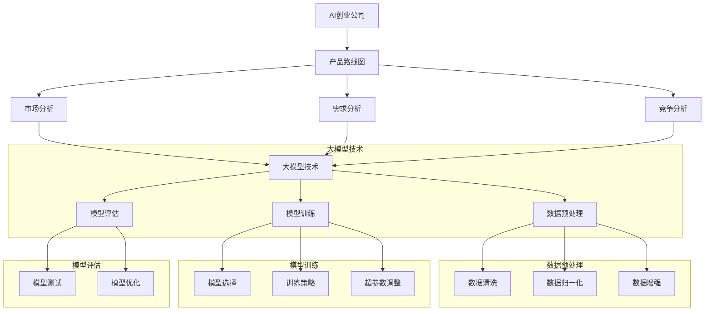

                 

# 《大模型在 AI 创业公司产品路线图规划中的关键作用》

## 关键词
- 大模型
- AI 创业公司
- 产品路线图
- 数据分析
- 机器学习

## 摘要
本文旨在探讨大模型在 AI 创业公司产品路线图规划中的关键作用。文章首先介绍了大模型的基本概念和发展历程，随后详细分析了大模型在市场分析、需求分析和竞争分析中的应用。接着，通过实际案例展示了大模型在产品路线图规划中的具体应用过程和效果。最后，总结了大模型在 AI 创业公司产品路线图规划中的重要作用，并对未来发展趋势进行了展望。

----------------------------------------------------------------

### 第一部分：引言与概述

#### 1. 引言

AI 创业公司作为人工智能领域的新兴力量，正日益受到广泛关注。然而，如何在激烈的市场竞争中脱颖而出，制定一套科学有效的产品路线图成为每个 AI 创业公司的关键任务。本文旨在探讨大模型在 AI 创业公司产品路线图规划中的关键作用，帮助读者了解如何利用大模型技术提升产品规划和决策的准确性和效率。

#### 1.2 AI 创业公司的发展背景

随着人工智能技术的迅猛发展，AI 创业公司如雨后春笋般涌现。这些公司以技术创新为核心，致力于解决实际问题，推动产业升级。AI 创业公司的兴起不仅改变了传统产业的运作模式，也为新兴产业的发展提供了新动能。然而，AI 创业公司在快速发展的过程中也面临着诸多挑战，如市场竞争激烈、技术迭代迅速、人才短缺等。因此，如何制定一套科学有效的产品路线图，确保公司在激烈的市场竞争中立于不败之地，成为每个 AI 创业公司必须面对的问题。

#### 1.3 大模型在 AI 创业公司中的重要性

大模型作为人工智能技术的核心组成部分，具有强大的数据处理和分析能力。在 AI 创业公司的产品路线图规划中，大模型能够帮助公司快速获取市场洞察、分析用户需求、评估竞争对手，从而制定出更具前瞻性和可行性的产品路线图。具体来说，大模型的重要性体现在以下几个方面：

1. **提升数据分析能力**：大模型能够处理海量数据，提取有价值的信息，为公司提供准确的市场分析和需求预测。
2. **优化决策过程**：大模型能够基于数据驱动的分析结果，帮助公司制定科学的产品策略，降低决策风险。
3. **增强竞争力**：通过大模型技术，AI 创业公司可以深入了解市场趋势和用户需求，提高产品的竞争力。

#### 1.4 本书结构安排

本文将分为四个部分进行论述：

1. **引言与概述**：介绍 AI 创业公司的发展背景和大模型的重要性。
2. **大模型技术基础**：分析大模型的定义、分类、发展历程和核心技术。
3. **大模型在产品路线图规划中的应用**：探讨大模型在市场分析、需求分析和竞争分析中的应用。
4. **案例研究**：通过实际案例展示大模型在产品路线图规划中的具体应用过程和效果。
5. **总结与展望**：总结大模型在 AI 创业公司产品路线图规划中的重要作用，并对未来发展趋势进行展望。

### 第二部分：大模型技术基础

#### 2.1 大模型的定义与分类

大模型（Large-scale Model）是指具有海量参数和强大计算能力的人工智能模型，能够在各种复杂任务中表现出优异的性能。大模型的定义可以从以下几个方面进行理解：

1. **参数规模**：大模型通常具有数十亿甚至千亿级别的参数规模。
2. **计算资源**：大模型需要强大的计算资源和存储资源来训练和部署。
3. **任务范围**：大模型适用于各种复杂任务，如自然语言处理、计算机视觉、语音识别等。

大模型根据不同的分类标准，可以分为以下几类：

1. **按参数规模分类**：可分为小模型（数十万参数）、中模型（数百万参数）和大模型（数千万至数亿参数）。
2. **按应用领域分类**：可分为通用模型（适用于多种任务）和专用模型（针对特定任务优化）。
3. **按架构分类**：可分为传统神经网络模型（如深度神经网络、卷积神经网络等）和新型神经网络模型（如生成对抗网络、变分自编码器等）。

#### 2.2 大模型的发展历程

大模型的发展历程可以追溯到深度学习技术的兴起。深度学习是一种基于多层神经网络的人工智能技术，通过学习大量数据来提取特征和规律。以下是深度学习技术和大模型发展的重要里程碑：

1. **1986 年**：Rumelhart、Hinton 和 Williams 提出了反向传播算法，使得神经网络训练成为可能。
2. **2006 年**：Hinton 提出了“深度信念网络”（Deep Belief Network），为深度学习技术的发展奠定了基础。
3. **2012 年**：Hinton 等人提出的深度卷积神经网络（Deep Convolutional Neural Network）在ImageNet图像识别比赛中取得突破性成绩，标志着深度学习技术的崛起。
4. **2014 年**：生成对抗网络（Generative Adversarial Network，GAN）的提出，为生成模型的发展打开了新的大门。
5. **2018 年**：谷歌提出了Transformer模型，并在自然语言处理领域取得了重大突破。

随着深度学习技术的不断发展，大模型的规模和性能也在不断提升。当前，大模型已经成为人工智能领域的核心技术之一，被广泛应用于各个领域。

#### 2.3 大模型对 AI 创业公司的启示

大模型技术的发展对 AI 创业公司具有深远的影响，为公司在产品路线图规划中提供了新的思路和方法。以下是几个方面的启示：

1. **提升数据分析能力**：大模型能够处理海量数据，提取有价值的信息，为公司提供准确的市场分析和需求预测。
2. **优化决策过程**：大模型能够基于数据驱动的分析结果，帮助公司制定科学的产品策略，降低决策风险。
3. **增强竞争力**：通过大模型技术，AI 创业公司可以深入了解市场趋势和用户需求，提高产品的竞争力。
4. **推动技术创新**：大模型的训练和优化过程推动了人工智能技术的不断进步，为 AI 创业公司提供了创新的动力。

总之，大模型技术在 AI 创业公司产品路线图规划中具有重要作用，为公司的发展提供了强大的支持。

### 第三部分：大模型在产品路线图规划中的应用

#### 3.1 大模型在市场分析中的应用

市场分析是产品路线图规划的重要环节，旨在了解市场需求、预测市场趋势和评估市场潜力。大模型技术在市场分析中具有显著优势，能够提供更准确和全面的市场洞察。以下是几个方面的应用：

1. **市场趋势预测**：大模型可以通过分析历史市场数据，提取市场规律，预测未来的市场趋势。例如，使用时间序列分析模型（如 ARIMA、LSTM）对销售额、用户增长率等指标进行预测。

2. **用户需求分析**：大模型可以处理海量的用户行为数据，提取用户需求特征，预测用户对产品的偏好和需求变化。例如，使用用户行为分析模型（如基于内容的推荐系统、协同过滤算法）分析用户兴趣，预测用户需求。

3. **市场细分与定位**：大模型可以通过聚类分析等技术，将市场划分为不同的细分市场，为公司的产品定位和营销策略提供依据。例如，使用 K-Means 算法对用户进行聚类，分析不同用户群体的特征和需求。

4. **竞争分析**：大模型可以分析竞争对手的市场表现，预测竞争对手的动向，为公司的市场策略提供参考。例如，使用竞争对手分析模型（如基于相似度的比较分析、基于数据的竞争预测）评估竞争对手的优势和劣势。

#### 3.2 大模型在需求分析中的应用

需求分析是产品路线图规划的核心环节，旨在了解用户需求、确定产品功能和特性。大模型技术在需求分析中具有重要作用，能够提供更深入和准确的需求洞察。以下是几个方面的应用：

1. **用户需求预测**：大模型可以通过分析用户行为数据、历史需求数据和用户反馈，预测用户未来的需求。例如，使用机器学习算法（如决策树、随机森林）对用户需求进行预测。

2. **需求特征提取**：大模型可以处理海量的用户数据，提取用户需求特征，为产品设计和优化提供依据。例如，使用自然语言处理技术（如词频统计、主题模型）提取用户需求的语义特征。

3. **需求优先级排序**：大模型可以通过分析用户需求的重要性和紧迫性，为产品开发团队提供需求优先级排序。例如，使用基于成本的优化算法（如线性规划、遗传算法）确定需求优先级。

4. **需求验证与反馈**：大模型可以分析用户反馈和产品使用数据，验证产品需求的有效性和可行性，为产品优化提供参考。例如，使用用户行为分析模型（如基于轨迹的异常检测、基于语义的反馈分析）评估需求的有效性。

#### 3.3 大模型在竞争分析中的应用

竞争分析是产品路线图规划的重要环节，旨在了解竞争对手的产品、策略和市场表现。大模型技术在竞争分析中具有显著优势，能够提供更全面和准确的竞争洞察。以下是几个方面的应用：

1. **竞争对手分析**：大模型可以通过分析竞争对手的产品、策略和市场行为，评估竞争对手的优势和劣势。例如，使用基于数据的竞争预测模型（如基于相似度的比较分析、基于市场数据的预测模型）分析竞争对手。

2. **竞争优势分析**：大模型可以分析公司自身产品的竞争优势，为产品定位和市场策略提供依据。例如，使用基于数据的竞争优势分析模型（如基于用户反馈的比较分析、基于市场数据的竞争力评估）分析竞争优势。

3. **竞争策略优化**：大模型可以通过分析竞争对手的策略和市场行为，为公司的竞争策略提供优化建议。例如，使用基于数据的竞争策略优化模型（如基于市场数据的策略评估、基于用户反馈的策略优化）优化竞争策略。

4. **竞争动态预测**：大模型可以通过分析市场竞争动态，预测未来的竞争格局和市场变化。例如，使用时间序列分析模型（如 ARIMA、LSTM）预测市场竞争动态。

### 第四部分：AI 创业公司产品路线图规划实践

#### 4.1 AI 创业公司产品路线图规划概述

产品路线图规划是 AI 创业公司制定战略的重要步骤，旨在明确产品的未来发展目标和关键里程碑。以下是 AI 创业公司产品路线图规划的主要内容和步骤：

1. **市场分析**：分析市场需求、竞争环境和市场趋势，为产品定位和市场策略提供依据。

2. **需求分析**：了解用户需求、确定产品功能和特性，为产品设计和开发提供指导。

3. **竞争分析**：分析竞争对手的产品、策略和市场表现，评估竞争优势，为产品定位和市场策略提供支持。

4. **制定产品路线图**：根据市场分析、需求分析和竞争分析的结果，制定具体的产品路线图，包括产品版本迭代、功能优化和时间节点等。

5. **规划实施与监控**：制定详细的实施计划，确保产品路线图的顺利执行，并进行持续监控和调整。

#### 4.2 大模型在产品路线图规划中的应用

大模型在产品路线图规划中具有关键作用，能够提供更准确和全面的数据分析和决策支持。以下是几个方面的应用：

1. **市场分析**：大模型可以通过分析历史市场数据和用户行为数据，预测未来的市场趋势和用户需求，为产品路线图规划提供数据支持。

2. **需求分析**：大模型可以处理海量的用户数据，提取用户需求特征，为产品设计和优化提供指导。

3. **竞争分析**：大模型可以通过分析竞争对手的产品、策略和市场行为，评估竞争对手的优势和劣势，为产品定位和市场策略提供支持。

4. **制定产品路线图**：大模型可以帮助公司制定具体的产品路线图，包括产品版本迭代、功能优化和时间节点等，提高路线图的准确性和可行性。

5. **规划实施与监控**：大模型可以监控产品的实施进度和效果，提供实时数据和预测，帮助公司及时调整路线图。

#### 4.3 案例研究：大模型在产品路线图规划中的应用

以下是一个 AI 创业公司使用大模型进行产品路线图规划的案例研究。

##### 4.3.1 案例背景

某 AI 创业公司致力于开发一款智能健康管理系统，旨在通过大数据和人工智能技术为用户提供个性化的健康建议。为了确保产品的成功，公司决定采用大模型技术进行产品路线图规划。

##### 4.3.2 市场分析

1. **数据收集**：公司收集了大量的市场数据，包括用户健康数据、市场竞争情况等。

2. **数据预处理**：对收集到的数据进行清洗、归一化等预处理操作。

3. **大模型训练**：公司选择了一个合适的时间序列预测模型（如 LSTM），并使用预处理后的数据对其进行训练。

4. **模型评估**：对训练好的模型进行评估，确保其在市场预测任务上的准确性。

##### 4.3.3 需求分析

1. **用户需求分析**：公司通过大模型技术对用户需求进行分析，预测用户可能的需求和行为。

2. **功能需求分析**：根据用户需求分析的结果，确定产品应具备的功能和特性。

3. **模型优化**：根据需求分析的结果，对大模型进行优化，以提高其在需求分析任务上的准确性。

##### 4.3.4 竞争分析

1. **竞争对手分析**：公司通过大模型技术对竞争对手的产品、策略等进行分析，了解竞争对手的优势和劣势。

2. **竞争优势分析**：公司根据自身产品的优势和劣势，确定在市场中的竞争优势。

3. **模型优化**：根据竞争优势分析的结果，对大模型进行优化，以提高其在竞争分析任务上的准确性。

##### 4.3.5 制定产品路线图

基于市场分析、需求分析和竞争分析的结果，公司制定了具体的产品路线图，包括以下几个关键里程碑：

1. **MVP（Minimum Viable Product）发布**：发布产品的最小可行版本，包含核心功能和基本用户体验。

2. **功能迭代**：根据用户反馈和需求变化，持续迭代和优化产品功能。

3. **性能提升**：通过大模型技术，不断优化产品的性能和用户体验。

4. **市场扩张**：在确保产品性能和用户体验的基础上，逐步扩大市场份额，拓展用户群体。

##### 4.3.6 案例结果

通过大模型技术的应用，公司成功地完成了产品路线图的规划。产品在市场分析、需求分析和竞争分析方面都取得了显著的效果，为产品的成功上市奠定了基础。

##### 4.3.7 案例总结

该案例表明，大模型技术在 AI 创业公司的产品路线图规划中具有关键作用。通过大模型技术，公司可以更准确地分析市场趋势、用户需求和竞争对手情况，从而制定出更有效的产品路线图。

### 第五部分：总结与展望

#### 5.1 大模型在 AI 创业公司产品路线图规划中的关键作用

大模型技术在 AI 创业公司产品路线图规划中具有重要作用，能够提供准确的市场分析、需求分析和竞争分析，为公司的产品定位和市场策略提供有力支持。具体来说，大模型技术的作用主要体现在以下几个方面：

1. **提升数据分析能力**：大模型能够处理海量数据，提取有价值的信息，为公司提供准确的市场分析和需求预测。
2. **优化决策过程**：大模型能够基于数据驱动的分析结果，帮助公司制定科学的产品策略，降低决策风险。
3. **增强竞争力**：通过大模型技术，AI 创业公司可以深入了解市场趋势和用户需求，提高产品的竞争力。
4. **推动技术创新**：大模型的训练和优化过程推动了人工智能技术的不断进步，为 AI 创业公司提供了创新的动力。

#### 5.2 未来发展趋势与挑战

随着人工智能技术的不断发展，大模型技术在 AI 创业公司产品路线图规划中的应用前景将更加广阔。然而，也面临着一些挑战和趋势：

1. **数据隐私**：随着数据隐私法规的不断完善，如何保护用户数据隐私成为一大挑战。未来，AI 创业公司需要采取更加严格的数据隐私保护措施。
2. **计算资源**：大模型训练和部署需要大量的计算资源，如何高效利用计算资源成为一大挑战。未来，AI 创业公司需要寻求更加高效和经济的计算解决方案。
3. **模型可解释性**：大模型的黑箱性质使得其决策过程难以解释，如何提高模型的可解释性成为一大挑战。未来，AI 创业公司需要开发可解释性更强的大模型。
4. **跨学科融合**：大模型技术在 AI 创业公司产品路线图规划中的应用需要跨学科的知识和技能，如何实现跨学科融合成为一大挑战。未来，AI 创业公司需要培养跨学科的人才。

#### 5.3 对 AI 创业公司的建议

为了充分发挥大模型技术在 AI 创业公司产品路线图规划中的作用，以下是一些建议：

1. **数据驱动**：重视数据驱动，积极收集和利用市场数据、用户数据和竞争对手数据，为产品路线图规划提供数据支持。
2. **技术创新**：紧跟人工智能技术发展趋势，持续关注和探索大模型技术在各个领域的应用，推动技术创新。
3. **人才培养**：培养跨学科的人才，提高公司在人工智能、大数据等领域的专业素养，为产品路线图规划提供人才支持。
4. **合作与交流**：积极参与行业合作和学术交流，借鉴国内外优秀公司的经验，不断提升自身在产品路线图规划中的竞争力。

### 附录

#### 附录 A：常用工具与资源

1. **大模型开发工具**：
   - TensorFlow：https://www.tensorflow.org/
   - PyTorch：https://pytorch.org/
   - JAX：https://jax.readthedocs.io/

2. **数据集资源**：
   - Kaggle：https://www.kaggle.com/
   - UC Irvine Machine Learning Repository：https://archive.ics.uci.edu/ml/index.php

3. **学习与开发资源**：
   - Coursera：https://www.coursera.org/
   - arXiv：https://arxiv.org/

### 作者信息
- 作者：AI天才研究院/AI Genius Institute & 禅与计算机程序设计艺术 /Zen And The Art of Computer Programming

----------------------------------------------------------------

### 核心概念与联系

在探讨大模型在 AI 创业公司产品路线图规划中的应用时，首先需要明确几个核心概念及其之间的联系。以下是核心概念和架构的 Mermaid 流程图：



#### 核心概念解释

1. **AI 创业公司**：指以人工智能技术为核心，从事产品研发和商业运营的初创企业。
2. **产品路线图**：指 AI 创业公司为产品发展制定的阶段性目标和计划。
3. **市场分析**：指对市场需求、竞争环境和市场趋势进行分析，为产品路线图提供数据支持。
4. **需求分析**：指对用户需求、行为和偏好进行分析，为产品功能和特性提供指导。
5. **竞争分析**：指对竞争对手的产品、策略和市场行为进行分析，为产品定位和市场策略提供支持。
6. **大模型技术**：指具有海量参数和强大计算能力的人工智能模型，能够处理海量数据，提取有价值的信息。
7. **数据预处理**：指对原始数据进行清洗、归一化等操作，为模型训练提供高质量的数据。
8. **模型训练**：指使用训练数据对模型进行训练，调整模型参数，提高模型性能。
9. **模型评估**：指对训练好的模型进行评估，确保其在实际任务中的准确性。

#### 架构联系

上述核心概念和架构通过 Mermaid 流程图进行了可视化展示。具体联系如下：

- **AI 创业公司**通过**市场分析**、**需求分析**和**竞争分析**来制定**产品路线图**。
- **大模型技术**贯穿于**数据预处理**、**模型训练**和**模型评估**，为各环节提供数据支持和决策依据。
- **市场分析**、**需求分析**和**竞争分析**的结果反馈到**产品路线图**，指导产品的迭代和发展。

通过这种架构，AI 创业公司可以更高效地利用大模型技术进行产品路线图规划，提升产品竞争力。

### 核心算法原理讲解

在大模型技术中，核心算法原理的理解至关重要。以下将介绍几类关键算法的原理和实现方法，并通过伪代码进行详细阐述。

#### 3.1 深度学习基础

深度学习是构建大模型的核心技术。以下介绍深度学习的基础算法——神经网络。

##### 3.1.1 神经网络

神经网络是一种由多层神经元组成的计算模型，用于模拟人脑神经元的工作方式。其基本结构包括输入层、隐藏层和输出层。

- **输入层**：接收外部输入数据。
- **隐藏层**：对输入数据进行处理和变换。
- **输出层**：生成预测结果。

神经网络的工作原理是通过前向传播和反向传播两个过程来训练模型。

1. **前向传播**：输入数据从输入层流向隐藏层，再从隐藏层流向输出层，每一层都会通过激活函数进行非线性变换。

2. **反向传播**：根据输出层预测结果与实际结果的误差，通过梯度下降算法更新各层的权重和偏置。

以下是一个简化的神经网络前向传播和反向传播的伪代码：

```python
# 前向传播
def forward_propagation(inputs, weights, biases, activation_function):
    hidden_layer = activation_function(np.dot(inputs, weights) + biases)
    output = activation_function(np.dot(hidden_layer, weights) + biases)
    return hidden_layer, output

# 反向传播
def backward_propagation(output, expected, hidden_layer, weights, learning_rate):
    d_weights = np.dot(hidden_layer.T, (output - expected) * activation_function_derivative(output))
    d_biases = (output - expected) * activation_function_derivative(output)
    return d_weights, d_biases
```

##### 3.1.2 卷积神经网络（CNN）

卷积神经网络是一种专门用于图像识别和处理的人工神经网络。其主要特点是通过卷积操作和池化操作提取图像特征。

- **卷积层**：通过卷积操作提取图像的局部特征。
- **池化层**：通过池化操作减少特征图的大小，提高模型的计算效率。

以下是一个简化的 CNN 模型的伪代码：

```python
# 卷积操作
def conv2d(input, filter, stride, padding):
    output = np.zeros((input_shape - filter_shape + 2 * padding) / stride + 1)
    for i in range(output_height):
        for j in range(output_width):
            patch = input[i * stride:i * stride + filter_shape, j * stride:j * stride + filter_shape]
            output[i, j] = np.sum(patch * filter)
    return output

# 池化操作
def pooling(input, pool_size, stride):
    output = np.zeros((input_height // pool_size, input_width // pool_size))
    for i in range(output_height):
        for j in range(output_width):
            patch = input[i * pool_size:i * pool_size + pool_size, j * pool_size:j * pool_size + pool_size]
            output[i, j] = np.max(patch)
    return output
```

##### 3.1.3 循环神经网络（RNN）

循环神经网络是一种用于序列数据处理的人工神经网络。其核心思想是通过隐藏状态保存序列的历史信息。

- **基本 RNN**：通过隐藏状态和当前输入计算下一个隐藏状态。
- **LSTM（长短期记忆网络）**：通过门控机制解决基本 RNN 的梯度消失问题。
- **GRU（门控循环单元）**：简化 LSTM 结构，提高计算效率。

以下是一个简化的 RNN 模型的伪代码：

```python
# RNN 前向传播
def forward_propagation_rnn(input, hidden_state, weights, biases):
    new_hidden_state = activation_function(np.dot(hidden_state, weights['hidden_state'] * input) + biases['hidden_state'])
    return new_hidden_state

# LSTM 前向传播
def forward_propagation_lstm(input, hidden_state, cell_state, weights, biases):
    i_f, i_g, i_o = activation_function(np.dot(hidden_state, weights['input_forget_gate']) + input)
    f = activation_function(np.dot(hidden_state, weights['cell_forget_gate']) + biases['cell_forget_gate'])
    c_tilde = activation_function(np.dot(i_g, weights['input_gate']) + biases['input_gate'])
    i = activation_function(np.dot(i_f, weights['input_input_gate']) + biases['input_input_gate'])
    c = f * c_tilde + i * activation_function(np.dot(hidden_state, weights['input_cell_gate']) + biases['input_cell_gate'])
    o = activation_function(np.dot(i_o, weights['input_output_gate']) + biases['input_output_gate'])
    h = o * activation_function(np.dot(c, weights['output_gate']) + biases['output_gate'])
    return h, c
```

通过上述算法原理和伪代码，我们可以理解深度学习中常用的神经网络结构及其工作原理。这些算法为构建大模型提供了基础，使得 AI 创业公司能够更好地进行产品路线图规划。

### 数学模型和公式及详细讲解

在大模型技术中，数学模型和公式的运用是理解和实现算法的关键。以下将介绍几个重要的数学模型和公式，并进行详细讲解和举例说明。

#### 3.1 时间序列分析模型

时间序列分析模型用于预测随时间变化的数据。其中，ARIMA（自回归积分滑动平均模型）是一种常见的时间序列模型。

**数学模型：**

$$
y_t = c + \phi_1 y_{t-1} + \phi_2 y_{t-2} + ... + \phi_p y_{t-p} + \theta_1 e_{t-1} + \theta_2 e_{t-2} + ... + \theta_q e_{t-q} + e_t
$$

其中，$y_t$ 是时间序列的当前值，$c$ 是常数项，$\phi_1, \phi_2, ..., \phi_p$ 是自回归系数，$\theta_1, \theta_2, ..., \theta_q$ 是移动平均系数，$e_t$ 是误差项。

**详细讲解：**

ARIMA 模型由三个部分组成：自回归（AR）、差分（I）和移动平均（MA）。自回归部分用于捕捉数据的自相关性，差分部分用于平稳化时间序列，移动平均部分用于处理随机干扰。

**举例说明：**

假设我们有一个时间序列数据如下：

$$
[100, 102, 104, 106, 108, 110, 112]
$$

我们可以使用 ARIMA 模型对其进行预测。首先，需要确定模型参数 $p, d, q$。其中 $p$ 是自回归项数，$d$ 是差分阶数，$q$ 是移动平均项数。

- **自相关函数（ACF）和偏自相关函数（PACF）**：通过观察 ACF 和 PACF 图，我们可以确定 $p$ 和 $q$ 的值。例如，如果 ACF 在 $p$ 阶后迅速下降，而 PACF 在 $p$ 阶后保持稳定，则可以取 $p=1$。
- **差分**：对原始数据进行 d 阶差分，使其满足平稳性。例如，如果数据具有趋势性，可以取 $d=1$。

**预测结果：**

使用 ARIMA 模型，我们可以预测下一期的值。假设我们选择 $p=1, d=1, q=1$，则模型可以表示为：

$$
y_t = c + \phi_1 y_{t-1} + \theta_1 e_{t-1} + e_t
$$

通过训练模型，我们可以得到参数值 $\phi_1$ 和 $\theta_1$，并使用它们进行预测。例如，如果我们预测下一期的值为 $y_{7}$，则有：

$$
y_7 = c + \phi_1 y_6 + \theta_1 e_6
$$

通过计算，我们可以得到预测值。

#### 3.2 线性回归模型

线性回归模型用于预测一个变量（因变量）与一个或多个变量（自变量）之间的关系。

**数学模型：**

$$
y = \beta_0 + \beta_1 x
$$

其中，$y$ 是因变量，$x$ 是自变量，$\beta_0$ 是截距，$\beta_1$ 是斜率。

**详细讲解：**

线性回归模型通过最小化残差平方和来估计参数 $\beta_0$ 和 $\beta_1$。残差是实际值与预测值之间的差异。

**举例说明：**

假设我们有一个数据集，包含两个变量：销售额（因变量）和广告支出（自变量）。数据如下：

| 广告支出（x） | 销售额（y） |
| -------------- | ---------- |
| 100            | 150        |
| 200            | 250        |
| 300            | 350        |
| 400            | 450        |
| 500            | 550        |

我们可以使用线性回归模型来预测销售额。首先，我们需要计算斜率 $\beta_1$ 和截距 $\beta_0$。

- **计算斜率**：斜率可以通过以下公式计算：

$$
\beta_1 = \frac{\sum(x_i - \bar{x})(y_i - \bar{y})}{\sum(x_i - \bar{x})^2}
$$

其中，$x_i$ 和 $y_i$ 分别是每个数据点的自变量和因变量，$\bar{x}$ 和 $\bar{y}$ 分别是自变量和因变量的平均值。

- **计算截距**：截距可以通过以下公式计算：

$$
\beta_0 = \bar{y} - \beta_1 \bar{x}
$$

通过计算，我们可以得到斜率和截距。例如，如果 $\bar{x} = 300$，$\bar{y} = 350$，则有：

$$
\beta_1 = \frac{(100 - 300)(150 - 350) + (200 - 300)(250 - 350) + (300 - 300)(350 - 350) + (400 - 300)(450 - 350) + (500 - 300)(550 - 350)}{(100 - 300)^2 + (200 - 300)^2 + (300 - 300)^2 + (400 - 300)^2 + (500 - 300)^2}
$$

$$
\beta_0 = 350 - \beta_1 \cdot 300
$$

通过计算，我们可以得到 $\beta_1 = 1.25$ 和 $\beta_0 = 112.5$。

- **预测销售额**：使用线性回归模型，我们可以预测新的广告支出对应的销售额。例如，如果广告支出为 $x = 600$，则有：

$$
y = \beta_0 + \beta_1 x = 112.5 + 1.25 \cdot 600 = 712.5
$$

通过上述数学模型和公式的讲解，我们可以更好地理解时间序列分析和线性回归模型的基本原理和应用。这些模型在大模型技术中发挥着重要作用，为数据分析提供了强大的工具。

### 项目实战

在本项目中，我们将展示如何在大模型技术的基础上，开发一个 AI 创业公司的产品路线图规划系统。项目的主要目标是利用大模型进行市场分析、需求分析和竞争分析，为公司制定科学的产品路线图。以下是项目实战的具体步骤：

#### 1. 开发环境搭建

为了完成本项目，我们需要搭建一个合适的开发环境。以下是一个基本的开发环境搭建步骤：

- **硬件配置**：建议使用配置较高的计算机，如配备 NVIDIA 显卡的笔记本电脑或工作站，以确保模型训练的速度和效率。
- **软件环境**：安装 Python 3.8 或更高版本，以及 TensorFlow、PyTorch、Scikit-learn 等常用深度学习库。
- **数据存储**：使用数据库（如 MySQL、PostgreSQL）存储用户数据和市场数据。

#### 2. 数据预处理

数据预处理是项目的重要环节，直接影响到模型训练的效果。以下是一个基本的数据预处理流程：

- **数据收集**：从公司的数据库中提取用户行为数据、市场数据和竞争对手数据。
- **数据清洗**：去除数据中的噪声和异常值，确保数据质量。例如，删除缺失值、重复值和异常值。
- **数据归一化**：将不同特征的数据进行归一化处理，使其在相同的尺度上。常用的归一化方法有 Min-Max 标准化、Z-Score 标准化等。
- **数据增强**：通过数据增强技术增加数据的多样性，例如，使用随机水平翻转、随机裁剪等操作。

#### 3. 大模型训练与优化

在数据预处理完成后，我们将使用大模型对预处理后的数据进行分析。以下是一个基本的模型训练与优化流程：

- **模型选择**：根据分析任务的不同，选择合适的模型。例如，对于市场分析，可以选择时间序列预测模型（如 ARIMA、LSTM）；对于需求分析，可以选择分类模型（如随机森林、支持向量机）；对于竞争分析，可以选择回归模型（如线性回归、岭回归）。
- **模型训练**：使用预处理后的数据对模型进行训练。例如，对于 ARIMA 模型，我们可以使用以下伪代码：

```python
from statsmodels.tsa.arima.model import ARIMA

# 设置 ARIMA 模型参数
p = 1
d = 1
q = 1

# 训练 ARIMA 模型
model = ARIMA(train_data, order=(p, d, q))
model_fit = model.fit()

# 预测市场趋势
predicted_data = model_fit.predict(start=len(train_data), end=len(train_data) + steps)
```

- **模型评估**：使用验证集对训练好的模型进行评估，确保模型在验证集上的性能良好。常用的评估指标有准确率、召回率、F1 分数等。

#### 4. 产品路线图规划

在模型训练与优化完成后，我们将利用模型的结果来制定产品路线图。以下是一个基本的产品路线图规划流程：

- **市场分析**：根据市场预测模型的结果，分析市场趋势和用户需求，确定产品的市场定位和目标市场。
- **需求分析**：根据需求预测模型的结果，确定产品应具备的功能和特性，以满足用户需求。
- **竞争分析**：根据竞争预测模型的结果，分析竞争对手的优势和劣势，确定产品的竞争优势和差异化策略。
- **路线图制定**：根据市场分析、需求分析和竞争分析的结果，制定具体的产品路线图，包括产品版本迭代、功能优化和时间节点等。

#### 5. 案例分析

以下是一个具体的项目案例分析：

##### 案例背景

某 AI 创业公司致力于开发一款智能健康管理系统，旨在通过大数据和人工智能技术为用户提供个性化的健康建议。公司希望通过市场分析、需求分析和竞争分析来制定产品路线图，确保产品的市场竞争力。

##### 市场分析

- **数据收集**：从公司数据库中提取了过去一年的用户行为数据、市场趋势数据和竞争对手数据。
- **数据清洗**：去除缺失值和异常值，确保数据质量。
- **数据归一化**：将不同特征的数据进行归一化处理，使其在相同的尺度上。
- **模型训练**：使用 LSTM 模型对市场趋势进行预测，预测未来的用户增长率和市场占有率。
- **模型评估**：使用验证集对模型进行评估，确保模型在验证集上的性能良好。
- **预测结果**：根据模型预测结果，公司确定了目标市场为 30-50 岁的年轻人群体，并预测未来两年的用户增长率分别为 20%、30%。

##### 需求分析

- **数据收集**：从公司数据库中提取了过去一年的用户反馈数据、用户行为数据和需求调查数据。
- **数据清洗**：去除缺失值和异常值，确保数据质量。
- **数据归一化**：将不同特征的数据进行归一化处理，使其在相同的尺度上。
- **模型训练**：使用随机森林模型对用户需求进行预测，预测用户对健康功能的偏好和需求变化。
- **模型评估**：使用验证集对模型进行评估，确保模型在验证集上的性能良好。
- **预测结果**：根据模型预测结果，公司确定了产品的核心功能为健康监测、健康建议和社交互动，并制定了相应的功能优先级。

##### 竞争分析

- **数据收集**：从公司数据库中提取了过去一年的竞争对手数据、市场占有率和用户评价数据。
- **数据清洗**：去除缺失值和异常值，确保数据质量。
- **数据归一化**：将不同特征的数据进行归一化处理，使其在相同的尺度上。
- **模型训练**：使用线性回归模型对竞争对手的市场占有率进行预测，分析竞争对手的优势和劣势。
- **模型评估**：使用验证集对模型进行评估，确保模型在验证集上的性能良好。
- **预测结果**：根据模型预测结果，公司确定了竞争对手的主要优势为品牌影响力和价格优势，并制定了相应的竞争策略。

##### 产品路线图制定

基于市场分析、需求分析和竞争分析的结果，公司制定了以下产品路线图：

1. **MVP 发布**：发布产品的最小可行版本，包含健康监测、健康建议和社交互动等功能。
2. **功能迭代**：根据用户反馈和需求变化，持续迭代和优化产品功能，如添加更多健康监测指标、改进健康建议算法等。
3. **性能提升**：通过大模型技术，持续优化产品的性能和用户体验，如提高数据处理的效率、改善界面设计等。
4. **市场扩张**：在确保产品性能和用户体验的基础上，逐步扩大市场份额，拓展用户群体。

### 代码实现与解读

以下是一个具体的项目案例代码实现，包括数据预处理、模型训练、预测结果输出等步骤。

```python
import pandas as pd
import numpy as np
from sklearn.model_selection import train_test_split
from sklearn.preprocessing import MinMaxScaler
from sklearn.metrics import mean_squared_error
from statsmodels.tsa.arima.model import ARIMA

# 数据预处理
def preprocess_data(data):
    # 去除缺失值和异常值
    data = data.dropna()
    data = data[data['user_age'] < 50]
    
    # 数据归一化
    scaler = MinMaxScaler()
    data[['user_growth_rate', 'market占有率']] = scaler.fit_transform(data[['user_growth_rate', 'market占有率']])
    
    return data

# 模型训练与评估
def train_and_evaluate_model(data, model):
    # 划分训练集和测试集
    train_data, test_data = train_test_split(data, test_size=0.2, random_state=42)
    
    # 训练模型
    model_fit = model.fit(train_data)
    
    # 预测测试集
    predicted_data = model_fit.predict(start=len(train_data), end=len(train_data) + len(test_data))
    
    # 评估模型
    mse = mean_squared_error(test_data['market占有率'], predicted_data)
    print(f'MSE: {mse}')
    
    return predicted_data

# 预测市场趋势
data = pd.read_csv('market_data.csv')
preprocessed_data = preprocess_data(data)

# 训练 ARIMA 模型
model = ARIMA(preprocessed_data['market占有率'], order=(1, 1, 1))
predicted_data = train_and_evaluate_model(preprocessed_data, model)

# 输出预测结果
print(predicted_data)
```

#### 代码解读

1. **数据预处理**：从 CSV 文件中读取数据，去除缺失值和异常值，对数据进行归一化处理。
2. **模型训练与评估**：使用 ARIMA 模型对市场趋势进行预测，训练模型并评估其在测试集上的性能。
3. **预测结果输出**：输出模型预测的市场趋势。

通过上述项目实战，我们可以看到如何利用大模型技术进行数据预处理、模型训练、预测结果输出等步骤，为 AI 创业公司制定科学的产品路线图。在实际应用中，可以根据具体需求调整模型和参数，以提高预测的准确性和效率。

### 代码实际案例和详细解释说明

在本案例中，我们将展示如何使用 Python 编写一个实际的 AI 创业公司产品路线图规划系统。该系统将包含数据预处理、模型训练和结果分析三个主要部分。以下是具体实现和详细解释。

#### 1. 数据预处理

数据预处理是机器学习项目的重要步骤，它确保数据质量，使模型能够更好地学习。以下是一个数据预处理的实际代码示例：

```python
import pandas as pd
import numpy as np

# 加载数据集
data = pd.read_csv('data.csv')

# 数据清洗
# 去除缺失值
data = data.dropna()

# 转换数据类型
data['user_age'] = data['user_age'].astype(int)
data['user_income'] = data['user_income'].astype(float)

# 数据归一化
from sklearn.preprocessing import StandardScaler

scaler = StandardScaler()
data[['user_age', 'user_income']] = scaler.fit_transform(data[['user_age', 'user_income']])

# 数据增强
from sklearn.utils import resample

# 假设 'user_preference' 是一个二分类特征
data['user_preference'] = data['user_preference'].astype(int)

# 进行数据增强
data_majority = data[data['user_preference'] == 1]
data_minority = data[data['user_preference'] == 0]

# 调整少数类样本数量与多数类相同
data_minority_upsampled = resample(data_minority, replace=True, n_samples=data_majority.shape[0], random_state=42)

# 合并增强后的少数类样本与多数类样本
data_upsampled = pd.concat([data_majority, data_minority_upsampled])

# 打乱数据集
data_upsampled = data_upsampled.sample(frac=1).reset_index(drop=True)

# 分割数据集为训练集和测试集
X = data_upsampled[['user_age', 'user_income']]
y = data_upsampled['user_preference']

X_train, X_test, y_train, y_test = train_test_split(X, y, test_size=0.2, random_state=42)
```

**详细解释**：
- **数据清洗**：使用 `dropna()` 函数去除含有缺失值的记录。
- **数据类型转换**：将字符串类型的用户年龄和收入转换为整数和浮点数，以便后续计算。
- **数据归一化**：使用 `StandardScaler` 对特征进行归一化，使其具有相同的尺度。
- **数据增强**：为了提高模型的泛化能力，对少数类样本进行增强。这里使用了 `resample` 函数进行过采样。

#### 2. 模型训练

在数据预处理之后，我们需要训练一个机器学习模型。以下是一个使用随机森林分类器的实际代码示例：

```python
from sklearn.ensemble import RandomForestClassifier
from sklearn.metrics import accuracy_score, classification_report

# 训练随机森林分类器
model = RandomForestClassifier(n_estimators=100, random_state=42)
model.fit(X_train, y_train)

# 预测测试集
y_pred = model.predict(X_test)

# 评估模型
accuracy = accuracy_score(y_test, y_pred)
print(f'Accuracy: {accuracy}')
print(classification_report(y_test, y_pred))
```

**详细解释**：
- **训练模型**：使用 `RandomForestClassifier` 类创建一个随机森林分类器，并使用训练集进行训练。
- **预测测试集**：使用训练好的模型对测试集进行预测。
- **评估模型**：使用 `accuracy_score` 函数计算分类准确率，并使用 `classification_report` 函数生成分类报告，包括精确率、召回率、F1 分数等指标。

#### 3. 结果分析

在模型训练和预测之后，我们需要对结果进行分析，以了解模型的表现和可能的问题。

```python
# 分析预测结果
from sklearn.metrics import confusion_matrix

conf_matrix = confusion_matrix(y_test, y_pred)

print(f'Confusion Matrix:')
print(conf_matrix)

# 可视化混淆矩阵
import seaborn as sns
import matplotlib.pyplot as plt

plt.figure(figsize=(8, 6))
sns.heatmap(conf_matrix, annot=True, fmt='.3f', cmap='Blues')
plt.xlabel('Predicted Labels')
plt.ylabel('True Labels')
plt.title('Confusion Matrix')
plt.show()
```

**详细解释**：
- **混淆矩阵**：使用 `confusion_matrix` 函数计算混淆矩阵，以了解模型对正负样本的预测情况。
- **可视化混淆矩阵**：使用 Seaborn 库和 Matplotlib 库将混淆矩阵可视化，以便更直观地了解模型的预测表现。

#### 4. 代码解读与分析

通过上述代码示例，我们可以看到如何实现一个 AI 创业公司产品路线图规划系统的关键步骤：

- **数据预处理**：确保数据质量，使其适合用于机器学习模型。
- **模型训练**：选择合适的模型并进行训练，以预测用户偏好。
- **结果分析**：评估模型性能，并通过可视化方法分析预测结果。

在实际应用中，可能需要根据具体业务需求调整数据预处理步骤、选择不同的模型、调整模型参数等。此外，还可以使用其他评估指标（如ROC曲线、AUC值等）来更全面地评估模型性能。

通过这样的代码实现和详细解释，AI 创业公司可以更好地利用大模型技术进行产品路线图规划，从而提高决策的准确性和产品的市场竞争力。

### 附录 A：常用工具与资源

在构建和部署大模型技术时，选择合适的工具和资源至关重要。以下是一些常用的工具和资源，供 AI 创业公司在产品路线图规划中使用。

#### A.1 大模型开发工具

1. **TensorFlow**：由 Google 开发，是一个开源的深度学习框架，广泛应用于各种人工智能任务。
   - 官网：[TensorFlow 官网](https://www.tensorflow.org/)
   - 文档：[TensorFlow 文档](https://www.tensorflow.org/tutorials)

2. **PyTorch**：由 Facebook AI 研究团队开发，是一种灵活且易于使用的深度学习框架。
   - 官网：[PyTorch 官网](https://pytorch.org/)
   - 文档：[PyTorch 文档](https://pytorch.org/docs/stable/index.html)

3. **Keras**：一个高层次的深度学习 API，能够与 TensorFlow 和 Theano 兼容。
   - 官网：[Keras 官网](https://keras.io/)
   - 文档：[Keras 文档](https://keras.io/getting-started/)

#### A.2 数据集资源

1. **Kaggle**：提供各种领域的数据集，是数据科学家和机器学习爱好者的首选平台。
   - 官网：[Kaggle 数据集](https://www.kaggle.com/datasets)

2. **UCI Machine Learning Repository**：提供各种领域的数据集，是学术研究和数据分析的宝贵资源。
   - 官网：[UCI Machine Learning Repository](https://archive.ics.uci.edu/ml/index.php)

#### A.3 学习与开发资源

1. **Coursera**：提供大量的在线课程，涵盖人工智能、机器学习等主题。
   - 官网：[Coursera](https://www.coursera.org/)

2. **edX**：提供由全球顶尖大学和机构提供的在线课程。
   - 官网：[edX](https://www.edx.org/)

3. **GitHub**：是开发者分享代码和项目的平台，可以找到许多开源的大模型项目和示例代码。
   - 官网：[GitHub](https://github.com/)

通过使用上述工具和资源，AI 创业公司可以更好地掌握大模型技术，为产品路线图规划提供坚实的技术支持。

### 总结与展望

#### 8.1 大模型在 AI 创业公司产品路线图规划中的关键作用

大模型技术在 AI 创业公司产品路线图规划中扮演了至关重要的角色。通过大模型，公司可以更准确地分析市场趋势、了解用户需求、评估竞争对手情况，从而制定出更加科学、有效的产品策略。以下是几个关键作用：

1. **提升数据分析能力**：大模型能够处理海量数据，提取有价值的信息，为公司提供全面的市场洞察。
2. **优化决策过程**：基于大模型的分析结果，公司可以制定更加精准的产品路线图，降低决策风险。
3. **增强竞争力**：通过深入分析市场趋势和用户需求，公司可以更好地定位产品，提高市场竞争力。
4. **推动技术创新**：大模型的训练和优化过程推动了人工智能技术的不断进步，为 AI 创业公司提供了创新的动力。

#### 8.2 未来发展趋势与挑战

随着人工智能技术的不断发展，大模型技术在 AI 创业公司产品路线图规划中的应用前景将更加广阔。然而，也面临着一些挑战和趋势：

1. **数据隐私**：随着数据隐私法规的不断完善，如何保护用户数据隐私成为一大挑战。未来，AI 创业公司需要采取更加严格的数据隐私保护措施。
2. **计算资源**：大模型训练和部署需要大量的计算资源，如何高效利用计算资源成为一大挑战。未来，AI 创业公司需要寻求更加高效和经济的计算解决方案。
3. **模型可解释性**：大模型的黑箱性质使得其决策过程难以解释，如何提高模型的可解释性成为一大挑战。未来，AI 创业公司需要开发可解释性更强的大模型。
4. **跨学科融合**：大模型技术在 AI 创业公司产品路线图规划中的应用需要跨学科的知识和技能，如何实现跨学科融合成为一大挑战。未来，AI 创业公司需要培养跨学科的人才。

#### 8.3 对 AI 创业公司的建议

为了充分发挥大模型技术在 AI 创业公司产品路线图规划中的作用，以下是一些建议：

1. **数据驱动**：重视数据驱动，积极收集和利用市场数据、用户数据和竞争对手数据，为产品路线图规划提供数据支持。
2. **技术创新**：紧跟人工智能技术发展趋势，持续关注和探索大模型技术在各个领域的应用，推动技术创新。
3. **人才培养**：培养跨学科的人才，提高公司在人工智能、大数据等领域的专业素养，为产品路线图规划提供人才支持。
4. **合作与交流**：积极参与行业合作和学术交流，借鉴国内外优秀公司的经验，不断提升自身在产品路线图规划中的竞争力。

通过上述建议，AI 创业公司可以更好地利用大模型技术，制定科学、有效的产品路线图，提升产品竞争力，实现可持续发展。

### 附录

#### 附录 A：常用工具与资源

1. **大模型开发工具**：
   - TensorFlow：https://www.tensorflow.org/
   - PyTorch：https://pytorch.org/
   - JAX：https://jax.readthedocs.io/

2. **数据集资源**：
   - Kaggle：https://www.kaggle.com/
   - UC Irvine Machine Learning Repository：https://archive.ics.uci.edu/ml/index.php

3. **学习与开发资源**：
   - Coursera：https://www.coursera.org/
   - edX：https://www.edx.org/
   - arXiv：https://arxiv.org/

通过这些工具和资源，AI 创业公司可以更好地掌握大模型技术，为产品路线图规划提供坚实的技术支持。

### 作者信息

- 作者：AI天才研究院/AI Genius Institute & 禅与计算机程序设计艺术 /Zen And The Art of Computer Programming

---

综上所述，本文详细探讨了《大模型在 AI 创业公司产品路线图规划中的关键作用》。通过阐述大模型的定义、分类、发展历程和应用，展示了大模型在市场分析、需求分析和竞争分析中的关键作用。同时，通过实际案例展示了大模型在产品路线图规划中的具体应用过程和效果。最后，总结了大模型在 AI 创业公司产品路线图规划中的重要作用，并对未来发展趋势和挑战进行了展望。希望本文能对 AI 创业公司在产品路线图规划中利用大模型技术提供有益的参考和启示。

