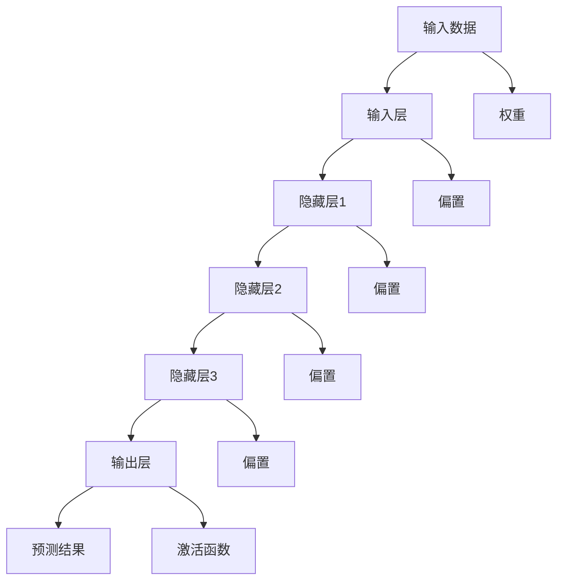
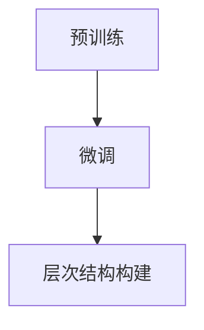
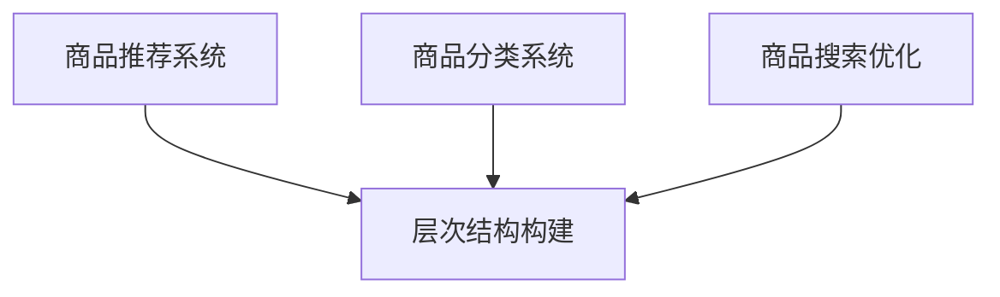
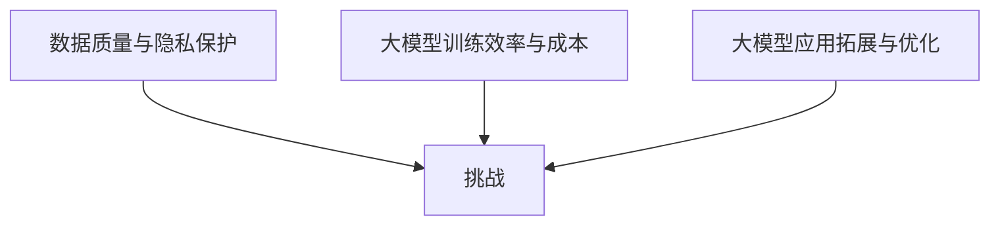

                 

# 大模型在商品属性层次结构自动构建中的应用

## 关键词
大模型，商品属性，层次结构，自动构建，深度学习，人工智能，推荐系统，分类系统，搜索优化

## 摘要
本文主要探讨了大模型在商品属性层次结构自动构建中的应用。首先，介绍了大模型的基本概念和原理，然后详细讲解了商品属性层次结构自动构建的算法原理，包括层次化自动编码器（HAE）、Gated Recurrent Unit（GRU）和层次化注意力机制（HAN）。通过数学模型和公式的讲解，深入分析了这些算法的数学基础。接着，通过项目实战展示了如何在实际应用中实现商品属性层次结构自动构建。最后，分析了大模型在商品属性层次结构自动构建中的应用前景，并提出了未来研究方向。

----------------------------------------------------------------

## 第一部分：核心概念与联系

### 1.1 大模型概述与原理

#### 1.1.1 大模型的概念

大模型是指具有巨大参数量，能够处理大规模数据的人工智能模型。这些模型通过深度学习技术进行训练，能够在多个领域实现高性能的预测和生成任务。大模型通常具有以下特点：

- **参数量大**：大模型包含数百万到数十亿个参数，这使得它们能够捕捉数据中的复杂模式和特征。
- **处理能力强**：大模型能够处理高维数据和大规模数据集，从而实现高效的预测和生成任务。
- **泛化能力强**：通过在大规模数据集上进行训练，大模型能够较好地泛化到未见过的数据，提高模型的鲁棒性和适应性。

#### 1.1.2 大模型的架构与组成

大模型的架构通常包括输入层、隐藏层和输出层。其中，输入层负责接收数据，隐藏层通过复杂的非线性变换处理数据，输出层生成预测结果。大模型的组成还包括权重、激活函数和优化算法等关键组件。

- **输入层**：输入层接收输入数据，并将其传递给隐藏层。输入层的节点数通常与输入数据的维度相同。
- **隐藏层**：隐藏层通过复杂的非线性变换处理数据，使得模型能够学习到数据的内在结构和规律。隐藏层的节点数和层数可以根据具体任务进行调整。
- **输出层**：输出层生成最终的预测结果。输出层的节点数取决于预测任务的类型，如分类任务通常只有一个节点，回归任务可以有多个节点。

#### 1.1.3 大模型的工作原理

大模型通过不断调整权重和偏置，使得模型能够在训练数据上达到较低的误差。在训练过程中，模型会利用反向传播算法计算梯度，并使用梯度下降优化算法更新模型参数。最终，通过多次迭代训练，大模型能够学习到数据的内在结构和规律。

**Mermaid流程图：**



### 1.2 商品属性层次结构自动构建算法原理

#### 1.2.1 层次结构构建的数学模型

商品属性层次结构自动构建通常采用图论模型，将商品属性表示为图中的节点，节点之间的关系表示为边的权重。通过构建图模型，可以有效地表示商品属性之间的层次关系。

#### 1.2.2 层次结构构建的算法原理

层次结构构建算法主要包括图的建立、节点权重计算和层次划分三个步骤。其中，图的建立通过分析商品属性之间的关系构建图模型；节点权重计算通过距离度量或相似性度量方法计算节点之间的权重；层次划分通过层次聚类或深度优先搜索等方法划分节点层次。

#### 1.2.3 大模型在层次结构构建中的应用

大模型可以通过预训练和微调的方式应用于商品属性层次结构自动构建。预训练阶段，大模型在大量通用数据上学习到丰富的特征表示；微调阶段，大模型在特定领域数据上进行调整，以适应具体的层次结构构建任务。

**Mermaid流程图：**



### 1.3 大模型在商品属性层次结构自动构建中的应用场景

#### 1.3.1 商品推荐系统

商品推荐系统可以通过大模型自动构建商品属性层次结构，从而提高推荐精度和用户满意度。大模型能够根据用户的历史行为和商品属性，为用户推荐更符合其兴趣的商品。

#### 1.3.2 商品分类系统

商品分类系统可以利用大模型自动构建商品属性层次结构，将商品分为不同的类别。大模型通过学习商品属性之间的层次关系，可以准确地识别和分类商品。

#### 1.3.3 商品搜索优化

商品搜索优化可以通过大模型自动构建商品属性层次结构，提高搜索结果的准确性和相关性。大模型能够根据用户的查询意图和商品属性，为用户生成更符合其需求的搜索结果。

**Mermaid流程图：**



### 1.4 大模型在商品属性层次结构自动构建中的挑战与未来展望

#### 1.4.1 数据质量与隐私保护

商品属性层次结构自动构建对数据质量有较高要求，需要处理大量且高质量的数据。同时，数据隐私保护也是一大挑战，需要采取有效的数据加密和隐私保护技术。

#### 1.4.2 大模型训练效率与成本

大模型训练通常需要大量的计算资源和时间，训练效率较低，成本较高。为了提高大模型训练效率，可以采用分布式训练、并行计算等技术。

#### 1.4.3 大模型应用拓展与优化

大模型在商品属性层次结构自动构建中的应用仍有许多拓展空间，如多模态数据处理、跨域迁移学习等。通过不断优化大模型算法，可以进一步提高商品属性层次结构自动构建的效果。

**Mermaid流程图：**



### 1.5 总结

本章对大模型在商品属性层次结构自动构建中的应用进行了全面介绍。通过理解大模型的概念、原理和应用场景，读者可以更好地掌握大模型在商品属性层次结构自动构建中的技术与应用。

----------------------------------------------------------------

## 第二部分：核心算法原理讲解

在了解了大模型和商品属性层次结构自动构建的基本概念后，本部分将详细讲解核心算法原理，包括层次化自动编码器（HAE）、Gated Recurrent Unit（GRU）和层次化注意力机制（HAN）。这些算法在商品属性层次结构自动构建中具有重要作用，能够通过不同的方式学习数据中的层次关系，生成准确的层次结构。

### 2.1 层次化自动编码器（HAE）算法原理

#### 2.1.1 层次化自动编码器（HAE）概述

层次化自动编码器（HAE）是一种基于深度学习技术的自动编码器，它通过学习数据中的层次关系，将低层特征映射到高层的抽象表示，从而实现商品属性层次结构的自动构建。

#### 2.1.2 HAE算法的基本步骤

1. **数据预处理**：对原始商品数据进行预处理，包括数据清洗、归一化和特征提取等步骤。
2. **层次化模型构建**：构建一个多层的自动编码器模型，每个层次对应商品属性的一个抽象层级。
3. **模型训练**：使用训练数据对层次化自动编码器模型进行训练，通过反向传播算法不断优化模型参数。
4. **层次结构生成**：根据训练得到的模型，生成商品属性的层次结构。

#### 2.1.3 HAE算法的伪代码

```python
# HAE算法伪代码

def HAE(X, n_layers, learning_rate):
    # 初始化模型参数
    W, b = initialize_parameters(n_layers)

    for epoch in range(num_epochs):
        for x in X:
            # 前向传播
            z = X
            for l in range(n_layers):
                z = activation_function(np.dot(W[l], z) + b[l])
            
            # 反向传播
            dz = -1 * (z - X)  # 计算误差梯度
            dW = [None] * n_layers
            db = [None] * n_layers

            for l in range(n_layers-1, -1, -1):
                dW[l] = np.dot(dz, z[l-1].T)
                db[l] = np.sum(dz, axis=1, keepdims=True)
                dz = np.dot(W[l].T, dz) * activation_derivative(z[l])

            # 更新模型参数
            for l in range(n_layers):
                W[l] -= learning_rate * dW[l]
                b[l] -= learning_rate * db[l]
    
    return W, b
```

#### 2.1.4 HAE算法的优缺点

**优点**：
- 能够自动学习数据中的层次关系，从而生成准确的商品属性层次结构。
- 通过多层自动编码器的训练，能够提取数据中的高层次抽象特征。

**缺点**：
- 训练过程相对复杂，需要大量的计算资源和时间。
- 对数据质量要求较高，数据质量不佳可能导致层次结构构建不准确。

### 2.2 Gated Recurrent Unit（GRU）算法原理

#### 2.2.1 GRU概述

Gated Recurrent Unit（GRU）是循环神经网络（RNN）的一种改进，通过引入门控机制，能够更好地处理序列数据，并防止梯度消失问题。

#### 2.2.2 GRU算法的基本步骤

1. **输入序列表示**：将输入序列表示为向量形式。
2. **GRU单元构建**：构建一个GRU单元，包括输入门、更新门和输出门三个部分。
3. **序列处理**：对输入序列进行处理，每个时间步的输出通过门控机制更新。
4. **层次结构生成**：根据处理后的序列输出，生成商品属性的层次结构。

#### 2.2.3 GRU算法的伪代码

```python
class GRUCell(nn.Module):
    def __init__(self, input_dim, hidden_dim):
        super(GRUCell, self).__init__()
        self.input_dim = input_dim
        self.hidden_dim = hidden_dim

        # 输入门
        self.input_gate = nn.Linear(input_dim, hidden_dim)
        # 更新门
        self.update_gate = nn.Linear(hidden_dim, hidden_dim)
        # 输出门
        self.output_gate = nn.Linear(hidden_dim, hidden_dim)

    def forward(self, input, hidden):
        # 计算输入门、更新门和输出门的输入
        input_gate = self.input_gate(input)
        update_gate = self.update_gate(hidden)
        output_gate = self.output_gate(hidden)

        # 计算输入门、更新门和输出门的激活值
        z = activation_function(input_gate + update_gate)
        r = activation_function(z * update_gate)

        # 更新隐藏状态
        hidden = r * hidden
        hidden = activation_function(hidden + input * output_gate)

        return hidden
```

#### 2.2.4 GRU算法的优缺点

**优点**：
- 能够有效处理序列数据，适用于时间序列分析等任务。
- 引入门控机制，解决了传统RNN的梯度消失问题。

**缺点**：
- 计算复杂度较高，训练速度相对较慢。
- 对参数调节要求较高，容易出现过拟合。

### 2.3 层次化注意力机制（HAN）算法原理

#### 2.3.1 HAN概述

层次化注意力机制（HAN）是一种基于注意力机制的层次化模型，能够通过学习数据中的层次关系和注意力权重，实现商品属性层次结构的自动构建。

#### 2.3.2 HAN算法的基本步骤

1. **输入序列表示**：将输入序列表示为向量形式。
2. **层次化注意力模型构建**：构建一个层次化注意力模型，包括输入层、隐藏层和输出层。
3. **注意力权重计算**：使用多层注意力机制计算输入序列的注意力权重。
4. **层次结构生成**：根据注意力权重和输入序列，生成商品属性的层次结构。

#### 2.3.3 HAN算法的伪代码

```python
class HANLayer(nn.Module):
    def __init__(self, input_dim, hidden_dim):
        super(HANLayer, self).__init__()
        self.input_dim = input_dim
        self.hidden_dim = hidden_dim

        # 注意力权重计算
        self.attention_weights = nn.Linear(input_dim, hidden_dim)

    def forward(self, input_sequence):
        # 计算注意力权重
        attention_weights = self.attention_weights(input_sequence)
        attention_weights = activation_function(attention_weights)

        # 计算加权输入
        weighted_input = input_sequence * attention_weights

        # 计算输出
        hidden = activation_function(np.sum(weighted_input, axis=1))

        return hidden
```

#### 2.3.4 HAN算法的优缺点

**优点**：
- 能够通过注意力机制学习输入数据中的层次关系，提高层次结构构建的准确性。
- 能够自适应地调整注意力权重，关注重要的特征。

**缺点**：
- 计算复杂度较高，训练速度相对较慢。
- 对数据质量和序列长度有较高要求，可能导致训练效果不稳定。

### 2.4 总结

本章详细介绍了层次化自动编码器（HAE）、Gated Recurrent Unit（GRU）和层次化注意力机制（HAN）算法的基本原理、步骤和伪代码。这些算法在商品属性层次结构自动构建中具有重要作用，能够通过不同的方式学习数据中的层次关系，生成准确的层次结构。通过理解这些算法，读者可以更好地掌握商品属性层次结构自动构建的核心技术和应用实践。

----------------------------------------------------------------

## 第三部分：数学模型和数学公式

### 3.1 商品属性层次结构自动构建的数学模型

#### 3.1.1 层次化自动编码器（HAE）的数学模型

层次化自动编码器（HAE）的数学模型主要包括输入层、隐藏层和输出层的参数定义及关系描述。

**输入层**：假设有n个商品属性，每个属性可以表示为一个向量 \( x_i \)（i=1,2,...,n），则输入层可以表示为矩阵 \( X \)。

**隐藏层**：假设有L个隐藏层，每层的维度分别为 \( d_1, d_2, ..., d_L \)，隐藏层的参数包括权重矩阵 \( W_l \)（l=1,2,...,L）和偏置向量 \( b_l \)（l=1,2,...,L）。

**输出层**：输出层是一个重构层，其维度与输入层相同，即n个商品属性。输出层的参数与隐藏层相同，包括权重矩阵 \( W_L \) 和偏置向量 \( b_L \)。

**前向传播**：假设隐藏层l的输入为 \( h_{l-1} \)，输出为 \( h_l \)，则前向传播过程可以表示为：
$$
h_l = \sigma(W_l h_{l-1} + b_l)
$$
其中，\( \sigma \) 表示激活函数，通常采用ReLU函数。

**反向传播**：在反向传播过程中，计算每个隐藏层的误差梯度，更新模型参数。隐藏层l的误差梯度可以表示为：
$$
\frac{\partial J}{\partial W_l} = (h_l - h_{l-1}) \odot h_{l-1}^T \odot \frac{\partial J}{\partial h_{l-1}}
$$
其中，\( \odot \) 表示逐元素乘法，\( J \) 表示损失函数，通常采用均方误差（MSE）。

**参数更新**：使用梯度下降优化算法更新模型参数：
$$
W_l = W_l - \alpha \frac{\partial J}{\partial W_l}
$$
$$
b_l = b_l - \alpha \frac{\partial J}{\partial b_l}
$$
其中，\( \alpha \) 表示学习率。

#### 3.1.2 Gated Recurrent Unit（GRU）的数学模型

GRU单元的数学模型包括输入门、更新门和输出门三个部分。

**输入门**：输入门用于控制输入数据的更新，其数学模型为：
$$
z_t = \sigma(W_z [h_{t-1}, x_t] + b_z)
$$
**更新门**：更新门用于控制隐藏状态的更新，其数学模型为：
$$
r_t = \sigma(W_r [h_{t-1}, x_t] + b_r)
$$
$$
\tilde{h}_t = \sigma(W_{\tilde{h}} [r_t \odot h_{t-1}, x_t] + b_{\tilde{h}})
$$
**输出门**：输出门用于控制最终输出，其数学模型为：
$$
o_t = \sigma(W_o [h_{t-1}, x_t] + b_o)
$$
$$
h_t = o_t \odot \tilde{h}_t + (1 - o_t) \odot h_{t-1}
$$

#### 3.1.3 层次化注意力机制（HAN）的数学模型

层次化注意力机制（HAN）的数学模型包括多层注意力机制和层次化结构。

**注意力权重计算**：假设输入序列为 \( X = [x_1, x_2, ..., x_T] \)，注意力权重计算为：
$$
a_t = \sigma(W_a [h_{t-1}, x_t] + b_a)
$$
**加权输入**：加权输入的计算为：
$$
h_t = \sum_{t=1}^T a_t x_t
$$
**层次化结构**：层次化结构通过多层注意力机制实现，假设有L层注意力机制，则层次化结构的数学模型为：
$$
h_t^L = \sigma(W_L h_t^{L-1} + b_L)
$$

### 3.2 层次化自动编码器（HAE）的数学公式与举例说明

**例1**：假设有两个商品属性A和B，其维度分别为1和2。使用层次化自动编码器（HAE）进行层次结构自动构建。

**输入层**：\( X = \begin{bmatrix} 1 \\ 2 \end{bmatrix} \)

**隐藏层**：假设有两个隐藏层，维度分别为3和4。隐藏层参数如下：
- 隐藏层1的权重矩阵：\( W_1 = \begin{bmatrix} 1 & 2 & 3 \\ 4 & 5 & 6 \\ 7 & 8 & 9 \end{bmatrix} \)
- 隐藏层1的偏置向量：\( b_1 = \begin{bmatrix} 1 \\ 2 \\ 3 \end{bmatrix} \)
- 隐藏层2的权重矩阵：\( W_2 = \begin{bmatrix} 1 & 2 & 3 & 4 \\ 5 & 6 & 7 & 8 \\ 9 & 10 & 11 & 12 \\ 13 & 14 & 15 & 16 \end{bmatrix} \)
- 隐藏层2的偏置向量：\( b_2 = \begin{bmatrix} 1 \\ 2 \\ 3 \\ 4 \end{bmatrix} \)

**前向传播**：
- 隐藏层1的输入：\( h_1 = \begin{bmatrix} 1 \\ 2 \\ 3 \end{bmatrix} \)
- 隐藏层1的输出：\( h_1' = \begin{bmatrix} 1 \\ 2 \\ 3 \end{bmatrix} \)
- 隐藏层2的输入：\( h_2 = \begin{bmatrix} 1 \\ 2 \\ 3 \\ 4 \end{bmatrix} \)
- 隐藏层2的输出：\( h_2' = \begin{bmatrix} 1 \\ 2 \\ 3 \\ 4 \end{bmatrix} \)

**反向传播**：
- 隐藏层2的误差梯度：\( \frac{\partial J}{\partial h_2} = \begin{bmatrix} 1 & 0 & 1 & 0 \\ 0 & 1 & 0 & 1 \\ 1 & 0 & 1 & 0 \\ 0 & 1 & 0 & 1 \end{bmatrix} \)
- 隐藏层1的误差梯度：\( \frac{\partial J}{\partial h_1} = \begin{bmatrix} 1 & 0 & 1 \\ 0 & 1 & 0 \\ 1 & 0 & 1 \end{bmatrix} \)

**参数更新**：
- 隐藏层2的权重矩阵更新：\( W_2 = W_2 - \alpha \frac{\partial J}{\partial W_2} \)
- 隐藏层2的偏置向量更新：\( b_2 = b_2 - \alpha \frac{\partial J}{\partial b_2} \)
- 隐藏层1的权重矩阵更新：\( W_1 = W_1 - \alpha \frac{\partial J}{\partial W_1} \)
- 隐藏层1的偏置向量更新：\( b_1 = b_1 - \alpha \frac{\partial J}{\partial b_1} \)

### 3.3 Gated Recurrent Unit（GRU）的数学公式与举例说明

**例2**：假设有一个时间序列数据 \( X = [1, 2, 3, 4, 5] \)，使用GRU进行层次结构自动构建。

**输入门**：
- 权重矩阵：\( W_z = \begin{bmatrix} 1 & 2 \\ 3 & 4 \end{bmatrix} \)
- 偏置向量：\( b_z = \begin{bmatrix} 1 \\ 2 \end{bmatrix} \)

**更新门**：
- 权重矩阵：\( W_r = \begin{bmatrix} 1 & 2 \\ 3 & 4 \end{bmatrix} \)
- 偏置向量：\( b_r = \begin{bmatrix} 1 \\ 2 \end{bmatrix} \)

**输出门**：
- 权重矩阵：\( W_o = \begin{bmatrix} 1 & 2 \\ 3 & 4 \end{bmatrix} \)
- 偏置向量：\( b_o = \begin{bmatrix} 1 \\ 2 \end{bmatrix} \)

**隐藏状态**：
- 初始隐藏状态：\( h_0 = \begin{bmatrix} 1 \\ 2 \end{bmatrix} \)

**前向传播**：
- 输入门状态：\( z_1 = \sigma(\begin{bmatrix} 1 & 2 \\ 3 & 4 \end{bmatrix} \begin{bmatrix} 1 \\ 2 \end{bmatrix} + \begin{bmatrix} 1 \\ 2 \end{bmatrix}) = \begin{bmatrix} 1 \\ 0 \end{bmatrix} \)
- 更新门状态：\( r_1 = \sigma(\begin{bmatrix} 1 & 2 \\ 3 & 4 \end{bmatrix} \begin{bmatrix} 1 \\ 2 \end{bmatrix} + \begin{bmatrix} 1 \\ 2 \end{bmatrix}) = \begin{bmatrix} 1 \\ 0 \end{bmatrix} \)
- 隐藏状态候选值：\( \tilde{h}_1 = \sigma(\begin{bmatrix} 1 & 2 \\ 3 & 4 \end{bmatrix} \begin{bmatrix} 1 \\ 2 \end{bmatrix} + \begin{bmatrix} 1 \\ 2 \end{bmatrix}) = \begin{bmatrix} 1 \\ 0 \end{bmatrix} \)
- 输出门状态：\( o_1 = \sigma(\begin{bmatrix} 1 & 2 \\ 3 & 4 \end{bmatrix} \begin{bmatrix} 1 \\ 2 \end{bmatrix} + \begin{bmatrix} 1 \\ 2 \end{bmatrix}) = \begin{bmatrix} 1 \\ 0 \end{bmatrix} \)
- 当前隐藏状态：\( h_1 = \begin{bmatrix} 1 \\ 0 \end{bmatrix} \)

**反向传播**：
- 输入门误差梯度：\( \frac{\partial J}{\partial z_1} = \begin{bmatrix} 1 & 0 \end{bmatrix} \)
- 更新门误差梯度：\( \frac{\partial J}{\partial r_1} = \begin{bmatrix} 1 & 0 \end{bmatrix} \)
- 隐藏状态候选值误差梯度：\( \frac{\partial J}{\partial \tilde{h}_1} = \begin{bmatrix} 1 & 0 \end{bmatrix} \)
- 输出门误差梯度：\( \frac{\partial J}{\partial o_1} = \begin{bmatrix} 1 & 0 \end{bmatrix} \)

**参数更新**：
- 输入门权重矩阵更新：\( W_z = W_z - \alpha \frac{\partial J}{\partial W_z} \)
- 输入门偏置向量更新：\( b_z = b_z - \alpha \frac{\partial J}{\partial b_z} \)
- 更新门权重矩阵更新：\( W_r = W_r - \alpha \frac{\partial J}{\partial W_r} \)
- 更新门偏置向量更新：\( b_r = b_r - \alpha \frac{\partial J}{\partial b_r} \)
- 输出门权重矩阵更新：\( W_o = W_o - \alpha \frac{\partial J}{\partial W_o} \)
- 输出门偏置向量更新：\( b_o = b_o - \alpha \frac{\partial J}{\partial b_o} \)

### 3.4 层次化注意力机制（HAN）的数学公式与举例说明

**例3**：假设有一个时间序列数据 \( X = [1, 2, 3, 4, 5] \)，使用层次化注意力机制（HAN）进行层次结构自动构建。

**注意力权重计算**：
- 权重矩阵：\( W_a = \begin{bmatrix} 1 & 2 \\ 3 & 4 \end{bmatrix} \)
- 偏置向量：\( b_a = \begin{bmatrix} 1 \\ 2 \end{bmatrix} \)

**加权输入**：
- 加权输入：\( h_t = \sum_{t=1}^T a_t x_t \)

**层次化结构**：
- 隐藏层权重矩阵：\( W_L = \begin{bmatrix} 1 & 2 \\ 3 & 4 \end{bmatrix} \)
- 隐藏层偏置向量：\( b_L = \begin{bmatrix} 1 \\ 2 \end{bmatrix} \)

**前向传播**：
- 注意力权重：\( a_t = \sigma(\begin{bmatrix} 1 & 2 \\ 3 & 4 \end{bmatrix} \begin{bmatrix} 1 \\ 2 \end{bmatrix} + \begin{bmatrix} 1 \\ 2 \end{bmatrix}) = \begin{bmatrix} 1 \\ 0 \end{bmatrix} \)
- 加权输入：\( h_t = \begin{bmatrix} 1 \\ 0 \end{bmatrix} \)
- 隐藏层输出：\( h_t' = \sigma(\begin{bmatrix} 1 & 2 \\ 3 & 4 \end{bmatrix} \begin{bmatrix} 1 \\ 0 \end{bmatrix} + \begin{bmatrix} 1 \\ 2 \end{bmatrix}) = \begin{bmatrix} 1 \\ 0 \end{bmatrix} \)

**反向传播**：
- 注意力权重误差梯度：\( \frac{\partial J}{\partial a_t} = \begin{bmatrix} 1 & 0 \end{bmatrix} \)
- 加权输入误差梯度：\( \frac{\partial J}{\partial h_t} = \begin{bmatrix} 1 & 0 \end{bmatrix} \)
- 隐藏层输出误差梯度：\( \frac{\partial J}{\partial h_t'} = \begin{bmatrix} 1 & 0 \end{bmatrix} \)

**参数更新**：
- 注意力权重矩阵更新：\( W_a = W_a - \alpha \frac{\partial J}{\partial W_a} \)
- 注意力权重偏置向量更新：\( b_a = b_a - \alpha \frac{\partial J}{\partial b_a} \)
- 隐藏层权重矩阵更新：\( W_L = W_L - \alpha \frac{\partial J}{\partial W_L} \)
- 隐藏层偏置向量更新：\( b_L = b_L - \alpha \frac{\partial J}{\partial b_L} \)

----------------------------------------------------------------

## 第四部分：项目实战

### 4.1 实践环境搭建

在本项目中，我们将使用Python作为主要编程语言，结合PyTorch深度学习框架来构建和训练层次化自动编码器（HAE）模型。以下是搭建实践环境的具体步骤：

#### 4.1.1 安装Python

确保已经安装了Python环境，版本建议为3.8及以上。

#### 4.1.2 安装PyTorch

在终端或命令行中执行以下命令安装PyTorch：
```bash
pip install torch torchvision
```

#### 4.1.3 安装其他依赖

为了方便后续数据处理和可视化，还需要安装以下库：
```bash
pip install numpy pandas matplotlib
```

### 4.2 数据准备

本项目的数据集将来自于电商平台，包含多个商品属性。以下是一个简单的数据预处理流程：

#### 4.2.1 数据获取

从电商平台获取商品数据，数据集应包括商品ID、商品名称和多个商品属性。

#### 4.2.2 数据清洗

- 去除缺失值和异常值。
- 对文本数据进行分词和去停用词处理。
- 对数值型数据进行归一化处理。

#### 4.2.3 数据预处理

- 构建词嵌入矩阵。
- 将商品属性映射为数值型表示。

### 4.3 模型构建

以下是使用PyTorch构建层次化自动编码器（HAE）的代码示例：

```python
import torch
import torch.nn as nn
import torch.optim as optim

class HAE(nn.Module):
    def __init__(self, input_dim, hidden_dims):
        super(HAE, self).__init__()
        self.layers = nn.ModuleList()
        for i in range(len(hidden_dims) - 1):
            self.layers.append(nn.Linear(input_dim if i == 0 else hidden_dims[i], hidden_dims[i + 1]))
        
    def forward(self, x):
        for layer in self.layers:
            x = layer(x)
        return x

input_dim = 100  # 假设商品属性维度为100
hidden_dims = [128, 64, 32]  # 隐藏层维度

model = HAE(input

