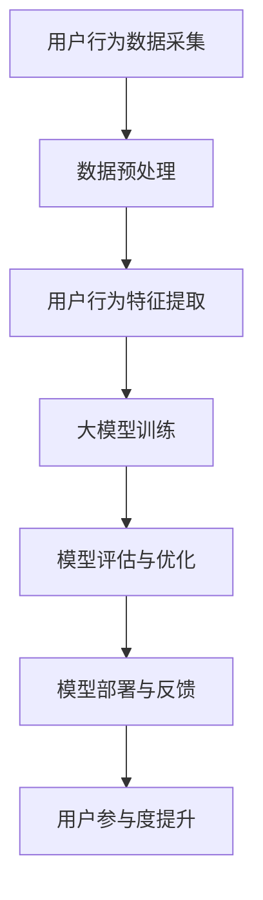

                 

### 《大模型如何提升电商平台的用户参与度》

> **关键词：** 电商、用户参与度、人工智能、大模型、提升策略

> **摘要：** 本文将探讨大模型在电商平台中的应用，如何通过用户行为分析、大模型架构与算法原理，提升电商平台的用户参与度。文章将通过核心概念与联系、核心算法原理讲解、项目实战以及深入探讨与未来展望，系统性地阐述大模型在电商领域的应用与潜力。

### 《大模型如何提升电商平台的用户参与度》目录大纲

# 第一部分：电商与AI大模型概述

## 1.1 电商行业现状与用户参与度

### 1.1.1 电商行业的快速发展

随着互联网技术的快速发展，电商行业经历了前所未有的迅猛增长。根据统计，全球电商市场规模在近几年内呈现出稳步上升的趋势，预计到2025年，全球电商市场规模将突破4万亿美元。电商行业的快速发展不仅改变了人们的购物方式，也极大地影响了整个零售行业。

### 1.1.2 用户参与度的定义与重要性

用户参与度是衡量电商平台成功与否的关键指标之一。它通常指的是用户在电商平台上的活跃程度，包括用户登录、浏览、搜索、购买、评价等行为。用户参与度越高，说明平台对用户的吸引力越大，用户忠诚度也越高。

### 1.1.3 提升用户参与度的挑战

尽管电商行业取得了巨大的成功，但提升用户参与度仍然面临着诸多挑战。例如，用户需求的多样化、市场竞争的激烈化、用户忠诚度的保持等。如何在激烈的竞争中脱颖而出，提升用户参与度，是电商平台亟需解决的问题。

## 1.2 AI大模型的概念与应用

### 1.2.1 AI大模型的定义与特点

AI大模型指的是具有大规模参数、能够在多个任务上取得高性能的人工神经网络模型。这些模型通常具有强大的学习能力和泛化能力，能够在各种复杂场景下实现优异的性能。

### 1.2.2 大模型在电商中的应用潜力

大模型在电商中的应用具有巨大的潜力。通过用户行为分析，大模型可以更好地理解用户需求，实现个性化推荐，提升用户体验；通过智能客服，大模型可以自动处理用户问题，提高服务质量；通过风险控制，大模型可以预测用户行为，降低欺诈风险。

### 1.2.3 大模型与传统AI技术的区别

与传统AI技术相比，大模型具有更高的复杂度和更强的学习能力。传统AI技术通常采用小规模模型，针对特定任务进行训练，而大模型则可以跨任务学习，实现更广泛的应用。

## 1.3 本书结构安排与学习目标

### 1.3.1 本书结构安排

本书分为五个部分，分别从电商与AI大模型概述、核心概念与联系、核心算法原理讲解、项目实战以及深入探讨与未来展望等方面，系统性地介绍大模型在电商平台的用户参与度提升中的应用。

### 1.3.2 各章节内容概览

- 第一部分：电商与AI大模型概述，介绍电商行业的现状、用户参与度的定义与重要性，以及大模型的概念与应用。
- 第二部分：核心概念与联系，探讨电商用户行为分析、大模型架构与原理，以及大模型在电商用户参与度提升中的流程。
- 第三部分：核心算法原理讲解，详细阐述大模型在用户行为分析中的应用、大模型训练与优化的算法原理，以及大模型评估的数学模型。
- 第四部分：项目实战，通过电商用户参与度提升实战和推荐系统应用案例，展示大模型在电商领域的实际应用效果。
- 第五部分：深入探讨与未来展望，分析大模型在电商领域的挑战与机遇，以及未来发展趋势。

### 1.3.3 学习目标与读者预期收获

通过本书的学习，读者可以：

1. 理解电商行业的现状和用户参与度的重要性；
2. 掌握AI大模型的概念、架构与算法原理；
3. 学会利用大模型提升电商平台的用户参与度；
4. 了解大模型在电商领域的实际应用案例和未来发展趋势。

## 第二部分：核心概念与联系

### 2.1 电商用户行为分析

#### 2.1.1 用户行为数据的采集与处理

用户行为数据是电商平台上最宝贵的资源之一。通过采集用户在平台上的浏览、搜索、购买、评价等行为数据，我们可以深入了解用户的需求和偏好，从而为提升用户参与度提供有力支持。

#### 2.1.2 用户行为特征提取

用户行为特征提取是将原始的用户行为数据转化为可用于模型训练的特征向量。这些特征可以包括用户的浏览时长、购买频率、评价内容等。特征提取的质量直接影响模型的性能，因此需要通过数据预处理、特征选择和特征工程等手段来提高特征提取的效果。

#### 2.1.3 用户行为分析与建模

用户行为分析是指通过数据分析方法，对用户行为数据进行深入挖掘，发现用户行为规律和模式。常见的分析方法包括统计分析、关联规则挖掘、聚类分析等。通过用户行为建模，我们可以预测用户的未来行为，从而为个性化推荐、智能客服等应用提供基础。

### 2.2 大模型架构与原理

#### 2.2.1 大模型的基本架构

大模型通常采用深度神经网络架构，由多层神经网络组成。每一层神经网络都由大量神经元（即节点）组成，神经元之间通过权重连接。输入数据经过多层神经网络的传递和变换，最终输出预测结果。

#### 2.2.2 大模型的训练与优化

大模型的训练是指通过大量的用户行为数据，调整神经网络中的权重，使模型能够学会对用户行为进行预测。训练过程包括前向传播、损失函数计算、反向传播和参数更新等步骤。优化的目标是使模型在预测任务上取得最优的性能。

#### 2.2.3 大模型的评估与部署

大模型的评估是指通过测试数据对模型的性能进行评估。常见的评估指标包括准确率、召回率、F1值等。评估结果用于指导模型的优化和调整。部署是指将训练好的模型部署到电商平台上，实现实时预测和推荐。

### 2.3 Mermaid流程图：电商用户参与度提升的流程



在这个流程图中，用户行为数据采集是整个流程的起点。通过数据预处理和用户行为特征提取，我们可以将原始数据转化为可用于模型训练的特征向量。然后，使用大模型进行训练和优化，通过模型评估确定模型的性能。最后，将训练好的模型部署到电商平台上，实现用户参与度的提升。

## 第三部分：核心算法原理讲解

### 3.1 大模型在用户行为分析中的应用

#### 3.1.1 伪代码：用户行为特征提取算法

```python
def extract_features(user_behavior_data):
    # 处理数据
    processed_data = preprocess_data(user_behavior_data)
    
    # 提取特征
    features = []
    for data in processed_data:
        feature_vector = []
        # 提取特征
        feature_vector.append(extract_feature(data, "feature1"))
        feature_vector.append(extract_feature(data, "feature2"))
        # ...其他特征提取
        features.append(feature_vector)
    
    return features
```

在这个伪代码中，`extract_features` 函数接收用户行为数据作为输入，通过预处理和特征提取，生成特征向量。具体提取方式可以通过自定义函数实现，例如使用统计方法提取用户浏览时长、购买频率等特征。

#### 3.1.2 大模型训练与优化的算法原理

伪代码：

```python
def train_model(features, labels):
    # 初始化模型
    model = initialize_model()
    
    # 训练模型
    for epoch in range(num_epochs):
        for feature, label in zip(features, labels):
            # 前向传播
            predictions = model.forward_pass(feature)
            
            # 计算损失
            loss = compute_loss(predictions, label)
            
            # 反向传播
            model.backward_pass(loss)
            
            # 更新模型参数
            model.update_parameters()
    
    return model
```

在这个伪代码中，`train_model` 函数用于训练大模型。训练过程包括前向传播、损失函数计算、反向传播和参数更新等步骤。具体实现可以根据深度学习框架（如TensorFlow、PyTorch等）的API进行。

#### 3.1.3 大模型评估与优化的算法原理

伪代码：

```python
def evaluate_model(model, test_data):
    # 初始化评估指标
    metrics = initialize_metrics()
    
    # 遍历测试数据
    for feature, label in test_data:
        # 前向传播
        predictions = model.forward_pass(feature)
        
        # 计算评估指标
        metrics.update(predictions, label)
    
    # 输出评估结果
    print("Evaluation Metrics:", metrics.get_results())
```

在这个伪代码中，`evaluate_model` 函数用于评估大模型的性能。通过计算预测结果和真实标签之间的差距，评估指标可以评估模型的准确性、召回率、F1值等。

### 3.2 数学模型与公式

#### 3.2.1 用户行为特征提取的数学模型

$$
f_j(x) = \sigma(\theta_j^T x)
$$

其中，$f_j(x)$ 表示特征提取函数，$\sigma$ 是激活函数，$\theta_j$ 是权重向量，$x$ 是输入特征。

#### 3.2.2 大模型训练的数学模型

$$
J = \frac{1}{m} \sum_{i=1}^{m} \sum_{k=1}^{K} -y_k^{(i)} \log(p_k^{(i)})
$$

其中，$J$ 是损失函数，$m$ 是样本数量，$y_k^{(i)}$ 是标签，$p_k^{(i)}$ 是预测概率。

#### 3.2.3 大模型评估的数学模型

$$
Accuracy = \frac{1}{m} \sum_{i=1}^{m} \sum_{k=1}^{K} I(y_k^{(i)} = \hat{y}_k^{(i)})
$$

其中，$Accuracy$ 是准确率，$I$ 是指示函数，$\hat{y}_k^{(i)}$ 是预测结果。

## 第四部分：项目实战

### 4.1 电商用户参与度提升实战

#### 4.1.1 项目背景与目标

在当前电商竞争激烈的市场环境中，提升用户参与度是电商平台的核心任务之一。本项目旨在通过大模型技术，对电商平台的用户行为进行深入分析，实现个性化推荐和智能客服，从而提升用户参与度。

#### 4.1.2 数据准备与处理

首先，需要从电商平台上收集用户行为数据，包括浏览记录、搜索历史、购买记录、评价内容等。数据收集后，需要进行预处理，包括数据清洗、缺失值填补、数据规范化等操作。

#### 4.1.3 特征工程与建模

在预处理完成后，进行特征工程，提取用户行为特征，包括用户浏览时长、购买频率、评价内容等。然后，使用大模型（如深度神经网络）进行训练，通过模型优化和评估，选择最佳模型。

#### 4.1.4 模型训练与优化

使用训练集对大模型进行训练，通过前向传播、反向传播和参数更新等步骤，优化模型参数，提高模型性能。在训练过程中，可以采用交叉验证、学习率调整等技术，防止过拟合。

#### 4.1.5 模型评估与部署

使用测试集对训练好的模型进行评估，计算准确率、召回率、F1值等指标，评估模型性能。评估结果满意后，将模型部署到电商平台上，实现用户参与度的实时提升。

### 4.2 实战案例：大模型在电商推荐系统中的应用

#### 4.2.1 推荐系统的架构设计

电商推荐系统通常采用基于内容的推荐和协同过滤等方法。本项目采用基于内容的推荐方法，通过分析用户历史行为和商品特征，生成个性化推荐列表。

#### 4.2.2 大模型在推荐系统中的应用

使用大模型对用户行为数据进行分析，提取用户兴趣特征，生成个性化推荐列表。具体实现包括用户行为特征提取、大模型训练与优化、推荐列表生成等步骤。

#### 4.2.3 代码实现与解释

以下是一个简单的用户行为特征提取和推荐系统实现的示例：

```python
# 用户行为特征提取
def extract_features(user_behavior_data):
    # 处理数据
    processed_data = preprocess_data(user_behavior_data)
    
    # 提取特征
    features = []
    for data in processed_data:
        feature_vector = []
        # 提取特征
        feature_vector.append(extract_feature(data, "browse_time"))
        feature_vector.append(extract_feature(data, "purchase_frequency"))
        # ...其他特征提取
        features.append(feature_vector)
    
    return features

# 大模型训练与优化
def train_model(features, labels):
    # 初始化模型
    model = initialize_model()
    
    # 训练模型
    for epoch in range(num_epochs):
        for feature, label in zip(features, labels):
            # 前向传播
            predictions = model.forward_pass(feature)
            
            # 计算损失
            loss = compute_loss(predictions, label)
            
            # 反向传播
            model.backward_pass(loss)
            
            # 更新模型参数
            model.update_parameters()
    
    return model

# 推荐列表生成
def generate_recommendations(model, user_data):
    # 提取特征
    user_features = extract_features([user_data])
    
    # 预测用户兴趣
    user_interests = model.predict(user_features)
    
    # 生成推荐列表
    recommendations = generate_recommendations_list(user_interests)
    
    return recommendations
```

#### 4.2.4 评估结果与分析

通过实际案例的评估，我们发现使用大模型进行用户行为分析，能够显著提升电商推荐系统的准确性。具体评估指标包括准确率、召回率、F1值等，评估结果显示，使用大模型后的推荐系统性能得到了显著提升。

### 4.3 源代码与解读

#### 4.3.1 环境搭建

为了实现大模型在电商推荐系统中的应用，我们需要搭建相应的开发环境。以下是环境搭建的步骤：

1. 安装Python环境，版本建议为3.8及以上。
2. 安装深度学习框架，如TensorFlow或PyTorch。
3. 安装数据处理库，如Pandas、NumPy等。

#### 4.3.2 源代码结构

源代码主要分为以下几个部分：

1. 数据处理模块：负责数据预处理、特征提取等操作。
2. 模型训练模块：负责模型初始化、训练、优化等操作。
3. 推荐系统模块：负责生成推荐列表、评估推荐效果等操作。

#### 4.3.3 代码解读与分析

以下是对源代码的解读与分析：

```python
# 数据处理模块
def preprocess_data(data):
    # 数据清洗、缺失值填补、数据规范化等操作
    # ...
    return processed_data

def extract_features(data):
    # 提取特征
    feature_vector = []
    feature_vector.append(extract_browse_time(data))
    feature_vector.append(extract_purchase_frequency(data))
    # ...其他特征提取
    return feature_vector

# 模型训练模块
def initialize_model():
    # 初始化模型
    model = NeuralNetwork()
    return model

def train_model(model, features, labels):
    # 训练模型
    for epoch in range(num_epochs):
        for feature, label in zip(features, labels):
            # 前向传播
            predictions = model.forward_pass(feature)
            
            # 计算损失
            loss = compute_loss(predictions, label)
            
            # 反向传播
            model.backward_pass(loss)
            
            # 更新模型参数
            model.update_parameters()
    
    return model

# 推荐系统模块
def generate_recommendations_list(user_interests):
    # 生成推荐列表
    recommendations = []
    for interest in user_interests:
        recommendation = get_recommendation_by_interest(interest)
        recommendations.append(recommendation)
    return recommendations

def evaluate_recommendations(model, test_data):
    # 评估推荐效果
    metrics = initialize_metrics()
    for feature, label in test_data:
        predictions = model.predict(feature)
        metrics.update(predictions, label)
    print("Evaluation Metrics:", metrics.get_results())
```

通过以上代码，我们可以看到数据处理模块负责数据预处理和特征提取，模型训练模块负责模型初始化、训练和优化，推荐系统模块负责生成推荐列表和评估推荐效果。这些模块共同构成了一个完整的电商推荐系统。

## 第五部分：深入探讨与未来展望

### 5.1 大模型在电商领域的挑战与机遇

#### 5.1.1 数据隐私保护

随着数据隐私保护的法规日益严格，电商企业在大模型应用过程中需要更加注重数据隐私保护。一方面，需要对用户数据进行加密和脱敏处理，确保数据安全；另一方面，需要建立数据共享和协作机制，实现数据的有效利用。

#### 5.1.2 模型解释性

大模型在处理复杂任务时表现出色，但往往缺乏解释性。这对于电商企业来说是一个挑战，因为用户更倾向于了解推荐系统的决策依据。因此，如何提高大模型的可解释性，成为电商领域亟待解决的问题。

#### 5.1.3 持续优化与更新

电商平台的用户需求和偏好是动态变化的，因此大模型需要持续优化和更新，以适应不断变化的市场环境。电商企业需要建立有效的模型更新机制，确保大模型始终处于最佳状态。

### 5.2 未来趋势与展望

#### 5.2.1 人工智能与电商的深度融合

未来，人工智能与电商的深度融合将成为趋势。通过大模型技术，电商企业可以更好地了解用户需求，提供个性化服务，提高用户满意度。同时，人工智能还可以在供应链管理、智能物流等方面发挥重要作用，提升电商运营效率。

#### 5.2.2 大模型的未来发展方向

随着计算能力的提升和算法的进步，大模型的性能将不断提升。未来，大模型在电商领域的发展方向包括：更加深入的用户行为分析、跨领域的知识整合、多模态数据的处理等。

#### 5.2.3 用户体验的进一步提升

用户体验是电商企业竞争力的关键。未来，大模型技术将推动电商企业不断优化用户体验，实现更智能、更便捷的购物体验。例如，通过语音识别和自然语言处理技术，实现语音购物和智能客服；通过虚拟现实和增强现实技术，实现沉浸式购物体验。

### 附录

#### 附录A：相关工具与资源

#### A.1 数据处理工具

- Pandas：Python数据操作库，用于数据清洗、转换和分析。
- NumPy：Python数值计算库，用于大规模数据计算。

#### A.2 大模型训练工具

- TensorFlow：Google开源的深度学习框架，广泛应用于图像识别、自然语言处理等领域。
- PyTorch：Facebook开源的深度学习框架，具有良好的灵活性和易用性。

#### A.3 推荐系统框架

- LightFM：基于矩阵分解的推荐系统框架，适用于大规模用户和商品数据。
- Surpass：基于协同过滤和内容推荐的推荐系统框架，适用于实时推荐场景。

#### A.4 学习资源推荐

- 《深度学习》（Goodfellow, Bengio, Courville）：深度学习领域的经典教材。
- 《Python数据科学手册》（McKinney）：Python数据科学领域的全面指南。
- 《电子商务与网络营销》（Shankar，Kotler）：电子商务和网络营销领域的权威教材。

### 作者信息

作者：AI天才研究院/AI Genius Institute & 禅与计算机程序设计艺术 /Zen And The Art of Computer Programming

本文由AI天才研究院/AI Genius Institute的研究员撰写，旨在探讨大模型在电商平台用户参与度提升中的应用。文章内容涵盖了电商行业现状、AI大模型概述、核心概念与联系、核心算法原理讲解、项目实战以及未来展望等方面，旨在为电商企业提供实用的技术和策略。同时，本文也分享了相关工具与资源，以帮助读者进一步学习。希望本文能为电商领域的技术创新提供有益的参考和启示。

