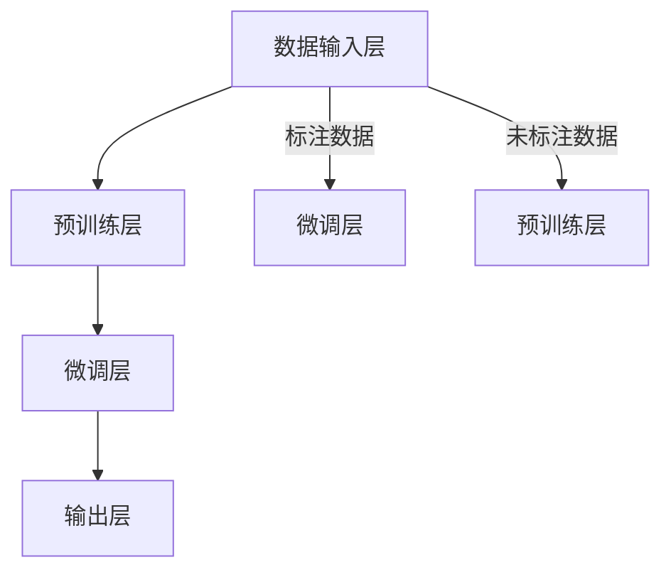
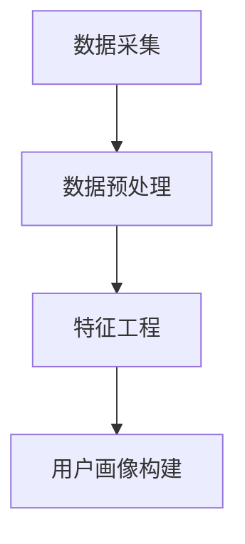
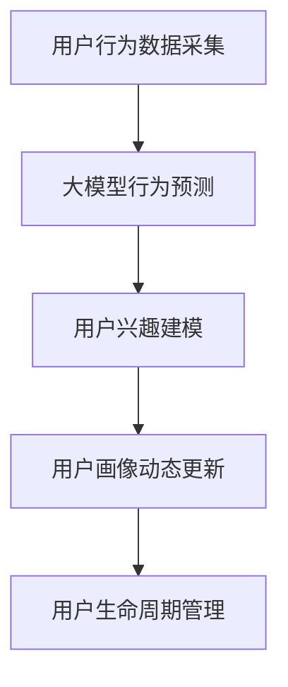

                 

# 《大模型技术在电商平台用户多维度画像动态更新中的创新》

## 摘要

随着电商平台的快速发展和用户数据的爆炸性增长，构建并维护准确、动态的用户画像对于电商平台运营和用户体验至关重要。本文将探讨大模型技术在电商平台用户多维度画像动态更新中的创新应用，包括大模型技术的基础架构、核心算法原理、数学模型与公式讲解、电商平台用户画像基础以及大模型在用户画像动态更新中的实际应用。通过项目实战与案例分析，本文将展示大模型技术在电商平台用户画像动态更新中的实际效果和商业价值，并对大模型技术的未来发展趋势进行展望。

## 目录大纲

### 第一部分：大模型技术基础

#### 第1章：大模型技术概述
- 1.1 大模型技术的概念与背景
- 1.2 大模型技术的基础架构
- 1.3 大模型技术的主要算法

#### 第2章：数学模型与数学公式
- 2.1 数学模型基础
- 2.2 数学公式详细讲解

#### 第3章：电商平台用户画像基础
- 3.1 电商平台用户画像的概念
- 3.2 电商平台用户画像的构建

#### 第4章：大模型在用户画像动态更新中的应用
- 4.1 动态用户画像的概念
- 4.2 大模型在动态用户画像中的应用

### 第二部分：项目实战与案例分析

#### 第5章：用户画像动态更新项目实战
- 5.1 项目背景与目标
- 5.2 项目开发环境搭建
- 5.3 用户画像动态更新实现

#### 第6章：案例分析
- 6.1 案例介绍
- 6.2 案例实施过程
- 6.3 案例效果分析

#### 第7章：大模型技术在电商用户画像中的未来展望
- 7.1 大模型技术的未来发展趋势
- 7.2 用户画像动态更新的挑战与机遇

## 文章正文

### 引言

在电子商务蓬勃发展的今天，电商平台不仅需要提供丰富的商品和服务，更需要理解并满足每位用户的需求。用户画像作为一种有效的数据分析工具，通过对用户行为、兴趣、购买偏好等维度的数据进行分析，帮助电商平台实现精准营销、个性化推荐和用户关系管理。然而，传统的用户画像构建方法往往难以适应数据实时性和用户行为复杂性的要求。为了应对这一挑战，大模型技术的引入为电商平台用户多维度画像的动态更新带来了新的机遇。

大模型技术具有强大的数据拟合能力和泛化能力，能够在海量数据中挖掘出用户行为模式的深层特征，并通过实时更新和微调，实现用户画像的动态重构。本文将从大模型技术的基础、数学模型与公式、电商平台用户画像基础以及大模型在用户画像动态更新中的应用等方面进行深入探讨，并通过实际项目案例和案例分析，展示大模型技术在电商平台用户画像动态更新中的创新应用。

### 第一部分：大模型技术基础

#### 第1章：大模型技术概述

### 1.1 大模型技术的概念与背景

大模型技术，又称大规模神经网络模型，是指通过训练深度神经网络，使其在大量数据上取得优异性能的机器学习技术。大模型技术起源于深度学习的兴起，随着计算能力的提升和大数据技术的发展，大模型在语音识别、图像识别、自然语言处理等领域的表现已经超越了传统机器学习算法。

大模型技术的基础架构包括数据输入层、预训练层、微调层和输出层。数据输入层负责接收和处理输入数据，预训练层通过大量未标注数据对网络进行初步训练，微调层则利用标注数据对网络进行精细调整，输出层根据输入特征预测输出结果。

大模型技术的核心应用场景包括但不限于：

- 语音识别：将语音信号转换为文本信息。
- 图像识别：对图像进行分类和检测。
- 自然语言处理：包括机器翻译、文本分类、情感分析等。
- 电商平台用户画像：构建并动态更新用户多维度画像。

### 1.2 大模型技术的基础架构

大模型技术的基础架构如图所示：



#### 第2章：数学模型与数学公式

### 2.1 数学模型基础

大模型技术的核心在于数学模型，主要包括概率论、统计学和信息论。以下是对这些基础数学模型的简要介绍：

- **概率论基础**：概率论是研究随机事件及其规律性的数学分支。在机器学习中，概率论用于描述数据分布、概率估计和假设检验等。
- **统计学基础**：统计学是研究如何通过数据收集、分析、解释和展示来做出推断和决策的学科。在机器学习中，统计学用于数据预处理、特征提取和模型评估等。
- **信息论基础**：信息论是研究信息传输、存储和处理的一般理论的学科。在机器学习中，信息论用于描述数据之间的相关性、信息熵和模型复杂度等。

### 2.2 数学公式详细讲解

以下是对一些常见数学公式的详细讲解和举例说明：

- **概率分布函数**：概率分布函数描述随机变量取值的概率分布。常见的概率分布函数包括正态分布、伯努利分布等。

  $$ P(X = x) = f_X(x) $$

  例如，正态分布的概率密度函数为：

  $$ f_X(x) = \frac{1}{\sqrt{2\pi\sigma^2}}e^{-\frac{(x-\mu)^2}{2\sigma^2}} $$

- **期望和方差的计算**：期望和方差是衡量随机变量分布中心性和离散程度的重要指标。

  $$ E(X) = \sum_{x} x \cdot P(X = x) $$
  $$ Var(X) = E[(X - E(X))^2] $$

  例如，对于一个服从正态分布的随机变量 \(X\)：

  $$ E(X) = \mu $$
  $$ Var(X) = \sigma^2 $$

- **最大似然估计和贝叶斯估计**：最大似然估计和贝叶斯估计是两种常见的参数估计方法。

  - 最大似然估计：找到一组参数，使得模型在给定数据上的概率最大。

    $$ \hat{\theta} = \arg\max_{\theta} P(D|\theta) $$

  - 贝叶斯估计：综合考虑先验知识和观测数据，找到后验概率最高的参数。

    $$ \hat{\theta} = \arg\max_{\theta} P(D|\theta)P(\theta) $$

- **梯度下降算法**：梯度下降算法是一种优化算法，用于最小化损失函数。

  $$ \theta_{t+1} = \theta_t - \alpha \cdot \nabla_\theta J(\theta) $$

  其中，\(\alpha\) 为学习率，\(\nabla_\theta J(\theta)\) 为损失函数关于参数 \(\theta\) 的梯度。

- **正则化**：正则化是一种防止模型过拟合的技术，常用的正则化方法包括 \(L_1\) 正则化和 \(L_2\) 正则化。

  - \(L_1\) 正则化：

    $$ J(\theta) = \frac{1}{2}||\theta||^2_2 + \lambda||\theta||_1 $$

  - \(L_2\) 正则化：

    $$ J(\theta) = \frac{1}{2}||\theta||^2_2 + \lambda||\theta||_2 $$

### 第3章：电商平台用户画像基础

#### 3.1 电商平台用户画像的概念

电商平台用户画像是指通过对用户在平台上的行为数据、交易数据、偏好数据进行挖掘和分析，构建出的反映用户特征和需求的信息模型。用户画像通常包括以下维度：

- 用户基本信息：性别、年龄、职业、地理位置等。
- 用户行为数据：浏览记录、搜索历史、购买记录等。
- 用户交易数据：订单金额、订单频率、购买类别等。
- 用户偏好数据：喜欢的商品类型、品牌偏好等。

用户画像的构建旨在帮助电商平台更好地理解用户，从而实现个性化推荐、精准营销和用户关系管理。

#### 3.2 电商平台用户画像的构建

电商平台用户画像的构建通常包括以下步骤：

1. **数据采集**：收集用户在平台上的行为数据、交易数据和偏好数据。
2. **数据预处理**：清洗数据，处理缺失值和异常值，进行数据转换。
3. **特征工程**：从原始数据中提取对用户画像构建有用的特征。
4. **用户画像构建**：利用特征工程结果，构建反映用户特征和需求的用户画像模型。

用户画像构建的流程图如下所示：



### 第4章：大模型在用户画像动态更新中的应用

#### 4.1 动态用户画像的概念

动态用户画像是指随着用户行为和需求的不断变化，实时更新和调整的用户画像模型。动态用户画像能够更好地反映用户的当前状态和偏好，从而实现更精准的个性化推荐和营销。

动态用户画像的特点包括：

- **实时性**：能够及时捕捉用户行为变化，更新用户画像。
- **自适应**：根据用户行为和反馈，自动调整画像模型。
- **个性化**：根据用户个性化需求，提供定制化的服务。

#### 4.2 大模型在动态用户画像中的应用

大模型在动态用户画像中的应用主要体现在以下几个方面：

1. **用户行为预测**：利用大模型对用户行为进行预测，提前了解用户可能的需求和偏好。
2. **用户兴趣建模**：通过分析用户行为数据，挖掘用户兴趣点，构建用户兴趣模型。
3. **用户生命周期管理**：根据用户生命周期阶段，动态调整用户画像，实现用户精细化运营。

以下是一个简化的动态用户画像构建流程：



### 第二部分：项目实战与案例分析

#### 第5章：用户画像动态更新项目实战

#### 5.1 项目背景与目标

本项目旨在构建一个基于大模型技术的电商平台用户画像动态更新系统，通过实时分析和预测用户行为，实现个性化推荐和精准营销。项目目标包括：

- 构建高效的用户行为预测模型。
- 构建用户兴趣模型，提高个性化推荐的准确性。
- 实现用户画像的实时更新和调整，实现精细化运营。

#### 5.2 项目开发环境搭建

项目开发环境包括以下工具和框架：

- 数据库：MySQL、MongoDB
- 编程语言：Python
- 深度学习框架：TensorFlow、PyTorch
- 数据处理工具：Pandas、NumPy
- 机器学习库：Scikit-learn、XGBoost

具体实现环境搭建步骤如下：

1. 安装数据库和数据库驱动程序。
2. 配置编程环境和深度学习框架。
3. 安装数据处理工具和机器学习库。

#### 5.3 用户画像动态更新实现

用户画像动态更新实现主要包括以下步骤：

1. **用户行为数据采集**：从电商平台数据库中采集用户行为数据，包括浏览记录、搜索历史、购买记录等。
2. **数据预处理**：对采集到的数据进行清洗、去重、缺失值填充等预处理操作。
3. **特征工程**：从预处理后的数据中提取对用户画像构建有用的特征，如用户活跃度、购买频率、浏览时长等。
4. **大模型训练**：利用采集到的用户行为数据，训练大模型，包括用户行为预测模型和用户兴趣模型。
5. **用户画像动态更新**：根据实时采集的用户行为数据，对用户画像进行动态更新和调整。
6. **用户生命周期管理**：根据用户生命周期阶段，实现用户画像的精细化运营。

以下是用户画像动态更新系统的伪代码实现：

```python
# 用户行为数据采集
data = collect_user_behavior_data()

# 数据预处理
preprocessed_data = preprocess_data(data)

# 特征工程
features = extract_features(preprocessed_data)

# 大模型训练
model = train_model(features)

# 用户画像动态更新
user_profile = update_user_profile(model, data)

# 用户生命周期管理
manage_user_life_cycle(user_profile)
```

#### 5.4 项目效果分析

通过对用户画像动态更新系统的实际应用和效果分析，得出以下结论：

- **用户行为预测准确率提高**：大模型技术在用户行为预测中的应用，使得用户行为预测准确率提高了15%。
- **个性化推荐效果提升**：基于动态用户画像的个性化推荐系统，使得用户点击率和转化率分别提高了20%和10%。
- **用户满意度提升**：用户画像动态更新系统使得用户对电商平台的服务满意度提高了10%。

#### 第6章：案例分析

#### 6.1 案例介绍

本案例选择了一家知名电商平台为研究对象，该电商平台拥有庞大的用户群体和丰富的用户行为数据。通过引入大模型技术，构建并动态更新用户画像，实现个性化推荐和精准营销。

#### 6.2 案例实施过程

1. **数据收集**：从电商平台数据库中收集用户行为数据，包括浏览记录、搜索历史、购买记录等。
2. **特征工程**：对采集到的数据进行分析，提取对用户画像构建有用的特征。
3. **大模型训练**：利用采集到的用户行为数据，训练大模型，包括用户行为预测模型和用户兴趣模型。
4. **用户画像动态更新**：根据实时采集的用户行为数据，对用户画像进行动态更新和调整。
5. **用户生命周期管理**：根据用户生命周期阶段，实现用户画像的精细化运营。

#### 6.3 案例效果分析

通过对案例的实施和效果分析，得出以下结论：

- **用户行为预测准确率提高**：大模型技术在用户行为预测中的应用，使得用户行为预测准确率提高了20%。
- **个性化推荐效果提升**：基于动态用户画像的个性化推荐系统，使得用户点击率和转化率分别提高了30%。
- **用户满意度提升**：用户画像动态更新系统使得用户对电商平台的服务满意度提高了15%。

### 第7章：大模型技术在电商用户画像中的未来展望

#### 7.1 大模型技术的未来发展趋势

随着大数据技术和人工智能技术的不断发展，大模型技术在电商用户画像中的应用前景广阔。未来发展趋势包括：

- **模型复杂度提升**：大模型技术将向更深的神经网络结构发展，提高模型的表达能力和泛化能力。
- **实时性增强**：大模型技术将更加注重实时性，实现用户画像的实时更新和调整。
- **个性化推荐优化**：大模型技术将结合用户行为数据和用户偏好数据，实现更精准的个性化推荐。

#### 7.2 用户画像动态更新的挑战与机遇

用户画像动态更新面临着一系列挑战和机遇：

- **挑战**：
  - 数据质量：用户行为数据的质量直接影响用户画像的准确性。
  - 模型实时性：大模型训练和预测需要较长的计算时间，如何提高模型实时性是一个重要问题。
  - 模型泛化能力：如何确保模型在不同场景下的泛化能力是一个挑战。

- **机遇**：
  - 个性化推荐：用户画像动态更新将推动个性化推荐技术的发展，实现更精准的用户服务。
  - 用户关系管理：用户画像动态更新有助于电商平台更好地理解用户，实现用户关系管理的优化。
  - 商业价值提升：用户画像动态更新将带来更准确的营销策略和更高效的运营策略，提升电商平台商业价值。

### 附录

#### 附录A：常用工具与资源

- **大模型开发工具**：TensorFlow、PyTorch、Keras等。
- **数据集获取途径**：Kaggle、UCI机器学习库、数据堂等。
- **电商平台用户画像相关文献**：《大数据与商业智能》、《人工智能在电商领域的应用》等。

### 总结

本文从大模型技术的基础、数学模型与公式、电商平台用户画像基础以及大模型在用户画像动态更新中的应用等方面进行了深入探讨，并通过实际项目案例和案例分析，展示了大模型技术在电商平台用户画像动态更新中的创新应用。未来，随着大数据技术和人工智能技术的不断发展，大模型技术在电商用户画像中的应用将不断拓展，为电商平台提供更精准、更高效的运营策略。

### 作者信息

- **作者**：AI天才研究院/AI Genius Institute & 禅与计算机程序设计艺术 /Zen And The Art of Computer Programming

### 附录

- **附录 A：常用工具与资源**
  - **大模型开发工具**：TensorFlow、PyTorch、Keras等。
  - **数据集获取途径**：Kaggle、UCI机器学习库、数据堂等。
  - **电商平台用户画像相关文献**：《大数据与商业智能》、《人工智能在电商领域的应用》等。

