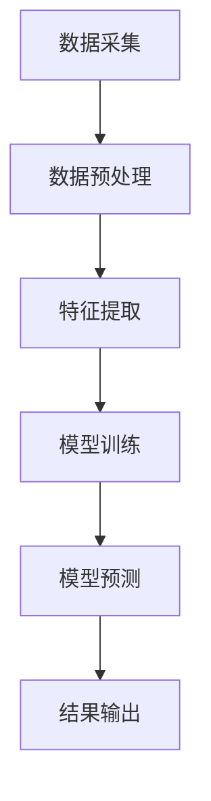

                 

# 《大模型推荐系统的实时性能优化》

> 关键词：大模型推荐系统、实时性能优化、模型压缩、并行化、服务化、缓存技术

> 摘要：本文将深入探讨大模型推荐系统的实时性能优化问题。随着推荐系统的广泛应用，其性能优化变得越来越重要。本文将从实时性能优化的重要性、优化策略、核心概念与架构、优化方法、案例分析以及最佳实践和未来展望等方面展开讨论，旨在为读者提供全面、深入的实时性能优化指导。

## 目录大纲

1. 引言与背景
   1.1 大模型推荐系统概述
   1.2 实时性能优化概述
   1.3 核心概念与架构

2. 实时性能优化方法
   2.1 模型压缩技术
   2.2 模型并行化技术
   2.3 模型服务化与缓存技术
   2.4 实时索引与搜索技术

3. 实时性能优化案例分析
   3.1 案例介绍
   3.2 代码解读

4. 最佳实践与展望
   4.1 最佳实践
   4.2 未来展望

5. 附录
   5.1 相关工具与资源
   5.2 学习资源

### 引言与背景

在当今数字化时代，推荐系统已经成为许多在线平台的核心功能之一。从社交媒体到电子商务，推荐系统为用户提供了个性化内容，提高了用户体验，并帮助企业增加了用户粘性和销售额。然而，随着推荐系统规模的不断扩大，大模型推荐系统的实时性能优化成为一个亟待解决的问题。

**1.1 大模型推荐系统的基本概念**

大模型推荐系统是指使用大型神经网络模型进行推荐的系统。这些模型通常包含数百万甚至数十亿的参数，能够在海量的数据中进行复杂的特征提取和预测。大模型推荐系统的核心组成部分包括：

- **数据层**：负责数据采集、预处理和存储。
- **模型层**：包含大规模神经网络模型，负责进行特征提取、模型训练和预测。
- **服务层**：负责将模型预测结果转化为用户可理解的内容，并对外提供API接口。

**1.2 大模型推荐系统的优势**

- **高精度**：通过深度学习算法，大模型推荐系统能够在海量数据中发现复杂的关系，提供更准确的推荐结果。
- **高效性**：大模型推荐系统在训练和预测过程中采用并行计算和分布式存储技术，大大提高了系统的运行效率。
- **灵活性**：大模型推荐系统可以根据业务需求灵活调整模型结构和参数，实现快速迭代和优化。

**1.3 大模型推荐系统的历史与发展**

大模型推荐系统的发展经历了几个阶段：

- **传统推荐系统**：基于规则和简单算法的推荐系统，如基于内容的推荐和协同过滤。
- **深度学习推荐系统**：引入深度学习算法，如卷积神经网络（CNN）和循环神经网络（RNN），提高推荐精度。
- **大模型推荐系统**：使用大规模神经网络模型进行推荐，实现更复杂和高效的推荐。

国内外主流大模型推荐系统应用案例包括：

- **亚马逊**：通过大模型推荐系统为用户提供个性化购物建议。
- **腾讯**：使用大模型推荐系统为用户推荐个性化新闻、视频和社交内容。
- **Netflix**：利用大模型推荐系统为用户提供个性化的视频推荐。

**1.4 大模型推荐系统的挑战**

尽管大模型推荐系统具有许多优势，但也面临着一些挑战：

- **实时性能问题**：大模型推荐系统通常需要处理大量的实时数据，对系统的实时性能要求较高。
- **数据隐私与安全**：推荐系统需要处理用户隐私数据，需要确保数据的安全性和隐私保护。
- **模型解释性**：大模型推荐系统的预测结果往往难以解释，需要提高模型的透明性和可解释性。

### 实时性能优化概述

**2.1 实时性能优化的重要性**

实时性能优化是推荐系统成功的关键因素之一。实时性能直接影响到用户体验和业务价值：

- **用户体验**：实时推荐可以提供更准确的个性化内容，提高用户满意度。
- **业务价值**：实时推荐可以帮助企业提高用户粘性、增加销售额和降低运营成本。

**2.2 实时性能优化策略**

实时性能优化可以从以下几个方面进行：

- **模型压缩**：通过压缩模型大小和参数数量，降低计算成本和存储需求。
- **模型并行化**：利用并行计算和分布式存储技术，提高模型训练和预测的效率。
- **模型服务化**：将模型部署为服务，实现快速部署和动态调整。
- **缓存与索引技术**：利用缓存和索引技术，加快数据检索和处理速度。
- **实时索引与搜索技术**：使用实时索引和搜索技术，提高推荐系统的响应速度。

**2.3 实时性能优化目标与关键指标**

实时性能优化的目标主要包括：

- **响应时间**：系统处理请求的平均时间。
- **吞吐量**：系统每秒处理的请求数量。
- **准确率**：推荐结果的准确性。
- **稳定性**：系统的运行稳定性。

关键指标包括：

- **QPS（每秒查询次数）**：衡量系统的吞吐量。
- **响应时间**：衡量系统的响应速度。
- **TPS（每秒事务次数）**：衡量系统的处理能力。
- **吞吐量**：衡量系统的处理能力。
- **延迟**：衡量系统的延迟。

### 核心概念与架构

**3.1 大模型推荐系统的架构**

大模型推荐系统通常包括以下层次：

- **数据层**：负责数据采集、预处理和存储。
- **模型层**：负责模型训练、优化和预测。
- **服务层**：负责将模型预测结果转化为用户可理解的内容，并对外提供API接口。

**3.2 Mermaid流程图**

以下是一个Mermaid流程图，展示了大模型推荐系统的数据处理流程：



**3.3 核心算法原理**

大模型推荐系统的核心算法通常包括以下几种：

- **基于内容的推荐**：根据用户历史行为和内容特征进行推荐。
- **协同过滤推荐**：根据用户行为和内容相似度进行推荐。

以下是协同过滤推荐算法的核心算法原理：

```python
# 基于用户的协同过滤推荐算法
def collaborative_filtering(user_similarity_matrix, user_profile, item_profile):
    # 计算用户之间的相似度
    user_similarity = user_similarity_matrix[user_profile]
    # 计算每个用户的预测评分
    user_predictions = np.dot(user_similarity, item_profile)
    return user_predictions
```

**3.4 数学模型与公式**

以下是一些常用的数学模型和公式：

- **相似度计算**：

  $$ 
  \text{Cosine Similarity} = \frac{\text{A.B}}{\|\text{A}\|\|\text{B}\|}
  $$

- **矩阵分解**：

  $$ 
  X = UV^T 
  $$

### 实时性能优化方法

**4.1 模型压缩技术**

模型压缩技术是提高大模型推荐系统实时性能的有效方法之一。以下是一些常见的模型压缩技术：

- **剪枝**：通过移除网络中不重要的连接和层，减少模型大小和计算复杂度。
- **量化**：将模型的权重和激活值从浮点数转换为较低精度的数值，降低模型大小和存储需求。
- **知识蒸馏**：通过训练一个较小的学生模型来模仿较大的教师模型的预测能力，实现模型压缩。

**4.2 模型并行化技术**

模型并行化技术是将模型训练和预测任务分解为多个子任务，并在多个计算节点上并行执行。以下是一些常见的模型并行化技术：

- **数据并行**：将数据集划分为多个部分，每个计算节点处理一部分数据，并在全局梯度计算中进行同步。
- **模型并行**：将模型分解为多个子模型，每个计算节点处理一个子模型，并在全局梯度计算中进行同步。
- **任务并行**：将推荐任务分解为多个子任务，每个计算节点处理一个子任务，并独立进行模型训练和预测。

**4.3 模型服务化与缓存技术**

模型服务化是将模型部署为服务，并通过API接口进行调用。以下是一些常见的模型服务化与缓存技术：

- **模型部署**：将训练好的模型部署到服务端，并提供API接口供其他服务调用。
- **模型热更新**：在模型服务运行过程中，实时更新模型参数，实现动态调整。
- **缓存技术**：利用缓存技术，存储常用数据的预计算结果，减少计算时间和存储需求。

**4.4 实时索引与搜索技术**

实时索引与搜索技术是提高推荐系统实时性能的关键。以下是一些常见的实时索引与搜索技术：

- **倒排索引**：将数据项的索引反向映射到其原始位置，实现快速查询。
- **全文索引**：将数据文本进行分词和索引，实现全文搜索。

### 实时性能优化案例分析

**5.1 案例介绍**

以下是一个实时性能优化案例分析：

- **应用场景**：一家电子商务平台使用大模型推荐系统为用户提供个性化商品推荐。
- **技术实现**：通过模型压缩、模型并行化、模型服务化和缓存技术进行实时性能优化。

**5.2 代码解读**

以下是实现实时性能优化的一些关键代码：

```python
# 模型压缩
from tensorflow.keras.models import load_model

model = load_model('compressed_model.h5')

# 模型并行化
import tensorflow as tf

strategy = tf.distribute.MirroredStrategy()

with strategy.scope():
    model = load_model('parallel_model.h5')

# 模型服务化
from flask import Flask, request, jsonify

app = Flask(__name__)

@app.route('/recommend', methods=['POST'])
def recommend():
    data = request.get_json()
    user_profile = data['user_profile']
    item_profile = data['item_profile']
    predictions = model.predict([user_profile, item_profile])
    return jsonify(predictions)

if __name__ == '__main__':
    app.run(debug=True)

# 缓存技术
from cachetools import LRUCache

cache = LRUCache(maxsize=1000)

def get_item_profile(item_id):
    if item_id in cache:
        return cache[item_id]
    else:
        profile = load_item_profile_from_database(item_id)
        cache[item_id] = profile
        return profile
```

### 最佳实践与展望

**6.1 实时性能优化最佳实践**

以下是一些实时性能优化的最佳实践：

- **技术选型**：根据业务需求和硬件资源，选择合适的模型压缩、并行化和缓存技术。
- **实施步骤**：逐步实施实时性能优化措施，并进行性能测试和调优。
- **持续优化**：定期监控和优化系统的实时性能，以适应不断变化的需求和硬件环境。

**6.2 持续优化与监控**

- **性能监控**：使用监控工具实时监控系统的性能指标，如响应时间、吞吐量和延迟。
- **自动化测试**：使用自动化测试工具进行性能测试，快速发现和解决问题。

**7.1 实时性能优化趋势**

实时性能优化的发展趋势包括：

- **高效算法**：研究和应用更高效的模型训练和预测算法。
- **硬件加速**：利用GPU、TPU等硬件加速技术，提高模型训练和预测的效率。
- **分布式计算**：利用分布式计算架构，实现大规模数据的实时处理。

**7.2 人工智能与推荐系统的发展**

人工智能与推荐系统的未来发展趋势包括：

- **多模态推荐**：结合多种数据类型（如图像、文本、音频）进行推荐。
- **深度学习**：应用深度学习技术，提高推荐模型的准确性和灵活性。
- **融合与创新**：与其他领域（如自然语言处理、计算机视觉）进行融合，推动推荐系统的创新。

### 附录

**附录 A：相关工具与资源**

以下是一些常用的工具和资源：

- **深度学习框架**：TensorFlow、PyTorch、MXNet
- **推荐系统库**：Surprise、LightFM、TensorDecomposition
- **在线课程**：Coursera、edX、Udacity
- **学术论文**：arXiv、IEEE Xplore、ACM Digital Library
- **开源代码**：GitHub、GitLab、Bitbucket

**附录 B：学习资源**

以下是一些推荐的学习资源：

- **《推荐系统实践》**：由李航著，介绍了推荐系统的基本概念和技术。
- **《深度学习推荐系统》**：由李航和杨强合著，深入探讨了深度学习在推荐系统中的应用。
- **《TensorFlow实战》**：由肖凯著，介绍了TensorFlow在深度学习中的应用。
- **《Python深度学习》**：由弗朗索瓦·肖莱著，介绍了深度学习在Python中的应用。

### 结语

本文从实时性能优化的重要性、优化策略、核心概念与架构、优化方法、案例分析以及最佳实践和未来展望等方面，全面探讨了大模型推荐系统的实时性能优化问题。随着推荐系统的广泛应用，实时性能优化将成为推荐系统发展的关键因素。希望本文能为读者提供有价值的参考和启示。在未来，我们期待更多创新的实时性能优化技术和方法的出现，推动推荐系统的进一步发展。作者：AI天才研究院/AI Genius Institute & 禅与计算机程序设计艺术/Zen And The Art of Computer Programming。

